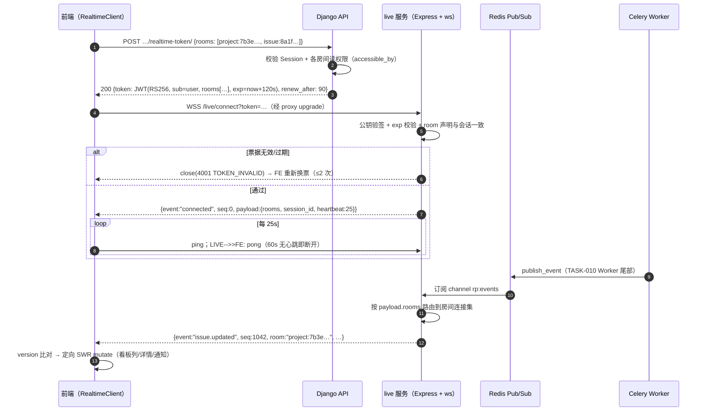
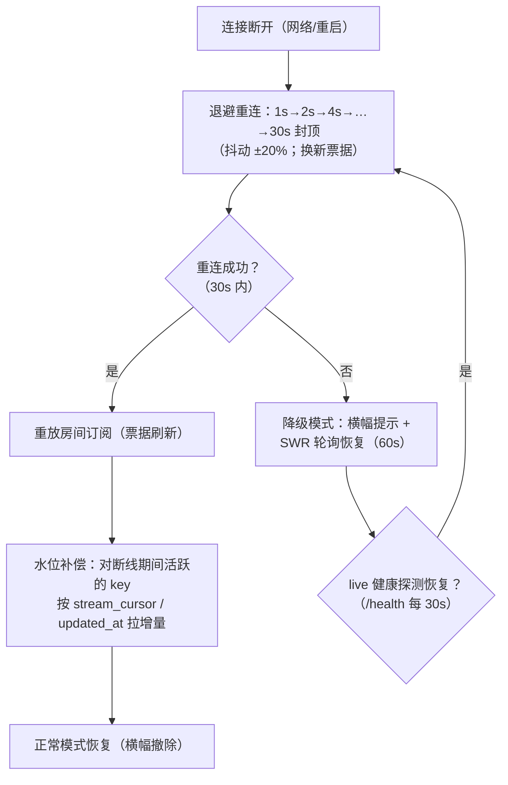
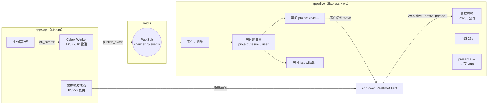

# WebSocket 实时推送 / 多人数据同步

| 元信息项 | 内容 |
| --- | --- |
| 文档编号 | COLLAB-004 |
| 所属迭代 | Sprint 3：高级视图 + 实时协作（第 5 周） |
| 优先级 | P2（标准版完整级 · **实时层的奠基迭代**） |
| 所属模块 | M8-COLLAB｜实时协作与通知 |
| 文档状态 | 待评审（Draft） |
| 最后更新日期 | 2026-09-01 |
| 上游依据 | `docs/需求文档.md` §3.8（实时消息推送、多人实时协同编辑、实时看板/任务数据同步）、§8.2 协作通知 P2 列；§五（live 按项目/实体隔离房间、精准推送） |
| 前置依赖 | **`INFRA-002`（live 服务容器：Express + ws，`/live` 经 proxy WebSocket upgrade，`API_INTERNAL_URL`/`REDIS_URL` 注入，healthcheck `/health`）**、`COLLAB-001`（Notification 模型与轮询降级通道）、`COLLAB-003`（`stream_cursor` 水位契约）、`TASK-010`（事件管道与 Worker 尾部扇出挂点）、`INFRA-004`（信封与错误码） |
| 下游依赖 | `BOARD-003/004`（看板实时拖拽同步消费 `board.moved`）、`GANTT-001`（甘特实时刷新）、P3 协同编辑（Hocuspocus 复用 live 进程与票据体系——本文档不实现 Yjs）、`INTG-002`（Webhook 与推送共用事件源） |
| 架构基线 | [`api-conventions.md`](../architecture/api-conventions.md) **§9.5 live 协同票据（短时效 JWT / RS256 / 120s / room 声明）**、§8（`SERVER_LIVE_SERVICE_UNAVAILABLE`）、§4（信封）；[`tech-stack.md`](../architecture/tech-stack.md)（Node live 服务）；[`monorepo-structure.md`](../architecture/monorepo-structure.md)（apps/live 结构） |
| 竞品参考 | Plane（live 服务 + silo 家庭：silo-websocket 承载 socket.io 房间广播） · Ones（企业级实时与消息触达） |
| 工作量估算 | 后端 3 人日（Django 1 + live 2）/ 前端 3 人日 / 联调与测试 2 人日，合计 **8 人日** |

> **范围声明**：交付**业务事件实时推送与多人数据同步**（看板/列表/详情/通知/动态流的秒级收敛），传输层为独立 `apps/live` 服务（Express + `ws`）。**不含** Yjs CRDT 协同编辑与协作光标（P3，届时 Hocuspocus 挂入同进程复用鉴权与房间模型）；不含消息已送达回执与离线消息补投（断线补偿拉取承担，见 §2.4）；通知多通道路由（邮件/IM）归 P3。

---

## 1. 概述

### 1.1 功能定位

P1/P2 至今的一切数据视图都是**拉**模式：列表 60s SWR、通知 30s 轮询、动态流定时刷新。两人同时拖看板时，对方最多 60 秒后才看到变化——「同一个页面，两个世界」。本迭代把**变更的触达**从分钟级轮询升级为秒级推送：

- **谁在变**：一切写操作（`TASK-010` 事件矩阵）经 Worker 尾部扇出到 live 服务；
- **推给谁**：按「房间」隔离——项目房间（看板/列表/动态流）与任务房间（详情/评论），权限在换票时校验；
- **推什么**：紧凑事件载荷（实体 ID + 版本 + 变更摘要），前端收到后**定向 SWR revalidate**——「推送负责知道、拉取负责拿到」，不推送全量实体。

三条设计红线先立：

1. **推送是提示不是数据源**——事件只携带「什么变了」，正文一律走既有 REST 拉取收敛。掉一条事件的代价是「晚一轮 revalidate」，而非数据错误；
2. **鉴权不信任连接**——live 不自建账号体系，连接凭证是 api 签发的**短时效 JWT 票据**（120s，RS256 私钥仅 api 持有；live 持公钥验签，`api-conventions.md` §9.5 原文模式）；
3. **降级一等公民**——live 不可达（`SERVER_LIVE_SERVICE_UNAVAILABLE`）时前端自动回落 P1 轮询通道，功能零损失、时效退化为分钟级。

### 1.2 交付内容

| # | 能力 | 说明 |
| --- | --- | --- |
| 1 | live 业务推送服务 | `apps/live`：`ws` 房间管理（`project:{id}` / `issue:{id}`）、票据验签、事件广播、心跳 |
| 2 | 票据签发端点 | `POST …/realtime-token/`（项目/任务域声明 + 120s 有效期 + 续签） |
| 3 | 事件协议 | 6 类核心事件（§2.3）统一信封：`event / seq / room / payload / occurred_at` |
| 4 | Worker 扇出 | `TASK-010` Worker 尾部 `publish_event` → Redis Pub/Sub → live 房间广播（api 与 live 唯一通道） |
| 5 | 前端实时层 | `RealtimeClient`（连接/房间/重连/水位补偿）+ `LiveEventBus → SWR mutate` 定向失效 |
| 6 | 在线感知（presence） | 项目房间内成员在线态（头像列 + 「正在看板」轻提示） |
| 7 | 断线重连 | 指数退避重连 + `stream_cursor`/`updated_at` 水位补偿拉取（数据不丢） |
| 8 | 降级与观测 | live 健康探测失败 → 轮询模式（横幅提示）；连接指标（在线/房间数/事件速率）结构化日志 |

### 1.3 关键约定一：房间模型与订阅规则

| 房间 | 命名 | 订阅条件（换票时校验） | 典型消费视图 |
| --- | --- | --- | --- |
| 项目房间 | `project:{project_id}` | `project.read`（VIEWER+） | 看板、列表、动态流、项目设置 |
| 任务房间 | `issue:{issue_id}` | 任务可见（同详情权限） | 任务详情 Drawer、评论、动态 Tab |
| 个人房间 | `user:{user_id}` | 本人（票据 sub 即本人，恒可订） | 通知铃铛、工作台卡片 |

规则：**一个连接可同时加入多个房间**（票据声明「当前页面上下文」：项目 + 打开的任务 + 本人）；路由切换即换票重订（旧房间自动退出）——房间生命周期与页面上下文严格同构，杜绝「离开页面还在收事件」的幽灵订阅。

### 1.4 关键约定二：事件载荷最小化（提示语义）

```jsonc
// 完整信封（§2.3 逐类展开）
{ "event": "issue.updated", "seq": 1042, "room": "project:7b3e…",
  "payload": { "issue_id": "8a1f…", "version": "2026-09-05T06:32:00.114Z",
               "actor_id": "6c7d…", "brief": "state" },
  "occurred_at": "2026-09-05T06:32:00.220Z" }
```

- `version` = 实体 `updated_at`（Issue）/ 水位（流）——前端比对本地版本，**旧于本地则忽略**（乱序免疫）；
- `brief` = 变更域提示（字段族），前端据此选择**定向** revalidate（改 `state` 只刷看板列，不刷全文搜索）；
- 全量实体**永不上行广播**——带宽、序列化成本、权限二次过滤三重理由。

### 1.5 范围边界

| 能力 | 本文档（P2） | 归属 |
| --- | --- | --- |
| 项目/任务/个人房间推送 + presence | ✅ | — |
| 断线重连 + 水位补偿 | ✅ | — |
| live 降级轮询 | ✅ | — |
| 通知通道升级（铃铛秒级） | ✅（复用个人房间） | — |
| Yjs 协同编辑 / 协作光标 / presence 光标 | ❌（票据与房间模型为其预留） | P3（Hocuspocus 同进程） |
| 离线消息补投（未在线期间的逐条送达） | ❌（补偿拉取语义足够） | P3+ 评估 |
| 消息回执 / 已读回传 | ❌ | P3+ |
| 跨实例水平扩展（Redis Pub/Sub 扇出已天然支持多 live 副本） | ✅ 架构就绪（单副本部署） | 部署层按需扩 |
| 移动端推送（APNs/FCM） | ❌ | P4 |

### 1.6 前置依赖

| 依赖 | 内容 | 阻塞原因 |
| --- | --- | --- |
| `INFRA-002` | live 容器（Express 就位、`/live` upgrade、`API_INTERNAL_URL`、Redis 连接、`/health`） | 进程与网络拓扑 |
| `TASK-010` | 事件矩阵 + Worker 管道（扇出挂点在其尾部） | 事件源 |
| `COLLAB-003` | `stream_cursor` 水位 | 动态流补偿拉取 |
| `COLLAB-001` | 轮询通道与未读计数端点 | 降级路径（不能只有一条腿） |
| `INFRA-004` | RS256 密钥对配置项（`LIVE_JWT_PRIVATE_KEY`/公钥）、错误码注册 | 票据签发 |

### 1.7 竞品参考

| 竞品 | 参考点 | 处置 |
| --- | --- | --- |
| Plane | 独立 live 服务；社区版经 silo-websocket（socket.io）做房间广播；EE 的实时看板同步走同链路 | 架构同构（独立进程 + 房间 + 事件）；**鉴权升级为短时效票据**（Plane 社区版连接鉴权较弱） |
| Plane | 文档协同（Hocuspocus/Yjs）与业务推送同宿主 | 对齐预留：P3 协同编辑挂入本进程，复用票据/房间 |
| Ones | 企业实时触达与消息可靠性体系 | P2 交付「秒级收敛 + 可补偿」；企业级送达保证（回执/补投）P3+ |

---

## 2. 业务逻辑

### 2.1 连接建立与房间订阅全链路



### 2.2 断线重连与补偿（数据不丢的唯一承诺）



**补偿语义**：重连后前端对「断线窗口内可能有变化」的每个视图执行一次**带水位**的拉取（动态流用 `stream_cursor` 之后增量；实体用 `If-None-Match`/本地 `updated_at` 比对）——事件只是提示，**拉取的幂等性保证数据正确**；因此事件丢失的代价被压缩为「多一次拉取」。

### 2.3 事件协议（6 类核心 + 信封）

| event | room | 触发（事件源） | payload 要点 | 前端定向动作 |
| --- | --- | --- | --- | --- |
| `issue.updated` | project + 涉事 issue | Issue 任何字段变更（含 custom_fields） | issue_id / version / brief（字段族） | 看板列、列表行、详情 revalidate |
| `issue.state.changed` | project + issue | 状态流转（含拖拽） | issue_id / from_group / to_group | 看板列计数迁移动画；统计卡 |
| `board.moved` | project | 看板拖拽排序（sort_order） | issue_id / from_state / to_state / column_version | 同列其他卡片顺序修正 |
| `comment.created` | issue（+ project 摘要） | 评论/回复发表 | comment_id / issue_id / actor_id | 评论流乐观补齐；滚动提示 |
| `activity.appended` | project | `TASK-010` 落库 | stream_cursor（新水位） | 动态流增量拉取 / 浮条 |
| `notification.created` | user（个人房间） | 通知生成 | notification_id / unread_delta | 铃铛计数 +1；抽屉顶部划入 |

信封公共字段：`event / seq / room / payload / occurred_at`。`seq` 为**房间级单调递增**序号（live 内存维护，重启归零——仅用于乱序检测提示，不承担补偿语义，补偿靠水位，§2.2）。

### 2.4 业务规则表

| 编号 | 规则 | 判定位置 | 违反后果 |
| --- | --- | --- | --- |
| BR-01 | 连接必须持有效票据：RS256 验签 + `exp` 校验 + `rooms` 声明与会话 sub 一致；无效 close(4001)，前端重换票 ≤ 2 次后降级 | live onConnection | 断开 |
| BR-02 | 票据有效期 **120s**，连接期间每 **30s 静默续签**（`POST …/realtime-token/renew/`，滑动窗口）；续签失败 2 次主动断开走重连 | 前端定时器 | 断线重连 |
| BR-03 | 房间订阅域 = 换票时校验的读权限；**权限在票据期后变更（移出成员）由 live 周期复核**（每 60s 批量向 api 内部端点校验 rooms 有效性）→ 失效即踢出房间 | live 定时复核 | 房间剔除 + 断开(4003 FORBIDDEN) |
| BR-04 | 心跳 25s ping/pong；60s 无心跳服务端断开；前端 pong 超时 2 次视为断线进入重连 | 双向 | 断线重连 |
| BR-05 | 事件载荷 ≤ **2KB**（提示语义红线：超限即说明在推数据，评审拒绝）；全量实体禁入 payload | Worker 扇出前校验 | 丢弃 + ERROR 日志 |
| BR-06 | 事件不落库、不重放：唯一持久化痕迹是事件源本身的表（Issue/Notification/Activity）——推送链路无状态 | live | — |
| BR-07 | 前端收到事件必须先比对本地 `version`/水位，**旧于等于本地即忽略**；新于本地才触发定向 revalidate | 前端 | — |
| BR-08 | 事件不回显给操作者本人连接（`actor_id == sub` 跳过）——自己的乐观更新已就位 | live 广播过滤 | — |
| BR-09 | api→live 唯一通道 Redis Pub/Sub（channel `rp:events`）；**禁止 live 直连 PostgreSQL**（保持 live 无状态可横扩） | 架构约束 | — |
| BR-10 | 降级判定：连接失败累计 30s 或 `/health` 探测失败 → 前端切轮询（`COLLAB-001` 通道）+ 顶部横幅「实时同步暂停」；恢复自动切回且补偿拉取 | 前端 | — |
| BR-11 | presence 仅项目房间：进出广播 `presence.joined/left`（user 摘要 ≤200B）；「正在编辑」细粒度状态 P3 协同再上 | live | — |
| BR-12 | 每用户同 workspace 并发连接 ≤ 5（多标签页）；超出的新连接踢最旧(4000 DUP_SESSION) | live | 断开旧连接 |
| BR-13 | live 事件速率保护：单房间广播 > 200 msg/s 时聚合节流（100ms 窗口合批同类事件，`seq` 取最大）——批量拖拽 50 卡只广播聚合后若干包 | live | — |
| BR-14 | 全链路可观测：连接数/房间数/事件速率/断开原因码结构化日志（`INFRA-004` JSON 格式），`/health` 附 `connections/rooms` 指标 | live | — |

### 2.5 异常处理表

| 异常场景 | 触发条件 | 前端表现 | 后端/live 处理 | 错误码/关闭码 |
| --- | --- | --- | --- | --- |
| 票据无效/过期 | 验签失败/exp 过期 | 无感重换票（≤2 次）后降级 | close | 4001 TOKEN_INVALID |
| 权限失效（被移出） | 周期复核失败 | 断开 + 数据刷新后 404 导出 | 踢出房间 | 4003 FORBIDDEN |
| 心跳超时 | 60s 无 pong / 2 次 ping 超时 | 无感重连 | 服务端清理连接 | 4004 HEARTBEAT_TIMEOUT |
| 重复连接 | 第 6 个标签页 | 最旧标签页断开提示「已在别处建立连接」 | 踢旧 | 4000 DUP_SESSION |
| live 宕机 | 健康探测失败 | 横幅 + 轮询模式 | api 侧无感知（Redis 发布无订阅者，事件自然丢弃） | `SERVER_LIVE_SERVICE_UNAVAILABLE`（HTTP 探测端点） |
| 事件风暴 | 房间 > 200 msg/s | 无感（合批） | 节流聚合（BR-13） | — |
| Redis 断连 | live↔Redis 失败 | 事件停达（轮询兜底） | live 健康置 FAIL → `/health` 503 | — |
| 换票 401 | Session 过期 | 走 `AUTH_*` 全局登出流 | api | `AUTH_SESSION_EXPIRED` |

### 2.6 边界条件表

| 边界场景 | 限制值 | 超出处理方式 |
| --- | --- | --- |
| 单连接房间数 | 10（页面上下文上限） | 拒订 + WARN |
| 票据 rooms 声明 | 10 | 400 |
| 心跳间隔 | 25s（pong 容忍 60s） | 断开 |
| 重连退避 | 1s 起 ×2 至 30s 封顶 | 降级轮询 |
| 单房间连接数 | 500（通知型广播扇出上限） | 超出分片广播 |
| 事件载荷 | 2KB | 丢弃 + ERROR |
| 事件速率 | 200 msg/s/房间 | 合批节流 |
| 断线窗口补偿 | 按视图水位拉取（无逐条补投） | 幂等拉取 |

---

## 3. UI/UX 设计

### 3.1 顶栏在线成员列（presence 消费位）

```
┌────────────────────────────────────────────────────────────────────┐
│ 项目看板    [👤张三] [👤李四●] [👤王五] +2        实时 ●  ⓘ 帮助    │
└────────────────────────────────────────────────────────────────────┘
  ● = 绿点（在线，25s 心跳内）   头像灰度 = 离线（保留 5 分钟缓存位）
  实时 ● = 连接状态指示（绿=已连 / 黄=重连中 / 灰=已降级轮询）
```

| 元素 | 规格 |
| --- | --- |
| 头像列 | 项目房间 presence 集（≤7 + `+N`）；hover 弹成员卡（在线态 + 所在视图提示「正在看板」） |
| 连接指示 | 三态圆点 + 文案（正常隐藏文案）；点击弹连接详情（房间/延迟/重连次数） |
| 降级横幅 | `realtime 暂停 · 已切换为定时刷新` 常驻黄条（可关）；恢复自动撤除 |

### 3.2 实时看板同步（核心消费场景）

```
 场景：李四拖动「RBT-128」从 待办 → 进行中（张三同时在看同一看板）

 张三屏幕（< 1s 内）：
 ┌───────────────┬───────────────┬───────────────┐
 │ 待办           │ 进行中         │ 已完成        │
 │ RBT-130       │ RBT-131       │ RBT-201       │
 │               │ ▓ RBT-128 ◀── │               │
 │               │  (淡入+列计数   │               │
 │               │   5→6 动画)    │               │
 │ 列头 · 4       │ 列头 · 6 ↑     │ 列头 · 12     │
 └───────────────┴───────────────┴───────────────┘
  不打断张三正在进行的拖拽（进行中的本地 DnD 优先于远端变更）
```

| 行为 | 规格 |
| --- | --- |
| 远端卡片迁移 | 300ms 淡入动画 + 列计数滚动 +1；不自动滚动视口 |
| 本地拖拽保护 | 张三手上有拖拽中的卡片时，远端 `board.moved` 仅更新数据不重排该列 DOM（防拽飞）；松手后合并 |
| 冲突兜底 | 两端同时拖同一卡片：后到服务端者收到 409 `RESOURCE_CONFLICT`（ETag）→ 弹回 + revalidate |
| 自己的操作 | 不回显（BR-08）；仅计数与列头即时更新 |

### 3.3 通知与动态流实时化

| 视图 | 事件 → 行为 |
| --- | --- |
| 铃铛 | `notification.created` → 徽标 +1（弹跳一次）+ 抽屉顶部划入（若打开） |
| 动态流 | `activity.appended` → 页面在顶且可见：≤5 条顶部划入；否则浮条「N 条新动态 ↑」 |
| 任务详情 Drawer | `issue.updated`（brief 匹配打开字段区）→ 该区轻闪（150ms 背景 pulse）+ `已更新` 角标 |
| 评论流 | `comment.created` → 非本人评论乐观插入 + 底部「新回复 ↓」浮条（不抢滚动位置） |

### 3.4 交互细节表

| 交互动作 | 触发方式 | 反馈效果 | 降级态表现 |
| --- |---|---|--- |
| 路由切换 | 进项目/开任务 | 换票重订房间（旧房自动退）；连接复用不重建 | 轮询 key 切换 |
| 标签页休眠 | visibility hidden | 心跳维持但事件缓冲（visible 后一次性处理 + 补偿拉取） | 轮询暂停（SWR 默认） |
| 断网恢复 | online 事件 | 立即重连（跳过退避等待） | — |
| 手动刷新 | 点连接指示「重连」 | 立即重连 + 全量补偿 | — |
| 关闭页面 | unload | 连接关闭（服务端 60s 心跳自然清理或即时清理） | — |

### 3.5 响应式与无障碍

- presence 头像列 < 768px 收为 `+N` 单入口；降级横幅全宽顶部。
- 连接指示 `role="status"` + `aria-label`（「实时已连接 / 正在重连 / 已降级为定时刷新」）；新动态浮条与铃铛变化 `aria-live="polite"`；远端卡片迁移给屏幕阅读器一条 `sr-only` 播报（「李四 将 RBT-128 移至 进行中」）。

---

## 4. 技术架构

### 4.1 数据模型与拓扑

**零新增业务表**。拓扑与通道：



- **api → live 唯一通道 Redis Pub/Sub**（BR-09）：live 无状态，多副本天然横扩（每副本都订阅 `rp:events`，各自只广播自己持有的房间连接）；
- **票据密钥分离**：私钥仅 api（签发端点），live 只持公钥——live 被攻破也无法伪造票据（`api-conventions` §9.5 原文论证）；
- 配置项（`INFRA-004` .env 模板追加）：`LIVE_JWT_PRIVATE_KEY` / `LIVE_JWT_PUBLIC_KEY` / `LIVE_TICKET_TTL=120` / `LIVE_HEARTBEAT=25`。

#### 4.1.1 票据 JWT 结构

```jsonc
// header: { "alg": "RS256", "typ": "JWT" }
{
  "sub": "6c7d1a2b-…",              // 用户 ID
  "rooms": ["project:7b3e…", "issue:8a1f…", "user:6c7d…"],
  "ws": "6c7d…:tab-3",              // 会话标识（BR-12 并发去重键）
  "iat": 1756727520, "exp": 1756727640,   // 120s
  "jti": "01JCC4D8W2GY6A0B4F3C5D6E7"       // 续签轮换追踪
}
```

### 4.2 API 定义（Django 侧）

| # | 方法 | 路径 | 描述 | 权限 | 成功码 |
| --- | --- | --- | --- | --- | --- |
| 1 | `POST` | `…/projects/{project_id}/realtime-token/` | 换票（项目上下文 + 打开任务 + 本人房间） | `project.read` | `200` |
| 2 | `POST` | `/api/v1/users/me/realtime-token/renew/` | 静默续签（旧 jti 轮换） | 本人 | `200` |
| 3 | `GET` | `/api/v1/internal/realtime/verify-rooms/` | live→api 内部复核（BR-03；仅内网） | 服务间（`X-Internal-Key`） | `200` |

#### 4.2.1 `POST …/realtime-token/`

**请求**

```json
{ "issue_rooms": ["8a1f9c2e-6b3d-4a7e-9f11-2c4d5e6f7a8b"] }
```

**成功响应 `200`**

```json
{
  "status": "success",
  "data": {
    "token": "eyJhbGciOiJSUzI1NiIsInR5cCI6IkpXVCJ9.eyJzdWIiOiI2Yzdk…",
    "rooms": ["project:7b3e9c1a-…", "issue:8a1f9c2e-…", "user:6c7d1a2b-…"],
    "expires_at": "2026-09-05T06:54:00.000Z",
    "renew_after": 90
  }
}
```

> `rooms` 由服务端按上下文装配（项目 = URL 域；issue = 请求体且逐个校验可见性；user 恒附）——**前端声明的是「我在哪」，服务端裁决「你能听哪」**。

**失败响应 `403`（issue 不可见）**：`PERM_DENIED` +「该任务不可访问」（存在性隐藏不适用于换票——任务房间本就以可见为前提，直接拒整个换票）。

#### 4.2.2 事件发布格式（api→live，Redis 消息）

```json
{
  "event": "issue.state.changed",
  "rooms": ["project:7b3e…", "issue:8a1f…"],
  "payload": { "issue_id": "8a1f…", "version": "2026-09-05T06:32:00.114Z",
               "actor_id": "6c7d…", "from_group": "unstarted", "to_group": "started" },
  "occurred_at": "2026-09-05T06:32:00.220Z"
}
```

### 4.3 核心逻辑

#### 4.3.1 live 服务（apps/live，TypeScript）

```typescript
// apps/live/src/realtime/server.ts —— 房间路由与连接生命周期（节选）
import { WebSocketServer, WebSocket } from "ws";
import jwt from "jsonwebtoken";
import { redisSub, publish } from "./bus";
import { rooms, presence } from "./rooms";

const wss = new WebSocketServer({ noServer: true });   // http server upgrade 钩子接入

wss.on("connection", (ws: WebSocket, req) => {
  const claims = verifyTicket(req.url);                 // §4.3.2
  if (!claims) return ws.close(4001, "TOKEN_INVALID");
  evictDuplicateSession(claims.ws, ws);                 // BR-12：同 ws 标识踢旧

  const conn = { ws, userId: claims.sub, rooms: new Set<string>(), alive: true };
  for (const room of claims.rooms) joinRoom(conn, room);
  ws.on("pong", () => { conn.alive = true; });

  ws.on("close", () => {
    for (const room of conn.rooms) leaveRoom(conn, room, /*broadcastPresence=*/true);
  });
});

// ── 心跳：25s 探活，60s 无响应断开（BR-04）──
setInterval(() => {
  for (const conn of allConnections()) {
    if (!conn.alive) { conn.ws.terminate(); continue; }
    conn.alive = false;
    conn.ws.ping();
  }
}, Number(process.env.LIVE_HEARTBEAT ?? 25) * 1000);

// ── Redis 事件订阅 → 房间广播（BR-09 唯一通道）──
redisSub.subscribe("rp:events");
redisSub.on("message", (_ch, raw) => {
  const evt = JSON.parse(raw);
  if (Buffer.byteLength(raw) > 2048) {                   // BR-05 载荷红线
    log.error("event_payload_oversize", { event: evt.event });
    return;
  }
  const batched = throttleAggregate(evt);                // BR-13 100ms 合批
  for (const room of batched.rooms) {
    for (const conn of rooms.members(room)) {
      if (conn.userId === evt.payload.actor_id) continue;   // BR-08 不回显
      conn.ws.send(JSON.stringify({
        event: batched.event, seq: rooms.nextSeq(room), room,
        payload: batched.payload, occurred_at: evt.occurred_at,
      }));
    }
  }
});

// ── 房间序号：房间级单调递增（重启归零，仅乱序提示用）──
// rooms.ts：Map<room, { conns: Set<Conn>, seq: number }>
```

#### 4.3.2 票据验签与权限周期复核

```typescript
// apps/live/src/realtime/ticket.ts
import jwt from "jsonwebtoken";

const PUBLIC_KEY = process.env.LIVE_JWT_PUBLIC_KEY!;      // live 只持公钥（§4.1）

export function verifyTicket(url: string): TicketClaims | null {
  const token = new URL(url, "http://x").searchParams.get("token");
  if (!token) return null;
  try {
    const claims = jwt.verify(token, PUBLIC_KEY, {
      algorithms: ["RS256"], clockTolerance: 5,           // 仅 RS256，禁窄面
    }) as TicketClaims;
    if (claims.rooms.length > 10) return null;            // 边界：房间声明上限
    return claims;
  } catch {
    return null;                                          // 过期/伪造统一 4001
  }
}

// 权限周期复核（BR-03）：每 60s 批量向 api 内部端点校验
setInterval(async () => {
  const byUser = groupRoomsByUser();                      // { sub: rooms[] }
  const res = await fetch(`${API_INTERNAL_URL}/api/v1/internal/realtime/verify-rooms/`, {
    method: "POST",
    headers: { "X-Internal-Key": process.env.INTERNAL_KEY!, "Content-Type": "application/json" },
    body: JSON.stringify({ tickets: byUser }),
  });
  const { invalid } = await res.json() as { invalid: Array<{ sub: string; rooms: string[] }> };
  for (const { sub, rooms: bad } of invalid)
    for (const conn of allConnections().filter((c) => c.userId === sub))
      for (const room of bad) {
        leaveRoom(conn, room, false);                     // 静默移出
        if (conn.rooms.size === 0) conn.ws.close(4003, "FORBIDDEN");
      }
}, 60_000);
```

#### 4.3.3 Django 签发端点（RS256，120s）

```python
# apps/api/plane/app/realtime/ticket.py
import jwt, uuid
from datetime import timedelta

def issue_realtime_token(*, user, project, issue_ids: list[uuid.UUID]) -> dict:
    """换票：rooms 由服务端按可见性裁决（§4.2.1 契约）——前端声明位置，服务端裁决权限。"""
    rooms = [f"project:{project.id}", f"user:{user.id}"]
    for iid in issue_ids[:10]:                                  # 上限 10
        issue = Issue.objects.accessible_by(user).filter(id=iid).first()
        if issue is None:
            raise AppException("PERM_DENIED", message="存在不可访问的任务，换票被拒绝")
        rooms.append(f"issue:{iid}")
    now = timezone.now()
    token = jwt.encode(
        {"sub": str(user.id), "rooms": rooms,
         "ws": f"{user.id}:{request_session_tab}",               # BR-12 去重键
         "iat": int(now.timestamp()), "exp": int((now + timedelta(seconds=120)).timestamp()),
         "jti": ulid.new().str},
        settings.LIVE_JWT_PRIVATE_KEY, algorithm="RS256")
    return {"token": token, "rooms": rooms,
            "expires_at": now + timedelta(seconds=120), "renew_after": 90}
```

#### 4.3.4 Worker 扇出（`TASK-010` 尾部挂点）

```python
# apps/api/plane/bgtasks/event_publisher.py
ROOM_OF_ISSUE = lambda i: [f"project:{i.project_id}", f"issue:{i.id}"]

EVENT_MAP = {
    "issue.updated":        lambda r, p: ROOM_OF_ISSUE(p["issue"]),
    "issue.state.changed":  lambda r, p: ROOM_OF_ISSUE(p["issue"]),
    "board.moved":          lambda r, p: [f"project:{p['project_id']}"],
    "comment.created":      lambda r, p: [f"issue:{p['issue_id']}", f"project:{p['project_id']}"],
    "activity.appended":    lambda r, p: [f"project:{p['project_id']}"],
    "notification.created": lambda r, p: [f"user:{p['receiver_id']}"],
}

@shared_task(bind=True, max_retries=2)
def publish_event(self, event: str, payload: dict) -> None:
    """事件发布（Redis Pub/Sub）——幂等无害：无订阅者即自然丢弃（BR-06）。"""
    message = json.dumps({"event": event, "rooms": EVENT_MAP[event](None, payload),
                          "payload": payload,
                          "occurred_at": timezone.now().isoformat()},
                         ensure_ascii=False, default=str)
    if len(message.encode()) > 2048:                            # BR-05 前置红线
        logger.error("event_payload_oversize", extra={"event": event})
        return
    redis_client.publish("rp:events", message)
```

### 4.4 前端实现

#### 4.4.1 `RealtimeClient`（`packages/shared-state` 之外的独立传输层包内）

```typescript
// packages/shared-state/src/realtime/client.ts（节选）
export class RealtimeClient {
  private ws?: WebSocket;
  private backoff = new ExponentialBackoff({ base: 1000, max: 30_000, jitter: 0.2 });
  private ticket?: { token: string; renewAfterMs: number };

  async setContext(ctx: { projectId: string; issueIds: string[] }) {
    this.ticket = await api.postRealtimeToken(ctx);          // 换票（服务端裁决 rooms）
    this.connect();
  }

  private connect() {
    this.ws = new WebSocket(`${LIVE_BASE}/live/connect?token=${this.ticket!.token}`);
    this.ws.onopen = () => { this.backoff.reset(); this.startRenewTimer(); };
    this.ws.onmessage = (e) => this.handleEnvelope(JSON.parse(e.data));
    this.ws.onclose = (e) => {
      if (e.code === 4001) return this.refreshTicketAndReconnect(2);   // 票据问题
      this.scheduleReconnect();                                        // 网络/心跳 → 退避
    };
  }

  private handleEnvelope(env: LiveEnvelope) {
    if (env.event === "connected") return this.onConnected(env);
    if (isStale(env)) return;                                          // BR-07 version/水位比对
    liveEventBus.emit(env.event, env);            // → 各 Store 定向 SWR mutate（§4.4.2）
  }

  /** 断线窗口补偿：重连成功后对活跃 key 做一次带水位的拉取（§2.2） */
  private async compensateAfterReconnect() {
    await Promise.allSettled([
      streamStore.pullSince(streamStore.cursor),               // 动态流增量
      boardStore.revalidateColumns("changed-only"),
      notificationStore.refreshUnread(),
    ]);
  }
}
```

#### 4.4.2 事件 → 定向 revalidate 映射（`LiveEventBus` 订阅侧）

| 事件 | mutate 目标（SWR key 族） | 附带动作 |
| --- | --- | --- |
| `issue.updated` | `project:{p}:issues*`（brief 过滤列）、`issue:{id}:detail` | 详情区轻闪 |
| `issue.state.changed` | 看板两列 group key、`user:me:stats`（工作台卡） | 列计数动画 |
| `board.moved` | 目标列 `project:{p}:board:{state}` | 本地拖拽保护（§3.2） |
| `comment.created` | `issue:{id}:comments` | 非本人插入 + 浮条 |
| `activity.appended` | `project:{p}:stream:head` | 顶部划入 / 浮条 |
| `notification.created` | `user:me:notifications*` | 徽标 +1（一次弹跳） |

- 连接状态机（connected/reconnecting/degraded）注入 `UiStore`，驱动顶栏指示与降级横幅（BR-10）；
- 根组件挂载 `RealtimeClient` 单例；路由变化 `setContext`（连接复用，仅换票重订，§1.3）。

---

## 5. 测试用例

### 5.1 单元测试

| 用例 ID | 测试目标 | 输入 | 预期输出 | 覆盖类型 |
| --- | --- | --- | --- | --- |
| UT-01 | 票据验签 | 伪造/过期/算法降级(alg=none) | 全部 close 4001 | 安全 |
| UT-02 | 公钥-only | live 进程无私钥可伪造 | 无法签出有效票（结构验证） | 安全 |
| UT-03 | rooms 上限 | 声明 11 房间 | 换票 400 / 连接拒绝 | 边界 |
| UT-04 | 不回显 | actor 自己在线同房 | 无事件送达本人连接 | 正常 |
| UT-05 | 载荷红线 | 3KB payload | 丢弃 + ERROR 日志 | 边界 |
| UT-06 | 心跳断开 | 停 pong 60s | 服务端 terminate | 异常 |
| UT-07 | 并发去重 | 同 ws 标识第 6 连接 | 最旧被踢 4000 | 边界 |
| UT-08 | 事件合批 | 房间 250 msg/s | 100ms 窗口合批，包数骤减 | 性能 |
| UT-09 | version 过滤 | 事件 version 旧于本地 | 前端忽略（无 mutate） | 正常 |
| UT-10 | 权限复核 | 移出成员后 60s | 房间剔除 + 4003 | 安全 |
| UT-11 | 退避曲线 | 连续断线 | 1/2/4/…/30s 封顶（±20% 抖动内） | 正常 |
| UT-12 | 续签轮换 | 30s 续签 | 新 jti 生效、旧票过期拒用 | 正常 |
| UT-13 | 通道隔离 | live 直连 DB 尝试 | 架构测试断言无 PG 依赖（静态检查） | 契约 |
| UT-14 | Redis 断连 | 停 Redis | `/health` 503；恢复后自动重订 | 异常 |

### 5.2 集成测试

| 用例 ID | 场景 | 前置条件 | 操作步骤 | 预期结果 |
| --- | --- | --- | --- | --- |
| IT-01 | 双端看板同步 | 两浏览器同项目 | A 拖卡跨列 | B < 1s 迁移动画 + 计数；A 无回显 |
| IT-02 | 拖拽保护 | B 手持拖拽中 | A 移动同列他卡 | B 的 DOM 不重排；松手后合并 |
| IT-03 | 通知秒达 | B 在线 | A 指派 B | 铃铛 < 1s +1（不再等 30s 轮询） |
| IT-04 | 动态流增量 | B 停留流页 | A 产生动态 | 划入或浮条；水位推进 |
| IT-05 | 断线补偿 | 拔网 30s 期间 A 改 5 处 | 恢复 | 重连 + 补偿拉取后 5 处全收敛 |
| IT-06 | live 宕机降级 | 停 live 容器 | 观察 30s+ | 横幅 + 轮询模式；功能零损失 |
| IT-07 | live 恢复 | 降级后启 live | 探测恢复 | 自动切回 + 补偿 + 横幅撤除 |
| IT-08 | 权限实时收缩 | B 在线时被移出项目 | 复核周期到 | B 断开 4003；视图 404 |
| IT-09 | 事件风暴 | 批量拖 100 卡 | 房间速率 | 合批后 B 端流畅（无卡顿断连） |
| IT-10 | 多副本横扩 | 起 2 个 live | A/B 连不同副本 | 事件经 Pub/Sub 双副本均达（BR-09 验证） |

### 5.3 E2E 测试

| 用例 ID | 用户场景 | 操作路径 | 验收标准 |
| --- | --- | --- | --- |
| E2E-01 | 双人协作体感 | 两浏览器同看板互拖 | 双向 < 1s 同步；presence 头像在线 |
| E2E-02 | 评论区对话 | A 回复 B 的评论 | B 端浮条出现 + 点击滚动到新回复 |
| E2E-03 | 断网恢复 | 飞行模式 30s 后恢复 | 无感重连；期间变更全部补齐 |
| E2E-04 | 降级往返 | 停/启 live | 横幅出现与撤除；轮询→实时切换零功能损失 |
| E2E-05 | 多标签页 | 开 6 个标签 | 第 6 个连接时最旧被踢并提示 |

---

## 6. 竞品深度对标

### 6.1 Plane 实现分析

- **架构**：独立 live 进程（社区版经 silo-websocket 用 socket.io 做房间广播；EE 看板实时同步同链路）——本系统同构采纳（独立进程 + 房间 + 事件），但有两处刻意差异：
- **鉴权**：Plane 社区版连接鉴权相对宽松（连接后按房间发权限查询）；本系统采用 `api-conventions` §9.5 的**短时效 RS256 票据**——120s 窗口 + 私钥仅在 api + live 周期复核，把「长连接 = 长权限」的经典漏洞（权限变更后连接仍存活收事件）封死（UT-10/IT-08）。
- **事件语义**：socket.io 场景易演化成「服务端推全量实体」（省事但带宽与权限面失控）；本系统以 BR-05（2KB 红线）+ version 比对把推送锁死在「提示」语义——这是从 Plane 社区反馈（大看板实时同步卡顿）提炼的边界。
- **Yjs 预留**：Plane 的 Hocuspocus 与业务推送同宿主；本系统同构预留（票据/房间复用，P3 挂入），实时层一次建设两代使用。

### 6.2 Ones 实现分析

- 企业级实时触达体系强调**可靠送达**（回执、离线补投、多端同步）；本系统 P2 的承诺边界是「秒级收敛 + 可补偿」（断线窗口拉取幂等），不做逐条送达保证——事件丢失的代价被设计压到「晚一轮拉取」而非数据错误。企业级回执体系 P3+ 按客户诉求评估。

### 6.3 本系统设计决策

1. **推送是提示、拉取是真相**（§1.1 红线一）：事件 ≤2KB、只带 ID+版本+brief，正文一律 REST 收敛——带宽、权限、复杂度三重收益，且天然容忍事件丢失（BR-06/07）。
2. **短时效票据 + 周期复核封死「长连接长权限」**：120s JWT + 60s rooms 复核，权限收缩的时效上界 60s（IT-08 锚定）——比连接级鉴权强一个量级的安全语义。
3. **无状态 live + Redis 唯一通道**：live 不碰数据库（BR-09，静态检查守护），多副本即插即用（IT-10）——为 P4 高可用部署预付的架构成本为零。
4. **降级是一等公民**：轮询通道（`COLLAB-001/003` 端点）永久保留为回退路径，实时层永远只是「加速器」——`INFRA-006`（P4）的高可用设计中 live 可按需牺牲。
5. **合批节流保护看板体验**：200 msg/s 房间阈值 + 100ms 合批（BR-13），批量操作不制造事件风暴——实时层的可用性优先于事件的即时性（合批延迟 ≤100ms 用户无感）。

---

## 7. 里程碑与验收

### 7.1 交付物清单

| 类型 | 交付物 |
| --- | --- |
| Model / Migration | 零 DDL（.env 增 4 个 LIVE_* 配置 + RS256 密钥对生成脚本） |
| 后端（api） | `realtime/ticket.py`（签发/续签）、`verify-rooms` 内部复核端点、`publish_event` 扇出任务、`TASK-010` Worker 尾部 6 类事件挂点 |
| 后端（live） | `realtime/server.ts`（连接/房间/心跳/去重）、`ticket.ts`（验签/复核）、`bus.ts`（Redis 订阅）、合批节流、presence、`/health` 指标 |
| 前端 | `RealtimeClient`（重连/续签/补偿）、`LiveEventBus → mutate` 映射、连接指示与降级横幅、presence 头像列、看板远端同步与拖拽保护 |
| 测试 | UT-01~14、IT-01~10、E2E-01~05 |

### 7.2 可操作演示的验收标准

1. 两浏览器同看板：A 拖卡跨列，B 端 < 1 秒出现迁移动画与列计数变化；A 自己无回显；B 正在拖拽时不受远端重排干扰。
2. A 指派任务给在线的 B：铃铛 1 秒内 +1 并弹跳（对照此前 30s 轮询）；动态流页出现划入或「N 条新动态」浮条。
3. 断网 30 秒（期间对方完成 5 处变更）后恢复：自动重连并补偿拉取，5 处变更全部收敛，无数据差异。
4. 停掉 live 容器：30 秒内出现「实时同步暂停」横幅并切轮询，看板/通知/动态流功能零损失；重启 live 后自动切回实时并补偿。
5. 在线成员被移出项目：60 秒内其实时连接被断开（4003），刷新后项目 404——权限收缩不被长连接绕过。
6. 批量拖拽 100 张卡片：对端流畅接收（合批生效无断连）；`/health` 显示连接/房间/事件速率指标；两 live 副本同时在线时事件双路可达（横扩验证）。
