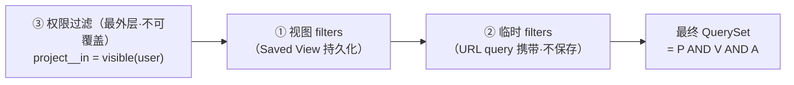
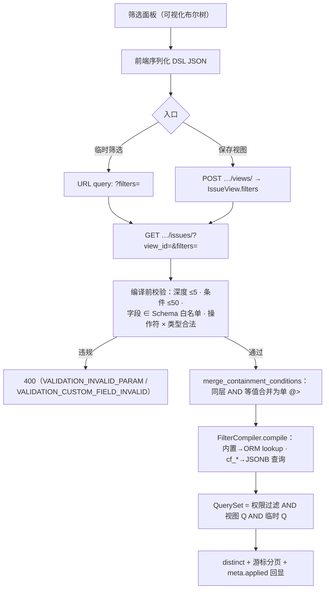
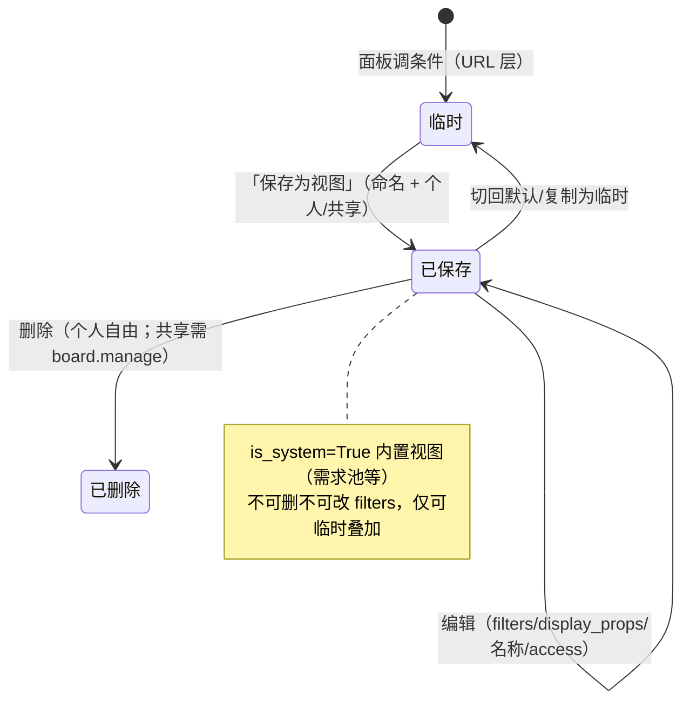

# 全字段 AND/OR 组合筛选器与视图保存

| 元信息项 | 内容 |
| --- | --- |
| 文档编号 | TASK-011 |
| 所属迭代 | Sprint 3：高级视图 + 实时协作（第 5 周） |
| 优先级 | P2（标准版完整级 · **动态字段体系的收官能力**） |
| 所属模块 | M4-TASK｜任务核心（视图层） |
| 文档状态 | 待评审（Draft） |
| 最后更新日期 | 2026-09-01 |
| 上游依据 | `docs/需求文档.md` §3.4.2（全字段筛选器体系：复杂逻辑 / 视图联动 / 三层筛选层级）、§8.2 任务核心 P2 列（全字段 AND/OR 组合筛选器、筛选保存为视图） |
| 前置依赖 | **`TASK-008`（Schema API + `filters/compiler.py` 等值子集 + 类型感知排序——本文档将其扩为全量编译器，同一模块不另起炉灶）**、`TASK-003`（列表筛选与 URL 同源）、`BOARD-002/003`（看板分组与视图消费）、`INFRA-004`（信封 / 错误码） |
| 下游依赖 | `BOARD-003`（多看板视图配置直接消费 IssueView）、`GANTT-001`（甘特复用 filters）、`TASK-012`（P3 高级字段进 Schema 后自动可筛选）、`BOARD-005`（P3 视图共享/锁定）、`PROJ-003`（需求池内置视图） |
| 架构基线 | **[`dynamic-fields-design.md`](../architecture/dynamic-fields-design.md) §5（筛选 DSL / 编译器 / 等值合并 / 三层层级 / IssueView 模型——本文档是其全量落地）**、§5.6（视图保存与字段删除降级）、§6.3（编译规则总表）；[`api-conventions.md`](../architecture/api-conventions.md) §5.3（参数筛选与 Saved View 分工）、§8、§10.2 |
| 竞品参考 | Plane（filters/display_filters JSONB + 视图保存，但字段限于内置枚举） · Ones（企业级筛选器：AND/OR 嵌套 + 全字段 + 视图权限） |
| 工作量估算 | 后端 3.5 人日 / 前端 4.5 人日 / 联调与测试 2 人日，合计 **10 人日** |

> **范围声明**：交付**全字段（内置 + 自定义）AND/OR 嵌套组合筛选器**（递归 DSL，深度 ≤ 5、条件 ≤ 50、占位符 `@me`/相对时间）、**视图保存**（个人/共享，四布局共用 filters 与 display_props）、**三层筛选层级**（视图 filters × 临时 filters × 权限过滤）。全局跨项目筛选（P3 `BOARD-005` 视图治理）、管理员视图锁定（P3）、筛选器自然语言输入（P4 AI）不在范围。

---

## 1. 概述

### 1.1 功能定位

`TASK-003` 交付了参数化筛选（参数间 AND / 参数内逗号 OR）；`TASK-008` 让自定义字段可被等值筛选。但「**(严重等级 = 致命 或 影响版本含 v2.2) 且 (负责人是我 或 未指派)**」这类真实运维口径，参数化语法表达不了——需要**任意布尔树**。本迭代交付三件事，共同构成需求文档 §3.4.2 承诺的「全字段筛选体系」收官：

1. **筛选 DSL 与全量编译器**——前端筛选面板与后端 SQL 编译共享同一份递归 JSON（逻辑节点 + 条件节点），自定义字段自动参与（Schema 驱动，零字段硬编码）；
2. **视图保存（Saved View）**——filters + display_props（分组/排序/显示列/布局）存为 `IssueView`，个人/共享两级，四大视图（列表/看板/甘特/表格）共用——**切换布局筛选不丢**；
3. **三层筛选层级**——「保存的视图 filters AND 临时叠加 filters AND 权限过滤」，权限永远最外层不可被 DSL 覆盖。

工程红线（继承 `dynamic-fields-design.md` §5.3 并制度化）：**DSL 只能表达过滤，不能表达关联路径遍历**——`BUILTIN_FIELD_PATHS` 白名单常量表让「`project__workspace__owner__password` 式探测」在编译期就不可能。

### 1.2 关键约定：前后端同构 DSL

```jsonc
// 一个真实运维口径的 DSL（深度 3）
{
  "op": "AND",
  "conditions": [
    { "field": "state.group", "operator": "in", "value": ["unstarted", "started"] },
    {
      "op": "OR",
      "conditions": [
        { "field": "cf_severity", "operator": "in", "value": ["critical", "major"] },
        { "field": "cf_affected_versions", "operator": "contains_any", "value": ["v2.2.1"] },
        { "op": "AND", "conditions": [
            { "field": "cf_is_regression", "operator": "eq", "value": true },
            { "field": "cf_review_date", "operator": "between",
              "value": ["2026-09-01", "2026-09-30"] } ] }
      ]
    },
    { "field": "assignees", "operator": "in", "value": ["@me"] },
    { "field": "cf_root_cause", "operator": "is_empty" }
  ]
}
```

设计要点（架构文档 §5.2 原文落地）：

1. **递归结构**：逻辑节点（`op` + `conditions[]`）与条件节点（`field/operator/value`）两类；深度 ≤ 5、条件总数 ≤ 50（防恶意构造）；
2. **字段引用统一**：内置字段裸名（`priority`）或点号路径（`state.group`）；自定义字段 `cf_` 前缀 key——**编译器凭前缀分派**，无第二套寻址逻辑；
3. **占位符是「活」的**：`@me`、`today`、`this_week`、`overdue`、`next_7_days` 在**编译期**解析为具体值——保存的视图对不同用户、不同日期自动正确；
4. **前后端一份 JSON**：面板渲染（前端）与 SQL 编译（后端）消费同一对象，视图保存即存它，无二次转换。

### 1.3 关键约定：三层筛选层级与权限不可覆盖



| 层 | 作用域 | 可用字段 | 保存方式 | 本迭代 |
| --- | --- | --- | --- | --- |
| ① 视图 | 单项目 | 内置 + 全局字段 + 项目私有字段 | `IssueView.filters`（个人/共享） | ✅ |
| ② 临时 | 视图结果之上叠加 | 同① | URL query（刷新还原） | ✅ |
| ③ 权限 | 全局 | —— | 代码内建，DSL 不可触达 | 永久 |

### 1.4 交付内容

| # | 能力 | 说明 |
| --- | --- | --- |
| 1 | 全量 FilterCompiler | `TASK-008` 子集扩全：AND/OR 递归、全操作符、占位符、深度/条件数上限、白名单校验 |
| 2 | 等值合并优化 | 同层 AND 的多个自定义字段等值条件合并为单 `@>`（GIN bitmap AND 一次完成） |
| 3 | 筛选面板 UI | 条件分组嵌套（可视化布尔树）、字段自动出现（Schema 驱动）、控件按类型匹配、一键清空、最近使用 |
| 4 | 视图保存 | `IssueView` CRUD：filters + display_props（group_by/order_by/columns/layout）；个人/共享；URL 分享 |
| 5 | 四视图共用 | 列表 / 看板 / 甘特 / 表格 同一 filters——布局切换筛选保持 |
| 6 | 临时叠加 | 选中视图后继续加条件（URL 层，不污染视图） |
| 7 | 内置视图点亮 | 需求池 / 缺陷列表 / 我的待办 / 本周到期（`is_system=True` 种子） |

### 1.5 范围边界

| 能力 | 本文档（P2） | 归属 |
| --- | --- | --- |
| AND/OR 嵌套 + 全字段 + 占位符 + 合并优化 | ✅ | — |
| 视图保存（个人/共享）+ 四布局共用 + 临时叠加 | ✅ | — |
| 自定义字段排序 / 分组（`order_by`/`group_by` 键） | ✅（消费 `TASK-008` 排序编译与分组键生成） | — |
| 跨项目全局视图（`IssueView.project=NULL`） | ❌ 列已建不启用 | P3 `BOARD-005`（视图治理） |
| 管理员视图锁定（`is_locked`） | ❌ 列已建不启用 | P3 `BOARD-005` |
| 视图权限（按角色可见的共享视图） | ❌ 共享 = 项目全员可见 | P3 |
| 筛选自然语言 / AI 生成 | ❌ | P4 `AI-001` |
| 订阅视图结果（定时摘要邮件） | ❌ | P3+ |

### 1.6 前置依赖

| 依赖 | 内容 | 阻塞原因 |
| --- | --- | --- |
| `TASK-008` | Schema API（字段元数据与 filterable 推导）、`compiler.py` 等值子集与类型感知排序、GIN/表达式索引就绪 | 编译器是其超集扩展 |
| `TASK-003` | 列表管道、URL 同源、游标分页 | 筛选挂载点 |
| `BOARD-002/003` | 看板分组与视图切换 | 四视图共用消费方 |
| `dynamic-fields-design.md` §5.6 | 字段删除的视图引用降级（`TASK-008` 已预置 `prune_views_referencing_field`） | 本迭代视图上线后激活 |

### 1.7 竞品参考

| 竞品 | 参考点 | 处置 |
| --- | --- | --- |
| Plane | `IssueView`（filters/display_filters JSONB）+ 个人视图；但字段限于内置枚举、无自定义字段参与 | 视图模型对齐；**全字段（含 cf_*）是差异点** |
| Plane | 布局切换丢筛选（列表/看板各存各的 display） | display_props 四布局共用（BR-13） |
| Ones | 企业筛选器：AND/OR 嵌套、全字段、视图权限与锁定 | P2 交付嵌套 + 全字段；治理（锁定/权限视图）P3 |
| Jira | JQL（文本查询语言） | **不采纳**（api-conventions §12.3 同理由：查询语言是攻击面与性能不可控源；布尔树 + 参数化已覆盖 95% 场景） |

---

## 2. 业务逻辑

### 2.1 筛选面板到 SQL 的全链路



### 2.2 视图生命周期



### 2.3 操作符 × 类型全表（与控件一一对应）

| 类型（field_type） | 可用操作符 | 筛选控件 |
| --- | --- | --- |
| `text` / `textarea` / `url` | `contains` `not_contains` `eq` `neq` `is_empty` `is_not_empty` | 文本输入（含/精确切换） |
| `number` / `auto_increment` | `eq` `neq` `gt` `gte` `lt` `lte` `between` `is_empty` | 数字区间（min–max） |
| `select` | `in` `not_in` `is_empty` `is_not_empty` | 带色块多选 |
| `multi_select` | `contains_any` `contains_all` `not_contains` `is_empty` | 多选 + 任一/全部切换 |
| `date`（含 `target_date` 等） | `eq` `before` `after` `between` `is_empty` + 快捷 `today` `this_week` `this_month` `overdue` `next_n_days` | 日期区间 + 快捷 chips |
| `member` / `member_multi`（含 `assignees`） | `in` `not_in` `contains_any` `contains_all` `is_empty` | 人员多选（含「@我」「未指派」） |
| `checkbox` | `eq` | 三态（是/否/不限） |
| `currency` | `gte` `lte` `between` | 金额区间 + 币种 |
| `state`（内置 FK 族） | `in` `not_in`；`state.group` 另有组语义 | 状态多选 / 组 chips |
| `priority`（内置枚举） | `in` `not_in` | 枚举多选（语义序） |

> 内置字段的「schema」由后端常量提供（`BUILTIN_FIELD_SCHEMA`），自定义字段来自 Schema API——**面板与编译器对两者无差别**（`dynamic-fields-design.md` §5.1 原则的编译侧兑现）。

### 2.4 业务规则表

| 编号 | 规则 | 判定位置 | 违反后果 |
| --- | --- | --- | --- |
| BR-01 | DSL 结构合法性：逻辑节点 `op ∈ {AND, OR}` + 非空 `conditions`；条件节点三键齐全；**深度 ≤ 5、条件总数 ≤ 50** | 编译前校验 | 400 `VALIDATION_INVALID_PARAM` |
| BR-02 | 字段白名单：`field` 必须 ∈ Schema（内置 `BUILTIN_FIELD_PATHS` 常量表 ∪ 项目生效自定义字段）；**白名单外一律拒绝**（探测免疫） | 编译前校验 | 400（details 指明字段名） |
| BR-03 | 操作符 × 类型合法性（§2.3 表之外的组合拒绝） | 编译前校验 | 400 |
| BR-04 | 值域校验：select/multi 值 ∈ options；member ∈ 项目成员；日期 ISO；数字数值——自定义字段复用 `TASK-008` 值校验器 | 编译前校验 | 400 `VALIDATION_CUSTOM_FIELD_INVALID` |
| BR-05 | 占位符编译期解析：`@me` → 当前用户；`today/this_week/this_month/overdue/next_n_days` → 按用户时区的日期区间；**保存的 DSL 永存占位符**（视图是「活」的） | 编译器 | — |
| BR-06 | 权限过滤永远最外层：最终 QuerySet 恒含 `accessible_by` 域过滤；DSL 无任何语法可达权限维度 | `build_issue_queryset` | 架构测试守护 |
| BR-07 | 等值合并：同层 AND 下多个 `cf_*` 的 `eq` 条件合并为单 `@>`（优化前后语义等价，UT 双跑断言结果一致） | 编译器 | — |
| BR-08 | `is_empty`（NOT 键存在）不可作为**跨项目**唯一条件（P2 项目域恒有 project 过滤，天然满足；规则写入编译器防御） | 编译器 | 400 |
| BR-09 | 视图保存：名称 ≤ 64 字符项目内唯一（按 access 域）；`filters` + `display_props` 整体替换（PATCH）；`layout ∈ {list,kanban,gantt,table}` | ViewSet | 409 `RESOURCE_ALREADY_EXISTS` |
| BR-10 | 共享视图：`access=shared` 时项目全员（VIEWER+）可见可用；**编辑/删除需 `board.manage`**（个人视图仅本人） | Permission | 403 |
| BR-11 | 内置视图（`is_system`）：需求池/缺陷列表/我的待办/本周到期——filters 不可改、不可删；仅允许临时叠加（②层） | ViewSet | 403 |
| BR-12 | 临时叠加语义：`?view_id=` 与 `?filters=` 同时出现时两棵树 **AND** 连接；面板显示「视图条件 + 叠加条件」双段 | 编译入口 | — |
| BR-13 | 四布局共用：`display_props` 内 `group_by/sub_group_by/order_by/columns/layout`——切换布局仅改 `layout`，filters 不动 | Store 约定 | — |
| BR-14 | 自定义字段作为 `order_by`/`group_by` 键：仅 `sortable`/`groupable` 为 true 的字段（Schema 推导）；分组列从 `options` 生成含「未设置」组（禁 `SELECT DISTINCT`） | 编译器 + 看板 | 400 |
| BR-15 | 字段删除联动：视图 filters/display_props 引用被删字段 → `prune_views_referencing_field`（`TASK-008` 预置任务）**本迭代激活**：降级剔除 + 视图打「已自动调整」标记 | Celery | — |
| BR-16 | 最近使用筛选：个人本地（localStorage）存最近 5 条临时 DSL（名称自动摘要）；**不上服务端**（零成本） | 前端 | — |
| BR-17 | `meta.applied` 回显：响应 meta 回传编译后的有效条件摘要（占位符已解析值）——前端确认「筛选生效了什么」，调试与信任基础 | ViewSet | — |

### 2.5 异常处理表

| 异常场景 | 触发条件 | HTTP / 错误码 | 前端表现 | 后端处理 |
| --- | --- | --- | --- | --- |
| 深度/条件数超限 | >5 层 / >50 条 | 400 `VALIDATION_INVALID_PARAM` | 面板禁止再嵌套（前端预判）；直连 400 | 编译前校验 |
| 未知字段探测 | `field: "project__owner"` | 400 + details 字段名 | 不可能由面板产生 | BR-02 白名单 |
| 操作符不合法 | `checkbox` 用 `gt` | 400 | 控件不提供非法操作符 | BR-03 |
| 值域非法 | select 传 `blocker` | 400 `VALIDATION_CUSTOM_FIELD_INVALID` | 选择器不可能；直连触发 | BR-04 |
| 视图重名 | 同 access 域同名 | 409 `RESOURCE_ALREADY_EXISTS` | 名称输入行内红 | BR-09 |
| 改共享视图无权限 | CONTRIBUTOR 改他人共享视图 | 403 `PERM_ROLE_INSUFFICIENT` | 入口隐藏 | BR-10 |
| 改内置视图 filters | 编辑需求池 | 403（仅可临时叠加提示） | 面板锁只读 + 「叠加条件」入口 | BR-11 |
| 视图不存在/不可见 | 越权 view_id | 404 `RESOURCE_NOT_FOUND` | 回默认视图 + Toast | — |
| 引用字段被删 | 视图打开时 | —（降级） | 黄条「视图已自动调整：移除了失效条件 X」 | BR-15 Celery 剔除 |
| URL filters 损坏 | JSON 解码失败 | 400 `VALIDATION_INVALID_PARAM` | 回无条件态 + Toast | — |
| 结果过大计数 | 命中 > 50,000 | — | total_count 估算标记 | §api 6.4 降级 |

### 2.6 边界条件表

| 边界场景 | 限制值 | 超出处理方式 |
| --- | --- | --- |
| 嵌套深度 | 5 | 面板禁再嵌套 + 400 |
| 条件总数 | 50 | 同上 |
| 单值列表长度（in 等） | 50 | 400 |
| 视图名 | 64 字符 | 400 |
| 个人视图数/人/项目 | 20 | 409（引导整理） |
| 共享视图数/项目 | 30 | 409 |
| 最近使用 | 5 条（本地） | 滚动淘汰 |
| `next_n_days` 的 n | 1~90 | 400 |
| 深层 OR + is_empty 组合 | 允许（项目域内） | 执行计划走 GIN 缩小 |

---

## 3. UI/UX 设计

### 3.1 筛选面板（可视化布尔树）

```
┌────────────────────────────────────────────────────────────────────────┐
│ 筛选                                    [最近 ▾]  [清空全部]  [保存视图] │
├────────────────────────────────────────────────────────────────────────┤
│ 视图：🔴 严重缺陷盯防（共享）· 叠加条件 2 条                 [另存] [脱离]│
│ ────────────────────────────────────────────────────────────────────── │
│ ┌ 满足 全部（AND）────────────────────────────────────── [+ 条件] [+ 组] ┐│
│ │                                                                        ││
│ │  状态组     [待办·进行中 ✕]              is in ▾      ⨯              ││
│ │  ┌ 满足 任一（OR）─────────────────────────────────── [+ 条件] [+ 组] ┐││
│ │  │  严重等级  [致命 严重 ✕]               is in        ⨯             │││
│ │  │  影响版本  包含任一 [v2.2.1 ✕]                       ⨯             │││
│ │  │  ┌ 满足 全部（AND）────────────────────────────────────────────┐  │││
│ │  │  │  是否回归  [是]                        is          ⨯        │  │││
│ │  │  │  评审日期  [09-01] — [09-30]           between     ⨯        │  │││
│ │  │  └─────────────────────────────────────────────────────────────┘  │││
│ │  └────────────────────────────────────────────────────────────────────┘││
│ │  负责人     [@我 ✕]                                   ⨯               ││
│ │  根因分析   为空                                                       ││
│ └────────────────────────────────────────────────────────────────────────┘│
│ ⓘ 命中 23 个任务 · 条件 7/50 · 层级 3/5          [应用]  [取消]          │
└────────────────────────────────────────────────────────────────────────┘
```

| 元素 | 规格 |
| --- | --- |
| 组节点 | 圆角虚线框 + 头部「满足 全部/任一」切换（AND/OR）+ `[+ 条件]` `[+ 组]` + 组删除 ⨯（根组不可删） |
| 条件行 | 字段选择器（内置+自定义混排，带类型图标与色点）→ 操作符下拉（按类型出 §2.3 集合）→ 值控件（类型匹配）→ 删除 ⨯ |
| 值控件复用 | `TASK-008` CONTROL_REGISTRY 的筛选变体（区间/多选/日期快捷 chips/人员@我） |
| 视图段 | 选中视图时显示：只读摘要 chips + 叠加区（新增条件进②层）；`[另存]` 把合并树存新视图、`[脱离]` 转纯临时 |
| 底部状态栏 | 实时命中数（防抖 500ms 预估查询）+ 条件/层级配额 + 应用/取消 |
| 快捷 chips | `@我` `未指派` `今天到期` `已逾期` `本周` 一键成条件 |

### 3.2 视图管理（列表 / 看板等四视图共用的视图条）

```
┌──────────────────────────────────────────────────────────────────────────┐
│ [📋 严重缺陷盯防] [🚀 我的待办 🔒] [📦 需求池 🔒] [+ 新建]      ⋯          │
├──────────────────────────────────────────────────────────────────────────┤
│  （当前视图主体：列表/看板/甘特/表格——布局切换器在右侧）                     │
└──────────────────────────────────────────────────────────────────────────┘
  🔒 = 内置视图（不可改）  Tab 右键 / ⋯ 菜单：重命名·编辑条件·复制·共享设置·删除
```

| 元素 | 规格 |
| --- | --- |
| 视图 Tab 条 | 个人 + 共享视图混排（共享带团队图标）；当前高亮；URL `?view_id=` 同源 |
| 布局切换 | 右侧 `列表/看板/甘特/表格` 四段器——切换只改 `display_props.layout`，filters 保持（BR-13） |
| 新建视图 | 从当前筛选态「保存为视图」弹层：名称 + 个人/共享（共享需 `board.manage`） |
| Tab ⋯ 菜单 | 重命名 / 编辑条件（打开面板）/ 复制为新视图 / 共享↔个人 / 删除（二次确认） |
| 内置视图 | 🔒 图标；菜单仅「复制」与「临时叠加」 |

### 3.3 交互细节表

| 交互动作 | 触发方式 | 反馈效果 | 加载态 / 空态 / 失败态 |
| --- |---|---|---|
| 加条件 | `[+ 条件]` | 新行默认「状态组 is in [待办]」可改 | — |
| 加组 | `[+ 组]` | 嵌套虚线框滑入；层级达 5 后按钮禁用 | 配额红提示 |
| AND/OR 切换 | 组头下拉 | 组内条件关系即时变化 + 命中数防抖刷新 | — |
| 实时命中数 | 任意条件变更 | 500ms 防抖预估（`?count=true&per_page=0`） | 失败显示 — |
| 应用 | `[应用]` | 列表刷新 + URL 同步（临时 filters 入 query） | — |
| 保存视图 | 底部按钮 | 弹层命名 → 新 Tab 出现并选中 | 重名行内红 |
| 布局切换 | 四段器 | 主体切换；筛选 Tab 与命中数保持 | — |
| 复制内置视图 | Tab 菜单 | 生成个人副本（filters 可改） | — |
| 最近使用 | `[最近 ▾]` | 本地 5 条 DSL 摘要；点击载入为临时 | — |
| 字段被删后打开 | 视图打开 | 黄条「已自动调整：移除失效条件 严重等级」 | — |

### 3.4 响应式与无障碍

| 断点 | 布局 |
| --- | --- |
| ≥ 1280px | 面板 640px 抽屉右滑；组嵌套全量 |
| 768~1279px | 面板全宽抽屉；值控件换行 |
| < 768px | 面板全屏；组头收纳操作到「⋯」；快捷 chips 优先展示 |

无障碍：组为 `role="group"` + `aria-label`（「条件组：满足任一，共 3 条」）；条件行三控件 Tab 序（字段→操作符→值）；删除 ⨯ 均 `aria-label`；命中数 `aria-live="polite"`；视图 Tab 为标准 tablist 语义（方向键切换）；配额（7/50）为文本非纯色。

---

## 4. 技术架构

### 4.1 数据模型

#### 4.1.1 `IssueView`（新表，架构文档 §5.6 原文落地）

```python
# apps/api/plane/db/models/view.py
from django.db import models

from plane.db.models.base import BaseModel


class IssueView(BaseModel):
    """保存的视图 —— 筛选 + 排序 + 分组 + 显示列 + 布局的组合

    四大视图布局（列表/看板/甘特/表格）共用同一份 filters 与 display_props，
    布局切换时筛选条件不丢失（BR-13；需求文档「视图联动」要求）。
    """

    class Access(models.TextChoices):
        PERSONAL = "personal", "个人视图"
        SHARED = "shared", "共享视图"

    class Layout(models.TextChoices):
        LIST = "list", "列表"
        KANBAN = "kanban", "看板"
        GANTT = "gantt", "甘特图"
        TABLE = "table", "表格"

    workspace = models.ForeignKey("db.Workspace", on_delete=models.CASCADE,
                                  related_name="views")
    project = models.ForeignKey(
        "db.Project", on_delete=models.CASCADE, null=True, blank=True,
        related_name="views",
        help_text="为空表示跨项目全局视图（P3 BOARD-005 启用）")
    owner = models.ForeignKey("db.User", on_delete=models.CASCADE,
                              related_name="views")
    name = models.CharField(max_length=64, verbose_name="视图名称")
    description = models.CharField(max_length=255, blank=True)
    access = models.CharField(max_length=16, choices=Access.choices,
                              default=Access.PERSONAL)
    layout = models.CharField(max_length=16, choices=Layout.choices,
                              default=Layout.LIST)

    filters = models.JSONField(default=dict, verbose_name="筛选 DSL",
                               help_text="§1.2 递归结构；占位符原样保存（编译期解析）")
    display_props = models.JSONField(
        default=dict, verbose_name="展示配置",
        help_text='{"group_by": "cf_severity", "order_by": "-cf_req_no", '
                  '"columns": ["name", "state", "cf_severity"], '
                  '"sub_group_by": null, "show_sub_issues": true, '
                  '"show_empty_groups": false}')

    is_system = models.BooleanField(default=False, verbose_name="内置视图",
                                    help_text="需求池/缺陷列表等，不可删改 filters")
    is_locked = models.BooleanField(default=False, verbose_name="管理员锁定",
                                    help_text="P3 BOARD-005：锁定后成员不可修改")
    sort_order = models.FloatField(default=65535.0)

    class Meta(BaseModel.Meta):
        db_table = "issue_views"
        ordering = ("sort_order",)
        constraints = [
            models.UniqueConstraint(
                fields=["project", "access", "name"],
                condition=models.Q(deleted_at__isnull=True),
                name="uniq_view_name_per_scope"),
        ]
        indexes = [
            models.Index(fields=["project", "access", "sort_order"], name="idx_view_proj_access"),
            models.Index(fields=["owner", "access"], name="idx_view_owner_access"),
        ]
```

#### 4.1.2 内置视图种子（`is_system=True`）

```python
BUILTIN_VIEWS = [
    {"name": "需求池", "icon": "sparkles", "layout": "kanban", "group_by": "state",
     "filters": {"op": "AND", "conditions": [
         {"field": "issue_type", "operator": "in", "value": ["__requirement__"]}]},
     "min_phase": "P2"},
    {"name": "缺陷列表", "icon": "bug", "layout": "list",
     "filters": {"op": "AND", "conditions": [
         {"field": "issue_type", "operator": "in", "value": ["__bug__"]}]},
     "min_phase": "P2"},
    {"name": "我的待办", "icon": "user", "layout": "list",
     "filters": {"op": "AND", "conditions": [
         {"field": "assignees", "operator": "in", "value": ["@me"]},
         {"field": "state.group", "operator": "not_in", "value": ["completed", "cancelled"]}]},
     "min_phase": "P2"},
    {"name": "本周到期", "icon": "calendar", "layout": "list",
     "filters": {"op": "AND", "conditions": [
         {"field": "target_date", "operator": "between", "value": ["this_week"]}]},
     "min_phase": "P2"},
]
# 项目创建时种子（project 级、owner=系统）；issue_type 的 in 值在编译期
# 按类型名解析为 UUID（占位符家族扩展：__requirement__ 等类型名占位）
```

### 4.2 API 定义

| # | 方法 | 路径 | 描述 | 权限 | 成功码 |
| --- | --- | --- | --- | --- | --- |
| 1 | `GET\|POST` | `…/projects/{project_id}/views/` | 视图列表（个人 + 共享 + 内置）/ 创建 | `project.read` / `issue.read` | `200`/`201` |
| 2 | `PATCH` | `…/views/{view_id}/` | 编辑（名称/filters/display_props/access） | 本人 或 `board.manage`（共享） | `200` |
| 3 | `DELETE` | `…/views/{view_id}/` | 删除（内置 403） | 本人 或 `board.manage`（共享） | `204` |
| 4 | `GET` | `…/issues/?view_id=<uuid>&filters=<urlencoded DSL>` | **编译消费入口**（视图×临时叠加×权限） | `project.read` | `200` |
| 5 | `GET` | `…/issues/?count=true&per_page=0` | 命中数预估（面板实时计数） | `project.read` | `200` |

#### 4.2.1 `POST …/views/` — 保存视图

**请求**

```json
{
  "name": "严重缺陷盯防",
  "access": "shared",
  "layout": "list",
  "filters": { "op": "AND", "conditions": [
      { "field": "state.group", "operator": "in", "value": ["unstarted", "started"] },
      { "op": "OR", "conditions": [
          { "field": "cf_severity", "operator": "in", "value": ["critical", "major"] },
          { "field": "cf_affected_versions", "operator": "contains_any", "value": ["v2.2.1"] } ] },
      { "field": "assignees", "operator": "in", "value": ["@me"] } ] },
  "display_props": { "group_by": null, "order_by": "-priority",
                     "columns": ["issue_key", "name", "state", "priority", "assignees",
                                 "target_date", "cf_severity"],
                     "layout": "list" }
}
```

**成功响应 `201`**：完整视图对象（同请求结构 + `id` / `owner` / `is_system: false`）。

**失败响应 `409`（重名）**

```json
{
  "status": "error",
  "error": {
    "code": "RESOURCE_ALREADY_EXISTS",
    "message": "已存在同名视图",
    "details": [{ "field": "name", "code": "UNIQUE",
                  "message": "共享视图中已有「严重缺陷盯防」" }],
    "request_id": "01JCC5E9X3IZ7B1C5F4D6G7H8I"
  }
}
```

#### 4.2.2 `GET …/issues/?view_id=&filters=` — 编译消费

**请求**

```http
GET /api/v1/workspaces/acme/projects/7b3e9c1a-…/issues/?view_id=e5f6a7b8-…&filters=%7B%22op%22%3A%22AND%22…&order_by=-priority&per_page=50 HTTP/1.1
```

**成功响应 `200`（meta 关键段）**

```json
{
  "status": "success",
  "data": [ /* Issue 列表（字段按 view.display_props.columns 裁剪） */ ],
  "meta": {
    "next_cursor": "50:1:0", "next_page_results": true, "count": 50,
    "total_count": 23, "total_pages": 1, "page": 1, "per_page": 50,
    "applied": {
      "view": { "id": "e5f6…", "name": "严重缺陷盯防", "access": "shared" },
      "resolved_placeholders": { "@me": "李四（li@ac.me）",
                                 "this_week": ["2026-09-01", "2026-09-07"] },
      "conditions_count": 7, "groups_count": 3
    }
  }
}
```

> `meta.applied`（BR-17）：视图标识 + 占位符解析值 + 条件统计——「筛选生效了什么」在响应层可审计。

**失败响应 `400`（白名单外字段探测）**

```json
{
  "status": "error",
  "error": {
    "code": "VALIDATION_INVALID_PARAM",
    "message": "筛选条件包含未知或不可筛选的字段",
    "details": [{ "field": "filters", "code": "NOT_A_CHOICE",
                  "message": "字段 project__owner 不可用" }],
    "request_id": "01JCC5E9X3IZ7B1C5F4D6G7H8J"
  }
}
```

### 4.3 核心逻辑

#### 4.3.1 编译前校验与入口（`build_issue_queryset` 扩展）

```python
# apps/api/plane/app/filters/compiler.py —— TASK-008 子集的全量扩展（同一模块）
from dataclasses import dataclass

MAX_FILTER_DEPTH = 5
MAX_CONDITIONS = 50
MAX_IN_VALUES = 50

# 白名单常量表（BR-02）：内置字段唯一寻址来源——DSL 无任何语法可达关联遍历
BUILTIN_FIELD_PATHS: dict[str, dict] = {
    "name":           {"path": "name", "type": "text"},
    "state":          {"path": "state", "type": "select_ref"},
    "state.group":    {"path": "state__group", "type": "select"},
    "issue_type":     {"path": "issue_type", "type": "select_ref"},
    "priority":       {"path": "priority", "type": "select"},
    "assignees":      {"path": "assignees__id", "type": "member_multi"},
    "labels":         {"path": "labels__id", "type": "multi_select_ref"},
    "created_by":     {"path": "created_by", "type": "member"},
    "start_date":     {"path": "start_date", "type": "date"},
    "target_date":    {"path": "target_date", "type": "date"},
    "created_at":     {"path": "created_at", "type": "date"},
    "estimate":       {"path": "estimate_minutes", "type": "number"},
    "sequence_id":    {"path": "sequence_id", "type": "number"},
    "parent":         {"path": "parent", "type": "select_ref"},
    "blocked":        {"path": "_computed_blocked", "type": "checkbox"},
}


@dataclass(frozen=True)
class CompileContext:
    project: "Project"
    field_schema: dict[str, dict]        # BUILTIN ∪ resolve_fields 的 schema
    user_id: str
    tz: "ZoneInfo"


def build_issue_queryset(*, ctx: CompileContext, view_filters: dict | None,
                         adhoc_filters: dict | None, scope: str = "project"):
    """三层组装（§1.3）：权限 → 视图 → 临时。"""
    qs = Issue.objects.filter(                          # ③ 权限最外层（BR-06）
        project__in=visible_project_ids(ctx.user_id, ctx.project.workspace_id),
        project_id=ctx.project.id,                      # P2 项目域（跨项目 P3）
        archived_at__isnull=True,
    ).select_related("state", "issue_type", "project") \
     .prefetch_related("assignees", "labels")

    compiler = FilterCompiler()
    for filters in (view_filters, adhoc_filters):       # ①② 视图 AND 临时（BR-12）
        if filters:
            qs = qs.filter(compiler.compile(_validate_and_merge(filters, ctx), ctx))
    return qs.distinct()


def _validate_and_merge(node: dict, ctx: CompileContext) -> dict:
    """结构/白名单/操作符/值域四重校验（BR-01~04）+ 等值合并（BR-07）。"""
    _check_structure(node, depth=0, budget=[0])          # 深度与条件数
    _check_fields_and_values(node, ctx)                  # 白名单 + 操作符 + 值域
    return merge_containment_conditions(node)            # TASK-008 同名优化复用
```

#### 4.3.2 FilterCompiler 主体（递归 + 占位符）

```python
class FilterCompiler:
    def compile(self, node: dict, ctx: CompileContext, depth: int = 0):
        if depth > MAX_FILTER_DEPTH:
            raise InvalidParam("筛选条件嵌套层级过深")
        if "op" in node:                                  # 逻辑节点
            op = node["op"].upper()
            children = [self.compile(c, ctx, depth + 1) for c in node["conditions"]]
            if not children:
                return Q()
            combined = children[0]
            for child in children[1:]:
                combined = (combined & child) if op == "AND" else (combined | child)
            return combined
        return self._condition(node, ctx)                 # 条件节点（校验已在入口完成）

    def _condition(self, cond: dict, ctx: CompileContext) -> Q:
        field, operator = cond["field"], cond["operator"]
        schema = ctx.field_schema[field]
        value = self._resolve_placeholders(cond["value"], schema, ctx)   # BR-05
        if field.startswith("cf_"):
            return self._compile_custom(field, operator, value, schema)  # TASK-008 §4.3.6 全集
        return self._compile_builtin(field, operator, value, schema)     # ORM lookup 映射

    def _resolve_placeholders(self, value, schema, ctx):
        if isinstance(value, list):
            return [self._resolve_placeholders(v, schema, ctx) for v in value]
        if value == "@me":
            return ctx.user_id
        if schema["type"] in ("date",) and isinstance(value, str):
            return resolve_relative_date(value, ctx.tz)   # today/this_week/overdue/next_7_days
        return value
```

> `_compile_custom`（自定义字段 → JSONB）与 `_compile_builtin`（→ ORM lookup）的操作符全集实现即 `TASK-008` §4.3.6 两个分支的完整化（`contains/not_contains/gt/lte/between/is_empty/is_not_empty/contains_all`…），本节不重复展开——**同一模块同一入口**的承诺由代码组织兑现：`compiler.py` 单文件，等值子集（P2）与全量（本迭代）是同一函数族的前后版本。

#### 4.3.3 性能策略（对齐架构 §6.3 编译规则总表）

| DSL 形态 | 编译结果 | 索引利用 |
| --- | --- | --- |
| 同层 AND 多个 cf 等值 | 合并单 `@>`（BR-07） | GIN bitmap AND 一次 |
| cf IN 多值 | 多 `@>` OR | GIN bitmap OR |
| 多值字段 contains_any/all | `@> '{"k":["v"]}'`（all）/ OR（any） | GIN |
| 数字/日期范围 | `has_key AND 表达式比较` | GIN 缩小 + 表达式偏索引（`TASK-008` is_indexed） |
| 文本 contains | `->> ILIKE` | trgm 表达式索引（如已建） |
| is_empty | `NOT has_key` | 项目域过滤先缩小（BR-08） |
| 排序 cf 键 | `TASK-008` §4.3.5 类型感知表达式 | 表达式偏索引 + `-created_at,-id` 游标稳定 |
| 分组 cf 键 | 列从 `options` 生成 + 各组独立计数查询 | 禁 `SELECT DISTINCT`（BR-14） |

**性能门禁（验收基准）**：10 万 Issue / 单项目 1 万 / 20 个自定义字段 / **5 条 AND/OR 混合条件**，P95 < 200ms（`dynamic-fields-design` G7 原文指标，本迭代终验）。

#### 4.3.4 Celery / beat

- `prune_views_referencing_field`（`TASK-008` 预置）**本迭代激活**：字段删除 → 视图 filters/display_props 剔除引用 + `updated_at` 触碰（前端黄条依据，BR-15）；
- 无其他新增任务（编译为在线同步路径，成本 <10ms 量级，走 CI 基准守护）。

### 4.4 前端实现

#### 4.4.1 `FilterTreeStore`（`packages/shared-state`）

```typescript
// packages/shared-state/src/filter/filter-tree.store.ts（节选）
export class FilterTreeStore {
  @observable tree: FilterNode = { op: "AND", conditions: [] };   // ② 临时层（URL 同源）
  @observable viewId: string | null = null;                       // ① 视图层
  @observable hitCount: number | null = null;

  get quota() {                                                    // 配额（7/50、3/5）
    return { conditions: countConditions(this.tree), depth: maxDepth(this.tree) };
  }

  toUrl(): string {                                                // 临时层序列化
    const p = new URLSearchParams();
    if (this.viewId) p.set("view_id", this.viewId);
    if (this.tree.conditions.length) p.set("filters", JSON.stringify(this.tree));
    return p.toString();
  }

  async previewCount() {                                           // 命中数（防抖 500ms）
    const { data } = await this.api.issues({
      view_id: this.viewId ?? undefined,
      filters: this.tree.conditions.length ? this.tree : undefined,
      count: true, per_page: 0,
    });
    runInAction(() => { this.hitCount = data.meta.total_count; });
  }

  async saveAsView(input: { name: string; access: "personal" | "shared" }) {
    const merged = mergeTrees(viewStore.current.filters, this.tree);   // 另存=合并树
    const view = await this.api.createView({ ...input, filters: merged,
                                             display_props: layoutStore.props });
    runInAction(() => { this.viewId = view.id; this.tree = emptyTree(); });
  }
}
```

#### 4.4.2 面板与四视图联动

- `FilterPanel`（`packages/ui` 树容器 + web 值控件装配）：组/条件组件递归渲染 `tree`；`CONTROL_REGISTRY` 筛选变体复用（字段/操作符/值三段行）。
- `ViewTabs`：视图条（个人+共享+内置混排），tablist 键盘语义；选中即 `viewId` + 清空临时层。
- `LayoutSwitcher`：四段器只改 `display_props.layout`（PATCH 视图或本地态）；filters/命中数保持（BR-13）。
- URL 单向流：`FilterTreeStore.toUrl()` 在每次应用时 `navigate`（替换不入栈）；初始化从 query 反序列化（损坏 JSON → 静默回无条件 + Toast）。
- 最近使用（BR-16）：`localStorage` 键 `recent-filters:{projectId}`，条目 `{summary, dsl, savedAt}` 滚动 5 条。
- 字段选择器数据 = Schema API（自定义）+ `BUILTIN_FIELD_SCHEMA` 常量（前端镜像，CI 与后端白名单一致性校验——`AUTH-005` 同款双源检查）。

---

## 5. 测试用例

### 5.1 单元测试

| 用例 ID | 测试目标 | 输入 | 预期输出 | 覆盖类型 |
| --- | --- | --- | --- | --- |
| UT-01 | 深度上限 | 6 层嵌套 | 400（面板 5 层后禁嵌套） | 边界 |
| UT-02 | 条件数上限 | 51 条 | 400 | 边界 |
| UT-03 | 白名单探测 | `project__owner` | 400 + details 字段名 | 安全 |
| UT-04 | 操作符×类型 | checkbox 用 gt | 400 | 异常 |
| UT-05 | 值域（select） | 非法 value | 400 `VALIDATION_CUSTOM_FIELD_INVALID` | 异常 |
| UT-06 | 值域（member） | 域外用户 | 400 | 安全 |
| UT-07 | @me 编译 | 两个用户各查 | 各自命中集不同（视图是活的） | 正常 |
| UT-08 | this_week 解析 | 用户 UTC-5 | 区间按其本地周计算 | 边界 |
| UT-09 | 合并等价性 | 随机生成 50 棵树 | 合并前后查询结果逐一相等（BR-07） | 正常 |
| UT-10 | AND/OR 语义 | 混合树 vs 手写 Q | 结果相等（黄金集对比） | 正常 |
| UT-11 | is_empty 防御 | 跨项目唯一 NOT 条件 | 400（BR-08） | 安全 |
| UT-12 | 权限不可覆盖 | DSL 含 project 字段尝试 | 白名单无此键 → 400 | 安全 |
| UT-13 | 视图重名 | 同域同名 | 409 UNIQUE | 边界 |
| UT-14 | 个人/共享域 | personal 同名不冲突 | 201 | 边界 |
| UT-15 | 内置视图保护 | PATCH filters | 403 | 安全 |
| UT-16 | 共享编辑权限 | CONTRIBUTOR 改共享 | 403；board.manage 通过 | 安全 |
| UT-17 | 临时叠加 | view + adhoc 两树 | AND 连接结果正确（BR-12） | 正常 |
| UT-18 | meta.applied | 含占位符查询 | 回显解析值与统计 | 契约 |
| UT-19 | 字段删除降级 | 删 cf 后开视图 | 条件被剔 + 黄条标记（BR-15） | 异常 |
| UT-20 | in 值上限 | 51 个 | 400 | 边界 |

### 5.2 集成测试

| 用例 ID | 场景 | 前置条件 | 操作步骤 | 预期结果 |
| --- | --- | --- | --- | --- |
| IT-01 | 全链路口径 | 造 23 条命中数据 | 面板组合 §1.2 树 | 命中恰 23；meta.applied 准确 |
| IT-02 | 性能门禁 | 10 万 Issue/20 字段 | 5 条混合条件 50 次 | P95 < 200ms；EXPLAIN 走 GIN/偏索引 |
| IT-03 | 四视图共用 | 存视图切四种布局 | 逐一切换 | filters/命中数不变；display 随布局 |
| IT-04 | URL 还原 | 复杂树应用后分享 | 他浏览器打开 | 树完整还原（含嵌套） |
| IT-05 | 内置视图 | 打开需求池 | 类型过滤正确；🔒 不可改；可叠加 |
| IT-06 | 共享视图协作 | A 存共享，B 使用 | B 视图条出现并可临时叠加；B 改被 403 |
| IT-07 | 删除字段联动 | 视图引用 cf 字段后删除 | Celery 完成后 | filters/display 剔除；视图仍可开 |
| IT-08 | 命中数预估 | 面板调条件 | 观察 | 500ms 防抖仅 1 次请求 |
| IT-09 | 权限收缩 | 移出成员后用旧 view_id | GET | 404 |
| IT-10 | 排序/分组联动 | order_by=cf 数字、group_by=cf select | 结果 | 数值序非字典序；分组列来自 options 含「未设置」 |

### 5.3 E2E 测试

| 用例 ID | 用户场景 | 操作路径 | 验收标准 |
| --- | --- | --- | --- |
| E2E-01 | 运维口径构建 | 建三层嵌套树（§1.2 例） | 命中数实时准确；应用后 URL 分享还原 |
| E2E-02 | 保存与复用 | 保存「严重缺陷盯防」共享视图 | 团队成员视图条可见可用；@me 各自生效 |
| E2E-03 | 布局切换 | 同视图切 列表→看板→甘特 | 筛选与命中保持；仅展示形态变化 |
| E2E-04 | 临时叠加 | 内置「需求池」上叠加 @me | 只读部分 + 叠加段清晰；刷新还原叠加 |
| E2E-05 | 降级提示 | 删除被引用字段后打开视图 | 黄条「已自动调整」；功能不中断 |
| E2E-06 | 最近使用 | 连续用 3 组筛选 | 最近列表正确；点击载入 |

---

## 6. 竞品深度对标

### 6.1 Plane 实现分析

- `IssueView`（`apps/api/plane/db/models/view.py`）：`filters` / `display_filters` / `display_properties` JSONB + 个人视图（`owned_by`）——本系统模型对齐并增强：**filters 值域扩展到 `cf_*`**（Plane 的 filters 只认内置枚举，自定义字段无从筛选——其 JSONB 里没有、也不可能写出 `cf_` 键的语义）。
- Plane 的列表/看板各有 display 存储，布局切换的筛选保持依赖前端自行搬运；本系统 `display_props` 单存储 + `layout` 字段，保持是**结构保证**而非前端纪律（BR-13）。
- Plane 无可视化布尔树编辑器（filters 靠逐参数下拉）——本系统的嵌套组编辑是「复杂口径自助化」的关键交付。

### 6.2 Ones 实现分析

- 企业筛选器体系完整：嵌套布尔、全字段、视图权限/锁定/全局下发（治理三件套）。本系统 P2 交付前两者；治理三件套的**列已建齐**（`is_locked`、`project=NULL` 全局位），P3 `BOARD-005` 激活零 DDL——「能力分期、结构一次」原则的又一实例。
- ONESQL 的取舍在 `api-conventions` §12.3 已论证（查询语言的攻击面/性能不可控），本系统以「布尔树 + 参数化 + 语义聚合端点」覆盖同等业务场景。

### 6.3 本系统设计决策

1. **前后端同构 DSL 是体系的粘合剂**：面板渲染、URL 状态、视图存储、SQL 编译四处消费同一 JSON——没有「面板结构 → 查询参数 → 视图结构」的三重转换，就没有可维护的全字段筛选。
2. **白名单编译即安全边界**：`BUILTIN_FIELD_PATHS` 常量表让 DSL 在语法层不可能触达关联遍历（BR-02/UT-03/12）——比「编译后再过滤危险字段」的方案少一个可被绕过的环节。
3. **占位符让视图成为活资产**：`@me`/`this_week` 编译期解析、原样持久化——同一共享视图对不同人、不同日期自动正确，这是「保存的口径」与「保存的快照」的本质区别。
4. **合并优化以等价性测试锚定**：`merge_containment_conditions` 是纯性能优化，UT-09 用 50 棵随机树的等价对比保证「优化不改变语义」——优化点的测试投资与它的收益成正比。
5. **降级而非报错的生命周期联动**：字段删除 → 视图自动剔除引用（BR-15，`TASK-008` 预置任务激活）——跨功能生命周期一致性靠 Celery 编排而非用户自查，黄条提示完成透明化。

---

## 7. 里程碑与验收

### 7.1 交付物清单

| 类型 | 交付物 |
| --- | --- |
| Model / Migration | `issue_views` 新表（作用域唯一约束 + 双索引 + P3 预留列）；内置视图种子（4 个 is_system） |
| 后端 | `compiler.py` 全量（校验/白名单/占位符/递归编译/合并）、`build_issue_queryset` 三层组装、views CRUD 三端点、`?view_id=&filters=` 消费入口、`meta.applied` 回显、`prune_views_referencing_field` 激活 |
| 前端 | 筛选面板（布尔树/配额/命中数/快捷 chips）、视图条（tablist/内置锁/菜单）、四段布局切换器、`FilterTreeStore`（URL 单向流/最近使用）、字段选择器（Schema+内置双源） |
| 测试 | UT-01~20、IT-01~10、E2E-01~06、性能基准（P95 < 200ms） |

### 7.2 可操作演示的验收标准

1. 构建三层嵌套口径（严重等级 IN ×影响版本包含 OR ×回归 AND 评审区间，叠加 @我 与 根因为空）：面板实时命中数与应用结果一致；URL 分享在另一浏览器完整还原整棵树。
2. 保存为共享视图「严重缺陷盯防」：团队成员视图条出现并可使用；各自的 `@me` 解析为自己的任务（`meta.applied` 可见解析值）；CONTRIBUTOR 修改该共享视图被 403，PROJ_ADMIN 可改。
3. 同一视图在列表/看板/甘特/表格间切换：筛选条件与命中数纹丝不动，仅展示形态变化。
4. 打开内置「需求池」：类型过滤正确、🔒 标识、filters 只读；其上叠加「@我」临时条件后刷新仍保持叠加且不污染视图。
5. 删除一个被视图引用的自定义字段后打开视图：黄条提示「已自动调整」，失效条件被剔除，视图其余条件照常生效。
6. 10 万 Issue / 20 自定义字段数据集下 5 条 AND/OR 混合筛选 P95 < 200ms（EXPLAIN 显示 GIN bitmap AND 与表达式偏索引命中）；深度 6 层与第 51 条条件均被拒绝。
