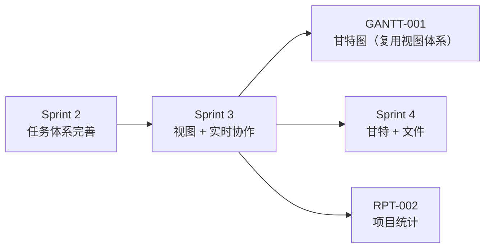
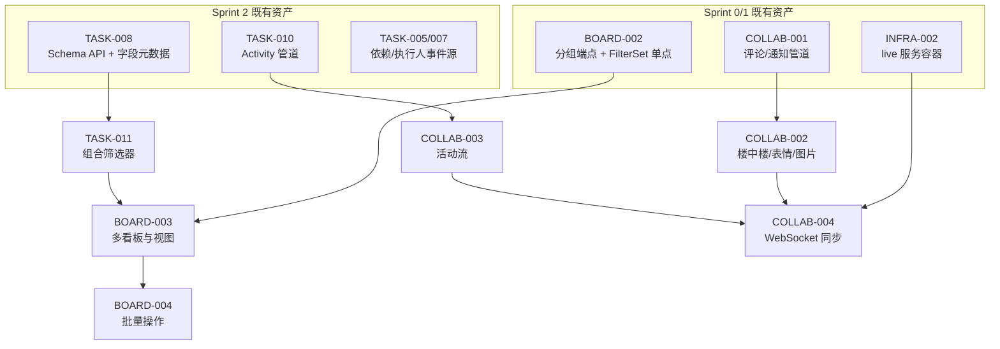

# Sprint 3 — 高级视图 + 实时协作 · 迭代概览

| 元信息项 | 内容 |
| --- | --- |
| 所属迭代 | Sprint 3 — 高级视图 + 实时协作（第 5 周） |
| 优先级 | P2（标准版完整级） |
| 覆盖模块 | M5-BOARD｜看板视图 · M8-COLLAB｜实时协作与通知 · M4-TASK｜任务核心（筛选器） |
| 文档状态 | 待评审（Draft） |
| 最后更新日期 | 2026-09-01 |
| 上游依赖 | Sprint 0 全量；Sprint 1 的 `BOARD-002` / `COLLAB-001` / `TASK-002/003` / `INFRA-004`；Sprint 2 的 `TASK-008`（Schema API）/ `TASK-010`（Activity 管道）/ `TASK-004/005/007`（时间线事件源） |
| 下游消费 | `GANTT-001`（复用视图切换器与 Saved View 布局位）、`COLLAB-004`（Sprint 4 文件协作的 live 长连接复用）、`RPT-002`（活动流数据）、`BOARD-005`（P3 视图共享锁定）、`WF-003`（P3 自动化的实时通知通道） |
| 迭代周期 | 5 个工作日，固定预留 20% 缓冲 |

---

## 1. 迭代目标

Sprint 2 把任务体系补全后，Sprint 3 回答两个新问题：**「怎么看得爽」**（视图）与**「怎么一起干」**（协作）。

1. **视图体系成型**：`IssueView` 表落地——筛选 + 排序 + 分组 + 显示列的组合可保存为个人视图，四大布局（列表 / 看板 / 甘特 / 表格）共用同一份配置；看板分组维度从「仅状态」放开到优先级 / 负责人 / 标签 / 自定义字段。
2. **批量操作**：多选（框选 / Shift / ⌘）+ 批量改状态 / 优先级 / 执行人 / 标签 / 归档 / 删除——单事务全成败，Activity 共享 epoch 聚合留痕。
3. **评论升级**：楼中楼回复 + 表情 + 图片评论（消费 `FILE-001` 通道）。
4. **活动流**：项目级动态流 + 任务动态时间线 UI（消费 `TASK-010` 管道产出）。
5. **实时同步**：live 服务 WebSocket 房间推送——他人拖卡 / 评论 / 状态变更即时可见，多人数据同步告别 F5。
6. **组合筛选器**：`TASK-011` 交付全字段 AND/OR 嵌套筛选 DSL + FilterCompiler + Saved View 持久化——`dynamic-fields-design.md` §5 的完整落地。

## 2. 范围与边界

| 范围 | 本迭代交付 | 明确不做 |
| --- | --- | --- |
| 多看板 / 视图 | `IssueView` 表、视图 CRUD、视图切换器、显示配置（卡片字段 / 空组显隐） | 视图团队共享 / 管理员锁定（P3 `BOARD-005`）；跨项目全局视图（P3） |
| 看板分组 | 按 state / priority / assignee / label / 自定义字段 select 分组；分组列从 options 生成 | 泳道式二维分组 / 按Cycle分组（P3）；按任意自定义字段分组（仅 select 类） |
| 批量操作 | 多选 + 批量端点（上限 100、throttle 10/min）+ 六类批量动作 | 批量复制 / 批量改自定义字段（P3 评估）；跨项目批量移动（P4） |
| 评论协作 | 楼中楼（两级）、表情回应、图片评论 | 评审式评论状态（P3）；评论编辑窗口延长（维持 15 分钟） |
| 活动流 | 项目动态流页 + 任务时间线 Tab（epoch 聚合渲染） | 动态导出 / 合规告警（P4）；跨项目动态（P3） |
| 实时同步 | live WebSocket：拖卡 / 状态 / 评论 / 指派 / 新建删除推送；在线成员感知 | 富文本协同编辑（Yjs CRDT 协同与协作光标归 **P3** `FILE-005` Wiki——届时 Hocuspocus 挂入 `apps/live` 同进程、复用 `COLLAB-004` 票据与房间模型；本迭代 live 仅做业务事件广播，不实现 Yjs）；消息已读回执（P3） |
| 筛选器 | 全字段 AND/OR 树 + 分组嵌套（≤3 层 ≤20 节点）+ Saved View + 占位符（@me/today） | 跨项目全局筛选（P3）；自定义查询语言（不做，见 api-conventions §12.3） |

## 3. 前置依赖

进入 Sprint 3 前必须满足：

- Sprint 0-2 验收全部通过；`KanbanGroupView` 分组契约（`state:{id}` 键 / 空列恒在 / 组内 25 条）稳定。
- `field-schema/` 端点（ETag 协商）与 `filterable/sortable/groupable` 推导已交付（`TASK-008`）。
- `issue_activity` 管道（幂等 / epoch）已全事件覆盖（`TASK-010`）。
- live 服务容器在 Compose 内可起（`INFRA-002`），协同票据签发链路（api 签 JWT → live 验签）打通。

## 4. P2 视图/协作模块覆盖

| 文档 | 交付重点 | 关键数据结构 | 直接下游 |
| --- | --- | --- | --- |
| `BOARD-003` | 多看板、视图保存、分组维度放开 | `IssueView`（filters / display_props / 四布局） | `GANTT-001`、`BOARD-005` |
| `BOARD-004` | 批量端点与多选交互 | bulk 事务服务（epoch 共享） | `WF-003`（自动化批量触发） |
| `COLLAB-002` | 楼中楼 / 表情 / 图片评论 | `IssueComment.parent_id` 启用 + `CommentReaction` | `COLLAB-004`（实时评论） |
| `COLLAB-003` | 项目动态流 / 任务时间线 UI | 消费 `IssueActivity` + `IssueComment` UNION | `RPT-002`、`INTG-002` |
| `COLLAB-004` | WebSocket 房间推送 / 多人同步 | live 房间协议 + 事件扇出 | Sprint 4 甘特 / 文件事件消费（`GANTT-001/002`、`FILE-003`）、P3 协同编辑（Hocuspocus 复用 live）、`WF-003` |
| `TASK-011` | AND/OR 组合筛选器 + 视图绑定 | `FilterCompiler` 全量 + Saved View | 全部视图、`RPT-*` |

## 5. 统一工程约束

| 类别 | 约束 |
| --- | --- |
| 视图契约 | `IssueView.filters` 存 DSL JSON（服务端解析受深度/节点数限制）；四大布局共用 filters + display_props，切布局不丢条件 |
| 分组契约 | 分组列从字段 `options` / 枚举表生成，**禁止 `SELECT DISTINCT` 扫数据表**（[`dynamic-fields-design.md`](../architecture/dynamic-fields-design.md) §6.4「大量自定义字段场景的优化」）；空组恒渲染 |
| 批量契约 | 单事务全成败；上限 100；超限 `400 VALIDATION_BULK_LIMIT_EXCEEDED` 即拒（并发行锁冲突才 `409 RESOURCE_CONFLICT`，nowait 快速失败不排队）；同批 Activity 共享 epoch + batch 聚合（`TASK-010` BR-12） |
| 实时契约 | live 只做「广播 + 票据鉴权」，不实现业务权限——权限判定永远在 api 侧完成后才允许进入房间；事件携带 `issue_id` 而非全量载荷，前端按需 revalidate |
| 评论契约 | 楼中楼两级封顶（父 → 子，孙级折叠进父楼）；表情一人一议（重复点击切换）；图片走 `FILE-001` 预签名通道 |
| 错误码 | 仅用 `api-conventions.md` §8 既有码（`VALIDATION_BULK_LIMIT_EXCEEDED` / `RATE_LIMIT_EXCEEDED` / `SERVER_LIVE_SERVICE_UNAVAILABLE` / `RESOURCE_*` 等） |
| 性能 | 分组看板首屏 SQL ≤ 10 条；动态流首页与过滤查询 P95 < 150ms（10 万任务 / 100 万 Activity 数据集，`COLLAB-003` BR-14 基准）；WS 推送端到端 < 500ms |

## 6. 验收标准

- [ ] 6 份功能规格均含完整的 7 章结构与逐端点 JSON 契约。
- [ ] 视图：保存「筛选 + 分组 + 显示列」组合后刷新还原；四布局切换条件不丢；视图可分享（P2 个人视图，URL 直达）。
- [ ] 看板按优先级 / 负责人 / 自定义字段 select 分组正确，空组列恒在，分组列与 `options` 配置一致。
- [ ] 批量：100 条上限与超限 `400 VALIDATION_BULK_LIMIT_EXCEEDED`；单事务回滚验证（中途失败零残留）；动态流聚合为「批量更新了 N 个任务」。
- [ ] 评论：楼中楼两级、表情切换、图片评论上传展示全链路可用；通知去重正确。
- [ ] 活动流：项目动态流按时间聚合渲染；任务时间线与 `TASK-010` 契约一致（epoch 组 / 过滤 / 分页）。
- [ ] 实时：双浏览器拖卡 / 评论 / 改状态 < 500ms 可见；离线重连补偿拉取；票据过期自动降级提示。
- [ ] 筛选器：嵌套 AND/OR 树保存与还源；占位符 `@me` / `today` 跨用户跨日期「活」；10 万任务 5 条混合条件 P95 < 200ms。
- [ ] 任何越权访问（他人项目视图 / 未共享动态 / 房间）均 404 / 拒入。

## 7. 文档清单

| 序号 | 文件 | 一级标题 |
| --- | --- | --- |
| 1 | `BOARD-003-multi-kanban.md` | 多个独立看板与视图配置 |
| 2 | `BOARD-004-batch-operations.md` | 任务批量操作 |
| 3 | `COLLAB-002-thread-reply.md` | 楼中楼回复 / 表情 / 图片评论 |
| 4 | `COLLAB-003-activity-stream.md` | 项目动态流 / 任务动态时间线 |
| 5 | `COLLAB-004-websocket-sync.md` | WebSocket 实时推送 / 多人数据同步 |
| 6 | `TASK-011-advanced-filter.md` | 全字段 AND/OR 组合筛选器与视图保存 |

## 8. 排期

| 工作日 | 主线 A | 主线 B | 当日验收 |
| --- | --- | --- | --- |
| Day 1 | `BOARD-003` IssueView 表 + 视图 CRUD | `COLLAB-002` 楼中楼 + 表情 | 视图保存还原；评论两级结构 |
| Day 2 | `BOARD-003` 分组维度 + 显示配置 | `COLLAB-003` 活动流页 | 多维分组空组恒在；动态流渲染 |
| Day 3 | `BOARD-004` 批量端点 + 多选 | `TASK-011` FilterCompiler | 批量事务回滚测试；DSL 编译单测 |
| Day 4 | `COLLAB-004` 房间协议 + 前端接入 | `TASK-011` 视图绑定 + UI | 双端实时同步演示 |
| Day 5 | 联调、压测（WS 并发 50 连接） | 回归、无障碍、文档评审 | Sprint 验收清单全部通过 |

并行原则：`IssueView` 表结构 Day 1 由主线 A 主改，`TASK-011` 依赖其字段口径，Day 3 起才写 filters 绑定；live 服务协议 Day 3 冻结后前端才接 WS。

## 9. 技术风险与应对

| # | 风险 | 影响 | 概率 | 应对措施 | 责任文档 |
| --- | --- | --- | --- | --- | --- |
| 1 | **live 票据与房间权限的生命周期时序**：票据 120s 有效期内成员被移出项目 / 权限降级，房间若继续收事件即成横向越权感知 | 高：实时层绕过 api 侧权限判定 | 中 | 换票时强校验 rooms 声明与会话一致（`COLLAB-004` BR-01）；live 每 60s 批量向 api 内部端点复核 rooms 有效性，失效即踢出（BR-03）；续签失败 2 次主动断开走重连（BR-02） | `COLLAB-004` |
| 2 | **断线窗口事件丢失导致多端视图漂移**：把「推送」误当「最终一致」，断线期间的事件将不可追回 | 高：双端数据长期不一致 | 中 | 事件只携带 `issue_id` + 版本摘要，正文补齐与断线恢复全量收敛走既有 REST 拉取（SWR revalidate）+ 重连补偿拉取（幂等）——「推送负责知道、拉取负责最终一致」，丢失代价被压到「晚一轮拉取」而非数据错误 | `COLLAB-004` |
| 3 | **批量长事务与并发行锁**：100 条 `select_for_update(nowait=True)` 下两批并发锁定重叠行，若改为排队等待则长事务互拖 | 中：批量接口超时 / 连接池耗尽 | 中 | nowait 即刻 `409 RESOURCE_CONFLICT` 快速失败不排队，锁后重读状态再逐条判定；事务时长 ≈ < 1s 告警；100 条上限 + throttle 10/min 双保险 | `BOARD-004` |
| 4 | **动态流大项目性能退化**：Activity × Comment UNION 与项目维度过滤在百万 Activity 下走 JOIN 传导 / Sort 磁盘溢出 | 高：P95 < 150ms 门禁不过（§5） | 中 | 执行计划必须索引驱动，CI 基准数据集 10 万任务 / 100 万 Activity / 20 万 Comment 上 `EXPLAIN (ANALYZE, BUFFERS)` 断言无磁盘 Sort（`COLLAB-003` BR-14 / IT-02） | `COLLAB-003` |
| 5 | **筛选 DSL 编译的安全与性能双面**：恶意构造超深 / 超多节点 DSL 拖垮编译器；等值 + 范围 + 排序叠加使 GIN 索引退化为全表扫描 | 高：筛选即拒绝服务或 P95 门禁失守 | 中 | 编译前校验深度 ≤ 3 / 节点 ≤ 20（`api-conventions.md` §5.3 锚点）+ 字段 ∈ Schema 白名单，超限 `400` 预拦截；10 万 Issue / 5 条混合条件 P95 < 200ms 基准 | `TASK-011` |
| 6 | **`IssueView` 多文档口径漂移**：`BOARD-003` 与 `TASK-011` 共用同一表与 `views/` 端点族，各写一套定义将分裂事实源；四布局各存一份条件则切布局丢筛选 | 高：视图体系连锁返工 | 低 | `IssueView` 表结构与 `views/` CRUD 以 `BOARD-003` 为唯一事实源，`TASK-011` 仅消费不另定义；四布局共用同一份 filters + display_props，「切布局不丢条件」为验收项（§6） | `BOARD-003` `TASK-011` |
| 7 | **范围蔓延**：Yjs 协同编辑 / 已读回执 / 视图团队共享等「顺手加一下」 | 高：5 天排期与 9 条验收项互相挤压 | 高 | §2「明确不做」列为硬性范围基线：Yjs 归 P3 `FILE-005`、共享视图归 P3 `BOARD-005`、回执归 P3+；新增能力一律转入后续迭代排期，不占本迭代 20% 缓冲 | 本文档 |

## 10. 迭代退出条件

同时满足以下三项，Sprint 3 方可关闭并进入 Sprint 4：

1. **功能验收**：§6 的 9 条验收标准逐条通过，覆盖视图保存还原与四布局条件不丢、多维分组空组恒在、批量超限 `400` 与单事务回滚、楼中楼 / 表情 / 图片评论、动态流 150ms 基准、双端实时同步与断线补偿、嵌套筛选与占位符「活」语义、越权 404 / 拒入。
2. **工程质量**：本迭代无未修复的 P0 / P1 级缺陷；WS 并发 50 连接压测、票据续签与降级、批量行锁冲突（nowait `409`）、DSL 深度 / 节点边界拒绝等异常路径测试全部通过；20% 缓冲未被功能蔓延占用。
3. **文档同步**：本迭代 6 份功能文档状态全部标记为「已实现」，验收结果与本概览一致；实现过程中对架构决策的偏离已回写对应 `architecture/` 文档或登记 ADR；架构文档是唯一事实源，文档编号与索引以 [`docs/README.md`](../README.md) §4 为准，发现架构文档自身矛盾时标注「架构文档待回改」，不得以临时实现替代架构决策。

## 11. 相关文档

- 架构基线：[`dynamic-fields-design.md`](../architecture/dynamic-fields-design.md) §5（筛选 DSL / 编译器 / 视图）、[`api-conventions.md`](../architecture/api-conventions.md) §10.5（批量事务纪律）、[`rbac-permission-model.md`](../architecture/rbac-permission-model.md)（board.*/comment.* 权限码）
- 前置迭代：[`docs/sprint-2-task-full/sprint-overview.md`](../sprint-2-task-full/sprint-overview.md)（TASK-008/010 交付）
- 原始需求：[`docs/需求文档.md`](../需求文档.md) §3.5 / §3.8 / §3.4.2 / §8.2
- 下一迭代：`docs/sprint-4-gantt-file/sprint-overview.md`（Sprint 4 — 甘特图 + 文件管理）
