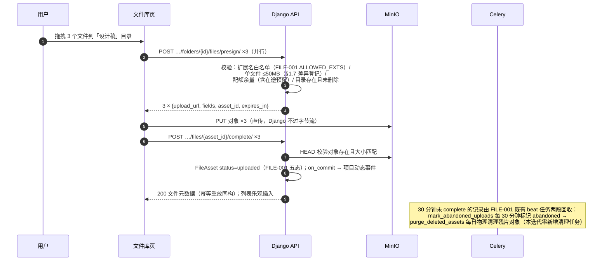
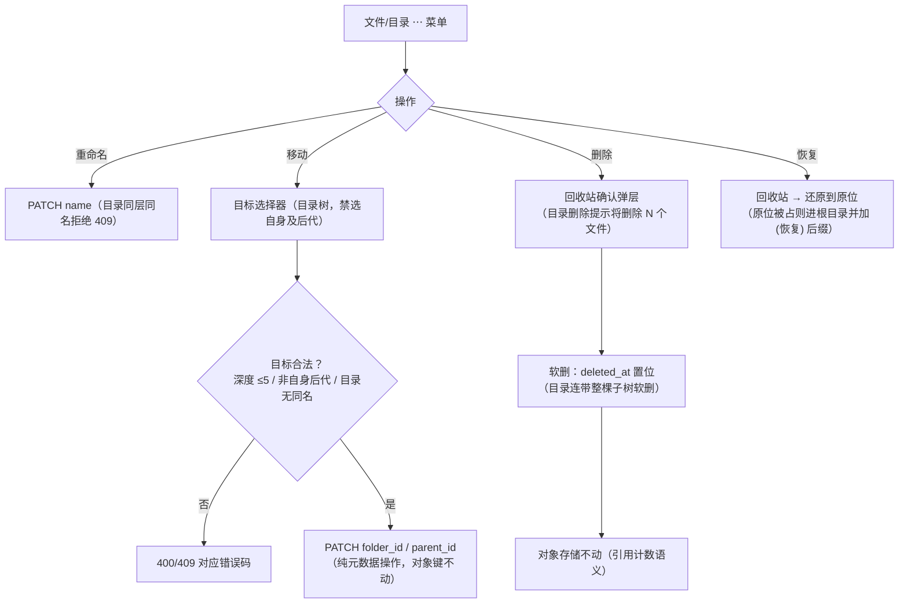
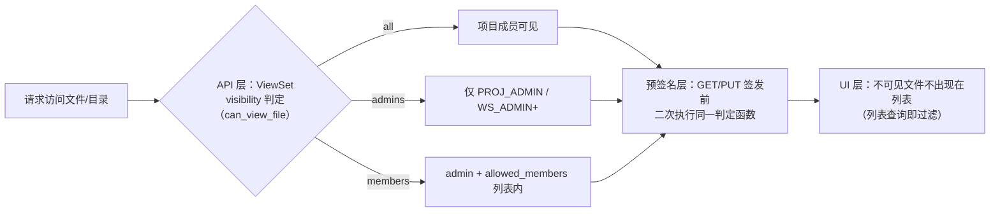
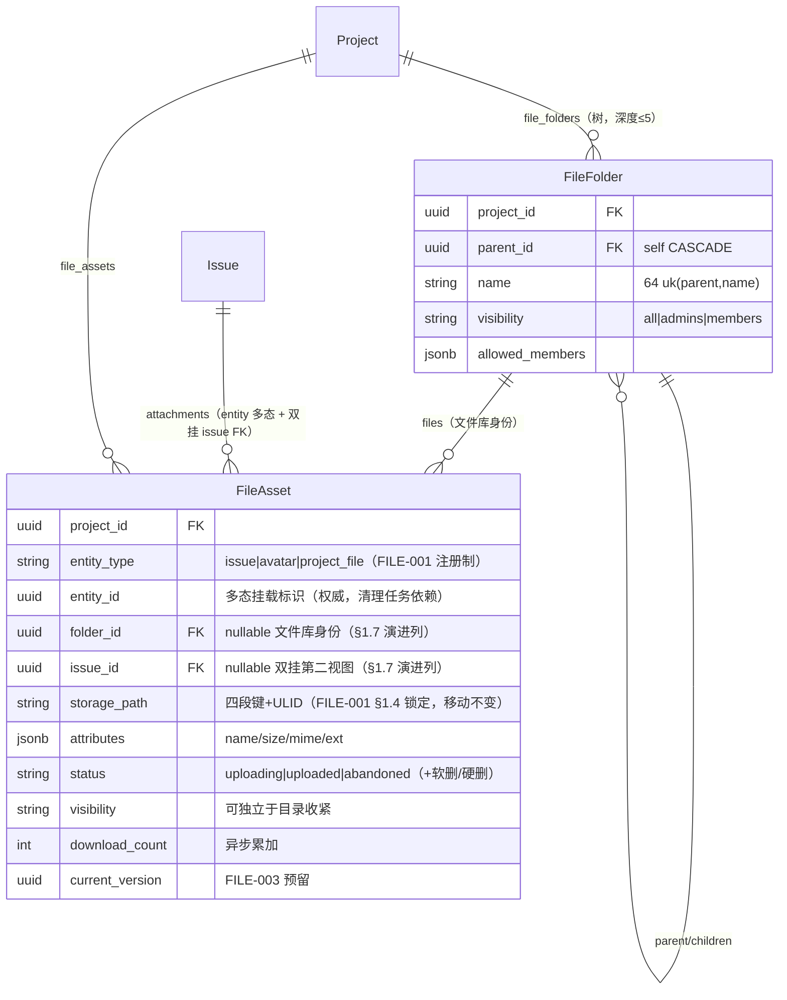

# 项目文件库与多层级目录

| 元信息项 | 内容 |
| --- | --- |
| 文档编号 | FILE-002 |
| 所属迭代 | Sprint 4 — 甘特图 + 文件管理（第 6 周） |
| 优先级 | P2（标准版完整级 · **文件体系的骨架**） |
| 所属模块 | M7-FILE｜文件资源管理 |
| 文档状态 | 待评审（Draft） |
| 最后更新日期 | 2026-09-03 |
| 上游依赖 | `FILE-001`（预签名直传三步、`FileAsset` 多态模型与 §1.4 协议锁定、`ALLOWED_EXTS` 扩展名白名单、abandoned/purge 清理任务——本文扩展方式见 §1.7 演进登记）、`INFRA-002`（MinIO 对象存储与桶策略、pg_trgm 扩展）、`PROJ-002`（成员与角色）、`AUTH-005`（权限门控）、`TASK-010`（Activity 管道） |
| 下游消费 | **`FILE-003`（分片续传 / 预览 / 多版本——直接扩展本骨架）**、`FILE-004`（分享与权限）、`FILE-005`（P3 Wiki）、`INTG-001`（GitHub 附件挂接）、`COLLAB-002`（评论图片引用，`comment_image` 挂载 `FILE-001` 通道） |
| 上游依据 | `docs/需求文档.md` §3.7（项目文件夹创建、多层级目录管理、文件下载重命名移动删除、文件权限管控）、§8.2 文件管理 P2 列 |
| 关联架构文档 | [`api-conventions.md`](../architecture/api-conventions.md)（**§13.2 预签名直传规范**、§8 错误码、§10.5 事务纪律）、[`monorepo-structure.md`](../architecture/monorepo-structure.md)（MinIO 服务）、[`rbac-permission-model.md`](../architecture/rbac-permission-model.md)（`file.*` 权限码） |
| 对标基线 | Plane（**无项目级文件库——仅 Issue 附件**，本系统差异化） · Ones 项目文件模块（目录/权限/版本） |
| 工作量估算 | 后端 3 人日 / 前端 3 人日 / 联调与测试 1 人日，合计 **7 人日** |

---

## 1. 概述

### 1.1 功能定位

P1 的文件能力止步于「任务附件」：文件挂在单个任务下，没有目录、没有项目级沉淀。本迭代把文件升级为**项目资产**：

- **多层级目录**（`FileFolder` 树）——按「需求文档 / 设计稿 / 会议纪要 / 合同」组织，深度 ≤ 5（复用层级治理经验）；
- **项目文件库页**——树形导航 + 列表/网格双视图 + 全部文件操作（上传 / 下载 / 重命名 / 移动 / 删除 / 恢复）；
- **三态可见性权限**——全员可见 / 仅项目管理员 / 指定成员，在 UI、API、预签名三层一致校验；
- **工作空间存储配额**——默认 10GB，超配额拒绝上传（可配置）。

工程主线延续 `FILE-001` 的铁律：**Django 永不接触文件字节流**——一切上传下载走 MinIO 预签名，Django 只管理元数据与权限。

### 1.2 关键约定：`FileAsset` 的双重身份

> ⚠️ P1 的 `FileAsset`（任务附件）与 P2 的文件库**共用一张表**。挂载标识沿用 `FILE-001` 的 `entity_type` 多态注册制（`FILE-001` §1.4 矩阵已为 `FILE-002` 预留 `project_file` 挂载位）；本迭代另增 `folder` / `issue` 两个可空外键作为多态列之上的冗余读列（目录树联查与双挂视图），属 **P2 迭代内演进**——登记与锁定条款引用见 §1.7：

| 身份 | 判定 | 上传入口 | 归属 |
| --- | --- | --- | --- |
| 任务附件 | `entity_type=issue` / `folder` 为空 | 任务详情、评论插图 | `FILE-001` 契约不变 |
| 文件库文件 | `entity_type=project_file`（`entity_id`=目录 id，与 `folder` 外键同值） | 文件库页拖拽上传 | 本文档 |
| 双挂 | `entity_type=project_file` 且 `issue` 与 `folder` 均非空 | 文件库文件「附加到任务」 | 合法（一份对象两个视图入口，元数据单行；任务附件区列表 = `entity_type=issue` 行 ∪ `issue` 外键非空行） |

「双挂」是刻意能力：把文件库的设计稿挂到某个需求任务下，对象存储只有一份，删除任务附件只是解除 `issue` 关联而非删对象——**删除语义按「引用计数」执行**（§2.4 BR-06）。

### 1.3 交付内容

| # | 能力 | 说明 |
| --- | --- | --- |
| 1 | 目录树 | `FileFolder`（项目级、自引用、深度 ≤5、同名同层拒绝）；新建/改名/移动/删除/恢复 |
| 2 | 文件操作 | 上传（复用预签名三步 + 落库到目录）、下载（预签名 GET，5 分钟有效）、重命名、移动（改 folder）、删除（软删进回收站）、恢复 |
| 3 | 文件库页 | 左树右表双视图（列表/网格切换）、面包屑、拖拽上传、拖拽移动、右键/⋯菜单 |
| 4 | 三态可见性 | `visibility ∈ {all, admins, members}` + `allowed_members` 列表；三层校验 |
| 5 | 存储配额 | 工作空间级 `storage_quota_bytes`（默认 10GB）；上传前校验余量 |
| 6 | 检索 | 目录内按名称过滤（trgm 模糊）+ 类型/上传人/时间筛选；全库搜索归 P3 |

### 1.4 范围边界

| 能力 | 本文档（P2） | 归属 |
| --- | --- | --- |
| 目录树 / 文件 CRUD / 回收站 | ✅ | — |
| 三态可见性 + 指定成员 | ✅ | — |
| 存储配额 | ✅ | — |
| 分片续传（>50MB） | ❌（`upload_session` 位预留） | `FILE-003` |
| 在线预览 / 缩略图 | ❌ | `FILE-003` |
| 多版本 / 回滚 / 版本对比 | ❌（`current_version` 列预建） | `FILE-003` |
| 外部分享链接（密码/有效期） | ❌ | `FILE-004` |
| 全库全文搜索 | ❌ | P3 |
| 文件级评论 / @ | ❌（讨论用任务评论承载） | — |
| 水印 / 禁转 / 合规留存 | ❌ | P4 `FILE-006` |
| Wiki | ❌ | P3 `FILE-005` |

### 1.5 前置依赖

| 依赖 | 内容 | 阻塞原因 |
| --- | --- | --- |
| `FILE-001` | `FileAsset` 多态模型、presign/complete 端点、`ALLOWED_EXTS` 扩展名白名单、abandoned/purge 清理 beat | 上传链路复用；本迭代按 §1.7 登记扩展模型 |
| `INFRA-002` | MinIO 桶策略（`{workspace_id}/{project_id}/` 前缀，`FILE-001` §4.1.3 同源）、生命周期规则 | 对象键位规划 |
| `PROJ-002` | 成员与角色（admins/members 候选） | 可见性指定成员校验 |
| `AUTH-005` | 权限门控（rbac §8.2 权限码矩阵与对象级 R1 受限项判定） | 本规格全部端点权限校验（横切依赖，按 overview §3 注约定入本表） |
| `TASK-010` | Activity 管道 | 文件操作留痕（项目动态素材，`COLLAB-003` 消费） |

### 1.6 竞品参考

| 竞品 | 参考点 | 处置 |
| --- | --- | --- |
| Plane | **无项目文件库**——Issue 附件即全部 | 本系统文件库是相对 Plane 开源版的差异化能力 |
| Plane | 附件元数据内联 `attributes` JSONB | `FileAsset.attributes` 延续（name/size/type） |
| Ones | 项目文件模块：目录、权限、版本、预览 | P2 目录+权限；版本/预览 `FILE-003` |
| Confluence | 树形空间 + 权限继承 | 目录可见性**不继承**（P2 每目录独立声明）；P3 视需要加继承 |

### 1.7 与 FILE-001 的协议关系（演进与差异登记）

`FILE-001` §1.4 对文件通道做出两条协议锁定：①存储键结构 `{workspace_id}/{project_id}/{entity_type}/{entity_id}/{ulid}.{ext}`；②状态机五态（uploading / uploaded / abandoned + `deleted_at` 软删 + 硬删 purged 终态）单调迁移——**破坏即架构评审**。本文档对锁定的遵守与必要的演进/差异逐项登记如下：

| # | 事项 | `FILE-001` 现行口径 | 本文档处置 | 登记类型 |
| --- | --- | --- | --- | --- |
| 1 | 挂载模型 | `entity_type + entity_id` 多态单挂载（无 FK，§1.4 注册制） | 新增 `folder` / `issue` 可空外键为**冗余读列**：`entity_type` / `entity_id` 保留为权威挂载标识（清理任务与 `idx_asset_entity` 反查不变），外键与多态列写入时同值同步；存量 `entity_type=issue` 行由 RunPython 回填 `issue_id = entity_id`（§4.1.3） | **P2 迭代内演进**——「双挂」（一行两个视图入口）无法用单挂载点多态表达，外键化换取目录树联查/级联软删与双挂反查 |
| 2 | 状态机 | 五态（锁定条款 ②） | 原样沿用：`uploading`→`uploaded`（complete HEAD 通过）、超时 `abandoned`、软删走 `deleted_at`、期满硬删即 purged 终态；本文不引入新状态名 | 无偏离（遵守锁定） |
| 3 | 存储键 | 四段结构 + ULID（锁定条款 ①） | 文件库挂载段按同一结构注册：`{workspace_id}/{project_id}/project_file/{folder_id}/{ulid}.{ext}`（§4.1.2）；任务附件键不动 | 无偏离（遵守锁定） |
| 4 | 单文件直传上限 | 25MB（§2.4 BR-01） | 项目文件库 50MB（UI / 测试全链按 50MB，见 §2.6） | **项目库差异**——文件库定位项目资产沉淀（演示视频 / 设计源文件），与任务附件的轻量截图场景不同；任务附件 25MB 不回改 |
| 5 | 网关 `/uploads/` 路由 | `client_max_body_size 30m`（`FILE-001` §4.7，25MB+余量） | 上调至 **60m**（50MB + 头部/签名余量）；`proxy_request_buffering off`、动词白名单、API 前缀 2m 均维持 | 随第 4 行差异一并交付（`apps/proxy` 配置变更，§7.1）——不调整则 50MB 直传在网关层即 413 |
| 6 | 清理任务 | `mark_abandoned_uploads`（每 30 分钟标记 abandoned）+ `purge_deleted_assets`（每日：abandoned 1 天 / 软删 30 天 / Issue 级联 30 天） | 两任务复用、beat 调度不变；`purge_deleted_assets` 软删分支按 `storage_path` 键级引用计数判定是否删对象（BR-06），Issue 级联子查询扩展覆盖双挂行（`issue` 外键） | **P2 迭代内演进**——引用计数语义增强，任务名与调度不变 |

---

## 2. 业务逻辑

### 2.1 上传落库流程（复用 + 扩展）



### 2.2 移动 / 重命名 / 删除 / 恢复



### 2.3 可见性判定（三层一致）



> 预签名 URL 有效期仅 5 分钟，且**签发时**必须完成与列表同源的权限判定——「先拿链接再被移出权限」的窗口被 5 分钟时效 + 签发时校验双重收窄（BR-09）。

### 2.4 业务规则汇总

| 编号 | 规则 | 判定位置 | 违反后果 |
| --- | --- | --- | --- |
| BR-01 | 目录深度 ≤ 5（根=1）；目录名 1~64 字符，同层同名拒绝——**根层为 Serializer 单层 + 表达式索引双层**：非根层由偏条件唯一约束兜底；根层 `parent=NULL` 使偏条件约束失效（PG NULL 互异，`(NULL, name)` 不去重），由 Serializer 根层唯一性 `clean` 校验 + `COALESCE` 表达式唯一索引（§4.1.3 RunSQL）双层兜底 | Serializer（全层 clean）+ DB（非根层偏条件唯一 / 根层表达式唯一索引） | `409 RESOURCE_ALREADY_EXISTS` |
| BR-02 | 文件展示名 1~255 字符；同目录同名**允许共存**（对象键含 ULID，`FILE-001` §1.4 锁定键结构，不冲突）——重名由展示区分（`FILE-003` 上线同名新版本策略后收紧） | Serializer | — |
| BR-03 | 上传校验链：扩展名白名单（沿用 `FILE-001` §2.4 BR-01 `ALLOWED_EXTS` 22 类，应用层 + DB Check 双层同源）→ 单文件 ≤ 50MB（项目库差异，任务附件为 25MB，§1.7 第 4 行登记；更大走 `FILE-003` 分片）→ 配额余量（含在途 `uploading` 预留） | Service | `400 VALIDATION_FILE_*` / `409 QUOTA_STORAGE_EXCEEDED` |
| BR-04 | 目录移动禁选自身与后代（环防护，复用 `TASK-004` CTE 判定范式）；移动不改对象键 | Service | `409 RESOURCE_CIRCULAR_DEPENDENCY` |
| BR-05 | 目录删除 = 整棵子树软删（含文件）；需空目录或二次确认显示文件数 | Service | — |
| BR-06 | **删除按引用计数**：软删时对象不删；30 天回收站期满硬删行时，仅当「同 `storage_path` 键无其他存活引用（其他存活 `file_assets` 行 + `FILE-003` 版本行）」才删除对象（双挂行自身硬删即同时解除两个视图） | Celery | — |
| BR-07 | 恢复：原位存在同名目录时进根目录并追加 `(恢复)` 后缀；目录整树恢复 | Service | — |
| BR-08 | 可见性三态在 列表查询（目录树 #1 / 文件列表 #5 / 回收站 #11）与预签名签发（`download-url` #7 对象级判定——本 API 表无独立 GET 详情端点，对象级判定由 `download-url` 承载）各执行点运行**同一判定函数** `can_view_file(user, obj)`（单入口） | Service | 评审拒绝 |
| BR-09 | 预签名 GET 有效期 5 分钟、PUT 30 分钟（`FILE-001` §2.4 BR-07 既有口径，`UPLOAD_URL_TTL=1800`）；签发时实时权限校验 | Service | — |
| BR-10 | 下载计数异步累加（Redis 计数 → beat 批量落库，避免热点行） | Celery | — |
| BR-11 | 配额：`storage_quota_bytes` 存 WS 设置默认 10GB；已用 = Σ `uploaded` 对象 `size`（含头像域，§4.3.4）；达到 95% 告警通知 WS Admin | Service + beat | — |
| BR-12 | 文件操作留痕：上传/重命名/移动/删除/恢复产生项目动态事件（`COLLAB-003` 管道；不入 `IssueActivity`——非任务域） | on_commit | — |
| BR-13 | 权限（rbac §8.2 矩阵原码，不造新码）：读=`file.read`（VIEWER+，受可见性过滤 R6）；上传=`file.upload`（CONTRIBUTOR+）；文件重命名/移动/附加任务=`file.update`（ADMIN 全量，CONTRIBUTOR 仅本人上传——R1 受限项）；删除/恢复/回收站列表/彻底删除=`file.delete`（ADMIN 全量，CONTRIBUTOR 仅本人上传——**回收站列表与 restore 同码同键过滤**：ADMIN/WS_ADMIN 见全量，CONTRIBUTOR 仅见本人删除项，即 `uploaded_by_id == request.user.id` 的软删行；CONTRIBUTOR 仅可删本人上传，故其删除项 ⊆ 上传项，键口径一致；彻底删除仅 ADMIN）；目录新建/改名/移动/删除=`folder.manage`（CONTRIBUTOR+）；可见性配置=`file.permission.manage`（仅 ADMIN，目录与文件同码） | Permission | `403` |
| BR-14 | 项目归档后文件库只读（浏览下载可，写操作 403） | Permission | `403 PERM_PROJECT_ARCHIVED` |

### 2.5 异常处理

| 场景 | HTTP | 错误码 | details 子码 | 前端表现 |
| --- | --- | --- | --- | --- |
| 目录同层同名 | 409 | `RESOURCE_ALREADY_EXISTS` | `UNIQUE` | 输入框行内红 |
| 目录深度超限 | 409 | `RESOURCE_LIMIT_EXCEEDED` | `LIMIT` | 「目录最多 5 层」 |
| 目录移动成环 | 409 | `RESOURCE_CIRCULAR_DEPENDENCY` | `CYCLE` | 目标树禁选自身后代 |
| 文件类型不允许 | 400 | `VALIDATION_FILE_TYPE_NOT_ALLOWED` | — | 拖拽拒绝 + 列出白名单 |
| 单文件超 50MB | 400 | `VALIDATION_FILE_SIZE_EXCEEDED` | — | 「超大文件请等待分片上传支持」（P2 文案） |
| 配额耗尽 | 409 | `QUOTA_STORAGE_EXCEEDED` | `QUOTA` | 弹层显示用量/配额 + 清理建议 |
| 预签名过期使用 | 403 | `PERM_DENIED`（MinIO 侧） | — | 自动重申 presign 重试一次 |
| 可见性不足 | 404 | `RESOURCE_NOT_FOUND` | — | 列表本就不可见；直连 404（存在性隐藏） |
| 恢复冲突 | 200 | —（自动改名） | — | 落根 + `(恢复)` 后缀提示 |
| complete 大小不匹配 | 400 | `VALIDATION_FILE_UPLOAD_MISMATCH` | `INVALID`（field=file_size） | 上传失败重试 |

> **子码登记说明**：`QUOTA`（本表「配额耗尽」行与 §4.2.2 配额示例）与 `LIMIT`（「目录深度超限」行）均为 `details[].code` 级子码，未收录于 [`api-conventions.md`](../architecture/api-conventions.md) §8.8 现行子码注册表（`TOO_SHORT`/`TOO_LARGE`/`UNIQUE` 等，11 行/17 码）——二者**§8.8 待补登（架构文档待回改）**，语义分别为「配额余量不足」与「触达层级/数量上限」；`FILE-003` §2.5 已按本文 `QUOTA` 同码跟随（工作空间配额同场景），`FILE-004` §4.2 亦沿用 `LIMIT` 子码——补登后三文档无需回改语义仅落注册表。

### 2.6 边界条件

| 边界场景 | 限制值 | 超出处理 |
| --- | --- | --- |
| 单文件（直传） | 50MB | 400（分片归 FILE-003；网关 `/uploads/` 已调 60m，§1.7 第 5 行） |
| 单目录文件数 | 无硬限（分页 50） | — |
| 目录深度 | 5 | 409 |
| 目录名 / 文件名 | 64 / 255 | 400 |
| 配额 | 10GB/WS（可配） | 409 + 95% 预警 |
| 回收站保留 | 30 天 | 期满按引用计数清理（BR-06） |
| 预签名在途预留 | 计入配额判定 | 防并发穿透 |
| 批量上传 | 一次 ≤ 20 文件 | 前端分批 |

---

## 3. UI/UX 设计

### 3.1 文件库页（项目导航「文件」入口）

```
┌──────────────────────────────────────────────────────────────────────────────┐
│ 📁 文件     [🔍 名称过滤] [类型▾] [上传人▾] [时间▾]  [⟳列表|▦网格]  [＋上传] │
├──────────────────┬───────────────────────────────────────────────────────────┤
│ 📂 项目文件       │  📂 项目文件 / 📂 设计稿 / 📂 2026Q3            12 个文件 │
│ ├ 📂 需求文档    │ ┌────┬──────────────────┬──────┬──────┬────────┬────────┐│
│ ├ 📂 设计稿 ▌   │ │类型│ 名称              │大小  │上传人│修改时间 │ 操作    ││
│ │  ├ 2026Q3     │ ├────┼──────────────────┼──────┼──────┼────────┼────────┤│
│ │  └ 归档       │ │ 🖼 │ 首页改版-v3.fig  │ 8.2MB│ 张三 │ 09-01  │  ⋯      ││
│ ├ 📂 会议纪要    │ │ 📄 │ 需求评审纪要.docx│ 340KB│ 李四 │ 08-30  │  ⋯      ││
│ ├ 📂 合同       │ │ 🎬 │ 方案演示.mp4     │ 46MB │ 张三 │ 08-28  │  ⋯      ││
│ └ 📂 归档       │ │ 📦 │ 资产打包.zip     │ 12MB │ 王五 │ 08-25  │  ⋯      ││
│                  │ └────┴──────────────────┴──────┴──────┴────────┴────────┘│
│ [＋新建目录]      │            ⤓ 拖拽文件到此处上传到「2026Q3」                │
│ [🗑 回收站 (3)]  │                                                           │
└──────────────────┴───────────────────────────────────────────────────────────┘
```

| 区域 | 组件 | 规格 |
| --- | --- | --- |
| 左树 | 目录树（缩进 16px/层，当前高亮 `▌`），悬浮 ⋯（改名/移动/删除/可见性） | 深度 ≤5 |
| 面包屑 | 路径可点击逐级返回 | — |
| 工具条 | 名称过滤（防抖 300ms）+ 类型/上传人/时间筛选 + 视图切换 + 上传 | — |
| 列表视图 | 表列：类型图标 / 名称 / 大小（人性化）/ 上传人 / 修改时间 / ⋯ | 行 hover 浅底 |
| 网格视图 | 卡片 120×140：类型大图标（缩略位 `FILE-003`）+ 名称两行 + 大小 | — |
| 拖拽上传 | 右区整体 dropzone；拖入蓝色虚线框 + 「松开上传到 {目录}」 | 多文件并行 |
| 拖拽移动 | 文件/目录拖到左树目标（高亮落点） | 环/深度前端预判 |
| 回收站 | 左树底部入口：已删列表 + 还原 / 彻底删除（仅 ADMIN）；列表按 `file.delete` R1 口径过滤——CONTRIBUTOR 仅见本人删除项、ADMIN 全量（§4.2 #11 / BR-13） | 计数徽标（随请求者过滤口径，非全局计数） |

### 3.2 上传进度与状态

| 状态 | 表现 |
| --- | --- |
| 在途 | 列表底部浮层：每文件进度条 + 速度 + 取消；完成即插入列表 |
| 失败 | 浮层行红 + 重试（自动重申 presign） |
| 取消 | 移除浮层行；记录 30 分钟后被标记 abandoned，残片对象次日物理回收（`FILE-001` 既有任务复用） |
| 配额将满 | 上传前预检弹层：用量/配额 + 「仍要上传」/「取消」 |

### 3.3 ⋯ 菜单与操作弹层

| 操作 | 形态 | 要点 |
| --- | --- | --- |
| 下载 | 预签名 GET 触发另存 | 多选打包下载 P4 |
| 重命名 | 行内编辑 | 同层同名即时校验 |
| 移动 | 目录选择弹层（树 + 新建快捷） | 禁选自身后代；显示目标路径 |
| 附加到任务 | 任务搜索弹层 | 建立 `issue` 双挂（§1.2） |
| 可见性 | 三态单选 + 成员多选（members 态） | 仅 ADMIN 可见此项 |
| 删除 | 确认弹层（目录显示 N 文件） | 回收站 30 天提示 |
| 还原（回收站） | 原位/根目录冲突说明 | — |

### 3.4 空状态 / 加载 / 失败

| 场景 | 处置 |
| --- | --- |
| 空目录 | 「拖拽文件到此处，或 [＋上传]」插画 |
| 空文件库 | 首次引导卡：三个示例目录模板（需求文档/设计稿/会议纪要）一键创建 |
| 过滤无结果 | 「未找到匹配文件」+ 清除筛选 |
| 树加载 | 3 级骨架 |
| 下载失败 | 自动重申一次预签名，再失败 Toast |

### 3.5 响应式与无障碍

| 断点 | 布局 |
| --- | --- |
| ≥ 1280px | 左树 260px + 右列表 |
| 768~1279px | 左树收起为目录下拉 |
| < 768px | 单列列表 + 底部上传按钮；拖拽禁用改点选 |

无障碍：树 `role="tree"`；列表语义 `<table>`；⋯ 菜单键盘可达；上传浮层 `role="status" aria-live="polite"` 播报进度里程碑（25/50/75/100%）；删除确认 `role="alertdialog"`；大小与类型图标冗余文本。

---

## 4. 技术架构

### 4.1 数据模型

#### 4.1.1 `FileFolder`（新表）与 `FileAsset`（扩展）

```python
# apps/api/plane/db/models/file.py
class FileFolder(BaseModel):
    """项目文件目录 —— 自引用树，深度 ≤ 5，可见性独立声明（不继承）"""

    class Visibility(models.TextChoices):
        ALL = "all", "全员可见"
        ADMINS = "admins", "仅项目管理员"
        MEMBERS = "members", "指定成员"

    project = models.ForeignKey("db.Project", on_delete=models.CASCADE,
                                related_name="file_folders", verbose_name="所属项目")
    parent = models.ForeignKey("self", on_delete=models.CASCADE, null=True, blank=True,
                               related_name="children", verbose_name="父目录")
    name = models.CharField(max_length=64, verbose_name="目录名")
    visibility = models.CharField(max_length=16, choices=Visibility.choices,
                                  default=Visibility.ALL, verbose_name="可见性")
    allowed_members = models.JSONField(default=list, blank=True,
                                       verbose_name="指定可见成员（UUID 列表，members 态生效）")

    class Meta(BaseModel.Meta):
        db_table = "file_folders"
        constraints = [
            models.UniqueConstraint(
                fields=["parent", "name"],
                condition=models.Q(deleted_at__isnull=True),
                name="uniq_folder_name_per_parent"),
            # 注：偏条件唯一在根层失效——parent=NULL 时 PG 视 NULL 互异，(NULL, name)
            # 不去重；根层同层同名由 Serializer clean + §4.1.3 COALESCE 表达式唯一索引
            # （uniq_folder_name_root）双层兜底（BR-01）。
        ]
        indexes = [
            models.Index(fields=["project", "parent"], name="idx_folder_project_parent"),
        ]


class FileAsset(BaseModel):               # FILE-001 既有模型，本迭代演进范围以 §1.7 登记表为准
    """文件资产 —— 对象存储元数据行（任务附件 / 文件库文件双身份）

    FILE-001 §1.4 两条协议锁定原样遵守：
      ① 存储键 {workspace_id}/{project_id}/{entity_type}/{entity_id}/{ulid}.{ext}
      ② 状态机五态（uploading/uploaded/abandoned + deleted_at 软删 + 硬删 purged 终态）
    P2 迭代内演进（§1.7 第 1 行登记）：folder / issue 双外键为多态列之上的冗余读列。
    """

    class EntityType(models.TextChoices):
        """注册制（FILE-001 §1.4 矩阵）；本迭代注册 project_file 位"""
        ISSUE = "issue", "任务"                       # FILE-001 既有
        AVATAR = "avatar", "头像"                     # FILE-001 既有
        PROJECT_FILE = "project_file", "项目文件库"   # 本迭代注册：entity_id = FileFolder.id

    # FILE-001 既有列（本迭代零改动）：
    #   workspace / project / entity_type / entity_id /
    #   attributes(JSONB: name/size/mime/ext) / size(BigInteger, 独立索引) / storage_path /
    #   status(uploading|uploaded|abandoned) / is_uploaded / uploaded_by
    # 本迭代新增——冗余读外键（§1.7 第 1 行，与 entity_type/entity_id 写入时同值同步）：
    folder = models.ForeignKey(FileFolder, on_delete=models.SET_NULL, null=True, blank=True,
                               related_name="files",
                               verbose_name="所属目录（文件库身份，= entity_id）")
    issue = models.ForeignKey("db.Issue", on_delete=models.SET_NULL, null=True, blank=True,
                              related_name="dual_mount_files",
                              verbose_name="双挂任务（第二视图入口，可空）")
    # 本迭代新增——可见性与统计：
    visibility = models.CharField(max_length=16, choices=FileFolder.Visibility.choices,
                                  default=FileFolder.Visibility.ALL,
                                  verbose_name="可见性（默认随目录，可独立收紧）")
    allowed_members = models.JSONField(default=list, blank=True)
    download_count = models.PositiveIntegerField(default=0, verbose_name="下载次数")
    # FILE-003 预留（本次迁移一并建列，后续零 DDL）：
    #   current_version = FK("db.FileVersion", null=True)
    #   upload_session  = OneToOneField("db.UploadSession", null=True)

    class Meta(BaseModel.Meta):
        db_table = "file_assets"
        indexes = [
            # FILE-001 既有索引保留不动：idx_asset_entity / idx_asset_status_time / idx_asset_ws_status
            models.Index(fields=["project", "folder"], name="idx_asset_project_folder"),      # 目录文件列表取数
            models.Index(fields=["issue"], name="idx_asset_issue"),                          # 双挂反查任务附件区
            # 名称 trgm 模糊过滤与上传人/时间筛选的取数索引（CI 索引约束；GIN trgm 在 §4.1.3 迁移落表）：
            models.Index(fields=["project", "uploaded_by", "created_at"],
                         name="idx_asset_project_uploader"),
        ]
```



#### 4.1.2 对象键位规划（MinIO）

```
文件库（本迭代注册挂载段）：{workspace_id}/{project_id}/project_file/{folder_id}/{ulid}.{ext}
任务附件（FILE-001 既有，不动）：{workspace_id}/{project_id}/issue/{issue_id}/{ulid}.{ext}
说明：键结构遵守 FILE-001 §1.4 锁定条款 ①（四段层级 + ULID）；目录 id 入键仅助排障，
     移动目录不改键（寻址走元数据，ULID 保证唯一）
回收站：不移动键位（软删仅置 deleted_at）；30 天期满按 storage_path 键级引用计数删对象（BR-06）
```

#### 4.1.3 迁移

```python
# 00XX_p2_file_library.py
def backfill_issue_fk(apps, schema_editor):
    """§1.7 第 1 行：存量 issue 域全部行回填冗余外键 entity_id → issue_id（avatar 等其他域跳过）"""
    FileAsset = apps.get_model("db", "FileAsset")
    FileAsset.objects.filter(entity_type="issue").update(issue_id=F("entity_id"))


operations = [
    migrations.CreateModel(...),                          # FileFolder
    migrations.AddField(model_name="fileasset", name="folder", ...),
    migrations.AddField(model_name="fileasset", name="issue", ...),
    migrations.AddField(model_name="fileasset", name="visibility", ...),
    migrations.AddField(model_name="fileasset", name="allowed_members", ...),
    migrations.AddField(model_name="fileasset", name="download_count", ...),
    # current_version / upload_session 预留列一并建齐（FILE-003 零 DDL）
    migrations.RunPython(backfill_issue_fk, migrations.RunPython.noop),   # 存量回填（§1.7 第 1 行）
    # 根层唯一性表达式索引（BR-01 第二层）：偏条件约束 uniq_folder_name_per_parent
    # 在 parent=NULL 时失效（PG NULL 互异）——根层同层同名由 COALESCE 归一父键后的
    # 表达式唯一索引兜底（Serializer clean 校验为第一层；project_id 入键保证跨项目
    # 根层互不影响）：
    migrations.RunSQL(
        sql="CREATE UNIQUE INDEX IF NOT EXISTS uniq_folder_name_root "
            "ON file_folders (project_id, COALESCE(parent_id::text, ''), name) "
            "WHERE deleted_at IS NULL;",
        reverse_sql="DROP INDEX IF EXISTS uniq_folder_name_root;"),
    # 名称 trgm 模糊过滤索引（§4.2.1 ?name= 筛选取数；pg_trgm 扩展由 INFRA-002
    # init-extensions.sql / INFRA-003 首个 migration 预建，此处不重复 CREATE EXTENSION）：
    migrations.RunSQL(
        sql="CREATE INDEX IF NOT EXISTS idx_asset_name_trgm "
            "ON file_assets USING gin ((attributes->>'name') gin_trgm_ops);",
        reverse_sql="DROP INDEX IF EXISTS idx_asset_name_trgm;"),
]
```

### 4.2 API 定义

| # | 方法 | 路径 | 描述 | 权限 | 成功码 |
| --- | --- | --- | --- | --- | --- |
| 1 | `GET` | `…/projects/{project_id}/folders/` | 目录树（**按请求者可见性剪枝**，逐目录独立判定——`all` 恒显；`admins` 态仅 PROJ_ADMIN / WS_ADMIN+；`members` 态 = admins ∪ `allowed_members` 列表内成员；与 `can_view_file` 同一单入口判定，§4.3.1/BR-08。父可见子不可见时：子目录（含其整棵子树）隐藏，父级文件计数**不透出**不可见子孙——防计数侧信道；**父不可见而子可见**（父 `admins`、子 `all`）的目录同样隐藏——树呈现以「到根的全部祖先均可见」为前提（祖先不可见则整支不呈现），计数不透出） | `file.read` | `200` |
| 2 | `POST` | `…/projects/{project_id}/folders/` | 新建目录 | `folder.manage` | `201` |
| 3 | `PATCH` | `…/folders/{folder_id}/` | 改名/移动=`folder.manage`；可见性=`file.permission.manage` | `folder.manage` / `file.permission.manage` | `200` |
| 4 | `DELETE` | `…/folders/{folder_id}/` | 删除（整树软删，回传文件数） | `folder.manage` | `200` |
| 5 | `GET` | `…/folders/{folder_id}/files/` | 目录文件列表（游标+筛选） | `file.read`（可见性过滤） | `200` |
| 6 | `POST` | `…/folders/{folder_id}/files/presign/` | 上传预签名（三步复用） | `file.upload` | `201` |
| 7 | `GET` | `…/files/{asset_id}/download-url/` | 下载预签名（5 分钟） | `file.read`（实时校验） | `200` |
| 8 | `PATCH` | `…/files/{asset_id}/` | 重命名/移动/附加任务=`file.update`（CONTRIBUTOR 仅本人上传，R1 受限项）；可见性=`file.permission.manage` | `file.update` / `file.permission.manage` | `200` |
| 9 | `DELETE` | `…/files/{asset_id}/` | 删除（软删） | `file.delete`（ADMIN 或上传者） | `204` |
| 10 | `POST` | `…/files/{asset_id}/restore/` | 回收站还原 | `file.delete` | `200` |
| 11 | `GET` | `…/projects/{project_id}/files/trash/` | 回收站列表（与 restore #10 同码 `file.delete`：ADMIN/WS_ADMIN 全量；CONTRIBUTOR 仅本人删除项——R1 同键 `uploaded_by_id == request.user.id` 过滤，BR-13；否则 CONTRIBUTOR 删自己文件后反而看不到回收站无法自恢复） | `file.delete` | `200` |
| 12 | `GET` | `…/projects/{project_id}/files/storage/` | 配额用量 | `file.read` | `200` |
| 13 | `DELETE` | `…/files/{asset_id}/purge/` | 回收站彻底删除（硬删行 + 引用计数判定删对象，BR-06；不可恢复） | `file.delete`（仅 PROJ_ADMIN 收紧） | `200` |
| 14 | `POST` | `…/files/{asset_id}/complete/` | 完成确认（三步第三步，§2.1 时序消费）：HEAD 校验对象存在与大小 → `status=uploaded`；**幂等**——重复调用对已 `uploaded` 行直接 200（协议复用 `FILE-001` §4.3.2 `AssetService.complete`；`FILE-003` §1.6 第 4 条在此接线版本行） | `file.upload` | `200` |

#### 4.2.1 `GET …/folders/{folder_id}/files/` — 目录文件列表

**请求**

```http
GET /api/v1/workspaces/acme/projects/7b3e9c1a-…/folders/9a1b2c3d-…/files/?name=设计&ordering=-created_at&per_page=50 HTTP/1.1
```

**成功响应 `200`**

```json
{
  "status": "success",
  "data": [
    {
      "id": "c1d2e3f4-5a6b-4c7d-8e9f-0a1b2c3d4e5f",
      "name": "首页改版-v3.fig",
      "size_bytes": 8388608, "content_type": "application/octet-stream",
      "type_category": "image",
      "visibility": "all",
      "folder_id": "9a1b2c3d-4e5f-4a6b-8c9d-0e1f2a3b4c5d",
      "issue_id": null,
      "uploaded_by": "6c7d1a2b-3e4f-4a5b-9c8d-7e6f5a4b3c2d",
      "download_count": 12,
      "created_at": "2026-09-01T02:14:33.001Z",
      "updated_at": "2026-09-01T02:14:33.001Z"
    }
  ],
  "meta": { "next_cursor": null, "prev_cursor": null,
            "next_page_results": false, "prev_page_results": false,
            "count": 1, "total_count": 1, "total_pages": 1,
            "page": 1, "per_page": 50, "total_size_bytes": 8388608 }
}
```

> `meta` 前九字段为 [`api-conventions.md`](../architecture/api-conventions.md) §6.3 必含字段全集；`total_size_bytes` 为本端点在九字段之外的扩展字段，支撑目录容量展示。`type_category` 由 content_type 映射（image/document/video/archive/other），图标与筛选复用。`uploaded_by` **默认返回 ID 字符串**（关联字段默认 ID——api-conventions §4.5/§14 端点交付检查清单；与 `FILE-001` §4.3.3 列表响应同源形态）；对象形态（`{id, display_name}`）**仅在 `?expand=uploaded_by` 时**按 §5.2 组合行为追加（原 ID 字段照常保留；`expand_map` 须声明 `select_related("uploaded_by")` 映射，白名单未声明不得展开）。

**失败响应 `404`（可见性不足，存在性隐藏）**

```json
{
  "status": "error",
  "error": {
    "code": "RESOURCE_NOT_FOUND",
    "message": "目录不存在或你没有访问权限",
    "request_id": "01JCBC2B5ZD4W7X3D1E5F6G8H9"
  }
}
```

#### 4.2.2 `POST …/folders/{folder_id}/files/presign/` — 上传预签名

**请求**

```json
{ "file_name": "首页改版-v3.fig", "file_size": 8388608,
  "content_type": "application/octet-stream" }
```

**失败响应 `409`（配额）**

```json
{
  "status": "error",
  "error": {
    "code": "QUOTA_STORAGE_EXCEEDED",
    "message": "工作空间存储空间不足",
    "details": [{ "field": "file_size", "code": "QUOTA",
                  "message": "已用 9.8GB / 10GB，本次需 8MB" }],
    "request_id": "01JCBC2B5ZD4W7X3D1E5F6G8H0"
  }
}
```

> `details` 子码 `QUOTA` 未收录于 api-conventions §8.8 现行子码注册表——登记口径见 §2.5 表后「子码登记说明」（§8.8 待补登，架构文档待回改；`FILE-003` §2.5 同码跟随）。`FILE-001` §4.4 AssetService 日配额场景（`_check_daily_quota`）对同错误码使用已注册子码 `TOO_LARGE`（数值越界），与本处的 `QUOTA`（配额余量语义）分属不同 field 场景，不冲突。

**成功响应 `201`**：同 `FILE-001` §4.3.1 presign 结构（`asset_id` / `upload_url` / `method` / `fields` / `expires_in`，协议原文见架构 §13.2）；落库时 `entity_type=project_file`、`entity_id=folder_id`，`folder` 外键同值绑定（§1.7 第 1 行）。

#### 4.2.3 `GET …/files/storage/` — 配额用量

```json
{
  "status": "success",
  "data": { "quota_bytes": 10737418240, "used_bytes": 10522669875,
            "pending_bytes": 20971520, "usage_ratio": 0.98 }
}
```

### 4.3 核心逻辑

#### 4.3.1 可见性单入口（三层一致的本体）

```python
# apps/api/plane/db/services/file_permission.py
def can_view_file(user, asset_or_folder) -> bool:
    """BR-08：目录树/文件列表/回收站列表查询过滤与预签名（download-url）对象级判定
    共用的唯一判定函数——无独立 GET 详情端点，对象级判定由 download-url 承载。"""
    v = asset_or_folder.visibility
    if v == "all":
        return has_project_role(user, asset_or_folder.project_id, min_role=5)
    if v == "admins":
        return (has_project_role(user, asset_or_folder.project_id, min_role=20)
                or has_ws_role(user, ws_id_of(asset_or_folder), min_role=15))  # WS_ADMIN 隐式
    return (has_project_role(user, asset_or_folder.project_id, min_role=20)
            or str(user.id) in set(asset_or_folder.allowed_members))


def presign_download(user, asset: FileAsset) -> str:
    if not can_view_file(user, asset):                       # 签发时实时校验（BR-09）
        raise NotFound()                                     # 存在性隐藏 → 404
    _incr_download_count_async(asset.id)                     # BR-10
    return minio_client.presigned_get_object(
        bucket="rp-uploads", key=asset.storage_path,
        expires=300)                                         # 5 分钟（FILE-001 DOWNLOAD_URL_TTL 同源）
```

#### 4.3.2 目录环与深度校验（复用 `TASK-004` 范式）

```python
@transaction.atomic
def move_folder(*, folder_id: uuid.UUID, new_parent_id: uuid.UUID | None) -> FileFolder:
    """移动目录：环防护 + 深度预算（整棵子树高度），纯元数据操作。"""
    folder = FileFolder.objects.select_for_update().get(
        id=folder_id, deleted_at__isnull=True)
    if new_parent_id:
        parent = FileFolder.objects.get(id=new_parent_id, deleted_at__isnull=True)
        if parent.project_id != folder.project_id:
            raise ValidationError({"parent_id": "跨项目移动不允许"})
        if _folder_is_descendant(parent, folder):            # BR-04 CTE 上行
            raise CircularDependencyError()
        if _folder_depth(parent) + 1 + _subtree_height(folder) > 5:
            raise LimitExceeded(limit=5)
    folder.parent_id = new_parent_id
    folder.save(update_fields=["parent", "updated_at"])
    return folder                                            # 对象键不动
```

#### 4.3.3 引用计数删除（对象生命周期）

```python
# apps/api/plane/bgtasks/asset_cleanup.py（FILE-001 既有任务，本迭代增强软删分支——§1.7 第 6 行登记）
@shared_task
def purge_deleted_assets() -> dict:
    """每日 02:30（FILE-001 beat 调度不变）——回收站 30 天期满分支（BR-06）：
    元数据硬删（purged 终态）+ 按 storage_path 键级引用计数决定是否删对象。

    对象删除条件（同键多行自 FILE-003 版本历史起可能出现）：
      NOT EXISTS(其他存活 file_assets 行同键) AND NOT EXISTS(存活 file_versions 同键)
    abandoned 残片（1 天）分支维持 FILE-001 原逻辑；Issue 级联（30 天）子查询扩展为
    Q(entity_type='issue', entity_id__in=…) | Q(issue_id__in=…)——覆盖双挂行。
    """
    expired = FileAsset.all_objects.filter(
        deleted_at__lt=timezone.now() - timedelta(days=30))
    for asset in expired.iterator():
        if not _has_live_references(asset.storage_path):     # 键级引用计数
            minio_client.remove_object(bucket="rp-uploads", key=asset.storage_path)
        asset.delete(hard=True)                              # 元数据硬删（purged 终态）
    ...
```

#### 4.3.4 配额判定（含在途预留）

```python
def assert_quota(*, workspace_id: uuid.UUID, incoming: int) -> None:
    with transaction.atomic():
        # 行锁必须求值（赋值给 _），否则 Django 丢弃仅 SELECT 的裸锁、失去串行化语义
        # （FILE-001 §4.4 AssetService _check_task_limit 同一先例——其 R1 反馈第 9 项修正）。
        # Workspace 行锁将同工作空间的并发 presign 配额判定串行化：两笔临界并发
        # 一先一后进入判定，后到者 Sum 即读到先行者落库的 uploading 行 → 恰一笔 409
        # （UT-10「并发两笔恰一笔成功」的机制支撑；纯读判定无锁时两笔可同时通过）。
        locked = Workspace.objects.select_for_update().filter(
            pk=workspace_id).only("id").first()
        _ = locked                                           # 求值即获取行锁
        quota = get_workspace_quota(workspace_id)            # 默认 10GB
        # 按 workspace 直查（非 project__workspace）：头像域行（entity_type=avatar，
        # FILE-001 中 project 为空）一并计入配额，杜绝按项目聚合漏掉的头像体积
        used = FileAsset.objects.filter(
            workspace_id=workspace_id, status="uploaded",
            deleted_at__isnull=True).aggregate(s=Sum("size"))["s"] or 0   # FILE-001 独立 size 列（有索引），非 attributes JSONB
        pending = FileAsset.objects.filter(
            workspace_id=workspace_id, status="uploading"
        ).aggregate(s=Sum("size"))["s"] or 0
        if used + pending + incoming > quota:                # 在途计入（BR-03）
            raise QuotaExceeded(used=used, quota=quota, incoming=incoming)
```

### 4.4 前端实现

- `FileLibraryStore`（`packages/shared-state`）：`folderTree`（SWR `project:{id}:folders`）、`filesByFolder:{cursor}`、`trash`、`storage`；上传队列（并行 3；断点续传 `FILE-003`）。
- 组件：`FolderTree`（复用 `TASK-004` 树交互）、`FileTable`/`FileGrid` 双视图、`UploadDropzone`（整页 dropzone + 进度浮层）、`MoveTargetPicker`（环预判）、`VisibilityEditor`（三态 + 成员多选）。
- 下载：点击 → `GET download-url` → `window.open`；403 过期自动重申一次。
- 配额条：侧栏底部进度条（≥95% 红）。

---

## 5. 测试用例

### 5.1 单元测试

| 用例 ID | 测试目标 | 输入 | 预期输出 | 覆盖类型 |
| --- | --- | --- | --- | --- |
| UT-01 | 目录同名 | 同层建同名 | 409 UNIQUE | 异常 |
| UT-02 | 深度上限 | 第 6 层 | 409 LIMIT | 边界 |
| UT-03 | 移动成环 | 父移到子下 | 409 CYCLE | 异常 |
| UT-04 | 跨项目移动 | 目标他项目 | 400 | 安全 |
| UT-05 | 同名文件共存 | 同目录两名 | 均成功（键含 ULID） | 边界 |
| UT-06 | 可见性 all | VIEWER 浏览 | 可见 | 正常 |
| UT-07 | 可见性 admins | CONTRIBUTOR | 列表不可见；直连 404 | 安全 |
| UT-08 | 可见性 members | 指定本人 | 可见；他人 404 | 安全 |
| UT-09 | 预签名实时校验 | 拿链接后被移出 | 新签发 404 | 安全 |
| UT-10 | 配额在途预留 | 临界 + 并发两笔 | 恰一笔成功（Workspace 行锁串行化判定——§4.3.4，`FILE-001` `_check_task_limit` 同范式） | 并发 |
| UT-11 | 双挂删除语义 | 删任务附件关系 | 文件库行与对象存活 | 正常 |
| UT-12 | 回收站期满 | 30 天后 beat | 无引用对象删除；有引用保留 | 正常 |
| UT-13 | 恢复冲突 | 原位同名 | 落根 + `(恢复)` | 边界 |
| UT-14 | 目录级联软删 | 删含 12 文件目录 | 整树软删，回传 12 | 正常 |
| UT-15 | 50MB 上限 | 51MB | 400 SIZE_EXCEEDED | 边界 |
| UT-16 | 项目归档只读 | 归档后上传 | 403 | 安全 |
| UT-17 | 回收站彻底删除 | ADMIN purge；构造同键版本行引用（FILE-003 造数）；CONTRIBUTOR 调用 | 200 行硬删；无引用对象删、有引用对象保留（BR-06）；CONTRIBUTOR 403 | 安全 |
| UT-18 | 下载计数异步累加 | `download-url` ×3 → 触发 beat 批量任务 | Redis 计数 3；落库后 `download_count=3`（BR-10——热点行零同步直写） | 正常 |
| UT-19 | 文件更新 R1 受限（范式：`FILE-001` UT-15） | CONTRIBUTOR `PATCH` 他人上传的文件（actor ≠ `uploaded_by_id`）；再改本人上传行 | 他人行 403 `PERM_DENIED`（BR-13 `file.update` R1 受限项）；本人行 200 | 安全 |
| UT-20 | 目录新建角色边界 | VIEWER `POST …/folders/`；CONTRIBUTOR 同操作 | VIEWER 403 `PERM_DENIED`（`folder.manage` CONTRIBUTOR+，BR-13）；CONTRIBUTOR 201 | 安全 |
| UT-21 | 目录树可见性剪枝 | admins 态目录 + members 态目录（仅指定本人）+「父 all / 子 admins」结构 | `GET …/folders/`：不可见目录（含整棵子树）不出树；父级文件计数不透出不可见子孙（§4.2 #1） | 安全 |

### 5.2 集成测试

| 用例 ID | 场景 | 前置条件 | 操作步骤 | 预期结果 |
| --- | --- | --- | --- | --- |
| IT-01 | 上传全链路 | MinIO 就绪 | presign→PUT→complete | status=uploaded（FILE-001 五态）；对象落位；无 Django 字节流日志 |
| IT-02 | complete 校验 | — | PUT 半量后 complete | 400（HEAD 大小不匹配） |
| IT-03 | 孤儿回收 | presign 不 complete | 加速时钟 | 30 分钟标记 abandoned（FILE-001 既有任务复用），次日残片对象与记录物理清理 |
| IT-04 | 移动零对象操作 | 含 1GB 文件目录 | 计时 + S3 列表 | 毫秒级；键不变 |
| IT-05 | 可见性三层一致 | admins 态 | 列表/目录树/download-url 三路 | 全部不可见/404 |
| IT-06 | 配额 95% 预警 | 灌至 95% | beat 扫描 | WS Admin 收通知 |
| IT-07 | 万文件浏览 | 万级单目录 | 翻页 | P95 < 300ms |
| IT-08 | 动态留痕 | 上传/移动/删除 | 项目动态 | 三类事件齐全 |
| IT-09 | 目录树剪枝与计数不透出 | admins 态目录一、members 态目录一（仅指定成员甲）、含「父 all / 子 admins」与「父 admins / 子 all」结构 | VIEWER / CONTRIBUTOR 乙 / ADMIN 三角色分别 `GET …/folders/`，甲再查一次 | 三角色树形差异正确且与 `can_view_file` 同源（BR-08）：admins 态目录仅 ADMIN 可见；members 态仅甲与 ADMIN 可见；父可见子不可见时子树隐藏、父级计数不含不可见子孙；父 admins / 子 all 时子目录虽通过自身逐目录判定仍整支不呈现（「到根的全部祖先均可见」前提）、计数不透出 |

### 5.3 E2E 测试

| 用例 ID | 用户场景 | 操作路径 | 验收标准 |
| --- | --- | --- | --- |
| E2E-01 | 首次建库 | 模板三目录 → 拖 3 文件 | 树/列表/进度浮层正确；刷新保持 |
| E2E-02 | 目录管理 | 建 4 层 → 改名 → 拖动移动 | 面包屑与树同步；环被禁选 |
| E2E-03 | 权限体验 | admins 文件以 CONTRIBUTOR 看 | 不可见；ADMIN 可见可配置 |
| E2E-04 | 回收站往返 | 删目录 → 回收站还原 → ADMIN 彻底删除 | 计数正确；冲突落根带后缀；purge 后不可恢复（CONTRIBUTOR 操作入口不可见） |
| E2E-05 | 下载与过期 | 下载 → 6 分钟后复用旧链接 | 403 → 自动重签成功 |

---

## 6. 竞品深度对标

### 6.1 Plane 实现分析

- 开源版 Plane **没有项目文件库**——`IssueAttachment`/FileAsset 体系仅服务任务附件，无目录、无项目级聚合、无可见性控制、无配额。其 `apps/api/plane/app/views/file.py`（新版资产体系）核心是「对象存储抽象 + 预签名」，**不含库语义**。
- 本系统的分层借鉴其资产层（`FileAsset` + attributes 内联 + 预签名三步在 `FILE-001` 已落地），在其上补齐「目录树 + 可见性 + 配额 + 回收站」的库语义——相对 Plane 开源版的净增量。

### 6.2 Ones 实现分析

- Ones 项目文件模块提供目录、权限（角色/成员粒度读写）、版本、预览、配额——面向企业文档治理。本系统 P2 交付目录+可见性+配额+回收站；版本与预览紧跟（`FILE-003`），水印合规 P4。
- Ones 的权限粒度（按成员/角色分别授权读写）比三态更细——P2 三态（all/admins/members）覆盖 90% 场景且认知成本低；P4 合规场景再评估细粒度 ACL。

### 6.3 本系统设计决策

1. **一表双身份 + 引用计数删除**：附件与库文件共用 `FileAsset`（挂载标识仍走 `FILE-001` `entity_type` 注册制，`folder`/`issue` 双外键为 §1.7 登记的 P2 演进列），一份对象多视图入口；删除按「`storage_path` 键级引用计数」——避免「删任务附件把库里同一份设计稿删了」的经典事故，也省一倍存储。
2. **可见性单入口函数**：`can_view_file` 在列表/目录树/download-url 三处强制复用（BR-08 评审红线）——权限 bug 最常见来源就是三处各自实现。
3. **移动是纯元数据操作**：对象键（四段结构 + ULID，`FILE-001` §1.4 锁定）不含路径语义，移动目录毫秒级零对象操作——「路径语义在元数据层」是对象存储的正确用法。
4. **在途预留的配额判定**：pending presign 计入余量 + Workspace 行锁串行化并发判定（§4.3.4，`FILE-001` `_check_task_limit` 同范式），堵住并发上传穿透配额的窗口（UT-10）。
5. **回收站 30 天 + 引用计数期满清理**：用户安全的删除缓冲与企业级的存储治理合一。

---

## 7. 里程碑与验收

### 7.1 交付物清单

| 类型 | 交付物 |
| --- | --- |
| Model / Migration | `FileFolder` 新表；`FileAsset` 扩展（folder/issue 演进外键 + visibility/allowed_members/download_count + FILE-003 预留列）；索引（目录列表 / 双挂反查 / 上传人复合 + GIN trgm 名称模糊 + 根层 `COALESCE` 表达式唯一索引，BR-01）；`entity_type=issue` 存量行 RunPython 回填 |
| 后端 | 目录 CRUD+移动环校验（树按可见性剪枝、根层唯一 Serializer clean 双层）、文件 CRUD/上传完成确认（complete，FILE-001 §4.3.2 协议复用）/下载预签名/恢复/回收站/彻底删除、`can_view_file` 单入口、配额判定（Workspace 行锁串行化 + 在途预留，含头像域）、`purge_deleted_assets` 引用计数增强（FILE-001 任务复用）与下载计数 beat |
| 网关 | `/uploads/` 直传路由 `client_max_body_size` 30m → 60m（§1.7 第 5 行；50MB 直传防网关 413），其余指令维持 |
| 前端 | 文件库页（树/面包屑/双视图/dropzone/进度浮层/配额条）、移动选择器、可见性编辑器、回收站页 |
| 测试 | UT-01~21、IT-01~09、E2E-01~05 |

### 7.2 可操作演示的验收标准

1. 模板一键建库 → 拖拽上传 3 个不同类型文件：进度浮层逐文件推进，完成即入列表；MinIO 对象落位、Django 无字节流日志。
2. 建至 4 层目录并拖动移动：面包屑/树即时同步；父目录拖到自己后代被禁选；移动含 1GB 文件的目录耗时毫秒级（对象零操作）。
3. 三态可见性：设为「仅管理员」的文件，CONTRIBUTOR 列表不可见且直连 404；ADMIN 可见并可改回全员。
4. 配额：灌至 9.8GB 后上传 8MB 被拒并显示用量明细；WS Admin 收到 95% 预警通知。
5. 回收站往返：删除含 12 文件的目录 → 回收站计数 → 还原（构造同名冲突时落根带 `(恢复)`）；30 天期满无引用对象被清理（加速时钟演示）。
6. 任务双挂：把库内设计稿「附加到任务」，任务附件区可见；解除挂接后文件库与对象均无损。
