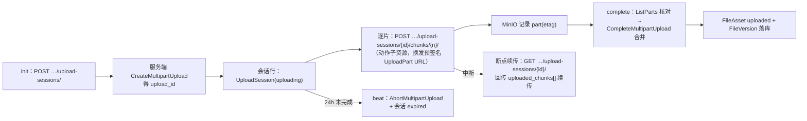
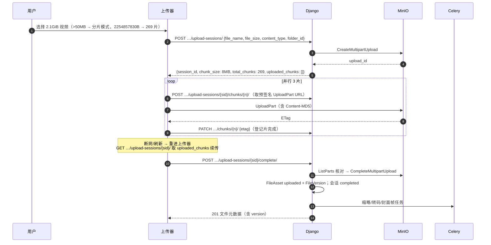
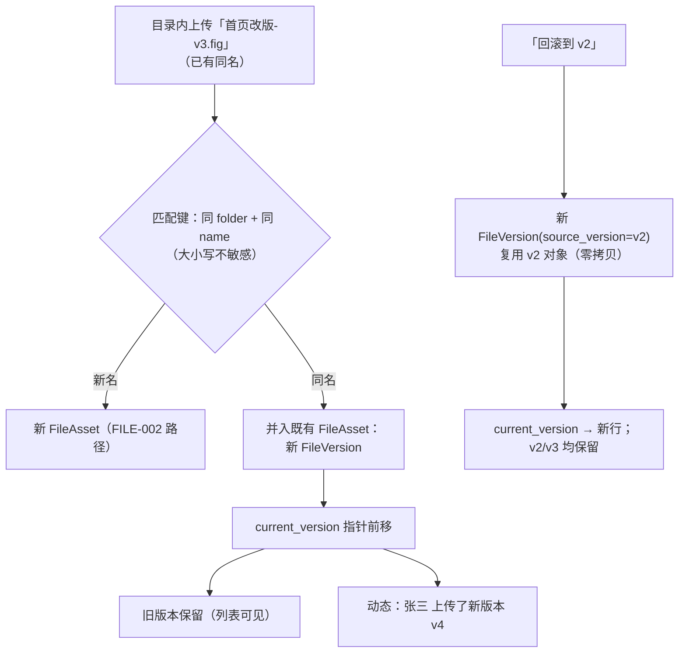
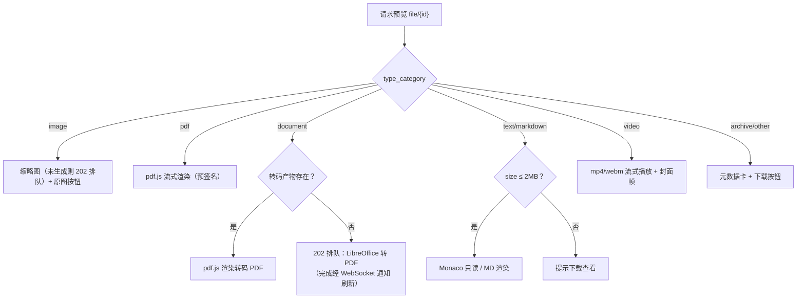
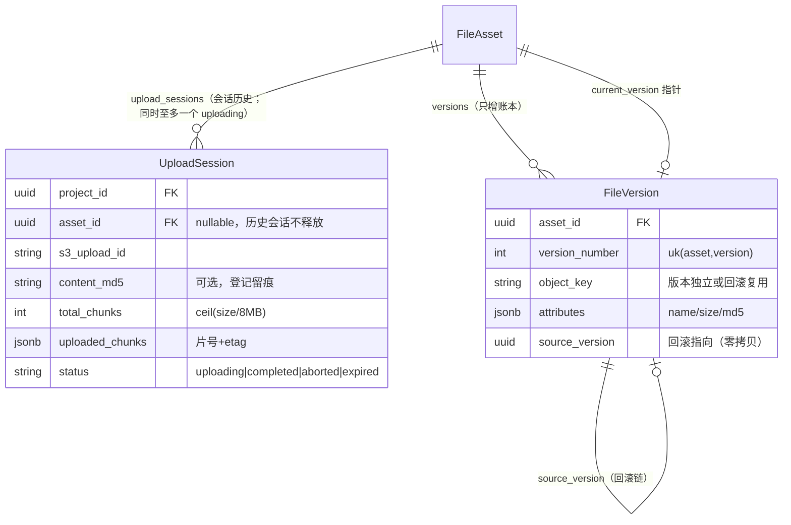

# 大文件分片续传 / 在线预览 / 多版本

| 元信息项 | 内容 |
| --- | --- |
| 文档编号 | FILE-003 |
| 所属迭代 | Sprint 4 — 甘特图 + 文件管理（第 6 周） |
| 优先级 | P2（标准版完整级） |
| 所属模块 | M7-FILE｜文件资源管理 |
| 文档状态 | 待评审（Draft） |
| 最后更新日期 | 2026-09-03 |
| 上游依赖 | **`FILE-002`（文件库骨架、`current_version` 版本指针列、回收站与引用计数）**、`FILE-001`（直传三步与白名单、302 预签名换发先例）、`INFRA-002`（MinIO multipart、Celery worker/beat 编排）、`COLLAB-003`（版本事件入动态流）、`COLLAB-004`（WebSocket 事件协议——`file.*` 事件本文 §4.4 登记、其 §1.3/§2.3 待补登） |
| 下游消费 | `FILE-004`（分享的预览/下载权限分派消费预览器）、`FILE-005`（P3 Wiki 复用预览器与版本）、`INTG-001`（外部附件版本化挂接） |
| 上游依据 | `docs/需求文档.md` §3.7（大文件分片续传、常见格式在线预览、文件多版本管理与版本回溯）、§8.2 文件管理 P2 列 |
| 关联架构文档 | [`api-conventions.md`](../architecture/api-conventions.md)（§13.2 直传规范扩展、§8 错误码）、[`monorepo-structure.md`](../architecture/monorepo-structure.md)（Celery、MinIO）、[`tech-stack.md`](../architecture/tech-stack.md) |
| 对标基线 | Plane（无分片/预览/版本——开源版附件即终点） · Ones 文件模块（版本回溯与预览） · 网盘类产品（分片续传范式） |
| 工作量估算 | 后端 3.5 人日 / 前端 3 人日 / 联调与测试 1.5 人日，合计 **8 人日** |

---

## 1. 概述

### 1.1 功能定位

`FILE-002` 交付了「库」，本文档交付库的三个进阶能力，让文件体系从「能存」到「好用」：

1. **分片续传**——>50MB 文件强制走 multipart：8MB/片、断点续传（已传片号持久化，刷新/断网后续传）、并行 3 片。上传 2GB 的设计源文件不再是一场赌博。
2. **在线预览**——图片（原图+缩略）、PDF、Office 文档（异步转 PDF 后预览）、文本/Markdown（代码高亮）、视频（边下边播 + 封面帧）。预览产物独立前缀 + 30 天冷清理。
3. **多版本**——同名新上传 = 新版本（不再并存同名文件，`FILE-002` BR-02 的收紧兑现）；版本列表、任意回滚（回滚 = 生成新版本指向旧对象）、文本类 diff 对比。

三者共用的地基是 `FILE-002` 交付的 `FileAsset` 骨架（`can_view_file` 单入口、引用计数删除）与版本指针 `current_version`。本迭代 DDL 口径（清单见 §4.1.2）：**新表 2 张**（`UploadSession`、`FileVersion`）+ **AddField × 1**（`file_assets.current_version` 外键——外键目标表 `file_versions` 在本迭代才建，`FILE-002` 迁移无法前向引用）+ 存量 v1 回填数据迁移；`FILE-002` 原预留的 `upload_session` 列**撤销不建**（会话↔文件关系改由 `UploadSession.asset` 外键承载，同名二次上传不再撞 OneToOne 唯一约束，§4.1.1）——`FILE-002` 预留列口径待回改登记（§4.1.2 注）。

### 1.2 关键约定一：分片会话与 S3 Multipart 的映射

> ⚠️ 分片的「真相」在 MinIO 的 multipart upload，不在我们的表——表只记会话元数据与已传片号，用于断点续传 UI 与孤儿清理。



- 片大小固定 **8MB**（末片可小）；`Content-MD5` 由前端计算随片提交，服务端核对 etag 防静默损坏。
- 分片阈值：>50MB 强制分片（`FILE-002` 直传上限的对称面）。
- 新名文件 **init 即建 `FileAsset` 行**（初始 `status="uploading"`，FILE-001 五态权威态名），complete 合并成功后回写 `uploaded`（§4.3.1）；同名换版不建行，既有行保持 `uploaded`。

### 1.3 关键约定二：版本模型（追加式，不覆盖）

| 概念 | 落点 | 说明 |
| --- | --- | --- |
| 版本 | `FileVersion` 行 | 每次上传（新文件或同名替换）都产生新版本行——**全称规则**，两条上传路径同构挂接（分片 `complete_session` §4.3.1 / 直传 complete 成功回调 §4.3.4）；对象只增不删 |
| 当前版本 | `FileAsset.current_version` 指针 | 指向最新或回滚后的版本 |
| 回滚 | 新 `FileVersion`（`source_version` 指向目标） | 回滚不删除任何版本——历史是只增账本 |
| 上限 | 20 版/文件 | 超出滚动淘汰最旧**非当前**版本（其对象若无他引用则删） |
| 对比 | 文本类版本 diff | 前端双栏渲染；二进制仅元数据对比 |

### 1.4 交付内容

| # | 能力 | 说明 |
| --- | --- | --- |
| 1 | 分片续传 | init/status/chunk/complete/abort 五端点；断点续传；并行 3 片；24h 过期回收 |
| 2 | 预览：图片 | 缩略图（≤512px WebP）+ 原图预签名 |
| 3 | 预览：PDF / Office | docx/xlsx/pptx → LibreOffice 转 PDF（Celery）→ pdf.js 预览 |
| 4 | 预览：文本/Markdown | ≤2MB 直接预览；>2MB 引导下载 |
| 5 | 预览：视频 | mp4 边下边播 + ffmpeg 封面帧 |
| 6 | 多版本 | 同名上传并入版本链；列表/回滚/diff；20 版上限 |
| 7 | 预览产物治理 | 独立前缀 `derivatives/`；30 天未访问冷清理；按需重生成 |

### 1.5 范围边界

| 能力 | 本文档（P2） | 归属 |
| --- | --- | --- |
| 分片续传（>50MB）/ 断点 / 过期回收 | ✅ | — |
| 五类预览 + 缩略图 + 转码 | ✅ | — |
| 多版本 / 回滚 / 文本 diff | ✅ | — |
| Office 在线**编辑**（回写） | ❌（只读预览） | P4 评估（OnlyOffice） |
| 协同编辑（多人 Office） | ❌ | P4 |
| CAD / 压缩包预览 | ❌ | P4 |
| OCR / 全文提取入搜索 | ❌ | P3 |
| 二进制版本 diff | ❌（仅元数据对比） | P4 |
| MD5 秒传 | ❌（显式不做，见 §6.2） | — |
| 水印 | ❌ | P4 `FILE-006` |

### 1.6 前置依赖

| 依赖 | 内容 | 阻塞原因 |
| --- | --- | --- |
| `FILE-002` | `can_view_file` 单入口、引用计数删除、`FileAsset` 骨架 | 挂接点；回收站语义扩展到版本 |
| `INFRA-002` | MinIO multipart API、Celery worker/beat 编排（12 服务全套） | 分片与异步任务的基础设施 |
| `COLLAB-003` | 项目动态流 | 新版本/回滚事件 |
| `COLLAB-004` | WebSocket 事件协议（§1.3 房间模型 / §2.3 事件协议） | `file.*` 事件本文 §4.4 登记；`file:{asset_id}` 第四类房间与事件载荷涉其 §1.3/§2.3 一并待补登 |

> **转码工具链归属更正（R1 版误归 `INFRA-002`）**：LibreOffice 与 ffmpeg **不在 `INFRA-002` 现行交付内**（其 worker 镜像仅含 Python 运行时 + libpq/curl）——二者是**本文交付物**：worker 镜像分层扩展（`apps/api` 运行时 Dockerfile 追加 `libreoffice-core` 与 `ffmpeg` apt 层，已在 §7.1 后端行登记；镜像体积增大与构建缓存影响计入联调工作量）。`INFRA-002` §4 镜像矩阵待回改补记该分层归属（架构文档待回改）。
>
> **`FILE-001` / `FILE-002` 待回改登记（R3 补——分片会话 24h TTL 与直传 30min 清理/配额口径的联立缝隙收口；R4 追补——直传路径版本接线，第 4 条）**：
> 1. `FILE-001` §4.6 `mark_abandoned_uploads`：其条件 UPDATE（`status=uploading AND created_at<now()-30min` → `abandoned`，次日硬删）需**豁免带活跃会话的资产行**（`WHERE NOT EXISTS` 该资产存在 status=uploading 的 `UploadSession`）——2GB 断点续传/24h TTL 场景必然越过 30 分钟，无条件扫描会把在途资产行误标 `abandoned` 并次日硬删。30min 语义收窄为**无会话直传行**的孤儿回收；会话 expired/aborted（不再活跃）后，新名 `uploading` 资产行自动回归该扫描管辖（`abandoned` → 次日硬删），闭环不留孤儿（测试锚：IT-09——在途豁免 / 会话失效后回归 30min 扫描标 `abandoned` / 次日硬删三段断言）。
> 2. `FILE-002` §4.3.4 `assert_quota` **在途预留扩展**：pending 口径由「Σ uploading `FileAsset.size`」扩展为「Σ **无活跃会话**的 uploading `FileAsset.size`（直传在途）∪ Σ 活跃 `UploadSession.file_size`（分片在途）」——同名换版的新尺寸仅记在会话行（既有资产行仍是旧 size 的 `uploaded`）；新名分片行虽建行即 `uploading`（§4.3.1 init），预留**以会话行为准**、资产行侧排除防同笔双计（§2.5「含在途 uploading 预留」措辞不变，口径成文）。BR-05 的 24h 到期「释放配额预留」即会话行出 Σ 活跃会话（对象已 Abort）。
> 3. `FILE-002` §4.3.4 **去重核算扩展（BR-14）**：`used` 需按对象键 DISTINCT 求和（`FileAsset.storage_path` / `FileVersion.object_key` 同键只计一次）——版本/回滚零拷贝复用同一对象，多版本引用不得重复计费。
> 4. `FILE-002` 直传 complete 端点**版本接线（R4 追补——`FILE-002` 回改清单第 6 处，§4.1.2 注计数同步 5→6）**：三步复用的 `POST …/files/{asset_id}/complete/`（协议属 `FILE-001` §4.3.2 `AssetService.complete`，`FILE-002` §2.1 上传时序消费）成功回调（HEAD 校验通过后）需调用本文 `_new_version`（`kind="direct"`——直传无会话行，描述符由暂存行 + HEAD 实测 size 构造，调用形见 §4.3.4）并同挂 `derive_preview`；BR-07 同名匹配在 **complete 侧**收口（presign 仅登记暂存行，BR-01/BR-07 已补注）——§1.3「每次上传都产生新版本行」为全称规则，缺此接线则直传量程用例（E2E-02 8.2MB / IT-04 5MB）无实现机制。
>
> **`api-conventions` §13.2 待回改登记（R4 补——元信息「§13.2 直传规范扩展」落正）**：架构 §13.2 现行文本为预签名直传三步 +「30 分钟未 `complete` 由 beat 清理」；本文 multipart 会话五端点（§4.2）、24h 会话 TTL（BR-05）、8MB 分片/断点续传/ETag 片级校验协议（§4.3.1）均超出其文本范围——§13.2 扩展待回改补记「>50MB 分片续传协议见 `FILE-003`（会话 24h TTL 与直传 30min 孤儿回收的衔接见其 §1.6 登记）」（架构文档待回改）。

### 1.7 竞品参考

| 竞品 | 参考点 | 处置 |
| --- | --- | --- |
| Plane | 开源版无分片/预览/版本 | 三能力均为差异化 |
| Ones | 版本回溯 + Office 预览 | 版本模型对齐（只增账本） |
| 网盘类 | 秒传/并行/断点范式 | 采纳断点与并行；不做秒传 |

---

## 2. 业务逻辑

### 2.1 分片上传全流程



### 2.2 同名新版本流程



### 2.3 预览决策链



### 2.4 业务规则汇总

| 编号 | 规则 | 判定位置 | 违反后果 |
| --- | --- | --- | --- |
| BR-01 | >50MB 强制分片（直传端点拒收 >50MB）；≤50MB 前端默认直传（`FILE-002` presign/complete 三步）；两路径同构挂接版本接线——分片在 `complete_session`（§4.3.1）、直传在 complete 成功回调（§4.3.4） | Service | `400 VALIDATION_FILE_SIZE_EXCEEDED` |
| BR-02 | 片大小固定 8MB（末片除外）；总片数 = ceil(size/8MB)；片号 1-based | Service | `400 INVALID` |
| BR-03 | 每片 `Content-MD5` 校验（etag 核对），不匹配该片重传 ≤3 次 | Service | 片级重试 |
| BR-04 | complete 前 `ListParts` 核对片集完整**且逐片 ETag 与登记值一致**（整件完整性闭环：每片 `Content-MD5` 已由 MinIO 在 UploadPart 时校验；multipart 合并 ETag 不是全文 MD5，不以此冒充全文校验）；缺片/不符返回清单 | Service | `400 VALIDATION_FILE_UPLOAD_MISMATCH` + missing 清单 |
| BR-05 | 会话 24h 未 complete → beat `AbortMultipartUpload` + expired + 释放配额预留（会话行出 Σ 活跃会话；新名 `uploading` 资产行随之回归 FILE-001 30min 孤儿扫描，§1.6 登记） | Celery | — |
| BR-06 | 断点续传：按 `session_id` 取 `uploaded_chunks` 续传；同名同大小才可复用会话 | Service | `409 RESOURCE_STATE_INVALID` |
| BR-07 | 同名新版本匹配键 = 同 folder + name（大小写不敏感）+ 均非软删；新版本沿用原可见性；匹配时机按路径收口——分片在 init（`_match_or_create_asset`，§4.3.1），**直传在 complete 侧**（presign 仅登记暂存行，§4.3.4） | Service | — |
| BR-08 | 版本上限 20：超出淘汰最旧**非当前**版本；对象若无他引用（回滚链/双挂）才删 | Celery | — |
| BR-09 | 回滚 = 新版本行（`source_version` 指向目标，零拷贝）；版本不物理删除（淘汰除外） | Service | — |
| BR-10 | 预览权限 = 文件读权限（`can_view_file` 单入口复用，签发时实时校验）；预览/衍生物统一经换发端点 **302 跳预签名 GET（5 分钟）**（`FILE-001` `download/` 同范式） | Service | 404 |
| BR-11 | 转码产物键 `derivatives/{asset}/{version}/preview.pdf|thumb.webp|poster.jpg`（换发路径 kind 映射：`preview→preview.pdf`、`thumbnail→thumb.webp`、`poster→poster.jpg`——扩展名只留对象键，不进 API 路径）；30 天未访问冷清理、按需重生成 | Celery | — |
| BR-12 | 文本预览上限 2MB；视频仅 mp4/webm 流式 | Service/前端 | 引导下载 |
| BR-13 | 版本事件（新版本/回滚）入项目动态 + WebSocket 刷新 | on_commit | — |
| BR-14 | 配额按**对象实际占用**计（版本去重）：同一对象被多版本引用只计一次——核算需扩展 `FILE-002` §4.3.4 `assert_quota` 按对象键（`FileAsset.storage_path` / `FileVersion.object_key`）DISTINCT 求和（`FILE-002` 待回改登记，§1.6） | Service | — |
| BR-15 | 同一 `FileAsset` 同时至多一个 `uploading` 会话（部分唯一约束 `uniq_active_session_per_asset` + 服务层校验）；`completed`/`expired`/`aborted` 会话保留为历史行、**不阻塞新会话创建**——同名二次上传不受唯一约束阻塞（R1 版 OneToOne 设计的修正，§4.1.1） | DB + Service | `409 RESOURCE_ALREADY_EXISTS` |
| BR-16 | 端点权限按 rbac §8.2 矩阵（§4.2.4）：读路径 = `file.read`（VIEWER+，受可见性过滤，不可见 404 存在性隐藏）；上传链 = `file.upload`（CONTRIBUTOR+）；回滚 = `file.version.manage`（CONTRIBUTOR+）；会话 status/abort 附**对象级属主校验**（`created_by == 本人` 或 ADMIN，他人 403）；换发片预签名/登记/complete（#3/4/5）**不设**属主校验为有意设计——协作续传语义、操作者经版本留痕审计（rationale 见 §4.2.4 注） | Permission + `has_object_permission` | `403 PERM_ROLE_INSUFFICIENT` / `403 PERM_DENIED` / `404` |

### 2.5 异常处理

| 场景 | HTTP | 错误码 | details 子码 | 前端表现 |
| --- | --- | --- | --- | --- |
| 直传超 50MB | 400 | `VALIDATION_FILE_SIZE_EXCEEDED` | — | 自动切分片会话 |
| 工作空间配额耗尽（init `assert_quota`，含在途 uploading 预留——扩展口径 Σ 活跃会话 ∪ 无会话 uploading 行，§1.6 登记） | 409 | `QUOTA_STORAGE_EXCEEDED` | `QUOTA` | 弹层显示用量/配额 + 清理建议（`FILE-002` §2.4 BR-03 同码先例） |
| 片 MD5 不匹配 | 400 | `VALIDATION_ERROR` | `INVALID` | 该片自动重传（≤3 次） |
| complete 缺片/片校验不符 | 400 | `VALIDATION_FILE_UPLOAD_MISMATCH` | `MISSING` | 显示缺失/不符片号并续传 |
| 会话过期复用 | 409 | `RESOURCE_STATE_INVALID` | `STATE` | 新建会话重来 |
| 同文件并发第二会话 | 409 | `RESOURCE_ALREADY_EXISTS` | `UNIQUE` | 提示复用在途会话续传（BR-15） |
| 非属主操作会话 | 403 | `PERM_DENIED` | — | 「无权操作该上传」（BR-16） |
| 转码失败 | 202→事件 | —（异步） | — | 「转码失败 · 重试」+ 下载兜底 |
| 转码超时（>5min） | — | — | — | 任务 failed 可重试；原文件无损 |
| 版本超限淘汰 | 200 | —（自动） | — | 「最早版本已自动清理」提示 |
| 预览权限不足 | 404 | `RESOURCE_NOT_FOUND` | — | 存在性隐藏 |
| 非流式视频 | 400 | `VALIDATION_INVALID_PARAM` | — | 仅下载 |

### 2.6 边界条件

| 边界场景 | 限制值 | 超出处理 |
| --- | --- | --- |
| 单文件 | 5GB | 拒绝 |
| 活动会话/用户 | 3 | 排队提示 |
| 并行片 | 3 | — |
| 版本/文件 | 20 | 滚动淘汰 |
| 文本预览 | 2MB | 下载引导 |
| Office 转码输入 | 100MB | 「过大无法预览」 |
| 缩略图 | ≤512px WebP | — |
| 衍生物 | 30 天未访问清理 | 重生成 |

---

## 3. UI/UX 设计

### 3.1 分片上传器（大文件态）

```
┌────────────────────────────────────────────────┐
│ ⬆ 上传 索引整库导出.mp4（2.1GiB）               │
│ █████████████░░░░░░░░░░░░░░░  48%   1.3MB/s    │
│ 1,024 / 2,150 MB · 已传 128/269 片 · 并行 3     │
│ [暂停] [取消]        ⏸ 断点续传已启用            │
└────────────────────────────────────────────────┘
  暂停后关闭页面 → 重新进入上传器 → 「检测到未完成的上传 [继续] [放弃]」
```

| 元素 | 规格 |
| --- | --- |
| 进度 | 片级聚合百分比 + 速度 + 已传片数 |
| 暂停/继续 | 停止取新片（在途片完成后停）；从 `uploaded_chunks` 断点继续 |
| 取消 | abort 端点 |
| 重进恢复 | `session_id` 持久化 localStorage，进入时探测 |

### 3.2 预览器（点击文件 → 预览抽屉）

```
┌──────────────────────────────────────────────────────────────┐
│ 首页改版-v3.fig  v4 · 8.2MB · 张三 · 09-01      [版本▾][下载] ✕│
├──────────────────────────────────────────────────────────────┤
│              [ 缩略图 / 转码 PDF / 播放器 / 文本视图 ]          │
│  （排队态）⏳ 正在转码预览… 约 30 秒            [先下载]        │
├──────────────────────────────────────────────────────────────┤
│ [v4 ●当前] 09-01 张三 8.2MB                [对比] [回滚]      │
│ [v3]      09-01 李四 8.1MB                [对比] [回滚]      │
│ [v2]      08-28 张三 7.9MB                [对比] [回滚]      │
└──────────────────────────────────────────────────────────────┘
```

| 元素 | 规格 |
| --- | --- |
| 预览区 | 按类型渲染；全屏按钮；`Esc` 关闭 |
| `[版本▾]` | 下拉版本链，当前带 ● |
| 版本列表 | 版本/时间/人/大小 + [对比]（文本类）+ [回滚]（写权限） |
| 对比 | 左右分栏 diff（新增绿/删除红） |
| 回滚确认 | 「回滚到 v2？将创建新版本（内容同 v2）」 |

### 3.3 缩略图落位

- 网格视图卡片以缩略图替换类型图标（兑现 `FILE-002` 占位）。
- 列表悬浮 200ms 出预览小卡。

### 3.4 空状态 / 加载 / 失败

| 场景 | 处置 |
| --- | --- |
| 转码排队 | ⏳ + 预计时长 + 先下载；完成经 WebSocket 自动刷新 |
| 转码失败 | 「预览生成失败 · 重试 / 下载」 |
| 文本超 2MB | 「文件较大，请下载查看」 |
| 单版本 | 版本区隐藏 |

### 3.5 响应式与无障碍

| 断点 | 布局 |
| --- | --- |
| ≥ 1280px | 预览抽屉 960px |
| < 768px | 全屏预览器；版本折叠 |

无障碍：抽屉 `role="dialog"` + 焦点陷阱；pdf.js 文本层可读；视频原生控件 + 字幕轨（有则加载）；对比双栏 `aria-label`（「第 3 版与第 4 版差异：新增 12 行，删除 3 行」）；上传进度 `role="progressbar"`。

---

## 4. 技术架构

### 4.1 数据模型

#### 4.1.1 `UploadSession` 与 `FileVersion`（两张新表）

> **术语登记（本文权威）**：分片会话模型为 `UploadSession`（表 `upload_sessions`）——**不建独立 `FileChunk` 表**：片的真相在 MinIO multipart（§1.2），表内 `uploaded_chunks` JSONB 只记「片号 + etag」断点索引。`sprint-overview.md` §4 模块表中「`FileChunk`/`FileVersion` 新表」为旧命名，**待同步**为「`UploadSession`/`FileVersion` 新表」（概览侧登记待回改）。

```python
# apps/api/plane/db/models/file.py —— 本迭代新增
class UploadSession(BaseModel):
    """分片上传会话 —— 真相在 S3 multipart；本表记元数据与已传片号"""

    class Status(models.TextChoices):
        UPLOADING = "uploading", "上传中"
        COMPLETED = "completed", "已完成"
        ABORTED = "aborted", "已取消"
        EXPIRED = "expired", "已过期"

    project = models.ForeignKey("db.Project", on_delete=models.CASCADE,
                                related_name="upload_sessions")
    asset = models.ForeignKey("db.FileAsset", null=True, blank=True,
                              on_delete=models.SET_NULL,
                              related_name="upload_sessions",
                              verbose_name="目标文件（BR-07 同名匹配既有行，可空）",
                              help_text="FK 而非 OneToOne：会话是历史账本——"
                                        "completed/expired 不释放、也不阻塞新会话（BR-15）")
    s3_upload_id = models.CharField(max_length=128, verbose_name="S3 multipart id")
    object_key = models.TextField(verbose_name="目标对象键")
    file_name = models.CharField(max_length=255)
    file_size = models.BigIntegerField(verbose_name="总大小")
    content_type = models.CharField(max_length=128)
    content_md5 = models.CharField(max_length=32, null=True, blank=True,
                                   verbose_name="整件 MD5",
                                   help_text="init 登记留痕 → complete 落 FileVersion."
                                             "attributes.md5（版本元数据对比/审计，§4.2.1）；"
                                             "不做秒传索引（§6.2）")
    chunk_size = models.PositiveIntegerField(default=8 * 1024 * 1024)
    total_chunks = models.PositiveIntegerField()
    uploaded_chunks = models.JSONField(default=list,
        verbose_name="已完成片号", help_text='[{"n":1,"etag":"…","size":8388608}]')
    status = models.CharField(max_length=16, choices=Status.choices,
                              default=Status.UPLOADING, db_index=True)

    class Meta(BaseModel.Meta):
        db_table = "upload_sessions"
        constraints = [
            # 同一文件同时至多一个 uploading 会话；历史会话（completed/expired/aborted）
            # 保留不删、不阻塞新会话——R1 版 OneToOne 会在同名二次上传时必撞唯一约束，已改 FK
            models.UniqueConstraint(fields=["asset"],
                                    condition=models.Q(asset__isnull=False,
                                                       status="uploading"),
                                    name="uniq_active_session_per_asset"),
        ]
        indexes = [models.Index(fields=["project", "status"], name="idx_us_project_status")]


class FileVersion(BaseModel):
    """文件版本 —— 只增账本：上传/回滚各一行；对象只增不删（淘汰除外）"""

    asset = models.ForeignKey("db.FileAsset", on_delete=models.CASCADE,
                              related_name="versions", verbose_name="所属文件")
    version_number = models.PositiveIntegerField(verbose_name="版本号（文件内递增）")
    object_key = models.TextField(verbose_name="对象键（版本独立或回滚复用）")
    attributes = models.JSONField(default=dict, verbose_name="name/size/content_type/md5")
    source_version = models.ForeignKey("self", null=True, blank=True,
                                       on_delete=models.SET_NULL,
                                       related_name="rollback_children",
                                       verbose_name="回滚来源")
    uploaded_by = models.ForeignKey("db.User", on_delete=models.SET_NULL, null=True)

    class Meta(BaseModel.Meta):
        db_table = "file_versions"
        constraints = [
            models.UniqueConstraint(fields=["asset", "version_number"],
                                    condition=models.Q(deleted_at__isnull=True),
                                    name="uniq_version_per_asset"),
        ]
        indexes = [models.Index(fields=["asset", "-created_at"],
                                name="idx_version_asset_recent")]
```

> `FileAsset.current_version` 外键由本迭代迁移随 `FileVersion` 表一并创建（§4.1.2）；`FileAsset.attributes` / `storage_path` / `size` 恒镜像 `current_version`（列表页与下载换发免 JOIN——镜像不变量成文于 §4.3.2 注）。



#### 4.1.2 迁移

**DDL 清单（本迭代全部 DDL，与 §1.1 口径一致）**：`CreateModel × 2`（`UploadSession`、`FileVersion`）+ `AddField × 1`（`file_assets.current_version` 外键）+ 存量回填数据迁移 × 1；`file_assets` 其余零变更。

```python
# 00XX_p2_chunk_preview_version.py
operations = [
    migrations.CreateModel(...),      # UploadSession（asset FK 在本表——会话↔文件关系由会话侧承载）
    migrations.CreateModel(...),      # FileVersion
    migrations.AddField(model_name="fileasset", name="current_version",
                        field=models.ForeignKey("db.fileversion", null=True,
                                                on_delete=models.SET_NULL,
                                                related_name="asset_current")),
]
# 数据迁移（同文件）：为每个既有 uploaded FileAsset 生成 v1 FileVersion 并回填指针（幂等）
```

> 与 `FILE-002` 现行口径的核对（**`FILE-002` 待回改，共 6 处**——§1.4 范围表两行（「`upload_session` 位预留」「`current_version` 列预建」）+ §4.1.1 模型注释 + §4.1.3 迁移注释 + ER 图注 + 直传 complete 端点版本接线（R4 追补，§1.6 登记第 4 条 / §4.3.4）；另 §4.3.4 配额口径扩展 2 处按 §1.6 第 2/3 条单列，不入本核对清单计数）：
> 1. `current_version` 外键**改由本文迁移创建**——外键目标表 `file_versions` 在本文才建，`FILE-002` 迁移无法前向引用；其「预留列建齐、`FILE-003` 零 DDL」的承诺不成立，待回改为「`current_version` 由 `FILE-003` 迁移创建」。
> 2. `upload_session` OneToOne 预留列**撤销不建**——关系改由 `UploadSession.asset` FK 承载（§4.1.1：OneToOne 不释放会导致同名二次上传必撞唯一约束），`FILE-002` 该预留项待回改删除。

### 4.2 API 定义

| # | 方法 | 路径 | 描述 | 权限 | 成功码 |
| --- | --- | --- | --- | --- | --- |
| 1 | `POST` | `…/projects/{id}/upload-sessions/` | 发起分片会话 | `file.upload` | `201` |
| 2 | `GET` | `…/upload-sessions/{session_id}/` | 会话状态（断点取片表） | `file.upload` + 属主（本人或 ADMIN） | `200` |
| 3 | `POST` | `…/upload-sessions/{session_id}/chunks/{n}/` | 换发该片预签名 UploadPart URL（动作子资源；PUT 仅限集合子资源全量替换——api-conventions §3.2，本端点不适用） | `file.upload` | `200` |
| 4 | `PATCH` | `…/upload-sessions/{session_id}/chunks/{n}/` | 登记片完成（etag） | `file.upload` | `200` |
| 5 | `POST` | `…/upload-sessions/{session_id}/complete/` | 合并 + 落库（片级完整性校验，BR-04） | `file.upload` | `201` |
| 6 | `DELETE` | `…/upload-sessions/{session_id}/` | 取消（Abort） | `file.upload` + 属主（本人或 ADMIN） | `204` |
| 7 | `GET` | `…/files/{asset_id}/versions/` | 版本列表 | `file.read` | `200` |
| 8 | `POST` | `…/files/{asset_id}/versions/{version_id}/rollback/` | 回滚 | `file.version.manage`（CONTRIBUTOR+） | `201` |
| 9 | `GET` | `…/files/{asset_id}/versions/{version_id}/content/` | 指定版本内容换发（302 跳预签名 GET，5 分钟） | `file.read`（实时校验） | `302` |
| 10 | `GET` | `…/files/{asset_id}/preview/` | 预览调度（就绪 200 / 排队 202） | `file.read` | `200/202` |
| 11 | `GET` | `…/files/{asset_id}/derivatives/{kind}/` | 预览产物换发（302 跳预签名 GET，5 分钟；`kind ∈ preview/thumbnail/poster`，无扩展名路径） | `file.read`（实时校验） | `302` |

> 端点口径注：#3 由 R1 版 `PUT` 改为 `POST`（换发凭证是动作，非集合全量替换——api-conventions §3.2 CI 白名单扫描）；#8 权限 R1 版误写 `file.upload`，本轮按 rbac §8.2 已登记的 `file.version.manage`（版本回溯，CONTRIBUTOR+）修正；#9/#11 为 302 换发端点（`FILE-001` `download/` 同范式，见 §4.2.2 注），3xx 无响应体、不套信封（api-conventions §4.1 仅约束 2xx）。

#### 4.2.1 `POST …/upload-sessions/` — 发起

**请求**

```json
{ "file_name": "索引整库导出.mp4", "file_size": 2254857830,
  "content_type": "video/mp4", "folder_id": "9a1b2c3d-4e5f-4a6b-8c9d-0e1f2a3b4c5d",
  "content_md5": "d41d8cd98f00b204e9800998ecf8427e" }
```

> `content_md5`（**可选**）：整件 MD5，前端 `spark-md5` 增量哈希顺带算得。消费链：init 登记 → complete 落 `FileVersion.attributes.md5`（二进制版本的元数据对比与审计，§1.3/§6.3）——**不做秒传索引**（§6.2）。整件完整性由 BR-03/BR-04 的片级 MD5/ETag 闭环保证（S3 multipart 合并 ETag 不是全文 MD5，不以此冒充全文校验）。

**成功响应 `201`**

```json
{
  "status": "success",
  "data": {
    "session_id": "e7f8a9b0-1c2d-4e3f-8a9b-0c1d2e3f4a5b",
    "chunk_size": 8388608, "total_chunks": 269,
    "uploaded_chunks": [],
    "expires_at": "2026-09-02T07:00:00.000Z"
  }
}
```

**失败响应 `400`（超单文件上限）**

```json
{
  "status": "error",
  "error": {
    "code": "VALIDATION_FILE_SIZE_EXCEEDED",
    "message": "文件大小超出限制",
    "details": [{ "field": "file_size", "code": "TOO_LARGE",
                  "message": "单文件上限 5GB" }],
    "request_id": "01JCBE4D7BF6Y9Z5F3A7B8C0D1E"
  }
}
```

#### 4.2.2 `GET …/files/{asset_id}/preview/` — 预览调度

**就绪 `200`**

```json
{
  "status": "success",
  "data": {
    "kind": "pdf", "ready": true,
    "preview_url": "/api/v1/workspaces/acme/projects/7b3e9c1a-…/files/c1d2e3f4-5a6b-4c7d-8e9f-0a1b2c3d4e5f/derivatives/preview/",
    "fallback_download": true
  }
}
```

> `preview_url` 是**换发端点路径**（端点 #11，无扩展名——api-conventions §2.3 禁止扩展名入径）：前端以它为 src 发起请求，服务端经 `can_view_file` 实时校验后 **302 `Location` 跳 MinIO 预签名 GET（5 分钟有效，BR-10）**——与 `FILE-001` `download/` 换发同范式，`pdf.js` / `<video>` / 缩略图 `` 直接消费重定向目标。衍生物**对象键**保留扩展名（BR-11 的 kind 映射），扩展名只存在于对象键与 `Content-Type` 响应头，不进 API 路径；「预签名 5 分钟」的时效统一挂在换发时刻，不再出现查询参数 token 与预签名两种表述。

**排队 `202`**

```json
{
  "status": "success",
  "data": { "kind": "pdf", "ready": false, "state": "transcoding",
            "eta_seconds": 30, "task_id": "01JCBE4D7BF6Y9Z5F3A7B8C0D1F" }
}
```

#### 4.2.3 `POST …/versions/{version_id}/rollback/` — 回滚

**请求**：空体。

**成功 `201`**

```json
{
  "status": "success",
  "data": { "version_id": "9a8b7c6d-5e4f-4a3b-8c2d-1e0f9a8b7c6d",
            "version_number": 5, "source_version_number": 2,
            "object_key": "…（复用 v2 对象）",
            "created_at": "2026-09-01T08:12:44.310Z" }
}
```

#### 4.2.4 端点权限矩阵（四主体 · 对齐 rbac §8.2）

> 权限码全部取自 [`rbac-permission-model.md`](../architecture/rbac-permission-model.md) §8.2 已登记条目（`file.read` / `file.upload` / `file.version.manage`）；角色不足 403 `PERM_ROLE_INSUFFICIENT`、属主不匹配 403 `PERM_DENIED`、可见性不足 404 `RESOURCE_NOT_FOUND`（存在性隐藏）——判定收口在 Permission 基类（api-conventions §10.3），测试范式对齐 `TASK-005` IT-09（本文 IT-08）。

| 端点族（#见 §4.2 表） | 权限 Key | PROJ_ADMIN | PROJ_CONTRIBUTOR | PROJ_COMMENTER | PROJ_VIEWER |
| --- | --- | :-: | :-: | :-: | :-: |
| 会话发起 / 换发片预签名 / 登记 / complete（#1/3/4/5） | `file.upload` | ✅ | ✅ | ❌ 403 | ❌ 403 |
| 会话状态 / 取消（#2/6） | `file.upload` + 对象级属主 | ✅（任意会话） | ⚠️ 仅本人会话（他人 403 `PERM_DENIED`） | ❌ 403 | ❌ 403 |
| 版本列表 / 指定版本内容 / 预览调度 / 衍生物换发（#7/9/10/11） | `file.read`（可见性过滤） | ✅ | ✅ | ✅ | ⚠️ 受可见范围（不可见 404） |
| 回滚（#8） | `file.version.manage` | ✅ | ✅ | ❌ 403 | ❌ 403 |

> **属主校验不对称 rationale（#3/4/5 免 / #2/6 设）**：换发片预签名/登记/complete 不设对象级属主校验为**有意设计**——续传会话是协作语义，任一 CONTRIBUTOR 均可推进团队上传会话（如甲发起、乙接力 complete），操作者身份完整留痕（`FileVersion.uploaded_by` 记 complete/rollback 操作人、BaseModel `created_by` 同步审计，见 §4.3.2；IT-08 乙调 complete 断言）；#2/6（状态/取消）设属主校验用于防会话劫持——他人窥探断点片表或恶意终止在途上传。

### 4.3 核心逻辑

#### 4.3.1 会话生命周期（服务端）

```python
# apps/api/plane/db/services/upload_session.py
CHUNK_SIZE = 8 * 1024 * 1024
MAX_FILE_SIZE = 5 * 1024 ** 3
SESSION_TTL = timedelta(hours=24)


@transaction.atomic
def init_session(*, project, payload, actor) -> UploadSession:
    if payload["file_size"] > MAX_FILE_SIZE:
        raise TooLarge(limit=MAX_FILE_SIZE)
    # 在途预留（§2.5「含在途 uploading 预留」）走扩展版 helper：Σ 活跃 UploadSession ∪
    # Σ 无活跃会话的 uploading 资产行（直传在途）——分片在途以会话行为准（FILE-002 §4.3.4 待回改，§1.6）
    assert_quota(workspace_id=project.workspace_id, incoming=payload["file_size"])
    asset = _match_or_create_asset(project, payload)  # BR-07 同名匹配：命中复用（uploaded 不变）；
    # 新名建行 status="uploading"（五态初始态，§1.2）——30min 孤儿扫描豁免活跃会话行（§1.6 登记）
    key = f"projects/{project.id}/folders/{payload['folder_id']}/{uuid4()}/{payload['file_name']}"
    upload_id = s3.create_multipart_upload(Bucket=BUCKET, Key=key)["UploadId"]
    return UploadSession.objects.create(
        project=project, asset=asset, s3_upload_id=upload_id, object_key=key,
        file_name=payload["file_name"], file_size=payload["file_size"],
        content_type=payload["content_type"], content_md5=payload.get("content_md5"),
        total_chunks=math.ceil(payload["file_size"] / CHUNK_SIZE),
        uploaded_chunks=[], created_by=actor)


@transaction.atomic   # _new_version 的 select_for_update 与本函数 on_commit 均要求事务边界（与 init_session 同纪律）
def complete_session(*, session: UploadSession, actor) -> FileAsset:
    parts = s3.list_parts(Bucket=BUCKET, Key=session.object_key,
                          UploadId=session.s3_upload_id).get("Parts", [])
    have = {p["PartNumber"]: p["ETag"].strip('"') for p in parts}
    registered = {c["n"]: c["etag"] for c in session.uploaded_chunks}
    missing = [n for n in range(1, session.total_chunks + 1) if n not in have]
    mismatched = [n for n, e in registered.items() if n in have and have[n] != e]
    if missing or mismatched:                                 # BR-04 片级完整性闭环
        raise UploadMismatch(missing=missing[:20], mismatched=mismatched[:20])
    s3.complete_multipart_upload(
        Bucket=BUCKET, Key=session.object_key, UploadId=session.s3_upload_id,
        MultipartUpload={"Parts": [
            {"PartNumber": p["PartNumber"], "ETag": p["ETag"]}
            for p in sorted(parts, key=lambda x: x["PartNumber"])]})
    version = _new_version(session.asset, session, key=session.object_key,
                           actor=actor)   # 操作者可为非会话发起人（协作续传语义，§4.2.4 注）
    session.status = "completed"
    session.save(update_fields=["status", "updated_at"])
    # 五态迁移收口（§1.2/§2.1 图）：新名行 init 建 uploading → 此处回写 uploaded（FILE-002
    # 列表仅显 uploaded，缺此步新上传文件从列表消失）；同名行本就 uploaded，回写幂等
    session.asset.status = "uploaded"
    session.asset.save(update_fields=["status", "updated_at"])
    transaction.on_commit(lambda: derive_preview.delay(str(version.id)))
    return session.asset
```

#### 4.3.2 版本与回滚（只增账本）

```python
VERSION_LIMIT = 20

def _new_version(asset, upload, *, key: str, source=None, actor=None) -> FileVersion:
    asset = FileAsset.objects.select_for_update().get(pk=asset.pk)   # 串行化版本号分配
    # max+1 而非 count()+1：BR-08 淘汰最旧版本后 count 减少，count()+1 会与在册
    # 版本号撞 uniq_version_per_asset 唯一约束；max+1 恒递增不复用（只增账本不重号）
    number = (asset.versions.aggregate(m=Max("version_number"))["m"] or 0) + 1
    v = FileVersion.objects.create(
        asset=asset, version_number=number, object_key=key,
        attributes={"name": upload.file_name, "size": upload.file_size,
                    "content_type": upload.content_type,
                    "md5": getattr(upload, "content_md5", None)},   # 消费方：版本元数据对比/审计
        # 上传人 = 操作者（complete/rollback 调用人；续传协作可非会话发起人，§4.2.4 注），
        # 缺省回 upload.created_by（会话发起人）——UploadSession（BaseModel）无 uploaded_by
        # 字段，R2 前误写 getattr(upload, "uploaded_by", None) 使上传路径恒 None，已修正
        source_version=source,
        uploaded_by=actor or upload.created_by)
    asset.current_version = v
    asset.attributes = v.attributes            # 镜像（列表免 JOIN）
    asset.storage_path = v.object_key          # 镜像不变量（见下注）：行级键/大小恒随 current_version
    asset.size = v.attributes["size"]          # 前移——FILE-002 presign_download 按行取数，滞后即返回过期对象
    asset.save(update_fields=["current_version", "attributes",
                              "storage_path", "size", "updated_at"])
    transaction.on_commit(lambda: evict_old_versions.delay(str(asset.id)))   # BR-08
    return v


def rollback(*, asset, target: FileVersion, actor) -> FileVersion:
    """回滚 = 新版本行复用目标对象（零拷贝，BR-09）。"""
    return _new_version(asset,
                        SimpleNamespace(file_name=target.attributes["name"],
                                        file_size=target.attributes["size"],
                                        content_type=target.attributes["content_type"],
                                        content_md5=target.attributes.get("md5"),
                                        created_by=actor),
                        key=target.object_key, source=target)
```

> **行级镜像不变量（R4 补）**：`FileAsset.storage_path` / `size` 恒等于 `current_version.object_key` / `current_version.attributes["size"]`——与 `attributes` 镜像同批写、`update_fields` 一并。理由：`FILE-002` `presign_download`（其 §4.3.1）与配额/列表取数均按**行级** `storage_path` / `size` 读、不 JOIN 版本表；若指针前移不同步行键（恒留 v1 键），同名换版/回滚后下载换发即返回过期对象。取舍：在本文 `_new_version` 单点收口（零上游回改），**不**登记 `FILE-002` §4.3.1 改按 `current_version` 取数——后者需其热路径全部 JOIN 改造；BR-14 去重核算按对象键 DISTINCT，镜像前后口径不变（行键与当前版本键同值，同键恒只计一次）。

#### 4.3.3 转码与衍生物（Celery）

```python
# apps/api/plane/bgtasks/derive_preview.py
OFFICE = {"doc", "docx", "xls", "xlsx", "ppt", "pptx"}
DERIV_TTL = timedelta(days=30)

@shared_task(bind=True, max_retries=2, soft_time_limit=300)
def derive_preview(self, version_id: str) -> None:
    v = FileVersion.objects.select_related("asset").get(id=version_id)
    kind = categorize(v.attributes["content_type"])
    if kind == "image":
        _thumb(v, max_px=512, fmt="webp")                    # …/thumb.webp
    elif kind == "document" and Path(v.attributes["name"]).suffix in OFFICE:
        _libreoffice_to_pdf(v)                               # soffice --headless
    elif kind == "video":
        _ffmpeg_poster(v, at="00:00:01")                     # …/poster.jpg
    touch_derivative(v)


@shared_task
def sweep_cold_derivatives() -> int:
    """30 天未访问的衍生物删除（BR-11）；下次预览按需重生成。"""
    ...

@shared_task
def expire_upload_sessions() -> int:
    """24h 未完成：AbortMultipartUpload + expired + 释放配额（BR-05）。"""
    for s in UploadSession.objects.filter(status="uploading",
                                          created_at__lt=timezone.now() - SESSION_TTL):
        s3.abort_multipart_upload(Bucket=BUCKET, Key=s.object_key,
                                  UploadId=s.s3_upload_id)
        s.status = "expired"
        s.save(update_fields=["status"])
    ...

@shared_task
def evict_old_versions(asset_id: str) -> int:
    """BR-08：>20 版时淘汰最旧非当前；对象经引用计数检查后删。"""
    ...
```

#### 4.3.4 直传路径接线（≤50MB——版本全称规则的第二个挂接点）

> §1.3 版本规则对**全部上传路径**成立：>50MB 分片挂接在 `complete_session`（§4.3.1），≤50MB 直传（BR-01，走 `FILE-002` presign/complete 三步）挂接在 **`FILE-002` complete 端点的成功回调**（`FILE-002` 回改登记见 §1.6 第 4 条）——两路径共用 `_new_version` / `derive_preview` 与 BR-08/BR-13 钩子，仅入口不同；E2E-02（8.2MB）/ IT-04（5MB）直传量程经此闭环。

```python
# FILE-002 直传 complete 成功回调内的版本接线（FILE-001 §4.3.2 AssetService.complete 的
# P2 扩展点；presign 侧行为不变——仅登记 uploading 暂存行，不做 BR-07 匹配）
def _wire_direct_version(*, staging: FileAsset, stat_size: int, actor) -> FileAsset:
    """HEAD 校验通过后在 complete 事务内调用（原「条件 UPDATE 翻转 uploaded」收尾步的扩展）。"""
    key = staging.storage_path                   # 新版本 object_key（先取值——同名分支将删暂存行）
    desc = SimpleNamespace(file_name=staging.attributes["name"],
                           file_size=stat_size,   # size 以 HEAD 实测为准（presign 声明值仅暂存）
                           content_type=staging.attributes["mime"],
                           content_md5=None,      # 直传无整件 MD5（分片路径才有可选 content_md5，§4.2.1）
                           created_by=staging.created_by)
    existing = _match_live_asset(staging)         # BR-07：直传同名匹配在 complete 侧
    if existing is None:                          # 新名：暂存行即最终行，五态翻转（FILE-001 原语义）
        target = staging
        staging.status = "uploaded"
        staging.save(update_fields=["status", "updated_at"])
    else:                                         # 同名：并入既有行（v2+，沿用原可见性 BR-07）
        target = existing
        staging.delete(hard=True)                 # 暂存行从未入列表（FILE-002 列表仅显 uploaded），
                                                  # 硬删不产生回收站条目；对象已由新版本行引用（零孤儿）
    version = _new_version(target, desc, key=key, actor=actor)   # 行级镜像不变量随之同步（§4.3.2 注）
    transaction.on_commit(lambda: derive_preview.delay(str(version.id)))   # 与 complete_session 同挂
    return target
```

- **匹配时机差异的 rationale**：分片暂存行由本文 init 建立、init 即匹配（§4.3.1 `_match_or_create_asset`）；直传暂存行是 `FILE-002` presign 既有产物，presign 侧行为零回改，匹配推迟到 complete——并发同名直传（两次 presign 各建暂存行）不冲突，后完成者并入，complete 时刻的存活行集合即裁决。
- `_new_version` 内部钩子自动继承：BR-08 版本淘汰、BR-13 版本事件（on_commit）——直传新版本同样入动态流与 20 版上限治理；`derive_preview` 显式同挂，缩略/转码与分片路径无差别。

### 4.4 前端实现

- `ChunkUploader`：状态机 `idle→init→uploading(paused)→merging→done/error`；并行 3 片（p-limit）；spark-md5 增量哈希；`session_id` localStorage 持久化（重进恢复）。
- `PreviewDrawer`：按 `preview/` 调度渲染三分支（ready / 202 排队轮询 + WebSocket / fallback）；pdf.js 懒加载（`react-pdf`）；Monaco 只读；`<video>` / `` 以换发端点为 src（302 跳预签名 GET，§4.2.2 注）。
- `VersionPanel`：版本链 + 对比（`diff` 双栏）+ 回滚确认。
- WebSocket 事件登记（按 `COLLAB-004` §2.3 事件协议范式；**事件名、载荷与房间类型扩展以本表登记为准——`COLLAB-004` 待补登，上游待回改**。房间类型扩展：其 §1.3 房间模型现为封闭三类（`project:{id}` / `issue:{id}` / `user:{user_id}`），本表 `file` 房间（`file:{asset_id}`，订阅条件 = `file.read` + 文件可见性，与预览抽屉/版本面板页面上下文同构）为其外新增的第四类，属协议扩展，需在其 §1.3/§2.3 一并登记）：

| event | room | 触发（事件源） | payload 要点（≤2KB，全量实体禁入） | 前端定向动作 |
| --- | --- | --- | --- | --- |
| `file.version.created` | project + file | 新版本落库 / 回滚（on_commit，BR-13） | asset_id / version_number / actor_id / source_version_number（回滚时携带） | `VersionPanel` mutate；动态流按水位增量拉取 |
| `file.transcode.completed` | project + file | 转码 / 缩略 / 封面帧任务成功（含冷清理后重生成，BR-11） | asset_id / derivative_kind | 排队态预览自动刷新（202 → 就绪渲染） |

  命名纪律：与 `issue.updated` / `activity.created` 同构（`<resource>.<action>`、动词过去式——不另造 `version_added` / `transcode_done` 式命名，同 `COLLAB-004` §2.3 注 1 对 `activity.appended` 的驳回逻辑）；动态流条目走 `COLLAB-003` 管道（与 `FILE-002` BR-12 同源），WebSocket 事件走 `COLLAB-004` 通道——两链路同源于 `on_commit`。

---

## 5. 测试用例

### 5.1 单元测试

| 用例 ID | 测试目标 | 输入 | 预期输出 | 覆盖类型 |
| --- | --- | --- | --- | --- |
| UT-01 | 阈值分流 | 51MB | 强制分片 | 边界 |
| UT-02 | 片数计算 | 2GiB（2147483648B）；对照 2.1GiB（2254857830B，§4.2.1 示例） | 256 片（整除，末片=8MB）；269 片（末片 6710886B） | 边界 |
| UT-03 | 断点续传 | 中断重连 | 不重传已传片 | 正常 |
| UT-04 | MD5 校验 | 篡改片 | 重传 ≤3 次 | 异常 |
| UT-05 | complete 缺片 | 少 2 片 | 400 `VALIDATION_FILE_UPLOAD_MISMATCH` + 清单 | 异常 |
| UT-06 | 会话过期 | 24h 未完成 | Abort + expired + 配额释放 | 边界 |
| UT-07 | 同名并入 | 已有同名 | 无新行，版本 +1 | 正常 |
| UT-08 | 大小写不敏感 | V3.FIG | 并入链 | 边界 |
| UT-09 | 回滚零拷贝 | 回到 v2 | 新行复用键；v3 保留 | 正常 |
| UT-10 | 版本淘汰 | 第 21 版 | 最旧非当前淘汰 | 边界 |
| UT-11 | 淘汰引用保护 | 对象被回滚链引用 | 不删对象 | 边界 |
| UT-12 | 配额去重 | 同对象多版本 | 计一次 | 正常 |
| UT-13 | 预览权限 | admins 态 | preview 404 | 安全 |
| UT-14 | 文本上限 | 2.1MB | 引导下载 | 边界 |
| UT-15 | 转码失败 | soffice 崩溃 | failed 可重试；原文件无损 | 异常 |
| UT-16 | 衍生物冷清 | 31 天未访问 | 删除可重生成 | 正常 |
| UT-17 | 淘汰后版本号 | 21 版淘汰最旧后再传 | 新版本号 = max+1，不与在册行撞 `uniq_version_per_asset` | 边界 |
| UT-18 | 同名二次上传会话 | 首会话 completed 后同名再传 | 新 `UploadSession` 创建成功（无唯一约束冲突），版本 +1 | 正常 |

### 5.2 集成测试

| 用例 ID | 场景 | 前置条件 | 操作步骤 | 预期结果 |
| --- | --- | --- | --- | --- |
| IT-01 | 2GB 全链路 | MinIO+worker | 分片→断网→续传→complete | 片级 ETag 全量核对一致；合并对象 MD5（测试侧计算）与源文件一致；v1 建立 |
| IT-02 | 会话并发上限 | 3 会话进行 | 第 4 个 | 排队 |
| IT-03 | 版本链完整 | 3 版 + 回滚 v1 | 4 行；当前内容 = v1 | 正常 |
| IT-04 | Office 转码（5MB 直传量程） | docx 5MB（≤50MB，走 `FILE-002` presign/complete 三步） | 直传上传（complete 成功回调即挂 `derive_preview`，§4.3.4）→ 点预览 | 202→完成→可渲染；complete 落 v1 版本行（§4.3.4） |
| IT-05 | 视频封面 | mp4 | 上传 | poster 生成；可播 |
| IT-06 | 动态事件 | 新版本/回滚 | 项目动态 | 两类事件 |
| IT-07 | 回收站与版本 | 删含 4 版文件 | 期满清理 | 无存活版本引用才删对象 |
| IT-08 | 端点角色矩阵与属主（范式：`TASK-005` IT-09） | 项目内有 `PROJ_VIEWER` / `PROJ_COMMENTER` / `PROJ_CONTRIBUTOR`（甲，会话属主）与 `PROJ_CONTRIBUTOR`（乙，非属主）四名成员；甲持 1 条 uploading 会话（全部片已上传登记，complete 就绪）与 1 个 3 版本文件 | 四角色分别调 POST 会话 / GET 会话状态 / GET versions / POST rollback；乙再调甲的会话 status / abort / complete | VIEWER、COMMENTER：会话族 403 `PERM_ROLE_INSUFFICIENT`、rollback 403 `PERM_ROLE_INSUFFICIENT`（`file.version.manage` CONTRIBUTOR+，§4.2.4），versions/preview 200（受可见性过滤）；甲：会话 201、rollback 201；乙非属主：status/abort 403 `PERM_DENIED`（rbac §8.2 + 对象级属主，BR-16/§4.2.4）；乙调 complete 201（#5 免属主校验，协作续传语义）且新落版本 `uploaded_by=乙`（操作者留痕，§4.3.2/§4.2.4 注） |
| IT-09 | 会话失效回归孤儿扫描（§1.6 第 1 条 NOT EXISTS 豁免闭环） | ① 新名 2GB 分片在途超 30min（init 已建 `uploading` 资产行 + 活跃会话）；② 对照：无会话直传暂存行（presign 后弃传） | 加速时钟依次过：30min 扫描 → abort 会话（或 24h expired）→ 再过 30min → 次日 purge | ① 分片在途行**不**被标 `abandoned`（活跃会话豁免）；② 会话 aborted/expired 后 `uploading` 资产行回归 30min 扫描 → `abandoned`；③ 次日 purge 残片对象与行物理清理，无孤儿残留 |

### 5.3 E2E 测试

| 用例 ID | 用户场景 | 操作路径 | 验收标准 |
| --- | --- | --- | --- |
| E2E-01 | 断点续传 | 100MB 中途刷新→继续 | 断点准确；完成入列表 |
| E2E-02 | 同名新版本（8.2MB 直传量程） | 上传同名 fig（≤50MB 直传；BR-07 匹配在 complete 侧收口，§4.3.4） | 无重复行（暂存行硬删）；v2；动态提示 |
| E2E-03 | 版本回滚 | 回滚 v1 | 内容还原；链保留；列表镜像更新 |
| E2E-04 | 文本对比 | 两版 .md | 双栏 diff 正确 |
| E2E-05 | 排队预览 | 上传 docx 即点 | 202 → 完成自动渲染 |
| E2E-06 | 图片缩略 | 网格视图 | 卡片显示缩略 |

---

## 6. 竞品深度对标

### 6.1 Plane 实现分析

- 开源版附件无分片、无预览、无版本——三能力均为本系统对开源版的差异化交付。其新版 FileAsset 体系的 `attributes` 结构被 `FileVersion.attributes` 同构沿用，社区能力可平移。

### 6.2 Ones 实现分析

- Ones 版本回溯 + Office 预览是企业标配。本系统对齐「版本 + 只读预览」；在线编辑（OnlyOffice/Collabora）放 P4——独立重依赖服务需单独权衡。
- **不做秒传**：全库 MD5 哈希索引存在 hash oracle（跨用户探测）风险，且项目管理场景重复大文件率低——收益不抵风险，显式文档化。

### 6.3 本系统设计决策

1. **真相在 S3，表是索引**：part 真相由 MinIO 管理，续传核对用 `ListParts` 而非自维护状态——双写不一致类 bug 结构性消失。
2. **版本是只增账本**：回滚 = 复用对象的新行；淘汰仅限非当前且过引用检查。历史可审计且零拷贝。
3. **衍生物冷热分离**：转码产物独立前缀、30 天未访问清理、按需重生成——存储成本与预览体验的平衡点。
4. **预览权限复用单入口**：`can_view_file` 纪律延伸到衍生物预签名——预览是文件权限事故高发区。
5. **不做秒传**：隐私权衡显式化，防后人「顺手加上」。

---

## 7. 里程碑与验收

### 7.1 交付物清单

| 类型 | 交付物 |
| --- | --- |
| Model / Migration | `UploadSession`、`FileVersion` 新表（CreateModel × 2）+ `file_assets.current_version` 外键（AddField × 1，DDL 清单见 §4.1.2）；存量文件 v1 回填数据迁移 |
| 后端 | 会话五端点、版本三端点、`preview/` 调度、`derive_preview`/`sweep_cold_derivatives`/`expire_upload_sessions`/`evict_old_versions`、LibreOffice + ffmpeg worker 镜像 |
| 前端 | `ChunkUploader`（并行/断点/MD5/恢复）、`PreviewDrawer`（五类 + 排队）、`VersionPanel`（列表/对比/回滚）、缩略图落位、WebSocket 联动 |
| 测试 | UT-01~18、IT-01~09、E2E-01~06 |

### 7.2 可操作演示的验收标准

1. 上传 2GB 视频：分片并行推进，中途刷新后从断点续传（已传片零重传）；complete 时片级 ETag 与登记 MD5 全量核对一致（任一片缺失/不符即 400 拒绝落库，BR-04），合并对象 MD5 与源文件一致（演示侧计算比对），`content_md5` 登记入版本元数据（§4.2.1）。
2. 上传同名文件：不产生重复行、版本 +1、动态提示；回滚到 v1 后内容还原且版本链完整保留。
3. Office 预览：上传 docx 立即点预览见排队态（202 + 预计时长），完成自动渲染翻页；图片在网格视图出缩略。
4. 24h 过期会话被自动 Abort 且配额预留释放（加速时钟）；31 天未访问的转码产物被清理且可重生成。
5. 「仅管理员」文件：版本接口与预览调度均 404（三层一致复用验证）。
6. 两个 .md 版本对比双栏 diff 正确；视频即点即播且封面帧就位。
