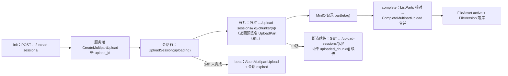
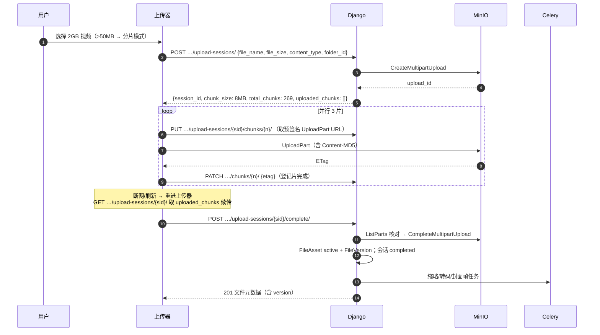
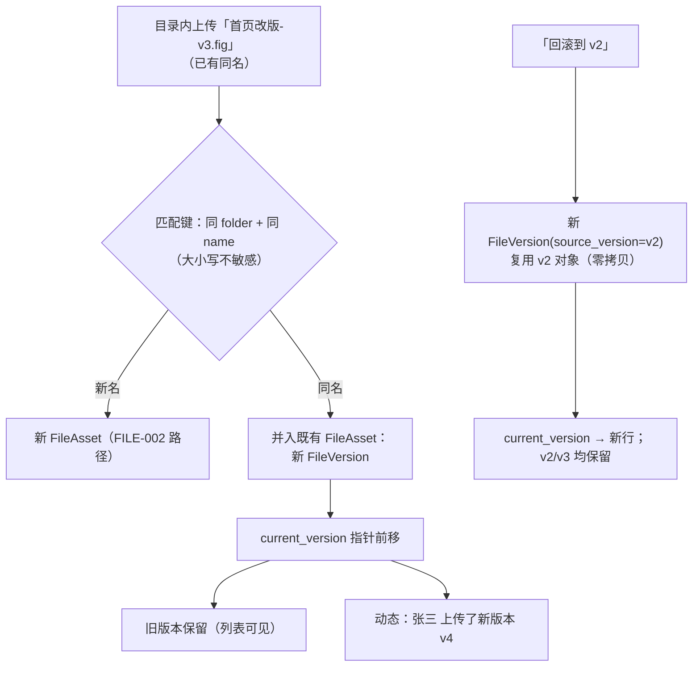
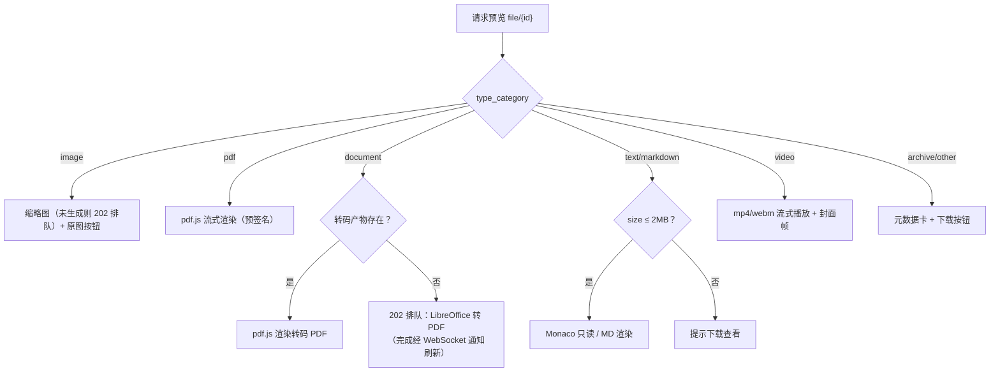
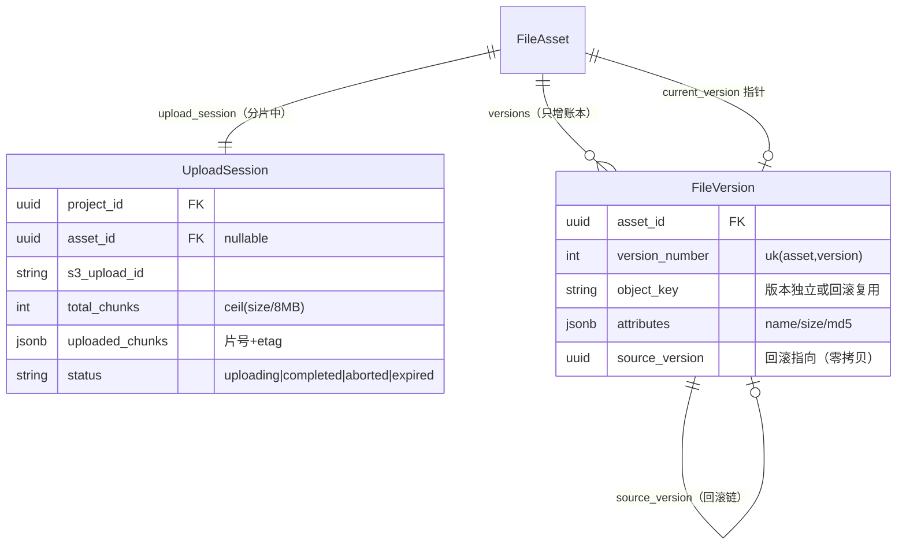

# 大文件分片续传 / 在线预览 / 多版本

| 元信息项 | 内容 |
| --- | --- |
| 文档编号 | FILE-003 |
| 所属迭代 | Sprint 4 — 甘特图 + 文件管理（第 6 周） |
| 优先级 | P2（标准版完整级） |
| 所属模块 | M7-FILE｜文件资源管理 |
| 文档状态 | 待评审（Draft） |
| 最后更新日期 | 2026-09-01 |
| 上游依赖 | **`FILE-002`（文件库骨架、`current_version`/`upload_session` 预留列、回收站与引用计数）**、`FILE-001`（直传三步与白名单）、`INFRA-002`（MinIO multipart、Celery worker）、`COLLAB-003`（版本事件入动态流） |
| 下游消费 | `FILE-004`（分享的预览/下载权限分派消费预览器）、`FILE-005`（P3 Wiki 复用预览器与版本）、`INTG-001`（外部附件版本化挂接） |
| 上游依据 | `docs/需求文档.md` §3.7（大文件分片续传、常见格式在线预览、文件多版本管理与版本回溯）、§8.2 文件管理 P2 列 |
| 关联架构文档 | [`api-conventions.md`](../architecture/api-conventions.md)（§13.2 直传规范扩展、§8 错误码）、[`monorepo-structure.md`](../architecture/monorepo-structure.md)（Celery、MinIO）、[`tech-stack.md`](../architecture/tech-stack.md) |
| 对标基线 | Plane（无分片/预览/版本——开源版附件即终点） · Ones 文件模块（版本回溯与预览） · 网盘类产品（分片续传范式） |
| 工作量估算 | 后端 3.5 人日 / 前端 3 人日 / 联调与测试 1.5 人日，合计 **8 人日** |

---

## 1. 概述

### 1.1 功能定位

`FILE-002` 交付了「库」，本文档交付库的三个进阶能力，让文件体系从「能存」到「好用」：

1. **分片续传**——>50MB 文件强制走 multipart：8MB/片、断点续传（已传片号持久化，刷新/断网后续传）、并行 3 片。上传 2GB 的设计源文件不再是一场赌博。
2. **在线预览**——图片（原图+缩略）、PDF、Office 文档（异步转 PDF 后预览）、文本/Markdown（代码高亮）、视频（边下边播 + 封面帧）。预览产物独立前缀 + 30 天冷清理。
3. **多版本**——同名新上传 = 新版本（不再并存同名文件，`FILE-002` BR-02 的收紧兑现）；版本列表、任意回滚（回滚 = 生成新版本指向旧对象）、文本类 diff 对比。

三者共用的地基是 `FILE-002` 预建的两列：`upload_session`（分片会话）与 `current_version`（版本指针）——本迭代**只建新表**。

### 1.2 关键约定一：分片会话与 S3 Multipart 的映射

> ⚠️ 分片的「真相」在 MinIO 的 multipart upload，不在我们的表——表只记会话元数据与已传片号，用于断点续传 UI 与孤儿清理。



- 片大小固定 **8MB**（末片可小）；`Content-MD5` 由前端计算随片提交，服务端核对 etag 防静默损坏。
- 分片阈值：>50MB 强制分片（`FILE-002` 直传上限的对称面）。

### 1.3 关键约定二：版本模型（追加式，不覆盖）

| 概念 | 落点 | 说明 |
| --- | --- | --- |
| 版本 | `FileVersion` 行 | 每次上传（新文件或同名替换）都产生新版本行；对象只增不删 |
| 当前版本 | `FileAsset.current_version` 指针 | 指向最新或回滚后的版本 |
| 回滚 | 新 `FileVersion`（`source_version` 指向目标） | 回滚不删除任何版本——历史是只增账本 |
| 上限 | 20 版/文件 | 超出滚动淘汰最旧**非当前**版本（其对象若无他引用则删） |
| 对比 | 文本类版本 diff | 前端双栏渲染；二进制仅元数据对比 |

### 1.4 交付内容

| # | 能力 | 说明 |
| --- | --- | --- |
| 1 | 分片续传 | init/status/chunk/complete/abort 五端点；断点续传；并行 3 片；24h 过期回收 |
| 2 | 预览：图片 | 缩略图（≤512px WebP）+ 原图预签名 |
| 3 | 预览：PDF / Office | docx/xlsx/pptx → LibreOffice 转 PDF（Celery）→ pdf.js 预览 |
| 4 | 预览：文本/Markdown | ≤2MB 直接预览；>2MB 引导下载 |
| 5 | 预览：视频 | mp4 边下边播 + ffmpeg 封面帧 |
| 6 | 多版本 | 同名上传并入版本链；列表/回滚/diff；20 版上限 |
| 7 | 预览产物治理 | 独立前缀 `derivatives/`；30 天未访问冷清理；按需重生成 |

### 1.5 范围边界

| 能力 | 本文档（P2） | 归属 |
| --- | --- | --- |
| 分片续传（>50MB）/ 断点 / 过期回收 | ✅ | — |
| 五类预览 + 缩略图 + 转码 | ✅ | — |
| 多版本 / 回滚 / 文本 diff | ✅ | — |
| Office 在线**编辑**（回写） | ❌（只读预览） | P4 评估（OnlyOffice） |
| 协同编辑（多人 Office） | ❌ | P4 |
| CAD / 压缩包预览 | ❌ | P4 |
| OCR / 全文提取入搜索 | ❌ | P3 |
| 二进制版本 diff | ❌（仅元数据对比） | P4 |
| MD5 秒传 | ❌（显式不做，见 §6.2） | — |
| 水印 | ❌ | P4 `FILE-006` |

### 1.6 前置依赖

| 依赖 | 内容 | 阻塞原因 |
| --- | --- | --- |
| `FILE-002` | 预留列、`can_view_file` 单入口、引用计数删除 | 挂接点；回收站语义扩展到版本 |
| `INFRA-002` | MinIO multipart API、worker 镜像内 LibreOffice + ffmpeg | 基础设施 |
| `COLLAB-003` | 项目动态流 | 新版本/回滚事件 |

### 1.7 竞品参考

| 竞品 | 参考点 | 处置 |
| --- | --- | --- |
| Plane | 开源版无分片/预览/版本 | 三能力均为差异化 |
| Ones | 版本回溯 + Office 预览 | 版本模型对齐（只增账本） |
| 网盘类 | 秒传/并行/断点范式 | 采纳断点与并行；不做秒传 |

---

## 2. 业务逻辑

### 2.1 分片上传全流程



### 2.2 同名新版本流程



### 2.3 预览决策链



### 2.4 业务规则汇总

| 编号 | 规则 | 判定位置 | 违反后果 |
| --- | --- | --- | --- |
| BR-01 | >50MB 强制分片（直传端点拒收 >50MB）；≤50MB 前端默认直传 | Service | `400 VALIDATION_FILE_SIZE_EXCEEDED` |
| BR-02 | 片大小固定 8MB（末片除外）；总片数 = ceil(size/8MB)；片号 1-based | Service | `400 INVALID` |
| BR-03 | 每片 `Content-MD5` 校验（etag 核对），不匹配该片重传 ≤3 次 | Service | 片级重试 |
| BR-04 | complete 前 `ListParts` 核对片集完整，缺片返回缺失清单 | Service | `400` + missing |
| BR-05 | 会话 24h 未 complete → beat `AbortMultipartUpload` + expired + 释放配额预留 | Celery | — |
| BR-06 | 断点续传：按 `session_id` 取 `uploaded_chunks` 续传；同名同大小才可复用会话 | Service | `409 RESOURCE_STATE_INVALID` |
| BR-07 | 同名新版本匹配键 = 同 folder + name（大小写不敏感）+ 均非软删；新版本沿用原可见性 | Service | — |
| BR-08 | 版本上限 20：超出淘汰最旧**非当前**版本；对象若无他引用（回滚链/双挂）才删 | Celery | — |
| BR-09 | 回滚 = 新版本行（`source_version` 指向目标，零拷贝）；版本不物理删除（淘汰除外） | Service | — |
| BR-10 | 预览权限 = 文件读权限（`can_view_file` 单入口复用）；衍生物预签名 5 分钟 | Service | 404 |
| BR-11 | 转码产物键 `derivatives/{asset}/{version}/preview.pdf|thumb.webp|poster.jpg`；30 天未访问冷清理、按需重生成 | Celery | — |
| BR-12 | 文本预览上限 2MB；视频仅 mp4/webm 流式 | Service/前端 | 引导下载 |
| BR-13 | 版本事件（新版本/回滚）入项目动态 + WebSocket 刷新 | on_commit | — |
| BR-14 | 配额按**对象实际占用**计（版本去重）：同一对象被多版本引用只计一次 | Service | — |

### 2.5 异常处理

| 场景 | HTTP | 错误码 | details 子码 | 前端表现 |
| --- | --- | --- | --- | --- |
| 直传超 50MB | 400 | `VALIDATION_FILE_SIZE_EXCEEDED` | — | 自动切分片会话 |
| 片 MD5 不匹配 | 400 | `VALIDATION_ERROR` | `INVALID` | 该片自动重传（≤3 次） |
| complete 缺片 | 400 | `VALIDATION_ERROR` | `MISSING` | 显示缺失片号并续传 |
| 会话过期复用 | 409 | `RESOURCE_STATE_INVALID` | `STATE` | 新建会话重来 |
| 转码失败 | 202→事件 | —（异步） | — | 「转码失败 · 重试」+ 下载兜底 |
| 转码超时（>5min） | — | — | — | 任务 failed 可重试；原文件无损 |
| 版本超限淘汰 | 200 | —（自动） | — | 「最早版本已自动清理」提示 |
| 预览权限不足 | 404 | `RESOURCE_NOT_FOUND` | — | 存在性隐藏 |
| 非流式视频 | 400 | `VALIDATION_INVALID_PARAM` | — | 仅下载 |

### 2.6 边界条件

| 边界场景 | 限制值 | 超出处理 |
| --- | --- | --- |
| 单文件 | 5GB | 拒绝 |
| 活动会话/用户 | 3 | 排队提示 |
| 并行片 | 3 | — |
| 版本/文件 | 20 | 滚动淘汰 |
| 文本预览 | 2MB | 下载引导 |
| Office 转码输入 | 100MB | 「过大无法预览」 |
| 缩略图 | ≤512px WebP | — |
| 衍生物 | 30 天未访问清理 | 重生成 |

---

## 3. UI/UX 设计

### 3.1 分片上传器（大文件态）

```
┌────────────────────────────────────────────────┐
│ ⬆ 上传 索引整库导出.mp4（2.1GB）                │
│ ████████████████░░░░░░░░░░░░  62%   1.3MB/s    │
│ 1,312 / 2,048 MB · 已传 128/269 片 · 并行 3     │
│ [暂停] [取消]        ⏸ 断点续传已启用            │
└────────────────────────────────────────────────┘
  暂停后关闭页面 → 重新进入上传器 → 「检测到未完成的上传 [继续] [放弃]」
```

| 元素 | 规格 |
| --- | --- |
| 进度 | 片级聚合百分比 + 速度 + 已传片数 |
| 暂停/继续 | 停止取新片（在途片完成后停）；从 `uploaded_chunks` 断点继续 |
| 取消 | abort 端点 |
| 重进恢复 | `session_id` 持久化 localStorage，进入时探测 |

### 3.2 预览器（点击文件 → 预览抽屉）

```
┌──────────────────────────────────────────────────────────────┐
│ 首页改版-v3.fig  v4 · 8.2MB · 张三 · 09-01      [版本▾][下载] ✕│
├──────────────────────────────────────────────────────────────┤
│              [ 缩略图 / 转码 PDF / 播放器 / 文本视图 ]          │
│  （排队态）⏳ 正在转码预览… 约 30 秒            [先下载]        │
├──────────────────────────────────────────────────────────────┤
│ [v4 ●当前] 09-01 张三 8.2MB                [对比] [回滚]      │
│ [v3]      09-01 李四 8.1MB                [对比] [回滚]      │
│ [v2]      08-28 张三 7.9MB                [对比] [回滚]      │
└──────────────────────────────────────────────────────────────┘
```

| 元素 | 规格 |
| --- | --- |
| 预览区 | 按类型渲染；全屏按钮；`Esc` 关闭 |
| `[版本▾]` | 下拉版本链，当前带 ● |
| 版本列表 | 版本/时间/人/大小 + [对比]（文本类）+ [回滚]（写权限） |
| 对比 | 左右分栏 diff（新增绿/删除红） |
| 回滚确认 | 「回滚到 v2？将创建新版本（内容同 v2）」 |

### 3.3 缩略图落位

- 网格视图卡片以缩略图替换类型图标（兑现 `FILE-002` 占位）。
- 列表悬浮 200ms 出预览小卡。

### 3.4 空状态 / 加载 / 失败

| 场景 | 处置 |
| --- | --- |
| 转码排队 | ⏳ + 预计时长 + 先下载；完成经 WebSocket 自动刷新 |
| 转码失败 | 「预览生成失败 · 重试 / 下载」 |
| 文本超 2MB | 「文件较大，请下载查看」 |
| 单版本 | 版本区隐藏 |

### 3.5 响应式与无障碍

| 断点 | 布局 |
| --- | --- |
| ≥ 1280px | 预览抽屉 960px |
| < 768px | 全屏预览器；版本折叠 |

无障碍：抽屉 `role="dialog"` + 焦点陷阱；pdf.js 文本层可读；视频原生控件 + 字幕轨（有则加载）；对比双栏 `aria-label`（「第 3 版与第 4 版差异：新增 12 行，删除 3 行」）；上传进度 `role="progressbar"`。

---

## 4. 技术架构

### 4.1 数据模型

#### 4.1.1 `UploadSession` 与 `FileVersion`（两张新表）

```python
# apps/api/plane/db/models/file.py —— 本迭代新增
class UploadSession(BaseModel):
    """分片上传会话 —— 真相在 S3 multipart；本表记元数据与已传片号"""

    class Status(models.TextChoices):
        UPLOADING = "uploading", "上传中"
        COMPLETED = "completed", "已完成"
        ABORTED = "aborted", "已取消"
        EXPIRED = "expired", "已过期"

    project = models.ForeignKey("db.Project", on_delete=models.CASCADE,
                                related_name="upload_sessions")
    asset = models.OneToOneField("db.FileAsset", null=True, blank=True,
                                 on_delete=models.SET_NULL,
                                 related_name="upload_session")
    s3_upload_id = models.CharField(max_length=128, verbose_name="S3 multipart id")
    object_key = models.TextField(verbose_name="目标对象键")
    file_name = models.CharField(max_length=255)
    file_size = models.BigIntegerField(verbose_name="总大小")
    content_type = models.CharField(max_length=128)
    chunk_size = models.PositiveIntegerField(default=8 * 1024 * 1024)
    total_chunks = models.PositiveIntegerField()
    uploaded_chunks = models.JSONField(default=list,
        verbose_name="已完成片号", help_text='[{"n":1,"etag":"…","size":8388608}]')
    status = models.CharField(max_length=16, choices=Status.choices,
                              default=Status.UPLOADING, db_index=True)

    class Meta(BaseModel.Meta):
        db_table = "upload_sessions"
        indexes = [models.Index(fields=["project", "status"], name="idx_us_project_status")]


class FileVersion(BaseModel):
    """文件版本 —— 只增账本：上传/回滚各一行；对象只增不删（淘汰除外）"""

    asset = models.ForeignKey("db.FileAsset", on_delete=models.CASCADE,
                              related_name="versions", verbose_name="所属文件")
    version_number = models.PositiveIntegerField(verbose_name="版本号（文件内递增）")
    object_key = models.TextField(verbose_name="对象键（版本独立或回滚复用）")
    attributes = models.JSONField(default=dict, verbose_name="name/size/content_type/md5")
    source_version = models.ForeignKey("self", null=True, blank=True,
                                       on_delete=models.SET_NULL,
                                       related_name="rollback_children",
                                       verbose_name="回滚来源")
    uploaded_by = models.ForeignKey("db.User", on_delete=models.SET_NULL, null=True)

    class Meta(BaseModel.Meta):
        db_table = "file_versions"
        constraints = [
            models.UniqueConstraint(fields=["asset", "version_number"],
                                    condition=models.Q(deleted_at__isnull=True),
                                    name="uniq_version_per_asset"),
        ]
        indexes = [models.Index(fields=["asset", "-created_at"],
                                name="idx_version_asset_recent")]
```

> `FileAsset.current_version`（预留列）本迭代启用；`FileAsset.attributes` 恒镜像 `current_version.attributes`（列表页免 JOIN）。



#### 4.1.2 迁移

```python
# 00XX_p2_file_chunk_preview.py
operations = [
    migrations.CreateModel(...),      # UploadSession
    migrations.CreateModel(...),      # FileVersion
    migrations.AddField(model_name="fileasset", name="current_version",
                        field=models.ForeignKey("db.fileversion", null=True,
                                                on_delete=models.SET_NULL,
                                                related_name="asset_current")),
]
# 数据迁移（同文件）：为每个既有 active FileAsset 生成 v1 FileVersion 并回填指针（幂等）
```

### 4.2 API 定义

| # | 方法 | 路径 | 描述 | 权限 | 成功码 |
| --- | --- | --- | --- | --- | --- |
| 1 | `POST` | `…/projects/{id}/upload-sessions/` | 发起分片会话 | `file.upload` | `201` |
| 2 | `GET` | `…/upload-sessions/{session_id}/` | 会话状态（断点取片表） | `file.upload`（本人） | `200` |
| 3 | `PUT` | `…/upload-sessions/{session_id}/chunks/{n}/` | 取该片预签名 UploadPart URL | `file.upload` | `200` |
| 4 | `PATCH` | `…/upload-sessions/{session_id}/chunks/{n}/` | 登记片完成（etag） | `file.upload` | `200` |
| 5 | `POST` | `…/upload-sessions/{session_id}/complete/` | 合并 + 落库 | `file.upload` | `201` |
| 6 | `DELETE` | `…/upload-sessions/{session_id}/` | 取消（Abort） | `file.upload`（本人） | `204` |
| 7 | `GET` | `…/files/{asset_id}/versions/` | 版本列表 | `file.read` | `200` |
| 8 | `POST` | `…/files/{asset_id}/versions/{version_id}/rollback/` | 回滚 | `file.upload` | `201` |
| 9 | `GET` | `…/files/{asset_id}/versions/{version_id}/content-url/` | 指定版本下载预签名 | `file.read` | `200` |
| 10 | `GET` | `…/files/{asset_id}/preview/` | 预览调度（就绪 200 / 排队 202） | `file.read` | `200/202` |

#### 4.2.1 `POST …/upload-sessions/` — 发起

**请求**

```json
{ "file_name": "索引整库导出.mp4", "file_size": 2254857830,
  "content_type": "video/mp4", "folder_id": "9a1b2c3d-4e5f-4a6b-8c9d-0e1f2a3b4c5d",
  "content_md5": "d41d8cd98f00b204e9800998ecf8427e" }
```

**成功响应 `201`**

```json
{
  "status": "success",
  "data": {
    "session_id": "e7f8a9b0-1c2d-4e3f-8a9b-0c1d2e3f4a5b",
    "chunk_size": 8388608, "total_chunks": 269,
    "uploaded_chunks": [],
    "expires_at": "2026-09-02T07:00:00.000Z"
  }
}
```

**失败响应 `400`（超单文件上限）**

```json
{
  "status": "error",
  "error": {
    "code": "VALIDATION_FILE_SIZE_EXCEEDED",
    "message": "文件大小超出限制",
    "details": [{ "field": "file_size", "code": "TOO_LARGE",
                  "message": "单文件上限 5GB" }],
    "request_id": "01JCBE4D7BF6Y9Z5F3A7B8C0D1E"
  }
}
```

#### 4.2.2 `GET …/files/{asset_id}/preview/` — 预览调度

**就绪 `200`**

```json
{
  "status": "success",
  "data": {
    "kind": "pdf", "ready": true,
    "preview_url": "/api/v1/…/files/c1d2…/derivatives/preview.pdf?token=…",
    "expires_at": "2026-09-01T08:00:00Z",
    "fallback_download": true
  }
}
```

**排队 `202`**

```json
{
  "status": "success",
  "data": { "kind": "pdf", "ready": false, "state": "transcoding",
            "eta_seconds": 30, "task_id": "01JCBE4D7BF6Y9Z5F3A7B8C0D1F" }
}
```

#### 4.2.3 `POST …/versions/{version_id}/rollback/` — 回滚

**请求**：空体。

**成功 `201`**

```json
{
  "status": "success",
  "data": { "version_id": "9a8b7c6d-5e4f-4a3b-8c2d-1e0f9a8b7c6d",
            "version_number": 5, "source_version_number": 2,
            "object_key": "…（复用 v2 对象）",
            "created_at": "2026-09-01T08:12:44.310Z" }
}
```

### 4.3 核心逻辑

#### 4.3.1 会话生命周期（服务端）

```python
# apps/api/plane/db/services/upload_session.py
CHUNK_SIZE = 8 * 1024 * 1024
MAX_FILE_SIZE = 5 * 1024 ** 3
SESSION_TTL = timedelta(hours=24)


@transaction.atomic
def init_session(*, project, payload, actor) -> UploadSession:
    if payload["file_size"] > MAX_FILE_SIZE:
        raise TooLarge(limit=MAX_FILE_SIZE)
    assert_quota(workspace_id=project.workspace_id, incoming=payload["file_size"])
    asset = _match_or_create_asset(project, payload)          # BR-07 同名版本匹配
    key = f"projects/{project.id}/folders/{payload['folder_id']}/{uuid4()}/{payload['file_name']}"
    upload_id = s3.create_multipart_upload(Bucket=BUCKET, Key=key)["UploadId"]
    return UploadSession.objects.create(
        project=project, asset=asset, s3_upload_id=upload_id, object_key=key,
        file_name=payload["file_name"], file_size=payload["file_size"],
        content_type=payload["content_type"],
        total_chunks=math.ceil(payload["file_size"] / CHUNK_SIZE),
        uploaded_chunks=[], created_by=actor)


def complete_session(*, session: UploadSession) -> FileAsset:
    parts = s3.list_parts(Bucket=BUCKET, Key=session.object_key,
                          UploadId=session.s3_upload_id).get("Parts", [])
    have = {p["PartNumber"] for p in parts}
    missing = [n for n in range(1, session.total_chunks + 1) if n not in have]
    if missing:                                               # BR-04
        raise ValidationError({"chunks": f"缺失分片：{missing[:20]}…"})
    s3.complete_multipart_upload(
        Bucket=BUCKET, Key=session.object_key, UploadId=session.s3_upload_id,
        MultipartUpload={"Parts": [
            {"PartNumber": p["PartNumber"], "ETag": p["ETag"]}
            for p in sorted(parts, key=lambda x: x["PartNumber"])]})
    version = _new_version(session.asset, session, key=session.object_key)
    session.status = "completed"
    session.save(update_fields=["status", "updated_at"])
    transaction.on_commit(lambda: derive_preview.delay(str(version.id)))
    return session.asset
```

#### 4.3.2 版本与回滚（只增账本）

```python
VERSION_LIMIT = 20

def _new_version(asset, upload, *, key: str, source=None) -> FileVersion:
    number = asset.versions.count() + 1
    v = FileVersion.objects.create(
        asset=asset, version_number=number, object_key=key,
        attributes={"name": upload.file_name, "size": upload.file_size,
                    "content_type": upload.content_type},
        source_version=source, uploaded_by=getattr(upload, "uploaded_by", None))
    asset.current_version = v
    asset.attributes = v.attributes            # 镜像（列表免 JOIN）
    asset.save(update_fields=["current_version", "attributes", "updated_at"])
    transaction.on_commit(lambda: evict_old_versions.delay(str(asset.id)))   # BR-08
    return v


def rollback(*, asset, target: FileVersion, actor) -> FileVersion:
    """回滚 = 新版本行复用目标对象（零拷贝，BR-09）。"""
    return _new_version(asset,
                        SimpleNamespace(file_name=target.attributes["name"],
                                        file_size=target.attributes["size"],
                                        content_type=target.attributes["content_type"],
                                        uploaded_by=actor),
                        key=target.object_key, source=target)
```

#### 4.3.3 转码与衍生物（Celery）

```python
# apps/api/plane/bgtasks/derive_preview.py
OFFICE = {"doc", "docx", "xls", "xlsx", "ppt", "pptx"}
DERIV_TTL = timedelta(days=30)

@shared_task(bind=True, max_retries=2, soft_time_limit=300)
def derive_preview(self, version_id: str) -> None:
    v = FileVersion.objects.select_related("asset").get(id=version_id)
    kind = categorize(v.attributes["content_type"])
    if kind == "image":
        _thumb(v, max_px=512, fmt="webp")                    # …/thumb.webp
    elif kind == "document" and Path(v.attributes["name"]).suffix in OFFICE:
        _libreoffice_to_pdf(v)                               # soffice --headless
    elif kind == "video":
        _ffmpeg_poster(v, at="00:00:01")                     # …/poster.jpg
    touch_derivative(v)


@shared_task
def sweep_cold_derivatives() -> int:
    """30 天未访问的衍生物删除（BR-11）；下次预览按需重生成。"""
    ...

@shared_task
def expire_upload_sessions() -> int:
    """24h 未完成：AbortMultipartUpload + expired + 释放配额（BR-05）。"""
    for s in UploadSession.objects.filter(status="uploading",
                                          created_at__lt=timezone.now() - SESSION_TTL):
        s3.abort_multipart_upload(Bucket=BUCKET, Key=s.object_key,
                                  UploadId=s.s3_upload_id)
        s.status = "expired"
        s.save(update_fields=["status"])
    ...

@shared_task
def evict_old_versions(asset_id: str) -> int:
    """BR-08：>20 版时淘汰最旧非当前；对象经引用计数检查后删。"""
    ...
```

### 4.4 前端实现

- `ChunkUploader`：状态机 `idle→init→uploading(paused)→merging→done/error`；并行 3 片（p-limit）；spark-md5 增量哈希；`session_id` localStorage 持久化（重进恢复）。
- `PreviewDrawer`：按 `preview/` 调度渲染三分支（ready / 202 排队轮询 + WebSocket / fallback）；pdf.js 懒加载（`react-pdf`）；Monaco 只读；`<video>` 预签名 src。
- `VersionPanel`：版本链 + 对比（`diff` 双栏）+ 回滚确认。
- WebSocket（`COLLAB-004`）：`file.version_added` / `file.transcode_done` → 面板 `mutate`。

---

## 5. 测试用例

### 5.1 单元测试

| 用例 ID | 测试目标 | 输入 | 预期输出 | 覆盖类型 |
| --- | --- | --- | --- | --- |
| UT-01 | 阈值分流 | 51MB | 强制分片 | 边界 |
| UT-02 | 片数计算 | 2GB | 269 片（末片小） | 正常 |
| UT-03 | 断点续传 | 中断重连 | 不重传已传片 | 正常 |
| UT-04 | MD5 校验 | 篡改片 | 重传 ≤3 次 | 异常 |
| UT-05 | complete 缺片 | 少 2 片 | 400 + 清单 | 异常 |
| UT-06 | 会话过期 | 24h 未完成 | Abort + expired + 配额释放 | 边界 |
| UT-07 | 同名并入 | 已有同名 | 无新行，版本 +1 | 正常 |
| UT-08 | 大小写不敏感 | V3.FIG | 并入链 | 边界 |
| UT-09 | 回滚零拷贝 | 回到 v2 | 新行复用键；v3 保留 | 正常 |
| UT-10 | 版本淘汰 | 第 21 版 | 最旧非当前淘汰 | 边界 |
| UT-11 | 淘汰引用保护 | 对象被回滚链引用 | 不删对象 | 边界 |
| UT-12 | 配额去重 | 同对象多版本 | 计一次 | 正常 |
| UT-13 | 预览权限 | admins 态 | preview 404 | 安全 |
| UT-14 | 文本上限 | 2.1MB | 引导下载 | 边界 |
| UT-15 | 转码失败 | soffice 崩溃 | failed 可重试；原文件无损 | 异常 |
| UT-16 | 衍生物冷清 | 31 天未访问 | 删除可重生成 | 正常 |

### 5.2 集成测试

| 用例 ID | 场景 | 前置条件 | 操作步骤 | 预期结果 |
| --- | --- | --- | --- | --- |
| IT-01 | 2GB 全链路 | MinIO+worker | 分片→断网→续传→complete | 对象 MD5 全文一致；v1 建立 |
| IT-02 | 会话并发上限 | 3 会话进行 | 第 4 个 | 排队 |
| IT-03 | 版本链完整 | 3 版 + 回滚 v1 | 4 行；当前内容 = v1 | 正常 |
| IT-04 | Office 转码 | docx 5MB | 上传后预览 | 202→完成→可渲染 |
| IT-05 | 视频封面 | mp4 | 上传 | poster 生成；可播 |
| IT-06 | 动态事件 | 新版本/回滚 | 项目动态 | 两类事件 |
| IT-07 | 回收站与版本 | 删含 4 版文件 | 期满清理 | 无存活版本引用才删对象 |

### 5.3 E2E 测试

| 用例 ID | 用户场景 | 操作路径 | 验收标准 |
| --- | --- | --- | --- |
| E2E-01 | 断点续传 | 100MB 中途刷新→继续 | 断点准确；完成入列表 |
| E2E-02 | 同名新版本 | 上传同名 fig | 无重复行；v2；动态提示 |
| E2E-03 | 版本回滚 | 回滚 v1 | 内容还原；链保留；列表镜像更新 |
| E2E-04 | 文本对比 | 两版 .md | 双栏 diff 正确 |
| E2E-05 | 排队预览 | 上传 docx 即点 | 202 → 完成自动渲染 |
| E2E-06 | 图片缩略 | 网格视图 | 卡片显示缩略 |

---

## 6. 竞品深度对标

### 6.1 Plane 实现分析

- 开源版附件无分片、无预览、无版本——三能力均为本系统对开源版的差异化交付。其新版 FileAsset 体系的 `attributes` 结构被 `FileVersion.attributes` 同构沿用，社区能力可平移。

### 6.2 Ones 实现分析

- Ones 版本回溯 + Office 预览是企业标配。本系统对齐「版本 + 只读预览」；在线编辑（OnlyOffice/Collabora）放 P4——独立重依赖服务需单独权衡。
- **不做秒传**：全库 MD5 哈希索引存在 hash oracle（跨用户探测）风险，且项目管理场景重复大文件率低——收益不抵风险，显式文档化。

### 6.3 本系统设计决策

1. **真相在 S3，表是索引**：part 真相由 MinIO 管理，续传核对用 `ListParts` 而非自维护状态——双写不一致类 bug 结构性消失。
2. **版本是只增账本**：回滚 = 复用对象的新行；淘汰仅限非当前且过引用检查。历史可审计且零拷贝。
3. **衍生物冷热分离**：转码产物独立前缀、30 天未访问清理、按需重生成——存储成本与预览体验的平衡点。
4. **预览权限复用单入口**：`can_view_file` 纪律延伸到衍生物预签名——预览是文件权限事故高发区。
5. **不做秒传**：隐私权衡显式化，防后人「顺手加上」。

---

## 7. 里程碑与验收

### 7.1 交付物清单

| 类型 | 交付物 |
| --- | --- |
| Model / Migration | `UploadSession`、`FileVersion` 新表；`current_version` 启用；存量文件 v1 回填数据迁移 |
| 后端 | 会话五端点、版本三端点、`preview/` 调度、`derive_preview`/`sweep_cold_derivatives`/`expire_upload_sessions`/`evict_old_versions`、LibreOffice + ffmpeg worker 镜像 |
| 前端 | `ChunkUploader`（并行/断点/MD5/恢复）、`PreviewDrawer`（五类 + 排队）、`VersionPanel`（列表/对比/回滚）、缩略图落位、WebSocket 联动 |
| 测试 | UT-01~16、IT-01~07、E2E-01~06 |

### 7.2 可操作演示的验收标准

1. 上传 2GB 视频：分片并行推进，中途刷新后从断点续传（已传片零重传），complete 后 MD5 全文校验一致。
2. 上传同名文件：不产生重复行、版本 +1、动态提示；回滚到 v1 后内容还原且版本链完整保留。
3. Office 预览：上传 docx 立即点预览见排队态（202 + 预计时长），完成自动渲染翻页；图片在网格视图出缩略。
4. 24h 过期会话被自动 Abort 且配额预留释放（加速时钟）；31 天未访问的转码产物被清理且可重生成。
5. 「仅管理员」文件：版本接口与预览调度均 404（三层一致复用验证）。
6. 两个 .md 版本对比双栏 diff 正确；视频即点即播且封面帧就位。
