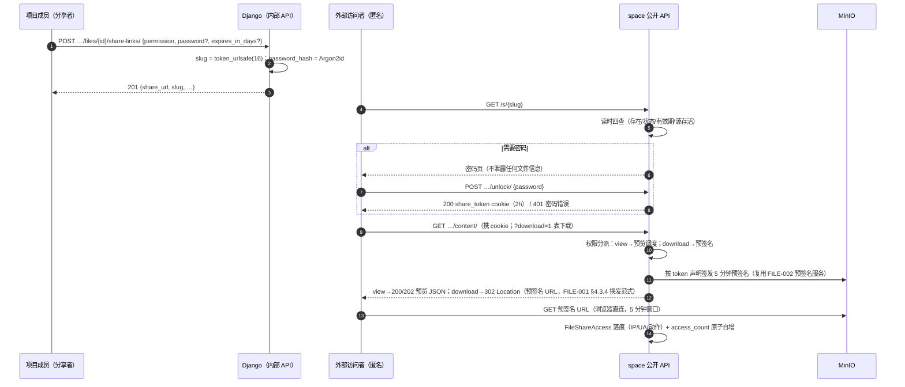
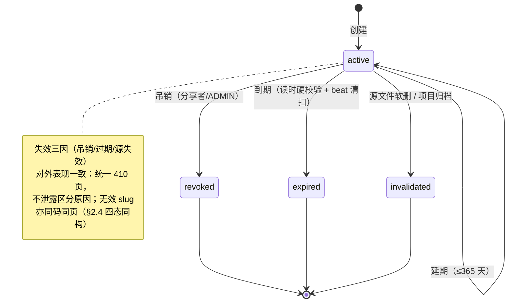
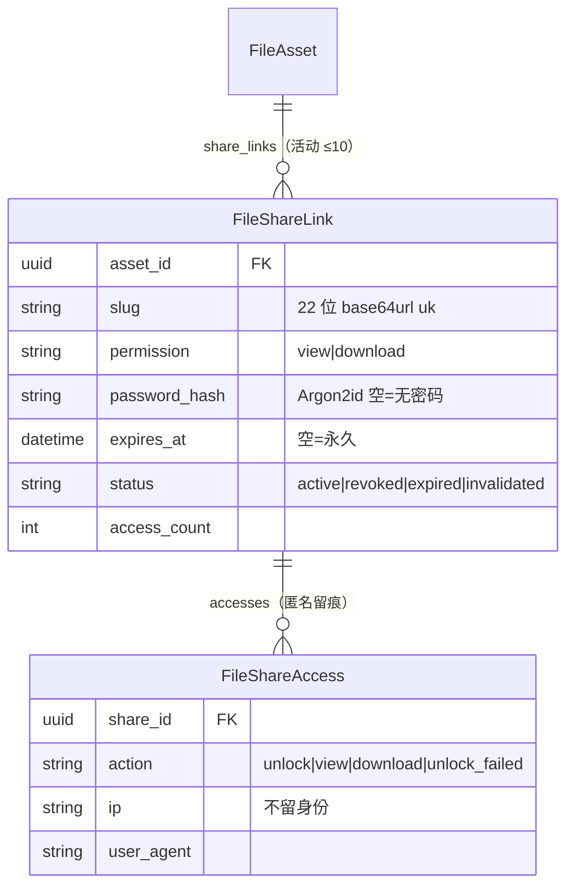

# 文件分享链接与权限管控

| 元信息项 | 内容 |
| --- | --- |
| 文档编号 | FILE-004 |
| 所属迭代 | Sprint 4 — 甘特图 + 文件管理（第 6 周） |
| 优先级 | P2（标准版完整级） |
| 所属模块 | M7-FILE｜文件资源管理 |
| 文档状态 | 待评审（Draft） |
| 最后更新日期 | 2026-09-03 |
| 上游依赖 | **`FILE-002`（可见性单入口 `can_view_file` / 预签名服务——创建前置校验与预签名签发复用）**、`FILE-001`（§4.3.4 `download/` 302 换发范式——本文匿名下载侧复用；§1.4 五态机为源存活判定口径）、`FILE-003`（预览器与版本——分享跟随当前版本）、`AUTH-001`（Argon2id 哈希器基线，Sprint 0 已交付）、`AUTH-005`（权限门控）；限流为**本文自带**（归属说明见 §1.5 注——`INFRA-004` 不含限流） |
| 下游消费 | `FILE-006`（P4 水印 / 禁转 / 合规留存——分享是其管控落点）、`INTG-004`（P4 外链生态）、`INFRA-005`（Sprint 6 限流收口——BR-07 (IP, slug) 端点级配额并入全局三层限流框架，仅收编配置不改语义；其现行版上游清单未登记本文，**待回改登记**——见 §1.5 注） |
| 上游依据 | `docs/需求文档.md` §3.7（生成文件分享链接、链接密码、有效期设置）、§8.2 文件管理 P2 列 |
| 关联架构文档 | [`api-conventions.md`](../architecture/api-conventions.md)（§2.1 **公开 API 分组 `/api/v1/public/`——匿名访问的架构基座**、§7 限流三层与 429 模板、§8 错误码、§9.2 Cookie 属性基线、§10.1 `PublicAPIBaseView` 匿名只读基线——`unlock/` 豁免声明见 §4.2 注、§13.4 安全头）、[`rbac-permission-model.md`](../architecture/rbac-permission-model.md)（`file.share` 权限码）、[`tech-stack.md`](../architecture/tech-stack.md)（argon2-cffi 与 Valkey 限流计数职责已登记） |
| 对标基线 | Plane（无文件分享——开源版） · Ones（企业分享管控） · 网盘分享范式（密码/有效期/权限分离） |
| 工作量估算 | 后端 2.5 人日 / 前端 2 人日 / 联调与测试 1 人日，合计 **5.5 人日** |

---

## 1. 概述

### 1.1 功能定位

文件要出项目：给外部客户看设计稿、给供应商传合同——不能靠把人拉进项目。分享链接把「文件的一个受控视图」暴露到公网：

- **不可枚举链接**：`/s/{slug}`（22 位 base64url——URL 安全字母表 `[A-Za-z0-9_-]`，16 字节熵源 ≈128bit 熵，不可猜测不可遍历）；
- **三道闸**：密码（可选，Argon2id）、有效期（可选，硬校验）、权限（`view` 仅预览 / `download` 预览+下载）；
- **匿名只读**：走 `apps/space` 公开 API 分组（`api-conventions.md` §2.1 的第三套 API），与内部 API 物理隔离（独立序列化器，脱敏，无会话）。

权限模型刻意极简：分享是对**单个文件当前版本**的受控外发，不是文件夹外发、不是协作邀请——复杂度被刻意锁死在 P2 边界内。

### 1.2 关键约定：公开面的三条安全底线

> ⚠️ 分享是文件体系唯一暴露给匿名互联网的面，三条底线不可妥协。

1. **链接即能力（capability）**：持有 slug +（密码）即获得声明权限；**不与账号体系绑定**——不注册、不登录、不落访问者身份（访问日志只记 IP/UA/时间，P4 合规再评估身份采集）。
2. **资源不可枚举**：slug 22 位 base64url（`[A-Za-z0-9_-]`）；无效 slug、过期、密码错误的响应**不泄露文件元信息**（错误体不含文件名/项目名）。
3. **预签名短时效 + 每次签发**：匿名访问每次换取 5 分钟预签名（下载/预览分权限签发，复用 `FILE-002` 预签名服务 + `FILE-001` §4.3.4 `download/` 302 换发范式）；不缓存长链接、不签发长时效桶直链（302 `Location` 即取即用，5 分钟自然过期）。

### 1.3 交付内容

| # | 能力 | 说明 |
| --- | --- | --- |
| 1 | 分享链接 CRUD | 创建（文件/权限/密码/有效期）、列表（我的分享）、吊销、延期 |
| 2 | 匿名访问页（space） | `/s/{slug}`：密码门 → 预览器（view）+ 下载按钮（download） |
| 3 | 权限分离 | `view` / `download` 两态（download 含预览） |
| 4 | 有效期 | 永久 / 1 天 / 7 天 / 30 天 / 自定义（上限 365 天）；过期页 |
| 5 | 密码门 | Argon2id 校验；尝试限速（5 次/10 分钟/(IP,slug)） |
| 6 | 访问留痕 | 每次访问（含密码尝试）落 `FileShareAccess`；分享者可见摘要 |
| 7 | 源文件变更联动 | 文件软删/项目归档 → 分享立即失效（读时校验） |

### 1.4 范围边界

| 能力 | 本文档（P2） | 归属 |
| --- | --- | --- |
| 单文件分享（当前版本）/ 密码 / 有效期 / 权限分离 | ✅ | — |
| 指定历史版本分享 | ❌（恒为当前版本，自动跟随） | P4 视需要 |
| 文件夹分享 / 批量打包分享 | ❌ | P4 |
| 访问者身份（登录/邮箱采集） | ❌ | P4 `FILE-006` |
| 水印 / 禁止下载转发 / 合规留存 | ❌ | P4 `FILE-006` |
| 阅后即焚 / 次数限制 | ❌ | P4 评估 |
| 分享审批流 | ❌ | P3+ 评估 |

### 1.5 前置依赖

| 依赖 | 内容 | 阻塞原因 |
| --- | --- | --- |
| `FILE-002` | `can_view_file`、预签名服务（`presign_download` 同键取数） | 创建前置权限与预签名签发 |
| `FILE-001` | §4.3.4 `download/` 302 换发范式；§1.4 状态机五态锁定（uploading/uploaded/abandoned/deleted/purged） | 匿名下载换发范式与源存活判定（§4.3.1）的口径基准 |
| `FILE-003` | 预览器（衍生物重生成复用） | 匿名预览渲染 |
| `apps/space` | 公开应用骨架 | 匿名访问宿主 |
| `AUTH-001` | Argon2id 哈希器（`make_password` / `check_password` 基线）；slug 用 Python 标准库 `secrets`（无新增依赖） | 密码哈希与防爆破无基线 |

> **限流归属说明**：`INFRA-004` 的范围声明明确**不含接口限流**（全局限流框架归 Sprint 6 `INFRA-005`）；Sprint 4 早于 Sprint 6，故 BR-07 的 (IP, slug) 防爆破配额为**本文自带**的端点级 DRF throttle（Valkey 计数，对齐 `api-conventions.md` §7 L3 与 `AUTH-001` 登录限流的同一实现范式）。`INFRA-005` 现行版上游依赖仅列 `INFRA-002`/`INFRA-004`/`api-conventions.md` §7，未登记本文——**待 `INFRA-005` 回改登记**（(IP, slug) 维度收编，上游待回改项；落地后仅收编配置不改语义）。

### 1.6 竞品参考

| 竞品 | 参考点 | 处置 |
| --- | --- | --- |
| Plane | 无文件分享（开源版；space 仅公开页面视图） | 差异化交付 |
| Ones | 企业分享管控（审批/水印/追踪） | P2 三道闸；审批与水印 P4 |
| 网盘类 | 提取码 + 有效期 + 权限分离 | 范式采纳；密码长度宽松（4~64，无复杂度要求，见 §2.5） |
| Notion | 公开页面无密码 | 反例：文件外发必须有密码可选项 |

---

## 2. 业务逻辑

### 2.1 分享创建与访问全流程



### 2.2 分享生命周期



### 2.3 业务规则汇总

| 编号 | 规则 | 判定位置 | 违反后果 |
| --- | --- | --- | --- |
| BR-01 | 创建权限：`file.share`（默认 PROJ_ADMIN，可授权 CONTRIBUTOR）且通过 `can_view_file`（不能分享自己看不见的文件） | Permission | `403 / 404` |
| BR-02 | slug = `secrets.token_urlsafe(16)`（16 字节熵源 → 恰 22 字符 base64url，≈128bit 熵）；唯一冲突重生成（约束兜底） | Service | — |
| BR-03 | 密码可选；存 **Argon2id 哈希**（绝不明文/可逆） | Service | — |
| BR-04 | 有效期：永久或 1/7/30/365 天或自定义（≤365）；读时硬校验 + beat 每小时清扫 | Service | 过期页 |
| BR-05 | 权限两态 `view / download`；`view` 态下载按钮不渲染且 `?download=1` 被拒 | Service | `403` |
| BR-06 | 源联动：文件软删或项目归档 → 读时失效（invalidated）；恢复**不自动复活** | Service | 410 |
| BR-07 | 密码尝试限速：5 次失败 / 10 分钟 / (IP, slug)，超限 429 + `Retry-After` | Throttle | 429 |
| BR-08 | unlock 成功签发 2 小时 HMAC 签名 cookie（`sign(slug)`）；仅对该 slug 有效 | Service | — |
| BR-09 | 访问留痕：unlock/预览/下载/密码错误均落 `FileShareAccess`（IP/UA/时间/成败）；**不留身份**；成功访问（view/download）在同一事务内 `F()` 原子自增 `access_count`（失败尝试不计，§4.3.3） | Service | — |
| BR-10 | 匿名响应脱敏：未解锁的 meta 仅 `{requires_password}`；错误与过期页不含文件名/项目名 | Serializer | — |
| BR-11 | 上限两维度（均只计 `status=active`，吊销/过期/源失效释放额度）：同文件（asset）活动分享 ≤ 10 条；同用户同项目（created_by × 项目）活动分享 ≤ 100 条 | Service | `409 RESOURCE_LIMIT_EXCEEDED`（`details` 按触发维度给上限值） |
| BR-12 | 分享对象 = 文件**当前版本**（跟随 `current_version` 指针；版本演进自动生效） | Service | — |
| BR-13 | 创建/吊销/延期入项目动态（内部视角）；匿名访问不入（防刷屏） | on_commit | — |
| BR-14 | 吊销即时性上界：已签发的 5 分钟预签名自然过期（S3 预签名不可撤回——5 分钟窗口为诚实声明） | 架构约束 | — |
| BR-15 | 延期语义：`expires_at` 新值 = `max(now, 当前 expires_at) + extend_days`（1~365 整数），且不得晚于 `now + 365d`；仅 `active` 可延期；永久链接（`expires_at=null`）延期直接 400；**非幂等动作**（重复提交叠加，重试前必须重新 GET 列表核对）；并发延期 `select_for_update` 串行 | Service | `400` / `409 RESOURCE_STATE_INVALID` |

### 2.4 异常处理

| 场景 | HTTP | 错误码 | 前端表现（space 匿名页） |
| --- | --- | --- | --- |
| slug 无效（不存在或格式非法） | 410 | `RESOURCE_GONE` | 通用「链接不存在或已失效」（与失效三态**同码同页**——若无效 slug 用 404 而失效用 410，攻击者可据状态码差异区分「从未存在」与「曾有效后被吊销」，后者证实 slug 曾经有效，提升定向爆破价值） |
| 已过期/吊销/源失效 | 410 | `RESOURCE_GONE` | 同上统一页 + 「请联系分享者」 |
| 密码错误 | 401 | `AUTH_INVALID_CREDENTIALS` | 密码框抖动 + 剩余次数 |
| 密码爆破锁定 | 429 | `RATE_LIMIT_EXCEEDED` | 「尝试过多，X 分钟后再试」 |
| view 态请求下载 | 403 | `PERM_DENIED` | 按钮不渲染；直连无权限页 |
| 创建超上限 | 409 | `RESOURCE_LIMIT_EXCEEDED` | 按触发维度提示：「该文件已有 10 个有效分享」/「你在该项目的有效分享已达 100 条」 |
| 权限不足创建 | 403 | `PERM_ROLE_INSUFFICIENT` | 菜单隐藏 |
| 延期非 active 分享 | 409 | `RESOURCE_STATE_INVALID` | Toast「仅有效分享可延期」 |

### 2.5 边界条件

| 边界场景 | 限制值 | 超出处理 |
| --- | --- | --- |
| 有效期 | ≤ 365 天 | 400 |
| 延期步长 `extend_days` | 1~365 整数；结果 ≤ now+365d | 400 |
| 密码长度 | 4~64 | 400 |
| 活动分享/文件（同 asset，仅 active 计数） | 10 | 409 |
| 活动分享/用户/项目（同 created_by 同项目，仅 active 计数） | 100 | 409 |
| 密码尝试 | 5 次/10 分钟/(IP,slug) | 429 |
| unlock cookie | 2 小时 | 重新输密码 |
| 预签名 | 5 分钟 | 自然过期 |
| 并发吊销与下载 | — | 已签发链接 5 分钟内仍可用（BR-14） |

---

## 3. UI/UX 设计

### 3.1 分享创建弹层（内部，文件 ⋯ →「分享」）

```
┌────────────────────────────────────────────────┐
│  分享 · 首页改版-v3.fig                          │
│                                                  │
│  链接  https://acme.rbt.ing/s/9xK2mPq4R7vTzN8   │
│        [复制链接]                                │
│                                                  │
│  权限   ( ) 仅预览   (●) 预览 + 下载             │
│  密码   [◉ 开启] ┌──────────────┐               │
│                 │ ••••••       │ [👁]           │
│                 └──────────────┘               │
│  有效期 [30 天 ▾]（永久/1天/7天/30天/自定义）     │
│                                                  │
│  ⚠ 任何获得链接（与密码）的人都能访问该文件        │
│                        [取消]  [创建分享]        │
└────────────────────────────────────────────────┘
```

### 3.2 我的分享管理（文件 ⋯ →「分享管理」）

```
┌──────────────────────────────────────────────────────────────┐
│ 首页改版-v3.fig 的分享（3）                                   │
│ ┌──────────────────────────┬────────┬────────┬──────┬──────┐ │
│ │ 链接                      │ 权限    │ 有效期  │ 访问  │ 操作  │ │
│ ├──────────────────────────┼────────┼────────┼──────┼──────┤ │
│ │ /s/9xK2mPq4R7… [复制]    │ 预览+下载│ 29 天后 │ 42 次 │ [⋯]  │ │
│ │ /s/aB3dE5fG7h… [复制]    │ 仅预览  │ 永久    │ 7 次  │ [⋯]  │ │
│ │ /s/xY9zA1bC3d…（已过期）  │ 预览+下载│ 已过期  │ 118 次│ [⋯]  │ │
│ └──────────────────────────┴────────┴────────┴──────┴──────┘ │
│  [⋯]：延期 30 天 / 吊销（二次确认）/ 复制链接                    │
└──────────────────────────────────────────────────────────────┘
```

### 3.3 匿名访问页（space 应用 `/s/{slug}`）

```
┌────────────────────────────────────────────────┐      ┌────────────────────────────────────────────────┐
│         🔒 此文件已加密分享                       │      │  首页改版-v3.fig · 8.2MB · 29 天后过期           │
│         ┌────────────────────────┐             │      │ ┌────────────────────────────────────────┐     │
│         │ 输入访问密码             │  [访问]     │  →   │ │        [ 预览器：缩略/PDF/播放器 ]        │     │
│         └────────────────────────┘             │      │ └────────────────────────────────────────┘     │
│         由 RabbitProjects 提供安全分享            │      │                              [下载]（download）│
└────────────────────────────────────────────────┘      │  ⚠ 本链接由分享者创建，如需延期请联系分享者        │
                                                        └────────────────────────────────────────────────┘
```

| 元素 | 规格 |
| --- | --- |
| 密码页 | 极简（不泄露文件信息）；回车提交；错误抖动 + 剩余次数 |
| 文件页 | 文件名 + 大小 + 过期倒计时；预览器复用 `FILE-003`（匿名只读变体） |
| 下载 | 点击即请求 `content/?download=1` → 302 至 5 分钟预签名 URL 触发另存（预签名 URL 不入前端可缓存载荷） |
| 失效页 | 三因统一「链接不存在或已失效」 |

### 3.4 响应式与无障碍

- 匿名页移动优先；密码框 `aria-label` + 自动 focus；错误 `role="alert"`；下载按钮 `aria-label` 含文件名；过期页语义化文案。

---

## 4. 技术架构

### 4.1 数据模型

#### 4.1.1 `FileShareLink` 与 `FileShareAccess`（两张新表）

```python
# apps/api/plane/db/models/file_share.py
import secrets

from django.db import models

from plane.db.models.base import BaseModel


def generate_share_slug() -> str:
    return secrets.token_urlsafe(16)   # 16 字节熵源 → 恰 22 字符 base64url（[A-Za-z0-9_-]），128bit 熵（BR-02）


class FileShareLink(BaseModel):
    """文件分享链接 —— 链接即能力：slug + （密码）= 声明权限"""

    class Permission(models.TextChoices):
        VIEW = "view", "仅预览"
        DOWNLOAD = "download", "预览+下载"

    class Status(models.TextChoices):
        ACTIVE = "active", "有效"
        REVOKED = "revoked", "已吊销"
        EXPIRED = "expired", "已过期"
        INVALIDATED = "invalidated", "源失效"

    asset = models.ForeignKey("db.FileAsset", on_delete=models.CASCADE,
                              related_name="share_links", verbose_name="分享文件")
    slug = models.CharField(max_length=32, unique=True, db_index=True,
                            default=generate_share_slug, verbose_name="分享标识")
    permission = models.CharField(max_length=16, choices=Permission.choices,
                                  default=Permission.DOWNLOAD, verbose_name="权限")
    password_hash = models.CharField(max_length=128, blank=True,
                                     verbose_name="密码哈希（Argon2id，空=无密码）")
    expires_at = models.DateTimeField(null=True, blank=True,
                                      verbose_name="过期时间（空=永久）")
    status = models.CharField(max_length=16, choices=Status.choices,
                              default=Status.ACTIVE, db_index=True)
    created_by = models.ForeignKey("db.User", on_delete=models.SET_NULL, null=True,
                                   related_name="file_share_links")
    access_count = models.PositiveIntegerField(default=0, verbose_name="成功访问次数")  # 仅计成功 view/download（BR-09）

    class Meta(BaseModel.Meta):
        db_table = "file_share_links"
        indexes = [
            models.Index(fields=["asset", "status"], name="idx_share_asset_status"),
            models.Index(fields=["expires_at"], name="idx_share_expires",
                         condition=models.Q(status="active")),
        ]


class FileShareAccess(BaseModel):
    """分享访问留痕 —— 只记 IP/UA/动作，不留身份（BR-09）"""

    share = models.ForeignKey(FileShareLink, on_delete=models.CASCADE,
                              related_name="accesses")
    action = models.CharField(max_length=16,
        choices=[("unlock", "解锁"), ("view", "预览"), ("download", "下载"),
                 ("unlock_failed", "密码错误")])
    ip = models.GenericIPAddressField(null=True, blank=True)
    user_agent = models.CharField(max_length=256, blank=True)
    success = models.BooleanField(default=True)

    class Meta(BaseModel.Meta):
        db_table = "file_share_accesses"
        indexes = [models.Index(fields=["share", "created_at"], name="idx_shareacc_time")]
```



> **overview 已同步（2026-09-03 核对）**：`sprint-overview.md` §4 模块表 FILE-004 行现列「`FileShareLink`/`FileShareAccess` 新表」两表——本节早前「概览仅列 `FileShareLink`（漏 `FileShareAccess`）、待同步」的注已过时，由本完成态记录取代（概览 §3 已挂反向同步说明核对佐证，概览侧无待回改项）。

### 4.2 API 定义

**内部 API（`plane/app/`，Session）**

| # | 方法 | 路径 | 描述 | 权限 | 成功码 |
| --- | --- | --- | --- | --- | --- |
| 1 | `POST` | `…/files/{asset_id}/share-links/` | 创建分享 | `file.share` + `can_view_file` | `201` |
| 2 | `GET` | `…/files/{asset_id}/share-links/` | 分享列表 | `file.share` | `200` |
| 3 | `POST` | `…/share-links/{link_id}/extend/` | 延期（`extend_days` 1~365，语义见 §4.2.5） | `file.share`（创建者/ADMIN） | `200` |
| 4 | `DELETE` | `…/share-links/{link_id}/` | 吊销 | `file.share`（创建者/ADMIN） | `204` |

> 端点 3 为动作子资源，方法取 `POST` 而非 `PATCH`（`api-conventions.md` §2.6 先例：`archive/` / `favorite/` / `transitions/` 均为 POST）——延期是「时点推进」动作而非资源字段的部分更新，`PATCH` 保留给字段编辑语义；语义与幂等性见 §4.2.5。

**公开 API（`plane/space/`，匿名）**

| # | 方法 | 路径 | 描述 | 认证 | 成功码 |
| --- | --- | --- | --- | --- | --- |
| 5 | `GET` | `/api/v1/public/shares/{slug}/` | 链接元信息 | 匿名 | `200` |
| 6 | `POST` | `/api/v1/public/shares/{slug}/unlock/` | 密码校验 → 2h cookie（公开分组唯一匿名 POST，豁免声明见下注） | 匿名 | `200` |
| 7 | `GET` | `/api/v1/public/shares/{slug}/content/?download=1` | 预览调度 / 下载（302 → 5 分钟预签名：签发复用 `FILE-002` 预签名服务，302 换发范式同 `FILE-001` §4.3.4 `download/`） | 匿名 + cookie | `200/202`；下载 `302` |

> **`unlock/` 对 `api-conventions.md` §10.1 `PublicAPIBaseView` 匿名只读方法集（`http_method_names = ["get", "head", "options"]`）的豁免声明**：`unlock/` 是公开分组的**唯一匿名 POST**。理由：密码门必须能提交密码——若改用 GET 携带密码，将违反 `api-conventions.md` §9.3「禁止通过查询参数传递凭证」（密码会进入访问日志与 `Referer`）。豁免边界：① 不创建、不修改任何业务资源——仅追加 `FileShareAccess` 留痕行并签发 2 小时短时效 HMAC cookie；② 视图显式声明 `http_method_names = ["get", "post", "head", "options"]`，路由仍挂载公开前缀 `/api/v1/public/`（§2.1 分组不因方法扩展而改变，脱敏序列化器照常适用）；③ BR-07 的 (IP, slug) 限流与 §7.2 匿名 30 req/min 基线双重兜底。本豁免按工作流约定登记 ADR；`api-conventions.md` §10.1 `PublicAPIBaseView` 行为注记（「匿名写动作按文档级豁免白名单扩展」）**架构文档待回改**。

#### 4.2.1 `POST …/share-links/` — 创建（内部）

**请求**

```json
{ "permission": "download", "password": "demo-2026", "expires_in_days": 30 }
```

**成功响应 `201`**

```json
{
  "status": "success",
  "data": {
    "id": "b4c5d6e7-8f9a-4b0c-9d1e-2f3a4b5c6d7e",
    "slug": "9xK2mPq4R7vTzN8aB3dE5f",
    "share_url": "https://acme.rbt.ing/s/9xK2mPq4R7vTzN8aB3dE5f",
    "permission": "download", "has_password": true,
    "expires_at": "2026-10-01T07:00:00.000Z",
    "status": "active"
  }
}
```

**失败响应 `409`（超上限）**

```json
{
  "status": "error",
  "error": {
    "code": "RESOURCE_LIMIT_EXCEEDED",
    "message": "该文件有效分享数量已达上限",
    "details": [{ "field": "asset_id", "code": "LIMIT", "message": "上限 10 条" }],
    "request_id": "01JCBF5E8CG7Z0A6G4B8C0D1E2F"
  }
}
```

#### 4.2.2 `GET /api/v1/public/shares/{slug}/` — 元信息（匿名）

**未解锁 `200`（信息最小化）**

```json
{ "status": "success", "data": { "requires_password": true } }
```

**已解锁（cookie）`200`**

```json
{ "status": "success",
  "data": { "requires_password": false,
            "file": { "name": "首页改版-v3.fig", "size_bytes": 8388608,
                      "type_category": "image" },
            "permission": "download",
            "expires_at": "2026-10-01T07:00:00.000Z" } }
```

**失效 `410`**

```json
{ "status": "error",
  "error": { "code": "RESOURCE_GONE", "message": "链接不存在或已失效",
             "request_id": "01JCBF5E8CG7Z0A6G4B8C0D1E2F0" } }
```

#### 4.2.3 `POST …/unlock/`

**成功 `200`**（`Set-Cookie: share_token=<HMAC>`；`HttpOnly` + `Secure`（生产强制）+ `SameSite=Lax`；`Max-Age=7200`——属性基线对齐 `api-conventions.md` §9.2 session cookie 三件套）：

```json
{ "status": "success", "data": { "unlocked": true, "expires_in": 7200 } }
```

**密码错误 `401`**

```json
{ "status": "error",
  "error": { "code": "AUTH_INVALID_CREDENTIALS", "message": "密码错误",
             "details": [{ "field": "password", "code": "INVALID",
                           "message": "剩余 3 次尝试" }],
             "request_id": "01JCBF5E8CG7Z0A6G4B8C0D1E2F1" } }
```

**token 传递与属性说明**：`share_token` 仅经 `Set-Cookie` 下发、仅经 Cookie 回传，**绝不进 URL / 查询参数**（会进访问日志与 `Referer`，`api-conventions.md` §9.3 同一禁令）；HMAC 签名内容为 `{"slug", "exp"}`（BR-08），2 小时短 TTL 即泄露兜底。限流触发的 `429` 响应体与 `Retry-After` / `X-RateLimit-*` 头遵循 `api-conventions.md` §7.3 模板。

#### 4.2.4 `GET …/files/{asset_id}/share-links/` — 列表（内部）

**成功响应 `200`**（返回该文件全部分享，含失效态供管理弹层展示；信封与游标分页 `meta` 遵循 `api-conventions.md` §4.1 / §6）：

```json
{
  "status": "success",
  "data": [
    { "id": "b4c5d6e7-8f9a-4b0c-9d1e-2f3a4b5c6d7e",
      "slug": "9xK2mPq4R7vTzN8aB3dE5f",
      "share_url": "https://acme.rbt.ing/s/9xK2mPq4R7vTzN8aB3dE5f",
      "permission": "download", "has_password": true,
      "expires_at": "2026-10-01T07:00:00.000Z", "status": "active",
      "access_count": 42, "created_at": "2026-09-01T07:00:00.000Z" },
    { "id": "c5d6e7f8-9a0b-4c1d-8e2f-3a4b5c6d7e8f",
      "slug": "aB3dE5fG7hJ9kL2mN4pQ6r",
      "share_url": "https://acme.rbt.ing/s/aB3dE5fG7hJ9kL2mN4pQ6r",
      "permission": "view", "has_password": false,
      "expires_at": null, "status": "active",
      "access_count": 7, "created_at": "2026-08-28T03:12:45.120Z" },
    { "id": "d6e7f8a9-0b1c-4d2e-9f3a-4b5c6d7e8f9a",
      "slug": "xY9zA1bC3dE5fG7hJ9kL2m",
      "share_url": "https://acme.rbt.ing/s/xY9zA1bC3dE5fG7hJ9kL2m",
      "permission": "download", "has_password": false,
      "expires_at": "2026-08-20T07:00:00.000Z", "status": "expired",
      "access_count": 118, "created_at": "2026-07-20T07:00:00.000Z" }
  ],
  "meta": { "next_cursor": null, "prev_cursor": null,
            "next_page_results": false, "prev_page_results": false,
            "count": 3, "total_count": 3, "total_pages": 1, "page": 1, "per_page": 100 }
}
```

> 3 行示例与 §3.2 管理弹层线框一一对应（预览+下载 · 29 天后过期 · 42 次 / 仅预览 · 永久 · 7 次 / 已过期 · 118 次）；`status != active` 行仅在列表展示，不占 BR-11 活动额度。

#### 4.2.5 `POST …/share-links/{link_id}/extend/` — 延期（内部）

**请求**

```json
{ "extend_days": 30 }
```

**延期语义（BR-15）**

| 项 | 约定 | 违反后果 |
| --- | --- | --- |
| 延长多少 | `expires_at_new = max(now, 当前 expires_at) + extend_days`（已过期边界以 `now` 为基准，不产生负偏移） | — |
| `extend_days` 取值 | 1~365 整数 | `400 VALIDATION_ERROR`（字段子码 `TOO_LARGE` / `TOO_SMALL`） |
| 结果上限 | `expires_at_new` ≤ `now + 365d`（与创建上限同口径） | `400 VALIDATION_ERROR` |
| 可延期状态 | 仅 `status=active`；`revoked` / `expired` / `invalidated` 拒绝 | `409 RESOURCE_STATE_INVALID` |
| 永久链接 | `expires_at=null` 无需延期 | `400 VALIDATION_ERROR`（`details.field=expires_at`） |
| 幂等性 | **非幂等**：重复提交在新基准上再次叠加；客户端重试前必须重新 GET 列表核对 `expires_at`（不接 `Idempotency-Key`——非配额/金额类操作，`api-conventions.md` §3.4 非强制） | — |
| 并发 | 同一 link 并发延期以 `select_for_update` 串行执行，最终值为后提交事务结果（UT-18） | — |

**成功响应 `200`**

```json
{ "status": "success",
  "data": { "id": "b4c5d6e7-8f9a-4b0c-9d1e-2f3a4b5c6d7e",
            "expires_at": "2026-10-31T07:00:00.000Z", "status": "active" } }
```

**失败响应 `409`（非 active 状态）**

```json
{ "status": "error",
  "error": { "code": "RESOURCE_STATE_INVALID", "message": "仅有效分享可延期",
             "details": [{ "field": "status", "code": "INVALID",
                           "message": "当前状态 expired 不允许延期" }],
             "request_id": "01JCBF5E8CG7Z0A6G4B8C0D1E2F3" } }
```

### 4.3 核心逻辑

#### 4.3.1 有效性校验（读时四查）

```python
# apps/api/plane/space/views/share.py
def _resolve_active_share(slug: str) -> FileShareLink:
    """读时四查：存在 → 状态 → 有效期 → 源存活（BR-04/06）。
    四种失败对外统一 410（BR-10 不泄露原因）。"""
    if not SLUG_RE.fullmatch(slug):        # ^[A-Za-z0-9_-]{22}$（token_urlsafe 字母表，
        raise Gone()                       #  对齐 AUTH-004 对 token_urlsafe 产物的格式拦截先例）
    link = (FileShareLink.objects.select_related("asset", "asset__project")
            .filter(slug=slug).first())
    if link is None:
        raise Gone()                       # 无效 slug 与失效同码同文案（§2.4，防枚举区分）
    if link.status != FileShareLink.Status.ACTIVE:
        raise Gone()
    if link.expires_at and link.expires_at < timezone.now():
        _mark(link, "expired")                        # 惰性标记（beat 兜底）
        raise Gone()
    asset = link.asset
    if (asset.status != "uploaded" or asset.deleted_at      # FILE-001 §1.4 状态机五态无 active：
            or asset.project.status != "active"):           # 非 uploaded（uploading/abandoned/deleted）或
        _mark(link, "invalidated")                          # 软删（deleted_at 非空；purged 已硬删无行）即源失效
        raise Gone()
    return link
```

#### 4.3.2 密码校验与短时效 token

```python
PASSWORD_ATTEMPTS = 5
ATTEMPT_WINDOW = 600


def unlock(slug: str, password: str, request) -> Response:
    link = _resolve_active_share(slug)
    _check_rate_limit(slug, client_ip(request))             # BR-07 (IP,slug) 二维键
    if not link.password_hash:
        return ok({"unlocked": True})                       # 无密码直通
    if not Argon2PasswordHasher().verify(password, link.password_hash):
        FileShareAccess.objects.create(share=link, action="unlock_failed",
                                       ip=client_ip(request), success=False,
                                       user_agent=ua(request)[:256])
        raise AuthInvalidCredentials(
            remaining=remaining_attempts(slug, client_ip(request)))
    token = signer.sign({"slug": slug, "exp": now() + 7200})  # HMAC（BR-08）
    FileShareAccess.objects.create(share=link, action="unlock", ip=client_ip(request))
    resp = ok({"unlocked": True, "expires_in": 7200})
    resp.set_cookie("share_token", token, max_age=7200,
                    httponly=True, secure=True, samesite="Lax")  # 属性基线 §9.2（§4.2.3）
    return resp
```

限流实现（BR-07）：自定义 DRF throttle，固定窗口 600 秒，Valkey 计数键 `share-unlock:{ip}:{slug}`——`INFRA-004` 不含限流框架（其范围声明明确排除，全局归 Sprint 6 `INFRA-005`），本文按 `api-conventions.md` §7 L3 端点级配额**自带实现**，与 `AUTH-001` 登录限流同一范式；超限 429 `RATE_LIMIT_EXCEEDED` + `Retry-After`（§7.3 模板）。

#### 4.3.3 权限分派取数

```python
def content(slug: str, request) -> Response:
    link = _resolve_active_share(slug)
    _require_unlock_cookie(link, request)                   # 密码链接必须持 token
    if request.GET.get("download") == "1":
        if link.permission == "view":                       # BR-05
            raise PermissionDenied("此链接不包含下载权限")
        url = presign_get(link.asset.storage_path, expires=300)   # 5 分钟（§1.2 底线）；签发复用
        # FILE-002 预签名服务（取数键=storage_path，与 presign_download 同键）；
        # 302 换发范式同 FILE-001 §4.3.4 download/
        _record_access(link, request, action="download")
        return HttpResponseRedirect(url)                    # 302 → 预签名 URL，不经 JSON 载荷下发
    _record_access(link, request, action="view")
    return preview_dispatch(link.asset, anonymous=True)     # 复用 FILE-003 调度（未转码 202 轮询，IT-06）


def _record_access(link: FileShareLink, request, action: str) -> None:
    """BR-09：留痕与计数同一事务——F() 原子自增，并发不丢计数。"""
    with transaction.atomic():
        FileShareAccess.objects.create(share=link, action=action,
                                       ip=client_ip(request),
                                       user_agent=ua(request)[:256])
        if action in ("view", "download"):                  # 仅成功访问计数（失败尝试不计）
            (FileShareLink.objects.filter(pk=link.pk)
                .update(access_count=F("access_count") + 1))
```

`access_count` 累加机制：**直写**（与留痕同一事务的 `F()` 原子自增）而非 Redis INCR + 定期落库——P2 量级下单链接访问频率远低于登录等热点路径，单行 UPDATE 由行锁保证原子；直写使管理弹层计数与留痕明细**强一致**（IT-07、演示验收 1）。P4 `FILE-006` 合规导出若出现热点链接，再评估 Redis INCR + 定期落库的聚合方案（机制已在此预留说明，不改字段）。

#### 4.3.4 beat 清扫

```python
@shared_task
def sweep_expired_shares() -> int:
    """每小时：active 且 expires_at < now → expired（BR-04 兜底）。"""
    return FileShareLink.objects.filter(
        status="active", expires_at__lt=timezone.now()
    ).update(status="expired", updated_at=timezone.now())
```

### 4.4 前端实现

- 内部：`ShareDialog`（三件套 + 警示条 + 复制）、`ShareManageDialog`（列表/延期/吊销/计数）。
- space：`/s/{slug}` 三态页；预览器复用 `FILE-003` 匿名只读变体（隐藏版本面板与内部按钮）；下载按钮按 `permission` 渲染。
- 复制：`navigator.clipboard` + execCommand 降级。

---

## 5. 测试用例

### 5.1 单元测试

| 用例 ID | 测试目标 | 输入 | 预期输出 | 覆盖类型 |
| --- | --- | --- | --- | --- |
| UT-01 | slug 熵与唯一 | 批量生成 | 恰 22 字符、字母表 `[A-Za-z0-9_-]`（base64url）无碰撞 | 正常 |
| UT-02 | 密码哈希存储 | 带密码创建 | 库中仅 Argon2id 哈希 | 安全 |
| UT-03 | 无密码直通 | hash 空 | unlock 200 | 正常 |
| UT-04 | 密码错误 | 错密码 | 401 + 剩余次数 | 异常 |
| UT-05 | 爆破锁定 | 6 次/10 分钟 | 第 6 次 429 | 安全 |
| UT-06 | 有效期硬校验 | 到期访问 | 410 同码同文案 + 行惰性标记 expired | 边界 |
| UT-07 | 源失效联动 | 软删文件 | 410；恢复不复活 | 边界 |
| UT-08 | 项目归档联动 | 归档项目 | 410 | 安全 |
| UT-09 | view 拒下载 | download=1 | 403 | 安全 |
| UT-10 | token 仅限本 slug | A 的 token 访 B | 401 | 安全 |
| UT-11 | 元信息最小化 | 未解锁查 meta | 无文件名 | 安全 |
| UT-12 | 上限（文件维度） | 同文件第 11 条活动分享 | 409 `RESOURCE_LIMIT_EXCEEDED`；`details` 为 `asset_id` 维度「上限 10 条」（§4.2.1 示例） | 边界 |
| UT-13 | 延期上限 | 延期结果 > now+365 天 | 400 | 边界 |
| UT-14 | 吊销即时 | 吊销后访问 | 410 | 正常 |
| UT-15 | 版本跟随 | 上传新版本 | 分享内容即新版本 | 正常 |
| UT-16 | 创建权限 | 不可见文件 | 404 / 403 | 安全 |
| UT-17 | 无效 slug 同构 | 不存在 / 格式非法 slug | 410 `RESOURCE_GONE`，与失效响应同码同文案（仅 `request_id` 不同） | 安全 |
| UT-18 | 并发延期竞态 | 2 个并发 extend 同一 link | `select_for_update` 串行、无脏写；最终 `expires_at` 为后提交事务的确定结果 | 边界 |
| UT-19 | 计数并发自增 | 50 并发成功访问 | `access_count=50` 且与留痕明细行数一致（`F()` 原子自增） | 边界 |
| UT-20 | 上限（用户×项目维度） | 同用户同项目第 101 条活动分享（各文件维度均未触顶） | 409 `RESOURCE_LIMIT_EXCEEDED`；`details` 为 `created_by` 维度「上限 100 条」，与 UT-12 的 `asset_id` 维度区分断言（BR-11 对偶） | 边界 |
| UT-21 | 永久链接延期 | `expires_at=null` 的 active 分享调 extend | 400 `VALIDATION_ERROR`（`details.field=expires_at`，§4.2.5） | 边界 |

### 5.2 集成测试

| 用例 ID | 场景 | 前置条件 | 操作步骤 | 预期结果 |
| --- | --- | --- | --- | --- |
| IT-01 | 匿名全链路 | 带密码分享 | 访问→unlock→预览→下载 | 留痕齐；cookie 2h |
| IT-02 | 预签名时效 | 拿链接 6 分钟后用 | S3 403 | 自然过期 |
| IT-03 | 吊销窗口 | 吊销前已获链接 | 5 分钟内可用（BR-14） | 到期失效 |
| IT-04 | 四态一页 | 无效/过期/吊销/源失效 | 匿名页 | 同一 410 码与文案（防枚举区分） |
| IT-05 | 内外部隔离 | 匿名调内部端点 | 401 | 安全 |
| IT-06 | 匿名预览排队 | 未转码 docx | content 202 | 轮询→渲染 |
| IT-07 | 访问统计 | 42 次访问 | 管理弹层 | 计数与明细一致 |
| IT-08 | 限流 429 端到端 | 带密码分享 | 同 (IP, slug) 连续 5 次错密码后第 6 次 | 429 `RATE_LIMIT_EXCEEDED` + `Retry-After` / `X-RateLimit-*` 头；加速时钟 10 分钟后恢复（与 UT-05 单元断言互补） |
| IT-09 | 分享动态留痕（BR-13） | 有效分享 | 创建→吊销→延期后各查项目动态；再匿名访问/unlock 2 次 | 创建/吊销/延期三类动态事件齐全；匿名访问不产生动态（`FILE-002` IT-08 范式） |

### 5.3 E2E 测试

| 用例 ID | 用户场景 | 操作路径 | 验收标准 |
| --- | --- | --- | --- |
| E2E-01 | 创建到访问 | 建分享（密码+30 天）→ 无痕访问 | 密码门→预览→下载全通 |
| E2E-02 | 仅预览分享 | view 态 | 无下载按钮；直连 403 |
| E2E-03 | 吊销 | 吊销后刷新 | 统一失效页 |
| E2E-04 | 延期 | 过期前延期 | 倒计时刷新可访问 |
| E2E-05 | 爆破体验 | 连错 5 次 | 第 6 次锁定含等待时间 |

---

## 6. 竞品深度对标

### 6.1 Plane 实现分析

- 开源版无文件分享（space 仅 Page/Issue 公开只读，不含文件外发）。本系统 `/s/{slug}` 复用「space = 匿名只读面」的架构定位（`api-conventions.md` §2.1 第三套 API），对象是文件且带三道闸——相对开源版净新增。

### 6.2 Ones 实现分析

- Ones 分享是企业管控导向：审批、水印、访问者身份、外发留痕合规导出。本系统 P2 交付「可用且安全」的最小面（三道闸 + 留痕），P4 `FILE-006` 叠加水印/禁转/身份/留存时**不改模型只加层**（`FileShareAccess` 可扩展身份字段）。

### 6.3 本系统设计决策

1. **链接即能力，匿名零身份**：不做访问者登录——外部登录墙是分享转化率的头号杀手；风险由密码 + 有效期 + 留痕兜住，身份采集留给 P4 显式决策。
2. **三因一页的失效语义**：过期/吊销/源失效对匿名者不可区分——减少社工信息，简化外部沟通。
3. **预签名 5 分钟窗口是吊销的诚实上界**（BR-14）：S3 预签名不可撤回，把最坏暴露窗口写进文档而非假装即时——安全声明的诚实性本身就是设计。
4. **版本指针语义**：分享跟随 `current_version`——上传新版自动生效，免去「重建链接」的网盘经典烦琐。
5. **限速键 (IP, slug)**：不按纯 IP（NAT 误伤）不按纯 slug（可被恶意锁死他人链接）——二维键平衡爆破防护与误伤。

---

## 7. 里程碑与验收

### 7.1 交付物清单

| 类型 | 交付物 |
| --- | --- |
| Model / Migration | `FileShareLink`、`FileShareAccess` 新表 |
| 后端 | 内部四端点、space 三端点、读时四查、Argon2id（复用 `AUTH-001` 哈希器）+ 端点级限速 throttle（Valkey 计数，`INFRA-005` 收口对象）、2h HMAC token（HttpOnly/Secure/SameSite=Lax）、`sweep_expired_shares` beat |
| 前端 | `ShareDialog`/`ShareManageDialog`（内部）、`/s/{slug}` 三态页（space） |
| 测试 | UT-01~21、IT-01~09、E2E-01~05 |

### 7.2 可操作演示的验收标准

1. 内部创建带密码、30 天、「预览+下载」分享 → 无痕浏览器：密码门（错误提示含剩余次数）→ 解锁见预览与下载；管理弹层访问计数随访问增长。
2. 「仅预览」分享：匿名页无下载按钮；直连 `?download=1` 得无权限页。
3. 吊销后刷新匿名页：统一「链接不存在或已失效」；过期（改库构造）同样表现。
4. 上传同名新版本：匿名页刷新即见新内容（无需重建链接）。
5. 连续输错 5 次密码：第 6 次锁定并显示等待时间；10 分钟后（加速时钟）恢复。
6. 软删源文件分享立即失效；恢复文件后分享不自动复活。
