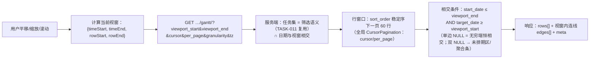
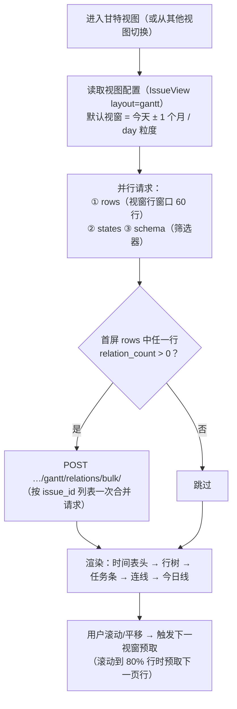
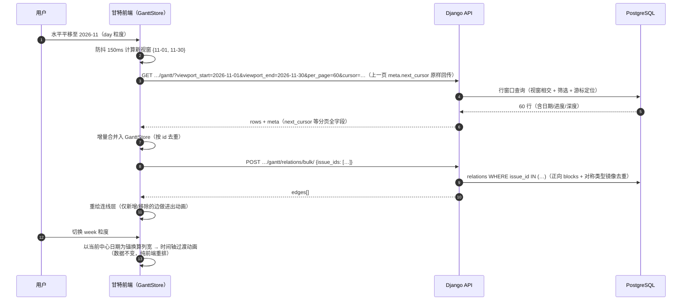

# 甘特图核心渲染与粒度切换

| 元信息项 | 内容 |
| --- | --- |
| 文档编号 | GANTT-001 |
| 所属迭代 | Sprint 4 — 甘特图 + 文件管理（第 6 周） |
| 优先级 | P2（标准版完整级 · **甘特体系的地基**） |
| 所属模块 | M6-GANTT｜甘特图进度 |
| 文档状态 | 待评审（Draft） |
| 最后更新日期 | 2026-09-01 |
| 上游依赖 | `TASK-004`（子树与缩进结构）、`TASK-005`（**relations 契约——连线数据唯一直接来源**）、`TASK-003/011`（筛选语义复用）、`TASK-006`（估算与工时对照位）、`BOARD-003`（视图框架与 IssueView） |
| 下游消费 | `GANTT-002`（拖拽改期/延期/导出——本文档的交互层）、`GANTT-003`（P3 关键路径）、`RPT-002`（进度统计口径对齐） |
| 上游依据 | `docs/需求文档.md` §3.6（项目全量任务甘特图展示、时间粒度切换、进度百分比、视图缩放平移）、§8.2 甘特图 P2 列 |
| 关联架构文档 | [`unified-issue-model.md`](../architecture/unified-issue-model.md)（§2.6 State.group 进度语义表、§2.8 日期字段与索引）、[`api-conventions.md`](../architecture/api-conventions.md)（§4.1 分组响应、§5 查询能力）、[`tech-stack.md`](../architecture/tech-stack.md)（@tanstack/react-virtual、pragmatic-dnd） |
| 对标基线 | Plane Gantt（**EE 付费特性，开源版无**——本系统开源交付） · Ones 甘特（企业级进度管控） · MS Project 时间轴交互范式 |
| 工作量估算 | 后端 1.5 人日 / 前端 4 人日 / 联调与测试 1.5 人日，合计 **7 人日** |

---

## 1. 概述

### 1.1 功能定位

甘特图是项目管理的「时间全景」：横轴时间、纵轴任务树，任务条横跨其起止区间，依赖连线揭示先后约束，今日线与延期高亮直接回答「我们现在在哪、什么晚了」。列表、看板、筛选器回答「做什么/谁做/什么状态」，甘特回答「**什么时候**」——四视图共同构成标准版的完整视角矩阵。

本文档交付甘特的**渲染与取数地基**：视窗查询、虚拟滚动、三粒度时间轴、任务条与进度、依赖连线（只读）、今日线。交互层（拖拽改期、导出）归 `GANTT-002`。

技术上的两个硬承诺：

1. **1 万任务、5 年跨度数据集下首屏 P95 < 1.5s**——靠「视窗取数」（按可见时间范围 + 可见行范围双重裁剪）与虚拟滚动达成，**绝不全量拉取后前端裁剪**；
2. **连线数据零二次加工**——直接消费 `TASK-005` 冻结的 `relations/` 契约（含内联日期），甘特侧不做任何依赖关系的聚合或推导。

### 1.2 关键约定：进度百分比的唯一口径

> ⚠️ 甘特条上的进度填充不是「随手画的比例」，口径与 `unified-issue-model.md` §2.6 的语义组表严格一致。

| 任务形态 | 进度计算 | 示例 |
| --- | --- | --- |
| 有子任务（直接子级 ≥1，取消不计） | `completed_sub_issues_count / sub_issues_count`（`TASK-004` annotate 口径） | 2/5 = 40% |
| 无子任务，`state.group = completed` | 100%（划线样式 + 实心） | — |
| 无子任务，`state.group = started` | **50%**（约定值，非精确度量） | — |
| 无子任务，`unstarted / backlog` | 0% | — |
| `cancelled` | 不渲染进度填充，条体虚线 + 划线 | — |

> 「started=50%」是刻意约定：甘特粒度下的进行中任务没有可信的精确比例，50% 表达「进行中」的视觉语义而非量化声明（与看板列语义一致）。P3 `GANTT-003` 若引入关键路径加权，再评估精确口径。

### 1.3 关键约定：视窗取数（Viewport Query）



**「日期相交」而非「日期包含」**：一个横跨整年的任务条在用户只看 8 月时也必须渲染（它的条与视窗相交）——`start_date <= 视窗尾 AND target_date >= 视窗首` 是区间相交的标准判定。

**未排期任务与单边缺省**：`start_date` 与 `target_date` **均为空且子树亦无日期**的任务不进时间轴主体，收敛到左侧独立的「未排期」折叠区（可拖入时间轴——交互归 `GANTT-002`）；自身双空但子树有日期的父任务不入未排期区，而以「聚合条」进入时间轴（BR-11）。仅一侧为空的任务按 BR-02 的无穷语义参与相交，条体缺省端画为「开放端」（左端开放 = 未设开始、右端开放 = 未设截止，样式见 §3.2），其连线端遵循 BR-08 锚定今日。

### 1.4 三粒度定义

| granularity | 列宽（px/天） | 时间表头 | 适用跨度 | 对齐 |
| --- | --- | --- |---| --- |
| `day` | 32 | 日（每列一天，显示 `d` 日 + 周末底纹） | ≤ 3 个月 | 列边界 = 自然日 00:00 |
| `week` | 8 | 周（首行周一日期，次行周数） | 3 个月 ~ 2 年 | 列边界 = 周一 00:00 |
| `month` | 2 | 月（`yyyy-MM`） | > 2 年 | 列边界 = 月首 00:00 |

- 切换粒度时**视窗中心日期保持不变**（缩放锚点），时间轴平滑过渡（150ms）；
- 拖拽平移超过阈值自动提示可切更优粒度（如 day 视窗拖出 6 个月 → 提示切 week）。

### 1.5 范围边界

| 能力 | 本文档（P2 渲染层） | 归属 |
| --- | --- | --- |
| 视窗取数 + 虚拟滚动 + 三粒度切换 | ✅ | — |
| 任务树行（缩进/折叠/图标/编号） | ✅ | — |
| 任务条（起止/进度填充/逾期红/完成划线/取消虚线） | ✅ | — |
| 依赖连线（只读渲染，类型样式区分） | ✅ | — |
| 今日线 / 周末底纹 / 节假日（配置） | ✅（内置中国法定假配置表） | — |
| 「未排期」折叠区 | ✅ | — |
| 任务条拖拽改期 / 拖拽建依赖 / 双击改工期 | ❌ | `GANTT-002` |
| 延期自动预警 / 提醒推送 | ❌（本迭代仅延期高亮样式） | P3 `GANTT-003` |
| 关键路径计算与高亮 | ❌ | P3 `GANTT-003` |
| 资源负载 / 跨项目甘特 | ❌ | P4 |
| PNG 导出 | ❌ | `GANTT-002` |
| 拖拽自动改期（后置任务联动顺延） | ❌ | P4（明确决策：P2 连线只读） |

### 1.6 前置依赖

| 依赖 | 内容 | 阻塞原因 |
| --- | --- | --- |
| `TASK-005` | `relations/` 契约（含 `related_issue` 内联 `start_date/target_date/state_group`） | 连线渲染数据源 |
| `TASK-004` | 树形行结构、`subtree` 深度 | 左侧行树 |
| `TASK-011` | 筛选 DSL | 甘特取数复用（筛选结果的时间轴投影） |
| `TASK-006` | `estimate_minutes` / `spent_minutes`（任务响应 annotate 口径） | 任务条工时对照位（§3.2 悬浮）与行契约字段（§4.2.1） |
| `BOARD-003` | 视图框架（layout=gantt 入 `IssueView.Layout` 枚举） | 视图保存与切换 |
| `INFRA-002` | live 服务（`COLLAB-004` 事件 → 甘特条实时刷新） | 增量更新 |

### 1.7 竞品参考

| 竞品 | 参考点 | 处置 |
| --- | --- | --- |
| Plane | Gantt 为 **EE 付费特性**（开源版无） | 本系统 P2 开源交付——对开源社区是显著增量 |
| Plane EE Gantt | 视窗渲染、分组折叠、依赖连线 | 交互范式对齐；实现自研（视窗取数 + 虚拟滚动） |
| Ones | 甘特 + 关键路径 + 资源负载（企业级） | 关键路径 P3、负载 P4 分层跟进 |
| MS Project | 粒度切换缩放锚点、今日线拖拽导航 | 缩放锚点交互采纳 |

---

## 2. 业务逻辑

### 2.1 首屏加载流程



> 「含依赖」的判定信号 = rows 契约的 `relation_count` 字段（§4.2.1 契约要点 7，服务端按正反向关联 annotate 计数随行下发）：任一行 `relation_count > 0` 即发 `relations/bulk/`，全为 0 跳过（省一次空请求）。

### 2.2 平移 / 缩放 / 滚动的取数时序



### 2.3 业务规则汇总

| 编号 | 规则 | 判定位置 | 违反后果 |
| --- | --- | --- | --- |
| BR-01 | 甘特取数复用 `TASK-011` 筛选语义（同 DSL 同白名单）——筛选结果即甘特行集 | ViewSet | — |
| BR-02 | 视窗相交判定：`start_date ≤ viewport_end AND target_date ≥ viewport_start`；单边 NULL 视为无穷（start NULL → 从视窗首起算、条左端开放；target NULL → 至视窗尾、条右端开放，样式见 §3.2） | Service + 前端 | — |
| BR-03 | 未排期任务（双 NULL **且子树无日期**）不入时间轴，入「未排期」折叠区（计数徽标）；自身双 NULL 但子树有日期的父行走 BR-11 聚合条、不计入未排期数 | Service + UI | — |
| BR-04 | 进度口径唯一：§1.2 表（子任务比例 > 语义组约定），由服务端下发 | Service | 评审拒绝（禁止前端自算） |
| BR-05 | 日期显示时区：按**请求级时区**（query `?tz=` > `X-Client-TZ` 头 > 默认 `Asia/Shanghai`——`RPT-001` BR-04 同款范式；Project/Profile 均无 timezone 字段，时区由前端持、后端折算）计算自然日/周/月边界与「今天」/逾期判定；服务端存 UTC 不受影响；`tz` 非法（非 IANA 时区名）→ 400。下游 `GANTT-002` 的 `get_project_tz()`（项目时区）为旧口径，**待同步本范式** | Service + 前端 | — |
| BR-06 | 连线只读：渲染 `relations/` 数据，甘特侧不产生任何依赖写操作；`GANTT-002` 的拖拽建依赖走 `TASK-005` 端点 | 架构约束 | — |
| BR-07 | 连线仅绘制**两端行均可见**的边；一端折叠/滚出视窗的边收拢为其可见端的小锚点（悬浮提示目标） | 前端 | — |
| BR-08 | 无日期端的连线：锚定「今日」虚线节点（`TASK-005` 契约允许 NULL 日期） | 前端 | — |
| BR-09 | 虚拟滚动行高固定 36px；行分页 `per_page` 默认 60（全局 CursorPagination，api-conventions §6.2/§6.3），滚动至 80% 预取下一页 | 前端 | — |
| BR-10 | 折叠状态（哪些父节点收起）持久化到视图 `display_props.collapsed`（`BOARD-003` IssueView） | 前端 + View | — |
| BR-11 | 甘特行排序：`sort_order`（与看板/列表同源）；父自身无日期而子树有日期时显示「聚合条」（区间 = 子树最早 start ~ 最晚 target，`is_aggregated=true` 下发，半透明样式，不计入 unscheduled_count） | Service | — |
| BR-12 | 权限：`gantt.read`（VIEWER+）可见；行集经项目过滤，无越权行 | Permission | 403/404 |
| BR-13 | 性能门禁：1 万任务/5 年跨度，首屏（含连线）P95 < 1.5s；平移预取 P95 < 300ms | 测试门禁 | — |
| BR-14 | `COLLAB-004` 事件（issue.updated/board.moved）到达时增量更新对应行与连线，不做全量刷新 | 前端 | — |

### 2.4 异常处理

| 场景 | 触发条件 | 前端表现 | 后端处理 | 错误码 |
| --- | --- | --- | --- | --- |
| 视窗参数非法（start > end） | 构造请求 | — | 400 | `VALIDATION_INVALID_PARAM` |
| 粒度非法 | granularity=hour | — | 400 | `VALIDATION_INVALID_PARAM` |
| 请求时区非法 | `tz=ABC`（非 IANA 时区名） | — | 400 | `VALIDATION_ERROR` + 子码 `INVALID`（`RPT-001` 同款） |
| 项目无任务 | 空项目 | 空态插画「排期第一个任务」 | — | — |
| 全部任务未排期 | 无日期 | 时间轴空 + 「未排期 (N)」展开列表 | — | — |
| 预取失败 | 网络 | 保持当前渲染 + 顶部黄条「实时更新暂停 · 重试」 | — | — |
| 单行数据损坏（日期反转） | 脏数据 | 该条渲染为 1 天最小条 + 错误角标 | `chk_issue_start_before_target` 常开约束（理论不可达） | — |
| 视图保存失败 | layout 非法值（枚举外，如 `layout=calendar`） | Toast（保存失败提示，视图保持原值） | 400 | `VALIDATION_ERROR` + 子码 `NOT_A_CHOICE`（枚举校验，api-conventions §8.8；与 `BOARD-003` 视图保存同管道） |

### 2.5 边界条件

| 边界场景 | 限制值 | 超出处理 |
| --- | --- | --- |
| 单项目任务数 | 1 万（门禁基准） | 虚拟滚动线性扩展 |
| 时间跨度 | 5 年（门禁基准） | month 粒度扩展 |
| 视窗宽 | ≤ 366 天（day） | 前端强制切 week/month |
| 行分页 | per_page 默认 60、上限 100 | 全局游标分页；超限静默截断（meta.degraded） |
| 连线批量请求 | 一次 ≤ 60 issue | 分批 |
| 最小任务条宽 | 4px（同日起止） | — |
| 折叠深度 | 与 `MAX_ISSUE_DEPTH=5` 一致 | — |

---

## 3. UI/UX 设计

### 3.1 甘特视图整体布局

```
┌──────────────────────────────────────────────────────────────────────────────────┐
│ [列表|看板|甘特|表格]  🔍筛选  [日|周|月]  ←今天→  ⤢缩放                        │
├────────────────────┬─────────────────────────────────────────────────────────────┤
│  任务 (328)         │  2026-09            ▼                                      │
│  ┌────────────────┐ │ ┌──┬──┬──┬──┬──┬──┬──┬──┬──┬──┬──┬──┬──┬──┬──┬──┬──┬──┐  │
│  │ ▾ RBT-12 导出… │ │ │  │  │  │▓▓│▓▓│▓▓│▓▓│▓▓│  │  │  │  │  │  │  │  │  │  │  │
│  │   ├ RBT-13 后端│ │ │  │  │  │██████████│  │  │  │  │  │  │  │  │  │  │  │  │
│  │   │  └ RBT-15  │ │ │  │  │  │  │  │  │▓▓▓▓│  │  │  │  │  │  │  │  │  │  │  │
│  │   └ RBT-14 前端│ │ │  │  │  │  │  │  │  │  │░░│░░│░░│  │  │  │  │  │  │  │  │
│  │ ▸ RBT-20 登录… │ │ │  │  │  │  │  │▒▒▒▒▒▒▒▒▒▒│  │  │  │  │  │  │  │  │  │  │
│  │ RBT-31 修复504 │ │ │  │▓▓│  │  │  │  │  │  │  │  │  │  │  │  │  │  │  │  │  │
│  ├────────────────┤ │ ├──┴──┴──┴──┴──┴──┴──┴──┴──┴──┴──┴──┴──┴──┴──┴──┴──┴──┤  │
│  │ 📥 未排期 (12) │ │ │     ▲今日线(红)  ░空条(0%) ▓部分 █完成 ▒逾期            │  │
│  └────────────────┘ │ └───────────────────────────────────────────────────────┘  │
└────────────────────┴─────────────────────────────────────────────────────────────┘
  左栏 320px（可拖宽 240~480px）· 行高 36px · 连线在条间绘制（图示略）
```

| 区域 | 组件 | 规格 |
| --- | --- | --- |
| 视图切换条 | 复用 `BOARD-003` 视图框架 | layout=gantt 高亮 |
| 粒度切换 | 三段 Segmented Control | `日｜周｜月`；快捷键 `1/2/3` |
| 今天导航 | `←今天→` | 平移动画到今日居中；`T` 键 |
| 缩放 | `⤢` + Ctrl+滚轮 | 缩放锚点 = 光标处日期 |
| 左栏行树 | 编号 + 标题（truncate）+ 折叠箭头 | 缩进 20px/层；`▸/▾` |
| 任务条 | 圆角 4px、高 20px（行内垂直居中） | 见 §3.2 样式矩阵 |
| 连线 | SVG 覆盖层（贝塞尔曲线） | 见 §3.3 样式矩阵 |
| 今日线 | 2px 红（`#EF4444`）竖线 + 顶部角标「今天」 | 平移跟随 |
| 周末/节假日底纹 | 6% 灰 / 10% 灰 | 中国法定假配置表 |

### 3.2 任务条样式矩阵

| 状态 | 条体 | 进度填充 | 边框 |
| --- | --- | --- | --- |
| 未开始（0%） | 10% 灰底 | 无 | 1px 中性 |
| 进行中（1~99%） | 状态色 15% 底 | 状态色实心（宽度=进度%） | 1px 状态色 |
| 已完成 | 绿 15% 底 | 绿实心 100% | — + 条体划线 |
| 已取消 | 虚线边框灰底 | 无 | 1px dashed |
| 逾期（未完成且 target < 今天） | 红 15% 底 | 状态色填充 | 1.5px 红 + 右端 ⚠ |
| 聚合条（父无日期） | 渐变半透明 | 子树整体进度 | 虚线（提示为聚合） |
| 开放端条（单边 NULL） | 同所属状态样式 | 同所属状态口径 | 缺省端无圆角 + 渐隐边缘；悬浮提示「未设置开始/截止日期」（BR-02） |
| 今日线跨越的条 | — | — | 左缘 2px 亮色高亮 |

条内文本：宽度 ≥ 80px 时显示 `编号+标题`（truncate）；不足时悬浮 tooltip 全量信息（编号/标题/起止/进度/执行人头像/工时对照 `spent/estimate`——格式化与超耗红显口径同 `TASK-006` §3，`estimate_minutes` 为空不显示该行）。

### 3.3 依赖连线样式矩阵（消费 `TASK-005` 四类型）

| relation_type | 线型 | 端点 | 语义提示 |
| --- | --- | --- | --- |
| `blocks`（A→B） | 实线 + 箭头（A 尾 → B 头） | 圆点起 / 箭头终 | 「完成 A 后才可完成 B」 |
| `is_blocked_by`（渲染合并为 blocks 正向） | 同上 | — | — |
| `relates_to` | 灰虚线、无箭头 | 圆点双向 | 「相关」 |
| `duplicates` | 灰点划线 + 菱形端 | 菱形终 | 「重复于」 |

- 连线颜色：blocks 状态色、relates/duplicates 中性灰；
- 悬浮连线：tooltip 显示两端正倒名称与关系语义；点击高亮两端行；
- **排期冲突视觉提示**：B（被阻塞方）起期早于 A 终期时连线中段红点标记（P2 仅提示不阻止排期——排期合法性硬拦截在流转层 `TASK-005`）。

### 3.4 交互细节表

| 交互动作 | 触发方式 | 反馈效果 | 加载态 / 空态 |
| --- | --- | --- | --- |
| 水平平移 | 拖拽时间轴区 / 触控板横向滚动 | 视窗跟随（rAF 节流）；150ms 防抖后预取 | 预取中列头右侧 spinner |
| 垂直滚动 | 滚轮 / 拖滚动条 | 行虚拟滚动；80% 处预取下行页 | 行骨架 200ms |
| 粒度切换 | Segmented / `1·2·3` | 中心锚点不变，列宽过渡 150ms | — |
| 缩放 | Ctrl+滚轮 / ⤢ | 以光标日期为锚 | — |
| 回到今天 | `←今天→` / `T` | 平移动画 300ms | — |
| 行折叠 | 左栏 ▸/▾ | 子行收起；连线按 BR-07 收拢 | — |
| 条悬浮 | hover | tooltip 全量 + 连线两端高亮 | — |
| 条点击 | 单击 | 打开任务详情 Drawer（复用 `TASK-001`，URL `?peekIssue=`） | — |
| 未排期展开 | 点击「未排期 (N)」 | 下方列出任务行（点击跳转列表） | 空则不显示 |

### 3.5 空状态 / 加载 / 失败

| 场景 | 处置 |
| --- | --- |
| 项目无任务 | 甘特区插画 + 「创建或导入任务后排期将在此展示」 |
| 任务全未排期 | 时间轴空网格 + 未排期区置顶展开 + 「去列表设置日期」引导 |
| 首屏加载 | 表头骨架 + 12 行条形骨架（占位宽度随机，CLS=0） |
| 预取失败 | 黄条 + 保持既有渲染 |

### 3.6 响应式与无障碍

| 断点 | 布局 |
| --- | --- |
| ≥ 1440px | 左栏 320px + 时间轴自适应 |
| 1024~1439px | 左栏 240px；条内文本仅编号 |
| < 1024px | 甘特降级提示「建议在桌面端使用」+ 只读简化时间轴（无虚拟滚动，行上限 200） |

无障碍：

- 行树 `role="tree"` 沿用 `TASK-004`；时间轴区 `role="application"` + `aria-roledescription="甘特图"`；
- 键盘：`↑↓` 行选择、`←→` 平移一天（周/月粒度平移一列）、`Home/End` 视窗首尾、`Enter` 打开选中任务、`1/2/3` 粒度、`T` 今天；
- 每行 `aria-label` 完整摘要（「RBT-13 后端导出 API，9 月 1 日至 9 月 5 日，进度 100%，已完成」）——屏幕阅读器可线性消费甘特信息；
- 颜色语义冗余：逾期 ⚠ 图标、完成划线、取消虚线（不依赖色相）。

---

## 4. 技术架构

### 4.1 数据模型

**零新增表**。消费 `Issue` 日期字段与既有索引，新增一条**视窗专用复合偏索引**（受控 DDL，同 `TASK-006` 例外规范）：

```python
# Issue 既有字段（unified-issue-model §2.8）：
#   start_date / target_date（date, nullable；target_date 有单列索引）
#   parent / sort_order / state（行树与排序）

# 新增索引（migration，服务于甘特视窗相交查询）：
indexes = [
    models.Index(
        fields=["project", "start_date", "target_date"],
        condition=models.Q(deleted_at__isnull=True, archived_at__isnull=True),
        name="idx_issue_gantt_viewport",
    ),
]
```

| 索引 | 服务的查询 | 说明 |
| --- | --- | --- |
| `idx_issue_gantt_viewport` | `WHERE project=? AND start_date<=? AND target_date>=? …` 视窗相交 + 行排序 | 偏条件排除软删/归档；三列复合让相交判定走索引扫描 |
| `idx_issue_active_by_project`（既有） | 未排期区计数 | — |
| `idx_issue_parent`（既有） | 行树层级 | — |

### 4.2 API 定义

| # | 方法 | 路径 | 描述 | 权限 | 成功码 |
| --- | --- | --- | --- | --- | --- |
| 1 | `GET` | `…/projects/{project_id}/gantt/` | 视窗行取数 | `gantt.read`（VIEWER+） | `200` |
| 2 | `POST` | `…/projects/{project_id}/gantt/relations/bulk/` | 可见行连线批量（命名对齐 `issues/bulk/` 动作子资源，api-conventions §2.6） | `gantt.read` | `200` |
| 3 | `GET` | `…/projects/{project_id}/gantt/unscheduled/` | 未排期任务列表 | `gantt.read` | `200` |

#### 4.2.1 `GET …/gantt/` — 视窗行取数

**请求**

```http
GET /api/v1/workspaces/acme/projects/7b3e9c1a-…/gantt/?granularity=day&viewport_start=2026-09-01&viewport_end=2026-09-30&per_page=60&view_id=<uuid>&tz=Asia/Shanghai HTTP/1.1
```

**成功响应 `200`**

```json
{
  "status": "success",
  "data": {
    "rows": [
      {
        "id": "8a1f9c2e-6b3d-4a7e-9f11-2c4d5e6f7a8b",
        "issue_key": "RBT-12", "name": "导出功能", "depth": 0,
        "has_children": true, "collapsed": false,
        "start_date": "2026-09-01", "target_date": "2026-09-08",
        "progress": 40, "progress_source": "subtasks",
        "state_group": "started", "state_color": "#3B82F6",
        "is_overdue": false, "assignee_ids": ["6c7d…"],
        "is_aggregated": false,
        "relation_count": 2,
        "estimate_minutes": 480, "spent_minutes": 240
      },
      {
        "id": "b2c3d4e5-f6a7-4b8c-9d0e-1f2a3b4c5d6e",
        "issue_key": "RBT-13", "name": "后端导出 API", "depth": 1,
        "has_children": true, "collapsed": false,
        "start_date": "2026-09-01", "target_date": "2026-09-05",
        "progress": 100, "progress_source": "subtasks",
        "state_group": "completed", "state_color": "#10B981",
        "is_overdue": false, "assignee_ids": ["2b3a…"],
        "is_aggregated": false,
        "relation_count": 1,
        "estimate_minutes": null, "spent_minutes": 120
      }
    ],
    "unscheduled_count": 12
  },
  "meta": {
    "next_cursor": "NjA6MTow", "prev_cursor": "NjA6MDox",
    "next_page_results": true, "prev_page_results": false,
    "count": 2, "total_count": 328, "total_pages": 6, "page": 1, "per_page": 60,
    "granularity": "day", "viewport": { "start": "2026-09-01", "end": "2026-09-30" },
    "today": "2026-09-01"
  }
}
```

**契约要点**：

1. `progress`（0~100 整数）与 `progress_source`（`subtasks|state`）由服务端按 §1.2 口径计算下发——前端禁止自算（BR-04）；有子任务的行 `progress_source` 恒为 `subtasks`；
2. `is_aggregated=true` 表示该行为「子树聚合条」：自身双 NULL 但子树含日期的父行（BR-11），`start_date/target_date` 下发子树聚合区间（最早 start ~ 最晚 target，按 `TASK-004` 子树 CTE annotate），不计入 `unscheduled_count`；其余行 `is_aggregated=false`，单边 NULL 照实下发 `null`，前端按 §3.2「开放端」渲染；
3. `collapsed` 回显视图保存的折叠状态（BR-10）；行序 = `sort_order` 同层序；
4. `view_id` 携带时筛选 DSL 由视图解析（`TASK-011` 管道），不携带时用临时筛选参数；
5. 行分页复用全局 `CursorPagination`（api-conventions §6.2/§6.3）：参数 `cursor`/`per_page`（首页不带 `cursor`；本端点 `per_page` 默认 60、上限 100 静默截断），游标为不透明 Base64（`value:offset:is_prev`，客户端原样回传、禁止拼装，解码失败 `400 VALIDATION_INVALID_CURSOR`），`meta` 携带 `next_cursor/prev_cursor/next_page_results/prev_page_results/count/total_count/total_pages/page/per_page` 全字段——决策登记见 §6.3；
6. `estimate_minutes`/`spent_minutes` 为 `TASK-006` 契约字段（整数分钟，`spent` 为 annotate 实时聚合），供条悬浮的工时对照位消费；`estimate_minutes` 为 `null` 时前端不显示该位。
7. `relation_count`（整数）：该行为端点的关联关系数（正向 + 反向、四种类型全计；软删或对方软删不计），服务端按正反向子查询 annotate 计数随行下发——供前端判定是否发起 `relations/bulk/`（§2.1：任一行 `> 0` 即请求），不参与条/线渲染；
8. `tz` 与 `granularity` 均为**选填**：`tz` 解析优先级 `?tz=` > `X-Client-TZ` 头 > 默认 `Asia/Shanghai`（BR-05，`RPT-001` BR-04 同款），`meta.today` 与 `is_overdue` 按该时区折算，非法值（非 IANA 时区名）→ 400 `VALIDATION_ERROR`（子码 `INVALID`）；`granularity` 默认 `day`，服务端仅校验枚举（`day|week|month`）并在 `meta.granularity` 回显，**不影响取数**（三粒度下行集/分页口径完全相同，列宽与表头刻度是前端渲染层概念，§1.4）。

**失败响应 `400`（视窗非法）**

```json
{
  "status": "error",
  "error": {
    "code": "VALIDATION_INVALID_PARAM",
    "message": "查询参数非法",
    "details": [{ "field": "viewport_start", "code": "INVALID_DATE_RANGE",
                  "message": "视窗起始晚于结束" }],
    "request_id": "01JCBB1A4Y9CE4W6D7F0H2J4K6M8N0"
  }
}
```

#### 4.2.2 `POST …/gantt/relations/bulk/` — 连线批量

**请求**

```json
{ "issue_ids": ["8a1f9c2e-6b3d-4a7e-9f11-2c4d5e6f7a8b",
                "b2c3d4e5-f6a7-4b8c-9d0e-1f2a3b4c5d6e"] }
```

**成功响应 `200`**

```json
{
  "status": "success",
  "data": {
    "edges": [
      {
        "from_issue_id": "b2c3d4e5-f6a7-4b8c-9d0e-1f2a3b4c5d6e",
        "to_issue_id": "8a1f9c2e-6b3d-4a7e-9f11-2c4d5e6f7a8b",
        "relation_type": "blocks",
        "from": { "issue_key": "RBT-13", "target_date": "2026-09-05" },
        "to":   { "issue_key": "RBT-12", "start_date": "2026-09-01", "violation": true }
      },
      {
        "from_issue_id": "d4e5f6a7-b8c9-4d0e-a1f2-3b4c5d6e7f8a",
        "to_issue_id": "8a1f9c2e-6b3d-4a7e-9f11-2c4d5e6f7a8b",
        "relation_type": "relates_to",
        "from": { "issue_key": "RBT-31", "target_date": "2026-09-10" },
        "to":   { "issue_key": "RBT-12", "start_date": "2026-09-01", "violation": false }
      }
    ]
  },
  "meta": { "requested": 2, "edges": 2 }
}
```

> `violation` 仅对 `blocks` 边派生（标注「被阻塞方起期早于阻塞方终期」的排期冲突，服务端一行 CASE 计算，供前端红点提示，§3.3）；`relates_to` / `duplicates` 边恒为 `false`（字段保留保证边形状一致）。`relation_type` 下发全集 = `blocks` / `relates_to` / `duplicates`——`is_blocked_by` 镜像行与对称类型的反向行在服务端去重（§4.3.3），四种线型渲染见 §3.3。数据本体与 `TASK-005` 契约一致，仅增派生标记。

#### 4.2.3 `GET …/gantt/unscheduled/` — 未排期区

标准游标列表（`fields` 裁剪为编号/标题/状态/执行人），`meta.total_count` 供折叠区徽标。

### 4.3 核心逻辑

#### 4.3.1 视窗行查询（服务端）

```python
# apps/api/plane/app/views/gantt.py（节选）
def gantt_rows(self, request, *args, **kwargs):
    project = self.get_project()
    viewport_start = parse_date(request.query_params["viewport_start"])
    viewport_end = parse_date(request.query_params["viewport_end"])
    if viewport_start > viewport_end:
        raise ValidationError({"viewport_start": "视窗起始晚于结束"})
    tz_name = (request.query_params.get("tz")
               or request.headers.get("X-Client-TZ")
               or "Asia/Shanghai")              # BR-05：请求级时区（RPT-001 BR-04 同款；
    try:                                       # Project/Profile 均无 timezone 字段）
        tz = ZoneInfo(tz_name)
    except Exception:
        raise ValidationError({"tz": "tz 须为合法 IANA 时区名"})   # 400 INVALID

    base = build_issue_queryset(            # TASK-011 管道：权限 + 筛选 + 排序
        ctx=self.compile_context(request), view=self.resolve_view(request))
    active = (base
              .filter(deleted_at__isnull=True, archived_at__isnull=True)
              .annotate(sub_issues_count=…, completed_sub_issues_count=…,   # TASK-004 口径
                        subtree_min_start=…, subtree_max_target=…,          # 子树聚合区间（BR-11）
                        relation_count=…,                                   # 正反向关联计数（§2.1 判定信号）
                        spent_minutes=…))                                  # TASK-006 实时聚合
    rows_qs = active.filter(
        (Q(start_date__isnull=True) | Q(start_date__lte=viewport_end))      # BR-02：单边 NULL = 无穷端
        & (Q(target_date__isnull=True) | Q(target_date__gte=viewport_start))
        & (Q(start_date__isnull=False) | Q(target_date__isnull=False)       # BR-03：双 NULL 自身不入时间轴
           | (Q(subtree_min_start__isnull=False)                            #   例外：子树有日期 → 聚合条，
              & Q(subtree_min_start__lte=viewport_end,                      #   且聚合区间与视窗相交（BR-11）
                  subtree_max_target__gte=viewport_start))))
    rows = self.paginate_queryset(          # 全局 CursorPagination（api-conventions §6.2/§6.3）
        rows_qs.order_by("sort_order", "-created_at", "-id"))               # 排序尾追加唯一键（§5.4）
    payload = [serialize_gantt_row(r, tz) for r in rows]                  # tz：请求级解析（BR-05）
    unscheduled = active.filter(            # BR-03：双 NULL 且子树全无日期 → 未排期区
        start_date__isnull=True, target_date__isnull=True,
        subtree_min_start__isnull=True).count()
    return success_response({"rows": payload, "unscheduled_count": unscheduled},
                            meta=self.get_paginated_meta())                 # 分页 meta 全字段
```

**执行计划期望**：`idx_issue_gantt_viewport` 索引命中（project + 日期相交；BR-02 的 NULL 容忍 OR 分支展开后，规划器可能走 Index Scan 直扫或经 BitmapOr 合并的 Bitmap Index Scan——**均算命中**，IT-07 断言按索引名而非扫描形态）→ 行排序在窗口内完成（60 行 sort 开销可忽略）；`unscheduled` 计数走 `idx_issue_active_by_project`。

#### 4.3.2 进度与逾期派生（行序列化内）

```python
def serialize_gantt_row(issue, tz) -> dict:
    is_aggregated = (issue.start_date is None and issue.target_date is None
                     and issue.subtree_min_start is not None)              # BR-11 聚合条
    if issue.sub_issues_count > 0:                                  # BR-04 唯一口径
        progress = round(100 * issue.completed_sub_issues_count
                         / issue.sub_issues_count)
        source = "subtasks"
    else:
        # state.group 五组全枚举：缺键 = KeyError → 500（cancelled 由渲染层跳过填充，§1.2/UT-08）
        progress = {"completed": 100, "started": 50,
                    "unstarted": 0, "backlog": 0, "cancelled": 0}[issue.state_group]
        source = "state"
    today = localdate(tz)                                  # BR-05：请求级时区折算的「今天」
    return {
        …,
        "start_date": issue.subtree_min_start if is_aggregated else issue.start_date,
        "target_date": issue.subtree_max_target if is_aggregated else issue.target_date,
        "progress": progress, "progress_source": source,
        "is_aggregated": is_aggregated,
        "relation_count": issue.relation_count,             # §2.1 连线批量判定信号
        "estimate_minutes": issue.estimate_minutes,                  # TASK-006 工时对照位
        "spent_minutes": issue.spent_minutes,
        "is_overdue": (issue.state_group not in ("completed", "cancelled")
                       and issue.target_date is not None
                       and issue.target_date < today),
    }
```

#### 4.3.3 连线批量（合并请求，杜绝 N+1）

```python
@action(detail=False, methods=["post"], url_path="gantt/relations/bulk")
def relations_bulk(self, request, *args, **kwargs):
    requested_ids = request.data.get("issue_ids", [])
    requested = len(requested_ids)            # 截断前计数（§4.2.2 meta.requested，UT-14）
    ids = requested_ids[:60]                  # §2.5 批量上限（超限由前端分批）
    FORWARD_TYPES = ("blocks", "relates_to", "duplicates")   # 排除镜像 is_blocked_by（防重复边）
    links = (IssueLink.objects
             .filter(issue_id__in=ids, deleted_at__isnull=True,
                     related_issue__deleted_at__isnull=True,
                     relation_type__in=FORWARD_TYPES)
             .filter(Q(relation_type="blocks") |            # blocks 族成对异型：只取正向行
                     Q(issue_id__lt=F("related_issue_id")))  # 对称类型成对同型：按 id 序取一行去重
             .select_related("issue", "related_issue"))
    edges = []
    for l in links:
        to = l.related_issue
        violation = (l.relation_type == "blocks" and l.issue.target_date
                     and to.start_date and to.start_date < l.issue.target_date)
        edges.append({"from_issue_id": str(l.issue_id), "to_issue_id": str(to.id),
                      "relation_type": l.relation_type,
                      "from": {"issue_key": issue_key(l.issue),
                               "target_date": l.issue.target_date},
                      "to": {"issue_key": issue_key(to),
                             "start_date": to.start_date,
                             "violation": bool(violation)}})
    return success_response({"edges": edges},
                            meta={"requested": requested, "edges": len(edges)})   # §4.2.2 meta 同步
```

### 4.4 前端实现

#### 4.4.1 `GanttStore`（`packages/shared-state`）

```typescript
// packages/shared-state/src/gantt.store.ts
import { addDays, differenceInCalendarDays, max, min } from "date-fns";

const DAY_WIDTH = { day: 32, week: 8, month: 2 } as const;

export class GanttStore {
  @observable granularity: "day" | "week" | "month" = "day";
  @observable viewport = { start: addDays(new Date(), -30), end: addDays(new Date(), 30) };
  @observable rowsById = observable.map<string, GanttRow>();
  @observable rowOrder: string[] = [];            // 视窗内行序（虚拟滚动源）
  @observable edges: GanttEdge[] = [];
  @observable collapsed = observable.set<string>();

  /** 条几何——纯派生方法（非 @computed：MobX 不支持带参 computed；
   *  响应性经调用点读取的 granularity / viewport / rowsById 可观察量建立） */
  barGeometry(row: GanttRow): { left: number; width: number;
                                openStart: boolean; openEnd: boolean } {
    const dayWidth = DAY_WIDTH[this.granularity];
    // BR-02 渲染口径：start NULL → 自视窗首起算（开放左端）；target NULL → 至视窗尾（开放右端）。
    // is_aggregated 行的 start_date/target_date 即服务端下发的子树聚合区间（§4.2.1 契约要点 2）。
    const start = max([row.start_date ?? this.viewport.start, this.viewport.start]);
    const end = min([row.target_date ?? this.viewport.end, this.viewport.end]);
    const left = differenceInCalendarDays(start, this.viewport.start) * dayWidth;
    const width = Math.max(
      4, differenceInCalendarDays(end, start) * dayWidth);
    return { left, width,
             openStart: row.start_date === null, openEnd: row.target_date === null };
  }

  /** 平移/缩放统一入口：防抖 150ms → 取数 → 增量合并（按 id 去重） */
  async navigate(next: Partial<{ start: Date; end: Date;
                                 granularity: Granularity }>): Promise<void> { … }
}
```

#### 4.4.2 渲染分层与虚拟滚动

| 层 | 技术 | 说明 |
| --- | --- | --- |
| 时间表头 | 纯 DOM（sticky 双行：粒度主行 + 子刻度） | 随平移 transform |
| 行区 | `@tanstack/react-virtual`（行虚拟，36px 行高，overScan 10） | 左树与右条同滚动容器（横向共用 transform） |
| 任务条 | 绝对定位 div（`left/width` 来自 `barGeometry`） | 状态色 class 矩阵（§3.2） |
| 连线层 | 单一 SVG 覆盖（pointer-events 仅线本身） | 只绘可见边（BR-07）；贝塞尔 path 由自研 `bezierPath()` 工具函数生成（SVG `C` 指令，≈20 行——按 tech-stack §9.1 准入第 1 条「少量自研可替代则不引入」，**不引入 d3**） |
| 今日线 | 2px 绝对定位竖线 | — |

- 横向滚动 = 容器 transform（rAF 节流），**不触发取数**；视窗（时间范围）变化才防抖取数——「像素平移」与「数据视窗」解耦是性能关键；
- `COLLAB-004` 事件 → `rowsById` 单行 upsert + 连线局部重算（BR-14）。

---

## 5. 测试用例

### 5.1 单元测试

| 用例 ID | 测试目标 | 输入 | 预期输出 | 覆盖类型 |
| --- | --- | --- | --- | --- |
| UT-01 | 相交判定 | 条 9-01~9-08，视窗 9-05~9-30 | 命中 | 正常 |
| UT-02 | 相交判定（跨界） | 条 1-01~12-31，视窗 8 月 | 命中 | 边界 |
| UT-03 | 不相交排除 | 条 8-01~8-15，视窗 9 月 | 不返回 | 正常 |
| UT-04 | 单边 NULL | start NULL / target 9-10，视窗 9 月 | 命中（BR-02 无穷语义；`start_date` 下发 null，条左端开放） | 边界 |
| UT-05 | 双 NULL 归未排期 | 双 NULL 且子树无日期 | 不入 rows；unscheduled_count +1 | 边界 |
| UT-06 | 进度：子任务口径 | 2/5 | 40，source=subtasks | 正常 |
| UT-07 | 进度：语义组 | started 无子 | 50，source=state | 正常 |
| UT-08 | 进度：取消 | cancelled | 虚线样式（无填充口径） | 边界 |
| UT-09 | 逾期判定 | target 昨天 + started | is_overdue=true | 正常 |
| UT-10 | 逾期豁免 | target 昨天 + completed | false | 边界 |
| UT-11 | violation 派生（仅 blocks） | B.start < A.target（blocks 边） | violation=true；relates_to 边恒 false | 正常 |
| UT-12 | 连线镜像去重 | blocks+is_blocked_by 两行 + relates_to 正反两行 | 各成 1 条边，无重复（§4.3.3） | 正常 |
| UT-13 | 视窗参数校验 | start > end | 400 `VALIDATION_INVALID_PARAM`（与 §4.2.1 失败响应/`API_TRUTH` 同源） | 异常 |
| UT-14 | 批量上限 | 61 ids | 截断 60（meta.requested=61） | 边界 |
| UT-15 | 权限 | 非成员 | 404 | 安全 |
| UT-16 | 筛选复用 | view_id 携带 DSL | 行集与列表视图一致 | 正常 |
| UT-17 | 工时对照下发 | estimate 480 / spent 240；另一行 estimate null | 两字段随行下发；null 时前端不渲染工时位（`TASK-006` 口径） | 边界 |
| UT-18 | 聚合条口径 | 父双 NULL、子树最早 9-02 / 最晚 9-20，视窗 9 月 | 命中 rows；is_aggregated=true；start/target=子树区间；不计 unscheduled（BR-11） | 边界 |
| UT-19 | 请求级时区折算 | tz=America/New_York，行 target_date=该时区本地今日 | meta.today / is_overdue 按请求时区日历判定（BR-05，RPT-001 范式） | 边界 |
| UT-20 | tz 非法校验 | tz=ABC | 400 `VALIDATION_ERROR`（子码 `INVALID`）；不静默回退 | 异常 |
| UT-21 | 连线判定信号下发 | 一行 2 条关联、一行 0 条 | relation_count 随行下发 2 / 0（§2.1 判定信号） | 正常 |

### 5.2 集成测试

| 用例 ID | 场景 | 前置条件 | 操作步骤 | 预期结果 |
| --- | --- | --- | --- | --- |
| IT-01 | 首屏性能门禁 | 1 万任务/5 年 | 首屏（rows+edges）50 次 | P95 < 1.5s |
| IT-02 | 平移预取性能 | 同上 | 连续平移 10 视窗 | 每次预取 P95 < 300ms |
| IT-03 | 虚拟滚动恒定 | 同上 | 滚动 500 行 | DOM 节点数恒定（虚拟窗口 ±overScan） |
| IT-04 | 折叠持久化 | 展开视图保存 | 刷新 | collapsed 回显（BR-10） |
| IT-05 | 实时更新 | 两人同项目 | A 改日期 | B 甘特条位置 2s 内更新（COLLAB-004） |
| IT-06 | 未排期计数 | 12 条无日期 | 加载数据 | unscheduled_count=12，列表一致 |
| IT-07 | 索引命中 | EXPLAIN | 视窗查询 | `idx_issue_gantt_viewport` 命中（Index Scan 直扫或经 BitmapOr 合并的 Bitmap Index Scan 均算——按索引名断言，不锁扫描形态） |

### 5.3 E2E 测试

| 用例 ID | 用户场景 | 操作路径 | 验收标准 |
| --- | --- | --- | --- |
| E2E-01 | 首屏与导航 | 打开甘特 → 平移到 11 月 → 回今天 | 条/线/今日线正确；预取无感 |
| E2E-02 | 粒度切换 | day→week→month | 中心日期锚定不变；列头正确 |
| E2E-03 | 树折叠 | 折叠父任务 | 子行消失、连线收拢锚点；刷新保持 |
| E2E-04 | 条交互 | 悬浮/点击任务条 | tooltip 全量；Drawer 打开且 URL 可分享 |
| E2E-05 | 逾期视觉 | 造逾期任务 | 红边框 + ⚠ + 图例可读（色弱可达） |

---

## 6. 竞品深度对标

### 6.1 Plane 实现分析

- **开源版无甘特**——Gantt 是其 EE（付费版）特性，开源仓库不含对应实现（`apps/web` 无 gantt 路由）。这为本系统的开源甘特留出差异化空间：P2 交付即超越 Plane 开源版能力面。
- Plane EE Gantt 的公开演示形态：视窗渲染 + 按状态分组的行 + 依赖连线 + 拖拽改期。本系统交互范式对齐，但实现自研且性能门禁显式化（1 万任务 P95 < 1.5s 写进验收），不依赖其闭源代码。

### 6.2 Ones 实现分析

- Ones 甘特是其企业进度管控核心：关键路径、延期预警、资源负载、跨项目甘特一应俱全。能力全面但重——关键路径与负载计算在万级任务下需要专门优化。
- 本系统的分层：P2 渲染地基（本文档）→ P3 关键路径与预警（`GANTT-003`）→ P4 负载与跨项目。每层独立可用，架构上「连线数据契约冻结」（`TASK-005`）保证了后续层零返工。

### 6.3 本系统设计决策

1. **视窗取数 + 像素平移解耦**：横向滚动是纯 transform（零请求），时间视窗变化才防抖取数——这是 1 万任务流畅的前提，也是多数自研甘特（全量拉取 + 前端裁剪）翻车的地方。
2. **进度服务端单源**：`progress/progress_source` 由 API 下发，甘特/列表/看板永不各自演算——「甘特显示 60% 列表算出 40%」这类不一致被结构性消灭。
3. **连线消费冻结契约**：甘特不拥有依赖数据，只渲染——依赖的唯一真相在 `TASK-005`，P3 关键路径算法也吃同一份数据，视图层零聚合逻辑。
4. **violation 是提示不是拦截**：排期冲突（被阻塞方早于阻塞方）在甘特上红点提示，但**不阻止保存**——排期是计划行为，流转拦截（`TASK-005`）才是执行硬门。两级约束的分工避免「画个图都得先解依赖」的过度僵硬。
5. **开源交付 EE 级能力**：视窗 + 虚拟滚动 + 三粒度的组合在开源项目管理工具中罕见——这是对标 Plane 定价墙的直接差异化。
6. **行分页复用全局游标分页（豁免登记）**：行窗口沿 `sort_order` 稳定序翻页，直接采用 api-conventions §6.2 的 `value:offset:is_prev` 不透明 Base64 游标与 §6.3 全字段 meta，本端点差异仅 `per_page` 默认 60（≤ 100 上限），已在 §4.2.1 契约要点 5 登记。**不另造 keyset 游标格式**——该格式按架构规范本身携带 offset（翻页稳定性由游标不透明 + 服务端定位保证），两种游标格式并存的契约分叉成本高于收益；若 P3 万级任务深翻实测出现 offset 定位性能塌陷，再按 ADR 流程申请豁免升级为 keyset。

---

## 7. 里程碑与验收

### 7.1 交付物清单

| 类型 | 交付物 |
| --- | --- |
| Model / Migration | `idx_issue_gantt_viewport` 复合偏索引（受控 DDL，迁移记录） |
| 后端 | `gantt/` 视窗行取数（相交判定/进度派生/未排期计数/工时对照字段下发/请求级 tz 解析与 relation_count 计数）、`relations/bulk/` 批量连线（violation 派生 + meta 构造）、`unscheduled/` 端点；筛选管道复用（view_id 支持） |
| 前端 | 甘特视图页（表头/行树/条/连线/今日线/底纹）、`GanttStore`（视窗状态机/防抖取数/增量合并）、虚拟滚动、粒度切换与缩放锚点、未排期折叠区、键盘导航 |
| 测试 | UT-01~21、IT-01~07、E2E-01~05 |

### 7.2 可操作演示的验收标准

1. 1 万任务/5 年跨度数据集：首屏（含连线）P95 < 1.5s；连续平移预取 P95 < 300ms；滚动 500 行 DOM 节点数恒定。
2. 三粒度切换：中心日期锚定不变，日/周/月列头与周末底纹正确；`T` 键回到今天。
3. 任务条语义完整：进行中 50% 填充、子任务 2/5=40%、完成划线、取消虚线、逾期红框 ⚠——与列表/看板口径逐一对齐。
4. 依赖连线：blocks 实线箭头、relates 虚线；排期冲突红点提示；折叠父任务后连线收拢为锚点；悬浮显示两端语义。
5. 未排期任务：收敛在折叠区并正确计数；点行跳转列表设置日期后回到甘特即时出现。
6. 全键盘可达：行选择/平移/粒度/今天/打开详情；屏幕阅读器逐行摘要可听。
