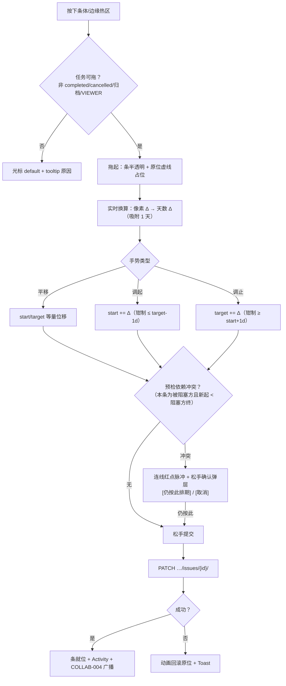
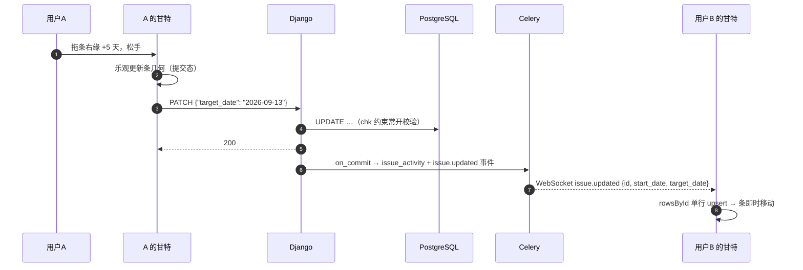

# 甘特拖拽改期 / 延期高亮 / 导出

| 元信息项 | 内容 |
| --- | --- |
| 文档编号 | GANTT-002 |
| 所属迭代 | Sprint 4 — 甘特图 + 文件管理（第 6 周） |
| 优先级 | P2（标准版完整级） |
| 所属模块 | M6-GANTT｜甘特图进度 |
| 文档状态 | 待评审（Draft） |
| 最后更新日期 | 2026-09-01 |
| 上游依赖 | **`GANTT-001`（渲染/视窗/连线地基——本文档是其交互层）**、`TASK-005`（依赖关系与流转拦截）、`TASK-010`（改期 Activity）、`COLLAB-004`（改期实时广播） |
| 下游消费 | `GANTT-003`（P3 关键路径与预警——消费本文档的改期语义）、`RPT-002`（进度报表口径对齐） |
| 上游依据 | `docs/需求文档.md` §3.6（拖拽修改任务开始/结束时间与工期、延期高亮提醒、甘特图导出 PNG、视图缩放平移）、§8.2 甘特图 P2 列 |
| 关联架构文档 | [`unified-issue-model.md`](../architecture/unified-issue-model.md)（§2.8 `chk_issue_start_before_target` 约束、日期字段）、[`api-conventions.md`](../architecture/api-conventions.md)（§10.5 事务纪律）、[`tech-stack.md`](../architecture/tech-stack.md)（pragmatic-dnd、html-to-image） |
| 对标基线 | Plane EE Gantt（拖拽改期/工期调整） · Ones（延期管控企业级） · MS Project 拖拽范式 |
| 工作量估算 | 后端 1 人日 / 前端 3.5 人日 / 联调与测试 1 人日，合计 **5.5 人日** |

---

## 1. 概述

### 1.1 功能定位

`GANTT-001` 让甘特「看得见」，本文档让它「改得动」：

1. **拖拽改期**——拖任务条整体平移（改 `start_date` + `target_date`，工期不变）；拖条左右边缘调整起/止（改工期）。每次松手 = 一次 `PATCH`，尊重 `start ≤ target` 约束与乐观回滚。
2. **未排期入轨**——把「未排期」区的任务拖入时间轴，一次手势完成排期。
3. **延期高亮与统计**——`GANTT-001` 的单条逾期样式之上，补「项目延期概览」：逾期任务数、最大逾期天数、按执行人分布（纯展示，推送提醒归 P3）。
4. **PNG 导出**——当前视窗（含表头/条/连线/今日线）一键导出，供周报与汇报粘贴。

改期的**写入复用 `TASK-001` 的 PATCH 通道**（无新端点、无第二套写逻辑），权限、Activity、实时广播全部天然继承。

### 1.2 关键约定：拖拽的三种手势与映射

> ⚠️ 一张表说清手势 → 字段 → 约束的映射，交互与校验同源。

| 手势 | 命中区 | 视觉反馈 | 写入字段 | 约束 |
| --- | --- | --- | --- | --- |
| **整体平移** | 条体中部 | 跟随光标水平移动，条内显示 `Δ +5d` 徽标 | `start_date` 与 `target_date` 等量位移 | 位移后 `start ≤ target` 自动保持；`Ctrl` 吸附日网格 |
| **调起点** | 条左缘 8px 热区 | 左缘手柄 + 实时长度变化 + 工期数字 | `start_date` | 拖过 `target_date` 时锁定为 `target_date - 1d` 并抖动提示 |
| **调终点** | 条右缘 8px 热区 | 右缘手柄 + 实时长度变化 + 工期数字 | `target_date` | 不早于 `start_date + 1d`；允许拖到过去（补录）与远未来 |
| 未排期入轨 | 未排期列表行 → 时间轴 | 拖影 + 落点日期高亮 | `start_date = 落点`，`target_date = start + 默认 3d` | — |
| 依赖连线（查看态） | 连线 | 高亮两端 | —（P2 不支持拖拽建依赖，走 `TASK-005` 弹层） | — |

- 拖拽最小分辨率 = 1 天；day 粒度按列对齐，week/month 粒度按像素比例换算到天。
- 完成态（`completed`/`cancelled`）与归档任务的条**不可拖**（光标 default + 提示）。

### 1.3 交付内容

| # | 能力 | 说明 |
| --- | --- | --- |
| 1 | 整体平移 / 调起 / 调止 | 三手势，乐观更新 + 失败回滚 |
| 2 | 未排期入轨 | 拖入时间轴一次排期（默认 3 天工期） |
| 3 | 改期冲突提示 | 越依赖约束排期时连线红点加强 + 确认弹层仍可保存（排期自由原则） |
| 4 | 延期概览条 | 顶部「逾期 N · 最长 M 天 · 按人分布」摘要（可展开明细） |
| 5 | PNG 导出 | 当前视窗全量导出；2x 分辨率；水印 |
| 6 | 实时广播 | 改期经 `COLLAB-004` 广播，他人甘特条即时移动 |

### 1.4 范围边界

| 能力 | 本文档（P2） | 归属 |
| --- | --- | --- |
| 三手势改期 / 未排期入轨 | ✅ | — |
| 延期高亮 + 概览统计 | ✅ 纯展示 | 推送提醒 P3 `GANTT-003` |
| PNG 导出 | ✅ | PDF/打印 P4 |
| 拖拽建依赖 | ❌（连线只读；建依赖走 `TASK-005` 弹层） | P3 评估 |
| 拖拽自动顺延（改 A 后 B 联动推迟） | ❌ 明确不做 | P4 |
| 批量改期 / 框选 | ❌ | `BOARD-004` / P3 |
| 关键路径 | ❌ | P3 `GANTT-003` |

### 1.5 前置依赖

| 依赖 | 内容 | 阻塞原因 |
| --- | --- | --- |
| `GANTT-001` | 视窗/条几何/连线渲染/Store | 交互挂载点 |
| `TASK-001` | PATCH 日期字段路径（`chk_issue_start_before_target`） | 唯一写通道 |
| `TASK-005` | 依赖数据与 violation 派生 | 冲突提示 |
| `COLLAB-004` | `issue.updated` 广播 | 他人视图同步 |

### 1.6 竞品参考

| 竞品 | 参考点 | 处置 |
| --- | --- | --- |
| Plane EE Gantt | 拖条改期、边缘调工期 | 手势范式采纳；写通道收敛到 Issue PATCH |
| MS Project | 拖拽时依赖任务影子提示 | 简化为冲突连线高亮 + 确认（不做自动顺延） |
| Ones | 延期预警推送与升级 | P2 展示；P3 预警规则化 |

---

## 2. 业务逻辑

### 2.1 拖拽改期全流程



### 2.2 改期时序（含实时广播）



### 2.3 延期概览口径

| 指标 | 口径 |
| --- | --- |
| 逾期任务数 | `state_group ∉ {completed, cancelled} ∧ target_date < today ∧ 有起止日期`（与 `GANTT-001` is_overdue 同源） |
| 最大逾期天数 | `max(today - target_date)` |
| 按执行人分布 | 逾期任务按 `IssueAssignee` 分组计数（多人任务每人各计 1——与 `RPT-001` 口径一致） |
| 数据来源 | 服务端聚合端点（§4.2.1），与甘特行集同一筛选管道 |

### 2.4 业务规则汇总

| 编号 | 规则 | 判定位置 | 违反后果 |
| --- | --- | --- | --- |
| BR-01 | 三手势只写 `start_date` / `target_date`，经 `TASK-001` PATCH 通道；甘特侧**无专用写端点** | 架构约束 | 评审拒绝 |
| BR-02 | 拖拽分辨率 1 天；`Ctrl` 吸附网格（day 粒度恒吸附） | 前端 | — |
| BR-03 | 起点钳制 `≤ target_date - 1d`；终点钳制 `≥ start_date + 1d`（前端钳制 + DB chk 双保险） | 前端 + DB | 400/回滚 |
| BR-04 | 允许拖到过去（补录）与远未来（规划），不校验「不得早于今天」 | 决策 | — |
| BR-05 | 完成态/取消态/归档任务条不可拖；VIEWER/COMMENTER 全部不可拖 | 前端 + Permission | 403/入口禁用 |
| BR-06 | 依赖冲突是**提示非拦截**：确认弹层「仍按此排期」放行（排期自由；流转硬拦在 `TASK-005`） | 前端 | — |
| BR-07 | 未排期入轨默认工期 3 天 | 前端 | — |
| BR-08 | 乐观更新 + 失败回滚：拖拽期间条呈提交态（透明 + spinner 角标），失败动画弹回 | 前端 | — |
| BR-09 | 并发改期 last-write-wins（PATCH 字段级）；B 端以 WebSocket 到达序收敛 | 后端 | — |
| BR-10 | 每次改期产生 Activity（field=start_date / target_date 同 epoch） | `TASK-010` | — |
| BR-11 | 导出 = 当前视窗（表头/可见行/连线/今日线/图例）+ 右下角水印（项目/时间/导出人） | 前端 | — |
| BR-12 | 导出过滤浮层与拖拽中的条；2x 分辨率；>200 可见行提示仅含滚动视窗 | 前端 | — |

### 2.5 异常处理

| 场景 | 触发条件 | 前端表现 | 后端 | 错误码 |
| --- | --- | --- | --- | --- |
| 起止反转 | 绕过前端直连 | — | 400（chk 约束） | `VALIDATION_INVALID_DATE_RANGE` |
| 无权限拖拽 | VIEWER | 光标 default + tooltip | 403（直连） | `PERM_ROLE_INSUFFICIENT` |
| 归档任务 | 拖归档条 | 同上 + 「已归档」 | 409 | `RESOURCE_STATE_INVALID` |
| 改期失败 | 网络/5xx | 动画弹回 + Toast + request_id | — | `SERVER_*` |
| 并发覆盖 | 两人改同一条 | B 收事件后条移动；B 正在拖则其松手覆盖 | last-write-wins | — |
| 导出失败 | canvas 限制 | Toast「缩小时间范围重试」 | — | — |

### 2.6 边界条件

| 边界场景 | 限制值 | 超出处理 |
| --- | --- | --- |
| 拖拽距离 | 视窗内无限 | 拖至视窗边缘自动平移（8px/frame） |
| 最短工期 | 1 天 | 钳制 |
| 未排期默认工期 | 3 天 | 入轨后可再拖 |
| 导出可见行 | 200 行提示 | 仅导出滚动视窗 |
| 导出文件名 | `{项目}-{视图名}-{yyyyMMdd-HHmm}.png` | — |
| 拖拽中切粒度 | — | 拖拽会话终止（防几何错乱） |

---

## 3. UI/UX 设计

### 3.1 拖拽反馈细节

| 阶段 | 表现 |
| --- | --- |
| 悬停可拖区 | 条体 cursor `grab`；边缘热区 `ew-resize` + 手柄浮现（4px 竖条） |
| 拖起 | 条 60% 透明 + 原位虚线占位；顶部跟随徽标 `Δ +5d` / `工期 3d → 8d` |
| 钳制触发 | 条缘抖动一次（100ms）+ 徽标红闪 |
| 依赖冲突（拖动中实时） | 相关连线红点脉冲 + 徽标追加 `⚠ 依赖冲突` |
| 松手提交 | spinner 角标 → 成功就位 / 失败弹回（300ms ease-back） |
| 冲突确认弹层 | 「新排期使该任务早于其前置 RBT-13 的完成日。仍按此排期？」 |

### 3.2 延期概览条（工具条下方）

```
┌────────────────────────────────────────────────────────────────────┐
│ ⚠ 逾期 6 个任务 · 最长逾期 9 天 · 张三(3) 李四(2) 王五(1)   [查看 ▾] │
└────────────────────────────────────────────────────────────────────┘
  无逾期时整条隐藏；[查看▾] 展开逾期任务列表（编号/标题/逾期天数/执行人，点击跳行）
```

### 3.3 导出交互

| 元素 | 规格 |
| --- | --- |
| 入口 | 工具条 `⋯` →「导出 PNG」；`⌘/Ctrl+E` |
| 导出中 | Toast「正在渲染…」（大视窗 < 2s） |
| 产物 | 自动下载；右下角水印三行（项目名 / 2026-09-01 14:32 / 张三） |
| 范围提示 | 可见行 > 200 时确认「导出仅包含当前滚动视窗的 200 行」 |

### 3.4 响应式与无障碍

- 拖拽仅桌面（≥1024px；小屏为只读简化态）。
- **键盘改期**（无障碍同等能力）：选中行 `Shift+←/→` 平移一天、`Alt+←/→` 调起点、`Alt+Shift+←/→` 调终点；键击 300ms 合并为一次 PATCH。
- 冲突弹层 `role="alertdialog"`；延期概览 `role="status"`；拖拽徽标 `aria-live="polite"` 播报「向后移动 5 天」。

---

## 4. 技术架构

### 4.1 数据模型

**零新增表、零 DDL**。写通道 = `Issue` PATCH；冲突数据 = `GANTT-001` relations/batch 的 violation。

### 4.2 API 定义

| # | 方法 | 路径 | 描述 | 权限 | 成功码 |
| --- | --- | --- | --- | --- | --- |
| 1 | `PATCH` | `…/issues/{issue_id}/` | 改期（既有端点） | `issue.update`（CONTRIBUTOR+） | `200` |
| 2 | `GET` | `…/gantt/overdue-summary/` | 延期概览 | `gantt.read` | `200` |

#### 4.2.1 `GET …/gantt/overdue-summary/`

**成功响应 `200`**

```json
{
  "status": "success",
  "data": {
    "overdue_count": 6,
    "max_overdue_days": 9,
    "by_assignee": [
      { "assignee_id": "6c7d…", "display_name": "张三", "count": 3 },
      { "assignee_id": "2b3a…", "display_name": "李四", "count": 2 },
      { "assignee_id": "4d5e…", "display_name": "王五", "count": 1 }
    ],
    "items": [
      { "id": "c3d4e5f6-…", "issue_key": "RBT-22", "name": "导出灰度方案",
        "target_date": "2026-08-23", "overdue_days": 9,
        "assignee_ids": ["6c7d…"] }
    ]
  },
  "meta": { "today": "2026-09-01" }
}
```

#### 4.2.2 改期 PATCH（复用示例）

```json
// PATCH …/issues/d4e5…/   { "target_date": "2026-09-13" }
// 200 data 片段："start_date": "2026-09-01", "target_date": "2026-09-13"
```

**失败响应 `400`（直连构造反转）**

```json
{
  "status": "error",
  "error": {
    "code": "VALIDATION_INVALID_DATE_RANGE",
    "message": "截止时间不能早于开始时间",
    "details": [{ "field": "target_date", "code": "INVALID_DATE_RANGE",
                  "message": "start_date=2026-09-15 已晚于提交值 2026-09-13" }],
    "request_id": "01JCBD3C6AE5X8Y4E2F6G7H9I0"
  }
}
```

### 4.3 核心逻辑

#### 4.3.1 概览聚合（服务端）

```python
@action(detail=False, methods=["get"], url_path="gantt/overdue-summary")
def overdue_summary(self, request, *args, **kwargs):
    today = localdate(self.get_project_tz())
    base = build_issue_queryset(ctx=…).filter(               # 与甘特行集同源管道
        target_date__lt=today,
        deleted_at__isnull=True, archived_at__isnull=True,
        start_date__isnull=False, target_date__isnull=False,
    ).exclude(state__group__in=["completed", "cancelled"])   # 口径同 is_overdue

    all_ids = list(base.values_list("id", flat=True))
    rows = list(base.annotate(
        overdue_days=ExprWrapper(Value(today) - F("target_date"), IntegerField()),
    ).values("id", "sequence_id", "name", "target_date", "overdue_days")[:20])
    by_assignee = (IssueAssignee.objects
        .filter(issue_id__in=all_ids, deleted_at__isnull=True)
        .values("assignee_id", "assignee__display_name")
        .annotate(count=Count("issue")).order_by("-count"))
    return success_response({
        "overdue_count": len(all_ids),
        "max_overdue_days": max((r["overdue_days"] for r in rows), default=0),
        "by_assignee": list(by_assignee), "items": rows}, meta={"today": today})
```

#### 4.3.2 前端拖拽（pragmatic-dnd + 乐观回滚）

```typescript
// apps/web/src/routes/…/gantt/-components/bar-dnd.ts（节选）
useDraggable({
  element: barRef.current,
  getInitialData: () => ({ issueId,
    mode: hitEdge(x, "left") ? "resize-start"
        : hitEdge(x, "right") ? "resize-end" : "move" }),
});

// monitor：像素 → 天（吸附 1 天）
const deltaDays = Math.round(pixelDelta / DAY_WIDTH[granularity]);
let next = { start: row.start_date, target: row.target_date };
if (mode === "move")         next = shiftBoth(row, deltaDays);          // 等量
if (mode === "resize-start") next.start = clampMax(addDays(row.start_date, deltaDays),
                                                   subDays(row.target_date, 1));  // BR-03
if (mode === "resize-end")   next.target = clampMin(addDays(row.target_date, deltaDays),
                                                    addDays(row.start_date, 1));
ganttStore.previewDrag(issueId, next);      // 占位几何 + Δ徽标 + 冲突连线脉冲

// drop：
try {
  const saved = await issueStore.patch(issueId, next);   // 复用 TASK-001 通道（BR-01）
  ganttStore.commitDrag(issueId, saved);
} catch (err) {
  ganttStore.rollbackDrag(issueId);                      // 动画弹回 + 错误分派
}
```

#### 4.3.3 PNG 导出（html-to-image）

```typescript
export async function exportGanttPng(container: HTMLElement, meta: ExportMeta) {
  const overlay = buildWatermark(meta);                 // 项目/时间/操作人
  container.appendChild(overlay);
  try {
    const dataUrl = await toPng(container, {
      pixelRatio: 2,                                    // BR-11 2x
      filter: (node) => !node.dataset?.exportHidden,    // 拖拽态/浮层过滤（BR-12）
      backgroundColor: "#FFFFFF",
    });
    download(dataUrl, `${meta.project}-${meta.viewName}-${stamp()}.png`);
  } finally {
    overlay.remove();
  }
}
```

> 导出依赖 DOM 截图而非 canvas 重绘：甘特是 DOM/SVG 混合渲染，重绘成本远高于截图；2x `pixelRatio` 保证打印可读。

### 4.4 前端实现补充

- `GanttStore` 扩展：`previewDrag/commitDrag/rollbackDrag`（拖拽会话状态机）；键盘改期 300ms 合并器。
- 冲突实时检测：preview 时对以该条为 `to`（被阻塞方）的边重算 violation，触发连线脉冲。
- 未排期入轨：未排期行 draggable、时间轴 drop 目标，落点 = 光标处吸附天；成功后行从列表消失（乐观）。

---

## 5. 测试用例

### 5.1 单元测试

| 用例 ID | 测试目标 | 输入 | 预期输出 | 覆盖类型 |
| --- | --- | --- | --- | --- |
| UT-01 | 平移等量 | Δ +5d | start/target 各 +5 | 正常 |
| UT-02 | 起点钳制 | 拖过 target | 锁定 target-1d + 抖动 | 边界 |
| UT-03 | 终点钳制 | 拖到 start 前 | 锁定 start+1d | 边界 |
| UT-04 | 一天最短 | 压缩至 0 天 | 钳制 1 天 | 边界 |
| UT-05 | 过去日期放行 | 拖到上月 | 保存成功（BR-04） | 边界 |
| UT-06 | 完成态禁拖 | completed | 手势禁用 | 正常 |
| UT-07 | VIEWER 禁拖 | — | 入口禁用；直连 403 | 安全 |
| UT-08 | 冲突提示放行 | 新起 < 阻塞方终 | 确认后保存成功（BR-06） | 正常 |
| UT-09 | 未排期入轨 | 落点 9-10 | start=9-10, target=9-12 | 正常 |
| UT-10 | 失败回滚 | PATCH 500 | 条动画回原位 | 异常 |
| UT-11 | 键盘合并 | Shift+→ ×3 | 恰一次 PATCH | 正常 |
| UT-12 | 概览口径 | 6 逾期含 1 completed | 计数 5 | 边界 |
| UT-13 | 多人分布 | 1 任务 2 执行人 | 两人各 +1 | 边界 |
| UT-14 | 导出过滤 | 拖拽中的条 | 不在 PNG 中 | 正常 |
| UT-15 | 并发 last-write | 两 PATCH 竞态 | 后到生效 | 并发 |

### 5.2 集成测试

| 用例 ID | 场景 | 前置条件 | 操作步骤 | 预期结果 |
| --- | --- | --- | --- | --- |
| IT-01 | 改期全链路 | 两人在线 | A 拖 +5d | B 条 2s 内移动 |
| IT-02 | Activity 留痕 | — | 平移一次 | 两条同 epoch |
| IT-03 | 约束双保险 | 绕前端直连反转 | PATCH | 400 chk 拦截 |
| IT-04 | 概览一致性 | 造 6 逾期 | 概览 vs 逐条 | 计数与明细一致 |
| IT-05 | 导出产物 | 含连线视窗 | 导出 | 2x；水印齐全；文件名规范 |
| IT-06 | 未排期联动 | 12 未排期 | 入轨 1 条 | 计数 11；时间轴出现条 |

### 5.3 E2E 测试

| 用例 ID | 用户场景 | 操作路径 | 验收标准 |
| --- | --- | --- | --- |
| E2E-01 | 平移改期 | 拖条 +5d 松手 | 就位；刷新保持；动态两条 |
| E2E-02 | 调工期 | 拖右缘 3→8 天 | 徽标实时；就位正确 |
| E2E-03 | 冲突确认 | 拖被阻塞任务早于前置 | 红点脉冲 + 弹层；确认后保存 |
| E2E-04 | 未排期入轨 | 拖入 9-10 | 3 天条出现；计数 -1 |
| E2E-05 | 延期概览 | 6 逾期项目 | 数字/分布正确；点开跳行 |
| E2E-06 | 键盘改期 | 选中行 Shift+→ | 播报 + 就位；合并一次提交 |

---

## 6. 竞品深度对标

### 6.1 Plane 实现分析

- Plane EE Gantt 支持拖拽改期与工期调整，写入即 Issue 更新——本系统同构（BR-01 收敛一致）；差异：本系统把「冲突提示 + 用户确认」显式化（EE 版对依赖冲突静默），键盘改期是无障碍一等能力。
- 导出：EE 版无 PNG 导出——本系统的导出直接服务「周报贴图」这一最高频汇报场景。

### 6.2 Ones 实现分析

- Ones 的延期管控规则化（预警推送、升级、催办）——P2 概览条是其「看见」层；「推送与规则」在 P3 `GANTT-003` 与 `WF-003` 会合。
- Ones 支持拖拽联动顺延——本系统 P2 明确不做（排期自由原则 + 提示代替强制），P4 视反馈评估。这是与 Ones 管控哲学的刻意分歧：**本系统信任排期者的判断，用可见性替代强制**。

### 6.3 本系统设计决策

1. **写通道唯一**：拖拽/键盘/表单全部收敛到 Issue PATCH——甘特是视图不是数据 Owner，权限/审计/广播零重复实现。
2. **钳制双保险**：前端即时钳制（体验）+ DB chk 约束（正确性）。
3. **冲突提示而非顺延强制**：排期是计划行为，甘特的信息职责大于管控职责；硬拦保留在流转层（`TASK-005`）。
4. **DOM 截图导出**：不自建 canvas 管线——html-to-image + 2x + 过滤器，20 行代码达成 95% 需求。
5. **键盘改期合并提交**：可访问性与请求纪律并存。

---

## 7. 里程碑与验收

### 7.1 交付物清单

| 类型 | 交付物 |
| --- | --- |
| Model / Migration | 零 DDL |
| 后端 | `gantt/overdue-summary/` 聚合端点 |
| 前端 | 三手势拖拽（钳制/吸附/Δ徽标/冲突脉冲/回滚）、未排期入轨、键盘改期（合并）、延期概览与明细、PNG 导出（水印/过滤/2x） |
| 测试 | UT-01~15、IT-01~06、E2E-01~06 |

### 7.2 可操作演示的验收标准

1. 拖条平移与拖缘改工期：徽标实时、钳制正确、松手就位刷新保持；动态两条同 epoch；另一在线用户的条 2 秒内同步移动。
2. 把被阻塞任务拖到早于前置完成日：连线红点脉冲 + 确认弹层；「仍按此排期」保存成功。
3. 未排期任务拖入时间轴：3 天默认工期成条，计数减一，可继续再拖。
4. 延期概览：逾期数/最长天数/按人分布与逐条标记一致；明细可跳转。
5. `⌘E` 导出：PNG 含表头/条/连线/今日线与水印；拖拽中的条不出现在产物。
6. 纯键盘完成 +3 天改期（阅读器播报），连续键击仅一次提交。
