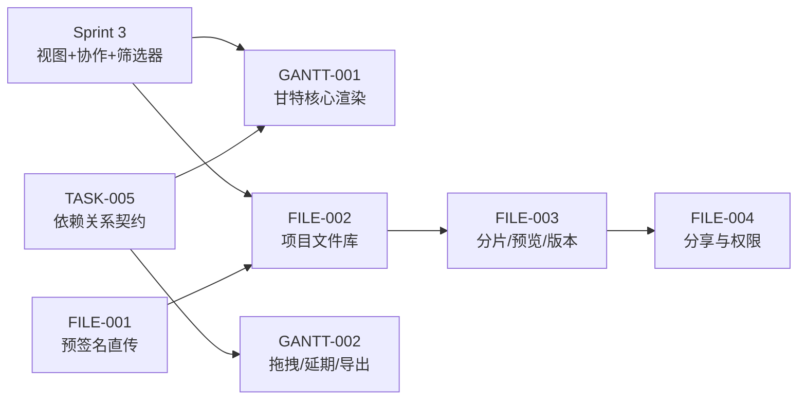
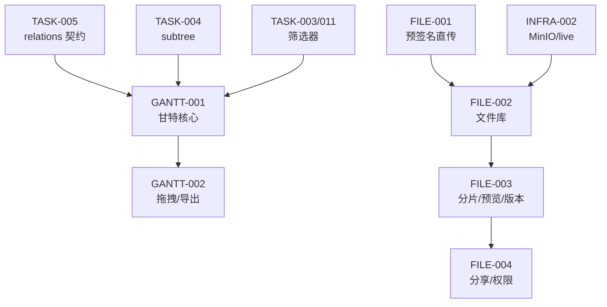

# Sprint 4 — 甘特图 + 文件管理 迭代概览

| 元信息项 | 内容 |
| --- | --- |
| 所属迭代 | Sprint 4 — 甘特图 + 文件管理（第 6 周） |
| 优先级 | P2（标准版完整级） |
| 覆盖模块 | M6-GANTT 甘特图进度｜M7-FILE 文件资源管理 |
| 文档状态 | 待评审（Draft） |
| 最后更新日期 | 2026-09-01 |
| 上游依赖 | Sprint 0-3 全量（尤其 `TASK-005` 依赖关系与 relations 契约、`TASK-004` 子树、`FILE-001` 预签名直传、`INFRA-002` live/MinIO 服务） |
| 下游消费 | `GANTT-003`（P3 关键路径）、`FILE-005`（P3 Wiki）、`RPT-002/004`（进度与负载报表）、`INTG-001`（GitHub 附件挂接） |
| 迭代周期 | 5 个工作日，固定预留 20% 缓冲 |

---

## 1. 迭代目标

Sprint 3 交付视图与实时协作后，标准版还缺两块「看得见进度、管得住资产」的能力：**甘特图**（时间维度的项目全景：任务条、依赖连线、拖拽改期、延期高亮、导出）与**项目级文件管理**（从 P1 的任务附件升级为多层级文件库：分片续传、在线预览、多版本、分享权限）。

核心结果：

1. 甘特图在 1 万任务数据集下**首屏 P95 < 1.5s**（虚拟滚动 + 按视窗取数），日/周/月三粒度切换，任务条拖拽改期与依赖连线渲染（消费 `TASK-005` 冻结契约）。
2. 文件能力从「任务附件」升级为「项目文件库」：多层级目录、大文件分片续传（>50MB 强制）、常见格式在线预览、多版本管理与回溯、外部分享链接（密码/有效期/权限）。
3. 全部文件操作走**预签名直传 + 服务端元数据登记**双轨，Django 不过文件字节流。

## 2. 范围与边界

| 范围 | 本迭代交付 | 明确不做 |
| --- | --- | --- |
| 甘特图 | 日/周/月粒度、任务条渲染、进度百分比、依赖连线、今日线、延期高亮 | 关键路径（P3 `GANTT-003`）、资源负载图（P4）、跨项目甘特（P4） |
| 甘特交互 | 任务条拖拽改期/改工期、行高拖拽调整层级展开、平移缩放 | 拖拽自动改期联动（P4）、批量进度调整（P3） |
| 甘特导出 | PNG 导出（客户端渲染导出）、视图缩放 | PDF 导出（P4 评估）、打印样式 |
| 文件库 | 多层级目录、上传/下载/重命名/移动/删除、回收站软删 | Wiki 知识库（P3 `FILE-005`）、全文检索（P3） |
| 传输 | 直传（小文件）+ 分片续传（大文件 >50MB） | — |
| 预览 | 图片/PDF/Office（转码）/文本/Markdown/视频（边下边播） | CAD/压缩包预览（P4） |
| 版本 | 多版本、版本列表、回滚、版本对比（文本类） | 二进制 diff（P4） |
| 分享 | 链接分享、密码、有效期、下载/预览权限分离 | 水印/禁止转发（P4 `FILE-006`） |

## 3. 前置依赖

进入 Sprint 4 前必须满足：

- `TASK-005` 的 `GET …/relations/` 响应契约稳定（含 `start_date`/`target_date` 内联——甘特连线直接消费）。
- `FILE-001` 预签名三步流程（presign → 直传 → complete）生产可用；MinIO 版本策略与生命周期清理任务就绪。
- `TASK-011` 筛选器可用（甘特取数复用同一筛选语义：只渲染筛选结果的时间轴）。
- Celery worker/beat 可用（Office 转码、缩略图、孤儿清理、版本快照均为异步任务）。

## 4. P2 模块覆盖

| 文档 | 交付重点 | 关键数据结构 | 直接下游 |
| --- | --- | --- | --- |
| `GANTT-001` | 甘特渲染、粒度切换、虚拟滚动、视窗取数 | 消费 `Issue.start_date/target_date/progress`；视窗查询 | `GANTT-002/003` |
| `GANTT-002` | 任务条拖拽改期、依赖连线交互、延期高亮、PNG 导出 | 拖拽 PATCH `start_date/target_date`；依赖连线渲染数据 | `GANTT-003`、`RPT-002` |
| `FILE-002` | 项目文件库、多层级目录、基础文件操作 | `FileAsset`（升级）+ `FileFolder` 新表 | `FILE-003/004/005` |
| `FILE-003` | 分片续传、在线预览、多版本 | `FileChunk`/`FileVersion` 新表；转码 Celery | `FILE-004` |
| `FILE-004` | 分享链接、密码/有效期/权限 | `FileShareLink` 新表 | `FILE-006`（P4 合规） |

## 5. 统一工程约束

| 类别 | 约束 |
| --- | --- |
| 性能门禁 | 甘特 1 万任务首屏 P95 < 1.5s（视窗取数 + 虚拟滚动）；文件库万级文件目录浏览 P95 < 300ms |
| 传输 | 一切上传不经 Django 字节流；>50MB 强制分片；分片 8MB/片、断点续传 |
| 预览 | 转码异步（Celery + LibreOffice/ffmpeg）；预览产物存独立前缀，生命周期 30 天冷清理 |
| 版本 | 版本上限 20/文件（超出滚动淘汰最旧非当前版）；回滚 = 新版本指向旧对象（不删除） |
| 分享 | 链接不可枚举（22 位随机 slug）；密码 Argon2id；有效期硬校验；审计留痕 |
| 甘特 | 拖拽仅写 `start_date/target_date`（尊重 `chk_issue_start_before_target` 约束）；依赖连线只读渲染（不自动改期） |
| 异步 | 转码/缩略图/清理/快照全部 Celery 幂等任务；`on_commit` 投递 |

## 6. 验收标准

- [ ] 5 份功能规格均含七章结构、Mermaid 图、ASCII 线框、逐端点 JSON、测试矩阵、竞品对标、验收清单。
- [ ] 甘特：1 万任务数据集演示流畅滚动与粒度切换；拖拽改期持久化且不违反日期约束；依赖连线与 `TASK-005` 契约数据一致；PNG 导出可用。
- [ ] 文件库：100MB 文件分片续传（中断重传）；5 种格式预览；版本回滚正确；分享链接密码/有效期/权限全链路生效。
- [ ] 权限：文件三态权限（全员/仅管理员/指定成员）在 UI/API/预签名三层一致校验；越权访问 404。
- [ ] 存储配额与孤儿清理：预签名未 complete 的对象 30 分钟回收；转码产物按生命周期清理。
- [ ] 无障碍：甘特图键盘导航（行选择/展开）、预览器快捷键、文件操作菜单键盘可达。

## 7. 文档清单

| 序号 | 文件 | 一级标题 |
| --- | --- | --- |
| 1 | `GANTT-001-gantt-core.md` | 甘特图核心渲染与粒度切换 |
| 2 | `GANTT-002-delay-export.md` | 甘特拖拽改期 / 延期高亮 / 导出 |
| 3 | `FILE-002-project-filelib.md` | 项目文件库与多层级目录 |
| 4 | `FILE-003-preview-version.md` | 大文件分片续传 / 在线预览 / 多版本 |
| 5 | `FILE-004-share-permission.md` | 文件分享链接与权限管控 |

## 8. 排期

| 工作日 | 主线 A（甘特） | 主线 B（文件） | 当日验收 |
| --- | --- | --- | --- |
| Day 1 | `GANTT-001` 渲染与粒度 | `FILE-002` 目录模型与文件操作 | 视窗取数、目录 CRUD 通过 |
| Day 2 | `GANTT-001` 虚拟滚动与性能 | `FILE-003` 分片续传 | 1 万任务门禁；100MB 断点续传 |
| Day 3 | `GANTT-002` 拖拽与延期 | `FILE-003` 预览与版本 | 拖拽持久化；5 格式预览 |
| Day 4 | `GANTT-002` 导出与联动 | `FILE-004` 分享与权限 | PNG 导出；分享全链路 |
| Day 5 | 联调、压测、无障碍 | 回归、文档评审、缓冲 | Sprint 验收清单全部通过 |

## 9. 相关文档

- 前置迭代：[`docs/sprint-3-views-collab/sprint-overview.md`](../sprint-3-views-collab/sprint-overview.md)
- 原始需求：[`docs/需求文档.md`](../需求文档.md) §3.6 / §3.7 / §8.2
- 下一迭代：`docs/sprint-5-integration-standard/sprint-overview.md`（Sprint 5 — 集成 + 标准版收尾）
