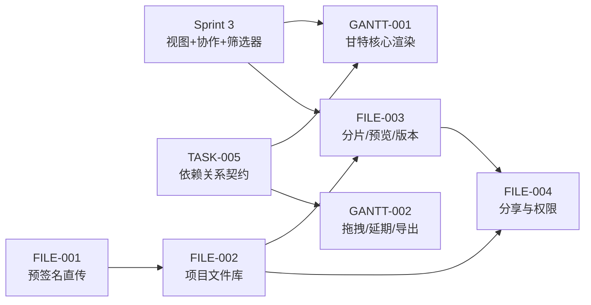
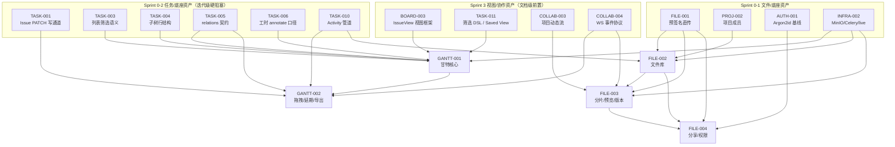

# Sprint 4 — 甘特图 + 文件管理 迭代概览

| 元信息项 | 内容 |
| --- | --- |
| 所属迭代 | Sprint 4 — 甘特图 + 文件管理（第 6 周） |
| 优先级 | P2（标准版完整级） |
| 覆盖模块 | M6-GANTT 甘特图进度｜M7-FILE 文件资源管理 |
| 文档状态 | 待评审（Draft） |
| 最后更新日期 | 2026-09-03 |
| 上游依赖 | 迭代级硬阻塞：Sprint 2 全量（[`dependency-graph.md`](../architecture/dependency-graph.md) §2.1；Sprint 0/1 经 S0→S1→S2 传递依赖）；Sprint 3 为**文档级局部前置**（无迭代级阻塞边，明细见 §3）：`TASK-011`/`BOARD-003`（筛选 DSL 与 IssueView）、`COLLAB-003/004`（动态流与 WS 事件协议）；尤其 `TASK-005` relations 契约、`TASK-004` 子树、`TASK-006` 工时口径、`FILE-001` 预签名直传、`INFRA-002` MinIO/Celery/live 服务 |
| 下游消费 | 有依赖边支持（依赖图 §4）：`GANTT-003`（P3 关键路径，← `GANTT-002`）、`RPT-004`（P3 负载报表，← `GANTT-002`）、`FILE-005`（P3 Wiki，← `FILE-004`）、`FILE-006`（P4 水印/合规，← `FILE-004`）；另 `RPT-002` / `INTG-001`（均 Sprint 5，README §4.7）在 `GANTT-001/002`、`FILE-002/003` 规格元信息中登记为口径对齐 / 附件挂接预留——依赖图 §4.11/§4.12 无对应依赖边，按「无依赖边的口径协同」解读，不计入下游依赖 |
| 迭代周期 | 5 个工作日，固定预留 20% 缓冲 |

---

## 1. 迭代目标

Sprint 3 交付视图与实时协作后，标准版还缺两块「看得见进度、管得住资产」的能力：**甘特图**（时间维度的项目全景：任务条、依赖连线、拖拽改期、延期高亮、导出）与**项目级文件管理**（从 P1 的任务附件升级为多层级文件库：分片续传、在线预览、多版本、分享权限）。

核心结果：

1. 甘特图在 1 万任务数据集下**首屏 P95 < 1.5s**（虚拟滚动 + 按视窗取数），日/周/月三粒度切换，任务条拖拽改期与依赖连线渲染（消费 `TASK-005` 冻结契约）。
2. 文件能力从「任务附件」升级为「项目文件库」：多层级目录、大文件分片续传（>50MB 强制）、常见格式在线预览、多版本管理与回溯、外部分享链接（密码/有效期/权限）。
3. 全部文件操作走**预签名直传 + 服务端元数据登记**双轨，Django 不过文件字节流。

## 2. 范围与边界

| 范围 | 本迭代交付 | 明确不做 |
| --- | --- | --- |
| 甘特图 | 日/周/月粒度、任务条渲染、进度百分比、依赖连线、今日线、延期高亮 | 关键路径（P3 `GANTT-003`）、资源负载图（P4）、跨项目甘特（P4） |
| 甘特交互 | 任务条拖拽改期/改工期、左栏栏宽拖拽调整（240~480px，`GANTT-001` §3.1；行高固定 36px 不可拖）+ 层级展开、平移缩放 | 拖拽自动改期联动（P4）、批量进度调整（P3） |
| 甘特导出 | PNG 导出（客户端渲染导出）、视图缩放 | PDF 导出（P4 评估）、打印样式 |
| 文件库 | 多层级目录、上传/下载/重命名/移动/删除、回收站软删 | Wiki 知识库（P3 `FILE-005`）、全文检索（P3） |
| 传输 | 直传（小文件）+ 分片续传（大文件 >50MB） | — |
| 预览 | 5 类预览通道（`FILE-003` §2.3 决策链，按 `type_category`）：图片（缩略图+原图）/ PDF（pdf.js）/ Office（转码 PDF）/ 文本与 Markdown（Monaco / MD 渲染，≤2MB）/ 视频（边下边播） | 压缩包等其余类型不预览（元数据卡+下载）；CAD 预览（P4） |
| 版本 | 多版本、版本列表、回滚、版本对比（文本类） | 二进制 diff（P4） |
| 分享 | 链接分享、密码、有效期、下载/预览权限分离 | 水印/禁止转发（P4 `FILE-006`） |

## 3. 前置依赖

> **依赖集来源与口径**：上图依赖边逐一取自本迭代 5 份规格现行版的元信息「上游依赖」行与前置依赖表（§1.5/§1.6）——[`GANTT-001`](./GANTT-001-gantt-core.md)（`TASK-003` 边取自其元信息「上游依赖」行、其余取自 §1.6）、[`GANTT-002`](./GANTT-002-delay-export.md) §1.5、[`FILE-002`](./FILE-002-project-filelib.md) §1.5、[`FILE-003`](./FILE-003-preview-version.md)（`FILE-001` 边取自其元信息「上游依赖」行、其余取自 §1.6）、[`FILE-004`](./FILE-004-share-permission.md) §1.5。[`dependency-graph.md`](../architecture/dependency-graph.md) §4.8 仅摘要登记 `GANTT-001` ← `TASK-001/TASK-005/TASK-006`、`GANTT-002` ← `GANTT-001/TASK-004`，未覆盖规格级的筛选 / 视图 / Activity / 实时协作边；§4.9 的 `FILE-004` 行（上游 `FILE-002/AUTH-006/PROJ-002`）为旧口径——`AUTH-006` 属 Sprint 5，`FILE-004` 现行版已改定：Argon2id 基线归 `AUTH-001`（Sprint 0 已交付）、防爆破限流自带、匿名下载 302 复用 `FILE-001` §4.3.4 范式、预签名复用 `FILE-002` 服务。**架构文档待回改**（§4.8 / §4.9 与规格版依赖集同步）。
>
> AUTH 横切依赖（`AUTH-005` 权限门控作用于 `FILE-002/003/004` 全部端点）与 `apps/space` 匿名访问宿主（`FILE-004` §1.5）不在上图画出，见各规格前置依赖表。
>
> 反向同步说明：[`FILE-004`](./FILE-004-share-permission.md) §4.1.1 的「overview 待同步」注（称本概览 §4 模块表 `FILE-004` 行漏列 `FileShareAccess`）**已过时**——本概览 §4 该行现行版已列 `FileShareLink`/`FileShareAccess` 两表。该注在 `FILE-004` 文件内，本档不越界改动，其 R3 复评在途、由该侧处理；本档无需登记回改项。

进入 Sprint 4 前必须满足：

- `TASK-005` 的 `GET …/relations/` 响应契约稳定（含 `start_date`/`target_date` 内联——甘特连线直接消费）。
- `TASK-004` 子树行结构与 `TASK-006` `estimate_minutes`/`spent_minutes` annotate 口径可用（甘特左侧行树与任务条工时对照位）。
- `FILE-001` 预签名三步流程（presign → 直传 → complete）生产可用；MinIO 版本策略与生命周期清理任务就绪。
- `TASK-011` 筛选 DSL 与 `BOARD-003` 视图框架（`layout=gantt` 入 `IssueView.Layout` 枚举）可用——甘特取数复用同一筛选语义：只渲染筛选结果的时间轴。
- `COLLAB-004` WebSocket 事件协议可用（`GANTT-002` 改期广播与 `FILE-003` `file.*` 事件均消费）；`COLLAB-003` 动态流管道可接版本事件。
- Celery worker/beat 可用（Office 转码、缩略图、孤儿清理、版本快照均为异步任务；LibreOffice/ffmpeg 转码工具链为 `FILE-003` 交付物，不在 `INFRA-002` worker 镜像内，见其 §1.6 归属更正）。

## 4. P2 模块覆盖

| 文档 | 交付重点 | 关键数据结构 | 直接下游 |
| --- | --- | --- | --- |
| `GANTT-001` | 甘特渲染、粒度切换、虚拟滚动、视窗取数 | 消费 `Issue.start_date/target_date/progress`；视窗查询 | `GANTT-002/003` |
| `GANTT-002` | 任务条拖拽改期、依赖连线交互、延期高亮、PNG 导出 | 拖拽 PATCH `start_date/target_date`；依赖连线渲染数据 | `GANTT-003`、`RPT-004`（负载报表，依赖图 §4.12 唯一报表侧依赖边；`RPT-002` 为口径对齐、无依赖边） |
| `FILE-002` | 项目文件库、多层级目录、基础文件操作 | `FileAsset`（升级）+ `FileFolder` 新表 | `FILE-003/004`（`FILE-005` 为传递 / 复用下游，归 `FILE-004` 行消费列——依赖图 §4.9 为 `FILE-005` ← `FILE-004`；`FILE-002`/`FILE-003` 元信息中的 `FILE-005` 登记定性为「无依赖边的复用登记」，与本文对 `RPT-002`/`INTG-001` 的处理同构） |
| `FILE-003` | 分片续传、在线预览、多版本 | `UploadSession`/`FileVersion` 新表；转码 Celery | `FILE-004` |
| `FILE-004` | 分享链接、密码/有效期/权限 | `FileShareLink`/`FileShareAccess` 新表 | `FILE-005`（P3 Wiki）、`FILE-006`（P4 合规） |

## 5. 统一工程约束

| 类别 | 约束 |
| --- | --- |
| 性能门禁 | 甘特 1 万任务首屏 P95 < 1.5s（视窗取数 + 虚拟滚动）；文件库万级文件目录浏览 P95 < 300ms |
| 传输 | 一切上传不经 Django 字节流；>50MB 强制分片；分片 8MB/片、断点续传 |
| 预览 | 转码异步（Celery + LibreOffice/ffmpeg）；预览产物存独立前缀，生命周期 30 天冷清理 |
| 版本 | 版本上限 20/文件（超出滚动淘汰最旧非当前版）；回滚 = 新版本指向旧对象（不删除） |
| 分享 | 链接不可枚举（22 位随机 slug）；密码 Argon2id；有效期硬校验；审计留痕 |
| 甘特 | 拖拽仅写 `start_date/target_date`（尊重 `chk_issue_start_before_target` 约束）；依赖连线只读渲染（不自动改期） |
| 异步 | 转码/缩略图/清理/快照全部 Celery 幂等任务；`on_commit` 投递 |

## 6. 验收标准

- [ ] 5 份功能规格均含七章结构、Mermaid 图、ASCII 线框、逐端点 JSON、测试矩阵、竞品对标、验收清单。
- [ ] 甘特：1 万任务数据集演示流畅滚动与粒度切换；拖拽改期持久化且不违反日期约束；依赖连线与 `TASK-005` 契约数据一致；PNG 导出可用。
- [ ] 文件库：100MB 文件分片续传（中断重传）；5 类预览通道全通（图片 / PDF / Office 转码 / 文本与 Markdown / 视频，口径同 §2 与 `FILE-003` §2.3）；版本回滚正确；分享链接密码/有效期/权限全链路生效。
- [ ] 权限：文件三态权限（全员/仅管理员/指定成员）在 UI/API/预签名三层一致校验；越权访问 404。
- [ ] 存储配额与孤儿清理：预签名未 complete 的**直传**对象 30 分钟回收（带活跃分片会话的在途资产豁免，会话 24h TTL 到期 Abort——`FILE-003` BR-05/§1.6）；转码产物按生命周期清理。
- [ ] 无障碍：甘特图键盘导航（行选择/展开）、预览器快捷键、文件操作菜单键盘可达。

## 7. 文档清单

| 序号 | 文件 | 一级标题 |
| --- | --- | --- |
| 1 | `GANTT-001-gantt-core.md` | 甘特图核心渲染与粒度切换 |
| 2 | `GANTT-002-delay-export.md` | 甘特拖拽改期 / 延期高亮 / 导出 |
| 3 | `FILE-002-project-filelib.md` | 项目文件库与多层级目录 |
| 4 | `FILE-003-preview-version.md` | 大文件分片续传 / 在线预览 / 多版本 |
| 5 | `FILE-004-share-permission.md` | 文件分享链接与权限管控 |

## 8. 排期

| 工作日 | 主线 A（甘特） | 主线 B（文件） | 当日验收 |
| --- | --- | --- | --- |
| Day 1 | `GANTT-001` 渲染与粒度 | `FILE-002` 目录模型与文件操作 | 视窗取数、目录 CRUD 通过 |
| Day 2 | `GANTT-001` 虚拟滚动与性能 | `FILE-003` 分片续传 | 1 万任务门禁；100MB 断点续传 |
| Day 3 | `GANTT-002` 拖拽与延期 | `FILE-003` 预览与版本 | 拖拽持久化；五通道预览可用 |
| Day 4 | `GANTT-002` 导出与联动 | `FILE-004` 分享与权限 | PNG 导出；分享全链路 |
| Day 5 | 联调、压测、无障碍 | 回归、文档评审、缓冲 | Sprint 验收清单全部通过 |

## 9. 技术风险与应对

| # | 风险 | 影响 | 概率 | 应对措施 | 责任文档 |
| --- | --- | --- | --- | --- | --- |
| 1 | **1 万任务甘特性能门禁失守**：视窗取数端点退化为全量拉取后前端裁剪，或虚拟滚动外的隐藏行参与渲染 / 连线求值 | 高：§5 首屏 P95 < 1.5s 门禁不过，粒度切换与平移卡顿 | 中 | 「视窗取数」（可见时间范围 + 可见行范围双重裁剪）为唯一取数通道，**绝不全量拉取**；连线仅对视窗内任务求值；横向滚动纯 transform 零请求、时间视窗变化才防抖预取（P95 < 300ms）；1 万任务 / 5 年跨度基准数据集纳入 IT-01/IT-02 性能门禁 | `GANTT-001` |
| 2 | **拖拽改期绕过日期约束或乐观更新错乱**：前端本地直改字段与 `chk_issue_start_before_target` 冲突，或失败回滚时序错乱 | 中：脏数据 / 拖拽后刷新不一致 | 中 | 写通道收敛到 Issue PATCH（`TASK-001` 唯一写通道），三手势仅映射 `start_date/target_date`；MobX 乐观更新 + 失败回滚；与依赖冲突时只做冲突连线高亮 + 确认弹层，**不自动顺延**（P2 连线只读，P4 再评估联动） | `GANTT-002` |
| 3 | **分片会话与直传清理的联立缝隙**：`FILE-001` 30min 孤儿扫描把带活跃 `UploadSession` 的在途资产行误标 `abandoned` 次日硬删；或配额把「同名换版资产行 + 会话行」双计 | 高：2GB 断点续传被误清 / 配额超卖 | 中 | `FILE-001` §4.6 扫描豁免活跃会话行（`WHERE NOT EXISTS`）；配额预留口径 = 直传在途 ∪ 活跃会话、以会话行为准；配额与版本去重按对象键 DISTINCT（BR-14）；IT-09 三段断言（在途豁免 / 会话失效后回归 30min 扫描 / 次日硬删）——`FILE-001`/`FILE-002` 待回改登记见 `FILE-003` §1.6 | `FILE-003` |
| 4 | **转码工具链与 worker 镜像膨胀**：LibreOffice / ffmpeg 不在 `INFRA-002` worker 镜像（仅 Python 运行时）内，分层扩展增大镜像体积与构建时间；转码超时 / 重试拖垮 worker | 中：预览 202 排队后长期不返回 | 中 | 转码工具链为 `FILE-003` 交付物：worker 镜像分层扩展（apt 层）并计入联调工作量；任务 `soft_time_limit=300` + `max_retries=2`；预览先 202 排队、完成经 WebSocket 通知刷新；衍生物 30 天未访问冷清理、按需重生成（BR-11） | `FILE-003` |
| 5 | **分享链接被枚举 / 爆破 / 匿名越权**：slug 可预测、密码可暴力尝试、源文件软删或项目归档后链接仍有效 | 高：未授权访问项目文件 | 中 | slug 用 `secrets.token_urlsafe(16)`（22 字符、128bit 熵，不可枚举）；密码 Argon2id（`AUTH-001` 基线）；(IP, slug) 防爆破限流**本文自带**（Valkey 计数，Sprint 6 才收编 `INFRA-005` 全局框架）；源存活**读时校验**（软删/项目归档 → 分享立即失效）；`FileShareAccess` 全量留痕（含密码尝试，不留身份） | `FILE-004` |
| 6 | **`file.*` WebSocket 事件与房间协议扩展漂移**：`COLLAB-004` 现行房间模型为封闭三类，`file:{asset_id}` 第四类房间与其 §1.3/§2.3 未同步补登 | 中：文件侧实时刷新链路规格分裂、联调期返工 | 中 | 事件命名（`<resource>.<action>` 动词过去式）、载荷与房间类型扩展以 `FILE-003` §4.4 登记表为权威；`COLLAB-004` §1.3/§2.3 待补登（上游待回改）；动态流与 WebSocket 双链路同源 `on_commit`，事件携带 `asset_id` 前端按需 revalidate | `FILE-003` |
| 7 | **范围蔓延**：关键路径（P3 `GANTT-003`）、拖拽自动顺延（P4）、Wiki（P3 `FILE-005`）、水印 / 合规留存（P4 `FILE-006`）等「顺手加一下」 | 高：5 天排期与 6 条验收项互相挤压 | 高 | §2「明确不做」列为硬性范围基线；新增能力一律转入后续迭代排期，不占用本迭代 20% 缓冲 | 本文档 |

## 10. 迭代退出条件

同时满足以下三项，Sprint 4 方可关闭并进入 Sprint 5：

1. **功能验收**：§6 的 6 条验收标准逐条通过——5 份功能规格均含七章结构与逐端点契约；甘特 1 万任务首屏 P95 < 1.5s、拖拽改期持久化且不违反 `chk_issue_start_before_target`、依赖连线与 `TASK-005` 契约一致、PNG 导出可用；100MB 分片续传（中断重传）与 5 类预览通道全通、版本回滚正确、分享链接密码 / 有效期 / 权限全链路生效；三态权限 UI/API/预签名三层一致校验且越权 404；直传孤儿 30 分钟回收与活跃会话豁免、转码产物生命周期清理；无障碍键盘导航可用。
2. **工程质量**：本迭代无未修复的 P0 / P1 级缺陷；§9 所列风险的应对措施对应异常路径测试全部通过——视窗取数退化（全量拉取）拦截、拖拽失败回滚与依赖冲突不自动顺延、断点续传中断重传、在途会话豁免 30min 扫描（IT-09 三段断言）、转码超时重试与 202 排队、(IP, slug) 防爆破限流与源软删 / 项目归档后分享失效；20% 缓冲未被功能蔓延占用。
3. **文档同步**：本迭代 5 份功能文档状态全部标记为「已实现」，验收结果与本概览一致；实现过程中对架构决策的偏离已回写对应 `architecture/` 文档或登记 ADR；架构文档是唯一事实源，文档编号与索引以 [`docs/README.md`](../README.md) §4 为准，发现架构文档自身矛盾时标注「架构文档待回改」，不得以临时实现替代架构决策。

## 11. 相关文档

- 架构基线：[`unified-issue-model.md`](../architecture/unified-issue-model.md) §2.8（`Issue.start_date/target_date` 日期字段——甘特任务条与拖拽改期直接消费）、[`dependency-graph.md`](../architecture/dependency-graph.md) §4.8/§4.9（迭代依赖边登记）、[`api-conventions.md`](../architecture/api-conventions.md) §6.2/§6.3（游标分页——甘特行分页 `per_page` 复用）
- 前置迭代：[`docs/sprint-3-views-collab/sprint-overview.md`](../sprint-3-views-collab/sprint-overview.md)
- 原始需求：[`docs/需求文档.md`](../需求文档.md) §3.6 / §3.7 / §8.2
- 下一迭代：`docs/sprint-5-integration-standard/sprint-overview.md`（Sprint 5 — 集成 + 标准版收尾）
