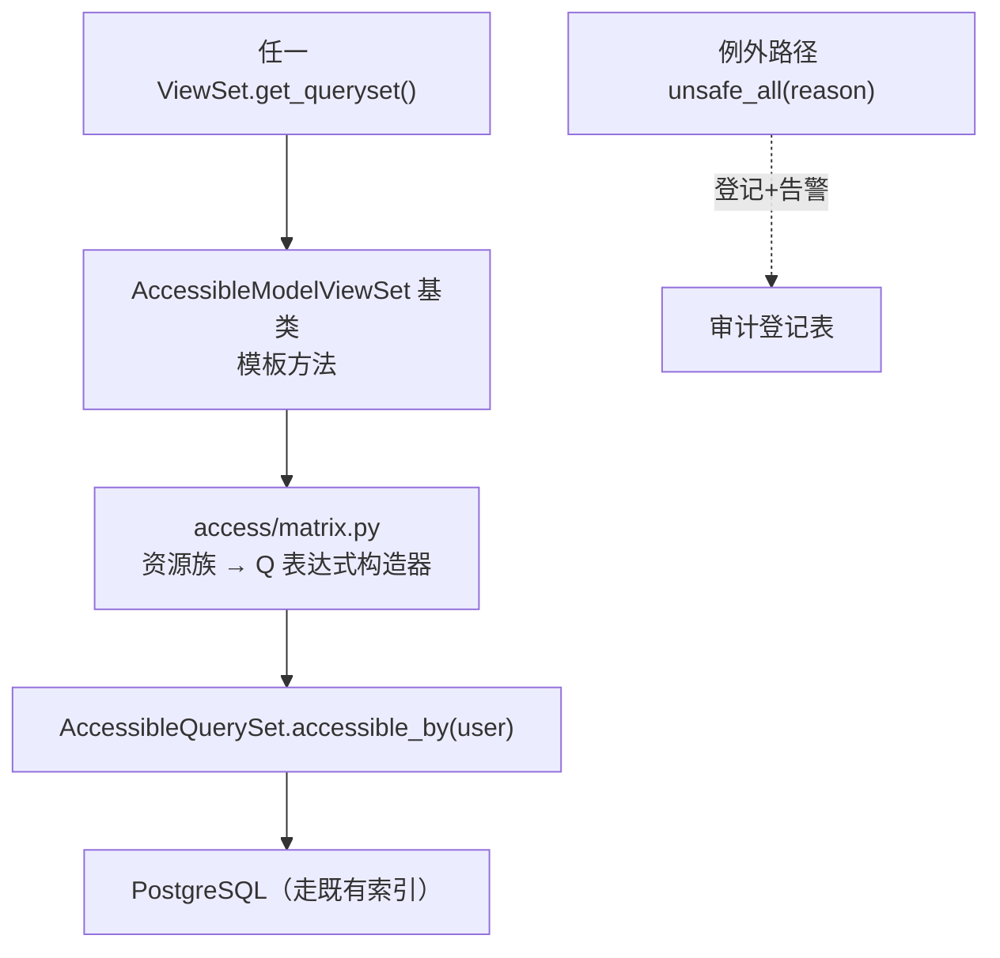
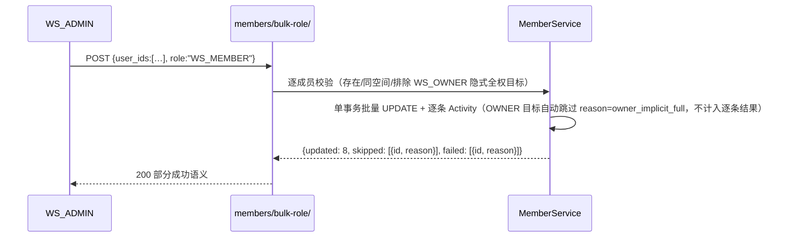
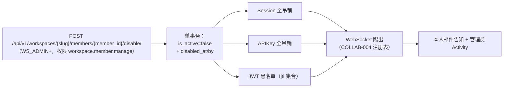

# 数据库行级隔离与成员权限分配

| 元信息项 | 内容 |
| --- | --- |
| 文档编号 | AUTH-006 |
| 所属迭代 | Sprint 5 — 集成 + 标准版收尾（第 7 周） |
| 优先级 | P2（标准版完整级 · **安全收口文档**） |
| 所属模块 | M1-AUTH｜账号与权限 |
| 文档状态 | 待评审（Draft） |
| 最后更新日期 | 2026-09-01 |
| 上游依赖 | [`rbac-permission-model.md`](../architecture/rbac-permission-model.md)（四层角色与 `accessible_by` 骨架）、`AUTH-004`（会话与 API Key 模型）、`TEAM-002`/`PROJ-002`（成员模型与角色枚举）、全部既有 ViewSet（收敛对象） |
| 下游消费 | `AUTH-007~010`（P3 部门/自定义角色/SSO/全站审计均以本矩阵为基座）、`AUTH-011/012`（P4 身份联动与多租户隔离复核） |
| 上游依据 | `docs/需求文档.md` §3.1（成员权限分配 / 行级隔离 / 账号禁用启用）、§8.2 账号权限 P2 列 |
| 关联架构文档 | [`api-conventions.md`](../architecture/api-conventions.md)（403/404 存在性隐藏、错误码） |
| 对标基线 | Plane（`WorkspaceMember`/`ProjectMember` 双层 + `Issue.objects.visible_to`） · Ones（行级数据权限矩阵） |
| 工作量估算 | 后端 4.5 人日 / 前端 1.5 人日 / 安全测试 2 人日，合计 **8 人日**（原 5.5 人日系初版估算偏低——纳入 ① 矩阵单源 + CI AST 五规则收口、② `AccessibleModelViewSet` 与 `api-conventions.md` §10.1 既有三级类名体系对齐文案 + ADR、④ 批量角色豁免声明 + 7 类 `skipped.reason` / `failed.reason` 枚举回归、⑤ 启停工作空间作用域端点 + admin 端边界澄清、⑥ `GUEST` 降级联动事务链 + 末位保护优先级校验、⑦ 越权矩阵参数化套件补 `WS_GUEST` / `SYSTEM_ADMIN` / 匿名三态 + `Project.visibility` 字段上线后架构回改对接，7 项实际工作量后修正） |

---

## 1. 概述

### 1.1 功能定位

行级隔离此前是「每个 ViewSet 各自记得调用 `accessible_by`」——**靠记忆的安全等于没有安全**。本迭代把它体系化为四层可验证的工程结构：

1. **过滤矩阵**：一张「资源族 × 主体角色」的权威表，定义每一层资源的行级可见性口径；
2. **单入口基座**：全部 ViewSet `get_queryset()` 以 `accessible_by(request.user)` 起步，基类强制；
3. **CI 静态守护**：AST 检查「未调基类 / 手写 `Model.objects.all()` 直出」直接构建失败；
4. **越权测试矩阵**：四主体（属主 / 同项目成员 / 同空间非成员 / 跨空间用户）× 四资源层（工作空间 / 项目 / 任务 / 文件）参数化测试全绿。

外加两件治理收尾：**批量角色分配**（成员管理页多选改角色）与**账号禁用/启用联动**（禁用即全凭证失效、会话踢出、任务保留）。

### 1.2 关键约定

| 约定 | 内容 |
| --- | --- |
| 可见性 ≠ 操作权 | 行级过滤决定「能不能看见这行」；权限码决定「能不能对这行动手」——两层独立判定，本文档只管前者，后者归 `rbac-permission-model.md` |
| 404 优先于 403 | 对不可见行一律 `404 RESOURCE_NOT_FOUND`（存在性隐藏，`api-conventions.md` §8）；403 仅用于「行可见但操作越权」 |
| 单入口 | 任何资源集合/详情查询的起点必须是 `accessible_by` 或其族方法；特例（如管理后台跨空间审计）走显式 `unsafe_all(reason=...)` 并登记 |
| 禁用即时生效 | 禁用账号 = 会话吊销 + API Key 吊销 + WebSocket 断连 + JWT 加入黑名单，延迟 ≤ 5 秒 |
| 数据不动 | 禁用/移出不删除其历史产出（任务/评论/工时保留，署名字段保留，`is_active` 灰标展示） |

### 1.3 交付内容

| # | 能力 | 说明 |
| --- | --- | --- |
| 1 | 过滤矩阵权威表 | 文档 §2.1 + 代码 `access/matrix.py` 单源实现 |
| 2 | `AccessibleQuerySet` 族 | `accessible_by(user)` / `accessible_in(workspace, user)` / 资源族特化方法 |
| 3 | ViewSet 基类强制 | `AccessibleModelViewSet`：`get_queryset` 模板方法 + 未覆盖报警 |
| 4 | CI 静态守护 | AST 规则集 + 例外登记机制 |
| 5 | 批量角色分配 | `POST …/members/bulk-role/`（工作空间/项目两层） |
| 6 | 账号启停联动 | `disable/` `enable/` 动作 + 凭证吊销链 + 灰标展示约定 |
| 7 | 越权测试矩阵 | 参数化 IT 套件（§5.2） |

### 1.4 范围边界

| 能力 | 本文档（P2） | 归属 |
| --- | --- | --- |
| 四层过滤矩阵 + 基座 + CI 守护 + 越权矩阵 | ✅ | — |
| 批量角色 / 账号启停联动 | ✅ | — |
| 部门树 / 自定义角色组 | ❌ | P3 `AUTH-007/008` |
| SSO / JIT 开通 | ❌ | P3 `AUTH-009` |
| 全站审计日志 | ❌（启停事件先进 Activity） | P3 `AUTH-010` |
| 资源实例级 ACL（单任务专属授权） | ❌ | P4 评估 |
| 多租户物理隔离 | ❌ | P4 `AUTH-012` |

### 1.5 前置依赖

| 依赖 | 内容 | 阻塞原因 |
| --- | --- | --- |
| `rbac-permission-model.md` | 四角色八级位、`accessible_by` 骨架 | 矩阵语义来源 |
| `AUTH-004` | `Session` / `APIKey` 模型与吊销面 | 启停联动 |
| `COLLAB-004` | WebSocket 连接注册表 | 禁用踢出 |
| 既有 ViewSet 全量 | Sprint 0-4 交付 | 收敛对象清单 |

### 1.6 竞品参考

| 竞品 | 参考点 | 处置 |
| --- | --- | --- |
| Plane | `Issue.objects.visible_to(user, workspace)` Manager 方法 | 思想对齐；Plane 覆盖不全（文件/评论各自为政）——本系统矩阵 + CI 守护求全量 |
| GitLab | `Ability` 声明式规则 + 授权测试矩阵（`spec/abilities`） | 越权矩阵参数化测试范式采纳 |
| Django Guardian | 对象级权限框架 | 不引入（行级规则足够表达；Guardian 的 per-object 表在 10 万任务下是查询灾难） |

---

## 2. 业务逻辑

### 2.1 行级过滤矩阵（权威表 · 代码单源 `access/matrix.py`）

主体七态：**SYSTEM_ADMIN**（全站超管）、**OWNER**（工作空间属主/创建者 / 资源属主）、**ADMIN**（工作空间管理员 `WS_ADMIN` 隐式 `PROJ_ADMIN`，见 `rbac-permission-model.md` §7.4）、**MEMBER**（同项目显式成员）、**WS_ONLY**（同工作空间但非项目成员）、**GUEST**（工作空间访客 `WS_GUEST`）、**OUTSIDER**（跨工作空间用户）、**匿名**（未登录）。下表按列展开：

| 资源族 | SYSTEM_ADMIN | OWNER / ADMIN | MEMBER | WS_ONLY | GUEST | OUTSIDER | 匿名 |
| --- | :-: | :-: | :-: | :-: | :-: | :-: | :-: |
| 工作空间 | ✅ 全部 | ✅ 自身所在 | ✅ 所在 | ✅ 所在 | ⚠️ 仅基础信息 | ❌ | ❌ |
| 项目（私有） | ✅ 全部 | ✅ | ✅ | ❌ | ⚠️ 仅已显式加入 | ❌ | ❌ |
| 项目（公开） | ✅ 全部 | ✅ | ✅ | ⏳ **架构待回改**（rbac §6.2 `_scoped_for` 当前未实现公开项目可见通道，详见 §2.1 注 ①） | ⚠️ 仅已显式加入 | ❌ | ❌ |
| 项目（draft） | ✅ 全部 | ✅ 创建者 + WS_ADMIN | ❌ | ❌ | ❌ | ❌ | ❌ |
| 任务 / 子任务 | ✅ 全部 | ✅ | ✅ | 随项目可见性 | 随项目（仅已加入项目） | ❌ | ❌ |
| 评论 / 动态 | ✅ 全部 | ✅ | ✅ | 随项目 | 随项目 | ❌ | ❌ |
| 文件 / 目录 | ✅ 全部 | ✅ | ✅ | 随项目（分享链接除外，`FILE-004`） | 随项目 | ❌ | ❌ |
| 报表统计 | ✅ 全部 | ✅ | ✅ | 降权（`RPT-002` BR-02） | 降权 | ❌ | ❌ |
| Webhook / 集成配置 | ✅ 全部 | ✅ 管理员 | 见不见随角色权限码 | ❌ | ❌ | ❌ | ❌ |
| 成员列表 | ✅ 全部 | ✅ | ✅ | ✅（同空间互相可见基本资料） | ❌（`rbac-permission-model.md` §8.1 `workspace.member.read` 对 `WS_GUEST` 为 ❌） | ❌ | ❌ |
| 公开链接分享内容 | ✅ 全部 | ✅ | ✅ | ✅（匿名通道 `FILE-004`） | ✅（匿名通道） | ✅（匿名通道） | ✅（匿名通道） |

**注 ①（架构待回改登记）**：「WS_ONLY 可见公开项目只读」当前未实现。`rbac-permission-model.md` §6.2 `ProjectQuerySet._scoped_for` 仅覆盖「`WS_ADMIN` 隐式全权 ∪ 显式 `ProjectMember`」两条分支，未引入「公开项目对同空间非成员可见」通道。`RPT-002` §BR-02 描述了「非成员访问公开项目仅见公开口径」的产品语义，但其本身依赖 `Project.visibility` 字段（见 §4.1 注 B）。本矩阵表保留该语义行作为产品目标态，**本文档不强制落地**：待架构文档回改 `_scoped_for` 与 `Project.visibility` 后（**架构文档待回改**），本文矩阵行重新生效。在落地前，公开项目对 WS_ONLY 实际表现 = 私有项目（❌ 不可见）。IT-02 矩阵测试在本迭代对公开项目行采用 `@skip(架构待回改)` 标记，由 §4.1 注 B 的回改任务统一解锁。

> 矩阵是**可见性**口径；可操作面由权限码层二次判定（§1.2 约定一）。**OWNER / WS_ADMIN 隐式获得 `PROJ_ADMIN` 等价权限**（`rbac-permission-model.md` §7.4，第二层与第三层同步生效，本系统对该绕过的实现完整对齐架构基线），但「WS_ONLY 仅可见公开项目」行（公开项目行）按注 ① 待回改。单元测试按矩阵逐格参数化（§5.2）。

### 2.2 `accessible_by` 单入口架构



| 层 | 职责 | 红线 |
| --- | --- | --- |
| `AccessibleModelViewSet` | `get_queryset` 模板方法：必须返回 `self.accessible_queryset()` | 子类覆盖 `get_queryset` 而未调 `super()` → CI 失败 |
| `access/matrix.py` | 资源族 → Q 构造唯一实现地（如任务族：`project__in visible_projects`） | 任何 View 内手写 `Q(project__members=…)` → CI 失败 |
| `AccessibleQuerySet` | `accessible_by(user)` / `accessible_in(ws, user)` | `Model.objects.all()` 直出响应 → CI 失败 |
| `unsafe_all(reason)` | 管理后台/系统任务例外 | 必须传 reason；登记进 CI 例外清单 + 运行时计数告警 |

### 2.3 批量角色分配



**对 `api-conventions.md` §10.5「批量端点全成全败」约定的豁免声明**（与 `TEAM-002` §1.1 邀请端点同句式）：本端点不采用「全成或全败、单事务」语义。原因：成员角色变更属于治理操作，一次性调整可能涉及数十人；任一条目标为 OWNER（隐式全权、见下方统一语义）或目标用户不存在时，不应让其余合法调整被整体回退——强制全成全败会显著放大误操作成本。改为「整体 200、`data[]` 逐条分态返回」：成功落库（`updated`）、业务跳过（`skipped`：附 `reason`，枚举见下表）、单条异常（`failed`：附 `reason` 与 `message`）。但**结构性校验**（`user_ids` 字段缺失、超过 100 人、目标角色非法）仍走 400 整请求拒绝（`VALIDATION_ERROR`），不豁免；只有「目标不存在 / 已是目标角色 / 目标为 WS_OWNER 隐式全权 / 末位 OWNER 降级」等业务级失败允许逐条 `failed`/`skipped`。该豁免与 `TEAM-002` 邀请端点、`PROJ-002` 项目成员批量添加复用同一范式，但与 `BOARD-004` 任务批量操作（all-or-nothing，`api-conventions.md` §10.5 默认语义）刻意区分——任务批量是用户操作，回滚成本低；成员治理是组织操作，回滚成本高。

> **OWNER 语义统一声明**（修正 R1 三处自相矛盾）：本文凡涉及「OWNER」一律指 **`WS_OWNER`**（工作空间所有者），遵循 `rbac-permission-model.md` §2.2。**`WS_OWNER` 隐式全权（`rbac-permission-model.md` §7.4），不参与批量角色降级目标**——批量端点对 `WS_OWNER` 行的处理 = 自动跳过并附 `reason="owner_implicit_full"`，**不计入** `skipped` 总数与 Toast 明细的「跳过」列（按「不参与」语义展示，详见 §5.2 IT-08 断言）。若需变更 OWNER 角色，仅能通过权限点 `workspace.transfer`（`rbac-permission-model.md` §8.1）对应的所有权转让端点 **`POST /api/v1/workspaces/{slug}/ownership/transfer/`**（`api-conventions.md` §2.5 既有路径，仅 `WS_OWNER` 可见），不允许经本批量端点。

| 规则 | 内容 |
| --- | --- |
| 原子性 | **非全有全无**（豁免 `api-conventions.md` §10.5，理由见上段豁免声明）：可改的成功（`updated`）、不可改的逐条 `skipped` 附 `reason`（`already_has_role` / `owner_implicit_full` / `not_workspace_member` / `self_target`）、单条异常 `failed` 附 `message`（`last_owner_demotion` / `member_limit`） |
| 降级保护 | 最后一个 `WS_OWNER` 不可被批量降级（整请求前置校验，或在该条目上返回 `failed: reason="last_owner_demotion"`），与其他路径的 §2.5 BR-03 一致 |
| 通知 | 被改角色者收通知（`COLLAB-001`）+ 写 Activity（`workspace.member.role_changed`） |
| `skipped.reason` 枚举 | `already_has_role`（已是目标角色）/ `owner_implicit_full`（目标为 `WS_OWNER`，不参与批量）/ `not_workspace_member`（非本空间成员）/ `self_target`（包含操作者本人，自助修改禁止） |
| `failed.reason` 枚举 | `last_owner_demotion`（将导致末位 OWNER）/ `member_limit`（将触达 §2.5 BR-09 P1 标准版 100 人软限，`TEAM-002` §1.2 同款） |

### 2.4 账号禁用/启用联动



| 面 | 规格 |
| --- | --- |
| 生效延迟 | ≤ 5 秒（吊销走 Redis 广播，各实例即清本地缓存） |
| 数据保留 | 任务/评论/工时/文件署名全部保留；头像旁「已禁用」灰标；筛选器仍可按其过滤 |
| 进行中影响 | 其 open 任务不自动改派（管理员手动）；其自动化规则/集成凭据停用（`INTG-001` token 吊销） |
| 启用 | `enable/` 恢复登录能力；会话需重新登录；API Key 需重新生成（**不恢复原 Key**——吊销即焚） |
| 自我禁用 | 禁止（`400 VALIDATION_ERROR`）；最后 OWNER 禁止（BR-03） |

### 2.5 业务规则汇总

| 编号 | 规则 | 说明 / 验收点 |
| --- | --- | --- |
| BR-01 | 一切集合/详情查询以 `accessible_by` 起步 | CI AST + 越权矩阵双守护 |
| BR-02 | 不可见行 → 404；可见但越权操作 → 403 | 存在性隐藏（api-conventions §8） |
| BR-03 | 最后 WS_OWNER 不可降权/禁用/移出 | 409 `RESOURCE_STATE_INVALID`（`rbac-permission-model.md` §7.2 末位保护 + `api-conventions.md` §8.5 + `TEAM-002` §2.7 一致口径） |
| BR-04 | 批量角色部分成功语义 + 逐条 skip 原因 | §2.3 |
| BR-05 | 禁用即时生效 ≤5s：Session/APIKey/JWT/WS 四面吊销 | IT 计时断言 |
| BR-06 | 禁用不删数据；署名保留 + 灰标 | UI 验收 |
| BR-07 | 启用的 API Key 不恢复，需重建 | 安全面 |
| BR-08 | `unsafe_all` 必须带 reason 且进例外清单 | CI 登记核对 |
| BR-09 | 矩阵变更必须同步：文档表 / matrix.py / 越权测试三处 | PR 模板检查项 |
| BR-10 | 公开项目对 WS_ONLY 仅只读可见；写操作由权限码层 403 | 两层判定分离验证 |
| BR-11 | draft 项目对 MEMBER 也不可见（`PROJ-003` BR-04 收编进矩阵） | 矩阵行 |
| BR-12 | 分享链接匿名访问是矩阵外通道（`FILE-004` 独立鉴权），不得经 `accessible_by` | 防误收口 |
| BR-13 | 启停事件写 Activity（workspace 域）+ 邮件告知本人 | 审计面 |
| BR-14 | 批量角色一次 ≤ 100 人（与 `api-conventions.md` §10.5「批量端点单次 ≤ 100 条」、§7.2「批量端点 10/min 单次 ≤ 100 条」一致；以架构为准，§2.3 历史版本 200 系误标） | 超限 400 `VALIDATION_BULK_LIMIT_EXCEEDED`（`api-conventions.md` §8.4 已注册），同时触发批量端点 throttle 10/min |
| BR-15 | **`WS_MEMBER → WS_GUEST` 降级联动**（`TEAM-002` §1.3 指派给本文）：将某成员从 `WS_MEMBER`(10) 降级为 `WS_GUEST`(5) 时，若其在任何项目中持有 `PROJ_CONTRIBUTOR`(15) 及以上角色，须**同一事务**内一并降级为 `PROJ_COMMENTER`(10)；若降级目标角色已是 `WS_GUEST`，跳过联动分支。联动降级后通过 `COLLAB-001` 通知通道告知本人 | Service（事务，`rbac-permission-model.md` §7.3 降级保护规则） | 联动降级过程中任意一步失败 → 整事务回滚；末位 `PROJ_ADMIN` 保护（`rbac` §7.2）优先于本规则（即不允许为降级联动而违反末位保护），校验顺序：①末位保护 ②联动降级 ③写 Activity |

### 2.6 异常处理与边界条件

| # | 场景 | 行为 |
| --- | --- | --- |
| 1 | 禁用不存在的用户 | 404 |
| 2 | 重复禁用/启用 | 幂等 200 + 当前态 |
| 3 | 禁用自己 / 最后 OWNER | 自我禁用 400 `VALIDATION_ERROR`（`details.user=["cannot disable yourself"]`）；最后 OWNER 禁停 409 `RESOURCE_STATE_INVALID`（BR-03，`rbac-permission-model.md` §7.2 末位保护） |
| 4 | 批量含 OWNER / 不存在 id | 逐条 skip 附原因（BR-04） |
| 5 | 禁用瞬间有在途请求 | 在途请求完成；下一请求 401（吊销即生效） |
| 6 | 吊销广播部分实例失败 | Redis pub/sub 重试 3 次 + 实例启动时全量对账 |
| 7 | 越权直访详情 URL | 404（BR-02），响应与「真不存在」逐字节一致（含错误体 request_id 结构） |
| 8 | WS_ONLY 访问私有项目任务 | 404；访问公开项目任务本迭代同样 404（§2.1 注 ① 架构待回改，落地前与私有项目行为一致；回改后 = 200 只读） |

---

## 3. UI/UX 设计

### 3.1 批量角色分配（工作空间设置 → 成员）

```
┌──────────────────────────────────────────────────────────────────┐
│ 成员管理                        ☑ 已选 3 人 [批量改角色▾] [移出]   │
│ ┌───┬──────────┬───────────┬──────────┬───────────┐               │
│ │ ☑ │ 张三     │ z@acme.co │ WS_MEMBER│ ● 活跃    │               │
│ │ ☑ │ 李四     │ l@acme.co │ WS_MEMBER│ ● 活跃    │               │
│ │ ☑ │ 王五     │ w@acme.co │ WS_GUEST │ ⚪ 已禁用  │               │
│ │   │ 赵六(我) │ z6@acme.co│ WS_OWNER │ ● 活跃    │ (不可选)      │
│ └───┴──────────┴───────────┴──────────┴───────────┘               │
│ 批量改角色 → 目标角色: ( ) MEMBER ( ) GUEST      [应用] [取消]      │
│ ⚠ 王五已禁用——角色变更将在其启用后生效（仍计入本次操作）            │
└──────────────────────────────────────────────────────────────────┘
```

结果回执 Toast：`已更新 2 人 · 跳过 1 人（王五已是该角色）`——skip 原因逐项列出。

### 3.2 账号启停（成员行操作）

```
┌─ 禁用账号 王五？ ─────────────────────────────────────┐
│ 禁用后立即生效：                                       │
│ · 所有登录会话与 API Key 立即失效（≤5 秒）              │
│ · 其任务、评论、工时记录保留并显示「已禁用」标记         │
│ · 其负责的 8 个开放任务不会自动改派                     │
│ ⚠ 该操作可通过「启用」恢复，但原 API Key 需重新生成。    │
│                          [取消]  [确认禁用]            │
└────────────────────────────────────────────────────────┘
```

### 3.3 灰标展示约定

| 位置 | 已禁用账号展示 |
| --- | --- |
| 成员列表 | 头像 40% 透明 + 「已禁用」灰徽章 |
| 任务负责人 | 名字保留 + 灰标；改派操作正常可用 |
| 评论/动态 | 署名保留（历史事实不篡改）+ 头像灰 |
| 筛选器 | 「负责人」选项仍列出（标已禁用），可正常过滤 |

### 3.4 空状态 / 失败 / 无障碍

- 批量操作 0 人选中时按钮禁用（非隐藏——可发现性）；
- 越权直访统一 404 页「页面不存在或无权访问」（措辞中性，不泄露存在性）；
- 复选框列 `aria-label="选择成员 张三"`；批量结果 Toast `role="status"` 播报；
- 禁用确认框红色危险按钮 + 自动焦点在 [取消]。

---

## 4. 技术架构

### 4.1 数据模型

**零新表**（概览 §4 承诺）。既有列点亮：

| 模型 | 既有结构 | 本迭代增量 |
| --- | --- | --- |
| `User` | `is_active`（Django 原生） | 加 `disabled_at` / `disabled_by` 两列（审计面） |
| `Session`（AUTH-004） | Valkey DB 1 + `user_sessions:{uid}` 索引（**无 DB 列**） | 吊销走 `revoke_other_sessions` / `delete_all_sessions`（AUTH-004 §4.3.5），本迭代复用，无 DB 改动 |
| `APIKey`（AUTH-004） | DB 仅存 `token_hash`（SHA-256）+ 前 8 位明文前缀（`api-conventions.md` §9.3）；**无 `revoked_at` 列**，吊销位图走 Valkey | AUTH-004 §2.5「创建者被降权或禁用时 Key 即时失效」已覆盖吊销语义；本迭代复用 |
| `WorkspaceMember` / `ProjectMember` | `role` | 批量 UPDATE 路径，无结构改动 |
| `Project` | `status`（`draft/active/archived/closed`，`unified-issue-model.md` §2.4） | 本迭代新增 `visibility` 字段：`TextChoices` 枚举 `private`(默认) / `public`；**注 B：`unified-issue-model.md` §2.4 与 `rbac-permission-model.md` §6.2 当前均无 `visibility` 列**——本文先行定义并以本文为准（**架构文档待回改登记**），统一回改后 §2.1 矩阵的「WS_ONLY 公开项目行」按注 ① 同步解锁 |

迁移：`ALTER TABLE users ADD disabled_at timestamptz NULL, ADD disabled_by uuid NULL`（在线可执行，零锁表风险）；`ALTER TABLE projects ADD visibility varchar(8) NOT NULL DEFAULT 'private' CHECK (visibility IN ('private','public'))`（与 `status` 同 enum 宽度，O(1) 元数据操作）。

> **注 B（架构待回改登记）**：`Project.visibility` 枚举为本文定义（与 `RPT-002` §BR-02「公开项目降权视图」产品语义对齐），`unified-issue-model.md` §2.4 / `rbac-permission-model.md` §6.2 当前未涉及该字段。本字段上线需同步触发两项回改：① `unified-issue-model.md` §2.4 在 `Project` 模型代码段加 `visibility = models.CharField(...)`；② `rbac-permission-model.md` §6.2 `ProjectQuerySet._scoped_for` 增加「`_is_public`」分支（`Exists(Project.objects.filter(id=OuterRef('pk'), visibility='public', workspace_id=OuterRef('workspace_id')))`），并对 `WS_ONLY` 主体应用 `_is_public=True | _is_member=True | _ws_admin=True` 的合取语义。在两项回改完成前，公开项目对外不可见（与本文 §2.1 注 ① 一致）。

### 4.2 `access/matrix.py` 核心实现

> **目标态 / 当前态说明**：本节为待架构回改后的目标态参考实现，与 §2.1 注 ①、§4.1 注 B 配套生效。**当前态**（`rbac-permission-model.md` §6.2 `_scoped_for` 未实现公开项目可见通道、`Project.visibility` 字段未上线）下，`visible_project_ids` 等价于仅覆盖「`WS_ADMIN` 隐式全权 ∪ 显式 `ProjectMember`」两条分支——本节 `public` / `drafts` 两个 QuerySet 在当前态不参与 `member | public | drafts` 的合取；落地由 §4.1 注 B 的回改任务（`unified-issue-model.md` §2.4 加 `visibility` 字段、`rbac-permission-model.md` §6.2 `_scoped_for` 增加 `_is_public` 分支）统一解锁。架构文档回改完成后，本节代码按合取形态直接落地；当前态不得按合集语义实现并上线。

```python
# apps/access/matrix.py —— 行级可见性唯一实现地（BR-01/BR-09）
def visible_project_ids(user, workspace_id) -> QuerySet:
    """MEMBER 所在 + 公开项目；draft 仅创建者与 WS_ADMIN。"""
    member = Project.objects.filter(workspace_id=workspace_id, members__user=user)
    public = Project.objects.filter(workspace_id=workspace_id, visibility="public") \
                            .exclude(status="draft")
    drafts = Project.objects.filter(workspace_id=workspace_id, status="draft") \
                            .filter(Q(created_by=user) | Q(workspace__members__user=user,
                                       workspace__members__role__gte=WS_ADMIN))
    return (member | public | drafts).values("id")

def issue_q(user, workspace_id) -> Q:
    return Q(project_id__in=visible_project_ids(user, workspace_id))

class AccessibleQuerySet(models.QuerySet):
    def accessible_by(self, user, *, workspace_id=None):
        if user.is_service_account:              # 系统账号（集成 actor）走登记通道
            return self
        return self.filter(MATRIX[self.model]["q"](user, workspace_id))

    def unsafe_all(self, *, reason: str):
        registry.record_unsafe(self.model, reason)   # BR-08 登记 + 计数告警
        return self.all()
```

### 4.3 ViewSet 基类与 CI 守护

> **基类命名统一声明**：本文档以 `AccessibleModelViewSet` 作为面向工程师的功能名（强调「行级过滤 + CI 守护」语义）；其类签名与 `get_queryset()` 模板行为与 [`api-conventions.md` §10.1](../architecture/api-conventions.md) 的 `BaseAPIView` **完全一致**——`api-conventions.md` §10.1 派生表里的 `WorkspaceScopedAPIView`（工作空间作用域）与 `ProjectScopedAPIView`（项目作用域）作为 `AccessibleModelViewSet` 的派生基类，复用同一套 `accessible_queryset` 模板方法与 `resource_family` 资源族映射机制；本类不引入新基类层级，仅在 `BaseAPIView` 默认 `get_queryset` 上叠加 `accessible_by(self.request.user, workspace_id=...)` 调用，使第三层行级过滤与 `?fields=` / `?expand=` / 游标分页等第一/二/四层能力共存。`rbac-permission-model.md` §6.3 的旧命名 `BaseViewSet` 已被 `api-conventions.md` §10.1 取代——以 `api-conventions.md` 为准（架构文档待回改登记，与 `AUTH-003` §4.3 同款 ADR）。实际代码落地时，工程师在 `plane/app/views/base.py` 仅继承既有 `BaseAPIView`（或其 `WorkspaceScopedAPIView` / `ProjectScopedAPIView` 派生），由 `AUTH-003` 已在的强制注入路径自动获得第三层过滤；本文 `AccessibleModelViewSet` 是**功能命名**而非**新基类**。

```python
class AccessibleModelViewSet(ModelViewSet):
    """模板方法：get_queryset 必须经 accessible_queryset()。

    签名与 api-conventions.md §10.1 的 BaseAPIView 等价；本类仅展示
    accessible_queryset() 在 BaseAPIView 默认实现上的叠加形态。
    """
    resource_family: str = ""                  # 子类声明，映射 matrix

    def get_queryset(self):
        return self.refine_queryset(self.accessible_queryset())  # 业务过滤挂点（不碰可见性）

    def accessible_queryset(self):
        return self.queryset.accessible_by(self.request.user,
                                           workspace_id=self.workspace_id)
```

派生基类的资源族映射示例（与 `api-conventions.md` §10.1 一致）：

| 派生基类（`api-conventions.md` §10.1） | `permission_classes` 默认 | `resource_family` 映射 |
| --- | --- | --- |
| `WorkspaceScopedAPIView` | `WorkspaceBasePermission`（`rbac-permission-model.md` §5.2 L1） | `workspace`、`workspace_member`、`invitation`、`workspace_label`、`activity` |
| `ProjectScopedAPIView` | `ProjectBasePermission`（`rbac-permission-model.md` §5.2 L2） | `project`、`project_member`、`state`、`label`、`cycle`、`module`、`board`、`view` |
| `BaseAPIView`（无作用域，子类自管） | 由子类显式声明（典型为 `IssuePermission` 等 L3） | `issue`、`issue_comment`、`attachment`、`worklog` 等叶资源 |

CI AST 规则（`scripts/lint_access.py`，ruff 插件形态）：

| 规则 | 触发 | 处置 |
| --- | --- | --- |
| AC-01 | ViewSet 覆盖 `get_queryset` 且体内无 `super()`/`accessible_queryset` | 构建失败 |
| AC-02 | 视图内 `Model.objects.all()` 或裸 `.filter(` 直出 Response | 构建失败 |
| AC-03 | 手写矩阵 Q（`project__members`/`workspace__members` 出现在 View 层） | 构建失败 |
| AC-04 | `unsafe_all(` 无 `reason=` 或不在例外登记表 | 构建失败 |
| AC-05 | `matrix.py` 资源族集合与文档 §2.1 注释锚点不一致 | 构建失败（BR-09） |

### 4.4 API 定义

#### 4.4.1 批量角色 `POST /api/v1/workspaces/{slug}/members/bulk-role/`

请求：

```json
{"user_ids": ["01J8KR4UV5W6X7Y8Z9A0B1C2D3", "01J8KR5MN0P1Q2R3S4T5U6V7"], "role": "WS_MEMBER"}
```

成功 `200`（部分成功语义，BR-04）：

```json
{
  "status": "success",
  "data": {
    "updated": 1,
    "skipped": [
      {"user_id": "01J8KR5MN0P1Q2R3S4T5U6V7", "reason": "already_has_role"}
    ]
  },
  "meta": {"request_id": "01J9XZ6TU4V5W6X7Y8Z9A0B1C2"}
}
```

错误：>100 人 `400 VALIDATION_BULK_LIMIT_EXCEEDED`（BR-14）；含最后 OWNER 降权 `409 RESOURCE_STATE_INVALID`（`details.user_ids=["cannot demote the last workspace owner"]`，BR-03）；非 WS_ADMIN `403 PERM_WORKSPACE_ADMIN_REQUIRED`。

#### 4.4.2 账号启停

工作空间管理员对本空间成员的启停走**工作空间作用域端点**（与 §4.4.1 批量角色作用域一致）：

```
POST /api/v1/workspaces/{slug}/members/{member_id}/disable/
POST /api/v1/workspaces/{slug}/members/{member_id}/enable/
```

权限 `workspace.member.manage`（`rbac-permission-model.md` §8.1：WS_ADMIN+；⚠️ 不可管 Owner——OWNER 禁启停）；操作者本人 `400 VALIDATION_ERROR`（`details.field=member_id / INVALID`，BR-03）；最后 `WS_OWNER` 禁停 `409 RESOURCE_STATE_INVALID`（BR-03，`rbac` §7.2 末位保护）。

**系统管理员对全站账号的启停**走 admin 端的独立端点（`api-conventions.md` §2.5 已登记）：`PATCH /api/v1/instances/users/{user_id}/` 请求体 `{ "is_active": false }`；权限 `system.user.manage`（`rbac` §8.3：SYSTEM_ADMIN）。本端点不在本文档契约范围（admin 应用消费，错误码与请求体按 `api-conventions.md` §2.5 既有规范），本文档 §4.4.2 仅负责工作空间侧契约。

成功 `200`：

```json
{
  "status": "success",
  "data": {
    "user_id": "01J8KR4UV5W6X7Y8Z9A0B1C2D3",
    "is_active": false,
    "disabled_at": "2026-09-07T09:41:03.227Z",
    "revoked": {"sessions": 3, "api_keys": 1, "ws_connections": 2}
  },
  "meta": {"request_id": "01J9XZ7WX5Y6Z7A8B9C0D1E2F3"}
}
```

自我禁用 `400 VALIDATION_ERROR`（`details.user=["cannot disable yourself"]`）；重复禁用幂等 `200`（`revoked` 全 0）。

#### 4.4.3 项目层批量角色 `POST …/projects/{id}/members/bulk-role/`

同 4.4.1，角色枚举换项目四角色；权限 `PROJ_ADMIN+`。

### 4.5 启停吊销链实现

```python
class AccountService:
    @transaction.atomic
    def disable(self, target: User, *, actor: User) -> dict:
        self._guard(target, actor)                            # BR-03/自我禁用
        target.is_active = False
        target.disabled_at = timezone.now(); target.disabled_by = actor
        target.save(update_fields=["is_active", "disabled_at", "disabled_by"])
        # Session / APIKey 均无 DB 吊销列（见 §4.1 与 AUTH-004 §4.3.5/§2.5）：吊销走 Valkey
        revoked = {
            "sessions":    delete_all_sessions(user_id=target.id),         # AUTH-004 §4.3.5
            "api_keys":    revoke_all_api_keys(user_id=target.id),         # AUTH-004 §2.5：bitmap 写入 Valkey
            "ws_connections": 0,  # 由 on_commit 的 broadcast_revoke 触达所有 live 实例即时清本地缓存
        }
        jwt_blacklist.add_user(target.id)                     # Redis 集合，auth 中间件必查
        transaction.on_commit(lambda: broadcast_revoke.delay(  # ≤5s 生效（BR-05）
            str(target.id), channels=["sessions", "ws"]))
        record_activity.delay(..., "workspace.member_disabled", actor_id=str(actor.id))
        return revoked
```

### 4.6 前端实现

```typescript
// stores/member-admin.store.ts
export class MemberAdminStore {
  selected = observable.set<string>();
  async bulkRole(role: WorkspaceRole) {
    const res = await memberService.bulkRole(this.root.workspaceSlug, [...this.selected], role);
    runInAction(() => { this.selected.clear(); });
    return res;                                   // Toast 组件渲染 updated/skipped 明细
  }
  async disable(userId: string) {
    const res = await memberService.disable(this.root.workspaceSlug, userId);
    this.root.userStore.markDisabled(userId);     // 全局灰标（§3.3 四处展示点同步）
    return res;
  }
}
```

| 组件 | 要点 |
| --- | --- |
| `MemberTable` | 复选列（OWNER/自己禁用勾选）；`aria-label` 规范 |
| `BulkRoleBar` | 浮动操作条（选中 >0 出现）；skip 明细可展开 |
| `DisableDialog` | 危险确认框；吊销计数回显（§3.2） |
| `DisabledBadge` | 全局灰标组件（成员/任务/评论/筛选四处复用） |

---

## 5. 测试用例

### 5.1 单元测试

| 编号 | 用例 | 断言 |
| --- | --- | --- |
| UT-01 | 矩阵逐格：OWNER 四资源层 | 全可见 |
| UT-02 | 矩阵逐格：MEMBER | 所在项目全族可见；非所在私有项目不可见 |
| UT-03 | 矩阵逐格：WS_ONLY | 公开项目只读可见；私有 404；draft 404 |
| UT-04 | 矩阵逐格：OUTSIDER | 一切 404 |
| UT-05 | 404 响应一致性 | 越权访问响应体与「真不存在」逐字节一致（除 request_id） |
| UT-06 | CI AC-01~05 | 五段违规代码样本全部触发构建失败；合规样本不误报 |
| UT-07 | `unsafe_all` 登记 | 无 reason 抛错；有 reason 进登记表 + 计数 |
| UT-08 | 批量角色部分成功 | 混合输入 updated/skipped 计数与原因正确 |
| UT-09 | 最后 OWNER 保护 | 降权/禁用/移出最后 OWNER 均 409 `RESOURCE_STATE_INVALID`（BR-03，`rbac-permission-model.md` §7.2 末位保护） |
| UT-10 | 自我禁用 | 400 `VALIDATION_ERROR` |
| UT-11 | 吊销链 | disable 后 `delete_all_sessions(user_id=target.id)` 计数 = 既有活 session 数（AUTH-004 §4.3.5）；`revoke_all_api_keys(user_id=target.id)` Valkey bitmap 含其全部 api_key hash 前缀；JWT 黑名单含其 jti |
| UT-12 | 幂等启停 | 重复 disable `revoked` 全 0；enable 恢复原 Key 不存在（BR-07） |
| UT-13 | 禁用灰标序列化 | `is_active=false` 用户在所有输出含 `disabled: true` 标记 |
| UT-14 | 分享链接通道豁免 | `FILE-004` 匿名访问不经 `accessible_by`（BR-12），CI 白名单生效 |
| UT-15 | 服务账号通道 | 系统账号查询走登记路径，不触发 matrix 过滤 |
| UT-16 | 批量 ≤100 | 101 人 400 `VALIDATION_BULK_LIMIT_EXCEEDED`（BR-14 对齐 `api-conventions.md` §10.5 / §7.2） |

### 5.2 集成测试（越权矩阵 · 参数化）

| 编号 | 用例 | 断言 |
| --- | --- | --- |
| IT-01 | 四主体 × 任务层 | 16 格参数化：列表计数与详情状态码逐格符合 §2.1 |
| IT-02 | 四主体 × 项目层 | 公开/私有/draft 三可见性 × 四主体 = 12 格全绿 |
| IT-03 | 四主体 × 文件层 | 目录/文件/分享链接三通道符合矩阵 + BR-12 豁免 |
| IT-04 | 四主体 × 报表层 | RPT-002 降权视图与非成员 403/404 精确 |
| IT-05 | 禁用即时生效 | disable 后 5s 内：旧 Session 请求 401、API Key 401、WS 连接断开（计时断言） |
| IT-06 | 在途请求 | 禁用瞬间在途请求完成，下一请求 401（边界 #5） |
| IT-07 | 吊销广播失败对账 | 杀一实例 Redis 订阅 → 重启后全量对账生效（边界 #6） |
| IT-08 | 批量角色端到端 | 角色变更后目标用户下次请求权限面立即变化（角色缓存失效） |
| IT-09 | 启用恢复 | enable 后可登录；旧 Key 401；新 Key 可用 |
| IT-10 | 历史数据完整 | 禁用用户任务/评论/工时计数不变，灰标正确 |

### 5.3 E2E 测试

| 编号 | 场景 |
| --- | --- |
| E2E-01 | 批量改角色：选 3 人 → MEMBER → Toast 明细（2 更新 1 跳过）→ 表格角色列刷新 |
| E2E-02 | 禁用流程：确认框风险文案 → 禁用 → 成员行灰标 →（另一浏览器）该用户被踢回登录页 |
| E2E-03 | 越权直访：登出后访问私有项目 URL → 中性 404 页（无存在性泄露措辞） |
| E2E-04 | CI 守护演示：故意提交 View 层手写 `project__members` 的分支 → 构建失败并指出 AC-03 |
| E2E-05 | 启用恢复：启用后重新登录成功，任务署名灰标消失 |

---

## 6. 竞品深度对标

### 6.1 Plane 实现分析

| 代码路径（`plane/plane`） | 行为 | 本系统借鉴 / 改进 |
| --- | --- | --- |
| `apiserver/plane/db/mixins.py` / 各 ViewSet `get_queryset` | 部分 ViewSet 手写 `filter(workspace__slug=…, project__members__user=…)`，覆盖不均 | **核心差距**：Plane 靠审查兜底——本系统矩阵单源 + CI AST 守护把「记得写」变成「不写就构建失败」 |
| `apiserver/plane/app/views/user.py` 账号停用 | `is_active=False`，会话吊销不显式 | 本系统四面吊销链（Session/APIKey/JWT/WS）+ ≤5s 广播 |
| 无越权测试矩阵 | 权限测试散落各 app | GitLab 式参数化矩阵集中套件（§5.2），四主体 × 四资源层一格一断言 |

### 6.2 GitLab 实现分析

| 机制 | 做法 | 采纳情况 |
| --- | --- | --- |
| DeclarativePolicy | 规则声明式定义 + 条件组合 | 思想采纳为 `matrix.py` 单源；不引其运行时委托框架（Django ORM 直译 Q 更快） |
| `spec/abilities` | 每能力一测试文件，矩阵化组织 | 参数化越权套件采纳 |
| `403/404` | 私有资源 404 隐藏 | 一致（api-conventions §8 既定） |

### 6.3 本系统设计决策

| 决策 | 理由 |
| --- | --- |
| 矩阵单源三处同步（文档/代码/测试） | 安全口径漂移是第一事故源；BR-09 + AC-05 把同步变成构建门禁 |
| 非全有全无的批量角色 | 治理操作「尽量做 + 明示跳过」优于「一人错全回滚」（管理员体验与审计清晰）；与任务批量（BOARD-004 all-or-nothing）刻意区分——任务批量是用户操作，回滚成本低 |
| 禁用不自动改派任务 | 自动改派是「系统替人做组织决策」——风险大于便利；保留计数提示交管理员 |
| API Key 吊销即焚 | 恢复旧 Key = 泄露面复活；重建成本低，安全收益大 |
| 不引 Django Guardian | per-object ACL 表在 10 万任务 × 多主体下 join 爆炸；行级规则（Q 表达式）零额外表 |

---

## 7. 里程碑与验收

### 7.1 交付物清单

| 类别 | 交付物 |
| --- | --- |
| 后端 | `access/matrix.py`、`AccessibleQuerySet`、`AccessibleModelViewSet`、全部既有 ViewSet 收敛、`AccountService` 启停链、批量角色两端点 |
| CI | `scripts/lint_access.py` 五规则 + 例外登记表 + 构建流水线接入 |
| 前端 | `MemberTable` 批量操作、`BulkRoleBar`、`DisableDialog`、`DisabledBadge` 全局灰标 |
| 测试 | UT-01~16、IT-01~10（越权矩阵参数化套件）、E2E-01~05 |
| 迁移 | `users.disabled_at/disabled_by` 加列 |

### 7.2 可操作演示的验收标准

1. **越权矩阵全绿**：四主体 × 四资源层参数化套件 60+ 格逐格通过；越权访问响应与真 404 逐字节一致。
2. **CI 守护**：故意破坏分支（View 层手写成员过滤 / 裸 `objects.all()` / 无 reason 的 `unsafe_all`）三种全部构建失败；合规分支零误报。
3. **启停联动**：禁用后 ≤5 秒旧会话/API Key/WS 全失效（IT-05 计时）；任务评论署名保留灰标；启用后旧 Key 不复活。
4. **批量角色**：混合输入部分成功 + 逐条 skip 原因；最后 OWNER 保护生效；角色变更下次请求即生效。
5. **矩阵三源同步**：PR 修改 §2.1 表未同步 `matrix.py` 时 AC-05 构建失败（BR-09 演示）。
6. **回归**：Sprint 0-4 全部既有端点权限行为与收敛前一致（全量 API 回归套件零差异）。

---
