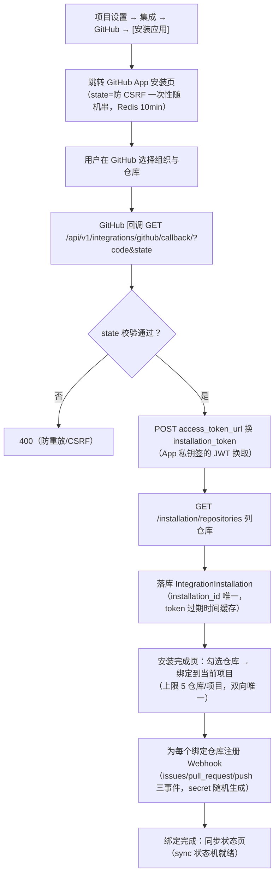
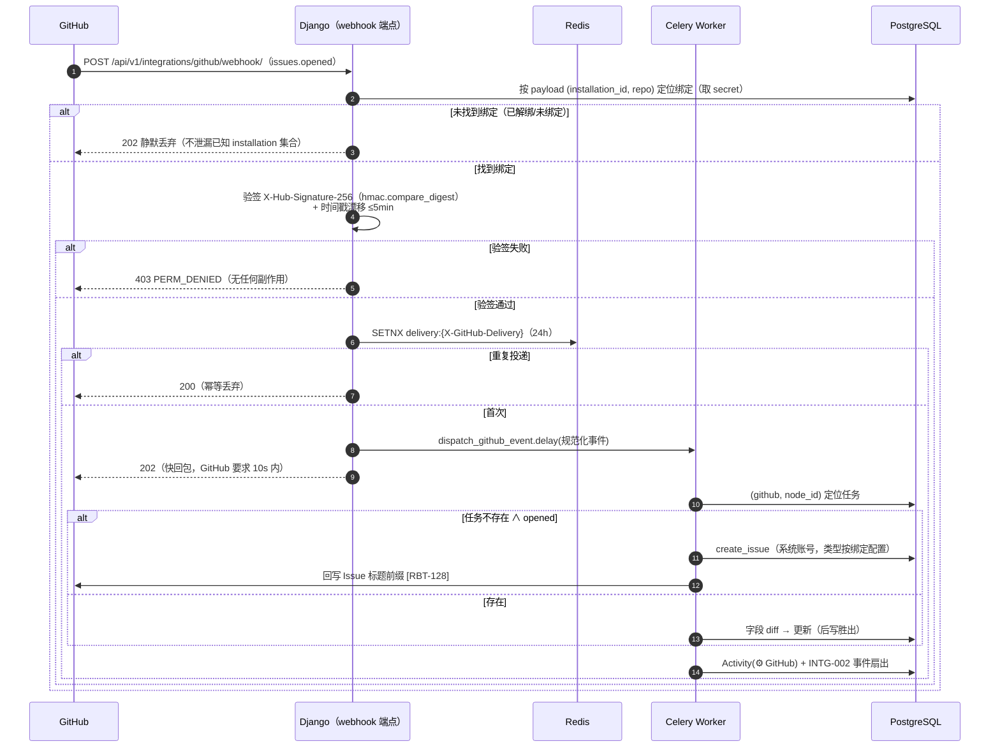
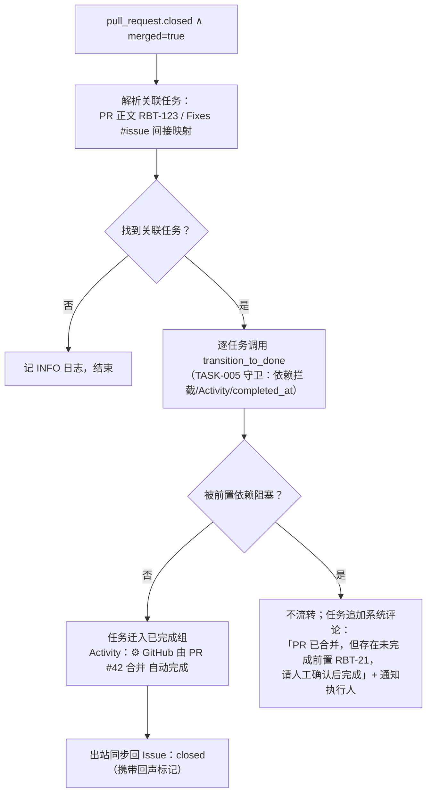
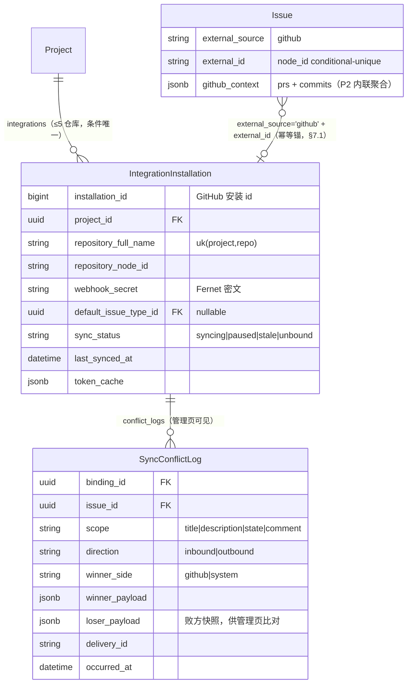
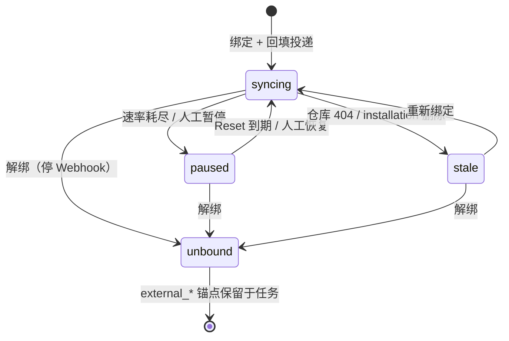

# GitHub 基础集成

| 元信息项 | 内容 |
| --- | --- |
| 文档编号 | INTG-001 |
| 所属迭代 | Sprint 5 — 集成 + 标准版收尾（第 7 周） |
| 优先级 | P2（标准版完整级 · **系统首个双向外部集成**） |
| 所属模块 | M9-INTG｜第三方工具集成 |
| 文档状态 | 待评审（Draft） |
| 最后更新日期 | 2026-09-01 |
| 上游依赖 | `TASK-001/002`（Issue 创建与属性管道）、**`TASK-005`（流转路径——合并自动改状态的唯一通道）**、`TASK-010`（Activity 留痕）、`INFRA-002`（出网策略 / Celery / Redis）、`INFRA-004`（信封与错误码） |
| 下游消费 | `INTG-002`（Webhook——集成事件同为其事件源之一）、`INTG-003`（P4 Slack/Zoom——复用安装与凭据体系）、`TASK-015`（P4 基线对比外部引用） |
| 上游依据 | `docs/需求文档.md` §3.9.1（绑定仓库、自动同步 PR/Issue/Commit、Issue 自动转任务、任务关联 PR、PR 合并自动更新任务状态）、§8.2 第三方集成 P2 列 |
| 关联架构文档 | [`unified-issue-model.md`](../architecture/unified-issue-model.md)（**§7.1 `external_id` / `external_source` 幂等键预留说明**）、[`api-conventions.md`](../architecture/api-conventions.md)（§8.6 `SERVER_EXTERNAL_SERVICE_ERROR`、§13.3 出站事件复用、§10.5 事务纪律）、[`rbac-permission-model.md`](../architecture/rbac-permission-model.md)（§8.1 `integration.manage` WS 级安装 / §8.2 `integration.config` 项目级绑定配置） |
| 对标基线 | Plane GitHub 同步（`apps/api/plane/app/views/integrations/github_sync/` 系列端点 + `GITHUB_CONFIGURATION` + installation token） · Ones 应用集成市场 |
| 工作量估算 | 后端 4 人日 / 前端 2 人日 / 联调与测试 2 人日，合计 **8 人日** |

---

## 1. 概述

### 1.1 功能定位

研发团队的事实源在 GitHub：Issue 报障、PR 评审、Commit 推进。没有集成，项目管理工具就要求人**双写**——而双写必然漂移。本迭代交付 GitHub 与本系统的**基础双向通道**：

| 方向 | 内容 | 触发 |
| --- | --- | --- |
| GitHub → 系统 | Issue 开启/编辑/关闭 → 系统任务创建/更新/流转；PR 关联任务、PR merge → 任务自动完成；Commit（消息含 `RBT-123`）→ 挂载任务详情 | GitHub Webhook（入站，验签） |
| 系统 → GitHub | 任务标题/描述/状态变更 → 同步回 Issue 标题/正文/状态（开/关）；任务评论 → Issue 评论 | Celery 出站任务（事务后投递） |

**P2 的克制边界**：同步的是「标题、描述、状态、评论」四类核心字段与关联关系；标签/指派人/里程碑的映射（字段语义不对齐，需映射表）后置 P4；Slack/Zoom 归 `INTG-003`，Open API 平台归 `INTG-004`（README §4.12）。

### 1.2 关键约定一：幂等键 `external_id` / `external_source`

> ⚠️ 一切同步的防重防线。架构文档 §7.1 已预留本列（P2 加列说明见彼处），语义：

| 字段 | 值域 | 语义 |
| --- | --- | --- |
| `external_source` | `"github"`（P2 唯一值；P4 扩 `"slack"` 等） | 外部系统标识 |
| `external_id` | GitHub **node_id**（GraphQL 全局 ID，非数字 id——防跨仓库碰撞） | 同一外部对象在本系统的**唯一锚点** |

- 入站事件按 `(external_source, external_id)` 定位本地任务：命中则更新、未命中且事件为创建则建任务（默认；绑定可配 `auto_create=False` 关闭自动建，改为仅按 `RBT-` 编号关联既有任务，见 BR-05）、未命中且事件为更新则**丢弃并记 WARN**（可能是绑定窗口前的历史事件）；
- **幂等三层**：定位幂等（上面的键）+ 事件幂等（GitHub `X-GitHub-Delivery` 头去重，Redis SETNX 24h）+ 写入幂等（内容 hash 比对，无变化跳过出站）；
- 同步风暴防线：系统→GitHub 的每次变更携带 `edited_by=rp` 的编辑标记，GitHub 侧忽略自己发起的回声事件（见 BR-09 回声抑制）。

### 1.3 关键约定二：系统账号与「无旁路」流转

- 集成触发的全部写操作以**系统账号 `rp-integration`**（`is_system=True` 的 User）为 `actor`——Activity 时间线显示 `⚙ GitHub`，审计可区分人与机器；
- **PR merge → 任务完成必须走 `TASK-005` 的流转守卫**（依赖拦截、Activity、`completed_at` 派生全部继承）：被前置任务阻塞的合并不会自动完成任务，而是产生一条「GitHub 合并待人工确认」的系统评论——集成的便利不得绕过业务的正确性约束。

### 1.4 交付内容

| # | 能力 | 说明 |
| --- | --- | --- |
| 1 | 安装与绑定 | GitHub App 安装流（回调换取 installation token）；项目 × 仓库绑定（多对多上限 5 仓库/项目） |
| 2 | Issue 双向同步 | 开启/标题/描述/状态/评论五类事件双向；冲突策略 = **GitHub 优先**（后写胜出，时间戳裁决） |
| 3 | Issue → 任务映射 | 绑定仓库新 Issue 自动建任务（类型=缺陷/任务可配；绑定级开关可关自动建，关闭后仅按 `RBT-` 编号关联既有任务）；`RBT-` 编号回写 Issue 标题前缀 |
| 4 | PR 关联 | PR 描述/标题含 `RBT-123` 或 `Fixes #45`（间接经 Issue 映射）→ 建立 PR↔任务关联；任务详情展示 PR 列表与状态 |
| 5 | 合并自动流转 | PR merged → 关联任务经 `TASK-005` 守卫自动迁入项目「已完成」组状态；被阻塞时降级为系统评论提醒 |
| 6 | Commit 挂载 | Commit 消息含 `RBT-123` → 任务详情「提交」区追加（sha 短链、消息、作者、仓库） |
| 7 | 入站验签与限流 | `X-Hub-Signature-256` 常量时间比对；`X-GitHub-Delivery` 去重；时间戳漂移 >5 分钟拒绝 |

### 1.5 范围边界

| 能力 | 本文档（P2） | 归属 |
| --- | --- | --- |
| 安装流 / 仓库绑定 / Issue 双向 / PR 关联 / 合并流转 / Commit 挂载 | ✅ | — |
| 标签 / 指派人 / 里程碑映射同步 | ❌（语义不对齐，需映射配置） | P4（GitHub 深度同步增强，编号未分配——README §4.12 无对应文档） |
| PR 评审评论同步 | ❌（仅 Issue 评论） | P4 |
| GitHub Release / Actions / Checks | ❌ | P4 |
| 多 GitHub 组织 / 企业版 GitHub | ❌（单 GitHub App，多组织天然支持） | — |
| Slack / Zoom | ❌ | P4 `INTG-003` |
| Webhook 出站（系统→第三方） | ❌ | `INTG-002`（同迭代） |
| 只读 OpenAPI | ❌ | P3 |
| 双向深度同步（字段级冲突合并 UI） | ❌（P2 冲突 = 时间戳后写胜出 + 冲突日志） | P4 |

### 1.6 前置依赖

| 依赖 | 内容 | 阻塞原因 |
| --- | --- | --- |
| `TASK-001/002` | `create_issue` 服务、属性更新管道 | 入站建任务复用（序列号/Activity 天然继承） |
| `TASK-005` | 流转守卫（依赖拦截）+ `transitions` 语义 | 合并自动完成的唯一通道（§1.3） |
| `TASK-010` | Activity 管道（系统 actor 形态已支持 `⚙`） | 留痕 |
| `INFRA-002` | 出网白名单（`api.github.com` / `github.com`）、Celery、Redis | 安装流与出站同步 |
| `unified-issue-model.md` §7.1 | `external_id`/`external_source` 列预留决策 | 加列迁移的架构依据 |

### 1.7 竞品参考

| 竞品 | 参考点 | 处置 |
| --- | --- | --- |
| Plane | `github_sync` 应用：`GITHUB_CONFIGURATION` 表（installation 凭据）+ `repository_sync/`（同步状态）+ `issue_sync/`（映射）三表 + `sync/` celery 任务族 | **三表结构完全对齐**（本系统收敛为 `IntegrationInstallation` + `Issue.external_*` 两处）；其「`RBT-123` 回写 Issue 标题」交互采纳 |
| Plane | PR 关联靠正文链接正则，无 merge 流转 | 本系统补齐 merge→流转（走守卫）与 Commit 挂载 |
| Ones | 应用市场安装范式、字段映射配置 | 安装范式对齐；字段映射 P4 |
| Jira Git 集成 | smart commit（`RBT-123 #comment` 指令） | P2 只解析编号不做指令；P4 评估 |

---

## 2. 业务逻辑

### 2.1 安装与仓库绑定流程



### 2.2 入站事件处理管线



### 2.3 合并自动流转（走守卫，无旁路）



### 2.4 业务规则汇总

| 编号 | 规则 | 判定位置 | 违反后果 |
| --- | --- | --- | --- |
| BR-01 | 入站处理顺序：**先按 payload `(installation_id, repository.full_name)` 定位绑定（取得该绑定的 `webhook_secret`）→ 验签（`X-Hub-Signature-256` 常量时间比对 + 时间戳漂移 ≤5min）→ 查重（Delivery 头 SETNX 24h）→ 入队（`dispatch_github_event.delay`）**；定位未命中（解绑窗口事件）静默 202 丢弃；验签失败 403 且**不产生任何副作用**；与 §2.2 时序图逐行对应 | 入站端点 | `403 PERM_DENIED` |
| BR-02 | 时间戳防御：payload 无时间戳时以 Delivery 首见时刻为准，同事件 5 分钟后重放被 Delivery 去重拦截 | 入站端点 | — |
| BR-03 | 仓库绑定：项目 × 仓库**条件唯一**（`deleted_at IS NULL` 时生效，见 §4.1.1 偏条件唯一修复 #2）；单项目 ≤5 仓库；单仓库可绑多项目（每项目各自映射，互不串扰） | Service + DB 约束 | `409 RESOURCE_ALREADY_EXISTS` / `RESOURCE_LIMIT_EXCEEDED` |
| BR-04 | 幂等定位键 `(external_source='github', external_id=node_id)`；唯一约束同样条件化（`deleted_at IS NULL`）；未命中 ∧ 非创建事件 → 丢弃 + WARN 日志（不回溯建任务） | Worker | — |
| BR-05 | 入站建任务：类型按绑定配置（默认「缺陷」）；状态落项目默认；`external_*` 同事务写入 | Worker | — |
| BR-06 | 双向同步字段白名单：标题 / 描述（HTML 化）/ 状态（开↔非 completed 组，关↔completed）/ 评论；**其余字段忽略** | Worker | — |
| BR-07 | 冲突策略 = **时间戳后写胜出**：双方近同时编辑时，`updated_at` 新者覆盖旧者，败方快照入 `SyncConflictLog` 表（§4.1.2 数据模型，败方 payload + 胜方 payload + delivery_id 溯源），管理页冲突日志 Tab 可见，**不做自动合并** | Worker | — |
| BR-08 | 系统侧变更同步出站前做内容 hash 比对（无差异跳过请求，节省速率预算） | Worker | — |
| BR-09 | 回声抑制：出站编辑在 GitHub 侧由本系统标记（issue 编辑追加不可见 metadata 或按 Delivery 去重），入站收到自己触发的更新不回环 | Worker | — |
| BR-10 | **合并流转无旁路**：走 `TASK-005` 守卫；被阻塞时降级为系统评论 + 通知，不强制完成 | Worker | — |
| BR-11 | Commit 挂载：push 事件的 commit message 匹配 `(?<![A-Za-z])([A-Z]{2,12}-\d+)` 提取编号 → 校验属当前绑定项目 → 追加「提交」记录（去重键 commit sha × 任务） | Worker | — |
| BR-12 | 管理权限分层：WS 级安装/回调 = `integration.manage`（WS_OWNER/WS_ADMIN，§8.1）；**项目级**安装仓库列表/绑定/解绑/暂停恢复/同步日志 = `integration.config`（PROJ_ADMIN，§8.2）；同一用户可在不同项目持有不同等级 | Permission | `403` |
| BR-13 | 解绑语义：删除绑定即停 Webhook 订阅与同步；任务的 `external_*` 保留（历史可溯），恢复绑定时旧映射继续生效 | Service | — |
| BR-14 | GitHub API 速率：installation token（5000/h/安装）预算受控；429/403-rate-limit 时按 `X-RateLimit-Reset` 暂停出站队列（不丢任务） | Worker | — |
| BR-15 | 全部集成写以系统账号 `rp-integration` 为 actor；Activity 与通知区分 `⚙` 来源 | Service | — |

### 2.5 异常处理

| 场景 | HTTP/结果 | 错误码 | 处理 |
| --- | --- | --- | --- |
| 验签失败 | 403 | `PERM_DENIED` | 记 WARN（可能 secret 轮换）；不解析 payload |
| installation 未找到（未绑定即收到事件） | 202 + 丢弃 | — | INFO 日志 |
| GitHub API 5xx / 超时 | 重试 | — | 出站任务退避 3 次 → 死信 + `SERVER_EXTERNAL_SERVICE_ERROR` 告警 |
| 速率耗尽 | 队列暂停 | — | 按 Reset 时间调度恢复（BR-14） |
| 同步冲突（双向近同时编辑） | 后写胜出 | — | 败方快照入冲突日志；管理页红点 |
| Issue 正文超 Issue.description 上限 | 截断 | — | 尾部追加 `…（同步截断）` |
| 绑定仓库被删（GitHub 404） | 绑定标记 stale | — | 管理页提示重绑；同步静默跳过 |
| merge 但无关联任务 | INFO + 结束 | — | — |

### 2.6 边界条件

| 边界场景 | 限制值 | 超出处理 |
| --- | --- | --- |
| 绑定仓库/项目 | 5 | 409 |
| 单 Issue 评论同步 | 最近 100 条（初始回填） | 更早不回溯 |
| 初始同步回填 | 绑定时 open Issue 全量 + closed 最近 7 天 | Celery 分页（100/页） |
| PR 关联解析深度 | PR 正文 + 标题 | 分支/commit 引用不解析 |
| Commit 挂载/push | 每 push ≤100 commit | GitHub 事件天然上限 |
| 出站批次（稳态） | 30 请求/分钟/安装（自限低于 GitHub 上限，用于绑定后日常同步） | 队列缓冲 |
| 出站批次（回填突发） | 100 请求/分钟/安装，仅 `backfill_repository` 任务使用，运行至回填结束自动切回稳态 | 不抢占日常同步队列；用单独的 `backfill` 队列（INFRA-002） |
| 事件积压 | RabbitMQ 容量 | 入站 202 快回包天然削峰 |

---

## 3. UI/UX 设计

### 3.1 集成设置页（项目设置 → 集成）

```
┌──────────────────────────────────────────────────────────────────────┐
│ 集成                                                                   │
│ ┌────────────────────────────────────────────────────────────────┐   │
│ │ [G] GitHub                          [✓ 已连接 · acme-org]        │   │
│ │     3 个仓库绑定 · 上次同步 2 分钟前                    [管理]   │   │
│ └────────────────────────────────────────────────────────────────┘   │
│ ┌────────────────────────────────────────────────────────────────┐   │
│ │ [⚡] Webhook 出站                          [管理]                │   │
│ └────────────────────────────────────────────────────────────────┘   │
│ ┌────────────────────────────────────────────────────────────────┐   │
│ │ [S] Slack · [Z] Zoom · [API] OpenAPI        🔒 付费版能力        │   │
│ └────────────────────────────────────────────────────────────────┘   │
└──────────────────────────────────────────────────────────────────────┘
```

### 3.2 GitHub 管理页（绑定与同步状态）

```
┌──────────────────────────────────────────────────────────────────────┐
│ GitHub · acme-org                                       [解除安装]     │
├──────────────────────────────────────────────────────────────────────┤
│ 绑定仓库（2/5）                                     [＋ 绑定仓库]     │
│ ┌────────────────────────┬─────────┬──────────────┬───────────────┐ │
│ │ 仓库                    │ 默认类型 │ 同步方向       │ 状态           │ │
│ ├────────────────────────┼─────────┼──────────────┼───────────────┤ │
│ │ acme/rabbit-web        │ 缺陷 ▾  │ 双向 ●        │ ● 同步中 2min │ │
│ │ acme/rabbit-api        │ 任务 ▾  │ 双向 ●        │ ● 同步中 2min │ │
│ └────────────────────────┴─────────┴──────────────┴───────────────┘ │
│ 同步记录                                                              │
│  10:32 ⚙ Issue #451 opened  →  RBT-128 创建                         │
│  10:28 ⚙ PR #450 merged     →  RBT-121 自动完成                     │
│  10:25 ⚠ 冲突：RBT-119 标题（GitHub 侧胜出，本地 10:24 编辑被覆盖）   │
│ 查看全部 ›                                                            │
└──────────────────────────────────────────────────────────────────────┘
```

| 元素 | 规格 |
| --- | --- |
| 仓库卡 | 仓库全名 / 入站建任务默认类型下拉 / 同步方向（P2 恒双向） / 最近同步心跳（>10min 变 amber） |
| 同步记录 | 最近 20 条系统操作摘要（⚙/⚠ 图标区分）；「查看全部」进日志页（含冲突日志 Tab） |
| 解除安装 | 二次确认（明示将停止同步与 Webhook，任务保留） |

### 3.3 任务详情的 GitHub 区块

```
┌──────────────────────────────────────────────────────────────────┐
│ RBT-121  登录页 504 修复                                          │
│ ──────────────────────────────────────────────────────────────── │
│  关联 Pull Request (1)                                            │
│   ● Merged  acme/rabbit-web#450  fix: login timeout  ← 3 小时前   │
│  提交 (3)                                                          │
│   a1b2c3d  fix: retry with backoff          张三 · 09-01          │
│   e4f5a6b  chore: config tweak              李四 · 08-31          │
│   c7d8e9f  feat: add circuit breaker         张三 · 08-30          │
│  GitHub Issue                                                      │
│   acme/rabbit-web#451 · opened · [在 GitHub 打开 ↗]               │
└──────────────────────────────────────────────────────────────────┘
```

| 元素 | 规格 |
| --- | --- |
| PR 行 | 状态点（open 绿 / merged 紫 / closed 红）+ `repo#number` + 标题 + 跳转 GitHub |
| 提交行 | sha 短码（等宽字体，点击跳 commit）+ message 首行 + 作者 + 日期 |
| Issue 行 | 外部锚点 + 「在 GitHub 打开」外链（`target=_blank rel=noopener`） |
| 同步指示 | 任务被外部更新时标题右侧 `⚙` 角标，悬浮列最近一次外部变更摘要 |

### 3.4 空状态 / 加载 / 失败

| 场景 | 处置 |
| --- | --- |
| 未安装 | GitHub 卡「连接你的仓库——Issue 与任务双向同步」+ [安装应用] |
| 绑定后初始回填中 | 仓库卡进度「回填中 342/512」，完成转同步中 |
| 同步中断（GitHub 故障） | 状态红点 + 「同步暂停 · 自动重试中」；恢复自动续 |
| 冲突待查看 | 管理页入口红点徽标 |

### 3.5 响应式与无障碍

| 断点 | 布局 |
| --- | --- |
| ≥ 1280px | 管理页双栏（仓库卡 + 同步记录） |
| < 768px | 单列堆叠；同步记录折叠 |

无障碍：PR 状态色点冗余文本（Merged）；外链 `aria-label` 含仓库名与编号；同步记录为语义列表，`aria-live="polite"` 逐条播报可选；安装按钮 `aria-haspopup`。

---

## 4. 技术架构

### 4.1 数据模型

#### 4.1.1 `IntegrationInstallation`（新表）与 `Issue.external_*`（既有列点亮）

```python
# apps/api/plane/db/models/integration.py
from django.db import models

from plane.db.models.base import BaseModel


class IntegrationInstallation(BaseModel):
    """GitHub App 安装与项目×仓库绑定 —— 对标 Plane GITHUB_CONFIGURATION + repository_sync 的收敛"""

    class Provider(models.TextChoices):
        GITHUB = "github", "GitHub"

    class SyncStatus(models.TextChoices):
        SYNCING = "syncing", "同步中"
        PAUSED = "paused", "已暂停"        # 速率耗尽 / 人工暂停
        STALE = "stale", "仓库失效"        # GitHub 404 / installation 删除
        UNBOUND = "unbound", "已解绑"

    provider = models.CharField(max_length=16, choices=Provider.choices,
                                default=Provider.GITHUB)
    installation_id = models.BigIntegerField(db_index=True,
                                              verbose_name="GitHub installation id")
    project = models.ForeignKey("db.Project", on_delete=models.CASCADE,
                                related_name="integrations")
    repository_full_name = models.CharField(max_length=200,
        verbose_name="仓库全名", help_text="owner/repo，小写")
    repository_node_id = models.CharField(max_length=64,
        verbose_name="仓库 node_id", help_text="事件定位用 GraphQL ID")
    webhook_secret = models.CharField(max_length=64,
        verbose_name="Webhook 验签密钥（随机生成 + 应用层 Fernet 对称加密存储；"
                     "HMAC 计算必须用原文，故不可仅存哈希——DB 落地是密文，"
                     "Service 层 `decrypt()` 后用于 `hmac.compare_digest`）",
        help_text="明文仅在创建绑定时展示一次给管理员；密钥轮换 = 生成新值 + 重注册 Webhook")
    default_issue_type = models.ForeignKey("db.IssueType", null=True, blank=True,
        on_delete=models.SET_NULL,
        verbose_name="入站建任务的默认类型（空=项目默认类型）")
    sync_status = models.CharField(max_length=16, choices=SyncStatus.choices,
                                   default=SyncStatus.SYNCING, db_index=True)
    last_synced_at = models.DateTimeField(null=True, blank=True,
                                          verbose_name="最近同步心跳")
    token_cache = models.JSONField(default=dict, blank=True,
        verbose_name="installation token 缓存", help_text='{"token": …, "expires_at": …}')

    class Meta(BaseModel.Meta):
        db_table = "integration_installations"
        constraints = [
            # 软删除兼容：deleted_at 可空，PG UNIQUE 默认将 NULL 视为互异，
            # 必须用条件唯一才能保证「同一 (project, repo) 仅一条存活」。
            models.UniqueConstraint(
                fields=["project", "repository_full_name"],
                condition=models.Q(deleted_at__isnull=True),
                name="uniq_binding_project_repo_active"),
            models.CheckConstraint(
                check=~models.Q(repository_full_name=""), name="chk_repo_name"),
        ]
        indexes = [
            # 入站事件定位：installation → 绑定（一安装可绑多项目）
            models.Index(fields=["installation_id", "repository_full_name"],
                         name="idx_install_repo"),
        ]
```

```python
# Issue 既有模型点亮（unified-issue-model §7.1 预留说明的落地）：
external_source = models.CharField(max_length=16, null=True, blank=True,
                                   db_index=True, verbose_name="外部来源")
external_id = models.CharField(max_length=64, null=True, blank=True,
                               verbose_name="外部对象 node_id")
class Meta:
    constraints = [
        # 软删除兼容：deleted_at 可空必须加进 condition，否则同 (project, source, id)
        # 可被多条复用，撞「唯一键失守」。详见 BR-04。
        models.UniqueConstraint(
            fields=["project", "external_source", "external_id"],
            condition=models.Q(external_source__isnull=False,
                               deleted_at__isnull=True),
            name="uniq_external_anchor_per_project"),
    ]
```

#### 4.1.2 `SyncConflictLog`（新表，BR-07 落地）

> BR-07 说「败方写入 `sync_conflict_log`，管理页可见」必须可持久化；本节补齐数据模型与可见性。

```python
# apps/api/plane/db/models/integration.py（续）
class SyncConflictLog(BaseModel):
    """双向同步冲突日志：保存「败方快照」与「胜方」参照，供管理页排查；
    后台不自动合并，留给人决策（§1.5 P4 边界）。"""

    class Scope(models.TextChoices):
        TITLE = "title", "标题"
        DESCRIPTION = "description", "描述"
        STATE = "state", "状态"
        COMMENT = "comment", "评论"

    class Direction(models.TextChoices):
        INBOUND = "inbound", "入站"
        OUTBOUND = "outbound", "出站"

    binding = models.ForeignKey("db.IntegrationInstallation",
                                on_delete=models.CASCADE,
                                related_name="conflict_logs")
    issue = models.ForeignKey("db.Issue", on_delete=models.CASCADE,
                              related_name="github_conflict_logs")
    scope = models.CharField(max_length=16, choices=Scope.choices,
                             db_index=True)
    direction = models.CharField(max_length=16, choices=Direction.choices,
                                 db_index=True)
    winner_side = models.CharField(max_length=8,
        choices=[("github", "GitHub"), ("system", "系统")],
        verbose_name="时间戳裁决胜出方")
    winner_payload = models.JSONField(verbose_name="胜方字段值")
    loser_payload = models.JSONField(verbose_name="败方字段值（被覆盖前的快照）")
    delivery_id = models.CharField(max_length=64, blank=True,
                                   verbose_name="GitHub X-GitHub-Delivery，溯源用")
    occurred_at = models.DateTimeField(db_index=True,
        verbose_name="冲突时刻——按双方 updated_at 较大者记")

    class Meta(BaseModel.Meta):
        db_table = "integration_sync_conflict_logs"
        indexes = [
            # 管理页冲突日志 Tab：按项目 + 时间倒序
            models.Index(fields=["binding", "-occurred_at"],
                         name="idx_conflict_binding_time"),
            models.Index(fields=["issue", "-occurred_at"],
                         name="idx_conflict_issue_time"),
        ]
        ordering = ("-occurred_at",)
```



> PR 关联与 Commit 记录**不建新表**：PR 列表经 `IntegrationInstallation` + GitHub API 按需拉取（带 60s 缓存）或由入站事件维护在 `Issue` 的聚合 JSONB（`github_context: {prs: [], commits: []}`，事件驱动增量更新，展示层直读）。P2 选择后者（事件驱动内联），避免出网依赖进请求路径。

#### 4.1.3 迁移

```python
# apps/api/plane/db/migrations/00XX_p2_integrations.py
operations = [
    # 1. IntegrationInstallation 新表（含 webhook_secret / token_cache / sync_status）
    migrations.CreateModel(
        name="IntegrationInstallation", fields=[...],
        options={"db_table": "integration_installations"}),

    # 2. SyncConflictLog 新表（BR-07 冲突日志；Issue 删除级联）
    migrations.CreateModel(
        name="SyncConflictLog", fields=[...],
        options={"db_table": "integration_sync_conflict_logs"}),

    # 3. Issue 加列：external_source / external_id / github_context
    migrations.AddField(model_name="issue", name="external_source",
        field=models.CharField(max_length=16, null=True, blank=True,
                               db_index=True)),
    migrations.AddField(model_name="issue", name="external_id",
        field=models.CharField(max_length=64, null=True, blank=True)),
    migrations.AddField(model_name="issue", name="github_context",
        field=models.JSONField(default=dict, blank=True,
            verbose_name="PR/Commit 聚合（事件驱动内联，不建表）",
            help_text='{"prs":[{"number":450,"state":"merged",...}],'
                     '"commits":[{"sha":"a1b2c3d",...}]}')),

    # 4. 条件唯一约束：依赖关系见 §4.1.1（issue 2 修复）
    migrations.AddConstraint(model_name="issue",
        constraint=models.UniqueConstraint(
            fields=["project", "external_source", "external_id"],
            condition=models.Q(external_source__isnull=False,
                               deleted_at__isnull=True),
            name="uniq_external_anchor_per_project")),
]
```

> 迁移顺序要点（详见 `tests/e2e/PG_README.md`）：若数据库已存软删除任务，必须先 `manage.py migrate --fake 0001_extensions`，再应用本迁移；`github_context` 默认 `{}`，避免 `null != {}` 的 ORM 行为分裂。

### 4.2 API 定义

| # | 方法 | 路径 | 描述 | 权限 | 成功码 |
| --- | --- | --- | --- | --- | --- |
| 1 | `GET` | `/api/v1/workspaces/{slug}/integrations/github/app/` | 安装入口（返回 GitHub 安装 URL + state） | `integration.manage`（WS 级，§8.1） | `200` |
| 2 | `GET` | `/api/v1/workspaces/{slug}/integrations/github/callback/` | 安装回调（GitHub 跳转，换 token + 落库 + 重定向前端） | state 校验 + `integration.manage`（WS 级，§8.1） | `302` |
| 3 | `GET` | `/api/v1/workspaces/{slug}/projects/{project_id}/integrations/github/repositories/` | 可绑定仓库列表（代理 GitHub API） | `integration.config`（§8.2） | `200` |
| 4 | `POST` | `/api/v1/workspaces/{slug}/projects/{project_id}/integrations/github/bindings/` | 绑定仓库（含 Webhook 注册 + 初始回填投递） | `integration.config`（§8.2） | `201` |
| 5 | `PATCH` | `/api/v1/workspaces/{slug}/projects/{project_id}/integrations/github/bindings/{binding_id}/` | 改默认类型 / 暂停恢复 | `integration.config`（§8.2） | `200` |
| 6 | `DELETE` | `/api/v1/workspaces/{slug}/projects/{project_id}/integrations/github/bindings/{binding_id}/` | 解绑（停 Webhook；`external_*` 保留） | `integration.config`（§8.2） | `204` |
| 7 | `GET` | `/api/v1/workspaces/{slug}/projects/{project_id}/integrations/github/sync-logs/?type=conflict` | 同步/冲突日志（游标） | `integration.config`（§8.2） | `200` |
| 8 | `POST` | `/api/v1/integrations/github/webhook/` | **入站事件端点（GitHub 调用，无登录态）** | HMAC 验签（无项目权限码） | `202` |

> 权限码细分依据 `rbac-permission-model.md` §8.1 / §8.2：WS 级 OAuth 安装用 `integration.manage`（WS_OWNER/WS_ADMIN），项目级绑定 / 配置 / 同步日志用 `integration.config`（PROJ_ADMIN）；入站 Webhook 端点由 GitHub 服务调用，无项目权限码可校验，靠 HMAC 验签保证安全。

#### 4.2.1 `POST /api/v1/integrations/github/webhook/` — 入站

**请求头**

```http
POST /api/v1/integrations/github/webhook/ HTTP/1.1
X-GitHub-Event: issues
X-GitHub-Delivery: 72d3162e-cc78-11e3-81ab-4c9367dc0958
X-Hub-Signature-256: sha256=57f0c58ee1c1b0c4b0e0c9b3e2a1d4f7…
X-Hub-Signature: sha1=…（兼容头，同时校验）
```

**成功响应 `202`**（快回包——重活全在 Worker）：

```json
{ "status": "success", "data": null, "meta": { "delivery": "72d3162e-…" } }
```

**失败响应 `403`（验签失败）**

```json
{
  "status": "error",
  "error": {
    "code": "PERM_DENIED",
    "message": "签名校验失败",
    "request_id": "01JCBG6F9DH8A1B7I5C9D0E2F3"
  }
}
```

#### 4.2.2 `POST …/bindings/` — 绑定仓库

**请求**

```json
{ "repository_full_name": "acme/rabbit-web",
  "repository_node_id": "R_kgDOA1B2c3",
  "default_issue_type_id": "9d8e4f2a-1b3c-4d5e-8f9a-0a1b2c3d4e5f" }
```

**成功响应 `201`**

```json
{
  "status": "success",
  "data": {
    "id": "c3d4e5f6-a7b8-4c9d-0e1f-2a3b4c5d6e7f",
    "repository_full_name": "acme/rabbit-web",
    "sync_status": "syncing",
    "backfill": { "task_id": "01JCBG6F9DH8A1B7I5C9D0E2F4", "state": "queued" },
    "webhook_registered": true
  }
}
```

**失败响应 `409`（重复绑定）**

```json
{
  "status": "error",
  "error": {
    "code": "RESOURCE_ALREADY_EXISTS",
    "message": "该仓库已绑定到本项目",
    "request_id": "01JCBG6F9DH8A1B7I5C9D0E2F5"
  }
}
```

### 4.3 核心逻辑

#### 4.3.1 验签与去重（入站第一道）

```python
# apps/api/plane/app/views/integrations_github.py（节选）
import hmac, hashlib

def verify_signature(secret: str, payload_body: bytes, header: str) -> bool:
    """X-Hub-Signature-256 常量时间比对（BR-01）。"""
    expected = "sha256=" + hmac.new(secret.encode(), payload_body,
                                    hashlib.sha256).hexdigest()
    return hmac.compare_digest(expected, header)


def _decrypt_secret(ciphertext: str) -> str:
    """Fernet 对称解密（webhook_secret 不可仅存哈希——HMAC 必须原文）。"""
    from plane.utils.crypto import fernet
    return fernet.decrypt(ciphertext.encode()).decode()


@csrf_exempt  # GitHub 无会话；防护靠验签 + state
@require_POST
def github_webhook(request):
    delivery = request.headers.get("X-GitHub-Delivery", "")
    event = request.headers.get("X-GitHub-Event", "")
    body = request.body                                     # 原始字节（验签必须用原文）
    installation_id = extract_installation_id(body)         # 轻解析仅取定位字段
    binding = (IntegrationInstallation.objects
               .filter(installation_id=installation_id,
                       repository_full_name=extract_repo(body),
                       deleted_at__isnull=True).first())
    if binding is None:
        return accepted(and_log="unbound installation")     # 202 静默
    # 验签前先解密（密文落地 —— 见 §4.1.1 字段注释）
    plaintext_secret = _decrypt_secret(binding.webhook_secret)
    if not verify_signature(plaintext_secret, body,
                            request.headers.get("X-Hub-Signature-256", "")):
        return Response(error("PERM_DENIED", 403))          # 无副作用
    if cache.add(f"gh-delivery:{delivery}", 1, timeout=86400) is False:
        return accepted(and_log="duplicate delivery")       # BR-01 幂等
    dispatch_github_event.delay(str(binding.id), event, json.loads(body))
    return accepted(delivery=delivery)                      # 202 快回包
```

#### 4.3.2 installation token（出站凭据，缓存至过期前 5 分钟）

```python
# apps/api/plane/db/services/github_client.py
GITHUB_API = "https://api.github.com"

def installation_token(binding: IntegrationInstallation) -> str:
    cached = binding.token_cache or {}
    if cached.get("token") and cached.get("expires_at", 0) > time.time() + 300:
        return cached["token"]
    jwt_token = jwt.encode(                 # App 私钥签名（每 10 分钟新 JWT）
        {"iat": int(time.time()) - 30, "exp": int(time.time()) + 600,
         "iss": settings.GITHUB_APP_ID},
        settings.GITHUB_APP_PRIVATE_KEY, algorithm="RS256")
    resp = requests.post(
        f"{GITHUB_API}/app/installations/{binding.installation_id}/access_tokens",
        headers={"Authorization": f"Bearer {jwt_token}"}, timeout=10)
    resp.raise_for_status()
    data = resp.json()
    binding.token_cache = {"token": data["token"],
                           "expires_at": data["expires_at_epoch"]}
    binding.save(update_fields=["token_cache", "updated_at"])
    return data["token"]


def gh_request(binding, method, path, **kw):
    """带速率预算的出站封装：429/403-rate-limit → 队列暂停至 Reset（BR-14）。"""
    resp = requests.request(method, f"{GITHUB_API}{path}",
                            headers={"Authorization":
                                     f"Bearer {installation_token(binding)}"},
                            timeout=10, **kw)
    if resp.status_code in (403, 429) and resp.headers.get("X-RateLimit-Remaining") == "0":
        pause_outbound_until(int(resp.headers["X-RateLimit-Reset"]))
        raise RateLimited()
    return resp
```

#### 4.3.3 入站事件分派与双向同步（Worker）

```python
# apps/api/plane/bgtasks/github_sync.py
@shared_task(bind=True, max_retries=3, retry_backoff=True, acks_late=True)
def dispatch_github_event(self, binding_id: str, event: str, payload: dict):
    """规范化分派：issues / issue_comment / pull_request / push 四族。"""
    binding = IntegrationInstallation.objects.get(id=binding_id)
    if binding.sync_status != "syncing":
        return                                              # paused/stale 静默
    handler = {"issues": on_issue_event, "issue_comment": on_comment_event,
               "pull_request": on_pr_event, "push": on_push_event}[event]
    handler(binding, payload)
    IntegrationInstallation.objects.filter(id=binding_id).update(
        last_synced_at=timezone.now())


def _locate_or_create(binding, gh_issue: dict):
    """幂等定位/创建（BR-04/05）：命中返回 (issue, False)；创建返回 (issue, True)。"""
    issue = Issue.objects.filter(
        external_source="github", external_id=gh_issue["node_id"],
        project_id=binding.project_id, deleted_at__isnull=True).first()
    if issue:
        return issue, False
    issue = create_issue(                                   # 复用 TASK-001 服务
        project_id=binding.project_id, actor_id=SYSTEM_ACTOR_ID,
        payload={"name": gh_issue["title"],
                 "description_html": markdown(gh_issue["body"] or ""),
                 "issue_type_id": str(binding.default_issue_type_id or
                                      default_type(binding.project_id)),
                 "external_source": "github", "external_id": gh_issue["node_id"]})
    gh_request(binding, "PATCH",
               f"/repos/{binding.repository_full_name}/issues/{gh_issue['number']}",
               json={"title": f"[{issue.project.identifier}-{issue.sequence_id}] "
                              f"{gh_issue['title']}"})        # 编号回写
    return issue, True


def on_issue_event(binding, p):
    action, gh = p["action"], p["issue"]
    issue, created = _locate_or_create(binding, gh)
    if created or action in ("edited", "reopened"):
        _apply_github_fields(binding, issue, gh)             # 白名单（BR-06）
    if action == "closed" and not gh.get("locked"):
        _transition(binding, issue, to="completed",
                    comment=f"GitHub Issue #{gh['number']} 关闭")
```

#### 4.3.4 合并流转（无旁路）与 Commit 挂载

```python
import re
ISSUE_KEY_RE = re.compile(r"(?<![A-Za-z])([A-Z]{2,12}-\d+)")


def on_pr_event(binding, p):
    pr = p["pull_request"]
    if p["action"] == "closed" and pr.get("merged"):
        for key in ISSUE_KEY_RE.findall(f"{pr['title']}\n{pr['body'] or ''}"):
            issue = find_by_project_key(binding.project_id, key)
            if issue is None:
                continue
            blocked = try_transition_to_done(                # TASK-005 守卫（BR-10）
                issue, actor=SYSTEM_ACTOR_ID,
                comment=f"由 PR #{pr['number']} 合并自动完成")
            if blocked:                                      # 被依赖拦截 → 降级提醒
                add_system_comment(issue, "PR 已合并，但存在未完成前置任务，"
                                           "请人工确认后完成")
                notify_assignees(issue, kind="integration_attention")
            else:
                sync_issue_state_outbound(binding, issue)    # 回写 Issue closed
    else:
        update_pr_context(binding, p)                        # github_context.prs 增量


def on_push_event(binding, p):
    for commit in p.get("commits", []):                      # ≤100/push
        for key in ISSUE_KEY_RE.findall(commit.get("message", "")):
            issue = find_by_project_key(binding.project_id, key)
            if issue:
                append_commit_record(issue, {                # 去重键 sha×issue（BR-11）
                    "sha": commit["id"][:10], "message": commit["message"].splitlines()[0],
                    "author": commit["author"]["name"], "repo": binding.repository_full_name})


@shared_task(bind=True, max_retries=5, autoretry_for=(RateLimited,))
def sync_issue_outbound(issue_id: str):
    """系统→GitHub：内容 hash 无差异跳过（BR-08）；编辑携带回声标记（BR-09）。"""
    ...
```

#### 4.3.5 初始回填（绑定时）

```python
@shared_task(bind=True, soft_time_limit=1800)
def backfill_repository(self, binding_id: str) -> dict:
    """open Issue 全量 + closed 最近 7 天，分页 100/条批创建（复用 _locate_or_create）。"""
    ...
```

### 4.4 前端实现

- `IntegrationStore`（`packages/shared-state`）：`bindings`（SWR `project:{id}:integrations`）、`syncLogs`；安装流经 window.location 跳转 + 回调页 `?install=success` 收敛。
- `GithubPanel`（任务详情区块）：`github_context` 直读渲染 PR/提交/Issue 锚点；`⚙` 角标来自最近一条系统 Activity。
- 管理页 `GithubManagePage`：仓库卡（心跳 60s 轮询）、回填进度（202 任务轮询 `INFRA-004` §13.1 模式）、冲突日志 Tab。

---

## 5. 测试用例

### 5.1 单元测试

| 用例 ID | 测试目标 | 输入 | 预期输出 | 覆盖类型 |
| --- | --- | --- | --- | --- |
| UT-01 | 验签常量时间比对 | 正确/篡改签名 | 通过 / 403 无副作用 | 安全 |
| UT-02 | Delivery 去重 | 同事件投两次 | 第二次 202 丢弃 | 并发 |
| UT-03 | 幂等定位 | 同 node_id 两事件 | 恰一任务 | 正常 |
| UT-04 | 未命中非创建事件 | 编辑未映射 Issue | 丢弃 + WARN | 异常 |
| UT-05 | 编号回写 | 建任务 | Issue 标题前缀 `[RBT-128]` | 正常 |
| UT-06 | 白名单外字段忽略 | Issue 加 label | 任务零变化 | 边界 |
| UT-07 | 状态映射 | closed→completed 组 | 走守卫 + Activity | 正常 |
| UT-08 | 合并被阻塞拦截 | 前置未完成 | 不流转 + 系统评论 | 异常 |
| UT-09 | PR 编号解析 | 正文含 RBT-121 | 关联建立 | 正常 |
| UT-10 | Fixes 间接映射 | Fixes #451 | 经 Issue 映射命中任务 | 正常 |
| UT-11 | Commit 挂载去重 | 同 sha 两次 | 单条记录 | 边界 |
| UT-12 | 正则边界 | `AB-CD-123` 不误配 | 命中 CD-123 | 边界 |
| UT-13 | 回声抑制 | 系统触发的更新回流 | 不再出站 | 正常 |
| UT-14 | 内容 hash 跳过 | 无差异变更 | 0 出站请求 | 正常 |
| UT-15 | 速率暂停 | 429 + Reset | 队列暂停至点恢复 | 异常 |
| UT-16 | 解绑保留锚点 | 解绑后查任务 | `external_*` 保留（BR-13） | 边界 |
| UT-17 | 系统账号 actor | 全部写操作 | actor=rp-integration | 安全 |
| UT-18 | 冲突后写胜出 | 双向近同时 | 时间戳新者胜 + 日志 | 并发 |

### 5.2 集成测试

| 用例 ID | 场景 | 前置条件 | 操作步骤 | 预期结果 |
| --- | --- | --- | --- | --- |
| IT-01 | 安装闭环 | 测试 GitHub App | 安装→回调→绑仓 | token 落库；Webhook 注册；回填启动 |
| IT-02 | 双向同步三向 | 绑定就绪 | GH 改标题→查任务；任务改状态→查 GH | 双侧一致；Activity ⚙ |
| IT-03 | 合并自动流转 | PR 关联任务 | merge PR | 任务完成（守卫路径）；GH issue closed |
| IT-04 | 回填正确性 | 仓库 512 open | 绑定回填 | 30s 内出现「N/512」进度；全量任务建立；编号回写；突发预算 100 req/min 跑完 ≤12 分钟；与稳态 30 req/min 不互相抢占 |
| IT-05 | 死信告警 | mock 5xx | 出站同步 | 3 重试→死信 + `SERVER_EXTERNAL_SERVICE_ERROR` |
| IT-06 | 越权管理 | 非管理员绑仓 | POST bindings | 403 |
| IT-07 | 事件风暴 | 100 事件突发 | 并发投递 | 入站全部 202 <2s；Worker 按序消费 |

### 5.3 E2E 测试

| 用例 ID | 用户场景 | 操作路径 | 验收标准 |
| --- | --- | --- | --- |
| E2E-01 | 全链演示 | 安装→绑仓→GH 开 Issue→改标题→关 | 任务建立/同步/完成；编号回写可见 |
| E2E-02 | PR 合并 | PR 描述含 RBT-121→merge | 任务自动完成 + ⚙ Activity + 详情 PR 区 Merged |
| E2E-03 | Commit 挂载 | commit 消息含 RBT-121 push | 详情提交区出现 sha 行 |
| E2E-04 | 阻塞降级 | 被阻塞任务关联 PR merge | 不完成 + 系统评论 + 执行人通知 |
| E2E-05 | 冲突可见 | 双侧近同时改标题 | 管理页冲突日志可见败方快照 |

---

## 6. 竞品深度对标

### 6.1 Plane 实现分析

- **结构**：`apps/api/plane/app/views/integrations/github_sync/` 拆分 `installation/`、`repository_sync/`、`issue_sync/`、`issue_comment_sync/`、`sync/` 多模块；模型层用 `GITHUB_CONFIGURATION`（凭据）+ `RepositorySync`（绑定）+ `IssueSync`（映射行）三表。本系统**收敛为两处**：`IntegrationInstallation`（凭据+绑定合一）与 `Issue.external_*`（映射内联）——映射行独立成表在「一任务一外部对象」的一对一语义下是多余的 JOIN。
- **采纳**：installation token 动态换取与缓存、`[PROJ-123]` 标题回写、`sync/` Celery 任务族的分层（backfill 与增量分离）。
- **补齐**（Plane 开源版缺失）：PR merge → 任务流转联动、Commit 挂载、冲突日志与速率暂停——这三项是社区反馈的高频诉求，也是本系统「基础集成即闭环」的差异化。

### 6.2 Ones 实现分析

- Ones 走应用市场范式：安装即配置字段映射（含标签/指派人映射 UI）、双向深度同步与冲突合并向导。能力重、企业向。本系统 P2 用「白名单四字段 + 时间戳后写胜出 + 冲突日志」把 P2 复杂度压在 8 人日内；映射与合并向导是 P4 `INTG-004` 的增量（届时 `IntegrationInstallation` 加 `field_mapping` JSONB 即可，零迁移）。

### 6.3 本系统设计决策

1. **幂等三层防同步风暴**：锚点定位 + Delivery 去重 + 内容 hash 跳过——集成系统的正确性问题 90% 是重复与回环，三层幂等让 at-least-once 的投递语义天然安全。
2. **无旁路流转是红线**（BR-10）：合并自动完成必须过 `TASK-005` 守卫——集成的便利绝不购买业务约束的豁免；被阻塞时降级提醒而非强制。
3. **映射内联不建映射表**：一对一语义下 `Issue.external_*` 两列 + 唯一约束即完整映射，省一张表与全部 JOIN——Plane 三表结构的简化版。
4. **PR/Commit 走事件驱动内联聚合**（`github_context`）：请求路径零出网依赖（GitHub 挂了不影响任务详情打开），展示数据由事件增量维护。
5. **系统账号与 ⚙ 来源标识**：Activity/通知区别人与机器——审计和信任都要求「谁改的」可辨。

---

## 7. 里程碑与验收

### 7.1 交付物清单

| 类型 | 交付物 |
| --- | --- |
| Model / Migration | `IntegrationInstallation` 新表；`Issue.external_source/external_id` 加列 + 唯一锚约束 |
| 后端 | 安装流（App URL/callback/state）、token 获取与缓存、入站验签去重端点、四族事件 Worker（issues/comments/pull_request/push）、双向同步服务（白名单/回声抑制/冲突日志）、合并流转接入 `TASK-005`、初始回填、速率暂停 |
| Celery | `dispatch_github_event` / `sync_issue_outbound` / `backfill_repository`（幂等） |
| 前端 | 集成设置页、GitHub 管理页（绑定/心跳/回填进度/冲突日志）、任务详情 GitHub 区块（PR/提交/Issue 锚点/⚙ 角标） |
| 测试 | UT-01~18、IT-01~07、E2E-01~05 |

### 7.2 可操作演示的验收标准

1. 安装→绑仓：绑定卡 **30 秒内出现「回填中 N/512」进度**（仓库卡 WebSocket 推送首条进度即计）；512 个 open Issue 全量建任务时间由 `backfill_repository` 突发预算（100 req/min/安装，独立队列）决定——含 512 次任务创建 + 512 次 Issue 标题 `[RBT-n]` 回写，按突发预算估算 **8-12 分钟**（实测基线见 Day 5 压测报告）；验收时以「进度条出现 <30s」「全量完成有 `SERVER_OK`」「回填期间不影响绑仓项目已有任务编辑」三档并列，不强制 60s 全量完成（与 §2.6 稳态限速 30 req/min 不冲突）。GitHub 侧标题回写带 `[RBT-n]` 前缀。
2. GitHub 改 Issue 标题/正文：任务 5 秒内同步且动态显示 `⚙ GitHub 更新了标题`；任务侧改状态：GitHub Issue 3 秒内 closed/reopened。
3. PR 描述含 `RBT-121` 且 merge：任务经守卫自动完成、Activity 记录「由 PR #450 合并自动完成」；对被阻塞任务重复：不完成 + 系统评论 + 执行人收到提醒通知。
4. push 含 `RBT-121` 的 commit：详情「提交」区出现该记录，同 sha 重复 push 不产生重复行。
5. 篡改签名的入站请求被 403 且无任何数据变化；同一 Delivery 重放被静默丢弃。
6. mock GitHub 5xx：出站同步退避三次进死信并触发 `SERVER_EXTERNAL_SERVICE_ERROR` 告警；恢复后队列自动续传（速率暂停语义验证）。

---

## 附录 A：事件与字段映射全表（实现与测试的对照基准）

### A.1 入站事件 → 系统动作

| GitHub 事件 | action | 触发条件 | 系统动作 | 幂等保护 |
| --- | --- | --- | --- | --- |
| `issues` | `opened` | 绑定仓库 | 建任务（默认类型）+ 编号回写标题前缀 | 锚点唯一 + Delivery |
| `issues` | `edited`（title/body） | 任务存在 | 白名单字段更新 + Activity | 内容比对跳过 |
| `issues` | `reopened` | 任务存在 | 状态回项目默认（unstarted 组） | Delivery |
| `issues` | `closed` | 任务存在 | 经守卫迁 completed 组 | Delivery + 守卫 |
| `issue_comment` | `created` | 任务存在 | 建系统标记评论（外部来源徽标） | Delivery |
| `pull_request` | `opened/edited` | 正文/标题含任务编号 | 更新 `github_context.prs` | sha/number |
| `pull_request` | `closed ∧ merged` | 关联任务 | **守卫流转**（阻塞则降级提醒）+ 回写 Issue closed | Delivery |
| `push` | — | commit 消息含编号 | 追加提交记录（≤100/push） | sha × 任务 |
| 其余 | — | — | 忽略（INFO 日志） | — |

### A.2 字段映射（白名单四类 + 状态双向）

| 系统字段 | GitHub 字段 | 入站转换 | 出站转换 | 冲突裁决 |
| --- | --- | --- | --- | --- |
| `name` | `issue.title` | 去除 `[RBT-n] ` 前缀后取值 | 追加 `[RBT-n] ` 前缀 | 后写胜出 |
| `description_html` | `issue.body`（Markdown） | `markdown()` 转 HTML（净化） | HTML 转回 Markdown（`html2md`） | 后写胜出 |
| `state`（组语义） | `issue.state` | open→非 completed 组（保项目默认态）；closed→completed 组 | completed 组→closed；其余→open | 守卫优先（阻塞不闭环） |
| 评论 | `issue_comment.body` | 原 Markdown + `⚙ GitHub` 来源标记 | 原 Markdown | 各自追加（不合并） |
| 标签/指派人/里程碑 | — | **不同步**（P4 映射） | 同左 | — |

### A.3 同步状态机（绑定粒度）




