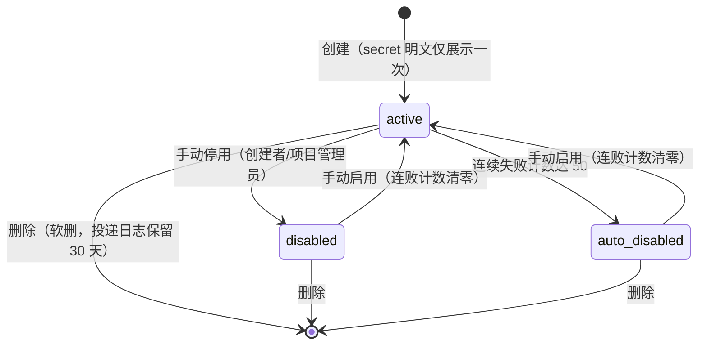
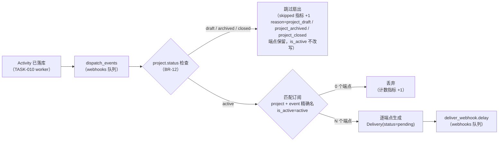

# 基础 Webhook 出站通知

| 元信息项 | 内容 |
| --- | --- |
| 文档编号 | INTG-002 |
| 所属迭代 | Sprint 5 — 集成 + 标准版收尾（第 7 周） |
| 优先级 | P2（标准版完整级） |
| 所属模块 | M9-INTG｜第三方工具集成 |
| 文档状态 | 待评审（Draft） |
| 最后更新日期 | 2026-09-01 |
| 上游依赖 | **[`api-conventions.md`](../architecture/api-conventions.md) §13.3（出站 Webhook 规范——本文档是其首个落地方，一字不差执行）**、`TASK-010`（Activity 管道的 `dispatch_events` 扇出挂点——`issue.*` 事件源）、`COLLAB-002`（评论管道——`comment.created` 事件源，独立挂点）、`PROJ-003`（项目生命周期——`project.*` 事件源，独立挂点）、`COLLAB-001`（通知通道——停用告警复用）、`INFRA-002`（出网策略 / Celery 独立队列）、`INFRA-004`（错误码与信封） |
| 下游消费 | P3 签名校验增强（批量回调/高级配置归 `INTG-004` OpenAPI 体系）、P4 应用市场（Webhook 为其事件底座） |
| 上游依据 | `docs/需求文档.md` §3.9（简单 Webhook）、§8.2 第三方集成 P2 列（P2=简单 Webhook；签名校验归 P3 只读开放 API 侧） |
| 关联架构文档 | [`api-conventions.md`](../architecture/api-conventions.md)（**§13.3 全文**、§7.2 出站投递不计用户配额、§8 错误码）、[`monorepo-structure.md`](../architecture/monorepo-structure.md)（独立投递队列） |
| 对标基线 | Plane Webhook（`Webhook`/`WebhookLog` 模型 + 重试 + 停用） · GitHub Webhook 签名范式（HMAC + 时间戳防重放） · Stripe 事件投递（at-least-once + event_id） |
| 工作量估算 | 后端 2.5 人日 / 前端 1.5 人日 / 联调与测试 1 人日，合计 **5 人日** |

---

## 1. 概述

### 1.1 功能定位

Webhook 是系统对外界的**事件脉搏**：任务创建、状态流转、评论出现——订阅方在自己的服务上收到带签名的 POST，就能驱动 CI、聊天机器人、看板大屏等任意下游。P2 交付「简单 Webhook」的完整可信版本：

- **订阅面**：项目级端点，勾选事件类型（`issue.*` / `comment.*` / `project.*` 三族）；
- **可信投递**：HMAC-SHA256 签名 + 时间戳防重放、at-least-once + `event_id` 去重指引、6 次指数退避重试、死信与自动停用；
- **可运维**：投递日志（响应码/耗时/重试次数）、死信一键重放、ping 测试。

一切规范细节以 [`api-conventions.md`](../architecture/api-conventions.md) §13.3 为准——本文档不重新发明任何投递语义，只做「表结构 + 管理面 + 接收方指南」三件事。

### 1.2 关键约定：与 §13.3 的逐条对应表

> ⚠️ 本文档的实现正确性 = 与下表逐条一致（测试矩阵据此展开）。

| §13.3 条款 | 本文档落点 |
| --- | --- |
| 事件命名 `<resource>.<action>` | §2.3 事件面枚举（`issue.created` 等 12 种） |
| 载荷 `{event, event_id, occurred_at, workspace_id, project_id, data, previous}` | 附录 A 载荷 JSON（§2.3 事件枚举；`previous` 仅 updated） |
| `X-RP-Signature: sha256=<hmac>`，`HMAC-SHA256(secret, timestamp + "." + body)` | §4.3.2 投递 Worker 签名代码 |
| `X-RP-Timestamp`，接收方校验偏差 ≤ 5 分钟 | §4.4 接收方示例代码（含防重放） |
| at-least-once；接收方以 `event_id` 去重 | §4.4 示例 + 附录 A 文档 |
| 重试 6 次（1s/10s/1m/10m/1h/6h；初始尝试 + 6 次重试 = 7 次尝试后入死信） | §4.3.2 `RETRY_SCHEDULE` |
| 全部失败进死信并在 UI 提示 | §2.4 BR-07、§3.2 管理页 |
| 单次投递 10 秒超时 | §4.3.2 `timeout=10` |
| 连续 50 次失败自动停用并通知创建者 | §2.4 BR-08 |
| 不计入用户配额，独立队列与重试策略（出处：`api-conventions.md` **§7.2 L2 配额表**「Webhook 出站投递」行——非 §13.3 条款，本行引 §7.2 补列） | §4.3.1 队列路由（`webhooks` 队列，见 INFRA-002 §4.1）；§4.5 配额面 |

### 1.3 交付内容

| # | 能力 | 说明 |
| --- | --- | --- |
| 1 | 端点管理 | 项目级 Webhook CRUD：URL / 事件订阅 / secret（仅创建时明文展示一次） |
| 2 | 事件扇出 | `dispatch_events` 挂点（`TASK-010` / `COLLAB-002` / `PROJ-003`，§2.3）→ 匹配订阅 → 入投递队列 |
| 3 | 可信投递 | 签名/时间戳/超时/重试/死信全按 §13.3 |
| 4 | 投递日志 | 每次尝试（含重试）一行：响应码 / 耗时 / 尝试序 / 下一跳时间 |
| 5 | 运维动作 | ping 测试（`webhook.ping` 事件）、死信重放、手动停用/启用 |
| 6 | 接收方文档 | 内置「集成指南」页：校验示例代码（Python/Node）+ 去重指引 |

### 1.4 范围边界

| 能力 | 本文档（P2） | 归属 |
| --- | --- | --- |
| 项目级端点 / 11 种可订阅事件（webhook.ping 免勾选——BR-05 / §3.2；事件闭集共 12 种）/ 签名投递 / 重试死信 / 停用 / 日志 / ping / 重放 | ✅ | — |
| 自定义事件载荷（字段裁剪） | ❌ 固定载荷结构 | P4 |
| 批量回调 / 高级重试配置 | ❌ | P4 `INTG-004` |
| 签名校验的托管重放防护（替接收方挡） | ❌ 接收方自查（示例代码供参考） | — |
| 工作空间级端点（跨项目） | ❌ 项目级 | P3 评估 |
| 事件模板 / 消息推送策略 | ❌ | P4（Ones 企业消息管控对位） |
| 入站 Webhook | ❌ | `INTG-001`（GitHub 入站） |

### 1.5 前置依赖

| 依赖 | 内容 | 阻塞原因 |
| --- | --- | --- |
| `api-conventions.md` §13.3 | 出站规范全表 | 语义唯一来源 |
| `TASK-010` | `dispatch_events.delay(...)` 扇出挂点（Sprint 3 起预留） | 事件源（`issue.*` 经此扇出；`project.*` 事件由 `PROJ-003` 独立挂点直调 `dispatch_events`，不经 Activity——见同表 `PROJ-003` 行与 §2.3） |
| `COLLAB-002` | 评论管道（`comment.created` 事件挂点，`on_commit` 调 `dispatch_events`） | `comment.created` 事件源（Activity 不产生此事件，挂点单向声明于 COLLAB-002 而非 TASK-010；本表为事件产生端登记——本文档 §2.3 登记产生端 COLLAB-002 评论管道，概览依赖图待回改同步（上游待回改）） |
| `PROJ-003` | 项目生命周期（`project.*` 事件挂点——5 类事件见 §2.3） | `project.*` 事件源（独立挂点，不经 Activity；本表为事件产生端登记——PROJ-003 §2.2，概览依赖图待回改同步（上游待回改）） |
| `COLLAB-001` | 通知通道 | 50 连败停用的创建者通知（见 §2.3 COLLAB-001 待回改登记） |
| `INFRA-002` | Celery 队列拓扑（`webhooks` 队列由 INFRA-002 §4.3 编排就位）、出网策略（白名单条目待 INFRA-002 后续补登） | 投递 |

> **sprint-overview 待回改登记（上游待回改——本文不可越界改概览，仅登记范围，上表两处「概览依赖图待回改同步」均属本登记）**：① **概览依赖图**——`comment.created` / `project.*` 事件产生端为 `COLLAB-002` / `PROJ-003` 独立挂点直调 `dispatch_events`（不经 `TASK-010` Activity），依赖图需补挂点边；② **概览 §9 风险表多处冲突**——退避表（概览风险 #2 写 30s/2m/10m/30m/2h/6h，`api-conventions.md` §13.3 与本文 BR-06 为 1s/10s/1m/10m/1h/6h）、表名（概览风险 #2 写死信入 `webhook_dead_letters` 表，本文为 `WebhookDelivery.status=dead` 单表设计、无独立死信表）、失败计数窗口（概览风险 #2 写滑窗 1 小时粒度，本文 BR-08 为**无时间窗**的 `consecutive_failures` 累计计数器——终态 dead +1 / success −1 钳位 ≥0，§4.3.3）、幂等键前缀（概览风险 #3 写出站幂等键 `event_id` 带 `evt_` 前缀，本文 §2.3 锚点规则为**裸 UUID v4**——事件真相表主键直取 / `webhook.ping` 场景 `uuid.uuid4()`，载荷与 Delivery 全程无 `evt_` 前缀）、权限码（概览 §5 联调依赖写 `INTG-002` 用 `integration.manage` / `Workspace.setting.manage`，本文权限码一律 `integration.config`——`rbac-permission-model.md` §8.2，无 `integration.manage`）。以本文与 `docs/architecture/` 为准，sprint-overview 待回改同步（上游待回改）。

### 1.6 竞品参考

| 竞品 | 参考点 | 处置 |
| --- | --- | --- |
| Plane | `Webhook`（url/secret/is_active）+ `WebhookLog`（双状态 pending/done）+ 重试与停用 | 模型对齐；**签名补时间戳防重放**（Plane 仅 HMAC 无时间因子）、投递日志细到每次尝试 |
| GitHub | `X-Hub-Signature-256` + 事件头范式 | 签名方案采纳（`timestamp.body` 拼接源自 Stripe 范式） |
| Stripe | event_id 去重 / 指数退避 / 死信仪表 | at-least-once 语义与运维面对齐 |

---

## 2. 业务逻辑

### 2.1 订阅生命周期



| 状态 | 事件匹配 | 投递 | 说明 |
| --- | --- | --- | --- |
| `active` | ✅ | ✅ 正常入队 | 唯一参与扇出的状态 |
| `disabled` | ❌（直接跳过） | ❌ | 手动停用；不累积失败 |
| `auto_disabled` | ❌ | ❌ | 系统保护性停用；UI 醒目标记，附「最近 50 连败」说明 |

### 2.2 事件扇出管线

`TASK-010` 的 Activity worker 在写完 Activity 后调用预留挂点 `dispatch_events.delay(event_dict)`（Sprint 3 已上线，本期实现其消费端；`issue.*` 族经此路径扇出，`comment.created` 与 `project.*` 由 `COLLAB-002` / `PROJ-003` 端点 `on_commit` 直调同一挂点、不经 Activity——见 §2.3）：



> 仅 `active` 态进入订阅匹配——**draft / archived / closed 三态均不匹配**（BR-12）：draft 停扇出是 `PROJ-003` BR-03「draft 项目不产生任何对外信号（通知 / Webhook / 集成同步 / 统计计入）」的落点（§2.1 draft 行 / PROJ-003 UT-17 对偶）；含 draft 初态创建项目的 `project.created`——事件由 PROJ-003 端点正常派发，但被本门拦下不投递（reason=project_draft）。

| 约束 | 说明 |
| --- | --- |
| 一次事件至多一次扇出 | `event_id` 按统一锚点规则取**事件真相表主键**（§2.3 锚点定义行：`issue.*` = `IssueActivity.id`；`comment.created` = `IssueComment.id`（TASK-010 BR-05——评论不落 Activity，IssueComment 是评论真相表）；`project.*` = `ProjectStatusLog.id`（PROJ-003 §4.1）；`webhook.ping` = `uuid.uuid4()`（§4.2.6））天然幂等；扇出任务以 `event_id` 为 dedup key（Redis SETNX 24h） |
| 订阅匹配零拷贝 | 匹配用 `(project_id, is_active)` 索引扫描后内存过滤事件名（精确名匹配，§2.3 闭集）；单项目端点数上限 20（BR-04），无分页问题 |
| 扇出失败不拖垮 Activity | `dispatch_events` 自身异常仅重试 3 次后进入 `webhooks.dlq`，Activity 主流程已提交不受影响 |

### 2.3 事件面枚举（12 种）

| 事件 | 触发源（生产者） | `data` 内容 | `previous` |
| --- | --- | --- | --- |
| `issue.created` | 任务创建（`TASK-002` 创建端点 `on_commit` → `issue_activity.delay`（TASK-010 §4.3）→ worker Activity 落库后调 `dispatch_events`——本文 §2.2 管线，5 种 `issue.*` 事件同此管线） | 任务全量快照（同 GET 详情，剔除描述 HTML 只留 `description_text` 前 500 字符） | — |
| `issue.updated` | 白名单字段变更（标题/状态/优先级/负责人/标签/截止/自定义字段）——`TASK-004/005/007` 等更新端点 `on_commit` → `issue_activity.delay`（TASK-010 §4.3）→ worker Activity 落库后调 `dispatch_events`（多行 Activity 的 event_id 选行规则见下方锚点规则） | 变更后快照 | 仅变更字段的旧值字典 |
| `issue.deleted` | 软删任务（`TASK-002` 删除端点 `on_commit` → `issue_activity.delay`（TASK-010 §4.3）→ worker 落库后调 `dispatch_events`） | `{id, sequence_id, name}` | — |
| `issue.archived` / `issue.restored` | 归档/恢复（`TASK-009` 端点 `on_commit` → `issue_activity.delay`（TASK-010 §4.3）→ worker 落库后调 `dispatch_events`） | `{id, sequence_id, name, archived_at}` | — |
| `comment.created` | 评论创建（**`COLLAB-002` 评论管道**——评论写入 `issue_comments` 表（`IssueComment`——TASK-010 BR-05 评论真相表）后于 `on_commit` 中调 `dispatch_events`，传参 `event_id=str(comment.id)`（§2.3 锚点规则：comment.created 的 event_id = IssueComment.id，非 Activity id）；Activity 不产生该事件，扇出挂点是 `COLLAB-002` 而非 `TASK-010`，是 Sprint 5 本期唯一扩展点） | 评论快照（`content_text` 前 500 字符，不含附件） | — |
| `project.archived` / `project.restored` | 项目归档/恢复（**`PROJ-003` 项目生命周期**端点落库后调 `dispatch_events`；同样不经过 Activity，独立挂点） | `{id, identifier, name, status, transitioned_at}`（`status` 取目标态） | — |
| `project.created` | 项目创建（**`PROJ-003` §2.2**：draft / active 两种初态触发；独立挂点直调 `dispatch_events`，不经 Activity。draft 初态的派发被 §2.2 三态门拦下不投递——PROJ-003 BR-03 / 本文 BR-12，reason=project_draft） | `{id, identifier, name, status, transitioned_at}`（`status` 取初态 `draft` / `active`） | — |
| `project.activated` | 项目启用（**`PROJ-003` §2.2**：draft → active 迁移；独立挂点直调 `dispatch_events`，不经 Activity） | `{id, identifier, name, status, transitioned_at}`（`status` 取目标态） | — |
| `project.closed` | 项目关闭（**`PROJ-003` §2.2**：active / archived → closed 迁移；独立挂点直调 `dispatch_events`，不经 Activity） | `{id, identifier, name, status, transitioned_at}`（`status` 取目标态） | — |
| `webhook.ping` | 管理页「发送测试」按钮（`POST /webhooks/{id}/ping/` 直接派发，不经 Activity） | `{endpoint_id, message: "pong"}` | — |

> **project.\* 补登 3 种（PROJ-003 待回改同步——落地期与本表同步完成）**：`project.created` / `project.activated` / `project.closed` 按 `PROJ-003` §2.2 登记补入本表，与既有 `project.archived` / `project.restored` 共 5 类 `project.*` 事件；`payload.data` 字段最小集统一为 `{id, identifier, name, status, transitioned_at}`（`status` 为 `PROJ-003` 新增字段——`project.created` 取初态 `draft|active`，其余迁移取目标态）。该补登在 `PROJ-003` 侧登记为架构文档待回改项（README §4 裁决）。

> **第五通知类型登记（COLLAB-001 §2.3 待回改）**：`webhook.auto_disabled` 是本迭代新增的第五种 `COLLAB-001` 通知类型，**不在** §2.3 上述 12 种事件闭集内——二者命名约定同源（`<resource>.<action>`）但**职责正交**：事件用于扇出投递（INTG-002 自消费），通知用于人类触达（COLLAB-001 通道分发）。COLLAB-001 §2.3 事件源表当前四种通知类型（`issue.assigned` / `issue.mentioned` / `issue.commented` / `issue.updated`）闭集需在交付前由 COLLAB-001 §2.3 回改登记扩展为五种——上游待回改；交付门禁对齐 sprint-5 概览「架构文档待回改项标注」清单。本文档 §4.3.3、§2.4 BR-08、UT-11、IT-04 均依赖此登记落地。

> **event_id 统一锚点规则**：`event_id` = **事件真相表主键**，按事件族取值——`issue.*` 族 = `IssueActivity.id`（TASK-010 §4.1，UUID v4；挂点在 worker 内 Activity 落库**之后**——TASK-010 §4.3，挂点时刻 id 已可得）；**issue.updated 多行选行规则**：一次 PATCH 逐字段 diff 产 N 行 Activity（共享同一 `epoch`，TASK-010 §2.3）时，取 **epoch 代表行（最早一行）** 的 `IssueActivity.id` 为 event_id——消费端按 event_id 去重即按 epoch 折叠幂等（TASK-010 同 epoch 聚合语义：一次动作 = 一波扇出，不逐行扇出）；`comment.created` = `IssueComment.id`（TASK-010 BR-05：评论不落 Activity，`IssueComment` 是评论真相表——评论事件从 Activity 取不到 id）；`project.*` 族 = `ProjectStatusLog.id`（PROJ-003 §4.1，UUID v4）；`webhook.ping` 不对应任何事件真相表行，由投递端点在入队前用 `uuid.uuid4()` 实时生成（§4.2.6，仅写入 Delivery 行作为去重锚点）。§2.2 幂等键约束、§4.1 `WebhookDelivery.event_id` 模型注释与本规则三处同源，任何改动须同步。
>
> 载荷大小纪律：`data` 内长文本一律截断 500 字符并附 `truncated: true`——控制单载荷 ≤ 16KB，避免慢消费者拖垮投递队列。

### 2.4 业务规则汇总

| 编号 | 规则 | 说明 / 验收点 |
| --- | --- | --- |
| BR-01 | 端点归属项目级 | URL 路径携带 `{workspace_slug}/{project_id}`；跨项目订阅需逐项目创建（P3 再评估工作空间级） |
| BR-02 | secret 仅创建时明文展示一次 | 服务端**不可逆地丢失原文**：secret 以应用层 Fernet 对称加密（`secret_encrypted`，可逆；密钥取 `settings.SECRET_KEY` 经 SHA-256 派生 Fernet key，由 `plane.utils.crypto.fernet` 完成加解密——同 `INTG-001` §4.3.1 `_decrypt_secret` 范式，见 §4.5）落库；签名需在 worker 内存中按需解密出明文使用，**原文永不返回除创建/轮换响应外的任何接口、日志、序列化器字段**；HMAC 验签需要原文（哈希不可逆，不能做验签） |
| BR-03 | URL 校验 | 必须 https（`DEBUG` 环境允许 http://localhost）；长度 ≤ 2048；禁止指向本系统自身域名（防自循环）；解析 IP 命中内网/保留/CGNAT/回环/广播段（10/8、172.16/12、192.168/16、169.254/16、127/8、100.64/10、0.0.0.0/8、IPv6 `fc00::/7`、IPv6 `fe80::/10`、IPv6 `::1`）拒绝（SSRF 防护） |
| BR-04 | 单项目端点上限 20 个 | 超限返回 `409 RESOURCE_LIMIT_EXCEEDED`（与 `api-conventions.md` §8.5 资源错误对齐），`details` 列出上限值；指标远低于 Plane 默认无上限的风险面 |
| BR-05 | 事件订阅至少勾选 1 项 | 空数组创建/更新被拒（`400 VALIDATION_ERROR`，子码 `REQUIRED`）；`webhook.ping` 无需勾选，任何端点都可收 |
| BR-06 | 重试 6 次后入死信 | 计划 1s/10s/1m/10m/1h/6h；初始尝试 + 6 次重试 = 7 次尝试后仍非 2xx → `Delivery.status=dead`；死信保留 30 天可手动重放 |
| BR-07 | 死信 UI 提示 | 管理页「死信」Tab 红点计数；重放成功不改变原 `dead` 记录（新建一条 `pending` 记录，保留完整审计链） |
| BR-08 | 单条 Delivery 终态计数；连续失败计数（`consecutive_failures`）≥ 50 触发 `auto_disabled` | 计数单位是 **Delivery 终态**而非 attempt——一条走完 7 次尝试（初始 + 6 重试）的死信只计 **+1**，不会 +6 误触停用（IT-04 预期唯一）：终态 `dead` → `consecutive_failures +1`；终态 `success` → `-1`（钳位 ≥0）；`retrying` 为中间态不计；`cancelled`（端点已非 active，无连败语义）不计；`webhook.ping` 成败两个方向都不计（边界条件 #8）；`consecutive_failures ≥ 50`（近似等价：计数 ≥50 即触发；连续失败 50 次立即触发，中途成功会使计数回退（-1 钳位），故与「最近 50 条终态全非 2xx」在含成功记录的序列下可能提前或推迟触发——以计数器语义为准（§4.3.3 代码与 UT 断言），跨事件）时 `is_active=auto_disabled` 并通知创建者（`COLLAB-001` 通道，通知类型 `webhook.auto_disabled`——见 §2.3 COLLAB-001 §2.3 待回改登记） |
| BR-09 | 响应判定 | 仅 2xx 视为成功；3xx 不跟随重定向（防 SSRF 二跳），按失败计；4xx/5xx/超时/DNS 失败同口径失败 |
| BR-10 | 投递超时 10 秒 | connect 3s + read 10s（requests `timeout=(3, 10)`）；超时计入失败并进入退避 |
| BR-11 | 删除为软删 | `deleted_at` 置位后不再匹配扇出；Delivery 历史保留 30 天供审计；同名 URL 可立即重建（不复用旧记录） |
| BR-12 | 非 active 三态停扇出（draft / archived / closed） | `dispatch_events` 在生成 Delivery 前检查 `project.status`（§4.3.1），**仅 `active` 放行**，其余三态一律不生成 Delivery、各记扇出计数指标：**draft 停扇出**（PROJ-003 BR-03「draft 项目不产生任何对外信号（通知 / Webhook）」——PROJ-003 §2.1 draft 行 / UT-17 对偶；含 draft 初态创建项目的 `project.created`：事件由 PROJ-003 端点正常派发，但被本门拦下）→ `skipped reason=project_draft`；**archived 跳过扇出**（`PROJ-003`）→ `skipped reason=project_archived`；**closed 终态停扇出**（PROJ-003 §2.2「active/archived → closed …Webhook 端点保留但停扇出」）→ `skipped reason=project_closed`。三态端点均保留——`is_active` 不改写（仍为 `active`）。closed 在途 Delivery 按 PROJ-003 §4.3.1 边界 #5 执行：投递至天然终态但取消后续重试（cancel by event_id）。归档恢复后不重放归档期间事件；closed 不可逆（PROJ-003 BR-05，重开 = duplicate 副本项目、新端点新订阅，无补投语义）（投递语义是「实时脉搏」非「可靠同步」） |
| BR-13 | 手动启用清零连败 | `disabled`/`auto_disabled` → `active` 时 `consecutive_failures=0`；启用瞬间无积压补投 |
| BR-14 | 速率自律 | 单端点并发投递 ≤ 4（Celery worker 端 `worker_concurrency` + 端点级 Redis 信号量）；出网约束走 `INFRA-002` Celery 拓扑与容器网络隔离（白名单条目待 INFRA-002 后续登记） |

### 2.5 异常处理

| 场景 | 检测 | 处理 | 用户可见 |
| --- | --- | --- | --- |
| 接收方 5xx | deliver 响应码 | 计入失败，按退避表重试 | 日志行红色标记 |
| 接收方 4xx | 同上 | 同 5xx（不特殊豁免——410 Gone 也走完整退避，语义统一） | 同上 |
| DNS 解析失败 / 连接拒绝 | requests 异常 | 视同非 2xx，进入退避 | 日志「网络错误」 |
| 投递队列堆积（>10k pending） | Prometheus 指标 | 告警；不自动熔断（投递是隔离队列，不影响主站） | 运维侧 |
| secret 泄露怀疑 | 用户操作 | 「轮换 secret」：旧 secret 立即失效、新 secret 一次性展示；**轮换时取消该端点在途重试并 requeue（按新密钥重新签名）**——§4.3.2 每次尝试实时解密当前 secret，取消 + requeue 使签名密钥确定、无旧 secret 长尾投递；已成功投递不回炉 | 轮换按钮 |
| 接收方时钟漂移 | 接收方自查 | 我方只负责发 `X-RP-Timestamp`（UTC 秒）；校验在接收方 | 指南文档 |
| 扇出重复（worker 重试） | Redis dedup key | 同 `event_id` 24h 内第二次到达直接 ack 丢弃 | 无感 |

### 2.6 边界条件

| # | 边界 | 行为 |
| --- | --- | --- |
| 1 | 事件发生在端点创建前 | 不补投——只投递创建时刻之后的事件 |
| 2 | 端点停用期间产生事件 | 不缓冲、不补投（同 BR-12 语义） |
| 3 | 同一事件匹配多端点 | 各自独立 Delivery、独立退避与连败计数 |
| 4 | 重试期间端点被停用/删除 | 下一次重试执行前检查 `is_active`/`deleted_at`，非 active 直接终止该 Delivery（`status=cancelled`） |
| 5 | 重试期间项目被删除 | 级联终止：Delivery → `cancelled`；端点随项目软删 |
| 6 | `previous` 字段为 null 的旧值 | 原样输出 `null`（如负责人从有到无）；与「字段未变更」靠 key 是否存在区分 |
| 7 | 接收方返回 2xx 但耗时 9.9s | 成功，但日志标记 `slow=true`（>5s），管理页可筛选慢端点 |
| 8 | ping 时也计入连败？ | 否——`webhook.ping` 的失败不计连败（避免测试行为误触停用），但仍产生日志行 |
| 9 | 单项目 20 端点全订阅 `issue.*` | 一次创建扇出 20 条 Delivery——扇出任务批量 `bulk_create`，单条失败不影响其余 |
| 10 | UTC 与本地时区 | `occurred_at`/`X-RP-Timestamp` 一律 UTC；UI 展示本地化 |

---

## 3. UI/UX 设计

### 3.1 端点管理页（项目设置 → Webhook）

```
┌──────────────────────────────────────────────────────────────────┐
│ Webhook                                              [+ 新建端点] │
│ 订阅事件推送至你的服务。签名规范与接收示例见「集成指南」。           │
├──────────────────────────────────────────────────────────────────┤
│ ● https://ci.example.com/rp-hook                                  │
│   issue.created · issue.updated · comment.created        启用 ✓   │
│   最近投递：2 分钟前 · 200（43ms）   成功率 99.2%（7d）            │
│   [日志] [ping] [编辑] [停用]                                       │
├──────────────────────────────────────────────────────────────────┤
│ ⚠ https://hooks.old-svc.com/rp        【已自动停用·50 连败】        │
│   issue.*                                                已停用 ✗ │
│   最近投递：3 天前 · 503            [查看失败原因] [重新启用]        │
├──────────────────────────────────────────────────────────────────┤
│ 死信 (3) 🔴                                                        │
│   issue.updated → ci.example.com   6 次失败 · 最后 503 · 2h 前     │
│   [重放] [查看载荷]                                                 │
└──────────────────────────────────────────────────────────────────┘
```

> 订阅粒度：`events` 数组存具体事件名闭集（§2.3 12 种）；卡片上的 `issue.*` 族标签是展示层折叠视图，`event_matches` 按精确名匹配（§4.3.1）。

### 3.2 新建 / 编辑端点抽屉

```
┌─ 新建 Webhook 端点 ────────────────────────────────┐
│ 载荷 URL *                                          │
│ ┌────────────────────────────────────────────────┐ │
│ │ https://ci.example.com/rp-hook                 │ │
│ └────────────────────────────────────────────────┘ │
│ ⓘ 必须 https；不可指向内网地址或本系统域名            │
│                                                    │
│ 订阅事件 *                                          │
│ ☑ issue.created   ☑ issue.updated   ☐ issue.deleted│
│ ☐ issue.archived  ☐ issue.restored  ☑ comment.created│
│ ☐ project.created ☐ project.activated ☐ project.closed│
│ ☐ project.archived ☐ project.restored               │
│ ⓘ webhook.ping 无需勾选（BR-05），任何端点都可收       │
│                                                    │
│ Secret（留空自动生成）                               │
│ ┌────────────────────────────────────────────────┐ │
│ │ ●●●●●●●●●●●●●●●●●●●●●●●●●●●●●●●●               │ │
│ └────────────────────────────────────────────────┘ │
│ ⓘ 创建后仅展示一次，请立即保存                        │
│                                                    │
│                              [取消]  [创建端点]      │
└────────────────────────────────────────────────────┘
```

> 订阅粒度：`events` 数组存具体事件名闭集（§2.3 12 种）；`issue.*` / `comment.*` / `project.*` 族前缀仅作 UI 快捷全选，勾选时展开为具体事件名存储，`event_matches` 按精确名匹配（§4.3.1）。

创建成功后的 secret 一次性展示对话框（**强制交互**）：

```
┌─ 保存你的 Secret ──────────────────┐
│ whsec_9f3k...x7q2     [📋 复制]     │
│ ⚠ 仅此一次展示，关闭后无法再次查看。 │
│ ☑ 我已保存 Secret                   │
│            [完成]（勾选前禁用）       │
└─────────────────────────────────────┘
```

### 3.3 投递日志页

| 列 | 内容 |
| --- | --- |
| 时间 | 每次尝试一行（重试展开为子行，缩进显示 `↳ 重试 #3`） |
| 事件 | `issue.updated` + event_id 前 8 位（点击展开完整载荷 JSON 只读视图） |
| 结果 | 响应码徽章（2xx 绿 / 4xx 黄 / 5xx 红 / 超时灰）+ 耗时 ms + `slow` 标记 |
| 下一跳 | pending 时显示倒计时「将于 10 分钟后重试」 |

筛选：按事件类型 / 结果 / 时间范围；日志保留 30 天（滚动清理）。

### 3.4 空状态 / 加载 / 失败

| 场景 | 展示 |
| --- | --- |
| 无端点 | 插画 + 「把 RabbitProjects 的事件推送到你的服务」+ [新建端点] + [查看集成指南] |
| 加载 | 骨架屏（端点卡片 3 行） |
| 日志加载失败 | Toast + 重试按钮；不阻塞页面其他区域 |
| 无权限（非管理员） | 整页替换为「仅项目管理员可管理 Webhook」（入口按钮本身隐藏，直接访问 URL 时兜底） |

### 3.5 响应式与无障碍

- 端点卡片在 <768px 折叠为单列，操作菜单收进「⋯」；
- 全部操作按钮 `aria-label` 完整；状态点（●/⚠）辅以文字「启用/停用」，不单独依赖颜色；
- secret 展示对话框 `role="alertdialog"`，焦点锁死在对话框内；
- 键盘流：新建抽屉内 Tab 顺序 URL → 事件组 → secret → 提交。

---

## 4. 技术架构

### 4.1 数据模型

```python
class WebhookEndpoint(BaseModel):
    """项目级出站 Webhook 端点。软删；secret 以应用层 Fernet 对称加密可逆存储（密钥取 settings.SECRET_KEY 经 SHA-256 派生 Fernet key，见 §4.5），原文仅创建/轮换响应一次性返回。"""

    STATUS_CHOICES = (("active", "启用"), ("disabled", "手动停用"), ("auto_disabled", "自动停用"))

    id = models.UUIDField(primary_key=True, default=uuid.uuid4, editable=False)  # UUID v4（如 4b9f1a2e-3c8d-4e5f-9a1b-2c3d4e5f6a7b）
    project = models.ForeignKey("db.Project", on_delete=models.CASCADE, related_name="webhook_endpoints")
    workspace = models.ForeignKey("db.Workspace", on_delete=models.CASCADE, related_name="webhook_endpoints")
    url = models.URLField(max_length=2048)
    secret_encrypted = models.BinaryField()               # 应用层 Fernet 对称加密的 secret（可逆，密钥取 settings.SECRET_KEY 经 SHA-256 派生，§4.5）；HMAC 验签需在 worker 内按需解密
    events = ArrayField(models.CharField(max_length=64), default=list)  # §2.3 枚举，≥1 项
    is_active = models.CharField(max_length=16, choices=STATUS_CHOICES, default="active")
    consecutive_failures = models.PositiveIntegerField(default=0)
    created_by = models.ForeignKey("db.User", on_delete=models.SET_NULL, null=True, related_name="+")
    deleted_at = models.DateTimeField(null=True, blank=True)

    class Meta:
        db_table = "webhook_endpoints"
        indexes = [
            # 扇出匹配热路径：按项目找活跃端点
            models.Index(fields=["project", "is_active"], name="idx_webhook_fanout",
                         condition=Q(deleted_at__isnull=True)),
        ]
        constraints = [
            # 同项目同 URL 防重复订阅（软删行豁免，BR-11 允许重建）
            models.UniqueConstraint(fields=["project", "url"], name="uniq_webhook_project_url",
                                    condition=Q(deleted_at__isnull=True)),
        ]


class WebhookDelivery(BaseModel):
    """单端点单事件的投递记录；每次尝试（含重试）追加一行 Attempt JSON，而非新行。"""

    STATUS_CHOICES = (("pending", "待投递"), ("success", "成功"),
                      ("retrying", "退避中"), ("dead", "死信"), ("cancelled", "已终止"))

    id = models.UUIDField(primary_key=True, default=uuid.uuid4, editable=False)  # UUID v4（如 4b9f1a2e-3c8d-4e5f-9a1b-2c3d4e5f6a7b）
    endpoint = models.ForeignKey(WebhookEndpoint, on_delete=models.CASCADE, related_name="deliveries")
    event = models.CharField(max_length=64)                # issue.updated
    event_id = models.UUIDField()                          # 事件真相表主键（锚点规则见 §2.3：issue.*=IssueActivity.id / comment.created=IssueComment.id / project.*=ProjectStatusLog.id / webhook.ping=uuid4()），UUID v4，去重语义锚点
    payload = models.JSONField()                           # 冻结的完整载荷（重放原样重发）
    status = models.CharField(max_length=16, choices=STATUS_CHOICES, default="pending")
    attempts = models.JSONField(default=list)              # [{n, at, code, latency_ms, error}, ...]
    next_retry_at = models.DateTimeField(null=True, blank=True)
    replay_of = models.UUIDField(null=True, blank=True)    # BR-07：重放产生的新记录指向原 dead 记录

    class Meta:
        db_table = "webhook_deliveries"
        indexes = [
            # 日志页：按端点倒序翻页
            models.Index(fields=["endpoint", "-created_at"], name="idx_delivery_endpoint_time"),
            # 连败判定：§4.3.3 计数器直接 update（本索引仅服务死信列表分页查询）
            models.Index(fields=["endpoint", "status"], name="idx_delivery_endpoint_status"),
            # 重试调度扫描：找到期 retrying
            models.Index(fields=["status", "next_retry_at"], name="idx_delivery_retry_scan",
                         condition=Q(status="retrying")),
            # 死信 Tab
            models.Index(fields=["endpoint", "status"], name="idx_delivery_dead",
                         condition=Q(status="dead")),
        ]
        constraints = [
            # 幂等锚：同端点同事件至多一条（重放除外，replay_of IS NULL 限定）
            models.UniqueConstraint(fields=["endpoint", "event_id"], name="uniq_delivery_endpoint_event",
                                    condition=Q(replay_of__isnull=True)),
        ]
```

**迁移要点**：两表均新建，无外键改造；`webhook_deliveries.payload` JSONB 不建 GIN（无按载荷查询场景）；30 天滚动清理由 Celery beat `purge_webhook_deliveries` 每日执行（`created_at < now()-30d` 且终态，分批 5000 行 `DELETE … WHERE id IN (SELECT … LIMIT 5000)`）。

**并发约束**：连败计数与状态迁移只在 deliver worker 内发生（单写者）；管理面启停用走 `UPDATE … WHERE is_active != 'active'` 幂等 SQL，不与 worker 竞争（worker 执行前重读状态，边界条件 #4）。

### 4.2 API 定义

全部挂载于 `/api/v1/workspaces/{workspace_slug}/projects/{project_id}/webhooks/`，权限一律 `integration.config`（PROJ_ADMIN 独有，见 `rbac-permission-model.md` §8.2；rbac 无 `project.admin` 权限码）。

| # | 方法 | 路径 | 描述 | 权限 | 成功码 |
| --- | --- | --- | --- | --- | --- |
| 1 | `POST` | `/webhooks/` | 创建端点 | `integration.config`（§8.2） | `201` |
| 2 | `GET` | `/webhooks/` | 列表（≤20/项目，无分页） | `integration.config`（§8.2） | `200` |
| 3 | `PATCH` | `/webhooks/{id}/` | 更新 URL / 事件 | `integration.config`（§8.2） | `200` |
| 4 | `POST` | `/webhooks/{id}/disable/` | 手动停用（幂等） | `integration.config`（§8.2） | `200` |
| 5 | `POST` | `/webhooks/{id}/enable/` | 手动启用（幂等，连败清零） | `integration.config`（§8.2） | `200` |
| 6 | `DELETE` | `/webhooks/{id}/` | 软删 | `integration.config`（§8.2） | `204` |
| 7 | `POST` | `/webhooks/{id}/ping/` | 测试投递（异步） | `integration.config`（§8.2） | `202` |
| 8 | `GET` | `/webhooks/{id}/deliveries/` | 投递日志列表（游标分页） | `integration.config`（§8.2） | `200` |
| 9 | `GET` | `/webhooks/{id}/deliveries/{delivery_id}/` | 单条 Delivery 详情（含冻结 payload） | `integration.config`（§8.2） | `200` |
| 10 | `POST` | `/webhooks/{id}/deliveries/{delivery_id}/replay/` | 死信重放 | `integration.config`（§8.2） | `201` |
| 11 | `POST` | `/webhooks/{id}/rotate-secret/` | 轮换 secret（旧 secret 即刻失效） | `integration.config`（§8.2） | `200` |

#### 4.2.1 创建端点 `POST /webhooks/`

请求：

```json
{
  "url": "https://ci.example.com/rp-hook",
  "events": ["issue.created", "issue.updated", "comment.created"],
  "secret": null
}
```

成功 `201`（**secret 明文仅此一次**）：

```json
{
  "status": "success",
  "data": {
    "id": "4b9f1a2e-3c8d-4e5f-9a1b-2c3d4e5f6a7b",
    "url": "https://ci.example.com/rp-hook",
    "events": ["issue.created", "issue.updated", "comment.created"],
    "is_active": "active",
    "secret": "whsec_9f3kLmN8pQrS2tVwXyZ4aB6cD7eF0gH1",
    "created_at": "2026-09-07T02:14:33.018Z"
  },
  "meta": {
    "request_id": "01J9XW4M0K5N8Q2R3T4V6X7Y8Z",
    "per_page": null, "page": null, "total_count": null, "total_pages": null,
    "next_cursor": null, "prev_cursor": null,
    "next_page_results": false, "prev_page_results": false, "count": null
  }
}
```

错误（URL 命中内网段，BR-03）`400 VALIDATION_ERROR`：

```json
{
  "status": "error",
  "error": {
    "code": "VALIDATION_ERROR",
    "message": "请求参数校验失败",
    "details": [
      {"field": "url", "code": "INVALID", "message": "URL 不能指向内网或保留地址"}
    ],
    "request_id": "01J9XW5R2P6Q9S1T3V5W7X9Y0A"
  }
}
```

错误（超 20 个上限，BR-04）`409 RESOURCE_LIMIT_EXCEEDED`：`details = [{"field": "endpoints", "code": "TOO_LARGE", "message": "已超出每项目 20 个端点的上限"}]`——`TOO_LARGE` 为 `api-conventions.md` §8.8 已注册的**数值越界子码借用**（端点条数属计数上限，§8.8 未设专用计数越界子码，不新造未注册子码）；事件为空（BR-05）`400 VALIDATION_ERROR`：`details = [{"field": "events", "code": "REQUIRED", "message": "至少订阅一个事件"}]`。

#### 4.2.2 列表 `GET /webhooks/`

返回 `data[]`（无分页，上限 20），每项含 `id / url / events / is_active / consecutive_failures / last_delivery{at, code, latency_ms} / success_rate_7d`（由 Delivery 聚合，管理页成功率列）。**永不返回 secret 或 secret_encrypted**。

#### 4.2.3 更新 `PATCH /webhooks/{id}/`

可改 `url` / `events`（全量替换语义，PATCH 语义照旧——未传字段不动）。改 URL 走与创建相同校验。成功 `200` 返回端点快照（无 secret）。

#### 4.2.4 启停用 `POST /webhooks/{id}/disable/` `POST /webhooks/{id}/enable/`

幂等：对已是目标状态的端点返回 `200` + 当前快照（不报错）。enable 副作用：`consecutive_failures=0`（BR-13）。

#### 4.2.5 删除 `DELETE /webhooks/{id}/`

软删 `204`；BR-11。进行中 Delivery → `cancelled`。

#### 4.2.6 ping `POST /webhooks/{id}/ping/`

立即生成 `webhook.ping` Delivery 并入队（异步投递）；`event_id` 由投递端点用 `uuid.uuid4()` 实时生成（不对应任何事件真相表行，仅入 Delivery 行作为去重锚点——§2.3 event_id 统一锚点规则的 `webhook.ping` 分支）。响应 `202`：

```json
{
  "status": "success",
  "data": {
    "delivery_id": "8c1d2e3f-4a5b-4c7d-8e9f-0a1b2c3d4e5f",
    "event_id": "9d2e3f4a-5b6c-4d8e-9f0a-1b2c3d4e5f6a"
  },
  "meta": {
    "request_id": "01J9XWB9ND3P5Q7R9T1V3X5Z7B",
    "per_page": null, "page": null, "total_count": null, "total_pages": null,
    "next_cursor": null, "prev_cursor": null,
    "next_page_results": false, "prev_page_results": false, "count": null
  }
}
```

#### 4.2.7 日志 `GET /webhooks/{id}/deliveries/?status=&event=&cursor=&per_page=&ordering=`

游标分页：**默认 100/页**（`api-conventions.md` §6.3 默认；与动态流折叠视图同款；`per_page` 上限 100 静默截断**并在 `meta.degraded` 告知**——§6.3 超限静默截断必须 degraded 告知）；`ordering` 白名单 `created_at` / `next_retry_at`，非法字段返回 `400 VALIDATION_INVALID_PARAM`；默认排序 `-created_at, -id`（唯一键结尾，游标稳定）。响应 `meta` 必含 9 字段（`api-conventions.md` §6.3）：`next_cursor` / `prev_cursor` / `next_page_results` / `prev_page_results` / `count` / `total_count` / `total_pages` / `page` / `per_page`。每项：`{id, event, event_id, status, attempts[], next_retry_at, replay_of, created_at}`；`GET …/deliveries/{delivery_id}/` 额外返回冻结 `payload` 全文（「查看载荷」）。

#### 4.2.8 死信重放 `POST /webhooks/{id}/deliveries/{delivery_id}/replay/`

仅 `status=dead` 可重放；创建新 Delivery（`replay_of=原 id`，`status=pending`）入队，原记录不动（BR-07）。对非 dead 记录返回 `409 RESOURCE_STATE_INVALID`（`details = [{"field": "deliveries", "code": "INVALID", "message": "仅死信投递可重放"}]`——`INVALID` 为 `api-conventions.md` §8.8 已注册字段级子码；语义为「当前状态不允许该操作」，与 §8.5 `RESOURCE_STATE_INVALID` 顶层错误码正交）。

#### 4.2.9 轮换 secret `POST /webhooks/{id}/rotate-secret/`

返回新 secret 明文（同样仅此一次）；旧 secret 即刻失效；轮换时取消该端点在途重试并 requeue（按新密钥重新签名，§2.5）——已成功投递不回炉。响应 `200` 同创建响应结构。

### 4.3 核心逻辑

#### 4.3.1 扇出消费者（`webhooks` 队列）

```python
RETRY_SCHEDULE = [1, 10, 60, 600, 3600, 21600]  # 秒，§13.3 逐字执行

@shared_task(queue="webhooks", bind=True, max_retries=3)
def dispatch_events(self, event_dict: dict):
    """TASK-010 / COLLAB-002 / PROJ-003 挂点实现：一次事件 → N 条 Delivery。event_id 幂等。"""
    dedup_key = f"webhook:fanout:{event_dict['event_id']}"
    if not cache.add(dedup_key, 1, timeout=86400):   # §2.2 幂等（Django cache API add() 内部 SETNX+EX）
        return
    status = Project.objects.filter(id=event_dict["project_id"]) \
        .values_list("status", flat=True).first()
    if status != "active":                           # BR-12 三态停扇出：仅 active 投递
        # draft（PROJ-003 BR-03 对外信号收口）/ archived / closed 三态均不生成 Delivery
        # 端点保留（is_active 不改写），仅停新事件扇出；skipped 指标按 reason 区分
        statsd.incr("webhook.fanout.skipped", tags=[f"reason:project_{status}"])
        return   # closed 在途 Delivery 按 PROJ-003 §4.3.1 边界 #5：投递至天然终态但取消后续重试（cancel by event_id）
    endpoints = (WebhookEndpoint.objects
                 .filter(project_id=event_dict["project_id"], is_active="active",
                         deleted_at__isnull=True)
                 .only("id", "url", "events"))
    matched = [ep for ep in endpoints if event_matches(ep.events, event_dict["event"])]
    deliveries = [
        WebhookDelivery(endpoint_id=ep.id, event=event_dict["event"],
                        event_id=event_dict["event_id"], payload=event_dict)
        for ep in matched
    ]
    WebhookDelivery.objects.bulk_create(deliveries, ignore_conflicts=True)  # uniq 兜底
    for d in deliveries:
        deliver_webhook.apply_async(args=[str(d.id)], queue="webhooks")
```

> `event_matches` 按精确名匹配：`events` 数组存具体事件名闭集（§2.3 12 种）；`issue.*` 等族前缀仅 UI 快捷全选展开为具体事件存储（§3.2），存储与服务端不存在族通配。

#### 4.3.2 投递 Worker（`webhooks` 队列）

```python
@shared_task(queue="webhooks", bind=True)
def deliver_webhook(self, delivery_id: str):
    delivery = WebhookDelivery.objects.select_related("endpoint").get(id=delivery_id)
    ep = delivery.endpoint
    if ep.is_active != "active" or ep.deleted_at:          # 边界条件 #4
        delivery.status = "cancelled"; delivery.save(update_fields=["status"]); return

    secret_plain = auth._decrypt_secret(ep.secret_encrypted)  # 见 §4.5 安全；SECRET_KEY 经 SHA-256 派生 Fernet key 的解密（INTG-001 §4.3.1 同范式）；仅在 worker 内存中存活本请求。入参适配：BinaryField 存 bytes，而 INTG-001 §4.3.1 契约为 `ciphertext: str`——bytes→str 经 base64（`plane.utils.crypto.fernet` 重载或调用侧 `.decode()`），同 INTG-001 §4.3.1 契约
    body = json.dumps(delivery.payload, separators=(",", ":"), ensure_ascii=False)
    ts = str(int(time.time()))
    sig = hmac.new(secret_plain, f"{ts}.{body}".encode(), hashlib.sha256).hexdigest()
    # secret_plain 由 Fernet 解密注入（密钥取 settings.SECRET_KEY 经 SHA-256 派生，见 §4.5 安全）；永不落库、永不出日志
    headers = {"Content-Type": "application/json", "X-RP-Signature": f"sha256={sig}",
               "X-RP-Timestamp": ts, "X-RP-Event": delivery.event,
               "X-RP-Delivery": str(delivery.id)}
    started = time.monotonic()
    code, error = None, None
    try:
        resp = requests.post(ep.url, data=body, headers=headers, timeout=(3, 10),
                             allow_redirects=False)        # BR-09
        code = resp.status_code
    except requests.RequestException as exc:
        error = exc.__class__.__name__
    latency = int((time.monotonic() - started) * 1000)

    n = len(delivery.attempts) + 1
    delivery.attempts.append({"n": n, "at": now_iso(), "code": code,
                              "latency_ms": latency, "error": error})
    if code and 200 <= code < 300:
        delivery.status = "success"
        decrement_failures(ep, delivery)                    # BR-08 终态计数：终态成功 → -1（0 钳位；ping 不计）
    elif n <= len(RETRY_SCHEDULE):
        delivery.status = "retrying"                        # 中间态不计（BR-08：一条死信最终只 +1，不随重试叠加）
        delivery.next_retry_at = timezone.now() + timedelta(seconds=RETRY_SCHEDULE[n - 1])
        deliver_webhook.apply_async(args=[delivery_id], countdown=RETRY_SCHEDULE[n - 1],
                                    queue="webhooks")  # §2.5：secret 轮换取消该端点在途重试并 requeue（新密钥重新签名）；已成功投递不回炉
    else:
        delivery.status = "dead"                            # BR-06 死信：初始尝试 + 6 次重试 = 7 次后入死信
        bump_failures(ep, delivery)                         # BR-08 终态计数：终态失败 → +1（达 50 触发停用；ping 不计）
    delivery.save()
```

#### 4.3.3 连败与自动停用

```python
def bump_failures(ep, delivery):
    """Delivery 终态失败（dead）→ +1；webhook.ping 不计（边界条件 #8）。
    仅由 §4.3.2 死信分支调用——retrying 中间态不进此函数，故一条 7 尝试死信只 +1（BR-08）。"""
    if delivery.event == "webhook.ping":
        return
    WebhookEndpoint.objects.filter(id=ep.id).update(
        consecutive_failures=F("consecutive_failures") + 1)
    ep.refresh_from_db(fields=["consecutive_failures"])
    if ep.consecutive_failures >= 50:                       # BR-08：计数器语义——≥50 即触发（非「最近 50 条全非 2xx」字面判定）
        WebhookEndpoint.objects.filter(id=ep.id, is_active="active") \
            .update(is_active="auto_disabled")
        notify_user.delay(ep.created_by_id, "webhook.auto_disabled",
                          {"endpoint_id": str(ep.id)})      # 第五通知类型，COLLAB-001 §2.3 待回改（§2.3）


def decrement_failures(ep, delivery):
    """Delivery 终态成功 → -1（钳位 ≥0，BR-08）；webhook.ping 成败两向都不计（边界条件 #8）。
    手动启用的连败清零是管理面动作（BR-13 / §4.2.4 enable），不经此函数。"""
    if delivery.event == "webhook.ping":
        return
    WebhookEndpoint.objects.filter(id=ep.id, consecutive_failures__gt=0) \
        .update(consecutive_failures=F("consecutive_failures") - 1)
```

#### 4.4 接收方校验示例（内置「集成指南」页原文）

```python
# Python / Flask
import hashlib, hmac, time
def verify(request, secret: str) -> bool:
    ts = request.headers.get("X-RP-Timestamp", "")
    sig = request.headers.get("X-RP-Signature", "").removeprefix("sha256=")
    if abs(time.time() - int(ts)) > 300:                    # 防重放：5 分钟窗
        return False
    expected = hmac.new(secret.encode(), f"{ts}.{request.get_data(as_text=True)}".encode(),
                        hashlib.sha256).hexdigest()
    return hmac.compare_digest(expected, sig)
# 去重：以 payload.event_id 为键存 Redis/DB，24h 内重复直接 200 返回
```

```javascript
// Node / Express（原始 body 必须未解析——app.use(express.raw({type:'application/json'}))）
const crypto = require("crypto");
function verify(req, secret) {
  const ts = req.get("X-RP-Timestamp") ?? "";
  const sig = (req.get("X-RP-Signature") ?? "").replace(/^sha256=/, "");
  if (Math.abs(Date.now() / 1000 - Number(ts)) > 300) return false;
  const expected = crypto.createHmac("sha256", secret)
    .update(`${ts}.${req.body.toString()}`).digest("hex");
  return crypto.timingSafeEqual(Buffer.from(expected), Buffer.from(sig));
}
```

#### 4.5 安全设计

| 面 | 措施 |
| --- | --- |
| secret 存储 | 以应用层 Fernet 对称加密存 `secret_encrypted`（可逆，BR-02）；密钥取 `settings.SECRET_KEY` 经 SHA-256 派生 Fernet key（`plane.utils.crypto.fernet` 工具，同 `INTG-001` §4.3.1 `_decrypt_secret` 范式；密钥管理 P4 `INFRA-006` 升级 KMS——本文档仅用应用层对称加密）；worker 投递前按需 `auth._decrypt_secret` 注入内存变量，使用后立即丢弃；日志/序列化器/管理面/详情接口黑名单，永不返回原文（除创建/轮换一次性响应外） |
| SSRF | 创建/更新时 DNS 解析 + IP 黑名单（内网/保留/CGNAT/回环/广播段，BR-03）；投递时 `allow_redirects=False`（BR-09 防二跳）；出网约束走 `INFRA-002` 容器网络隔离（白名单条目待 INFRA-002 后续登记） |
| 重放 | `X-RP-Timestamp` + 接收方 5 分钟窗（我方无法替接收方强制，示例代码覆盖） |
| 配额 | 投递不计用户限流配额（`api-conventions.md` §7.2）；单端点并发 ≤4（BR-14） |
| 审计 | 端点 CRUD / 启停用 / 轮换全部写 Activity（`TASK-010` 管道，`project` 域） |

### 4.6 前端实现

```typescript
// stores/webhook.store.ts（MobX，SWR 数据获取）
export class WebhookStore {
  endpoints: Record<string, IWebhookEndpoint> = {};
  constructor(private root: RootStore) { makeAutoObservable(this); }

  get list() {
    return Object.values(this.endpoints).sort((a, b) => a.url.localeCompare(b.url));
  }

  async create(projectId: string, payload: IWebhookCreate): Promise<IWebhookSecretOnce> {
    // 返回的 secret 只在内存暂存，由 SecretOnceDialog 消费后立即清空——绝不进 MobX 持久层
    const res = await webhookService.create(this.root.workspaceSlug, projectId, payload);
    runInAction(() => { this.endpoints[res.id] = res; });
    return { endpointId: res.id, secret: res.secret };
  }

  async toggle(projectId: string, id: string, enable: boolean) {
    const fn = enable ? webhookService.enable : webhookService.disable;
    const res = await fn(this.root.workspaceSlug, projectId, id);
    runInAction(() => { this.endpoints[id] = { ...this.endpoints[id], ...res }; });
  }
}
```

| 组件 | 要点 |
| --- | --- |
| `WebhookListPage` | SWR `["webhooks", projectId]`；死信计数由 `deliveries?status=dead&per_page=1` 的 `meta.total_count` 提供 |
| `SecretOnceDialog` | `alertdialog`；勾选确认前「完成」禁用；关闭即清空内存 secret，绝不写 localStorage |
| `DeliveryLogTable` | 游标分页「加载更多」；尝试子行懒展开；载荷查看用只读 JSON 树 + 复制按钮 |
| `useDeliveryCountdown` | `next_retry_at` 本地倒计时，到点 SWR revalidate |

---

## 5. 测试用例

### 5.1 单元测试

| 编号 | 用例 | 断言 |
| --- | --- | --- |
| UT-01 | URL 校验：http（非 DEBUG） | 拒绝，`400 VALIDATION_ERROR` |
| UT-02 | URL 校验：DNS 解析到 10.0.0.8 / 192.168.1.1 / 169.254.1.1 | 三种内网段全拒 |
| UT-03 | URL 校验：指向本系统域名 | 拒绝（防自循环） |
| UT-04 | 事件数组为空 / 含未知事件名 | 拒绝 |
| UT-05 | 签名计算 | 固定 body+ts+secret 的 HMAC 与预期 hex 一致（test vector） |
| UT-06 | 退避计划 | 第 n 次失败 `next_retry_at - now ≈ RETRY_SCHEDULE[n-1]`（±1s） |
| UT-07 | 第 7 次尝试失败（初始 + 6 次重试） | `status=dead`，不再排程 |
| UT-08 | 2xx 成功 | `status=success`，`consecutive_failures` -1（0 钳位）；前置计数 0 → 保持 0 |
| UT-09 | 3xx 不跟随 | requests 收到 `allow_redirects=False`；按失败计 |
| UT-10 | ping 失败 | 计日志、不计 `consecutive_failures` |
| UT-11 | 连续 50 条终态失败 Delivery | 每条 dead 恰 +1（一条 7 尝试死信不 +6）；第 50 条后 `is_active=auto_disabled`，`notify_user` 以 `webhook.auto_disabled` 派发一次 |
| UT-12 | 第 49 条终态失败后一条成功再一条失败 | 计数 49 → 48（-1 钳位）→ 49，不误停 |
| UT-13 | 扇出幂等 | 同 `event_id` 二次进入 `dispatch_events` → 0 条新 Delivery |
| UT-14 | 事件匹配（§2.3 12 种闭集） | 端点订阅 `issue.created` 时 `issue.updated` 不匹配；`issue.*` 族前缀仅 UI 快捷全选展开为具体事件名存储（§3.2），`event_matches` 按精确名逐一匹配 12 种事件 |
| UT-15 | 重放 | dead 记录生成新 Delivery（`replay_of` 正确），原记录不变 |
| UT-16 | 非 dead 重放 | `409 RESOURCE_STATE_INVALID` |
| UT-17 | 载荷截断 | 1000 字符描述 → `description_text` 500 字符 + `truncated: true` |
| UT-18 | 端点停用后重试到期 | worker 重读状态 → Delivery `cancelled`，不发请求 |
| UT-19 | 日志列表 `ordering` 非法值（如 `?ordering=updated_at`，白名单外） | `400 VALIDATION_INVALID_PARAM`（§4.2.7） |
| UT-20 | 日志列表 `per_page=500`（>100 上限） | 静默截断为 100，`meta.per_page=100` **且 `meta.degraded` 携带截断告知**（§4.2.7；`api-conventions.md` §6.3 超限静默截断须 degraded 告知） |
| UT-21 | 第 21 个端点创建（BR-04 单项目上限 20） | 拒绝，`409 RESOURCE_LIMIT_EXCEEDED`，`details` 携带上限值 20（§4.2.1——`TOO_LARGE` 子码借用）；既有 20 个端点不受影响 |
| UT-22 | 同端点并发投递第 5 路（BR-14 并发 ≤4） | 第 5 路按端点级 Redis 信号量**排队等待**，不并发执行——同一时刻活跃投递 ≤4；管理面无 `409`（BR-14 现行口径：限流在 worker 投递端，不在管理端点；投递本身无同步 API 可拒绝） |

### 5.2 集成测试

| 编号 | 用例 | 断言 |
| --- | --- | --- |
| IT-01 | 创建任务 → 端到端投递 | mock 接收服务器收到 POST；签名校验通过；`X-RP-Event=issue.created` |
| IT-02 | 接收方 500 ×6 | 按 1s/10s/1m/10m/1h/6h 节奏重试（时间冻结推进）；最终 dead |
| IT-03 | 接收方 500 ×3 后 200 | 第 4 次成功：`status=success`；前 3 次 attempt 均为 `retrying` 中间态不计数（BR-08 终态计数），新端点计数保持 0 |
| IT-04 | 50 连败停用 | 连续 50 条终态失败（dead）Delivery 后端点 `auto_disabled`；创建者收到通知；后续事件不再产生 Delivery（BR-08 终态计数——每条死信只 +1） |
| IT-05 | 手动 enable | 连败清零；下一事件恢复投递 |
| IT-06 | 死信重放 | 重放后接收方再次收到同一 `event_id` 载荷（at-least-once 去重由接收方） |
| IT-07 | 权限 | PROJ_CONTRIBUTOR / PROJ_COMMENTER / PROJ_VIEWER（rbac §2.3 项目角色）访问管理端点一律 `403 PERM_PROJECT_ADMIN_REQUIRED` |
| IT-08 | 删除端点 | 软删；扇出不再匹配；同 URL 可重建（不撞唯一约束） |
| IT-09 | draft / 归档 / closed 项目 | draft 项目期间任务变更无 Webhook 扇出、0 条 Delivery（`skipped reason=project_draft`——PROJ-003 UT-17 对偶 / BR-03）；项目归档后事件不扇出（`skipped reason=project_archived`）；恢复后新事件正常投递，归档期间不补投；项目 closed 后事件不扇出且端点保留 `is_active=active`（`skipped reason=project_closed`，PROJ-003 §2.2「端点保留但停扇出」/BR-12）；已入队在途 Delivery 按 PROJ-003 §4.3.1 边界 #5 投递至天然终态但取消后续重试（cancel by event_id） |
| IT-10 | 清理任务 | 31 天前终态 Delivery 被 `purge_webhook_deliveries` 分批删除 |

### 5.3 E2E 测试

| 编号 | 场景 |
| --- | --- |
| E2E-01 | 新建端点全流程：填 URL → 勾事件 → 创建 → secret 对话框复制并勾选 → 列表出现「启用」 |
| E2E-02 | ping：点击后日志页 10s 内出现 `webhook.ping` 行（本地 mock 接收服务 200） |
| E2E-03 | 失败可视：mock 返回 503 → 日志行红色 → 退避倒计时显示 → 死信 Tab 红点 → 重放成功 |
| E2E-04 | 自动停用横幅：注入 50 连败数据后端点卡片显示「已自动停用」与 [重新启用] |
| E2E-05 | 集成指南页：示例代码可复制；签名校验 test vector 与 §4.4 一致 |

---

## 6. 竞品深度对标

### 6.1 Plane 实现分析

| 代码路径（`plane/plane`） | 行为 | 本系统借鉴 / 改进 |
| --- | --- | --- |
| `apiserver/plane/app/models/webhook.py` `Webhook` | `url / secret_key / is_active / project` 四元模型 | 模型对齐；**增加** `is_active` 三态（区分手动/自动停用）、`consecutive_failures` 计数 |
| `apiserver/plane/app/models/webhook.py` `WebhookLog` | 仅 `status`（pending/done）+ `retry_count` | 升级为 `attempts[]` 逐尝试记录（响应码/耗时/错误），日志页可诊断；`status` 五态含 `dead/cancelled` |
| `apiserver/plane/bgtasks/webhook_task.py` | HMAC-SHA256(secret, body)，**无时间戳因子** | 补 `timestamp + "." + body`（Stripe 范式）防重放——Plane 签名可被整包重放 |
| 同上 | 固定重试间隔，无退避表 | 6 次指数退避（1s→6h）+ 死信 |
| 同上 | 失败无自动停用 | 50 连败自动停用 + 通知（防对死端点无限投递） |

### 6.2 GitHub / Stripe 实现分析

| 竞品 | 机制 | 采纳情况 |
| --- | --- | --- |
| GitHub `X-Hub-Signature-256` | HMAC-SHA256(secret, body)，事件头 `X-GitHub-Event`、`X-GitHub-Delivery` | 头部范式采纳（`X-RP-*` 同名族） |
| Stripe `Stripe-Signature: t=…,v1=…` | 签名内含时间戳，接收方按窗校验 | 采纳时间戳因子，但拆为 `X-RP-Timestamp` 独立头（更接近 GitHub 阅读习惯） |
| Stripe 事件仪表 | 每次投递可见、可重放 | 死信重放采纳；成功投递不开放重放（避免滥用，P4 评估） |

### 6.3 本系统设计决策

| 决策 | 理由 |
| --- | --- |
| 载荷冻结在 Delivery 行 | 重试/重放期间任务再变更不影响在途载荷——投递语义是「事件发生时的快照」 |
| 重放新建记录而非复用 | 审计链完整（原 dead 记录永存）；代价是 `uniq_delivery_endpoint_event` 需 `replay_of IS NULL` 条件豁免 |
| 项目级而非工作空间级 | P2 范围控制；跨项目订阅 = 逐项目建端点（20 上限内可控）；P3 评估升级 |
| `attempts` JSONB 而非独立表 | 单 Delivery 尝试 ≤6 次，JSONB 数组足够；避免 6 倍行膨胀与 JOIN |
| 非 active 三态（draft / archived / closed）停扇出不补投 | 与 BR-12「实时脉搏」语义一致（draft 对外信号收口——PROJ-003 BR-03；closed 端点保留但停扇出——PROJ-003 §2.2）；要可靠同步请用轮询 API（`INTG-004`） |

---

## 7. 里程碑与验收

### 7.1 交付物清单

| 类别 | 交付物 |
| --- | --- |
| Model / Migration | `webhook_endpoints`、`webhook_deliveries` 两表 + 5 索引 + 2 条件唯一约束 |
| 后端 | 扇出消费者、投递 worker、连败/停用逻辑、**11 个管理端点**（§4.2 表：POST/GET/PATCH 创建列表更新 + disable + enable + DELETE 删除 + ping + deliveries list/detail + replay + rotate-secret）、清理 beat 任务、**Fernet 解密集成**（复用 `plane.utils.crypto.fernet`，密钥取 `settings.SECRET_KEY` 经 SHA-256 派生 Fernet key，§4.5） |
| 前端 | 端点管理页、新建/编辑抽屉、secret 一次性对话框、投递日志页、死信 Tab、集成指南页 |
| 文档 | 接收方校验示例（Python/Node）+ 去重指引 + test vector |
| 测试 | UT-01~22、IT-01~10、E2E-01~05 |

### 7.2 可操作演示的验收标准

1. 创建订阅 `issue.created` 的端点（接收方为本地 mock 服务）：创建任务后 2 秒内收到 POST，用 §4.4 示例代码验签通过；`event_id` 与 Activity 记录一致。
2. mock 改为恒 503：观察 6 次退避节奏与日志逐行记录，最终进入死信 Tab（红点计数 +1）；点击重放后 mock 改 200，重放记录成功且原 dead 记录仍在。
3. 注入 50 连败：端点自动停用、创建者收到通知、UI 显示「已自动停用」；手动重新启用后下一事件恢复投递。
4. 安全验收：创建 `http://`、内网 IP、`http://localhost`（非 DEBUG）URL 全部被拒；响应与日志全文 grep 不到 secret 明文（除创建/轮换响应）。
5. 并发验收：同一事件匹配 3 个端点 → 3 条独立 Delivery，其中 1 个失败不影响另 2 个成功。
6. 回归验收：`api-conventions.md` §13.3 逐条核对表（§1.2）全部落实；投递期间主站 API P95 无回归（独立队列验证）。

---

## 附录 A：事件载荷示例（`issue.updated`）

```json
{
  "event": "issue.updated",
  "event_id": "b7e51a29-4c68-4d3f-9a02-8e6f1c0d5b7a",
  "occurred_at": "2026-09-07T03:22:11.482Z",
  "workspace_id": "6c9d2e1f-8a3b-4e57-b92d-1f0a6e8c3b45",
  "project_id": "9f1c3b5a-7d24-4e86-a3f1-52c8d0b9e647",
  "data": {
    "id": "2a8f60d1-9c4e-4b73-8d25-f016b3ea94c7",
    "sequence_id": 123,
    "name": "登录页验证码偶发不刷新",
    "state": {"id": "5d3c2b1a-4e5f-4a6b-9c7d-8e9f0a1b2c3d", "name": "In Progress", "group": "started"},
    "priority": "high",
    "assignee_ids": ["1a2b3c4d-5e6f-4a7b-8c9d-e0f1a2b3c4d5"],
    "label_ids": ["c4d5e6f7-a8b9-4c0d-9e1f-2a3b4c5d6e7f"],
    "target_date": "2026-09-12",
    "description_text": "复现步骤：1. 打开登录页 2. 等待 60s …（已截断）",
    "truncated": true,
    "updated_at": "2026-09-07T03:22:11.401Z"
  },
  "previous": {
    "state": {"id": "8e9f0a1b-2c3d-4e5f-a6b7-c8d9e0f1a2b3", "name": "Todo", "group": "unstarted"},
    "priority": "medium"
  }
}
```

> 实现对照：本文档 §1.2 逐条对应表 + 本附录载荷即测试基准；任何字段变更须同步更新三处（文档 / 序列化器 / E2E 断言）。

---
