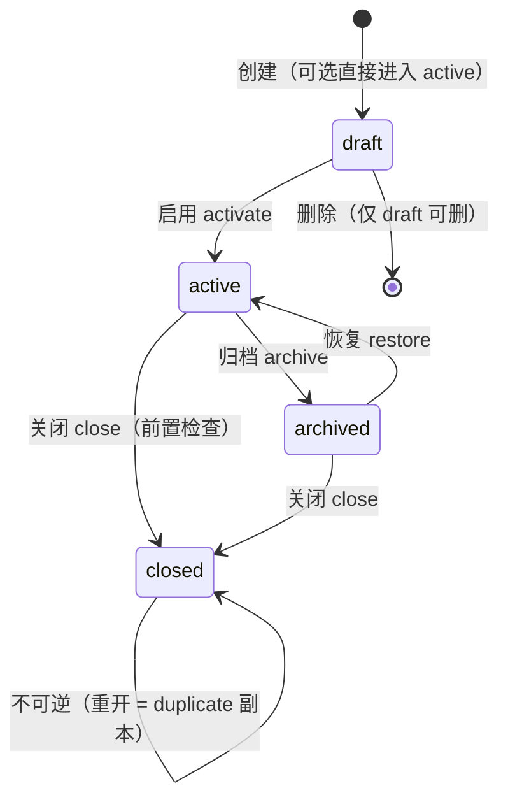
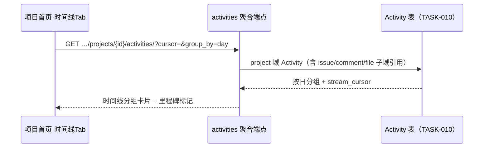

# 项目生命周期与动态时间线

| 元信息项 | 内容 |
| --- | --- |
| 文档编号 | PROJ-003 |
| 所属迭代 | Sprint 5 — 集成 + 标准版收尾（第 7 周） |
| 优先级 | P2（标准版完整级） |
| 所属模块 | M3-PROJ｜项目管理 |
| 文档状态 | 待评审（Draft） |
| 最后更新日期 | 2026-09-01 |
| 上游依赖 | `PROJ-002`（归档动作 + `PERM_PROJECT_ARCHIVED` 通用守卫）、`TASK-010`+`COLLAB-003`（Activity 管道与 `stream_cursor` 端点——时间线直接消费）、`TEAM-003`（全局模板下发机制衔接） |
| 下游消费 | `PROJ-004`（P3 项目集复用模板机制与生命周期守卫）、`RPT-002`（归档态统计只读）、`AUTH-010`（P3 审计消费生命周期事件） |
| 上游依据 | `docs/需求文档.md` §3.2（项目生命周期 / 项目动态 / 项目模板）、§8.2 项目管理 P2 列 |
| 关联架构文档 | [`api-conventions.md`](../architecture/api-conventions.md)（幂等动作端点 / 错误码 / 信封）、[`rbac-permission-model.md`](../architecture/rbac-permission-model.md)（PROJ_ADMIN 权限码） |
| 对标基线 | Plane Project（状态 archived 单态 + 时间线） · Ones 项目全生命周期（四态 + 模板中心） |
| 工作量估算 | 后端 2.5 人日 / 前端 2 人日 / 联调与测试 1 人日，合计 **5.5 人日** |

---

## 1. 概述

### 1.1 功能定位

`PROJ-002` 交付了项目的「生」（创建）与「埋」（归档动作），`PROJ-003` 补齐完整生命周期：**draft（草稿）→ active（进行中）→ archived（已归档）→ closed（已关闭）** 四态机 + 每态读写守卫矩阵，并把项目动态从产品角落升级为**时间线产品**（项目首页默认视图），最后交付**项目模板**——一键实例化「状态 / 标签 / 自定义字段 / 文件目录」四件套。

三条主线共同回答一个问题：项目作为容器，它的「生与死」和「发生过什么」应当和任务一样是一等公民。

### 1.2 关键约定

| 约定 | 内容 |
| --- | --- |
| 四态语义 | `draft` 筹备期（对外不可见、可改一切）→ `active` 正式运行 → `archived` 只读保留（`PROJ-002` 语义）→ `closed` 终态（彻底冻结，重开 = 新建副本） |
| 守卫单入口 | 一切状态转换走 `ProjectLifecycleService.transition()`，禁止任何 View 直改 `status` 字段（BR-01 红线，CI 守护） |
| archived 可逆 / closed 不可逆 | archived ↔ active 自由往返；closed 是单向门（BR-05） |
| 时间线 = Activity 消费 | 零新数据源：复用 `TASK-010` 管道 + `COLLAB-003` 分组聚合端点，本迭代只做项目域事件补全与 UI 产品化 |
| 模板零任务拷贝 | 模板实例化只带「配置四件套」，**不拷贝任务**（任务拷贝归 `TASK-009` 任务级复制，语义不同） |

### 1.3 交付内容

| # | 能力 | 说明 |
| --- | --- | --- |
| 1 | 四态状态机 | `Project.status` 枚举扩展（既有 `active/archived` 加 `draft/closed`）+ 转换守卫矩阵 + 各态写保护 |
| 2 | 生命周期 API | `transition/` 幂等动作端点 + 状态历史查询 |
| 3 | 项目时间线 | 项目首页默认 Tab：动态流（分组聚合）+ 里程碑事件高亮（创建/发布/归档/状态变更） |
| 4 | 项目模板 | `ProjectTemplate` CRUD + 实例化端点 + 三套内置模板（软件研发 / 市场活动 / 通用协作） |
| 5 | 关闭决策向导 | closed 前置检查（开放任务计数）+ 「新建副本重开」路径 |

### 1.4 范围边界

| 能力 | 本文档（P2） | 归属 |
| --- | --- | --- |
| 四态机 + 守卫 + 历史 | ✅ | — |
| 项目时间线（Activity 消费） | ✅ | — |
| 项目模板（四件套实例化 + 3 内置） | ✅ | — |
| 项目集 / 跨项目组合 | ❌ | P3 `PROJ-004` |
| 归档合规留存 / 法务保留 | ❌ | P4 `FILE-006` |
| 模板市场 / 组织下发锁定 | ❌ | P3（`TEAM-003` 全局模板先行，组织级下发归 Sprint 8 治理） |
| 任务随模板拷贝 | ❌ | `TASK-009`（任务级复制） |
| 项目级 SLA / 自动关闭 | ❌ | P4 评估 |

### 1.5 前置依赖

| 依赖 | 内容 | 阻塞原因 |
| --- | --- | --- |
| `PROJ-002` | `archive/` 幂等动作、`PERM_PROJECT_ARCHIVED` 写保护中间件 | archived 态守卫直接复用 |
| `TASK-010` | Activity 管道（`project` 域事件类型） | 生命周期事件与时间线数据源 |
| `COLLAB-003` | `stream_cursor` 聚合动态端点 | 时间线 UI 消费契约 |
| `TASK-008` | `CustomFieldDefinition` | 模板四件套之一（字段定义拷贝） |

### 1.6 竞品参考

| 竞品 | 参考点 | 处置 |
| --- | --- | --- |
| Plane | Project 仅 `archived_at` 单态 + 项目动态页 | 升级四态机；时间线 UI 对齐其分组动态流 |
| Ones | 项目全生命周期（未开始/进行/已完成/已关闭）+ 模板中心 | 四态语义对齐但命名映射到我方 draft/active/archived/closed；模板「配置四件套」对齐 Ones 模板实例化范围 |

---

## 2. 业务逻辑

### 2.1 四态状态机



| 状态 | 列表/看板/甘特 | 任务写操作 | 设置变更 | 成员变更 | 语义 |
| --- | --- | --- | --- | --- | --- |
| `draft` | 仅创建者与管理员可见 | ✅（筹备任务） | ✅ | ✅ | 筹备期，不产生通知与 Webhook |
| `active` | 全员正常 | ✅ | ✅ | ✅ | 正式运行 |
| `archived` | 只读可见（灰标） | ❌ `PERM_PROJECT_ARCHIVED` | ❌（除恢复） | ❌ | `PROJ-002` 语义原样 |
| `closed` | 只读可见（锁标） | ❌ | ❌ | ❌ | 终态；统计保留；不可恢复 |

### 2.2 转换守卫矩阵（`TRANSITION_GUARDS`）

| 转换 | 权限 | 前置守卫 | 副作用（同事务） |
| --- | --- | --- | --- |
| draft → active | PROJ_ADMIN+ | 至少有 1 个状态（State）；identifier 未与其他 active 项目冲突复检 | 写 Activity；扇出 `project.activated` Webhook；成员「项目已启用」通知 |
| active → archived | PROJ_ADMIN+ | 无（`PROJ-002` 语义：允许带开放任务归档，二次确认即可） | Activity + `project.archived` + 看板/甘特写保护中间件生效 |
| archived → active | PROJ_ADMIN+ | 工作空间未归档（`TEAM-003`） | Activity + `project.restored` |
| active/archived → closed | PROJ_ADMIN+ | **开放任务计数 = 0 或显式 `force=true`**（force 时开放任务自动迁入「已取消」默认态并逐条写 Activity，actor=操作者） | Activity + `project.closed`；API Key / Webhook 端点保留但停扇出；GitHub 绑定解除（`INTG-001`） |
| 任意 → deleted | PROJ_ADMIN+（仅 draft） | 仅 draft 态可物理删除 | 级联软删（同 `PROJ-002` 删除语义） |

> closed 不可逆：无 `closed → *` 边。要「重开」= `POST …/duplicate/` 生成 draft 副本（§2.5），原 closed 项目作为历史保留。这是与「误归档可恢复」的关键语义差。

### 2.3 项目时间线



| 要素 | 规格 |
| --- | --- |
| 数据源 | `COLLAB-003` 端点，`scope=project`；含任务创建/状态变更/评论数聚合/成员进出/生命周期事件 |
| 分组 | 按日分组卡片（「9 月 7 日 · 23 项动态」），日内按任务再聚合（同任务多变更折叠为一条可展开） |
| 里程碑高亮 | `project.created/activated/archived/closed`、状态组首次进入 completed、Cycle 结束（P3 预留）渲染为时间线「菱形节点」 |
| 过滤 | 按事件族（任务/评论/成员/文件/生命周期）多选；按成员单选 |
| 游标 | `stream_cursor`（`COLLAB-003` 契约）向上翻历史；新动态轮询 60s + 手动刷新 |

### 2.4 业务规则汇总

| 编号 | 规则 | 说明 / 验收点 |
| --- | --- | --- |
| BR-01 | 状态迁移唯一入口 `ProjectLifecycleService.transition()`；View 直改 `status` 即 CI 失败 | AST 检查 |
| BR-02 | 转换幂等：对已在目标态的项目重复请求返回 200 + 当前快照，不产生重复 Activity | IT 守护 |
| BR-03 | draft 项目不产生任何对外信号（通知 / Webhook / 集成同步 / 统计计入） | 通知面收口 |
| BR-04 | draft 仅创建者 + WS_ADMIN 可见；不计入成员「我的项目」列表 | 行级过滤扩展 |
| BR-05 | closed 单向门：无恢复边；重开仅 `duplicate/` 副本路径 | 状态机测试 |
| BR-06 | closed 前置：开放任务 > 0 且未 `force=true` → `409 RESOURCE_STATE_INVALID` + 开放计数与跳转链接 | 决策向导数据源 |
| BR-07 | force 关闭：开放任务批量迁「已取消」默认态，逐条 Activity（actor=操作者，verb=`bulk_cancelled_by_close`），单事务 | 事务测试 |
| BR-08 | 生命周期事件全部写 Activity（project 域）并扇出 Webhook（`INTG-002` `project.*` 族） | 管道复用 |
| BR-09 | 模板实例化幂等：同 `Idempotency-Key` 重复提交返回首个项目 | 通用幂等中间件 |
| BR-10 | 内置模板不可改不可删（`is_builtin=true`）；自定义模板 WS_ADMIN 管理 | 权限矩阵 |
| BR-11 | 模板实例化四件套按序创建：状态 → 标签 → 字段定义 → 文件目录；任一步失败整体回滚 | 单事务 |
| BR-12 | 时间线不展示 draft 项目动态（BR-03 延伸）；archived/closed 项目时间线只读可看 | 历史保留 |
| BR-13 | 状态历史：`ProjectStatusLog` 只增不改，含 operator/from/to/reason/at | 审计面 |
| BR-14 | identifier 冲突复检：draft→active 时复查（draft 期间他人可能占用） | 竞态测试 |

### 2.5 关闭决策向导与副本重开

- **向导**：`close` 前置检查发现开放任务 N>0 时，前端弹决策向导：① 先去处理（跳预过滤列表）② 强制关闭（明示 N 个任务将批量取消，输入项目名确认）；
- **副本重开**：`POST …/closed/{id}/duplicate/` → 新 draft 项目：复制四件套 + 成员 +（可选勾选）任务为未开始态副本（走 `TASK-009` 复制服务）；原项目 Activity 不迁移，描述首行自动附「本项目为 XXX 的副本（原项目已关闭）」。

### 2.6 异常处理

| 场景 | 处理 |
| --- | --- |
| 非法转换边（draft→archived） | `400 VALIDATION_ERROR`（details.status，附当前态与合法目标集） |
| 无权限 | `403 PERM_PROJECT_ADMIN_REQUIRED` |
| closed 后任何写请求 | `403 PERM_PROJECT_CLOSED`（新错误码注册入 `api-conventions.md` §8 PERM 族） |
| close 开放任务拦截 | `409 RESOURCE_STATE_INVALID` + `{open_count, list_url}` |
| 模板不存在 / 跨空间引用 | `404 RESOURCE_NOT_FOUND` |
| 实例化中途失败 | 整体回滚 + `500 SERVER_ERROR`；Sentry 采样含模板 id |

### 2.7 边界条件

| # | 边界 | 行为 |
| --- | --- | --- |
| 1 | 重复激活 | 幂等 200（BR-02），无重复通知 |
| 2 | archived 项目再归档 | 幂等 200 |
| 3 | draft 中 identifier 被占用 | BR-14 复检拦截，提示改 identifier |
| 4 | force 关闭含子任务树 | 批量取消覆盖整树（含子任务），每树一条聚合 Activity + 逐任务引用 |
| 5 | 关闭时有在途 Webhook 重试 | Delivery 继续至天然终态（接收方语义不变）；不再产生新事件 |
| 6 | 时间线 0 动态 | 空态：「项目还没有动态」+ 创建时间里程碑节点（总有 ≥1 节点） |
| 7 | 模板含已删除自定义字段引用 | 模板保存快照式定义（非引用），源字段删除不影响模板 |
| 8 | 内置模板升级（新版本系统） | 已实例化项目不受影响（快照语义） |
| 9 | draft 超 90 天未激活 | 不自动处理（P4 评估清理策略）；列表标「草稿」 |
| 10 | duplicate 副本 identifier | 自动 `-copy` 后缀，冲突再 `-2` 递增 |

---

## 3. UI/UX 设计

### 3.1 项目首页（时间线为默认 Tab）

```
┌──────────────────────────────────────────────────────────────────┐
│ Phoenix · PHX          [时间线] [看板] [列表] [甘特] [统计] [设置] │
├──────────────────────────────────────────────────────────────────┤
│ 动态筛选: [全部▾] [成员: 全部▾]                       🔄 60s 自动  │
│ ┌─ ◆ 里程碑 ─────────────────────────────────────────────────┐   │
│ │ ◆ 9月5日 · 项目启用 · 由 张三                               │   │
│ └─────────────────────────────────────────────────────────────┘   │
│ ┌─ 9月7日 · 23 项动态 ───────────────────────────────────────┐   │
│ │ ● 李四 完成「登录页验证码修复」等 3 个任务          [展开]   │   │
│ │ ● 王五 创建「支付回调重试」                                  │   │
│ │ ● 张三 在「订单超时」下评论 2 条                      [展开] │   │
│ │ ● 新成员 赵六 加入项目                                       │   │
│ └─────────────────────────────────────────────────────────────┘   │
│ ┌─ 9月6日 · 41 项动态 ───────────────────────────────────────┐   │
│ │ …                                    [加载更早动态]          │   │
│ └─────────────────────────────────────────────────────────────┘   │
└──────────────────────────────────────────────────────────────────┘
```

### 3.2 生命周期操作入口（项目设置 → 常规）

```
┌─ 项目状态 ──────────────────────────────────────────────┐
│ 当前状态: ● 进行中（active）                              │
│ ┌─────────────────────────────────────────────────────┐ │
│ │ [归档项目]  归档后只读，可随时恢复                      │ │
│ │ [关闭项目]  彻底冻结，不可恢复（可创建副本重开）          │ │
│ └─────────────────────────────────────────────────────┘ │
│ 状态历史                                                 │
│  09-05 张三  草稿 → 进行中                                │
│  09-01 系统  创建（草稿）                                 │
└──────────────────────────────────────────────────────────┘
```

关闭决策向导（BR-06 拦截时）：

```
┌─ 关闭项目前请确认 ───────────────────────────┐
│ ⚠ 项目还有 17 个开放任务。                     │
│ ① [去处理任务]（跳转预过滤列表）               │
│ ② 强制关闭：17 个任务将批量标记为已取消         │
│    输入项目名「Phoenix」确认: [________]      │
│                  [取消]  [强制关闭]（禁用态）  │
└───────────────────────────────────────────────┘
```

### 3.3 模板选择与实例化（新建项目流程第一步）

```
┌─ 新建项目 ─────────────────────────────────────────────┐
│ ① 选择模板                                              │
│ ┌─────────┐ ┌─────────┐ ┌─────────┐ ┌─────────┐         │
│ │ 空白项目 │ │ 软件研发 │ │ 市场活动 │ │ 通用协作 │  [内置] │
│ │  5 状态  │ │ 7 状态  │ │ 5 状态  │ │ 5 状态  │         │
│ │  4 标签  │ │ 8 标签  │ │ 6 标签  │ │ 4 标签  │         │
│ └─────────┘ └─────────┘ └─────────┘ └─────────┘         │
│ 自定义模板: [选择…▾]                      [管理模板]      │
│ ② 基本信息（名称/标识/可见性）→ ③ 创建                   │
└──────────────────────────────────────────────────────────┘
```

### 3.4 空状态 / 加载 / 失败

| 场景 | 展示 |
| --- | --- |
| 时间线 0 动态 | 空态文案 + 创建里程碑节点（边界 #6） |
| 模板加载中 | 模板卡片骨架 ×4 |
| 实例化失败 | Toast + 保留表单已填内容，可重试（幂等键复用） |
| closed 项目访问 | 全站锁标横幅「项目已关闭 · 只读」+ [创建副本重开] |

### 3.5 响应式与无障碍

- 时间线移动端单列、分组卡片间距压缩；里程碑节点保留左侧菱形锚点；
- 状态徽章四态四色四图标（draft 铅笔灰 / active 绿点 / archived 灰盒 / closed 锁），附文字不单独依赖色；
- 向导确认输入框 `aria-describedby` 绑定风险提示；模板卡片 `role="radio"` 组键盘可选。

---

## 4. 技术架构

### 4.1 数据模型

`Project.status` 扩展为四态枚举（既有列改 choices，数据零迁移——存量全为 active/archived，语义保留）；新增两张表：

```python
class ProjectStatusLog(BaseModel):
    """生命周期只增日志（BR-13）。任何 transition 写一行，永不更新。"""

    id = models.UUIDField(primary_key=True, default=uuid.uuid4, editable=False)
    project = models.ForeignKey("db.Project", on_delete=models.CASCADE, related_name="status_logs")
    from_status = models.CharField(max_length=16)          # '' 表示创建
    to_status = models.CharField(max_length=16)
    operator = models.ForeignKey("db.User", on_delete=models.SET_NULL, null=True, related_name="+")
    reason = models.CharField(max_length=512, blank=True, default="")   # force 关闭时必填
    meta = models.JSONField(default=dict)                  # {open_count, forced, affected_issue_ids}

    class Meta:
        db_table = "project_status_logs"
        indexes = [models.Index(fields=["project", "-created_at"], name="idx_projstatuslog_time")]


class ProjectTemplate(BaseModel):
    """项目模板：配置四件套快照（非引用，边界 #7）。内置 3 套 + 工作空间自定义。"""

    id = models.UUIDField(primary_key=True, default=uuid.uuid4, editable=False)
    workspace = models.ForeignKey("db.Workspace", on_delete=models.CASCADE,
                                  related_name="project_templates", null=True)  # null=内置
    name = models.CharField(max_length=128)
    description = models.CharField(max_length=512, blank=True, default="")
    is_builtin = models.BooleanField(default=False)
    states_snapshot = models.JSONField()                   # [{name, group, color, sequence}]
    labels_snapshot = models.JSONField(default=list)       # [{name, color}]
    fields_snapshot = models.JSONField(default=list)       # [CustomFieldDefinition 快照 dict]
    folders_snapshot = models.JSONField(default=list)      # [{name, parent_path}]（FILE-002 目录树）
    created_by = models.ForeignKey("db.User", on_delete=models.SET_NULL, null=True, related_name="+")

    class Meta:
        db_table = "project_templates"
        constraints = [
            models.UniqueConstraint(fields=["workspace", "name"], name="uniq_projtpl_ws_name",
                                    condition=Q(is_builtin=False)),
        ]
```

**迁移要点**：① `Project.status` choices 扩枚举（无 DDL 变更，`CharField` 原值兼容）；② 两新表；③ 数据迁移写入 3 套内置模板（`is_builtin=true, workspace=null`）；④ 存量项目补 `ProjectStatusLog` 首行（`from='' to=当前态 operator=null`）。

### 4.2 API 定义

#### 4.2.1 状态转换 `POST /api/v1/workspaces/{slug}/projects/{id}/transition/`

请求：

```json
{"to_status": "closed", "force": true, "reason": "季度收尾，剩余需求迁移至 Falcon 项目"}
```

成功 `200`：

```json
{
  "status": "success",
  "data": {
    "id": "01J8KP2P9R0S1T2U3V4W5X6Y7Z",
    "status": "closed",
    "transitioned_at": "2026-09-07T08:14:22.013Z",
    "affected_issues": 17
  },
  "meta": {"request_id": "01J9XY4PQ2R3S4T5U6V7W8X9Y0"}
}
```

错误（开放任务拦截，BR-06）`409`：

```json
{
  "status": "error",
  "error": {
    "code": "RESOURCE_STATE_INVALID",
    "message": "Project has open issues",
    "fields": {"status": ["17 open issues; pass force=true to cancel them in bulk"]},
    "detail": {"open_count": 17, "list_url": "/acme/projects/01J8KP2P…/issues?state_group=unstarted,started"}
  },
  "meta": {"request_id": "01J9XY5RS3T4U5V6W7X8Y9Z0A1"}
}
```

非法转换边 `400 VALIDATION_ERROR`：`details.status=["cannot transition from draft to archived; allowed: active"]`；幂等（已在目标态）`200` + 当前快照（BR-02）。

#### 4.2.2 状态历史 `GET …/projects/{id}/status-logs/`

`data[]`（游标分页）：`{from_status, to_status, operator{display_name}, reason, meta, created_at}`——设置页「状态历史」区块数据源。

#### 4.2.3 时间线 `GET …/projects/{id}/activities/?group_by=day&filter=issues,members&cursor=`

契约沿用 `COLLAB-003`（信封 + `stream_cursor` + 分组聚合结构），本迭代增量：`filter` 支持 `lifecycle` 族；里程碑事件 `milestone=true` 标记位。

#### 4.2.4 模板 CRUD `GET/POST …/workspaces/{slug}/project-templates/`、`PATCH/DELETE …/{id}/`

列表返回内置（`workspace=null`）+ 本空间自定义合并集；`POST …/from-project/`（以现有项目为蓝本另存模板，WS_ADMIN）：

```json
{"project_id": "01J8KP2P9R0S1T2U3V4W5X6Y7Z", "name": "研发标准流程 v2"}
```

#### 4.2.5 实例化 `POST …/workspaces/{slug}/projects/`（创建端点扩展）

请求体新增可选 `template_id`；服务端在创建事务内按 BR-11 顺序落四件套。带 `Idempotency-Key` 头（BR-09）。成功响应 `data.template_applied=true` 及四件套计数摘要。

#### 4.2.6 副本重开 `POST …/projects/{id}/duplicate/`

仅 closed 源项目可调用；`{include_issues: bool}`；返回新 draft 项目（BR 边界 #10 命名规则）。

### 4.3 核心逻辑

#### 4.3.1 `ProjectLifecycleService`（BR-01 唯一入口）

```python
TRANSITIONS: dict[tuple[str, str], TransitionDef] = {
    ("draft", "active"):    TransitionDef(guards=[has_states, identifier_free], notify=True),
    ("active", "archived"): TransitionDef(guards=[]),
    ("archived", "active"): TransitionDef(guards=[workspace_active]),
    ("active", "closed"):   TransitionDef(guards=[open_issues_gate], terminal=True),
    ("archived", "closed"): TransitionDef(guards=[open_issues_gate], terminal=True),
}

class ProjectLifecycleService:
    @transaction.atomic
    def transition(self, project: Project, to_status: str, *, actor: User,
                   force: bool = False, reason: str = "") -> Project:
        project = Project.objects.select_for_update().get(pk=project.pk)   # 行锁防并发双迁
        key = (project.status, to_status)
        if project.status == to_status:
            return project                                               # BR-02 幂等
        tdef = TRANSITIONS.get(key)
        if tdef is None:
            raise ValidationError({"status": [f"cannot transition from {project.status} "
                                              f"to {to_status}; allowed: {self._allowed(project)}"]})
        for guard in tdef.guards:
            guard(project, force=force)                                  # 抛 ValidationError/Conflict
        affected = 0
        if to_status == "closed" and force:
            affected = self._bulk_cancel_open_issues(project, actor)     # BR-07
        project.status = to_status
        project.save(update_fields=["status", "updated_at"])
        ProjectStatusLog.objects.create(project=project, from_status=key[0], to_status=to_status,
                                        operator=actor, reason=reason,
                                        meta={"forced": force, "affected_issues": affected})
        if tdef.notify:
            transaction.on_commit(lambda: notify_project_active.delay(str(project.pk)))
        record_activity.delay(str(project.pk), f"project.{ACTIVITY_VERB[to_status]}",
                              actor_id=str(actor.pk))                    # BR-08 管道
        if to_status == "closed":
            transaction.on_commit(lambda: unbind_integrations.delay(str(project.pk)))
        return project
```

#### 4.3.2 模板实例化（创建端点内嵌）

```python
def apply_template(project: Project, tpl: ProjectTemplate, *, actor: User) -> dict:
    counts = {}
    with transaction.atomic():                                # BR-11 单事务
        state_ids = State.objects.bulk_create([
            State(project=project, workspace=project.workspace, **s) for s in tpl.states_snapshot])
        counts["states"] = len(state_ids)
        project.default_state = state_ids[0]; project.save(update_fields=["default_state"])
        counts["labels"] = len(Label.objects.bulk_create([
            Label(project=project, **l) for l in tpl.labels_snapshot]))
        counts["fields"] = len(CustomFieldDefinition.objects.bulk_create([
            CustomFieldDefinition(project=project, **f) for f in tpl.fields_snapshot]))
        counts["folders"] = FileFolder.objects.build_tree(project, tpl.folders_snapshot)  # FILE-002
    return counts
```

#### 4.3.3 closed 写保护中间件扩展

`PROJ-002` 的 `PERM_PROJECT_ARCHIVED` 守卫扩展为状态查表：`READ_ONLY_STATUS = {"archived": "PERM_PROJECT_ARCHIVED", "closed": "PERM_PROJECT_CLOSED"}`——错误码按态精确返回（BR 与 §2.6 对齐）。

### 4.4 前端实现

```typescript
// stores/project-lifecycle.store.ts
export class ProjectLifecycleStore {
  statusLogs: IProjectStatusLog[] = [];
  async transition(projectId: string, to: ProjectStatus, opts: {force?: boolean; reason?: string}) {
    try {
      return await projectService.transition(this.root.workspaceSlug, projectId, { to_status: to, ...opts });
    } catch (e) {
      if (isOpenIssuesConflict(e)) return { blocked: true, openCount: e.error.detail.open_count,
                                           listUrl: e.error.detail.list_url };   // 向导数据源
      throw e;
    }
  }
}
```

| 组件 | 要点 |
| --- | --- |
| `ProjectTimeline` | 日分组卡片；`stream_cursor` 向上翻页；60s 轮询新动态；里程碑菱形节点组件 `MilestoneNode` |
| `TransitionMenu` | 按当前态渲染合法动作（draft: 启用/删除；active: 归档/关闭；archived: 恢复/关闭；closed: 创建副本） |
| `CloseWizard` | 两选项卡片；强制路径需输入项目名精确匹配（受控输入，匹配前按钮禁用） |
| `TemplateGallery` | 内置/自定义分组；四件套摘要 chips；「以该项目另存为模板」入口 |
| `StatusBadge` | 四态四色四图标（§3.5），全局复用（列表/卡片/面包屑） |

---

## 5. 测试用例

### 5.1 单元测试

| 编号 | 用例 | 断言 |
| --- | --- | --- |
| UT-01 | 全部合法边 | 5 条边逐一 transition 成功，`ProjectStatusLog` 行正确 |
| UT-02 | 全部非法边 | draft→archived、closed→active 等 6 条全部 400 `VALIDATION_ERROR` 且附合法目标集 |
| UT-03 | 幂等 | 重复 activate 返回 200，Log 不增行，通知不发 |
| UT-04 | 行锁并发 | 两并发 transition 同项目，一成功一按最新态重新判定 |
| UT-05 | draft 无状态集激活 | guard 拦截 400 `VALIDATION_ERROR`（has_states） |
| UT-06 | identifier 冲突复检 | draft 期间他项目占用同 identifier → activate 400 `VALIDATION_ERROR` |
| UT-07 | close 开放任务拦截 | 3 开放任务 + force=false → 409 + open_count=3 |
| UT-08 | force 批量取消 | 3 开放任务（含 1 棵子任务树）全部入已取消态，逐条 Activity，单事务（中途注入异常全回滚） |
| UT-09 | closed 写保护 | closed 项目 PATCH 任务 → 403 `PERM_PROJECT_CLOSED`；GET 200 |
| UT-10 | draft 对外不可见 | 普通成员列表不含 draft；直访 URL 404 |
| UT-11 | 模板实例化顺序 | mock 记录四件套创建顺序 states→labels→fields→folders |
| UT-12 | 实例化回滚 | fields 步注入异常 → 四件套全回滚，项目创建失败 |
| UT-13 | 内置模板保护 | PATCH/DELETE 内置模板 → 403 |
| UT-14 | 快照语义 | 源项目字段定义删除后，以其保存的模板实例化仍含该字段 |
| UT-15 | duplicate 命名 | `-copy` / `-copy-2` 递增正确 |
| UT-16 | 时间线里程碑标记 | lifecycle 事件 `milestone=true`；普通事件无标记 |
| UT-17 | draft 无对外信号 | draft 期间任务变更无 Webhook 扇出、无通知（BR-03） |
| UT-18 | 时间线过滤族 | `filter=lifecycle` 仅返回生命周期事件 |

### 5.2 集成测试

| 编号 | 用例 | 断言 |
| --- | --- | --- |
| IT-01 | 全生命周期链 | draft→active→archived→active→closed 每步 Log + Activity + Webhook 事件齐 |
| IT-02 | force 关闭联动 | 开放任务取消 Activity actor=操作者；GitHub 绑定解除任务入队；Webhook 端点停扇出 |
| IT-03 | 模板端到端 | 内置「软件研发」实例化：7 状态（含默认态）/8 标签/字段/目录树与快照一致 |
| IT-04 | 幂等键 | 同 Idempotency-Key 重复实例化返回首个项目，四件套不翻倍 |
| IT-05 | from-project 另存 | 模板四件套快照与源项目一致；源后续变更不影响模板 |
| IT-06 | duplicate 重开 | closed→draft 副本：四件套+成员一致，任务副本未开始态，原项目不动 |
| IT-07 | 时间线消费 | COLLAB-003 契约兼容：游标翻页稳定，分组聚合与逐条计数一致 |
| IT-08 | 工作空间归档联动 | WS 归档时 archived→active 被 `workspace_active` guard 拦截 |

### 5.3 E2E 测试

| 编号 | 场景 |
| --- | --- |
| E2E-01 | 模板建站：选「软件研发」→ 填信息 → 创建 → 看板出现 7 列 + 标签/字段就位 |
| E2E-02 | 时间线浏览：首屏日分组卡片 + 里程碑菱形；[加载更早] 翻页；筛选「生命周期」仅见 ◆ 节点 |
| E2E-03 | 关闭向导：close 被拦截 → 向导显示 17 开放 → [去处理] 跳预过滤列表 |
| E2E-04 | 强制关闭：输入项目名 → 17 任务批量取消 → 项目锁标横幅 → [创建副本重开] 出新 draft |
| E2E-05 | draft 流程：创建草稿 → 他人不可见 → 启用 → 成员收到通知 |
| E2E-06 | 状态历史：设置页历史区块逐行对应操作 |

---

## 6. 竞品深度对标

### 6.1 Plane 实现分析

| 代码路径（`plane/plane`） | 行为 | 本系统借鉴 / 改进 |
| --- | --- | --- |
| `apiserver/plane/db/models/project.py` | 仅 `archived_at` 时间戳表达归档 | 升级四态机 + 守卫矩阵 + 只增 Log——Plane 无 draft/closed 概念，生命周期事故（误归档即死）无分层 |
| `apiserver/plane/app/views/project.py` `archive` | View 内直改字段 | 本系统 BR-01 强制 Service 单入口 + CI AST 守护，杜绝绕过守卫的旁路 |
| `web/core/components/project/activity/` | 项目动态页平铺 Activity | 时间线产品化：日分组 + 任务折叠 + 里程碑菱形（信息密度与仪式感分层） |
| 无模板能力 | — | `ProjectTemplate` 快照式设计为原创增量（对齐 Ones 而非 Plane） |

### 6.2 Ones 实现分析

| 能力 | Ones 做法 | 本系统决策 |
| --- | --- | --- |
| 生命周期 | 未开始/进行/已完成/已关闭四态，「已完成」与「已关闭」分态 | 合并为 closed 终态 + archived 可逆层——五态机转换面爆炸且用户分不清「完成/关闭」，四态是可教性最优 |
| 模板中心 | 模板含流程/字段/视图/权限全量 | P2 收敛四件套（状态/标签/字段/目录）；视图归 `BOARD-003` IssueView 体系、权限归 RBAC——模板不绑视图与权限，避免跨体系耦合 |
| 关闭处理 | 关闭强制清空未完成 | 本系统 force 批量取消 + 逐条 Activity 留痕，比「静默清空」可审计 |

### 6.3 本系统设计决策

| 决策 | 理由 |
| --- | --- |
| closed 单向门 + duplicate 副本 | 「恢复」语义对终态是谎言（期间数据已分叉）；副本路径明示新起点，历史留原项目 |
| 模板快照而非引用 | 源变更不应追溯影响模板与已建站项目；代价是模板升级不回流（边界 #8 明示接受） |
| draft 零对外信号 | 筹备期噪音是真实事故（未就绪项目触发 CI/Webhook/通知）；BR-03 收口所有信号面 |
| force 关闭逐条 Activity | 批量操作也必须可审计到单任务（TASK-009 批量纪律延伸） |
| 时间线纯消费零新管道 | TASK-010/COLLAB-003 已验证的管道不再分叉；本迭代只做事件补全 + UI 产品化 |

---

## 7. 里程碑与验收

### 7.1 交付物清单

| 类别 | 交付物 |
| --- | --- |
| Model / Migration | `Project.status` 四态扩展、`project_status_logs`、`project_templates`、3 套内置模板数据迁移 |
| 后端 | `ProjectLifecycleService`（守卫矩阵 + 行锁 + 幂等）、模板实例化服务、duplicate 服务、closed 写保护扩展、时间线 `filter=lifecycle` 增量 |
| 前端 | 项目首页时间线 Tab、`TransitionMenu`、`CloseWizard`、`TemplateGallery`、`StatusBadge` |
| 测试 | UT-01~18、IT-01~08、E2E-01~06 |
| 错误码 | `PERM_PROJECT_CLOSED` 注册入 `api-conventions.md` §8 |

### 7.2 可操作演示的验收标准

1. 四态全链演示：draft（他人不可见、零信号）→ active（通知 + Webhook）→ archived（写保护 403）→ active（恢复）→ closed（force 批量取消留痕）；每步 `ProjectStatusLog` 与 Activity 齐整。
2. 守卫验证：非法边 400 `VALIDATION_ERROR` 附合法集；并发双迁只生效一次；重复激活幂等无重复通知。
3. 模板：内置「软件研发」一键建站（7 状态/8 标签/字段/目录就位）；自定义模板「以现有项目另存」后源变更不影响模板；实例化失败整体回滚。
4. closed 项目：全站锁标只读；任何写请求 403 `PERM_PROJECT_CLOSED`；[创建副本重开] 生成 draft 副本且原项目历史完整。
5. 时间线：日分组 + 任务折叠 + 里程碑菱形渲染正确；`filter=lifecycle` 纯净；游标翻页与逐条计数一致。
6. 回归：`PROJ-002` 归档语义、`COLLAB-003` 动态流、`TASK-009` 复制服务全部无回归；新端点通过 `api-conventions.md` §14 检查清单。

---
