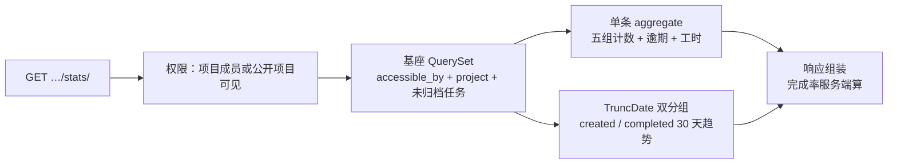
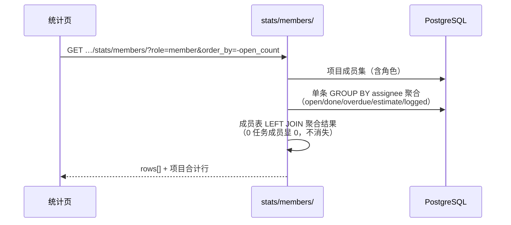

# 项目进度与成员任务量统计

| 元信息项 | 内容 |
| --- | --- |
| 文档编号 | RPT-002 |
| 所属迭代 | Sprint 5 — 集成 + 标准版收尾（第 7 周） |
| 优先级 | P2（标准版完整级） |
| 所属模块 | M10-RPT｜数据报表 |
| 文档状态 | 待评审（Draft） |
| 最后更新日期 | 2026-09-01 |
| 上游依赖 | **`RPT-001`（`PersonalStatsService` 聚合框架——本文档换 project 维度复用，不重建口径）**、`unified-issue-model.md`（`state.group` 五语义组 / `target_date` / `completed_at`）、`TASK-006`（`estimate_minutes` / `WorkLog.minutes`）、`rbac-permission-model.md`（`accessible_by` 行级基座） |
| 下游消费 | `RPT-003/004`（P3 敏捷报表与健康度复用本聚合范式 + 项目维度 Service）、`TASK-013`（P3 团队工时统计复用成员维度口径）、`GANTT-002`（逾期汇总端点共享口径基座） |
| 上游依据 | `docs/需求文档.md` §3.7（项目进度统计 / 成员任务量统计）、§8.2 数据报表 P2 列 |
| 关联架构文档 | [`api-conventions.md`](../architecture/api-conventions.md)（信封 / 错误码 / 限流分组）、[`unified-issue-model.md`](../architecture/unified-issue-model.md)（状态语义组与索引） |
| 对标基线 | Plane Analytics（项目维度卡片 + 成员分组表） · Ones 项目报表（进度 + 成员负载双视图） |
| 工作量估算 | 后端 2 人日 / 前端 2 人日 / 联调与测试 1 人日，合计 **5 人日** |

---

## 1. 概述

### 1.1 功能定位

RPT-001 回答「**我**还有多少事」，RPT-002 回答「**这个项目**走到哪里了、**每个人**背了多少活」。两个视图共享同一聚合框架——`RPT-001` 确立的「权限过滤 → 维度过滤 → 单条 aggregate → 分组展开」四步范式原样注入，仅把维度从 `assignee=me + 跨项目` 换成 `project=X + 按状态组/按成员`：

- **项目进度统计**：状态组分布（五组计数 + 完成率）、逾期任务数、近 30 天创建/完成趋势、工时燃尽摘要（估算 vs 登记）；
- **成员任务量统计**：按成员分组的 open/done/逾期/工时四列矩阵，支持按角色筛选与排序，点击单元格跳转预过滤任务列表。

**零新表**：全部指标实时聚合（10 万任务 P95 < 200ms 性能门禁，BR-06），不建汇总表——延续 `RPT-001` §4.3「先量测，再优化」纪律，P3 敏捷报表引入时间序列时再评估预聚合。

### 1.2 关键约定：口径单源（BR-01 红线延续）

| 复用点 | 来源 | 约束 |
| --- | --- | --- |
| `state_group` 五组口径 | `unified-issue-model.md` §3 | `unstarted/started/completed/cancelled/backlog`，统计与列表同枚举 |
| 逾期定义 | `RPT-001`：`target_date < today AND state.group NOT IN (completed, cancelled)` | 一字不改 |
| 完成判定 | `completed_at` 服务端置位（`TASK-002`） | 禁止用 `state.group=completed AND updated_at` 近似 |
| 工时口径 | `estimate_minutes`（任务字段）与 `WorkLog.minutes`（登记事实）分列 | 两者永不混算；「剩余」= estimate − Σworklog，下限 0 |
| 权限基座 | `Issue.objects.accessible_by(user).filter(project=…)` | 非项目成员看公开项目也仅见公开口径（BR-02） |

**反面约束**：项目维度统计不得内联复制 `PersonalStatsService` 的任何 Q 表达式——公共口径下沉为 `stats/querysets.py` 的 `issue_stats_base()`，两个 Service 共用（CI 静态检查守护，同 `RPT-001` BR-01）。

### 1.3 交付内容

| # | 能力 | 说明 |
| --- | --- | --- |
| 1 | 项目进度端点 | `GET …/projects/{id}/stats/`：五组计数、完成率、逾期数、30 天趋势、工时摘要 |
| 2 | 成员任务量端点 | `GET …/projects/{id}/stats/members/`：按成员聚合矩阵 + 角色筛选 + 排序 |
| 3 | 项目统计页 | 进度卡条 + 状态分布环图 + 趋势双线图 + 成员矩阵表 |
| 4 | 下钻联动 | 每个数字可点击 → 跳转带预过滤参数的任务列表（口径 = 统计口径） |
| 5 | 空态与权限态 | 无任务空态插画；非成员访问公开项目的降权视图 |

### 1.4 范围边界

| 能力 | 本文档（P2） | 归属 |
| --- | --- | --- |
| 状态组分布 / 完成率 / 逾期 / 30 天趋势 / 工时摘要 | ✅ | — |
| 成员 open/done/逾期/工时矩阵 | ✅ | — |
| 燃尽图 / 迭代速率 / 累积流 | ❌（需 Cycle 与快照） | P3 `RPT-003` |
| 项目健康度评分 / 团队负载热力 | ❌ | P3 `RPT-004` |
| 报表导出（PNG/CSV） | ❌ | P3 `RPT-004` |
| 跨项目组合统计 | ❌ | P3 `PROJ-004` |
| 实时推送刷新 | ❌（手动刷新 + 60s SWR stale） | P3 评估 |

### 1.5 前置依赖

| 依赖 | 内容 | 阻塞原因 |
| --- | --- | --- |
| `RPT-001` | 聚合框架 + `stats/querysets.py` 公共基座落地位 | 口径单源 |
| `TASK-002` | `completed_at` 服务端置位、`estimate_minutes` 列 | 完成与工时口径 |
| `TASK-006` | `WorkLog` 表与 `minutes` 校验 | 登记工时聚合 |
| `TASK-003` | 列表筛选参数语法（`state_group`、`<field>=<v>;after`） | 下钻跳转参数一致性 |

### 1.6 竞品参考

| 竞品 | 参考点 | 处置 |
| --- | --- | --- |
| Plane | `analytics` 端点按 `segment` 分组聚合 + 项目 Insights 页 | 分组思想对齐；Plane 用独立 analytics 服务且口径与列表分离——本系统以 BR-01 共用基座消除双源 |
| Ones | 项目报表「进度 + 成员」双 Tab | 视图结构对齐；Ones 成员表含登录活跃度——本系统 P2 不做（活跃度归 `TEAM-003` 且仅聚合） |

---

## 2. 业务逻辑

### 2.1 项目进度统计管线



| 输出 | 口径 | SQL |
| --- | --- | --- |
| `state_distribution` | `Count("id", filter=Q(state__group=g))` × 5，单条 aggregate | 1 条 |
| `completion_rate` | `completed / (total - cancelled)`，分母 0 → `null`（前端显「—」） | 服务端除法 |
| `overdue_count` | `RPT-001` 逾期口径（§1.2） | 并入同条 aggregate |
| `trend` | 近 30 天 `created_at` / `completed_at` 按日分组双序列，缺日补 0 | 2 条（TruncDate） |
| `worklog_summary` | `Sum(estimate_minutes)` / `Sum(WorkLog.minutes)` / 剩余下限 0 | 2 条（WorkLog 单独 JOIN） |

SQL 预算 ≤ 5 条（权限解析 + aggregate + 双趋势 + 工时），与 `RPT-001` BR-06 同级门禁。

### 2.2 成员任务量统计管线



| 列 | 口径 |
| --- | --- |
| `open_count` | 该成员为 assignee 且 `state.group IN (unstarted, started)` |
| `done_count` | `state.group = completed`（近 30 天，列头明示时间窗） |
| `overdue_count` | §1.2 逾期口径，按成员过滤 |
| `estimate_minutes` / `logged_minutes` | open 任务的估算合计 / 近 30 天登记合计（双列分列，§1.2 纪律） |

多负责人任务（`TASK-007`）：在每名 assignee 行各计 1（列脚注「多人任务按人分摊计数」）；合计行 = 去重任务数（`Count(Distinct)`），故合计 ≤ Σ各行——脚注明示，防误读。

### 2.3 下钻联动

每个统计数字生成等价列表跳转参数（口径严格一致，`TASK-003` 语法）：

| 点击 | 跳转参数 |
| --- | --- |
| 状态组计数（如 started 12） | `?state_group=started&order_by=-updated_at` |
| 逾期数 | `?state_group=unstarted,started&target_date=<today>;before&order_by=target_date` |
| 成员行 open | `?assignee_id=<uid>&state_group=unstarted,started&order_by=target_date` |
| 成员行 done | `?assignee_id=<uid>&state_group=completed&completed_at=<30d_ago>;after` |
| 趋势图某日创建柱 | `?created_at=<day>;on` |

### 2.4 业务规则汇总

| 编号 | 规则 | 说明 / 验收点 |
| --- | --- | --- |
| BR-01 | 公共口径唯一来源 `stats/querysets.py::issue_stats_base()`；两 Service 共用，禁止内联复制 | CI 静态检查（同 RPT-001） |
| BR-02 | 权限：项目成员见全量；非成员访问公开项目仅见「公开口径」（不含成员矩阵——成员名单本身即敏感） | 成员端点对非成员一律 403 |
| BR-03 | 归档任务默认剔除（`archived_at IS NULL`）；URL 加 `include_archived=true` 时计入 | 与 TASK-009 列表语义一致 |
| BR-04 | 完成率分母剔除 cancelled；分母为 0 返回 `null` 而非 0 | 防「0%」误导读数 |
| BR-05 | 时区：趋势「日」界取项目时区（项目设置，默认工作空间时区）；请求可带 `?tz=` 覆盖 | 跨时区团队口径稳定 |
| BR-06 | 性能门禁：10 万任务项目 P95 < 200ms（进度）/ < 300ms（成员 200 行） | IT 压测守护 |
| BR-07 | 成员矩阵默认按 `-open_count` 排序；可切 `name/done/overdue/logged` 升降序 | `order_by` 参数白名单 |
| BR-08 | 角色筛选 `?role=admin,member`（多值逗号）；guest 默认不含（guest 不承担交付责任，可显式 `role=guest` 查看） | 与 TEAM-002 角色枚举一致 |
| BR-09 | 被禁用账号成员仍计入历史聚合（done/logged），但 `open_count` 实时口径不变；行首置「已禁用」灰标 | 与 AUTH-006 启停联动 |
| BR-10 | 数据新鲜度：SWR staleTime 60s + 手动刷新按钮；页脚显示「统计截至 HH:mm」 | 不做实时推送（§1.4） |
| BR-11 | 工时「剩余」下限 0：`max(0, estimate - logged)`；超额部分单独 `overrun_minutes` 字段输出 | 负数不外泄为误导性读数 |
| BR-12 | 趋势窗口固定 30 天（P2 不做自定义窗口）；`?days=7|14|30` 白名单可调 | P3 报表再放开 |

### 2.5 异常处理

| 场景 | 处理 |
| --- | --- |
| 项目不存在 / 无权 | `404 RESOURCE_NOT_FOUND`（存在性隐藏，`api-conventions.md` §8） |
| 非成员访问公开项目进度端点 | 200 降权响应（无 members 字段）；访问 members 端点 403 |
| 项目 0 任务 | 全 0 + `completion_rate=null` + 空态结构完整（前端插画） |
| `order_by` 非白名单 | `400 VALIDATION_ERROR`（fields.order_by） |
| `tz` 非法 IANA 名 | `400 VALIDATION_ERROR`（fields.tz） |
| 聚合超时（>5s statement_timeout） | `500 SERVER_ERROR` + Sentry 采样；前端 Toast「统计暂时不可用」 |

### 2.6 边界条件

| # | 边界 | 行为 |
| --- | --- | --- |
| 1 | 全部任务 cancelled | 完成率 `null`；分布环图全灰「已取消」 |
| 2 | 成员被移出项目但有历史工时 | 成员矩阵以「当前成员 ∪ 近 30 天有工时的前成员」为行集；前成员标「已离开」 |
| 3 | 任务无 assignee | 计入项目合计，不入任何成员行；矩阵末行「未分配」聚合行 |
| 4 | 趋势跨夏令时切换日 | 按项目时区日界分组，25h/23h 日天然正确处理（DB `TruncDate(tz)`) |
| 5 | WorkLog 落在已完成任务 | `logged_minutes` 照计（登记是事实）；不影响 open 口径 |
| 6 | `estimate_minutes` 为 null | 求和时按 0；列头脚注「N 个任务未填估算」 |
| 7 | 项目归档态 | 统计只读可看（历史事实），页头加「项目已归档」横幅 |
| 8 | 单成员项目 | 成员矩阵一行正常渲染；不设最小行数门槛 |

---

## 3. UI/UX 设计

### 3.1 项目统计页（项目内「统计」Tab）

```
┌────────────────────────────────────────────────────────────────────┐
│ 📊 项目统计 · Phoenix                        统计截至 14:32 [刷新]   │
├────────────────────────────────────────────────────────────────────┤
│ 完成率            开放任务          逾期             工时(估/登)      │
│ ┌────────┐       ┌────────┐       ┌────────┐      ┌────────────┐   │
│ │  62%   │       │  143   │       │ 🔴 17  │      │ 1,240h/986h│   │
│ │ ▓▓▓▓▓░░│       │ ↗ +12  │       │ ↘ -3   │      │ 剩余 254h  │   │
│ └────────┘       └────────┘       └────────┘      └────────────┘   │
├────────────────────────────────────────────────────────────────────┤
│ 状态分布                        近 30 天趋势                         │
│ ┌──────────┐                   ┌──────────────────────────────┐    │
│ │  ◐ 环图   │  backlog    42   │      ╭─╮      created        │    │
│ │          │  unstarted  58   │   ╭──╯  ╰─╮                  │    │
│ │ started  │  started    85   │  ─┴───────┴─── completed     │    │
│ │ 最多     │  completed  210  │                              │    │
│ │          │  cancelled   13  │  (悬停显示当日数值,点击下钻)    │    │
│ └──────────┘                   └──────────────────────────────┘    │
├────────────────────────────────────────────────────────────────────┤
│ 成员任务量    角色筛选:[全部▾]                     [表格/条形图切换]  │
│ ┌──────────┬──────┬────────┬───────┬──────────┬─────────┐          │
│ │ 成员     │ 开放 │ 30天完成│ 逾期  │ 估算(开放)│ 30天登记 │          │
│ ├──────────┼──────┼────────┼───────┼──────────┼─────────┤          │
│ │ 张三     │  23  │   18   │  🔴 4 │   96h    │  61h    │          │
│ │ 李四     │  19  │   22   │    1  │   80h    │  74h    │          │
│ │ 王五(禁用)│  8  │   12   │    2  │   40h    │  33h    │          │
│ │ …        │      │        │       │          │         │          │
│ │ 未分配   │  31  │   —    │  🔴 6 │   58h    │   —     │          │
│ ├──────────┼──────┼────────┼───────┼──────────┼─────────┤          │
│ │ 合计*    │ 143  │  210   │  17   │ 1,240h   │ 986h    │          │
│ └──────────┴──────┴────────┴───────┴──────────┴─────────┘          │
│ *多人任务按人分摊计数,合计为去重任务数                                │
└────────────────────────────────────────────────────────────────────┘
```

### 3.2 组件交互规格

| 组件 | 交互 |
| --- | --- |
| 完成率卡 | 大数字 + 7 日微趋势火花线；`null` 时显「—」+ tooltip「暂无可统计任务」 |
| 状态分布环图 | 五组五色（色板取自设计系统 `stateGroup` token，与看板列头一致）；悬停组高亮 + 居中显示计数/占比；点击组下钻 |
| 趋势双线图 | created 蓝 / completed 绿；悬停十字准线 + 双值 tooltip；点击某日柱下钻当日列表 |
| 成员矩阵 | 列头点击排序（↑↓ 箭头）；行点击展开该成员「状态组小分布条」；数字点击下钻预过滤列表 |
| 表格/条形切换 | 条形图模式：横条 = open_count，红段 = overdue 叠加——负载一目了然 |

### 3.3 空状态 / 加载 / 失败

| 场景 | 展示 |
| --- | --- |
| 0 任务项目 | 整页空态插画：「还没有任务，创建第一个任务后这里会有统计」+ [新建任务] |
| 加载中 | 卡片骨架屏 ×4 + 环图/趋势占位圆环、直线 + 表格骨架 5 行 |
| 统计接口失败 | 该区块错误卡（⚠ + [重试]），不影响其他区块（两端点独立请求） |
| 非成员公开项目 | 隐藏成员矩阵整区，页头提示「公开项目 · 仅显示概览」 |

### 3.4 响应式与无障碍

- <1024px：四卡片 2×2 网格；环图与趋势上下堆叠；成员矩阵横滑容器（首列冻结）；
- <640px：卡片单列；趋势图降采样为周粒度提示「查看移动端简化趋势」；
- 环图/趋势提供「表格视图」切换按钮（`aria-pressed`），全部图表数据可纯文本读屏；
- 色彩组附带图案纹理（完成=实色/进行=斜纹/待办=点纹），色盲可辨；
- 排序列头 `aria-sort`；下钻链接均有 `aria-label`「查看进行中的 85 个任务」。

---

## 4. 技术架构

### 4.1 数据模型

**零新表**（概览 §4 承诺）。复用与索引核对：

| 既有结构 | 用途 | 索引 |
| --- | --- | --- |
| `Issue.state.group` | 五组分布 | `idx_issue_state_group`（Sprint 1 建，project+group 复合） |
| `Issue.target_date / completed_at / created_at` | 逾期与趋势 | `idx_issue_target_date`、`idx_issue_completed_at` |
| `Issue.assignees`（M2M through） | 成员矩阵 | `idx_assignee_issue`（RPT-001 验收） |
| `Issue.estimate_minutes` | 估算合计 | 无需索引（随主聚合扫描） |
| `WorkLog.minutes / worked_on` | 登记合计 | `idx_worklog_issue_time`（TASK-006） |
| `ProjectMember.role / User.is_active` | 角色筛选与禁用标 | `idx_projectmember_proj_role` |

> 结论：10 万任务量级下全部查询走既有索引；不新增列、不建汇总表（§1.1 纪律）。IT-06 压测验证，超标才允许提出预聚合 RFC。

### 4.2 API 定义

#### 4.2.1 项目进度 `GET /api/v1/workspaces/{slug}/projects/{project_id}/stats/?days=30&tz=Asia/Shanghai`

成功 `200`：

```json
{
  "status": "success",
  "data": {
    "project_id": "01J8KP2P9R0S1T2U3V4W5X6Y7Z",
    "as_of": "2026-09-07T06:32:00.000Z",
    "state_distribution": {
      "backlog": 42, "unstarted": 58, "started": 85,
      "completed": 210, "cancelled": 13
    },
    "total": 408,
    "completion_rate": 0.5316,
    "overdue_count": 17,
    "worklog_summary": {
      "estimate_minutes": 74400,
      "logged_minutes": 59160,
      "remaining_minutes": 15240,
      "overrun_minutes": 0,
      "unestimated_count": 26
    },
    "trend": {
      "days": 30,
      "created": [{"date": "2026-08-09", "count": 3}, {"date": "2026-08-10", "count": 0}],
      "completed": [{"date": "2026-08-09", "count": 5}, {"date": "2026-08-10", "count": 2}]
    }
  },
  "meta": {"request_id": "01J9XX1AB2C3D4E5F6G7H8J9K0"}
}
```

非成员访问公开项目：同结构但 `meta.limited=true` 且无 `worklog_summary`（工时属内部口径）；私有项目非成员 `404 RESOURCE_NOT_FOUND`：

```json
{
  "status": "error",
  "error": {"code": "RESOURCE_NOT_FOUND", "message": "Project not found"},
  "meta": {"request_id": "01J9XX2MN3P4Q5R6S7T8V9W0X1"}
}
```

#### 4.2.2 成员任务量 `GET …/stats/members/?role=member&order_by=-open_count&cursor=`

成功 `200`：

```json
{
  "status": "success",
  "data": {
    "rows": [
      {
        "user_id": "01J8KR4UV5W6X7Y8Z9A0B1C2D3",
        "display_name": "张三",
        "avatar_url": "https://cdn.example.com/avatars/u1.png",
        "role": "PROJ_CONTRIBUTOR",
        "is_active": true,
        "open_count": 23,
        "done_count_30d": 18,
        "overdue_count": 4,
        "estimate_minutes_open": 5760,
        "logged_minutes_30d": 3660
      }
    ],
    "unassigned": {"open_count": 31, "overdue_count": 6, "estimate_minutes_open": 3480},
    "totals": {"open_count": 143, "done_count_30d": 210, "overdue_count": 17,
               "estimate_minutes_open": 74400, "logged_minutes_30d": 59160}
  },
  "meta": {"request_id": "01J9XX3YZ4A5B6C7D8E9F0G1H2", "next_cursor": "100:1:0"}
}
```

错误：`role` 非法值 `400 VALIDATION_ERROR`（`details.role=["must be one of: admin, member, guest"]`）；`order_by` 非白名单 `400 VALIDATION_ERROR`；非项目成员（含公开项目）`403 PERM_NOT_PROJECT_MEMBER`。

### 4.3 核心逻辑

#### 4.3.1 公共口径基座（BR-01 红线落点）

```python
# apps/stats/querysets.py —— RPT-001 与 RPT-002 共用，CI 守护唯一性
def issue_stats_base(*, project_id=None, workspace_id=None, include_archived=False) -> QuerySet:
    qs = Issue.objects.all()
    if project_id:
        qs = qs.filter(project_id=project_id)
    if workspace_id:
        qs = qs.filter(workspace_id=workspace_id)
    if not include_archived:
        qs = qs.filter(archived_at__isnull=True)
    return qs.select_related("state")

def overdue_q(today: date) -> Q:
    return Q(target_date__lt=today) & ~Q(state__group__in=["completed", "cancelled"])

def open_q() -> Q:
    return Q(state__group__in=["unstarted", "started"])
```

#### 4.3.2 `ProjectStatsService`

```python
class ProjectStatsService:
    def progress(self, project, *, days: int, tz_name: str) -> dict:
        tz = ZoneInfo(tz_name)
        today = timezone.now().astimezone(tz).date()
        base = issue_stats_base(project_id=project.id)
        row = base.aggregate(                                   # SQL #1：五组 + 逾期单条
            **{g: Count("id", filter=Q(state__group=g)) for g in STATE_GROUPS},
            overdue=Count("id", filter=overdue_q(today)),
            est=Sum("estimate_minutes", filter=open_q()),
            unestimated=Count("id", filter=open_q() & Q(estimate_minutes__isnull=True)),
        )
        logged = WorkLog.objects.filter(                        # SQL #2：工时登记
            issue__project=project, issue__archived_at__isnull=True,
        ).aggregate(s=Sum("minutes"))["s"] or 0
        since = today - timedelta(days=days - 1)
        trend_created = self._daily(base, "created_at", since, tz)      # SQL #3
        trend_completed = self._daily(base.filter(completed_at__isnull=False),
                                      "completed_at", since, tz)        # SQL #4
        denom = row["total"] - row["cancelled"] if (row := {**row, "total": sum(row[g] for g in STATE_GROUPS)}) else 0
        est, remaining = row["est"] or 0, max(0, (row["est"] or 0) - logged)
        return {
            "state_distribution": {g: row[g] for g in STATE_GROUPS},
            "total": row["total"],
            "completion_rate": round(row["completed"] / denom, 4) if denom else None,
            "overdue_count": row["overdue"],
            "worklog_summary": {"estimate_minutes": est, "logged_minutes": logged,
                                "remaining_minutes": remaining,
                                "overrun_minutes": max(0, logged - est),
                                "unestimated_count": row["unestimated"]},
            "trend": {"days": days, "created": trend_created, "completed": trend_completed},
        }
```

#### 4.3.3 `MemberStatsService`

```python
    def members(self, project, *, roles: list[str] | None, order_by: str, today: date) -> dict:
        members = ProjectMember.objects.filter(project=project).select_related("user")
        if roles:
            members = members.filter(role__in=roles)
        agg = (issue_stats_base(project_id=project.id)                       # SQL：单条 GROUP BY
               .filter(assignees__in=[m.user_id for m in members])
               .values("assignees")
               .annotate(open_count=Count("id", filter=open_q(), distinct=True),
                         done=Count("id", filter=Q(state__group="completed",
                                    completed_at__date__gte=today - timedelta(days=29)), distinct=True),
                         overdue=Count("id", filter=overdue_q(today), distinct=True),
                         est=Sum("estimate_minutes", filter=open_q())))
        by_user = {str(r["assignees"]): r for r in agg}
        rows = [self._row(m, by_user.get(str(m.user_id)), today) for m in members]
        rows.sort(key=ORDER_KEY[order_by.lstrip("-")], reverse=order_by.startswith("-"))
        return {"rows": rows, "unassigned": self._unassigned(project, today),
                "totals": self._totals(project, today)}      # 去重口径，BR-07 脚注
```

工时列 `logged_minutes_30d` 另起一条 `WorkLog.values("actor").annotate(Sum)` 按人聚合后内存并入（行集与成员集对齐，LEFT JOIN 语义靠 `_row` 默认 0 实现——0 任务成员不消失，BR-07）。

#### 4.4 前端实现

```typescript
// stores/project-stats.store.ts
export class ProjectStatsStore {
  progress?: IProjectProgress; members?: IMemberStats;
  constructor(private root: RootStore) { makeAutoObservable(this); }

  async fetchAll(projectId: string) {
    const ws = this.root.workspaceSlug;
    const [p, m] = await Promise.allSettled([           // 独立请求，互不影响（§3.3）
      statsService.progress(ws, projectId, { days: 30 }),
      statsService.members(ws, projectId, {}),
    ]);
    runInAction(() => {
      if (p.status === "fulfilled") this.progress = p.value;
      if (m.status === "fulfilled") this.members = m.value;
    });
  }

  drillParams = {                                        // §2.3 下钻参数单源
    stateGroup: (g: StateGroup) => `state_group=${g}&order_by=-updated_at`,
    overdue: (today: string) =>
      `state_group=unstarted,started&target_date=${today};before&order_by=target_date`,
    memberOpen: (uid: string) =>
      `assignee_id=${uid}&state_group=unstarted,started&order_by=target_date`,
  };
}
```

| 组件 | 要点 |
| --- | --- |
| `ProgressCards` | 四卡 + 火花线（SVG 手写，无重型图表库依赖） |
| `StateDonut` | 纯 SVG 环图；`stateGroup` 色 token；图案纹理 fill（§3.4） |
| `TrendChart` | 双折线 SVG；十字准线 tooltip；点击下钻调 `drillParams` |
| `MemberMatrix` | 虚拟滚动（>50 成员）；排序经 `order_by` 重取（服务端排序口径单源） |
| `BarModeSwitch` | 表格/条形 `aria-pressed` 切换；条形红段叠加 overdue |

---

## 5. 测试用例

### 5.1 单元测试

| 编号 | 用例 | 断言 |
| --- | --- | --- |
| UT-01 | 五组分布计数 | 构造各组任务，分布与逐条 filter 计数一致 |
| UT-02 | 完成率分母剔除 cancelled | 10 任务（6 完成 4 取消）→ `null`；6 完成 3 取消 1 开放 → 0.6 |
| UT-03 | 分母 0 → null | 全取消项目 `completion_rate is None` |
| UT-04 | 逾期口径 | `target_date=昨天` + started → 计；completed → 不计；cancelled → 不计 |
| UT-05 | 归档任务剔除 | archived 任务不进任何计数；`include_archived=true` 进 |
| UT-06 | 趋势补零 | 30 天序列恒 30 项，无任务日 count=0 |
| UT-07 | 时区日界 | 项目时区 UTC+8，23:30 UTC 创建计入次日 |
| UT-08 | 工时三值 | est=100h logged=60h → remaining=40h overrun=0；logged=120h → remaining=0 overrun=20h |
| UT-09 | 未填估算计数 | 2/10 open 无估算 → `unestimated_count=2` |
| UT-10 | 成员 0 任务 | 行保留全 0（LEFT JOIN 语义） |
| UT-11 | 多人任务分摊 | 双 assignee 任务在两行各计 1，合计行去重计 1 |
| UT-12 | 未分配行 | 无 assignee 任务入 `unassigned`，不入任何成员行 |
| UT-13 | 前成员行 | 移出成员但 30d 内有工时 → 行在且标 `已离开` |
| UT-14 | 排序白名单 | `order_by=-done_count_30d` 生效；`order_by=password` 400 `VALIDATION_INVALID_PARAM` |
| UT-15 | 角色筛选 | `role=admin` 仅管理员行；默认不含 guest |
| UT-16 | 禁用成员 | `is_active=false` 行置灰标，计数照出（BR-09） |
| UT-17 | 下钻参数生成 | `drillParams.overdue` 输出与 TASK-003 语法逐字符一致 |
| UT-18 | SQL 预算 | `assertNumQueries(≤5)`（进度）/ `≤4`（成员） |

### 5.2 集成测试

| 编号 | 用例 | 断言 |
| --- | --- | --- |
| IT-01 | 端到端一致性 | 统计五组计数 = 列表端点逐组 `state_group` 过滤的 `meta.total`（口径单源验证） |
| IT-02 | 权限矩阵 | 成员 200；非成员私有项目 404；非成员公开项目 200 降权（无 worklog_summary）；members 端点对非成员 403 |
| IT-03 | 归档项目 | 统计只读 200 + `archived` 横幅数据位 |
| IT-04 | 10 万任务压测 | 进度 P95 < 200ms；成员（200 行）P95 < 300ms（BR-06） |
| IT-05 | 禁用账号联动 | 禁用后 open 计数实时不变，行标 `已禁用`；其历史 logged 仍计 |
| IT-06 | 工时聚合 | WorkLog 跨任务/跨人求和与手工 SQL 对账一致 |
| IT-07 | `days` 白名单 | `days=7/14/30` 正常；`days=45` 400 `VALIDATION_INVALID_PARAM` |
| IT-08 | tz 参数 | 非法 IANA 400 `VALIDATION_INVALID_PARAM`；合法值切换日界分组结果变化正确 |

### 5.3 E2E 测试

| 编号 | 场景 |
| --- | --- |
| E2E-01 | 统计页渲染：四卡 + 环图 + 趋势 + 成员矩阵齐全；数字与接口一致 |
| E2E-02 | 下钻：点「进行中 85」→ 列表 URL 含 `state_group=started` → 列表计数 85 与卡片一致 |
| E2E-03 | 成员行展开 + 排序：点列头切换排序方向；展开行显示状态组小分布条 |
| E2E-04 | 表格/条形切换：条形模式红段 = overdue；切回表格数据不丢 |
| E2E-05 | 空态：新项目显示空态插画与 [新建任务]；创建 1 任务后统计出现且完成率 0% |
| E2E-06 | 响应式：375px 视口卡片单列、矩阵横滑、首列冻结 |

---

## 6. 竞品深度对标

### 6.1 Plane 实现分析

| 代码路径（`plane/plane`） | 行为 | 本系统借鉴 / 改进 |
| --- | --- | --- |
| `apiserver/plane/app/views/analytic.py` `AnalyticsViewSet` | `GET /analytic/?segment=state_group` 通用分组聚合 | 分组聚合思想对齐；Plane 把口径放在独立 analytics 端点族，与列表端点各写各的 Q——本系统 `issue_stats_base()` 单源消除「统计 12 / 列表 13」类漂移 |
| `web/core/components/analytics/` | 项目 Insights 页：分布 + 趋势 + 成员表 | 视图结构对齐；Plane 成员表无工时列——本系统并入估算/登记双列（需求 §3.7 明示） |
| `apiserver/plane/db/models/analytic.py` | `AnalyticView` 持久化用户报表配置 | P2 不采纳（固定两视图）；P4 `RPT-005` 自定义报表设计器再评 |

### 6.2 Ones 实现分析

| 能力 | Ones 做法 | 本系统决策 |
| --- | --- | --- |
| 项目进度 | 「进度 + 成员」双 Tab，进度含预估工时燃尽 | 双区单页（免切换）；燃尽图归 P3 `RPT-003`（需 Cycle 基线，P2 不做伪燃尽） |
| 成员任务量 | 含「活跃度」（登录/操作频次） | P2 不做活跃度（隐私面，`TEAM-003` 仅 WS 级聚合）；专注任务口径四列 |
| 下钻 | 数字点击跳报表详情 | 本系统下钻直跳任务列表（减少一跳，口径经 `drillParams` 单源保证） |

### 6.3 本系统设计决策

| 决策 | 理由 |
| --- | --- |
| 零新表实时聚合 | 10 万级单条 aggregate + 索引实测达标；汇总表引入写入放大与口径双源风险，P3 时间序列再评估（先量测再优化） |
| SVG 手写图表 | 两图一表规模不引 ECharts 级依赖（bundle +300KB 不值）；P3 复杂图表再选型 |
| 完成率 `null` 而非 0% | 「无可统计」与「0% 完成」语义不同，误导读数是报表第一事故源 |
| 工时双列永不混算 | 估算 = 计划，登记 = 事实；相除得「进度%」在 P2 刻意不提供（伪精确） |
| 成员矩阵含「未分配」行 | 未分配任务恰是项目风险信号，隐藏等于掩盖 |

---

## 7. 里程碑与验收

### 7.1 交付物清单

| 类别 | 交付物 |
| --- | --- |
| 后端 | `stats/querysets.py` 公共基座、`ProjectStatsService`、`MemberStatsService`、两统计端点、CI 口径单源静态检查 |
| 前端 | 项目统计页（四卡/环图/趋势/成员矩阵/条形模式）、`ProjectStatsStore`、下钻参数单源模块 |
| 测试 | UT-01~18、IT-01~08、E2E-01~06、10 万任务性能基准报告 |
| 文档 | 指标口径表（本文件 §1.2/§2.1/§2.2 为唯一权威定义） |

### 7.2 可操作演示的验收标准

1. **口径单源**：统计页五组计数与列表端点逐组过滤计数完全一致（E2E-02 自动化守护）；CI 静态检查确认 `issue_stats_base` 唯一定义。
2. **进度四卡**：完成率（含 null 态）、开放、逾期、工时三值与手工 SQL 对账一致；超额场景 overrun 正确且 remaining 不为负。
3. **趋势**：30 天双序列缺日补 0；切换项目时区后日界正确；点击某日下钻当日列表。
4. **成员矩阵**：0 任务成员行保留；多人任务分摊计数且合计去重；「未分配」行正确；排序/角色筛选/禁用灰标全部生效。
5. **权限**：非成员私有项目 404、公开项目降权视图、members 403——三态 curl 验证。
6. **性能**：10 万任务项目两统计端点 P95 达标（BR-06），SQL 条数在 UT-18 预算内。
7. **回归**：`RPT-001` 个人工作台统计无回归（共用基座重构后双端全绿）。

---
