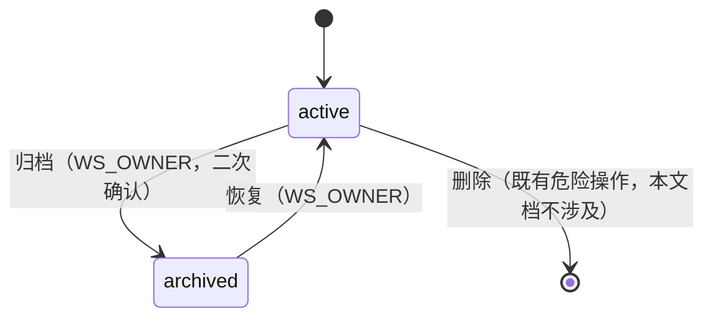
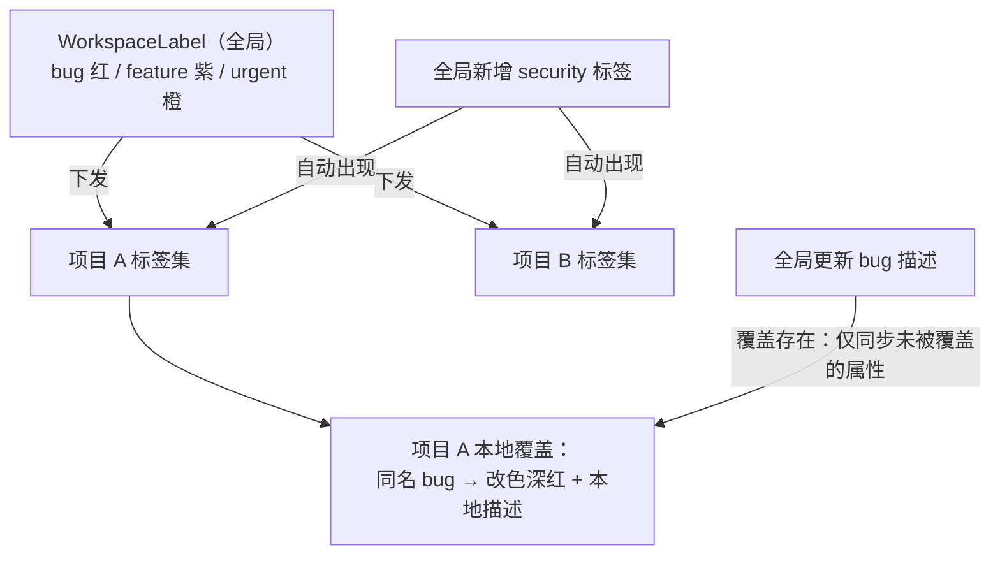

# 团队归档与全局模板配置

| 元信息项 | 内容 |
| --- | --- |
| 文档编号 | TEAM-003 |
| 所属迭代 | Sprint 5 — 集成 + 标准版收尾（第 7 周） |
| 优先级 | P2（标准版完整级） |
| 所属模块 | M2-TEAM｜团队管理 |
| 文档状态 | 待评审（Draft） |
| 最后更新日期 | 2026-09-01 |
| 上游依赖 | `TEAM-002`（成员管理与角色）、`PROJ-002`（`PERM_PROJECT_ARCHIVED` 写保护范式原形）、`PROJ-003`（项目模板机制 + §4.3.3 写保护中间件状态查表落地——全局模板与空间级写保护分别上移） |
| 下游消费 | Sprint 8 组织治理（部门/角色依托工作空间治理面）、`AUTH-012`（P4 多租户——工作空间隔离与归档语义是其基线）、`PROJ-004`（P3 项目集消费全局标签） |
| 上游依据 | `docs/需求文档.md` §3.2（团队管理模块：团队归档 / 全局模板配置 / 成员活跃度）、§8.2 团队管理 P2 列 |
| 关联架构文档 | [`api-conventions.md`](../architecture/api-conventions.md)（错误码 / 幂等动作）、[`rbac-permission-model.md`](../architecture/rbac-permission-model.md)（WS_OWNER/WS_ADMIN 权限码） |
| 对标基线 | Plane Workspace（无归档、无全局配置） · Ones 团队管理（归档 + 全局字段/状态模板下发） |
| 工作量估算 | 后端 2.5 人日 / 前端 1.5 人日 / 联调与测试 1 人日，合计 **5 人日** |

---

## 1. 概述

### 1.1 功能定位

工作空间（团队）此前只有「存在」一种状态，`TEAM-003` 补齐治理面三件事：

1. **团队归档**：整个工作空间一键只读冻结（全部项目联动只读），可恢复——客户暂停合作、季度封板、试点收尾的标准动作；
2. **全局模板配置**：工作空间级**全局标签**（下发到全部项目、项目可覆盖同名）与**基础状态模板**（新项目默认状态集来源），把 `PROJ-003` 模板机制上移到空间层；
3. **成员活跃度统计**：WS_ADMIN 可见的空间级聚合视图（活跃成员数 / 任务变更数 / 登录天数分布）——**只显聚合，不显个人明细**（隐私红线 BR-09）。

### 1.2 关键约定

| 约定 | 内容 |
| --- | --- |
| 归档 = 空间级只读 | 复用归档写保护范式上移一层（范式原形 `PROJ-002` `PERM_PROJECT_ARCHIVED`；Sprint 5 现行落地 `PROJ-003` §4.3.3 状态查表中间件，见 §1.5 编号沿用说明）：`PERM_WORKSPACE_ARCHIVED` 拦截一切写请求；登录/只读/导出不受限 |
| 可逆 | 归档 ↔ 恢复自由往返（WS_OWNER 专属）；无「关闭」终态（空间级删除归既有危险操作区，本文档不涉及） |
| 全局标签 = 下发 + 覆盖 | 全局标签以 `origin=global` 出现在每个项目；项目可创建同名本地标签**覆盖**显示（颜色/描述），不阻断全局更新其余属性 |
| 活跃度只聚合 | 任何接口不返回「某成员某日做了什么」级明细；最小聚合粒度 = 周；明细需求归 P3 `AUTH-010` 审计体系（合规语境另议） |
| 状态模板只管新建 | 全局状态模板变更不影响既有项目（快照语义，`PROJ-003` 同纪律） |

### 1.3 交付内容

| # | 能力 | 说明 |
| --- | --- | --- |
| 1 | 空间归档/恢复 | `Workspace.archived_at` 加列 + 幂等动作端点 + 全站写保护扩展 |
| 2 | 全局标签 | `WorkspaceLabel` 新表 + 下发合并逻辑 + 项目覆盖机制 |
| 3 | 基础状态模板 | 空间级默认状态集（新建项目/模板实例化时的兜底来源） |
| 4 | 活跃度统计 | `GET …/workspace/activity-stats/`：三聚合指标 + 周粒度分布 |
| 5 | 治理设置页 | 空间设置新增「归档」「全局标签」「状态模板」「活跃度」四区块 |

### 1.4 范围边界

| 能力 | 本文档（P2） | 归属 |
| --- | --- | --- |
| 空间归档/恢复 + 写保护 | ✅ | — |
| 全局标签（下发+覆盖）/ 状态模板（快照） | ✅ | — |
| 活跃度聚合统计 | ✅ | — |
| 空间删除 / 转让 | ❌（既有危险操作区） | `TEAM-002` |
| 多工作空间层级治理 | ❌ | P3/P4 |
| 活跃度个人明细 / 考勤化报表 | ❌（隐私红线） | P3 `AUTH-010` 合规审计另议 |
| 全局自定义字段下发 | ❌（字段归项目/模板层） | P3 评估 |
| 合规留存策略 | ❌ | P4 `FILE-006` |

### 1.5 前置依赖

| 依赖 | 内容 | 阻塞原因 |
| --- | --- | --- |
| `PROJ-002` / `PROJ-003` | 归档写保护范式：原形在 `PROJ-002`（`PERM_PROJECT_ARCHIVED` 通用守卫）；Sprint 5 现行落地在 `PROJ-003` §4.3.3（`READ_ONLY_STATUS` 状态查表中间件） | 空间级扩展的模板（编号沿用说明见下注） |
| `PROJ-003` | `workspace_active` 守卫（项目恢复依赖空间未归档） | 联动语义 |
| `TEAM-002` | `WorkspaceMember.role` 与成员列表页 | 设置页挂载 |
| Sprint 0 | `Label` / `State` 模型 | 全局下发目标 |

> **依赖口径说明（不依赖自定义字段体系）**：全局标签与状态模板均为 `Label` / `State` 元数据快照下发（§2.2 / §2.3），**不消费**自定义字段定义模型（`TASK-008` 的 `CustomFieldDefinition` 是 `PROJ-003` 模板四件套之一「字段定义拷贝」的消费物，非本文依赖）；全局自定义字段下发在 §1.4 显式出范围（P3 评估）。sprint-overview §3「`TEAM-003` 的全局标签/状态模板消费 `custom_fields` 元数据」指的是 `PROJ-003` 模板实例化链路（四件套含字段定义）与本文状态模板兜底（§2.3 生效点）的衔接关系——本文自身上游依赖以本表为准。

> **编号沿用说明**：本文早期草稿以「`PROJ-002` 范式」单引指代归档写保护守卫族；该守卫在 Sprint 5 时点的现行实现形态是同迭代 `PROJ-003` §4.3.3 的状态查表中间件（`archived → PERM_PROJECT_ARCHIVED` / `closed → PERM_PROJECT_CLOSED`）。本文所有「复用 `PROJ-002` 范式」的表述均指复用该守卫族并上移至空间层（错误码相应为 `PERM_WORKSPACE_ARCHIVED`），引用一律双引「`PROJ-002` 范式原形 + `PROJ-003` §4.3.3 落地」以防编号错位（以 README §4 编号引用为裁决）。

### 1.6 竞品参考

| 竞品 | 参考点 | 处置 |
| --- | --- | --- |
| Plane | Workspace 无归档态、无全局标签 | 本系统原创增量（Ones 对位） |
| Ones | 团队归档 + 全局状态/标签下发 + 成员活跃度报表 | 归档与下发语义对齐；Ones 活跃度含个人明细——本系统红线只聚合（§1.2） |
| Jira | 全局状态/工作流共享方案（scheme） | 下发思想对齐；Jira scheme 是引用式（改全局影响全部）——本系统快照+覆盖语义更安全 |

---

## 2. 业务逻辑

### 2.1 空间归档与恢复



| 面 | archived 态行为 |
| --- | --- |
| 写请求 | 一律 `403 PERM_WORKSPACE_ARCHIVED`（含项目/任务/评论/文件/设置全族） |
| 只读 | 登录、浏览、搜索、统计、导出正常 |
| 项目联动 | 各项目逻辑上等同 archived（不逐行改写项目状态——**状态派生**而非状态复制，恢复时零回写成本） |
| 成员 | 不可邀请/移出/改角色；既有成员只读保留 |
| 集成 | Webhook 停扇出（`INTG-002` BR-12 上移）；GitHub 同步暂停；API Key 只读端点可用、写端点 403 |
| 项目恢复守卫 | `PROJ-003` 的 `workspace_active` guard：空间归档中项目不可 archived→active |
| 通知 | 归档/恢复时全员通知（`COLLAB-001`）+ Activity（workspace 域） |

### 2.2 全局标签：下发与覆盖



| 规则 | 内容 |
| --- | --- |
| 下发 | 项目标签列表 = 全局标签（`origin=global`）∪ 项目本地标签；任务打标签可引用任一来历 |
| 覆盖 | 项目可建同名本地标签：显示属性（color/description）以本地为准，**不阻断**全局其他属性更新（边界 #3 逐项合并表） |
| 删除全局 | 已引用该标签的任务**保留文字快照**（`IssueLabel.name_snapshot`，DELETE 事务内写入——§4.3.4），标签实体软删；新项目不再下发 |
| 冲突判定 | 同名 = `lower(trim(name))` 归一化后相等 |

### 2.3 基础状态模板

| 规则 | 内容 |
| --- | --- |
| 结构 | 空间级 `default_states` JSON 快照（[{name, group, color, sequence}]，五组各 ≥1 项，校验同 `PROJ-003` 模板） |
| 生效点 | 新建项目（空白模板时）与项目模板未含状态集时的兜底来源 |
| 快照语义 | 修改全局状态模板**不影响**既有项目与既有项目模板（与 §1.2 约定五一致） |

### 2.4 成员活跃度统计

| 指标 | 口径 | 粒度 |
| --- | --- | --- |
| `active_members_7d / 30d` | 期内有任意写操作（任务/评论/工时/文件）的去重成员数 | 空间 |
| `contribution_distribution` | 按周分桶：0 / 1-5 / 6-20 / >20 次操作的成员数分布（响应键 `0` / `1_5` / `6_20` / `gt_20`） | 周 × 桶（无个人行） |
| `login_days_histogram` | 期内登录天数 1/2-3/4-5/6+ 的成员数分布（响应键 `1` / `2_3` / `4_5` / `ge_6`） | 月 |
| `top_actions` | 操作类型构成：任务变更（`IssueActivity`，verb 三类合计）与评论（`IssueComment`）**双源计数占比**（响应键 `issue` / `comment`；文件/工时无操作日志 verb 来源，不入占比，P3 报表扩展再评估——实现见 §4.3.3） | 空间 |

> **隐私红线（BR-09）**：以上四指标在**响应层**无任何「个人 × 明细」可还原性——无 per-user 行、任何键路径不含 `user_id`（代码评审红线 + UT-05 断言响应 Schema）。存储层纪律：活跃度取数沿用 `IssueActivity` per-actor 逐行的既有事实源（与 `COLLAB-003` 活动流同表），登录侧只落最小**命中表**（§4.3.3——仅「成员 × 日期」存在性，无操作内容、无更细时间戳），per-member 维度一律在 SQL 聚合内消化后丢弃，不进入响应构造器。

### 2.5 业务规则汇总

| 编号 | 规则 | 说明 / 验收点 |
| --- | --- | --- |
| BR-01 | 归档/恢复幂等：重复请求 200 + 当前态，不产生重复 Activity/通知 | IT 守护 |
| BR-02 | 归档写保护单入口：中间件查 `workspace.archived_at`，全资源族生效（范式承 `PROJ-002` 原形 / `PROJ-003` §4.3.3 落地，上移空间层） | 中间件测试 |
| BR-03 | 仅 WS_OWNER 可归档/恢复（WS_ADMIN 不可——空间级生死归所有者） | 权限矩阵 |
| BR-04 | 归档不逐行改项目状态（状态派生） | 恢复零回写验证 |
| BR-05 | 全局标签下发并集展示；同名本地覆盖仅覆盖显示属性 | 合并逻辑 UT |
| BR-06 | 全局标签删除：任务保留名称快照（落 `IssueLabel`，DELETE 事务内写入 §4.3.4），实体软删 | 数据测试 |
| BR-07 | 状态模板快照语义：改全局不动既有 | 同 PROJ-003 纪律 |
| BR-08 | 归档空间内禁止：项目恢复 / 模板实例化 / 新成员邀请 / 集成同步 | 守卫矩阵 |
| BR-09 | 活跃度接口 Schema 无 `user_id` 维度；最小粒度周 | Schema UT 断言 |
| BR-10 | 活跃度仅 WS_ADMIN+ 可见 | 权限码 `team.stats.read`（**新增 Key，待 ADR-0004 登记入 rbac §8.1**） |
| BR-11 | 全局标签上限 100 / 空间（409 `RESOURCE_LIMIT_EXCEEDED`）；名称 ≤ 50 字符（400 `VALIDATION_INVALID_PARAM`） | 双层错误码区分 |
| BR-12 | 归档空间不计入「新建项目」入口（按钮禁用 + API 403） | 双端验证 |

### 2.6 异常处理

| 场景 | 处理 |
| --- | --- |
| 非 OWNER 归档 | `403 PERM_WORKSPACE_OWNER_REQUIRED` |
| 归档中写请求 | `403 PERM_WORKSPACE_ARCHIVED` + `details[]` 含 `archived_at` / `restore_hint` |
| 全局标签重名（同名归一化冲突） | `409 RESOURCE_ALREADY_EXISTS`（`details[].field=name`） |
| 全局标签超限（>100） | `409 RESOURCE_LIMIT_EXCEEDED`（`details[].field=count`） |
| 全局标签字段格式 | `400 VALIDATION_INVALID_PARAM`（`details[].field=name/description`，子码 `TOO_LONG` / `INVALID_COLOR`） |
| 状态模板 PUT 缺组/sequence 断裂 | `400 VALIDATION_INVALID_PARAM`（`details[]` 逐组指出） |
| 活跃度窗口非法 | `400 VALIDATION_INVALID_PARAM`（`days` 白名单 7/30/90，`details[].field=days`） |
| 覆盖合并冲突（全局本地同时改同一属性） | 本地优先（BR-05），无错误——语义定义即答案 |

### 2.7 边界条件

| # | 边界 | 行为 |
| --- | --- | --- |
| 1 | 归档中到期任务 | 不触发逾期通知（写保护含通知面） |
| 2 | 归档中有排程 Webhook 重试 | 继续至天然终态；不产生新事件 |
| 3 | 全局改色 + 本地改描述 | 合并：本地描述 + 全局新色（逐项合并） |
| 4 | 项目删除本地覆盖 | 回落到全局显示属性 |
| 5 | 新成员加入归档空间 | 不可加入（BR-08）；恢复后可 |
| 6 | 活跃度 0 成员空间 | 全 0 + 空态插画 |
| 7 | 禁用成员活跃度 | 不计入（禁用后无操作）；历史周桶数据不回溯 |
| 8 | 归档空间 API Key | 只读端点可用；写端点 403 同中间件 |
| 9 | 恢复后项目状态 | 各项目回到归档前自身状态（active/archived 原样，因派生语义零回写） |
| 10 | 全局标签超项目上限 | 项目标签总数 = 全局 ∪ 本地，上限仅约束本地创建（BR-11 分层） |
| 11 | 归档人（`archived_by`）账号被删 | `on_delete=SET_NULL`，归档态保留（`archived_at` 不变）；Activity 保留「已匿名操作者」标记；`user.archived_workspaces` 反向查询仍可用（审计面，P3 `AUTH-010`） |
| 12 | 工作空间删除（TEAM-002 危险操作区） | 整体 `transaction.atomic()`：`Workspace` 删除前先 `WorkspaceMember` / `Project` / `WorkspaceLabel` / `WorkspaceLoginDailyAggregate` 全表 `CASCADE`；项目下 `Issue` 等经既有 `Project` CASCADE 链路级联；Celery 任务 `cleanup_workspace_audit(workspace_id)` 在 `on_commit` 后清残留 `AuditLog` / 通知 |
| 13 | 归档态下账号被禁用（AUTH-006 §2.4 禁用联动，BR-05） | 该成员的 session 与 API Key 即时失效（与 `AUTH-006` 联动）；但其历史 Activity / 通知仍可见（actor 标记「已禁用」），不二次污染统计口径 |
| 14 | 状态模板 PUT 中途失败 | 整体 `transaction.atomic()`；任一字段校验失败 → 整体回滚，旧快照零回写（与 §1.2 快照语义一致） |
| 15 | 全局标签批量创建中途失败 | 整体 `transaction.atomic()`；超过上限时已插入的同事务内行全部回滚，响应 `409 RESOURCE_LIMIT_EXCEEDED` + `details[].field=count` |
| 16 | 未来新增含 `/restore/` 字样的写路径（如 `…/issues/restore-all/`） | **不被恢复通道豁免误放行**——豁免仅按 method+路径全匹配 `POST /api/v1/workspaces/{slug}/(archive\|restore)/`（§4.3.1 `EXEMPT_RULES`），其余一切写路径照常 `403 PERM_WORKSPACE_ARCHIVED` |

---

## 3. UI/UX 设计

### 3.1 工作空间设置（治理四区块）

```
┌──────────────────────────────────────────────────────────────────┐
│ 工作空间设置 · Acme                                                │
│ [常规] [成员] [全局标签] [状态模板] [活跃度] [归档]                  │
├──────────────────────────────────────────────────────────────────┤
│ ▍全局标签                                            [+ 新建标签]  │
│  下发到全部项目；项目可用同名本地标签覆盖显示。                     │
│  ● bug        #E5484D   缺陷类问题        [编辑] [删除]            │
│  ● feature    #8E4EC6   新功能            [编辑] [删除]            │
│  ● urgent     #F76B15   需要立即处理      [编辑] [删除]            │
│  ⓘ 12/100                                                       │
├──────────────────────────────────────────────────────────────────┤
│ ▍基础状态模板                                                     │
│  新建项目的默认状态集（快照语义，不影响既有项目）。                  │
│  Backlog → Todo → In Progress → In Review → Done → Cancelled     │
│  [编辑状态集]                                                     │
├──────────────────────────────────────────────────────────────────┤
│ ▍归档                                                             │
│  归档后整个工作空间只读：成员可登录浏览，不可做任何修改。           │
│  仅所有者可操作，可随时恢复。                        [归档工作空间] │
└──────────────────────────────────────────────────────────────────┘
```

### 3.2 归档确认与归档态横幅

```
┌─ 归档工作空间 Acme？ ──────────────────────────────┐
│ · 全部 6 个项目将变为只读                            │
│ · 成员可继续登录浏览与导出，但不能修改任何内容        │
│ · 集成同步与 Webhook 将暂停                          │
│ · 仅你（所有者）可以恢复                             │
│ 输入工作空间名称「Acme」确认: [________]             │
│                        [取消]  [确认归档]（禁用态）   │
└─────────────────────────────────────────────────────┘

┌──────────────────────────────────────────────────────┐
│ 🔒 工作空间已归档 · 只读模式   [联系所有者恢复]         │
└──────────────────────────────────────────────────────┘  ← 全站顶置横幅（非 OWNER）
┌──────────────────────────────────────────────────────┐
│ 🔒 工作空间已归档 · 只读模式   [恢复工作空间]           │
└──────────────────────────────────────────────────────┘  ← OWNER 视角
```

### 3.3 活跃度页

```
┌─ 成员活跃度（WS_ADMIN 可见）────────────────────────────┐
│ 窗口: [近 7 天▾]                                        │
│ ┌─────────────┐ ┌─────────────┐ ┌─────────────────────┐ │
│ │ 活跃成员 7d │ │ 活跃成员 30d│ │ 操作构成            │ │
│ │   18 / 24   │ │   21 / 24   │ │ 任务65% 评论35%     │ │
│ │             │ │             │ │                     │ │
│ └─────────────┘ └─────────────┘ └─────────────────────┘ │
│ 周贡献分布（成员数，含 0 次桶全员）  登录天数分布（成员数） │
│  0次    ▓▓▓ 6                  1天   ▓▓▓▓ 8              │
│  1-5次  ▓▓▓▓▓ 10              2-3天 ▓▓▓▓▓ 9             │
│  6-20次 ▓▓▓ 6                 4-5天 ▓▓▓ 5               │
│  >20次  ▓ 2                   6+天  ▓ 2                 │
│ ⓘ 仅聚合统计，不提供个人明细（隐私保护）                   │
└──────────────────────────────────────────────────────────┘
```

### 3.4 空状态 / 响应式 / 无障碍

- 全局标签空态：「还没有全局标签」+ 一键导入内置三组（bug/feature/urgent）；
- 活跃度加载骨架；0 成员操作空间空态插画（边界 #6）；
- 移动端设置区块纵向堆叠；活跃度直方图横向滚屏 + 表格视图切换；
- 归档横幅 `role="alert"`；直方图附 `aria-label` 数值朗读；确认输入框受控禁用提交。

> **UI parity 纪律（ADR-0010，强制）**：本节全部新 UI 表面——§3.1 设置四区块页、§3.2 归档确认弹窗与双视角横幅、§3.3 活跃度页、§3.4 空态/响应式/无障碍——**实现前必须先登记入 `docs/sprint-0-poc/test-cases.md` 附录 C**（新增「工作空间设置 · 治理区块」小节）。附录 C 清单行号：#C-XX~#C-XX（本迭代来源 TEAM-003，行号于入清单时回填本处占位）；每行标注来源（本文档 §3.1~§3.4 逐字段，禁止凭记忆概括），`tests/e2e/parity.spec.ts` 按清单行补断言（带出处注释）；条件态/下拉内容/禁用态/空态/加载态/归档横幅双视角逐类过。

---

## 4. 技术架构

### 4.1 数据模型

```python
class Workspace(BaseModel):                               # 既有模型加列
    # … 既有字段 …
    archived_at = models.DateTimeField(null=True, blank=True)
    archived_by = models.ForeignKey("db.User", on_delete=models.SET_NULL,
                                    null=True, related_name="archived_workspaces")
    default_states = models.JSONField(default=list)       # §2.3 快照

class WorkspaceLabel(BaseModel):
    """全局标签：下发到全部项目（BR-05 并集语义）。"""

    id = models.UUIDField(primary_key=True, default=uuid.uuid4, editable=False)
    workspace = models.ForeignKey("db.Workspace", on_delete=models.CASCADE,
                                  related_name="global_labels")
    name = models.CharField(max_length=50)
    color = models.CharField(max_length=7)                # #RRGGBB
    description = models.CharField(max_length=255, blank=True, default="")
    deleted_at = models.DateTimeField(null=True, blank=True)   # BR-06 软删

    class Meta:
        db_table = "workspace_labels"
        constraints = [
            models.UniqueConstraint(fields=["workspace", "name"], name="uniq_wslabel_ws_name",
                                    condition=Q(deleted_at__isnull=True)),
        ]

class Label(BaseModel):                                   # 既有模型加列
    # … 既有字段 …
    origin = models.CharField(max_length=8, default="local")   # global|local
    overrides_global_id = models.UUIDField(null=True, blank=True)  # 覆盖指向

class IssueLabel(BaseModel):                              # 既有中间表加列（BR-06 快照落点）
    # … 既有字段（issue / label）…
    name_snapshot = models.CharField(max_length=50, blank=True, default="")
    # 全局标签删除时事务内写入（§4.3.4）——快照粒度 =「该条任务引用在删除时刻看到的名字」
```

**迁移要点**：① `workspaces` 加 3 列（在线 DDL）；② `workspace_labels` 新表；③ `labels` 加 2 列（`origin` / `overrides_global_id`）+ 存量回填 `origin='local'`；④ `issue_labels` 加 1 列（`name_snapshot`，BR-06 快照落点，写入时机见 §4.3.4）；⑤ 写保护中间件挂载点：`WorkspaceArchiveMiddleware`（§4.3.1，全文名统一）在 `workspace_slug` 解析后查 `archived_at` 命中即短路写方法（GET/HEAD/OPTIONS 放行）。

**级联策略**（解决双方互指致悬空——边界 #11/#12/#13）：

| 子表 | `on_delete` | 理由 |
| --- | --- | --- |
| `Workspace.archived_by → db.User` | `SET_NULL` | 归档态不可被「操作人离职」回滚（边界 #11）；actor 标记走 Activity。`related_name="archived_workspaces"` 保留反向关系——审计场景可反查「某账号归档过哪些空间」（P3 `AUTH-010` 消费），刻意不用 `"+"` 禁用反向查询 |
| `WorkspaceMember.workspace` | `CASCADE` | 工作空间解散时成员关系无意义（边界 #12） |
| `Project.workspace` | `CASCADE` | 项目随工作空间解散 |
| `WorkspaceLabel.workspace` | `CASCADE` | 全局标签随工作空间解散 |
| `WorkspaceLoginDailyAggregate.workspace` | `CASCADE` | 登录命中表（行粒度 = workspace × member × date，§4.3.3）随工作空间解散；`member` 侧同 `CASCADE`——成员账号硬删后命中行随删（统计域随成员域收缩），禁用不删行（边界 #7：历史桶数据不回溯） |
| `Label.overrides_global_id → WorkspaceLabel` | `SET_NULL` | 仅约束 FK **硬删**路径：置空后 §4.3.2 判 `overrides_global_id` 为 NULL → 覆盖行转 `origin=local` 独立展示（全局已物理删除、无回落对象）。全局标签**软删**（`deleted_at`）不触发 FK 级联——覆盖行继续指向软删全局行，序列化侧（§4.3.2 `globals_` 过滤 `deleted_at__isnull=True`）跳过该全局行，覆盖行同样以 local 形态展示 |

事务纪律：归档/恢复、状态模板 PUT、批量创建全局标签、删除全局标签（含受影响 `IssueLabel` 快照写入，§4.3.4）四项业务动作整体 `transaction.atomic()`，副作用（Activity / Webhook / 通知）一律 `transaction.on_commit()` 后投递（依 `api-conventions.md` §10.5 纪律）；失败整体回滚，无部分生效中间态（边界 #14/#15）。

### 4.2 API 定义

#### 4.2.1 归档/恢复 `POST /api/v1/workspaces/{slug}/archive/` `POST …/restore/`

成功 `200`：

```json
{
  "status": "success",
  "data": {"slug": "acme", "archived_at": "2026-09-07T10:02:41.556Z", "affected_projects": 6},
  "meta": {"request_id": "01J9Y08AB2C3D4E5F6G7H8J9K0"}
}
```

非 OWNER `403 PERM_WORKSPACE_OWNER_REQUIRED`；幂等重复归档 `200`（`archived_at` 原值，BR-01）。

> **命名偏离登记**：`api-conventions.md` §2.6 动作子资源惯用将「取消归档」建模为 `DELETE …/{id}/archive/`；本文取 `POST …/restore/` 的设计理由：① 恢复是产生副作用（Activity + 全员通知，BR-01）的显式治理动作，语义是「执行恢复」而非「删除归档标记」，且响应体需回传当前态快照（200 动作语义）；② 归档/恢复须以同构的幂等动作通道（重复请求 200，§2.6 归档条目同款幂等口径）进入 §4.3.1 `EXEMPT_RULES` 的 method+路径全匹配豁免表——`POST …/archive/` 与 `POST …/restore/` 两条规则对称登记，无需为 DELETE 撤销语义单设豁免分支。

#### 4.2.2 归档中写请求（任意写端点）`403`

```json
{
  "status": "error",
  "error": {
    "code": "PERM_WORKSPACE_ARCHIVED",
    "message": "工作空间已归档，当前操作被禁止",
    "details": [
      {"field": "archived_at", "code": "READ_ONLY", "message": "2026-09-07T10:02:41.556Z"},
      {"field": "restore_hint", "code": "INFO", "message": "请联系工作空间所有者恢复"}
    ],
    "request_id": "01J9Y09CD3E4F5G6H7J8K9L0M1"
  }
}
```

#### 4.2.3 全局标签 `GET/POST …/workspaces/{slug}/labels/`、`PATCH/DELETE …/{id}/`

列表 `data[]`（≤100，无分页）；删除软删（BR-06），响应含 `affected_issues: 37`（引用计数，前端二次确认文案）。**端点 throttle：30 req/min/user**（L3 端点限流，配置于 `throttle_classes = [WorkspaceLabelThrottle]`，依据 `api-conventions.md` §7.1 L3 端点级覆盖；该 30/min 是 L2 全局 60 req/min 用户配额**之内**的端点级细分——三层防护叠加计数而非独立配额：同一用户的请求先计入 L3 端点窗（先满先 429），同时也计入 L2 全局窗，两层不互抵、不放总量）。本文 §4.2.4 / §4.2.5 两端点的 10/min 同此叠加关系。

列表响应示例：

```json
{
  "status": "success",
  "data": [
    {"id": "6b2f9d3a-6b8e-4f2a-9c1d-4e5f6a7b8c9d", "name": "bug", "color": "#E5484D",
     "description": "缺陷类问题", "created_at": "2026-09-01T08:00:00.000Z"},
    {"id": "c91e4b7a-3d5f-4e8c-b2a6-7d8e9f0a1b2c", "name": "feature", "color": "#8E4EC6",
     "description": "新功能", "created_at": "2026-09-01T08:01:00.000Z"}
  ],
  "meta": {"count": 12, "limit": 100, "remaining": 88}
}
```

POST 创建请求体：

```json
{"name": "security", "color": "#0F766E", "description": "安全相关任务"}
```

DELETE 软删响应（含受影响引用计数，供前端二次确认）：

```json
{
  "status": "success",
  "data": {"id": "6b2f9d3a-6b8e-4f2a-9c1d-4e5f6a7b8c9d", "deleted_at": "2026-09-07T10:15:00.000Z", "affected_issues": 37}
}
```

`affected_issues` 口径：**受影响 Issue 数（按 `issue_id` distinct）**——直接引用该全局标签的活跃 `IssueLabel`（`deleted_at IS NULL`）与覆盖链路（`Label.overrides_global_id` 指向该全局标签）所涉 Issue 的并集；**同一 Issue 同时挂 global 行与覆盖行时计 1**。软删标签与软删任务不计入。快照写入行数（§4.3.4 事务内实际 update 的 `IssueLabel` 行数）≥ 该值（一 Issue 两行时写 2 行快照），另计不外露（内部日志口径）；受影响集合与 §4.3.4 快照遍历同源，删除前后两次调用结果一致。

#### 4.2.4 状态模板 `GET/PUT …/workspaces/{slug}/default-states/`

PUT 全量替换（数组校验：五组各 ≥1、sequence 连续、name 非空 ≤50）；响应回显新快照。**端点 throttle：10 req/min/user**（配置量级对标 `api-conventions.md` §7.2 报表聚合端点 10/min——状态模板虽非聚合但写入成本相近；叠加关系同 §4.2.3：10/min 为 L2 全局 60 req/min 用户配额之内的端点级细分，§7.1 三层防护叠加计数）。

GET 响应示例：

```json
{
  "status": "success",
  "data": {
    "name": "默认状态集",
    "version": 3,
    "groups": [
      {"group": "backlog",  "color": "#94A3B8", "states": [{"name": "Backlog",     "sequence": 1}, {"name": "Todo",       "sequence": 2}]},
      {"group": "unstarted","color": "#64748B", "states": [{"name": "Plan Ready",  "sequence": 3}]},
      {"group": "started",  "color": "#F59E0B", "states": [{"name": "In Progress", "sequence": 4}, {"name": "In Review",  "sequence": 5}]},
      {"group": "completed","color": "#10B981", "states": [{"name": "Done",        "sequence": 6}]},
      {"group": "cancelled","color": "#9CA3AF", "states": [{"name": "Cancelled",   "sequence": 7}]}
    ]
  },
  "meta": {"request_id": "01J9Y0AEF4G5H6J7K8L9M0N1P2"}
}
```

PUT 请求体（同结构，group 与 state 名归一化校验；sequence 断裂 → 400 `VALIDATION_INVALID_PARAM`，`details[].field=groups.{i}.states.{j}.sequence`）。

#### 4.2.5 活跃度 `GET …/workspaces/{slug}/activity-stats/?days=30`

```json
{
  "status": "success",
  "data": {
    "active_members_7d": 18,
    "active_members_30d": 21,
    "total_members": 24,
    "contribution_distribution": [
      {"week": "2026-W36", "buckets": {"0": 6, "1_5": 10, "6_20": 6, "gt_20": 2}}
    ],
    "login_days_histogram": {"1": 8, "2_3": 9, "4_5": 5, "ge_6": 2},
    "top_actions": {"issue": 0.65, "comment": 0.35}
  },
  "meta": {"request_id": "01J9Y0AEF4G5H6J7K8L9M0N1P2"}
}
```

非 WS_ADMIN `403 PERM_WORKSPACE_ADMIN_REQUIRED`；**Schema 红线**：任何键路径不含 `user_id`（BR-09，UT-05 断言）。**端点 throttle：10 req/min/user**（高 SQL 成本 + Redis 计数，配置于 `throttle_classes = [ActivityStatsThrottle]`，依据 `api-conventions.md` §7.2 报表聚合端点 10/min 配额；叠加关系同 §4.2.3：10/min 为 L2 全局 60 req/min 用户配额之内的端点级细分，§7.1 三层防护叠加计数，不另设独立总额）。

分桶键为 **snake_case 机器键**（周桶 `0` / `1_5` / `6_20` / `gt_20`；登录直方图 `1` / `2_3` / `4_5` / `ge_6`），与信封字段命名规范一致；区间人读标签（「1-5 次」「6-20 次」「6+ 天」等）由前端按 §3.3 文案渲染，不进响应键名（UT-05 递归断言顺带校验键名集合）。示例算术自洽：周桶 6+10+6+2 = 24 = `total_members`（0 次桶含全部成员，非零桶合计 18 = `active_members_7d`，与 §3.3 同源）；登录直方图 8+9+5+2 = 24；`top_actions` 双源占比合计 1.0。

### 4.3 核心逻辑

#### 4.3.1 空间写保护中间件

```python
class WorkspaceArchiveMiddleware:
    """slug 解析后短路一切写方法（BR-02 单入口）。"""
    SAFE_METHODS = {"GET", "HEAD", "OPTIONS"}
    # 豁免通道 = method + 路径精确全匹配表（禁止子串包含判定：
    # 含 "/restore/" 字样的未来写路径不得被误放行——边界 #16 / UT-02 负例）
    EXEMPT_RULES = (
        ("POST", re.compile(r"^/api/v1/workspaces/[^/]+/restore/$")),  # 恢复通道自身放行
        ("POST", re.compile(r"^/api/v1/workspaces/[^/]+/archive/$")),  # 幂等重复归档 200（BR-01）
    )

    def __call__(self, request):
        ws = getattr(request, "workspace", None)
        exempt = any(m == request.method and p.fullmatch(request.path)
                     for m, p in self.EXEMPT_RULES)
        if (ws and ws.archived_at and request.method not in self.SAFE_METHODS
                and not exempt):
            raise WorkspaceArchived(ws)                      # → 403 PERM_WORKSPACE_ARCHIVED
        return self.get_response(request)
```

> 豁免判定取**精确全匹配**（`re.fullmatch` + method 双校验），取代早期草稿的 `EXEMPT_PATHS` 子串包含判定——后者会把未来任何含 `"/restore/"` / `"/archive/"` 字样的写路径（如 `…/issues/restore-all/`）误放行，等于在归档写保护上开了一个不可枚举的后门（边界 #16；UT-02 以子串相似路径为负例断言）。

#### 4.3.2 全局标签合并（项目标签列表序列化点）

```python
def merged_labels(project) -> list[dict]:
    """全局 ∪ 本地；同名本地覆盖显示属性，其余属性随全局更新（BR-05/边界 #3）。"""
    globals_ = {norm(l.name): l for l in project.workspace.global_labels.filter(deleted_at__isnull=True)}
    locals_ = Label.objects.filter(project=project, deleted_at__isnull=True)
    out, covered = [], set()
    for l in locals_:
        g = globals_.get(norm(l.name))
        if g and l.overrides_global_id:                      # 本地覆盖行
            out.append({**serialize(g), "color": l.color or g.color,
                        "description": l.description or g.description, "origin": "override"})
            covered.add(norm(l.name))
        else:
            out.append({**serialize(l), "origin": "local"})
    for key, g in globals_.items():
        if key not in covered and not any(norm(l.name) == key for l in locals_):
            out.append({**serialize(g), "origin": "global"})
    return sorted(out, key=lambda x: x["name"])
```

#### 4.3.3 活跃度聚合（只聚合实现）

```python
def activity_stats(workspace, *, days: int) -> dict:
    since = timezone.now() - timedelta(days=days)
    # IssueActivity 无 workspace 列（unified-issue-model §2.10：issue FK + actor FK + verb 三枚举）
    # ——空间维度经 issue → project 链路过滤
    acts = IssueActivity.objects.filter(issue__project__workspace=workspace,
                                        created_at__gte=since,
                                        deleted_at__isnull=True)
    wk = acts.annotate(week=TruncWeek("created_at")).values("week") \
             .annotate(users=Count("actor", distinct=True))   # 周 × 去重成员
    buckets = bucketize(wk, by_week_user_counts(acts))        # 服务器侧分桶，无个人行
    return {"active_members_7d": count_active(workspace, 7),
            "active_members_30d": count_active(workspace, 30),
            "contribution_distribution": buckets,
            "login_days_histogram": login_histogram(workspace, days=days),  # 命中表按成员聚合分桶（方案见下）
            "top_actions": action_mix(workspace, since=since)}   # 双源计数占比（IssueActivity ∪ IssueComment）
```

> 红线落点：`bucketize` / `by_week_user_counts` / `login_histogram` 在内存聚合后立即丢弃 per-user 中间结果；响应构造器类型上无 `user_id` 字段（`TypedDict` 静态守护，UT-05）。
>
> **登录天数实现方案（Session 无可靠时间戳 → AUTH-001 登录端点 on_commit 增量写「命中表」）**：
>
> Django Session 落 Valkey 缓存后端（`django.contrib.sessions.backends.cache`，`api-conventions.md` §9.2 / AUTH-004 会话模型——session 数据仅存 `user_id` 与必要标记），**无可靠登录时间戳可查**。故登录命中由 `AUTH-001` 登录端点（§4.3.2 `establish_session()`）在 `transaction.on_commit` 后投递 Celery 任务 `record_workspace_login_hit(member_id, date)`：任务遍历该成员全部活跃 `WorkspaceMember` 关系，对每个工作空间 `get_or_create(workspace=…, member=…, date=…)`——`(workspace, member, date)` 唯一约束天然幂等，同日多次登录不增行。
>
> `login_histogram()` 对命中表 `group by member` 再 `count(date)`，按 §2.4 口径分桶「期内登录 1/2-3/4-5/6+ 天的成员数」——per-member 日命中行可直接还原天数分布。（早期草稿的「工作空间 × 日去重人数」汇总表在数学上不可行：每日去重计数无法反推 per-member 天数分布，SUM 只得「天数」而非「成员数」。）成员当日登录去重人数等汇总口径可由 `Count("member", distinct=True)` 按需派生，不再落列（原 `unique_members` 列删除）。投递纪律依 `api-conventions.md` §10.5（与 §4.1 事务纪律同源）。
>
> **BR-09 合规边界**：命中表仅存「成员 × 日期」存在性（无操作内容、无更细时间戳），粒度与活跃度既有事实源 `IssueActivity` 的 per-actor 逐行同级；红线约束的是**统计接口暴露面**——member 维度在 SQL 聚合内消化后丢弃，任何响应无 per-user 行、无 `user_id` 键（UT-05）。

```python
def login_histogram(workspace, *, days: int) -> dict:
    """期内登录 1/2-3/4-5/6+ 天的成员数分布（§2.4 口径）。
    per-member 天数在查询内聚合、逐成员值即弃（BR-09：member 维度不出本函数）。"""
    since = (timezone.now() - timedelta(days=days)).date()
    days_per_member = (WorkspaceLoginDailyAggregate.objects
                       .filter(workspace=workspace, date__gte=since)
                       .values("member")                 # group by member → 期内登录天数
                       .annotate(n=Count("date")))
    hist = {"1": 0, "2_3": 0, "4_5": 0, "ge_6": 0}
    for row in days_per_member:                          # 仅累加桶计数，成员身份不外流
        n = row["n"]
        if n >= 6:   hist["ge_6"] += 1
        elif n >= 4: hist["4_5"] += 1
        elif n >= 2: hist["2_3"] += 1
        else:        hist["1"] += 1
    return hist


def action_mix(workspace, *, since) -> dict:
    """操作构成 = 双源计数占比（与 COLLAB-003 §4.3.1 合流取数同构：IssueActivity ∪ IssueComment）。
    ① IssueActivity——verb 枚举仅 created/updated/deleted（unified-issue-model §2.10），
       三类合计即「任务变更」计数（键 issue）；② IssueComment——评论维度独立源（键 comment，
       IssueActivity 无 comment verb）。file / worklog 无 verb 来源，不入本指标（§2.4）。"""
    issue_n = IssueActivity.objects.filter(issue__project__workspace=workspace,
                                           created_at__gte=since,
                                           deleted_at__isnull=True).count()
    comment_n = IssueComment.objects.filter(issue__project__workspace=workspace,
                                            created_at__gte=since,
                                            deleted_at__isnull=True).count()
    total = issue_n + comment_n
    return ({"issue": round(issue_n / total, 2), "comment": round(comment_n / total, 2)}
            if total else {"issue": 0.0, "comment": 0.0})
```

```python
# apps/api/plane/db/models/workspace_login_aggregate.py
class WorkspaceLoginDailyAggregate(BaseModel):
    """登录命中表：(工作空间 × 成员 × 日期) 至多一行——仅记「该成员当日登录过」
    这一存在性事实（无操作内容、无更细时间戳）；member 维度在 SQL 聚合内消化
    （§4.3.3 login_histogram），绝不进入任何响应（BR-09 / UT-05）。"""

    workspace = models.ForeignKey("db.Workspace", on_delete=models.CASCADE,
                                  related_name="login_daily_aggregates")
    member = models.ForeignKey("db.User", on_delete=models.CASCADE,
                               related_name="+")   # 反向查询无消费方，禁用
    date = models.DateField()
    # 不落 unique_members 汇总列：当日去重人数由 Count("member", distinct=True) 按需派生

    class Meta:
        db_table = "workspace_login_daily_aggregates"
        constraints = [
            models.UniqueConstraint(fields=["workspace", "member", "date"],
                                    name="uniq_ws_login_agg_ws_member_date"),
        ]
        indexes = [models.Index(fields=["workspace", "date"])]   # 直方图主索引
```

#### 4.3.4 删除全局标签时的快照写入（BR-06 闭环）

`name_snapshot` 列落 **`IssueLabel` 中间表**而非 `Label`（§4.1）：快照语义是「**这条任务引用**在删除时刻看到的名字」，随引用行存续——标签实体后续任何变更（乃至软删回落、覆盖删除）都不影响历史任务渲染；落在 `Label` 上则无法区分「同名本地覆盖」与「多处下发行」各自的定格时刻。

§4.2.3 DELETE 端点在**同一事务内**遍历受影响 `IssueLabel` 写入快照，再软删全局标签：

```python
def delete_workspace_label(ws_label: WorkspaceLabel) -> int:
    """§4.2.3 DELETE 事务内：先写快照，再软删全局标签（BR-06 与实现闭合）。"""
    with transaction.atomic():
        refs = Label.objects.filter(                      # 受影响引用的两条链路
            Q(overrides_global_id=ws_label.id) |          # ① 本地覆盖链路
            Q(origin="global", name=ws_label.name,        # ② 各项目下发的 global 行
              project__workspace=ws_label.workspace))     #    （同名归一化判定同 §2.2 冲突判定）
        affected = IssueLabel.objects.filter(label__in=refs,
                                             deleted_at__isnull=True)
        affected.update(name_snapshot=ws_label.name)      # 快照写入：删除时刻定格（逐行，含 global+覆盖双行）
        ws_label.deleted_at = timezone.now()              # 实体软删；合并查询过滤后新项目不再下发（§4.3.2）
        ws_label.save(update_fields=["deleted_at"])
        # → 响应 affected_issues：按 issue_id 去重的受影响 Issue 数（§4.2.3 口径——同一 Issue
        #   挂 global+覆盖两行时计 1）；快照写入行数 = affected.count() ≥ 该值，另计不外露
        return affected.values("issue_id").distinct().count()
```

> 序列化侧配套：任务标签渲染时 `IssueLabel.name_snapshot` 非空即优先使用，否则回落标签当前名——已删全局标签在历史任务上永远显示删除时刻的文字（BR-06 / UT-09）。

### 4.4 前端实现

```typescript
// stores/workspace-admin.store.ts
export class WorkspaceAdminStore {
  async archive(nameConfirm: string) {
    if (nameConfirm !== this.root.workspace.name) throw new Error("name mismatch");
    const res = await workspaceService.archive(this.root.workspaceSlug);
    this.root.workspace.setArchived(res.archived_at);   // 全局横幅 + 写操作入口全禁用
    return res;
  }
  get readOnly() { return !!this.root.workspace.archivedAt; }   // 所有编辑器读取此旗标
}
```

| 组件 | 要点 |
| --- | --- |
| `ArchiveBanner` | 全站顶置；OWNER 带恢复按钮、成员带提示文案（§3.2 双视角） |
| `GlobalLabelManager` | 100 上限计数；删除前 `affected_issues` 二次确认 |
| `DefaultStatesEditor` | 五组行编辑（增删/排序/改色），校验同 PROJ-003 模板编辑器复用 |
| `ActivityStatsPage` | 四聚合卡 + 双直方图；页脚隐私说明；窗口切换 7/30/90 |

---

## 5. 测试用例

### 5.1 单元测试

| 编号 | 用例 | 断言 |
| --- | --- | --- |
| UT-01 | 归档写保护 | 归档后 POST/PATCH/PUT/DELETE 全 403 `PERM_WORKSPACE_ARCHIVED`；GET 200 |
| UT-02 | 恢复通道豁免 | 归档中 `POST …/restore/` 可调用（§4.3.1 `EXEMPT_RULES` 精确匹配）；负例：`…/issues/restore-all/` 等子串相似写路径仍 403（边界 #16） |
| UT-03 | 幂等归档/恢复 | 重复请求 200 无重复 Activity/通知（BR-01） |
| UT-04 | 权限分层 | WS_ADMIN 归档 403；OWNER 成功（BR-03） |
| UT-05 | 活跃度 Schema 红线 | 响应 JSON 递归遍历无 `user_id` 键（BR-09） |
| UT-06 | 全局标签并集 | 项目标签列表 = 全局 ∪ 本地，排序稳定 |
| UT-07 | 同名覆盖合并 | 本地改色 + 全局改描述 → 合并输出（边界 #3） |
| UT-08 | 删除覆盖回落 | 删本地覆盖后显示回全局属性（边界 #4） |
| UT-09 | 全局删除快照 | 受影响 `IssueLabel` 行 `name_snapshot` = 删除时刻标签名（§4.3.4 事务内写入）；新项目不下发（BR-06） |
| UT-10 | 状态模板校验 | 五组缺一组 PUT 400 `VALIDATION_INVALID_PARAM`；sequence 断裂 400 `VALIDATION_INVALID_PARAM` |
| UT-11 | 模板快照语义 | 改全局状态模板后既有项目 State 集不变（BR-07） |
| UT-12 | 标签上限 | 第 101 个全局标签 409 `RESOURCE_LIMIT_EXCEEDED`（BR-11 上限分支） |
| UT-13 | 归档禁新建项目 | API 403 + 前端按钮禁用（BR-12） |
| UT-14 | 项目恢复守卫联动 | 空间归档中项目 archived→active 被 `workspace_active` 拦截（BR-08） |
| UT-15 | 活跃度窗口 | `days=14` 400 `VALIDATION_INVALID_PARAM`；7/30/90 正常 |
| UT-16 | 周桶聚合 | 构造跨 2 周操作，分布桶计数与手工对账一致 |
| UT-17 | 登录直方图对账 | 构造命中表 per-member 日命中（A 1 天 / B 2 天 / C 6 天 / D 跨日重复登录），`login_histogram` 分桶与手工重算一致；同成员同日重复登录不增行（`(workspace, member, date)` 唯一约束幂等，§4.3.3）；函数返回值无 member 维度（BR-09） |

### 5.2 集成测试

| 编号 | 用例 | 断言 |
| --- | --- | --- |
| IT-01 | 归档全联动 | 6 项目写全 403、只读全 200、Webhook 停扇出、GitHub 同步暂停、通知全员 |
| IT-02 | 恢复零回写 | 恢复后各项目状态与归档前逐一致（派生语义，BR-04） |
| IT-03 | 全局标签下发 | 新建全局标签自动出现在 3 个项目列表；项目覆盖后其余属性随全局更新 |
| IT-04 | 归档中排程任务 | 在途 Webhook 重试至天然终态；逾期通知不产生（边界 #1/2） |
| IT-05 | 活跃度对账 | 手工 SQL 重算四指标与接口一致（操作构成按 `IssueActivity` ∪ `IssueComment` 双源重算、登录直方图按命中表 per-member 重算，§4.3.3）；禁用成员不计入（边界 #7） |
| IT-06 | 状态模板生效点 | 空白模板新项目状态集 = 全局快照；带模板项目用模板状态集 |
| IT-07 | API Key 分层 | 归档空间只读端点 200、写端点 403（边界 #8） |
| IT-08 | 新成员限制 | 归档中邀请 403；恢复后邀请成功（边界 #5） |

### 5.3 E2E 测试

| 编号 | 场景 |
| --- | --- |
| E2E-01 | 归档全流程：输入名称确认 → 横幅出现（OWNER/成员双视角）→ 编辑按钮全禁 → 恢复 → 复原 |
| E2E-02 | 全局标签：新建 `security` → 项目 A/B 标签选择器出现 → 项目 A 覆盖改色 → 全局改描述后 A 合并正确 |
| E2E-03 | 状态模板：编辑模板 → 新建空白项目状态集为新模板 → 既有项目看板列不变 |
| E2E-04 | 活跃度页：四卡 + 双直方图渲染；窗口切换数据变化；页脚隐私说明可见 |
| E2E-05 | 归档横幅无障碍：读屏播报 `role="alert"`；键盘可触达恢复按钮 |

---

## 6. 竞品深度对标

### 6.1 Plane 实现分析

| 面 | Plane 现状 | 本系统增量 |
| --- | --- | --- |
| 空间生命周期 | 无归档态（只能留着或删除） | 归档/恢复双向门——客户暂停场景的真实需求（Ones 对位能力） |
| 全局配置 | 无全局标签/状态模板 | `WorkspaceLabel` + `default_states` 原创增量 |
| 活跃度 | 无 | 聚合四指标（且立下隐私红线） |

### 6.2 Ones / Jira 实现分析

| 竞品 | 机制 | 本系统决策 |
| --- | --- | --- |
| Ones 团队归档 | 归档只读 + 恢复 | 语义对齐；补「状态派生而非逐行复制」工程优化（恢复零回写） |
| Ones 活跃度报表 | 含个人操作明细排行 | **刻意不跟**——考勤化报表与协作工具定位冲突；BR-09 红线下仅聚合 |
| Jira scheme | 全局状态/工作流引用式共享，改全局全量生效 | 快照 + 覆盖语义：全局变更不冲击既有项目（可教性与安全兼优） |

### 6.3 本系统设计决策

| 决策 | 理由 |
| --- | --- |
| 状态派生而非复制 | 归档时逐行改 6×N 个项目状态 = 恢复时必须精确回滚（故障面）；派生语义归档=加一行、恢复=删一行 |
| 逐项合并的覆盖语义 | 「全有或全无」覆盖会让本地覆盖后错过全局修正；逐项合并让两层治理各管各的属性 |
| 活跃度无 per-user 维度 | 一旦被用作考勤，成员会用垃圾操作刷指标——指标腐败且信任崩塌；红线写进 Schema 层而非口头约定 |
| OWNER 专属归档 | 空间级生死影响全体——比项目归档（PROJ_ADMIN 即可）提一级到所有者 |
| 快照式状态模板 | 与 `PROJ-003` 模板纪律一致：全局变更是「未来的默认」，不是「对既有的修改」 |

### 6.4 架构文档待回改 / ADR 登记清单（实现偏离登记）

本迭代对 `rbac-permission-model.md` / `unified-issue-model.md` 等架构决策存在三处偏离，按 sprint-overview §10 纪律登记于 `docs/adr/` 并在此汇总，便于 Day 5 收口签字与架构组回改对齐。

| 编号 | 偏离点 | 架构文档原文 | 本文档决策 | 后续动作 |
| --- | --- | --- | --- | --- |
| ADR-0002（待登记） | 归档权限收窄至 WS_OWNER | rbac §8.1 「Workspace archive」WS_OWNER/WS_ADMIN 双 ✅ | BR-03 仅 WS_OWNER 可归档/恢复——归档是「空间级生死」语义，与删/转同级 | rbac §8.1 **两处回改**：① 「Workspace archive」行 WS_ADMIN 列 ✅ 改 ⚠️（备注「archive/restore 不可，仅 WS_OWNER」）；② 新增「Workspace \| restore（恢复） \| `workspace.restore`」行——WS_OWNER ✅ / WS_ADMIN ❌ / WS_MEMBER ❌ / WS_GUEST ❌（与 archive 同 Owner-only，恢复端点不再隐含于 archive 行语义内）；`WorkspaceAdminPermission` 的 archive/restore 两个 action 均叠加 `role >= WS_OWNER` 校验 |
| ADR-0003（待登记） | 全局标签独立建表（`WorkspaceLabel`） | unified-issue-model.md §2.7 P3 计划「通过 `Label.workspace` 可空外键 + `project` 可空方式支持组织统一标签下发」 | Sprint 5 提前至 P2 实现；独立建表而非复用 `Label`——避免双外键可空导致 `(workspace, project)` 互斥校验复杂化，也避免 `Label.origin` 字段污染基线模型 | unified-issue-model §2.7 内联标注「P2 实现已偏离：建独立 `WorkspaceLabel` 表（TEAM-003 + ADR-0003）」，并在 §2.7 末追加「P3 组织级标签下发收敛方案待架构组重新评估」 |
| ADR-0004（待登记） | 新增权限 Key `team.stats.read` | rbac §8.1 未列；既有 `report.read` / `report.export` 不可复用（语义非报表） | 工作空间级读权限 Key `team.stats.read`，门槛 WS_ADMIN+。**为何不能走 `report.read`**：活跃度聚合属工作空间治理面（成员行为统计，服务空间管理），不计入项目报表视图（`report.read` 语义 = 项目/跨项目**任务**统计，rbac §8.1「Report \| read（跨项目统计）」），且不能 expand 到项目维度——BR-09 红线决定该指标无项目切面，复用报表权限码会造成「按报表语义授权、按治理面语义消费」的错位 | rbac §8.1 「Report」分区新增一行：`read（团队成员活跃度）` `team.stats.read` ✅ / ✅ / ❌ / ❌；前端矩阵 `WORKSPACE_PERMISSION_MATRIX` 同步补条目；CI 一致性测试新增断言（rbac 附录 B 七步） |

**这三项偏离均需在 Sprint 5 收口前（sprint-overview §6「架构文档待回改项标注 / ADR 登记」门禁）由架构组确认签字**：未签字视为未冻结，Day 5 不予关闭。

---

## 7. 里程碑与验收

### 7.1 交付物清单

| 类别 | 交付物 |
| --- | --- |
| Model / Migration | `workspaces` +3 列、`workspace_labels` 新表、`labels` +2 列回填、`issue_labels` +1 列（BR-06 快照，§4.3.4）、`workspace_login_daily_aggregates` 新表（登录命中表：`workspace × member × date` 唯一，§4.3.3） |
| 后端 | 归档/恢复动作 + 写保护中间件、全局标签 CRUD + 合并序列化、状态模板 GET/PUT、活跃度聚合端点 + Celery `record_workspace_login_hit` 任务（AUTH-001 登录端点 on_commit 投递） |
| 前端 | 设置四区块页、`ArchiveBanner`（双视角）、`GlobalLabelManager`、`DefaultStatesEditor`、`ActivityStatsPage`、全站只读旗标联动 |
| 测试 | UT-01~17、IT-01~08、E2E-01~05 |
| 错误码 | `PERM_WORKSPACE_ARCHIVED`、`PERM_WORKSPACE_OWNER_REQUIRED` 注册入 `api-conventions.md` §8 |

### 7.2 可操作演示的验收标准

1. 归档：OWNER 输入名称确认 → 全站横幅 → 6 项目写全 403（响应含 `archived_at` 与恢复提示）→ 只读/导出正常 → 恢复后逐项目状态复原（零回写验证）。
2. 权限：WS_ADMIN 归档 403；非成员 404。
3. 全局标签：新建下发全项目；同名覆盖仅覆盖显示属性、其余属性随全局更新；删除全局后任务保留名称快照。
4. 状态模板：编辑后新建项目生效、既有项目不变（快照验证）。
5. 活跃度：四指标与手工 SQL 对账一致；响应递归遍历无 `user_id`；非 WS_ADMIN 403。
6. 回归：`PROJ-002/003` 守卫链（含 `workspace_active`）、`INTG-001/002` 暂停语义、`TEAM-002` 成员管理全部无回归；标准版 V1.0 功能冻结清单全绿。

---
