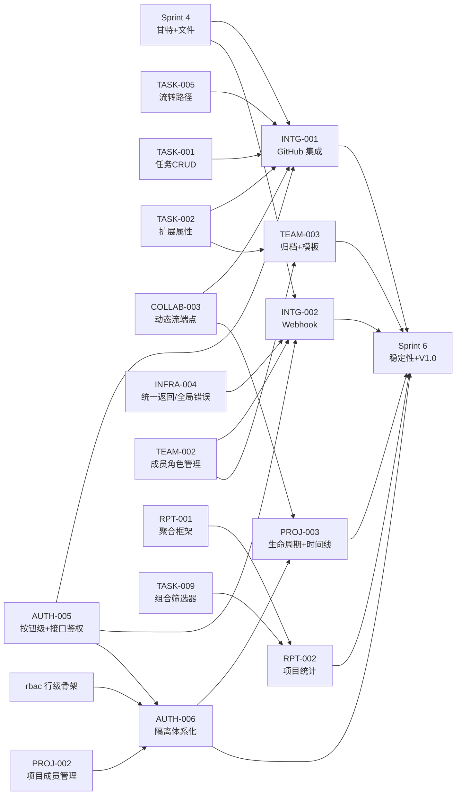

# Sprint 5 — 集成 + 标准版收尾 迭代概览

| 元信息项 | 内容 |
| --- | --- |
| 所属迭代 | Sprint 5 — 集成 + 标准版收尾（第 7 周） |
| 优先级 | P2（标准版完整级 · **标准版功能冻结点**） |
| 覆盖模块 | M9-INTG 第三方集成｜M10-RPT 数据报表｜M3-PROJ 项目管理｜M1-AUTH 账号权限｜M2-TEAM 团队管理 |
| 文档状态 | 待评审（Draft） |
| 最后更新日期 | 2026-09-01 |
| 上游依赖 | Sprint 0-4 全量（尤其 `TASK-001/002` 任务基础字段与扩展属性、`TASK-005` 流转路径、`INFRA-004` 统一返回与全局错误格式、`AUTH-005` 按钮级与接口二次鉴权、`TEAM-002` 团队成员角色分配、`TASK-010`+`COLLAB-003` 动态管道、`TASK-009` 组合筛选器、`RPT-001` 聚合框架、`PROJ-002` 归档动作、`rbac` `accessible_by` 骨架） |
| 下游消费 | `Sprint 6`（稳定性缓冲与 V1.0 发布）、`INTG-003/004`（P4 Slack/Zoom/OpenAPI）、`RPT-003/004`（P3 敏捷报表复用聚合框架）、`AUTH-010`（P3 全站审计复用行级矩阵）、`PROJ-004`（P3 项目集复用模板机制） |
| 迭代周期 | 5 个工作日，固定预留 20% 缓冲 |

---

## 1. 迭代目标

Sprint 5 是标准版的**收口迭代**：P2 优先级清单在此全部清零，功能面冻结，为 Sprint 6 的稳定性冲刺与 V1.0 发布让路。五条主线：

1. **GitHub 基础集成**——安装授权、仓库绑定、Issue 双向同步（幂等键驱动）、PR 关联任务、合并自动流转、Commit 挂载任务详情（`INTG-001`）；
2. **出站 Webhook**——订阅事件面、HMAC 签名、at-least-once 投递与死信（`INTG-002`，架构文档 §13.3 的工程化落地）；
3. **项目统计**——项目进度（状态组分布/完成率/逾期）与成员任务量（按人 open/done/逾期/工时），复用 `RPT-001` 聚合框架换维度（`RPT-002`）；
4. **项目生命周期**——四态启用（draft/active/archived/closed）与转换守卫、项目动态时间线产品化、项目模板（`PROJ-003`）；
5. **权限与治理收尾**——行级隔离体系化（四层过滤矩阵 + CI 静态守护）、账号禁用/启用联动（`AUTH-006`）、团队归档与全局模板下发（`TEAM-003`）。

## 2. 范围与边界（对齐需求文档 §8.2 P2 列）

| 模块 | 本迭代交付 | 明确不做（后置） |
| --- | --- | --- |
| 集成 | GitHub 基础集成（Issue 同步/PR 关联/合并改状态/Commit 挂载）、简单 Webhook | Slack/Zoom（P4）、只读 OpenAPI（P3）、签名校验高级配置（P3）、应用市场（P4） |
| 报表 | 项目进度统计、成员任务量统计 | 燃尽图/速率/累积流（P3 `RPT-003`）、健康度（P3）、导出（P3） |
| 项目 | 完整生命周期（四态+守卫）、项目动态时间线、项目模板 | 项目集（P3 `PROJ-004`）、跨项目依赖（P3）、归档合规（P4） |
| 权限 | 数据库行级隔离体系化、团队/项目成员权限分配收口、账号禁用/启用 | 部门/自定义角色（P3 `AUTH-007/008`）、SSO（P3）、审计日志全量（P3 `AUTH-010`） |
| 团队 | 团队归档、全局标签/基础状态模板、成员活跃度统计 | 多工作空间/层级治理（P3/P4）、合规策略（P4） |

## 3. 前置依赖

进入 Sprint 5 前必须满足：

- `TASK-001` + `TASK-002` 基础字段与扩展属性已冻结（`INTG-001` 的 Issue 同步映射任务基础字段与 `custom_fields` 扩展属性，不开新属性通路）。
- `TASK-005` 流转路径稳定（`INTG-001` 的「合并自动改状态」必须走同一守卫与 Activity 管道，不开旁路）。
- `TASK-010` + `COLLAB-003` 动态管道与 `stream_cursor` 端点可用（`PROJ-003` 时间线直接消费，且 `INTG-001` 的 PR/Commit 事件同时进入同一动态流——一条事件总线、四方复用）。
- `RPT-001` 的 `PersonalStatsService` 框架（单条 aggregate + 口径单源纪律）经生产验证（`RPT-002` 换 project 维度复用）。
- `PROJ-002` 的 `archive/` 幂等动作与 `PERM_PROJECT_ARCHIVED` 通用守卫在线（`PROJ-003` 扩展守卫矩阵）。
- `rbac-permission-model.md` §6 的 `accessible_by` Manager 骨架已在关键 ViewSet 落地（`AUTH-006` 做全景收敛与 CI 守护）。
- Celery + RabbitMQ、Redis（限流/签名时间窗）可用；出网访问 `api.github.com` 已放行（`INFRA-002` 网络策略）。

横切依赖（Sprint 0-4 已稳定，本迭代消费）：

- `INFRA-004` 统一返回与全局错误码：契约源在 Sprint 1 冻结，`INTG-001` 与 `INTG-002` 的接口响应与错误码（`400 VALIDATION_INVALID_PARAM`、`409 RESOURCE_LIMIT_EXCEEDED` 等）一律沿用，不另立字段。
- `AUTH-005` 按钮级权限 + 接口二次鉴权：`INTG-001`（`integration.manage`/`integration.link`）、`INTG-002`（`integration.manage`）、`AUTH-006`（权限矩阵收敛）共用权限码定义，禁止各自硬编码。
- `TEAM-002` 团队成员角色分配：`INTG-002` 的 Webhook 凭证托管在 `Workspace.setting.manage` 权限码之下，`TEAM-003` 的团队归档与全局模板下发同样依赖完整成员关系。
- `TASK-009` 全字段组合筛选器：`RPT-002` 的「成员任务量」统计复用其筛选 DSL，禁开第二份筛选实现。
- `TASK-002` 任务扩展属性：`TEAM-003` 的全局标签/状态模板消费 `custom_fields` 元数据，模板实例化路径与 `TASK-002` 一致。

## 4. 模块覆盖

| 文档 | 交付重点 | 关键数据结构 | 直接下游 |
| --- | --- | --- | --- |
| `INTG-001` | 安装流/双向同步/PR 关联/合并流转/Commit 挂载 | `IntegrationInstallation`、`Issue.external_id/external_source`（既有列点亮） | `INTG-003/004`（P4） |
| `INTG-002` | 订阅/签名/重试/死信/自动停用 | `WebhookEndpoint`、`WebhookDelivery` | P3 签名校验增强 |
| `RPT-002` | 项目进度 + 成员任务量 | 零新表（复用聚合框架） | `RPT-003/004`、`TASK-013` |
| `PROJ-003` | 四态守卫/时间线/模板 | 零新表（`ProjectTemplate` 唯一新表） | `PROJ-004`（项目集复用模板） |
| `AUTH-006` | 四层过滤矩阵/批量角色/账号启停/CI 守护 | 零新表（体系化收敛） | `AUTH-007~010`（P3） |
| `TEAM-003` | 归档/全局模板/活跃度 | `Workspace.archived_at` 加列 + `WorkspaceLabel` 新表 | P3 多工作空间治理 |

## 5. 统一工程约束

| 类别 | 约束 |
| --- | --- |
| 外部调用 | GitHub API 全走 `IntegrationInstallation` 持有的 installation token；速率预算受控（5000/h/installation），429 退避尊重 `X-RateLimit-Reset` |
| 入站验签 | GitHub Webhook 一律 `X-Hub-Signature-256` 常量时间比对；时间戳漂移 > 5 分钟拒绝（防重放） |
| 出站投递 | 严格照 [`api-conventions.md`](../architecture/api-conventions.md) §13.3：事件命名/载荷结构/HMAC 签名/6 次退避/死信/50 连败停用 |
| 口径单源 | `RPT-002` 全部指标从 `PersonalStatsService` 框架派生，禁止第二份口径表达式（`RPT-001` BR-01 纪律延续） |
| 集成写路径 | GitHub 触发的状态变更走 `TASK-005` 流转服务与 Activity 管道，`actor` 为系统账号，绝不直改 `Issue.state_id` |
| 行级红线 | 一切 ViewSet `get_queryset()` 以 `accessible_by` 起步；CI AST 检查「未调 super() / 未用 accessible_by」直接失败；权限 Key 严格对齐 [`rbac-permission-model.md`](../architecture/rbac-permission-model.md) §4（前端按钮级权限矩阵单一数据源 / `PermissionKey` 字面量类型）与 §8（工作空间级 / 项目级权限 Key 完整枚举），严禁另立权限字符串 |
| 生命周期 | 四态转换全部经转换守卫矩阵；closed 为终态（重开 = 新建副本决策，见 `PROJ-003` BR） |
| 异步 | 同步任务/投递/模板实例化全部 Celery 幂等；`on_commit` 后投递 |

## 6. 验收标准

功能验收：

- [ ] 6 份功能规格均含七章结构、Mermaid、ASCII 线框、逐端点 JSON、测试矩阵、竞品对标、验收清单。
- [ ] GitHub：安装→绑仓→Issue 双向同步（改标题/状态/评论三向验证）；PR 关联任务后 merge，任务经流转守卫自动进入完成态且 Activity 记录系统操作者；Commit 以 `RBT-123` 引用自动挂载。
- [ ] Webhook：订阅 `issue.created` 的接收方收到签名载荷并能校验通过（官方示例代码）；人为制造 5xx 验证 6 次退避与死信入列；50 连败自动停用并通知。
- [ ] 统计：项目进度条与成员任务量表和逐条筛选结果一致（口径单源验证）。
- [ ] 生命周期：draft→active→archived→closed 全链演示，各态读写守卫正确；项目模板一键 instantiation（状态/标签/字段/目录四件套）。
- [ ] 权限：被禁用账号的既有 session 与 API Key 即时失效；被归档工作空间下全资源只读且 Owner 可恢复。
- [ ] 团队：全局标签下发到全部项目且项目可覆盖；活跃度统计只显聚合不显明细。

系统级守卫（工程收口口径，不归入功能演示但同等前置）：

- [ ] **CI AST 行级守护**：`accessible_by` / `super().get_queryset()` / `get_permissions()` 调用形态扫描全量 ViewSet；故意破坏的 PR 触发红屏（PR 不合并）。
- [ ] **压测基线**：10 万任务数据集中，`RPT-002` 两个聚合接口 P95 < 200ms（P95.99 < 500ms）、`INTG-002` 出站投递 P95 < 300ms、`PROJ-003` 列表 + 守卫 P95 < 250ms；任一指标超基线视同 P1。
- [ ] **越权矩阵参数化测试**：四主体（SYSTEM_ADMIN / WS_OWNER / WS_MEMBER / WS_GUEST）× 四资源层（Workspace / Project / Issue / WebhookEndpoint）的笛卡尔积每个组合都有断言（期望状态码与权限 Key 一致），全绿才许收口。
- [ ] **P0/P1 缺陷归零**：测试覆盖率门槛（后端 ≥ 80%、前端核心路径 ≥ 70%）达成；P0/P1 缺陷 0 单开放。
- [ ] **架构文档待回改项标注 / ADR 登记**：实现过程中对架构决策的任何偏离（权限 Key 增删、错误码新增、EventPayload 字段等），必须在对应架构文档内联标注「Sprint 5 待回改」或在 `docs/adr/` 登记 ADR；未标注视为未收口。
- [ ] **UI parity（ADR-0010）**：本迭代触达页面/弹窗逐项入 `docs/sprint-0-poc/test-cases.md` 附录 C 清单并标注本迭代来源；`tests/e2e/parity.spec.ts` 字段级断言全绿。

## 7. 文档清单

| 序号 | 文件 | 一级标题 |
| --- | --- | --- |
| 1 | `INTG-001-github-basic.md` | GitHub 基础集成 |
| 2 | `INTG-002-webhook-basic.md` | 基础 Webhook 出站通知 |
| 3 | `RPT-002-project-stats.md` | 项目进度与成员任务量统计 |
| 4 | `PROJ-003-project-lifecycle.md` | 项目生命周期与动态时间线 |
| 5 | `AUTH-006-row-level-security.md` | 数据库行级隔离与成员权限分配 |
| 6 | `TEAM-003-team-archive-config.md` | 团队归档与全局模板配置 |

## 8. 排期

并行分组（与 [`dependency-graph.md`](../architecture/dependency-graph.md) §7.1 一一对应）：

- **并行组 A（Day 1-3 攻坚）**：`INTG-001`、`INTG-002`——同组互不依赖，可由 1 人前端 + 1 人后端并行推进，契约先行（`INTG-001` 的安装/绑仓/同步契约 vs `INTG-002` 的订阅/签名/重试契约）。
- **并行组 B（Day 1-4 推进）**：`RPT-002`、`PROJ-003`、`AUTH-006`、`TEAM-003`——同组互不依赖。其中 `AUTH-006` 收口节点最严（涉及全员 ViewSet 触达与 CI AST 守护），**前序依赖 `AUTH-005` + `TEAM-002` + `PROJ-002` 已在 Sprint 1-2 落地**，Day 1 即可与其他三项并行；Day 4 之前须完成四层过滤矩阵 CI 守护落地，否则`PROJ-003` 的生命周期守卫视同未冻结。
- **跨组衔接**：`INTG-001` 的「合并自动改状态」与 `AUTH-006` 的行级隔离同源消费 `TASK-005` 守卫（`accessible_by`），Day 4 联调日做交叉点验证；`RPT-002` 完成态进入 `TEAM-003` 活跃度口径校验，Day 4 同步。
- **Day 4 冲突处理**：RPT-002 + TEAM-003 + AUTH-006 收口验收三条线同日争压测资源，按以下顺序：先 `AUTH-006` 收口（卡 CI 门禁），后 `RPT-002` 压测（10 万任务基线），最后 `TEAM-003` 端到端（依赖最小）。单人全栈场景下 Day 4 收口推迟至 Day 5 上午。

| 工作日 | 主线 A（并行组 A · 集成） | 主线 B（并行组 B · 治理收尾） | 当日验收 |
| --- | --- | --- | --- |
| Day 1 | `INTG-001` 安装流与仓库绑定 | `AUTH-006` 过滤矩阵与 CI 守护前置 + `PROJ-003` 四态守卫骨架 | 安装闭环；矩阵骨架就位 |
| Day 2 | `INTG-001` 同步与合并流转 | `PROJ-003` 四态守卫 | 双向同步；守卫矩阵 |
| Day 3 | `INTG-002` Webhook 投递链 | `PROJ-003` 时间线 + 模板；`RPT-002` 双报表开发 | 签名/重试/死信；模板 instantiation；聚合口径一致 |
| Day 4 | `INTG-002` 失败重试与死信调优 | `RPT-002` 双报表联调 + `TEAM-003` 归档与模板 + `AUTH-006` 收口 | 口径一致；归档只读；CI AST 红屏冒烟 |
| Day 5 | 联调、压测、无障碍 | 回归、文档评审、缓冲 | 验收清单全部通过；Sprint 6 交接包就绪 |

## 9. 技术风险与应对

| # | 风险 | 影响 | 概率 | 应对措施 | 责任文档 |
| --- | --- | --- | --- | --- | --- |
| 1 | **GitHub API 限流**：installation token 持有 5000/h/installation 配额，安装多仓后多家仓库 webhook 同时回灌易触发 429 | 高：双向同步抖动 + 合并流转延迟，前端看板与 Activity 流不刷新 | 高 | ① 全走 installation token，权限范围 `Contents: read / Issues: write / Pull requests: write / Metadata: read`（最小化）；② 限流预算统一上报至 `RPT-001` 风格的 `IntegrationQuotaService`，超过 70% 触发降级开关（暂停 PR 挂载任务细节，仅保留 Issue 同步）；③ 429 响应严格按 `X-RateLimit-Reset` + `Retry-After` 退避，禁止固定 sleep；④ 监控 `X-RateLimit-Remaining` 余量指标，剩余 < 10% 推送告警 | `INTG-001` §6 |
| 2 | **Outbound 投递失败**：Webhook 出站链路对 5xx 与超时未做精细分类、6 次退避节奏不稳定、50 连败阈值误触发 | 高：接收方数据不一致、回放成本高、自动停用后人工恢复链路 | 中 | ① 严格照 `api-conventions.md` §13.3：HMAC-SHA256 签名头、时间窗 ±5 分钟、6 次指数退避（30s / 2m / 10m / 30m / 2h / 6h）、死信入 `webhook_dead_letters` 表并保留请求/响应快照；② 失败计数滑窗 1 小时粒度，连续 50 次入库触发 webhook 停用 + 通知 Owner；③ 出站 Celery 任务全部 `on_commit` 后投递，幂等键 = `event_id` + `endpoint_id` 防止双发；④ Day 3 注入故障（人为 5xx）做演练验收，断言 6 次后退死信 | `INTG-002` §4 / §6 / §10 |
| 3 | **事件幂等键冲突**：GitHub 入站 webhook、Issue 双向同步、PR 合并状态流转三路共用同一资源集合，幂等键设计不当导致重复处理或漏处理 | 中：任务状态机异常摆动、Activity 重复 | 中 | ① 入站幂等键 = `X-GitHub-Delivery` 头（GitHub 全局唯一），先于业务逻辑落幂等表 `webhook_inbound_idempotency`，命中即 200 跳过；② 出站幂等键 = `event_id`（UUID v4，前缀 `evt_`），接收方按 key 去重；③ 三路共用 Activity 流事件源（`TASK-010` 操作日志），通过 `actor` + `source` 字段区分来源，合并重叠判定走先到先写 + 单事务；④ CI 测试矩阵覆盖同事件 5 次重投场景，断言 Activity 记录条数 = 1 | `INTG-001` §5、`INTG-002` §5 |
| 4 | **越权数据泄露**：集成读路径绕开 `accessible_by`、越权矩阵不闭环、CI AST 守护疏漏 | 极高：P0 事故级别，整站安全失守 | 中 | ① `INTG-001/002` 全部 ViewSet / Serializer 复用 `accessible_by` 起步，禁止另写 `filter_workspace` / 自定义查询集；② 跨主体越权矩阵参数化测试（见 §6 系统级守卫）覆盖四主体 × 四资源层笛卡尔积；③ CI AST 守护强制开启，故意破坏 PR 红屏；④ 收口前由未参与实现的 subagent 反向扫全部 ViewSet 文件，验证 `super().get_queryset()` 与 `accessible_by` 双调用；⑤ 行级隔离审计日志纳入 `Sprint 6` 的 `QA-001` 复测范围 | `AUTH-006` §3 / §5 |
| 5 | **Sprint 5 与其他迭代并发冲突**：本迭代与 `Sprint 6（INFRA-005 生产部署）` 边界重叠——`INTG-002` 需要生产级出网 IP 白名单与限流策略，可能与 `INFRA-005` 的限流框架撞车 | 中：接口限流口径不一致，需事后返工 | 低 | ① 本迭代所有限流（按 endpoint + IP 维度）走 `INFRA-004` 已落地的全局错误格式 + `429 RATE_LIMIT_EXCEEDED` 错误码，不引入新限流框架；② Sprint 6 启动前向 `INFRA-005` 文档提交「Sprint 5 出站 IP 与限流口径」交接清单；③ 接口限流维度仅 webhook 端点 + IP，不上 TokenBucket（留待 Sprint 6）；④ 双方约定错误码注册表（`packages/shared-state/errorCodes.ts`）单一来源，互锁 commit 前 grep 检查 | `INTG-002` §6、`INFRA-005` 接入衔接 |
| 6 | **标准版收口回退难度**：Sprint 5 是 V1.0 功能冻结点，下游（`INTG-003/004`、`RPT-003/004`、`PROJ-004`、`AUTH-010` 等）一旦开始依赖，收口期返工成本指数级上升 | 高：一旦返工直接影响 6 个迭代的排期 | 低 | ① 收口前完整跑过 §10 三门禁 + §6 系统级守卫，任一项不达标不宣告冻结；② 涉及权限 Key、错误码、EventPayload 字段的偏离必须 ADR 登记或架构文档内联标注，实现未走 ADR 流程视为未冻结；③ Sprint 5 末产出「冻结清单」与「已知技术债」两份文档，下游迭代消费前者、规避后者；④ Day 5 联调日对冻结清单逐项签字 | 本文档 §10、`QA-001` 衔接 |
| 7 | **范围蔓延**：标准版收口期叠加 P4 提前需求、Slack/Zoom 「顺手做」、审计日志全量 (P3 `AUTH-009` 局部加塞) 等 | 极高：直接卡迭代收口、影响 V1.0 发布 | 高 | ① §2 范围与边界表作为硬性范围基线；② 任何新需求走「Sprint 5 范围外变更」流程：先登记 `docs/sprint-0-poc/lessons-learned.md` 后置表，再进需求池（`TASK-011` 后置化），绝对不允许本迭代加塞；③ 压力压测排期（Day 4）锁死，不为新需求让路；④ 评审通过率门槛：质量 + 安全 + 架构三签字缺一不收口 | 本文档 §2 |

---

## 10. 迭代退出条件

同时满足以下三项，Sprint 5 方可关闭并进入 Sprint 6 稳定性冲刺：

1. **功能验收**：§6 功能验收清单逐项绿，§6 系统级守卫全部通过；标准版 V1.0 功能冻结清单签字归档。
2. **工程质量**：后端测试覆盖率 ≥ 80%、前端核心路径覆盖率 ≥ 70%；CI 全绿（包括 AST 行级守护、契约一致性、并发压测、性能基线）；P0/P1 缺陷 0 单开放；JMeter 10 步单线程 / 多线程压测基线达标。
3. **文档同步**：本迭代 6 份功能文档状态全部标为「已实现」；实现过程中对架构决策的任何偏离（权限 Key 增删、错误码新增、EventPayload 字段等）已回写至对应架构文档内联标注，或登记为 ADR；Sprint 5 末产出「冻结清单」与「已知技术债」两份交接文档供 Sprint 6 `QA-001` 与 `INFRA-005` 消费。
4. **UI parity（ADR-0010 后追加）**：本迭代触达的全部 UI 表面（页面/弹窗）已入 `docs/sprint-0-poc/test-cases.md` 附录 C 清单，每行标注本迭代来源；`tests/e2e/parity.spec.ts` 字段级断言全绿；条件态 / 下拉内容 / 禁用态 / 空态 / 加载态 / toast 文案逐类过。

---

## 11. 相关文档

- 前置迭代：[`docs/sprint-4-gantt-file/sprint-overview.md`](../sprint-4-gantt-file/sprint-overview.md)
- 原始需求：[`docs/需求文档.md`](../需求文档.md) §3.9 / §8.2
- 上一同范式参考：[`docs/sprint-0-poc/sprint-overview.md`](../sprint-0-poc/sprint-overview.md) §3 / §9 / §10
- 下一迭代：`docs/sprint-6-stabilize/sprint-overview.md`（Sprint 6 — 稳定性缓冲，标准版 V1.0 发布）
- 依赖关系：[`docs/architecture/dependency-graph.md`](../architecture/dependency-graph.md) §4.2-§4.4、§7.1
- 权限模型：[`docs/architecture/rbac-permission-model.md`](../architecture/rbac-permission-model.md) §4 / §8
- API 规范：[`docs/architecture/api-conventions.md`](../architecture/api-conventions.md) §13.3（Webhook 出站）
