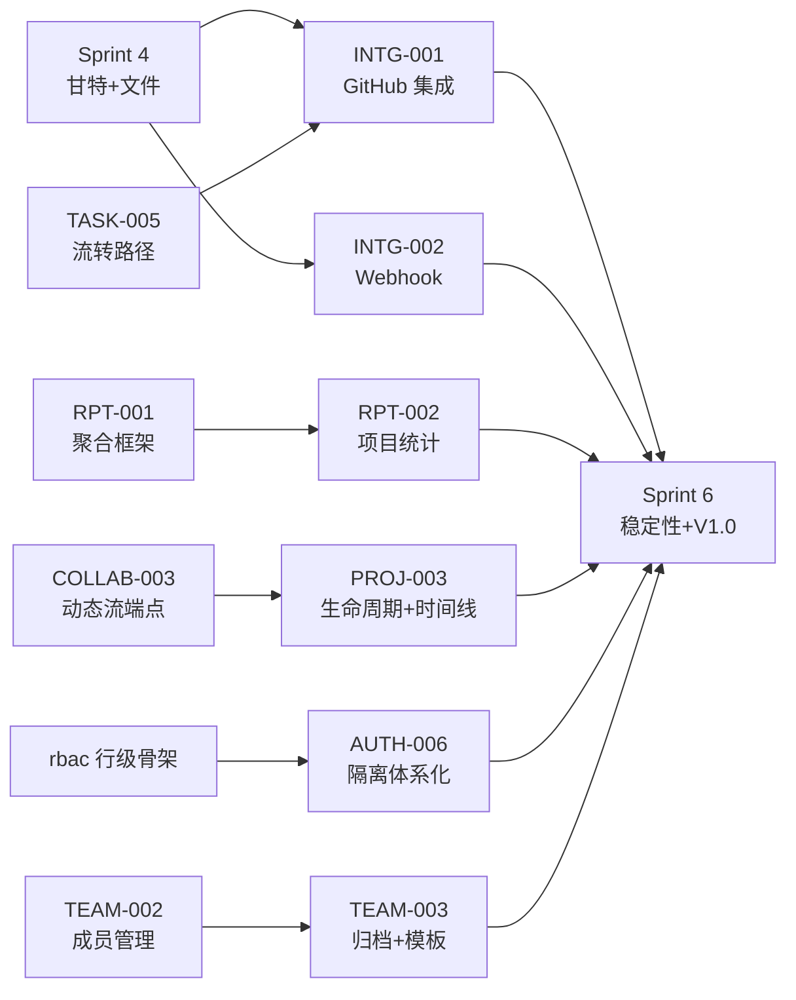

# Sprint 5 — 集成 + 标准版收尾 迭代概览

| 元信息项 | 内容 |
| --- | --- |
| 所属迭代 | Sprint 5 — 集成 + 标准版收尾（第 7 周） |
| 优先级 | P2（标准版完整级 · **标准版功能冻结点**） |
| 覆盖模块 | M9-INTG 第三方集成｜M10-RPT 数据报表｜M3-PROJ 项目管理｜M1-AUTH 账号权限｜M2-TEAM 团队管理 |
| 文档状态 | 待评审（Draft） |
| 最后更新日期 | 2026-09-01 |
| 上游依赖 | Sprint 0-4 全量（尤其 `TASK-005` 流转路径、`TASK-010`+`COLLAB-003` 动态管道、`RPT-001` 聚合框架、`PROJ-002` 归档动作、`rbac` `accessible_by` 骨架） |
| 下游消费 | `Sprint 6`（稳定性缓冲与 V1.0 发布）、`INTG-003/004`（P4 Slack/Zoom/OpenAPI）、`RPT-003/004`（P3 敏捷报表复用聚合框架）、`AUTH-010`（P3 全站审计复用行级矩阵）、`PROJ-004`（P3 项目集复用模板机制） |
| 迭代周期 | 5 个工作日，固定预留 20% 缓冲 |

---

## 1. 迭代目标

Sprint 5 是标准版的**收口迭代**：P2 优先级清单在此全部清零，功能面冻结，为 Sprint 6 的稳定性冲刺与 V1.0 发布让路。五条主线：

1. **GitHub 基础集成**——安装授权、仓库绑定、Issue 双向同步（幂等键驱动）、PR 关联任务、合并自动流转、Commit 挂载任务详情（`INTG-001`）；
2. **出站 Webhook**——订阅事件面、HMAC 签名、at-least-once 投递与死信（`INTG-002`，架构文档 §13.3 的工程化落地）；
3. **项目统计**——项目进度（状态组分布/完成率/逾期）与成员任务量（按人 open/done/逾期/工时），复用 `RPT-001` 聚合框架换维度（`RPT-002`）；
4. **项目生命周期**——四态启用（draft/active/archived/closed）与转换守卫、项目动态时间线产品化、项目模板（`PROJ-003`）；
5. **权限与治理收尾**——行级隔离体系化（四层过滤矩阵 + CI 静态守护）、账号禁用/启用联动（`AUTH-006`）、团队归档与全局模板下发（`TEAM-003`）。

## 2. 范围与边界（对齐需求文档 §8.2 P2 列）

| 模块 | 本迭代交付 | 明确不做（后置） |
| --- | --- | --- |
| 集成 | GitHub 基础集成（Issue 同步/PR 关联/合并改状态/Commit 挂载）、简单 Webhook | Slack/Zoom（P4）、只读 OpenAPI（P3）、签名校验高级配置（P3）、应用市场（P4） |
| 报表 | 项目进度统计、成员任务量统计 | 燃尽图/速率/累积流（P3 `RPT-003`）、健康度（P3）、导出（P3） |
| 项目 | 完整生命周期（四态+守卫）、项目动态时间线、项目模板 | 项目集（P3 `PROJ-004`）、跨项目依赖（P3）、归档合规（P4） |
| 权限 | 数据库行级隔离体系化、团队/项目成员权限分配收口、账号禁用/启用 | 部门/自定义角色（P3 `AUTH-007/008`）、SSO（P3）、审计日志全量（P3 `AUTH-010`） |
| 团队 | 团队归档、全局标签/基础状态模板、成员活跃度统计 | 多工作空间/层级治理（P3/P4）、合规策略（P4） |

## 3. 前置依赖

进入 Sprint 5 前必须满足：

- `TASK-005` 流转路径稳定（`INTG-001` 的「合并自动改状态」必须走同一守卫与 Activity 管道，不开旁路）。
- `TASK-010` + `COLLAB-003` 动态管道与 `stream_cursor` 端点可用（`PROJ-003` 时间线直接消费）。
- `RPT-001` 的 `PersonalStatsService` 框架（单条 aggregate + 口径单源纪律）经生产验证（`RPT-002` 换 project 维度复用）。
- `PROJ-002` 的 `archive/` 幂等动作与 `PERM_PROJECT_ARCHIVED` 通用守卫在线（`PROJ-003` 扩展守卫矩阵）。
- `rbac-permission-model.md` §6 的 `accessible_by` Manager 骨架已在关键 ViewSet 落地（`AUTH-006` 做全景收敛与 CI 守护）。
- Celery + RabbitMQ、Redis（限流/签名时间窗）可用；出网访问 `api.github.com` 已放行（`INFRA-002` 网络策略）。

## 4. 模块覆盖

| 文档 | 交付重点 | 关键数据结构 | 直接下游 |
| --- | --- | --- | --- |
| `INTG-001` | 安装流/双向同步/PR 关联/合并流转/Commit 挂载 | `IntegrationInstallation`、`Issue.external_id/external_source`（既有列点亮） | `INTG-003/004`（P4） |
| `INTG-002` | 订阅/签名/重试/死信/自动停用 | `WebhookEndpoint`、`WebhookDelivery` | P3 签名校验增强 |
| `RPT-002` | 项目进度 + 成员任务量 | 零新表（复用聚合框架） | `RPT-003/004`、`TASK-013` |
| `PROJ-003` | 四态守卫/时间线/模板 | 零新表（`ProjectTemplate` 唯一新表） | `PROJ-004`（项目集复用模板） |
| `AUTH-006` | 四层过滤矩阵/批量角色/账号启停/CI 守护 | 零新表（体系化收敛） | `AUTH-007~010`（P3） |
| `TEAM-003` | 归档/全局模板/活跃度 | `Workspace.archived_at` 加列 + `WorkspaceLabel` 新表 | P3 多工作空间治理 |

## 5. 统一工程约束

| 类别 | 约束 |
| --- | --- |
| 外部调用 | GitHub API 全走 `IntegrationInstallation` 持有的 installation token；速率预算受控（5000/h/installation），429 退避尊重 `X-RateLimit-Reset` |
| 入站验签 | GitHub Webhook 一律 `X-Hub-Signature-256` 常量时间比对；时间戳漂移 > 5 分钟拒绝（防重放） |
| 出站投递 | 严格照 [`api-conventions.md`](../architecture/api-conventions.md) §13.3：事件命名/载荷结构/HMAC 签名/6 次退避/死信/50 连败停用 |
| 口径单源 | `RPT-002` 全部指标从 `PersonalStatsService` 框架派生，禁止第二份口径表达式（`RPT-001` BR-01 纪律延续） |
| 集成写路径 | GitHub 触发的状态变更走 `TASK-005` 流转服务与 Activity 管道，`actor` 为系统账号，绝不直改 `Issue.state_id` |
| 行级红线 | 一切 ViewSet `get_queryset()` 以 `accessible_by` 起步；CI AST 检查「未调 super() / 未用 accessible_by」直接失败 |
| 生命周期 | 四态转换全部经转换守卫矩阵；closed 为终态（重开 = 新建副本决策，见 `PROJ-003` BR） |
| 异步 | 同步任务/投递/模板实例化全部 Celery 幂等；`on_commit` 后投递 |

## 6. 验收标准

- [ ] 6 份功能规格均含七章结构、Mermaid、ASCII 线框、逐端点 JSON、测试矩阵、竞品对标、验收清单。
- [ ] GitHub：安装→绑仓→Issue 双向同步（改标题/状态/评论三向验证）；PR 关联任务后 merge，任务经流转守卫自动进入完成态且 Activity 记录系统操作者；Commit 以 `RBT-123` 引用自动挂载。
- [ ] Webhook：订阅 `issue.created` 的接收方收到签名载荷并能校验通过（官方示例代码）；人为制造 5xx 验证 6 次退避与死信入列；50 连败自动停用并通知。
- [ ] 统计：项目进度条与成员任务量表和逐条筛选结果一致（口径单源验证）；10 万任务 P95 < 200ms。
- [ ] 生命周期：draft→active→archived→closed 全链演示，各态读写守卫正确；项目模板一键 instantiation（状态/标签/字段/目录四件套）。
- [ ] 权限：越权测试矩阵（四主体 × 四资源层）全绿；被禁用账号的既有 session 与 API Key 即时失效；CI 行级静态检查在故意破坏的分支上失败。
- [ ] 团队：归档后全员只读且可恢复；全局标签下发到全部项目且项目可覆盖；活跃度统计只显聚合不显明细。

## 7. 文档清单

| 序号 | 文件 | 一级标题 |
| --- | --- | --- |
| 1 | `INTG-001-github-basic.md` | GitHub 基础集成 |
| 2 | `INTG-002-webhook-basic.md` | 基础 Webhook 出站通知 |
| 3 | `RPT-002-project-stats.md` | 项目进度与成员任务量统计 |
| 4 | `PROJ-003-project-lifecycle.md` | 项目生命周期与动态时间线 |
| 5 | `AUTH-006-row-level-security.md` | 数据库行级隔离与成员权限分配 |
| 6 | `TEAM-003-team-archive-config.md` | 团队归档与全局模板配置 |

## 8. 排期

| 工作日 | 主线 A（集成） | 主线 B（治理收尾） | 当日验收 |
| --- | --- | --- | --- |
| Day 1 | `INTG-001` 安装流与仓库绑定 | `AUTH-006` 过滤矩阵与 CI 守护 | 安装闭环；矩阵测试绿 |
| Day 2 | `INTG-001` 同步与合并流转 | `PROJ-003` 四态守卫 | 双向同步；守卫矩阵 |
| Day 3 | `INTG-002` Webhook 投递链 | `PROJ-003` 时间线 + 模板 | 签名/重试/死信；模板 instantiation |
| Day 4 | `RPT-002` 双报表 | `TEAM-003` 归档与模板 | 口径一致；归档只读 |
| Day 5 | 联调、压测、无障碍 | 回归、文档评审、缓冲 | 验收清单全部通过 |

## 9. 相关文档

- 前置迭代：[`docs/sprint-4-gantt-file/sprint-overview.md`](../sprint-4-gantt-file/sprint-overview.md)
- 原始需求：[`docs/需求文档.md`](../需求文档.md) §3.9 / §8.2
- 下一迭代：`docs/sprint-6-stabilize/sprint-overview.md`（Sprint 6 — 稳定性缓冲，标准版 V1.0 发布）
