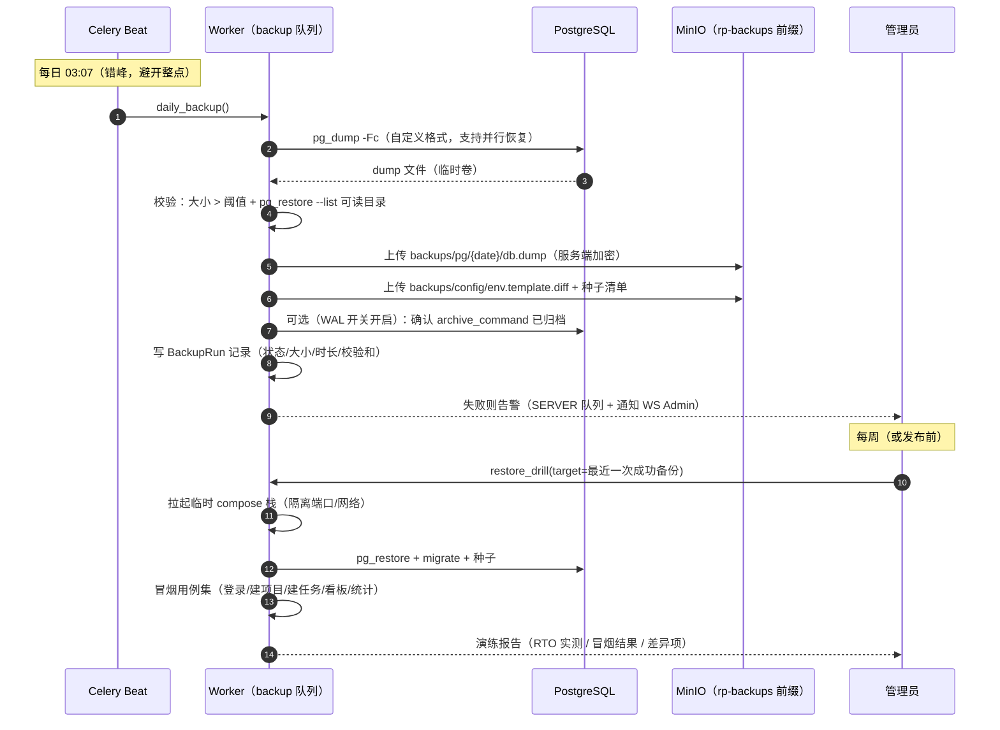

# 接口限流 / 数据备份 / 生产部署配置

| 元信息项 | 内容 |
| --- | --- |
| 文档编号 | INFRA-005 |
| 所属迭代 | Sprint 6 — 稳定性缓冲（第 8 周 · 标准版 V1.0 发布迭代） |
| 优先级 | P2（标准版完整级 · **生产可用的运维底座**） |
| 所属模块 | M11-INFRA｜部署运维 |
| 文档状态 | 待评审（Draft） |
| 最后更新日期 | 2026-09-01 |
| 上游依赖 | `INFRA-002`（compose 基线与生产 profile、服务矩阵、安全基线 P0 集）、`INFRA-004`（六件套中间件——**`RateLimitHeaderMiddleware` 空实现由本文档填充**；错误码注册表含 `RATE_LIMIT_EXCEEDED`；结构化日志与 request_id）、`api-conventions.md`（**§7 限流三层规范——配额表/响应头/429 语义为冻结契约**；§13.5 日志） |
| 下游消费 | `QA-001`（发布 checklist 消费部署与备份验收）、`INFRA-006`（P4 高可用继承备份与 K8s 资产）、`INTG-002`（Webhook 出站不计配额的例外已在 §7.2 表中声明）、`AUTH-012`（P4 接口风控） |
| 上游依据 | `docs/需求文档.md` §8.2 部署运维行 P2 列（接口限流、自动数据备份脚本、生产环境部署配置 Docker/K8s）；§9.1 Sprint 6 定义 |
| 关联架构文档 | [`api-conventions.md`](../architecture/api-conventions.md)（§7 全文）、[`monorepo-structure.md`](../architecture/monorepo-structure.md)（deploy/ 目录与脚本落位）、[`tech-stack.md`](../architecture/tech-stack.md)（镜像 tag 锁定与 Trivy 门禁） |
| 对标基线 | Plane 开源版 setup（compose 单机、无限流/备份体系） · Ones 企业运维（备份留存/私有化） · 通用云原生实践（Nginx+应用双层限流、3-2-1 备份原则） |
| 工作量估算 | 后端 3 人日 / 运维 3 人日 / 联调与测试 1.5 人日，合计 **7.5 人日** |

---

## 1. 概述

### 1.1 功能定位

P0-P5 交付了功能与工程规范，但生产上线还差三块底座，全部由本文档收口：

1. **接口限流**——`api-conventions.md` §7 冻结了「三层防护 + 配额表 + 全响应限流头」的设计，P0 只落了 Nginx 粗粒度边缘限流与登录防爆破，`INFRA-004` 预留了空中间件。本迭代把三层**全量落地**：L1 Nginx 按 IP 兜底、L2 DRF 按主体（用户/Key/匿名）配额、L3 高成本端点专用 throttle，并把 `X-RateLimit-*` 头与 429 退避闭环打通到前端。
2. **数据备份**——「生产可用」的底线不是「能跑」而是「丢了能救」。本迭代交付：每日 `pg_dump` 全量（MinIO 版本化保留 30 天）+ 可选 WAL 归档（RPO 从 24h 收紧到分钟级）+ 配置备份 + **恢复演练脚本**（RTO ≤ 30 分钟，演练是验收不是选项）。
3. **生产部署配置**——`INFRA-002` 的 `docker-compose.prod.yml` 之上补齐：日志轮转、只读文件系统与能力裁剪、网络分段（`rp-edge` / `rp-internal`）、K8s 清单骨架（Deployment/Service/Ingress/HPA/PDB + beat 单副本约束）、环境检查清单与发布前 checklist（供 `QA-001` 发布流程消费）。

一句话：**本文档让「docker compose up 能跑的演示」变成「敢把客户数据放上去的生产栈」。**

### 1.2 关键约定一：三层限流的职责划分

> ⚠️ 三层不是重复建设，各有各的敌人——职责错位（比如在 Nginx 按用户限流）是限流实现最常见的失败模式。

| 层级 | 位置 | 键（维度） | 敌人 | 响应形态 |
| --- | --- | --- | --- | --- |
| L1 边缘 | `apps/proxy` Nginx `limit_req_zone` | **IP** | 扫描器、CC 攻击、失控脚本——在流量到达应用前挡掉 | Nginx 429 JSON（对齐 `INFRA-004` §4.10 网关错误体规范） |
| L2 应用 | DRF Throttle（Redis 计数） | **用户 / API Key / 匿名 IP**（认证主体） | 正常但过量的单一用户/Key——业务级公平性 | 经全局异常处理器收敛为 `RATE_LIMIT_EXCEEDED` 信封 + `Retry-After` |
| L3 端点 | ViewSet 级 `throttle_classes` 覆盖 | 按端点（叠加在 L2 之上） | 高成本端点（报表聚合/搜索/预签名/批量）被拖垮全站 | 同 L2 |

执行顺序：**L1 → L2 → L3**（层层放行才到达视图）。L1 挡掉的请求应用层无感知（其配额不被消耗）；L2/L3 共用 Redis 计数与同一套响应头装配。

**为什么 L1 用 IP 而 L2 不用**：Nginx 看不到认证态（Session 在 Cookie、Key 在 Header，边缘解析认证等于把认证逻辑复制一份）；DRF 拿得到 `request.user` / `X-API-Key`。两层各用自己「看得见的最强身份」。

### 1.3 关键约定二：备份的 RPO/RTO 目标

| 指标 | 目标 | 依据 |
| --- | --- | --- |
| RPO（能丢多少数据） | 基线 ≤ 24h（每日全量）；**启用 WAL 归档的实例 ≤ 5min** | 全量窗口内丢失 = 一天；WAL 归档把窗口压到归档延迟 |
| RTO（多久能恢复） | ≤ 30 分钟（单机全量恢复 + 迁移 + 冒烟） | 恢复演练实测为准（§4.4.4），超标即修复演练流程而非放宽目标 |
| 保留 | 30 天（MinIO 对象版本化 + 生命周期规则自动淘汰） | 3-2-1 原则的简化版：1 介质（MinIO 卷）× 版本隔离；异地副本 P4 `INFRA-006` |
| 覆盖 | PostgreSQL 全库 + MinIO `rp-uploads` 桶 + 配置（环境变量清单/种子） | 恢复目标 =「新机器拉起一套等价环境」 |

### 1.4 交付内容

| # | 能力 | 说明 |
| --- | --- | --- |
| 1 | L1 边缘限流 | `limit_req_zone` 三区（api 默认 / auth 敏感 / public 匿名）+ 429 JSON 对齐 + 白名单（健康检查/内网） |
| 2 | L2 应用限流 | DRF Throttle 家族（用户/Key/匿名/登录）+ Redis 滑动窗口 + 端点配额映射（§7.2 全表落地） |
| 3 | L3 端点限流 | 报表 10/min、搜索 30/min、预签名 30/min、批量 10/min 覆盖 |
| 4 | 限流头中间件 | `RateLimitHeaderMiddleware` 填充：全响应 `X-RateLimit-*`，429 追加 `Retry-After`（`INFRA-004` 空实现兑现） |
| 5 | 备份执行 | `pg_dump` 每日全量（beat）+ WAL 归档（可选开关）+ MinIO 版本化/生命周期 + 配置备份 |
| 6 | 恢复演练 | `restore-drill` 脚本：新库恢复 + 迁移 + 冒烟用例 + 计时报告 |
| 7 | 部署加固 | 日志轮转、只读根文件系统、`cap_drop`、网络分段、healthcheck 强化 |
| 8 | K8s 骨架 | Deployment/Service/Ingress/HPA/PDB 清单 + beat `Recreate`×1 约束 |
| 9 | 发布资产 | 环境检查清单 + 发布前 checklist + 运维手册（备份/恢复/限流调参） |

### 1.5 范围边界

| 能力 | 本文档（P2 / V1.0） | 归属 |
| --- | --- | --- |
| 三层限流 + 配额表 + 头/退避闭环 | ✅ | — |
| 每日全量备份 + WAL 归档（可选）+ 恢复演练 | ✅ | — |
| compose 生产加固 + K8s 清单骨架 | ✅ | — |
| 按租户/套餐动态配额 | ❌（静态配额，改配置需重启/发版） | P4 商业化 |
| 分布式限流中心（如 Sentinel/Envoy RAT） | ❌（Redis 单点计数够用） | P4 |
| 异地灾备 / 跨区域复制 / PITR 演练自动化 | ❌ | P4 `INFRA-006` |
| K8s Operator / Helm Chart 商店化 / 自动扩缩容策略调优 | ❌（骨架 + HPA 占位） | P4 |
| 灰度发布 / 蓝绿 | ❌（提供回滚步骤，`QA-001` 消费） | P4 |
| 集中式日志（ELK/Loki）、全链路 APM | ❌（json-file 轮转 + 结构化字段定型） | P4 `INFRA-006` |
| 高可用集群（多副本 DB/Redis/MQ） | ❌（api/worker 已 ×2；有状态服务单实例） | P4 `INFRA-006` |

### 1.6 前置依赖

| 依赖 | 内容 | 阻塞原因 |
| --- | --- | --- |
| `INFRA-002` | 生产 profile（`${VAR:?}` 强制、副本数、beat×1、端口收敛） | 加固的基线；重复项以本文档为增量 |
| `INFRA-004` | 中间件顺序与 `RateLimitHeaderMiddleware` 空实现、`RATE_LIMIT_EXCEEDED` 收敛路径、`Retry-After` 装配（handlers 已写） | L2/L3 的响应契约已定，本文档只填触发侧 |
| `api-conventions.md` §7 | 配额表与头规范为**冻结契约**，本文档是落地不是重新设计 | — |
| `tech-stack.md` §9 | Trivy 镜像扫描门禁（发布 checklist 引用） | — |

### 1.7 竞品参考

| 竞品 | 参考点 | 处置 |
| --- | --- | --- |
| Plane 开源版 | `setup.sh` + compose 单机部署；无备份体系、限流仅 Nginx 层 | 部署基线同源；备份与三层限流为本系统增量（对齐其 Cloud 商业版才有的运维面） |
| Plane | DRF 侧无默认启用 throttle | L2/L3 全量启用并文档化 |
| Ones | 企业运维：定时备份、留存策略、私有化部署检查清单 | 备份/演练/checklist 范式采纳；留存策略 P4 |
| 通用实践 | Nginx+应用双层限流、3-2-1 备份、恢复演练文化 | 直接采纳（「没演练过的备份等于没有备份」写入验收） |

---

## 2. 业务逻辑

### 2.1 一次请求穿越三层限流

```mermaid
flowchart TD
    A["客户端请求"] --> B["L1 Nginx limit_req（按 IP）"]
    B -->|"超 300r/min（burst 60）"| B1["429 JSON（网关错误体）<br/>应用层零感知"]
    B -->|放行| C{"路径类别"}
    C -->|/api/v1/auth/*| D["L1-auth 区：5r/s<br/>（登录/注册/重置敏感区）"]
    C -->|/api/v1/public/*| E["L1-public 区：更紧匿名额度"]
    C -->|其他 api| F["放行至应用"]
    D -->|超| B1
    E -->|超| B1
    D --> F
    E --> F
    F --> G["L2 DRF Throttle（Redis）"]
    G -->{"认证主体"}
    G -->|Session 用户| H["UserRateThrottle 60/min"]
    G -->|X-API-Key| I["KeyRateThrottle 60/min"]
    G -->|匿名| J["AnonRateThrottle 30/min"]
    H --> K["L3 端点级（叠加）：<br/>报表 10/min · 搜索 30/min ·<br/>预签名 30/min · 批量 10/min"]
    I --> K
    J --> K
    K -->|"超"| L["Throttled → 全局异常处理器<br/>→ 429 RATE_LIMIT_EXCEEDED 信封<br/>+ Retry-After"]
    K -->|放行| M["视图执行"]
    L --> N["前端 axios 拦截器：<br/>指数退避 1s→2s→4s（±20% 抖动）≤3 次<br/>幂等方法自动重试"]
    M --> O["响应经 RateLimitHeaderMiddleware<br/>附 X-RateLimit-Limit/Remaining/Reset"]
```

**配额落地总表**（`api-conventions.md` §7.2 契约的逐行映射，实现位见 §4.3）：

| 主体 / 端点 | 配额 | 层 | 实现载体 |
| --- | --- | --- | --- |
| 任意来源（按 IP） | 300 req/min（burst 60） | L1 | `limit_req_zone $binary_remote_addr zone=rp_api` |
| 登录/注册/重置（按 IP） | 10 req/min | L1+L2 | Nginx auth 区 + `AuthBurstRateThrottle` |
| 登录失败锁定 | 5 次失败 / 15 分钟 / (IP+账号) | L2 | `AUTH_TOO_MANY_ATTEMPTS`（P1 既有，纳入总表管理） |
| 已认证用户（内部 API） | 60 req/min | L2 | `UserRateThrottle` |
| API Key（Open API） | 60 req/min | L2 | `KeyRateThrottle` |
| OAuth 应用 | 60 req/min / (用户×应用) | L2 | `OAuthAppRateThrottle`（复合键） |
| 匿名（public API） | 30 req/min | L1+L2 | public 区 + `AnonRateThrottle` |
| 文件预签名申请 | 30 req/min | L3 | `PresignRateThrottle` |
| 报表聚合端点 | 10 req/min | L3 | `ReportRateThrottle` |
| 搜索端点 | 30 req/min | L3 | `SearchRateThrottle` |
| 批量端点 | 10 req/min，单次 ≤ 100 条 | L3+Serializer | `BulkRateThrottle` + `VALIDATION_BULK_LIMIT_EXCEEDED` |
| Webhook 出站投递 | **不计入**用户配额（独立队列） | 豁免 | 任务侧自有限流（重试退避） |

### 2.2 备份日循环与恢复演练



### 2.3 业务规则汇总

| 编号 | 规则 | 判定位置 | 违反后果 |
| --- | --- | --- | --- |
| BR-01 | 配额数值以 `api-conventions.md` §7.2 表为准；修改配额 = 修改该冻结文档（走 ADR），本实现仅消费配置 | 评审约束 | 评审拒绝 |
| BR-02 | 全部 2xx/4xx/5xx 响应均携带 `X-RateLimit-Limit/Remaining/Reset`；`Retry-After` 仅 429 出现（§7.3） | 中间件 | CI 断言 |
| BR-03 | L2 计数用 Redis `INCR + EXPIRE`（固定窗口起步，窗口键含周期起点）；跨实例共享（api ×2 副本同计数） | Throttle | — |
| BR-04 | L2 判定顺序：API Key → OAuth → Session → 匿名；**只按最强身份计一次**（已认证不重复落匿名桶） | Throttle | — |
| BR-05 | 健康检查（`/healthz` `/readyz`）与内网监控路径入 L1 白名单（`geo`/`allow`），不消耗配额也不被限 | Nginx | — |
| BR-06 | 限流响应体与信封规范一致：`RATE_LIMIT_EXCEEDED` + `details[{field:"retry_after", code:"RETRY_AFTER"}]` + `request_id`（L2/L3）；L1 为网关 JSON（无 request_id，附 `X-RateLimit-*`） | 处理器/Nginx | — |
| BR-07 | 备份每日 03:07 全量；产物三副本校验（大小阈值 + `pg_restore --list` + SHA-256 记录）；连续失败 2 次告警 WS Admin | beat/worker | 告警 |
| BR-08 | 备份保留 30 天（MinIO 生命周期规则 + beat 双保险清扫）；`rp-backups` 前缀独立于 `rp-uploads`（不占用户配额） | S3 规则 | — |
| BR-09 | 恢复演练：至少每周一次 + 每次发布前强制；RTO 实测 > 30 分钟视为演练失败，修流程而非改目标 | 脚本 | 阻塞发布 |
| BR-10 | 备份内容含配置：环境变量清单（密钥以占位符记录，**绝不明文入库**）、种子数据清单、迁移版本号 | 脚本 | 评审拒绝（泄密） |
| BR-11 | 生产部署仅暴露 proxy 80/443；`beat` 恰好 1 副本（compose `replicas:1` / K8s `strategy: Recreate`）；全部镜像精确 tag | compose/K8s | 发布 checklist 项 |
| BR-12 | 日志轮转 json-file `50m × 3` 全服务；容器日志不得写入容器层（只读根文件系统 + tmpfs 挂载可写路径） | compose | — |
| BR-13 | 网络分段：`rp-edge`（proxy）↔ `rp-internal`（其余）；proxy 是唯一跨段节点；DB/Redis/MQ/MinIO 不出 `rp-internal` | compose/K8s NetworkPolicy | — |
| BR-14 | 限流/备份关键事件入结构化日志（`event=rate_limited` / `event=backup_failed`，含 request_id/主体/配额键），供发布后观察（`QA-001` §4.6 消费） | 日志 | — |

### 2.4 异常处理

| 场景 | 表现 | 处理 | 错误码 |
| --- | --- | --- | --- |
| L1 触发（IP 超额） | Nginx 429 JSON + `Retry-After` | 应用零感知；前端同退避逻辑 | 网关体（无 request_id） |
| L2/L3 触发 | 429 信封 + `Retry-After` + 剩余配额头归零 | 前端 `ErrorToast`（`INFRA-004` §3.5）+ 退避 | `RATE_LIMIT_EXCEEDED` |
| Redis 不可达（计数失败） | **放行并告警**（fail-open）——限流是保护不是依赖；`SERVER_ERROR` 日志 | 监控升级（`QA-001` 发布后观察项） | — |
| 备份失败 | `BackupRun(status=failed)` + 告警 | 连续 2 次失败阻塞发布 checklist | — |
| 恢复演练超时 | 报告标记 FAILED | 修流程（并行恢复/前置拉镜像）后重演 | — |
| WAL 归档积压 | `pg_stat_archiver` 落后 > 1h | 告警；必要时关闭开关回退全量基线 | — |
| K8s HPA 指标缺失 | 不扩缩 | 发布 checklist 项（metrics-server 部署核查） | — |

### 2.5 边界条件

| 边界场景 | 限制值 | 超出处理 |
| --- | --- | --- |
| 单 IP 突发 | burst 60（L1 排队桶） | 排队 → 429 |
| NAT 多人同 IP | L1 300r/min 通常不触发；触发放行至 L2 按用户精确限 | — |
| 固定窗口边界突刺 | 窗口切换双倍瞬时 | V1.0 接受（60/min 量级无碍）；滑动窗口 P4 优化 |
| 备份单次时长 | > 30 分钟告警（数据量增长信号） | 评估增量备份（P4） |
| dump 大小 | > 磁盘 70% 触发告警 | 清理策略核查 |
| 限流头精度 | `Reset` 秒级 Unix 时间戳 | — |
| 匿名与认证并存切换 | 认证后立即按用户桶重计 | — |

---

## 3. UI/UX 设计

> 本文档的「用户」是**系统管理员**（admin 应用）与**运维者**（CLI/手册）。终端用户唯一感知面是 429 退避提示（`INFRA-004` §3.5 既有，此处仅验证闭环）。

### 3.1 admin：限流监控页（实例 → 运维 → 限流）

```
┌──────────────────────────────────────────────────────────────────────┐
│ 限流概览                          [导出报告]            2026-09-01 14:32│
├──────────────────────────────────────────────────────────────────────┤
│  当前 1 小时                          24h 趋势（折线，按层堆叠）         │
│  ┌────────────┐ ┌────────────┐ ┌────────────┐ ┌────────────┐        │
│  │ L1 边缘拦截 │ │ L2 应用限流 │ │ L3 端点限流 │ │ 峰值用户    │        │
│  │   1,284    │ │    372     │ │     96     │ │ 41 r/min   │        │
│  │  ▲ 12%     │ │  ▼ 3%      │ │  ▲ 1%      │ │ (上限 60)  │        │
│  └────────────┘ └────────────┘ └────────────┘ └────────────┘        │
├──────────────────────────────────────────────────────────────────────┤
│ 429 TOP 端点（24h）                    429 TOP 主体（脱敏）            │
│ ┌──────────────────────────┬───────┐ ┌────────────────────┬───────┐ │
│ │ GET …/gantt/             │  412  │ │ user:9f3a…         │  58   │ │
│ │ GET …/search/            │  296  │ │ key:rp_live_7cK2…  │  41   │ │
│ │ GET …/reports/…          │   88  │ │ anon:203.0.113.7   │  212  │ │
│ └──────────────────────────┴───────┘ └────────────────────┴───────┘ │
│  ⓘ 配额冻结于 api-conventions §7.2；调整需走 ADR。当前配置快照 [查看]   │
└──────────────────────────────────────────────────────────────────────┘
```

| 元素 | 规格 |
| --- | --- |
| 计数卡 | 近 1h 各层拦截量 + 环比；点击下钻事件列表（结构化日志检索，含 request_id） |
| TOP 表 | 端点维度 / 主体维度（IP 与 Key 前缀脱敏展示） |
| 配额快照 | 只读渲染当前生效配置（含「配置漂移」红标：运行配置 ≠ 声明配置时告警） |

### 3.2 admin：备份管理页（实例 → 运维 → 备份）

```
┌──────────────────────────────────────────────────────────────────────┐
│ 备份   上次成功：今天 03:09 · 保留 30 天 · 下次：明天 03:07              │
│        [立即备份] [恢复演练…]                            RPO 24h / RTO 30m│
├──────┬──────────────┬────────┬────────┬────────┬────────┬───────────┤
│ 状态  │ 备份点        │ 大小    │ 耗时    │ 校验    │ 演练    │ 操作       │
├──────┼──────────────┼────────┼────────┼────────┼────────┼───────────┤
│ ●成功 │ 09-01 03:07  │ 1.2 GB │ 6m12s  │ SHA-256│ 3 天前 ✔│ [演练][下载]│
│ ●成功 │ 08-31 03:07  │ 1.2 GB │ 6m04s  │ ✔      │ 10 天前 ✔│ [演练][下载]│
│ ●失败 │ 08-30 03:07  │ —      │ —      │ —      │ —      │ [日志]     │
├──────┴──────────────┴────────┴────────┴────────┴────────┴───────────┤
│ 恢复演练报告（最近）                                                    │
│  08-29 14:02 · RTO 实测 22m41s · 冒烟 18/18 通过 · [完整报告]           │
└──────────────────────────────────────────────────────────────────────┘
```

| 元素 | 规格 |
| --- | --- |
| 立即备份 | 手动触发（throttle：1 次/10 分钟）；进行中显示进度与耗时 |
| 演练 | 选择备份点 → 二次确认（提示将拉起隔离栈）→ 跳转演练任务页（202 模式） |
| 失败行 | 展开显示失败阶段（dump/校验/上传）与日志片段 + request/task id |
| 下载 | 生成 5 分钟预签名（仅 `instances/*` 权限） |

### 3.3 发布前 checklist（admin 表单化）

发布流程（`QA-001` §4.6）消费的本清单在 admin 呈现为可勾选表单：每项含负责人/校验方式/留痕（谁在何时勾的），全绿才允许「标记发布就绪」。条目清单见 §4.5.4。

### 3.4 空状态 / 加载 / 失败

| 场景 | 处置 |
| --- | --- |
| 无备份记录 | 「首次备份将在 03:07 执行 · [立即备份]」 |
| 限流数据暂无 | 空图 + 「暂无 429 记录（好事）」 |
| Redis 失联（fail-open 中） | 页面顶部红条「限流计数降级中——请求在放行，请检查 Redis」 |
| 演练进行中 | 进度条（阶段：拉栈/恢复/迁移/冒烟）+ 取消（放弃演练栈） |

### 3.5 响应式与无障碍

- admin 仅桌面（≥1280px）；表格键盘遍历；状态点冗余文本（●成功 → 「成功」列）。
- 告警红条 `role="alert"`；演练报告可下载（无障碍 PDF/HTML 双格式）。

---

## 4. 技术架构

### 4.1 数据模型

**一张运维表**（其余全部是配置与脚本产物）：

```python
# apps/api/plane/db/models/backup.py
class BackupRun(BaseModel):
    """备份执行记录 —— 状态/产物/校验/演练关联"""

    class Status(models.TextChoices):
        RUNNING = "running", "进行中"
        SUCCESS = "success", "成功"
        FAILED = "failed", "失败"

    class Kind(models.TextChoices):
        DAILY = "daily", "每日全量"
        MANUAL = "manual", "手动"
        DRILL = "drill", "恢复演练"          # 演练也入账（BR-09 可追溯）

    kind = models.CharField(max_length=8, choices=Kind.choices, default=Kind.DAILY)
    status = models.CharField(max_length=8, choices=Status.choices,
                              default=Status.RUNNING, db_index=True)
    started_at = models.DateTimeField()
    finished_at = models.DateTimeField(null=True, blank=True)
    dump_size_bytes = models.BigIntegerField(null=True, blank=True)
    checksum_sha256 = models.CharField(max_length=64, blank=True)
    object_key = models.TextField(blank=True, verbose_name="MinIO 对象键")
    drill_report = models.JSONField(default=dict,
        verbose_name="演练报告", help_text="{rto_seconds, smoke_passed, smoke_total, notes}")
    error = models.TextField(blank=True)

    class Meta(BaseModel.Meta):
        db_table = "backup_runs"
        ordering = ("-started_at",)
        indexes = [models.Index(fields=["status", "-started_at"], name="idx_backup_recent")]
```

> 限流**不建表**：L1 在 Nginx 共享内存，L2/L3 在 Redis；可观测面走结构化日志（BR-14），admin 聚合页查询日志索引（P2 为 `docker logs` + JSON 过滤脚本，集中式日志 P4）。

### 4.2 API 定义

| # | 方法 | 路径 | 描述 | 权限 | 成功码 |
| --- | --- | --- | --- | --- | --- |
| 1 | `POST` | `/api/v1/instances/backups/` | 立即备份（10 分钟内限 1 次） | `instances` 管理（系统管理员） | `202` |
| 2 | `GET` | `/api/v1/instances/backups/` | 备份记录列表（游标） | 同上 | `200` |
| 3 | `POST` | `/api/v1/instances/backups/{id}/drill/` | 触发恢复演练 | 同上 | `202` |
| 4 | `GET` | `/api/v1/instances/backups/{id}/download-url/` | 产物下载预签名（5 分钟） | 同上 | `200` |
| 5 | `GET` | `/api/v1/instances/rate-limit/summary/` | 限流概览聚合（近 1h/24h） | 同上 | `200` |

**`GET …/rate-limit/summary/` 响应示例**

```json
{
  "status": "success",
  "data": {
    "last_1h": { "edge_blocked": 1284, "app_blocked": 372, "endpoint_blocked": 96,
                 "peak_user_rpm": 41 },
    "config_snapshot": {
      "edge_ip_per_min": 300, "user_per_min": 60, "anon_per_min": 30,
      "report_per_min": 10, "search_per_min": 30, "bulk_per_min": 10,
      "source": "api-conventions §7.2（冻结）" },
    "degraded": false
  },
  "meta": { "generated_at": "2026-09-01T14:32:00.000Z" }
}
```

**失败响应 `429`（立即备份过于频繁）**

```json
{
  "status": "error",
  "error": {
    "code": "RATE_LIMIT_EXCEEDED",
    "message": "备份操作过于频繁，请在 9 分钟后重试",
    "details": [{ "field": "retry_after", "code": "RETRY_AFTER", "message": "543" }],
    "request_id": "01JCBG6F9DH8A1B7C5D9E0F2G3"
  }
}
```

> 限流本身**无业务端点**——它是中间件/网关行为；上述仅为运维观测面。

### 4.3 三层限流实现

#### 4.3.1 L1：Nginx 边缘限流（`apps/proxy/conf.d/rate-limit.conf`）

```nginx
# ─────────────────────────────────────────────────────────────
# 三区定义（共享内存，全员 10MB 起步；rate 与 §7.2 表一致）
# ─────────────────────────────────────────────────────────────
limit_req_zone $binary_remote_addr zone=rp_api:10m    rate=5r/s;   # ≈300r/min
limit_req_zone $binary_remote_addr zone=rp_auth:2m    rate=10r/m;  # 登录/注册/重置
limit_req_zone $binary_remote_addr zone=rp_public:4m  rate=1r/s;   # 匿名公开面 30r/min

# 429 统一 JSON（对齐 INFRA-004 §4.10 网关错误体：无 request_id，附限流头）
limit_req_status 429;
error_page 429 = @rate_limited;

# ─────────────────────────────────────────────────────────────
# server 内挂载（节选自 apps/proxy/conf.d/api.conf）
# ─────────────────────────────────────────────────────────────
# geo 白名单：健康检查与内网监控不消耗配额（BR-05）
geo $rp_internal {
    default        0;
    10.0.0.0/8     1;
    172.16.0.0/12  1;
    192.168.0.0/16 1;
}
map $rp_internal $rp_limit_api {
    0    $binary_remote_addr;
    1    "";                       # 空键 = 不限流
}

location /api/v1/auth/ {
    limit_req zone=rp_auth burst=5 nodelay;        # 突发 5 直拒（防爆破扫描）
    limit_req_log_level warn;
    proxy_pass http://api;
}

location /api/v1/public/ {
    limit_req zone=rp_public burst=10 nodelay;
    proxy_pass http://api;
}

location /api/v1/ {
    limit_req zone=rp_api burst=60 nodelay;        # burst 60 排队桶（§7.1）
    proxy_pass http://api;
}

location ~ ^/(healthz|readyz)$ {
    limit_req off;                                  # 白名单路径
    proxy_pass http://api;
}

location @rate_limited {
    default_type application/json;
    add_header X-RateLimit-Limit  $limit_req_rate always;   # 头仍下发（BR-02）
    add_header Retry-After 60 always;
    return 429 '{"status":"error","error":{"code":"RATE_LIMIT_EXCEEDED",'
                '"message":"请求过于频繁，请稍后重试"}}';
}
```

> `nodelay` 取舍：`burst` 桶内请求立即转发不排队（低延迟），超出即拒——排队模式（无 nodelay）会在突发时人为增加尾延迟，与 P95 门禁冲突。

#### 4.3.2 L2/L3：DRF Throttle 家族（Redis 计数）

```python
# apps/api/plane/base/throttling.py
import time

from django.core.cache import cache
from rest_framework.throttling import SimpleRateThrottle


class RedisRateThrottle(SimpleRateThrottle):
    """L2 基类：Redis 固定窗口计数（BR-03/04）。

    - cache 键含窗口起点（固定窗口），跨 api 副本共享
    - Redis 失联 fail-open（§2.4）：限流是保护不是依赖
    """
    scope: str = ""

    def allow_request(self, request, view):
        if self.rate is None:
            self.rate = self.get_rate()
        self.num_requests, self.duration = self.parse_rate(self.rate)
        key = self.get_cache_key(request, view)
        if key is None:                       # 白名单/豁免主体
            return True
        window = int(time.time() // self.duration)
        full_key = f"rl:{self.scope}:{key}:{window}"
        try:
            hits = cache.incr(full_key)
            if hits == 1:
                cache.expire(full_key, self.duration)
        except Exception:                     # Redis 失联：放行 + 告警日志
            logger.warning("event=rate_limit_degraded scope=%s", self.scope)
            return True
        self.wait = self.duration - (time.time() % self.duration)
        return hits <= self.num_requests

    def retry_after(self):                     # Retry-After 装配（§7.3）
        return max(1, int(self.wait or 1))


class UserRateThrottle(RedisRateThrottle):
    scope = "user"
    rate = "60/min"

    def get_cache_key(self, request, view):
        if request.user and request.user.is_authenticated:
            return f"u:{request.user.id}"
        return None                            # 未认证交给匿名类


class ApiKeyRateThrottle(RedisRateThrottle):
    scope = "apikey"
    rate = "60/min"

    def get_cache_key(self, request, view):
        key_id = getattr(request, "api_key_id", None)   # 认证中间件已解析
        return f"k:{key_id}" if key_id else None


class AnonRateThrottle(RedisRateThrottle):
    scope = "anon"
    rate = "30/min"

    def get_cache_key(self, request, view):
        if request.user and request.user.is_authenticated \
           or getattr(request, "api_key_id", None):
            return None                        # BR-04：已认证不落匿名桶
        return f"a:{self.get_ident(request)}"


class AuthBurstRateThrottle(RedisRateThrottle):
    """登录/注册/重置：10/min（账号失败锁定 5/15min 为 P1 既有独立机制）"""
    scope = "auth"
    rate = "10/min"


# ── L3：端点级（叠加于 L2 之上；ViewSet 覆盖 throttle_classes）────
class ReportRateThrottle(RedisRateThrottle):
    scope = "report";  rate = "10/min"        # 报表聚合（RPT-*）

class SearchRateThrottle(RedisRateThrottle):
    scope = "search";  rate = "30/min"        # 搜索端点

class PresignRateThrottle(RedisRateThrottle):
    scope = "presign"; rate = "30/min"        # 文件预签名申请

class BulkRateThrottle(RedisRateThrottle):
    scope = "bulk";    rate = "10/min"        # 批量端点（另受 ≤100 条校验）
```

**DRF 配置与端点覆盖（settings/production.py 增量）**

```python
REST_FRAMEWORK = {
    "DEFAULT_THROTTLE_CLASSES": [
        "plane.base.throttling.ApiKeyRateThrottle",   # 判定顺序即列表序（BR-04）
        "plane.base.throttling.UserRateThrottle",
        "plane.base.throttling.AnonRateThrottle",
    ],
    "DEFAULT_THROTTLE_RATES": {
        "user": "60/min", "apikey": "60/min", "anon": "30/min",
        "auth": "10/min", "report": "10/min", "search": "30/min",
        "presign": "30/min", "bulk": "10/min",
    },
}
# ViewSet 侧示例：报表视图追加 L3
# throttle_classes = ReportRateThrottle,          # RPT 聚合端点
# throttle_classes = [SearchRateThrottle],        # 全局搜索
# throttle_classes = [PresignRateThrottle],       # FILE presign
# throttle_classes = [BulkRateThrottle],          # issues/bulk
```

#### 4.3.3 `RateLimitHeaderMiddleware` 填充（兑现 `INFRA-004` §4.6 ③ 空实现）

```python
# apps/api/plane/base/middleware.py —— ③ 号中间件（位置不变：第 3 层）
class RateLimitHeaderMiddleware:
    """全响应注入 X-RateLimit-*（BR-02）；429 追加 Retry-After（§7.3）。

    数据来源：视图阶段 DRF throttle 写入 request._throttle_state
    （allow_request 成功后由基类回填 limit/remaining/reset）。
    """

    def __init__(self, get_response):
        self.get_response = get_response

    def __call__(self, request):
        response = self.get_response(request)
        state = getattr(request, "_throttle_state", None)
        if state:
            response.headers["X-RateLimit-Limit"] = str(state.limit)
            response.headers["X-RateLimit-Remaining"] = str(state.remaining)
            response.headers["X-RateLimit-Reset"] = str(state.reset)  # Unix 秒
        if response.status_code == 429:
            wait = request.META.get("HTTP_RETRY_AFTER") or getattr(
                getattr(request, "_throttle", None), "wait", None)
            response.headers.setdefault("Retry-After", str(max(1, int(wait or 60))))
            logger.info("event=rate_limited path=%s subject=%s request_id=%s",
                        request.path, state.subject if state else "-",
                        get_request_id())                              # BR-14
        return response
```

> 429 的**信封体**由全局异常处理器装配（`INFRA-004` §4.4 第 7 步已实现 `Throttled → RATE_LIMIT_EXCEEDED + details[retry_after]`）——本文档只补触发侧与头部，响应契约零改动。

### 4.4 备份体系

#### 4.4.1 每日全量（Celery 任务）

```python
# apps/api/plane/bgtasks/backup.py
BACKUP_PREFIX = "backups/pg"          # rp-backups 桶内前缀（BR-08 独立于用户配额）

@shared_task(bind=True, soft_time_limit=1800, max_retries=1)
def daily_backup(self) -> str:
    run = BackupRun.objects.create(kind="daily", started_at=timezone.now())
    try:
        stamp = timezone.now().strftime("%Y%m%d")
        local = f"/tmp/rp-backup-{stamp}.dump"
        # -Fc 自定义格式：支持 pg_restore 并行恢复与选择性恢复
        subprocess.run(["pg_dump", "-Fc", "-f", local], check=True,
                       env=pg_env(), timeout=1500)
        size, sha = os.path.getsize(local), sha256_of(local)
        if size < settings.BACKUP_MIN_SIZE_BYTES:                 # BR-07 三校验①
            raise BackupVerificationError(f"dump 异常偏小 {size}")
        subprocess.run(["pg_restore", "--list", local], check=True,
                       capture_output=True)                       # ② 目录可读
        key = f"{BACKUP_PREFIX}/{stamp}/db.dump"
        s3_upload(bucket="rp-backups", key=key, path=local,
                  sse="AES256")                                   # 服务端加密
        backup_config_snapshot(key)                               # BR-10 配置随行
        run.finish_success(size, sha, key)                        # ③ 校验和记录
        return key
    except Exception as exc:
        run.finish_failure(str(exc))
        notify_admins_if_streak(2)                                # 连续 2 次告警
        raise
    finally:
        Path(local).unlink(missing_ok=True)
```

#### 4.4.2 WAL 归档（可选开关，RPO 收紧至 ≤5min）

```ini
# postgresql.conf（生产实例追加；由 compose env 注入到配置模板）
archive_mode = on
archive_command = 'test ! -f /wal_archive/%f && cp %p /wal_archive/%f'
wal_level = replica
```

```yaml
# docker-compose.prod.yml 增量：wal_archive 卷 + 定时归档同步至 MinIO
  db:
    volumes:
      - wal_archive:/wal_archive
  backup-sync:
    image: minio/mc:latest          # 一次性 cron 容器：每 5 分钟 rclone 归档至 rp-backups
    entrypoint: ["/bin/sh", "-c", "while true; do mc cp --recursive /wal_archive/ ...; sleep 300; done"]
```

> PITR（时间点恢复）完整玩法归 P4 `INFRA-006`；本迭代只保证**归档在流转且可查**（`pg_stat_archiver` 监控，§2.4）。

#### 4.4.3 保留与清理（MinIO 生命周期 + beat 双保险）

```python
@shared_task
def cleanup_old_backups() -> int:
    """BR-08：>30 天的 backups/ 前缀对象删除（生命周期规则的代码侧兜底）。"""
    cutoff = timezone.now() - timedelta(days=30)
    ...
```

```bash
# 桶策略（createbuckets 一次性任务追加）
mc ilm add --expiry-days 30 rp-backups/backups/
mc version enable rp-backups                        # 对象版本化（误删可恢复）
```

#### 4.4.4 恢复演练脚本（`deploy/scripts/restore-drill.sh`）

```bash
#!/usr/bin/env bash
# 用法：restore-drill.sh [备份对象键(默认最近成功)] —— 输出 RTO 实测与冒烟结果
set -euo pipefail
T0=$(date +%s)
KEY=${1:-$(mc ls --json rp-backups/backups/pg/ | jq -r .key | head -1)}
COMPOSE_FILE=deploy/compose/docker-compose.drill.yml   # 隔离栈：独立网络+端口 18xxx

docker compose -f $COMPOSE_FILE up -d db minio redis
mc cp "rp-backups/$KEY" /tmp/drill.dump
T1=$(date +%s)
docker compose -f $COMPOSE_FILE exec -T db pg_restore \
  -U rp -d rp --clean --if-exists -j 4 /tmp/drill.dump   # 并行恢复
docker compose -f $COMPOSE_FILE up -d migrator api && docker wait drill-migrator-1
T2=$(date +%s)
run_smoke() {   # 冒烟：登录→建项目→建任务→看板取数→stats（curl 断言信封与业务码）
  ...
}
SMOKE=$(run_smoke); T3=$(date +%s)
echo "RTO_restore=$((T2-T1))s RTO_total=$((T3-T0))s smoke=$SMOKE"
# 报告回写：POST /instances/backups/{id}/drill/ → drill_report（BR-09 留痕）
docker compose -f $COMPOSE_FILE down -v               # 演练栈即弃
```

### 4.5 生产部署配置

#### 4.5.1 compose 生产加固增量（`docker-compose.prod.yml` 追加）

```yaml
# 在 INFRA-002 §4.7 生产覆盖之上追加（应用面：全部无状态服务）
x-hardening: &hardening
  cap_drop: ["ALL"]
  security_opt: ["no-new-privileges:true"]
  read_only: true
  tmpfs: ["/tmp:size=100m"]
  logging: { driver: "json-file",
             options: { max-size: "50m", max-size-note: "×3 轮转（BR-12）",
                        max-file: "3" } }

services:
  api:     { <<: *hardening, tmpfs: ["/tmp:size=200m"] }   # gunicorn 临时文件
  worker:  { <<: *hardening }
  beat:    { <<: *hardening }
  live:    { <<: *hardening }
  web:     { <<: *hardening }
  admin:   { <<: *hardening }
  space:   { <<: *hardening }
  proxy:   { <<: *hardening,
             volumes: ["./conf.d:/etc/nginx/conf.d:ro"] }   # 配置只读挂载

# 网络分段（BR-13）
networks:
  rp-edge:     { internal: false }      # 仅 proxy
  rp-internal: { internal: true }       # 其余全部；internal=true 禁止出宿主网络
# proxy 挂双网；其余服务仅 rp-internal
```

#### 4.5.2 K8s 清单骨架（`deploy/k8s/`）

```yaml
# deploy/k8s/api-deployment.yaml（要点骨架；完整清单随仓库交付）
apiVersion: apps/v1
kind: Deployment
metadata: { name: rp-api, labels: { app: rp-api } }
spec:
  replicas: 2
  strategy: { type: RollingUpdate,
              rollingUpdate: { maxUnavailable: 0, maxSurge: 1 } }   # 零中断滚动
  template:
    spec:
      securityContext: { runAsNonRoot: true, runAsUser: 10001 }
      containers:
        - name: api
          image: rbt/api:1.0.0                 # 精确 tag（BR-11）
          readinessProbe: { httpGet: { path: /readyz, port: 8000 } }
          livenessProbe:  { httpGet: { path: /healthz, port: 8000 },
                            periodSeconds: 30 }
          resources: { requests: { cpu: 500m, memory: 1Gi },
                       limits:   { cpu: "2",  memory: 2Gi } }
---
apiVersion: autoscaling/v2
kind: HorizontalPodAutoscaler
metadata: { name: rp-api }
spec:
  scaleTargetRef: { apiVersion: apps/v1, kind: Deployment, name: rp-api }
  minReplicas: 2
  maxReplicas: 6
  metrics: [{ type: Resource, resource: { name: cpu, target: {
              type: Utilization, averageUtilization: 70 } } }]
---
apiVersion: policy/v1
kind: PodDisruptionBudget
metadata: { name: rp-api }
spec: { minAvailable: 1, selector: { matchLabels: { app: rp-api } } }
# beat：replicas=1 + strategy.type=Recreate（BR-11 多副本重复触发陷阱）
# Ingress：TLS 终止 + 透传 X-Forwarded-For（DRF get_ident 依赖 NUM_PROXIES 校正）
```

#### 4.5.3 环境检查清单（`deploy/scripts/preflight.sh`）

```bash
# 发布前环境体检（任一 FAIL 即退出非零）
check_env_required        # ${VAR:?} 六项必填（INFRA-004 §4.8）全部存在
check_db_migration_state  # 目标库迁移版本 == 代码迁移头（防跳版部署）
check_minio_bucket        # rp-uploads / rp-backups 存在且版本化开启
check_redis_reach         # 计数与缓存连通（fail-open 但要知情）
check_mq_queues           # notifications/webhooks/reports/imports/activity 声明齐
check_tls_cert_expiry     # 证书剩余 > 30 天
check_disk_free 20        # 数据卷剩余 > 20%
check_dns_resolve         # SERVER_NAME 解析到位
```

#### 4.5.4 发布前 checklist（`QA-001` 发布流程消费）

| # | 项 | 校验方式 | 留痕 |
| --- | --- | --- | --- |
| 1 | `preflight.sh` 全绿 | 脚本退出码 | 输出附发布单 |
| 2 | 镜像扫描无高危（Trivy） | CI 门禁 | 扫描报告 hash |
| 3 | 迁移演练通过（预发布库） | `migrate --plan` + 预发执行 | 迁移日志 |
| 4 | 恢复演练 ≤ 30min 且冒烟通过 | §4.4.4 报告 | drill_report |
| 5 | 限流配置无漂移（运行 == §7.2 声明） | admin 快照比对 | 截图/JSON |
| 6 | 备份连续 3 日成功 | BackupRun 查询 | 列表导出 |
| 7 | 压测回归基准达标 | `QA-001` §4.2 矩阵 | 基准报告 |
| 8 | E2E 全量绿（浏览器矩阵） | CI | 运行链接 |

### 4.6 前端实现

- admin `OpsStore`：`rateLimitSummary`（SWR 60s）+ `degraded` 红条状态；`backups` 列表与 `drill` 任务轮询（202 模式，2s→10s 退避）。
- 429 闭环验证（终端用户面）：沿用 `INFRA-004` §3.5 与 §7.4 客户端退避——本迭代仅补 E2E 用例（§5.3 E2E-04）。

---

## 5. 测试用例

### 5.1 单元测试

| 用例 ID | 测试目标 | 输入 | 预期输出 | 覆盖类型 |
| --- | --- | --- | --- | --- |
| UT-01 | 用户桶 60/min | 第 61 次 | 429 + Retry-After ≥1 | 正常 |
| UT-02 | Key 与用户互不挤占 | 同人 Key+Session 并行 | 各自独立计数 | 边界 |
| UT-03 | 已认证不落匿名桶（BR-04） | 认证请求 100 次 | 匿名桶零计数 | 正常 |
| UT-04 | 固定窗口翻转 | 跨窗口第 61 次 | 放行（新窗口） | 边界 |
| UT-05 | Redis 失联 fail-open | mock incr 抛错 | 放行 + 告警日志 | 异常 |
| UT-06 | 头装配 | 成功响应 | 三头齐；429 加 Retry-After | 正常 |
| UT-07 | 白名单路径 | /healthz 高频 | L1/L2 均不限 | 正常 |
| UT-08 | 备份三校验 | 构造小 dump / 损坏 dump | 两次失败路径 + 告警 | 异常 |
| UT-09 | 连续失败告警 | 连续 2 次 | 通知 WS Admin（BR-07） | 异常 |
| UT-10 | 保留清理 | 31 天前对象 | 删除；30 天内保留 | 边界 |
| UT-11 | 配置快照脱敏 | 环境备份 | 无明文密钥（BR-10） | 安全 |
| UT-12 | 演练报告回写 | 脚本输出 | drill_report 字段齐 | 正常 |

### 5.2 集成测试

| 用例 ID | 场景 | 前置条件 | 操作步骤 | 预期结果 |
| --- | --- | --- | --- | --- |
| IT-01 | L1 触发 | 压测 IP | >300r/min | Nginx 429 JSON；应用零日志 |
| IT-02 | L2 端到端 | 认证用户 | 快速 61 请求 | 第 61 次 429 信封 + 头 |
| IT-03 | L3 叠加 | 报表端点 | 11 次/分钟 | 第 11 次 429（用户桶未满也拦） | 
| IT-04 | 备份全链路 | 生产样例库 | 手动触发 | MinIO 有对象；记录 success；SHA 记录 |
| IT-05 | 恢复演练 | 最近成功备份 | 脚本执行 | RTO ≤30min；冒烟 18/18；栈即弃 |
| IT-06 | 演练超时处置 | 人为注入慢恢复 | 报告 FAILED | 修流程重演（BR-09） |
| IT-07 | 网络分段验证 | 内外探测 | 从 rp-internal 外访问 db | 不通（BR-13） |
| IT-08 | beat 单副本 | K8s 骨架 | 观察 | Recreate；无重复触发 |

### 5.3 E2E 测试

| 用例 ID | 用户场景 | 操作路径 | 验收标准 |
| --- | --- | --- | --- |
| E2E-01 | 正常使用零感知 | 常规操作 10 分钟 | 无 429；响应头三件齐 |
| E2E-02 | 触发限流的用户侧 | 脚本快刷 | Toast 显示等待秒数；自动退避恢复 |
| E2E-03 | admin 限流页 | 触发一批 429 后查看 | 计数/TOP/快照正确渲染 |
| E2E-04 | 备份管理页 | 立即备份→查看→演练 | 状态流转与报告可下载 |

---

## 6. 竞品深度对标

### 6.1 Plane 实现分析

- **部署**：开源版提供 `setup.sh` + `docker-compose`（`deploy/` 目录）单机方案，与我们 `INFRA-002` 的基线同构——「compose 是开源交付形态」这一判断直接来自它。但开源版**无限流体系**（Nginx 配置无 limit_req；DRF throttle 未默认启用）也**无备份体系**（官方文档将备份列为 Cloud 商业版能力/自行处理）。
- **对位结论**：本系统把「Cloud 版才有的运维面」以约三人日的成本下沉到开源交付——限流三层 + 备份演练 + K8s 骨架。这既是相对 Plane 开源版的差异化，也是「生产可用」这一定位的诚实兑现：没有备份与限流的「生产可用」是营销话术。

### 6.2 Ones 实现分析

- Ones 企业运维体系：定时备份与留存策略、私有化部署检查清单、审计日志持久化（P3 起）。其「发布前检查清单化、演练常态化」的运维文化被本文档采纳为 checklist 与强制演练（BR-09）。
- 边界：异地灾备、多副本高可用、灰度平台是 Ones 私有化大客户的完整面——本系统 P2 以「单机生产 + 可恢复」为诚实边界，`INFRA-006`（P4）再向高可用演进。

### 6.3 本系统设计决策

1. **三层职责各打各的敌人**：边缘打 IP 攻击、应用打公平性、端点打高成本——任何一层缺位都会在特定攻击面失效；层级键（IP vs 主体）按「该层看得见的最强身份」选取，避免在 Nginx 复制认证。
2. **fail-open 是刻意选择**：Redis 失联时限流放行并告警——限流是保护手段不是业务依赖，因保护系统而拒绝全部请求是本末倒置；同时以告警保证降级可见（admin 红条）。
3. **没演练过的备份等于没有备份**：恢复演练是 beat 之外的**人工强制项**（发布 checklist 第 4 项），RTO 超标修流程不改目标——这条文化写进 BR 而非 README。
4. **配额冻结在架构文档**：限流数值改动走 ADR 而非改配置文件了事——配额是 API 契约的一部分（客户端退避依赖它），漂移即破坏契约；admin 的「配置漂移红标」让漂移可见。
5. **部署资产分层沉淀**：compose（基线+生产覆盖）→ K8s 骨架 → 未来 Operator——每层独立可用，`INFRA-006` 不需要推翻任何一层。

---

## 7. 里程碑与验收

### 7.1 交付物清单

| 类型 | 交付物 |
| --- | --- |
| Model / Migration | `backup_runs` 表 |
| 后端 | Throttle 家族（8 类）+ DRF 配置、`RateLimitHeaderMiddleware` 填充、备份/清理/演练 Celery 任务、admin 运维五端点 |
| 运维 | `rate-limit.conf`、`docker-compose.prod.yml` 加固增量、WAL 归档配置、K8s 清单骨架（Deployment/HPA/PDB/beat Recreate）、`restore-drill.sh`、`preflight.sh`、发布前 checklist（8 项） |
| 前端 | admin 限流监控页、备份管理页、发布 checklist 表单 |
| 测试 | UT-01~12、IT-01~08、E2E-01~04 |

### 7.2 可操作演示的验收标准

1. 按 §7.2 配额表逐端点脚本压测：用户 61 次/分钟第 61 次 429（信封 + `Retry-After` + 剩余配额头归零）；报表第 11 次、批量第 11 次同理；IP 层 301 次/分钟被 Nginx 拦截且应用日志零记录。
2. 终端用户面：前端触发 429 后 Toast 显示等待秒数并自动退避恢复（幂等请求自动重试、POST 仅带 Idempotency-Key 重试）。
3. 手动触发备份：数分钟内 MinIO `rp-backups` 出现当日对象（服务端加密）；连续失败构造触发 WS Admin 告警；31 天前对象被自动清理。
4. 恢复演练：脚本在 30 分钟内于隔离栈完整恢复最近备份并通过 18 项冒烟；报告回写 `drill_report`；演练栈即弃不留残留。
5. 干净机器按运维手册从零拉起生产栈：`preflight` 全绿、仅 80/443 对外、`rp-internal` 内服务不可外部访问、日志按 50m×3 轮转、beat 恰一副本。
6. admin 限流页与备份页数据与压测/备份实况一致；限流配置快照与 `api-conventions §7.2` 比对无漂移。
