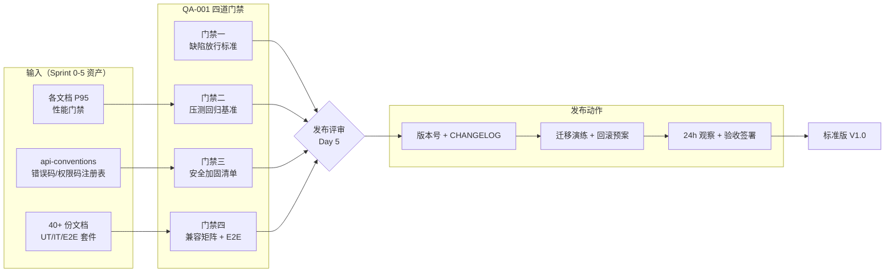
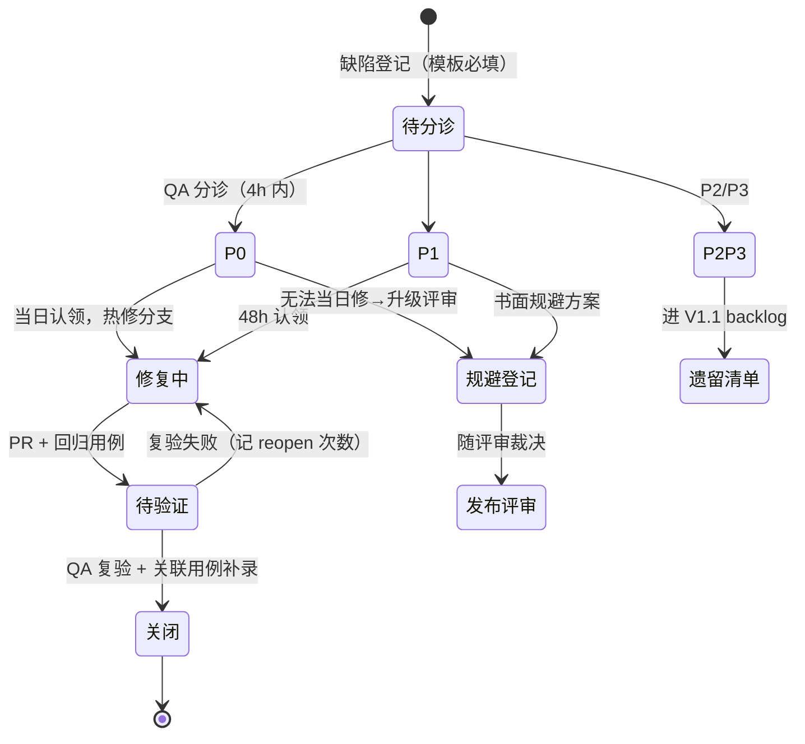
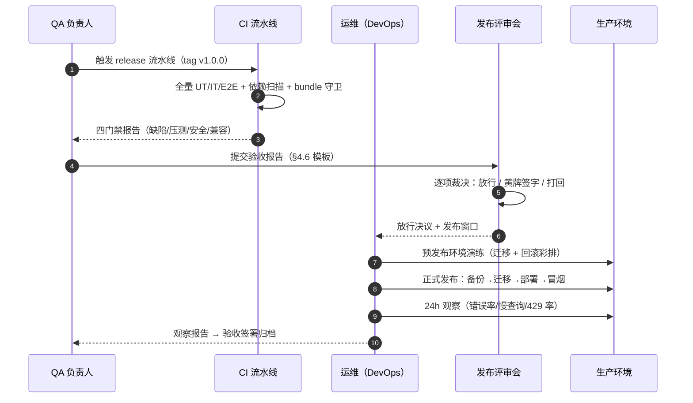

# QA-001 标准版 V1.0 缺陷修复 / 性能加固 / 发布验收

| 元信息项 | 内容 |
| --- | --- |
| 文档编号 | QA-001 |
| 所属迭代 | Sprint 6 — 稳定性缓冲（第 8 周） |
| 优先级 | P2 收尾（标准版 V1.0 发布门禁） |
| 覆盖模块 | M14-QA 质量保障（横向收拢 Sprint 0-5 全部质量资产） |
| 工作量估算 | 5 人日（QA 2 + 后端 1.5 + 前端 1 + DevOps 0.5），与 INFRA-005 并行 |
| 文档状态 | 待评审（Draft） |
| 最后更新日期 | 2026-09-01 |
| 上游依赖 | Sprint 0-5 功能冻结；`INFRA-004` 错误码/日志基线；`INFRA-005` 限流/备份/部署资产 |
| 下游消费 | 标准版 V1.0 正式发布；Sprint 7-9 企业版迭代基线；P4 `INFRA-006` 继承发布流程 |

---

## 1. 概述

### 1.1 功能定位

QA-001 是**不交付新功能**的质量门禁文档：把散落在 40+ 份功能规格中的 P95 性能门禁、权限矩阵、UT/IT/E2E 测试套件，收拢为一套**可执行、可留痕、可签署**的 V1.0 发布验收体系。四件事：

1. **缺陷修复流程**——缺陷分级（P0~P3）、清扫节奏、发布放行标准（P0 清零 / P1 ≤ 2 且有规避方案）。
2. **性能加固**——压测回归基准矩阵（各文档门禁汇总）、N+1 清查、慢查询预算、前端 bundle 预算。
3. **安全加固**——越权测试矩阵、依赖漏洞扫描、安全响应头核查、敏感配置审计。
4. **发布流程**——版本号规范、CHANGELOG 生成、迁移演练、回滚步骤、发布后 24h 观察、验收签署。

> **定位类比**：`INFRA-005` 交付「生产环境跑得稳」的运维底座；QA-001 交付「敢不敢发」的判定体系。两者在 Day 5 发布评审会合流。

### 1.2 质量门禁总览



### 1.3 范围边界

| 范围 | 本文档交付 | 明确不做 |
| --- | --- | --- |
| 缺陷 | 分级定义、清扫流程、放行标准、遗留登记 | 新功能缺陷之外的增强诉求（进需求池，V1.0 不加塞） |
| 性能 | 压测回归基准矩阵、N+1/慢查询/bundle 三预算、超标处置 | 全链路 APM（P4 `INFRA-006`）；容量规划（P4） |
| 安全 | 越权矩阵、依赖扫描、响应头核查、配置审计 | 渗透测试外包（商业化后单独立项）；WAF（P4） |
| 兼容 | 浏览器矩阵、分辨率基线、E2E 全量回归 | 移动端原生（不在标准版范围）；IE 任何版本 |
| 发布 | 版本号、CHANGELOG、迁移演练、回滚、观察、签署 | 灰度发布平台（P4）；自动化 canary 分析（P4） |

### 1.4 前置依赖

| 依赖 | 内容 | 阻塞原因 |
| --- | --- | --- |
| Sprint 0-5 全量 | 功能冻结，测试套件 CI 全绿 | 门禁的判定对象 |
| `INFRA-004` | 错误码注册表、请求日志中间件、health 端点 | 安全核查与观察指标的数据源 |
| `INFRA-005` §4 | 生产 compose profile、发布 checklist、`preflight.sh` | 发布流程复用其产物 |
| `api-conventions.md` | §7 限流配额表、§8 错误码、§14 检查清单 | 门禁核对基准 |

### 1.5 竞品参考

| 竞品 | 参考点 | 处置 |
| --- | --- | --- |
| Plane | GitHub Releases + 语义化版本 + `CE` 自托管升级指南 | 版本号/CHANGELOG 规范对齐；补充其缺失的**迁移演练与回滚步骤**（Plane 自托管升级靠用户自行备份，是其社区高频事故点） |
| Jira (Data Center) | 升级前健康检查（Pre-upgrade checks）+ 支持 ZIP 诊断包 | 采纳「发布前健康检查」思想，落地为可脚本化 checklist |
| Ones | 发布评审签署流（纸质化 QA 报告） | 采纳签署留痕，落地为结构化验收报告模板而非纸质 |
| GitLab | `danger` 式发布门禁 CI + 回滚 runbook | CI 门禁与回滚 runbook 范式对齐 |

---

## 2. 业务逻辑

### 2.1 缺陷分级与修复流程

**四级缺陷定义**（判定者：QA；争议升级至迭代负责人）：

| 级别 | 定义 | 判定示例 | 修复时限 | 发布影响 |
| --- | --- | --- | --- | --- |
| P0 致命 | 数据丢失/错乱、核心链路不可用、安全漏洞可利用 | 任务保存丢内容；越权读到他 Workspace 数据；登录不可用 | 当日修复，热修分支 | **阻塞发布，必须清零** |
| P1 严重 | 主功能受损但有临时规避路径 | 看板拖拽偶发回弹；报表数据延迟 10 分钟 | 48h | ≤ 2 个且有书面规避方案方可发布 |
| P2 一般 | 体验受损、非核心路径错误 | 筛选项过多时面板滚动抖动；导出走私有大字段乱码 | 本迭代内 | 不阻塞，登记遗留清单 |
| P3 轻微 | 文案、对齐、低概率边界 | 空状态文案不统一 | 视缓冲 | 登记 backlog |

**清扫流程**（Day 1 启动，贯穿全迭代）：



**缺陷登记模板**（必填字段，缺项打回）：环境/版本 commit、复现步骤（最少步骤）、期望 vs 实际、影响面（单用户/单项目/全站）、附件（HAR/截图/日志 request_id）、疑似模块。

### 2.2 性能加固三预算

| 预算 | 阈值 | 清查手段 | 超标处置 |
| --- | --- | --- | --- |
| N+1 查询 | 列表/详情端点单请求 SQL ≤ 15 条（任务详情 ≤ 25 含关联预取） | `django-debug-toolbar` 逐端点核查 + CI `assertNumQueries` 守卫用例 | 补 `select_related/prefetch_related`；无法消除的走评审豁免登记 |
| 慢查询 | 单查询 P95 < 50ms；任何查询不得 > 500ms | PG `pg_stat_statements` Top 20 + `auto_explain` 采样 | 补索引/改写；索引必须 `CONCURRENTLY` 且过迁移演练 |
| 前端 bundle | 首屏 JS gzip ≤ 450KB；单 chunk ≤ 200KB；LCP ≤ 2.5s（4G 节流） | `vite build --stats` + CI bundle 守卫；Lighthouse CI | 动态 import 拆包；图标/编辑器按需加载 |

### 2.3 压测回归基准矩阵

基准 = 各功能文档 P95 门禁汇总（抽样关键 12 端点，全量矩阵见 §4.2）：

| 端点 | 门禁 P95 | 并发模型 | 数据来源文档 |
| --- | --- | --- | --- |
| `GET …/issues/`（列表 50/页） | < 300ms | 50 VU | TASK-003 |
| `PATCH …/issues/{id}/`（状态变更） | < 250ms | 30 VU | TASK-002 |
| `POST …/issues/`（创建） | < 300ms | 20 VU | TASK-002 |
| `GET …/issues/{id}/activities/` | < 200ms | 30 VU | TASK-010 |
| `GET …/views/{id}/results/`（分组看板） | < 400ms | 20 VU | BOARD-003 |
| `POST …/issues/bulk/`（批量 50 项） | < 2s | 5 VU | BOARD-004 |
| `GET …/gantt/`（视窗 500 条） | < 500ms | 10 VU | GANTT-001 |
| `POST …/comments/` | < 200ms | 30 VU | COLLAB-001 |
| `GET …/files/{id}/download/`（预签） | < 150ms | 40 VU | FILE-001 |
| WebSocket 广播延迟（房间 200 连接） | P95 < 500ms | 200 conn | COLLAB-004 |
| `POST …/auth/login/` | < 400ms | 20 VU | AUTH-001 |
| `GET …/reports/personal/` | < 400ms | 20 VU | RPT-001 |

**回归判定**：连续两轮压测（间隔 ≥ 2h），任一端点 P95 超门禁 20% 即**阻塞发布**，超 10% 黄牌登记需模块负责人签字。

### 2.4 安全加固清单

| 项 | 内容 | 通过标准 | 工具 |
| --- | --- | --- | --- |
| 越权矩阵 | 角色 × 资源 × 动作三维：WS_GUEST/WS_MEMBER/WS_ADMIN/WS_OWNER × 项目四角色 × 读/写/删/管理，重点验证 404 存在性隐藏与 403 边界 | 矩阵用例全绿（§5.2 IT-SEC 组） | pytest 参数化矩阵 |
| 依赖扫描 | Python `pip-audit`、前端 `pnpm audit`、镜像 `trivy` | 无 Critical；High 有豁免评审单 | CI 门禁 |
| 响应头核查 | `X-Content-Type-Options: nosniff`、`X-Frame-Options: DENY`、`Referrer-Policy`、`Content-Security-Policy`（自托管兼容白名单）、HSTS（TLS 部署） | 全端点带齐（proxy 层统一注入） | curl 脚本核查 |
| 敏感配置审计 | 仓库无密钥（`gitleaks`）；`.env` 模板无真实值；MinIO/DB 默认口令已改；DEBUG=false | 扫描零命中 + 人工抽查 | CI + checklist |
| 认证与会话 | 密码 Argon2id；会话/JWT 过期与刷新符合 `AUTH-001`；限流对登录端点生效（`INFRA-005` 已落地） | 专项用例通过 | pytest |
| 注入与 XSS | ORM 无原生拼接（`extra/raw` 白名单审查）；富文本渲染 DOMPurify 白名单（`COLLAB-001` 既定）；Markdown 导出消毒 | 静态审查 + E2E XSS 探针用例 | semgrep + E2E |
| 文件安全 | 上传类型白名单与魔数校验（`FILE-001`）；预签 URL 短时效；分享链接速率限制（`FILE-004`） | 专项用例通过 | pytest |

### 2.5 浏览器兼容矩阵

| 浏览器 | 版本下限 | 判定 |
| --- | --- | --- |
| Chrome / Edge | 最近 2 个大版本 | 全量 E2E + 人工探索 |
| Firefox | 最近 2 个大版本（含 ESR 最新） | 全量 E2E |
| Safari | 最近 2 个大版本 | 全量 E2E + 人工探索（重点：Date 解析、flex gap、文件下载） |
| 分辨率基线 | 1280×800 / 1440×900 / 1920×1080 | 关键页截图比对 |
| 明确不支持 | IE 全系列、移动端浏览器（仅只读降级横幅提示） | UA 检测提示页 |

### 2.6 发布流程



**版本号规范**：语义化 `MAJOR.MINOR.PATCH`；V1.0.0 起算；热修 `PATCH+1`；企业版功能 `MINOR+1`；tag 与 CHANGELOG、镜像 tag 三者一致（CI 校验）。

**CHANGELOG 规范**：按 `Added / Changed / Fixed / Security` 分组；条目关联文档编号（如 `TASK-005`）与缺陷单号；由 git log conventional commits 半自动生成 + 人工润色。

**回滚预案**（演练必过）：

| 步骤 | 动作 | 时限 |
| --- | --- | --- |
| 1 | 停止 beat + worker（止写），保留 web 只读 | 2 min |
| 2 | 回滚镜像至前一 tag（compose `down/up`，K8s `rollout undo`） | 5 min |
| 3 | 数据库回滚：迁移可逆则 `migrate <prev>`；不可逆（列删除）则从当日备份定点恢复（`INFRA-005` 恢复脚本） | ≤ 30 min |
| 4 | 冒烟 18 项 + 数据抽检 | 10 min |

> **迁移可逆性纪律**：Sprint 6 起所有迁移必须实现 `reverse_code`；删列/改型类不可逆操作须「双写过渡 + 下一版本删除」两步走，此纪律延续至企业版全部迭代。

### 2.7 业务规则汇总

| 编号 | 规则 | 判定位置 | 违反后果 |
| --- | --- | --- | --- |
| BR-01 | 功能冻结：Sprint 6 起仅修缺陷与加固；新字段/新端点走变更评审并顺延 Sprint 7+ | 发布评审 | 不予合入 release 分支 |
| BR-02 | P0 清零是发布必要条件，无任何豁免通道 | 发布评审 | 阻塞发布 |
| BR-03 | P1 ≤ 2 且每个附书面规避方案（含负责人与时限），超 2 个阻塞 | 发布评审 | 阻塞发布 |
| BR-04 | 压测两轮独立执行；P95 超门禁 20% 阻塞、超 10% 黄牌签字 | QA 报告 | 阻塞/留痕 |
| BR-05 | 越权矩阵任一用例失败即 P0（安全漏洞定义） | IT-SEC 套件 | 阻塞发布 |
| BR-06 | 依赖扫描 Critical 零容忍；High 豁免须评审单（含修复版本与期限） | CI 门禁 | 流水线失败 |
| BR-07 | 发布前必须完成一次「备份→预发布恢复→迁移→回滚」全流程彩排并留痕 | 发布 checklist | 不予放行 |
| BR-08 | 发布后 24h 观察指标越阈（错误率 > 0.5%、P95 劣化 > 20%、429 异常突增）即启动回滚评估 | 观察报告 | 回滚评审 |
| BR-09 | CHANGELOG 条目必须可溯源（文档编号/缺陷单号），无溯源条目不得出现 | 发布评审 | 打回重写 |
| BR-10 | 验收签署三方（QA/研发负责人/产品）齐全方可宣布 V1.0 发布 | 签署页 | 不予宣布 |
| BR-11 | 遗留 P2/P3 缺陷全部登记 V1.1 backlog 并附影响面评估，不允许「口头记得」 | 遗留清单 | 评审打回 |
| BR-12 | 所有门禁产物（报告/截图/脚本输出）归档至 `release/v1.0.0/` 目录并纳入 Git 留痕 | 归档检查 | 评审打回 |

---

## 3. UI/UX 设计

QA-001 以流程与脚本为主，UI 仅两处：admin「发布门禁」页（checklist 留痕）与「缺陷分诊」看板视图配置。

### 3.1 发布门禁页（admin 区域）

```
┌──────────────────────────────────────────────────────────────────────┐
│ 发布门禁 · v1.0.0（release 分支 a1b2c3d）                              │
├──────────────────────────────────────────────────────────────────────┤
│ 门禁一 缺陷放行        ● 通过   P0: 0 · P1: 1（已签规避）· P2: 14      │
│ 门禁二 压测回归        ● 通过   两轮均值达标 · 报告 perf-r2.pdf ↓      │
│ 门禁三 安全加固        ● 通过   越权 216/216 · 扫描 0C/2H(豁免单#7,#9) │
│ 门禁四 兼容与 E2E      ◐ 进行   Chrome ✓ Firefox ✓ Safari 运行中…     │
├──────────────────────────────────────────────────────────────────────┤
│ 发布 checklist（8 项，逐项签署留痕）                                    │
│  ☑ 备份→预发布恢复→迁移→回滚 彩排通过        ops@… 09-04 14:22       │
│  ☑ CHANGELOG 条目全部可溯源                  qa@…  09-04 15:01       │
│  ☑ 镜像 tag 与版本号一致                      ci     09-04 15:03       │
│  ☐ 发布窗口与通知公告确认                     —                       │
│  ☐ 24h 观察值班表确认                         —                       │
│  …                                                                      │
│                                          [提交发布评审]（三项未签不可点）│
├──────────────────────────────────────────────────────────────────────┤
│ 验收签署：QA ____  研发 ____  产品 ____        （三方齐全 → 宣布发布）   │
└──────────────────────────────────────────────────────────────────────┘
```

交互细则：

| 元素 | 行为 |
| --- | --- |
| 门禁状态灯 | ● 通过 / ◐ 进行 / ○ 未开始 / ✕ 阻塞；数据来自 CI 回调写入，**不可手工改状态**（BR-04/05 留痕纪律） |
| checklist 勾选 | 点击即记录「人 + 时间戳」，不可撤销（撤销 = 新增一条反签记录）；提交评审需 8 项全签 |
| 门禁详情下钻 | 每门禁可展开查看原始产物链接（CI 报告、压测 PDF、扫描 JSON） |
| 阻塞态 | 任一 ✕ 时顶部横幅列出阻塞项与负责人；「提交发布评审」禁用 |

### 3.2 缺陷分诊看板（复用 BOARD-002 视图配置）

不新建 UI——用既有看板能力配置一张「V1.0 缺陷分诊」共享视图：按 `label=bug` + 自定义字段 `severity`（P0~P3）分组列、按更新时间排序、过滤 release=v1.0 里程碑。此处仅约定**视图配置规范**：

| 配置项 | 取值 |
| --- | --- |
| 过滤器 | `labels ∩ {bug}` 且 `milestone = v1.0` |
| 分组 | `severity`（P0 列置顶，列内按创建时间升序） |
| 卡片字段 | 标题、负责人、reopen 次数徽标（>1 红色）、SLA 倒计时（P0 当日/P1 48h） |
| 共享 | 全员可见（`BOARD-005` 共享视图机制提前用于内部） |

### 3.3 空状态与异常

| 场景 | 表现 |
| --- | --- |
| CI 回调未到达（门禁无数据） | 状态灯 ○ 未开始 + 「等待 CI…」；超 30 分钟无数据告警至值班群 |
| 压测报告上传失败 | 门禁二保持 ◐，Toast 报错并附 request_id；可重传 |
| 签署人非授权角色 | 勾选动作 403 `PERM_DENIED`，Toast「仅 QA/研发/产品负责人可签署」 |

---

## 4. 技术架构

### 4.1 发布门禁数据模型

checklist 留痕需持久化（CI 回调 + 签署记录），单表即可：

```python
class ReleaseGate(models.Model):
    """一次发布尝试的门禁与签署留痕（只增不改：状态变化追加 ReleaseGateEvent）"""

    class Status(models.TextChoices):
        PENDING = "pending", "未开始"
        RUNNING = "running", "进行中"
        PASSED = "passed", "通过"
        BLOCKED = "blocked", "阻塞"

    id = models.UUIDField(primary_key=True, default=uuid7)
    version = models.CharField(max_length=32)                     # v1.0.0
    commit_sha = models.CharField(max_length=40)
    gate_defects = models.CharField(max_length=16, choices=Status.choices, default=Status.PENDING)
    gate_perf = models.CharField(max_length=16, choices=Status.choices, default=Status.PENDING)
    gate_security = models.CharField(max_length=16, choices=Status.choices, default=Status.PENDING)
    gate_compat = models.CharField(max_length=16, choices=Status.choices, default=Status.PENDING)
    artifacts = models.JSONField(default=dict)                    # {"perf_report": "s3://…", "trivy": "…"}
    checklist = models.JSONField(default=list)                    # [{key, label, signed_by, signed_at, revoked?}]
    created_at = models.DateTimeField(auto_now_add=True)

    class Meta:
        db_table = "release_gates"
        constraints = [models.UniqueConstraint(fields=["version", "commit_sha"], name="uniq_release_gate")]


class ReleaseGateEvent(models.Model):
    """门禁状态变迁与签署事件（append-only，审计用）"""
    id = models.BigAutoField(primary_key=True)
    gate = models.ForeignKey(ReleaseGate, related_name="events", on_delete=models.CASCADE)
    event_type = models.CharField(max_length=32)                  # gate_update / checklist_sign / checklist_revoke / verdict
    payload = models.JSONField(default=dict)
    actor = models.ForeignKey(User, null=True, on_delete=models.SET_NULL)  # NULL = CI 系统
    created_at = models.DateTimeField(auto_now_add=True)

    class Meta:
        db_table = "release_gate_events"
        indexes = [models.Index(fields=["gate", "created_at"], name="idx_gate_event")]
```

> 只允许 `INSERT`：应用层不提供 update 路径（`ReleaseGate.gate_*` 字段变更走 `append_gate_event` 服务函数同事务更新快照 + 追加事件），DB 层以触发器禁止对 `release_gate_events` 的 UPDATE/DELETE（审计纪律，与 `TASK-010` Activity 一致）。

### 4.2 压测回归执行

**工具选型**：k6（脚本即代码、CI 友好、阈值内建断言）。目录 `perf/suites/`，每端点一脚本，统一 `options.thresholds` 从门禁表生成（防口径漂移）：

```js
// perf/suites/issue-list.js
import http from 'k6/http';
import { check } from 'k6';
import { GATE } from './gates.js';   // 由 §2.3 门禁表生成的常量，单一数据源

export const options = {
  vus: 50, duration: '3m',
  thresholds: {
    'http_req_duration{endpoint:issue_list}': [`p(95)<${GATE.issue_list.p95}`],
    'http_req_failed': ['rate<0.005'],
  },
};
export default function () {
  const res = http.get(`${__ENV.BASE}/api/v1/ws/demo/projects/p1/issues/?page_size=50`,
    { headers: authHeader(), tags: { endpoint: 'issue_list' } });
  check(res, { 'envelope ok': (r) => r.json('status') === 0 });
}
```

```python
# perf/gates.py —— 门禁表即代码（§2.3 的机器可读源，文档与脚本防漂移）
GATES = {
    "issue_list":    {"p95": 300,  "vus": 50},
    "issue_patch":   {"p95": 250,  "vus": 30},
    "issue_create":  {"p95": 300,  "vus": 20},
    "activities":    {"p95": 200,  "vus": 30},
    "view_results":  {"p95": 400,  "vus": 20},
    "bulk_ops":      {"p95": 2000, "vus": 5},
    "gantt_viewport": {"p95": 500, "vus": 10},
    "comment_create": {"p95": 200, "vus": 30},
    "file_download_sign": {"p95": 150, "vus": 40},
    "ws_broadcast":  {"p95": 500,  "conns": 200},
    "login":         {"p95": 400,  "vus": 20},
    "personal_report": {"p95": 400, "vus": 20},
}
```

**执行编排**（CI job `perf-regression`）：预发布环境（与生产同规格 1/2 配置，§2.3 注明基准环境）→ `pgbench` 暖库 → 逐套件串行执行 → 两轮（间隔 ≥ 2h）→ 汇总报告（`k6 --out json` 聚合脚本生成 PDF/Markdown）→ 回调写 `ReleaseGate.artifacts`。

**N+1 守卫用例**（防回归的 CI 常驻断言）：

```python
# tests/perf/test_query_budget.py
@pytest.mark.django_db
class TestQueryBudget:
    def test_issue_list_within_budget(self, api_client, project_with_50_issues):
        with django_assert_num_queries(15):          # §2.2 预算即断言
            resp = api_client.get(f"/api/v1/ws/w/projects/{project_with_50_issues.id}/issues/")
        assert resp.status_code == 200

    def test_issue_detail_within_budget(self, api_client, rich_issue):
        with django_assert_num_queries(25):          # 含关联/活动/附件预取
            resp = api_client.get(rich_issue.detail_url)
        assert resp.status_code == 200
```

### 4.3 安全扫描 CI 配置

```yaml
# .github/workflows/security-gate.yml（关键片段）
security:
  steps:
    - run: pip-audit --strict --output pip-audit.json || true
    - run: pnpm audit --json > npm-audit.json || true
    - run: trivy image --severity CRITICAL,HIGH --format json -o trivy.json $IMAGE
    - run: gitleaks detect --source . --report-path gitleaks.json
    - run: python ci/security_verdict.py   # 汇总四报告，判定规则见下
    - uses: actions/upload-artifact@v4
      with: { name: security-reports, path: "*-audit.json" }
```

```python
# ci/security_verdict.py —— BR-06 判定：Critical 零容忍，High 需豁免单
def verdict(pip, npm, trivy, exemptions):
    criticals = collect(severity="CRITICAL")
    highs = collect(severity="HIGH")
    if criticals:
        fail(f"Critical 漏洞 {len(criticals)} 个，零容忍（BR-06）")
    uncovered = [h for h in highs if h.id not in exemptions]
    if uncovered:
        fail(f"High 漏洞缺豁免评审单: {[h.id for h in uncovered]}")
    ok()
```

**豁免单**（`security/exemptions.yml`）：`{cve, reason, owner, fix_version, expires_at}`，过期即 CI 失败——防「永久豁免」腐化。

### 4.4 API 定义（发布门禁，admin 专属）

| 方法 | 路径 | 说明 | 权限 |
| --- | --- | --- | --- |
| GET | `/api/v1/admin/release-gates/` | 发布尝试列表 | `admin.release`（WS_OWNER + 指定发布角色） |
| GET | `/api/v1/admin/release-gates/{id}/` | 门禁详情（含 events 时间线） | 同上 |
| POST | `/api/v1/admin/release-gates/` | 创建发布尝试（CI release 流水线首步） | CI Token（机器用户） |
| POST | `/api/v1/admin/release-gates/{id}/gate-events/` | CI 回调写门禁状态/产物 | CI Token |
| POST | `/api/v1/admin/release-gates/{id}/checklist/{key}/sign/` | 签署/反签 checklist 项 | 三方负责人 |
| POST | `/api/v1/admin/release-gates/{id}/verdict/` | 发布评审裁决（放行/打回） | 发布评审主席 |

**CI 回调示例**：

```http
POST /api/v1/admin/release-gates/01J8XKQ7…/gate-events/
Authorization: Bearer <ci-token>
Content-Type: application/json
Idempotency-Key: ci-perf-r2-20260904

{
  "event_type": "gate_update",
  "gate": "gate_perf",
  "status": "passed",
  "artifacts": {"perf_report": "minio://rp-release/v1.0.0/perf-r2.pdf", "rounds": 2}
}
```

```json
{
  "status": 0,
  "data": {
    "id": "01J8XKQ7V3A2N0M1P4R6T8YHZD",
    "gate_perf": "passed",
    "event_id": 412
  }
}
```

**错误响应**（状态非法迁移，如未通过门禁直接裁决放行）：

```json
{
  "status": 1,
  "error": {
    "code": "VALIDATION_ERROR",
    "message": "存在未通过的门禁，不可裁决放行",
    "details": {"sub_code": "INVALID", "blocking_gates": ["gate_compat"]},
    "request_id": "01J8XKR2F5B7N3M9P1Q4T6W8YC"
  }
}
```

| 场景 | HTTP | 错误码 | 说明 |
| --- | --- | --- | --- |
| 非 admin 角色访问 | 403 | `PERM_DENIED` | admin 区域一律 403（存在性无业务敏感性） |
| CI Token 过期/伪造 | 401 | `AUTH_INVALID_TOKEN` | 机器用户走独立 token 表 |
| 重复回调（同 Idempotency-Key） | 200 | — | 幂等返回首个 event_id |
| 未通过门禁裁决放行 | 400 | `VALIDATION_ERROR` | `blocking_gates` 明细 |
| checklist 项不存在 | 404 | `RESOURCE_NOT_FOUND` | key 白名单 8 项 |

### 4.5 发布执行脚本（与 INFRA-005 衔接）

```bash
#!/usr/bin/env bash
# deploy/release.sh —— 正式发布序列（BR-07 彩排同款脚本，演练与实战同路径）
set -euo pipefail
VERSION=$1
./deploy/preflight.sh                              # INFRA-005 §4：磁盘/证书/备份新鲜度
./deploy/backup-now.sh --tag "pre-${VERSION}"      # 发布前即时备份（回滚锚点）
docker compose -f docker-compose.prod.yml pull
docker compose run --rm web python manage.py migrate --plan | tee migrate-plan.log
./deploy/confirm.sh "迁移计划已评审？"               # 人工闸门（tty 确认）
docker compose run --rm web python manage.py migrate
docker compose up -d --no-deps web worker beat
./deploy/smoke.sh --suite release-18               # 18 项冒烟（登录/建任务/评论/上传/分享）
./deploy/notify.sh "v${VERSION} 发布完成，进入 24h 观察"
```

**24h 观察指标**（取自 `INFRA-004` 请求日志中间件 + PG 统计，每小时快照）：

| 指标 | 阈值（BR-08） | 数据源 |
| --- | --- | --- |
| 5xx 错误率 | < 0.5% | nginx 日志聚合 |
| 关键端点 P95 | 不劣化超 20%（对照压测基准） | 请求日志中间件 |
| 慢查询计数 | 无新增 > 500ms 查询 | `pg_stat_statements` 差分 |
| 429 比例 | < 1% 且无单端点突增 | 限流头统计 |
| Celery 积压 | 队列深度 < 100 且回落 | RabbitMQ 管理 API |
| 磁盘/内存 | < 70% | node exporter |

### 4.6 验收报告模板（签署附件）

```markdown
# 标准版 V1.0 发布验收报告
- 版本 / commit / 发布窗口：…
- 门禁一 缺陷：P0=0 ✓；P1=n（规避方案编号…）；P2/P3 遗留登记数与链接
- 门禁二 压测：两轮 12 端点矩阵结果表（实测 P95 vs 门禁）；黄牌签字（若有）
- 门禁三 安全：越权矩阵通过率；扫描结论与豁免单号；响应头核查截图
- 门禁四 兼容：浏览器矩阵 E2E 通过率；人工探索记录
- 彩排记录：备份恢复耗时 / 迁移耗时 / 回滚演练耗时
- 裁决与签署：QA ___ 研发 ___ 产品 ___ 日期 ___
```

### 4.7 前端实现（发布门禁页）

```tsx
// apps/admin/features/release/useReleaseGate.ts
export function useReleaseGate(gateId: string) {
  const { data, mutate } = useSWR<ReleaseGate>(`/admin/release-gates/${gateId}/`, fetcher, {
    refreshInterval: (d) => (d && allGatesSettled(d) ? 0 : 10_000),  // 进行中的门禁 10s 轮询
  });
  const sign = useMutation(
    (key: string) => api.post(`/admin/release-gates/${gateId}/checklist/${key}/sign/`),
    { onSuccess: () => mutate() },
  );
  return { gate: data, sign };
}
```

 MobX 非必需（单页只读 + 轮询），SWR 条件轮询即可；签署操作乐观关闭按钮防双击（幂等键由后端按 (gate, key, actor) 天然幂等）。

### 4.8 压测数据工厂

压测结论的可信度取决于数据形状。`perf/seed.py` 在预发布库生成与生产形态等价的种子数据（可重复：固定 random seed + 命名空间前缀 `perf_`，清理一键完成）：

| 实体 | 规模 | 形状要点 |
| --- | --- | --- |
| Workspace / 项目 | 2 / 6 | 含 1 个 5000 任务大项目 + 5 个常规项目 |
| 用户 / 成员 | 200 / 全员挂大项目 | 角色按比例（1 OWNER/5 ADMIN/180 MEMBER/14 GUEST） |
| 任务 | 12,000 | 状态按五组真实分布（backlog 35%/unstarted 25%/started 25%/completed 12%/cancelled 3%）；30% 含子任务（深 2-3）；20% 含依赖边 |
| 评论 / 活动 | 60k / 300k | 活动 epoch 连续（TASK-010 口径） |
| 附件 / 分享链接 | 3k / 500 | 文件实体不落 MinIO（stub 指针），下载压测用专用 10MB/100MB 样本 |
| 自定义字段 | 8 字段 × 大项目 | 含 select/multi/date 三型，60% 任务有值（GIN 索引真实性） |

```python
# perf/seed.py 关键片段
def seed(scale: str = "release"):
    with transaction.atomic():
        ws, projects = make_workspace(scale)
        users = make_users(scale)
        issues = make_issues(projects, users, scale)        # bulk_create 分批 2000
        make_relations(issues)                              # 依赖边过环检测服务，保证合法图
        make_activities(issues)                             # 直接 INSERT（幂等键合成）
    rebuild_sequences()                                     # analyze 统计信息，压测不被优化器误判
```

**清理**：`python perf/seed.py --purge` 按 `perf_` 前缀级联删除；CI 压测 job 首尾各执行一次（幂等，防上次残留污染基准）。

### 4.9 Flaky 用例治理

| 机制 | 规则 |
| --- | --- |
| 识别 | CI 记录每用例近 30 次运行的 pass/fail 翻转率；翻转率 > 10% 自动打 `flaky` 标记并开治理单 |
| 隔离 | flaky 用例移出阻塞套件（`pytest -m "not flaky"` 跑门禁，flaky 套件单独跑并强制重试 3 次） |
| 时限 | 治理单 7 天内修复或删除；超时未处理的用例**删除**（腐化的测试比没有测试更糟——假绿消磨信任） |
| 门禁口径 | V1.0 发布判定以「非 flaky 套件全绿 + flaky 套件重试后通过率 ≥ 95%」为准；flaky 清单随验收报告公示 |
| 根治手段优先级 | 修产品竞态 > 修测试等待（显式等待替代 sleep）> 隔离外部依赖（fake SMTP/MinIO）> 删除 |

---

## 5. 测试用例

QA-001 自身是被测体系的组织者，本节给出**发布门禁机制的测试**与**V1.0 回归套件的组织方式**。

### 5.1 单元测试（门禁机制）

| 编号 | 用例 | 断言 |
| --- | --- | --- |
| UT-01 | 创建 ReleaseGate（同 version+commit 重复 POST） | 幂等返回既有记录，不产生重复行 |
| UT-02 | `append_gate_event` 状态迁移合法表（pending→running→passed/blocked） | 非法迁移（如 pending→passed）抛 `InvalidTransition` |
| UT-03 | 门禁事件 append-only 触发器 | 直接 UPDATE/DELETE `release_gate_events` 报 DB 异常 |
| UT-04 | checklist 签署/反签 | 签署写 `signed_by/signed_at`；反签追加 `revoked` 事件不删原记录 |
| UT-05 | 裁决前置校验 | 任一门禁非 passed 时 verdict=approve → 400 + `blocking_gates` |
| UT-06 | `security_verdict.py` 判定 | Critical 存在→fail；High 有豁免单→pass；豁免单过期→fail |
| UT-07 | 门禁表 `gates.py` 与 §2.3 文档表一致性 | CI 解析文档表格比对常量（防漂移守卫） |
| UT-08 | CHANGELOG 条目溯源校验 | 无文档编号/单号条目被 lint 拒绝 |

### 5.2 集成测试（含 IT-SEC 越权矩阵）

| 编号 | 用例 | 断言 |
| --- | --- | --- |
| IT-01 | CI 回调全链路：POST gate-events → GET 详情 | 状态与产物可见，events 时间线有序 |
| IT-02 | 三方签署→裁决→事件流 | 事件序列完整；签署人角色不符 → 403 `PERM_DENIED` |
| IT-03 | CI Token 权限边界 | 机器用户不能签署 checklist、不能裁决 |
| IT-SEC-01~216 | 越权矩阵：8 角色 × 9 资源域 × 3 动作（读/写/管理）参数化 | 非授权一律 403/404（存在性隐藏按 `api-conventions` §9）；授权路径 200 |
| IT-SEC-04 | 登录端点限流 | 第 11 次/分钟 429 + `Retry-After`（INFRA-005 配额） |
| IT-SEC-05 | 富文本 XSS 探针 | `<script>`/事件属性被 DOMPurify 剔除，渲染纯文本化 |
| IT-SEC-06 | 文件上传魔数伪造 | 改后缀的 PE/HTML 文件被 415 拒绝 |
| IT-07 | 压测基准冒烟：k6 套件在预发布跑通 | 阈值断言生效（故意调低阈值应失败，验证断言非摆设） |
| IT-08 | 回滚彩排：备份→恢复→冒烟 | ≤ 30min 完成且数据抽检一致（与 INFRA-005 演练共用脚本） |

### 5.3 E2E 回归套件组织

| 编号 | 套件 | 范围 | 通过标准 |
| --- | --- | --- | --- |
| E2E-FULL | Sprint 0-5 全量 E2E（~180 用例） | 四浏览器矩阵（§2.5） | 全绿；flaky 用例隔离重跑 3 次定级 |
| E2E-01 | 发布门禁页：创建→CI 回调（mock）→签署→裁决 | 状态灯、下钻、签署留痕、阻塞禁用态 | 全流程通过 |
| E2E-02 | 缺陷分诊看板视图 | 分组/排序/SLA 徽标渲染 | 截图比对 + 交互断言 |
| E2E-03 | Safari 专项 | Date 解析、文件下载、flex 布局 | 人工探索签字 |
| E2E-04 | 降级提示 | IE UA / 移动 UA 访问显示提示页 | 提示页渲染正确 |

### 5.4 发布放行判定表（四门禁汇总）

| 门禁 | 量化标准 | 阻塞条件 |
| --- | --- | --- |
| 缺陷 | P0=0；P1≤2 有规避 | 违反 BR-02/03 |
| 压测 | 两轮 12 端点 P95 全达标 | 超门禁 20%（BR-04） |
| 安全 | IT-SEC 全绿；扫描 0 Critical；响应头齐 | 任一失败（BR-05/06） |
| 兼容/E2E | 矩阵全绿或豁免签字 | 未豁免失败 |

---

## 6. 竞品深度对标

### 6.1 Plane 发布实践分析

| 观察点 | Plane 做法 | 代码路径 / 证据 |
| --- | --- | --- |
| 版本与发布 | 语义化 tag + GitHub Releases，`CHANGELOG` 由 PR 标题聚合 | `plane/plane` Releases 页 |
| 自托管升级 | `upgrade.sh`：拉镜像→migrate→重启；**无官方回滚脚本**，社区 issue 高频「升级后 500 无法回退」 | `deploy/selfhost/upgrade.sh` |
| 质量门禁 | CI 有 lint+单测，无公开压测门禁与越权矩阵 | `.github/workflows/build.yml` |
| 启示 | Plane 把发布质量交给社区自愈，适合 OSS 不适合商业交付 | 本系统回滚预案（§2.6）与四门禁正是补此缺口 |

### 6.2 Jira / Ones / GitLab 对照

| 能力 | Jira DC | Ones | GitLab | 本系统 |
| --- | --- | --- | --- | --- |
| 升级前健康检查 | Pre-upgrade checks 面板 | 人工 QA 报告 | 无（持续部署） | checklist 8 项签署留痕（§3.1） |
| 回滚 | 官方建议快照回滚 | 停机回滚 | `rollback` runbook | 脚本化四步回滚 + 彩排（§2.6） |
| 发布签署 | 无（SaaS） | 纸质 QA 签署 | 无 | 三方电子签署 + append-only 事件（§4.1） |
| 性能门禁 | 未公开 | 未公开 | `gitlab-org` 性能 dashboard | 门禁表即代码 + CI 断言（§4.2） |

### 6.3 本系统设计决策

1. **门禁表即代码（`gates.py`）+ 文档一致性守卫（UT-07）**：Jira/Ones 的门禁活在 wiki 里会漂移，本系统让 CI 比对人读文档与机器常量。
2. **append-only 签署事件**：Ones 纸质签署无法程序校验；本系统事件流可直接驱动「未签署不可裁决」的服务端硬约束。
3. **演练与实战同脚本（`release.sh`）**：Plane 的 upgrade.sh 只覆盖升级路径；本系统彩排（BR-07）跑的就是实战脚本，消除「演练一套、实战一套」的偏差。

---

## 7. 里程碑与验收

### 7.1 交付物清单

| 类别 | 产物 |
| --- | --- |
| 流程 | 缺陷四级定义与分诊流程、发布放行标准、变更评审纪律（BR 全集） |
| 代码 | `ReleaseGate/ReleaseGateEvent` 模型与迁移、admin 门禁六端点、签署/裁决服务 |
| CI/CD | `security-gate.yml`、`perf-regression` job、`gates.py` 一致性守卫、CHANGELOG lint |
| 压测 | k6 12 套件 + 两轮执行编排 + 报告聚合脚本 |
| 安全 | 越权矩阵 216 用例、四源扫描与豁免单机制、响应头核查脚本 |
| 发布 | `release.sh`、回滚 runbook、24h 观察面板查询、验收报告模板 |
| 前端 | admin 发布门禁页、缺陷分诊看板视图配置规范 |

### 7.2 可操作演示的验收标准

1. 构造 P0 缺陷走全流程：登记→分诊→热修→复验→关闭，时限与留痕符合 §2.1；构造第 3 个 P1 验证发布评审阻塞。
2. 压测两轮报告产出，任一故意劣化端点（注入 sleep）被门禁二拦截；`gates.py` 与文档表不一致时 UT-07 失败。
3. 越权矩阵 216 用例 CI 全绿；故意放开一处权限装饰器，IT-SEC 对应用例即红并阻断流水线。
4. 依赖扫描注入测试：演示环境加入含 Critical 的依赖，CI 失败；High 漏洞无豁免单失败、有豁免单通过、豁免单过期失败。
5. 发布门禁页完成一次完整发布：CI 回调四门禁→8 项签署→三方裁决→`release.sh` 执行→冒烟通过→事件时间线完整可查。
6. 回滚彩排：从「发布完成」状态执行回滚四步，≤ 30min 恢复且冒烟 18 项通过。
7. 24h 观察报告产出，六项指标均在阈值内；验收报告三方签署归档至 `release/v1.0.0/`。
