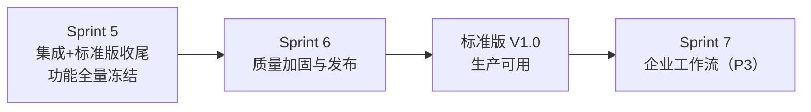
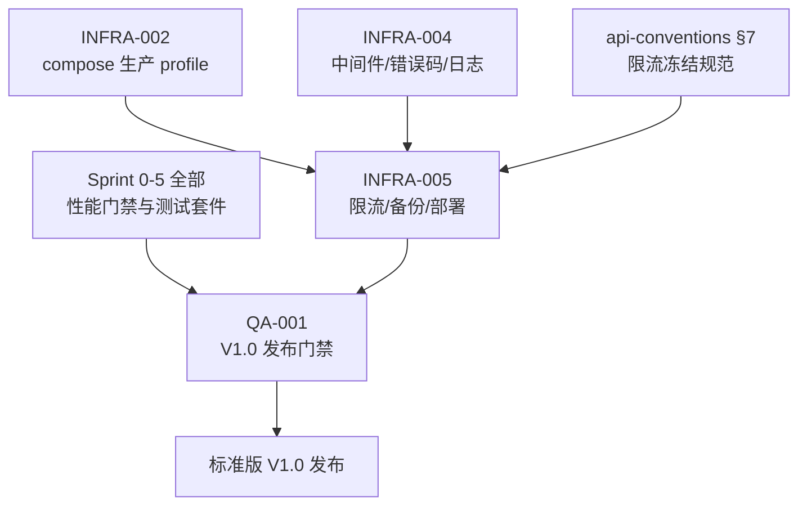

# Sprint 6 — 稳定性缓冲 · 标准版 V1.0 发布 迭代概览

| 元信息项 | 内容 |
| --- | --- |
| 所属迭代 | Sprint 6 — 稳定性缓冲（第 8 周） |
| 优先级 | P2 收尾（标准版功能全量冻结的发布迭代） |
| 覆盖模块 | M11-INFRA 部署运维｜M14-QA 质量保障 |
| 文档状态 | 待评审（Draft） |
| 最后更新日期 | 2026-09-01 |
| 上游依赖 | **Sprint 0-5 全量功能冻结**（尤其 `INFRA-002` 生产 profile、`INFRA-004` 中间件/错误码/日志基线、全部功能文档的性能门禁） |
| 下游消费 | 标准版 V1.0 正式发布；Sprint 7-9 企业版迭代以其为基线；`INFRA-006`（P4 高可用）继承备份与部署资产 |
| 迭代周期 | 5 个工作日，固定预留 20% 缓冲 |

---

## 1. 迭代目标

Sprint 6 **不交付任何新功能**。它是需求文档 §9.1 定义的「稳定性缓冲迭代」：Bug 修复、性能优化、权限加固、体验打磨，终点是**标准版 V1.0 正式发布**——通过基础压测与安全校验，生产环境可稳定运行。

两条主线：

1. **运维底座（`INFRA-005`）**——把 P0/P1 留下的运维欠账清零：三层限流全量落地（Nginx 边缘 + DRF 应用层 + 端点级，兑现 `api-conventions.md` §7 冻结规范与 `INFRA-004` 的 `RateLimitHeaderMiddleware` 空实现）、自动数据备份体系（pg_dump 全量 + WAL 归档 + MinIO 版本化保留 + 恢复演练）、生产部署配置定型（compose 生产 profile 加固 + K8s 清单骨架 + 发布 checklist）。
2. **质量门禁（`QA-001`）**——把散落在 30+ 份功能文档里的 P95 门禁、权限矩阵、测试套件收拢为**一套可执行的 V1.0 发布验收体系**：缺陷分级与修复流程、全量压测回归基准、安全加固（越权矩阵 / 依赖扫描 / 响应头核查）、浏览器兼容矩阵、发布流程（版本号 / CHANGELOG / 迁移演练 / 回滚步骤 / 发布后观察）。

## 2. 范围与边界

| 范围 | 本迭代交付 | 明确不做 |
| --- | --- | --- |
| 限流 | 三层限流全量（配额表落地、`X-RateLimit-*` 头、429 退避闭环） | 按租户动态配额（P4） |
| 备份 | 每日全量 + WAL 归档（可选增强）+ 30 天保留 + 恢复演练脚本 | 异地灾备 / 跨区域复制（P4 `INFRA-006`） |
| 部署 | compose 生产 profile 加固、K8s 清单骨架、发布 checklist | K8s Operator / Helm 商店化（P4）；灰度发布平台（P4） |
| 质量 | 缺陷分级流程、压测回归基准、安全加固、兼容矩阵、发布流程 | 新功能开发（**功能冻结**）；全链路 APM（P4） |
| 集中式日志 | json-file 轮转 + 结构化字段定型（`INFRA-004` 既有） | ELK/Loki 接入（P4 `INFRA-006`） |

## 3. 前置依赖

进入 Sprint 6 前必须满足：

- Sprint 0-5 全部功能文档评审通过，功能冻结（新增需求一律进需求池，V1.0 不加塞）。
- `INFRA-002` 生产 profile 可一键拉起；`INFRA-004` 六件套中间件与错误码注册表稳定。
- 各功能文档声明的测试套件（UT/IT/E2E）在 CI 全绿。

## 4. 文档覆盖

| 文档 | 交付重点 | 关键产物 | 直接下游 |
| --- | --- | --- | --- |
| `INFRA-005` | 三层限流 / 备份 / 生产部署 | Nginx+DRF 限流实现、备份脚本与 beat、K8s 骨架、发布 checklist | 运维手册、`INFRA-006` |
| `QA-001` | V1.0 质量门禁与发布流程 | 压测回归基准、安全加固清单、发布/回滚流程、验收报告模板 | 发布评审、企业版迭代基线 |

## 5. 统一工程约束

| 类别 | 约束 |
| --- | --- |
| 限流 | 严格按 `api-conventions.md` §7 配额表；全响应带 `X-RateLimit-*`；429 带 `Retry-After`；前端退避遵循 §7.4 |
| 备份 | RPO ≤ 24h（每日全量）；启用 WAL 归档的实例 RPO ≤ 5min；RTO ≤ 30 分钟（演练验证）；备份对象经服务端加密 |
| 部署 | 生产仅暴露 proxy 80/443；`beat` 恰好 1 副本；镜像精确 tag；发布前 checklist 全项通过 |
| 质量 | 性能回归基准 = 各文档 P95 门禁汇总（见 QA-001 §4.2），回归超标即阻塞发布；缺陷 P0 清零、P1 ≤ 2 且有规避方案方可发布 |
| 冻结 | 本迭代起 feature freeze：仅修缺陷与加固，任何新字段/新端点需走变更评审并顺延至 Sprint 7+ |

## 6. 验收标准

- [ ] 限流：按 §7 配额表逐端点压测验证触发 429（含头与信封体）；L1 边缘在压测下保护应用层不雪崩。
- [ ] 备份：生产样例数据每日备份成功落 MinIO；恢复演练在 30 分钟内完整恢复一套新环境并通过冒烟用例。
- [ ] 部署：干净机器按手册从零拉起生产栈（含 TLS）；发布 checklist 全项留痕。
- [ ] 质量：压测回归矩阵全部达标；越权测试矩阵全绿；依赖扫描无高危；E2E 全量套件在浏览器矩阵通过。
- [ ] 发布：版本号 / CHANGELOG / 迁移演练 / 回滚步骤齐备；发布后 24 小时观察指标在阈值内。

## 7. 文档清单

| 序号 | 文件 | 一级标题 |
| --- | --- | --- |
| 1 | `INFRA-005-rate-limit-backup.md` | 接口限流 / 数据备份 / 生产部署配置 |
| 2 | `QA-001-standard-release.md` | 标准版 V1.0 缺陷修复 / 性能加固 / 发布验收 |

## 8. 排期

| 工作日 | 主线 A（运维底座） | 主线 B（质量门禁） | 当日验收 |
| --- | --- | --- | --- |
| Day 1 | 限流三层落地 + 头中间件 | 缺陷分级清扫启动（P0 清零） | 限流矩阵测试通过 |
| Day 2 | 备份体系 + beat 任务 | 压测回归第一轮（全矩阵） | 备份成功；基准报告 v1 |
| Day 3 | 恢复演练 + 部署加固 | 安全加固（越权/扫描/响应头） | 演练 ≤30min；安全清单绿 |
| Day 4 | K8s 骨架 + 发布 checklist | E2E 浏览器矩阵回归 | 兼容矩阵通过 |
| Day 5 | 预发布环境全链路演练 | 发布评审（checklist + 验收报告） | **标准版 V1.0 发布** |

## 9. 相关文档

- 前置迭代：`docs/sprint-5-integration-standard/sprint-overview.md`（Sprint 5 — 集成 + 标准版收尾）
- 原始需求：[`docs/需求文档.md`](../需求文档.md) §8.2 部署运维行 / §9.1
- 下一迭代：`docs/sprint-7-enterprise-workflow/sprint-overview.md`（Sprint 7 — 企业工作流核心）
