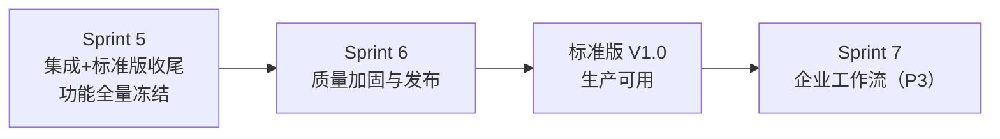
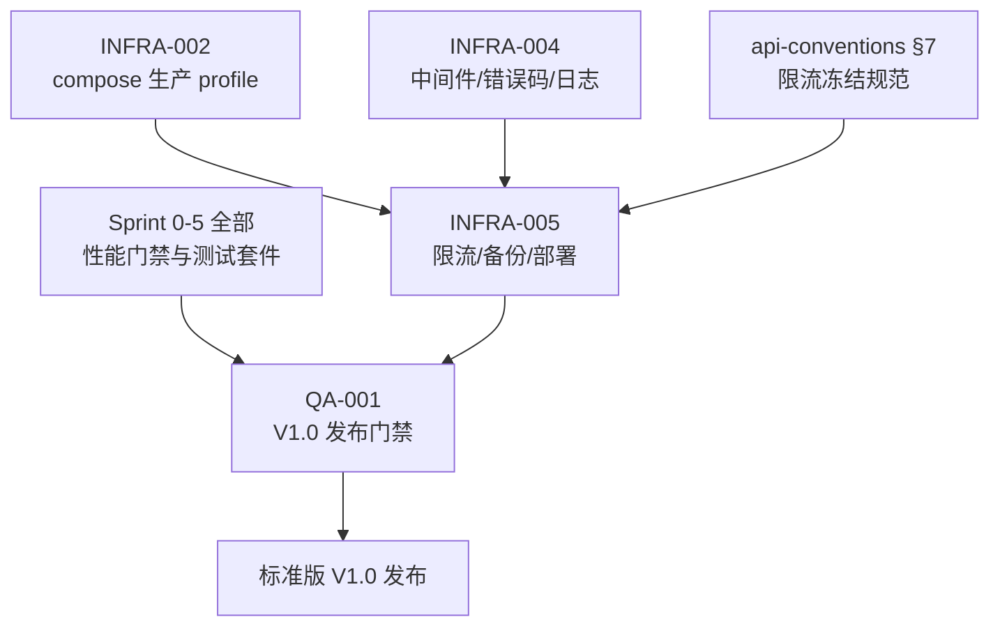

# Sprint 6 — 稳定性缓冲 · 标准版 V1.0 发布 迭代概览

| 元信息项 | 内容 |
| --- | --- |
| 所属迭代 | Sprint 6 — 稳定性缓冲（第 8 周） |
| 优先级 | P2 收尾（标准版功能全量冻结的发布迭代） |
| 覆盖模块 | M0-INFRA 技术底座与部署运维｜M13-QA 质量保障 |
| 文档状态 | 待评审（Draft） |
| 最后更新日期 | 2026-09-01 |
| 上游依赖 | **Sprint 0-5 全量功能冻结**（尤其 `INFRA-002` 生产 profile、`INFRA-004` 中间件/错误码/日志基线、全部功能文档的性能门禁） |
| 下游消费 | 标准版 V1.0 正式发布；Sprint 7-9 企业版迭代以其为基线；`INFRA-006`（P4 高可用）继承备份与部署资产 |
| 迭代周期 | 5 个工作日，固定预留 20% 缓冲 |

---

## 1. 迭代目标

Sprint 6 **不交付任何新功能**。它是需求文档 §9.1 定义的「稳定性缓冲迭代」：Bug 修复、性能优化、权限加固、体验打磨，终点是**标准版 V1.0 正式发布**——通过基础压测与安全校验，生产环境可稳定运行。

两条主线：

1. **运维底座（`INFRA-005`）**——把 P0/P1 留下的运维欠账清零：三层限流全量落地（Nginx 边缘 + DRF 应用层 + 端点级，兑现 `api-conventions.md` §7 冻结规范与 `INFRA-004` 的 `RateLimitHeaderMiddleware` 空实现）、自动数据备份体系（pg_dump 全量 + WAL 归档 + MinIO 版本化保留 + 恢复演练）、生产部署配置定型（compose 生产 profile 加固 + K8s 清单骨架 + 发布 checklist）。
2. **质量门禁（`QA-001`）**——把散落在 45 份功能规格（s0-s5）里的 P95 门禁、权限矩阵、测试套件收拢为**一套可执行的 V1.0 发布验收体系**：缺陷分级与修复流程、全量压测回归基准、安全加固（越权矩阵 / 依赖扫描 / 响应头核查）、浏览器兼容矩阵、发布流程（版本号 / CHANGELOG / 迁移演练 / 回滚步骤 / 发布后观察）。

## 2. 范围与边界

| 范围 | 本迭代交付 | 明确不做 |
| --- | --- | --- |
| 限流 | 三层限流全量（配额表落地、`X-RateLimit-*` 头、429 退避闭环） | 按租户动态配额（P4） |
| 备份 | 每日全量 + WAL 归档（可选增强）+ 30 天保留 + 恢复演练脚本 | 异地灾备 / 跨区域复制（P4 `INFRA-006`） |
| 部署 | compose 生产 profile 加固、K8s 清单骨架、发布 checklist | K8s Operator / Helm 商店化（P4）；灰度发布平台（P4） |
| 质量 | 缺陷分级流程、压测回归基准、安全加固、兼容矩阵、发布流程 | 新功能开发（**功能冻结**）；全链路 APM（P4） |
| 集中式日志 | 结构化字段定型（`INFRA-004` 既有）+ json-file 轮转 50m×3 与只读根文件系统（`INFRA-005` BR-12 本迭代） | ELK/Loki 接入（P4 `INFRA-006`） |

## 3. 前置依赖

> 注一（模块码）：模块码与模块边界以 [`docs/architecture/dependency-graph.md`](../architecture/dependency-graph.md) §1.2 为唯一事实——本迭代覆盖 **M0-INFRA（技术底座与部署运维）** 与 **M13-QA（质量保障）**。`QA-001` 已同步 M13-QA；`INFRA-005` meta 模块码待其修复轮同步 M0-INFRA（本概览不越界代改）。

> 注二（依赖方向）：dependency-graph §4.1 依赖表另记 `QA-001 → INFRA-005` 反向边（同迭代：生产部署消费稳定性验证结果，§7.1 并行组同源）——本图按主交付方向单向绘制。

进入 Sprint 6 前必须满足：

- Sprint 0-5 全部功能文档评审通过，功能冻结（新增需求一律进需求池，V1.0 不加塞）。
- `INFRA-002` 生产 profile 可一键拉起；`INFRA-004` 六件套中间件与错误码注册表稳定。
- 各功能文档声明的测试套件（UT/IT/E2E）在 CI 全绿。

## 4. 文档覆盖

| 文档 | 交付重点 | 关键产物 | 直接下游 |
| --- | --- | --- | --- |
| `INFRA-005` | 三层限流 / 备份 / 生产部署 | Nginx+DRF 限流实现、备份脚本与 beat、K8s 骨架、发布 checklist | 运维手册、`INFRA-006` |
| `QA-001` | V1.0 质量门禁与发布流程 | 压测回归基准、安全加固清单、发布/回滚流程、验收报告模板 | 发布评审、企业版迭代基线 |

## 5. 统一工程约束

| 类别 | 约束 |
| --- | --- |
| 限流 | 严格按 `api-conventions.md` §7 配额表；全响应带 `X-RateLimit-*`；429 带 `Retry-After`；前端退避遵循 §7.4 |
| 备份 | RPO ≤ 24h（每日全量）；启用 WAL 归档的实例 RPO ≤ 5min；RTO ≤ 30 分钟（演练验证）；备份对象经服务端加密 |
| 部署 | 生产仅暴露 proxy 80/443；`beat` 恰好 1 副本；镜像精确 tag；发布前 checklist 全项通过 |
| 质量 | 性能回归基准以 `QA-001` §4.2 现行表为准（其 R1 修复正在逐行重建对齐 s0-s5 已 PASS 文档 P95 口径）——汇总表与本概览的任何数值引用以该表为单一事实源，本概览自身不另列数值；回归超标即阻塞发布；缺陷 P0 清零、P1 ≤ 2 且有规避方案方可发布 |
| 冻结 | 本迭代起 feature freeze：仅修缺陷与加固，任何新字段/新端点需走变更评审并顺延至 Sprint 7+ |

## 6. 验收标准

- [ ] 限流：按 §7 配额表逐端点压测验证触发 429（含头与信封体）；L1 边缘在压测下保护应用层不雪崩。
- [ ] 备份：生产样例数据每日备份成功落 MinIO；恢复演练在 30 分钟内完整恢复一套新环境并通过冒烟用例。
- [ ] 部署：干净机器按手册从零拉起生产栈（含 TLS）；发布 checklist 全项留痕。
- [ ] 质量：压测回归矩阵全部达标；越权测试矩阵全绿；依赖扫描 Critical 零容忍、High 凭豁免单放行（`QA-001` BR-06）；E2E 全量套件在浏览器矩阵通过。
- [ ] 发布：版本号 / CHANGELOG / 迁移演练 / 回滚步骤齐备；发布后 24 小时观察指标在阈值内。

## 7. 文档清单

| 序号 | 文件 | 一级标题 |
| --- | --- | --- |
| 1 | `INFRA-005-rate-limit-backup.md` | 接口限流 / 数据备份 / 生产部署配置 |
| 2 | `QA-001-standard-release.md` | 标准版 V1.0 缺陷修复 / 性能加固 / 发布验收 |

## 8. 排期

| 工作日 | 主线 A（运维底座） | 主线 B（质量门禁） | 当日验收 |
| --- | --- | --- | --- |
| Day 1 | 限流三层落地 + 头中间件 | 缺陷分级清扫启动（P0 清零） | 限流矩阵测试通过 |
| Day 2 | 备份体系 + beat 任务 | 压测回归第一轮（全矩阵） | 备份成功；基准报告 v1 |
| Day 3 | 恢复演练 + 部署加固 | 安全加固（越权/扫描/响应头） | 演练 ≤30min；安全清单绿 |
| Day 4 | K8s 骨架 + 发布 checklist | E2E 浏览器矩阵回归 | 兼容矩阵通过 |
| Day 5 | 预发布环境全链路演练 | 发布评审（checklist + 验收报告） | **标准版 V1.0 发布** |

人力与工作量对账（2 人全栈小团队，对齐 [`dependency-graph.md`](../architecture/dependency-graph.md) §7 前提）：双主线各 1 人 × 5 天 = 标称产能 10 人日；两份功能文档 meta 申报合计 **14.5 人日**（`INFRA-005` 9.5：后端 3 / 运维 3 / 前端 2（admin 三页）/ 联调与测试 1.5；`QA-001` 5：QA 2 / 后端 1.5 / 前端 1 / DevOps 0.5），**溢出 4.5 人日**——由 20% 缓冲日（2 人日）与 Day 5 双主线交叉支援（发布演练双方同场）优先消化，余 2.5 人日（K8s 骨架深化、P2/P3 缺陷清扫）顺延 Sprint 7+ 并登记 V1.1 backlog；单人全栈场景按 dependency-graph §7.5 进一步收敛范围。两份功能文档后续修复轮若调整工作量口径，本节按新数值重新对账。

## 9. 技术风险与应对

| # | 风险 | 影响 | 概率 | 应对措施 | 责任文档 |
| --- | --- | --- | --- | --- | --- |
| 1 | **发布回滚失败**：V1.0 发布序列含不可逆迁移（删列/改型）或回滚步骤未经彩排，发布事故后无法回退 | 高：V1.0 发布事故、生产停摆、客户数据风险 | 中 | ① 迁移可逆性纪律——Sprint 6 起所有迁移实现 `reverse_code`，删列/改型类不可逆操作走「双写过渡 + 下一版本删除」两步走；② BR-07：发布前「备份→预发布恢复→迁移→回滚」全流程彩排必过并留痕，彩排与实战同脚本（`release.sh`）；③ 回滚四步脚本化（止写 2min → 镜像回滚 5min → DB 回滚/当日备份定点恢复 ≤30min → 冒烟 18 项）并实测计时；④ 发布前即时备份 `pre-${VERSION}` 作回滚锚点 | `QA-001` §2.6 / §4.5、`INFRA-005` §4.4 |
| 2 | **RTO 演练超时**：恢复演练实测 > 30 分钟（dump 随数据量增长、镜像/备份对象拉取慢、恢复串行），「生产可用」承诺失守 | 高：BR-09 阻塞发布，V1.0 里程碑推迟 | 中 | ① `pg_dump -Fc` 自定义格式 + `pg_restore -j 4` 并行恢复；② 演练栈镜像与备份对象前置拉取，`preflight.sh` 校验磁盘余量 > 20%；③ RTO 超标修流程而非放宽目标（BR-09）——先并行化/预拉取再重演，演练报告 FAILED 必须闭环；④ 备份单次 > 30 分钟即告警，作为数据量增长信号提前评估（增量备份 P4 后置） | `INFRA-005` §2.2 / §2.4 / §4.4.4、`QA-001` IT-08 |
| 3 | **K8s 骨架 5 天可验证性**：本迭代无生产 K8s 集群，清单骨架（Deployment/Ingress/HPA/PDB/beat Recreate）停留纸面即交付 | 中：骨架成为未验证资产，P4 `INFRA-006` 继承隐患；极端情况拖累发布主线 | 高 | ① 验收边界定为「骨架 + 单节点可拉起」——kind/minikube 本地集群冒烟（清单 apply 通过、探针就绪、beat 恰一副本）；② HPA 依赖 metrics-server 的部署核查列入发布 checklist，指标缺失不扩缩但不视为失败；③ Operator/Helm 商店化/扩缩调优明确排除在范围外（§2 明确不做）；④ 骨架与 compose 生产 profile 分层沉淀——K8s 验证受阻不影响 compose 路径按期发布 V1.0（K8s 冒烟验收待 `INFRA-005` 修复轮对齐——上游待同步） | `INFRA-005` §4.5.2、本文档 §2 |
| 4 | **限流误伤业务流量**：三层限流上线即全量生效，NAT 同 IP 多用户、固定窗口边界突刺、报表/批量高频合法用户被 429 | 高：V1.0 发布后核心路径 429 频发，用户不可用 | 中 | ① L1 仅按 IP 兜底，NAT 触发放行至 L2 按认证主体精确计数；② 配额以 `api-conventions.md` §7.2 冻结表为单一来源，上线前逐端点压测验证触发边界（§6 验收第一条）；③ 429 带 `Retry-After` + 前端指数退避（±20% 抖动）自动恢复；④ Redis 失联 fail-open（限流是保护不是依赖）+ admin 降级红条告警；⑤ 发布后 24h 观察 429 比例 < 1% 且无单端点突增，越阈启动回滚评估（BR-08） | `INFRA-005` §2.1 / §2.4 / §3.1、`QA-001` §4.5 |
| 5 | **备份恢复数据一致性**：恢复出的环境与生产不一致——备份窗口内写入丢失、WAL 归档积压、DB 备份与 MinIO 对象/配置快照版本错配、迁移版本跳版 | 极高：演练「通过」但真实灾难时数据错乱，比没有备份更危险 | 中 | ① 备份三副本校验（大小阈值 + `pg_restore --list` 目录可读 + SHA-256 记录，BR-07）；② 演练冒烟 18 项含数据抽检（登录/建项目/建任务/看板/统计）；③ `preflight.sh` 校验目标库迁移版本 == 代码迁移头，防跳版恢复；④ `pg_stat_archiver` 监控 WAL 归档积压 > 1h 告警，必要时关闭开关回退每日全量基线；⑤ 备份内容随行配置快照与迁移版本号（BR-10），恢复目标 =「新机器拉起等价环境」 | `INFRA-005` §2.2 / §2.4 / §4.4 / BR-07 / BR-10 |
| 6 | **收口期范围蔓延**：功能冻结的发布迭代被 P3/P4 需求加塞（灰度平台、集中式日志、动态配额、K8s Operator 化、「顺手」的体验增强） | 极高：直接卡 V1.0 发布，20% 缓冲被吃光 | 高 | ① §2 范围与边界表为硬性基线，「明确不做」列逐项后置 P3/P4；② BR-01 功能冻结纪律：新字段/新端点走变更评审并顺延 Sprint 7+，不予合入 release 分支；③ Day 4-5 发布演练与评审排期锁死，不为新需求让路；④ 遗留 P2/P3 缺陷与后置诉求全部登记 V1.1 backlog（BR-11），禁止口头承诺 | `QA-001` §2.7（BR-01/BR-11）、本文档 §2 / §5 |

---

## 10. 迭代退出条件

同时满足以下四项，Sprint 6 方可关闭并宣告标准版 V1.0 发布：

1. **功能验收**：§6 验收清单五组（限流 / 备份 / 部署 / 质量 / 发布）逐项绿；`INFRA-005` §7.2 六条与 `QA-001` §7.2 七条可操作演示全过；发布验收报告三方签署（QA / 研发负责人 / 产品）并归档至 `release/v1.0.0/`（`QA-001` BR-10/BR-12）。
2. **工程质量**：CI 全绿——security-gate（BR-06 判定）、perf-regression 两轮全矩阵、越权矩阵 64 格参数化用例（四主体 × 四资源层 × 四动作，`QA-001` §2.4 / §5.2 IT-SEC-01~64）、`gates.py` 一致性守卫；P0 清零、P1 ≤ 2 且每个附书面规避方案；发布后 24h 观察六项指标均在阈值内（BR-08）。
3. **文档同步（含架构偏离 ADR 登记回改）**：本迭代 2 份功能文档状态标为「已实现」；实现过程中的架构偏离——配额表任何变动、备份/发布策略调整、新增错误码或权限码——必须先登记 `docs/adr/` 或在架构文档内联标注「待回改」并完成回改，未登记视为未收口；产出「冻结清单」与「已知技术债」交接 Sprint 7（P4 `INFRA-006` 继承备份与部署资产）。
4. **UI parity（ADR-0010）**：本迭代新增 admin UI 表面——`INFRA-005` §3 限流监控页 / 备份管理页 / 发布 checklist 表单、`QA-001` §3 发布门禁页（缺陷分诊看板复用既有看板视图配置，非新页面）——全部入 `docs/sprint-0-poc/test-cases.md` 附录 C 清单并逐行标注来源（文档 §3.x），`tests/e2e/parity.spec.ts` 补对应字段级断言全绿；条件态 / 下拉内容 / 禁用态 / 空态 / 加载态 / toast 文案逐类过。附录 C 清单行由两份功能文档各自修复轮补齐，本概览登记占位。

---

## 11. 相关文档

- 前置迭代：[`docs/sprint-5-integration-standard/sprint-overview.md`](../sprint-5-integration-standard/sprint-overview.md)（Sprint 5 — 集成 + 标准版收尾）
- 原始需求：[`docs/需求文档.md`](../需求文档.md) §8.2 部署运维行 / §9.1
- 上一同范式参考：[`docs/sprint-0-poc/sprint-overview.md`](../sprint-0-poc/sprint-overview.md) §3 / §9 / §10（范围排除 / 技术风险 / 退出条件）
- 下一迭代：`docs/sprint-7-enterprise-workflow/sprint-overview.md`（Sprint 7 — 企业工作流核心）
- 依赖关系：[`docs/architecture/dependency-graph.md`](../architecture/dependency-graph.md) §1.2（模块码唯一事实）/ §2.1（Sprint 6 迭代归属）/ §4.1 与 §4.13（`INFRA-005` / `QA-001` 依赖行）/ §7.1（Sprint 6 并行分组与质量验证消费关系）
- API 规范：[`docs/architecture/api-conventions.md`](../architecture/api-conventions.md) §7（限流三层规范与配额冻结表——`INFRA-005` 的落地契约，配额改动走 ADR）
