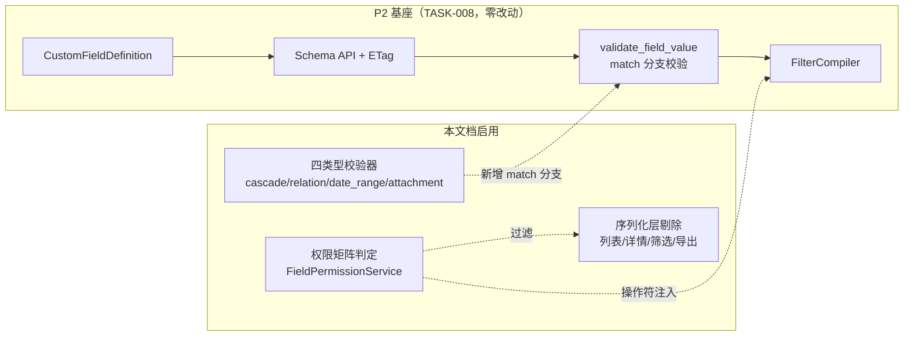
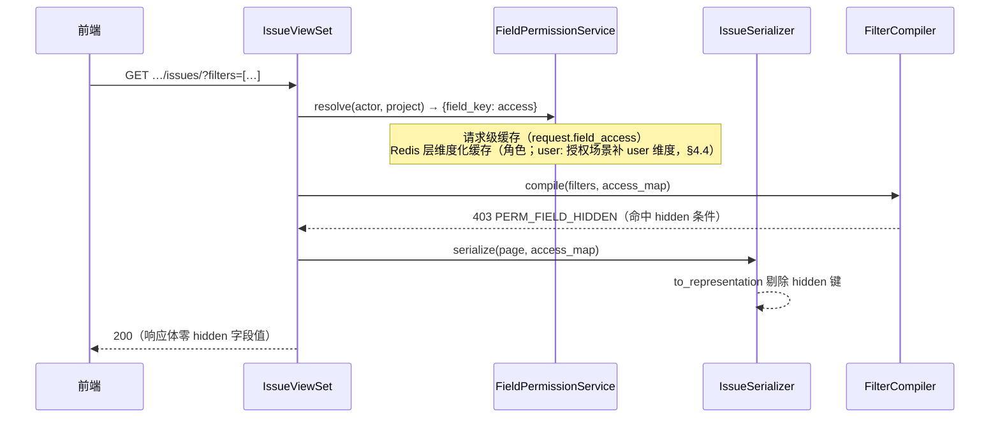

# TASK-012 高级自定义字段与字段级权限

| 元信息项 | 内容 |
| --- | --- |
| 文档编号 | TASK-012 |
| 所属迭代 | Sprint 7 — 企业工作流核心（第 9-10 周） |
| 模块 | M4-TASK 任务核心（动态字段体系） |
| 优先级 | P3（企业版核心） |
| 工作量估算 | 后端 3.5 人日（四类型校验器 1.5 + 权限序列化层 1.5 + 筛选集成 0.5）｜前端 3.0 人日（级联配置器 1 + 权限矩阵 1 + 渲染/隐藏 1）｜测试 1.5 人日 |
| 关联架构文档 | [`dynamic-fields-design.md`](../architecture/dynamic-fields-design.md)（字段域唯一权威：§3.1/§7.3 `permission_config` 结构、§5.1 筛选操作符映射表）、[`rbac-permission-model.md`](../architecture/rbac-permission-model.md)（§2.2/§2.3 角色等级与角色码、§3.4/§11.2 字段级权限四档与三处生效）、[`unified-issue-model.md`](../architecture/unified-issue-model.md)、[`api-conventions.md`](../architecture/api-conventions.md)（§8.3 `PERM_FIELD_READ_ONLY/HIDDEN`、§8.4 `VALIDATION_CUSTOM_FIELD_INVALID`） |
| 上游依赖 | `TASK-008`（`CustomFieldDefinition` 全量基座；**P3 扩展列 `permission_config`/`cascade_config` 与四个高级类型枚举建列即定义，本文档启用，零 DDL**）；`TASK-011`（FilterCompiler）；`FILE-001`（附件管道）；`WF-004`（流转守卫消费本文 §4.4 access_map 接口：hidden 字段豁免其 `required_fields` 守卫——WF-004 现行版未记载此协议，待同步登记（上游待回改）；按角色必填不在 WF-004 范围，由本文档 `required_for` 承载） |
| 下游消费 | P4 `TASK-014`（公式/多级级联/跨项目关联在本四类型之上扩展）；`RPT-002/004`（导出权限感知）；Sprint 8 `AUTH-008`（自定义角色进入权限矩阵） |
| 文档状态 | 待评审（Draft） |
| 最后更新日期 | 2026-09-04 |

---

## 1. 概述

### 1.1 背景

`TASK-008` 交付了动态字段体系的完整基座：定义表、JSONB 值存储（`cf_` 前缀、原生类型、无 null 键）、Schema API + ETag、FilterCompiler。当时刻意把**企业版能力锁在枚举与列层面**——四个高级类型（级联/关联/日期区间/附件）已在 `FieldType` 定义但管理 UI 不开放，`permission_config`/`cascade_config` 两列已建但不读写。

企业客户的两个刚需在 Sprint 7 解锁：

1. **高级字段类型**：级联下拉（省→市→区式的多级选项）、关联工作项（需求关联 Epic）、日期区间（排期起止对）、附件字段（合同扫描件挂任务）。
2. **字段级权限**：「工时字段对普通成员隐藏」「金额字段只读」「需求排期仅产品角色可编辑且必填」——`read`/`write`/`required_for` 三集合白名单 × 角色（存储口径，dynamic-fields §7.3），判定为 `editable`/`readonly`/`hidden`/`required` 四态（语义口径，rbac §11.2），且**序列化层剔除**保证隐藏字段在列表/详情/筛选/导出四处彻底不可见。

### 1.2 目标

1. 管理入口开放四个高级类型，各配校验器、渲染器、筛选操作符——与 P2 十二类型同一管线（定义 → Schema API → 值校验 → 筛选编译）。
2. `cascade_config` 启用：级联字段的多级选项树配置与校验。
3. `permission_config` 启用：`read`/`write`/`required_for` 三集合白名单（字段 × 角色），服务端**单一判定入口**产出四态，序列化层剔除隐藏字段。
4. 「必填」语义三层——字段定义级必填 `is_required`（全场景、全角色）、按角色必填 `required_for`（本文档在定义级自实现，缺失时 400，承 rbac §11.2 required 档）、流转守卫级必填（仅流转时，WF-004 `required_fields`，无角色维度）；WF-004 另消费本文 §4.4 access_map 接口，对 hidden 字段豁免守卫校验——该协议 WF-004 现行版未记载，待同步登记（上游待回改）。

### 1.3 范围与边界

| 范围 | 本文档交付 | 明确不做（归属） |
| --- | --- | --- |
| 高级类型 | cascade / relation / date_range / attachment 四类型全管线 | 公式字段（P4 `TASK-014`）、多级 >3 级级联（P4） |
| 字段权限 | `read`/`write`/`required_for` 三集合 × 固定角色码（判定四态）；序列化剔除 | `field:` 主体与 `readonly_when` 条件只读（dynamic-fields §7.3 预留位）、按自定义角色的矩阵（Sprint 8 `AUTH-008` 后自动生效——矩阵成员即 `role:<自定义角色码>`，无需改表）、字段级审计（`AUTH-010`） |
| 级联 | ≤3 级选项树、父选子过滤 | 级联联动显隐其他字段（P3 预留——dynamic-fields §7 归属 Sprint 7-9；具体载体待 dependency-graph 回改时定） |
| 关联 | 同项目工作项选择器（多选） | 跨项目关联（P4 `TASK-014`） |
| 流转必填 | 协议对齐（WF-004 消费本文 §4.4 access_map 接口：hidden 字段豁免 `required_fields` 守卫——WF-004 待同步登记（上游待回改）） | 守卫执行本体与按流转边必填配置（`WF-004`，无角色维度） |

### 1.4 术语表

| 术语 | 定义 |
| --- | --- |
| 权限配置（存储口径） | `permission_config` 三集合白名单（dynamic-fields §3.1/§7.3）：`{"read": ["role:proj_admin"], "write": ["role:proj_admin", "role:proj_contributor"], "required_for": ["role:proj_contributor"]}`，成员为 `role:<角色码>` 或 `user:<uuid>`；集合为空 = 全员（P2 默认行为） |
| 判定四态（语义口径） | `resolve` 输出（对齐 rbac §3.4/§11.2 四档）：`editable`（默认，可读写）/ `readonly`（可见不可写，写入静默丢弃）/ `hidden`（序列化层剔除）/ `required`（可写且对命中角色必填） |
| 级联选项树 | `cascade_config.levels`：每级一组选项，子级选项携带 `parent_value` 归属——该结构替代 dynamic-fields §7.4 预览的 `cascade_options` 父值映射（架构文档待回改，登记见 §4.1）；`visible_when`/`parent_field_key` 联动键为 §7.4 预留，本迭代不启用 |
| 隐藏剔除点 | Serializer `to_representation` 统一过滤——列表/详情/筛选字段集/导出共用一个入口 |

### 1.5 前置依赖

| 依赖 | 内容 | 阻塞原因 |
| --- | --- | --- |
| `TASK-008` §4.1.1 | `FieldType` 枚举已含四高级类型；`MULTI_VALUE_TYPES` 已含 `attachment`；`OPTION_REQUIRED_TYPES` 已含 `cascade`（其对 `options` 的非空校验由本文 §4.3 占位回填兼容）；`permission_config`/`cascade_config` 列已建 | **零 DDL** 的物理基础；值校验框架 `validate_field_value`（§4.3.2）的 match 分支即四类型校验器的扩展点 |
| `TASK-008` §4.3.1 | Redis 定义缓存 + 信号失效 | 权限/级联配置变更走同一失效范式（access 缓存在其上叠加维度化键——角色维度，存在 `user:` 授权时补 user 维度，§4.4） |
| `TASK-011` | FilterCompiler DSL | 高级类型操作符走其 `ALLOWED_OPERATORS` 表扩展；筛选须权限感知 |
| `FILE-001` | 附件上传管道（MinIO 预签名 + `FileAsset`） | attachment 字段值 = FileAsset ID 列表 |
| `api-conventions.md` §8 | `PERM_FIELD_READ_ONLY` / `PERM_FIELD_HIDDEN` / `VALIDATION_CUSTOM_FIELD_INVALID` | 错误码已预留，零新增 |

### 1.6 竞品参考

| 竞品 | 参考点 | 处置 |
| --- | --- | --- |
| Jira | Field Configuration + Field Configuration Scheme：必填/显隐按 scheme，渲染器按字段 | 显隐/只读采纳；**砍掉 scheme 间接层**（权限直接挂在字段定义上，与 TASK-008 双作用域治理一致） |
| Ones | 字段权限矩阵（角色 × 字段 × 可见/只读/可编辑/必填，rbac §11.2 对标口径） | 矩阵语义对齐（存储用三集合白名单表达）；导出剔除同为硬性要求 |
| Plane | 无字段级权限（2026-09）；自定义字段仅六种基础类型 | 四高级类型即差异化能力；隐藏剔除的序列化层方案为原创设计 |

---

## 2. 业务逻辑

### 2.1 四个高级类型语义

| 类型 | 值格式（JSONB 原生类型） | 校验规则 | 渲染 | 筛选操作符 |
| --- | --- | --- | --- | --- |
| `cascade` 级联下拉 | `["zj", "hz"]`（逐级 value 数组，长度=级数） | 每级 value 在该级选项集内；子级 `parent_value` 必须等于前一级选中值；不允许跳级 | 多级联动下拉，父选子过滤 | `in`（完整路径）/ `starts_with`（路径前缀） |
| `relation` 关联工作项 | `["6b1c9d2e-…", "8f3a4b5c-…"]`（Issue UUID 数组，≤20） | 引用任务须同项目、未删除、非自身；去重 | 工作项选择器（搜索 + 卡片预览），详情页显示编号+标题链接 | `in` / `is_empty` |
| `date_range` 日期区间 | `{"start": "2026-09-01", "end": "2026-09-30"}` | 双键必填；`start ≤ end`；ISO 日期 | 区间选择器，列表渲染 `09-01 ~ 09-30` | `overlaps` / `contains_date` |
| `attachment` 附件 | `["3e7d8f9a-…"]`（FileAsset UUID 数组，≤10） | FileAsset 须存在、属同工作空间、已完成上传；类型/大小白名单在 `FILE-001` 预签名时拦截 | 附件卡片列表（图标+文件名+大小，点击预览/下载） | `is_empty` / `is_not_empty` |

**筛选操作符对齐**：上表操作符列与 dynamic-fields §5.1「控件-操作符映射表」逐行一致；`contains` 不用于 relation——该名已被文本类字段的子串包含语义占用（§5.1），多值成员匹配统一走 `in`。attachment 在 §5.1 未列，按多值存在性交付 `is_empty`/`is_not_empty` 最小集。

**值存储纪律不变**：仍入 `Issue.custom_fields` JSONB、`cf_` 前缀键、原生类型、无 null 键（空值 = 删键）。四类型校验器为 TASK-008 §4.3.2 `validate_field_value` 的**四个显式 match 分支**（该函数是单函数分派、无注册机制），零框架改动。



### 2.2 字段级权限语义

| 规则 | 说明 |
| --- | --- |
| 判定输入 | 字段定义 + 请求者在**该项目**的有效角色（rbac §5.2 `get_effective_project_role` 整数等级，WS_OWNER/WS_ADMIN 隐式 PROJ_ADMIN（§7.4）；Sprint 8 自定义角色自动并入） |
| 默认态 | `permission_config` 为空，或 `read` 与 `write` 均未命中该角色的 `role:`/`user:` 标识（两集合各自为空视为未命中，空集合 = 全员）→ `editable`（P2 行为，零回归；仅落 `read` 未落 `write` 为 `readonly`，见下行） |
| `readonly` | 详情/列表正常渲染；表单控件禁用；PATCH 携带该字段 → **静默丢弃**（值不变），`meta.warning.dropped_fields` 回显被忽略键（BR-16，rbac §11.2 口径） |
| `hidden` | **四处剔除**：① 列表列配置不可选 ② 详情序列化不含该键的值与配置（Schema API 中该字段仅下发 `id/key/type/access` 四键骨架且 `"access": "hidden"`，配置键不下发，前端不渲染——存在性与类型经骨架有意暴露，偏差登记见 BR-10）③ FilterCompiler 拒绝以其为条件的筛选（`403 PERM_FIELD_HIDDEN`）④ 导出（CSV/报表）列剔除；PATCH 携带该字段同样静默丢弃（与 readonly 同一出口） |
| `required` | `required_for` 命中角色且该字段可写：保存任务缺值 → `400 VALIDATION_CUSTOM_FIELD_INVALID` + `REQUIRED`（rbac §11.2「required 字段缺失返回 400」） |
| 优先级 | ADMIN（等级 ≥ PROJ_ADMIN）不受 `hidden` 限制（豁免为 `editable`，治理需要）；`readonly` 对 ADMIN 仍生效（防误改——审计场景） |
| 与必填关系 | `is_required`（定义级）对可读角色生效；`hidden` 角色提交时豁免一切必填（否则无法创建任务）；按角色必填 = `required_for` 在定义级表达（本文档），WF-004 `required_fields` 无角色维度、仅承接流转时全角色必填 |
| readonly × is_required 冲突裁决 | 定义级 `is_required=true` 且某可读角色为 `readonly`（read 命中或空集而 write 不含）时：**配置期拦截**——保存字段定义时 400 `VALIDATION_ERROR`（details 定位 `permission_config`，提示不可组合，BR-17）；存量/绕行组合运行期兜底——该角色创建任务走 `default_value`，无默认值则允许为空并记 `meta.warning.required_relaxed`（不 400：readonly 角色本无该字段写权，缺值责任不在提交者） |

> **实现口径裁决与登记（两处）**
> 1. **存储建模**：rbac §3.4 的 `FieldPermission` 独立表与 dynamic-fields §3.1 的 `permission_config` JSONB 列是同一能力的两种建模。字段域以 dynamic-fields-design.md 为唯一权威（README §4 层级），本文档落在 `permission_config` 列（零 DDL）；rbac §3.4 的表建模**架构文档待回改**——§11.2 的四档 access 与三处生效语义全部保留不变。
> 2. **写入路径**：rbac §11.2 规定 API 层「`to_internal_value` 剔除无写权限的字段（静默丢弃而非报错，避免前端旧缓存导致操作失败）」；api-conventions.md §8.3 预留码 `PERM_FIELD_READ_ONLY` 的建议动作是「403 + details 列字段名」。本文档按 rbac 口径执行**静默丢弃 + `meta.warning`**，写入路径不触发 `PERM_FIELD_READ_ONLY`（预留码保留；`PERM_FIELD_HIDDEN` 仅用于筛选条件拒绝）；api-conventions §8.3 对应行为口径**架构文档待回改**。

### 2.3 业务规则（BR）

| 编号 | 规则 | 强制层 | 违约响应 |
| --- | --- | --- | --- |
| BR-01 | 四高级类型仅企业版许可可建；标准版请求 → `403 PERM_LICENSE_REQUIRED` | Serializer | 403 |
| BR-02 | `field_key` 不可变、`cf_` 前缀（承 TASK-008） | DB + Service | `400 VALIDATION_ERROR` |
| BR-03 | cascade 级数 2-3 级；每级选项 ≤100；选项树整体 ≤300 项；选项 `value` **全树唯一**（同名 value 分布在不同层级会被拍平占位的唯一性校验拦截，属非法配置而非未声明行为） | Serializer | `400 VALIDATION_ERROR`（配置级错误，非值级；details 定位 `cascade_config.levels[i]`） |
| BR-04 | cascade 子级选项必携 `parent_value` 且父值存在于上一级选项集 | Serializer | `400 VALIDATION_ERROR`，details 定位 `cascade_config.levels[i].options[j]` |
| BR-05 | relation 仅同项目任务；数组 ≤20 且去重；禁自引用 | 校验器 | `400 VALIDATION_CUSTOM_FIELD_INVALID`，子码 `DOES_NOT_EXIST`，message 列缺失/跨项目 ID |
| BR-06 | date_range `start ≤ end`，双键同存 | 校验器 | `400` + `INVALID_DATE_RANGE` |
| BR-07 | attachment 字段值仅存 FileAsset ID，**不复制文件**；类型/大小白名单与配额已在 FILE-001 预签名/complete 时拦截 | 校验器 | 不存在/未完成上传/跨空间 → `400 VALIDATION_CUSTOM_FIELD_INVALID` + `DOES_NOT_EXIST` |
| BR-08 | `permission_config` 三集合成员须为 `role:<合法角色码>`（rbac §2.2/§2.3 角色码小写形）或 `user:<UUID>`；`required_for` 仅接受 `role:` 成员 | Serializer | `400 VALIDATION_ERROR` + `NOT_A_CHOICE`，details 定位集合下标 |
| BR-09 | 权限矩阵变更即时生效（缓存失效同 TASK-008 信号范式）；进行中表单提交按**提交时**权限判定 | Service | — |
| BR-10 | hidden 字段在 Schema API 仅下发 `id/key/type/access` 四键骨架，配置与值不下发。**偏差登记**：dynamic-fields §7.3 原文为「不可见字段不下发定义与值」（定义亦不下发）；本文 P3 有限下发四键骨架——BR-11 筛选 403 拒绝与已保存视图/列配置的剔除提示需要键存在性可识别，架构文档待回改（§7.3 下发口径按四键骨架修订） | Serializer 剔除 | — |
| BR-11 | FilterCompiler 对 hidden 字段条件整体拒绝（不容错跳过——静默忽略会让用户误以为已过滤） | FilterCompiler | `403 PERM_FIELD_HIDDEN` |
| BR-12 | 导出/报表列剔除 hidden 字段（RPT 侧报表导出共用剔除入口——PNG 复用 GANTT-002 渲染管线、CSV 服务端流式（RPT-004 §4.3）；BOARD-004 为批量操作、无导出能力，不在本表） | 导出服务 | — |
| BR-13 | 字段类型不可跨族变更（承 TASK-008：改类型=停用旧字段+新建） | Service | `400 VALIDATION_ERROR` |
| BR-14 | relation 被引用任务删除时，值数组保留 ID 但渲染「已删除」置灰（不自动清值——可审计） | 渲染层 | — |
| BR-15 | 按角色必填：`required_for` 命中角色保存任务缺该字段值 → 拒绝；`hidden` 角色豁免 | validate_custom_fields 前置 | `400 VALIDATION_CUSTOM_FIELD_INVALID` + `REQUIRED` |
| BR-16 | 写入路径对 `readonly`/`hidden` 字段**静默丢弃**并在 `meta.warning.dropped_fields` 回显，不返回 403（rbac §11.2；裁决登记见 §2.2） | Serializer `to_internal_value` | 200（值不变） |
| BR-17 | `is_required=true` 的字段定义，其 `permission_config` 不得使任一可读角色落入 `readonly`（read 命中或空集而 write 不含）——配置期拦截（§2.2 裁决）；存量组合运行期：readonly 角色创建走 `default_value`，无默认值允许为空 + `meta.warning.required_relaxed` | Serializer（定义保存）+ Service（创建兜底） | 400 `VALIDATION_ERROR`（仅配置期） |

### 2.4 权限判定时序



---

## 3. UI/UX 设计

### 3.1 字段管理器扩展（项目设置 → 自定义字段）

```
┌────────────────────────────────────────────────────────────────────────┐
│ 自定义字段 · 电商重构项目                          [+ 新建字段 ▾]        │
│  ├─ 基础类型（12）                                                      │
│  └─ 高级类型 ⬢企业版: 级联下拉 / 关联工作项 / 日期区间 / 附件             │
├────────────────────────────────────────────────────────────────────────┤
│ 字段          类型       适用范围    权限矩阵        索引   操作          │
│ ────────────────────────────────────────────────────────────────────  │
│ 所属区域      级联下拉 ⬢  全部类型    3 角色定制      ✓    编辑 停用      │
│ 关联 Epic    关联工作项⬢  需求        默认(可写)      —    编辑 停用      │
│ 上线窗口      日期区间 ⬢  需求/缺陷   默认(可写)      ✓    编辑 停用      │
│ 合同附件      附件 ⬢      全部类型    VIEWER 隐藏    —    编辑 停用      │
│ 预估工时   数字     全部类型    PROJ_CONTRIBUTOR 只读    ✓    编辑 停用  │
└────────────────────────────────────────────────────────────────────────┘
```

### 3.2 级联配置器（新建级联字段侧栏）

```
┌──────────────────────────────────────────────────────────┐
│ 级联下拉配置                                                │
│ ──────────────────────────────────────────────────────── │
│ 级数: (●) 2 级   ( ) 3 级                                  │
│                                                            │
│ 第 1 级名称: [ 省份            ]                            │
│ ┌──────────────────────────────────────────────────────┐ │
│ │ ▸ 浙江省                                    [+子选项] │ │
│ │   ├─ 杭州市                                           │ │
│ │   ├─ 宁波市                                           │ │
│ │ ▸ 广东省                                    [+子选项] │ │
│ │   ├─ 深圳市                                           │ │
│ │ [+ 添加省份]                    已用 5/300 选项        │ │
│ └──────────────────────────────────────────────────────┘ │
│ 第 2 级名称: [ 城市            ]                            │
│                                                            │
│ 权限矩阵 (默认全部可见可写)                     [展开 ▸]    │
│ ┌──────────────────────────────────────────────────────┐ │
│ │ 角色              访问级别                              │ │
│ │ PROJ_VIEWER      ( )可写 ( )只读 (●)隐藏   ☐按角色必填  │ │
│ │ PROJ_COMMENTER   ( )可写 (●)只读 ( )隐藏   ☐按角色必填  │ │
│ │ [+ 按角色添加]                                        │ │
│ └──────────────────────────────────────────────────────┘ │
│                                              [取消] [保存] │
└──────────────────────────────────────────────────────────┘
```

> 三态单选与「按角色必填」开关是 `read`/`write`/`required_for` 集合的视图层换算：可写 = 该角色不在任一集合（默认态）；只读 = `read` 含该角色而 `write` 不含；隐藏 = `read` 不含该角色；必填开关写 `required_for`。保存时序列化器按全角色集 diff 写回白名单。

### 3.3 消费侧渲染规则

| 场景 | readonly | hidden |
| --- | --- | --- |
| 任务详情 | 正常渲染，控件禁用 + tooltip「当前角色只读」 | 字段整块不渲染；不下发值与配置详情——字段存在性与类型经四键骨架有意暴露（BR-11 403 拒绝与已保存视图剔除需要，BR-10 偏差登记）；ADMIN 仍可见 |
| 列表/看板 | 列只读展示 | 列配置器中不可选；已保存视图含该列 → 视图加载时剔除并 toast 提示 |
| 筛选器 | 可作筛选条件 | 筛选字段下拉不出现；已保存筛选含该条件 → 加载时提示「该筛选含无权限条件」并移除该条件。**移除路径（与 BR-11 服务端拒绝不冲突）**：视图 DSL 树经 views/ 详情（TASK-011 §4.2 消费 BOARD-003 端点族）客户端可得，前端比对 Schema `hiddenKeys` 剔除命中条件后**以 `?filters=` 重新发起请求**（TASK-011 BR-12 三源 AND 语义下等效），**不携带含 hidden 条件的 `?view_id=` 直连**；服务端 FilterCompiler 403（BR-11）仍为兜底（旧客户端/手工构造 view_id 时触发），两层口径互补不矛盾 |
| 创建/编辑表单 | 控件禁用 | 不出现；该字段必填被豁免（§2.2） |
| 导出 | 正常导出 | 列不出现（CSV 表头亦无） |

### 3.4 任务表单内四类型交互

- **级联**：逐级下拉，选父级后子级加载并过滤；改父级清空子级（确认提示）。
- **关联工作项**：搜索框（编号/标题，trgm，限本项目），选中渲染迷你卡片（编号+标题+状态点），可移除；上限 20。
- **日期区间**：双日期选择器联动（start 变动时 end 不早于 start 自动对齐）；列表渲染紧凑格式。
- **附件**：复用 `FILE-001` 上传组件（拖拽/预签名/进度条），字段区内联展示附件卡片，删除即解除关联（文件本体留任务附件库——附件字段与任务附件共享 FileAsset 多态挂载，来源以 `attributes.field_key` 记录：FILE-001 无 `kind` 列，`attributes` 为自由 JSONB，追加键零 DDL）。

---

## 4. 技术架构

### 4.1 列启用（零 DDL）

```python
# TASK-008 已建列，本迭代仅启用——迁移文件为空操作（部署文档记录开关）
class CustomFieldDefinition(BaseModel):
    # …（P2 字段不变）…
    permission_config = models.JSONField(
        default=dict, blank=True, verbose_name="字段级权限配置",
        # 结构承 dynamic-fields §3.1/§7.3 三集合白名单（rbac §3.4 表建模与 JSONB 列二选一，裁决见 §2.2 登记）
        help_text='{"read": ["role:proj_admin", "role:proj_contributor"], '
                  '"write": ["role:proj_admin", "role:proj_contributor"], '
                  '"required_for": ["role:proj_contributor"]}',
    )
    cascade_config = models.JSONField(
        default=dict, blank=True, verbose_name="级联配置",
        # levels = 级联类型选项树（本文档启用）；visible_when/parent_field_key 等联动键为
        # dynamic-fields §7.4 预留位，本迭代不启用（启用时扩展 §4.2 schema）。
        # 结构偏差登记：levels[].options[].parent_value 多级选项树替代 dynamic-fields §7.4
        # 预览的 cascade_options 父值映射表——架构文档待回改
        help_text='{"levels": [{"name": "省份", "options": [{"label": "浙江省", "value": "zj"}]},'
                  ' {"name": "城市", "options": [{"label": "杭州市", "value": "hz", "parent_value": "zj"}]}]}',
    )
    # 管理入口白名单扩展：P2_ALLOWED_TYPES → 企业版追加四类型
    P3_ENTERPRISE_TYPES = frozenset({
        FieldType.CASCADE, FieldType.RELATION, FieldType.DATE_RANGE, FieldType.ATTACHMENT})
```

### 4.2 配置 Schema（Serializer 内嵌 jsonschema 校验）

```python
# 角色码 = rbac §2.2/§2.3 角色码小写形（role: 前缀的后缀）；Sprint 8 自定义角色追加其角色码即可
ROLE_CODES = frozenset({"ws_owner", "ws_admin", "ws_member", "ws_guest",
                        "proj_admin", "proj_contributor", "proj_commenter", "proj_viewer"})
# 惰性面说明：resolve() 的有效项目角色恒映射 proj_*（WS_ADMIN 隐式 PROJ_ADMIN，rbac §7.4）——
# ws_* 四码在判定路径永不命中，仅定义级保留（作白名单合法值），备 Sprint 8 AUTH-008 自定义角色映射复用
GRANT_PATTERN = r"^(role:[a-z_]+|user:[0-9a-f]{8}-[0-9a-f]{4}-4[0-9a-f]{3}-[89ab][0-9a-f]{3}-[0-9a-f]{12})$"

PERMISSION_CONFIG_SCHEMA = {
    "type": "object",
    "properties": {
        "read":         {"type": "array", "items": {"type": "string", "pattern": GRANT_PATTERN}},
        "write":        {"type": "array", "items": {"type": "string", "pattern": GRANT_PATTERN}},
        "required_for": {"type": "array", "items": {"type": "string", "pattern": r"^role:[a-z_]+$"}},
    },
    "additionalProperties": False,   # field: 主体 / readonly_when 为 dynamic-fields §7.3 预留位，启用前不放开
}
# jsonschema 之后的 Serializer 附加校验：role: 后缀必须 ∈ ROLE_CODES → 400 VALIDATION_ERROR + NOT_A_CHOICE（BR-08）

CASCADE_CONFIG_SCHEMA = {
    "type": "object",
    "required": ["levels"],
    "properties": {
        "levels": {
            "type": "array", "minItems": 2, "maxItems": 3,   # BR-03
            "items": {
                "type": "object", "required": ["name", "options"],
                "properties": {
                    "name": {"type": "string", "maxLength": 32},
                    "options": {"type": "array", "maxItems": 100, "items": OPTION_SCHEMA},
                },
            },
        },
    },
    "additionalProperties": False,
}
# OPTION_SCHEMA: {"label", "value", "parent_value"(第2级起必填), "color"?, "sort_order"?}
```

### 4.3 四类型校验器（TASK-008 §4.3.2 `validate_field_value` 显式分支）

```python
# apps/api/plane/db/services/field_validation.py
# TASK-008 的值校验是单函数 match 分派（§4.3.2），不存在注册点——
# 四类型以四个显式分支接入，插在 case _: 拒绝分支之前，零框架改动：

        # ---- TASK-012 追加分支（validate_field_value 内）----
        case FT.CASCADE:    return _validate_cascade(value, definition)
        case FT.RELATION:   return _validate_relation(value, definition, ctx)   # ctx.project / ctx.issue
        case FT.DATE_RANGE: return _validate_date_range(value)
        case FT.ATTACHMENT: return _validate_attachment(value, definition)


def _validate_cascade(value, definition):
    levels = (definition.cascade_config or {}).get("levels", [])
    if not isinstance(value, list) or len(value) != len(levels):        # 长度 = 级数（§2.1）
        raise FieldError("VALIDATION_CUSTOM_FIELD_INVALID",
                         f"级联值须为长度 {len(levels)} 的逐级 value 数组")
    parent = None
    for i, v in enumerate(value):
        options = {o["value"]: o for o in levels[i]["options"]}
        if v not in options:
            raise FieldError("VALIDATION_CUSTOM_FIELD_INVALID", f"第 {i + 1} 级值不在选项集内",
                             field=f"property.{definition.id}")
        if i > 0 and options[v].get("parent_value") != parent:         # BR-04 父链校验
            raise FieldError("VALIDATION_CUSTOM_FIELD_INVALID", "级联路径不连续（父值不匹配）")
        parent = v
    return value


def _validate_relation(value, definition, ctx):
    ids = _uuid_list(value, max_len=20)                                # BR-05：≤20、去重
    if ctx.issue is not None and ctx.issue.id in ids:                  # 禁自引用
        raise FieldError("VALIDATION_CUSTOM_FIELD_INVALID", "不能关联任务自身")
    found = set(Issue.objects.filter(id__in=ids, project=ctx.project,
                                     deleted_at__isnull=True).values_list("id", flat=True))
    missing = sorted(str(i) for i in ids if i not in found)            # 不存在 / 跨项目 / 已删除
    if missing:
        raise FieldError("VALIDATION_CUSTOM_FIELD_INVALID",
                         f"关联工作项不存在或跨项目：{', '.join(missing)}", code="DOES_NOT_EXIST")
    return [str(i) for i in ids]


def _validate_date_range(value):
    if not isinstance(value, dict) or "start" not in value or "end" not in value:
        raise FieldError("VALIDATION_CUSTOM_FIELD_INVALID", "区间须同时含 start 与 end", code="REQUIRED")
    start, end = _iso_date(value["start"]), _iso_date(value["end"])
    if start is None or end is None:
        raise FieldError("VALIDATION_CUSTOM_FIELD_INVALID", "日期须为 YYYY-MM-DD", code="INVALID_DATE")
    if start > end:                                                    # BR-06
        raise FieldError("VALIDATION_INVALID_DATE_RANGE", "start 须不晚于 end")
    return {"start": value["start"], "end": value["end"]}


def _validate_attachment(value, definition):
    ids = _uuid_list(value, max_len=10)                                # ≤10、去重
    found = FileAsset.objects.filter(
        id__in=ids, workspace_id=definition.workspace_id,
        status=FileAsset.Status.UPLOADED, deleted_at__isnull=True)     # FILE-001 状态机
    if found.count() != len(set(ids)):
        raise FieldError("VALIDATION_CUSTOM_FIELD_INVALID",
                         "附件不存在、未完成上传或跨工作空间", code="DOES_NOT_EXIST")
    return [str(i) for i in ids]
```

**cascade 创建回填（服务层，兼容 TASK-008 §4.1.1）**：`OPTION_REQUIRED_TYPES` 含 `cascade`（§1.5），TASK-008 `clean()` 据此要求 `options` 非空**且逐项 label/value 完整**；而本文 cascade 选项全入 `cascade_config`、创建请求不含 `options`——不回填必被 400 拦截。创建/改配服务在 `save()` 前自动回填占位列：

```python
def _backfill_cascade_options(definition):
    """cascade 类型：拍平全级选项为 TASK-008 §4.1.1 可接受的 {label, value} 占位。"""
    levels = (definition.cascade_config or {}).get("levels", [])
    definition.options = [{"label": o["label"], "value": o["value"]}
                          for level in levels for o in level["options"]]
```

级联真实取值与父链校验仍以 `cascade_config` 为准（上文 `_validate_cascade`），`options` 仅校验占位。**登记：TASK-008 待回改（两处）**——① §4.1.1 `clean()` 对 cascade 的选项校验改读 `cascade_config`（届时移除本回填占位）；② §2.6 边界表「选项数/字段 100 → 400」对 cascade 的拍平占位列**豁免**：cascade 类型以本文 BR-03「整树 ≤300 项」为唯一上限（2 级 100+100、3 级树合法超 100，不豁免则合法配置被 400 误拦）。占位期间 `clean()` 按 `field_type == cascade` 放行 `options > 100`，value 全局唯一校验保留（BR-03 全树唯一约束同源）。

### 4.4 权限判定服务（单一入口）

```python
ROLE_CODE_BY_LEVEL = {   # rbac §2.2/§2.3：整数等级 → 矩阵用角色码（小写形；Sprint 8 自定义角色追加）
                         # 仅 proj_* 四项：effective_project_role 恒返回项目侧等级（WS_ADMIN 隐式
                         # PROJ_ADMIN，rbac §7.4），且 WorkspaceRole/ProjectRole 两族 IntEnum 数值区间
                         # 重叠——混作字典键会同值互撞覆盖（ws_* 四码惰性见 §4.2 注，Sprint 8 AUTH-008
                         # 自定义角色映射时以角色码字符串直查，不再扩本表）
    ProjectRole.ADMIN: "proj_admin", ProjectRole.CONTRIBUTOR: "proj_contributor",
    ProjectRole.COMMENTER: "proj_commenter", ProjectRole.VIEWER: "proj_viewer",
}


class FieldPermissionService:
    """字段级权限唯一判定入口——Schema 标注/Serializer 读写/FilterCompiler/导出四方共用（BR-10/11/12/15/16）"""

    def resolve(self, actor, project, definitions) -> dict[str, str]:
        """三集合白名单（dynamic-fields §7.3）→ 四态判定（rbac §11.2）。
        返回 {field_key: 'editable'|'readonly'|'hidden'|'required'}；请求级缓存 request.field_access。"""
        role = PermissionResolver.effective_project_role(actor, project)   # int；WS_OWNER/WS_ADMIN 隐式 PROJ_ADMIN（rbac §7.4）
        me_role, me_user = f"role:{ROLE_CODE_BY_LEVEL[role]}", f"user:{actor.id}"
        result = {}
        for d in definitions:
            cfg = d.permission_config or {}
            read, write = set(cfg.get("read", [])), set(cfg.get("write", []))
            can_read = not read or me_role in read or me_user in read      # 空集合 = 全员（P2 默认）
            can_write = not write or me_role in write or me_user in write
            if not can_read:
                access = "hidden"
            elif not can_write:
                access = "readonly"
            elif me_role in cfg.get("required_for", []):
                access = "required"                                        # rbac §11.2 required 档
            else:
                access = "editable"
            if role >= ProjectRole.ADMIN and access == "hidden":
                access = "editable"       # §2.2：ADMIN 豁免 hidden；readonly 不豁免
            result[d.field_key] = access
        return result

    def apply_to_payload(self, data: dict, access_map: dict) -> dict:
        """序列化剔除：hidden 键从 custom_fields 中移除（列表/详情/导出共用）。"""
        cf = data.get("custom_fields")
        if cf:
            data["custom_fields"] = {k: v for k, v in cf.items()
                                     if access_map.get(k) != "hidden"}
        return data

    def drop_non_writable(self, patch_cf: dict, access_map: dict) -> list[str]:
        """写入路径：readonly/hidden 键静默丢弃（rbac §11.2），返回被丢弃键供 meta.warning 回显（BR-16）。"""
        dropped = [k for k in patch_cf if access_map.get(k) in ("readonly", "hidden")]
        for k in dropped:
            del patch_cf[k]
        return dropped
```

**Schema API 标注**：`GET …/projects/{project_id}/field-schema/`（TASK-008 §4.2.1 冻结端点与 ETag 协商机制）`custom[]` 每项追加 `"access": "editable|readonly|hidden|required"`——**按请求者角色渲染**。

**两级缓存，access 层维度化（防串数据）**：字段**定义**缓存承 TASK-008 §4.3.1 `field_schema:v1:{workspace_id}:{project_id}` 不变（定义与角色无关，不把角色态写进全局定义缓存）；**access 判定**新增缓存，键维度按定义级快速预检分流——`resolve()` 的 `user:<uuid>` 授权是**按人**判定的，仅角色维度的键会让同角色不同用户共享判定结果而串数据，故项目内任一字段 `permission_config` 含 `user:` 成员时**旁路角色共享键**、改用 `field_access:v1:{workspace_id}:{project_id}:{role_code}:{user_id}`（键补 user 维度）；全项目无 `user:` 授权时沿用角色维度键 `field_access:v1:{workspace_id}:{project_id}:{role_code}`（无按人差异，同角色共享安全）。TTL 60s，`permission_config` 变更走同款信号失效（BR-09，两类键一并失效）。ETag 同步补维度：`etag = hash(project_id + role_code + max_updated_at)`，项目存在 `user:` 授权时 hash 输入追加 `user_id`——角色切换、用户身份差异（`user:` 场景）或矩阵变更任一发生即失效。

### 4.5 FilterCompiler 权限感知与操作符扩展

```python
# TASK-011 FilterCompiler 的 ALLOWED_OPERATORS 表追加四类型行——与 dynamic-fields §5.1 逐行一致
ALLOWED_OPERATORS.update({
    "cascade":    {"in", "starts_with"},        # 完整路径 / 路径前缀
    "relation":   {"in", "is_empty"},           # contains 不用于 relation（与文本子串包含撞名）
    "date_range": {"overlaps", "contains_date"},
    "attachment": {"is_empty", "is_not_empty"},
})

# 编译入口前置权限检查（BR-11 整体拒绝）
def compile_filter(node, *, definitions, access_map):
    field_key = extract_field_key(node)
    if access_map.get(field_key) == "hidden":   # 权限类错误 details 为空数组（rbac §5.5 信封范式）
        raise ApiError("PERM_FIELD_HIDDEN", 403,
                       message=f"筛选条件包含对当前角色隐藏的字段：{field_key}", details=[])
    ...
```

SQL 生成示例（date_range `overlaps`，JSONB 路径）：`((custom_fields->'cf_launch_window'->>'start')::date <= :end AND (custom_fields->'cf_launch_window'->>'end')::date >= :start)`；级联 `in` 走完整路径 `@>`、`starts_with` 走路径前缀 `@>`，命中 TASK-008 表达式索引/GIN。

### 4.6 API 端点与 JSON 示例

全部沿用 TASK-008 §4.2 冻结端点（`issue-properties/` / `field-schema/`，前缀 `/api/v1/workspaces/{slug}/projects/{project_id}/`），仅扩展请求体；relation 选择器复用既有 issues 列表搜索——**零新增端点**：

| 方法 | 路径 | 变更 |
| --- | --- | --- |
| POST | `…/projects/{project_id}/issue-properties/` | `field_type` 接受四高级类型（企业版许可校验 BR-01；成功 `201` + Location）；`cascade_config`/`permission_config` 随建（cascade 自动回填占位 `options` 以过 TASK-008 §4.1.1 校验，见 §4.3 回填说明） |
| PATCH | `…/issue-properties/{property_id}/` | 两配置可改（缓存信号失效）；`field_type` 仍不可变 |
| GET | `…/projects/{project_id}/field-schema/` | `custom[]` 每项追加 `access` 标注（骨架下发规则见 BR-10）；ETag 维度化（角色；存在 `user:` 授权时补 user 维度，§4.4） |
| GET | `…/projects/{project_id}/issues/?search=<q>&per_page=20` | relation 选择器数据源——复用 api-conventions §5.5 列表搜索（编号/标题 trgm，路径已含项目作用域），不新开 `relations/search/` |

**① 创建级联字段（POST `201` + Location；响应体键名同 Schema API `custom[]` 项结构，请求体键名承 TASK-008 §4.2.2 `field_key`/`field_type`）**：

```json
{
  "status": "success",
  "data": {
    "id": "4f8a9b2c-1d3e-4f5a-8b9c-0d1e2f3a4b5c",
    "key": "cf_region",
    "type": "cascade",
    "cascade_config": {
      "levels": [
        { "name": "省份", "options": [{ "label": "浙江省", "value": "zj", "sort_order": 1 }] },
        { "name": "城市", "options": [{ "label": "杭州市", "value": "hz", "parent_value": "zj", "sort_order": 1 }] }
      ]
    },
    "permission_config": {
      "read": ["role:proj_admin", "role:proj_contributor", "role:proj_commenter"],
      "write": ["role:proj_admin", "role:proj_contributor"],
      "required_for": ["role:proj_contributor"]
    }
  }
}
```

> 上例语义：`proj_viewer` 未入 `read` → hidden（`ws_guest` 的有效项目角色恒为 `proj_viewer`/`proj_commenter`，同被挡在 read 外——`ws_*` 码惰性，见 §4.2 注）；`proj_commenter` 可读不可写 → readonly；`proj_contributor` 可写且必填（BR-15）。另：cascade 创建请求不含 `options`——服务端按 §4.3 回填拍平占位列，响应完整定义对象含 `options`（TASK-008 §4.2.2 口径），级联真实取值仍以 `cascade_config` 为准。

**② 错误响应矩阵**：

| 场景 | HTTP | code | details |
| --- | --- | --- | --- |
| 标准版建高级类型 | 403 | `PERM_LICENSE_REQUIRED` | `[]`（权限类，rbac §5.5 范式） |
| 级联选项树配置非法（级数/选项数/parent_value） | 400 | `VALIDATION_ERROR` | 定位 `cascade_config.levels[i].options[j]` |
| 级联值路径不连续 / 长度 ≠ 级数 | 400 | `VALIDATION_CUSTOM_FIELD_INVALID` | `{field: "property.<id>", code, message}`，message 指明级位 |
| 区间 start>end | 400 | `VALIDATION_INVALID_DATE_RANGE` | `{field: "property.<id>", code: "INVALID_DATE_RANGE"}` |
| relation 跨项目/不存在/自引用 | 400 | `VALIDATION_CUSTOM_FIELD_INVALID` | 子码 `DOES_NOT_EXIST`，message 列缺失 ID |
| `required_for` 命中角色缺值 | 400 | `VALIDATION_CUSTOM_FIELD_INVALID` | 子码 `REQUIRED`（BR-15） |
| 筛选命中隐藏字段 | 403 | `PERM_FIELD_HIDDEN` | `[]`，message 含字段名 |
| 权限矩阵角色码非法 | 400 | `VALIDATION_ERROR` | 子码 `NOT_A_CHOICE`，message 列合法枚举 |
| PATCH 携带 readonly/hidden 字段 | **200** | —（不报错） | 值静默丢弃，`meta.warning.dropped_fields` 回显（BR-16） |

```json
// 403 PERM_FIELD_HIDDEN（筛选条件拒绝）——status 为字符串、request_id 在 error 内、details 为数组
{
  "status": "error",
  "error": {
    "code": "PERM_FIELD_HIDDEN",
    "message": "筛选条件包含对当前角色隐藏的字段：cf_contract_scan",
    "details": [],
    "request_id": "01J9XQK7M3N4P5R6S7T8V9W0R3"
  }
}
```

```json
// 200 PATCH 静默丢弃示例（rbac §11.2 写入口径）——无权限键被忽略并经 meta.warning 回显
{
  "status": "success",
  "data": { "custom_fields": { "cf_priority_note": "v2" } },
  "meta": { "warning": { "dropped_fields": ["cf_estimate_hours"] } }
}
```

**③ Schema API 角色化片段（GUEST 视角；`data.builtin[]` 从略）**：

```json
{
  "status": "success",
  "data": {
    "builtin": [ … ],
    "custom": [
      { "id": "4f8a9b2c-1d3e-4f5a-8b9c-0d1e2f3a4b5c", "key": "cf_region", "type": "cascade",
        "access": "hidden" },
      { "id": "5a9b0c3d-2e4f-4a6b-9c0d-1e2f3a4b5c6d", "key": "cf_estimate_hours", "type": "number",
        "access": "readonly", "required": false }
    ]
  },
  "meta": { "etag": "W/\"cfd-v5-1725178234\"", "generated_at": "2026-09-04T07:30:34.000Z" }
}
```

> 承 TASK-008 §4.2.1 冻结契约：`builtin[]`/`custom[]` 分列、`custom[].key` 恒 `cf_` 前缀、`id` 恒下发；`access` 为本迭代新增可选键（v1 向后兼容）。hidden 字段仅保留 `id/key/type/access` 四键骨架、配置键不下发（前端不渲染、不缓存敏感配置；§7.3 原文定义亦不下发，本文按 BR-10 偏差登记有限下发骨架）；**值绝不出现在响应**（BR-10 由 §4.4 `apply_to_payload` 保证）。

### 4.7 前端实现

```typescript
class FieldPermissionGate {
  // Schema API 拉取后按 access 四态分桶，供表单/列表/筛选/导出四消费方订阅
  @computed get editableFields()  { return this.schema.custom.filter(f => f.access === "editable" || f.access === "required"); }
  @computed get readOnlyFields()  { return this.schema.custom.filter(f => f.access === "readonly"); }
  @computed get hiddenKeys()      { return new Set(this.schema.custom.filter(f => f.access === "hidden").map(f => f.key)); }
}

// 级联控件：父选子过滤 + 改父清子
const CascadeSelect: FC<{definition: CascadeDef; value: string[]; onChange(v: string[])}> = …

// relation 选择器：防抖 300ms → 复用 issues 列表 ?search=（api-conventions §5.5），选中卡片渲染
class RelationPickerStore {
  @observable candidates: IssueCard[] = [];
  @action async search(projectId: string, q: string) {
    const res = await api.get(`…/projects/${projectId}/issues/`, { params: { search: q, per_page: 20 } });
    runInAction(() => { this.candidates = res.data.data; });   // 列表 data 为数组（api-conventions §4.1 信封）
  }
}
```

| 前端要点 | 方案 |
| --- | --- |
| 已保存视图/筛选含 hidden 字段 | 加载时比对 `hiddenKeys`：列配置（纯客户端消费）直接剔除；筛选条件剔除后以 `?filters=` 重新请求、不携带含 hidden 条件的 `?view_id=`（§3.3 移除路径），toast 提示 |
| 表单渲染 | 按 `editableFields`/`readOnlyFields` 分桶渲染，readonly 控件 `disabled` + tooltip |
| PATCH 被静默丢弃 | 响应 `meta.warning.dropped_fields` 非空 → toast「N 个字段无编辑权限，已忽略」（BR-16） |
| ETag 维度化 | 角色切换（Sprint 8 多角色）触发 schema 重拉，SWR key 含角色码；项目存在 `user:` 授权时再含用户 id（与 §4.4 键/ETag 维度同步） |

---

## 5. 测试用例

### 5.1 单元测试（UT）

| 编号 | 用例 | 断言 |
| --- | --- | --- |
| UT-01 | cascade 校验：合法 2 级/3 级路径 | 通过 |
| UT-02 | cascade 父链断裂/跳级/长度 ≠ 级数 | 三类均 400，message 指明级位 |
| UT-03 | cascade_config schema：1 级或 4 级/选项超 100/子级缺 parent_value | 建字段即拒 400 `VALIDATION_ERROR`，路径定位准确 |
| UT-04 | relation 校验：去重、上限 20、自引用、跨项目 | 逐项拒绝，message 列缺失 ID 准确 |
| UT-05 | date_range：缺键、start>end、非法日期 | 对应子码 |
| UT-06 | attachment：FileAsset 不存在/跨空间 | `DOES_NOT_EXIST` |
| UT-07 | `FieldPermissionService.resolve`：空配置/未命中默认 editable；read/write/required_for 命中各态；ADMIN 豁免 hidden 不豁免 readonly | 四路径 |
| UT-08 | `apply_to_payload` 剔除 hidden 键 | custom_fields 仅余可见键 |
| UT-09 | `drop_non_writable`：readonly 与 hidden 键均静默丢弃，返回 dropped 列表供 `meta.warning` | 200 且值不变 |
| UT-10 | ETag 与 access 缓存键维度隔离：同项目不同角色 ETag 不同、`field_access` 键互不命中；存在 `user:` 授权时同角色两用户的键（含 `user_id`）与 ETag 亦互不命中 | 无串缓存（角色 + user 双维度） |
| UT-11 | FilterCompiler：hidden 条件整体拒绝 | 403，message 含字段名，details 为空数组 |
| UT-12 | date_range `overlaps` SQL 生成 | 区间交叠逻辑正确（边界含等号） |
| UT-13 | 必填双路径：hidden 角色豁免 `is_required`/`required_for`；required 角色缺值被拒 | 豁免通过 / 400 `REQUIRED` |
| UT-14 | `is_required` × `readonly` 死锁裁决（BR-17）：定义保存时该组合被 400 拦截（details 定位 `permission_config`）；存量组合下 readonly 角色创建走默认值/无默认值放空 + `meta.warning.required_relaxed` | 400（配置期）/ 创建成功且 warning 回显 |

### 5.2 集成测试（IT）

| 编号 | 用例 | 断言 |
| --- | --- | --- |
| IT-01 | 建级联字段→任务赋值→筛选 `in`/`starts_with`→导出 | 全链路值格式/筛选命中/CSV 列正确 |
| IT-02 | 权限矩阵改 hidden → GUEST 列表/详情/筛选/导出四处剔除 | 响应体零该字段值；Schema `access` 标注正确 |
| IT-03 | PATCH 只读字段（COMMENTER） | 200 静默丢弃 + `meta.warning.dropped_fields`；任务值未变 |
| IT-04 | 标准版许可建高级类型 | 403 `PERM_LICENSE_REQUIRED` |
| IT-05 | 缓存失效：矩阵变更后新请求即时生效（无 TTL 等待） | 信号失效验证 |
| IT-06 | 已保存视图含字段后字段转 hidden | 列配置剔除 + toast；请求不带含 hidden 条件的 view_id（改 `?filters=`），不报错；直接携带该 view_id 服务端 403 `PERM_FIELD_HIDDEN`（BR-11 兜底） |

### 5.3 E2E

| 编号 | 场景 |
| --- | --- |
| E2E-01 | 建「所属区域」级联字段（2 级，创建服务自动回填占位 `options` 通过 TASK-008 §4.1.1 校验，§4.3）→ 需求表单级联选择 → 列表渲染 → 筛选「浙江省/杭州市」命中 |
| E2E-02 | 「预估工时」设 PROJ_CONTRIBUTOR 只读 → PROJ_CONTRIBUTOR 详情控件禁用、PATCH 该键被静默忽略（toast 提示）；ADMIN 同受只读约束 |
| E2E-03 | 「合同附件」设 GUEST 隐藏 → GUEST 四处不可见；ADMIN 全可见 |
| E2E-04 | relation 选择器搜索添加 3 个关联 → 详情渲染链接卡片 → 删除其一（BR-14 置灰） |
| E2E-05 | date_range 排期录入 → 甘特/列表展示 → `overlaps` 筛选 9 月窗口 |

---

## 6. 竞品深度对标

| 维度 | Jira | Ones | Plane | **本方案** |
| --- | --- | --- | --- | --- |
| 字段权限粒度 | Field Configuration（scheme 间接层）+ 仅显隐/必填，**无只读态** | 角色×字段四态矩阵（rbac §11.2 对标口径） | 无 | 三集合白名单直挂字段定义（零间接层），判定四态含只读与按角色必填 |
| 隐藏实现 | 前端不渲染（API 仍返回值，被社区多次报为信息泄露） | 服务端剔除 | — | **序列化层剔除 + 筛选拒绝 + 导出剔除**，响应体零泄露（BR-10/11/12） |
| 级联字段 | 原生 cascade select（2 级） | 多级 | 无 | 2-3 级，父链服务端校验（BR-04） |
| 日期区间 | 无原生（社区插件） | 原生 | 无 | 原生 + `overlaps` 筛选（甘特排期刚需） |
| 附件字段 | 附件仅任务级 | 字段级附件 | 任务级 | 字段级，复用 FILE-001 管道零新上传链路 |
| 权限生效面 | 仅表单 | 表单+列表 | — | 列表/详情/筛选/导出四处 + Schema 角色化标注 |

---

## 7. 里程碑与验收

### 7.1 交付清单

| 类别 | 交付物 |
| --- | --- |
| Model / Migration | **零 DDL**（`permission_config`/`cascade_config` 列与四类型枚举 P2 已建）；空迁移记录开关 |
| 后端 | 四类型校验器（`validate_field_value` 显式分支）、`FieldPermissionService` 单一判定入口（含 `field_access` 维度化缓存：角色维度，存在 `user:` 授权时补 user 维度）、FilterCompiler 操作符扩展 + 权限感知、Schema API 角色化（ETag 维度化同前）；relation 选择器复用 issues 列表 `?search=`，零新增端点 |
| 前端 | 字段管理器高级类型入口、级联配置器、权限矩阵网格（三态 + 按角色必填）、四类型表单控件、隐藏剔除三消费点适配、`meta.warning.dropped_fields` 提示 |
| 测试 | UT-01~14、IT-01~06、E2E-01~05 |

### 7.2 可操作演示的验收标准

1. 四类型各建一个字段并全链路可用：赋值 → 列表渲染 → 筛选命中 → 导出正确。
2. 级联：构造父链断裂/跳级/长度不符三类非法值均被 400 拒绝且 message 定位级位；选项树超 300 项建字段即拒（400 `VALIDATION_ERROR`）。
3. 「指定字段对 PROJ_CONTRIBUTOR 隐藏」：列表列配置/详情/筛选下拉/CSV 导出**四处不可见**，API 响应体 grep 无该字段值（Sprint 7 验收清单第 6 条）。
4. readonly：PROJ_CONTRIBUTOR PATCH 该字段被静默丢弃（200，值不变，`meta.warning.dropped_fields` 回显）；ADMIN 同样受 readonly 约束（§2.2）。
5. 权限矩阵修改后**即时生效**（无缓存延迟）；ETag 与 access 缓存按角色隔离、存在 `user:` 授权时按用户隔离，无串数据。
6. 标准版许可下创建高级类型返回 403 `PERM_LICENSE_REQUIRED`。
7. WF-004 联调（以其登记本文 §4.4 access_map 接口为前提——WF-004 待同步登记（上游待回改））：hidden 字段豁免其 `required_fields` 守卫校验；按角色必填由 `required_for` 独立生效（400 `REQUIRED`）。
8. 全部端点通过 `api-conventions.md` §14 检查清单；错误码零新增。

---

## 8. 相关文档

- 迭代概览：[`docs/sprint-7-enterprise-workflow/sprint-overview.md`](sprint-overview.md)
- 字段基座：[`docs/sprint-2-task-full/TASK-008-custom-fields-basic.md`](../sprint-2-task-full/TASK-008-custom-fields-basic.md)
- 筛选编译器：[`docs/sprint-3-views-collab/TASK-011-advanced-filter.md`](../sprint-3-views-collab/TASK-011-advanced-filter.md)
- 附件管道：[`docs/sprint-1-mvp/FILE-001-task-attachment.md`](../sprint-1-mvp/FILE-001-task-attachment.md)
- 流转守卫：[`docs/sprint-7-enterprise-workflow/WF-004-transition-guard.md`](WF-004-transition-guard.md)（消费本文 §4.4 access_map 接口：hidden 字段豁免 `required_fields` 守卫——WF-004 待同步登记（上游待回改））
- P4 扩展：[`docs/sprint-future-p4/TASK-014-formula-fields.md`](../sprint-future-p4/TASK-014-formula-fields.md)


