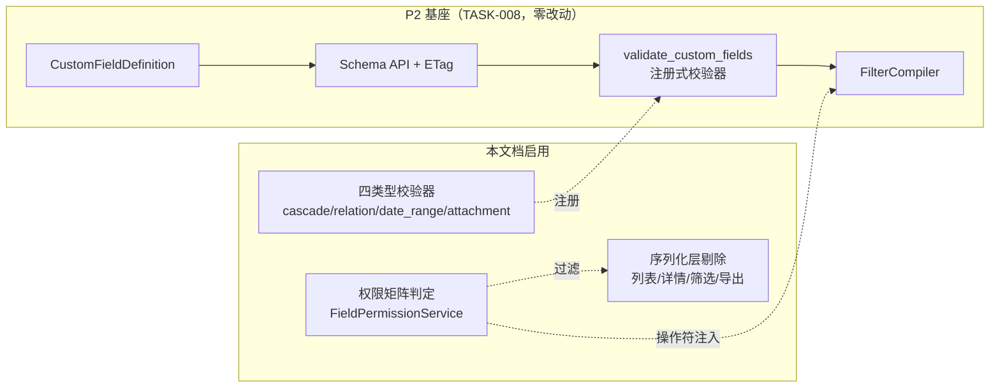
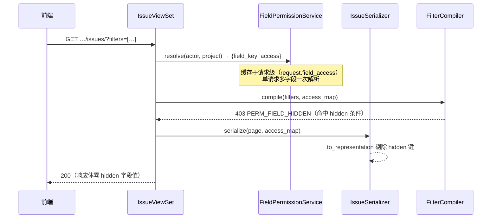

# TASK-012 高级自定义字段与字段级权限

| 元信息项 | 内容 |
| --- | --- |
| 文档编号 | TASK-012 |
| 所属迭代 | Sprint 7 — 企业工作流核心（第 9-10 周） |
| 模块 | M4-TASK 任务核心（动态字段体系） |
| 优先级 | P3（企业版核心） |
| 工作量估算 | 后端 3.5 人日（四类型校验器 1.5 + 权限序列化层 1.5 + 筛选集成 0.5）｜前端 3.0 人日（级联配置器 1 + 权限矩阵 1 + 渲染/隐藏 1）｜测试 1.5 人日 |
| 关联架构文档 | [`dynamic-fields-design.md`](../architecture/dynamic-fields-design.md)（Schema API / ETag / FilterCompiler）、[`unified-issue-model.md`](../architecture/unified-issue-model.md)、[`api-conventions.md`](../architecture/api-conventions.md)（§8.3 `PERM_FIELD_READ_ONLY/HIDDEN`、§8.4 `VALIDATION_CUSTOM_FIELD_INVALID`） |
| 上游依赖 | `TASK-008`（`CustomFieldDefinition` 全量基座；**P3 扩展列 `permission_config`/`cascade_config` 与四个高级类型枚举建列即定义，本文档启用，零 DDL**）；`TASK-011`（FilterCompiler）；`FILE-001`（附件管道）；`WF-004`（流转必填守卫消费字段权限语义） |
| 下游消费 | P4 `TASK-014`（公式/多级级联/跨项目关联在本四类型之上扩展）；`RPT-002/004`（导出权限感知）；Sprint 8 `AUTH-008`（自定义角色进入权限矩阵） |
| 文档状态 | 待评审（Draft） |
| 最后更新日期 | 2026-09-01 |

---

## 1. 概述

### 1.1 背景

`TASK-008` 交付了动态字段体系的完整基座：定义表、JSONB 值存储（`cf_` 前缀、原生类型、无 null 键）、Schema API + ETag、FilterCompiler。当时刻意把**企业版能力锁在枚举与列层面**——四个高级类型（级联/关联/日期区间/附件）已在 `FieldType` 定义但管理 UI 不开放，`permission_config`/`cascade_config` 两列已建但不读写。

企业客户的两个刚需在 Sprint 7 解锁：

1. **高级字段类型**：级联下拉（省→市→区式的多级选项）、关联工作项（需求关联 Epic）、日期区间（排期起止对）、附件字段（合同扫描件挂任务）。
2. **字段级权限**：「工时字段对普通成员隐藏」「金额字段只读」「需求排期仅产品角色可编辑」——可见/只读/隐藏三态 × 角色矩阵，且**序列化层剔除**保证隐藏字段在列表/详情/筛选/导出四处彻底不可见。

### 1.2 目标

1. 管理入口开放四个高级类型，各配校验器、渲染器、筛选操作符——与 P2 十二类型同一管线（定义 → Schema API → 值校验 → 筛选编译）。
2. `cascade_config` 启用：级联字段的多级选项树配置与校验。
3. `permission_config` 启用：字段 × 角色的可见性/可写性矩阵，服务端**单一判定入口**，序列化层剔除隐藏字段。
4. 与 WF-004 衔接：「必填」语义双层——字段定义级必填（全场景）与流转守卫级必填（仅流转时），按角色必填经守卫承载。

### 1.3 范围与边界

| 范围 | 本文档交付 | 明确不做（归属） |
| --- | --- | --- |
| 高级类型 | cascade / relation / date_range / attachment 四类型全管线 | 公式字段（P4 `TASK-014`）、多级 >3 级级联（P4） |
| 字段权限 | 可见/只读/隐藏三态 × 固定角色矩阵；序列化剔除 | 按自定义角色的矩阵（Sprint 8 `AUTH-008` 后自动生效——矩阵键即角色码，无需改表）、字段级审计（`AUTH-010`） |
| 级联 | ≤3 级选项树、父选子过滤 | 级联联动显隐其他字段（P4 `cascade_config` 扩展位） |
| 关联 | 同项目工作项选择器（多选） | 跨项目关联（P4 `TASK-014`） |
| 流转必填 | 协议对齐（WF-004 消费字段 key） | 守卫执行本体（`WF-004`） |

### 1.4 术语表

| 术语 | 定义 |
| --- | --- |
| 字段级权限三态 | `visible`（可读写）/ `read_only`（可见不可写）/ `hidden`（序列化层剔除） |
| 权限矩阵 | `permission_config`：`{"role_overrides": {"PROJ_VIEWER": "read_only", "PROJ_GUEST": "hidden"}}`，未列出角色 = 默认 visible |
| 级联选项树 | `cascade_config.levels`：每级一组选项，子级选项携带 `parent_value` 归属 |
| 隐藏剔除点 | Serializer `to_representation` 统一过滤——列表/详情/筛选字段集/导出共用一个入口 |

### 1.5 前置依赖

| 依赖 | 内容 | 阻塞原因 |
| --- | --- | --- |
| `TASK-008` §4 | `FieldType` 枚举已含四高级类型；`MULTI_VALUE_TYPES` 已含 `attachment`；`OPTION_REQUIRED_TYPES` 已含 `cascade`；`permission_config`/`cascade_config` 列已建 | **零 DDL** 的物理基础；校验框架 `validate_custom_fields` 的注册点 |
| `TASK-008` §4.6 | Redis 定义缓存 + 信号失效 | 权限/级联配置变更走同一失效范式 |
| `TASK-011` | FilterCompiler DSL | 高级类型操作符注册点；筛选须权限感知 |
| `FILE-001` | 附件上传管道（MinIO 预签名 + `FileAsset`） | attachment 字段值 = FileAsset ID 列表 |
| `api-conventions.md` §8 | `PERM_FIELD_READ_ONLY` / `PERM_FIELD_HIDDEN` / `VALIDATION_CUSTOM_FIELD_INVALID` | 错误码已预留，零新增 |

### 1.6 竞品参考

| 竞品 | 参考点 | 处置 |
| --- | --- | --- |
| Jira | Field Configuration + Field Configuration Scheme：必填/显隐按 scheme，渲染器按字段 | 显隐/只读采纳；**砍掉 scheme 间接层**（权限直接挂在字段定义上，与 TASK-008 双作用域治理一致） |
| Ones | 字段权限矩阵（角色 × 字段 × 读写/只读/隐藏） | 矩阵语义对齐；导出剔除同为硬性要求 |
| Plane | 无字段级权限（2026-09）；自定义字段仅六种基础类型 | 四高级类型即差异化能力；隐藏剔除的序列化层方案为原创设计 |

---

## 2. 业务逻辑

### 2.1 四个高级类型语义

| 类型 | 值格式（JSONB 原生类型） | 校验规则 | 渲染 | 筛选操作符 |
| --- | --- | --- | --- | --- |
| `cascade` 级联下拉 | `["province_zj", "city_hz"]`（逐级 value 数组，长度=级数） | 每级 value 在该级选项集内；子级 `parent_value` 必须等于前一级选中值；不允许跳级 | 多级联动下拉，父选子过滤 | `is`（精确路径）/ `in` / `is_empty` |
| `relation` 关联工作项 | `["01J9X…", "01J9Y…"]`（Issue UUID 数组，≤20） | 引用任务须同项目、未删除、非自身；去重 | 工作项选择器（搜索 + 卡片预览），详情页显示编号+标题链接 | `contains` / `is_empty` |
| `date_range` 日期区间 | `{"start": "2026-09-01", "end": "2026-09-30"}` | 双键必填；`start ≤ end`；ISO 日期 | 区间选择器，列表渲染 `09-01 ~ 09-30` | `overlaps` / `starts_before` / `ends_after` / `is_empty` |
| `attachment` 附件 | `["01J9F…"]`（FileAsset UUID 数组，≤10） | FileAsset 须存在、属同工作空间、未删除；复用 `FILE-001` 类型/大小白名单 | 附件卡片列表（图标+文件名+大小，点击预览/下载） | `is_empty` / `is_not_empty` |

**值存储纪律不变**：仍入 `Issue.custom_fields` JSONB、`cf_` 前缀键、原生类型、无 null 键（空值 = 删键）。四类型全部走 `validate_custom_fields` 注册式校验器（TASK-008 §4.4 注册点扩展，零框架改动）。



### 2.2 字段级权限语义

| 规则 | 说明 |
| --- | --- |
| 判定输入 | 字段定义 + 请求者在**该项目**的有效角色（四层 Permission 体系解析结果；Sprint 8 自定义角色自动并入） |
| 默认态 | `permission_config` 为空或角色未列出 → `visible`（P2 行为，零回归） |
| `read_only` | 详情/列表正常渲染；PATCH 携带该字段 → `403 PERM_FIELD_READ_ONLY`（`details.fields[]` 列字段名）；表单控件禁用 |
| `hidden` | **四处剔除**：① 列表列配置不可选 ② 详情序列化不含该键（Schema API 中该字段标记 `"access": "hidden"`，前端不渲染）③ FilterCompiler 拒绝以其为条件的筛选（`403 PERM_FIELD_HIDDEN`）④ 导出（CSV/报表）列剔除 |
| 优先级 | WS_ADMIN/PROJ_ADMIN 不受 `hidden` 限制（治理需要）；`read_only` 对 ADMIN 仍生效（防误改——审计场景） |
| 与必填关系 | `is_required`（定义级）对「可见」角色生效；隐藏角色提交时豁免该必填（否则无法创建任务）；按角色必填 = WF-004 流转守卫职责，不在定义级表达 |

### 2.3 业务规则（BR）

| 编号 | 规则 | 强制层 | 违约响应 |
| --- | --- | --- | --- |
| BR-01 | 四高级类型仅企业版许可可建；标准版请求 → `403 PERM_LICENSE_REQUIRED` | Serializer | 403 |
| BR-02 | `field_key` 不可变、`cf_` 前缀（承 TASK-008） | DB + Service | `400 VALIDATION_ERROR` |
| BR-03 | cascade 级数 2-3 级；每级选项 ≤100；选项树整体 ≤300 项 | Serializer | `400 VALIDATION_CUSTOM_FIELD_INVALID` |
| BR-04 | cascade 子级选项必携 `parent_value` 且父值存在 | Serializer | `400` 定位 `cascade_config.levels[i].options[j]` |
| BR-05 | relation 仅同项目任务；数组 ≤20 且去重；禁自引用 | 校验器 | `400 VALIDATION_CUSTOM_FIELD_INVALID` + `DOES_NOT_EXIST` |
| BR-06 | date_range `start ≤ end`，双键同存 | 校验器 | `400` + `INVALID_DATE_RANGE` |
| BR-07 | attachment 复用 FILE-001 白名单与配额；字段值仅存 FileAsset ID，**不复制文件** | 校验器 | `400 VALIDATION_FILE_TYPE_NOT_ALLOWED` / `413` |
| BR-08 | `permission_config.role_overrides` 键必须为合法角色码；值 ∈ 三态 | Serializer | `400 VALIDATION_ERROR` + `NOT_A_CHOICE` |
| BR-09 | 权限矩阵变更即时生效（缓存失效同 TASK-008 信号范式）；进行中表单提交按**提交时**权限判定 | Service | — |
| BR-10 | hidden 字段在 Schema API 中保留定义但标记 `access:hidden`（前端不渲染）；值绝不出现在任何响应体 | Serializer 剔除 | — |
| BR-11 | FilterCompiler 对 hidden 字段条件整体拒绝（不容错跳过——静默忽略会让用户误以为已过滤） | FilterCompiler | `403 PERM_FIELD_HIDDEN` |
| BR-12 | 导出/报表列剔除 hidden 字段（RPT-002/004、BOARD-004 批量导出共用剔除入口） | 导出服务 | — |
| BR-13 | 字段类型不可跨族变更（承 TASK-008：改类型=停用旧字段+新建） | Service | `400 VALIDATION_ERROR` |
| BR-14 | relation 被引用任务删除时，值数组保留 ID 但渲染「已删除」置灰（不自动清值——可审计） | 渲染层 | — |

### 2.4 权限判定时序



---

## 3. UI/UX 设计

### 3.1 字段管理器扩展（项目设置 → 自定义字段）

```
┌────────────────────────────────────────────────────────────────────────┐
│ 自定义字段 · 电商重构项目                          [+ 新建字段 ▾]        │
│  ├─ 基础类型（12）                                                      │
│  └─ 高级类型 ⬢企业版: 级联下拉 / 关联工作项 / 日期区间 / 附件             │
├────────────────────────────────────────────────────────────────────────┤
│ 字段          类型       适用范围    权限矩阵        索引   操作          │
│ ────────────────────────────────────────────────────────────────────  │
│ 所属区域      级联下拉 ⬢  全部类型    3 角色定制      ✓    编辑 停用      │
│ 关联 Epic    关联工作项⬢  需求        默认(可见)      —    编辑 停用      │
│ 上线窗口      日期区间 ⬢  需求/缺陷   默认(可见)      ✓    编辑 停用      │
│ 合同附件      附件 ⬢      全部类型    VIEWER 隐藏    —    编辑 停用      │
│ 预估工时      数字        全部类型    MEMBER 只读    ✓    编辑 停用      │
└────────────────────────────────────────────────────────────────────────┘
```

### 3.2 级联配置器（新建级联字段侧栏）

```
┌──────────────────────────────────────────────────────────┐
│ 级联下拉配置                                                │
│ ──────────────────────────────────────────────────────── │
│ 级数: (●) 2 级   ( ) 3 级                                  │
│                                                            │
│ 第 1 级名称: [ 省份            ]                            │
│ ┌──────────────────────────────────────────────────────┐ │
│ │ ▸ 浙江省                                    [+子选项] │ │
│ │   ├─ 杭州市                                           │ │
│ │   ├─ 宁波市                                           │ │
│ │ ▸ 广东省                                    [+子选项] │ │
│ │   ├─ 深圳市                                           │ │
│ │ [+ 添加省份]                    已用 5/300 选项        │ │
│ └──────────────────────────────────────────────────────┘ │
│ 第 2 级名称: [ 城市            ]                            │
│                                                            │
│ 权限矩阵 (默认全部可见可写)                     [展开 ▸]    │
│ ┌──────────────────────────────────────────────────────┐ │
│ │ 角色              访问级别                              │ │
│ │ PROJ_VIEWER      ( )可见可写 (●)只读 ( )隐藏            │ │
│ │ PROJ_GUEST       ( )可见可写 ( )只读 (●)隐藏            │ │
│ │ [+ 按角色添加]                                        │ │
│ └──────────────────────────────────────────────────────┘ │
│                                              [取消] [保存] │
└──────────────────────────────────────────────────────────┘
```

### 3.3 消费侧渲染规则

| 场景 | read_only | hidden |
| --- | --- | --- |
| 任务详情 | 正常渲染，控件禁用 + tooltip「当前角色只读」 | 字段整块不渲染（无占位——避免暴露字段存在性给低角色；ADMIN 仍可见） |
| 列表/看板 | 列只读展示 | 列配置器中不可选；已保存视图含该列 → 视图加载时剔除并 toast 提示 |
| 筛选器 | 可作筛选条件 | 筛选字段下拉不出现；已保存筛选含该条件 → 加载时提示「该筛选含无权限条件」并移除该条件 |
| 创建/编辑表单 | 控件禁用 | 不出现；该字段必填被豁免（§2.2） |
| 导出 | 正常导出 | 列不出现（CSV 表头亦无） |

### 3.4 任务表单内四类型交互

- **级联**：逐级下拉，选父级后子级加载并过滤；改父级清空子级（确认提示）。
- **关联工作项**：搜索框（编号/标题，trgm，限本项目），选中渲染迷你卡片（编号+标题+状态点），可移除；上限 20。
- **日期区间**：双日期选择器联动（start 变动时 end 不早于 start 自动对齐）；列表渲染紧凑格式。
- **附件**：复用 `FILE-001` 上传组件（拖拽/预签名/进度条），字段区内联展示附件卡片，删除即解除关联（文件本体留任务附件库——附件字段与任务附件共享 FileAsset，`kind` 标记来源）。

---

## 4. 技术架构

### 4.1 列启用（零 DDL）

```python
# TASK-008 已建列，本迭代仅启用——迁移文件为空操作（部署文档记录开关）
class CustomFieldDefinition(BaseModel):
    # …（P2 字段不变）…
    permission_config = models.JSONField(
        default=dict, blank=True, verbose_name="字段级权限矩阵",
        help_text='{"role_overrides": {"PROJ_VIEWER": "read_only", "PROJ_GUEST": "hidden"}}',
    )
    cascade_config = models.JSONField(
        default=dict, blank=True, verbose_name="级联配置",
        help_text='{"levels": [{"name": "省份", "options": [{"label": "浙江省", "value": "zj"}]},'
                  ' {"name": "城市", "options": [{"label": "杭州市", "value": "hz", "parent_value": "zj"}]}]}',
    )
    # 管理入口白名单扩展：P2_ALLOWED_TYPES → 企业版追加四类型
    P3_ENTERPRISE_TYPES = frozenset({
        FieldType.CASCADE, FieldType.RELATION, FieldType.DATE_RANGE, FieldType.ATTACHMENT})
```

### 4.2 配置 Schema（Serializer 内嵌 jsonschema 校验）

```python
PERMISSION_CONFIG_SCHEMA = {
    "type": "object",
    "properties": {
        "role_overrides": {
            "type": "object",
            "propertyNames": {"enum": ["WS_OWNER", "WS_ADMIN", "WS_MEMBER", "WS_GUEST",
                                        "PROJ_ADMIN", "PROJ_CONTRIBUTOR", "PROJ_COMMENTER",
                                        "PROJ_VIEWER"]},
            "additionalProperties": {"enum": ["visible", "read_only", "hidden"]},
        },
    },
    "additionalProperties": False,
}

CASCADE_CONFIG_SCHEMA = {
    "type": "object",
    "required": ["levels"],
    "properties": {
        "levels": {
            "type": "array", "minItems": 2, "maxItems": 3,   # BR-03
            "items": {
                "type": "object", "required": ["name", "options"],
                "properties": {
                    "name": {"type": "string", "maxLength": 32},
                    "options": {"type": "array", "maxItems": 100, "items": OPTION_SCHEMA},
                },
            },
        },
    },
    "additionalProperties": False,
}
# OPTION_SCHEMA: {"label", "value", "parent_value"(第2级起必填), "color"?, "sort_order"?}
```

### 4.3 四类型校验器（注册进 TASK-008 `validate_custom_fields`）

```python
@register_validator(FieldType.CASCADE)
def validate_cascade(value, definition):
    if not isinstance(value, list) or not (2 <= len(value) <= len(definition.cascade_config["levels"])):
        raise FieldError("VALIDATION_CUSTOM_FIELD_INVALID", "级联值须为逐级 value 数组")
    levels = definition.cascade_config["levels"]
    parent = None
    for i, v in enumerate(value):
        options = {o["value"]: o for o in levels[i]["options"]}
        if v not in options:
            raise FieldError("VALIDATION_CUSTOM_FIELD_INVALID", f"第 {i+1} 级值不在选项集内",
                             field=f"property.{definition.id}")
        if i > 0 and options[v].get("parent_value") != parent:   # BR-04 父链校验
            raise FieldError("VALIDATION_CUSTOM_FIELD_INVALID", "级联路径不连续（父值不匹配）")
        parent = v

@register_validator(FieldType.RELATION)
def validate_relation(value, definition):
    ids = _uuid_list(value, max_len=20)                            # BR-05
    q = Issue.objects.filter(id__in=ids, project=definition.project or definition._ctx_project,
                             deleted_at__isnull=True)
    found = set(q.values_list("id", flat=True))
    missing = [str(i) for i in ids if i not in found]
    if missing:
        raise FieldError("VALIDATION_CUSTOM_FIELD_INVALID", "关联工作项不存在或跨项目",
                         code="DOES_NOT_EXIST", missing=missing)

@register_validator(FieldType.DATE_RANGE)
def validate_date_range(value, definition):
    start, end = _iso_date(value.get("start")), _iso_date(value.get("end"))
    if start is None or end is None:
        raise FieldError("VALIDATION_CUSTOM_FIELD_INVALID", "区间须含 start 与 end", code="REQUIRED")
    if start > end:                                                # BR-06
        raise FieldError("VALIDATION_INVALID_DATE_RANGE", "start 须不晚于 end")

@register_validator(FieldType.ATTACHMENT)
def validate_attachment(value, definition):
    ids = _uuid_list(value, max_len=10)
    q = FileAsset.objects.filter(id__in=ids, workspace=definition.workspace, deleted_at__isnull=True)
    if q.count() != len(set(ids)):
        raise FieldError("VALIDATION_CUSTOM_FIELD_INVALID", "附件不存在或已删除", code="DOES_NOT_EXIST")
```

### 4.4 权限判定服务（单一入口）

```python
class FieldPermissionService:
    """字段级权限唯一判定入口——Serializer/FilterCompiler/导出三方共用（BR-10/11/12）"""

    def resolve(self, actor, project, definitions) -> dict[str, str]:
        """返回 {field_key: 'visible'|'read_only'|'hidden'}；请求级缓存。"""
        role = PermissionResolver.project_role(actor, project)   # 四层体系（Sprint 8 自动并入自定义角色）
        result = {}
        for d in definitions:
            access = "visible"
            override = (d.permission_config or {}).get("role_overrides", {}).get(role.code)
            if override:
                access = override
            if role.code in ("WS_OWNER", "WS_ADMIN", "PROJ_ADMIN") and access == "hidden":
                access = "visible"          # §2.2：ADMIN 不受 hidden；read_only 仍生效
            result[d.field_key] = access
        return result

    def apply_to_payload(self, data: dict, access_map: dict) -> dict:
        """序列化剔除：hidden 键从 custom_fields 中移除（列表/详情/导出共用）。"""
        cf = data.get("custom_fields")
        if cf:
            data["custom_fields"] = {k: v for k, v in cf.items()
                                     if access_map.get(k) != "hidden"}
        return data

    def check_writable(self, patch_cf: dict, access_map: dict):
        blocked = [k for k in patch_cf if access_map.get(k) in ("read_only", "hidden")]
        if blocked:
            code = "PERM_FIELD_HIDDEN" if any(access_map.get(k) == "hidden" for k in blocked) \
                   else "PERM_FIELD_READ_ONLY"
            raise ApiError(code, 403, details={"fields": blocked})
```

**Schema API 标注**：`GET …/fields/schema/`（TASK-008 §4.6，ETag 不变机制）每个字段定义追加 `"access": "visible|read_only|hidden"`——**按请求者角色渲染**，因此 ETag 键含角色维度（`etag = hash(project_id + role + updated_at)`），防跨角色缓存穿透。

### 4.5 FilterCompiler 权限感知与操作符扩展

```python
# TASK-011 FilterCompiler 注册新操作符（按类型）
register_ops("cascade",    ["is", "in", "is_empty"])
register_ops("relation",   ["contains", "is_empty"])
register_ops("date_range", ["overlaps", "starts_before", "ends_after", "is_empty"])
register_ops("attachment", ["is_empty", "is_not_empty"])

# 编译入口前置权限检查（BR-11 整体拒绝）
def compile_filter(node, *, definitions, access_map):
    field_key = extract_field_key(node)
    if access_map.get(field_key) == "hidden":
        raise ApiError("PERM_FIELD_HIDDEN", 403, details={"field": field_key})
    ...
```

SQL 生成示例（date_range `overlaps`，JSONB 路径）：`((custom_fields->'cf_01J9X…'->>'start')::date <= :end AND (custom_fields->'cf_01J9X…'->>'end')::date >= :start)`；级联 `is` 走 `@>` 包含匹配，命中 TASK-008 表达式索引/GIN。

### 4.6 API 端点与 JSON 示例

新增/变更端点（字段定义 CRUD 承 TASK-008 §4.7，仅扩展请求体）：

| 方法 | 路径 | 变更 |
| --- | --- | --- |
| POST | `…/projects/{id}/fields/` | `field_type` 接受四高级类型（企业版许可校验 BR-01）；`cascade_config`/`permission_config` 随建 |
| PATCH | `…/fields/{field_id}/` | 两配置可改（缓存信号失效）；`field_type` 仍不可变 |
| GET | `…/fields/schema/` | 每字段追加 `access` 标注；ETag 含角色维度（§4.4） |
| GET | `…/issues/{id}/relations/search/?q=` | relation 选择器数据源（编号/标题 trgm，限本项目，≤20 条） |

**① 创建级联字段（POST 200）**：

```json
{
  "status": 0,
  "data": {
    "id": "01J9XQK7M3N4P5R6S7T8V9W0P1",
    "field_key": "cf_region",
    "field_type": "cascade",
    "cascade_config": {
      "levels": [
        { "name": "省份", "options": [{ "label": "浙江省", "value": "zj", "sort_order": 1 }] },
        { "name": "城市", "options": [{ "label": "杭州市", "value": "hz", "parent_value": "zj", "sort_order": 1 }] }
      ]
    },
    "permission_config": { "role_overrides": { "PROJ_GUEST": "hidden" } }
  },
  "meta": { "request_id": "01J9XQK7M3N4P5R6S7T8V9W0Q2" }
}
```

**② 错误响应矩阵**：

| 场景 | HTTP | code | details |
| --- | --- | --- | --- |
| 标准版建高级类型 | 403 | `PERM_LICENSE_REQUIRED` | — |
| 级联路径不连续 | 400 | `VALIDATION_CUSTOM_FIELD_INVALID` | `field: "property.<id>"`，message 指明父值不匹配 |
| 区间 start>end | 400 | `VALIDATION_INVALID_DATE_RANGE` | — |
| relation 跨项目/不存在 | 400 | `VALIDATION_CUSTOM_FIELD_INVALID` | 子码 `DOES_NOT_EXIST` + `missing[]` |
| PATCH 只读字段 | 403 | `PERM_FIELD_READ_ONLY` | `fields[]` |
| PATCH 隐藏字段 | 403 | `PERM_FIELD_HIDDEN` | `fields[]` |
| 筛选命中隐藏字段 | 403 | `PERM_FIELD_HIDDEN` | `field` |
| 权限矩阵角色码非法 | 400 | `VALIDATION_ERROR` | 子码 `NOT_A_CHOICE`，枚举列表 |

```json
// 403 PERM_FIELD_READ_ONLY 示例
{
  "status": 1,
  "error": {
    "code": "PERM_FIELD_READ_ONLY",
    "message": "以下字段对当前角色为只读",
    "details": { "fields": ["cf_estimate_hours"] }
  },
  "meta": { "request_id": "01J9XQK7M3N4P5R6S7T8V9W0R3" }
}
```

**③ Schema API 角色化片段（GUEST 视角）**：

```json
{
  "status": 0,
  "data": {
    "fields": [
      { "id": "01J9XQK7M3N4P5R6S7T8V9W0P1", "field_key": "cf_region", "field_type": "cascade",
        "access": "hidden", "cascade_config": null },
      { "id": "01J9XQK7M3N4P5R6S7T8V9W0S4", "field_key": "cf_estimate_hours", "field_type": "number",
        "access": "read_only", "is_required": false }
    ]
  }
}
```

> hidden 字段保留键位但 `access:hidden` 且配置置空（前端不渲染、不缓存敏感配置）；**值绝不出现在响应**（BR-10 由 §4.4 `apply_to_payload` 保证）。

### 4.7 前端实现

```typescript
class FieldPermissionGate {
  // Schema API 拉取后按 access 三态分桶，供表单/列表/筛选/导出四消费方订阅
  @computed get editableFields()  { return this.schema.fields.filter(f => f.access === "visible"); }
  @computed get readOnlyFields()  { return this.schema.fields.filter(f => f.access === "read_only"); }
  @computed get hiddenKeys()      { return new Set(this.schema.fields.filter(f => f.access === "hidden").map(f => f.field_key)); }
}

// 级联控件：父选子过滤 + 改父清子
const CascadeSelect: FC<{definition: CascadeDef; value: string[]; onChange(v: string[])}> = …

// relation 选择器：防抖 300ms → relations/search/，选中卡片渲染
class RelationPickerStore {
  @observable candidates: IssueCard[] = [];
  @action async search(projectId: string, q: string) {
    const res = await api.get(`…/issues/relations/search/`, { params: { q } });
    runInAction(() => { this.candidates = res.data.data.results; });
  }
}
```

| 前端要点 | 方案 |
| --- | --- |
| 已保存视图/筛选含 hidden 字段 | 加载时比对 `hiddenKeys`，剔除 + toast（§3.3） |
| 表单渲染 | 按 `editableFields`/`readOnlyFields` 分桶渲染，read_only 控件 `disabled` + tooltip |
| ETag 角色维度 | 角色切换（Sprint 8 多角色）触发 schema 重拉，SWR key 含角色码 |

---

## 5. 测试用例

### 5.1 单元测试（UT）

| 编号 | 用例 | 断言 |
| --- | --- | --- |
| UT-01 | cascade 校验：合法 2 级/3 级路径 | 通过 |
| UT-02 | cascade 父链断裂/跳级/越级数 | 三类均 400，message 指明级位 |
| UT-03 | cascade_config schema：1 级或 4 级/选项超 100/子级缺 parent_value | 建字段即拒，路径定位准确 |
| UT-04 | relation 校验：去重、上限 20、自引用、跨项目 | 逐项拒绝，missing 列表准确 |
| UT-05 | date_range：缺键、start>end、非法日期 | 对应子码 |
| UT-06 | attachment：FileAsset 不存在/跨空间 | `DOES_NOT_EXIST` |
| UT-07 | `FieldPermissionService.resolve`：无配置默认 visible；矩阵命中；ADMIN 豁免 hidden 不豁免 read_only | 三路径 |
| UT-08 | `apply_to_payload` 剔除 hidden 键 | custom_fields 仅余可见键 |
| UT-09 | `check_writable`：read_only 与 hidden 混提时优先 `PERM_FIELD_HIDDEN` | 码选择正确 |
| UT-10 | ETag 角色维度：同项目不同角色 schema 响应 ETag 不同 | 无串缓存 |
| UT-11 | FilterCompiler：hidden 条件整体拒绝 | 403 + field |
| UT-12 | date_range `overlaps` SQL 生成 | 区间交叠逻辑正确（边界含等号） |
| UT-13 | 必填豁免：hidden 角色创建任务不校验该字段必填 | 创建成功 |

### 5.2 集成测试（IT）

| 编号 | 用例 | 断言 |
| --- | --- | --- |
| IT-01 | 建级联字段→任务赋值→筛选 `is`→导出 | 全链路值格式/筛选命中/CSV 列正确 |
| IT-02 | 权限矩阵改 hidden → GUEST 列表/详情/筛选/导出四处剔除 | 响应体零该字段值；Schema `access` 标注正确 |
| IT-03 | PATCH 只读字段（COMMENTER） | 403 + fields；任务值未变 |
| IT-04 | 标准版许可建高级类型 | 403 `PERM_LICENSE_REQUIRED` |
| IT-05 | 缓存失效：矩阵变更后新请求即时生效（无 TTL 等待） | 信号失效验证 |
| IT-06 | 已保存视图含字段后字段转 hidden | 视图加载剔除 + 提示，不报错 |

### 5.3 E2E

| 编号 | 场景 |
| --- | --- |
| E2E-01 | 建「所属区域」级联字段（2 级）→ 需求表单级联选择 → 列表渲染 → 筛选「浙江省/杭州市」命中 |
| E2E-02 | 「预估工时」设 MEMBER 只读 → MEMBER 详情控件禁用、PATCH 被拒；ADMIN 可改 |
| E2E-03 | 「合同附件」设 GUEST 隐藏 → GUEST 四处不可见；ADMIN 全可见 |
| E2E-04 | relation 选择器搜索添加 3 个关联 → 详情渲染链接卡片 → 删除其一（BR-14 置灰） |
| E2E-05 | date_range 排期录入 → 甘特/列表展示 → `overlaps` 筛选 9 月窗口 |

---

## 6. 竞品深度对标

| 维度 | Jira | Ones | Plane | **本方案** |
| --- | --- | --- | --- | --- |
| 字段权限粒度 | Field Configuration（scheme 间接层）+ 仅显隐/必填，**无只读态** | 角色×字段三态矩阵 | 无 | 三态矩阵直挂字段定义（零间接层），且含只读态 |
| 隐藏实现 | 前端不渲染（API 仍返回值，被社区多次报为信息泄露） | 服务端剔除 | — | **序列化层剔除 + 筛选拒绝 + 导出剔除**，响应体零泄露（BR-10/11/12） |
| 级联字段 | 原生 cascade select（2 级） | 多级 | 无 | 2-3 级，父链服务端校验（BR-04） |
| 日期区间 | 无原生（社区插件） | 原生 | 无 | 原生 + `overlaps` 筛选（甘特排期刚需） |
| 附件字段 | 附件仅任务级 | 字段级附件 | 任务级 | 字段级，复用 FILE-001 管道零新上传链路 |
| 权限生效面 | 仅表单 | 表单+列表 | — | 列表/详情/筛选/导出四处 + Schema 角色化标注 |

---

## 7. 里程碑与验收

### 7.1 交付清单

| 类别 | 交付物 |
| --- | --- |
| Model / Migration | **零 DDL**（`permission_config`/`cascade_config` 列与四类型枚举 P2 已建）；空迁移记录开关 |
| 后端 | 四类型校验器（注册式）、`FieldPermissionService` 单一判定入口、FilterCompiler 操作符扩展 + 权限感知、Schema API 角色化（ETag 含角色维度）、relation 搜索端点 |
| 前端 | 字段管理器高级类型入口、级联配置器、权限矩阵网格、四类型表单控件、隐藏剔除三消费点适配 |
| 测试 | UT-01~13、IT-01~06、E2E-01~05 |

### 7.2 可操作演示的验收标准

1. 四类型各建一个字段并全链路可用：赋值 → 列表渲染 → 筛选命中 → 导出正确。
2. 级联：构造父链断裂/跳级/越级三类非法值均被 400 拒绝且 message 定位级位；选项树超 300 项建字段即拒。
3. 「指定字段对 MEMBER 隐藏」：列表列配置/详情/筛选下拉/CSV 导出**四处不可见**，API 响应体 grep 无该字段值（Sprint 7 验收清单第 6 条）。
4. read_only：MEMBER PATCH 返回 403 `PERM_FIELD_READ_ONLY`；ADMIN 可改但同样受 read_only 约束（§2.2）。
5. 权限矩阵修改后**即时生效**（无缓存延迟）；ETag 按角色隔离无串数据。
6. 标准版许可下创建高级类型返回 403 `PERM_LICENSE_REQUIRED`。
7. WF-004 联调：隐藏角色的必填豁免 + 流转守卫按角色必填（协议对齐验证）。
8. 全部端点通过 `api-conventions.md` §14 检查清单；错误码零新增。

---

## 8. 相关文档

- 迭代概览：[`docs/sprint-7-enterprise-workflow/sprint-overview.md`](sprint-overview.md)
- 字段基座：[`docs/sprint-2-task-full/TASK-008-custom-fields-basic.md`](../sprint-2-task-full/TASK-008-custom-fields-basic.md)
- 筛选编译器：[`docs/sprint-3-views-collab/TASK-011-advanced-filter.md`](../sprint-3-views-collab/TASK-011-advanced-filter.md)
- 附件管道：[`docs/sprint-1-mvp/FILE-001-task-attachment.md`](../sprint-1-mvp/FILE-001-task-attachment.md)
- 流转守卫：[`docs/sprint-7-enterprise-workflow/WF-004-transition-guard.md`](WF-004-transition-guard.md)（按角色必填消费方）
- P4 扩展：[`docs/sprint-future-p4/TASK-014-formula-fields.md`](../sprint-future-p4/TASK-014-formula-fields.md)


