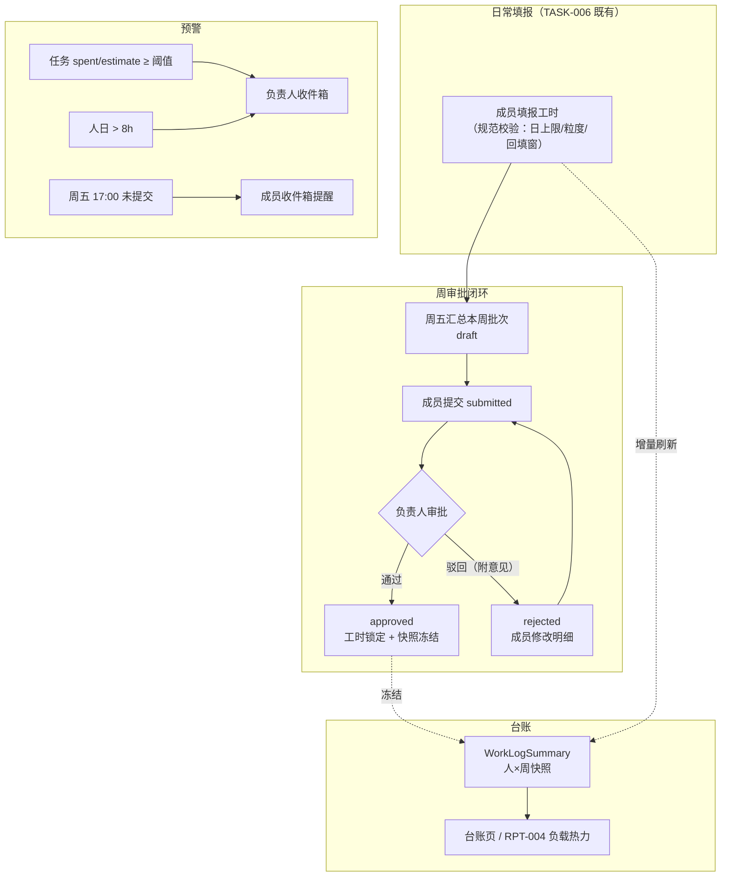
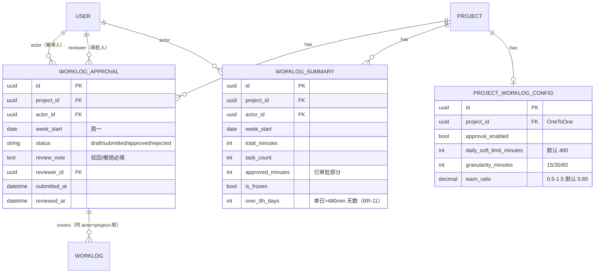

# TASK-013 团队工时统计与工时管控

| 元信息项 | 内容 |
| --- | --- |
| 文档编号 | TASK-013 |
| 所属迭代 | Sprint 7 — 企业工作流核心（第 9-10 周） |
| 模块 | M4-TASK 任务核心（工时体系） |
| 优先级 | P3（企业版核心） |
| 工作量估算 | 后端 3.5 人日（审批模型 1.5 + 台账聚合 1 + 预警 1）｜前端 2.5 人日（台账视图 1 + 审批界面 1 + 预警入口 0.5）｜测试 1.5 人日 |
| 关联架构文档 | [`unified-issue-model.md`](../architecture/unified-issue-model.md)、[`api-conventions.md`](../architecture/api-conventions.md)、[`rbac-permission-model.md`](../architecture/rbac-permission-model.md) |
| 上游依赖 | `TASK-006`（WorkLog 模型与 `idx_worklog_actor_day` 人员×日期索引——**为本文档预留**）；`TASK-010`（Activity 幂等管道）；`COLLAB-001`（预警通知通道）；`WF-002`（审批语义对齐——工时审批为轻量单级审批，不复用 ApprovalFlow 引擎）；`RPT-002`（报表聚合口径——台账/导出端点复用其限流/分页/排序范式与 `ReportAggregationThrottle`，**其口径经生产验证为本文档进入条件**，见 sprint-overview §3 依赖图） |
| 下游消费 | `RPT-004`（负载热力 BR-07 消费 `WorkLogSummary` 快照；四维评分卡的**工时偏差**维度按任务级实时聚合——其 BR-01/BR-05，不消费快照）；P4 计费/成本 |
| 文档状态 | 待评审（Draft） |
| 最后更新日期 | 2026-09-04（R2 修复：冻结守卫三态/软删口径/配置行生命周期/配置读权限拆行/submit 归属/BR-08 双上限/RPT-002 依赖与 RPT-004 消费表述/批次列表分页声明/_move 审批人语义；R1：信封/权限码/冻结路径/配置归属/聚合端点声明） |

---

## 1. 概述

### 1.1 背景

`TASK-006` 交付了个人工时填报：一分钟粒度记录、`estimate_minutes` 预估、子树上卷汇总。企业场景缺的是**管控闭环**——团队负责人要回答三个问题：「大家的工时填了吗（填报规范）、填得对吗（审批）、项目工时超了吗（预警）」。

TASK-013 补齐四块：

1. **工时审批**：成员按「周 × 项目」打包提交工时，负责人通过/驳回（附意见），驳回后修改再提交，通过后锁定——这是工时数据进入考核/结算前的质量门禁。
2. **填报规范**：每日上限、最小粒度、回填窗口（承 TASK-006 30 天）、周五未交提醒——规范前置到录入与提醒，而非事后追责。
3. **超额预警**：任务 `spent/estimate` 越过 80%/100% 阈值即预警到负责人收件箱；人日 >8h 标红。
4. **团队台账**：按「人 × 周」预聚合快照表，台账页与 `RPT-004` 负载热力图共用同一数据源——报表不扫明细表。

### 1.2 目标

- `WorkLogApproval` 审批批次模型：成员 × 项目 × 自然周 一个批次，四态流转（draft → submitted → approved / rejected → submitted…）。
- 审批通过的工时被锁定（不可改不可删），驳回批次内工时可修改后整批重交。
- `WorkLogSummary` 快照表：`(project, actor, week_start)` 增量刷新、审批通过冻结，台账/报表查询 P95 < 200ms。
- 预警三通道：任务超额（阈值可配）、人日超标、周五未交——全部走 `COLLAB-001` 收件箱，幂等不轰炸。

### 1.3 范围与边界

| 范围 | 本文档交付 | 明确不做（归属） |
| --- | --- | --- |
| 工时审批 | 单级审批（提交/驳回/通过/重交）、通过后锁定 | 多级审批链（如有需要走 `WF-002` 引擎另配）、审批委派（P4） |
| 填报规范 | 日上限/粒度/回填窗口校验、未交提醒 | 强制打卡/考勤（非目标） |
| 预警 | 任务超额阈值（项目级可配）、人日 >8h、周五未交提醒 | 成本/计费预警（P4） |
| 台账 | 人×周快照表 + 台账查询/导出 API | 跨项目资源调度（P4 `PROJ-004` 之上） |

### 1.4 术语表

| 术语 | 定义 |
| --- | --- |
| 审批批次（Batch） | 某成员在某项目某自然周（周一~周日）全部工时记录的集合，`WorkLogApproval` 承载 |
| 锁定 | 批次 `approved` 后，覆盖的 WorkLog 不可修改/删除（`409 RESOURCE_LOCKED`） |
| 台账 | 按人×周的工时汇总视图，数据源为 `WorkLogSummary` 快照 |
| 快照冻结 | 批次 approved 后对应摘要行 `is_frozen=true`，后续明细变更（仅允许驳回重交流程内）须先解冻 |

### 1.5 前置依赖

| 依赖 | 内容 | 阻塞原因 |
| --- | --- | --- |
| `TASK-006` §4 | `WorkLog`（actor/worked_on/minutes 1-1440/note）、`Issue.estimate_minutes`、`idx_worklog_actor_day` 索引 | 审批覆盖的对象与台账直查索引均为既有 |
| `TASK-010` | Activity 幂等管道 + 事件扇出 | 审批动作留痕 |
| `COLLAB-001` | 收件箱通知 | 预警与审批提醒通道 |
| `rbac-permission-model.md` §8.2 | `worklog.approve` 权限码（已预留的 P4 码，本迭代提前启用——**复用既有码，零新码注册**；PROJ_ADMIN+，可经 Sprint 8 自定义角色授予）；`report.export`（CSV 导出）与 `project.setting.manage`（管控配置**写**；配置**读**为 `project.read` + 成员资格，§4.5 读写拆行）同样复用既有码 | 审批人判定 / 导出与配置鉴权 |

### 1.6 竞品参考

| 竞品 | 参考点 | 处置 |
| --- | --- | --- |
| Jira (Tempo) | Timesheet 按周期提交/审批、锁定、团队台账 | 周期提交/审批/锁定范式采纳；**Tempo 的独立账户体系不学**（审批挂在项目角色上） |
| Ones | 工时审批 + 填报规范（日上限/回填限制）+ 负载统计 | 规范项对齐；台账「人×周」粒度对齐 |
| Plane | 无工时体系（2026-09） | 工时域整体为差异化能力 |

---

## 2. 业务逻辑

### 2.1 总体流程



### 2.2 业务规则（BR）

| 编号 | 规则 | 强制层 | 违约响应 |
| --- | --- | --- | --- |
| BR-01 | 批次维度 = `(actor, project, week_start)`（周一 00:00；**时区口径（本迭代降级）**：全系统单一时区 `settings.TIME_ZONE = "Asia/Shanghai"`——`User.timezone`/`Project.timezone` 字段**均不存在**（AUTH-004 profile 白名单无时区项），按 PROJ-002 既有约定周一界由 Django `current_week_start()`（服务器时区）计算；**待补列登记**：多时区需求出现时在 User 表补 `timezone` 列并回改本 BR 与 BR-12 取值链（列入 §7.1 待回改清单，非本迭代 DDL））；同维度至多一个非删除批次 | DB 唯一约束 | `409 RESOURCE_ALREADY_EXISTS` |
| BR-02 | 批次四态：`draft → submitted → approved`；`submitted → rejected → submitted`（可循环）；`submitted → draft` 仅成员撤回路径（§3.4）；`approved` 为业务终态，唯一出边 = 撤销审批 `approved → rejected`（BR-07，必填意见）——除该边外不可再流转 | 状态机（Service） | `409 RESOURCE_STATE_INVALID` |
| BR-03 | 提交时批次须非空（覆盖周内有 ≥1 条**未软删**工时，口径见 §4.4 软删说明） | Service | `400 VALIDATION_ERROR` |
| BR-04 | 审批人 = 持 `worklog.approve`（`rbac-permission-model.md` §8.2，默认 PROJ_ADMIN+）；不可审批自己的批次 | Permission + Service | `403 PERM_DENIED` / `400 VALIDATION_ERROR` |
| BR-05 | 驳回必填意见（≤500 字） | Serializer | `400 VALIDATION_ERROR` + `REQUIRED` |
| BR-06 | `approved` 批次覆盖的 WorkLog 锁定：改/删 → `409 RESOURCE_LOCKED`；新增**该周**工时须入新周期或解冻（BR-07） | WorkLog Service 钩子 | 409 |
| BR-07 | 解锁唯一路径：负责人撤销审批（`approved → rejected`，必填意见）——审计保留完整轨迹 | Service | — |
| BR-08 | 填报规范双上限**分两档**：**硬上限**——单日单人累计 ≤1440 分钟（自然日物理上限，Service 校验 + 行级 1-1440 由 TASK-006 `chk_worklog_minutes_range` 约束；**跨行累计不能由 PG CHECK 约束（CHECK 不支持子查询），同日并发由 `SELECT … FOR UPDATE` 锁住当日行后聚合校验**）；**软上限**——`ProjectWorklogConfig.daily_soft_limit_minutes`（默认 480，可配），超出**通过但注入 `meta.warnings[]`**（不拦截真实加班，仅留痕提示）；另单笔粒度 ∈ {15, 30, 60} 分钟倍数可配（默认 15） | Service + `ProjectWorklogConfig`（§4.2） | 硬上限：`400 VALIDATION_ERROR` + 子码 `TOO_LARGE`；软上限：`200` + `meta.warnings[]`；粒度不符：`400 VALIDATION_ERROR` + 子码 `NOT_A_CHOICE` |
| BR-09 | 回填窗口承 TASK-006（30 天）；审批通过后回填窗口对该周失效（锁定优先） | Service | `400 VALIDATION_ERROR` |
| BR-10 | 任务超额预警：`spent/estimate ≥ warn_ratio`（`ProjectWorklogConfig.warn_ratio`，默认 0.8，可配 0.5-1.5）触发一次；≥1.0 再触发一次；`estimate` 变更重置已触发标记；`spent` 口径与 TASK-006 一致为 `SUM(minutes)` 实时聚合（非物化列） | Celery on_commit + Redis SETNX 幂等 | — |
| BR-11 | 人日 >8h（480 分钟）在台账行标红，不产生通知（噪音控制） | 台账渲染 | — |
| BR-12 | 周五 17:00（**服务器时区**——`settings.TIME_ZONE = "Asia/Shanghai"`，与 BR-01 同口径；多时区部署随 BR-01 待补列一并回改）未提交批次 → 提醒成员；下周一 10:00（**上一周**，§4.4 `timedelta(days=7)`）仍未交 → 汇总未交名单提醒负责人（两条独立 beat 调度，§4.4）；每周至多各一条——幂等键含周期且按 mode 分离（成员键按人、催办键按项目），成员提醒不压制负责人催办 | Celery beat + SETNX | — |
| BR-13 | 快照表只增改不删：明细变更（驳回重交流程内）触发对应 `(project, actor, week)` 行重算；`is_frozen` 行拒绝**日常增量**重算（`freeze=None` 被守卫拦截，须先 BR-07 解锁；审批显式 `freeze=True/False` 穿透守卫，§4.4） | 聚合任务 | — |
| BR-14 | 台账可见性：成员（`worklog.read` 仅本人语义）只见自己；持 `worklog.approve`（PROJ_ADMIN+）见项目全员；导出（CSV）需 `report.export`（`rbac-permission-model.md` §8.2）且入审计（Sprint 8 `AUTH-010` 挂接点预留）。RPT-004 负载热力图侧按 `report.read` 放开到全员读（其 BR-08 自行约束）——**报表读与台账管理面分码分工**，两文档口径以此为准 | Permission | `403 PERM_DENIED` |
| BR-15 | 项目归档/成员移出：批次与快照保留（历史可审计），新项目周期不可再提交 | Service | `403 PERM_PROJECT_ARCHIVED` |

### 2.3 审批时序

```mermaid
sequenceDiagram
    participant M as 成员
    participant API as WorkLogApprovalView
    participant SVC as ApprovalService
    participant DB as PostgreSQL
    participant R as 负责人
    M->>API: POST …/projects/{project_id}/worklog-approvals/submit/ {week_start}
    API->>SVC: submit(actor, project, week)
    SVC->>DB: INSERT WorkLogApproval(submitted)<br/>（唯一约束兜底并发重复提交）
    SVC->>DB: on_commit → 通知负责人（COLLAB-001）
    API-->>M: 200 + batch
    R->>API: POST …/worklog-approvals/{id}/approve/ 或 /reject/ {note}
    API->>SVC: 状态机流转 + 审批人校验（BR-04）
    alt approve
        SVC->>DB: 批次 approved；work_logs.locked=true<br/>on_commit → refresh_summary(freeze=True)：重算后置 is_frozen=true
    else reject
        SVC->>DB: 批次 rejected + note；工时解锁可改
    end
    SVC->>DB: Activity 留痕（record_worklog_approval_activity 专用投递——
    复用 PROJ-003 §4.3.1 record_project_activity 的 project 域 worker 模式，
    落 IssueActivity 表 project 域行（issue_id=NULL、project_id=批次所属项目）：
    verb='updated'（TASK-010 §1.2 枚举不扩展）、field='approval'（WF-002 BR-14
    单字段特例同范式）、old_value/new_value=批次迁移前后状态、
    comment="{batch_id}:{动作原词}"（submitted/approved/rejected/withdrawn/revoked，
    UUID 前缀可解析回查批次）、event_key=sha256(verb+project_id+actor_id+epoch)
    ——PROJ-003 同格式幂等键，BR-07）
    API-->>R: 200
```

---

## 3. UI/UX 设计

### 3.1 我的工时周视图（成员侧）

```
┌────────────────────────────────────────────────────────────────────────┐
│ 我的工时 · 2026 第 36 周（08-31 ~ 09-06）        批次状态: ●已提交       │
├────────────────────────────────────────────────────────────────────────┤
│ 任务                周一   周二   周三   周四   周五   周六   周日   合计 │
│ ────────────────────────────────────────────────────────────────────  │
│ RBT-128 审批模型     2.0h   3.5h   4.0h   3.0h   2.0h    —     —   14.5h│
│ RBT-131 台账聚合      —     2.0h   2.5h   4.0h   3.5h    —     —   12.0h│
│ RBT-140 预警联调      —      —      —     1.0h   2.5h    —     —    3.5h│
│ ────────────────────────────────────────────────────────────────────  │
│ 日合计              2.0h   5.5h   6.5h   8.0h†  8.0h†   —     —   30.0h│
│ † 达日上限 8h（软上限，仅提示）                                          │
├────────────────────────────────────────────────────────────────────────┤
│ 审批记录: 09-04 17:23 提交 → 等待 张妍 审批                              │
│                                          [撤回提交]      [查看驳回意见]  │
└────────────────────────────────────────────────────────────────────────┘
```

### 3.2 负责人审批队列

```
┌────────────────────────────────────────────────────────────────────────┐
│ 工时审批 · 电商重构项目 · 2026 第 36 周                 待审 3 / 共 12     │
├────────────────────────────────────────────────────────────────────────┤
│ 成员      提交时间        工时   任务数   日分布            操作          │
│ ────────────────────────────────────────────────────────────────────  │
│ 李骁      09-04 17:23    30.0h   3      ▂▅▇█†█†··      [通过] [驳回]    │
│ 王思远    09-04 16:40    26.5h   5      ▄▅▅▆▇··       [通过] [驳回]    │
│ 陈默      09-03 09:12    22.0h   2      ▃▄▄▄▅··       ✓ 已通过 09-04   │
│ ────────────────────────────────────────────────────────────────────  │
│ ▼ 展开李骁明细：逐任务逐日工时 + 备注（驳回须填意见）                       │
│   驳回意见: [_________________________________]  [取消] [确认驳回]       │
└────────────────────────────────────────────────────────────────────────┘
```

### 3.3 团队台账（人 × 周矩阵）

```
┌────────────────────────────────────────────────────────────────────────┐
│ 团队台账 · 电商重构项目      [按周▾]  2026-08 ~ 2026-09    [导出 CSV]    │
├────────────────────────────────────────────────────────────────────────┤
│ 成员     W33    W34    W35    W36    合计    审批率   负载°              │
│ ────────────────────────────────────────────────────────────────────  │
│ 李骁     38.0   40.0   36.5   30.0   144.5   100%    ▓▓▓▓▓▓▓░░░ 75%    │
│ 王思远   40.0   42.5†  39.0   26.5   148.0    75%    ▓▓▓▓▓▓░░░░ 66%    │
│ 陈默     32.0   35.0   33.0   22.0   122.0   100%    ▓▓▓▓▓░░░░░ 55%    │
│ ────────────────────────────────────────────────────────────────────  │
│ † 含 >8h 人日（悬停查看明细）  ° 负载 = W36 当周工时/40h（W36 即末尾列；与 RPT-004 热力图单周负载同口径，分母 40h = §4.2 weekly_capacity_minutes 默认值，§4.4 容量声明）   │
└────────────────────────────────────────────────────────────────────────┘
```

### 3.4 交互规则

| 场景 | 行为 |
| --- | --- |
| 单元格填报 | 点击单元格弹输入（数字 + 备注），粒度校验即时提示；锁定周的单元格只读 + 🔒 |
| 撤回提交 | `submitted` 且未审 → 可撤回为 draft（BR-02 状态机允许 `submitted → draft` 仅撤回路径） |
| 驳回修改 | 驳回批次行标红 + 意见气泡；修改明细后「重新提交」 |
| 超额预警 | 任务详情预估旁显示进度环（spent/estimate），≥80% 橙、≥100% 红；收件箱预警可点击直达任务 |
| 台账导出 | CSV（UTF-8 BOM），列 = 成员×周矩阵；导出动作入审计（Sprint 8 挂接） |

---

## 4. 技术架构

### 4.1 实体关系



> **`ProjectWorklogConfig` 建行时机（三重保障，杜绝无配置行项目的 `DoesNotExist` 异常 / 提醒静默跳过）**：
> ① **项目创建信号自动建行**——项目 post_save 信号按字段默认值建行（开箱即用，BR-08/BR-10/BR-12 全项目生效）；
> ② **迁移回填存量**——本迭代 data migration 为既有项目补默认行；
> ③ **消费侧 `get_or_create` 兜底**——§4.4 `check_estimate_alerts` / `weekly_submit_reminder` 读取一律 `get_or_create`（缺行时按模型默认值现建）。
> 三道防线叠加，保证 OneToOne 配置行永不缺位。

### 4.2 模型定义

```python
class WorkLogApproval(BaseModel):
    """工时审批批次 —— 成员 × 项目 × 自然周（BR-01）

    轻量单级审批：刻意不复用 WF-002 ApprovalFlow 引擎（会签/逐级对周工时属过度设计），
    但状态机语义与审批留痕规范与 WF-002/WF-006 对齐，便于未来迁移。
    """

    class Status(models.TextChoices):
        DRAFT = "draft", "待提交"
        SUBMITTED = "submitted", "待审批"
        APPROVED = "approved", "已通过"
        REJECTED = "rejected", "已驳回"

    # 合法流转（BR-02）：draft→submitted；submitted→approved/rejected/draft(撤回)；rejected→submitted
    ALLOWED_TRANSITIONS = {
        Status.DRAFT: {Status.SUBMITTED},
        Status.SUBMITTED: {Status.APPROVED, Status.REJECTED, Status.DRAFT},
        Status.REJECTED: {Status.SUBMITTED},
        Status.APPROVED: {Status.REJECTED},  # BR-07 撤销审批（仅负责人，必填意见）
    }

    project = models.ForeignKey(
        Project, on_delete=models.CASCADE, related_name="worklog_approvals", verbose_name="所属项目"
    )
    actor = models.ForeignKey(
        "db.User", on_delete=models.CASCADE, related_name="worklog_approvals", verbose_name="被审人"
    )
    week_start = models.DateField(verbose_name="周起始日（周一）")
    status = models.CharField(
        max_length=16, choices=Status.choices, default=Status.DRAFT, db_index=True, verbose_name="状态"
    )
    review_note = models.CharField(max_length=500, blank=True, verbose_name="审批意见（驳回/撤销必填）")
    reviewer = models.ForeignKey(
        "db.User", on_delete=models.SET_NULL, null=True, blank=True,
        related_name="reviewed_worklog_approvals", verbose_name="审批人"
    )
    submitted_at = models.DateTimeField(null=True, blank=True, verbose_name="最近提交时间")
    reviewed_at = models.DateTimeField(null=True, blank=True, verbose_name="最近审批时间")

    class Meta(BaseModel.Meta):
        db_table = "worklog_approvals"
        constraints = [
            models.UniqueConstraint(
                fields=["actor", "project", "week_start"],
                condition=models.Q(deleted_at__isnull=True),
                name="uniq_worklog_approval_batch",
            ),
        ]
        indexes = [
            models.Index(fields=["project", "week_start", "status"], name="idx_wla_project_week"),
        ]


class WorkLogSummary(BaseModel):
    """人×周工时快照（BR-13 只增改不删）——台账与 RPT-004 负载的唯一数据源"""

    project = models.ForeignKey(
        Project, on_delete=models.CASCADE, related_name="worklog_summaries", verbose_name="所属项目"
    )
    actor = models.ForeignKey(
        "db.User", on_delete=models.CASCADE, related_name="worklog_summaries", verbose_name="成员"
    )
    week_start = models.DateField(verbose_name="周起始日")
    total_minutes = models.PositiveIntegerField(default=0, verbose_name="总工时（分钟）")
    task_count = models.PositiveIntegerField(default=0, verbose_name="涉及任务数")
    approved_minutes = models.PositiveIntegerField(default=0, verbose_name="已审批工时")
    over_8h_days = models.PositiveIntegerField(
        default=0, verbose_name="单日超 480 分钟的天数（BR-11，refresh 时日级聚合派生）")
    is_frozen = models.BooleanField(default=False, verbose_name="是否冻结（批次通过）")

    class Meta(BaseModel.Meta):
        db_table = "worklog_summaries"
        constraints = [
            models.UniqueConstraint(fields=["project", "actor", "week_start"],
                                    name="uniq_worklog_summary_cell"),
        ]
        indexes = [
            models.Index(fields=["project", "week_start"], name="idx_wls_project_week"),
            models.Index(fields=["actor", "week_start"], name="idx_wls_actor_week"),
        ]


class ProjectWorklogConfig(BaseModel):
    """工时管控项目级配置（BR-08/BR-10/BR-12）——项目级唯一配置行，字段默认值即开箱口径。

    之前散落在 BR 中的「项目级可配」字段（阈值/粒度/软上限/审批开关）统一归属本表，
    不复用 Project 上的松散 JSON 字段——数值域由 DB CheckConstraint 兜底，配置变更有审计。
    """

    GRANULARITY_CHOICES = ((15, "15 分钟"), (30, "30 分钟"), (60, "60 分钟"))

    project = models.OneToOneField(
        Project, on_delete=models.CASCADE, related_name="worklog_config", verbose_name="所属项目"
    )
    approval_enabled = models.BooleanField(default=True, verbose_name="启用周审批")
    daily_soft_limit_minutes = models.PositiveIntegerField(
        default=480, verbose_name="单日软上限（分钟，超出仅警告，BR-08）")
    granularity_minutes = models.PositiveSmallIntegerField(
        default=15, choices=GRANULARITY_CHOICES, verbose_name="单笔填报粒度（分钟，BR-08）")
    warn_ratio = models.DecimalField(
        max_digits=3, decimal_places=2, default=Decimal("0.80"),
        verbose_name="任务超额预警阈值（BR-10）")
    weekly_capacity_minutes = models.PositiveIntegerField(
        default=2400, verbose_name="周容量（分钟，30-60h 可配——负载°分母唯一配置源，§4.4/§4.6）",
        validators=[MinValueValidator(1800), MaxValueValidator(3600)])

    class Meta(BaseModel.Meta):
        db_table = "project_worklog_configs"
        constraints = [
            models.CheckConstraint(
                check=models.Q(warn_ratio__gte=0.5) & models.Q(warn_ratio__lte=1.5),
                name="chk_worklog_warn_ratio_range",
            ),
            models.CheckConstraint(
                check=models.Q(weekly_capacity_minutes__gte=1800)
                      & models.Q(weekly_capacity_minutes__lte=3600),
                name="chk_worklog_weekly_capacity_range",
            ),
        ]
```

**WorkLog 增列**：`locked = BooleanField(default=False, db_index=True)`——审批通过置真，TASK-006 的改/删 Service 前置检查（BR-06）。**本迭代受控 DDL 清单**：新建 `worklog_approvals` / `worklog_summaries` / `project_worklog_configs` 三表 + `work_logs.locked` 增列（与 §7.1 交付清单对齐）。

> **周容量配置归属裁定（与 RPT-004 唯一配置源）**：`weekly_capacity_minutes` 落本表（工时域自带、本迭代交付）。RPT-004（Sprint 9）BR-06 的负载热力分母**待回改为消费本字段**（其现行 `HealthConfig.cfg.weekly_capacity_minutes` 为同义双源——**RPT-004 待回改登记**：HealthConfig 侧移除该键或改为透传引用，随 Sprint 9 首个 PR 同步）。在 RPT-004 回改前，两处读值以本表为准；前端 §4.6 `loadRateOf` 分母由配置下发值驱动（随 `GET worklog-config/` 响应 / 台账 `meta` 附带），**禁止硬编码 2400**。

### 4.3 审批服务（状态机 + 锁定）

```python
class WorkLogApprovalService:
    @transaction.atomic
    def submit(self, *, actor, project, week_start) -> WorkLogApproval:
        logs = WorkLog.objects.filter(
            issue__project=project, actor=actor, deleted_at__isnull=True,   # 软删口径（§4.4）
            worked_on__range=(week_start, week_start + timedelta(days=6)), locked=False)
        if not logs.exists():                                   # BR-03
            raise ApiError("VALIDATION_ERROR", 400, details=[{"field": "week_start",
                           "code": "REQUIRED", "message": "本周无可提交工时"}])
        batch, _ = WorkLogApproval.objects.get_or_create(
            actor=actor, project=project, week_start=week_start,
            defaults={"status": WorkLogApproval.Status.DRAFT})
        if batch.status == WorkLogApproval.Status.SUBMITTED:
            return batch    # 幂等重放：返回既有批次 200 + Idempotency-Replayed（api-conventions §3.4 语义，非 409）
        self._move(batch, WorkLogApproval.Status.SUBMITTED, by=actor,
                   review_action=False)  # 成员自主动作：只改 status，不落审批人三元组（见 _move）
        transaction.on_commit(lambda: notify_reviewers.delay(str(batch.id)))   # COLLAB-001
        return batch

    @transaction.atomic
    def review(self, *, batch_id, reviewer, action, note="") -> WorkLogApproval:
        batch = WorkLogApproval.objects.select_for_update().get(pk=batch_id)
        if batch.actor_id == reviewer.id:                       # BR-04 不可自审
            raise ApiError("VALIDATION_ERROR", 400, details=[{"field": "reviewer",
                           "code": "INVALID", "message": "不可审批自己的批次"}])
        target = {"approve": WorkLogApproval.Status.APPROVED,
                  "reject": WorkLogApproval.Status.REJECTED,
                  "revoke": WorkLogApproval.Status.REJECTED}[action]
        if action in ("reject", "revoke") and not note.strip():  # BR-05/07
            raise ApiError("VALIDATION_ERROR", 400, details=[{"field": "note",
                           "code": "REQUIRED", "message": "驳回/撤销必填意见"}])
        self._move(batch, target, by=reviewer, note=note, review_action=True)
        freeze = None                       # is_frozen 的唯一写路径（BR-13，经 refresh_summary 落库）
        if target == WorkLogApproval.Status.APPROVED:
            self._lock_logs(batch, locked=True)
            freeze = True   # approved：先重算（locked=True 已计入 approved_minutes）再置 is_frozen=true
        elif action == "revoke":
            self._lock_logs(batch, locked=False)
            freeze = False  # 撤销：清 is_frozen 后重算（approved_minutes 归零）
        transaction.on_commit(lambda: refresh_summary.delay(      # §4.4 快照重算 + 冻结翻转
            str(batch.project_id), str(batch.actor_id), batch.week_start.isoformat(), freeze=freeze))
        return batch

    def _move(self, batch, target, *, by, note="", review_action=False):
        """状态流转唯一入口。review_action=True（approve/reject/revoke 审批动作）才写
        reviewer/reviewed_at/review_note；submit/withdraw 等成员自主动作传 False——
        否则成员提交会把 reviewer 污染成自己，409 信封的「审批人」表述随之失真（§4.5 ③）。"""
        if target not in batch.ALLOWED_TRANSITIONS[batch.status]:
            raise ApiError("RESOURCE_STATE_INVALID", 409, details=[{  # 信封 details 恒为数组
                "field": "status", "code": "INVALID",
                "message": f"当前状态 {batch.status} 不允许流转至 {target}"}])
        batch.status = target
        if review_action:
            batch.reviewer, batch.review_note = by, note
            batch.reviewed_at = timezone.now()
            batch.save(update_fields=["status", "reviewer", "review_note",
                                      "reviewed_at", "updated_at"])
        else:
            batch.save(update_fields=["status", "updated_at"])

    def _lock_logs(self, batch, *, locked: bool):
        WorkLog.objects.filter(
            issue__project=batch.project, actor=batch.actor, deleted_at__isnull=True,  # 软删口径（§4.4）
            worked_on__range=(batch.week_start, batch.week_start + timedelta(days=6))
        ).update(locked=locked)
```

> `withdraw`（`submitted → draft`，端点见 §4.5）同样经 `_move(…, review_action=False)` 直改 `status`——**成员自主动作（submit/withdraw）一律不落 `reviewer / reviewed_at / review_note` 审批三元组**，`reviewer` 恒为最近一次审批动作（approve/reject/revoke）的操作人，§4.5 ③ 的 409 信封「审批人」表述据此保证不失真。

### 4.4 快照聚合任务（增量 + 冻结）

> **软删口径**：本节及 §4.3 所有 WorkLog 聚合/校验查询显式 `deleted_at__isnull=True`（TASK-006 §4.3 同款——其默认管理器不过滤软删行），保证台账/预警/批次非空校验与 TASK-006 的 `spent` 口径一致。

```python
@shared_task(queue="reports", max_retries=3, retry_backoff=True)
def refresh_summary(project_id: str, actor_id: str, week_start: str, freeze: bool | None = None):
    """WorkLog 增删改 / 审批流转后经 on_commit 触发（BR-13）。幂等：全量重算该行。

    freeze 是 is_frozen 的唯一写路径，三态语义：True/False 仅由审批服务传入
    （approved 置真 / revoke 清假，§4.3），日常增量传 None。冻结守卫**仅拦截 None**——
    显式 True/False 均穿透强制重算，否则 revoke（freeze=False）会被守卫早退、
    is_frozen 永不清除（UT-08/IT-03 锚定该分叉）。
    """
    row = WorkLogSummary.objects.filter(
        project_id=project_id, actor_id=actor_id, week_start=week_start).first()
    # 冻结守卫三态：None=日常增量 → 冻结行早退（须先 BR-07 解锁）；
    # True（approved）/ False（revoke）= 审批显式指令 → 穿透守卫，重算后按指令翻转 is_frozen
    if row and row.is_frozen and freeze is None:
        return
    week_end = date.fromisoformat(week_start) + timedelta(days=6)
    logs = WorkLog.objects.filter(
        issue__project_id=project_id, actor_id=actor_id, deleted_at__isnull=True,  # 软删口径
        worked_on__range=(week_start, week_end)
    )
    agg = logs.aggregate(total=Coalesce(Sum("minutes"), 0),
                         tasks=Count("issue", distinct=True),
                         approved=Coalesce(Sum("minutes", filter=Q(locked=True)), 0))
    # BR-11 日级数据源：明细按日聚合（兑现 TASK-006 idx_worklog_actor_day 的"人员×日期直查"预留），
    # 派生计数存入周快照行，不另建日级物化表
    over_days = logs.values("worked_on").annotate(day_total=Sum("minutes")) \
                      .filter(day_total__gt=480).count()
    defaults = {"total_minutes": agg["total"], "task_count": agg["tasks"],
                "approved_minutes": agg["approved"], "over_8h_days": over_days}
    if freeze is not None:
        defaults["is_frozen"] = freeze
    WorkLogSummary.objects.update_or_create(
        project_id=project_id, actor_id=actor_id, week_start=week_start, defaults=defaults)


@shared_task(queue="reports")
def check_estimate_alerts(issue_id: str):
    """任务超额预警（BR-10）：WorkLog 变更后 on_commit 触发；SETNX 幂等防轰炸。"""
    # spent 口径与 TASK-006 BR-09 一致：SUM(minutes) 实时聚合（annotate 非物化）——
    # Issue 表无 spent_minutes 列，直接 .values() 读取会 FieldError
    issue = Issue.objects.filter(pk=issue_id).values("id", "project_id", "sequence_id",
                                                     "title", "estimate_minutes").first()
    if not issue or not issue["estimate_minutes"]:
        return
    spent = WorkLog.objects.filter(issue_id=issue_id, deleted_at__isnull=True) \
                           .aggregate(s=Coalesce(Sum("minutes"), 0))["s"]
    ratio = spent / issue["estimate_minutes"]
    # §4.1 建行三重保障之消费侧兜底：缺配置行 get_or_create 按模型默认建行（warn_ratio=0.80），
    # 不让无配置行项目在此抛 DoesNotExist
    cfg, _ = ProjectWorklogConfig.objects.get_or_create(project_id=issue["project_id"])
    for threshold in (cfg.warn_ratio, 1.0):
        if ratio >= threshold:
            key = f"worklog:alert:{issue['id']}:{threshold}"
            if cache.set(key, "1", timeout=7 * 86400, nx=True):   # 7 天内同阈值只发一次
                notify_estimate_exceeded.delay(issue_id, threshold)  # 负责人收件箱
    # estimate 变更（Issue 保存钩子）按 issue 维度清除 worklog:alert:{id}:* 标记后可再触发（UT-10）


@shared_task(queue="reports")
def weekly_submit_reminder(mode: str):
    """Celery beat 两条调度（BR-12）：mode="member" 周五 17:00 提醒未交成员；
    mode="reviewer" 周一 10:00 汇总未交名单提醒负责人。幂等键含 mode，两条链路互不压制。"""
    # reviewer 模式：周一 10:00 提醒「上一周仍未交」——取 current_week_start() - 7d
    # （直接取 current_week_start() 是新一周起点，新周批次尚未生成，必然全员误判未交）
    week = current_week_start() - timedelta(days=7) if mode == "reviewer" else current_week_start()
    for project in Project.objects.filter(status="active"):
        # §4.1 建行三重保障之消费侧兜底：按项目 get_or_create 配置行（模型默认 approval_enabled=True），
        # 避免「无配置行项目被 filter 静默跳过 → 提醒漏发」
        cfg, _ = ProjectWorklogConfig.objects.get_or_create(project=project)
        if not cfg.approval_enabled:
            continue
        submitted = set(WorkLogApproval.objects.filter(
            project=project, week_start=week,
            status__in=["submitted", "approved"]).values_list("actor_id", flat=True))
        missing = list(project.members_active.exclude(id__in=submitted)
                       .values_list("id", flat=True))
        if not missing:
            continue
        if mode == "member":
            for member_id in missing:
                key = f"worklog:remind:member:{project.id}:{member_id}:{week}"
                if cache.set(key, "1", timeout=7 * 86400, nx=True):
                    notify_submit_reminder.delay(str(member_id), str(project.id), str(week))
        elif mode == "reviewer":
            key = f"worklog:remind:reviewer:{project.id}:{week}"  # 项目×周一条催办，不逐成员轰炸
            if cache.set(key, "1", timeout=7 * 86400, nx=True):
                notify_reviewer_escalation.delay(str(project.id), str(week),
                                                 [str(m) for m in missing])
```

> **beat 调度注册**：`worklog-remind-member` = `crontab(day_of_week="fri", hour=17, minute=0)`、`worklog-remind-reviewer` = `crontab(day_of_week="mon", hour=10, minute=0)`（多时区部署时任务内按项目时区二次判定）。**选型登记**（两处口径与 TASK-006 对齐）：① `spent` 用 `SUM(minutes)` 实时聚合而非物化列（TASK-006 BR-09 禁止物化）；② `over_8h_days` 由 refresh 时日级聚合派生（走 `idx_worklog_actor_day`），不建日级快照表——P4 出现日报需求时再升级。

**台账查询**直接命中 `idx_wls_project_week`：50 人 × 12 周 = 600 行内一次索引扫描，P95 < 200ms（验收标准 3）。RPT-004 负载热力图复用本表（`total_minutes / ProjectWorklogConfig.weekly_capacity_minutes`（默认 40×60=2400；30-60h 可配，与 RPT-004 BR-06 同一配置源——台账沿用配置而非固定 /2400，与 RPT-004 分档一致）= 周负载率），**不另建聚合**——单一数据源承诺。

### 4.5 API 端点

| 方法 | 路径 | 说明 | 权限 |
| --- | --- | --- | --- |
| GET | `…/projects/{id}/worklog-approvals/?week_start=&status=&ordering=&per_page=&cursor=` | 批次列表（持 `worklog.approve` 看全员；成员仅自己，BR-14；分页/排序声明见下方） | 项目成员（行级过滤） |
| POST | `/api/v1/workspaces/{slug}/projects/{project_id}/worklog-approvals/submit/` | 提交 `{week_start}`（项目归属由路径段确定，请求体**不携带** `project_id`；幂等：同维度重复提交返回既有批次 `200` + `Idempotency-Replayed: true`；BR-01 唯一约束仅兜底并发窗口，正常路径不产生 409） | 成员本人 |
| POST | `…/worklog-approvals/{batch_id}/withdraw/` | 撤回（`submitted→draft`） | 成员本人 |
| POST | `…/worklog-approvals/{batch_id}/approve/` | 通过 | `worklog.approve` |
| POST | `…/worklog-approvals/{batch_id}/reject/` | 驳回 `{note}` | 同上 |
| POST | `…/worklog-approvals/{batch_id}/revoke/` | 撤销审批 `{note}`（BR-07） | 同上 |
| GET | `…/projects/{id}/worklog-summary/?from=&to=&actor_ids=&ordering=&per_page=&cursor=` | 台账（人×周矩阵，快照表；报表聚合端点，限流/分页/排序见下方声明） | 持 `worklog.read`（PROJ_CONTRIBUTOR+）可见本人行；持 `worklog.approve`（PROJ_ADMIN+）见项目全员（BR-14） |
| GET | `…/projects/{id}/worklog-summary/export/` | CSV 导出（Sprint 8 审计挂接点；同受报表聚合限流） | `report.export`（`rbac-permission-model.md` §8.2） |
| GET | `…/projects/{id}/worklog-config/` | 工时管控配置读（成员填报前端需 granularity/软上限/预警阈值做即时校验提示，§4.2；§4.4 两 Celery 消费方同走此口径） | 项目成员可读（`project.read` + 成员资格，rbac §8.2——读放行到全项目角色） |
| PATCH | `…/projects/{id}/worklog-config/` | 工时管控配置写（审批开关/粒度/软上限/预警阈值变更，入审计，§4.2） | `project.setting.manage`（rbac §8.2，PROJ_ADMIN） |

> **报表聚合端点声明**（`api-conventions.md` §7.2 / §5.4 / §6，与 `RPT-002` BR-13 同范式）：
> - **限流**：`worklog-summary/` 与 `export/` 归入「报表聚合端点」配额——**10 请求/分钟**（按 `user_id` 计数，复用 `ReportAggregationThrottle`），超限 `429 RATE_LIMIT_EXCEEDED` + `Retry-After`；响应头必带 `X-RateLimit-*` 与 `Cache-Control: no-store`。
> - **分页**：台账 `rows` 按成员游标分页（§6.3）——`per_page` 默认 100、上限 100（§6.3 既有口径，超限静默截断并记 `meta.degraded`）；`meta` 必含 `next_cursor / prev_cursor / next_page_results / prev_page_results / count / total_count / total_pages / page / per_page`。
> - **排序**：`ordering` 白名单 = `display_name`（默认）、`-total_minutes`（按查询窗口合计工时降序）；默认排序以唯一键收尾（`display_name, actor_id`）保游标稳定；白名单外 `400 VALIDATION_INVALID_PARAM`（§5.4 不忽略）。
> - **窗口校验**：`from/to` 必填（自然周起始日，周一）、跨度 ≤ 12 周，越界 `400 VALIDATION_INVALID_PARAM`。

> **批次列表端点声明**（`api-conventions.md` §5.4 / §6.3，常规列表端点——**不入**报表聚合限流；分页/meta 与台账端点对称）：
> - **分页**：批次按游标分页（§6.3）——`per_page` 默认 100、上限 100（§6.3 既有口径，超限静默截断并记 `meta.degraded`）；`meta` 必含 9 字段：`next_cursor / prev_cursor / next_page_results / prev_page_results / count / total_count / total_pages / page / per_page`。
> - **排序**：`ordering` 白名单 = `-submitted_at`（默认，待审优先）、`display_name`（成员名）、`status`（按业务权重：待审→已通过→已驳回→待提交，非字典序）；默认排序以唯一键收尾（`-submitted_at, actor_id`）保游标稳定；白名单外 `400 VALIDATION_INVALID_PARAM`（§5.4 不忽略）。
> - **筛选**：`week_start` 精确匹配（周一）；`status` 枚举白名单（draft/submitted/approved/rejected），越界同 `400 VALIDATION_INVALID_PARAM`。

**① 提交响应（200）**：

```json
{
  "status": "success",
  "data": {
    "id": "01J9XQK7M3N4P5R6S7T8V9W0T1",
    "actor": { "id": "01J9XQK7M3N4P5R6S7T8V9W0U2", "display_name": "李骁" },
    "week_start": "2026-08-31",
    "status": "submitted",
    "log_count": 9,
    "total_minutes": 1800,
    "submitted_at": "2026-09-04T09:23:11.482Z"
  }
}
```

> 动作端点成功响应 `meta` 可省略（`api-conventions.md` §4.1）；请求追踪走 `X-Request-Id` 响应头（§4.4），`request_id` 仅出现在错误信封的 `error` 内（§4.2）。重复提交幂等重放时附 `Idempotency-Replayed: true` 响应头。

**② 台账响应（200）**：

```json
{
  "status": "success",
  "data": {
    "weeks": ["2026-08-03", "2026-08-10"],
    "rows": [
      {
        "actor": { "id": "01J9XQK7M3N4P5R6S7T8V9W0U2", "display_name": "李骁", "avatar": "https://cdn.example.com/av/lx.png" },
        "cells": [
          { "week_start": "2026-08-03", "total_minutes": 2280, "task_count": 4, "approved_minutes": 2280, "is_frozen": true, "over_8h_days": 1 },
          { "week_start": "2026-08-10", "total_minutes": 2400, "task_count": 5, "approved_minutes": 2400, "is_frozen": true, "over_8h_days": 2 }
        ]
      }
    ]
  },
  "meta": {
    "per_page": 50, "count": 1, "total_count": 1, "page": 1, "total_pages": 1,
    "next_cursor": null, "prev_cursor": null,
    "next_page_results": false, "prev_page_results": false
  }
}
```

**③ 错误响应矩阵**：

| 场景 | HTTP | code | details |
| --- | --- | --- | --- |
| 空批次提交 | 400 | `VALIDATION_ERROR` | 子码 `REQUIRED`（`details[0].field=week_start`） |
| 重复提交（并发） | 200 | —（幂等返回既有批次 + `Idempotency-Replayed: true`） | — |
| 非法状态流转 | 409 | `RESOURCE_STATE_INVALID` | 子码 `INVALID`（`message` 含 current/target） |
| 审批自己批次 | 400 | `VALIDATION_ERROR` | 子码 `INVALID` |
| 驳回/撤销缺意见 | 400 | `VALIDATION_ERROR` | 子码 `REQUIRED` |
| 单日累计工时 >1440 分钟 | 400 | `VALIDATION_ERROR` | 子码 `TOO_LARGE`（BR-08 硬上限档；软上限 480 超出为 200 + `meta.warnings[]`，不报错） |
| 单笔粒度非 {15,30,60} 倍数 | 400 | `VALIDATION_ERROR` | 子码 `NOT_A_CHOICE`（BR-08） |
| 修改已锁定工时 | 409 | `RESOURCE_LOCKED` | 子码 `READ_ONLY`（`message` 含批次与审批人——审批人 = `reviewer`，仅审批动作写入，§4.3） |
| 无审批权限 | 403 | `PERM_DENIED` | 所需权限码 `worklog.approve` |
| 配置写无权限 / 非成员读配置 | 403 | `PERM_DENIED` | 写：所需权限码 `project.setting.manage`；读：非项目成员（成员 `GET` 放行，§4.5 拆行） |
| 查看他人台账 | 403 | `PERM_DENIED` | BR-14 |
| 归档项目提交 | 403 | `PERM_PROJECT_ARCHIVED` | — |
| ordering 非白名单 / from-to 跨度 > 12 周 | 400 | `VALIDATION_INVALID_PARAM` | `details.field` 指向参数名（§8.4） |
| 聚合端点限流超限 | 429 | `RATE_LIMIT_EXCEEDED` | `Retry-After` 秒数（§7.2） |

```json
// 409 RESOURCE_LOCKED 示例（信封：status="error" 字符串；request_id 在 error 内；details 为数组；
// 「审批人」= reviewer，仅 approve/reject/revoke 动作写入（§4.3），不会被成员提交/撤回污染）
{
  "status": "error",
  "error": {
    "code": "RESOURCE_LOCKED",
    "message": "该工时已随 2026 第 36 周批次通过审批，如需修改请联系负责人撤销审批",
    "details": [
      {
        "field": "week_start",
        "code": "READ_ONLY",
        "message": "2026-08-31 周批次 01J9XQK7M3N4P5R6S7T8V9W0T1 已审批锁定（审批人：张妍）"
      }
    ],
    "request_id": "01J9XQK7M3N4P5R6S7T8V9W0X5"
  }
}
```

### 4.6 前端实现

```typescript
class TeamWorklogStore {
  @observable weeks: string[] = [];
  @observable rows = observable.map<string, SummaryRow>();   // actor_id → 行
  @observable pendingBatches: WorklogBatch[] = [];

  async fetchSummary(projectId: string, from: string, to: string) {
    // SWR：key `worklog-summary:{project}:{from}:{to}`；审批动作后 mutate
    const res = await api.get(`…/projects/${projectId}/worklog-summary/`, { params: { from, to } });
    runInAction(() => {
      this.weeks = res.data.data.weeks;
      res.data.data.rows.forEach((r: SummaryRow) => this.rows.set(r.actor.id, r));
    });
  }

  @computed loadRateOf(actorId: string, week: string): number {
    const cell = this.rows.get(actorId)?.cells.find(c => c.week_start === week);
    // 周负载率（§3.3，RPT-004 同源）——分母读配置（§4.2 weekly_capacity_minutes，随台账响应
    // meta.capacity_minutes / GET worklog-config/ 下发），禁止硬编码 2400
    return cell ? cell.total_minutes / this.capacityMinutes : 0;
  }

  async review(batchId: string, action: "approve" | "reject" | "revoke", note?: string) {
    await api.post(`…/worklog-approvals/${batchId}/${action}/`, { note });
    runInAction(() => {
      this.pendingBatches = this.pendingBatches.filter(b => b.id !== batchId);
    });
  }
}
```

| 前端要点 | 方案 |
| --- | --- |
| 周视图单元格 | 复用 TASK-006 `WorkLogStore` 填报组件，锁定周置灰 + 🔒（`locked` 标志随 Schema/详情返回） |
| 审批队列 | 行展开明细懒加载（点击才拉批次内 WorkLog 明细）；驳回意见必填前端先行校验 |
| 台账热力 | 负载率 0-60% 绿 / 60-90% 蓝 / 90-100% 橙 / >100% 红（与 RPT-004 热力图同色系规范） |
| 预警入口 | 任务详情预估进度环 + 收件箱跳转锚点 |

---

## 5. 测试用例

### 5.1 单元测试（UT）

| 编号 | 用例 | 断言 |
| --- | --- | --- |
| UT-01 | 状态机全合法路径（draft→submitted→approved；submitted→draft；rejected→submitted；approved→rejected） | 逐条通过 |
| UT-02 | 非法流转 6 组全列举（draft→approved、draft→rejected、rejected→approved、rejected→draft、approved→submitted、approved→draft——§4.2 状态机非自环非法有向边全集；自环另由 UT-01 枚举校验） | 全部 409 `RESOURCE_STATE_INVALID` |
| UT-03 | 空批次提交 | 400 `REQUIRED` |
| UT-04 | 审批自己批次 | 400 `INVALID` |
| UT-05 | 驳回/撤销缺意见 | 400 `REQUIRED` |
| UT-06 | `_lock_logs` 周区间边界（周一 00:00 / 周日 24:00） | 恰覆盖 7 天，邻周不受影响 |
| UT-07 | `refresh_summary` 幂等：同一周重复触发结果一致 | total/tasks/approved 稳定 |
| UT-08 | 冻结行拒绝日常重算；`freeze=True` 审批路径强制重算后置真、`freeze=False` 撤销清假 | 早退行不变 / `is_frozen` 翻转正确 |
| UT-09 | 超额预警阈值穿越：0.79→0.81 触发一次；0.81→0.85 不重复；≥1.0 二次触发 | SETNX 语义正确 |
| UT-10 | estimate 变更重置预警标记 | 标记清除后可再触发 |
| UT-11 | 周提醒幂等：同周同人只一条；成员提醒后周一催办仍发出（键含 mode 互不压制） | key 含周期与 mode |
| UT-12 | 批次唯一约束并发提交 | 恰一行，另一请求幂等获既有批次 200 |
| UT-13 | 台账权限：成员查他人行 | 403 `PERM_DENIED` |
| UT-14 | `over_8h_days` 日级聚合：周内 2 天 >480 分钟计 2；恰好 480 分钟不计 | 边界正确 |
| UT-15 | 配置 PATCH 越界（`warn_ratio=1.6` / `granularity_minutes=45`） | 400 `VALIDATION_ERROR`（子码 `TOO_LARGE` / `NOT_A_CHOICE`） |

### 5.2 集成测试（IT）

| 编号 | 用例 | 断言 |
| --- | --- | --- |
| IT-01 | 全链路：填报→提交→驳回（意见）→修改→重交→通过→锁定 | 各状态/字段/通知落库正确；快照随每次流转刷新（approved 置 `is_frozen=true` / revoke 清假并重算） |
| IT-02 | 锁定后改/删工时 | 409 `RESOURCE_LOCKED` 且 details 含批次信息 |
| IT-03 | 撤销审批→解锁→修改→重交 | 锁定标志翻转正确；快照解冻重算 |
| IT-04 | 台账 API 与明细 SUM 对账（随机 3 项目 × 4 周） | 逐 cell 相等 |
| IT-05 | 预警链路：工时越过 80% → 负责人收件箱一条；再越 100% → 第二条 | 数量与去重正确 |
| IT-06 | 周五 17:00 beat：未交成员收提醒；周一负责人收催办 | 幂等键生效（重复跑 beat 不重复发） |
| IT-07 | 导出 CSV：列/编码（BOM）/权限；导出入审计挂接点（mock AUTH-010） | 内容对账 + 403 路径 |
| IT-08 | 配置端点读写权限分野（§4.5 拆行）：成员 `GET worklog-config/` 可读（granularity/软上限随响应下发）；成员 `PATCH` 403；非成员 `GET` 403 | 读放行 / 写 403 `PERM_DENIED`（码 `project.setting.manage`） |

### 5.3 E2E

| 编号 | 场景 |
| --- | --- |
| E2E-01 | 成员周视图填报 5 天 → 提交 → 负责人队列出现 → 通过 → 单元格锁定 |
| E2E-02 | 驳回→意见气泡→成员修改→重交→通过 全闭环 |
| E2E-03 | 台账页人×周矩阵渲染、>8h 标红、负载条、CSV 导出与页面一致 |
| E2E-04 | 任务 spent 越 80%：进度环变橙 + 负责人收件箱预警点击直达任务 |
| E2E-05 | 审批率统计：4 周 3 周通过 → 台账「审批率 75%」正确 |

---

## 6. 竞品深度对标

| 维度 | Jira + Tempo | Ones | Plane | **本方案** |
| --- | --- | --- | --- | --- |
| 审批粒度 | 独立 timesheet 账户体系，周期提交 | 周批次提交 | 无工时 | 周批次，挂项目角色零新账户体系 |
| 审批后锁定 | 锁定周期（管理员可解锁） | 锁定 | — | 锁定 + **撤销审批唯一解锁路径**（BR-07，审计轨迹完整） |
| 台账数据源 | 明细实时聚合（大团队慢，Tempo 需独立报表模块） | 预聚合 | — | `WorkLogSummary` 增量快照 + 冻结语义，台账/负载同源 |
| 超额预警 | Tempo 插件可配 | 项目级阈值 | — | 项目级阈值 + 双阈值（80%/100%）+ SETNX 防轰炸 |
| 填报规范 | 周期窗口 | 日上限/回填窗 | — | 软上限警告（不阻断真实加班场景）+ 粒度可配 + 回填窗 |

---

## 7. 里程碑与验收

### 7.1 交付清单

| 类别 | 交付物 |
| --- | --- |
| Model / Migration | `worklog_approvals`、`worklog_summaries`、`project_worklog_configs` 三表 + 3 唯一约束（含 OneToOne）+ 1 CheckConstraint + 3 索引；`work_logs.locked` 增列（本迭代受控 DDL，§4.2） |
| 后端 | `WorkLogApprovalService` 状态机、锁定钩子（WorkLog Service 增/改/删三路径前置——`create_worklog`/`update_worklog`/`delete_worklog` 入口均按 `(actor, worked_on)` 命中 `WorkLogApproval(week_start=worked_on 周一, status=approved)` 时抛 `409 RESOURCE_LOCKED`）、`record_worklog_approval_activity` 专用投递（project 域 Activity，PROJ-003 worker 模式——§2.3 留痕契约：verb='updated'/field='approval'/comment="{batch_id}:{动作原词}"）、`refresh_summary`（含 freeze 冻结路径与 `over_8h_days` 日级聚合）/ `check_estimate_alerts` / `weekly_submit_reminder` 三 Celery 任务（全部 on_commit + SETNX 幂等；beat 两条调度：周五 17:00 成员提醒 / 下周一 10:00 负责人催办取 `current_week_start() - timedelta(days=7)`，§4.4）、10 个端点（批次 6 + 台账/导出 2 + 配置读写 2，§4.5）。**待回改登记**：多时区需求出现时 User 表补 `timezone` 列并回改 BR-01/BR-12 取值链（非本迭代 DDL） |
| 前端 | 周视图批次状态与锁定、审批队列、台账矩阵（热力 + 导出）、预估进度环 |
| 测试 | UT-01~15、IT-01~08、E2E-01~05 |

### 7.2 可操作演示的验收标准

1. 全链路演示（Sprint 7 验收清单第 7 条）：提交 → 驳回（附意见）→ 修改 → 通过 → 台账统计，状态机与通知逐步正确。
2. 锁定演示：通过后的工时改/删返回 409 `RESOURCE_LOCKED`；负责人撤销后解锁可改，Activity 留痕完整。
3. 台账性能：50 人 × 12 周查询 P95 < 200ms（快照表索引扫描，EXPLAIN 佐证）；台账与明细 SUM 对账一致（IT-04）。
4. 预警演示：80%/100% 双阈值各触发一次不重复；estimate 变更重置；周五未交提醒/周一催办幂等。
5. 权限演示：成员查他人台账 403；非负责人审批 403；审批自己批次 400。
6. RPT-004 联调：负载热力图数据与台账 API 逐 cell 一致（同源验证）。
7. 全部端点通过 `api-conventions.md` §14 检查清单；错误码与权限码零新增（复用 `worklog.approve` / `report.export` / `project.setting.manage`，rbac §8.2 既有码）。

---

## 8. 相关文档

- 迭代概览：[`docs/sprint-7-enterprise-workflow/sprint-overview.md`](sprint-overview.md)
- 工时基座：[`docs/sprint-2-task-full/TASK-006-worklog.md`](../sprint-2-task-full/TASK-006-worklog.md)
- 通知通道：[`docs/sprint-1-mvp/COLLAB-001-comment-notify.md`](../sprint-1-mvp/COLLAB-001-comment-notify.md)
- 审批语义对齐：[`docs/sprint-7-enterprise-workflow/WF-002-approval-flow.md`](WF-002-approval-flow.md)
- 负载消费方：[`docs/sprint-9-enterprise-portfolio/RPT-004-project-health.md`](../sprint-9-enterprise-portfolio/RPT-004-project-health.md)


