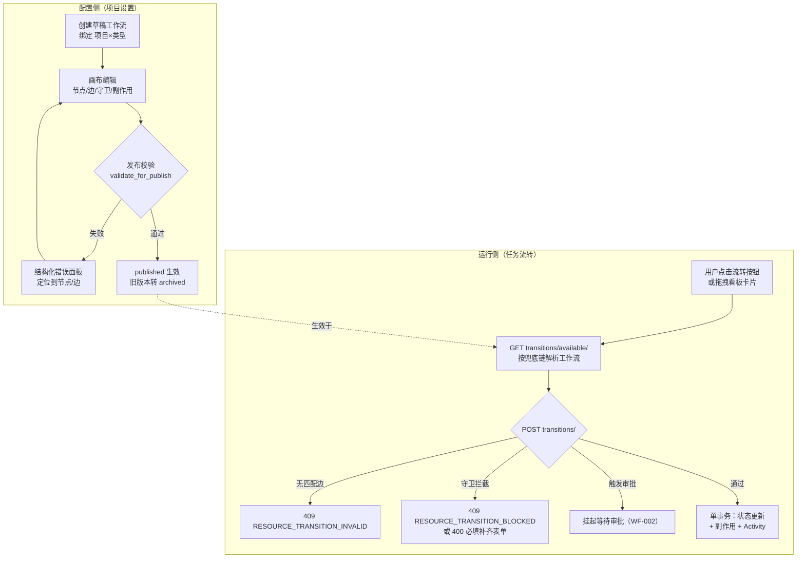
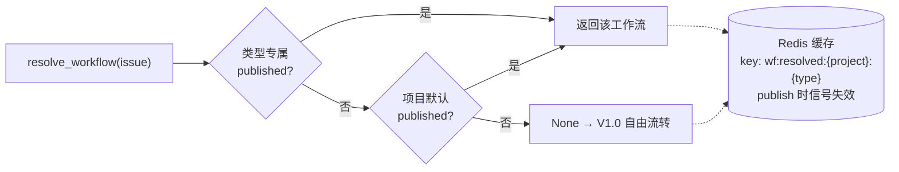
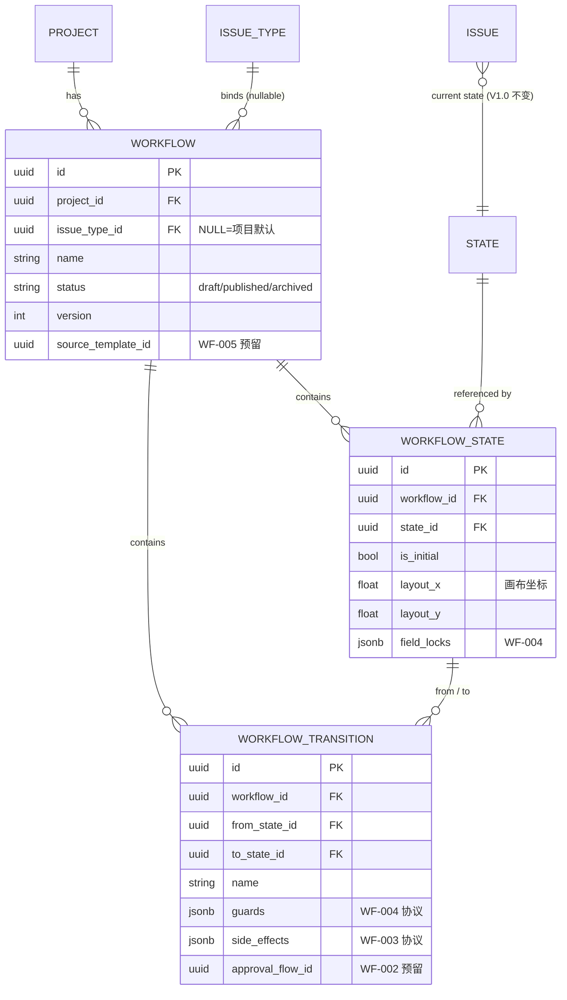

# WF-001 可视化工作流画布与引擎数据模型

| 元信息项 | 内容 |
| --- | --- |
| 文档编号 | WF-001 |
| 所属迭代 | Sprint 7 — 企业工作流核心（第 9-10 周） |
| 模块 | M5-WF 工作流与审批 |
| 优先级 | P3（企业版核心 · Sprint 7 全部文档的模型基座） |
| 工作量估算 | 后端 5.0 人日（模型 1.5 + 执行引擎 2 + 发布校验 1 + 缓存/权限 0.5）｜前端 4.0 人日（画布 2.5 + 侧栏 1 + 流转入口 0.5）｜测试 2.0 人日 |
| 关联架构文档 | [`unified-issue-model.md`](../architecture/unified-issue-model.md)（§2.6 State 与 `issue_type` 预留列、§2.5 IssueType）、[`api-conventions.md`](../architecture/api-conventions.md)（§8.5 `RESOURCE_TRANSITION_INVALID/BLOCKED`、§8.3 `PERM_TRANSITION_NOT_ALLOWED`）、[`rbac-permission-model.md`](../architecture/rbac-permission-model.md)（`workflow.manage`） |
| 上游依赖 | Sprint 6 标准版 V1.0 发布（状态模型稳定）；`TASK-005` 完成守卫（BLOCKER_SQL 钩子）；`TASK-010` Activity 管道 |
| 下游消费 | **WF-002**（审批挂接 `side_effects`/`approval`）、**WF-003**（自动化规则消费流转事件）、**WF-004**（守卫矩阵落地 `guards` 协议）、**WF-005**（模板序列化为三表结构）、**WF-006**（审批留痕）、Sprint 8 组织治理 |
| 文档状态 | 待评审（Draft） |
| 最后更新日期 | 2026-09-01 |

---

## 1. 概述

### 1.1 背景

标准版 V1.0（Sprint 0-6）中，任务状态是**自由流转**的：任何成员可以把任务拖到任何状态，唯一约束是 `TASK-005` 的前置任务完成守卫。这满足小团队，但企业客户的刚需是**受控流转**：

- 「需求必须经过评审才能进入开发」——流转路径白名单；
- 「关闭缺陷前必须填写根因」——流转时字段必填；
- 「上线必须经过测试负责人审批」——流转触发审批；
- 「需求、缺陷、测试单走不同的流程」——按任务类型绑定独立流程。

WF-001 交付**引擎层**：三张表的数据模型、单事务状态机执行器、草稿/发布机制，以及 React Flow 可视化画布。本迭代其余五份 WF 文档（审批/自动化/守卫/模板/留痕）全部建立在本模型的 `guards` / `side_effects` / `approval` 三个 JSONB 协议字段之上——**协议先冻结，功能后填充**。

### 1.2 目标

1. **三表模型**：`Workflow`（绑定项目×类型）/ `WorkflowState`（状态节点，引用既有 `State`）/ `WorkflowTransition`（流转边，携带守卫与副作用协议）。
2. **状态机执行器**：`WorkflowService.transition()` 单事务执行「守卫校验 → 审批触发 → 状态更新 → Activity 落库」，失败全回滚。
3. **零迁移兜底**：未配置工作流的项目行为与 V1.0 完全一致（自由流转 + TASK-005 守卫）——标准版升级企业版无数据迁移、无行为突变。
4. **草稿/发布**：画布编辑落在草稿，发布前图校验（可达性/死状态/初始态唯一），发布即生效并归档旧版本。
5. **画布编辑器**：React Flow 拖拽建节点/连边/侧栏配置，100 节点 200 边流畅编辑。

### 1.3 范围与边界

| 范围 | 本文档交付 | 明确不做（归属） |
| --- | --- | --- |
| 数据模型 | 三表 + 约束 + 索引 + 迁移 | 跨项目工作流（P4） |
| 执行引擎 | 流转匹配/执行/兜底链/事务边界 | 审批节点执行细节（`WF-002`） |
| 守卫协议 | `guards` JSONB schema 定义与执行入口 | 四类守卫完整矩阵（`WF-004`） |
| 副作用协议 | `side_effects` JSONB schema 定义 | 自动化规则引擎（`WF-003`） |
| 审批挂接 | `approval` 字段协议（触发点与返回值） | 会签/或签/逐级逻辑（`WF-002`） |
| 画布 | React Flow 编辑器 + 发布校验 | 多人同时编辑画布（P4） |
| 模板 | 仅预留 `source_template_id` 列 | 模板库（`WF-005`） |

### 1.4 术语表

| 术语 | 定义 |
| --- | --- |
| 工作流（Workflow） | 绑定「项目 × 任务类型」的一组状态节点与流转边的有向图 |
| 状态节点（WorkflowState） | 图节点，引用既有 `State`（`group` 语义不变，报表/看板零影响） |
| 流转边（WorkflowTransition） | 有向边 `from_state → to_state`，可命名（如「提交评审」），携带守卫/副作用/审批协议 |
| 守卫（Guard） | 流转执行前置条件，失败即拦截并返回结构化原因（协议见 §4.7，矩阵见 WF-004） |
| 副作用（Side Effect） | 流转成功后自动执行的动作（协议见 §4.7，规则引擎见 WF-003） |
| 兜底链（Fallback Chain） | 类型专属工作流 → 项目默认工作流 → V1.0 自由流转，三级解析 |
| 初始状态 | 新建任务落入的状态节点（`is_initial`），图内恰一个 |
| 发布（Publish） | 草稿校验通过后置为 `published` 并生效，旧已发布版本转 `archived` |

### 1.5 前置依赖

| 依赖 | 内容 | 阻塞原因 |
| --- | --- | --- |
| `unified-issue-model.md` §2.6 | `State` 模型与 `issue_type` 预留列（P0 建表即含，从未占用） | 类型专属状态集直接启用，零 DDL 变更 |
| `unified-issue-model.md` §2.5 | `IssueType` 为 Workspace 级 | 工作流绑定的类型维度 |
| `TASK-005` | `assert_completable()` 完成守卫（BLOCKER_SQL） | 引擎内嵌调用，V1.0 兜底路径唯一守卫 |
| `TASK-010` | `build_activities()` / `issue_activity` 幂等管道 | 状态变更事件落库 |
| `TASK-008` | Redis 定义缓存 + 信号失效范式 | 工作流解析缓存复用同范式 |
| `api-conventions.md` §8 | `RESOURCE_TRANSITION_INVALID/BLOCKED`、`PERM_TRANSITION_NOT_ALLOWED`、`VALIDATION_REQUIRED_FIELD_MISSING/ESTIMATE_REQUIRED` | 错误码已预留，零新增 |

### 1.6 竞品参考

| 竞品 | 参考点 | 处置 |
| --- | --- | --- |
| Jira | `Workflow → Status → Transition` 三层 + 编辑器（条件/验证器/后置功能三段） | 三段拆为 `guards`（条件+验证器合并）与 `side_effects`（后置功能）；**不学其全局共享工作流 scheme 的复杂度** |
| Ones | 按任务类型绑定工作流、画布式编辑 | 绑定维度采纳（项目×类型）；画布交互对齐 |
| Plane | `State` 五语义组 + 自由流转，无流转约束（2026-09 仍无 workflow engine） | 五语义组即我方既有设计；**自由流转保留为兜底路径**——Plane 式简单性作为未配置时的默认行为 |

---

## 2. 业务逻辑

### 2.1 总体流程



### 2.2 工作流解析兜底链（核心兼容设计）

引擎对「这个任务现在受哪套工作流约束」的解析顺序——**这是标准版零行为变化的保证**：

| 优先级 | 命中条件 | 行为 |
| --- | --- | --- |
| 1 | 存在 `published` 且 `project=任务项目, issue_type=任务类型` 的工作流 | 受控流转：仅允许沿定义边走 |
| 2 | 存在 `published` 且 `project=任务项目, issue_type=NULL` 的项目默认工作流 | 同上，对项目内未单独配置的类型生效 |
| 3 | 以上皆无 | **V1.0 自由流转**：任意状态互转，仅 `TASK-005` 完成守卫生效 |



- 解析结果（含 `None`）整体缓存，`publish/archive` 信号失效——范式复用 `TASK-008` 字段定义缓存。
- 缓存值为工作流 ID 或哨兵 `NONE`，图结构本身走第二张缓存 `wf:graph:{workflow_id}`（含 states/transitions 全量，画布 GET 与引擎共用）。

### 2.3 业务规则（BR）

| 编号 | 规则 | 强制层 | 违约响应 |
| --- | --- | --- | --- |
| BR-01 | 工作流绑定维度 = 项目 × 任务类型；`issue_type=NULL` 表示项目默认工作流 | DB 部分唯一约束 | `409 RESOURCE_ALREADY_EXISTS` |
| BR-02 | 同一 `(project, issue_type)` 至多一个 `published`、至多一个 `draft` | DB 部分唯一约束 | `409 RESOURCE_ALREADY_EXISTS` |
| BR-03 | 状态节点引用既有 `State`；同一工作流内 `state` 不重复 | DB 唯一约束 | `409 RESOURCE_ALREADY_EXISTS` |
| BR-04 | 被引用 `State` 必须属于同项目；若工作流绑定类型，State 须满足 `issue_type` 相同或为 NULL（通用状态） | Service | `400 VALIDATION_ERROR` + `DOES_NOT_EXIST` |
| BR-05 | 图内恰一个 `is_initial` 状态节点 | 发布校验 + Service | 发布 `400 VALIDATION_ERROR` |
| BR-06 | 流转边 `(workflow, from_state, to_state, name)` 唯一；允许同两端点多条**不同名**边（如「通过」「特批通过」） | DB 唯一约束 | `409 RESOURCE_ALREADY_EXISTS` |
| BR-07 | 禁止自环边（from=to） | Service + DB CHECK | `400 VALIDATION_ERROR` |
| BR-08 | 发布校验四项：恰一初始态；全部节点自初始态可达；`completed` 组节点 ≥1 且可达；无引用缺失 | 发布事务内 | `400 VALIDATION_ERROR`，`details` 逐条列问题并定位节点/边 ID |
| BR-09 | 发布阻断：当前项目该类型下**存在任务的状态不在新图状态集内** → 拒绝发布并列出受影响任务数，须先迁移 | 发布校验 | `409 RESOURCE_STATE_INVALID` + `details.affected_count` |
| BR-10 | 归档工作流只读保留（历史 Activity 仍可追溯其边名）；归档不影响进行中任务——该类型回落兜底链下一级 | Service | — |
| BR-11 | 画布编辑仅作用于 `draft`；`published` 不可直接改——「编辑」按钮 = 基于已发布版本克隆出新草稿 | Service | `409 RESOURCE_STATE_INVALID` |
| BR-12 | 流转执行 = 单事务：守卫 → 审批触发 → 副作用 → 状态更新 → Activity，任一失败全回滚 | 引擎 | 对应错误码 |
| BR-13 | 状态更新仍走 `Issue.state` 外键直改，**不引入状态历史表**——历史由 `TASK-010` Activity 管道承载 | 引擎 | — |
| BR-14 | `name` 命名的边在 Activity 中记录（「经『提交评审』从 待办 → 评审中」），审计可回溯 | 引擎 + Activity | — |
| BR-15 | 删除被工作流引用的 `State` 被阻断（`RESOURCE_IN_USE`），须先从所有草稿/已发布图中移除 | State 删除钩子 | `409 RESOURCE_IN_USE` |
| BR-16 | 仅 `workflow.manage`（PROJ_ADMIN+）可配置；组织级模板下发另需 WS 级权限（WF-005） | Permission | `403 PERM_ROLE_INSUFFICIENT` |

### 2.4 流转执行时序

```mermaid
sequenceDiagram
    participant FE as 前端（看板/详情）
    participant API as IssueTransitionsView
    participant ENG as WorkflowService
    participant DB as PostgreSQL
    participant ACT as Activity 管道（TASK-010）
    FE->>API: POST …/issues/{id}/transitions/ {to_state_id, transition_id?}
    API->>ENG: transition(issue, to_state, actor)
    ENG->>DB: BEGIN; SELECT … FOR UPDATE（行锁）
    ENG->>ENG: resolve_workflow（缓存→DB）
    alt 兜底：无工作流
        ENG->>ENG: TASK-005 assert_completable
    else 受控流转
        ENG->>ENG: match_edge(from, to, transition_id?)<br/>无 → 409 RESOURCE_TRANSITION_INVALID
        ENG->>ENG: run_guards(edge)（WF-004）<br/>失败 → 409 BLOCKED / 400 必填
        alt edge.approval 非空
            ENG->>DB: 创建审批实例，任务挂起（WF-002）
            ENG-->>API: 202 + approval_instance_id
        end
        ENG->>ENG: apply_side_effects(edge)（WF-003）
    end
    ENG->>DB: UPDATE issue SET state_id=…; INSERT activities
    ENG->>ACT: on_commit → issue_activity.delay（幂等扇出）
    ENG->>DB: COMMIT
    ENG-->>API: 200 + 任务最新 state
    API-->>FE: 信封 {status:0, data:{issue}}
```

**并发语义**：与 `TASK-002` 属性更新同一行锁（`select_for_update`），拖卡片与改字段互斥；两用户同时执行不同边时先获锁者胜，后者按新状态重新匹配边——失败返回 `409 RESOURCE_TRANSITION_INVALID`（前端刷新 available 列表）。乐观锁 `If-Match`（`api-conventions` §2.4）同样适用于本端点。

### 2.5 状态集与 `State.issue_type` 启用

P0 建表时 `State.issue_type` 预留列（为 NULL 表示对项目内所有类型生效）在本迭代正式启用：

| 场景 | State 可见性 | 说明 |
| --- | --- | --- |
| 项目未配置任何工作流 | 全部 `issue_type=NULL` 状态（V1.0 现状） | 零变化 |
| 为「缺陷」配置工作流但未建专属状态 | 缺陷沿用通用状态集 | 渐进采用：先约束流转，不动状态集 |
| 为「缺陷」建类型专属状态（`issue_type=缺陷`） | 缺陷任务只见专属状态集 + 通用状态中未被覆盖者 | 看板列/筛选按可见状态集渲染 |
| 通用状态与专属状态同名 | DB 约束 `uniq_state_name_per_project_type` 允许（类型维度不同） | 渲染优先取专属 |

**看板/甘特/列表兼容**：三视图按 `state.group` 渲染（架构文档 §2.6 表），新增/专属状态不破视图——Sprint 7 准入条件第 4 条的回归依据。`BOARD-003` 分组看板按状态分组时，列集合 = 当前筛选结果涉及类型的可见状态并集。

---

## 3. UI/UX 设计

### 3.1 画布总览（项目设置 → 工作流）

```
┌──────────────────────────────────────────────────────────────────────────┐
│ 工作流 · 研发中心 / 电商重构                          [+ 新建工作流]        │
│ ┌──────────────────────────────────────────────────────────────────────┐ │
│ │ [研发需求流程 ▾]  绑定类型: 需求   状态: ●草稿 v3   基于: v2(已发布)    │ │
│ ├──────────────────────────────────────────────────────────────────────┤ │
│ │ 工具栏: [+ 状态节点] [撤销] [重做] [自动布局] [缩放 100% ▸]   [发布 ▸] │ │
│ │ ┌────────────────────────────────────────────┬─────────────────────┐ │ │
│ │ │                                            │ 侧栏 · 流转边配置     │ │ │
│ │ │   ┌─────────┐   提交评审   ┌─────────┐      │ ─────────────────── │ │ │
│ │ │   │ ◉ 待办   │──────────▶│ 评审中   │      │ 边: 提交评审          │ │ │
│ │ │   │ backlog  │           │ started │      │ 从: 待办 → 到: 评审中 │ │ │
│ │ │   └────┬────┘           └────┬────┘      │ ─────────────────── │ │ │
│ │ │        │ 开始开发             │ 评审通过    │ 守卫 (2)             │ │ │
│ │ │        ▼                     ▼           │  ① 字段必填: 负责人,  │ │ │
│ │ │   ┌─────────┐   提测   ┌─────────┐       │     排期              │ │ │
│ │ │   │ 开发中   │───────▶│ 测试中   │       │  ② 角色: 仅产品角色   │ │ │
│ │ │   │ started │         │ started │       │ [+ 添加守卫]          │ │ │
│ │ │   └─────────┘         └────┬────┘       │ ─────────────────── │ │ │
│ │ │                            │ 验收通过    │ 副作用 (1)           │ │ │
│ │ │                            ▼           │  ① 自动指派: 评审人组 │ │ │
│ │ │                       ┌─────────┐       │ [+ 添加副作用]        │ │ │
│ │ │                       │ 已完成 ✓│       │ ─────────────────── │ │ │
│ │ │                       │completed│       │ 审批: 无 [配置 ▸]    │ │ │
│ │ │                       └─────────┘       │           [删除边]    │ │ │
│ │ └────────────────────────────────────────────┴─────────────────────┘ │ │
│ └──────────────────────────────────────────────────────────────────────┘ │
└──────────────────────────────────────────────────────────────────────────┘
```

### 3.2 画布交互规则

| 交互 | 行为 |
| --- | --- |
| 添加节点 | 工具栏「+ 状态节点」→ 弹出状态选择器（既有 State 或就地新建，新建落入 `State` 表，`group` 必选） |
| 连边 | 节点边缘拖拽到目标节点 → 自动创建未命名边，侧栏强制命名后生效 |
| 选中 | 单击节点/边 → 侧栏切换对应配置；Esc 取消 |
| 删除节点 | 仅当无关联边且非初始态；有边时先删边（级联提示） |
| 初始态 | 节点右键「设为初始状态」→ 自动取消原初始态标记（BR-05 恰一个） |
| 自动布局 | dagre 分层布局（按 group 顺序分层：backlog→unstarted→started→completed/cancelled） |
| 撤销/重做 | 画布内操作栈 50 步；保存（`PUT graph/`）后清空 |
| 缩放/平移 | 滚轮缩放 25%-200%，空格+拖拽平移；小地图（100 节点时必备） |

### 3.3 发布校验错误面板

发布失败时画布顶部展开错误面板，**每条可点击定位**（画布聚焦并高亮问题节点/边）：

```
┌──────────────────────────────────────────────────────────────────────┐
│ ⚠ 发布校验未通过（3 项）                                                │
│ ──────────────────────────────────────────────────────────────────── │
│ ① 状态「挂起」无法从初始状态到达 —— 请连接入边或删除该节点    [定位 ▸] │
│ ② 缺少「已完成」组的状态节点 —— 流程无法收尾                  [定位 ▸] │
│ ③ 当前有 12 个「需求」任务处于状态「旧-待评审」，不在新图中 ——        │
│    请先迁移这些任务                                          [查看 ▸] │
└──────────────────────────────────────────────────────────────────────┘
```

### 3.4 任务侧流转入口

- **详情页**：状态字段旁展示当前可用流转按钮（`GET transitions/available/`），按钮文案 = 边名（「提交评审」而非「评审中」）；无工作流时退化为状态下拉（V1.0 现状）。
- **看板拖拽**：卡片拖向目标列时，前端先查 available 列表——无对应边的列**置灰禁投**；拖入后触发 `POST transitions/`，被守卫拦截时卡片弹回并弹出拦截对话框（复用 `TASK-005` 阻塞对话框范式，必填补齐表单见 WF-004）。
- **权限不足**：`PERM_TRANSITION_NOT_ALLOWED` 对应的边按钮置灰 + tooltip「仅产品角色可执行」。

---

## 4. 技术架构

### 4.1 实体关系



### 4.2 模型定义

```python
class Workflow(BaseModel):
    """工作流 —— 绑定 项目×类型 的受控流转图（P3 企业版核心）

    issue_type=NULL 表示「项目默认工作流」，对未单独配置类型的任务生效；
    三级兜底：类型专属 → 项目默认 → V1.0 自由流转（见 BR 表与 §2.2）。
    """

    class Status(models.TextChoices):
        DRAFT = "draft", "草稿"
        PUBLISHED = "published", "已发布"
        ARCHIVED = "archived", "已归档"

    project = models.ForeignKey(
        Project, on_delete=models.CASCADE, related_name="workflows", verbose_name="所属项目"
    )
    issue_type = models.ForeignKey(
        IssueType, on_delete=models.CASCADE, null=True, blank=True,
        related_name="workflows", verbose_name="绑定任务类型",
        help_text="NULL = 项目默认工作流",
    )
    name = models.CharField(max_length=64, verbose_name="工作流名称")
    description = models.TextField(blank=True, verbose_name="说明")
    status = models.CharField(
        max_length=16, choices=Status.choices, default=Status.DRAFT, db_index=True, verbose_name="状态"
    )
    version = models.PositiveIntegerField(default=1, verbose_name="版本号", help_text="每次发布 +1")
    published_at = models.DateTimeField(null=True, blank=True, verbose_name="最近发布时间")
    published_by = models.ForeignKey(
        settings.AUTH_USER_MODEL, on_delete=models.SET_NULL, null=True, blank=True,
        related_name="+", verbose_name="发布人",
    )
    source_template = models.ForeignKey(
        "WorkflowTemplate", on_delete=models.SET_NULL, null=True, blank=True,
        related_name="instances", verbose_name="来源模板", help_text="WF-005 模板实例化溯源",
    )

    class Meta(BaseModel.Meta):
        db_table = "workflows"
        constraints = [
            # BR-02：同一 (project, issue_type) 至多一个 published / 一个 draft
            models.UniqueConstraint(
                fields=["project", "issue_type"],
                condition=models.Q(status="published", deleted_at__isnull=True),
                name="uniq_published_workflow_per_type",
            ),
            models.UniqueConstraint(
                fields=["project", "issue_type"],
                condition=models.Q(status="draft", deleted_at__isnull=True),
                name="uniq_draft_workflow_per_type",
            ),
        ]
        indexes = [models.Index(fields=["project", "status"], name="idx_workflow_project_status")]
```

> **NULL 与部分唯一索引**：PostgreSQL 中 `NULL ≠ NULL`，`(project, NULL)` 的 published/draft 唯一性对项目默认工作流同样成立（`NULL` 在唯一索引中被视为互不相同——因此项目默认工作流的唯一性由 **Service 层 + 事务内 `SELECT … FOR UPDATE` 项目行锁**兜底，迁移期并发测试 IT-06 覆盖）。

```python
class WorkflowState(BaseModel):
    """工作流状态节点 —— 引用既有 State，group 语义与全部下游报表零影响"""

    workflow = models.ForeignKey(
        Workflow, on_delete=models.CASCADE, related_name="wf_states", verbose_name="所属工作流"
    )
    state = models.ForeignKey(
        State, on_delete=models.PROTECT, related_name="workflow_nodes", verbose_name="引用状态",
        help_text="PROTECT：BR-15 被引用状态禁止删除",
    )
    is_initial = models.BooleanField(default=False, verbose_name="是否初始状态")
    layout_x = models.FloatField(default=0.0, verbose_name="画布 X")
    layout_y = models.FloatField(default=0.0, verbose_name="画布 Y")
    field_locks = models.JSONField(
        default=list, blank=True, verbose_name="进入本状态锁定的字段",
        help_text='WF-004 协议：[{"field": "due_date"}, {"field": "cf_<uuid>"}]',
    )

    class Meta(BaseModel.Meta):
        db_table = "workflow_states"
        constraints = [
            models.UniqueConstraint(fields=["workflow", "state"], name="uniq_state_per_workflow"),
        ]
```

```python
class WorkflowTransition(BaseModel):
    """流转边 —— 三个 JSONB 协议字段是 WF-002/003/004 的全部挂接点"""

    workflow = models.ForeignKey(
        Workflow, on_delete=models.CASCADE, related_name="transitions", verbose_name="所属工作流"
    )
    from_state = models.ForeignKey(
        WorkflowState, on_delete=models.CASCADE, related_name="outgoing", verbose_name="源节点"
    )
    to_state = models.ForeignKey(
        WorkflowState, on_delete=models.CASCADE, related_name="incoming", verbose_name="目标节点"
    )
    name = models.CharField(max_length=64, verbose_name="流转名称", help_text="按钮文案，如「提交评审」")
    guards = models.JSONField(
        default=list, blank=True, verbose_name="守卫协议", help_text="schema 见 §4.7，守卫矩阵见 WF-004"
    )
    side_effects = models.JSONField(
        default=list, blank=True, verbose_name="副作用协议", help_text="schema 见 §4.7，规则引擎见 WF-003"
    )
    approval_flow = models.ForeignKey(
        "ApprovalFlow", on_delete=models.SET_NULL, null=True, blank=True,
        related_name="transitions", verbose_name="触发审批流", help_text="WF-002：非空则流转挂起待审批",
    )
    sort_order = models.PositiveIntegerField(default=1000, verbose_name="按钮排序")

    class Meta(BaseModel.Meta):
        db_table = "workflow_transitions"
        constraints = [
            models.UniqueConstraint(
                fields=["workflow", "from_state", "to_state", "name"],
                name="uniq_transition_edge_name",
            ),
            models.CheckConstraint(
                check=~models.Q(from_state=models.F("to_state")),
                name="chk_transition_no_self_loop",
            ),
        ]
        indexes = [models.Index(fields=["workflow", "from_state"], name="idx_transition_from")]
```

### 4.3 迁移要点

| 项 | 内容 |
| --- | --- |
| 表 | `workflows` / `workflow_states` / `workflow_transitions` 三表新建；`states.issue_type` 列 P0 已存在，**零 ALTER** |
| 约束 | 上表 5 个唯一/检查约束；`workflow_states.state_id` 为 `PROTECT`（BR-15） |
| 索引 | `idx_workflow_project_status`、`idx_transition_from`；高频查询（按项目列工作流、按源节点出边）全覆盖 |
| 数据迁移 | 无——V1.0 项目不建任何工作流行，兜底链第 3 级自动生效（BR 零迁移承诺的物理基础） |
| 回滚 | 删三表即回滚；`Issue.state` 语义全程未变 |

### 4.4 执行引擎（`WorkflowService`）

```python
class TransitionError(ApiError):
    """携带结构化 details 的流转错误基类"""

class WorkflowService:
    def __init__(self):
        self.guard_registry = GuardRegistry()        # WF-004 注册四类守卫执行器
        self.effect_registry = SideEffectRegistry()  # WF-003 注册副作用执行器

    @transaction.atomic
    def transition(self, *, issue_id, to_state_id, actor, transition_id=None,
                   guard_payload: dict | None = None) -> TransitionResult:
        # 1. 行锁：与 TASK-002 属性更新互斥（§2.4 并发语义）
        issue = Issue.objects.select_for_update().select_related("state", "project").get(pk=issue_id)
        to_state = get_object_or_404(State, pk=to_state_id, project=issue.project)

        wf = self.resolve_workflow(issue)  # §4.5，缓存
        if wf is None:
            # 2a. V1.0 兜底：自由流转 + TASK-005 完成守卫
            assert_completable(issue, to_state)  # 409 RESOURCE_TRANSITION_BLOCKED
            matched_edge = None
        else:
            # 2b. 受控流转：匹配边
            matched_edge = self._match_edge(wf, issue.state_id, to_state_id, transition_id)
            if matched_edge is None:
                raise TransitionError("RESOURCE_TRANSITION_INVALID", 409, details={
                    "from_state_id": str(issue.state_id), "to_state_id": str(to_state_id)})
            # 3. 守卫（WF-004）：失败抛 409 BLOCKED / 400 REQUIRED_FIELD_MISSING / 400 ESTIMATE_REQUIRED
            self.guard_registry.run_all(matched_edge.guards, issue=issue, actor=actor,
                                        payload=guard_payload)
            # 4. 审批挂接（WF-002）：非空则创建审批实例并挂起——状态不变
            if matched_edge.approval_flow_id:
                instance = ApprovalService().start(matched_edge, issue=issue, actor=actor)
                return TransitionResult(pending_approval=instance)  # 视图层返回 202
            # 5. 副作用（WF-003）：同事务执行，失败回滚
            self.effect_registry.apply_all(matched_edge.side_effects, issue=issue, actor=actor)

        # 6. 状态更新 + Activity（TASK-010 管道，BR-13/14）
        old_state = issue.state
        issue.state = to_state
        issue.save(update_fields=["state", "updated_at"])
        transaction.on_commit(lambda: build_activities.delay(
            issue_id=str(issue.id), actor_id=str(actor.id),
            changes=[{"field": "state", "old": str(old_state.id), "new": str(to_state.id),
                      "transition": matched_edge.name if matched_edge else None}]))
        return TransitionResult(issue=issue, edge=matched_edge)

    def _match_edge(self, wf, from_state_id, to_state_id, transition_id):
        qs = WorkflowTransition.objects.filter(
            workflow=wf, from_state__state_id=from_state_id, to_state__state_id=to_state_id)
        if transition_id:
            return qs.filter(pk=transition_id).first()
        edges = list(qs.order_by("sort_order"))
        if len(edges) > 1:
            # 同名两端点多边时必须显式指定 transition_id（BR-06）
            raise TransitionError("VALIDATION_ERROR", 400, details={
                "transition_id": [{"code": "REQUIRED", "message": "存在多条同名流转路径，须指定 transition_id"}]})
        return edges[0] if edges else None
```

**为什么副作用在同事务**：副作用失败（如自动指派的目标成员已被移出项目）必须让状态不变——否则出现「状态变了但指派没执行」的半完成态。通知类副作用（webhook/邮件）不阻塞，走 `on_commit` 异步（WF-003 详述）。

### 4.5 解析缓存（`resolve_workflow`）

```python
RESOLVED_TTL = 3600  # 秒；失效以信号为准，TTL 仅兜底

def resolve_workflow(self, issue) -> Workflow | None:
    key = f"wf:resolved:{issue.project_id}:{issue.issue_type_id}"
    cached = cache.get(key)
    if cached is not None:
        return None if cached == "NONE" else self._graph(cached)
    wf = (
        Workflow.objects.filter(project=issue.project, status=Workflow.Status.PUBLISHED)
        .filter(Q(issue_type_id=issue.issue_type_id) | Q(issue_type__isnull=True))
        .order_by(F("issue_type_id").desc(nulls_last=True))  # 类型专属优先（§2.2）
        .first()
    )
    cache.set(key, str(wf.id) if wf else "NONE", RESOLVED_TTL)
    return wf

# signals.py —— 发布/归档/删除时失效（范式同 TASK-008 字段定义缓存）
@receiver([post_save, post_delete], sender=Workflow)
def invalidate_workflow_cache(sender, instance, **kwargs):
    cache.delete(f"wf:resolved:{instance.project_id}:{instance.issue_type_id}")
    cache.delete(f"wf:graph:{instance.id}")
```

### 4.6 发布校验（`validate_for_publish`）

```python
def validate_for_publish(wf: Workflow) -> list[PublishIssue]:
    """BR-08 四项图校验 + BR-09 在用状态迁移阻断。发布事务内执行。"""
    states = list(wf.wf_states.select_related("state"))
    edges = list(wf.transitions.all())
    issues: list[PublishIssue] = []

    # ① 恰一个初始态
    initials = [s for s in states if s.is_initial]
    if len(initials) != 1:
        issues.append(PublishIssue("INITIAL_COUNT", "工作流须恰好一个初始状态",
                                   node_ids=[str(s.id) for s in initials]))
    # ② 自初始态 BFS 可达性
    if initials:
        adj: dict[UUID, list[UUID]] = defaultdict(list)
        for e in edges:
            adj[e.from_state_id].append(e.to_state_id)
        reachable = set(bfs(initials[0].id, adj))
        for s in states:
            if s.id not in reachable:
                issues.append(PublishIssue("UNREACHABLE", f"状态「{s.state.name}」无法从初始状态到达",
                                           node_ids=[str(s.id)]))
    # ③ completed 组节点 ≥1 且可达
    completed = [s for s in states if s.state.group == State.Group.COMPLETED]
    if not completed or (initials and not any(s.id in reachable for s in completed)):
        issues.append(PublishIssue("NO_TERMINAL", "缺少可达的「已完成」组状态节点"))
    # ④ BR-09：在用状态必须在新图状态集内
    state_ids = {s.state_id for s in states}
    in_use = (
        Issue.objects.filter(project=wf.project, deleted_at__isnull=True)
        .filter(Q(issue_type_id=wf.issue_type_id) if wf.issue_type_id else Q())
        .exclude(state_id__in=state_ids)
        .values("state_id").annotate(n=Count("id"))
    )
    if in_use:
        issues.append(PublishIssue("STATE_IN_USE", "存在任务的状态不在新图中，须先迁移",
                                   affected=[{"state_id": str(r["state_id"]), "count": r["n"]} for r in in_use]))
    return issues
```

发布端点事务：校验通过 → 同事务内旧 `published` 转 `archived`、本草稿转 `published`（`version = 旧版本 + 1`、`published_at/by` 落值）→ `on_commit` 失效缓存。任一约束冲突（并发发布）以 DB 部分唯一索引兜底返回 `409 RESOURCE_ALREADY_EXISTS`。

### 4.7 `guards` / `side_effects` JSONB 协议（冻结契约）

协议在 WF-001 冻结，WF-002/003/004 只扩展 `type` 枚举，**不改结构**：

```json
{
  "guards": [
    {"type": "required_fields", "config": {"fields": ["assignee", "due_date", "cf_01J9X…"]}},
    {"type": "estimate_required", "config": {}},
    {"type": "blocker_completed", "config": {}},
    {"type": "role_allowed", "config": {"roles": ["PROJ_ADMIN", "product"]}}
  ],
  "side_effects": [
    {"type": "set_field", "config": {"field": "priority", "value": "high"}},
    {"type": "assign", "config": {"strategy": "role_group", "role": "reviewer"}},
    {"type": "notify", "config": {"channel": "inbox", "targets": ["watchers"]}}
  ]
}
```

| 约束 | 说明 |
| --- | --- |
| 数组元素必含 `type` + `config`；未知 `type` 在保存（`PUT graph/`）时拒绝 | `400 VALIDATION_ERROR` + `NOT_A_CHOICE`，`details` 给出合法枚举 |
| 服务端注册表驱动：`GuardRegistry` / `SideEffectRegistry` 按 `type` 分发执行器 | 新增守卫类型 = 注册新执行器，零表结构变更 |
| JSON Schema 校验内嵌 Serializer（`jsonschema`），非法 config 保存即拒 | 错误定位到 `guards[2].config.fields` |
| `blocker_completed` 默认隐式存在（TASK-005），显式配置仅用于**关闭**该守卫（`{"enabled": false}`，需 `workflow.manage`） | 兼容语义统一 |

### 4.8 API 端点

| 方法 | 路径 | 说明 | 权限 |
| --- | --- | --- | --- |
| GET | `/api/v1/workspaces/{slug}/projects/{id}/workflows/` | 工作流列表（含各状态计数） | 项目成员可读 |
| POST | 同上 | 创建草稿（BR-02 至多一个） | `workflow.manage` |
| GET | `…/workflows/{wf_id}/` | 图详情（states+transitions 全量，画布载荷，**ETag**） | 项目成员可读 |
| PATCH | 同上 | 改名/说明/绑定类型 | `workflow.manage` |
| PUT | `…/workflows/{wf_id}/graph/` | **整图替换**（画布保存，单事务，协议校验） | `workflow.manage` |
| POST | `…/workflows/{wf_id}/publish/` | 发布（§4.6 校验 + 版本轮转） | `workflow.manage` |
| POST | `…/workflows/{wf_id}/archive/` | 归档（BR-10） | `workflow.manage` |
| GET | `…/projects/{id}/issues/{issue_id}/transitions/available/` | 当前可用流转列表 | 项目成员 |
| POST | `…/projects/{id}/issues/{issue_id}/transitions/` | 执行流转 | `issue.update` + 边角色守卫 |

**① `GET …/transitions/available/` 响应（200）**——任务详情/看板按钮数据源：

```json
{
  "status": 0,
  "data": {
    "workflow": { "id": "01J9XQK7M3N4P5R6S7T8V9W0Y1", "name": "研发需求流程", "version": 2 },
    "current_state": { "id": "01J9XQK7M3N4P5R6S7T8V9W0A2", "name": "待办", "group": "unstarted", "color": "#F59E0B" },
    "available": [
      {
        "transition_id": "01J9XQK7M3N4P5R6S7T8V9W0B3",
        "name": "提交评审",
        "to_state": { "id": "01J9XQK7M3N4P5R6S7T8V9W0C4", "name": "评审中", "group": "started", "color": "#3B82F6" },
        "requires_payload": ["assignee", "due_date"],
        "has_approval": false,
        "allowed": true
      },
      {
        "transition_id": "01J9XQK7M3N4P6S7T8V9W0D5E6",
        "name": "直接关闭",
        "to_state": { "id": "01J9XQK7M3N4P6S7T8V9W0E7F8", "name": "已关闭", "group": "completed", "color": "#10B981" },
        "requires_payload": [],
        "has_approval": true,
        "allowed": false,
        "deny_reason": "PERM_TRANSITION_NOT_ALLOWED"
      }
    ],
    "fallback": false
  }
}
```

> `fallback: true` 时 `workflow`/`available` 为 null，前端退化为 V1.0 状态下拉。`requires_payload` 由守卫配置预聚合——前端点击按钮即弹出补齐表单（WF-004）。

**② `POST …/transitions/` 请求/响应**：

```json
// 请求
{
  "to_state_id": "01J9XQK7M3N4P5R6S7T8V9W0C4",
  "transition_id": "01J9XQK7M3N4P5R6S7T8V9W0B3",
  "guard_payload": { "assignee": "01J9XQK7M3N4P5R6S7T8V9W0G9", "due_date": "2026-09-15" }
}
// 200 成功
{
  "status": 0,
  "data": {
    "issue": { "id": "01J9XQK7M3N4P5R6S7T8V9W0H0", "state": { "id": "01J9XQK7M3N4P5R6S7T8V9W0C4", "name": "评审中", "group": "started" } },
    "applied_transition": "提交评审"
  },
  "meta": { "request_id": "01J9XQK7M3N4P5R6S7T8V9W0J1" }
}
// 202 触发审批挂起
{
  "status": 0,
  "data": {
    "pending_approval": { "instance_id": "01J9XQK7M3N4P5R6S7T8V9W0K2", "flow": "上线审批", "current_node": "测试负责人" }
  },
  "meta": { "request_id": "01J9XQK7M3N4P5R6S7T8V9W0L3" }
}
```

**③ 错误响应矩阵**：

| 场景 | HTTP | code | details 要点 |
| --- | --- | --- | --- |
| 无匹配边 | 409 | `RESOURCE_TRANSITION_INVALID` | `from_state_id`/`to_state_id`；前端刷新 available |
| 前置任务未完成 | 409 | `RESOURCE_TRANSITION_BLOCKED` | `blockers[]`（同 TASK-005 §4 格式） |
| 必填字段缺失 | 400 | `VALIDATION_REQUIRED_FIELD_MISSING` | `fields[]` 逐字段，前端弹补齐表单 |
| 工时必填未填 | 400 | `VALIDATION_ESTIMATE_REQUIRED` | — |
| 边角色不符 | 403 | `PERM_TRANSITION_NOT_ALLOWED` | `roles[]` 所需角色 |
| 多边未指定 `transition_id` | 400 | `VALIDATION_ERROR` | 子码 `REQUIRED` |
| 发布校验失败 | 400 | `VALIDATION_ERROR` | `issues[]`（§4.6 四类 + 节点/边定位 ID） |
| 发布在用状态阻断 | 409 | `RESOURCE_STATE_INVALID` | `affected[]`（state_id + count） |
| 重复发布/草稿 | 409 | `RESOURCE_ALREADY_EXISTS` | DB 部分唯一索引兜底 |

```json
// 409 RESOURCE_TRANSITION_INVALID 示例
{
  "status": 1,
  "error": {
    "code": "RESOURCE_TRANSITION_INVALID",
    "message": "当前状态「待办」不可直接流转到「测试中」",
    "details": { "from_state_id": "01J9XQK7M3N4P5R6S7T8V9W0A2", "to_state_id": "01J9XQK7M3N4P5R6S7T8V9W0M4" }
  },
  "meta": { "request_id": "01J9XQK7M3N4P5R6S7T8V9W0N5" }
}
```

**④ `PUT …/graph/`（画布保存）**：整图替换——请求体为 `{states: [...], transitions: [...]}` 全量，服务端单事务内「删旧图 + 插新图 + 协议校验」，仅允许作用于 `draft`；`If-Match` 乐观锁防画布并发覆盖（`409 RESOURCE_CONFLICT`）。画布坐标 `layout_x/y` 随节点一并保存。

### 4.9 前端实现（React Flow + MobX）

```typescript
class WorkflowCanvasStore {
  @observable workflow: WorkflowDetail | null = null;
  @observable nodes: Node[] = [];            // React Flow 节点（WorkflowState 映射）
  @observable edges: Edge[] = [];            // React Flow 边（WorkflowTransition 映射）
  @observable publishIssues: PublishIssue[] = [];
  @observable dirty = false;
  etag: string | null = null;
  private undoStack: GraphSnapshot[] = [];

  async fetchGraph(projectId: string, workflowId: string) {
    // SWR + ETag：304 时复用缓存图
    const res = await api.get(`…/workflows/${workflowId}/`, { etag: this.etag });
    if (res.status === 304) return;
    this.etag = res.headers.etag;
    this.workflow = res.data.data;
    this.nodes = this.workflow.states.map(toFlowNode);   // layout_x/y → position
    this.edges = this.workflow.transitions.map(toFlowEdge);
    this.dirty = false;
  }

  @action connect(fromNodeId: string, toNodeId: string) {
    this.pushUndo();
    this.edges.push({ id: `tmp-${uuid()}`, source: fromNodeId, target: toNodeId,
                      data: { name: "", guards: [], side_effects: [] } });
    this.dirty = true;  // 未命名边：侧栏强制命名后才允许保存（§3.2）
  }

  async saveGraph() {
    // PUT 整图替换 + If-Match 乐观锁；409 CONFLICT → 提示「他人已修改，刷新画布」
    const body = { states: this.nodes.map(fromFlowNode), transitions: this.edges.map(fromFlowEdge) };
    const res = await api.put(`…/workflows/${this.workflow!.id}/graph/`, body, { ifMatch: this.etag });
    this.etag = res.headers.etag;
    runInAction(() => { this.dirty = false; this.undoStack = []; });
  }

  async publish() {
    try {
      await api.post(`…/workflows/${this.workflow!.id}/publish/`);
    } catch (e) {
      if (e.code === "VALIDATION_ERROR") runInAction(() => {
        this.publishIssues = e.details.issues;   // §3.3 错误面板 + 画布聚焦高亮
      });
    }
  }
}
```

| 前端要点 | 方案 |
| --- | --- |
| 100 节点/200 边性能 | React Flow `onlyRenderVisibleElements`；边标签懒渲染；小地图 + 缩放防抖 |
| 流转按钮数据源 | 任务详情/看板挂载时 `GET available/`，SWR 缓存 30s（流转后 `mutate`） |
| 看板禁投列 | `available` 无对应边 → 列头 `droppable=false` + 置灰（§3.4） |
| 兜底退化 | `fallback: true` → 渲染 V1.0 状态下拉，零新交互（BR 零行为变化的前端侧） |
| 拦截对话框 | 复用 `TASK-005` 阻塞对话框组件，`RESOURCE_TRANSITION_BLOCKED` 与必填补齐表单双形态（WF-004） |

### 4.10 权限矩阵

| 操作 | GUEST | VIEWER | COMMENTER | CONTRIBUTOR | ADMIN |
| --- | --- | --- | --- | --- | --- |
| 查看工作流图/available 列表 | — | ✓ | ✓ | ✓ | ✓ |
| 执行流转（边无角色守卫） | — | — | — | ✓ | ✓ |
| 执行流转（边有 `role_allowed`） | 按守卫配置的角色集合判定（403 `PERM_TRANSITION_NOT_ALLOWED`） | | | | |
| 画布编辑/发布/归档 | — | — | — | — | ✓（`workflow.manage`） |

---

## 5. 测试用例

### 5.1 单元测试（UT）

| 编号 | 用例 | 断言 |
| --- | --- | --- |
| UT-01 | 兜底链三级解析：类型专属 > 项目默认 > None | `resolve_workflow` 三种命中与缓存写入（含 `NONE` 哨兵） |
| UT-02 | `_match_edge` 无边/单边/多边（未指定 transition_id） | None / 命中 / 400 `REQUIRED` |
| UT-03 | 多边指定 `transition_id` | 精确命中命名边 |
| UT-04 | 自环边创建 | DB CHECK + Service 双层拒绝 |
| UT-05 | `validate_for_publish` 初始态 0 个/2 个 | 均报 `INITIAL_COUNT` |
| UT-06 | 不可达节点检出（孤岛状态） | `UNREACHABLE` + 正确定位 node_id |
| UT-07 | 无 completed 组节点 / completed 不可达 | `NO_TERMINAL` |
| UT-08 | BR-09 在用状态不在新图 | `STATE_IN_USE` + affected count 准确 |
| UT-09 | guards/side_effects 未知 `type` 保存 | 400 + `NOT_A_CHOICE`，枚举列表返回 |
| UT-10 | 守卫执行顺序与短路 | 首个失败守卫即返回，结构化 details 完整 |
| UT-11 | 副作用失败回滚 | 状态未变更（事务回滚验证） |
| UT-12 | 发布版本轮转 | 旧 published→archived，version+1，published_at/by 落值 |
| UT-13 | 缓存失效信号 | publish/archive/delete 后 `resolve_workflow` 重新查询 |
| UT-14 | V1.0 兜底路径嵌入 `assert_completable` | 前置未完成进 completed → 409 `BLOCKED`（与 TASK-005 行为一致） |
| UT-15 | State 删除被工作流引用阻断 | 409 `RESOURCE_IN_USE`（BR-15，PROTECT 兜底） |
| UT-16 | Activity 记录边名 | `changes[].transition` = 边名（BR-14） |

### 5.2 集成测试（IT）

| 编号 | 用例 | 断言 |
| --- | --- | --- |
| IT-01 | 全链路：建草稿→PUT graph→发布→available→执行流转 | 各端点信封/字段符合 §4.8；Activity 落库含边名 |
| IT-02 | 并发流转同一任务（两条不同边） | 先锁者成功；后者 409 `RESOURCE_TRANSITION_INVALID`；DB 无中间态 |
| IT-03 | 触发审批的边 | 202 + `pending_approval.instance_id`；任务状态**未变**；WF-002 挂点契约 |
| IT-04 | 发布校验失败响应 | `issues[]` 四类问题序列化与节点/边定位 ID 正确 |
| IT-05 | `PUT graph/` 乐观锁 | 过期 ETag → 409 `RESOURCE_CONFLICT` |
| IT-06 | 并发创建项目默认工作流（`issue_type=NULL`） | Service 行锁 + 约束兜底，恰一个 draft（§4.2 NULL 唯一性说明） |
| IT-07 | 标准版回归：无工作流项目的看板拖拽/状态下拉 | 行为与 V1.0 快照逐字段一致（零行为变化验收） |

### 5.3 E2E

| 编号 | 场景 |
| --- | --- |
| E2E-01 | 画布从零搭建「研发需求流程」（5 状态 6 边 + 2 守卫）→ 发布 → 需求类型任务按图流转 |
| E2E-02 | 发布校验三类错误 → 面板定位点击 → 画布聚焦修复 → 发布成功 |
| E2E-03 | 看板拖拽：无边列置灰禁投；有边列拖入成功；守卫拦截卡片弹回 + 对话框 |
| E2E-04 | 详情页边按钮点击 → 必填补齐表单 → 提交 → 状态与 Activity 时间线更新 |
| E2E-05 | 缺陷类型绑定独立流程后，需求任务仍走项目默认流程；未配置类型退化 V1.0 下拉 |
| E2E-06 | 已发布 v2 基础上「编辑」→ 克隆草稿 v3 → 修改发布 → v2 归档，进行中任务不受影响 |

---

## 6. 竞品深度对标

| 维度 | Jira | Ones | Plane | **本方案** |
| --- | --- | --- | --- | --- |
| 模型分层 | Workflow Scheme → Workflow → Status/Transition（四层，scheme 可跨项目共享） | 项目×类型直接绑定 | 无工作流引擎，自由流转 | **三表直绑项目×类型**——砍掉 scheme 层，跨项目复用走 WF-005 模板实例化（拷贝而非共享引用），避免「改一处影响全组织」的共享陷阱 |
| 流转约束三段 | Conditions（能否看到按钮）/ Validators（提交时校验）/ Post Functions（执行后动作） | 类似三段 | — | **两段**：`guards` 合并条件+验证器（可见性由 `available.allowed` + `deny_reason` 表达），`side_effects` 对应 Post Functions。Jira 三段割裂（配置在三个面板）是常见抱怨，合并后协议更紧凑 |
| 状态语义 | Status 全局共享，Category（=group）To Do/In Progress/Done 三类 | 状态集按类型独立 | State 项目组内自定义，五语义组 | **State 复用 + group 五组**（P0 既有）；类型专属状态集经 `issue_type` 列激活，比 Jira 全局状态池隔离更干净 |
| 生效机制 | 草稿编辑 + 发布时任务状态迁移向导（强制逐状态映射） | 类似 | — | 发布校验 BR-09 **阻断式**（列出受影响任务数，先迁移后发布）而非迁移向导——向导是把配置错误转嫁为批量数据改写，阻断迫使图设计正确 |
| 兜底行为 | 无 scheme 的项目无法工作（必须配置） | 内置默认流程 | 自由流转 | **三级兜底链**：未配置 = V1.0 自由流转，升级零迁移、零行为变化 |
| 历史追溯 | 状态历史内建表 | Activity 流 | Activity 流 | 复用 `TASK-010` Activity 管道 + 边名记录（BR-14），不引新表 |

**结论**：Jira 的能力完备性（守卫/副作用/按类型绑定）+ Ones 的绑定交互 + Plane 的默认简单性，规避 Jira 的 scheme 复杂度与强制迁移向导。

---

## 7. 里程碑与验收

### 7.1 交付清单

| 类别 | 交付物 |
| --- | --- |
| Model / Migration | `workflows` / `workflow_states` / `workflow_transitions` 三表 + 5 约束 + 2 索引（零 ALTER 既有表） |
| 后端 | `WorkflowService.transition()` 执行引擎、兜底链解析 + 双层 Redis 缓存、`validate_for_publish` 四项校验、9 个端点、guards/side_effects 协议与注册表骨架 |
| 前端 | React Flow 画布编辑器（节点/边/侧栏/自动布局/撤销/小地图）、发布错误面板、任务侧边按钮与看板禁投列、`fallback` 退化路径 |
| 测试 | UT-01~16、IT-01~07、E2E-01~06 |

### 7.2 可操作演示的验收标准

1. 标准版回归：未配置工作流的项目看板拖拽/状态下拉/报表与 V1.0 快照**逐字段一致**（IT-07 全绿）。
2. 画布搭建「研发需求流程」（5 状态 6 边 + 2 守卫 + 1 审批挂接点）→ 发布 → 需求任务仅能沿边流转，逆向/跳步返回 409 `RESOURCE_TRANSITION_INVALID`。
3. 演示三级兜底：缺陷绑独立流程、其余类型走项目默认、新项目无任何配置自由流转，三者并存正确。
4. 发布校验：构造孤岛状态/无双 completed/在用状态缺失三类错误，面板逐条定位可点击，修复后发布成功且旧版本归档。
5. 并发演示：两人同时执行不同边，一胜一 409；`PUT graph/` 过期 ETag 返回 409 `RESOURCE_CONFLICT`。
6. 性能：100 节点/200 边画布缩放拖拽 60fps；`transitions/` P95 < 100ms（缓存命中，不含通知投递）；`available/` P95 < 50ms。
7. Activity 时间线完整记录「经『提交评审』从 待办 → 评审中」（BR-14）。
8. 全部端点通过 `api-conventions.md` §14 检查清单；错误码零新增（全部取自 §8 预留）。

### 7.3 下游冻结契约（WF-002~006 对齐依据）

| 契约 | 内容 | 消费方 |
| --- | --- | --- |
| `approval_flow_id` 挂点 | 非空 → `ApprovalService().start()` 返回 202，状态不变 | WF-002 |
| `guards` 协议 | `GuardRegistry.run_all`，四类守卫 type 枚举扩展点 | WF-004 |
| `side_effects` 协议 | `SideEffectRegistry.apply_all` 同事务；通知类走 `on_commit` | WF-003 |
| `source_template_id` | 模板实例化溯源列 | WF-005 |
| 发布/归档事件 | `on_commit` 缓存失效 + Activity，审批留痕挂接点 | WF-006 |

---

## 8. 相关文档

- 迭代概览：[`docs/sprint-7-enterprise-workflow/sprint-overview.md`](sprint-overview.md)
- 模型基座：[`docs/architecture/unified-issue-model.md`](../architecture/unified-issue-model.md) §2.5/§2.6
- 守卫先例：[`docs/sprint-2-task-full/TASK-005-task-dependency.md`](../sprint-2-task-full/TASK-005-task-dependency.md)（`assert_completable` 与 BLOCKED 响应格式）
- 事件管道：[`docs/sprint-2-task-full/TASK-010-full-audit-log.md`](../sprint-2-task-full/TASK-010-full-audit-log.md)
- API 约定：[`docs/architecture/api-conventions.md`](../architecture/api-conventions.md) §8


