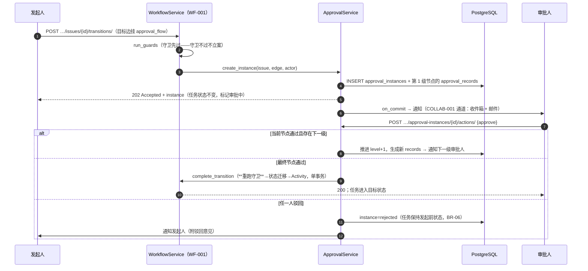
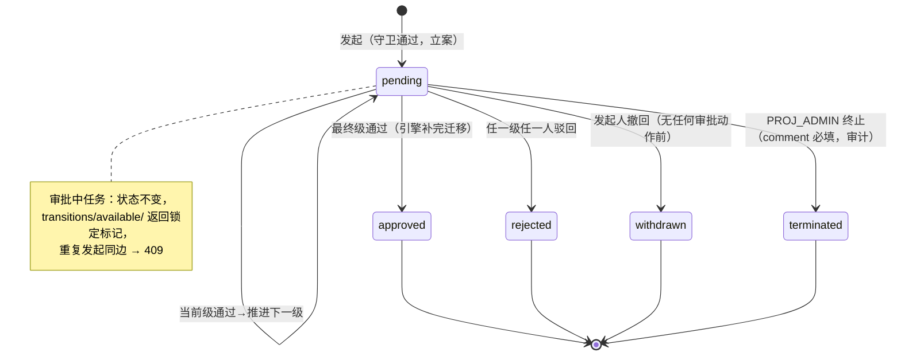
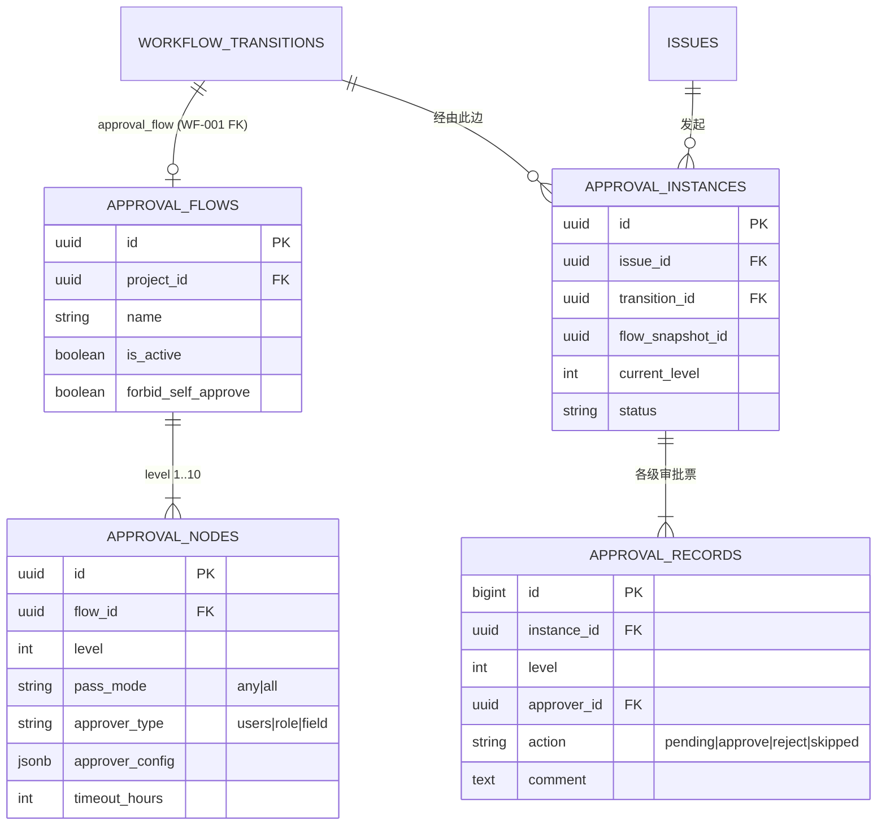

# WF-002 审批流（会签/或签/逐级/驳回/撤回）

| 元信息项 | 内容 |
| --- | --- |
| 文档编号 | WF-002 |
| 所属迭代 | Sprint 7 — 企业工作流核心（第 10 周主线） |
| 优先级 | P3（企业版核心级 · 付费核心场景） |
| 覆盖模块 | M5-WF 工作流与审批 |
| 工作量估算 | 8 人日（后端 4.5 + 前端 2.5 + QA 1） |
| 文档状态 | 待评审（Draft） |
| 最后更新日期 | 2026-09-01 |
| 上游依赖 | `WF-001`（`WorkflowTransition.approval_flow` FK 挂点、单事务流转引擎、`side_effects` 协议） |
| 下游消费 | `WF-005`（审批流随模板下发）、`WF-006`（审批留痕与合规导出）、Sprint 9（审批时效报表） |

---

## 1. 概述

### 1.1 功能定位

WF-002 在 WF-001 状态机之上交付**审批子系统**：当流转边配置了 `approval_flow`，流转不再即时生效，而是先生成**审批实例**进入待审队列，经逐级节点审批通过后才由引擎补完状态迁移。五种审批形态全覆盖：

| 形态 | 语义 | 配置方式 |
| --- | --- | --- |
| 单人审批 | 单一审批人通过即过 | 节点 1 人 + `any` |
| 或签 | 节点内任一人通过即过 | 节点 N 人 + `any` |
| 会签 | 节点内全员通过才过 | 节点 N 人 + `all` |
| 逐级 | 多节点按 `level` 顺序依次推进 | 节点列表有序 |
| 驳回/撤回 | 驳回回发起前状态；撤回仅发起人且未有任何审批动作 | 动作接口 |

### 1.2 触发与执行总览



> **关键时序决策**：守卫在**发起时**与**终审通过时各跑一次**。两次之间任务字段可能被他人修改（如负责人被移除），终审重跑保证迁移瞬间仍满足全部守卫——这是「审批挂起期间世界在变」的正确性兜底。

### 1.3 范围边界

| 范围 | 本文档交付 | 明确不做 |
| --- | --- | --- |
| 审批定义 | `ApprovalFlow`/`ApprovalNode` CRUD、三种节点通过模式、逐级编排 | 条件分支审批（按字段值走不同分支，P4） |
| 审批执行 | 实例生命周期、五形态、超时提醒、与引擎单事务衔接 | 审批委派/加签（P4）；审批人休假代理（P4） |
| 审批人来源 | 指定成员 / 项目角色组 / 字段动态（报告人·负责人） | 组织架构部门主管（依赖 Sprint 8 `AUTH-007`，V1.1 衔接） |
| 通知 | 收件箱 + 邮件（复用 COLLAB-001 通道）、超时提醒 | 企业微信/钉钉推送（P4 `INTG-003`） |

### 1.4 前置依赖

| 依赖 | 内容 | 阻塞原因 |
| --- | --- | --- |
| `WF-001` §4.2/§4.4 | `approval_flow` FK、`WorkflowService.complete_transition` 单事务入口 | 引擎挂点 |
| `WF-001` §4.7 | `guards` 协议（发起/终审双跑） | 正确性 |
| `COLLAB-001` | 通知通道与偏好设置 | 审批触达 |
| `TASK-010` | Activity 管道（审批动作落任务动态） | 留痕一致性 |
| `INFRA-002` | Celery beat（超时扫描任务） | 超时提醒 |

### 1.5 竞品参考

| 竞品 | 参考点 | 处置 |
| --- | --- | --- |
| Ones | 审批流与状态流转绑定、会签/或签/逐级、审批中心 | 形态对齐；**审批记录不可变 + 终审重跑守卫**补其弱项（Ones 社区反馈审批通过瞬间字段已变导致误迁移） |
| Jira (JSM) | Approvals 挂状态、任意人/全员通过、`approver` 字段驱动 | 节点模式对齐；不学其「审批人必须在 Insight 字段」的耦合 |
| 钉钉/飞书审批 | 审批中心三 Tab（待办/已办/我发起）、时间线详情 | 审批中心信息架构对齐 |
| Plane | 无审批能力 | 差异化卖点，无从参考 |

---

## 2. 业务逻辑

### 2.1 审批定义模型（业务视图）

- **ApprovalFlow（审批流定义）**：项目级，命名 + 说明；被 0..n 条流转边引用（`WorkflowTransition.approval_flow`）。被引用的流**不可删除**（`PROTECT`），仅可停用。
- **ApprovalNode（审批节点）**：属于一个流，`level` 从 1 递增（逐级推进顺序）；通过模式 `any`（或签）/ `all`（会签）；审批人来源三选一：
  - `users`：指定项目成员列表（1..20 人）；
  - `role`：项目角色组（如 `PROJ_ADMIN` 全体，运行时展开为成员集）；
  - `field`：任务字段动态解析——`reporter`（报告人）/ `assignees`（当前负责人，多人时按节点模式判定）。

> `field` 来源在**实例创建时刻快照**为具体成员集（写入 records），此后任务换负责人不改变本次审批人——防止「换人逃审」与「审批人悬空」两类争议。

### 2.2 实例生命周期



| 状态 | 语义 | 进入条件 |
| --- | --- | --- |
| `pending` | 审批中（含中间各级） | 立案 / 推进 |
| `approved` | 全员通过，状态迁移已完成 | 终审通过且引擎迁移成功 |
| `rejected` | 被驳回 | 任一审批人 reject（会签中一人驳回即整体驳回，BR-05） |
| `withdrawn` | 发起人撤回 | 无任何 `approve/reject` 动作（BR-07） |
| `terminated` | 管理员终止 | `PROJ_ADMIN` + comment（异常出口，BR-08） |

### 2.3 审批中任务的系统行为

| 行为 | 规则 |
| --- | --- |
| 状态显示 | 任务仍为发起前状态；详情页头部与看板卡片显示「审批中 · 第 N 级」徽标（非状态，实例查询派生） |
| 再次流转 | 同一条边重复发起 → `409 RESOURCE_ALREADY_EXISTS`；**其他边不受限**（可从待审状态走取消边，此时审批实例自动 `terminated`，原因 `state_changed`） |
| 字段编辑 | 不锁定（审批的是「流转」不是「任务」）；但终审重跑守卫可能因编辑而失败 → 实例置 `terminated`（原因 `guard_failed_at_complete`）并通知双方 |
| 任务删除/归档 | 级联终止实例（原因 `issue_deleted`/`issue_archived`），记录保留 |

### 2.4 超时与提醒

| 机制 | 规则 |
| --- | --- |
| 节点超时 | 节点可配 `timeout_hours`（NULL = 不超时）；超时**不自动通过/拒绝**（企业审计不接受系统代决），仅触发提醒升级 |
| 提醒节奏 | beat 每 15 分钟扫描：到达超时点 → 提醒审批人；超时 24h → 加报发起人与 `PROJ_ADMIN` |
| 提醒通道 | 收件箱（必达）+ 邮件（按用户偏好）；去重窗口 24h（同实例同人同类型不重复轰炸） |

### 2.5 业务规则汇总

| 编号 | 规则 | 判定位置 | 违反后果 |
| --- | --- | --- | --- |
| BR-01 | 流转边挂审批流时：守卫先过→立案→202；守卫不过不立案 | WorkflowService | 409/400（守卫错误透传） |
| BR-02 | 审批人必须为本项目成员（含 role 展开后过滤非成员） | 立案快照 | 空审批人集 → `400 VALIDATION_ERROR` + `EMPTY_APPROVERS`（定义保存时也校验） |
| BR-03 | 会签任一人驳回 = 整体驳回；或签任一人通过 = 本级通过 | ApprovalService | — |
| BR-04 | 逐级推进：仅当前 `level` 的 records 可动作；越级审批 403 | ApprovalService | `403 PERM_DENIED` |
| BR-05 | 终审通过瞬间**重跑全部守卫**，失败则实例 `terminated(guard_failed_at_complete)`，不迁移 | 引擎单事务 | 通知发起人+审批人 |
| BR-06 | 驳回/撤回/终止后任务保持发起前状态；驳回意见 `comment` 必填（reject），approve 选填 | Serializer | `400 VALIDATION_ERROR` + `REQUIRED` |
| BR-07 | 撤回仅发起人本人，且实例内无任何 approve/reject 记录 | ApprovalService | `403 PERM_DENIED` / `409 RESOURCE_CONFLICT` |
| BR-08 | `PROJ_ADMIN` 可终止任意 pending 实例，comment 必填，落审计（WF-006） | ApprovalService | 缺 comment 400 |
| BR-09 | 审批记录只增不改：动作即 INSERT，UPDATE/DELETE 被 DB 触发器拒绝（WF-006 详述） | DB | 触发器异常 |
| BR-10 | 同任务同边仅允许一个 pending 实例；其他边发起成功则本实例自动终止 | 唯一约束（部分索引）+ 服务 | `409 RESOURCE_ALREADY_EXISTS` |
| BR-11 | `field` 来源审批人 = 立案时刻快照；快照后人员变动不影响本次 | 立案服务 | — |
| BR-12 | 禁止自审开关：流级 `forbid_self_approve`（默认开）——发起人是审批人时其票自动记 `skipped(self)`，会签中不计入通过集、或签中若仅剩自己则转交 `PROJ_ADMIN` | 动作服务 | 自动处置 + 记录 |
| BR-13 | 审批流被流转边引用时不可删除，仅可停用；停用后新发起 409，存量实例继续走完 | Service + DB | `409 RESOURCE_IN_USE` |
| BR-14 | 审批全程动作（立案/各级通过/驳回/撤回/终止/超时提醒）落 `IssueActivity(field='approval')`（TASK-010 管道）与审计（WF-006） | on_commit | — |
| BR-15 | 审批实例与记录对项目成员可读（透明），动作仅当前级审批人 | Permission | `403 PERM_DENIED` |

### 2.6 异常处理

| 场景 | HTTP | 错误码 | details 子码 | 前端表现 |
| --- | --- | --- | --- | --- |
| 发起时守卫不过 | 409/400 | `RESOURCE_TRANSITION_BLOCKED` / `VALIDATION_ERROR` | 透传 WF-004 结构 | 弹守卫补齐表单（WF-004 §3） |
| 同边重复发起 | 409 | `RESOURCE_ALREADY_EXISTS` | `UNIQUE` | Toast「已存在进行中的审批」+ 跳实例详情 |
| 审批流已停用仍被发起 | 409 | `RESOURCE_CONFLICT` | `DISABLED` | 「该审批流已停用，请联系管理员」 |
| 非当前级审批人动作 | 403 | `PERM_DENIED` | — | 按钮本不渲染；直连触发 Toast |
| 实例非 pending 时动作 | 409 | `RESOURCE_CONFLICT` | `INVALID_STATE` | 「审批已结束」，刷新实例 |
| 撤回但已有审批动作 | 409 | `RESOURCE_CONFLICT` | `HAS_ACTIONS` | 「已有审批动作，不可撤回」 |
| 非发起人撤回 | 403 | `PERM_DENIED` | — | — |
| reject/terminate 缺 comment | 400 | `VALIDATION_ERROR` | `REQUIRED` | 意见框标红 |
| 终审守卫重跑失败 | 200（动作成功） | — | 实例 `terminated` | 审批人见「终审校验失败」提示，发起人收通知 |
| 空审批人集（成员变动致 role 展开为空） | 409 | `RESOURCE_CONFLICT` | `EMPTY_APPROVERS` | 立案被拒，提示联系管理员修定义 |
| 审批流被引用时删除 | 409 | `RESOURCE_IN_USE` | `IN_USE` | 列出引用边清单 |

### 2.7 边界条件

| 边界场景 | 限制值 | 超出处理 |
| --- | --- | --- |
| 单流节点数 | 10 级 | `400 VALIDATION_ERROR` + `LIMIT` |
| 单节点审批人 | 20 人 | 同上 |
| 并发同级动作（会签两人同时提交） | 行锁串行 | 后到者按最新实例状态判定（可能因前者驳回而 409） |
| 审批人离职/移出项目 | 快照不变（BR-11） | 其待办转交：beat 每日扫描，pending 超 24h 且审批人已非成员 → 该票 `skipped(offboarded)` 并提醒 `PROJ_ADMIN` 补位（补位 = admin 动作，留痕） |
| 项目角色组展开规模 | ≤ 50 人 | 超出截断并告警（定义保存时校验） |
| 实例查询分页 | cursor `"100:1:0"` 规范 | 同全局 |

---

## 3. UI/UX 设计

### 3.1 审批中心（一级入口：侧边栏「审批」）

```
┌──────────────────────────────────────────────────────────────────────┐
│ 审批                                        [待办 3] 已办  我发起 2   │
├──────────────────────────────────────────────────────────────────────┤
│ ● PROJ-128 支付网关联调      提交评审 → 评审中   发起人: 陈曦           │
│   第 2 级 · 会签（2/3 已审）   剩余 19h 超时    [通过] [驳回]          │
│ ──────────────────────────────────────────────────────────────────── │
│ ● PROJ-131 首页改版视觉验收    验收 → 已上线     发起人: 王一           │
│   第 1 级 · 或签（0/2 已审）   无超时           [通过] [驳回]          │
│ ──────────────────────────────────────────────────────────────────── │
│ ○ PROJ-119 订单重构           开发中 → 提测     发起人: 我 · 已撤回     │
└──────────────────────────────────────────────────────────────────────┘
```

| 元素 | 行为 |
| --- | --- |
| 三 Tab | 待办（我是当前级审批人）/ 已办（我动作过的）/ 我发起；徽标数 = 待办数，5s 轮询 + WS 推送（COLLAB-004 房间 `user:{id}:approvals`） |
| 行内动作 | 通过/驳回在行内直接操作；驳回强制弹出意见框（BR-06） |
| 超时提示 | 剩余 < 4h 橙色、已超时红色 +「已超时 Nh」；无超时不显示 |
| 点击行 | 打开审批详情抽屉（§3.2） |

### 3.2 审批详情抽屉

```
┌─ 审批详情 · PROJ-128 支付网关联调 ────────────────────────────────┐
│ 流转：开发中 → 评审中（「提交评审」）          状态：审批中 · 第 2 级 │
│ 发起人：陈曦  09-06 10:22        审批流：研发上线审批 v3            │
├──────────────────────────────────────────────────────────────────┤
│ 时间线                                                            │
│  ✓ 立案            陈曦      09-06 10:22   守卫校验通过            │
│  ✓ 第1级·或签      王一      09-06 11:05   通过「联调环境已就绪」  │
│  ● 第2级·会签      2/3                          剩余 19h           │
│     ✓ 李雷（技术负责人）  09-06 13:40  通过                        │
│     ✓ 韩梅（测试负责人）  09-06 15:02  通过                        │
│     ○ 赵六（运维负责人）  待审          [通过] [驳回]              │
│  ○ 第3级·单人       产品负责人            未开始                   │
├──────────────────────────────────────────────────────────────────┤
│ 任务摘要：负责人 陈曦/李雷 · 截止 09-10 · 优先级 高     [查看任务]  │
└──────────────────────────────────────────────────────────────────┘
```

### 3.3 画布侧栏：审批节点配置（WF-001 画布内）

流转边侧栏新增「审批」分区（挂在 WF-001 §3 画布编辑器）：

```
┌─ 流转「提交评审」 ────────────────┐
│ 守卫（2）            [+ 添加]     │
│  必填字段：负责人、截止日期        │
│  前置依赖完成                      │
├──────────────────────────────────┤
│ 审批                [启用 ▾]      │
│  审批流：研发上线审批 v3  [更换]   │
│  ┌ 节点 1 · 或签 · 王一/产品组 ──┐ │
│  │ 超时 24h            [编辑]   │ │
│  └------------------------------┘ │
│  ┌ 节点 2 · 会签 · 指定成员(3) ──┐ │
│  │ 超时 48h            [编辑]   │ │
│  └------------------------------┘ │
│  [+ 添加节点]  ☑ 禁止自审          │
│                                  │
│ 保存后发布生效（WF-001 草稿机制）  │
└──────────────────────────────────┘
```

### 3.4 任务侧呈现

| 位置 | 呈现 |
| --- | --- |
| 详情页头部 | 状态旁「审批中 · 第 N 级」徽标，点击跳审批详情；发起人可见「撤回」按钮 |
| 看板卡片 | 右上角紫色沙漏徽标，tooltip 显示当前级与剩余超时 |
| 列表 | `approval_status` 可筛选（pending/approved/rejected…，走 FilterCompiler 扩展字段，WF-004 注册） |
| 流转按钮 | 审批中同边按钮禁用 + tooltip「审批进行中」；其他边正常 |

### 3.5 空状态 / 加载 / 失败

| 场景 | 表现 |
| --- | --- |
| 待办为空 | 插画 +「暂无待审批事项」；已办 Tab 提示「审批记录将在这里保留 3 年」（WF-006 留存策略） |
| 实例加载失败 | 抽屉内错误块 + request_id + 重试 |
| 动作冲突（409） | Toast 具体原因 + 自动刷新实例时间线 |

---

## 4. 技术架构

### 4.1 实体关系



### 4.2 模型定义

```python
class ApprovalFlow(BaseModel):
    """审批流定义（项目级）——被流转边引用时 PROTECT + 仅可停用（BR-13）"""

    project = models.ForeignKey(Project, on_delete=models.CASCADE, related_name="approval_flows")
    name = models.CharField(max_length=64)
    description = models.CharField(max_length=255, blank=True, default="")
    is_active = models.BooleanField(default=True)
    forbid_self_approve = models.BooleanField(default=True, verbose_name="禁止自审（BR-12）")

    class Meta(BaseModel.Meta):
        db_table = "approval_flows"
        constraints = [
            models.UniqueConstraint(fields=["project", "name"], name="uniq_approval_flow_name"),
        ]


class ApprovalNode(BaseModel):
    """审批节点：level 顺序推进；pass_mode 决定或签/会签"""

    class PassMode(models.TextChoices):
        ANY = "any", "或签"
        ALL = "all", "会签"

    class ApproverType(models.TextChoices):
        USERS = "users", "指定成员"
        ROLE = "role", "项目角色组"
        FIELD = "field", "任务字段"

    flow = models.ForeignKey(ApprovalFlow, on_delete=models.CASCADE, related_name="nodes")
    level = models.PositiveSmallIntegerField(verbose_name="1..10，流内连续递增")
    pass_mode = models.CharField(max_length=8, choices=PassMode.choices)
    approver_type = models.CharField(max_length=8, choices=ApproverType.choices)
    approver_config = models.JSONField(
        default=dict,
        help_text="users: {\"user_ids\":[…]}；role: {\"role\":\"PROJ_ADMIN\"}；field: {\"field\":\"reporter|assignees\"}",
    )
    timeout_hours = models.PositiveIntegerField(null=True, blank=True, verbose_name="NULL=不超时")

    class Meta(BaseModel.Meta):
        db_table = "approval_nodes"
        constraints = [
            models.UniqueConstraint(fields=["flow", "level"], name="uniq_node_level_per_flow"),
            models.CheckConstraint(check=models.Q(level__gte=1, level__lte=10), name="chk_node_level_range"),
        ]
```

### 4.3 实例与记录模型

```python
class ApprovalInstance(BaseModel):
    """审批实例：一次发起一条；flow_snapshot 冻结定义（定义后续修改不影响在途实例）"""

    class Status(models.TextChoices):
        PENDING = "pending", "审批中"
        APPROVED = "approved", "已通过"
        REJECTED = "rejected", "已驳回"
        WITHDRAWN = "withdrawn", "已撤回"
        TERMINATED = "terminated", "已终止"

    issue = models.ForeignKey(Issue, on_delete=models.CASCADE, related_name="approval_instances")
    transition = models.ForeignKey("WorkflowTransition", on_delete=models.PROTECT,
                                   related_name="instances")
    flow_snapshot = models.JSONField(verbose_name="立案时刻的流+节点定义快照")
    initiator = models.ForeignKey(User, on_delete=models.PROTECT, related_name="+")
    current_level = models.PositiveSmallIntegerField(default=1)
    status = models.CharField(max_length=16, choices=Status.choices, default=Status.PENDING)
    terminal_reason = models.CharField(max_length=32, blank=True, default="",
        help_text="terminated 时：state_changed|guard_failed_at_complete|issue_deleted|admin")
    from_state = models.ForeignKey(State, on_delete=models.PROTECT, related_name="+",
        verbose_name="发起前状态（驳回回退语义锚点）")
    completed_at = models.DateTimeField(null=True, blank=True)

    class Meta(BaseModel.Meta):
        db_table = "approval_instances"
        constraints = [
            models.UniqueConstraint(
                fields=["issue", "transition"], condition=models.Q(status="pending"),
                name="uniq_pending_instance_per_edge",           # BR-10 部分唯一索引
            ),
        ]
        indexes = [
            models.Index(fields=["issue", "status"], name="idx_instance_issue"),
            models.Index(fields=["status", "updated_at"], name="idx_instance_scan"),
        ]


class ApprovalRecord(models.Model):
    """审批票：只增不改（BR-09；BigAutoField 主键保时序，WF-006 详述不可变机制）"""

    class Action(models.TextChoices):
        PENDING = "pending", "待审"
        APPROVE = "approve", "通过"
        REJECT = "reject", "驳回"
        SKIPPED = "skipped", "跳过（自审/离职）"

    id = models.BigAutoField(primary_key=True)
    instance = models.ForeignKey(ApprovalInstance, related_name="records", on_delete=models.CASCADE)
    level = models.PositiveSmallIntegerField()
    approver = models.ForeignKey(User, on_delete=models.PROTECT, related_name="+")
    action = models.CharField(max_length=8, choices=Action.choices, default=Action.PENDING)
    comment = models.TextField(blank=True, default="")
    acted_at = models.DateTimeField(null=True, blank=True)
    created_at = models.DateTimeField(auto_now_add=True)

    class Meta:
        db_table = "approval_records"
        constraints = [
            models.UniqueConstraint(fields=["instance", "level", "approver"],
                                    name="uniq_record_per_approver"),
        ]
        indexes = [
            models.Index(fields=["approver", "action", "created_at"], name="idx_record_todo"),
            models.Index(fields=["instance", "level"], name="idx_record_instance"),
        ]
```

### 4.4 迁移要点

1. 四表迁移全部 `CONCURRENTLY` 建索引；`uniq_pending_instance_per_edge` 为部分唯一索引（PG 原生支持，`CREATE UNIQUE INDEX … WHERE status='pending'`）。
2. `approval_records` 无 `updated_at`（不可变语义落到表结构——无更新列即无更新借口）。
3. 触发器 `trg_approval_records_immutable` 禁止 UPDATE/DELETE（WF-006 §4 给出 DDL）。
4. 历史数据零迁移：无工作流配置的项目不触碰（WF-001 默认工作流兜底不变）。

### 4.5 核心服务（`ApprovalService`）

```python
class ApprovalService:
    """审批执行唯一入口。所有写路径必须经此（BR-14 留痕完整性依赖唯一入口）。"""

    @transaction.atomic
    def create_instance(self, *, issue, transition, actor) -> ApprovalInstance:
        flow = transition.approval_flow
        if not flow.is_active:
            raise ConflictError("RESOURCE_CONFLICT", sub="DISABLED")
        snapshot = self._snapshot_flow(flow)                       # BR-11 定义冻结
        instance = ApprovalInstance.objects.create(
            issue=issue, transition=transition, initiator=actor,
            flow_snapshot=snapshot, from_state=issue.state,
        )
        self._open_level(instance, level=1)                        # 生成第 1 级审批票
        transaction.on_commit(lambda: notify_approvers.delay(str(instance.id), level=1))
        transaction.on_commit(lambda: emit_issue_activity.delay(   # TASK-010 管道
            str(issue.id), field="approval", verb="created", epoch=instance.created_at))
        return instance

    @transaction.atomic
    def act(self, *, instance_id, actor, action: str, comment: str = "") -> ApprovalInstance:
        instance = (ApprovalInstance.objects
                    .select_for_update()                           # 并发同级动作串行（§2.7）
                    .get(id=instance_id))
        if instance.status != Status.PENDING:
            raise ConflictError("RESOURCE_CONFLICT", sub="INVALID_STATE")
        record = self._current_record(instance, actor)             # 非当前级审批人 → 403
        if action == "reject" and not comment.strip():
            raise ValidationError("REQUIRED", field="comment")

        if action in ("approve", "reject"):
            record.action, record.comment, record.acted_at = action, comment, timezone.now()
            record.save(update_fields=["action", "comment", "acted_at"])  # 状态翻转仅一次
        if action == "reject" or self._level_rejected(instance):
            return self._finalize(instance, Status.REJECTED, actor)
        if self._level_passed(instance):
            nxt = instance.current_level + 1
            if nxt <= len(instance.flow_snapshot["nodes"]):
                instance.current_level = nxt
                instance.save(update_fields=["current_level", "updated_at"])
                self._open_level(instance, nxt)
                transaction.on_commit(lambda: notify_approvers.delay(str(instance.id), level=nxt))
            else:
                return self._complete_via_engine(instance, actor)  # 终审：引擎补完迁移
        return instance

    def _complete_via_engine(self, instance, actor):
        from apps.workflow.services import WorkflowService          # 防循环导入
        try:
            WorkflowService(actor).complete_transition(             # 重跑守卫（BR-05）
                issue=instance.issue, transition=instance.transition, via_approval=True)
        except GuardFailed as e:
            return self._finalize(instance, Status.TERMINATED, actor,
                                  reason="guard_failed_at_complete", detail=str(e))
        return self._finalize(instance, Status.APPROVED, actor)
```

**`_open_level` 审批人解析**（快照语义 BR-11 + 禁自审 BR-12）：

```python
def _open_level(self, instance, level: int):
    node = instance.flow_snapshot["nodes"][level - 1]
    approvers = resolve_approvers(node, issue=instance.issue)      # users/role/field 三源
    approvers = [u for u in approvers if is_project_member(u, instance.issue.project)]
    if not approvers:
        raise ConflictError("RESOURCE_CONFLICT", sub="EMPTY_APPROVERS")
    records = []
    for u in approvers:
        skipped = (instance.flow_snapshot["forbid_self_approve"]
                   and u.id == instance.initiator_id)
        records.append(ApprovalRecord(
            instance=instance, level=level, approver=u,
            action=Action.SKIPPED if skipped else Action.PENDING,
            comment="self" if skipped else "",
        ))
    ApprovalRecord.objects.bulk_create(records)
    if all(r.action == Action.SKIPPED for r in records):           # 全员被跳（只剩发起人）
        self._escalate_to_proj_admin(instance, level)              # BR-12 转交管理员
```

### 4.6 API 定义

| 方法 | 路径 | 说明 | 权限 |
| --- | --- | --- | --- |
| GET | `/api/v1/ws/{slug}/projects/{id}/approval-flows/` | 审批流列表（含节点） | `workflow.manage` 查看配置；成员可见名称 |
| POST | 同上 | 创建审批流（nodes 数组级联） | `workflow.manage` |
| GET/PATCH/DELETE | `…/approval-flows/{fid}/` | 详情/更新/删除（被引用 409，BR-13） | `workflow.manage` |
| GET | `/api/v1/ws/{slug}/approvals/pending/` | 我的待办（跨项目） | 成员 |
| GET | `/api/v1/ws/{slug}/approvals/mine/` | 我发起的 | 成员 |
| GET | `/api/v1/ws/{slug}/projects/{id}/approval-instances/{iid}/` | 实例详情（时间线） | 项目成员（BR-15） |
| POST | `…/approval-instances/{iid}/actions/` | `approve/reject/withdraw/terminate` | 按动作判定 |
| GET | `/api/v1/ws/{slug}/projects/{id}/issues/{iid}/approvals/` | 任务的实例列表 | 项目成员 |

**发起响应**（WF-001 transitions/ 端点在挂审批边时的 202 变体）：

```json
{
  "status": 0,
  "data": {
    "queued": true,
    "instance": {
      "id": "01J9AK2P4V6R8N1M3Q5T7W9YBD",
      "status": "pending",
      "current_level": 1,
      "flow_name": "研发上线审批 v3",
      "from_state": {"id": "01J8S…", "name": "开发中"},
      "to_state": {"id": "01J8T…", "name": "评审中"},
      "records": [
        {"level": 1, "approver": {"id": "01J7U…", "name": "王一"}, "action": "pending"},
        {"level": 1, "approver": {"id": "01J7V…", "name": "陈曦"}, "action": "skipped", "comment": "self"}
      ]
    }
  },
  "meta": {"message": "已提交审批，通过后自动完成流转"}
}
```

**动作请求/响应**：

```http
POST /api/v1/ws/acme/projects/01J8P…/approval-instances/01J9AK…/actions/
Content-Type: application/json

{"action": "approve", "comment": "联调环境已就绪"}
```

```json
{
  "status": 0,
  "data": {
    "instance_id": "01J9AK2P4V6R8N1M3Q5T7W9YBD",
    "status": "pending",
    "current_level": 2,
    "level_passed": 1
  }
}
```

**终审通过响应**（引擎已补完迁移）：

```json
{
  "status": 0,
  "data": {
    "instance_id": "01J9AK2P4V6R8N1M3Q5T7W9YBD",
    "status": "approved",
    "issue_state": {"id": "01J8T…", "name": "评审中"},
    "completed_at": "2026-09-07T09:15:22.418Z"
  }
}
```

**错误响应**（越级动作）：

```json
{
  "status": 1,
  "error": {
    "code": "PERM_DENIED",
    "message": "当前审批级别无需您操作",
    "details": {"sub_code": "NOT_CURRENT_LEVEL", "current_level": 2},
    "request_id": "01J9AM7C3D5F8H2K4N6Q9S1VXA"
  }
}
```

### 4.7 Celery 任务

```python
@app.task(queue="notify", ignore_result=True)
def notify_approvers(instance_id: str, level: int):
    """当前级 pending 审批票 → 收件箱 + 邮件（COLLAB-001 通道与偏好）；去重键 instance+level"""
    instance = ApprovalInstance.objects.get(id=instance_id)
    if instance.status != "pending" or instance.current_level != level:
        return                                        # 状态已变，通知作废（延迟窗口防护）
    for rec in instance.records.filter(level=level, action="pending"):
        notify(rec.approver, kind="approval_todo", payload=instance_payload(instance))

@app.task(queue="workflow")
def approval_timeout_scan():
    """beat 每 15min：超时提醒 + 离职审批人转交（§2.4 / §2.7）"""
    now = timezone.now()
    qs = ApprovalInstance.objects.filter(status="pending").select_related("issue")
    for inst in qs.iterator(chunk_size=200):
        node = inst.flow_snapshot["nodes"][inst.current_level - 1]
        hours = node.get("timeout_hours")
        if not hours:
            continue
        entered = inst.records.filter(level=inst.current_level).aggregate(
            t=models.Min("created_at"))["t"]
        overdue_h = (now - entered).total_seconds() / 3600
        if overdue_h >= hours:
            remind_once(inst, kind="timeout", window="24h")       # 去重窗口 24h
        if overdue_h >= hours + 24:
            remind_once(inst, kind="timeout_escalate",
                        extra_targets=[inst.initiator, *proj_admins(inst.issue.project)])
```

### 4.8 前端实现

```tsx
// apps/web/features/approval/approvalStore.ts（MobX）
export class ApprovalStore {
  @observable pending: ApprovalInstance[] = [];
  @observable pendingCount = 0;

  constructor(private root: RootStore) {
    // WS 房间 user:{id}:approvals（COLLAB-004）→ 增量刷新徽标
    root.ws.subscribe(`user:${root.user.id}:approvals`, () => this.refreshCount());
  }

  @action async refreshCount() {
    const { data } = await api.get("/ws/:slug/approvals/pending/", { params: { count_only: 1 } });
    runInAction(() => (this.pendingCount = data.count));
  }

  async act(instanceId: string, action: "approve" | "reject", comment?: string) {
    const { data } = await api.post(
      `/ws/:slug/projects/:pid/approval-instances/${instanceId}/actions/`, { action, comment });
    if (data.status === "approved") {
      this.root.issueStore.applyStateChange(data.issue_state);   // 终审迁移已生效
      toast.success("审批通过，任务已流转");
    }
    return data;
  }
}
```

流转按钮侧（WF-001 transitions/available/ 消费的 202 分支处理）：

```tsx
async function runTransition(edge: TransitionEdge) {
  const res = await api.post(issueUrl + "transitions/", { transition_id: edge.id });
  if (res.status === 202 || res.data.queued) {
    toast.info("已提交审批，通过后自动完成流转");      // 不乐观迁移卡片
    approvalStore.refreshCount();
    return;
  }
  kanbanStore.applyMove(res.data.issue);               // 无审批边：即时生效
}
```

### 4.9 性能与索引

| 查询 | 索引 | 预算 |
| --- | --- | --- |
| 我的待办（`records: approver+action` JOIN instances pending） | `idx_record_todo` + `idx_instance_scan` | P95 < 150ms |
| 实例详情时间线 | `idx_record_instance` | P95 < 100ms |
| 任务审批徽标（列表批量） | `idx_instance_issue` + `prefetch_related`（单查批量实例，防 N+1） | 含在列表总预算内 |
| 超时扫描 | `idx_instance_scan`（status+updated_at） | 单轮 < 2s（10k 实例） |

---

## 5. 测试用例

### 5.1 单元测试

| 编号 | 用例 | 断言 |
| --- | --- | --- |
| UT-01 | 或签节点：1/3 通过即本级过 | 推进 level+1，新票生成 |
| UT-02 | 会签节点：2/3 通过不推进 | 停留当前级 |
| UT-03 | 会签 1 人驳回 | 实例 rejected，任务状态未变 |
| UT-04 | `field=reporter` 快照 | 立案后换报告人，审批人集不变 |
| UT-05 | 禁自审：发起人=审批人 | 票记 `skipped(self)`；仅剩发起人时转交 PROJ_ADMIN |
| UT-06 | 撤回：无动作可撤回 / 有动作 409 | BR-07 两分支 |
| UT-07 | reject 缺 comment → 400 | `VALIDATION_ERROR/REQUIRED` |
| UT-08 | 越级动作 → 403 | 非当前级审批人 |
| UT-09 | 终审守卫重跑失败 | 实例 `terminated(guard_failed_at_complete)`，任务未迁移，双方通知 |
| UT-10 | 同边并发发起 | 部分唯一索引兜底，后到 409 |
| UT-11 | 停用流发起 → 409 `DISABLED`；存量实例可继续 | BR-13 |
| UT-12 | 审批人流停用期间被移出项目 | 快照仍可动作？**否**——动作时校验成员身份，非成员票自动 `skipped(offboarded)`（§2.7） |
| UT-13 | 其他边流转成功 → 本实例自动 `terminated(state_changed)` | §2.3 |
| UT-14 | 超时扫描：到点提醒、24h 升级、去重窗口 | 通知次数精确断言 |

### 5.2 集成测试

| 编号 | 用例 | 断言 |
| --- | --- | --- |
| IT-01 | 全链路：发起（202）→ L1 或签过 → L2 会签全员过 → 终审迁移 | 任务到目标态；Activity 含 approval 全事件；时间线完整 |
| IT-02 | 驳回链路 | 状态回发起前（从未离开）；发起人收到意见通知 |
| IT-03 | 撤回链路 | 实例 withdrawn；流转按钮恢复可用 |
| IT-04 | 管理员终止 | comment 落审计；实例 terminated(admin) |
| IT-05 | 并发同级会签动作 | 行锁串行，结果确定（先到生效，后到按新态判定） |
| IT-06 | 审批中任务字段编辑 → 终审守卫重跑 | 编辑导致必填缺失时终审失败路径 |
| IT-07 | 通知管道 | on_commit 后 Celery 收到任务；偏好关闭邮件时仅收件箱 |
| IT-08 | 审批流 CRUD：被引用删除 409 + 引用清单 | `RESOURCE_IN_USE` details 含边列表 |

### 5.3 E2E 测试

| 编号 | 场景 | 断言 |
| --- | --- | --- |
| E2E-01 | 审批中心三 Tab：待办动作 → 已办可见 → 我发起进度 | 徽标数实时变化（WS） |
| E2E-02 | 会签逐级全链路（3 浏览器登录 3 审批人） | 每级通知到达；最终任务流转 |
| E2E-03 | 驳回：意见框必填校验 → 提交 → 发起人收件箱见意见 | 全流程 |
| E2E-04 | 撤回：发起人在无动作时撤回 | 待办从审批人列表消失 |
| E2E-05 | 画布配置：流转边启用审批 + 节点编辑 → 发布生效 | 发起时走 202 分支 |
| E2E-06 | 任务详情「审批中」徽标 → 跳审批详情抽屉 | 时间线与后端一致 |

---

## 6. 竞品深度对标

### 6.1 Ones 审批实现分析

| 观察点 | Ones 做法 | 本系统决策 |
| --- | --- | --- |
| 审批与流转耦合 | 审批配置在状态流转上，通过后状态自动迁移 | 一致（`approval_flow` 挂边） |
| 通过模式 | 会签/或签/逐级齐全 | 对齐为三原语（pass_mode × level） |
| 弱点（社区反馈） | 审批周期长时任务字段已变，通过瞬间按旧认知迁移 | **终审重跑守卫**（BR-05）——Ones 无此机制，是本系统的正确性差异化 |
| 审批人动态来源 | 支持「字段成员」（如负责人） | 对齐 + **立案快照**（BR-11），消除「换人逃审」窗口 |

### 6.2 Jira (JSM Approvals) 分析

| 观察点 | Jira 做法 | 代码路径 / 证据 | 本系统决策 |
| --- | --- | --- | --- |
| 审批定义 | 挂工作流状态（进入状态即待审），审批人是 issue 字段 | JSM `approval` workflow function | 本系统挂**流转边**而非状态——语义更准（审批的是「这次流转」），且不污染字段体系 |
| 通过规则 | `ANY/ALL` 两模式 | 对齐 `pass_mode` | — |
| 驳回去向 | 预配置目标状态 | 本系统「回发起前状态」（from_state 锚点），免配置且无歧义 | — |
| 不学之处 | 审批人依赖 Insight/用户-picker 字段，配置链长 | — | 三源审批人（users/role/field）自足 |

### 6.3 钉钉/飞书审批中心分析

| 观察点 | 做法 | 本系统采纳 |
| --- | --- | --- |
| 信息架构 | 待办/已办/我发起三 Tab + 全局徽标 | §3.1 全对齐 |
| 详情时间线 | 节点纵向时间线 + 意见留痕 | §3.2 全对齐 |
| 差异 | 通用 OA 审批与业务对象弱关联 | 本系统实例强绑定任务与流转边（任务摘要内嵌、徽标联动），不做独立审批单 |

### 6.4 本系统设计决策汇总

1. **守卫双跑**（发起 + 终审）：长审批周期下的正确性兜底，竞品均无。
2. **定义快照 + 审批人快照**（`flow_snapshot` + records 冻结）：在途实例不受定义修改影响，审计口径稳定。
3. **超时不自动通过/拒绝**：企业审计不接受系统代决，只做提醒升级——与钉钉「超时自动通过」刻意分歧。
4. **驳回 = 回发起前状态**：任务在审批期间从未离开原状态，无「回退迁移」概念，Activity 链干净。

---

## 7. 里程碑与验收

### 7.1 交付物清单

| 类别 | 产物 |
| --- | --- |
| Model / Migration | `approval_flows` / `approval_nodes` / `approval_instances`（部分唯一索引）/ `approval_records`（不可变）四表 |
| 后端 | `ApprovalService`（立案/动作/推进/终审/撤回/终止）、审批人三源解析、超时扫描与转交 beat、与 `WorkflowService.complete_transition` 单事务衔接 |
| API | 审批流 CRUD 四端点 + 审批中心三端点 + 实例详情/动作/任务实例列表三端点 |
| 前端 | 审批中心三 Tab 页、审批详情抽屉（时间线）、画布审批分区配置、任务/看板审批徽标、202 分支流转交互 |
| 测试 | UT-01~14、IT-01~08、E2E-01~06 |

### 7.2 可操作演示的验收标准

1. 配置「研发上线审批」（3 节点：或签 2 人 → 会签 3 人 → 单人产品负责人，分别设 24h/48h/无超时），挂到「提交评审」边并发布。
2. 发起流转：守卫不过时不立案；守卫过后 202 + 第 1 级审批人收到收件箱与邮件；任务停留原状态并显示「审批中 · 第 1 级」。
3. 五场景演示：或签 1 人过 → 会签 2 人过后第 3 人驳回（整体驳回，意见送达发起人）→ 重新发起 → 发起人撤回（无动作时）→ 管理员终止（comment 留痕）→ 终审全员通过后任务自动迁移且 Activity 含完整审批事件链。
4. 正确性演示：审批挂起期间修改任务使必填字段缺失 → 终审通过时实例 `terminated(guard_failed_at_complete)`，任务未迁移，双方收通知。
5. 禁自审演示：发起人即审批人时其票 `skipped(self)`；仅剩发起人时转交 PROJ_ADMIN。
6. 超时演示：测试时钟拨快触发超时提醒与 24h 升级加报；去重窗口内不重复。
7. 审批记录 UPDATE/DELETE 被触发器拒绝；时间线与数据库记录一致。
8. 性能：待办列表 1 万实例规模 P95 < 150ms；超时扫描 10k 实例单轮 < 2s。