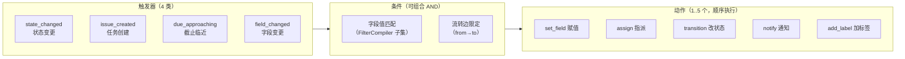
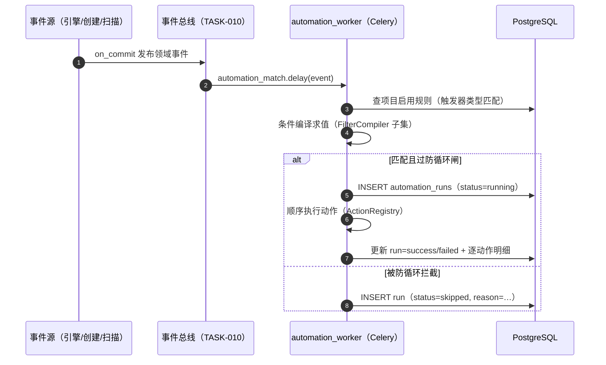

# WF-003 自动化规则引擎

| 元信息项 | 内容 |
| --- | --- |
| 文档编号 | WF-003 |
| 所属迭代 | Sprint 7 — 企业工作流核心（第 9 周 D5 主线） |
| 优先级 | P3（企业版核心级） |
| 覆盖模块 | M5-WF 工作流与审批（自动化切面） |
| 工作量估算 | 6 人日（后端 3.5 + 前端 1.5 + QA 1） |
| 文档状态 | 待评审（Draft） |
| 最后更新日期 | 2026-09-01 |
| 上游依赖 | `WF-001`（`side_effects` 协议、流转事件源）、`TASK-010`（Activity/事件管道）、`COLLAB-001`（通知通道） |
| 下游消费 | Sprint 9 报表（规则执行统计）、`WF-005`（模板可预置规则） |

---

## 1. 概述

### 1.1 功能定位

WF-003 交付**受限 DSL 的自动化规则引擎**：`触发器 × 条件 × 动作` 三段式规则，替代人工重复操作（「高优先级需求进入评审时自动指派产品负责人」）。设计红线：**刻意不做图灵完备**——无脚本、无循环、无任意代码，规则是声明式 JSON，可静态校验、可 Dry Run、可审计。



### 1.2 与 `side_effects` 的关系（职责切分）

| 维度 | `side_effects`（WF-001 协议） | 自动化规则（本文档） |
| --- | --- | --- |
| 绑定位置 | 流转**边**上，随该边执行 | 项目级独立实体，按事件匹配 |
| 触发源 | 仅「人手动走这条边」 | 任何来源的事件（手动/规则/导入/API） |
| 执行时机 | 流转事务内（同步、可回滚） | 事件提交后异步（Celery，最终一致） |
| 典型用途 | 「提交评审时自动置优先级=高」 | 「任何任务进入评审且优先级=高 → 指派产品负责人」 |

> 二者共享同一套**动作执行器注册表**（`ActionRegistry`）：`set_field/assign/notify` 的 config schema 与执行代码复用，差异仅在调用上下文（事务内同步 vs 异步 worker）——协议收敛是 WF-001 §4.7 冻结契约的兑现。

### 1.3 范围边界

| 范围 | 本文档交付 | 明确不做 |
| --- | --- | --- |
| 触发器 | 状态变更/任务创建/截止临近/字段变更四类 | 定时 cron 触发（P4）；Webhook 入站触发（P4） |
| 条件 | FilterCompiler 子集（字段等值/集合/比较）+ 流转边限定 | 正则/脚本表达式（P4 评估） |
| 动作 | 赋值/指派/改状态/通知/加标签五类，单规则 ≤5 个顺序执行 | 创建任务/跨项目动作（P4）；HTTP 回调（P4） |
| 防循环 | 规则链深度保险丝 + 同任务同规则去重窗口 | 通用循环检测图分析（过度设计） |
| 运行保障 | 执行日志（逐条）、Dry Run、启用/停用、失败告警 | 执行回放/时光机调试（P4） |

### 1.4 前置依赖

| 依赖 | 内容 | 阻塞原因 |
| --- | --- | --- |
| `WF-001` §4.7 | 动作 config schema（`set_field/assign/notify`） | 协议复用 |
| `TASK-010` | `issue_activity` worker 事件总线（状态/字段变更事件） | 触发器事件源 |
| `TASK-003` | FilterCompiler DSL | 条件编译 |
| `COLLAB-001` | 通知通道 | notify 动作 |
| `INFRA-002` | Celery `workflow` 队列与 beat | 异步执行与截止扫描 |

### 1.5 竞品参考

| 竞品 | 参考点 | 处置 |
| --- | --- | --- |
| Jira Automation | `WHEN/IF/THEN` 三段 + 规则审计日志 + 执行配额 | 三段模型与审计日志对齐；配额简化（无执行次数计费） |
| Plane | 无自动化（社区高频请求 #2456 等） | 差异化卖点 |
| GitHub Actions | 事件 → workflow yaml | 不学其 yaml 自由度（图灵完备正是要避免的运维负担） |
| 飞书项目 | 自动化规则 + 「不触发其他规则」开关 | 采纳**规则不级联触发**的保守默认（防循环第一性） |

---

## 2. 业务逻辑

### 2.1 规则定义（业务视图）

```json
{
  "name": "高优需求进评审 → 指派产品负责人",
  "trigger": {
    "type": "state_changed",
    "config": {"to_group": "review", "issue_types": ["requirement"]}
  },
  "conditions": [
    {"field": "priority", "op": "in", "value": ["high", "urgent"]},
    {"field": "assignees", "op": "is_empty", "value": null}
  ],
  "actions": [
    {"type": "assign", "config": {"strategy": "role_group", "role": "product_owner"}},
    {"type": "notify", "config": {"channel": "inbox", "targets": ["assignees"],
      "template": "规则「{rule}」已将任务指派给你"}}
  ],
  "dedup_window_minutes": 60,
  "is_active": true
}
```

| 字段 | 语义 |
| --- | --- |
| `trigger` | 单触发器（一条规则一个入口）；四类 `type`，config 依类型收窄 |
| `conditions` | 数组，**AND 组合**；编译到 FilterCompiler 子集（字段名/操作符白名单）；空数组 = 恒真 |
| `actions` | 1..5 个，**顺序执行**；任一动作失败：前序已执行动作不回滚（异步语义），记录失败并继续与否按动作级 `on_error`（默认 `stop`） |
| `dedup_window_minutes` | 同任务同规则去重窗口（默认 60，0 = 不限制）——防循环核心参数 |
| `is_active` | 停用即不再匹配新事件，在途执行跑完 |

### 2.2 触发器语义

| 类型 | 事件源 | config | 备注 |
| --- | --- | --- | --- |
| `state_changed` | 流转完成事件（WF-001 引擎 on_commit 发布） | `to_state`/`to_group`/`from_state`/`transition_id`/`issue_types` 可选过滤 | 含审批终审完成的迁移 |
| `issue_created` | 创建提交事件（TASK-002） | `issue_types` | 导入/批量创建同样触发 |
| `field_changed` | 字段更新事件（TASK-010 diff） | `fields`（字段白名单）+ 可选 `to_value` | 自定义字段用 `cf_<uuid>` |
| `due_approaching` | beat 每 15min 扫描 `due_date` | `hours_before`（1..168） | 每任务每规则只触发一次（窗口即 `hours_before` 起点） |

### 2.3 执行语义与防循环



**防循环三闸**（BR-07/08/09）：

1. **来源标记闸**：规则执行产生的变更事件携带 `origin=automation:{run_id}`；默认 `state_changed/field_changed` 触发器**不匹配** `origin=automation` 的事件（规则不级联）。项目级开关 `allow_rule_chain` 可放开，但受闸 2/3 约束。
2. **深度保险丝**：事件携带 `chain_depth`，规则动作产生的新事件 `chain_depth+1`；深度 ≥ 5 的事件不再触发任何规则（快速失败 + 告警）。
3. **去重窗口**：同 `(rule, issue)` 在 `dedup_window_minutes` 内已成功执行过 → 跳过（`skipped(dedup)`）。Redis `SETNX` 实现，键 `autodedup:{rule}:{issue}`。

### 2.4 Dry Run

对单条规则 + 指定任务（或最近 20 条匹配事件样本）**只评估不执行**：返回「条件是否命中 / 每个动作将做什么（解析后的参数）/ 防循环闸是否会拦截」。用于配置期自检，不产生任何写操作与 Activity。

### 2.5 业务规则汇总

| 编号 | 规则 | 判定位置 | 违反后果 |
| --- | --- | --- | --- |
| BR-01 | 规则是项目级实体；`automation.manage`（PROJ_ADMIN+）可写，成员可读名称与启停状态 | Permission | `403 PERM_DENIED` |
| BR-02 | trigger/conditions/actions 保存时静态校验（jsonschema + 动作注册表 + 条件字段白名单） | Serializer | `400 VALIDATION_ERROR` 定位到路径 |
| BR-03 | 动作执行 = 异步（Celery `workflow` 队列），规则执行 P95 < 100ms（不含通知投递） | worker | 超时告警 |
| BR-04 | 单规则动作 ≤ 5；动作失败默认 `stop`（后续不执行），可配 `continue` | worker | run=failed + 明细 |
| BR-05 | `transition` 动作走 WF-001 引擎完整路径（守卫照常；失败记 run=failed 不强行迁移） | 引擎 | run 明细含守卫错误 |
| BR-06 | 规则不产生隐藏写：每个动作的字段变化落 `IssueActivity`（verb 标 `via=automation:{rule}`） | on_commit | — |
| BR-07 | 默认规则不级联：origin=automation 的事件不匹配 state/field 触发器 | worker | `skipped(origin)` |
| BR-08 | 链深度 ≥5 熔断 | worker | `skipped(chain_depth)` + ERROR 告警 |
| BR-09 | 同任务同规则去重窗口（默认 60min，Redis SETNX） | worker | `skipped(dedup)` |
| BR-10 | `due_approaching` 每任务每规则只触发一次（窗口起点处） | beat + 去重键 | — |
| BR-11 | Dry Run 零写：不落 run、不落 Activity、不发通知 | 服务 | — |
| BR-12 | 执行日志保留 90 天（每日清理任务）；run 对成员可读（透明） | 清理任务 | — |
| BR-13 | 连续失败熔断：同规则连续 10 次 failed → 自动停用 + 通知管理者 | worker | 停用留痕 |
| BR-14 | 停用规则不匹配新事件；在途 run 完成 | worker | — |
| BR-15 | 规则变更（改条件/动作）产生配置 Activity（项目动态流，COLLAB-003） | on_commit | — |

### 2.6 异常处理

| 场景 | HTTP | 错误码 | details 子码 | 前端表现 |
| --- | --- | --- | --- | --- |
| 未知 trigger/action type | 400 | `VALIDATION_ERROR` | `NOT_A_CHOICE` | 列出合法枚举 |
| 条件字段非法（非白名单） | 400 | `VALIDATION_ERROR` | `INVALID_FIELD` | 条件行标红 |
| 动作数超 5 / 空 actions | 400 | `VALIDATION_ERROR` | `LIMIT` / `REQUIRED` | — |
| 规则不存在 | 404 | `RESOURCE_NOT_FOUND` | — | 通用 404 |
| 非管理者写操作 | 403 | `PERM_DENIED` | — | 入口本不渲染 |
| 规则数超配额（项目 ≤ 50 条） | 409 | `RESOURCE_LIMIT_EXCEEDED` | `RULE_LIMIT` | 「自动化规则已达 50 条上限」 |
| 执行中动作失败 | —（异步） | 记入 run | `action_error` | 运行日志页可见 |
| Dry Run 任务不可见 | 404 | `RESOURCE_NOT_FOUND` | — | — |

### 2.7 边界条件

| 边界场景 | 限制值 | 超出处理 |
| --- | --- | --- |
| 单项目规则数 | 50 | `409 RESOURCE_LIMIT_EXCEEDED` |
| 单规则动作数 | 5 | 保存拒绝 |
| 单事件匹配规则数 | 无硬限（逐条独立 run） | 顺序执行，互不影响 |
| `due_approaching.hours_before` | 1..168（7 天） | 保存拒绝 |
| 链深度 | 5 | 熔断 + 告警 |
| 执行日志 | 90 天留存 | 每日清理（batch 500） |
| 高频事件风暴（批量导入 1 万任务） | 每任务独立事件 | worker 水平扩展；规则逐条匹配 O（规则数） 求值，单事件匹配 P95 < 20ms |

---

## 3. UI/UX 设计

### 3.1 规则列表（项目设置 · 自动化）

```
┌──────────────────────────────────────────────────────────────────────┐
│ 项目设置 / 自动化规则                          [+ 新建规则]           │
├──────────────────────────────────────────────────────────────────────┤
│ ● 高优需求进评审→指派产品负责人   状态变更 · 3 动作   本周运行 41 次   │
│ ● 截止前 24h 提醒负责人           截止临近 · 1 动作   本周运行 128 次  │
│ ○ 缺陷创建→加「待分诊」标签       任务创建 · 1 动作   已停用（熔断）⚠  │
│ ──────────────────────────────────────────────────────────────────── │
│ 最近运行                                              [查看全部日志] │
│  10:42 ✓ PROJ-131  高优需求…  3/3 动作成功                            │
│  10:31 ✕ PROJ-128  截止提醒…  动作 1 失败：通知目标为空  [详情]       │
│  09:58 ⊘ PROJ-125  高优需求…  跳过：去重窗口内                        │
└──────────────────────────────────────────────────────────────────────┘
```

### 3.2 规则编辑器（三段式引导）

```
┌─ 新建规则 ────────────────────────────────────────────────────────┐
│ 名称：[高优需求进评审→指派产品负责人                        ]      │
│                                                                   │
│ ① 当…（触发器）                                                   │
│   [状态变更 ▾]  目标状态组：[评审中 ▾]  任务类型：[需求 ▾]          │
│                                                                   │
│ ② 且满足…（条件，AND）                       [+ 添加条件]          │
│   [优先级 ▾] [属于 ▾] [高, 紧急 ▾]                          [×]   │
│   [负责人 ▾] [为空 ▾]                                       [×]   │
│                                                                   │
│ ③ 则执行…（动作，顺序）                      [+ 添加动作]（2/5）    │
│   1. [指派 ▾] 角色组 [产品负责人 ▾]                         [↑↓×] │
│   2. [通知 ▾] 收件箱 → 负责人  模板[默认 ▾]                 [↑↓×] │
│                                                                   │
│ 去重窗口：[60] 分钟    ☑ 启用                                     │
│              [Dry Run 试运行]          [取消]  [保存]             │
└───────────────────────────────────────────────────────────────────┘
```

| 元素 | 行为 |
| --- | --- |
| 触发器切换 | config 区随 `type` 动态换表单（状态组/字段选择/小时数） |
| 条件字段下拉 | 与筛选器同一字段注册表（含 `cf_` 自定义字段，TASK-008 Schema API + ETag 缓存） |
| 动作排序 | ↑↓ 调整执行顺序 |
| Dry Run | 弹层选任务（默认最近 5 条匹配样本）→ 展示逐条「命中与否 + 将执行的动作解析」 |

### 3.3 Dry Run 结果弹层

```
┌─ Dry Run · 高优需求进评审→指派… ─────────────────────────────────┐
│ 样本：最近 20 条「进入评审」事件                                   │
│ ┌──────────────────────────────────────────────────────────────┐ │
│ │ ✓ PROJ-131 命中 · 将执行：                                     │ │
│ │   1. assign → 王一（产品负责人组解析）                         │ │
│ │   2. notify → 王一（收件箱）                                   │ │
│ │ ✕ PROJ-130 未命中：优先级=中                                   │ │
│ │ ⊘ PROJ-129 命中但将跳过：去重窗口内（上次运行 35 分钟前）        │ │
│ └──────────────────────────────────────────────────────────────┘ │
│                        本试运行未产生任何实际变更                  │
└──────────────────────────────────────────────────────────────────┘
```

### 3.4 运行日志页

筛选（规则/状态/时间）+ 逐条展开（事件 → 条件求值 → 每动作结果与参数）；`failed` 行内联「重新启用/编辑规则」入口（熔断场景）。空状态：「规则还没有运行过——保存后用 Dry Run 验证」。

---

## 4. 技术架构

### 4.1 模型定义

```python
class AutomationRule(BaseModel):
    """自动化规则：trigger × conditions × actions 受限 DSL（BR-01 项目级）"""

    project = models.ForeignKey(Project, on_delete=models.CASCADE, related_name="automation_rules")
    name = models.CharField(max_length=64)
    trigger = models.JSONField(help_text='{"type": "state_changed|issue_created|due_approaching|field_changed", "config": {…}}')
    conditions = models.JSONField(default=list, help_text="FilterCompiler 子集，AND 组合")
    actions = models.JSONField(help_text="1..5 个，复用 WF-001 §4.7 动作协议 + transition/add_label")
    dedup_window_minutes = models.PositiveIntegerField(default=60)
    is_active = models.BooleanField(default=True)
    consecutive_failures = models.PositiveIntegerField(default=0, verbose_name="BR-13 熔断计数")
    created_by = models.ForeignKey(User, on_delete=models.PROTECT, related_name="+")

    class Meta(BaseModel.Meta):
        db_table = "automation_rules"
        constraints = [
            models.UniqueConstraint(fields=["project", "name"], name="uniq_rule_name_per_project"),
        ]
        indexes = [models.Index(fields=["project", "is_active"], name="idx_rule_active")]


class AutomationRun(models.Model):
    """执行日志（BR-12：90 天留存，成员可读）"""

    class Status(models.TextChoices):
        SUCCESS = "success", "成功"
        FAILED = "failed", "失败"
        SKIPPED = "skipped", "跳过"

    id = models.BigAutoField(primary_key=True)
    rule = models.ForeignKey(AutomationRule, on_delete=models.CASCADE, related_name="runs")
    issue = models.ForeignKey(Issue, null=True, on_delete=models.SET_NULL, related_name="+")
    event = models.JSONField(help_text="触发事件快照（type/payload/origin/chain_depth）")
    status = models.CharField(max_length=8, choices=Status.choices)
    skip_reason = models.CharField(max_length=32, blank=True, default="",
        help_text="dedup|origin|chain_depth|rule_inactive")
    action_results = models.JSONField(default=list,
        help_text='[{"type":"assign","ok":true,"detail":{…}}, …]')
    duration_ms = models.PositiveIntegerField(default=0)
    created_at = models.DateTimeField(auto_now_add=True)

    class Meta:
        db_table = "automation_runs"
        indexes = [
            models.Index(fields=["rule", "created_at"], name="idx_run_rule"),
            models.Index(fields=["created_at"], name="idx_run_retention"),
        ]
```

### 4.2 迁移要点

1. 两表新建；`idx_run_retention` 支撑 90 天清理的范围删除（`DELETE … WHERE created_at < now()-90d` 分批 500 行）。
2. `trigger/conditions/actions` 不落 GIN 索引（从不按内容查询，匹配在内存求值——规则数 ≤ 50，全量加载缓存）。
3. **规则缓存**：`automation:rules:{project_id}` Redis 缓存启用规则集；保存/启停信号失效（与 TASK-008 字段缓存同范式）；worker 读缓存零 DB 命中。

### 4.3 执行 worker

```python
@app.task(queue="workflow", bind=True, max_retries=3, ignore_result=True)
def automation_match(self, event: dict):
    """事件入口：匹配规则 → 防循环三闸 → 顺序执行动作（BR-03/07/08/09）"""
    if event.get("origin", "").startswith("automation") and not allow_chain(event["project_id"]):
        return                                                # 闸 1：来源标记（BR-07）
    if event.get("chain_depth", 0) >= 5:
        alert("automation chain depth exceeded", event)
        return                                                # 闸 2：深度保险丝（BR-08）

    rules = cached_active_rules(event["project_id"], trigger_type=event["type"])
    issue = load_issue(event["issue_id"])
    for rule in rules:
        if not match_trigger(rule.trigger, event) or not eval_conditions(rule.conditions, issue, event):
            continue
        if not dedup_acquire(rule.id, issue.id, rule.dedup_window_minutes):
            log_run(rule, issue, event, status="skipped", reason="dedup")   # 闸 3（BR-09）
            continue
        run = log_run(rule, issue, event, status="running")
        execute_actions(run, rule, issue, event)


def execute_actions(run, rule, issue, event):
    results, ok = [], True
    for action in rule.actions:
        try:
            detail = ACTION_REGISTRY[action["type"]].execute(
                config=action["config"], issue=issue, actor=rule.created_by,
                context={"via": f"automation:{rule.id}"})
            results.append({"type": action["type"], "ok": True, "detail": detail})
        except Exception as e:
            results.append({"type": action["type"], "ok": False, "error": str(e)})
            ok = False
            if action.get("on_error", "stop") == "stop":
                break
    finalize_run(run, ok, results, rule)          # BR-13 熔断计数；BR-06 Activity 由动作内部 on_commit 落
```

**动作注册表**（与 WF-001 `side_effects` 共享执行器）：

```python
ACTION_REGISTRY: dict[str, ActionExecutor] = {
    "set_field": SetFieldExecutor(),       # 校验字段可写 + 类型；cf_ 走 validate_custom_fields
    "assign":    AssignExecutor(),         # strategy: user|role_group；成员校验
    "transition": TransitionExecutor(),    # 内部调 WorkflowService.transition（BR-05 守卫照常）
    "notify":    NotifyExecutor(),         # COLLAB-001 通道；on_commit 投递
    "add_label": AddLabelExecutor(),       # 幂等（已有则 no-op）
}
```

**事件 `chain_depth` 传播**：动作执行产生的领域事件统一经 `emit_event(..., origin=f"automation:{run.id}", chain_depth=event["chain_depth"] + 1)`——深度沿链递增，保险丝在入口判定。

### 4.4 截止临近扫描（beat）

```python
@app.task(queue="workflow")
def due_approaching_scan():
    """beat 每 15min：对启用 due_approaching 规则的项目扫描到期任务（BR-10）"""
    for project_id, rules in cached_due_rules().items():
        max_h = max(r.trigger["config"]["hours_before"] for r in rules)
        qs = Issue.objects.filter(
            project_id=project_id, deleted_at__isnull=True, is_archived=False,
            due_date__range=(timezone.now(), timezone.now() + timedelta(hours=max_h)),
        ).exclude(state__group__in=["completed", "cancelled"])
        for issue in qs.iterator(chunk_size=500):
            for rule in rules:
                h = rule.trigger["config"]["hours_before"]
                if due_within(issue, h) and dedup_acquire(rule.id, issue.id, hours=h):
                    automation_match.delay(build_event("due_approaching", issue, rule))
```

### 4.5 API 定义

| 方法 | 路径 | 说明 | 权限 |
| --- | --- | --- | --- |
| GET | `/api/v1/ws/{slug}/projects/{id}/automation-rules/` | 规则列表（含本周运行计数） | 成员读 / `automation.manage` 写 |
| POST | 同上 | 创建（静态校验 BR-02） | `automation.manage` |
| GET/PATCH/DELETE | `…/automation-rules/{rid}/` | 详情/更新/删除 | 同上 |
| POST | `…/automation-rules/{rid}/toggle/` | 启停（`{"is_active": false}`） | 同上 |
| POST | `…/automation-rules/{rid}/dry-run/` | Dry Run（BR-11 零写） | 同上 |
| GET | `…/automation-runs/` | 运行日志（`?rule=&status=&cursor=`） | 成员读 |

**创建请求**：

```http
POST /api/v1/ws/acme/projects/01J8P…/automation-rules/
Content-Type: application/json

{
  "name": "高优需求进评审→指派产品负责人",
  "trigger": {"type": "state_changed", "config": {"to_group": "review", "issue_types": ["requirement"]}},
  "conditions": [{"field": "priority", "op": "in", "value": ["high", "urgent"]}],
  "actions": [
    {"type": "assign", "config": {"strategy": "role_group", "role": "product_owner"}},
    {"type": "notify", "config": {"channel": "inbox", "targets": ["assignees"]}}
  ],
  "dedup_window_minutes": 60
}
```

```json
{
  "status": 0,
  "data": {
    "id": "01J9B4K2M8P6R3T1V5X7Z9ACQD",
    "name": "高优需求进评审→指派产品负责人",
    "is_active": true,
    "created_at": "2026-09-07T10:22:31.118Z"
  }
}
```

**Dry Run 响应**：

```json
{
  "status": 0,
  "data": {
    "samples": [
      {"issue": "PROJ-131", "matched": true,
       "would_execute": [
         {"type": "assign", "resolved": {"users": [{"id": "01J7U…", "name": "王一"}]}},
         {"type": "notify", "resolved": {"targets": ["01J7U…"]}}
       ],
       "gate": null},
      {"issue": "PROJ-130", "matched": false, "reason": "priority=medium 不在 [high, urgent]"},
      {"issue": "PROJ-129", "matched": true, "gate": "dedup", "detail": "35 分钟前已执行"}
    ],
    "side_effects": "none"
  }
}
```

**错误响应**（非法动作类型）：

```json
{
  "status": 1,
  "error": {
    "code": "VALIDATION_ERROR",
    "message": "actions[2].type 不是合法的动作类型",
    "details": {"sub_code": "NOT_A_CHOICE", "path": "actions[2].type",
                "allowed": ["set_field", "assign", "transition", "notify", "add_label"]},
    "request_id": "01J9B6N1C4F7H2K5M8P1R3T6VX"
  }
}
```

### 4.6 前端实现

```tsx
// apps/web/features/automation/ruleStore.ts
export class AutomationRuleStore {
  @observable rules: AutomationRule[] = [];
  @observable runs: AutomationRun[] = [];

  async save(rule: DraftRule) {
    const { data } = rule.id
      ? await api.patch(ruleUrl(rule.id), rule)
      : await api.post(rulesUrl, rule);
    runInAction(() => upsert(this.rules, data));
    return data;
  }

  async dryRun(ruleId: string, sampleSize = 20) {
    const { data } = await api.post(`${ruleUrl(ruleId)}/dry-run/`, { sample_size: sampleSize });
    return data.samples;                       // 弹层渲染 §3.3
  }
}
```

条件/动作表单复用筛选器的字段注册表与 `react-hook-form` 动态 schema；触发器切换用配置驱动表单（`TRIGGER_FORMS[type]`），新增触发器类型零框架改动。

### 4.7 性能预算

| 路径 | 预算 | 手段 |
| --- | --- | --- |
| 单事件规则匹配 | P95 < 20ms | 规则 Redis 缓存 + 内存求值 |
| 单规则执行（不含通知投递） | P95 < 100ms | 动作同步执行于 worker；通知 on_commit 异投 |
| 日志查询 | P95 < 150ms | `idx_run_rule` 游标分页 |
| 截止扫描 | 单轮 < 5s（1 万到期任务） | `due_date` 索引 + 分片迭代 |

### 4.8 触发器与动作 config 协议全表

**触发器 config schema**（保存时 jsonschema 校验，BR-02）：

| trigger.type | config 字段 | 类型/约束 | 说明 |
| --- | --- | --- | --- |
| `state_changed` | `to_state` / `from_state` | uuid，可选 | 精确状态 |
| | `to_group` | 五语义组，可选 | 与 `to_state` 互斥 |
| | `transition_id` | uuid，可选 | 限定特定边（如仅「提交评审」触发） |
| | `issue_types` | string[]，可选 | 空 = 全部类型 |
| `issue_created` | `issue_types` | string[]，可选 | — |
| `field_changed` | `fields` | string[]，必填，≤10 | 系统字段名或 `cf_<uuid>`；`state` 非法（用 state_changed） |
| | `to_value` | any，可选 | 变更后值匹配（类型随字段） |
| `due_approaching` | `hours_before` | int，1..168，必填 | — |
| | `issue_types` | string[]，可选 | — |

**动作 config schema**：

| action.type | config 字段 | 类型/约束 | 说明 |
| --- | --- | --- | --- |
| `set_field` | `field` | string，必填 | 可写字段白名单（`state/parent/sequence_id` 拒绝；`state` 变更用 transition 动作） |
| | `value` | any，必填 | 类型随字段；cf_ 走 `validate_custom_fields` |
| `assign` | `strategy` | `user` / `role_group`，必填 | — |
| | `user_id` | uuid（strategy=user） | 成员校验 |
| | `role` | string（strategy=role_group） | 展开为空 → 动作失败（非规则失败） |
| | `mode` | `replace` / `add`，默认 add | 多负责人语义（TASK-007） |
| `transition` | `to_state` 或 `transition_id` | 二选一必填 | 引擎路径匹配；守卫失败 = 动作失败（BR-05） |
| `notify` | `channel` | `inbox` / `email` / `both`，必填 | 偏好仍生效（email 可关） |
| | `targets` | 数组必填：`assignees/reporter/watchers/role:<r>/user:<id>` | ≤10 |
| | `template` | string，可选 | 占位符 `{issue}/{rule}/{actor}`；默认模板内置 |
| `add_label` | `label_id` | uuid，必填 | 项目内标签；幂等 |
| 公共 | `on_error` | `stop` / `continue`，默认 stop | — |

**条件操作符白名单**（FilterCompiler 子集）：`eq / neq / in / not_in / is_empty / is_not_empty / gt / gte / lt / lte / contains`（文本）——`between/range` 等复杂算子不开放（条件面保持可读）；日期字段支持相对值 `{"relative": "-7d"}`。

---

## 5. 测试用例

### 5.1 单元测试

| 编号 | 用例 | 断言 |
| --- | --- | --- |
| UT-01 | 四触发器 config 静态校验 | 非法字段/类型 400 定位路径 |
| UT-02 | 条件编译：FilterCompiler 子集白名单 | 白名单外字段 `INVALID_FIELD` |
| UT-03 | 动作数 0/6 拒绝 | `REQUIRED`/`LIMIT` |
| UT-04 | 条件 AND 求值真值表 | 全组合正确 |
| UT-05 | 闸 1：origin=automation 事件被跳过 | run=skipped(origin) |
| UT-06 | 闸 2：chain_depth=5 熔断 | 告警发出，无 run |
| UT-07 | 闸 3：去重窗口内跳过 | run=skipped(dedup)；窗口外执行 |
| UT-08 | 动作 stop/continue 两策略 | 失败后动作执行边界正确 |
| UT-09 | transition 动作走守卫 | 守卫失败 run=failed 含守卫明细 |
| UT-10 | BR-13 熔断：连续 10 败自动停用 | is_active=false + 管理者通知 |
| UT-11 | due_approaching 唯一触发 | 窗口内重复扫描只触发一次 |
| UT-12 | Dry Run 零写 | 无 run/Activity/通知；返回解析明细 |
| UT-13 | add_label 幂等 | 已有标签 no-op 不报错 |
| UT-14 | 规则保存 → 缓存失效 | 下次匹配用新定义 |

### 5.2 集成测试

| 编号 | 用例 | 断言 |
| --- | --- | --- |
| IT-01 | 全链路：状态变更 → worker 匹配 → assign+notify 落 | 任务负责人变更 + Activity via=automation + 收件箱通知 |
| IT-02 | 级联防护：规则 A 改状态触发规则 B（默认关） | B 不执行；放开 allow_rule_chain 后 B 执行且 chain_depth=2 |
| IT-03 | 深度熔断链路：构造 A→B→C→D→E 链 | 第 5 层熔断告警 |
| IT-04 | 批量创建 1000 任务触发 issue_created | 全部匹配执行；队列无积压回归 |
| IT-05 | 规则停用瞬间在途 run 完成、新事件不匹配 | BR-14 |
| IT-06 | 90 天清理任务 | 过期 run 删除，边界数据保留 |
| IT-07 | 配额：第 51 条规则 409 | `RESOURCE_LIMIT_EXCEEDED/RULE_LIMIT` |
| IT-08 | 审批终审完成的迁移触发 state_changed 规则 | 事件源覆盖完整 |

### 5.3 E2E 测试

| 编号 | 场景 | 断言 |
| --- | --- | --- |
| E2E-01 | 配置验收规则（迭代验收清单第 5 条）→ 拖动高优需求进评审 | 自动指派产品负责人 + 通知到达 |
| E2E-02 | Dry Run 弹层三种结果（命中/未命中/去重）渲染 | 与后端一致 |
| E2E-03 | 运行日志页筛选与展开 | 动作明细正确 |
| E2E-04 | 熔断横幅：连续失败后列表显示停用 ⚠ → 管理者重新启用 | 状态流转正确 |
| E2E-05 | 截止提醒：测试时钟拨到 24h 内 | 负责人收提醒一次（不重复） |
| E2E-06 | 非管理者访问规则配置 | 入口隐藏，直连 403 |

---

## 6. 竞品深度对标

### 6.1 Jira Automation 分析

| 观察点 | Jira 做法 | 本系统决策 |
| --- | --- | --- |
| 模型 | WHEN（触发器）/ IF（条件）/ THEN（动作，可分支） | 三段对齐；**刻意不做分支**（条件已可表达，分支是配置复杂度的主要来源） |
| 审计 | 每条规则 audit log（每次执行的输入/输出/耗时） | `automation_runs` 对齐 + 成员可读（Jira 仅管理员可见，透明度差） |
| 级联 | 「允许规则触发其他规则」开关（默认开，事故高发） | **默认不级联**（BR-07）+ 深度保险丝——把 Jira 的高发事故面默认关闭 |
| 配额 | 按版本限执行次数（计费） | 自托管无计费，仅规则数上限 50 防失控 |

### 6.2 飞书项目 / GitHub Actions 分析

| 观察点 | 做法 | 处置 |
| --- | --- | --- |
| 飞书「不触发其他规则」 | 保守默认，防循环优先 | 采纳为 BR-07 |
| GitHub Actions yaml | 图灵完备、脚本自由 | 明确不学：声明式 JSON 才可静态校验、Dry Run、安全开放给非工程管理员 |
| GitLab `issue boards automation` | 仅限列表移动 | 本系统动作面更宽（五类），但保持声明式 |

### 6.3 本系统设计决策汇总

1. **协议复用**：动作执行器与 WF-001 `side_effects` 同注册表——一处实现两处调用（同步事务内 / 异步 worker），杜绝「边效应」与「规则」语义漂移。
2. **防循环三闸默认从严**：来源标记默认关级联、深度保险丝、去重窗口——自动化事故（循环风暴）是企业工具的头号运维灾难，默认保守、显式放开。
3. **Dry Run 一等公民**：规则对业务管理员开放的前提是「改之前能看见后果」，竞品多把 Dry Run 藏在高级版。
4. **熔断自保**（BR-13）：连续失败自动停用 + 通知，防坏规则在无人值守时持续刷错误与通知轰炸。

---

## 7. 里程碑与验收

### 7.1 交付物清单

| 类别 | 产物 |
| --- | --- |
| Model / Migration | `automation_rules`、`automation_runs` 两表 + 规则 Redis 缓存 |
| 后端 | `automation_match` worker、防循环三闸、五类动作执行器（复用 WF-001 注册表 + transition/add_label 新增）、`due_approaching_scan` beat、90 天清理任务、熔断机制 |
| API | 规则 CRUD + toggle + dry-run + runs 日志共 8 端点 |
| 前端 | 规则列表页、三段式规则编辑器、Dry Run 弹层、运行日志页 |
| 测试 | UT-01~14、IT-01~08、E2E-01~06 |

### 7.2 可操作演示的验收标准

1. 配置迭代验收规则「高优先级需求进入评审时自动指派产品负责人」：Dry Run 展示命中/未命中/去重三态；保存后真实拖动触发，指派与通知生效，Activity 标 `via=automation`。
2. 防循环演示：配两条互触发规则（A 改状态触发 B、B 改字段触发 A），默认不级联零执行；显式放开 `allow_rule_chain` 后链在第 5 层熔断并告警。
3. 去重演示：同任务 60 分钟内两次满足条件，第二次 run=skipped(dedup)。
4. 截止提醒演示：截止 24h 内任务触发一次提醒；扫描重复运行不重复触发。
5. 熔断演示：构造必败动作（指派已删除成员组），连续 10 败后规则自动停用并通知管理者。
6. 性能：单事件匹配 P95 < 20ms（1 万事件压测）；批量创建 1000 任务全部规则正常执行无积压。
7. 非法配置（未知动作类型/白名单外条件字段）保存即 400 且错误定位到 JSON 路径。