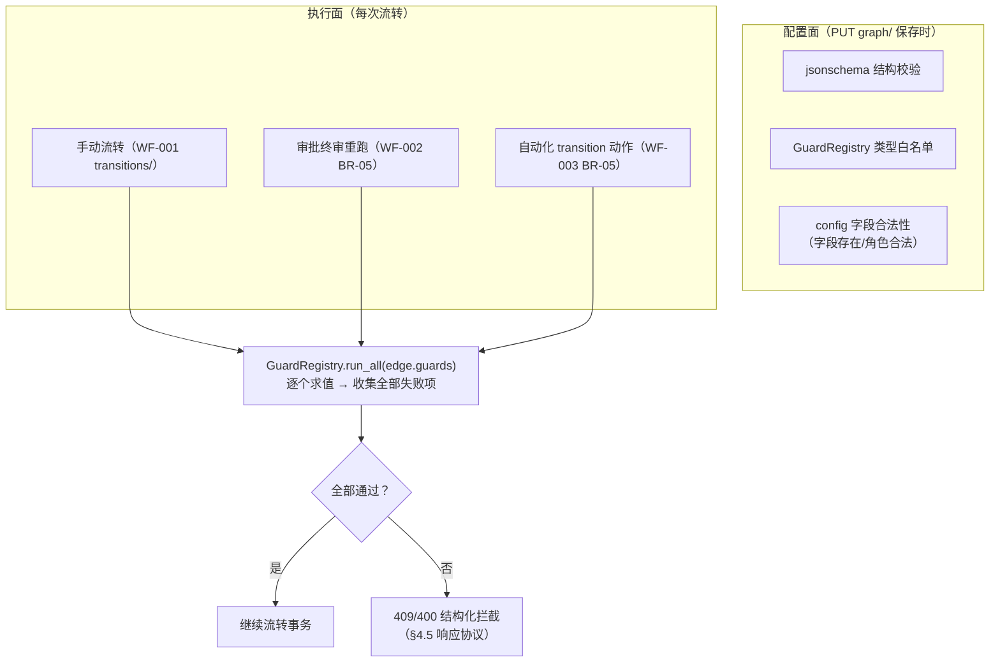
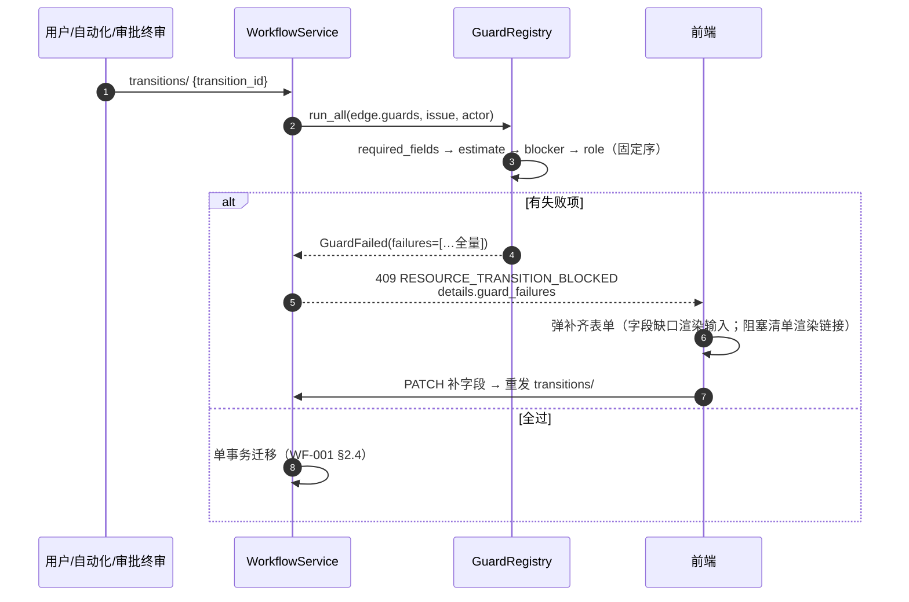

# WF-004 流转守卫与字段锁定

| 元信息项 | 内容 |
| --- | --- |
| 文档编号 | WF-004 |
| 所属迭代 | Sprint 7 — 企业工作流核心（第 9 周 D3-4 主线） |
| 优先级 | P3（企业版核心级） |
| 覆盖模块 | M5-WF 工作流与审批（守卫切面） |
| 工作量估算 | 5 人日（后端 3 + 前端 1.5 + QA 0.5） |
| 文档状态 | 待评审（Draft） |
| 最后更新日期 | 2026-09-01 |
| 上游依赖 | `WF-001`（`guards` 冻结协议、`WorkflowState.field_locks`、`GuardRegistry` 入口）、`TASK-005`（`blocker_completed` 既有拦截）、`TASK-006`（工时数据）、`TASK-008`（自定义字段校验） |
| 下游消费 | `WF-002`（终审守卫重跑）、`WF-003`（transition 动作走守卫）、`TASK-012`（字段级权限与守卫协同） |

---

## 1. 概述

### 1.1 功能定位

WF-004 把 WF-001 冻结的 `guards` JSONB 协议填充为**四类守卫的完整矩阵**，并交付配套能力：

1. **流转守卫矩阵**：`required_fields`（字段必填）/ `estimate_required`（工时必填）/ `blocker_completed`（前置依赖）/ `role_allowed`（角色权限）——按流转边独立配置，全部通过才放行。
2. **结构化拦截响应**：拦截不只是一句「不允许」，而是机器可读的缺失清单（缺哪些字段、哪些阻塞任务、需要哪个角色），前端据此弹出**就地补齐表单**，补齐后原动作自动重试——守卫是引导而非墙。
3. **字段锁定**：`WorkflowState.field_locks`——任务进入某状态后指定字段变为只读（如「已上线」后锁定截止日期），流转出该状态自动解锁。

### 1.2 守卫执行位置



> **收集全部失败项**而非短路返回第一条：用户补齐表单一打开就应看到所有缺口，避免「补一个冒一个」的打地鼠体验。

### 1.3 范围边界

| 范围 | 本文档交付 | 明确不做 |
| --- | --- | --- |
| 守卫类型 | 四类内置守卫 + 注册表扩展机制 | 自定义脚本守卫（P4）；跨项目依赖守卫（P4） |
| 拦截响应 | 结构化 details 协议 + 前端补齐表单 | 守卫豁免申请流（走 WF-002 审批语义，不另建） |
| 字段锁定 | 状态级锁定列表、进入/离开自动生效、解锁 Activity | 字段级「按角色可编辑」锁定（归 `TASK-012` 字段权限） |
| 强制通道 | `force=true` 管理员豁免（沿用 TASK-005 BR-09，扩展到全部守卫） | 普通成员豁免 |

### 1.4 前置依赖

| 依赖 | 内容 | 阻塞原因 |
| --- | --- | --- |
| `WF-001` §4.7 | guards 协议 schema、`GuardRegistry` 分发入口、`field_locks` 列 | 本文档全部挂点 |
| `TASK-005` §2.2 | `blocker_completed` 既有读时判定（BLOCKER_SQL） | 守卫化为注册项 |
| `TASK-006` | `estimate_minutes` 与 WorkLog 汇总 | 工时守卫数据源 |
| `TASK-008` | `validate_custom_fields` 与字段 Schema API | 必填校验含自定义字段 |

### 1.5 竞品参考

| 竞品 | 参考点 | 处置 |
| --- | --- | --- |
| Jira | Conditions（谁能流转）/ Validators（值是否合法）/ Post Functions 三段 | 合并为 guards 一类（WF-001 决策）；**Validators 的「补齐引导」Jira 无，本系统结构化拦截是差异点** |
| Ones | 流转必填字段配置 + 拦截弹窗补录 | 体验对齐；拦截响应协议化（Ones 为前端特判，本系统 details 契约开放给任何客户端） |
| Plane | 无守卫能力 | 差异化卖点 |

---

## 2. 业务逻辑

### 2.1 四类守卫语义

| type | 语义 | config | 拦截产出 |
| --- | --- | --- | --- |
| `required_fields` | 目标状态要求字段非空 | `{"fields": ["assignees", "due_date", "cf_01J9X…"]}` | `missing_fields` 清单（字段元数据含类型/选项，供就地补录） |
| `estimate_required` | 要求已填预估工时（`estimate_minutes > 0`） | `{}`（可选 `{"min_minutes": 30}`） | `missing_fields: [estimate]` |
| `blocker_completed` | 阻塞方全部完成/取消（TASK-005 读时判定） | `{}` 或 `{"enabled": false}`（显式关闭默认守卫，需 `workflow.manage`） | `blockers` 清单（编号+标题+状态） |
| `role_allowed` | 仅指定角色可执行此边 | `{"roles": ["PROJ_ADMIN", "custom:<role_id>"]}` | `required_roles` 清单 |

**空值判定**（`required_fields` 逐类型）：文本去空白后空 = 缺；数值 `null` = 缺（`0` 是合法值）；日期/单选 `null` = 缺；多选/负责人/标签空数组 = 缺；布尔不设必填（`false` 是值）；自定义字段按其 `field_type` 映射上述规则（TASK-008 §4 类型表）。

### 2.2 执行顺序与守卫叠加



| 规则点 | 取值 |
| --- | --- |
| 固定执行序 | `required_fields` → `estimate_required` → `blocker_completed` → `role_allowed`（字段类先于权限类——让补齐表单优先暴露业务缺口） |
| 隐式守卫 | `blocker_completed` 默认隐式存在（TASK-005 兼容）；边上显式 `{"enabled": false}` 才关闭 |
| 与审批关系 | 守卫**先于**审批立案（WF-002 BR-01）；终审重跑同一入口 |
| 强制通道 | `force=true` + comment（PROJ_ADMIN）跳过全部守卫；跳过事实落 Activity（`verb=force_transition`），审计可查 |

### 2.3 字段锁定

| 规则 | 语义 |
| --- | --- |
| 配置 | `WorkflowState.field_locks = [{"field": "due_date"}, {"field": "cf_<uuid>"}]` |
| 生效 | 任务**处于**该状态期间，锁定字段只读：PATCH 含锁定字段 → `400 VALIDATION_ERROR` + `FIELD_LOCKED`（details 给锁定来源状态） |
| 解锁 | 流转离开该状态即自动解锁（读时判定，无物化列——与 TASK-005 拦截同理，锁定 = `issue.state → workflow_state.field_locks` 的实时派生） |
| 豁免 | `PROJ_ADMIN` 不受锁（落 Activity `verb=force_edit_locked`）；锁定字段仍可被守卫要求补齐（先流转出再补，或管理员补） |
| 系统字段保护 | `state/parent/sequence_id` 等引擎字段不可配置锁定（保存校验拒绝） |
| Activity | 因锁定被拒的修改尝试**不落** Activity（未生效无动态）；强制修改落 `force_edit_locked` |

### 2.4 业务规则汇总

| 编号 | 规则 | 判定位置 | 违反后果 |
| --- | --- | --- | --- |
| BR-01 | 守卫按边配置、互不影响；同边多守卫全量求值收集全部失败 | GuardRegistry | — |
| BR-02 | 未知 guard type / 非法 config 在 `PUT graph/` 保存时拒绝（WF-001 §4.7 契约） | Serializer | `400 VALIDATION_ERROR` + `NOT_A_CHOICE` |
| BR-03 | `required_fields` 字段必须存在于项目字段集（含 cf_ Schema 校验） | 保存校验 | `400 VALIDATION_ERROR` + `INVALID_FIELD` |
| BR-04 | 拦截响应遵循 §4.5 协议：`guard_failures` 数组逐项 `{type, message, details}` | 引擎 | 前端契约 |
| BR-05 | 补齐重试：PATCH 补字段与重发 transitions/ 是两个请求（不合并——PATCH 可能本身触发校验/锁定） | 前端流程 | — |
| BR-06 | `force=true` 仅 PROJ_ADMIN 且 comment 必填；落 `force_transition` Activity | Service | `403` / `400 REQUIRED` |
| BR-07 | 字段锁定读时派生：以任务当前状态节点 `field_locks` 为准，无物化 | Serializer | — |
| BR-08 | 锁定字段 PATCH 拒绝；PROJ_ADMIN 豁免留痕 | Serializer | `400 VALIDATION_ERROR` + `FIELD_LOCKED` |
| BR-09 | 引擎字段（state/parent 等）不可被锁定配置 | 保存校验 | `400 VALIDATION_ERROR` |
| BR-10 | 守卫求值只读——执行器禁止写库（注册表约束 + code review 红线） | GuardRegistry | 评审拒绝 |
| BR-11 | 审批终审/自动化 transition 与手动流转共用同一守卫入口，无任何旁路 | 引擎 | 评审拒绝 |
| BR-12 | `blocker_completed` 显式关闭需 `workflow.manage` 权限，且关闭事实写入图版本 Activity | 保存校验 | `403 PERM_DENIED` |
| BR-13 | 守卫失败次数计入 `transitions/available/` 预览（`blocked_by` 字段），列表态即可见 | 预览查询 | — |

### 2.5 异常处理

| 场景 | HTTP | 错误码 | details 子码 | 前端表现 |
| --- | --- | --- | --- | --- |
| 字段必填缺失 | 409 | `RESOURCE_TRANSITION_BLOCKED` | `REQUIRED_FIELDS` | 补齐表单（字段输入区） |
| 工时未填 | 409 | `RESOURCE_TRANSITION_BLOCKED` | `ESTIMATE_REQUIRED` | 补齐表单（工时输入） |
| 阻塞未完成 | 409 | `RESOURCE_TRANSITION_BLOCKED` | `BLOCKED_BY` | 阻塞清单 + 跳转 + 管理员强制入口 |
| 角色不符 | 403 | `PERM_DENIED` | `ROLE_REQUIRED` | Toast「该流转需 XX 角色」 |
| 多守卫同时失败 | 409 | `RESOURCE_TRANSITION_BLOCKED` | 数组全量 | 分区表单（字段区 + 阻塞区） |
| 锁定字段修改 | 400 | `VALIDATION_ERROR` | `FIELD_LOCKED` | 字段灰显 tooltip「在状态 X 中锁定」 |
| 强制豁免缺 comment | 400 | `VALIDATION_ERROR` | `REQUIRED` | comment 框标红 |
| 守卫配置非法（保存时） | 400 | `VALIDATION_ERROR` | `INVALID_FIELD`/`NOT_A_CHOICE` | 画布侧栏行内报错定位 |

### 2.6 边界条件

| 边界场景 | 限制值 | 超出处理 |
| --- | --- | --- |
| 单边守卫数 | 8 | 保存拒绝 `LIMIT` |
| `required_fields` 字段数 | 20 | 同上 |
| 锁定字段数（单状态） | 20 | 同上 |
| 守卫求值耗时 | P95 < 30ms（四守卫合计） | 超时告警（求值全内存 + 一次 blockers JOIN） |
| 循环补齐（补 A 缺 B） | 无限制 | 每次拦截返回全量缺口，收敛靠全量协议 |
| 并发补齐（两人同时补不同字段） | 各自 PATCH 生效 | 重发 transitions/ 时以最新任务状态求值 |

---

## 3. UI/UX 设计

### 3.1 拦截补齐对话框（核心交互）

```
┌─ 无法完成「提交评审」—— 请补齐以下内容 ───────────────────────────┐
│                                                                  │
│ 缺少必填字段（2）                                                 │
│  ┌────────────────────────────────────────────────────────────┐  │
│  │ 负责人 *        [选择成员…                            ▾]   │  │
│  │ 截止日期 *      [2026-09-12] 📅                            │  │
│  └────────────────────────────────────────────────────────────┘  │
│                                                                  │
│ 前置任务未完成（2）                                               │
│  ┌────────────────────────────────────────────────────────────┐  │
│  │ ⊘ PROJ-121 接口联调           进行中     [前往处理 →]       │  │
│  │ ⊘ PROJ-122 测试用例评审       待开始     [前往处理 →]       │  │
│  └────────────────────────────────────────────────────────────┘  │
│                                                                  │
│           [取消]                    [保存并重新提交]              │
│  ─────────────────────────────────────────────────────────────  │
│  管理员：[⚡ 强制流转（需填写原因）]                               │
└──────────────────────────────────────────────────────────────────┘
```

| 元素 | 行为 |
| --- | --- |
| 字段输入区 | 按 `missing_fields[].meta`（类型/选项/校验规则）渲染对应控件——与任务详情字段编辑器同组件（复用 TASK-012 字段渲染器） |
| 阻塞清单 | 点击新标签打开任务；全部完成后本区自动转绿（5s 轮询或 WS） |
| 「保存并重新提交」 | 先 PATCH 字段 → 成功后自动重发 transitions/；任一步失败展示对应错误 |
| 强制流转 | 仅 PROJ_ADMIN 可见；展开 comment 输入，必填后才可提交 |

### 3.2 流转按钮预览态（看板/详情）

`transitions/available/` 返回每边 `blocked_by`（BR-13）：未满足的守卫在按钮 tooltip/下拉项上预标记（如「提交评审 · 缺 2 项」灰点徽标），用户**在点击前**即知缺口，点击直接进补齐对话框而非先失败一次。

### 3.3 画布守卫配置侧栏

```
┌─ 流转「提交评审」守卫 ─────────────┐
│ [+ 添加守卫 ▾]                     │
│  ├ 必填字段                        │
│  │   负责人、截止日期        [×]   │
│  ├ 工时必填（≥30min）        [×]   │
│  ├ 前置依赖完成（默认开启） [关闭] │
│  └ 角色限定：PROJ_ADMIN      [×]   │
│ 保存后随图发布生效                  │
└───────────────────────────────────┘
```

### 3.4 字段锁定呈现

| 位置 | 呈现 |
| --- | --- |
| 详情页锁定字段 | 输入控件灰显 + 🔒 图标，tooltip「在状态「已上线」中锁定 · 管理员可改」 |
| 锁定字段被强制修改 | Activity 显示「X 强制修改了锁定字段 截止日期：…→…」 |
| 画布状态节点 | 节点侧栏「字段锁定」列表（与守卫配置并列） |

---

## 4. 技术架构

### 4.1 GuardRegistry（注册表与执行器）

```python
class Guard(ABC):
    """守卫执行器协议（BR-10：只读；__call__ 返回 None=通过，GuardFailure=失败）"""
    type: str
    config_schema: dict                     # jsonschema，PUT graph/ 保存时校验（BR-02）

    @abstractmethod
    def check(self, *, config: dict, issue: Issue, actor: User) -> "GuardFailure | None": ...


class GuardRegistry:
    def __init__(self):
        self._guards: dict[str, Guard] = {}

    def register(self, guard: Guard): self._guards[guard.type] = guard

    def validate_configs(self, guards: list[dict], project: Project):     # 保存时
        for i, g in enumerate(guards):
            guard = self._guards.get(g.get("type"))
            if not guard:
                raise ValidationError("NOT_A_CHOICE", path=f"guards[{i}].type",
                                      allowed=sorted(self._guards))
            jsonschema.validate(g.get("config", {}), guard.config_schema)
            guard.validate_business(g.get("config", {}), project)         # BR-03 字段存在性

    def run_all(self, guards: list[dict], *, issue: Issue, actor: User,
                include_implicit: bool = True) -> list["GuardFailure"]:
        effective = list(guards)
        if include_implicit and not any(g["type"] == "blocker_completed" for g in guards):
            effective.append({"type": "blocker_completed", "config": {}})  # 隐式默认
        failures = []
        for g in sorted(effective, key=lambda x: EXECUTION_ORDER.index(x["type"])):
            guard = self._guards[g["type"]]
            if g.get("config", {}).get("enabled") is False: continue       # 显式关闭
            if failure := guard.check(config=g["config"], issue=issue, actor=actor):
                failures.append(failure)
        return failures


EXECUTION_ORDER = ["required_fields", "estimate_required", "blocker_completed", "role_allowed"]
GUARD_REGISTRY = GuardRegistry()
```

### 4.2 四类守卫实现

```python
@dataclass
class GuardFailure:
    type: str
    sub_code: str
    message: str
    details: dict


class RequiredFieldsGuard(Guard):
    type = "required_fields"
    config_schema = {"type": "object", "properties": {
        "fields": {"type": "array", "items": {"type": "string"}, "maxItems": 20}},
        "required": ["fields"]}

    def check(self, *, config, issue, actor):
        missing = [f for f in config["fields"] if is_empty(resolve_field(issue, f))]
        if not missing:
            return None
        return GuardFailure(self.type, "REQUIRED_FIELDS",
            f"缺少必填字段：{'、'.join(field_label(f) for f in missing)}",
            {"missing_fields": [field_meta(f, issue.project) for f in missing]})
            # field_meta 含 type/options/校验规则——前端直接渲染补录控件（§3.1）


class EstimateRequiredGuard(Guard):
    type = "estimate_required"
    config_schema = {"type": "object", "properties": {
        "min_minutes": {"type": "integer", "minimum": 1}}}

    def check(self, *, config, issue, actor):
        threshold = config.get("min_minutes", 1)
        if (issue.estimate_minutes or 0) >= threshold:
            return None
        return GuardFailure(self.type, "ESTIMATE_REQUIRED",
            "需填写预估工时后方可流转", {"missing_fields": [field_meta("estimate", issue.project)]})


class BlockerCompletedGuard(Guard):
    """TASK-005 §2.2 读时判定的守卫化封装（同一 SQL，双入口）"""
    type = "blocker_completed"
    config_schema = {"type": "object", "properties": {"enabled": {"type": "boolean"}}}

    def check(self, *, config, issue, actor):
        blockers = Issue.objects.raw(BLOCKER_SQL, [issue.id])              # TASK-005 §4.3
        blockers = [b for b in blockers]
        if not blockers:
            return None
        return GuardFailure(self.type, "BLOCKED_BY",
            f"{len(blockers)} 个前置任务未完成",
            {"blockers": [{"id": b.id, "seq": b.sequence_id, "title": b.title,
                           "state": b.state.name} for b in blockers]})


class RoleAllowedGuard(Guard):
    type = "role_allowed"
    config_schema = {"type": "object", "properties": {
        "roles": {"type": "array", "items": {"type": "string"}, "minItems": 1}},
        "required": ["roles"]}

    def check(self, *, config, issue, actor):
        if has_any_role(actor, issue.project, config["roles"]):
            return None
        return GuardFailure(self.type, "ROLE_REQUIRED",
            "当前角色不可执行此流转", {"required_roles": config["roles"]})
```

### 4.3 引擎挂接（WF-001 事务内）

```python
# WorkflowService.transition 内部（WF-001 §4.4 既有位置展开）
failures = GUARD_REGISTRY.run_all(matched_edge.guards, issue=issue, actor=actor)
if failures and not force:
    if any(f.type == "role_allowed" for f in failures):
        raise ApiError(403, "PERM_DENIED", sub="ROLE_REQUIRED",
                       details=failures_payload(failures))          # 角色类走 403
    raise ApiError(409, "RESOURCE_TRANSITION_BLOCKED",
                   details={"guard_failures": failures_payload(failures)})
if failures and force:
    assert_admin(actor, issue.project)                              # BR-06
    require_comment(payload)
```

### 4.4 字段锁定实现

```python
# issues/serializers.py —— IssueUpdateSerializer.validate（TASK-002 既有入口扩展）
LOCK_BYPASS_ROLES = {"PROJ_ADMIN"}

def validate(self, attrs):
    locks = current_field_locks(self.instance)          # state → workflow_state.field_locks
    locked_hit = [l["field"] for l in locks if l["field"] in attrs]
    if locked_hit and self.context["request"].user_project_role not in LOCK_BYPASS_ROLES:
        raise ValidationError({
            "code": "FIELD_LOCKED",
            "locked_fields": [{"field": f, "locked_in_state": self.instance.state.name}
                              for f in locked_hit],
        })
    if locked_hit:  # 管理员强制路径：标记留痕
        self.context["force_edit_locked"] = locked_hit
    return attrs

def current_field_locks(issue: Issue) -> list[dict]:
    """读时派生（BR-07）：默认工作流项目无节点 → 空锁（零行为变化）"""
    node = WorkflowState.objects.filter(
        workflow__project=issue.project, state=issue.state,
        workflow__status="published").only("field_locks").first()
    return node.field_locks if node else []
```

> 查询预算：`current_field_locks` 每 PATCH 一次点查（`workflow+state` 复合索引），P95 < 2ms；列表渲染锁图标走批量预取（视图结果已含 state，单查 `IN` 节点集）。

### 4.5 拦截响应协议（冻结契约）

```json
{
  "status": 1,
  "error": {
    "code": "RESOURCE_TRANSITION_BLOCKED",
    "message": "流转被 3 项守卫拦截",
    "details": {
      "sub_code": "GUARD_FAILED",
      "transition": {"id": "01J9CT…", "name": "提交评审"},
      "guard_failures": [
        {"type": "required_fields", "sub_code": "REQUIRED_FIELDS",
         "message": "缺少必填字段：负责人、截止日期",
         "details": {"missing_fields": [
           {"key": "assignees", "label": "负责人", "type": "members", "options_url": "…/members/"},
           {"key": "due_date", "label": "截止日期", "type": "date"}
         ]}},
        {"type": "blocker_completed", "sub_code": "BLOCKED_BY",
         "message": "2 个前置任务未完成",
         "details": {"blockers": [
           {"id": "01J9D1…", "seq": "PROJ-121", "title": "接口联调", "state": "进行中"},
           {"id": "01J9D2…", "seq": "PROJ-122", "title": "测试用例评审", "state": "待开始"}
         ]}}
      ],
      "force_allowed": true
    },
    "request_id": "01J9CX8M2P4R6T1V3Y5Z7B9DQF"
  }
}
```

| 契约点 | 说明 |
| --- | --- |
| `guard_failures` 必为数组且全量 | 前端分区渲染的唯一数据源 |
| `missing_fields[].type` 取自字段渲染注册表 | 前端零特判渲染补录控件 |
| `force_allowed` 由 actor 角色预计算 | 前端决定是否渲染强制入口（不暴露角色判断逻辑） |
| 角色类失败单独走 403 `PERM_DENIED` | 权限问题不应渲染「补齐表单」（无字段可补） |

### 4.6 API 增量

守卫配置本身走 WF-001 `PUT …/workflow/graph/`（无新端点）；新增面：

| 端点 | 变化 | 说明 |
| --- | --- | --- |
| `GET …/issues/{id}/transitions/available/` | 每边新增 `blocked_by: [{type, count}]` 预览（BR-13） | 预览 = 轻量守卫求值（仅计数，不含 details） |
| `PATCH …/issues/{id}/` | 新增 `FIELD_LOCKED` 错误子码 | §4.4 |
| `POST …/issues/{id}/transitions/` | `force=true` + `comment` 参数扩展（TASK-005 已有，现覆盖全部守卫） | BR-06 |

**available 响应片段**：

```json
{
  "status": 0,
  "data": {
    "transitions": [
      {"id": "01J9CT…", "name": "提交评审", "to_state": "评审中",
       "blocked_by": [{"type": "required_fields", "count": 2},
                      {"type": "blocker_completed", "count": 2}]},
      {"id": "01J9CU…", "name": "直接关闭", "to_state": "已取消", "blocked_by": []}
    ]
  }
}
```

### 4.7 前端实现

```tsx
// apps/web/features/workflow/guardDialogStore.ts
export class GuardDialogStore {
  @observable open = false;
  @observable failures: GuardFailure[] = [];
  @observable transition: TransitionEdge | null = null;

  @computed get missingFields() {
    return this.failures.find(f => f.type === "required_fields")?.details.missing_fields ?? [];
  }
  @computed get blockers() {
    return this.failures.find(f => f.type === "blocker_completed")?.details.blockers ?? [];
  }

  /** 补齐 → 重试闭环（BR-05：PATCH 与重发分离） */
  async saveAndRetry(fieldValues: Record<string, unknown>) {
    const issueId = this.transition!.issueId;
    if (Object.keys(fieldValues).length) {
      await api.patch(issueUrl(issueId), fieldValues);        // 可能触发 FIELD_LOCKED
    }
    try {
      const res = await api.post(`${issueUrl(issueId)}transitions/`,
                                 { transition_id: this.transition!.id });
      runInAction(() => (this.open = false));
      kanbanStore.applyMove(res.data.issue);
    } catch (e) {
      if (isGuardBlocked(e)) this.setFailures(e.details.guard_failures);  // 新一轮缺口
      else throw e;
    }
  }
}
```

拦截入口（统一在 `runTransition` 封装内，看板拖拽/详情按钮/列表批量三处复用）：

```tsx
catch (e) {
  if (isGuardBlocked(e)) guardDialog.openWith(edge, e.details.guard_failures);
  else if (e.error?.details?.sub_code === "ROLE_REQUIRED") toast.warn(e.error.message);
  else throw e;
}
```

锁定字段渲染：字段编辑器读取 `issue.locked_fields`（详情接口随任务返回当前锁集）置灰 + 🔒。

### 4.8 性能预算

| 路径 | 预算 | 手段 |
| --- | --- | --- |
| 守卫全量求值（四守卫） | P95 < 30ms | 全内存 + blockers 单次 JOIN（TASK-005 双索引） |
| `available/` 预览 | 含在端点 P95 150ms 内 | 轻量求值（计数模式，不生成 details） |
| 锁定判定（PATCH） | +2ms | 单点查 + 结果随请求缓存 |
| 列表锁图标 | 零额外查询 | 视图结果预取节点锁集 `IN` 单查 |

### 4.9 空值判定与字段渲染类型注册表

**空值判定矩阵**（`is_empty` 实现规格，UT-01 真值源）：

| 字段类型 | 视为空的值 | 非空示例（边界） |
| --- | --- | --- |
| 文本（title/summary/cf_text） | `null`、`""`、全空白 | `"0"`、单个空格除外的任意字符 |
| 数值（estimate/cf_number） | `null` | `0`（合法值，非空） |
| 日期（due_date/cf_date） | `null` | 任意合法日期（含过去） |
| 单选（priority/state/cf_select） | `null` | 任意选项 |
| 多选（labels/cf_multi） | `null`、`[]` | 单元素数组 |
| 成员（assignees） | 空关联 | 任一成员（含已停用账号——停用不抹除事实） |
| 布尔（cf_boolean） | 不支持必填（保存校验拒绝配置） | — |
| 关联（parent/links） | 不支持必填（语义不明） | — |

**前端补录控件注册表**（`missing_fields[].type` → 组件，与任务详情字段编辑器同源）：

| type | 组件 | 数据源 |
| --- | --- | --- |
| `text` / `textarea` | `<TextField>` | — |
| `number` / `estimate` | `<NumberField>`（estimate 带分钟快捷 chips：30/60/120/240） | — |
| `date` / `datetime` | `<DatePicker>` | — |
| `select` / `priority` | `<SelectDropdown>` | 内联 `options` |
| `multi` / `labels` | `<MultiSelect>` | 内联 `options` / 标签接口 |
| `members` | `<MemberPicker>` | `options_url`（成员搜索，PROJ-002 组件复用） |
| `cf_*` | 按 TASK-012 字段渲染器分派 | Schema API（ETag 缓存） |

> 注册表即「字段渲染单一真相」：详情页、补齐对话框、批量编辑（BOARD-004）三处共用，新增字段类型只改注册表。

---

## 5. 测试用例

### 5.1 单元测试

| 编号 | 用例 | 断言 |
| --- | --- | --- |
| UT-01 | 空值判定矩阵（7 类型 × 空/非空） | 文本空白/数值 0/空数组等边界全对 |
| UT-02 | 隐式 `blocker_completed` 注入 | 未配置时默认生效；`enabled:false` 关闭 |
| UT-03 | 固定执行序 | 失败列表顺序 = required→estimate→blocker→role |
| UT-04 | 全量收集 | 三守卫失败返回 3 项（不短路） |
| UT-05 | `min_minutes` 阈值 | estimate 29/30/31 边界 |
| UT-06 | 未知 type 保存拒绝 | `NOT_A_CHOICE` + allowed 枚举 |
| UT-07 | cf_ 字段必填（Schema 校验集成） | 不存在字段 `INVALID_FIELD` |
| UT-08 | 角色守卫：固定角色 + 自定义角色（Sprint 8 预留 `custom:` 前缀解析） | 两源命中/不命中 |
| UT-09 | 锁定读时派生 | 状态 A 锁、状态 B 不锁、默认工作流零锁 |
| UT-10 | 锁定 PATCH 拒绝 / 管理员豁免留痕 | `FIELD_LOCKED` / Activity `force_edit_locked` |
| UT-11 | 引擎字段不可锁定 | 保存 `state` 入 field_locks 拒绝 |
| UT-12 | force 跳过全部守卫 + comment 必填 | Activity `force_transition` 含原失败清单 |
| UT-13 | 守卫执行器只读约束 | mock 断言求值过程零写查询 |
| UT-14 | 预览 `blocked_by` 计数 | 与全量求值结果计数一致 |

### 5.2 集成测试

| 编号 | 用例 | 断言 |
| --- | --- | --- |
| IT-01 | 补齐闭环：409 → PATCH 字段 → 重发成功 | 两轮请求状态正确；Activity 含字段变更+流转 |
| IT-02 | 审批终审重跑（WF-002 BR-05 联调） | 挂起期间字段被清空 → 终审 terminated |
| IT-03 | 自动化 transition 走守卫（WF-003 BR-05 联调） | 守卫失败 run=failed 含明细 |
| IT-04 | 看板拖拽乐观回弹 + 对话框 | 卡片回弹、缺口渲染、补齐后落位 |
| IT-05 | 锁定跨状态流转 | 进入锁定态 PATCH 拒、转出后放开 |
| IT-06 | force 通道审计 | 非管理员 403；管理员成功且 Activity 完整 |
| IT-07 | 默认工作流项目（未配置）回归 | 行为与 V1.0 完全一致（仅隐式 blocker 守卫生效） |
| IT-08 | 多客户端契约 | 拦截 details 可被通用客户端按 §4.5 渲染（契约测试） |

### 5.3 E2E 测试

| 编号 | 场景 | 断言 |
| --- | --- | --- |
| E2E-01 | 拖拽触发双守卫拦截 → 对话框补齐 → 自动重试成功 | 全流程无刷新 |
| E2E-02 | 阻塞清单点击跳转 → 完成前置 → 对话框阻塞区转绿 | 状态联动 |
| E2E-03 | 预览徽标：按钮「缺 2 项」点击直接开对话框 | 未经失败轮 |
| E2E-04 | 锁定字段灰显 + tooltip；管理员可改且留痕 | 两角色对照 |
| E2E-05 | 画布配置守卫 → 发布 → 生效 | 端到端配置链 |
| E2E-06 | 角色限定：普通成员按钮禁用 + 直连 403 | 双路径 |

---

## 6. 竞品深度对标

### 6.1 Jira Conditions/Validators 分析

| 观察点 | Jira 做法 | 本系统决策 |
| --- | --- | --- |
| 条件 vs 验证器 | Conditions 决定按钮是否可见；Validators 提交时校验值 | 合并为 guards（WF-001）；可见性用 `available/blocked_by` 预览表达（等价 Conditions 的可发现性，且不禁用按钮避免「按钮消失」困惑） |
| 拦截反馈 | Validator 失败仅一条文本消息 | **结构化全量缺口 + 就地补齐**——Jira 用户需来回试错，本系统一轮收敛 |
| 扩展 | 插件可注册 Condition/Validator | `GuardRegistry.register` 同构扩展点，新增类型零表变更 |
| 字段锁定 | 无原生能力（靠权限方案 hack） | `field_locks` 一等公民，读时派生零维护 |

### 6.2 Ones 流转必填分析

| 观察点 | Ones 做法 | 本系统决策 |
| --- | --- | --- |
| 必填拦截弹窗补录 | 有，体验对齐目标 | §3.1 对齐 |
| 拦截协议 | 前端特判字段集，客户端耦合 | details 契约化（§4.5），任何客户端可渲染 |
| 工时必填 | 无 | `estimate_required` 差异化（研发流程刚需） |

### 6.3 本系统设计决策汇总

1. **读时判定双支柱**：拦截（blocker）与锁定（field_locks）都无物化列——状态派生永不过期，零级联维护（继承 TASK-005 决策哲学）。
2. **三入口同一守卫**：手动/审批终审/自动化共用 `run_all`，无旁路——守卫语义单一真相。
3. **403 与 409 分流**：角色类（不可补）走 403，业务缺口（可补）走 409——前端交互分叉由协议承载，不靠文案猜测。
4. **隐式守卫可关不可删**：`blocker_completed` 默认开启保持 V1.0 语义，显式关闭需 `workflow.manage` 并留痕——兼容与灵活两全。

---

## 7. 里程碑与验收

### 7.1 交付物清单

| 类别 | 产物 |
| --- | --- |
| 后端 | `GuardRegistry` + 四守卫执行器、引擎挂接（403/409 分流）、字段锁定 Serializer 拦截、`available/` 预览扩展 |
| 协议 | §4.5 拦截响应冻结契约（`guard_failures` 全量结构） |
| 前端 | 拦截补齐对话框（字段区+阻塞区+强制入口）、预览徽标、锁定字段灰显、画布守卫/锁定配置侧栏 |
| 测试 | UT-01~14、IT-01~08、E2E-01~06 |

### 7.2 可操作演示的验收标准

1. 画布为「提交评审」边配置 2 必填字段 + 工时必填（≥30min）+ 角色限定，发布后四守卫各自独立拦截验证。
2. 双守卫同时拦截：对话框同时呈现字段区与阻塞区；补齐字段 + 完成前置后「保存并重新提交」一次成功。
3. 审批终审重跑：挂起期间清空必填字段，终审通过时实例终止且任务未迁移。
4. 自动化 transition 动作触发守卫失败，run=failed 且明细含守卫结构。
5. 字段锁定：任务进入「已上线」后截止日期灰显不可改；PROJ_ADMIN 强制修改落 `force_edit_locked` Activity；流转出状态后恢复可编辑。
6. 预览：可用流转接口返回 `blocked_by` 计数，按钮徽标与点击后对话框内容一致。
7. 回归：未配置工作流的项目全量行为与 V1.0 一致（隐式 blocker 守卫唯一生效）。
8. 性能：四守卫求值 P95 < 30ms（1 万次采样）；`available/` 端点 P95 < 150ms。