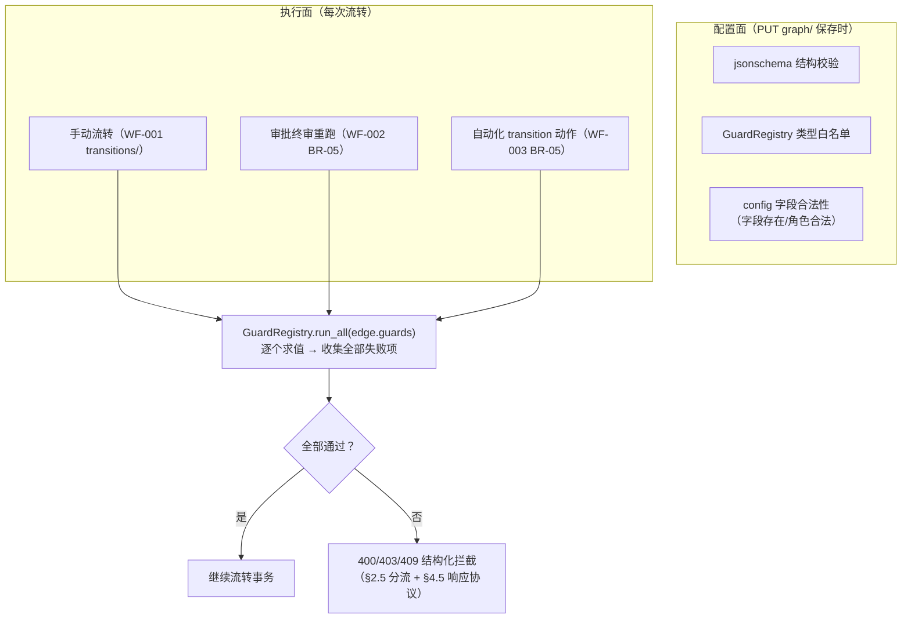
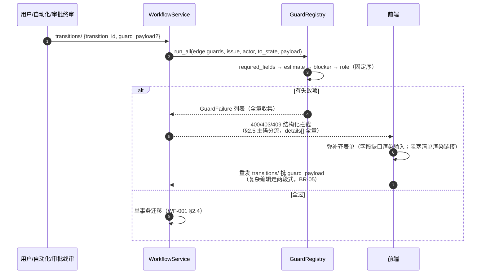

# WF-004 流转守卫与字段锁定

| 元信息项 | 内容 |
| --- | --- |
| 文档编号 | WF-004 |
| 所属迭代 | Sprint 7 — 企业工作流核心（第 9 周 D3-4 主线） |
| 优先级 | P3（企业版核心级） |
| 覆盖模块 | M5-WF 工作流与审批（守卫切面） |
| 工作量估算 | 5 人日（后端 3 + 前端 1.5 + QA 0.5） |
| 文档状态 | 待评审（Draft，R2 修复第 2 轮） |
| 最后更新日期 | 2026-09-04 |
| 上游依赖 | `WF-001`（`guards` 冻结协议、`WorkflowState.field_locks`、`GuardRegistry` 入口、`guard_payload` 单请求补齐参数、`resolve_workflow` 兜底链）、`TASK-005`（`blocker_completed` 既有拦截）、`TASK-006`（工时数据）、`TASK-008`（自定义字段校验） |
| 下游消费 | `WF-002`（终审守卫重跑）、`WF-003`（transition 动作走守卫）、`TASK-012`（字段级权限与守卫协同） |

---

## 1. 概述

### 1.1 功能定位

WF-004 把 WF-001 冻结的 `guards` JSONB 协议填充为**四类守卫的完整矩阵**，并交付配套能力：

1. **流转守卫矩阵**：`required_fields`（字段必填）/ `estimate_required`（工时必填）/ `blocker_completed`（前置依赖）/ `role_allowed`（角色权限）——按流转边独立配置，全部通过才放行。
2. **结构化拦截响应**：拦截不只是一句「不允许」，而是机器可读的缺失清单（缺哪些字段、哪些阻塞任务、需要哪个角色），前端据此弹出**就地补齐表单**，补齐后原动作自动重试——守卫是引导而非墙。
3. **字段锁定**：`WorkflowState.field_locks`——任务进入某状态后指定字段变为只读（如「已上线」后锁定截止日期），流转出该状态自动解锁。

### 1.2 守卫执行位置



> **收集全部失败项**而非短路返回第一条：用户补齐表单一打开就应看到所有缺口，避免「补一个冒一个」的打地鼠体验。

### 1.3 范围边界

| 范围 | 本文档交付 | 明确不做 |
| --- | --- | --- |
| 守卫类型 | 四类内置守卫 + 注册表扩展机制 | 自定义脚本守卫（P4）；跨项目依赖守卫（P4） |
| 拦截响应 | 结构化 details 协议 + 前端补齐表单 | 守卫豁免申请流（走 WF-002 审批语义，不另建） |
| 字段锁定 | 状态级锁定列表、进入/离开自动生效、解锁 Activity | 字段级「按角色可编辑」锁定（归 `TASK-012` 字段权限） |
| 强制通道 | `force=true` 管理员豁免（沿用 TASK-005 BR-09，扩展到全部守卫） | 普通成员豁免 |

### 1.4 前置依赖

| 依赖 | 内容 | 阻塞原因 |
| --- | --- | --- |
| `WF-001` §4.7 | guards 协议 schema、`GuardRegistry` 分发入口、`field_locks` 列 | 本文档全部挂点 |
| `TASK-005` §2.4 BR-06 / §4.3.3 | `blocker_completed` 既有读时判定（BLOCKER_SQL，判定域 = 仅迁入 `completed` 组） | 守卫化为注册项，**判定域不变**（§2.1） |
| `TASK-006` | `estimate_minutes` 与 WorkLog 汇总 | 工时守卫数据源 |
| `TASK-008` | `validate_custom_fields` 与字段 Schema API | 必填校验含自定义字段 |

### 1.5 竞品参考 + 跨文档登记

| 竞品 | 参考点 | 处置 |
| --- | --- | --- |
| Jira | Conditions（谁能流转）/ Validators（值是否合法）/ Post Functions 三段 | 合并为 guards 一类（WF-001 决策）；**Validators 的「补齐引导」Jira 无，本系统结构化拦截是差异点** |

> **跨文档登记（TASK-012 §4.4 access_map / hidden 字段豁免协议）**：本文档消费 TASK-012 §4.4 `access_map` 接口——`hidden` 字段（`access == 'hidden'`）在 §4.2 `RequiredFieldsGuard.check` 与 `FieldLockGuard.check` 取值前先按 `FieldPermissionService.resolve(actor, project, definitions)` 过滤：hidden 字段从 `required_fields` 守卫白名单中剔除（不参与必填补齐要求）；hidden 字段亦不进入 `field_locks` 拦截集（`locked_hit` 计算时跳过 hidden）。判定结果：hidden 字段不会因 `RequiredFieldsGuard` 失败抛 400 `REQUIRED`、也不会因 `FieldLockGuard` 抛 400 `FIELD_LOCKED`——sprint-overview §3 风险 5（字段权限四处不可见）的守卫侧闭环。**双向登记**：TASK-012 §1.5「WF-004 待同步登记（上游待回改）」自本迭代起同步生效；Task-012 §3.3 hidden 创建/编辑表单「该字段必填被豁免」渲染与本守卫豁免语义同源。
| Ones | 流转必填字段配置 + 拦截弹窗补录 | 体验对齐；拦截响应协议化（Ones 为前端特判，本系统 details 契约开放给任何客户端） |
| Plane | 无守卫能力 | 差异化卖点 |

---

## 2. 业务逻辑

### 2.1 四类守卫语义

| type | 语义 | config | 拦截产出（`error.details[]` 逐项，§4.5） |
| --- | --- | --- | --- |
| `required_fields` | 目标状态要求字段非空 | `{"fields": ["assignees", "target_date", "cf_6f4a8c2d-…"]}` | 逐缺失字段一项：`code=REQUIRED` + `meta`（字段元数据含类型/选项，供就地补录） |
| `estimate_required` | 要求已填预估工时（`estimate_minutes > 0`） | `{}`（可选 `{"min_minutes": 30}`） | 一项：`field=estimate_minutes`、`code=REQUIRED` + `meta`（含阈值） |
| `blocker_completed` | 阻塞方全部完成/取消（TASK-005 读时判定）——**判定域与 TASK-005 完全一致：仅迁入 `completed` 组的边求值**，迁入 `started`/`unstarted`/`cancelled` 不拦截（「先干能干的部分」原语义保持） | `{}` 或 `{"enabled": false}`（显式关闭默认守卫，需 `workflow.manage`） | 一项：`field=blockers`、`code=BLOCKED_BY` + `blockers` 清单（TASK-005 §4.3.3 键格式：id/issue_key/name/state_group） |
| `role_allowed` | 仅指定角色可执行此边 | `{"roles": ["PROJ_ADMIN", "custom:6f9c1e3a-5b7d-4f2a-9e4c-8d1b3a7f5c14"]}`——值域 = 项目角色码（`PROJ_*`）或自定义角色 `custom:<role_id>`（UUID v4，与 WF-001 §4.7 冻结同一格式） | 一项：`field=transition`、`code=ROLE_REQUIRED` + `required_roles` 清单 |

**空值判定**（`required_fields` 逐类型）：文本去空白后空 = 缺；数值 `null` = 缺（`0` 是合法值）；日期/单选 `null` = 缺；多选/负责人/标签空数组 = 缺；布尔不设必填（`false` 是值）；自定义字段按其 `field_type` 映射上述规则（TASK-008 §4 类型表）。

### 2.2 执行顺序与守卫叠加



| 规则点 | 取值 |
| --- | --- |
| 固定执行序 | `required_fields` → `estimate_required` → `blocker_completed` → `role_allowed`（字段类先于权限类——让补齐表单优先暴露业务缺口） |
| 隐式守卫 | `blocker_completed` 默认隐式存在（TASK-005 兼容），且**仅注入到目标状态 `group=completed` 的边**（判定域不扩大）；边上显式 `{"enabled": false}` 才关闭 |
| 与审批关系 | 守卫**先于**审批立案（WF-002 BR-01）；终审重跑同一入口 |
| 强制通道 | `force=true` + comment（PROJ_ADMIN，有效角色判定）跳过全部守卫；跳过事实落 Activity（`verb=updated` + `field="state.force"` 单字段特例——TASK-010 verb 冻结枚举 `created/updated/deleted` 不扩展，与 WF-001 `transition` / WF-002 `approval` 同范式、event_key 键空间共用；该载荷 `field` 扩展登记「TASK-010 待回改」），审计可查 |

### 2.3 字段锁定

| 规则 | 语义 |
| --- | --- |
| 配置 | `WorkflowState.field_locks = [{"field": "target_date"}, {"field": "cf_<uuid>"}]` |
| 生效 | 任务**处于**该状态期间，锁定字段只读：PATCH 含锁定字段 → `400 VALIDATION_ERROR` + `FIELD_LOCKED`（details 给锁定来源状态） |
| 解锁 | 流转离开该状态即自动解锁（读时判定，无物化列——与 TASK-005 拦截同理，锁定 = `issue.state → 当前生效工作流节点 field_locks` 的实时派生，工作流按 WF-001 §4.5 兜底链选定，见 §4.4） |
| 豁免 | `PROJ_ADMIN` 不受锁（走 `actor.has_role` 有效角色判定，非原始角色串比较，见 §4.4；落 Activity `verb=updated` + `field="field_locks.force"` 单字段特例，范式同 §2.2 强制通道）；锁定字段仍可被守卫要求补齐——`guard_payload` 值在迁移事务内直接写入（迁移边上的写不受字段锁拦截，锁仅拦独立 PATCH 路径的 `IssueUpdateSerializer`，见 §4.3；管理员 force 路径同理） |
| 系统字段保护 | `state/parent/sequence_id` 等引擎字段不可配置锁定（保存校验拒绝） |
| Activity | 因锁定被拒的修改尝试**不落** Activity（未生效无动态）；强制修改落 `verb=updated` + `field="field_locks.force"`（范式同 §2.2） |

### 2.4 业务规则汇总

| 编号 | 规则 | 判定位置 | 违反后果 |
| --- | --- | --- | --- |
| BR-01 | 守卫按边配置、互不影响；同边多守卫全量求值收集全部失败 | GuardRegistry | — |
| BR-02 | 未知 guard type / 非法 config 在 `PUT graph/` 保存时拒绝（WF-001 §4.7 契约） | Serializer | `400 VALIDATION_ERROR` + `NOT_A_CHOICE` |
| BR-03 | `required_fields` 字段必须存在于项目字段集（含 cf_ Schema 校验） | 保存校验 | `400 VALIDATION_ERROR` + `DOES_NOT_EXIST` |
| BR-04 | 拦截响应遵循 §4.5 协议：`error.details` 为数组且**全量**，逐项 `{field, code, message}` + 扩展键（`guard`/`meta`/`blockers`/`required_roles`），每个失败守卫至少贡献一项 | 引擎 | 前端契约 |
| BR-05 | 补齐重试对齐 WF-001 引擎：**首选单请求**——重发 `transitions/` 时以 `guard_payload` 携带补齐值（WF-001 §4.8②，值经守卫非空校验 + §4.2 值层校验后，在同一迁移事务内 `issue.save(update_fields=…)` 落库并迁移，机制见 §4.3）；**两段式兜底**（先 PATCH 补字段再重发，不带 `guard_payload`）保留给需走完整 PATCH 校验链（`IssueUpdateSerializer` 全量校验）/可能触发锁定的复杂编辑 | 前端流程 + 引擎 | — |
| BR-06 | `force=true` 仅 PROJ_ADMIN（`actor.has_role` 有效角色判定）且 comment 必填；落 Activity `verb=updated` + `field="state.force"`（单字段特例，范式与待回改登记见 §2.2） | Service | `403 PERM_ROLE_INSUFFICIENT` / `400 VALIDATION_ERROR` + `REQUIRED` |
| BR-07 | 字段锁定读时派生：按 WF-001 §4.5 兜底链选定当前生效工作流，取任务当前状态节点 `field_locks`，无物化 | Serializer | — |
| BR-08 | 锁定字段 PATCH 拒绝；PROJ_ADMIN 豁免留痕（有效角色判定） | Serializer | `400 VALIDATION_ERROR` + `FIELD_LOCKED` |
| BR-09 | 引擎字段（state/parent 等）不可被锁定配置 | 保存校验 | `400 VALIDATION_ERROR` |
| BR-10 | 守卫求值只读——执行器禁止写库（注册表约束 + code review 红线） | GuardRegistry | 评审拒绝 |
| BR-11 | 审批终审/自动化 transition 与手动流转共用同一守卫入口，无任何旁路 | 引擎 | 评审拒绝 |
| BR-12 | 详情接口暴露任务当前状态生效锁集 `locked_fields: [str]`；与 TASK-002 详情冻结契约兼容（仅追加字段，不改既有键；`field_locks` 求值走 §4.4 `current_field_locks`，按兜底链 + 类型专属 + 默认工作流优先级取值） | Issue 详情 Service | `404 RESOURCE_NOT_FOUND`（行级过滤不可见时，rbac §6） |
| BR-13 | `guard_payload` 值层校验失败码：assignees 不存在 → `DOES_NOT_EXIST`；日期格式非法 → `INVALID_DATE`；cf_* 自定义字段非法 → `VALIDATION_CUSTOM_FIELD_INVALID`（与 TASK-008 §4.3.2 同源） | `guard_payload` 值层校验 | `400 VALIDATION_ERROR` + 上述子码 |
| BR-12 | `blocker_completed` 显式关闭需 `workflow.manage` 权限，且关闭事实写入图版本 Activity | 保存校验 | `403 PERM_ROLE_INSUFFICIENT` |
| BR-13 | 守卫失败计数计入 `transitions/available/` 预览：`blocked_by` 作为**新增键**挂在 WF-001 §4.8① 冻结项结构上（不改既有键，与 `requires_payload` 分工见 §4.6），列表态即可见 | 预览查询 | — |

### 2.5 异常处理

错误码全部使用架构预留码（`api-conventions` §8.3/§8.4/§8.5，与 WF-001 §4.8③ 错误矩阵一致），不另立新码：

| 场景 | HTTP | 错误码 | `details[].code` | 前端表现 |
| --- | --- | --- | --- | --- |
| 字段必填缺失 | 400 | `VALIDATION_REQUIRED_FIELD_MISSING` | `REQUIRED`（逐缺失字段一项，附 `meta`） | 补齐表单（字段输入区） |
| 工时未填（无字段类失败并存） | 400 | `VALIDATION_ESTIMATE_REQUIRED` | `REQUIRED`（`field=estimate_minutes`） | 补齐表单（工时输入） |
| 阻塞未完成 | 409 | `RESOURCE_TRANSITION_BLOCKED` | `BLOCKED_BY`（`field=blockers`，附 `blockers` 清单） | 阻塞清单 + 跳转 + 管理员强制入口 |
| 角色不符 | 403 | `PERM_TRANSITION_NOT_ALLOWED` | `ROLE_REQUIRED`（`field=transition`，附 `required_roles`） | Toast「该流转需 XX 角色」，不弹补齐表单 |
| 多守卫同时失败 | 按下方分流规则取主码 | 主码同上（403 > 400 必填 > 409 阻塞） | 数组全量（每失败守卫至少一项） | 分区表单（字段区 + 阻塞区） |
| 锁定字段修改 | 400 | `VALIDATION_ERROR` | `FIELD_LOCKED`（`message` 给锁定来源状态） | 字段灰显 tooltip「在状态 X 中锁定」 |
| 强制豁免缺 comment | 400 | `VALIDATION_ERROR` | `REQUIRED` | comment 框标红 |
| 强制豁免非管理员 | 403 | `PERM_ROLE_INSUFFICIENT` | — | 入口按权限快照隐藏（AUTH-005） |
| 守卫配置非法（保存时） | 400 | `VALIDATION_ERROR` | `NOT_A_CHOICE`（未知 type）/ `DOES_NOT_EXIST`（字段不存在） | 画布侧栏行内报错定位 |

**主码分流规则**（多守卫同时失败时响应只取一个主码，`details[]` 与主码无关地全量携带）：

1. `role_allowed` 失败在场 → `403 PERM_TRANSITION_NOT_ALLOWED`（角色不满足时补齐无意义，前端只 Toast 不弹表单）；
2. 否则必填类在场 → `400`：有 `required_fields` 失败取 `VALIDATION_REQUIRED_FIELD_MISSING`（含 `estimate_required` 并存场景），仅工时失败取 `VALIDATION_ESTIMATE_REQUIRED`；
3. 否则 → `409 RESOURCE_TRANSITION_BLOCKED`。

> **字段级子码登记**：`REQUIRED` / `NOT_A_CHOICE` / `DOES_NOT_EXIST` 直用 `api-conventions` §8.8 既有条目；`BLOCKED_BY` / `FIELD_LOCKED` / `ROLE_REQUIRED` / `LIMIT`（单边守卫数 8 / required_fields 字段数 20 / 锁定字段数 20 超限）为本迭代新增 `details[].code` 字段级子码，不占用全局错误码注册表，交付时统一按 TASK-005 §2.5 同款模式在 §8.8 补登——**架构文档待回改登记**（sprint-overview §10.3 纪律：随 Sprint 7 首个 PR 同步补登；TASK-005 §2.5 原文为「待补登」而非「已登记补登」，本文档原误述「BLOCKED_BY 已由 TASK-005 §2.5 登记补登」已删除）。

### 2.6 边界条件

| 边界场景 | 限制值 | 超出处理 |
| --- | --- | --- |
| 单边守卫数 | 8 | 保存拒绝 `LIMIT` |
| `required_fields` 字段数 | 20 | 同上 |
| 锁定字段数（单状态） | 20 | 同上 |
| 守卫求值耗时 | P95 < 30ms（四守卫合计，含在 WF-001 `transitions/` P95 < 100ms 端点预算内） | 超时告警（求值全内存 + 一次 blockers JOIN） |
| 循环补齐（补 A 缺 B） | 无限制 | 每次拦截返回全量缺口，收敛靠全量协议 |
| 并发补齐（两人同时补不同字段） | 各自 PATCH 生效 | 重发 transitions/ 时以最新任务状态求值 |

---

## 3. UI/UX 设计

### 3.1 拦截补齐对话框（核心交互）

```
┌─ 无法完成「提交评审」—— 请补齐以下内容 ───────────────────────────┐
│                                                                  │
│ 缺少必填字段（2）                                                 │
│  ┌────────────────────────────────────────────────────────────┐  │
│  │ 负责人 *        [选择成员…                            ▾]   │  │
│  │ 截止日期 *      [2026-09-12] 📅                            │  │
│  └────────────────────────────────────────────────────────────┘  │
│                                                                  │
│ 前置任务未完成（2）                                               │
│  ┌────────────────────────────────────────────────────────────┐  │
│  │ ⊘ PROJ-121 接口联调           进行中     [前往处理 →]       │  │
│  │ ⊘ PROJ-122 测试用例评审       待开始     [前往处理 →]       │  │
│  └────────────────────────────────────────────────────────────┘  │
│                                                                  │
│           [取消]                    [保存并重新提交]              │
│  ─────────────────────────────────────────────────────────────  │
│  管理员：[⚡ 强制流转（需填写原因）]                               │
└──────────────────────────────────────────────────────────────────┘
```

| 元素 | 行为 |
| --- | --- |
| 字段输入区 | 按 `error.details[]` 中 `guard` 为字段类项的 `meta`（类型/选项/校验规则）渲染对应控件——与任务详情字段编辑器同组件（复用 TASK-012 字段渲染器） |
| 阻塞清单 | 点击新标签打开任务；全部完成后本区自动转绿（5s 轮询或 WS） |
| 「保存并重新提交」 | 首选单请求：表单值以 `guard_payload` 随重发 transitions/ 一并提交（BR-05）；复杂编辑走两段式（PATCH 字段 → 重发）；任一步失败展示对应错误 |
| 强制流转 | 仅 PROJ_ADMIN 可见（按权限快照渲染，AUTH-005；服务端仍二次校验 BR-06）；展开 comment 输入，必填后才可提交 |

### 3.2 流转按钮预览态（看板/详情）

`transitions/available/` 返回每边 `blocked_by`（BR-13）：未满足的守卫在按钮 tooltip/下拉项上预标记（如「提交评审 · 缺 2 项」灰点徽标），用户**在点击前**即知缺口，点击直接进补齐对话框而非先失败一次。

### 3.3 画布守卫配置侧栏

```
┌─ 流转「提交评审」守卫 ─────────────┐
│ [+ 添加守卫 ▾]                     │
│  ├ 必填字段                        │
│  │   负责人、截止日期        [×]   │
│  ├ 工时必填（≥30min）        [×]   │
│  ├ 前置依赖完成（迁入已完成 [关闭] │
│  │   组的边默认开启）               │
│  └ 角色限定                 [×]    │
│     PROJ_ADMIN · 产品经理          │
│     （custom:6f9c1e3a…）           │
│ 保存后随图发布生效                  │
└───────────────────────────────────┘
```

### 3.4 字段锁定呈现

| 位置 | 呈现 |
| --- | --- |
| 详情页锁定字段 | 输入控件灰显 + 🔒 图标，tooltip「在状态「已上线」中锁定 · 管理员可改」 |
| 锁定字段被强制修改 | Activity 显示「X 强制修改了锁定字段 截止日期：…→…」 |
| 画布状态节点 | 节点侧栏「字段锁定」列表（与守卫配置并列） |

---

## 4. 技术架构

### 4.1 GuardRegistry（注册表与执行器）

```python
class Guard(ABC):
    """守卫执行器协议（BR-10：只读；check 返回 None=通过，GuardFailure=失败）"""
    type: str
    config_schema: dict                     # jsonschema，PUT graph/ 保存时校验（BR-02）

    @abstractmethod
    def check(self, *, config: dict, issue: Issue, actor: User,
              to_state: "State | None", payload: dict | None) -> "GuardFailure | None": ...


class GuardRegistry:
    def __init__(self):
        self._guards: dict[str, Guard] = {}

    def register(self, guard: Guard): self._guards[guard.type] = guard

    def validate_configs(self, guards: list[dict], project: Project):     # 保存时
        for i, g in enumerate(guards):
            guard = self._guards.get(g.get("type"))
            if not guard:
                raise ValidationError("NOT_A_CHOICE", path=f"guards[{i}].type",
                                      allowed=sorted(self._guards))
            jsonschema.validate(g.get("config", {}), guard.config_schema)
            guard.validate_business(g.get("config", {}), project)         # BR-03 字段存在性

    def run_all(self, guards: list[dict], *, issue: Issue, actor: User,
                to_state: "State | None" = None, payload: dict | None = None,
                include_implicit: bool = True) -> list["GuardFailure"]:
        # 入口签名对齐 WF-001 §4.4 引擎调用（guards, issue=, actor=, payload=），
        # 增补 to_state 实参供守卫域判定，随本迭代合入引擎侧调用点
        effective = list(guards)
        if (include_implicit and to_state is not None and to_state.group == "completed"
                and not any(g["type"] == "blocker_completed" for g in guards)):
            effective.append({"type": "blocker_completed", "config": {}})
            # 隐式默认——仅注入迁入 completed 组的边，判定域与 TASK-005 完全一致（§2.1）
        failures = []
        for g in sorted(effective, key=lambda x: EXECUTION_ORDER.index(x["type"])):
            guard = self._guards[g["type"]]
            if g.get("config", {}).get("enabled") is False: continue       # 显式关闭
            if failure := guard.check(config=g["config"], issue=issue, actor=actor,
                                      to_state=to_state, payload=payload):
                failures.append(failure)
        return failures


EXECUTION_ORDER = ["required_fields", "estimate_required", "blocker_completed", "role_allowed"]
GUARD_REGISTRY = GuardRegistry()
```

### 4.2 四类守卫实现

```python
@dataclass
class GuardFailure:
    """守卫失败 → 逐项映射为拦截响应 error.details[] 的条目（§4.5）"""
    type: str                 # 守卫 type，落到每项的 guard 键
    items: list[dict]         # 每项 {field, code, message, guard} + 扩展键


def failures_payload(failures: list["GuardFailure"]) -> list[dict]:
    return [item for f in failures for item in f.items]    # 拍平为 details[]


class RequiredFieldsGuard(Guard):
    type = "required_fields"
    config_schema = {"type": "object", "properties": {
        "fields": {"type": "array", "items": {"type": "string"}, "maxItems": 20}},
        "required": ["fields"]}

    def check(self, *, config, issue, actor, to_state, payload):
        def value_of(f):
            if payload and f in payload:                   # guard_payload 优先（BR-05 单请求补齐）
                return payload[f]
            return resolve_field(issue, f)
        missing = [f for f in config["fields"] if is_empty(value_of(f))]
        if not missing:
            return None
        return GuardFailure(self.type, [
            {"field": f, "code": "REQUIRED", "guard": self.type,
             "message": f"缺少必填字段：{field_label(f)}",
             "meta": field_meta(f, issue.project)} for f in missing])
            # meta 含 label/type/options/校验规则——前端直接渲染补录控件（§3.1）


class EstimateRequiredGuard(Guard):
    type = "estimate_required"
    config_schema = {"type": "object", "properties": {
        "min_minutes": {"type": "integer", "minimum": 1}}}

    def check(self, *, config, issue, actor, to_state, payload):
        threshold = config.get("min_minutes", 1)
        minutes = (payload.get("estimate_minutes", issue.estimate_minutes)
                   if payload else issue.estimate_minutes)
        if (minutes or 0) >= threshold:
            return None
        return GuardFailure(self.type, [{
            "field": "estimate_minutes", "code": "REQUIRED", "guard": self.type,
            "message": "需填写预估工时后方可流转",
            "meta": field_meta("estimate", issue.project) | {"min_minutes": threshold}}])


class BlockerCompletedGuard(Guard):
    """TASK-005 §4.3.3 读时判定的守卫化封装（同一 SQL、同一判定域，双入口）"""
    type = "blocker_completed"
    config_schema = {"type": "object", "properties": {"enabled": {"type": "boolean"}}}

    def check(self, *, config, issue, actor, to_state, payload):
        if (to_state is None or to_state.group != "completed"
                or issue.state.group == "completed"):
            return None   # 判定域与 assert_completable 完全一致：仅「迁入 completed」拦截，
                          # 显式配置也不扩大域——守卫化不改变 TASK-005 拦截语义
        with connection.cursor() as cursor:
            cursor.execute(BLOCKER_SQL, {"me": issue.id})   # TASK-005 §4.3.3 原句
            rows = cursor.fetchall()
        if not rows:
            return None
        return GuardFailure(self.type, [{
            "field": "blockers", "code": "BLOCKED_BY", "guard": self.type,
            "message": f"{len(rows)} 个前置任务未完成",
            "blockers": [{"id": r[0],
                          "issue_key": f"{issue.project.identifier}-{r[1]}",
                          "name": r[2], "state_group": r[3]} for r in rows]}])
            # 键格式与 TASK-005 TransitionBlockedError 逐字一致（WF-001 §4.8③ 同引）


class RoleAllowedGuard(Guard):
    type = "role_allowed"
    config_schema = {"type": "object", "properties": {
        "roles": {"type": "array", "items": {"type": "string"}, "minItems": 1}},
        "required": ["roles"]}

    def check(self, *, config, issue, actor, to_state, payload):
        if has_any_role(actor, issue.project, config["roles"]):
            return None
        return GuardFailure(self.type, [{
            "field": "transition", "code": "ROLE_REQUIRED", "guard": self.type,
            "message": "当前角色不可执行此流转", "required_roles": config["roles"]}])
```

> **`guard_payload` 值层校验**（BR-05 单请求路径，引擎在迁移事务内**内联执行**，非独立 PATCH 路径；在守卫本体 `is_empty` 判空之外补齐值合法性，任一失败整事务回滚）：`assignees` 走成员资格校验（必须是当前项目 active `ProjectMember`，TASK-001 BR-5 同构——任一非成员回滚 `400 VALIDATION_ERROR` + `DOES_NOT_EXIST`）；日期（`target_date`）走格式校验（非法日期串 `400 VALIDATION_ERROR`）；`cf_*` 走 TASK-008 `validate_field_value(definition, value)` 原函数内联调用（自定义键不经校验不落库）；其余字段同各自 PATCH 校验规则。两段式兜底（§4.7 `saveAndRetryTwoStep`）**不经此路径**——值层校验由 `IssueUpdateSerializer` 完整 PATCH 校验链承担（BR-05）。

> `role_allowed.roles` 值域与 WF-001 §4.7 冻结逐字一致：项目角色码（`PROJ_*`）或自定义角色 `custom:<role_id>`（UUID v4；Sprint 8 交付自定义角色数据源前该前缀恒不命中，解析能力现役）。`has_any_role` 走**有效角色判定**（`actor.has_role`，TASK-005 §4.3.3 同款），与 §4.4 锁定豁免、BR-06 强制通道同一口径——不比较原始角色字符串，角色继承/委派来源变化零改动。

### 4.3 引擎挂接（WF-001 事务内）

```python
# WorkflowService.transition 内部（WF-001 §4.4 既有位置展开；run_all 增补 to_state 实参）
failures = GUARD_REGISTRY.run_all(matched_edge.guards, issue=issue, actor=actor,
                                  to_state=to_state, payload=guard_payload)
if failures and not force:
    raise guard_error(failures)             # §2.5 主码分流：403 > 400 必填 > 409，details[] 全量
if failures and force:
    if not actor.has_role("PROJ_ADMIN", project_id=issue.project_id):   # BR-06 有效角色判定
        raise ApiError(403, "PERM_ROLE_INSUFFICIENT")
    require_comment(payload)                # 缺失 → 400 VALIDATION_ERROR + REQUIRED
# 守卫全过（或 force 通过 BR-06 校验）后：guard_payload 值同事务落库（BR-05 单请求补齐闭环）
if guard_payload:
    guarded_fields = apply_guard_payload(issue, guard_payload)
    # 值层校验在此内联（§4.2 注：成员资格 / 日期格式 / cf_* validate_field_value）——
    # 迁移边上的写不经 IssueUpdateSerializer，不受字段锁拦截（§2.3：锁仅拦独立 PATCH 路径）
    issue.save(update_fields=guarded_fields)   # 与状态迁移同一事务（WF-001 §2.4），任一步失败全回滚


def guard_error(failures: list[GuardFailure]) -> ApiError:
    """主码分流（§2.5）：details[] 全量与主码无关地携带"""
    details = failures_payload(failures)
    if any(i["guard"] == "role_allowed" for i in details):
        return ApiError(403, "PERM_TRANSITION_NOT_ALLOWED", details=details)
    if any(i["guard"] == "required_fields" for i in details):
        return ApiError(400, "VALIDATION_REQUIRED_FIELD_MISSING", details=details)
    if any(i["guard"] == "estimate_required" for i in details):
        return ApiError(400, "VALIDATION_ESTIMATE_REQUIRED", details=details)
    return ApiError(409, "RESOURCE_TRANSITION_BLOCKED", details=details)
```

### 4.4 字段锁定实现

```python
# issues/serializers.py —— IssueUpdateSerializer.validate（TASK-002 既有入口扩展）
LOCK_BYPASS_ROLES = ("PROJ_ADMIN",)

def validate(self, attrs):
    actor = self.context["request"].user
    locks = current_field_locks(self.instance)          # 兜底链 + 读时派生（BR-07）
    locked_hit = [l["field"] for l in locks if l["field"] in attrs]
    if locked_hit and not any(actor.has_role(r, project_id=self.instance.project_id)
                              for r in LOCK_BYPASS_ROLES):
        # 有效角色判定（TASK-005 §4.3.3 同款）——不做原始 user_project_role 字符串比较，
        # 角色继承/委派等有效角色来源变化时零改动
        raise ValidationError([
            {"field": f, "code": "FIELD_LOCKED",
             "message": f"字段在状态「{self.instance.state.name}」中锁定，流转出该状态自动解锁"}
            for f in locked_hit])                       # → 400 VALIDATION_ERROR（§2.5）
    if locked_hit:  # 管理员强制路径：标记留痕 → Activity verb=updated + field="field_locks.force"
        self.context["force_field_locks"] = locked_hit
    return attrs

def current_field_locks(issue: Issue) -> list[dict]:
    """读时派生（BR-07）：先按 WF-001 §4.5 兜底链选定「当前生效工作流」，再取该图
    内当前状态节点的 field_locks。同一 State 可能同时是类型专属与默认工作流的
    节点——必须先定工作流再取节点，禁止跨工作流混合取值；无工作流项目 → 空锁
    （零行为变化）。"""
    wf = WorkflowService().resolve_workflow(issue)      # 缓存复用（WF-001 §4.5，不新增解析查询）
    if wf is None:
        return []
    node = (WorkflowState.objects.filter(workflow=wf, state=issue.state)
            .only("field_locks").order_by("pk").first())
    # (workflow, state) 唯一约束下至多一行；order_by("pk") 保证约束演化下取值确定性
    return node.field_locks if node else []
```

> 查询预算：`current_field_locks` 每 PATCH 一次点查（`resolve_workflow` 缓存命中的工作流 + `workflow+state` 唯一索引），P95 < 2ms；列表渲染锁图标走批量预取（视图结果已含 state，按生效工作流单查 `IN` 节点集）。

### 4.5 拦截响应协议（冻结契约）

遵循全局信封（`api-conventions` §4.2，无例外）：`status` 为字符串字面量、`request_id` 在 `error` 内、`error.details` 为数组——每个失败守卫贡献至少一项 `{field, code, message}`，扩展键挂在项上：

```json
{
  "status": "error",
  "error": {
    "code": "VALIDATION_REQUIRED_FIELD_MISSING",
    "message": "流转被 2 项守卫拦截：2 个必填字段缺失、2 个前置任务未完成",
    "details": [
      { "field": "assignees", "code": "REQUIRED", "guard": "required_fields",
        "message": "缺少必填字段：负责人",
        "meta": { "label": "负责人", "type": "members", "options_url": "…/members/" } },
      { "field": "target_date", "code": "REQUIRED", "guard": "required_fields",
        "message": "缺少必填字段：截止日期",
        "meta": { "label": "截止日期", "type": "date" } },
      { "field": "blockers", "code": "BLOCKED_BY", "guard": "blocker_completed",
        "message": "2 个前置任务未完成",
        "blockers": [
          { "id": "7d2e9a4f-3c6b-4e8d-a1f5-9b0c3d7e5a21", "issue_key": "PROJ-121",
            "name": "接口联调", "state_group": "started" },
          { "id": "8e3f0b5a-4d7c-4f9e-b2a6-0c1d4e8f6b32", "issue_key": "PROJ-122",
            "name": "测试用例评审", "state_group": "unstarted" }
        ] }
    ],
    "request_id": "01J9CX8M2P4R6T1V3Y5Z7B9DQF"
  }
}
```

| 契约点 | 说明 |
| --- | --- |
| `error.details` 必为数组且全量 | 信封唯一结构化槽位（§4.2 无例外）；前端分区渲染的唯一数据源 |
| `guard` 键标产出守卫 | 前端按 `guard` 分区渲染（字段区/阻塞区），不靠 message 文案猜测 |
| `meta`（字段类项）取自字段渲染注册表（§4.9） | 前端零特判渲染补录控件 |
| 主码按 §2.5 分流（403/400/409，全部架构预留码） | `details` 全量与主码无关；角色失败在场时前端只 Toast 不弹表单 |
| 强制入口可见性不由拦截响应承载 | 信封无扩展位——前端按权限快照（AUTH-005）+ `available/` 预览渲染，服务端仍二次校验（BR-06） |

### 4.6 API 增量

守卫配置本身走 WF-001 `PUT …/workflow/graph/`（无新端点）；新增面：

| 端点 | 变化 | 说明 |
| --- | --- | --- |
| `GET …/issues/{id}/transitions/available/` | 每边新增 `blocked_by: [{type, count}]` 预览（BR-13），挂在 WF-001 §4.8① 冻结项结构上 | 预览 = 轻量守卫求值（仅计数，不生成 `details`/`meta`） |
| `GET …/issues/{id}/`（详情） | 响应新增字段 `locked_fields: [str]`（任务当前状态生效锁集，§4.4 `current_field_locks` 读时派生，同一点查预算） | §4.7 前端字段编辑器置灰 + 🔒 的数据源 |
| `PATCH …/issues/{id}/` | 新增 `FIELD_LOCKED` 错误子码 | §4.4 |
| `POST …/issues/{id}/transitions/` | `force=true` + `comment` 参数扩展（TASK-005 已有，现覆盖全部守卫）；补齐值经 `guard_payload` 携带（WF-001 §4.8②，BR-05） | BR-06 |

**available 响应片段**（项结构、字段名与 WF-001 §4.8① 冻结契约逐字一致，`blocked_by` 为本迭代新增键）：

```json
{
  "status": "success",
  "data": {
    "workflow": { "id": "7b1e9a2c-4d3f-4c8e-a1b2-9f0d6e5c4a10", "name": "研发需求流程", "version": 2 },
    "current_state": { "id": "3f2c8e6a-1b4d-4e9f-8a7c-2d5b9e4f1a01", "name": "待办", "group": "unstarted", "color": "#F59E0B" },
    "available": [
      { "transition_id": "5d4a7c1e-9b3f-4a2e-8c6d-1e0f3a5b7c02",
        "name": "提交评审",
        "to_state": { "id": "8c5d2f7a-3e1b-4c9d-b2a8-7f4e6d1c3a03", "name": "评审中", "group": "started", "color": "#3B82F6" },
        "requires_payload": ["assignees", "target_date"],
        "has_approval": false,
        "allowed": true,
        "blocked_by": [ { "type": "required_fields", "count": 2 },
                        { "type": "blocker_completed", "count": 2 } ] },
      { "transition_id": "6e3b5a8d-2c7f-4b1e-9d4a-5c8b2f0e6d04",
        "name": "直接关闭",
        "to_state": { "id": "9a7e4c2b-8d1f-4e3a-b5c9-2d6f8a1e4c05", "name": "已关闭", "group": "completed", "color": "#10B981" },
        "requires_payload": [],
        "has_approval": true,
        "allowed": false,
        "deny_reason": "PERM_TRANSITION_NOT_ALLOWED",
        "blocked_by": [] }
    ],
    "fallback": false
  }
}
```

> **`requires_payload` 与 `blocked_by` 分工**（不重叠，BR-13）：`requires_payload` 是 WF-001 §4.8 冻结的**配置态**字段键预聚合（静态——表单该渲染哪些输入，与任务当前值无关）；`blocked_by` 是本迭代新增的**执行态**轻量求值计数（动态——此刻实际未满足的守卫与缺口数）。前者恒为后者中字段类项（`required_fields`/`estimate_required`）对应字段键的超集（配置 ⊇ 当前缺口）；`role_allowed` 不满足只体现在 `allowed:false` + `deny_reason`（WF-001 冻结语义），不进 `blocked_by`。

### 4.7 前端实现

```tsx
// apps/web/features/workflow/guardDialogStore.ts
export class GuardDialogStore {
  @observable open = false;
  @observable failures: GuardItem[] = [];   // = 拦截响应 error.details[]（§4.5：{field, code, message, guard, …}）
  @observable transition: TransitionEdge | null = null;

  @computed get missingFields() {
    return this.failures.filter(
      f => f.guard === "required_fields" || f.guard === "estimate_required");
  }
  @computed get blockers() {
    return this.failures.find(f => f.guard === "blocker_completed")?.blockers ?? [];
  }

  /** 补齐 → 重试闭环（BR-05 首选路径：guard_payload 单请求，WF-001 §4.8②） */
  async saveAndRetry(fieldValues: Record<string, unknown>) {
    const issueId = this.transition!.issueId;
    try {
      const res = await api.post(`${issueUrl(issueId)}transitions/`, {
        transition_id: this.transition!.id,
        guard_payload: fieldValues,         // 值经守卫判空+值层校验后在同一迁移事务内落库（§4.3）
      });
      runInAction(() => (this.open = false));
      kanbanStore.applyMove(res.data.issue);
    } catch (e) {
      if (isGuardBlocked(e)) this.setFailures(e.error.details);   // 新一轮缺口
      else throw e;
    }
  }

  /** 两段式兜底（BR-05）：guard_payload 不适用的编辑走 PATCH 完整校验链再重发 */
  async saveAndRetryTwoStep(fieldValues: Record<string, unknown>) {
    await api.patch(issueUrl(this.transition!.issueId), fieldValues);  // 可能 FIELD_LOCKED
    return this.saveAndRetry({});          // 重发不带补齐值，按最新任务状态求值
  }
}
```

拦截入口（统一在 `runTransition` 封装内，看板拖拽/详情按钮/列表批量三处复用）：

```tsx
catch (e) {
  if (isGuardBlocked(e)) guardDialog.openWith(edge, e.error.details);
  else if (e.error?.code === "PERM_TRANSITION_NOT_ALLOWED") toast.warn(e.error.message);
  else throw e;
}
```

锁定字段渲染：字段编辑器读取 `issue.locked_fields`（详情接口随任务返回当前锁集）置灰 + 🔒。

### 4.8 性能预算

端点总预算对齐 WF-001 §7.2 现行口径（`transitions/` P95 < 100ms、`available/` P95 < 50ms），守卫开销在其内**独立声明**：

| 路径 | 预算 | 手段 |
| --- | --- | --- |
| 守卫全量求值（四守卫） | P95 < 30ms（含在 WF-001 `transitions/` P95 < 100ms 内） | 全内存 + blockers 单次 JOIN（TASK-005 双索引） |
| `available/` 端点（含预览） | 端点 P95 < 50ms（WF-001 §7.2 冻结口径，不可突破）；其中守卫轻量求值单列 P95 < 15ms | 计数模式（不生成 `details`/`meta`） |
| 锁定判定（PATCH） | +2ms | 单点查 + 结果随请求缓存 |
| 列表锁图标 | 零额外查询 | 视图结果预取节点锁集 `IN` 单查 |

### 4.9 空值判定与字段渲染类型注册表

**空值判定矩阵**（`is_empty` 实现规格，UT-01 真值源）：

| 字段类型 | 视为空的值 | 非空示例（边界） |
| --- | --- | --- |
| 文本（name/description_html/cf_text） | `null`、`""`、全空白 | `"0"`、单个空格除外的任意字符 |
| 数值（estimate/cf_number） | `null` | `0`（合法值，非空） |
| 日期（target_date/cf_date） | `null` | 任意合法日期（含过去） |
| 单选（priority/state/cf_select） | `null` | 任意选项 |
| 多选（labels/cf_multi） | `null`、`[]` | 单元素数组 |
| 成员（assignees） | 空关联 | 任一成员（含已停用账号——停用不抹除事实） |
| 布尔（cf_boolean） | 不支持必填（保存校验拒绝配置） | — |
| 关联（parent/links） | 不支持必填（语义不明） | — |

**前端补录控件注册表**（`error.details[].meta.type` → 组件，与任务详情字段编辑器同源）：

| type | 组件 | 数据源 |
| --- | --- | --- |
| `text` / `textarea` | `<TextField>` | — |
| `number` / `estimate` | `<NumberField>`（estimate 带分钟快捷 chips：30/60/120/240） | — |
| `date` / `datetime` | `<DatePicker>` | — |
| `select` / `priority` | `<SelectDropdown>` | 内联 `options` |
| `multi` / `labels` | `<MultiSelect>` | 内联 `options` / 标签接口 |
| `members` | `<MemberPicker>` | `options_url`（成员搜索，PROJ-002 组件复用） |
| `cf_*` | 按 TASK-012 字段渲染器分派 | Schema API（ETag 缓存） |

> 注册表即「字段渲染单一真相」：详情页、补齐对话框、批量编辑（BOARD-004）三处共用，新增字段类型只改注册表。

---

## 5. 测试用例

### 5.1 单元测试

| 编号 | 用例 | 断言 |
| --- | --- | --- |
| UT-01 | 空值判定矩阵（7 类型 × 空/非空） | 文本空白/数值 0/空数组等边界全对 |
| UT-02 | 隐式 `blocker_completed` 注入与判定域 | 未配置时对**迁入 `completed` 组**的边默认生效；对迁入 `started`/`unstarted`/`cancelled` 的边**不注入不求值**（TASK-005 原语义）；`enabled:false` 关闭 |
| UT-02b | `enabled:false` 显式关闭留痕（BR-12） | 关闭事实写入图版本 Activity `verb=updated` + `field="guards.enabled"`（TASK-010 verb 冻结枚举不扩展，单字段特例范式同 §2.2）；无 `workflow.manage` 权限保存拒绝 `403 PERM_ROLE_INSUFFICIENT` |
| UT-03 | 固定执行序 | 失败列表顺序 = required→estimate→blocker→role |
| UT-04 | 全量收集 | 三守卫失败 `details[]` 含 3 个守卫各自的条目（不短路） |
| UT-05 | `min_minutes` 阈值 | estimate 29/30/31 边界 |
| UT-06 | 未知 type 保存拒绝 | `NOT_A_CHOICE` + allowed 枚举 |
| UT-07 | cf_ 字段必填（Schema 校验集成） | 不存在字段 `DOES_NOT_EXIST`（§8.8 既有子码） |
| UT-08 | 角色守卫：项目角色码（`PROJ_ADMIN`）与自定义角色（`custom:<role_id>`，UUID v4，WF-001 §4.7 现行格式）双源 | 不命中：403 `PERM_TRANSITION_NOT_ALLOWED`，`details[]` 含 `guard="role_allowed"` 项且 `required_roles` 与配置全量一致；命中：守卫通过、流转放行 |
| UT-09 | 锁定读时派生（兜底链） | 状态 A 锁、状态 B 不锁、无工作流项目零锁；同一 State 同存类型专属与默认工作流节点时按 WF-001 §4.5 兜底链取**类型专属**工作流节点的锁，`order_by("pk")` 取值确定 |
| UT-10 | 锁定 PATCH 拒绝 / 管理员豁免留痕 | `FIELD_LOCKED` / Activity `verb=updated` + `field="field_locks.force"` |
| UT-11 | 引擎字段不可锁定 | 保存 `state` 入 field_locks 拒绝 |
| UT-12 | force 跳过全部守卫 + comment 必填 | Activity `verb=updated` + `field="state.force"` 含原失败清单 |
| UT-13 | 守卫执行器只读约束 | mock 断言求值过程零写查询 |
| UT-14 | 预览 `blocked_by` 计数 | 与全量求值结果计数一致 |
| UT-15 | §2.5 主码分流并存：`role_allowed` + `required_fields` 同时失败 | HTTP 主码 403 `PERM_TRANSITION_NOT_ALLOWED`；`details[]` 全量同时含字段项（`REQUIRED`）与角色项（`ROLE_REQUIRED` + `required_roles`），非仅角色项 |

### 5.2 集成测试

| 编号 | 用例 | 断言 |
| --- | --- | --- |
| IT-01 | 补齐闭环双路径：结构化拦截（400/409）→ `guard_payload` 单请求重发成功；两段式（PATCH 字段 → 重发不带 `guard_payload`）亦通过 | 双路径状态码正确；Activity 含字段变更+流转（BR-05） |
| IT-02 | 审批终审重跑（WF-002 BR-05 联调） | 挂起期间字段被清空 → 终审 terminated |
| IT-03 | 自动化 transition 走守卫（WF-003 BR-05 联调） | 守卫失败 run=failed 含明细 |
| IT-04 | 看板拖拽乐观回弹 + 对话框 | 卡片回弹、缺口渲染、补齐后落位 |
| IT-05 | 锁定跨状态流转 | 进入锁定态 PATCH 拒、转出后放开 |
| IT-06 | force 通道审计 | 非管理员 403 `PERM_ROLE_INSUFFICIENT`（有效角色判定）；管理员成功且 Activity 完整 |
| IT-07 | 默认工作流项目（未配置）回归 | 行为与 V1.0 完全一致（引擎走 `assert_completable` 兜底，仅迁入 `completed` 的 blocker 拦截生效，判定域不变） |
| IT-08 | 多客户端契约 | 拦截 details 可被通用客户端按 §4.5 渲染（契约测试） |

### 5.3 E2E 测试

| 编号 | 场景 | 断言 |
| --- | --- | --- |
| E2E-01 | 拖拽触发双守卫拦截 → 对话框补齐 → 自动重试成功 | 全流程无刷新 |
| E2E-02 | 阻塞清单点击跳转 → 完成前置 → 对话框阻塞区转绿 | 状态联动 |
| E2E-03 | 预览徽标：按钮「缺 2 项」点击直接开对话框 | 未经失败轮 |
| E2E-04 | 锁定字段灰显 + tooltip；管理员可改且留痕 | 两角色对照 |
| E2E-05 | 画布配置守卫 → 发布 → 生效 | 端到端配置链 |
| E2E-06 | 角色限定：普通成员按钮禁用 + 直连 403 `PERM_TRANSITION_NOT_ALLOWED` | 双路径 |

---

## 6. 竞品深度对标

### 6.1 Jira Conditions/Validators 分析

| 观察点 | Jira 做法 | 本系统决策 |
| --- | --- | --- |
| 条件 vs 验证器 | Conditions 决定按钮是否可见；Validators 提交时校验值 | 合并为 guards（WF-001）；可见性用 `available/blocked_by` 预览表达（等价 Conditions 的可发现性，且不禁用按钮避免「按钮消失」困惑） |
| 拦截反馈 | Validator 失败仅一条文本消息 | **结构化全量缺口 + 就地补齐**——Jira 用户需来回试错，本系统一轮收敛 |
| 扩展 | 插件可注册 Condition/Validator | `GuardRegistry.register` 同构扩展点，新增类型零表变更 |
| 字段锁定 | 无原生能力（靠权限方案 hack） | `field_locks` 一等公民，读时派生零维护 |

### 6.2 Ones 流转必填分析

| 观察点 | Ones 做法 | 本系统决策 |
| --- | --- | --- |
| 必填拦截弹窗补录 | 有，体验对齐目标 | §3.1 对齐 |
| 拦截协议 | 前端特判字段集，客户端耦合 | details 契约化（§4.5），任何客户端可渲染 |
| 工时必填 | 无 | `estimate_required` 差异化（研发流程刚需） |

### 6.3 本系统设计决策汇总

1. **读时判定双支柱**：拦截（blocker）与锁定（field_locks）都无物化列——状态派生永不过期，零级联维护（继承 TASK-005 决策哲学）。
2. **三入口同一守卫**：手动/审批终审/自动化共用 `run_all`，无旁路——守卫语义单一真相。
3. **403 / 400 / 409 三段分流，全部架构预留码**：角色类（不可补）403 `PERM_TRANSITION_NOT_ALLOWED`、必填缺失（可补）400 `VALIDATION_REQUIRED_FIELD_MISSING`/`VALIDATION_ESTIMATE_REQUIRED`、前置阻塞（可处理）409 `RESOURCE_TRANSITION_BLOCKED`（`api-conventions` §8.3/§8.4/§8.5，与 WF-001 §4.8③ 一致）——前端交互分叉由协议承载，不靠文案猜测。
4. **隐式守卫可关不可删**：`blocker_completed` 默认开启保持 V1.0 语义，显式关闭需 `workflow.manage` 并留痕——兼容与灵活两全。

---

## 7. 里程碑与验收

### 7.1 交付物清单

| 类别 | 产物 |
| --- | --- |
| 后端 | `GuardRegistry` + 四守卫执行器、引擎挂接（403/400/409 主码分流，§2.5）、字段锁定 Serializer 拦截、`available/` 预览扩展 |
| 协议 | §4.5 拦截响应冻结契约（`error.details[]` 全量结构，信封合规） |
| 前端 | 拦截补齐对话框（字段区+阻塞区+强制入口）、预览徽标、锁定字段灰显、画布守卫/锁定配置侧栏 |
| 测试 | UT-01~15（含 UT-02b）、IT-01~08、E2E-01~06 |

### 7.2 可操作演示的验收标准

1. 画布为「提交评审」边配置 2 必填字段 + 工时必填（≥30min）+ 角色限定，发布后四守卫各自独立拦截验证。
2. 双守卫同时拦截：对话框同时呈现字段区与阻塞区；补齐字段 + 完成前置后「保存并重新提交」以 `guard_payload` 单请求一次成功（BR-05，两段式路径另验）。
3. 审批终审重跑：挂起期间清空必填字段，终审通过时实例终止且任务未迁移。
4. 自动化 transition 动作触发守卫失败，run=failed 且明细含守卫结构。
5. 字段锁定：任务进入「已上线」后截止日期灰显不可改；PROJ_ADMIN 强制修改落 Activity `verb=updated` + `field="field_locks.force"`；流转出状态后恢复可编辑。
6. 预览：可用流转接口返回 `blocked_by` 计数，按钮徽标与点击后对话框内容一致。
7. 回归：未配置工作流的项目全量行为与 V1.0 一致（仅迁入 `completed` 的 blocker 拦截生效，判定域不变）。
8. 性能：四守卫求值 P95 < 30ms（1 万次采样，含在 WF-001 `transitions/` P95 < 100ms 内）；`available/` 端点 P95 < 50ms（WF-001 §7.2 口径，守卫预览开销单列 ≤ 15ms 含在内）。