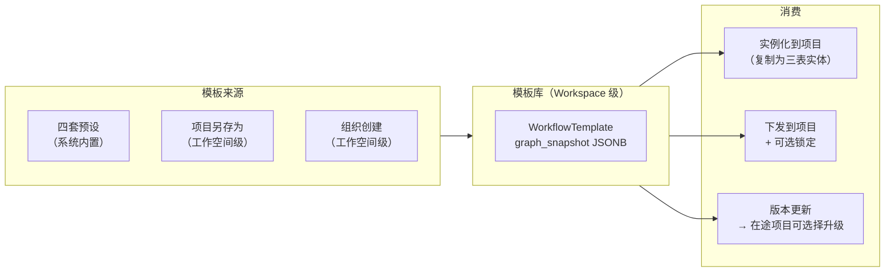
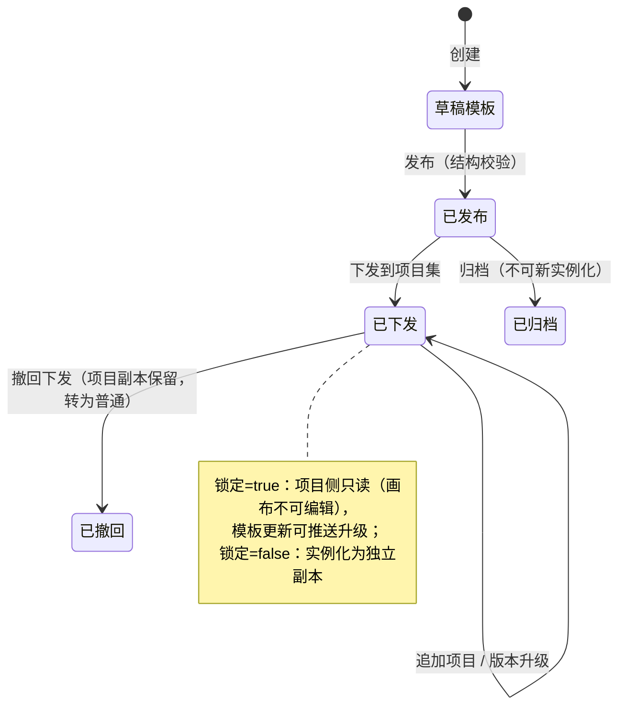

# WF-005 工作流模板库与全局下发

| 元信息项 | 内容 |
| --- | --- |
| 文档编号 | WF-005 |
| 所属迭代 | Sprint 7 — 企业工作流核心（第 10 周 D3-4 主线） |
| 优先级 | P3（企业版核心级） |
| 覆盖模块 | M5-WF 工作流与审批（模板切面） |
| 工作量估算 | 4 人日（后端 2 + 前端 1.5 + QA 0.5） |
| 文档状态 | 待评审（Draft） |
| 最后更新日期 | 2026-09-01 |
| 上游依赖 | `WF-001`（三表模型与草稿/发布）、`WF-002`（审批流可随模板预置）、`WF-004`（守卫随模板预置） |
| 下游消费 | Sprint 8 组织治理（组织级配置权审计）、`TEAM-003`（全局模板配置同源思想） |

---

## 1. 概述

### 1.1 功能定位

WF-005 交付**工作流模板库**：把工作流图（状态/流转/守卫/审批引用）序列化为可复用模板，三条价值线：

1. **预设模板**：研发需求 / 缺陷修复 / 测试上线 / 日常任务四套开箱模板，新项目一分钟获得成熟流程。
2. **自定义模板**：项目把调好的工作流「另存为模板」，在工作空间内复用。
3. **组织下发**：工作空间级模板可**下发**到指定/全部项目，并可**锁定**（项目只读使用，统一治理）——企业流程标准化的抓手。

### 1.2 模板生命周期



> **实例化 = 复制而非引用**（锁定除外）：模板是「模具」，项目拿到的是独立副本，后续项目侧修改不回写模板——避免「改一个项目、全组织流程突变」的灾难面。锁定模板是唯一的引用式例外（§2.3）。

### 1.3 范围边界

| 范围 | 本文档交付 | 明确不做 |
| --- | --- | --- |
| 模板 CRUD | 工作空间级模板库、graph_snapshot 序列化协议 | 跨组织模板市场（P4） |
| 实例化 | 应用到项目（新建/既有项目）、冲突合并策略 | 实例化回滚（用 WF-001 草稿/发布回退替代） |
| 下发与锁定 | 按项目下发、锁定只读、解锁、下发记录 | 按部门批量下发（依赖 Sprint 8 组织架构，V1.1） |
| 版本 | 模板版本号、项目侧升级提示 | 模板 diff 可视化（P4） |

### 1.4 前置依赖

| 依赖 | 内容 | 阻塞原因 |
| --- | --- | --- |
| `WF-001` §4.2 | 三表模型、草稿/发布、`issue_type` 绑定 | 序列化目标结构 |
| `WF-002` §4.2 | ApprovalFlow/Node 结构 | 模板含审批引用 |
| `WF-004` §4.1 | guards config schema | 序列化校验 |

### 1.5 竞品参考

| 竞品 | 参考点 | 处置 |
| --- | --- | --- |
| Jira | Workflow Scheme 全局共享 + 项目关联 | **刻意不学共享引用**（Jira 改 scheme 影响所有关联项目是著名事故面）；采纳其「模板命名与描述」管理面 |
| Ones | 流程模板中心 + 组织下发 | 功能面对齐；下发记录与锁定语义对齐 |
| Plane | 无模板 | 差异化卖点 |

---

## 2. 业务逻辑

### 2.1 模板数据（业务视图）

`graph_snapshot` 是模板的唯一内容载体——WF-001 三表的**自包含序列化**：

```json
{
  "version": 3,
  "issue_types": ["requirement"],
  "states": [
    {"key": "s_backlog", "name": "待规划", "group": "backlog", "color": "#9ca3af", "is_initial": true},
    {"key": "s_todo",    "name": "待开发", "group": "unstarted", "color": "#f59e0b"},
    {"key": "s_dev",     "name": "开发中", "group": "started",   "color": "#3b82f6",
     "field_locks": []},
    {"key": "s_review",  "name": "评审中", "group": "started",   "color": "#8b5cf6"},
    {"key": "s_done",    "name": "已完成", "group": "completed", "color": "#22c55e",
     "field_locks": [{"field": "due_date"}]}
  ],
  "transitions": [
    {"key": "t1", "from": "s_dev", "to": "s_review", "name": "提交评审",
     "guards": [{"type": "required_fields", "config": {"fields": ["assignees", "due_date"]}},
                {"type": "blocker_completed", "config": {}}],
     "side_effects": [],
     "approval": {"name": "研发上线审批", "nodes": [
       {"level": 1, "pass_mode": "any", "approver_type": "role",
        "approver_config": {"role": "PROJ_ADMIN"}, "timeout_hours": 24}]}}
  ],
  "automation_rules": []
}
```

| 协议点 | 说明 |
| --- | --- |
| `key` 为模板内符号引用 | 实例化时映射为新生成的 UUID（状态/流转/审批全部新建，不复用模板内 id） |
| `group` 必须属于五语义组 | 实例化校验；未知 group 拒绝 |
| 审批内联定义（非引用） | 实例化时按定义新建 `ApprovalFlow/Node`（同名冲突自动加后缀） |
| `version` | 序列化协议版本（非模板版本）；解析器按版本分派，向前兼容 |
| 自动化规则可随模板 | 默认空；预置规则同样内联定义实例化 |

### 2.2 四套预设模板

| 模板 | 状态流 | 预置守卫/审批 | 适用 |
| --- | --- | --- | --- |
| 研发需求 | 待规划→待开发→开发中→评审中→已完成（+已取消） | 提交评审：必填负责人/截止 + 前置依赖 + 逐级审批（技术→产品） | 需求类型 |
| 缺陷修复 | 待确认→修复中→待验证→已关闭（+已取消） | 待验证→已关闭：角色限定（测试）；修复中→待验证：必填修复方案字段 | 缺陷类型 |
| 测试上线 | 待提测→测试中→待上线→已上线（+已取消） | 已上线锁定截止/版本字段；待上线：或签审批（运维/值班） | 发布类型 |
| 日常任务 | 待开始→进行中→已完成（+已取消） | 无守卫（轻量） | 默认兜底 |

**预设明细（状态 × 语义组 × 流转 × 守卫/审批全表）**：

| 模板 | 状态（group） | 流转边（name） | 边上配置 |
| --- | --- | --- | --- |
| 研发需求 | 待规划(backlog) / 待开发(unstarted) / 开发中(started) / 评审中(started) / 已完成(completed) / 已取消(cancelled) | 规划→待开发（纳入规划）；待开发→开发中（开始开发）；开发中→评审中（提交评审）；评审中→已完成（通过）；评审中→开发中（打回）；任意→已取消 | 提交评审：`required_fields[assignees,due_date]` + `blocker_completed` + 逐级审批 L1 技术负责人（或签 role）→ L2 产品负责人（单人）；打回：`role_allowed[PROJ_ADMIN, custom:tech_lead]`；通过：`estimate_required` |
| 缺陷修复 | 待确认(backlog) / 修复中(started) / 待验证(started) / 已关闭(completed) / 已取消(cancelled) | 待确认→修复中（确认缺陷）；修复中→待验证（提交修复）；待验证→已关闭（验证通过）；待验证→修复中（验证失败）；任意→已取消 | 提交修复：`required_fields[cf_fix_solution]`（自定义字段「修复方案」）；验证通过：`role_allowed[custom:tester]` |
| 测试上线 | 待提测(unstarted) / 测试中(started) / 待上线(started) / 已上线(completed) / 已取消(cancelled) | 待提测→测试中（开始测试）；测试中→待上线（测试通过）；待上线→已上线（发布）；测试中→待提测（打回）；任意→已取消 | 发布：或签审批（运维/值班角色，24h 超时）；已上线节点 `field_locks: [due_date, cf_release_version]` |
| 日常任务 | 待开始(unstarted) / 进行中(started) / 已完成(completed) / 已取消(cancelled) | 两两全通（自由流转） | 无（隐式 `blocker_completed` 仍生效） |

### 2.3 「研发需求」模板快照示例（节选关键结构）

```json
{
  "version": 3,
  "issue_types": ["requirement"],
  "states": [
    {"key": "s1", "name": "待规划", "group": "backlog",   "color": "#9ca3af", "is_initial": true,  "layout": {"x": 0,   "y": 120}},
    {"key": "s2", "name": "待开发", "group": "unstarted", "color": "#f59e0b", "layout": {"x": 220, "y": 120}},
    {"key": "s3", "name": "开发中", "group": "started",   "color": "#3b82f6", "layout": {"x": 440, "y": 120}},
    {"key": "s4", "name": "评审中", "group": "started",   "color": "#8b5cf6", "layout": {"x": 660, "y": 120}},
    {"key": "s5", "name": "已完成", "group": "completed", "color": "#22c55e", "layout": {"x": 880, "y": 60},
     "field_locks": [{"field": "due_date"}]},
    {"key": "s6", "name": "已取消", "group": "cancelled", "color": "#6b7280", "layout": {"x": 880, "y": 200}}
  ],
  "transitions": [
    {"key": "t1", "from": "s1", "to": "s2", "name": "纳入规划", "guards": [], "side_effects": []},
    {"key": "t2", "from": "s2", "to": "s3", "name": "开始开发",
     "guards": [{"type": "required_fields", "config": {"fields": ["assignees"]}}]},
    {"key": "t3", "from": "s3", "to": "s4", "name": "提交评审",
     "guards": [
       {"type": "required_fields", "config": {"fields": ["assignees", "due_date"]}},
       {"type": "blocker_completed", "config": {}}
     ],
     "side_effects": [{"type": "notify", "config": {"channel": "inbox", "targets": ["watchers"]}}],
     "approval": {"key": "a1", "name": "研发上线审批", "forbid_self_approve": true, "nodes": [
       {"level": 1, "pass_mode": "any", "approver_type": "role",
        "approver_config": {"role": "custom:tech_lead"}, "timeout_hours": 24},
       {"level": 2, "pass_mode": "any", "approver_type": "role",
        "approver_config": {"role": "custom:product_owner"}, "timeout_hours": 48}
     ]}},
    {"key": "t4", "from": "s4", "to": "s5", "name": "通过",
     "guards": [{"type": "estimate_required", "config": {}}]},
    {"key": "t5", "from": "s4", "to": "s3", "name": "打回",
     "guards": [{"type": "role_allowed", "config": {"roles": ["PROJ_ADMIN", "custom:tech_lead"]}}]},
    {"key": "t6", "from": "*", "to": "s6", "name": "取消",
     "guards": [{"type": "role_allowed", "config": {"roles": ["PROJ_ADMIN"]}}]}
  ],
  "automation_rules": [
    {"name": "高优需求进评审→提醒产品组",
     "trigger": {"type": "state_changed", "config": {"to_state_key": "s4"}},
     "conditions": [{"field": "priority", "op": "in", "value": ["high", "urgent"]}],
     "actions": [{"type": "notify", "config": {"channel": "inbox", "targets": ["role:product_owner"]}}],
     "dedup_window_minutes": 60}
  ]
}
```

> `"from": "*"` 为通配源（任意状态可取消）；实例化展开为显式边集合（WF-001 模型无通配，展开后每源一条边）。`custom:tech_lead` 等自定义角色引用在 Sprint 8（AUTH-008）角色体系就位前，实例化时降级为 `PROJ_ADMIN` 并在向导中明示降级项。

### 2.3 下发与锁定



| 机制 | 规则 |
| --- | --- |
| 下发 | 选择项目集（全部/指定）；非锁定 = 逐项目执行实例化；锁定 = 项目工作流记录 `locked_by_template` 引用 |
| 锁定语义 | 项目侧画布只读（查看可、编辑禁）；流转/守卫/审批照常生效；项目可申请解锁（WS_ADMIN 审批后转独立副本） |
| 模板更新推送 | 模板新版本发布后，锁定项目收到「升级可用」提示；WS_ADMIN 确认后**替换式升级**（在途任务状态按 group 映射到新图，§2.4） |
| 撤回下发 | 锁定项目转独立副本（解除引用，内容冻结为当下版本）；已实例化的非锁定项目无影响 |

### 2.4 实例化与升级的状态映射

既有项目应用模板时，在途任务状态需迁移：

| 场景 | 策略 |
| --- | --- |
| 同名同 group 状态 | 直接复用项目现有状态（不新建） |
| 模板有、项目无 | 新建状态（`State.issue_type` 激活） |
| 项目有、模板无（在途任务占用） | 迁移向导：逐状态指定映射目标（默认映射到同 group 首个状态）；未占用状态可保留或清理 |
| 升级（锁定模板新版） | 同上映射；映射单随升级记录留痕 |

### 2.5 业务规则汇总

| 编号 | 规则 | 判定位置 | 违反后果 |
| --- | --- | --- | --- |
| BR-01 | 模板为 Workspace 级实体；创建/编辑/下发需 WS_ADMIN（`workflow.manage` 组织侧）；项目成员可见可用 | Permission | `403 PERM_DENIED` |
| BR-02 | `graph_snapshot` 保存即全量校验（协议版本、五语义组、守卫/审批 schema、边连通性——复用 WF-001 `validate_for_publish`） | Serializer | `400 VALIDATION_ERROR` 定位路径 |
| BR-03 | 实例化 = 深拷贝新建（状态/流转/审批 UUID 全新，key 映射表一次性重建） | 实例化服务 | 评审拒绝引用式实现（锁定除外） |
| BR-04 | 锁定项目画布只读：图保存接口拒绝（`409 RESOURCE_LOCKED`），UI 只读 | Service | `409 RESOURCE_LOCKED` |
| BR-05 | 锁定项目升级需 WS_ADMIN 确认；状态映射单必填且留痕 | 升级服务 | 缺映射 `400` |
| BR-06 | 模板不可删除被锁定引用的版本；归档后不可新实例化，存量引用不受影响 | Service | `409 RESOURCE_IN_USE` |
| BR-07 | 预设模板不可编辑/删除（`is_builtin`），可「另存为」派生 | Service | `403 PERM_DENIED` |
| BR-08 | 实例化到既有项目必须走迁移向导（状态映射），禁止静默丢弃状态 | 向导流程 | 未映射状态阻塞提交 |
| BR-09 | 模板操作（创建/发布/下发/升级/撤回/解锁）全量落审计（WF-006/AUTH-010 管道） | on_commit | — |
| BR-10 | 同名审批流实例化自动加后缀（`研发上线审批 (2)`），保证唯一约束不炸 | 实例化服务 | — |
| BR-11 | 下发按项目幂等：重复下发同版本为 no-op（返回已下发状态） | 下发服务 | — |
| BR-12 | 模板库规模：单 Workspace ≤ 100 模板 | Service | `409 RESOURCE_LIMIT_EXCEEDED` |

### 2.6 异常处理

| 场景 | HTTP | 错误码 | details 子码 | 前端表现 |
| --- | --- | --- | --- | --- |
| 快照协议版本未知 | 400 | `VALIDATION_ERROR` | `UNSUPPORTED_VERSION` | 「模板来自更新版本，请升级系统」 |
| 图结构校验失败 | 400 | `VALIDATION_ERROR` | `INVALID_GRAPH` | 错误定位到状态/边 |
| 非 WS_ADMIN 下发/锁定 | 403 | `PERM_DENIED` | — | 入口隐藏 |
| 锁定项目编辑图 | 409 | `RESOURCE_LOCKED` | `TEMPLATE_LOCKED` | 「本工作流由组织模板锁定」+ 申请解锁入口 |
| 删除被引用模板 | 409 | `RESOURCE_IN_USE` | `IN_USE` | 列出锁定项目清单 |
| 编辑内置模板 | 403 | `PERM_DENIED` | `BUILTIN` | 引导「另存为」 |
| 迁移向导缺映射 | 400 | `VALIDATION_ERROR` | `REQUIRED` | 未映射状态标红 |
| 超配额 | 409 | `RESOURCE_LIMIT_EXCEEDED` | `TEMPLATE_LIMIT` | — |

### 2.7 边界条件

| 边界场景 | 限制值 | 超出处理 |
| --- | --- | --- |
| 单 Workspace 模板数 | 100 | `409 RESOURCE_LIMIT_EXCEEDED` |
| 单次下发项目数 | 200 | 分批任务（Celery 逐项目实例化） |
| 快照体积 | 256KB | 保存拒绝 `PAYLOAD_TOO_LARGE` |
| 在途任务迁移规模 | 无硬限 | 映射 UPDATE 分批 1000 行 |
| 并发下发与项目编辑 | 实例化单事务 | 后到者基于新图继续 |

---

## 3. UI/UX 设计

### 3.1 模板库（工作空间设置 · 工作流模板）

```
┌──────────────────────────────────────────────────────────────────────┐
│ 工作空间设置 / 工作流模板                        [+ 新建模板]         │
├──────────────────────────────────────────────────────────────────────┤
│ 内置                                                                 │
│  ┌────────────┐ ┌────────────┐ ┌────────────┐ ┌────────────┐         │
│  │ 研发需求    │ │ 缺陷修复    │ │ 测试上线    │ │ 日常任务    │        │
│  │ 5 状态·6 边 │ │ 4 状态·5 边│ │ 4 状态·5 边│ │ 3 状态·3 边│        │
│  │ 2 守卫·审批 │ │ 2 守卫      │ │ 1 守卫·审批│ │ 轻量       │         │
│  │ [使用][预览]│ │ [使用][预览]│ │ [使用][预览]│ │ [使用][预览]│        │
│  └────────────┘ └────────────┘ └────────────┘ └────────────┘         │
│ 组织模板                                                             │
│  ● 硬件研发流程 v3        已下发 8 项目（锁定 🔒）   [管理下发][编辑] │
│  ● 市场部活动流程 v1      已发布（未下发）            [下发][编辑]    │
│  ○ 外包协作流程           草稿                        [发布][编辑]    │
└──────────────────────────────────────────────────────────────────────┘
```

### 3.2 应用/下发向导

```
┌─ 应用模板「研发需求」 ────────────────────────────────────────────┐
│ 步骤 2/3 · 状态映射                                               │
│ 模板状态 → 项目状态                                               │
│  待规划 → [待规划（复用现有） ▾]                                  │
│  评审中 → [+ 新建状态]                                            │
│  ⚠ 项目现有「联调中」不在模板中（12 个在途任务占用）：             │
│          迁移到 → [开发中 ▾]                                      │
│ 步骤 3/3 · 生效范围                                               │
│  任务类型：[需求 ▾]   生效方式：[草稿预览后发布 ▾]                 │
│                              [上一步]  [应用]                     │
└──────────────────────────────────────────────────────────────────┘
```

| 步骤 | 内容 |
| --- | --- |
| 1 选择目标 | 新建项目勾选模板 / 既有项目从模板库「使用」；下发流由 WS_ADMIN 多选项目 + 锁定开关 |
| 2 状态映射 | §2.4 三策略可视化；占用数实时展示 |
| 3 生效方式 | 生成草稿（WF-001 草稿机制，可画布预览微调）或直接发布；锁定下发则只读生效 |

### 3.3 项目侧锁定呈现

| 位置 | 呈现 |
| --- | --- |
| 画布顶部横幅 | 「本工作流由组织模板「硬件研发流程 v3」锁定 · [查看模板] [申请解锁]」 |
| 画布编辑 | 全部编辑控件禁用（拖拽/侧栏保存），查看与模拟流转可用 |
| 升级提示 | 模板新版发布 → 横幅「模板 v4 可用 · [查看变更摘要] [申请升级]」（PROJ_ADMIN 可见申请，WS_ADMIN 可直接升级） |

---

## 4. 技术架构

### 4.1 模型定义

```python
class WorkflowTemplate(BaseModel):
    """工作流模板（Workspace 级；is_builtin 预设不可改，BR-07）"""

    class Status(models.TextChoices):
        DRAFT = "draft", "草稿"
        PUBLISHED = "published", "已发布"
        ARCHIVED = "archived", "已归档"

    workspace = models.ForeignKey(Workspace, on_delete=models.CASCADE, related_name="workflow_templates")
    name = models.CharField(max_length=64)
    description = models.CharField(max_length=255, blank=True, default="")
    version = models.PositiveIntegerField(default=1, verbose_name="模板版本（发布递增）")
    status = models.CharField(max_length=8, choices=Status.choices, default=Status.DRAFT)
    is_builtin = models.BooleanField(default=False)
    graph_snapshot = models.JSONField(help_text="§2.1 序列化协议；BR-02 保存即校验")
    created_by = models.ForeignKey(User, on_delete=models.PROTECT, related_name="+")

    class Meta(BaseModel.Meta):
        db_table = "workflow_templates"
        constraints = [
            models.UniqueConstraint(fields=["workspace", "name", "version"],
                                    name="uniq_template_name_version"),
        ]
        indexes = [models.Index(fields=["workspace", "status"], name="idx_template_ws")]


class TemplateDistribution(BaseModel):
    """下发记录：模板 × 项目（锁定引用的唯一事实源，BR-04/06）"""

    template = models.ForeignKey(WorkflowTemplate, on_delete=models.CASCADE,
                                 related_name="distributions")
    project = models.ForeignKey(Project, on_delete=models.CASCADE, related_name="template_distributions")
    template_version = models.PositiveIntegerField(verbose_name="下发时模板版本")
    locked = models.BooleanField(default=False)
    applied_workflow = models.ForeignKey("Workflow", null=True, on_delete=models.SET_NULL,
                                         related_name="+", verbose_name="实例化产物")
    status = models.CharField(max_length=16, default="active",
        help_text="active|upgrade_available|withdrawn|unlocked")
    state_mapping = models.JSONField(default=dict, verbose_name="BR-05 映射单留痕")

    class Meta(BaseModel.Meta):
        db_table = "template_distributions"
        constraints = [
            models.UniqueConstraint(fields=["template", "project"], name="uniq_distribution"),
        ]
```

### 4.2 实例化服务

```python
class TemplateInstantiator:
    """graph_snapshot → 项目三表实体（深拷贝，BR-03）+ 可选审批/规则实例化"""

    @transaction.atomic
    def instantiate(self, *, template, project, issue_type, state_mapping: dict,
                    actor) -> Workflow:
        snap = parse_snapshot(template.graph_snapshot)          # 版本分派 + 全量校验（BR-02）
        wf = Workflow.objects.create(project=project, issue_type=issue_type,
                                     name=f"{template.name} v{template.version}",
                                     status="draft")            # 先生成草稿（BR-08 向导可预览）
        key_map: dict[str, State] = {}
        for s in snap.states:
            state = self._reuse_or_create_state(project, s, state_mapping, issue_type)
            node = WorkflowState.objects.create(
                workflow=wf, state=state, is_initial=s.is_initial,
                layout_x=s.layout.get("x", 0), layout_y=s.layout.get("y", 0),
                field_locks=s.field_locks)
            key_map[s.key] = node
        approval_map = self._instantiate_approvals(snap, project)      # BR-10 同名后缀
        for t in snap.transitions:
            WorkflowTransition.objects.create(
                workflow=wf, from_state=key_map[t.from_key], to_state=key_map[t.to_key],
                name=t.name, guards=t.guards, side_effects=t.side_effects,
                approval_flow=approval_map.get(t.approval_key))
        self._instantiate_rules(snap, project, actor)
        self._migrate_inflight_issues(project, issue_type, state_mapping)  # §2.4 分批 UPDATE
        transaction.on_commit(lambda: emit_audit.delay(                 # BR-09
            kind="template.instantiated", project_id=str(project.id),
            payload={"template": template.name, "version": template.version}))
        return wf
```

**锁定判定**（WF-001 图保存入口的统一前置）：

```python
def assert_graph_editable(project: Project):
    dist = TemplateDistribution.objects.filter(
        project=project, locked=True, status__in=["active", "upgrade_available"]).first()
    if dist:
        raise ApiError(409, "RESOURCE_LOCKED", sub="TEMPLATE_LOCKED",
                       details={"template": dist.template.name, "version": dist.template_version})
```

### 4.3 下发与升级 worker

```python
@app.task(queue="workflow")
def distribute_template(template_id: str, project_ids: list[str], locked: bool, actor_id: str):
    """逐项目实例化（幂等 BR-11：同版本已下发跳过）；失败项目独立记录不阻塞整批"""
    template = WorkflowTemplate.objects.get(id=template_id)
    for pid in project_ids:
        dist = TemplateDistribution.objects.filter(template=template, project_id=pid).first()
        if dist and dist.template_version == template.version and dist.locked == locked:
            continue                                            # no-op
        try:
            wf = TemplateInstantiator().instantiate(
                template=template, project_id=pid, actor_id=actor_id, ...)
            TemplateDistribution.objects.update_or_create(
                template=template, project_id=pid,
                defaults={"template_version": template.version, "locked": locked,
                          "applied_workflow": wf, "status": "active"})
        except Exception as e:
            report_distribution_failure(template, pid, e)       # 汇总通知 WS_ADMIN
```

### 4.4 API 定义

| 方法 | 路径 | 说明 | 权限 |
| --- | --- | --- | --- |
| GET | `/api/v1/ws/{slug}/workflow-templates/` | 模板库（含内置） | 成员读 |
| POST | 同上 | 创建模板 | WS_ADMIN |
| GET/PATCH/DELETE | `…/workflow-templates/{tid}/` | 详情/更新/删除（BR-06/07 约束） | WS_ADMIN |
| POST | `…/workflow-templates/{tid}/publish/` | 发布（version+1 快照冻结） | WS_ADMIN |
| POST | `…/workflow-templates/{tid}/save-as/` | 另存为（内置派生入口） | 成员 |
| POST | `…/workflow-templates/{tid}/distribute/` | 下发 `{project_ids, locked}` | WS_ADMIN |
| POST | `…/workflow-templates/{tid}/withdraw/` | 撤回下发 `{project_ids}` | WS_ADMIN |
| POST | `/api/v1/ws/{slug}/projects/{id}/workflow/apply-template/` | 项目实例化（含 state_mapping） | `workflow.manage` |
| POST | `…/projects/{id}/workflow/unlock-request/` | 申请解锁/升级 | PROJ_ADMIN |

**下发响应（异步批量）**：

```json
{
  "status": 0,
  "data": {
    "accepted": true,
    "projects": 8,
    "skipped_uptodate": 2,
    "task": "distribute_template:01J9F…"
  },
  "meta": {"message": "下发已受理，失败项目将汇总通知"}
}
```

**锁定项目编辑被拒**：

```json
{
  "status": 1,
  "error": {
    "code": "RESOURCE_LOCKED",
    "message": "本工作流由组织模板「硬件研发流程 v3」锁定",
    "details": {"sub_code": "TEMPLATE_LOCKED", "template": "硬件研发流程", "version": 3},
    "request_id": "01J9FK2M4P6R8T1V3X5Z7B9DAC"
  }
}
```

### 4.5 前端实现

```tsx
// apps/web/features/workflow-template/templateStore.ts
export class WorkflowTemplateStore {
  @observable templates: WorkflowTemplate[] = [];

  @computed get builtins() { return this.templates.filter(t => t.is_builtin); }
  @computed get customs()  { return this.templates.filter(t => !t.is_builtin); }

  async applyToProject(tplId: string, projectId: string, mapping: StateMapping, issueType: string) {
    const { data } = await api.post(`/ws/:slug/projects/${projectId}/workflow/apply-template/`, {
      template_id: tplId, state_mapping: mapping, issue_type: issueType, publish: false,
    });
    return data.workflow_id;                     // → 跳画布草稿预览（WF-001）
  }

  async distribute(tplId: string, projectIds: string[], locked: boolean) {
    return api.post(templateUrl(tplId) + "distribute/", { project_ids: projectIds, locked });
  }
}
```

画布只读模式：`workflow.locked_by_template` 存在时 `<ReactFlow nodesDraggable={false} …>` + 侧栏保存按钮替换为横幅（§3.3）。

### 4.6 性能预算

| 路径 | 预算 | 手段 |
| --- | --- | --- |
| 模板库列表 | P95 < 150ms | `idx_template_ws` + 快照不返回列表（仅元数据） |
| 实例化（含 1 万在途迁移） | < 10s | 单事务 + 分批 UPDATE；大项目走 Celery |
| 锁定判定 | +1ms/请求 | 项目请求上下文缓存（中间件一次性加载） |
| 下发批量（200 项目） | 后台 < 5min | 逐项目任务 + 失败隔离 |

---

## 5. 测试用例

### 5.1 单元测试

| 编号 | 用例 | 断言 |
| --- | --- | --- |
| UT-01 | 快照协议校验（版本/语义组/连通性/守卫 schema） | 各类非法定位路径 |
| UT-02 | key→UUID 映射完整性 | 悬空引用（边指向不存在 key）拒绝 |
| UT-03 | 实例化深拷贝 | 产物 UUID 全新；模板后续修改不影响副本 |
| UT-04 | 同名状态复用 | 项目现有同名同 group 状态不重复创建 |
| UT-05 | 审批实例化同名后缀 | `研发上线审批 (2)` |
| UT-06 | 内置模板编辑/删除 403 | `BUILTIN` |
| UT-07 | 锁定编辑拦截 | `RESOURCE_LOCKED` + 模板信息 |
| UT-08 | 下发幂等 | 同版本重复下发 no-op |
| UT-09 | 撤回下发转独立副本 | locked=false、引用解除、内容冻结 |
| UT-10 | 在途迁移映射 | 映射后任务状态正确；未映射阻塞提交 |
| UT-11 | 配额 100 | 第 101 个 409 |
| UT-12 | 快照 256KB 上限 | 超限 400 |

### 5.2 集成测试

| 编号 | 用例 | 断言 |
| --- | --- | --- |
| IT-01 | 全链路：另存模板 → 发布 → 下发 3 项目（锁定）→ 项目只读生效 | 画布只读、流转正常、审批可用 |
| IT-02 | 模板升级推送：v2 发布 → 锁定项目 upgrade_available → 确认升级 | 状态映射执行、在途任务正确迁移 |
| IT-03 | 解锁申请 → WS_ADMIN 批准 → 独立副本可编辑 | 引用解除留痕 |
| IT-04 | 下发部分失败（1 项目图冲突） | 其余成功；失败汇总通知 WS_ADMIN |
| IT-05 | 审计链 | 创建/发布/下发/升级/撤回全事件可查 |
| IT-06 | 预设模板实例化到新建项目 | 一分钟可用（四预设各自冒烟） |
| IT-07 | 非锁定下发后项目独立演进 | 项目改图不影响模板与他项目 |
| IT-08 | 默认工作流项目回归 | 未应用模板项目零行为变化 |

### 5.3 E2E 测试

| 编号 | 场景 | 断言 |
| --- | --- | --- |
| E2E-01 | 新建项目选「研发需求」模板 → 画布预览 → 发布 | 5 状态 6 边 + 守卫 + 审批可用 |
| E2E-02 | 下发向导多选项目 + 锁定 → 项目侧横幅与只读 | 双角色视角 |
| E2E-03 | 迁移向导：占用状态映射（12 在途）→ 应用 | 任务状态迁移正确 |
| E2E-04 | 模板库「另存为」内置模板 → 编辑 → 发布 | 派生链完整 |
| E2E-05 | 升级横幅 → 变更摘要 → 升级生效 | 版本切换无感 |
| E2E-06 | 非 WS_ADMIN 无下发入口，直连 403 | 权限面 |

---

## 6. 竞品深度对标

### 6.1 Jira Workflow Scheme 分析

| 观察点 | Jira 做法 | 本系统决策 |
| --- | --- | --- |
| 共享引用 | Scheme 全局唯一副本，项目关联；改 Scheme 全量生效 | **刻意不学**——实例化复制为默认，锁定引用为显式例外（下发记录可见、可撤回）；Jira 模式的事故面（一改全变且难追溯）被结构消除 |
| 迁移 | Scheme 切换时状态映射向导 | §2.4 对齐（含占用数展示） |
| 草稿 | 编辑 Scheme 即草稿，发布生效 | 复用 WF-001 草稿/发布，概念收敛 |

### 6.2 Ones 模板中心分析

| 观察点 | Ones 做法 | 本系统决策 |
| --- | --- | --- |
| 模板市场 | 行业模板库（云端更新） | P4 模板市场；本期四预设内置 |
| 组织下发 | 有，含强制（锁定）模式 | 对齐；增加**下发幂等**与**失败隔离**（Ones 批量下发部分失败时状态不明是社区反馈点） |
| 审批随模板 | 支持 | 对齐（内联定义实例化） |

### 6.3 本系统设计决策汇总

1. **复制默认、引用例外**：实例化深拷贝消灭全局突变面；锁定是带下发记录的显式治理动作，可撤回、可解锁——治理强度由组织自选。
2. **快照自包含**：`graph_snapshot` 内联审批/规则定义，实例化零外部依赖——模板可跨环境导出导入（P4 市场地基）。
3. **升级非强制**：锁定模板新版仅提示，确认才替换——在途任务迁移是有损操作，必须由人裁决。

---

## 7. 里程碑与验收

### 7.1 交付物清单

| 类别 | 产物 |
| --- | --- |
| Model / Migration | `workflow_templates`、`template_distributions` 两表 |
| 后端 | 快照解析器（版本分派）、`TemplateInstantiator`、锁定判定、下发/升级 worker、四套预设模板 fixture |
| API | 模板 CRUD/发布/另存/下发/撤回 + 项目应用/解锁申请共 9 端点 |
| 前端 | 模板库页、应用/下发三步向导、锁定横幅与只读画布、升级提示流 |
| 测试 | UT-01~12、IT-01~08、E2E-01~06 |

### 7.2 可操作演示的验收标准

1. 四套预设模板各自实例化到新建项目并冒烟（流转/守卫/审批可用）。
2. 项目调优工作流 →「另存为模板」→ 下发到 3 个项目（锁定）：项目侧只读生效、流转正常。
3. 模板升级：v2 发布后锁定项目收到提示，WS_ADMIN 确认升级，12 个在途任务按映射单正确迁移。
4. 解锁：项目申请 → 批准后转独立副本可编辑；撤回下发同理。
5. 下发失败隔离：构造 1 个冲突项目，其余项目正常下发，失败汇总通知 WS_ADMIN。
6. 内置模板不可编辑，「另存为」派生正常；模板操作审计链完整。
7. 未应用任何模板的项目行为与 V1.0 完全一致。