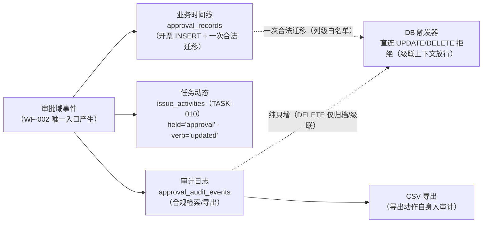
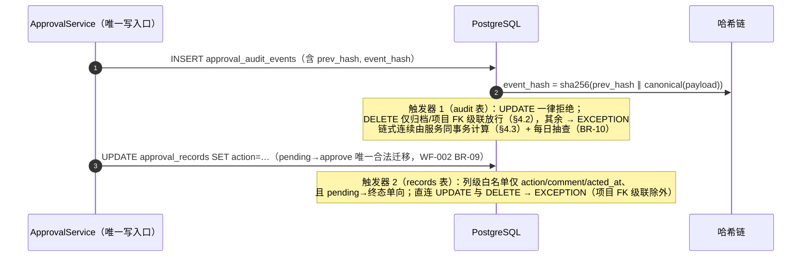

# WF-006 审批留痕与合规溯源

| 元信息项 | 内容 |
| --- | --- |
| 文档编号 | WF-006 |
| 所属迭代 | Sprint 7 — 企业工作流核心（第 10 周 D3-4 支线） |
| 优先级 | P3（企业版核心级 · 合规面） |
| 覆盖模块 | M11-WF 企业工作流与审批（留痕切面；执行切面在 WF-002——模块码以 `dependency-graph.md` §1.2 为唯一事实，无 M5-WF） |
| 工作量估算 | 3 人日（后端 2 + 前端 0.5 + QA 0.5） |
| 文档状态 | 待评审（Draft） |
| 最后更新日期 | 2026-09-04 |
| 上游依赖 | `WF-001`（工作流引擎/状态机执行模型）、`WF-002`（`ApprovalInstance/ApprovalRecord` 执行模型）、`TASK-010`（Activity 管道）、`GANTT-002`（导出范式先例：导出产物文件名/水印规则 BR-11 与 §2.6 文件名模板） |
| 下游消费 | Sprint 8 `AUTH-010`（按 dependency-graph §1.3 当前为 SSO 单点登录；如纳入全站审计并统一检索，需在 sprint-overview 与 dependency-graph 同步登记后调整本表依赖表述——**跨档继承矛盾待登记回改**）、Sprint 9（审批时效报表数据源）、P4 合规认证 |

---

## 1. 概述

### 1.1 功能定位

WF-006 把 WF-002 的审批执行数据升级为**合规级留痕体系**，回答审计三问——**谁在什么时间对什么流转做了什么决定、依据是什么、记录是否可信**：

1. **不可变存储（与 WF-002 BR-09 现行契约一致）**：审计事件表 `approval_audit_events` 纯只增（UPDATE 一律拒绝、DELETE 仅归档口或项目 FK 级联上下文放行，§4.2）；审批票 `ApprovalRecord` 开票即 INSERT，动作是**唯一一次合法迁移**（`pending→approve/reject/skipped` 单向、仅 `action/comment/acted_at` 三列可写——列级白名单触发器）；实例终态不可回写。
2. **全量事件链**：立案/各级动作/驳回/撤回/终止/超时/转交，每个事件落三类出口——审批时间线（业务）、任务动态（TASK-010：`field='approval'`、verb 固定 `updated`，WF-002 BR-14 载荷契约）、审计日志（本文档）。
3. **检索与导出**：多维度检索（人/任务/流/动作/时间窗）、CSV 导出（导出动作本身入审计）、留存策略（3 年）。

### 1.2 留痕三层出口



> **为什么审计单独建表而非复用 `approval_records`**：records 是业务票据（审批人视角的票），审计事件还覆盖**非票动作**（立案、终止、超时提醒、定义变更、导出、访问）且需要独立留存策略与检索索引——两表同源事件、各司其职。Sprint 8 `AUTH-010`（按 dependency-graph §1.3 当前为 SSO 单点登录；如纳入全站审计并统一检索，需在 sprint-overview 与 dependency-graph 同步登记后调整本表依赖表述——**跨档继承矛盾待登记回改**）建全站 `audit_logs` 时本表事件**双写**并入，检索面统一（留存口径两表各自独立，见 §2.3 登记注）。

### 1.3 范围边界

| 范围 | 本文档交付 | 明确不做 |
| --- | --- | --- |
| 不可变 | records 触发器、实例终态保护、篡改检测（哈希链） | 法律级电子签名/时间戳公证（P4 合规认证时评估） |
| 审计事件 | 审批域全事件采集、双写预留（AUTH-010） | 全站操作审计（Sprint 8） |
| 检索导出 | 项目/工作空间两级检索、CSV 导出、导出审计 | BI 对接（P4 `RPT-005`） |
| 留存 | 票据与审计 3 年、超期归档（冷存 MinIO） | 按租户差异化留存（P4 合规包） |

### 1.4 前置依赖

| 依赖 | 内容 | 阻塞原因 |
| --- | --- | --- |
| `WF-001` §4.1/§4.4 | 工作流引擎/状态机与流转入口 | 留痕数据流与事件链前置 |
| `WF-002` §4.3 | ApprovalInstance/ApprovalRecord 表与唯一入口 | 留痕数据源 |
| `TASK-010` | Activity 幂等管道（event_key 范式） | 动态落账 |
| `INFRA-002` | MinIO 桶与 Celery | 导出与归档 |
| `INFRA-004` | 请求日志中间件（request_id 贯穿） | 溯源关联 |

> **依赖图台账交叉引用（sprint-overview §3 注二）**：WF-006 在 dg 错位台账中无对应行——其 WF-001/WF-002/TASK-010 三条边按 WF-006 meta 上游依赖补画（架构文档待回改）。

### 1.5 竞品参考

| 竞品 | 参考点 | 处置 |
| --- | --- | --- |
| Ones | 审批记录查询与导出（企业版合规卖点） | 功能面对齐；**哈希链篡改检测**是其未做的加固 |
| Jira | Audit log（管理操作）+ 审批记录 | 审计事件模型对齐其 `auditing` 插件结构 |
| 钉钉审批 | 审批单留档 + 导出 | 留存语义对齐（钉钉 3 年） |
| SOX/等保实践 | WORM（Write Once Read Many）存储要求 | 触发器 + 哈希链 = 应用层 WORM |

---

## 2. 业务逻辑

### 2.1 审计事件清单

| 事件 type | 触发点 | 关键 payload |
| --- | --- | --- |
| `instance.created` | 立案 | 发起人/任务/边/流快照版本/守卫通过清单 |
| `record.acted` | 审批动作 | level/审批人/动作/意见哈希/原状态→新状态 |
| `record.skipped` | 自动跳票 | 原因（self/offboarded） |
| `instance.level_advanced` | 逐级推进 | from_level→to_level |
| `instance.completed` | 终审通过 | 迁移前状态→目标状态/终审守卫重跑结果 |
| `instance.rejected` | 驳回 | 驳回人/意见哈希 |
| `instance.withdrawn` | 撤回 | 发起人 |
| `instance.terminated` | 终止 | 终止人/原因/comment 哈希 |
| `instance.timeout_reminded` | 超时提醒 | 提醒对象/渠道 |
| `instance.escalated` | 离职转交 | 原审批人→补位人 |
| `flow.definition_changed` | 审批流定义变更 | 变更 diff（谁改的、改了什么） |
| `audit.exported` | 导出动作 | 导出者/过滤条件/行数/文件指针 |
| `audit.archived` | 月度归档删除窗口（§4.8，唯一合法 DELETE 路径） | cutoff/归档行数/链头尾哈希 |
| `audit.accessed` | 敏感访问（非成员读实例详情由成员可读，故仅记「导出文件下载」） | 访问者/对象 |

> **意见哈希而非明文**：审计事件存 `comment_sha256`（意见原文在 records 业务表），导出时合并——审计表即使泄露也不暴露意见内容，同时可验证原文未被篡改。

### 2.2 不可变与篡改检测



| 机制 | 实现 |
| --- | --- |
| 哈希链 | 每条审计事件 `prev_hash` 指向前条（项目维度链）；`event_hash = sha256(prev_hash ‖ canonical_json(payload))`——删改任何历史行都会断链，校验任务可检测 |
| 链校验 | beat 每日抽查（每项目末 1000 条重算比对）；年度合规审计可全量重放 |
| records 有限状态机 | `pending→approve/reject/skipped` 单向；触发器列级白名单（仅 `action/comment/acted_at` 可写且仅一次） |
| 实例终态保护 | `status ∈ {approved,rejected,withdrawn,terminated}` 后任何 UPDATE 拒绝（completed_at 一次性写入除外，同事务） |

### 2.3 检索与导出

| 能力 | 规则 |
| --- | --- |
| 检索维度 | 项目内：任务/发起人/审批人/流/动作/状态/时间窗（组合 AND）；工作空间级（`audit.read`，WS_OWNER/WS_ADMIN）：跨项目同人/同流检索 |
| 权限 | 项目成员可查本项目审批业务记录；**审计检索页**与导出需 `approval.audit`（PROJ_ADMIN+，rbac §8.2 未注册——按 rbac 附录 B 待登记，见 §4.5 注）；跨项目检索复用 rbac §8.1 既有 `audit.read`，不新增码位 |
| 导出 | CSV（UTF-8 BOM，Excel 兼容）；**统一异步**（Celery 任务，`202 + task_id + status_url` 轮询契约见 §4.5；小数据量秒级完成）；产物落 MinIO，完成后 `result.url` 为**流式下载代理端点** `GET …/approval-audit/exports/{task_id}/download/`（持 `approval.audit`，api-conventions §13.1 `succeeded` 后可用、1 小时过期）——代理端点内服务端经 MinIO 预签（应用侧签名、客户端不直连存储）流式回传并 `emit(audit.accessed)`（**下载动作入审计的唯一实现路径**——预签直连应用不经手则无法留痕，故下载必须走代理）；**导出动作与下载动作均入审计** |
| 导出文件名 | `{项目key}-approval-audit-{yyyyMMdd-HHmm}.csv`（循 GANTT-002 §2.6 导出文件名范式；CSV 为纯数据无水印，导出人/时间由 `audit.exported` 事件承载） |
| 导出字段 | 时间/项目/任务编号/任务标题/流转/发起人/级别/审批人/动作/意见/耗时/request_id |
| 留存 | records 与审计事件在线 3 年；超期月度归档任务导出 Parquet 至 MinIO 冷存（再存 4 年），在线表删除归档段（归档本身入审计）——留存口径与 AUTH-010 的对齐登记见下方注 |

> **留存口径登记（与 Sprint 8 AUTH-010 统一）**：审批域留痕（`approval_records` + `approval_audit_events`）为合规专表，保持**在线 3 年 + 冷存 4 年**不变。AUTH-010 的全站 `audit_log` 留存 **180 天**（其 BR-07）仅约束本表事件**双写副本**在该表的留存——两表管道同源、消费者与留存各自独立（AUTH-010 §1.2「管道同源、消费者与留存不同」既有边界约定的直接推论）。统一检索面（AUTH-010 并入）按此路由：180 天内审批事件可命中 `audit_log`，更早事件以本表在线段/冷存为准。**跨档继承矛盾待登记回改**：AUTH-010 按 dependency-graph §1.3 当前为 SSO 单点登录，本节与 §1.2/§3.2/§0 meta 将其描述为「全站审计并统一检索」需在 sprint-overview 与 dependency-graph 同步登记后调整 WF-006 §0 meta 当前依赖表述（待上游回改同步）；**登记回改项**：AUTH-010 BR-07 分区清理与统一检索实现不得以 180 天截断审批域事件的可见性（随 Sprint 8 首个 PR 同步）。

### 2.4 业务规则汇总

| 编号 | 规则 | 判定位置 | 违反后果 |
| --- | --- | --- | --- |
| BR-01 | 审计事件只增：UPDATE 一律拒绝；DELETE 放行口 = 归档函数（触发器内 `current_user='rp_archiver'` 判定，§4.2）或 `pg_trigger_depth() > 0` 的项目 FK 级联上下文——应用账号与 superuser 直连同被拒绝（应用与运维同约束） | DB | EXCEPTION + 告警 |
| BR-02 | 哈希链断裂 = 安全事件：校验任务发现即 P0 告警并冻结导出 | 校验任务 | 告警 + 冻结 |
| BR-03 | 审计事件由 WF-002 唯一入口产生；任何绕过直写 records 的路径评审拒绝 | 架构约束 | 评审拒绝 |
| BR-04 | 意见在审计表仅存哈希；导出时从业务表合并原文 | 服务 | — |
| BR-05 | 导出需 `approval.audit`（按 rbac 附录 B 待登记，§4.5 注）；导出与下载动作自身入审计（谁导了什么条件多少行） | Service | `403 PERM_DENIED` |
| BR-06 | 在线留存 3 年；归档冷存 4 年；归档段删除前必须完成冷存校验（与 AUTH-010 180 天口径的边界见 §2.3 登记注） | 归档任务 | 校验失败中止删除 |
| BR-07 | 审计检索结果不含意见原文（仅哈希）——意见只在业务时间线与导出中可见 | Serializer | — |
| BR-08 | 双写预留：事件写入同时发 `approval.audit` 总线消息，**载荷自包含**（`event/event_id/occurred_at/workspace_id/project_id/actor_id/instance_id/request_id/data`——字段名对齐 api-conventions §13.3 载荷结构，满足 AUTH-010 消费所需，消费方无需回查本表，§4.3）；Sprint 8 AUTH-010 消费建全站表；消费方缺席不影响本表 | on_commit | — |
| BR-09 | request_id 贯穿：每条审计事件记录产生它的请求 request_id（INFRA-004 中间件注入） | 服务 | — |
| BR-10 | 篡改检测抽查每日执行；全量重放工具随运维手册交付 | beat | — |
| BR-11 | 实例/票据删除仅一种合法路径：项目删除级联（级联前先归档导出）。触发链路：`DELETE /api/v1/admin/projects/{id}/`（`apps/admin`，按 monorepo-structure §apps 与 api-conventions §2.1 三套 API 分组）→ 触发 §4.8 归档接口 → 归档完成 → 允许 DB 级联 DELETE；`approval_records_guard` 与 `trg_aae_guard` 仅在 `pg_trigger_depth() > 0` 的级联上下文放行 DELETE，直连 DELETE 仍拒 | 级联服务 + DB | 触发器异常 |
| BR-12 | 审计页访问频率限制（INFO 级即可，但导出端点限流 10 次/时/人） | Throttle | `429 RATE_LIMIT_EXCEEDED` |

### 2.5 异常处理

| 场景 | HTTP | 错误码 | details 子码 | 前端表现 |
| --- | --- | --- | --- | --- |
| 无 `approval.audit` 访问审计页 | 403 | `PERM_DENIED` | — | 入口隐藏 |
| 导出超频率 | 429 | `RATE_LIMIT_EXCEEDED` | — | Retry-After 倒计时 |
| 导出时间窗超 1 年 | 400 | `VALIDATION_ERROR` | `INVALID_DATE_RANGE` | 缩短窗口提示 |
| 导出预估行数超 10 万（请求侧按预估拦截；任务内复检失败走 task `failed`，§4.4） | 400 | `VALIDATION_ERROR` | `TOO_LARGE` | 收窄筛选条件（AUTH-010 导出超限同范式） |
| 哈希链断裂后尝试导出 | 409 | `RESOURCE_CONFLICT` | `AUDIT_FROZEN` | 「审计完整性校验中，导出暂不可用」 |
| 归档任务冷存校验失败 | —（异步） | 告警 | — | 运维告警，删除中止 |
| 检索参数非法（时间倒置等） | 400 | `VALIDATION_ERROR` | `INVALID` | 行内提示 |

> **子码登记**：`INVALID_DATE_RANGE` 复用 `api-conventions.md` §8.8；`RANGE_TOO_LARGE` 不新增子码，统一复用 `INVALID_DATE_RANGE`（与 §2.5 导出时间窗超 1 年同子码）；`AUDIT_FROZEN` 为本文预留的字段级子码，**§8.8 待回补登（Sprint 7 首 PR）**，在此之前客户端不得对其做分支依赖。

---

## 3. UI/UX 设计

### 3.1 审计检索页（项目设置 · 审批审计）

```
┌──────────────────────────────────────────────────────────────────────┐
│ 项目设置 / 审批审计                  [导出 CSV]（限 10 次/时）        │
│ 筛选：[审批人 ▾] [动作 ▾] [流转 ▾] [时间 2026-08-01 ~ 2026-09-01]    │
├──────────────────────────────────────────────────────────────────────┤
│ 时间        任务       流转        审批人   动作    耗时   意见       │
│ 09-07 09:15 PROJ-128  提交评审     赵六     ✓通过  2.1h  [查看]      │
│ 09-06 15:02 PROJ-128  提交评审     韩梅     ✓通过  4.7h  [查看]      │
│ 09-06 10:22 PROJ-128  提交评审     —        ◉立案   —    —           │
│ 09-05 17:40 PROJ-117  上线审批     系统     ⊘跳票   —    自审跳过     │
│ …（游标加载更多）                                                   │
│ ──────────────────────────────────────────────────────────────────── │
│ 完整性：✓ 哈希链校验通过（今日 04:00 抽查 1000 条）                   │
└──────────────────────────────────────────────────────────────────────┘
```

| 元素 | 行为 |
| --- | --- |
| 意见「查看」 | 审计页内仅显示哈希与「存在意见」标记；点击跳业务时间线（BR-07 权限继承业务侧） |
| 导出 | 弹窗确认当前筛选条件与预估行数；提交后 202 转进度态（§4.5 task 轮询，终态即停——QA-001 §4.7 release-gates 条件轮询先例）；完成后通知 + 预签下载链接（1h） |
| 完整性徽标 | 展示最近一次链校验结果与时间；断裂时红色横幅 + 导出禁用 |

### 3.2 工作空间级检索（WS_ADMIN）

工作空间级检索页归属 `web` 应用「工作空间设置/审计日志」路由（与 `AUTH-010` 先例同位——按 dependency-graph §1.3 当前 AUTH-010 为 SSO 单点登录；如纳入全站审计并统一检索需在 sprint-overview 与 dependency-graph 同步登记后调整引用关系——**跨档继承矛盾待登记回改**），由 `WS_OWNER/WS_ADMIN` 持 `audit.read` 使用：增加「项目」筛选列与跨项目同人聚合视图（「王一 近 90 天审批 47 次 · 平均耗时 3.2h」——Sprint 9 报表复用此聚合查询）。`/admin/approvals/audit/` 路由归 `apps/admin`（独立管理后台，按 monorepo-structure §apps 与 api-conventions §2.1 三套 API 分组），仅承载 `SYSTEM_ADMIN` God Mode 的全局视角，不与本工作空间级检索页重叠。

---

## 4. 技术架构

### 4.1 审计事件模型

```python
class ApprovalAuditEvent(models.Model):
    """审批域审计事件（BR-01 只增；哈希链篡改检测）"""

    id = models.BigAutoField(primary_key=True)
    project = models.ForeignKey(Project, on_delete=models.CASCADE, related_name="+")
    type = models.CharField(max_length=32)                       # §2.1 清单
    instance = models.ForeignKey("ApprovalInstance", null=True, on_delete=models.SET_NULL,
                                 related_name="+")
    actor = models.ForeignKey(User, null=True, on_delete=models.SET_NULL, related_name="+",
                              help_text="NULL=系统（超时/跳票/归档）")
    payload = models.JSONField(default=dict)                     # 含 comment_sha256（BR-04）
    request_id = models.CharField(max_length=32, blank=True, default="")   # BR-09
    prev_hash = models.CharField(max_length=64)
    event_hash = models.CharField(max_length=64)
    created_at = models.DateTimeField(auto_now_add=True)

    class Meta:
        db_table = "approval_audit_events"
        indexes = [
            models.Index(fields=["project", "created_at"], name="idx_aae_project_time"),
            models.Index(fields=["project", "actor", "created_at"], name="idx_aae_actor"),
            models.Index(fields=["instance"], name="idx_aae_instance"),
            models.Index(fields=["created_at"], name="idx_aae_retention"),
        ]
```

### 4.2 不可变触发器（迁移内 DDL）

```sql
-- records：有限状态机列级白名单（WF-002 BR-09「一次合法迁移」的 DDL 落点：
-- 仅 action/comment/acted_at 三列可写，身份列与 created_at 变更即拒绝；
-- **WF-002 终审回填三文档时序闭环**：实例守卫（trg_approval_instance_guard，§4.2 下文）仅锁终态——
-- `ApprovalInstance.status` 的 pending 四条出边（approved/rejected/withdrawn/terminated，含闭环所需的
-- pending→approved 与 pending→terminated(guard_failed_at_complete) 两条）**全放行**；
-- 三文档（WF-001 §4.4 守门 / WF-002 §4.5 _complete_via_engine / 本 §4.2 实例守卫）时序一致）。
CREATE OR REPLACE FUNCTION trg_approval_records_guard() RETURNS trigger AS $$
BEGIN
  IF TG_OP = 'DELETE' THEN
    IF pg_trigger_depth() > 0 THEN                         -- Project FK 级联上下文
      RETURN OLD;
    END IF;
    RAISE EXCEPTION 'approval_records is append-only; direct DELETE rejected';
  END IF;
  IF TG_OP = 'UPDATE' THEN
    IF OLD.action <> 'pending'
       OR NEW.action NOT IN ('approve','reject','skipped')
       OR NEW.level <> OLD.level OR NEW.approver_id <> OLD.approver_id
       OR NEW.instance_id <> OLD.instance_id
       OR NEW.created_at IS DISTINCT FROM OLD.created_at THEN
      RAISE EXCEPTION 'illegal mutation on approval_records';
    END IF;
  END IF;
  RETURN NEW;
END; $$ LANGUAGE plpgsql;

CREATE TRIGGER approval_records_guard BEFORE UPDATE OR DELETE
  ON approval_records FOR EACH ROW EXECUTE FUNCTION trg_approval_records_guard();

-- instance：终态与锁定字段守护。实例仅允许 pending→终态的服务化落账；
-- terminal 状态落账后，任何身份列、锁定字段或终态字段的 UPDATE 均拒绝，
-- `completed_at` 仅在同一次 pending→终态更新中写入。
CREATE OR REPLACE FUNCTION trg_approval_instance_guard() RETURNS trigger AS $$
BEGIN
  IF TG_OP = 'UPDATE' AND OLD.status IN
       ('approved','rejected','withdrawn','terminated') THEN
    IF NEW.status IS DISTINCT FROM OLD.status
       OR NEW.issue_id IS DISTINCT FROM OLD.issue_id
       OR NEW.transition_id IS DISTINCT FROM OLD.transition_id
       OR NEW.flow_snapshot IS DISTINCT FROM OLD.flow_snapshot
       OR NEW.initiator_id IS DISTINCT FROM OLD.initiator_id
       OR NEW.current_level IS DISTINCT FROM OLD.current_level
       OR NEW.terminal_reason IS DISTINCT FROM OLD.terminal_reason
       OR NEW.completed_at IS DISTINCT FROM OLD.completed_at THEN
      RAISE EXCEPTION 'terminal approval_instance is locked';
    END IF;
  END IF;
  RETURN NEW;
END; $$ LANGUAGE plpgsql;

CREATE TRIGGER approval_instance_terminal_guard BEFORE UPDATE
  ON approval_instances FOR EACH ROW EXECUTE FUNCTION trg_approval_instance_guard();

-- audit events：纯只增（UPDATE 一律拒绝；DELETE 仅归档口或 Project FK 级联放行。
-- 放行口不依赖 DISABLE TRIGGER：PG 没有按角色关闭触发器的机制，ALTER TABLE … DISABLE TRIGGER
-- 是全局 DDL，任一会话执行都会为所有连接关闭触发器，不可用）
CREATE OR REPLACE FUNCTION trg_aae_guard() RETURNS trigger AS $$
BEGIN
  IF TG_OP = 'DELETE' AND pg_trigger_depth() > 0 THEN         -- Project FK 级联上下文
    RETURN OLD;
  ELSIF TG_OP = 'DELETE' AND current_user = 'rp_archiver' THEN
    RETURN OLD;   -- 归档函数 archive_approval_audit（SECURITY DEFINER，owner=rp_archiver，
                  -- §4.8）内的月度删除；应用账号不授该角色
  END IF;
  RAISE EXCEPTION 'approval_audit_events is append-only (op=%, user=%)', TG_OP, current_user;
END; $$ LANGUAGE plpgsql;

CREATE TRIGGER aae_no_mutation BEFORE UPDATE OR DELETE
  ON approval_audit_events FOR EACH ROW EXECUTE FUNCTION trg_aae_guard();
```

> 归档删除走**专用归档角色** `rp_archiver`（应用连接账号不授该角色）：归档函数 `archive_approval_audit`（§4.8）以 `SECURITY DEFINER` 执行且 owner 为 `rp_archiver`，函数内 `current_user` 即该角色，触发器据此放行归档 DELETE（UPDATE 任何角色都不放行）。项目删除的 FK 级联仅在 `pg_trigger_depth() > 0` 时放行两个表守卫；应用账号与 superuser 直连的 UPDATE/DELETE 仍被触发器拒绝（BR-01——superuser 亦不豁免 BEFORE 触发器）。BR-06 冷存校验通过才可删，删除窗口即审计事件（`audit.archived`）。

> **WF-002 同步登记**：`approval_records_guard` / `trg_aae_guard` 的级联放行口已按 PG 标准 `pg_trigger_depth() > 0` 补齐；WF-002 BR-09 与 §4.4 仍写「DELETE 一律拒绝」，标注为**级联放行口待同步——上游待回改**。

### 4.3 事件写入服务

```python
class ApprovalAuditor:
    """WF-002 各动作点的留痕挂接（BR-03 唯一入口；与业务写入同事务）。

    emit 为唯一签名（同步路径与 §4.4 Celery 任务内调用一致）：按 TASK-010 §4.3.2 /
    api-conventions §10.5「只传 ID 不传对象」纪律，全部取 project_id / actor_id /
    instance_id / request_id 字符串——任务侧不持有过期对象快照；
    actor_id=None 记系统事件（超时/跳票/归档，§2.1）。
    """

    @staticmethod
    def emit(*, project_id: str, type: str, actor_id: str | None, payload: dict,
             instance_id: str | None = None, request_id: str = "") -> None:
        prev = (ApprovalAuditEvent.objects.filter(project_id=project_id)
                .order_by("-id").values_list("event_hash", flat=True).first() or GENESIS_HASH)
        canonical = json.dumps(payload, sort_keys=True, ensure_ascii=False)
        event_hash = hashlib.sha256(f"{prev}{canonical}".encode()).hexdigest()
        event = ApprovalAuditEvent.objects.create(
            project_id=project_id, type=type, actor_id=actor_id, instance_id=instance_id,
            payload=with_comment_hash(payload), request_id=request_id,   # BR-04 / BR-09
            prev_hash=prev, event_hash=event_hash)
        ws_id = str(Project.objects.values_list("workspace_id", flat=True)
                    .get(id=project_id))
        transaction.on_commit(lambda: emit_audit_bus.delay(          # BR-08 双写预留（载荷自包含）
            event=type, event_id=str(event.id),
            occurred_at=event.created_at.isoformat(),
            workspace_id=ws_id, project_id=project_id,
            actor_id=actor_id or "system", instance_id=instance_id,
            request_id=request_id, data=event.payload))
```

> 链头读取与插入同事务（`select_for_update` 项目级链尾行或项目 advisory lock），并发立案时串行化——审批是低频写（峰值 < 10/s/项目），串行成本可忽略。

### 4.4 导出与归档任务

```python
@app.task(queue="workflow")
def export_approval_audit(task_id: str, project_id: str, filters: dict,
                          exporter_id: str, request_id: str):
    """异步导出（api-conventions §13.1 202 任务）：状态经 GET /api/v1/tasks/{task_id}/ 轮询。
    请求侧已按预估行数/时间窗拦截（§2.5）；任务内复检超限 → 任务态 failed（不抛 HTTP 错误——
    202 已返回，错误经 task.error 同构信封下发）。"""
    rows = ApprovalAuditEvent.objects.filter(project_id=project_id, **compile(filters))
    if rows.count() > 100_000:
        return ExportTask.mark_failed(task_id, "VALIDATION_ERROR", "TOO_LARGE")
    path = f"audit-exports/{project_id}/{uuid4()}.csv"
    with minio_put_stream(path) as w:                            # 流式写，不落磁盘
        write_csv(rows.iterator(chunk_size=2000), w, merge_comments=True)  # BR-04 合并原文
    ApprovalAuditor.emit(project_id=project_id, type="audit.exported", actor_id=exporter_id,
                         payload={"filters": filters, "rows": rows.count(), "file": path},
                         request_id=request_id)                  # BR-05 导出动作入审计
    ExportTask.succeed(task_id, result={                         # §13.1：result 携带下载代理端点 URL（1h 窗口）
        "url": f"/api/v1/workspaces/{ws.slug}/projects/{project.id}/approval-audit/exports/{task_id}/download/",
        "rows": rows.count(), "expires_in": 3600})
    notify(exporter_id, "audit_export_ready", {"task_id": task_id})   # 完成通知（可免轮询，§4.5）

@app.task(queue="workflow")
def verify_hash_chains():
    """beat 每日 04:00：每项目末 1000 条重算（BR-10）"""
    for project_id in active_project_ids():
        if not verify_chain_tail(project_id, depth=1000):
            freeze_exports(project_id)
            alert_p0("approval audit hash chain broken", project_id)
```

### 4.5 API 定义

| 方法 | 路径 | 说明 | 权限 |
| --- | --- | --- | --- |
| GET | `/api/v1/workspaces/{slug}/projects/{project_id}/approval-audit/` | 审计检索（组合筛选 + 游标分页） | `approval.audit`（PROJ_ADMIN+，按 rbac 附录 B 待登记，见下注） |
| POST | `…/approval-audit/exports/` | 触发导出（统一异步：`202 + task_id + status_url`，§4.4） | `approval.audit`（限流 10 次/时/人） |
| GET | `/api/v1/workspaces/{slug}/approval-audit/` | 工作空间级跨项目检索 | `audit.read`（WS_OWNER/WS_ADMIN，rbac §8.1 既有码） |
| GET | `…/projects/{project_id}/approval-audit/integrity/` | 链校验状态（最近结果） | `approval.audit` |

> **权限码登记**：`approval.audit`（项目级：审计检索/导出/完整性）**尚未在 rbac §8.2 项目级矩阵注册**——按 rbac 附录 B「新增受权限管控资源落地清单」随 Sprint 7 首个 PR 登记：§8.2 矩阵补行（PROJ_ADMIN ✅ / CONTRIBUTOR/COMMENTER/VIEWER ❌）+ `packages/constants` 前端矩阵 + 后端矩阵 + Permission 引用三处一致（rbac §5.5 CI 一致性测试），登记前相关端点不得合并；工作空间级检索复用 rbac §8.1 既有 `audit.read`，**不新增码位**。

**检索响应片段**（信封与分页 meta 按 api-conventions §4.1/§6.3；`integrity` 为旁路信息置 `meta`）：

```json
{
  "status": "success",
  "data": [
    {"id": 90211, "project_id": "0c1d2e3f-4a5b-4c6d-7e8f-90123456789a",
     "type": "record.acted", "created_at": "2026-09-07T09:15:22Z",
     "actor_id": "8a1f9c2e-6b3d-4a7e-9f11-2c4d5e6f7a8b",
     "issue_id": "9b2a0d3f-7c1e-4d5a-8b6c-1f2034a5b6c7",
     "level": 2, "action": "approve", "comment_present": true,
     "comment_sha256": "9f2c4a6b8d0e1f3a5c7b9d1e3f5a7b9c",
     "request_id": "01J9AM7C3D5F8H2K4N6Q9S1VXA"}
  ],
  "meta": {"next_cursor": "100:1:0", "prev_cursor": "100:0:1",
           "next_page_results": true, "prev_page_results": false,
           "count": 100, "total_count": 18422, "total_pages": 185,
           "page": 1, "per_page": 100,
           "integrity": {"status": "ok", "checked_at": "2026-09-07T04:00:11Z"}}
}
```

列表响应中的 `project_id` / `actor_id` / `issue_id` 为默认返回的 UUID v4 主键；对象字段 `actor` / `issue` 仅在请求 `?expand=actor,issue` 时追加，二者并存且不改变默认字段集。路径中的 `{project_id}` 与任务主键使用 UUID v4；审计事件主键沿用 `BigAutoField` 数值 `id`；`request_id` 按 `api-conventions.md` §4.2 使用 ULID。

**导出触发响应（202，api-conventions §13.1 异步任务契约）**：

```json
{
  "status": "success",
  "data": {"task_id": "d4e5f607-1829-4ab3-9c4d-5e6f708192a3", "state": "queued",
           "estimated_rows": 18422,
           "status_url": "/api/v1/tasks/d4e5f607-1829-4ab3-9c4d-5e6f708192a3/"}
}
```

**任务轮询**（`GET /api/v1/tasks/{task_id}/` → 200）：

```json
{
  "status": "success",
  "data": {"task_id": "d4e5f607-1829-4ab3-9c4d-5e6f708192a3", "state": "succeeded",
           "progress": 100,
           "result": {"url": "https://minio…/audit-exports/…?X-Amz-Signature=…",
                      "rows": 18422, "expires_in": 3600},
           "error": null}
}
```

- `state ∈ {queued, processing, succeeded, failed, cancelled}`（api-conventions §13.1）；完成后 `result.url` 为 MinIO 预签名下载链接（1 小时有效，§2.3）；失败时 `error` 为与 api-conventions §4.2 统一错误结构同构的对象（如行数复检超限：`VALIDATION_ERROR` + 子码 `TOO_LARGE`）。
- 前端轮询 2s 起指数放大至 10s，`state` 到终态即停（api-conventions §13.1；QA-001 §4.7 release-gates 的 SWR 条件轮询为同款先例）；完成另有站内通知（§4.4），收到通知可免轮询。

**错误响应示例**（哈希链断裂后导出，§2.5——`request_id` 在 `error` 内，api-conventions §4.2）：

```json
{
  "status": "error",
  "error": {
    "code": "RESOURCE_CONFLICT",
    "message": "审计完整性校验中，导出暂不可用",
    "details": [{"field": "export", "code": "AUDIT_FROZEN",
                 "message": "哈希链校验未通过，导出已冻结"}],
    "request_id": "01J9AM7C3D5F8H2K4N6Q9S1VXA"
  }
}
```

### 4.6 性能预算

| 路径 | 预算 | 手段 |
| --- | --- | --- |
| 审计检索 | P95 < 200ms（百万行项目） | 组合索引 + cursor |
| 事件写入 | +3ms/动作 | 同事务单 INSERT + 链头缓存 |
| 链校验（1000 条） | < 2s/项目 | 顺序扫描重算 |
| 导出 10 万行 | < 60s | 流式 CSV + iterator |

### 4.7 检索筛选参数与 CSV 列定义

**检索参数**（`GET …/approval-audit/`）：

| 参数 | 类型 | 说明 |
| --- | --- | --- |
| `actor` | uuid | 动作人（含系统事件用 `actor=system`） |
| `type` | 逗串 | §2.1 事件类型多选 |
| `action` | 枚举 | approve/reject/skipped/withdrawn/terminated（映射到对应事件组） |
| `transition` | uuid | 按流转边过滤 |
| `issue` | 编号或 uuid | `PROJ-128` 自动解析 |
| `flow` | uuid | 按 `workflow_id` 过滤审批流 |
| `initiator` | uuid | 按 `initiator_id` 过滤发起人；系统事件按 `initiator=system` |
| `status` | 枚举 | 按 `instance_status` 过滤 `pending/approved/rejected/withdrawn/terminated` |
| `from` / `to` | ISO 日期 | 闭区间；窗口 > 1 年仅导出场景拒绝，检索允许但提示 |
| `per_page` | int | 默认/上限 100（api-conventions §6.3；超限静默截断并在 `meta.degraded` 告知） |
| `cursor` | 游标 | `"{per_page}:{page}:{is_prev}"` 三段式（api-conventions §6.2；`is_prev` ∈ 0/1，Base64 传输，解码失败 `400 VALIDATION_INVALID_CURSOR`） |
| `ordering` | `-created_at`（默认）/`created_at` | 白名单两项，非白名单 `400 VALIDATION_INVALID_PARAM`（`api-conventions.md` §5.4）；终键自动追加 `-id` 保证游标稳定 |

**CSV 列定义**（导出，25 列固定序）：

| 列 | 来源 | 备注 |
| --- | --- | --- |
| event_time | `created_at`（ISO8601 带时区） | — |
| event_id | `id` | `BigAutoField` 审计事件主键 |
| event_type | `type` | §2.1 审计事件类型 |
| project_id | `project_id` | UUID v4 项目主键 |
| workflow_id | `workflow_id` | 审批流 UUID v4；立案后冻结 |
| instance_id | `instance_id` | 审批实例 UUID v4 |
| project | 项目名 + key | — |
| issue_seq | 任务编号 | — |
| issue_title | 任务标题 | 标题截断 120 字符 |
| transition_name | 边名 | 立案/终止事件必填 |
| from_state | 原状态 | 迁移事件 |
| to_state | 目标状态 | 迁移事件 |
| flow_name | 流名称 | — |
| flow_version | 流快照版本 | — |
| level | 级别 | 动作事件 |
| actor_name | 动作人姓名 | 系统事件为 `system` |
| actor_email | 动作人邮箱 | 系统事件为空 |
| action | 动作 | 中文枚举值 |
| comment | 意见原文（BR-04 合并自 records） | 含换行转义 |
| duration_hours | 级别耗时（动作时间 − 级别开启时间） | 一位小数 |
| skip_reason | 跳票原因 | — |
| terminal_reason | 终止原因 | — |
| guard_rerun_result | 终审重跑结果 | completed 事件 |
| request_id | 请求关联 | — |
| event_hash | 链哈希 | 审计自校验用途 |

---

### 4.8 归档函数与冷存格式

```sql
-- 月度归档：在线段 → 冷存（由 rp_archiver 角色执行，BR-06/11）
CREATE OR REPLACE FUNCTION archive_approval_audit(cutoff timestamptz)
RETURNS TABLE(project_id uuid, archived_count bigint) AS $$
DECLARE
  proj uuid; cnt bigint;
BEGIN
  FOR proj IN SELECT DISTINCT aae.project_id FROM approval_audit_events aae
              WHERE aae.created_at < cutoff LOOP
    -- 1. 冷存校验（Parquet 已在应用层上传并回读校验 MD5）
-- 归档完成钩子：应用侧补 emit(audit.archived, ...)（BR-08 总线消息不因裸 SQL 归档而丢失——AUTH-010 消费方依赖；归档函数返回后由调用方同事务补发）
    PERFORM assert_cold_storage_verified(proj, cutoff);
    -- 2. 删除在线段（触发器内 current_user='rp_archiver' 放行口；本函数 SECURITY DEFINER
    --    且 owner=rp_archiver——函数内 current_user 即该角色，§4.2）
    DELETE FROM approval_audit_events
      WHERE project_id = proj AND created_at < cutoff;
    GET DIAGNOSTICS cnt = ROW_COUNT;
    -- 3. 归档本身入审计（归档事件永不归档——created_at 为当前）
    INSERT INTO approval_audit_events(project_id, type, payload, prev_hash, event_hash, created_at)
      VALUES (proj, 'audit.archived',
              jsonb_build_object('cutoff', cutoff, 'rows', cnt),
              chain_head(proj), sha256_of(proj, cutoff, cnt), now());
    RETURN QUERY SELECT proj, cnt;
  END LOOP;
END; $$ LANGUAGE plpgsql SECURITY DEFINER;

REVOKE EXECUTE ON FUNCTION archive_approval_audit(timestamptz) FROM PUBLIC;
GRANT EXECUTE ON FUNCTION archive_approval_audit(timestamptz) TO rp_archiver;
```

> **字段长度与主键登记（两处架构偏差）**：① BR-08 总线载荷 `actor_id/instance_id` 为 UUID v4（36 字符），AUTH-010 现行 `audit_log.actor_id/object_id` 为 `CharField(26)`（ULID 假设）——**AUTH-010 字段长度待随 Sprint 8 回改**（36 或 64），本表事件双写副本在其回改前暂截断登记并在 BR-08 注说明；② `approval_audit_events` 主键 `BigAutoField` 偏离 api-conventions §4.5「主键 UUID v4」——沿 WF-002 `ApprovalRecord` 保时序先例且为显式选型，**架构文档待回改登记**（§4.5 UUID 例外白名单补登）。

**冷存格式**：`minio://rp-audit-archive/{project_id}/{yyyy-mm}/approval-audit.parquet`（Snappy 压缩；含 event_hash 列，重放校验工具 `tools/audit-replay.py` 可离线重建链验证）+ 同目录 `manifest.json`（行数/MD5/链头尾哈希）。records 业务票同步归档为 `approval-records.parquet`（含意见原文——冷存即最终明文归宿）。

**与项目删除端点绑定**：归档函数 `archive_approval_audit` 由项目删除端点 `DELETE /api/v1/admin/projects/{id}/`（归属 `apps/admin`，按 monorepo-structure §apps 与 api-conventions §2.1 三套 API 分组）的前置钩子触发——触发链路：删除项目 → 调用 §4.8 归档接口 → 归档完成 → 允许 DB 级联 DELETE（`pg_trigger_depth() > 0` 上下文内触发器放行，BR-11）。归档完成前不允许释放 Project FK 级联路径，避免 records/audit 在线段被直连清理越过归档审计。工作空间删除端点（admin 应用 `PATCH /api/v1/admin/workspaces/{slug}/`）按 monorepo-structure §apps 归属同一管理面。

### 4.9 典型事件 payload 示例

```json
// record.acted
{"level": 2, "action": "approve", "comment_sha256": "9f2c4a…",
 "pass_mode": "all", "level_progress": "2/3", "duration_minutes": 126}

// instance.completed
{"from_state": "开发中", "to_state": "评审中", "guard_rerun": "passed",
 "engine_duration_ms": 41}

// instance.terminated
{"reason": "guard_failed_at_complete", "guard_failures": ["required_fields:assignees"],
 "terminated_by": "system"}

// audit.exported
{"filters": {"from": "2026-06-01", "to": "2026-09-01", "action": "approve"},
 "rows": 18422, "file": "audit-exports/9a8b7c6d-5e4f-4321-a0b9-c8d7e6f50432/d4e5f607-1829-4ab3-9c4d-5e6f708192a3.csv"}
```

---

## 5. 测试用例

### 5.1 单元测试

| 编号 | 用例 | 断言 |
| --- | --- | --- |
| UT-01 | records 合法迁移（pending→approve） | 成功 |
| UT-02 | records 非法 UPDATE（改 level/二次动作/改审批人） | 触发器异常 |
| UT-03 | records DELETE 拒绝 | 触发器异常 |
| UT-04 | audit events UPDATE/DELETE 拒绝 | 触发器异常 |
| UT-05 | 哈希链计算确定性 | 同 payload 同 prev 得同 hash |
| UT-06 | 断链检测：删中间行后校验失败 | verify 返回 false + 冻结 |
| UT-07 | 意见哈希化 | payload 无原文，sha256 与原文比对一致 |
| UT-08 | 并发立案链串行 | 100 并发事件链无分叉 |
| UT-09 | 导出限流 10 次/时 | 第 11 次 429 |
| UT-10 | 导出时间窗 >1 年拒绝 / 预估行数 >10 万拒绝 | `INVALID_DATE_RANGE` / `TOO_LARGE` |
| UT-11 | 归档前冷存校验失败中止删除 | 在线段保留 + 告警 |
| UT-12 | 终态实例 UPDATE 拒绝 | 触发器异常 |

### 5.2 集成测试

| 编号 | 用例 | 断言 |
| --- | --- | --- |
| IT-01 | 审批全链路事件完整性（五场景） | §2.1 事件序列与 WF-002 动作一一对应 |
| IT-02 | 导出全链路：触发（202 + `task_id`/`status_url`）→ task 轮询至 `succeeded` → 通知 → 下载（预签链接 1h） | 导出与下载各入一条审计 |
| IT-03 | 双写总线 | `approval.audit` 消息（§4.3 载荷自包含：event/event_id/occurred_at/workspace_id/project_id/actor_id/instance_id/request_id/data）发出且可被 AUTH-010 消费端零回查接收 |
| IT-04 | 每日链校验 beat | 抽查通过记录 integrity；注入断链后 P0 告警 + 导出冻结 |
| IT-05 | 归档月度任务 | 3 年前数据导出冷存 + 校验 + 在线删除 + `audit.archived` 事件 |
| IT-06 | request_id 贯穿 | 审计事件 request_id 与请求日志中间件一致 |
| IT-07 | 项目删除级联 | 先归档导出再删除；`pg_trigger_depth() > 0` 级联上下文允许 records/audit 守卫删除，直连 DELETE 仍触发异常且留归档指针 |
| IT-08 | 权限矩阵 | 成员/PROJ_ADMIN/WS_ADMIN 三视角可见性；另设他项目非成员，项目检索/导出/完整性均返回 404 `RESOURCE_NOT_FOUND`（主体断言与 403 `PERM_DENIED` 分离） |

### 5.3 E2E 测试

| 编号 | 场景 | 断言 |
| --- | --- | --- |
| E2E-01 | 审计页检索组合筛选 + 游标翻页 | 结果与后端一致 |
| E2E-02 | 导出 CSV：筛选 → 导出 → 下载 → 内容抽检 | 行数与筛选一致；审计新增两条 |
| E2E-03 | 完整性徽标正常/断裂两态 | 断裂时导出禁用横幅 |
| E2E-04 | 无权限用户无入口、直连 403；另以他项目非成员直连审计检索/导出/完整性 | 403 `PERM_DENIED` 与 404 `RESOURCE_NOT_FOUND` 主体断言分离 |
| E2E-05 | 业务时间线与审计页同事件双视角一致 | 票据与审计对账 |
| E2E-06 | 工作空间级同人聚合检索 | 跨项目数据正确 |

---

## 6. 竞品深度对标

### 6.1 Ones / 钉钉 留痕分析

| 观察点 | Ones | 钉钉审批 | 本系统 |
| --- | --- | --- | --- |
| 记录不可变 | 应用层约定（DBA 可改） | 云端黑盒 | **DB 触发器 + 哈希链**，篡改可检测 |
| 导出审计 | 导出本身留痕不明 | 有下载记录 | 导出与下载双留痕（BR-05） |
| 留存 | 未公开 | 3 年 | 在线 3 年 + 冷存 4 年（对齐并超出） |
| 意见保护 | 明文随记录 | 明文 | 审计层哈希隔离，导出才合并（BR-04） |

### 6.2 Jira Auditing 分析

| 观察点 | Jira 做法 | 本系统决策 |
| --- | --- | --- |
| 审计范围 | 管理配置操作为主，业务审批记录分离 | 审批域专表 + Sprint 8 全站表双写统一检索 |
| 留存分级 | Data Center 可配 retention | 在线/冷存两级对齐 |
| 完整性 | 无篡改检测 | 哈希链差异化（合规审计可直接演示） |

### 6.3 本系统设计决策汇总

1. **应用层 WORM**：触发器 + 哈希链达到 WORM 存储的审计效果，无需专用硬件/对象锁——私有化部署合规可演示。
2. **业务票据与审计事件分离**：records 面向业务（审批中心/时间线），audit 面向合规（检索/导出/留存）——索引与权限各自优化，互不拖累。
3. **导出即审计对象**：导出是数据离域动作，其本身必须留痕——多数竞品只做「记录查询」不做「出口管控」。

---

## 7. 里程碑与验收

### 7.1 交付物清单

| 类别 | 产物 |
| --- | --- |
| Model / Migration | `approval_audit_events` 表、records/audit 触发器 DDL、归档角色与函数 |
| 后端 | `ApprovalAuditor`（链式写入）、导出 worker（流式 CSV）、链校验 beat、月度归档任务、双写总线预留 |
| API | 项目检索/导出/完整性 + 工作空间检索共 4 端点 |
| 前端（附录 C 已入清单：§3 审计检索页/完整性徽标/导出确认流/WS 检索页四块 UI 表面逐行入 `docs/sprint-0-poc/test-cases.md` 附录 C，来源 §3.x；`parity.spec.ts` 断言随实现补齐——ADR-0010 五步纪律②） | 项目审批审计页、完整性徽标、导出确认流、工作空间级检索页 |
| 测试 | UT-01~12、IT-01~08、E2E-01~06 |

### 7.2 可操作演示的验收标准

1. 五审批场景（WF-002 验收）执行后，审计页事件序列与时间线逐条对账一致，request_id 可关联请求日志。
2. 篡改演示：DBA 直连 `ALTER TABLE … DISABLE TRIGGER` 后删除一条历史审计事件再恢复（触发器防应用与误操作，DBA 级篡改由哈希链兜底，§4.2 注）→ 次日链校验（或手动触发）报警 P0、导出冻结、完整性徽标红色；对照组：不关触发器的直连 UPDATE/DELETE（含 superuser）当场被触发器拒绝。
3. records 篡改演示：直连 UPDATE 已动作票据被触发器拒绝。
4. 导出：1.8 万行异步导出 → 通知下载 → CSV 抽检一致；审计新增 `audit.exported` 与下载记录。
5. 意见保护：审计检索响应不含意见原文（仅哈希），导出含原文。
6. 归档：构造 3 年前数据，月度任务导出冷存、校验、在线删除、`audit.archived` 留痕；冷存校验失败时删除中止。
7. 性能：百万行项目检索 P95 < 200ms；链校验 1000 条 < 2s。