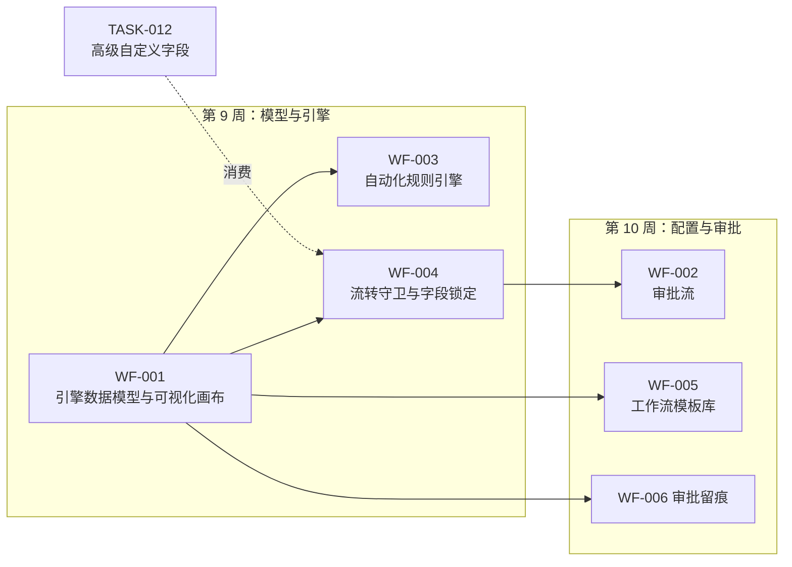
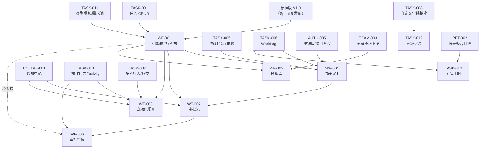

# Sprint 7 — 企业工作流核心 迭代概览

| 元信息项 | 内容 |
| --- | --- |
| 所属迭代 | Sprint 7 — 企业工作流核心（第 9-10 周，共 2 周） |
| 优先级 | P3（企业版核心级 · **企业版最大技术难点，双重迭代**） |
| 覆盖模块 | M11-WF 企业工作流与审批｜M4-TASK 任务核心（高级字段与团队工时）（模块码以 `dependency-graph.md` §1.2 为唯一事实） |
| 文档状态 | 待评审（Draft） |
| 最后更新日期 | 2026-09-04（R2 修复：自动化四触发器×五动作对齐 WF-003、§8 排期 WF-002 后端入第 9 周 D1-2、§5 权限行补全、§1 注图例补句、§3 注二软依赖口径；R3 修复：§3 补 WF-001→WF-004 边、TEAM-003 措辞对齐 WF-005 现行版、§10 复述同步、AUTH-009/010 跨档错位登记；R2：自动化四×五、§8 排期、§5 权限行、图例、软依赖；R1：§9/§10 补齐、M11-WF、dg 错位登记、依赖图补边、画布归属、mermaid 孤点） |
| 上游依赖 | **标准版 V1.0（Sprint 6 发布）**——任务状态模型/权限/筛选器/甘特/协作全量稳定 |
| 下游消费 | Sprint 8（组织权限：工作流权限与组织治理衔接）、Sprint 9（敏捷报表消费审批与流转数据） |
| 迭代周期 | 10 个工作日，固定预留 20% 缓冲 |

---

## 1. 迭代目标

自定义工作流与审批是企业版的**付费核心**，也是全系统技术难度最高的部分——因此占用两周而非一周，并被拆为「引擎 / 画布 / 规则 / 审批 / 模板 / 留痕」六个正交切面 + 两个任务域配套（高级字段、团队工时），每个切面可独立验收。

> 图例：图中**实线为周推进顺序**（交付先后），非依赖强度——`E1-->E6` 等实线表示 WF-006 在第 10 周交付，其结构依赖见 §3 依赖图（WF-006 直接依赖仅 `WF-002` + `TASK-010`，`WF-001→WF-006` 为经 WF-002 的传递依赖，§3 注二）；虚线为跨层消费。

> 注（编号与画布归属）：编号-标题映射以 [`docs/README.md`](../README.md) §4 为准——`WF-001` 可视化工作流画布与引擎数据模型（画布 UI 实现排第 10 周 D3-4 窗、与 `WF-002` 审批分区侧栏同窗联调，见 §8 注）、`WF-002` 审批流、`WF-003` 自动化规则引擎、`WF-004` 流转守卫与字段锁定、`WF-005` 工作流模板库与全局下发、`WF-006` 审批留痕与合规溯源；`dependency-graph.md` 的 WF-002~006 编号-标题整体错位一档，且其 §1.3/§4.2 的 AUTH-009/010 相对 README §4 亦错位一档（dg：AUTH-009=全量审计、AUTH-010=SSO；README：AUTH-009=SSO、AUTH-010=全站审计日志——以 README 为准），见 §3 注一。`TASK-013` 依赖边（`TASK-006`/`RPT-002`）见 §3 依赖图，不入本两周排期图。

核心结果：

1. **引擎先行的分层数据模型**：`Workflow/WorkflowState/WorkflowTransition` 与 Plane 的 `State` 体系平滑衔接——标准版状态即「内置默认工作流」，升级零迁移。
2. **流转守卫矩阵**：前置任务未完成（P2 已有）/ 字段必填 / 工时必填 / 角色权限四类守卫可按流转边配置，拦截信息结构化直达表单。
3. **审批流（会签/或签/逐级/驳回/撤回）**：`ApprovalNode/ApprovalRecord` 两级模型，审批留痕全量可审计。
4. **自动化规则引擎**：触发器（状态变更/任务创建/截止临近/字段变更——四触发器）× 动作（赋值/指派/改状态/通知/加标签——五动作）的受限 DSL（WF-003 §1.3/§2.2 冻结枚举）——刻意不做图灵完备。
5. **可视化画布**：React Flow 状态节点编辑器（拖拽建状态/连边/配置侧栏），按任务类型绑定独立工作流。
6. **模板库与全局下发**：研发需求/缺陷修复/测试上线/日常任务四套预设模板，组织级统一下发与项目级实例化。

## 2. 范围与边界

| 范围 | 本迭代交付 | 明确不做 |
| --- | --- | --- |
| 工作流引擎 | 状态机模型、按类型绑定、流转执行（含守卫/审批触发） | 跨项目工作流（P4） |
| 画布 | React Flow 编辑器（节点/边/侧栏配置/校验） | 多人同时编辑画布（P4） |
| 流转守卫 | 字段必填/工时必填/前置依赖/角色矩阵四类 | 自定义脚本守卫（P4） |
| 审批 | 单人/会签/或签/逐级/驳回/撤回/超时提醒 | 审批委派/加签（P4） |
| 自动化 | 触发器×动作受限 DSL、执行日志、Dry Run | 代码级脚本/循环触发（P4） |
| 模板 | 4 套预设 + 自定义保存 + 组织下发与锁定 | 模板市场（P4） |
| 高级字段 | 级联/关联/日期区间/附件四类型 + 字段级权限（只读/隐藏/必填按角色） | 公式字段（P4 `TASK-014`） |
| 团队工时 | 工时审批流（提交/驳回/通过）、填报规范、超额预警、团队统计台账 | 计费/成本（P4） |

## 3. 前置依赖

> 注一（模块码与编号映射）：模块码以 [`docs/architecture/dependency-graph.md`](../architecture/dependency-graph.md) §1.2 为唯一事实——本迭代覆盖 **M11-WF（企业工作流与审批）** 与 **M4-TASK（任务核心）**。编号-标题映射以 [`docs/README.md`](../README.md) §4 为准（同 §1 注）；`dependency-graph.md` §1.3 M11-WF 台账与 §4.6 依赖行的 `WF-002~006` 编号-标题整体错位一档（其 `WF-002`=画布、`WF-003`=流转条件校验、`WF-004`=审批流、`WF-005`=自动化规则、`WF-006`=模板库），**架构文档待回改**——本文按「标题」换算引用其依赖边。

> 注二（依赖边换算口径）：上图依赖边 = `dependency-graph.md` §4.5（`TASK-012`/`TASK-013` 行）与 §4.6（M11-WF 六行）的记载边，按注一映射换算到本文编号。两处例外：① `WF-006`（审批留痕）在 dg 错位台账中无对应行——按其 §0 meta 上游依赖仅画两条直接边 `WF-002`（`ApprovalInstance/ApprovalRecord` 执行模型）+ `TASK-010`（Activity 管道）；`WF-001→WF-006` 仅经 `WF-002` 的传递依赖（不在依赖图主路径，dg 标 ◇ 传递脚注说明）；`GANTT-002` 为 `WF-006` §0 meta 的导出范式弱引用（`BR-11` 文件名模板 + §2.6 文件名模板范式），不构成结构依赖，不入依赖图（架构文档待回改）；② dg §4.5 记载 `TASK-012 ← AUTH-008` 为跨迭代倒挂（`AUTH-008` 属 Sprint 8，且 dg 自身 §2.1 又将 `AUTH-008` 排在 Sprint 8）——按 `TASK-012` 口径处理为「字段权限先落固定角色码、自定义角色矩阵在 Sprint 8 `AUTH-008` 落地后自动生效，零改表零回改」，故本图不画该边（架构文档待回改）。**直接 / 传递 / 弱引用三层分级**——图上主路径为「直接结构依赖」（dg 实际记载边 + `WF-006` §0 meta 直接边的映射）；传递边 ◇ 仅作跨层借鉴标注（如 `WF-001→WF-006` 仅经 `WF-002` 传递，不画主路径，详见 §1 注图例）；弱引用 ⊝ 仅在 §3 文本表格中提及（如 `GANTT-002` 的文件名模板范式借鉴），不构成依赖边、不入图。图上未画主路径即视为非结构依赖；传递边 ◇ 仅作跨层借鉴标注；弱引用 ⊝ 仅在 §3 文本表格中提及。**软依赖不入图口径**：各子文档 §0 meta 的上游依赖系统性多于本图（如 WF-001←TASK-005/TASK-010、WF-005←WF-002/WF-004、TASK-012←TASK-011/FILE-001、TASK-013←TASK-010/COLLAB-001）——此类为管道/范式复用的**软依赖**，不重复入图；结构依赖以 dg 换算边（上图）为准，两者不冲突。

进入 Sprint 7 前必须满足（`需求文档` §9.2 第 4 条的落地判定；逐条对应上图依赖边的上游就绪）：

- 标准版 V1.0 通过发布验收（QA-001 全部门禁）——状态模型在真实使用中稳定（S6 → S7 硬阻塞，`dependency-graph.md` §2.2）。
- `TASK-001` 任务 CRUD 与 `TASK-011` 任务类型模板稳定——工作流按「项目 × 类型」挂载的挂载点（dg §4.6 `WF-001` 行）。
- `State.issue_type` 预留列（P0 建表即含，`unified-issue-model.md` §2.6）确认从未被占用，类型专属状态集可直接启用。
- `TASK-008` 的 `permission_config`/`cascade_config` 列、`TASK-011` 的 FilterCompiler、`TASK-006` 的 WorkLog 聚合框架就绪（`TASK-012`/`TASK-013` 的零 DDL 启用前提）。
- `TASK-005` 前置依赖守卫（BLOCKER 钩子）与 `AUTH-005` 按钮级权限/接口二次鉴权在线——`WF-004` 字段必填/工时必填/前置依赖/角色四类守卫的消费底座（dg §4.6）。
- `TASK-010` Activity/操作日志事件管道稳定——`WF-003` 触发器订阅与 `WF-006` 留痕消费同一事件源（`dependency-graph.md` §6「操作日志作为统一事件源」）。
- `TASK-007` 多执行人/转交可用——`WF-003` 动作复用指派与转交能力，禁开旁路（dg §4.6）。
- `COLLAB-001` 通知中心通道接口冻结（供 WF 调用，dg §3.1 `COLLAB → WF` 强依赖）——审批待办/超时提醒/自动化通知全部走通知通道。
- `TEAM-003` 团队全局模板机制可用（Sprint 5 已交付）——`WF-005` 复用其**治理语义先例**（WS 级配置权 + 快照不直改既有项目），下发路径独立（复制式实例化，非引用式——其 §1.4 口径）。
- `RPT-002` 报表聚合口径经生产验证——`TASK-013` 团队统计台账复用工时数据与聚合口径（dg §4.5）。
- 甘特/看板/列表对「状态集变化」的渲染兼容性回归通过（新增状态不破视图）。

## 4. P3 模块覆盖

| 文档 | 交付重点 | 关键数据结构 | 直接下游 |
| --- | --- | --- | --- |
| `WF-001` | 可视化工作流画布与引擎数据模型/状态机执行（引擎/端点第 9 周 D1-2 窗；画布 UI 第 10 周 D3-4 窗，与 `WF-002` 同窗联调，见 §8 注） | `Workflow/WorkflowState/WorkflowTransition`；`State.issue_type` 启用 | WF-002~006 全部 |
| `WF-002` | 审批流（会签/或签/逐级/驳回/撤回；画布内审批分区侧栏挂接 WF-001 画布，见其 §3.3） | `ApprovalFlow/ApprovalNode` | WF-005/006 |
| `WF-003` | 自动化规则引擎 | `AutomationRule`（trigger/conditions/actions JSONB） | Sprint 9 报表 |
| `WF-004` | 流转守卫与字段锁定 | `WorkflowTransition.guards` JSONB | 审批触发衔接 |
| `WF-005` | 模板库与全局下发 | `WorkflowTemplate`（组织级/锁定标记） | Sprint 8 组织治理 |
| `WF-006` | 审批留痕与合规溯源 | `ApprovalRecord` + 审计导出 | `AUTH-010` 审计 |
| `TASK-012` | 高级字段四类型 + 字段权限 | `CustomFieldDefinition` 既有列启用 | P4 公式 |
| `TASK-013` | 团队工时统计与管控 | WorkLog 快照表 + 审批状态 | RPT-004 负载 |

## 5. 统一工程约束

| 类别 | 约束 |
| --- | --- |
| 兼容 | 标准版项目无工作流配置时行为与 V1.0 完全一致（默认工作流兜底） |
| 执行 | 流转执行 = 单事务（守卫校验→审批触发→状态更新→Activity），失败全回滚 |
| 守卫 | 拦截响应结构化（缺失字段清单/阻塞任务清单），前端可弹补齐表单 |
| 审批 | 审批记录不可变（只增）；驳回回到发起前状态；撤回仅发起人且未有任何审批动作时 |
| 自动化 | 规则执行有日志、有 Dry Run、有防循环（同任务同规则可配置去重窗口） |
| 性能 | 画布 100 节点/200 边流畅编辑；规则执行 P95 < 100ms（不含通知投递） |
| 权限 | `workflow.manage`（PROJ_ADMIN+，WF-001/002/004/005 项目侧）；`automation.manage`（PROJ_ADMIN+，WF-003——rbac §8.2 注册表专行）；`approval.act`/`approval.withdraw`（WF-002 当前级审批人/发起人）；`worklog.approve`（TASK-013，P4 预留码提前启用）；`approval.audit`（WF-006，按 rbac 附录 B 待登记）；组织级模板另需 WS 级 `workspace.setting.manage`（WF-005）。各文档权限码以 rbac-permission-model.md §8 为准 |

## 6. 验收标准

- [ ] 8 份规格均含七章结构与全部详尽要素（线框/JSON/代码/测试/竞品/验收）。
- [ ] 标准版项目升级后零行为变化（回归套件全绿）；新配置工作流后按预期拦截与流转。
- [ ] 画布完成「研发需求流程」自建演示图编辑（5 状态 6 边 + 2 守卫 + 1 审批节点——WF-001 独立演示图，非 WF-005 预设实例化）并生效于需求类型。
- [ ] 会签/或签/逐级/驳回/撤回五场景全链路可演示，审批记录完整可审计。
- [ ] 自动化规则「高优先级需求进入评审时自动指派产品负责人」可配置可 Dry Run 可回溯日志。
- [ ] 字段级权限：指定字段对 PROJ_CONTRIBUTOR 隐藏——列表/详情/筛选/导出四处不可见（序列化层剔除）。
- [ ] 工时审批：提交→驳回（附意见）→修改→通过→台账统计全链路。
- [ ] 全部新端点通过 `api-conventions.md` §14 检查清单。

## 7. 文档清单

| 序号 | 文件 | 一级标题 |
| --- | --- | --- |
| 1 | `WF-001-workflow-canvas.md` | 可视化工作流画布与引擎数据模型 |
| 2 | `WF-002-approval-flow.md` | 审批流（会签/或签/逐级/驳回/撤回） |
| 3 | `WF-003-automation-rules.md` | 自动化规则引擎 |
| 4 | `WF-004-transition-guard.md` | 流转守卫与字段锁定 |
| 5 | `WF-005-workflow-templates.md` | 工作流模板库与全局下发 |
| 6 | `WF-006-approval-audit.md` | 审批留痕与合规溯源 |
| 7 | `TASK-012-advanced-fields.md` | 高级自定义字段与字段级权限 |
| 8 | `TASK-013-team-worklog.md` | 团队工时统计与工时管控 |

## 8. 排期（两周）

| 周 | 工作日 | 主线 A（引擎） | 主线 B（配套） | 当日验收 |
| --- | --- | --- | --- | --- |
| 第 9 周 | D1-2 | `WF-001` 模型与执行引擎 + `WF-002` 审批引擎与端点（WF-002 §8 后端三项同窗联调——审批引擎与流转引擎同期可联调，TASK-013 第 9 周 D5 工时审批依赖不倒挂） | `TASK-012` 高级字段类型 | 状态机事务测试通过（含审批终审回填三态）；WF-002 接口测试同窗收口 |
| | D3-4 | `WF-004` 守卫矩阵 | `TASK-012` 字段权限三处生效 | 守卫拦截结构化验证 |
| | D5 | `WF-003` 规则 DSL 与执行 | `TASK-013` 工时审批 | 规则 Dry Run 通过 |
| 第 10 周 | D1-2 | `WF-002` 审批前端（审批中心三 Tab/详情抽屉/任务徽标——D1-2 起步，D3-4 与画布侧栏联调收口，WF-002 §8） | `TASK-013` 台账与预警 | 五审批场景接口级通过 |
| | D3-4 | `WF-001` 画布编辑器（`WF-002` 审批分区侧栏同窗联调）+ `WF-005` 模板库 | `WF-006` 留痕导出 | 画布编辑→生效闭环；五审批场景 E2E 全过 |
| | D5 | 回归、压测、缓冲 | 联调 | 迭代验收清单全过 |

> 注（画布归属口径，对齐 `WF-001` §1.2 目标 5 及其 meta 排期）：第 10 周 D3-4 槽位旧标注「`WF-002` 画布编辑器」即指该联调窗口——**画布编辑器的规格与实现归属 `WF-001`**（引擎/端点/流转入口已在第 9 周 D1-2 窗交付）；`WF-002` 在此窗口交付的是挂接在 WF-001 画布内的审批分区侧栏（`WF-002` §3.3），二者同窗联调后一并过「画布编辑→发布→生效」闭环验收。

## 9. 技术风险与应对

| # | 风险 | 影响 | 概率 | 应对措施 | 责任文档 |
| --- | --- | --- | --- | --- | --- |
| 1 | **工作流引擎回归风险**：`WF-001` 以 `Workflow/WorkflowState/WorkflowTransition` 承接/替换固定三态状态模型（`dependency-graph.md` §2.2 判定 S6→S7 为「破坏性变更」），标准版项目「升级零行为变化」承诺失守 | 高：标准版 V1.0 升级即回归，看板/列表/甘特全视图状态流转连锁异常 | 中 | ① 标准版状态即「内置默认工作流」，升级零迁移（§1 核心结果 1）；② 无工作流配置的项目一律默认工作流兜底（§5 兼容约束）；③ §6 第二条「升级后零行为变化（回归套件全绿）」设为迭代门禁；④ 甘特/看板/列表「状态集变化」渲染兼容回归前置到进入条件（§3） | `WF-001` §2 / §7、本文档 §3 / §5 / §6 |
| 2 | **自定义字段性能**：`TASK-012` 四类高级字段（级联/关联/日期区间/附件）叠加 JSONB 读取与 `permission_config` 四态判定，大数据量下列表/筛选查询超标 | 高：列表/看板/筛选全视图卡顿，标准版体验倒退 | 中 | ① 四类型枚举与扩展列「建列即定义」，本迭代启用零 DDL（`TASK-012` meta 口径）；② 字段权限服务端单一判定入口，access 四态一次分桶下发给列表/详情/筛选/导出四消费方；③ 复用 `TASK-008` GIN 索引与 `TASK-009`/`TASK-011` FilterCompiler，禁开第二份查询构造；④ 性能门禁沿用 s0-s5 基线纪律，任一指标超基线视同 P1 | `TASK-012` §4 / §5 |
| 3 | **审批死锁/挂起**：会签节点审批人缺失、逐级链路成环、超时无人提醒，任务长期滞留在审批中状态，流转单事务回滚后无出路 | 高：需求交付停滞，用户对企业版审批失去信任 | 中 | ① 审批记录只增不可变；驳回回到发起前状态；撤回仅发起人且未有任何审批动作（§5）；② 超时提醒强制走 `COLLAB-001` 通知通道（§3 前置），禁静默挂起；③ 会签/或签/逐级/驳回/撤回五场景全链路可演示为 §6 门禁；④ 工时审批为轻量单级审批、不复用 ApprovalFlow 引擎（`TASK-013` 口径），收窄死锁面 | `WF-002` §2 / §5、`TASK-013` §2 |
| 4 | **画布编辑器交付延期**：React Flow 编辑器（拖拽建节点/连边/侧栏/自动布局/撤销 50 步，100 节点 200 边流畅编辑）集中在第 10 周 D3-4 单窗口交付，且与 `WF-002` 审批分区侧栏同窗联调 | 高：挤压 `WF-005` 模板库联调与 D5 回归，双重迭代收口顺延 | 中 | ① 第 9 周先冻结画布规格（`WF-001` §3）与 `graph/` 端点契约（其 §4.8），`WF-002` 侧栏可基于契约 mock 并行；② `@xyflow/react` 12.x 与 `dagre` 已过依赖准入（不可替代性论证完成），按路由懒加载控制包体；③ 画布与引擎解耦——引擎/端点 D1-2 窗先交付先测，编辑器延期不阻塞后端流转链路；④ 20% 缓冲优先保「画布编辑→发布→生效」闭环（§6 第三条） | `WF-001` §1.2 / §3 / §7、本文档 §8 |
| 5 | **权限四态兼容**：字段级权限四态（`editable`/`readonly`/`hidden`/`required`，`TASK-012` 判定口径）与既有三重权限（UI/API/DB）及 `workflow.manage` 权限码叠加判定不一致——隐藏字段在列表/详情/筛选/导出任一处泄露 | 极高：越权数据泄露属 P0 事故级别 | 中 | ① `read`/`write`/`required_for` 三集合白名单服务端单一判定入口，序列化层剔除 hidden 字段（`TASK-012` §1 / §4）；② §6「指定字段对 MEMBER 四处不可见」入迭代门禁；③ 权限 Key 严格对齐 `rbac-permission-model.md`，禁另立权限字符串（s5 纪律延续）；④ 自定义角色矩阵预留 Sprint 8 `AUTH-008` 自动生效位，本迭代零改表 | `TASK-012` §2 / §4 / §5、`rbac-permission-model.md` §4 / §11 |
| 6 | **Sprint 8 依赖回改**：`AUTH-008` 自定义角色依赖 WF 节点权限模型（dg §2.2 S7→S8 硬阻塞、§4.2 `AUTH-008 ← WF-003`——该编号按本文口径即流转守卫）；引擎协议字段（`guards`/`side_effects`/`approval`）「协议先冻结」若失守，Sprint 8 与 dg 依赖边需连锁回改 | 中：Sprint 8 排期受阻，架构文档漂移面扩大 | 中 | ① 三协议字段在 `WF-001` 冻结评审后本迭代内只填充功能不扩协议；② 本文 §3 注一/注二登记的 dg 错位（WF-002~006 编号-标题、`WF-006` 缺行、`TASK-012 ← AUTH-008` 倒挂）按纪律先登记「架构文档待回改」再继续，未登记视为未收口（§10 第 3 项）；③ 收口时向 Sprint 8 交接「节点权限模型 + 协议字段冻结清单」 | `WF-001` §1 / §4、本文档 §3 / §10、`docs/adr/` |
| 7 | **范围蔓延**：企业版首个双周迭代、8 份规格并行，P4 诱惑密集（审批委派/加签、多人同时编辑画布、公式字段、跨项目工作流、自定义脚本守卫） | 极高：20% 缓冲被吃光，画布与审批两条主线双双延期 | 高 | ① §2 范围与边界表「明确不做」列逐项后置 P4，为硬性基线；② 新需求一律走需求池（`TASK-011` 后置化），本迭代不加塞；③ 第 10 周 D5 回归/压测/缓冲排期锁死，不为新需求让路；④ 「规则 DSL 刻意不做图灵完备」「画布不做多人协同」是设计决策非欠账，评审按此口径驳回加塞 | 本文档 §2 / §8、`WF-003` §2 |

---

## 10. 迭代退出条件

同时满足以下四项，Sprint 7 方可关闭并进入 Sprint 8 企业组织权限治理：

1. **功能验收**：§6 验收清单八条逐项绿——8 份规格均含七章结构与全部详尽要素、标准版升级后零行为变化（回归套件全绿）、画布「研发需求流程」模板编辑并生效于需求类型、五审批场景全链路可演示且留痕完整可审计、自动化规则可配置可 Dry Run 可回溯日志、字段级权限四处不可见、工时审批全链路、全部新端点通过 `api-conventions.md` §14 检查清单。
2. **工程质量**：CI 全绿——标准版行为回归套件、性能门禁（画布 100 节点/200 边流畅编辑、规则执行 P95 < 100ms 不含通知投递，§5）、流转单事务回滚用例、越权矩阵覆盖 `workflow.manage`（PROJ_ADMIN+）与组织级模板 WS 级配置权；P0/P1 缺陷 0 单开放。
3. **文档同步（含架构偏离 ADR 登记回改）**：本迭代 8 份功能文档状态全部标为「已实现」；实现过程中的架构偏离——`dependency-graph.md` §1.3/§4.6 的 WF-002~006 编号-标题错位与 `WF-006` 缺行、`TASK-012 ← AUTH-008` 倒挂边、权限 Key / 错误码 / 三协议字段（guards/side_effects/approval）的任何增删——必须先登记 `docs/adr/` 或在架构文档内联标注「架构文档待回改」并完成回改，未登记视为未收口；产出「协议字段冻结清单」与「已知技术债」交接 Sprint 8（`AUTH-008` 消费节点权限模型）。
4. **UI parity（ADR-0010，第四门禁）**：本迭代 `WF-001`~`WF-006` 新增 UI 表面——画布（`WF-001` 画布编辑器/侧栏/发布错误面板）、审批（`WF-002` 画布审批分区侧栏/任务侧呈现/待办、`WF-006` 留痕与审计导出）、模板库（`WF-005` Template Library）及 `WF-003` 规则配置、`TASK-012` 字段权限配置、`TASK-013` 工时台账——全部入 `docs/sprint-0-poc/test-cases.md` 附录 C 清单并逐行标注来源（文档 §3.x），`tests/e2e/parity.spec.ts` 补对应字段级断言全绿；条件态 / 下拉内容 / 禁用态 / 空态 / 加载态 / toast 文案逐类过。附录 C 清单行由 8 份功能文档各自修复轮补齐，本概览登记占位。

---

## 11. 相关文档

- 前置迭代：[`docs/sprint-6-stabilize/sprint-overview.md`](../sprint-6-stabilize/sprint-overview.md)
- 原始需求：[`docs/需求文档.md`](../需求文档.md) §3.4 企业级工作流全节 / §8.2 P3 列
- 上一同范式参考：[`docs/sprint-0-poc/sprint-overview.md`](../sprint-0-poc/sprint-overview.md) §3 / §9 / §10（范围边界 / 技术风险 / 退出条件）
- 下一迭代：`docs/sprint-8-enterprise-org/sprint-overview.md`（Sprint 8 — 企业组织权限治理）
- 依赖关系：[`docs/architecture/dependency-graph.md`](../architecture/dependency-graph.md) §1.2（模块码唯一事实）/ §2.1-§2.2（Sprint 7 归属与 S6→S7 硬阻塞）/ §4.5-§4.6（`TASK-012`/`TASK-013` 与 M11-WF 依赖行——**WF-002~006 编号-标题错位与 `TASK-012 ← AUTH-008` 倒挂边待回改，见 §3 注一/注二**）/ §7.1（Sprint 7 并行分组）
- API 规范：[`docs/architecture/api-conventions.md`](../architecture/api-conventions.md) §14（新端点检查清单——§6 验收第八条的落地契约）
