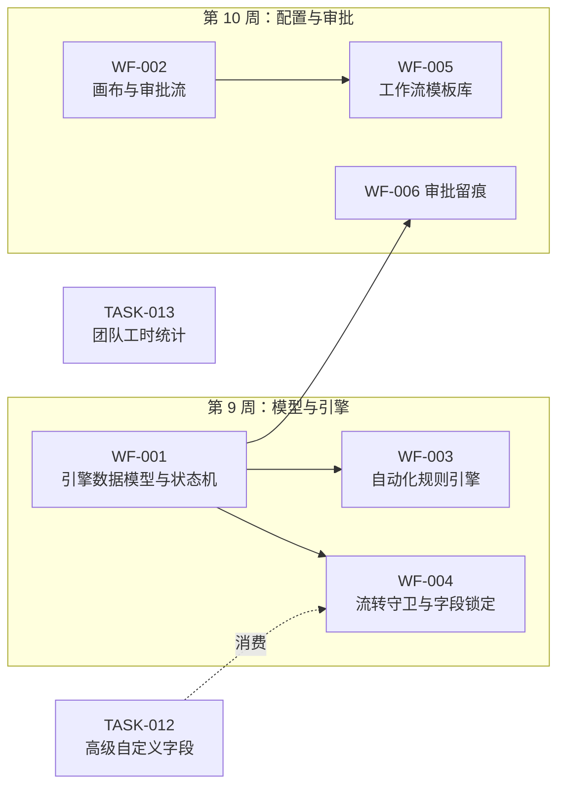
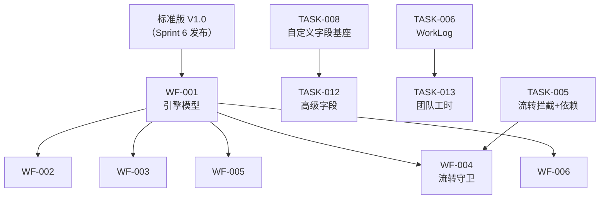

# Sprint 7 — 企业工作流核心 迭代概览

| 元信息项 | 内容 |
| --- | --- |
| 所属迭代 | Sprint 7 — 企业工作流核心（第 9-10 周，共 2 周） |
| 优先级 | P3（企业版核心级 · **企业版最大技术难点，双重迭代**） |
| 覆盖模块 | M5-WF 工作流与审批｜M4-TASK 任务核心（高级字段与团队工时） |
| 文档状态 | 待评审（Draft） |
| 最后更新日期 | 2026-09-01 |
| 上游依赖 | **标准版 V1.0（Sprint 6 发布）**——任务状态模型/权限/筛选器/甘特/协作全量稳定 |
| 下游消费 | Sprint 8（组织权限：工作流权限与组织治理衔接）、Sprint 9（敏捷报表消费审批与流转数据） |
| 迭代周期 | 10 个工作日，固定预留 20% 缓冲 |

---

## 1. 迭代目标

自定义工作流与审批是企业版的**付费核心**，也是全系统技术难度最高的部分——因此占用两周而非一周，并被拆为「引擎 / 画布 / 规则 / 审批 / 模板 / 留痕」六个正交切面 + 两个任务域配套（高级字段、团队工时），每个切面可独立验收。

核心结果：

1. **引擎先行的分层数据模型**：`Workflow/WorkflowState/WorkflowTransition` 与 Plane 的 `State` 体系平滑衔接——标准版状态即「内置默认工作流」，升级零迁移。
2. **流转守卫矩阵**：前置任务未完成（P2 已有）/ 字段必填 / 工时必填 / 角色权限四类守卫可按流转边配置，拦截信息结构化直达表单。
3. **审批流（会签/或签/逐级/驳回/撤回）**：`ApprovalNode/ApprovalRecord` 两级模型，审批留痕全量可审计。
4. **自动化规则引擎**：触发器（状态变更/创建/截止临近）× 动作（赋值/指派/改状态/通知）的受限 DSL——刻意不做图灵完备。
5. **可视化画布**：React Flow 状态节点编辑器（拖拽建状态/连边/配置侧栏），按任务类型绑定独立工作流。
6. **模板库与全局下发**：研发需求/缺陷修复/测试上线/日常任务四套预设模板，组织级统一下发与项目级实例化。

## 2. 范围与边界

| 范围 | 本迭代交付 | 明确不做 |
| --- | --- | --- |
| 工作流引擎 | 状态机模型、按类型绑定、流转执行（含守卫/审批触发） | 跨项目工作流（P4） |
| 画布 | React Flow 编辑器（节点/边/侧栏配置/校验） | 多人同时编辑画布（P4） |
| 流转守卫 | 字段必填/工时必填/前置依赖/角色矩阵四类 | 自定义脚本守卫（P4） |
| 审批 | 单人/会签/或签/逐级/驳回/撤回/超时提醒 | 审批委派/加签（P4） |
| 自动化 | 触发器×动作受限 DSL、执行日志、Dry Run | 代码级脚本/循环触发（P4） |
| 模板 | 4 套预设 + 自定义保存 + 组织下发与锁定 | 模板市场（P4） |
| 高级字段 | 级联/关联/日期区间/附件四类型 + 字段级权限（只读/隐藏/必填按角色） | 公式字段（P4 `TASK-014`） |
| 团队工时 | 工时审批流（提交/驳回/通过）、填报规范、超额预警、团队统计台账 | 计费/成本（P4） |

## 3. 前置依赖

进入 Sprint 7 前必须满足（`需求文档` §9.2 第 4 条的落地判定）：

- 标准版 V1.0 通过发布验收（QA-001 全部门禁）——状态模型在真实使用中稳定。
- `State.issue_type` 预留列（P0 建表即含，`unified-issue-model.md` §2.6）确认从未被占用，类型专属状态集可直接启用。
- `TASK-008` 的 `permission_config`/`cascade_config` 列、`TASK-006` 的 WorkLog 聚合框架就绪。
- 甘特/看板/列表对「状态集变化」的渲染兼容性回归通过（新增状态不破视图）。

## 4. P3 模块覆盖

| 文档 | 交付重点 | 关键数据结构 | 直接下游 |
| --- | --- | --- | --- |
| `WF-001` | 引擎数据模型与状态机执行 | `Workflow/WorkflowState/WorkflowTransition`；`State.issue_type` 启用 | WF-002~006 全部 |
| `WF-002` | 审批流（含画布编辑入口） | `ApprovalFlow/ApprovalNode` | WF-005/006 |
| `WF-003` | 自动化规则引擎 | `AutomationRule`（trigger/conditions/actions JSONB） | Sprint 9 报表 |
| `WF-004` | 流转守卫与字段锁定 | `WorkflowTransition.guards` JSONB | 审批触发衔接 |
| `WF-005` | 模板库与全局下发 | `WorkflowTemplate`（组织级/锁定标记） | Sprint 8 组织治理 |
| `WF-006` | 审批留痕与合规溯源 | `ApprovalRecord` + 审计导出 | `AUTH-010` 审计 |
| `TASK-012` | 高级字段四类型 + 字段权限 | `CustomFieldDefinition` 既有列启用 | P4 公式 |
| `TASK-013` | 团队工时统计与管控 | WorkLog 快照表 + 审批状态 | RPT-004 负载 |

## 5. 统一工程约束

| 类别 | 约束 |
| --- | --- |
| 兼容 | 标准版项目无工作流配置时行为与 V1.0 完全一致（默认工作流兜底） |
| 执行 | 流转执行 = 单事务（守卫校验→审批触发→状态更新→Activity），失败全回滚 |
| 守卫 | 拦截响应结构化（缺失字段清单/阻塞任务清单），前端可弹补齐表单 |
| 审批 | 审批记录不可变（只增）；驳回回到发起前状态；撤回仅发起人且未有任何审批动作时 |
| 自动化 | 规则执行有日志、有 Dry Run、有防循环（同任务同规则可配置去重窗口） |
| 性能 | 画布 100 节点/200 边流畅编辑；规则执行 P95 < 100ms（不含通知投递） |
| 权限 | `workflow.manage`（PROJ_ADMIN+）；组织级模板另需 WS 级配置权 |

## 6. 验收标准

- [ ] 8 份规格均含七章结构与全部详尽要素（线框/JSON/代码/测试/竞品/验收）。
- [ ] 标准版项目升级后零行为变化（回归套件全绿）；新配置工作流后按预期拦截与流转。
- [ ] 画布完成「研发需求流程」模板编辑（5 状态 6 边 + 2 守卫 + 1 审批节点）并生效于需求类型。
- [ ] 会签/或签/逐级/驳回/撤回五场景全链路可演示，审批记录完整可审计。
- [ ] 自动化规则「高优先级需求进入评审时自动指派产品负责人」可配置可 Dry Run 可回溯日志。
- [ ] 字段级权限：指定字段对 MEMBER 隐藏——列表/详情/筛选/导出四处不可见（序列化层剔除）。
- [ ] 工时审批：提交→驳回（附意见）→修改→通过→台账统计全链路。
- [ ] 全部新端点通过 `api-conventions.md` §14 检查清单。

## 7. 文档清单

| 序号 | 文件 | 一级标题 |
| --- | --- | --- |
| 1 | `WF-001-workflow-canvas.md` | 可视化工作流画布与引擎数据模型 |
| 2 | `WF-002-approval-flow.md` | 审批流（会签/或签/逐级/驳回/撤回） |
| 3 | `WF-003-automation-rules.md` | 自动化规则引擎 |
| 4 | `WF-004-transition-guard.md` | 流转守卫与字段锁定 |
| 5 | `WF-005-workflow-templates.md` | 工作流模板库与全局下发 |
| 6 | `WF-006-approval-audit.md` | 审批留痕与合规溯源 |
| 7 | `TASK-012-advanced-fields.md` | 高级自定义字段与字段级权限 |
| 8 | `TASK-013-team-worklog.md` | 团队工时统计与工时管控 |

## 8. 排期（两周）

| 周 | 工作日 | 主线 A（引擎） | 主线 B（配套） | 当日验收 |
| --- | --- | --- | --- | --- |
| 第 9 周 | D1-2 | `WF-001` 模型与执行引擎 | `TASK-012` 高级字段类型 | 状态机事务测试通过 |
| | D3-4 | `WF-004` 守卫矩阵 | `TASK-012` 字段权限三处生效 | 守卫拦截结构化验证 |
| | D5 | `WF-003` 规则 DSL 与执行 | `TASK-013` 工时审批 | 规则 Dry Run 通过 |
| 第 10 周 | D1-2 | `WF-002` 审批节点模型与执行 | `TASK-013` 台账与预警 | 五审批场景通过 |
| | D3-4 | `WF-002` 画布编辑器 + `WF-005` 模板库 | `WF-006` 留痕导出 | 画布编辑→生效闭环 |
| | D5 | 回归、压测、缓冲 | 联调 | 迭代验收清单全过 |

## 9. 相关文档

- 前置迭代：[`docs/sprint-6-stabilize/sprint-overview.md`](../sprint-6-stabilize/sprint-overview.md)
- 原始需求：[`docs/需求文档.md`](../需求文档.md) §3.4 企业级工作流全节 / §8.2 P3 列
- 下一迭代：`docs/sprint-8-enterprise-org/sprint-overview.md`（Sprint 8 — 企业组织权限治理）
