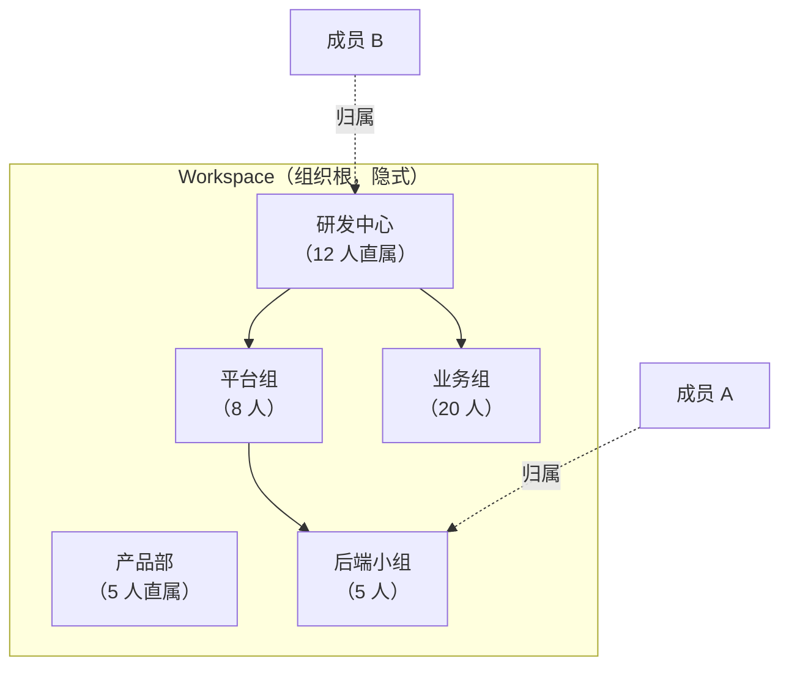
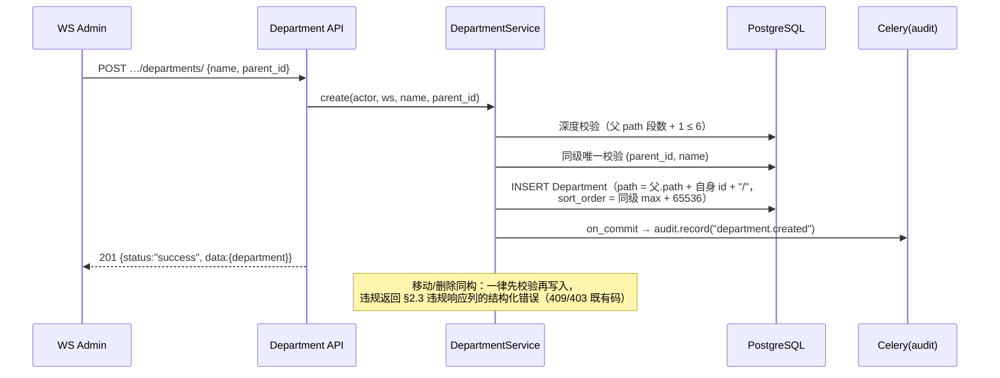
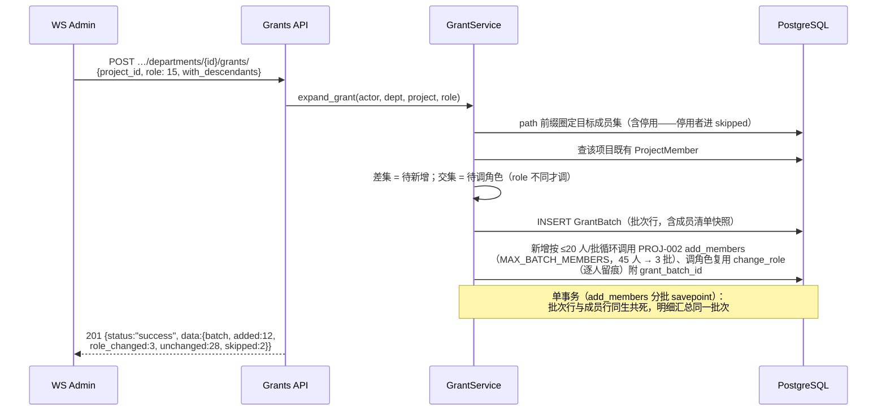

# 部门层级组织架构

| 元信息项 | 内容 |
| --- | --- |
| 文档编号 | AUTH-007 |
| 所属迭代 | Sprint 8 — 企业组织权限治理（第 11 周） |
| 优先级 | P3（企业版核心级 · 组织治理三问之「谁在组织里」） |
| 所属模块 | M1-AUTH｜账号与权限 |
| 文档状态 | 待评审（Draft） |
| 最后更新日期 | 2026-09-05（R1 修复 10 项：department.manage / workspace.member.manage 统一、role 改整数等级、信封+错误码重写、path 物化路径落地、岗位复用 company_role、expand_grant 停用分支 + member_id/created_by、§5.4 四主体权限矩阵、bulk-move 路径 + 分页 meta、UUID v4 主键；R2 修复：_depth_of 深度口径 off-by-one、批次 FK 改 SET_NULL+快照列、≤20 人分批复用 add_members、PATCH members 错误码对齐 TEAM-002；R3 复评 PASS 9.5×5） |
| 上游依赖 | `TEAM-001/002`（WorkspaceMember 成员体系）、`rbac-permission-model.md`（四层 Permission 体系）、`PROJ-002`（项目成员模型——批量授权的落点） |
| 下游消费 | `AUTH-008`（按部门批量挂接自定义角色）、`AUTH-009`（SSO JIT 部门映射的落点）、`AUTH-010`（部门变更入审计）、`RPT-004`（按部门负载统计） |
| 上游依据 | `docs/需求文档.md` §3.1 企业版专属（部门层级组织架构）、§8.2 组织架构 P3 列 |
| 关联架构文档 | [`rbac-permission-model.md`](../architecture/rbac-permission-model.md)（WS 层角色语义、§3.4 Department 预留模型、§8.1 权限码注册表）、[`api-conventions.md`](../architecture/api-conventions.md)（§4 信封 / §6.3 分页 / §8 错误码） |
| 对标基线 | Ones 组织架构（部门树 + 按部门授权） · 飞书/钉钉通讯录（部门-成员范式） · Plane（**无部门概念**——企业版差异化能力） |
| 工作量估算 | 后端 3 人日 / 前端 3 人日 / 联调与测试 1.5 人日，合计 **7.5 人日** |

---

## 1. 概述

### 1.1 功能定位

标准版的成员体系是「平」的：一个 Workspace 里一份成员名单，授权以「人」为最小单位逐个点选。企业组织真实形态是「树」的：公司 → 研发中心 → 平台组 → 后端小组，授权、统计、汇报都以「部门」为天然单位。AUTH-007 交付 Workspace 内的部门层级组织架构：

1. **部门树**：`Department` 自引用树，深度 ≤ 6，支持增删改、移动（换父级）、排序；
2. **成员归属**：成员挂到部门（一人一部门），附带**岗位**（复用既有 `company_role` 展示字段，rbac §3.2）自由文本；
3. **按部门批量授权**：把部门（含子部门）成员一次性展开写入项目成员或角色挂接——从「点人」升级为「点部门」；
4. **按部门统计**：成员数、任务量、工时的部门聚合入口（本文档定义成员与任务量口径，工时聚合归 `RPT-004` 消费）。

它回答治理三问的第一问「**谁在组织里**」，是 `AUTH-008`（角色）、`AUTH-009`（SSO JIT 映射）的数据地基。

### 1.2 关键约定：部门树的语义



| 约定 | 说明 | 理由 |
| --- | --- | --- |
| 一人一部门 | 成员至多归属 1 个部门（可为空=未分配） | 统计口径唯一（矩阵式多归属归 P4 评估） |
| 深度 ≤ 6 | 根部门为第 1 层 | 企业现实 4-5 层足够；限深防误操作拖出失控树 |
| 父子统计独立 | 部门成员数 = 直属成员；「含子部门」为聚合口径（`with_descendants=true`） | 直属与聚合混用是企业通讯录最常见统计事故 |
| 未分配桶 | 未挂部门成员进入虚拟「未分配」分组 | 保证「全体成员 = 各部门 + 未分配」恒等式可核对 |
| 删除受限 | 仅当部门无直属成员且无子部门时可删；否则须先迁移 | 杜绝删部门连带丢授权/丢统计归属 |

### 1.3 关键约定：按部门授权是「快照展开」

> ⚠️ 「把平台组加入项目 P」**不是**建立「部门→项目」的活绑定，而是**授权时刻**把部门成员快照展开为逐人 `ProjectMember` 行。

| 维度 | 快照展开（本版采用） | 活绑定（明确不做，P4 评估） |
| --- | --- | --- |
| 新入职成员进部门 | **不自动**获得项目权限，需重新执行批量授权 | 自动获得 |
| 成员调离部门 | **不自动**回收项目权限 | 自动回收 |
| 权限审计 | 每条授权落在个人头上，可追溯「谁于何时因何批次加入」 | 需穿透部门历史才能回答 |
| 实现复杂度 | 一次性展开写入（复用 `PROJ-002` 成员写入路径） | 需权限判定链路实时展开部门树 |

理由：权限语义必须「可点名人头」——审计（`AUTH-010`）与合规要求每个项目的每条规定权限都能落到具体人与具体授权事件。活绑定的「自动获得/回收」会在无感知情况下改变权限面，企业客户的安全评审普遍不接受。作为补偿，提供**授权批次记录**（`grant_batch` 标识）与「再次同步」入口：管理员可对同部门同项目重跑授权，幂等地补齐新成员（不回收已调离者——回收须显式逐人操作并留痕）。

### 1.4 范围边界

| 范围 | 本文档交付 | 明确不做 |
| --- | --- | --- |
| 部门树 | CRUD / 移动 / 排序 / 深度限制 / 树读取 | 部门负责人（manager）字段——P4 随审批委派一并评估 |
| 成员归属 | 一人一部门挂接 / 岗位 / 未分配桶 / 批量调部门 | 一人多部门（矩阵组织，P4） |
| 批量授权 | 部门→项目成员快照展开 + 授权批次记录 + 幂等重同步 | 部门→工作流/文件等其它资源的授权（各自模块仿范式自建） |
| 统计 | 部门成员数（直属/含子级）、部门任务量聚合 API | 部门级报表页（`RPT-004` 消费本口径） |
| 兼容 | 不建部门时系统行为与标准版完全一致 | 集团-子公司跨 Workspace 组织（P4） |

### 1.5 前置依赖

| 依赖 | 内容 | 阻塞原因 |
| --- | --- | --- |
| `TEAM-001/002` | `WorkspaceMember` 模型与成员管理 API | 部门归属字段挂在成员关系上 |
| `PROJ-002` | `ProjectMember` 写入路径（角色校验、幂等加人） | 批量授权复用其逐人写入，不另造轮子 |
| `rbac-permission-model.md` | WS 层角色语义与权限码注册表（§8.1） | 部门管理权限码 `department.manage` 的挂载层 |
| `TASK-010` | Activity 管道范式（event_key 幂等） | 部门变更事件与授权批次留痕复用 |

### 1.6 竞品参考

| 竞品 | 参考点 | 处置 |
| --- | --- | --- |
| Ones | 部门树 + 「按部门添加项目成员」快照展开 + 未分配成员桶 | **全面对齐**（含快照语义与未分配恒等式） |
| 飞书/钉钉 | 通讯录部门-岗位模型、深度限制（飞书 ≤ 50 层） | 岗位字段采纳；深度取更严的 6（项目管理系统无需通讯录级深树） |
| Plane | 无部门概念，仅 Workspace 成员平表 | 差异化能力，无实现参考 |
| Jira | 无原生部门（靠 User Group 近似） | 反例：Group 语义混杂授权与组织——本系统严格分离「部门=组织归属」「角色=权限集合」 |

---

## 2. 业务逻辑

### 2.1 部门树管理流程



### 2.2 成员归属与批量授权流程

**挂部门**：`PATCH …/members/{member_id}/` 传 `department_id`（null=移入未分配）与 `company_role`（岗位，复用既有展示字段）。成员列表支持 `?department=<id>` 与 `?department=<id>&with_descendants=true` 两种过滤。

**批量授权**（核心流程）：



**幂等重同步**：对同 `(department, project)` 重复 POST 不产生重复成员行——既有成员仅在 `role` 变更时更新并记新批次；无任何变化时返回 `added:0` 空批次（批次行仍记录，作为审计锚点）。响应计数恒等式：`added + role_changed + skipped + unchanged = 目标成员集总数`（IT-08 断言）。

### 2.3 业务规则汇总

| 编号 | 规则 | 触发点 | 违规响应 |
| --- | --- | --- | --- |
| BR-01 | 部门深度 ≤ 6（根为 1，以 `path` 实段数计，根 `/{id}/` 为 1 段；计算见 §4.3 `_depth_of`） | 创建/移动 | `409 RESOURCE_LIMIT_EXCEEDED` + details `{"field":"parent_id","code":"TOO_LARGE"}` |
| BR-02 | 同级部门名唯一（不区分大小写） | 创建/改名/移动 | `409 RESOURCE_ALREADY_EXISTS` + details `{"field":"name","code":"UNIQUE"}` |
| BR-03 | 移动不得造成环（新父级 `path` 不得以自身 `path` 为前缀，含自身） | 移动 | `409 RESOURCE_CIRCULAR_DEPENDENCY` + details 给出环路径 |
| BR-04 | 仅空部门可删（无直属成员且无子部门）；曾授权部门可删——删除后授权批次保留（FK `department` 置 NULL，批次自含 `department_id_snapshot` 溯源，§4.1），不阻塞删除、不抛 ProtectedError | 删除 | `409 RESOURCE_IN_USE` + details 给出阻塞计数（直属 `member_count` / `child_count`） |
| BR-05 | 一人一部门；`department_id=null` 表示未分配 | 挂接 | —（正常路径） |
| BR-06 | 部门管理（增删改/移动/排序/授权/批量调部门）需 `department.manage`（rbac §8.1 注册表：WS_OWNER ✅ / WS_ADMIN ✅ / WS_MEMBER ❌ / WS_GUEST ❌）；读取借用 `workspace.member.read` 行口径（WS_GUEST ❌） | 全部写/读端点 | 写 `403 PERM_WORKSPACE_ADMIN_REQUIRED`；GUEST 读 `403 PERM_ROLE_INSUFFICIENT` |
| BR-07 | 批量授权展开含子部门可选（`with_descendants`，默认 true，按 `path` 前缀圈定） | 授权 | — |
| BR-08 | 授权目标集 = 部门下未软删成员全集（`deleted_at__isnull=true`）；停用成员（`is_active=false`）**不静默排除**，计入 `skipped`（`reason=member_inactive`）并在 `skipped_detail` 列明 | 授权 | —（正常路径内分态） |
| BR-09 | 已是项目成员者仅在角色不同的时候调角色（复用 PROJ-002 `change_role`，调角色产生独立批次明细） | 授权 | — |
| BR-10 | 批量授权 `role` 仅接受 ProjectRole 整数等级（20/15/10/5，rbac §3.1，与 PROJ-002 一致）；`role=20`（PROJ_ADMIN）授予需操作者本身是该项目 PROJ_ADMIN 或 WS_ADMIN+ | 授权 | 非法等级 `400 VALIDATION_ERROR` + `NOT_A_CHOICE`；越权 `403 PERM_PROJECT_ADMIN_REQUIRED` |
| BR-11 | 部门改名/移动/删除/授权均入审计流（`AUTH-010`）与 Activity 管道（事件键 `department.created/moved/deleted/granted`） | 写操作 | — |
| BR-12 | 停用成员保留部门归属（恢复后原样），不计入部门在职统计 | 成员停用 | — |
| BR-13 | 岗位写入既有 `company_role` 字段（rbac §3.2「展示用职位，非权限字段」），应用层 ≤64 字符自由文本，不做枚举 | 挂接 | 超长 `400 VALIDATION_ERROR` + `TOO_LONG` |
| BR-14 | 部门排序 `sort_order` 浮点插值（同级），重平衡阈值与 Issue 一致 | 排序 | — |
| BR-15 | 树读取为 api-conventions §6.3 游标分页平铺列表（`per_page` 默认/上限 100，前端逐页拉全后本地组树）；`?include=member_count` 附直属/聚合计数 | 读取 | 页大小静默截断经 `meta.degraded` 告知 |
| BR-16 | 批量调部门 `member_ids` 上限 100，逐人一条审计留痕 | 批量调部门 | 超限 `400 VALIDATION_BULK_LIMIT_EXCEEDED` |

### 2.4 异常处理

| 场景 | 处理 |
| --- | --- |
| 移动部门时目标父级被并发删除 | 行锁读父级 → 不存在则 `404 RESOURCE_NOT_FOUND` |
| 批量授权中项目被并发归档 | 事务内 `select_for_update` 项目行；`status=archived` → `403 PERM_PROJECT_ARCHIVED`，整批回滚 |
| 授权展开成员集为空（空部门） | 201 空批次，`added:0`，`meta.warnings:["empty_department"]` |
| 树读取超大（>500 部门） | 统一 §6.3 游标分页（前端逐页拉全）；`per_page` 静默截断经 `meta.degraded` 告知；深度 ≤6 保证单行可控 |
| 批量调部门 `member_ids` 超 100 | `400 VALIDATION_BULK_LIMIT_EXCEEDED`（§8.4，BR-16） |
| WS_GUEST 访问部门读端点 | `403 PERM_ROLE_INSUFFICIENT`（BR-06 读取口径） |

### 2.5 边界条件

- **未分配恒等式**：`总成员数 = Σ各部门直属 + 未分配`，成员列表页以此做对账展示。
- **删人 vs 调部门**：成员离职走 `TEAM-002` 停用流程（`is_active=false`），部门归属保留至停用；停用成员不计入部门在职统计，授权展开时计入 `skipped`（`reason=member_inactive`，BR-08）而非静默排除。
- **排序稳定性**：`sort_order` 同级插入取前后中点；间距 < 1e-6 触发同级重平衡（一次性 UPDATE 为等差序列）。

---

## 3. UI/UX 设计

### 3.1 组织管理页整体布局

```
┌──────────────────────────────────────────────────────────────────────┐
│ 工作空间设置 / 组织架构                            [+ 新建根部门]      │
├──────────────────────┬───────────────────────────────────────────────┤
│ 部门树                │ 部门详情：研发中心                              │
│                      │ ┌───────────────────────────────────────────┐ │
│ ▾ 研发中心    (12/45)│ │ 直属成员 12 · 含子部门 45 · 子部门 2        │ │
│   ▾ 平台组     (8/13)│ ├───────────────────────────────────────────┤ │
│     ▸ 后端小组 (5/5) │ │ 成员（直属）          岗位       操作      │ │
│   ▸ 业务组    (20/27)│ │ ○ 张三               后端工程师  [调部门]  │ │
│ ▾ 产品部       (5/5) │ │ ○ 李四               技术负责人  [调部门]  │ │
│ 未分配         (3)   │ │ …                            [批量调部门] │ │
│                      │ ├───────────────────────────────────────────┤ │
│ [拖拽移动部门]        │ │ [+ 添加成员到部门]  [按部门授权到项目 ▸]   │ │
│                      │ └───────────────────────────────────────────┘ │
└──────────────────────┴───────────────────────────────────────────────┘
```

- 计数徽标格式 `直属/含子级`；「未分配」为虚拟节点，点击过滤成员列表。
- 拖拽移动部门：拖到目标节点上高亮「成为其子部门」；非法目标（自身后代、第 6 层以下）实时禁用落点并提示原因。

### 3.2 批量授权弹窗

```
┌──────────────── 按部门授权到项目 ────────────────┐
│ 部门：研发中心（含子部门共 45 人）  ☑ 包含子部门  │
│ 项目：[搜索选择项目 ▾]  角色：[贡献者 ▾]         │
│ ┌──────────────────────────────────────────────┐ │
│ 预览：45 人目标 → 32 新增 · 10 已是成员(角色一致) │ │
│ · 2 角色将调整 · 1 已停用将跳过                  │ │
│ └──────────────────────────────────────────────┘ │
│ ⚠ 快照授权：此后部门人员变动不会自动同步权限。     │
│                          [取消]  [确认授权]       │
└──────────────────────────────────────────────────┘
```

预览来自 `POST …/grants/preview/`（与正式授权同一展开逻辑，只读）。授权完成 Toast 展示实际计数并链接到批次详情。

### 3.3 成员列表的部门列与筛选

- 成员管理页新增「部门」「岗位」两列；部门筛选器含「含子部门」开关。
- 「批量调部门」：勾选成员 → 选择目标部门 → 确认（审计留痕逐人一条）。

### 3.4 空状态 / 加载 / 失败

| 状态 | 表现 |
| --- | --- |
| 无部门 | 空插画 + 「组织架构帮助按部门批量授权与统计」+ 主按钮「新建根部门」 |
| 树加载中 | 树骨架屏（3 层缩进灰条） |
| 授权失败 | Toast 错误码语义化（如「项目已归档，无法授权」），弹窗不关闭保留选择 |
| 删除被拒 | 对话框列出阻塞计数（直属 n 人 / 子部门 m 个）+「一键迁移成员到上级」快捷入口 |

### 3.5 响应式与无障碍

- < 1024px 时树与详情改为 Tab 切换；树节点可键盘操作（↑↓ 移动、→ 展开、Enter 选中）。
- 拖拽提供等价键盘操作（节点菜单「移动到…」对话框）。

---

## 4. 技术架构

### 4.1 数据模型

```python
# apps/api/plane/db/models/department.py
class Department(BaseModel):
    """部门层级（P3）。实体对齐 rbac-permission-model.md §3.4 预留模型；
    BaseModel 提供 UUID v4 主键 / created_by / updated_by / deleted_at（软删）。"""

    workspace = models.ForeignKey("db.Workspace", on_delete=models.CASCADE,
                                  related_name="departments")
    parent = models.ForeignKey("self", null=True, blank=True,
                               on_delete=models.PROTECT, related_name="children")
    name = models.CharField(max_length=255)
    # 物化路径（rbac §3.4 预留列）："/{dept_id}/{dept_id}/…/"，段为部门 UUID v4，
    # 含自身 id。子树查询 = path 前缀匹配；深度 = 实段数（根 1、上限 6，BR-01；
    # 计算见 §4.3 _depth_of——不可用 count("/")，首尾斜杠会 +2 偏移）。
    path = models.TextField(db_index=True, editable=False)
    sort_order = models.FloatField(default=65536.0)

    class Meta:
        db_table = "department"
        constraints = [
            models.UniqueConstraint(
                "workspace", "parent", models.functions.Lower("name"),
                condition=models.Q(deleted_at__isnull=True),
                name="uq_department_sibling_name"),
            models.CheckConstraint(check=models.Q(sort_order__gt=0),
                                   name="ck_department_sort_positive"),
        ]
        indexes = [
            models.Index("workspace", "parent", "sort_order",
                         name="idx_department_tree_read"),
        ]


class DepartmentGrantBatch(BaseModel):
    """授权批次：快照展开的审计锚点（BR-09/重同步幂等）。
    注：AUTH-008 将经独立迁移为本表增补 target_type 判别列
    （"project_membership" | "role"），本文不预建。"""

    workspace = models.ForeignKey("db.Workspace", on_delete=models.CASCADE)
    # 曾授权部门可删（BR-04 只校验成员/子部门，不校验批次）：SET_NULL 保留批次审计行，
    # 杜绝 ProtectedError → 500（api-conventions §4.3 已知业务失败不得 500）；溯源靠下方自含快照列
    department = models.ForeignKey(Department, null=True, blank=True,
                                   on_delete=models.SET_NULL,
                                   related_name="grant_batches")
    department_id_snapshot = models.UUIDField(editable=False)  # 授权时刻的部门 id（批次自含，溯源不依赖 FK 存活）
    project = models.ForeignKey("db.Project", on_delete=models.CASCADE)
    role = models.IntegerField(choices=ProjectRole.choices,
                               default=ProjectRole.CONTRIBUTOR)  # 整数等级（rbac §3.1）
    with_descendants = models.BooleanField(default=True)
    added_count = models.IntegerField(default=0)
    role_changed_count = models.IntegerField(default=0)
    skipped_count = models.IntegerField(default=0)
    unchanged_count = models.IntegerField(default=0)
    member_snapshot = models.JSONField(default=list)  # [{member_id, action}]
    # created_by / updated_by / created_at / updated_at 由 BaseModel 提供

    class Meta:
        db_table = "department_grant_batch"
        indexes = [models.Index("project", "created_at",
                                name="idx_grant_batch_project")]
```

`WorkspaceMember` 增量字段（迁移：仅一列 nullable，零回填）：

```python
class WorkspaceMember(models.Model):
    # …既有字段（rbac §3.2）：role / is_active / company_role（既有展示用职位列）…
    department = models.ForeignKey("db.Department", null=True, blank=True,
                                   on_delete=models.SET_NULL,
                                   related_name="members")
```

迁移要点：本迭代仅新增 `department` 一列；岗位复用既有 `company_role` 列（rbac §3.2「展示用职位，非权限字段」），**不新增 `position` 列**避免语义重复。`department` 删部门受限（BR-04）故 `SET_NULL` 仅兜底；`uq_department_sibling_name` 对 `parent IS NULL`（根部门）在 PG 中 NULL 不参与唯一——根部门重名改用**部分唯一索引**兜底：

```sql
CREATE UNIQUE INDEX uq_department_root_name
  ON department (workspace_id, lower(name))
  WHERE parent_id IS NULL AND deleted_at IS NULL;
```

### 4.2 API 定义

| 方法 | 路径 | 说明 | 权限 |
| --- | --- | --- | --- |
| GET | `/api/v1/workspaces/{slug}/departments/` | 部门平铺列表（`?include=member_count`；§6.3 分页） | `workspace.member.read` 口径（GUEST 403） |
| POST | `/api/v1/workspaces/{slug}/departments/` | 新建部门 | `department.manage` |
| PATCH | `/api/v1/workspaces/{slug}/departments/{id}/` | 改名 / 排序（`sort_after`） | `department.manage` |
| DELETE | `/api/v1/workspaces/{slug}/departments/{id}/` | 删除空部门 | `department.manage` |
| POST | `/api/v1/workspaces/{slug}/departments/{id}/move/` | 移动（换父级） | `department.manage` |
| PATCH | `/api/v1/workspaces/{slug}/members/{member_id}/` | 挂部门/岗位（扩展 TEAM-002 既有端点白名单字段 `department_id`/`company_role`） | `workspace.member.manage` |
| POST | `/api/v1/workspaces/{slug}/departments/{id}/members/bulk-move/` | 批量调部门 `{member_ids[], department_id}` | `department.manage` |
| POST | `/api/v1/workspaces/{slug}/departments/{id}/grants/preview/` | 授权预览（只读展开） | `department.manage` |
| POST | `/api/v1/workspaces/{slug}/departments/{id}/grants/` | 执行批量授权（201 带 `Location` 指向批次详情） | `department.manage` + BR-10 |
| GET | `/api/v1/workspaces/{slug}/departments/{id}/grants/{batch_id}/` | 批次详情（成员清单快照，逐人溯源） | `workspace.member.read` 口径 |
| GET | `/api/v1/workspaces/{slug}/departments/{id}/stats/` | 部门统计（成员/任务量） | `workspace.member.read` 口径 |

> **读取口径说明**：权限注册表未为 Department 单列 read 码；部门树暴露成员归属信息，读取统一借用 `workspace.member.read` 行口径（rbac §8.1：WS_GUEST ❌ → `403 PERM_ROLE_INSUFFICIENT`），不新增权限码。若后续注册表为 Department 单列 read 码，按附录 B 登记后切换。

**POST 创建部门 — 201**：

```json
{
  "status": "success",
  "data": {
    "department": {
      "id": "b4d7e3f1-2a5c-4e8b-9d6f-1c3e5a7b9d2f",
      "parent_id": "8a1f9c2e-6b3d-4a7e-9f11-2c4d5e6f7a8c",
      "name": "后端小组",
      "path": "/3f2c9a1e-6b3d-4a7e-9f11-2c4d5e6f7a8b/8a1f9c2e-6b3d-4a7e-9f11-2c4d5e6f7a8c/b4d7e3f1-2a5c-4e8b-9d6f-1c3e5a7b9d2f/",
      "sort_order": 131072.0,
      "member_count": 0,
      "created_at": "2026-09-01T09:30:00.000Z"
    }
  }
}
```

> **信封约定（api-conventions §4.1/§4.2，全文示例统一）**：成功为 `{"status":"success","data":…,"meta":…}`，错误为 `{"status":"error","error":{…}}`；`request_id` **仅出现在 `error` 对象内**，成功响应不携带 `meta.request_id`——全部响应（含成功）经 `X-Request-Id` 响应头回传；列表端点 `meta` 必填（§6.3 九字段），详情/动作端点 `meta` 可省略。实体主键一律 UUID v4 字符串（§4.5），`request_id` 为 ULID。

**深度超限 — 409**（上限类冲突复用既有码，api-conventions §8.5）：

```json
{
  "status": "error",
  "error": {
    "code": "RESOURCE_LIMIT_EXCEEDED",
    "message": "部门层级最多 6 层",
    "details": [
      {"field": "parent_id", "code": "TOO_LARGE", "message": "父部门已位于第 6 层，无法在其下新建（max=6）"}
    ],
    "request_id": "01J9XK3R2T4Y6U8I0O2P4A6S8D"
  }
}
```

**POST grants/ 请求与 201 响应**（`role` 为 ProjectRole 整数等级，15=CONTRIBUTOR，与 PROJ-002 一致）：

```json
{"project_id": "5e4f3a2b-1c9d-4e7f-a6b8-3d2c1e0f9a8b", "role": 15, "with_descendants": true}
```

```json
{
  "status": "success",
  "data": {
    "id": "9d8e7f6a-5b4c-4d3e-2f1a-0b9c8d7e6f5a",
    "added": 32, "role_changed": 2, "skipped": 1, "unchanged": 10,
    "skipped_detail": [
      {"member_id": "6c7d8e2f-9a1b-4c3d-8e5f-7a9b1c2d3e4f", "reason": "member_inactive"}
    ]
  }
}
```

`skipped_detail[].reason` 枚举：`member_inactive`（停用成员，BR-08）/ `guest_role_cap`（WS_GUEST 目标角色超 §7.3 上限）/ `not_workspace_member`（展开瞬间已非空间成员，继承 PROJ-002 逐人语义）。批次主键统一命名 `id`（URL 路径参数记作 `{batch_id}`，即同一主键；201 响应头带 `Location: /api/v1/workspaces/{slug}/departments/{id}/grants/{batch_id}/`，§4.3）。

**GET grants/{batch_id}/ — 200**（批次详情，逐人溯源）：

```json
{
  "status": "success",
  "data": {
    "id": "9d8e7f6a-5b4c-4d3e-2f1a-0b9c8d7e6f5a",
    "department_id": "8a1f9c2e-6b3d-4a7e-9f11-2c4d5e6f7a8c",
    "project_id": "5e4f3a2b-1c9d-4e7f-a6b8-3d2c1e0f9a8b",
    "role": 15, "with_descendants": true,
    "added_count": 32, "role_changed_count": 2, "skipped_count": 1, "unchanged_count": 10,
    "member_snapshot": [
      {"member_id": "6c7d8e2f-9a1b-4c3d-8e5f-7a9b1c2d3e4f", "action": "skipped:member_inactive"},
      {"member_id": "7b8c9d0e-1a2b-4c3d-8e5f-0a1b2c3d4e5f", "action": "added"}
    ],
    "created_by": "2b3a4c5d-6e7f-4a8b-9c0d-1e2f3a4b5c6d",
    "created_at": "2026-09-02T10:00:00.000Z"
  }
}
```

> `data.department_id` 序列化自批次自含快照 `department_id_snapshot`（§4.1）：曾授权部门被删除（BR-04）后批次行保留、FK `department` 置空，本字段仍返回授权时刻的部门 id，逐人溯源不丢。

**POST grants/preview/ — 200**（与正式授权同一展开逻辑，只读、不落库）：

```json
{
  "status": "success",
  "data": {
    "target_count": 45, "added": 32, "role_changed": 2,
    "unchanged": 10, "skipped": 1,
    "skipped_detail": [
      {"member_id": "6c7d8e2f-9a1b-4c3d-8e5f-7a9b1c2d3e4f", "reason": "member_inactive"}
    ]
  }
}
```

**移动成环 — 409**：

```json
{
  "status": "error",
  "error": {
    "code": "RESOURCE_CIRCULAR_DEPENDENCY",
    "message": "不能将部门移动到其自身或其子部门之下",
    "details": [
      {"field": "parent_id", "code": "INVALID", "message": "环路径：研发中心 → 平台组 → 后端小组"}
    ],
    "request_id": "01J9XK5D4E6G8J0L2N4P6R8T0V"
  }
}
```

**无管理权限 — 403**（`department.manage` 不足，码为注册表既有码）：

```json
{
  "status": "error",
  "error": {
    "code": "PERM_WORKSPACE_ADMIN_REQUIRED",
    "message": "需要工作空间管理员权限",
    "request_id": "01J9XK9H8J2K4M6P8R0T2V4X6Z8B"
  }
}
```

非成员访问 → 404（存在性隐藏，`api-conventions §4.3`）；WS_GUEST 访问读端点 → `403 PERM_ROLE_INSUFFICIENT`（BR-06）。

**GET departments/?include=member_count — 200**（列表端点：`data` 为数组、`meta` 必含 §6.3 九字段 + 本端点旁路统计；示例省略 2 行）：

```json
{
  "status": "success",
  "data": [
    {"id": "3f2c9a1e-6b3d-4a7e-9f11-2c4d5e6f7a8b", "parent_id": null, "name": "研发中心",
     "path": "/3f2c9a1e-6b3d-4a7e-9f11-2c4d5e6f7a8b/",
     "sort_order": 65536.0, "member_count": 12, "descendant_member_count": 45},
    {"id": "8a1f9c2e-6b3d-4a7e-9f11-2c4d5e6f7a8c", "parent_id": "3f2c9a1e-6b3d-4a7e-9f11-2c4d5e6f7a8b",
     "name": "平台组", "path": "/3f2c9a1e-6b3d-4a7e-9f11-2c4d5e6f7a8b/8a1f9c2e-6b3d-4a7e-9f11-2c4d5e6f7a8c/",
     "sort_order": 65536.0, "member_count": 8, "descendant_member_count": 13}
  ],
  "meta": {
    "next_cursor": null, "prev_cursor": null,
    "next_page_results": false, "prev_page_results": false,
    "count": 4, "total_count": 4, "total_pages": 1, "page": 1, "per_page": 100,
    "unassigned_count": 3
  }
}
```

`unassigned_count`（未分配桶成员数）为统计旁路信息，置于 `meta`（§4.1：meta 承载分页/统计/限流）——`data` 在列表端点恒为数组。

**GET departments/{id}/stats/ — 200**（任务量口径：部门直属成员在当前全部项目中的任务聚合；详情端点 `meta` 省略）：

```json
{
  "status": "success",
  "data": {
    "department_id": "3f2c9a1e-6b3d-4a7e-9f11-2c4d5e6f7a8b",
    "member_count": 12, "descendant_member_count": 45,
    "issues": {"total": 218, "completed": 96, "overdue": 7,
               "by_group": {"backlog": 20, "unstarted": 64, "started": 38, "completed": 96, "cancelled": 0}},
    "with_descendants": {"issues": {"total": 640, "completed": 301, "overdue": 22}}
  }
}
```

**PATCH members/{id}/ 挂部门 — 400 示例（部门不存在于本工作空间；引用对象不存在的字段级校验保持 400，`details[].code` 用 §8.8 注册子码 `DOES_NOT_EXIST`）**：

```json
{
  "status": "error",
  "error": {
    "code": "VALIDATION_ERROR",
    "message": "部门不存在或不属于当前工作空间",
    "details": [
      {"field": "department_id", "code": "DOES_NOT_EXIST", "message": "部门不存在或不属于当前工作空间"}
    ],
    "request_id": "01J9XK8G7H9K1M3P5R7T9V1X3Z5B"
  }
}
```


### 4.3 核心逻辑

```python
# apps/api/plane/db/services/department.py
from plane.db.services.project_member import (          # PROJ-002 既有写入路径
    MAX_BATCH_MEMBERS, ProjectMemberService)            # MAX_BATCH_MEMBERS = 20（单批上限）
MAX_DEPTH = 6

def _depth_of(department) -> int:
    """深度 = path 实段数：根部门 "/{id}/" 为 1，第 6 层为 6。
    不可直接 count("/")——path 带首尾斜杠会使计数 +2（根会得 2，整体 +1 偏移），
    须 strip 首尾斜杠后按剩余分隔符计数 + 1。"""
    return department.path.strip("/").count("/") + 1

def _subtree(department):
    """子树（含自身）：path 前缀匹配，走 path 索引（rbac §3.4 预留列）。"""
    return Department.objects.filter(workspace=department.workspace,
                                     path__startswith=department.path)

def _subtree_height(department) -> int:
    """子树最大深度差（自身为 0）。"""
    base = _depth_of(department)
    return max((_depth_of(d) - base for d in _subtree(department)), default=0)

@transaction.atomic
def create(*, actor, workspace, name, parent_id):
    parent = None
    if parent_id:
        parent = (Department.objects
                  .select_for_update()
                  .get(pk=parent_id, workspace=workspace,
                       deleted_at__isnull=True))                  # 404 出域
        if _depth_of(parent) + 1 > MAX_DEPTH:                     # BR-01
            raise LimitExceeded("parent_id", "TOO_LARGE", max=MAX_DEPTH)
    dept = Department(workspace=workspace, parent=parent, name=name,
                      sort_order=_next_sort(parent))              # 浮点插值
    dept.path = (parent.path if parent else "/") + f"{dept.id}/"  # UUID v4 主键 init 即生成
    dept.full_clean()
    dept.save()
    on_commit(lambda: record_audit.delay("department.created",
              actor_id=actor.id, object_id=dept.id))
    return dept

@transaction.atomic
def move(*, actor, department, new_parent_id):
    new_parent = None
    if new_parent_id:
        new_parent = (Department.objects
                      .select_for_update()
                      .get(pk=new_parent_id, workspace=department.workspace,
                           deleted_at__isnull=True))
        if new_parent.path.startswith(department.path):           # BR-03（含自身）
            raise CircularDependency("parent_id",
                cycle_path=_path_names(department, new_parent))   # 409
        if _depth_of(new_parent) + _subtree_height(department) + 1 > MAX_DEPTH:
            raise LimitExceeded("parent_id", "TOO_LARGE", max=MAX_DEPTH)   # 409 BR-01
    old_prefix, department.parent = department.path, new_parent
    new_prefix = (new_parent.path if new_parent else "/") + f"{department.id}/"
    department.sort_order = _next_sort(new_parent)
    department.save(update_fields=["parent_id", "sort_order", "path", "updated_at"])
    # 整子树 path 前缀重写：单条 UPDATE（BR-03 校验后执行，前缀互斥保证无误伤）
    with connection.cursor() as cur:
        cur.execute(
            "UPDATE department SET path = %s || substring(path from %s) "
            "WHERE workspace_id = %s AND path LIKE %s",
            [new_prefix, len(old_prefix) + 1,
             department.workspace_id, old_prefix + "%"])
    on_commit(lambda: record_audit.delay("department.moved",
              actor_id=actor.id, object_id=department.id))

@transaction.atomic
def expand_grant(*, actor, department, project, role, with_descendants):
    if role not in ProjectRole.values:                            # BR-10
        raise AppValidationError({"role": [("NOT_A_CHOICE", "非法的项目角色")]})   # 400
    if project.status == Project.Status.ARCHIVED:
        raise ProjectArchived()        # 403 PERM_PROJECT_ARCHIVED（§2.4 并发归档同码）
    if role == ProjectRole.ADMIN and not (
            actor.effective_project_role(project) >= ProjectRole.ADMIN
            or actor.effective_ws_role(department.workspace) >= WorkspaceRole.ADMIN):
        raise ProjectAdminRequired()   # 403 PERM_PROJECT_ADMIN_REQUIRED（BR-10）
    dept_ids = ([department.id] if not with_descendants
                else list(_subtree(department).values_list("id", flat=True)))
    # BR-08：目标集 = 部门下未软删成员全集；停用成员不静默排除，进 skipped
    members = list(WorkspaceMember.objects
                   .filter(workspace=department.workspace,
                           department_id__in=dept_ids, deleted_at__isnull=True)
                   .values("member_id", "is_active", "role"))
    added, changed, skipped, unchanged = [], [], [], []
    to_add = []
    for m in members:
        if not m["is_active"]:
            skipped.append({"member_id": m["member_id"],
                            "reason": "member_inactive"})         # BR-08
        elif m["role"] == WorkspaceRole.GUEST and role > ProjectRole.COMMENTER:
            # 与 PROJ-002 BR-05「整单拒绝」的差异声明：展开集由系统圈定、用户不可预选，
            # 单个 GUEST 不阻塞整批 → 逐人跳过（PROJ-002 逐人 skipped/failed 结构不变）
            skipped.append({"member_id": m["member_id"], "reason": "guest_role_cap"})
        else:
            to_add.append(m["member_id"])
    existing = {pm.member_id: pm for pm in ProjectMember.objects
                .filter(project=project, member_id__in=to_add,
                        deleted_at__isnull=True)}
    svc = ProjectMemberService()      # 复用 PROJ-002 写入路径（created_by/updated_by 由其落）
    # PROJ-002 add_members 服务层强制单批 ≤ MAX_BATCH_MEMBERS=20（超出抛 400 TOO_LONG）：
    # 目标集按 ≤20 人分批循环调用（45 人 → 3 批），每批独立事务（嵌套于本事务时为 savepoint）；
    # 各批明细仍汇总到下方同一个 grant batch 聚合记录
    new_ids = [t for t in to_add if t not in existing]
    for i in range(0, len(new_ids), MAX_BATCH_MEMBERS):
        for r in svc.add_members(project=project, actor=actor,
                                 member_ids=new_ids[i:i + MAX_BATCH_MEMBERS],
                                 role=role):
            if r["status"] == "added":
                added.append(r["member_id"])
            else:                      # failed（not_workspace_member 等）逐条留痕不中断
                skipped.append({"member_id": r["member_id"], "reason": r["reason"]})
    for mid in [t for t in to_add if t in existing]:
        pm = existing[mid]
        if pm.role != role:                                       # BR-09
            svc.change_role(project=project, member=pm, new_role=role, actor=actor)
            changed.append(mid)
        else:
            unchanged.append(mid)
    batch = DepartmentGrantBatch.objects.create(
        workspace=department.workspace, department=department,
        department_id_snapshot=department.id,          # 自含溯源（BR-04：曾授权部门可删）
        project=project,
        role=role, with_descendants=with_descendants,
        added_count=len(added), role_changed_count=len(changed),
        skipped_count=len(skipped), unchanged_count=len(unchanged),
        member_snapshot=([{"member_id": m, "action": "added"} for m in added]
                         + [{"member_id": m, "action": "role_changed"} for m in changed]
                         + [{"member_id": s["member_id"],
                             "action": f"skipped:{s['reason']}"} for s in skipped]
                         + [{"member_id": m, "action": "unchanged"} for m in unchanged]),
        created_by=actor, updated_by=actor)
    on_commit(lambda: record_audit.delay("department.granted",
              actor_id=actor.id, object_id=batch.id))
    return batch
```

**权限挂接**：`department.manage` 为权限码注册表既有码（`rbac-permission-model.md` §8.1 Department（P3）行：WS_OWNER ✅ / WS_ADMIN ✅ / WS_MEMBER ❌ / WS_GUEST ❌），本文**不新增码、无需附录 B 登记**；后端经 `@require_permission("department.manage")` 装饰器（rbac §5.4）二次鉴权，前端 `PermissionGate` 同 key（§4.2 单源矩阵，两处由 CI 校验一致）。挂部门/岗位走 TEAM-002 既有端点的 `workspace.member.manage`（WS_ADMIN ⚠️ 不可改 WS_OWNER 成员行，§8.1 受限项同口径）。读取口径见 §4.2 表注。

**性能**：树读 = 单查询平铺分页（`idx_department_tree_read`，§6.3 游标）；子树圈定与深度/环校验走 `path` 前缀匹配（rbac §3.4 预留列的前缀索引扫描），替代递归 CTE；授权展开 = 1 path 前缀查询 + 1 既有成员查询 + 目标集按 ≤20 人分批循环复用 PROJ-002 `add_members`（其服务层限单批 20 人、逐行 create + 逐人 on_commit 通知，本文不改造该路径、不用 `bulk_create`——逐人留痕与通知依赖逐行写入；45 人 → 3 批，各批明细汇总同一批次记录）；统计端点按部门聚合走 `Issue.assignees → WorkspaceMember.department` JOIN + 索引扫描，口径 SQL 固化在 `RPT-004` 复用的 `department_stats.sql`。

### 4.4 前端实现

```typescript
// stores/department.store.ts
class DepartmentStore {
  tree = observable<DepartmentNode[]>([]);
  flat = observable.map<string, Department>();
  unassigned = observable<number>(0);

  async load(includeCounts = true) {
    // §6.3 游标分页：逐页拉全后本地组树（部门量 <500，至多 5 页）
    const rows: Department[] = [];
    let cursor: string | undefined;
    do {
      const envelope = await api.get(`/workspaces/${wsSlug}/departments/`, {
        params: { include: includeCounts ? "member_count" : undefined,
                  cursor, per_page: 100 },
      });
      rows.push(...envelope.data);      // 信封 data 为数组（api-conventions §4.1）
      this.unassigned = envelope.meta.unassigned_count;   // 统计旁路在 meta
      cursor = envelope.meta.next_page_results
        ? envelope.meta.next_cursor : undefined;
    } while (cursor);
    runInAction(() => this.rebuildTree(rows));
  }

  async move(id: string, newParentId: string | null) {
    await api.post(`/workspaces/${wsSlug}/departments/${id}/move/`,
      { parent_id: newParentId });
    await this.load();              // 树结构小，全量重拉
  }

  async grantPreview(deptId: string, projectId: string, role: number,
                     withDesc: boolean) {
    const envelope = await api.post(
      `/workspaces/${wsSlug}/departments/${deptId}/grants/preview/`,
      { project_id: projectId, role, with_descendants: withDesc });
    return envelope.data;           // 弹窗预览计数（added/role_changed/unchanged/skipped）
  }
}
```

组件：`<DepartmentTree>`（pragmatic-dnd 拖拽 + 非法落点禁用）、`<GrantDialog>`（预览→确认两段式）、`<MemberDeptColumn>`。视图共享 MobX 根 Store 注入，SWR 失效键 `["departments", wsSlug]`。

---

## 5. 测试用例

### 5.1 单元测试

| 编号 | 用例 | 断言 |
| --- | --- | --- |
| UT-01 | 根部门创建 | depth=1，sort_order=65536 |
| UT-02 | 第 6 层创建成功、第 7 层拒绝 | BR-01：`409 RESOURCE_LIMIT_EXCEEDED` + details `TOO_LARGE` |
| UT-03 | 同级重名（大小写不同）拒绝 | `409 RESOURCE_ALREADY_EXISTS` + details.code=`UNIQUE` |
| UT-04 | 根部门重名（部分唯一索引） | IntegrityError → `409 RESOURCE_ALREADY_EXISTS` 映射 |
| UT-05 | 移动到自身/后代拒绝 | `409 RESOURCE_CIRCULAR_DEPENDENCY`（details 含环路径） |
| UT-06 | 移动后子树深度超 6 拒绝 | BR-01（`_subtree_height` 参与计算） |
| UT-07 | 删除非空部门拒绝 | BR-04：`409 RESOURCE_IN_USE`（details 含直属 n / 子部门 m） |
| UT-08 | 挂部门/置 null 未分配 | 字段更新 + 审计事件 |
| UT-09 | 授权展开：含/不含子部门成员集 | 集合精确相等 |
| UT-10 | 授权幂等重同步：重复 POST | added=0，无重复 ProjectMember |
| UT-11 | 授权角色调整仅对角色不同者 | changed 精确 |
| UT-12 | 停用成员进 skipped（`reason=member_inactive`），不进 added | BR-08 |
| UT-13 | sort_order 重平衡触发 | 间距 <1e-6 后等差 |
| UT-14 | 岗位（company_role）超长 64 拒绝 | `400 VALIDATION_ERROR` + `TOO_LONG` |
| UT-15 | GUEST 成员授权 role=15（超 §7.3 上限） | skipped `guest_role_cap`，其余成员不被阻塞 |
| UT-16 | 软删成员（`deleted_at` 非空）不进目标集 | 目标集合精确相等 |
| UT-17 | 移动子树后 path 前缀整树重写 | 子树全部行新前缀；深度 = path 实段数（同 UT-19 口径） |
| UT-18 | 批次快照四态明细 | member_snapshot 与 added/role_changed/skipped/unchanged 计数一致 |
| UT-19 | 根部门深度口径锚定 | `path="/{id}/"` → `_depth_of=1`（防 `count("/")` 首尾斜杠 +2 偏移回归）；第 6 层部门 `_depth_of=6` |
| UT-20 | 删除曾授权部门（成员/子部门已清空） | 删除成功无 500；批次行保留、FK `department` 置空，批次详情 `department_id` 仍返回授权时刻 id（`department_id_snapshot` 自含溯源） |

### 5.2 集成测试

| 编号 | 用例 | 断言 |
| --- | --- | --- |
| IT-01 | 建 4 层树 + 20 成员挂接 + 树读取 | 平铺完整、计数 `直属/含子级` 正确、`meta` 九字段齐全 |
| IT-02 | 按部门授权到项目（含并发重复提交） | 成员落库一次；批次两行；响应计数一致 |
| IT-03 | 授权后调离成员不影响既有权限（快照语义） | ProjectMember 保留 |
| IT-04 | 并发移动两部门互为父子 | 其一 `409 RESOURCE_CIRCULAR_DEPENDENCY`，无死锁 |
| IT-05 | 项目归档中执行授权 | 整批回滚 + `403 PERM_PROJECT_ARCHIVED` |
| IT-06 | 未分配恒等式 | 总数 = Σ直属 + 未分配（`meta.unassigned_count` 对账） |
| IT-07 | 审计事件落库（created/moved/granted/deleted 四事件） | 事件字段完整 |
| IT-08 | 授权响应计数恒等式（含停用/GUEST 混合部门） | added+role_changed+skipped+unchanged = 目标集总数 |
| IT-09 | 授权 201 `Location` → 批次详情 GET | 快照逐人可溯源（验收 2） |

### 5.3 E2E 测试

| 编号 | 场景 |
| --- | --- |
| E2E-01 | 管理员建 3 层部门树 → 挂 10 成员 → 树计数正确 |
| E2E-02 | 拖拽移动部门（含非法落点禁用提示）→ 键盘「移动到…」等价路径 |
| E2E-03 | 按部门授权弹窗预览→确认→项目成员页可见新增 |
| E2E-04 | 删除非空部门受阻 → 一键迁移到上级 → 删除成功（含曾授权部门形态：删除后批次详情仍可溯源） |

### 5.4 权限矩阵测试（四主体 × 关键操作，范式对齐 `AUTH-006`）

主体取 WS 层四角色（rbac §8.1 等级值：WS_OWNER=20 / WS_ADMIN=15 / WS_MEMBER=10 / WS_GUEST=5），逐格参数化（`@pytest.mark.parametrize`），断言 HTTP 状态码与 `error.code`。期望值来源：`department.manage` 与 `workspace.member.read`/`workspace.member.manage` 均为注册表 §8.1 行口径；其中挂部门/岗位行复用 TEAM-002 既有端点（本文仅扩白名单字段），错误码对齐 TEAM-002 BR-05 / §4.2.4 注册原文——非 `workspace.member.manage` 持有者（WS_MEMBER/WS_GUEST）为 `403 PERM_ROLE_INSUFFICIENT`；`department.manage` 各行（WS_ADMIN+ 门槛）为 `403 PERM_WORKSPACE_ADMIN_REQUIRED`（api-conventions §8.3 注册码，与 rbac §8.1 Department 行一致）：

| 操作（端点） | 判定 Key | WS_OWNER | WS_ADMIN | WS_MEMBER | WS_GUEST |
| --- | --- | :-: | :-: | :-: | :-: |
| 读部门树 / 统计 / 批次详情 | `workspace.member.read` 口径 | 200 | 200 | 200 | 403 `PERM_ROLE_INSUFFICIENT` |
| 建 / 改名排序 / 移动 / 删除部门 | `department.manage` | 201/200/204 ¹ | 201/200/204 ¹ | 403 `PERM_WORKSPACE_ADMIN_REQUIRED` | 403 同左 |
| 批量调部门 / 授权 / 预览 | `department.manage` | 200/201 ¹ | 200/201 ¹ | 403 `PERM_WORKSPACE_ADMIN_REQUIRED` | 403 同左 |
| 挂部门/岗位（PATCH members/{id}，TEAM-002 既有端点） | `workspace.member.manage` | 200 | ⚠️ 200（目标为 WS_OWNER 行 → 403 `PERM_ROLE_INSUFFICIENT`） | 403 `PERM_ROLE_INSUFFICIENT` | 403 同左 |
| 授权目标 role=20（PROJ_ADMIN） | BR-10 叠加 | 201 | 201（BR-10：WS_ADMIN+ 即可） | 403（先命中 `department.manage`） | 403 同左 |
| 非本空间成员访问任意端点 | 存在性隐藏 | 404 `RESOURCE_NOT_FOUND` | 404 同左 | 404 同左 | 404 同左 |

> ¹ 逐方法标注：POST 新建部门/移动 → 201，PATCH（改名/排序）→ 200，DELETE → 204（api-conventions §4.3：删除成功无返回体）；批量调部门/预览为 POST 动作端点 → 200，执行授权 → 201（带 `Location`）。

矩阵测试用例：

| 编号 | 用例 | 断言 |
| --- | --- | --- |
| PM-01 | 四主体 × 读端点（GET 树 / stats / 批次详情） | WS_GUEST 403 `PERM_ROLE_INSUFFICIENT`，其余 200 |
| PM-02 | 四主体 × 写端点（建/改/移/删/授权/批量调部门） | WS_MEMBER / WS_GUEST 403 `PERM_WORKSPACE_ADMIN_REQUIRED`，且零副作用（部门与批次计数不变） |
| PM-03 | WS_ADMIN 挂部门到 WS_OWNER 成员行 | 403 `PERM_ROLE_INSUFFICIENT`（层级保护，对齐 TEAM-002 BR-05 注册码；§8.1 `workspace.member.manage` ⚠️ 同口径） |
| PM-04 | WS_ADMIN 授权 role=20（自身非该项目显式成员） | 201（WS_ADMIN 按 rbac §7.4 隐式 PROJ_ADMIN，满足 BR-10）；WS_MEMBER 操作者同请求 → 403 `PERM_WORKSPACE_ADMIN_REQUIRED`（先命中 `department.manage`） |
| PM-05 | 四主体 × 前端 `PermissionGate` 同 key 判定 | 与 API 层逐格一致（§4.2 单源矩阵；UI 不出现可点但 403 的入口） |

---

## 6. 竞品深度对标

### 6.1 Ones 实现分析

Ones「组织设置-部门管理」：部门树 + 成员直属归属；「按部门添加项目成员」为**快照展开**（弹窗明示「后续部门变动不影响已添加成员」）；统计口径区分直属与含子级。其删除策略同为「空部门可删」。代码路径（Java 后端从其 API 行为推断）：展开在服务端单次事务内 `INSERT ... SELECT` 成员差集。

### 6.2 飞书/钉钉通讯录

飞书部门允许极深层级（≈50）、一人多部门（主部门+附属）。项目管理域的授权/统计语义不需要该复杂度——本系统取 6 层 + 单归属，换取统计恒等式与审计可点名人头。岗位字段两者均为自由文本，对齐。

### 6.3 Plane / Jira

Plane 无部门（企业版差异点）；Jira 以 User Group 同时承担「组织分组」与「授权集合」，导致「把人调出组=悄悄回收权限」的审计盲区——本系统刻意分离：部门管归属与统计，角色管权限，授权永远落到人。

### 6.4 本系统设计决策

| 决策 | 取舍 |
| --- | --- |
| 快照展开 + 批次记录 + 幂等重同步 | 牺牲「自动同步」便利，换审计可点名 + 无感权限变更归零 |
| 深度 6（vs 飞书 50） | 够用且防失控；`path` 段数即深度，天然有界 |
| 平铺读取 + 前端组树 | 部门量小（<500）；分页遵 §6.3（前端逐页拉全），免嵌套序列化 |
| 采用 `path` 物化路径（rbac §3.4 预留列） | 子树/深度/环 O(1) 前缀判定，替代递归 CTE；移动 = 整子树单条前缀重写 UPDATE |

---

## 7. 里程碑与验收

### 7.1 交付物清单

| 类别 | 内容 |
| --- | --- |
| Model / Migration | `department`（含 `path` 物化路径列，rbac §3.4 预留）、`department_grant_batch` 表；`workspace_member` 增 `department_id` 一列（岗位复用既有 `company_role`） |
| 后端 | Department CRUD/move 服务（path 前缀子树）、授权展开服务（preview 与正式同逻辑）、批次详情端点、统计端点、`department.manage` 权限对接（注册表既有码，无新增登记） |
| 前端 | 组织管理页（树+详情）、批量授权弹窗、成员列表部门/岗位列、批量调部门 |
| 测试 | UT-01~20、IT-01~09、E2E-01~04、§5.4 权限矩阵 PM-01~05 |

### 7.2 可操作演示的验收标准

1. 建 4 层部门树挂 20 名成员：树计数（直属/含子级）与成员列表过滤（含/不含子部门）三处口径一致；未分配恒等式成立。
2. 对含 12 人的部门执行项目授权（含子部门）：预览与正式计数一致；项目成员列表出现 12 人且批次详情可点名每人来源；重复执行返回 added=0 且成员行零重复。
3. 将成员调离部门后重跑授权：该成员项目权限**保留**（快照语义），新入职成员被补齐。
4. 第 6 层下新建/移动部门被结构化拒绝；拖部门到自身子树下被禁并提示。
5. 非空部门删除被拒并展示阻塞计数；「一键迁移到上级」后可删，审计流含全部事件。
6. 全部新端点通过 `api-conventions.md` §14 检查清单（信封/错误码/404 存在性隐藏/幂等）。


