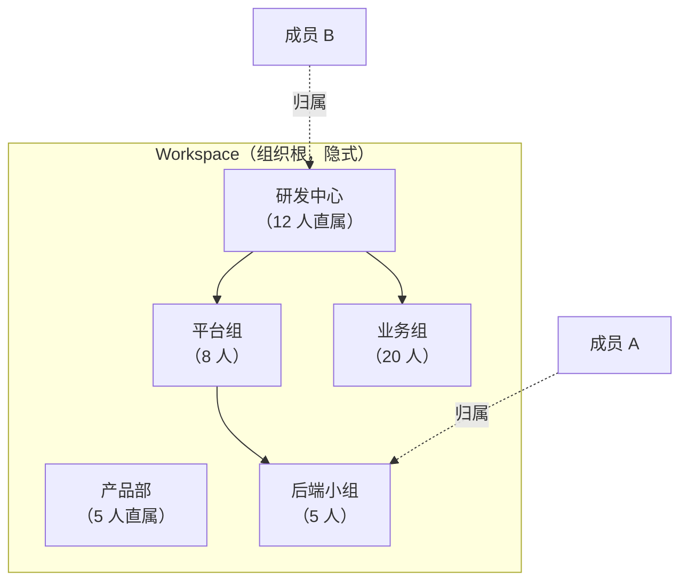
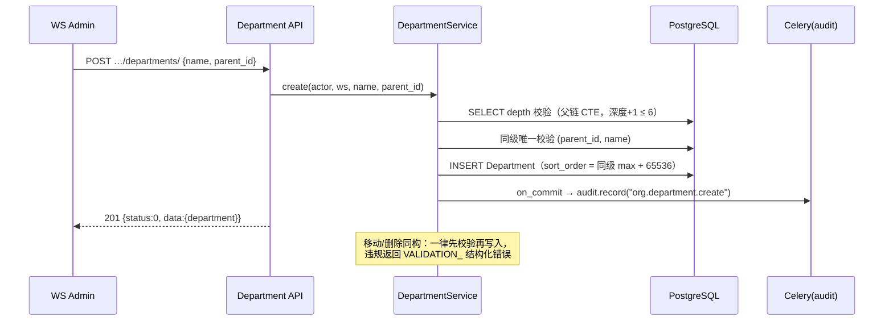
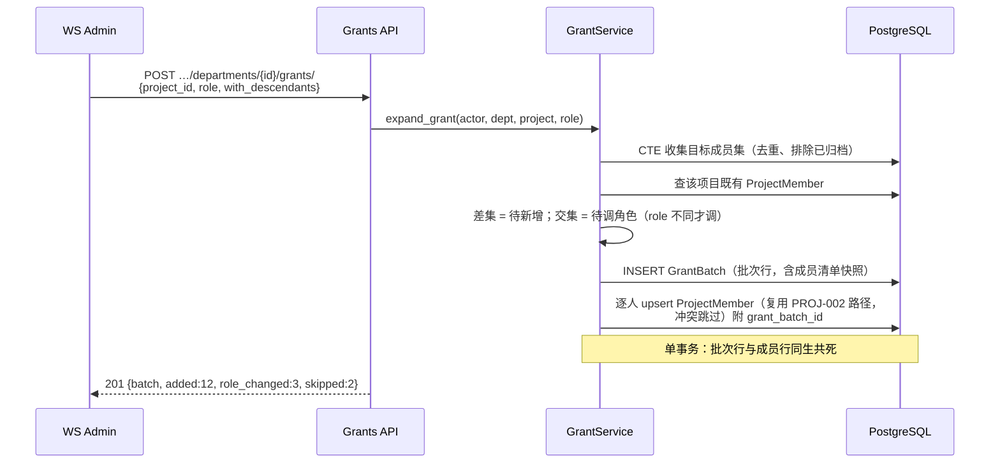

# 部门层级组织架构

| 元信息项 | 内容 |
| --- | --- |
| 文档编号 | AUTH-007 |
| 所属迭代 | Sprint 8 — 企业组织权限治理（第 11 周） |
| 优先级 | P3（企业版核心级 · 组织治理三问之「谁在组织里」） |
| 所属模块 | M1-AUTH｜账号与权限 |
| 文档状态 | 待评审（Draft） |
| 最后更新日期 | 2026-09-01 |
| 上游依赖 | `TEAM-001/002`（WorkspaceMember 成员体系）、`rbac-permission-model.md`（四层 Permission 体系）、`PROJ-002`（项目成员模型——批量授权的落点） |
| 下游消费 | `AUTH-008`（按部门批量挂接自定义角色）、`AUTH-009`（SSO JIT 部门映射的落点）、`AUTH-010`（部门变更入审计）、`RPT-004`（按部门负载统计） |
| 上游依据 | `docs/需求文档.md` §3.1 企业版专属（部门层级组织架构）、§8.2 组织架构 P3 列 |
| 关联架构文档 | [`rbac-permission-model.md`](../architecture/rbac-permission-model.md)（WS 层角色语义）、[`api-conventions.md`](../architecture/api-conventions.md)（§4 信封 / §8 错误码 / §5 查询能力） |
| 对标基线 | Ones 组织架构（部门树 + 按部门授权） · 飞书/钉钉通讯录（部门-成员范式） · Plane（**无部门概念**——企业版差异化能力） |
| 工作量估算 | 后端 3 人日 / 前端 3 人日 / 联调与测试 1.5 人日，合计 **7.5 人日** |

---

## 1. 概述

### 1.1 功能定位

标准版的成员体系是「平」的：一个 Workspace 里一份成员名单，授权以「人」为最小单位逐个点选。企业组织真实形态是「树」的：公司 → 研发中心 → 平台组 → 后端小组，授权、统计、汇报都以「部门」为天然单位。AUTH-007 交付 Workspace 内的部门层级组织架构：

1. **部门树**：`Department` 自引用树，深度 ≤ 6，支持增删改、移动（换父级）、排序；
2. **成员归属**：成员挂到部门（一人一部门），附带**岗位**（position）自由文本；
3. **按部门批量授权**：把部门（含子部门）成员一次性展开写入项目成员或角色挂接——从「点人」升级为「点部门」；
4. **按部门统计**：成员数、任务量、工时的部门聚合入口（本文档定义成员与任务量口径，工时聚合归 `RPT-004` 消费）。

它回答治理三问的第一问「**谁在组织里**」，是 `AUTH-008`（角色）、`AUTH-009`（SSO JIT 映射）的数据地基。

### 1.2 关键约定：部门树的语义



| 约定 | 说明 | 理由 |
| --- | --- | --- |
| 一人一部门 | 成员至多归属 1 个部门（可为空=未分配） | 统计口径唯一（矩阵式多归属归 P4 评估） |
| 深度 ≤ 6 | 根部门为第 1 层 | 企业现实 4-5 层足够；限深防误操作拖出失控树 |
| 父子统计独立 | 部门成员数 = 直属成员；「含子部门」为聚合口径（`with_descendants=true`） | 直属与聚合混用是企业通讯录最常见统计事故 |
| 未分配桶 | 未挂部门成员进入虚拟「未分配」分组 | 保证「全体成员 = 各部门 + 未分配」恒等式可核对 |
| 删除受限 | 仅当部门无直属成员且无子部门时可删；否则须先迁移 | 杜绝删部门连带丢授权/丢统计归属 |

### 1.3 关键约定：按部门授权是「快照展开」

> ⚠️ 「把平台组加入项目 P」**不是**建立「部门→项目」的活绑定，而是**授权时刻**把部门成员快照展开为逐人 `ProjectMember` 行。

| 维度 | 快照展开（本版采用） | 活绑定（明确不做，P4 评估） |
| --- | --- | --- |
| 新入职成员进部门 | **不自动**获得项目权限，需重新执行批量授权 | 自动获得 |
| 成员调离部门 | **不自动**回收项目权限 | 自动回收 |
| 权限审计 | 每条授权落在个人头上，可追溯「谁于何时因何批次加入」 | 需穿透部门历史才能回答 |
| 实现复杂度 | 一次性展开写入（复用 `PROJ-002` 成员写入路径） | 需权限判定链路实时展开部门树 |

理由：权限语义必须「可点名人头」——审计（`AUTH-010`）与合规要求每个项目的每条规定权限都能落到具体人与具体授权事件。活绑定的「自动获得/回收」会在无感知情况下改变权限面，企业客户的安全评审普遍不接受。作为补偿，提供**授权批次记录**（`grant_batch` 标识）与「再次同步」入口：管理员可对同部门同项目重跑授权，幂等地补齐新成员（不回收已调离者——回收须显式逐人操作并留痕）。

### 1.4 范围边界

| 范围 | 本文档交付 | 明确不做 |
| --- | --- | --- |
| 部门树 | CRUD / 移动 / 排序 / 深度限制 / 树读取 | 部门负责人（manager）字段——P4 随审批委派一并评估 |
| 成员归属 | 一人一部门挂接 / 岗位 / 未分配桶 / 批量调部门 | 一人多部门（矩阵组织，P4） |
| 批量授权 | 部门→项目成员快照展开 + 授权批次记录 + 幂等重同步 | 部门→工作流/文件等其它资源的授权（各自模块仿范式自建） |
| 统计 | 部门成员数（直属/含子级）、部门任务量聚合 API | 部门级报表页（`RPT-004` 消费本口径） |
| 兼容 | 不建部门时系统行为与标准版完全一致 | 集团-子公司跨 Workspace 组织（P4） |

### 1.5 前置依赖

| 依赖 | 内容 | 阻塞原因 |
| --- | --- | --- |
| `TEAM-001/002` | `WorkspaceMember` 模型与成员管理 API | 部门归属字段挂在成员关系上 |
| `PROJ-002` | `ProjectMember` 写入路径（角色校验、幂等加人） | 批量授权复用其逐人写入，不另造轮子 |
| `rbac-permission-model.md` | WS 层角色语义（WS_ADMIN+ 管理权限） | 部门管理权限码 `org.manage` 的挂载层 |
| `TASK-010` | Activity 管道范式（event_key 幂等） | 部门变更事件与授权批次留痕复用 |

### 1.6 竞品参考

| 竞品 | 参考点 | 处置 |
| --- | --- | --- |
| Ones | 部门树 + 「按部门添加项目成员」快照展开 + 未分配成员桶 | **全面对齐**（含快照语义与未分配恒等式） |
| 飞书/钉钉 | 通讯录部门-岗位模型、深度限制（飞书 ≤ 50 层） | 岗位字段采纳；深度取更严的 6（项目管理系统无需通讯录级深树） |
| Plane | 无部门概念，仅 Workspace 成员平表 | 差异化能力，无实现参考 |
| Jira | 无原生部门（靠 User Group 近似） | 反例：Group 语义混杂授权与组织——本系统严格分离「部门=组织归属」「角色=权限集合」 |

---

## 2. 业务逻辑

### 2.1 部门树管理流程



### 2.2 成员归属与批量授权流程

**挂部门**：`PATCH …/members/{member_id}/` 传 `department_id`（null=移入未分配）。成员列表支持 `?department=<id>` 与 `?department=<id>&with_descendants=true` 两种过滤。

**批量授权**（核心流程）：



**幂等重同步**：对同 `(department, project)` 重复 POST 不产生重复成员行——既有成员仅在 `role` 变更时更新并记新批次；无任何变化时返回 `added:0` 空批次（批次行仍记录，作为审计锚点）。

### 2.3 业务规则汇总

| 编号 | 规则 | 触发点 | 违规响应 |
| --- | --- | --- | --- |
| BR-01 | 部门深度 ≤ 6（根为 1） | 创建/移动 | `VALIDATION_ERROR` + `{"field":"parent_id","reason":"max_depth_exceeded","max":6}` |
| BR-02 | 同级部门名唯一（不区分大小写） | 创建/改名/移动 | `VALIDATION_ERROR` + `{"field":"name","reason":"duplicate_in_siblings"}` |
| BR-03 | 移动不得造成环（新父级不得是自身后代） | 移动 | `VALIDATION_ERROR` + `reason:"cycle_detected"` |
| BR-04 | 仅空部门可删（无直属成员且无子部门） | 删除 | `VALIDATION_ERROR` + `{"reason":"not_empty","member_count":n,"child_count":m}` |
| BR-05 | 一人一部门；`department_id=null` 表示未分配 | 挂接 | —（正常路径） |
| BR-06 | 部门管理（增删改/移动/授权）需 `org.manage`（WS_ADMIN+）；读取全员 | 全部写端点 | `PERM_DENIED` |
| BR-07 | 批量授权展开含子部门可选（`with_descendants`，默认 true） | 授权 | — |
| BR-08 | 授权目标成员集排除已停用/已归档成员 | 授权 | 计入 `skipped` 并在响应列明 |
| BR-09 | 已是项目成员者仅在角色不同的时候调角色（调角色产生独立批次明细） | 授权 | — |
| BR-10 | 批量授权 `role` 仅接受 PROJ 层四角色；PROJ_ADMIN 授予需操作者本身是该项目 PROJ_ADMIN 或 WS_ADMIN | 授权 | `PERM_DENIED` |
| BR-11 | 部门改名/移动/删除均入审计流（`AUTH-010`）与 Activity 管道 | 写操作 | — |
| BR-12 | 归档成员保留部门归属（恢复后原样） | 成员归档 | — |
| BR-13 | 岗位（position）为 ≤64 字符自由文本，不做枚举 | 挂接 | 超长 `VALIDATION_ERROR` |
| BR-14 | 部门排序 `sort_order` 浮点插值（同级），重平衡阈值与 Issue 一致 | 排序 | — |
| BR-15 | 树读取默认返回全部部门（平铺+parent_id），前端组树；`?include=member_count` 附直属/聚合计数 | 读取 | — |

### 2.4 异常处理

| 场景 | 处理 |
| --- | --- |
| 移动部门时目标父级被并发删除 | 行锁读父级 → 不存在则 `RESOURCE_NOT_FOUND`（404） |
| 批量授权中项目被并发归档 | 事务内 `select_for_update` 项目行；已归档 → `VALIDATION_ERROR` `reason:"project_archived"`，整批回滚 |
| 授权展开成员集为空（空部门） | 201 空批次，`added:0`，`warnings:["empty_department"]` |
| 树读取超大（>500 部门） | 平铺响应 + cursor 分页；深度校验保证单行 JSON 可控 |

### 2.5 边界条件

- **未分配恒等式**：`总成员数 = Σ各部门直属 + 未分配`，成员列表页以此做对账展示。
- **删人 vs 调部门**：成员离职走 `TEAM-002` 停用流程，部门归属保留至停用；停用成员不计入部门统计但与授权展开（BR-08）。
- **排序稳定性**：`sort_order` 同级插入取前后中点；间距 < 1e-6 触发同级重平衡（一次性 UPDATE 为等差序列）。

---

## 3. UI/UX 设计

### 3.1 组织管理页整体布局

```
┌──────────────────────────────────────────────────────────────────────┐
│ 工作空间设置 / 组织架构                            [+ 新建根部门]      │
├──────────────────────┬───────────────────────────────────────────────┤
│ 部门树                │ 部门详情：研发中心                              │
│                      │ ┌───────────────────────────────────────────┐ │
│ ▾ 研发中心    (12/45)│ │ 直属成员 12 · 含子部门 45 · 子部门 2        │ │
│   ▾ 平台组     (8/13)│ ├───────────────────────────────────────────┤ │
│     ▸ 后端小组 (5/5) │ │ 成员（直属）          岗位       操作      │ │
│   ▸ 业务组    (20/27)│ │ ○ 张三               后端工程师  [调部门]  │ │
│ ▾ 产品部       (5/5) │ │ ○ 李四               技术负责人  [调部门]  │ │
│ 未分配         (3)   │ │ …                            [批量调部门] │ │
│                      │ ├───────────────────────────────────────────┤ │
│ [拖拽移动部门]        │ │ [+ 添加成员到部门]  [按部门授权到项目 ▸]   │ │
│                      │ └───────────────────────────────────────────┘ │
└──────────────────────┴───────────────────────────────────────────────┘
```

- 计数徽标格式 `直属/含子级`；「未分配」为虚拟节点，点击过滤成员列表。
- 拖拽移动部门：拖到目标节点上高亮「成为其子部门」；非法目标（自身后代、第 6 层以下）实时禁用落点并提示原因。

### 3.2 批量授权弹窗

```
┌──────────────── 按部门授权到项目 ────────────────┐
│ 部门：研发中心（含子部门共 45 人）  ☑ 包含子部门  │
│ 项目：[搜索选择项目 ▾]  角色：[贡献者 ▾]         │
│ ┌──────────────────────────────────────────────┐ │
│ 预览：45 人目标 → 32 新增 · 10 已是成员(角色一致) │ │
│ · 2 角色将调整 · 1 已停用将跳过                  │ │
│ └──────────────────────────────────────────────┘ │
│ ⚠ 快照授权：此后部门人员变动不会自动同步权限。     │
│                          [取消]  [确认授权]       │
└──────────────────────────────────────────────────┘
```

预览来自 `POST …/grants/preview/`（与正式授权同一展开逻辑，只读）。授权完成 Toast 展示实际计数并链接到批次详情。

### 3.3 成员列表的部门列与筛选

- 成员管理页新增「部门」「岗位」两列；部门筛选器含「含子部门」开关。
- 「批量调部门」：勾选成员 → 选择目标部门 → 确认（审计留痕逐人一条）。

### 3.4 空状态 / 加载 / 失败

| 状态 | 表现 |
| --- | --- |
| 无部门 | 空插画 + 「组织架构帮助按部门批量授权与统计」+ 主按钮「新建根部门」 |
| 树加载中 | 树骨架屏（3 层缩进灰条） |
| 授权失败 | Toast 错误码语义化（如「项目已归档，无法授权」），弹窗不关闭保留选择 |
| 删除被拒 | 对话框列出阻塞计数（直属 n 人 / 子部门 m 个）+「一键迁移成员到上级」快捷入口 |

### 3.5 响应式与无障碍

- < 1024px 时树与详情改为 Tab 切换；树节点可键盘操作（↑↓ 移动、→ 展开、Enter 选中）。
- 拖拽提供等价键盘操作（节点菜单「移动到…」对话框）。

---

## 4. 技术架构

### 4.1 数据模型

```python
# apps/core/models/department.py
class Department(models.Model):
    id = models.ULIDField(primary_key=True)
    workspace = models.ForeignKey("Workspace", on_delete=models.CASCADE,
                                  related_name="departments")
    parent = models.ForeignKey("self", null=True, blank=True,
                               on_delete=models.PROTECT, related_name="children")
    name = models.CharField(max_length=64)
    sort_order = models.FloatField(default=65536.0)
    created_by = models.ForeignKey("User", on_delete=models.PROTECT)
    created_at = models.DateTimeField(auto_now_add=True)
    updated_at = models.DateTimeField(auto_now=True)

    class Meta:
        db_table = "department"
        constraints = [
            models.UniqueConstraint(
                "workspace", "parent", models.functions.Lower("name"),
                name="uq_department_sibling_name"),
            models.CheckConstraint(check=models.Q(sort_order__gt=0),
                                   name="ck_department_sort_positive"),
        ]
        indexes = [
            models.Index("workspace", "parent", "sort_order",
                         name="idx_department_tree_read"),
        ]

class DepartmentGrantBatch(models.Model):
    """授权批次：快照展开的审计锚点（BR-09/重同步幂等）"""
    id = models.ULIDField(primary_key=True)
    workspace = models.ForeignKey("Workspace", on_delete=models.CASCADE)
    department = models.ForeignKey(Department, on_delete=models.PROTECT,
                                   related_name="grant_batches")
    project = models.ForeignKey("Project", on_delete=models.CASCADE)
    role = models.CharField(max_length=20)  # PROJ 层四角色
    with_descendants = models.BooleanField(default=True)
    added_count = models.IntegerField(default=0)
    role_changed_count = models.IntegerField(default=0)
    skipped_count = models.IntegerField(default=0)
    member_snapshot = models.JSONField(default=list)  # [{user_id, action}]
    created_by = models.ForeignKey("User", on_delete=models.PROTECT)
    created_at = models.DateTimeField(auto_now_add=True)

    class Meta:
        db_table = "department_grant_batch"
        indexes = [models.Index("project", "created_at",
                                name="idx_grant_batch_project")]
```

`WorkspaceMember` 增量字段（迁移：两列均 nullable，零回填）：

```python
class WorkspaceMember(models.Model):
    # …既有字段…
    department = models.ForeignKey("Department", null=True, blank=True,
                                   on_delete=models.SET_NULL,
                                   related_name="members")
    position = models.CharField(max_length=64, blank=True, default="")
```

迁移要点：`department` 删部门受限（BR-04）故 `SET_NULL` 仅兜底；`uq_department_sibling_name` 对 `parent IS NULL`（根部门）在 PG 中 NULL 不参与唯一——根部门重名改用**部分唯一索引**兜底：

```sql
CREATE UNIQUE INDEX uq_department_root_name
  ON department (workspace_id, lower(name)) WHERE parent_id IS NULL;
```

### 4.2 API 定义

| 方法 | 路径 | 说明 | 权限 |
| --- | --- | --- | --- |
| GET | `/api/v1/workspaces/{slug}/departments/` | 部门平铺列表（`?include=member_count`） | 成员 |
| POST | `/api/v1/workspaces/{slug}/departments/` | 新建部门 | `org.manage` |
| PATCH | `/api/v1/workspaces/{slug}/departments/{id}/` | 改名 / 排序（`sort_after`） | `org.manage` |
| DELETE | `/api/v1/workspaces/{slug}/departments/{id}/` | 删除空部门 | `org.manage` |
| POST | `/api/v1/workspaces/{slug}/departments/{id}/move/` | 移动（换父级） | `org.manage` |
| PATCH | `/api/v1/workspaces/{slug}/members/{member_id}/` | 挂部门/岗位（扩展 TEAM-002 既有端点白名单字段） | `member.manage` |
| POST | `/api/v1/workspaces/{slug}/departments/{id}/members:bulk-move/` | 批量调部门 `{member_ids[], department_id}` | `org.manage` |
| POST | `/api/v1/workspaces/{slug}/departments/{id}/grants/preview/` | 授权预览（只读展开） | `org.manage` |
| POST | `/api/v1/workspaces/{slug}/departments/{id}/grants/` | 执行批量授权 | `org.manage` + BR-10 |
| GET | `/api/v1/workspaces/{slug}/departments/{id}/stats/` | 部门统计（成员/任务量） | 成员 |

**POST 创建部门 — 201**：

```json
{
  "status": 0,
  "data": {
    "department": {
      "id": "01J9XK3Q0W2E8R4T6Y7U9I0O1P",
      "parent_id": "01J9XK2M0N1B2V3C4X5Z6A7S8D",
      "name": "后端小组",
      "sort_order": 131072.0,
      "member_count": 0,
      "created_at": "2026-09-01T09:30:00.000000Z"
    }
  },
  "meta": {"request_id": "01J9XK3Q9F2G4H6J8K0M2N4P6R"}
}
```

**深度超限 — 400**：

```json
{
  "status": 1,
  "error": {
    "code": "VALIDATION_ERROR",
    "message": "部门层级最多 6 层",
    "details": [{"field": "parent_id", "reason": "max_depth_exceeded", "max": 6, "current": 6}]
  },
  "meta": {"request_id": "01J9XK3R2T4Y6U8I0O2P4A6S8D"}
}
```

**POST grants/ 请求与 201 响应**：

```json
{"project_id": "01J9XK1A2B3C4D5E6F7G8H9J0K", "role": "PROJ_CONTRIBUTOR", "with_descendants": true}
```

```json
{
  "status": 0,
  "data": {
    "batch_id": "01J9XK4B1C2D3E4F5G6H7J8K9M",
    "added": 32, "role_changed": 2, "skipped": 1,
    "skipped_detail": [{"user_id": "01J9XJ…", "reason": "deactivated"}]
  },
  "meta": {"request_id": "01J9XK4C3D5F7H9J1K3M5N7P9R"}
}
```

**移动成环 — 400**：

```json
{
  "status": 1,
  "error": {
    "code": "VALIDATION_ERROR",
    "message": "不能将部门移动到其自身或其子部门之下",
    "details": [{"field": "parent_id", "reason": "cycle_detected"}]
  },
  "meta": {"request_id": "01J9XK5D4E6G8J0L2N4P6R8T0V"}
}
```

**无管理权限 — 403**：`{"code":"PERM_DENIED","message":"需要工作空间管理员权限"}`；非成员访问 → 404（存在性隐藏，`api-conventions §8`）。

**GET departments/?include=member_count — 200**：

```json
{
  "status": 0,
  "data": {
    "departments": [
      {"id": "01J9XK2M0N1B2V3C4X5Z6A7S8D", "parent_id": null, "name": "研发中心",
       "sort_order": 65536.0, "member_count": 12, "descendant_member_count": 45},
      {"id": "01J9XK2N8P7Q6R5S4T3U2V1W0X", "parent_id": "01J9XK2M0N1B2V3C4X5Z6A7S8D",
       "name": "平台组", "sort_order": 65536.0, "member_count": 8, "descendant_member_count": 13}
    ],
    "unassigned_count": 3
  },
  "meta": {"request_id": "01J9XK6E5F7H9J1L3N5P7R9T1V3X"}
}
```

**GET departments/{id}/stats/ — 200**（任务量口径：部门直属成员在当前全部项目中的任务聚合）：

```json
{
  "status": 0,
  "data": {
    "department_id": "01J9XK2M0N1B2V3C4X5Z6A7S8D",
    "member_count": 12, "descendant_member_count": 45,
    "issues": {"total": 218, "completed": 96, "overdue": 7,
               "by_group": {"backlog": 20, "unstarted": 64, "started": 38, "completed": 96, "cancelled": 0}},
    "with_descendants": {"issues": {"total": 640, "completed": 301, "overdue": 22}}
  },
  "meta": {"request_id": "01J9XK7F6G8J0L2N4P6R8T0V2X4Z"}
}
```

**PATCH members/{id}/ 挂部门 — 400 示例（部门不存在于本工作空间）**：

```json
{
  "status": 1,
  "error": {"code": "VALIDATION_ERROR", "message": "部门不存在或不属于当前工作空间",
    "details": [{"field": "department_id", "reason": "not_found_in_workspace"}]},
  "meta": {"request_id": "01J9XK8G7H9K1M3P5R7T9V1X3Z5B"}
}
```


### 4.3 核心逻辑

```python
# apps/core/services/department.py
MAX_DEPTH = 6

def _depth_of(department_id) -> int:
    """父链深度（含自身）。递归 CTE 上溯，防环上限 100。"""
    sql = """
    WITH RECURSIVE chain AS (
        SELECT id, parent_id, 1 AS lvl FROM department WHERE id = %s
        UNION ALL
        SELECT d.id, d.parent_id, c.lvl + 1
        FROM department d JOIN chain c ON d.id = c.parent_id
        WHERE c.lvl < 100
    ) SELECT max(lvl) FROM chain;"""
    return Department.objects.raw_scalar(sql, [department_id]) or 0

def _subtree_ids(root_id) -> list:
    sql = """
    WITH RECURSIVE sub AS (
        SELECT id FROM department WHERE id = %s
        UNION ALL
        SELECT d.id FROM department d JOIN sub s ON d.parent_id = s.id
    ) SELECT id FROM sub;"""
    return Department.objects.raw_scalar_list(sql, [root_id])

@transaction.atomic
def create(*, actor, workspace, name, parent_id):
    parent = None
    if parent_id:
        parent = (Department.objects
                  .select_for_update()
                  .get(pk=parent_id, workspace=workspace))      # 404 出域
        if _depth_of(parent.id) + 1 > MAX_DEPTH:
            raise ValidationErr("parent_id", "max_depth_exceeded", max=MAX_DEPTH)
    dept = Department.objects.create(
        workspace=workspace, parent=parent, name=name, created_by=actor,
        sort_order=_next_sort(parent))                          # 浮点插值
    on_commit(lambda: record_audit.delay("org.department.create",
              actor_id=actor.id, object_id=dept.id))
    return dept

@transaction.atomic
def move(*, actor, department, new_parent_id):
    if new_parent_id:
        if new_parent_id in _subtree_ids(department.id):
            raise ValidationErr("parent_id", "cycle_detected")
        if _depth_of(new_parent_id) + _subtree_height(department.id) > MAX_DEPTH:
            raise ValidationErr("parent_id", "max_depth_exceeded", max=MAX_DEPTH)
    department.parent_id = new_parent_id
    department.sort_order = _next_sort(new_parent_id)
    department.save(update_fields=["parent_id", "sort_order", "updated_at"])
    on_commit(lambda: record_audit.delay("org.department.move", ...))

@transaction.atomic
def expand_grant(*, actor, department, project, role, with_descendants):
    if project.is_archived:
        raise ValidationErr("project_id", "project_archived")
    dept_ids = _subtree_ids(department.id) if with_descendants else [department.id]
    targets = (WorkspaceMember.objects
               .filter(workspace=department.workspace, department_id__in=dept_ids,
                       is_active=True)
               .values_list("user_id", flat=True).distinct())
    added, changed, skipped = [], [], []
    existing = {pm.user_id: pm for pm in
                ProjectMember.objects.filter(project=project, user_id__in=targets)}
    for uid in targets:
        pm = existing.get(uid)
        if pm is None:
            ProjectMember.objects.create(project=project, user_id=uid, role=role,
                                         added_by=actor)      # 复用 PROJ-002 校验
            added.append(uid)
        elif pm.role != role:
            pm.role = role; pm.save(update_fields=["role", "updated_at"])
            changed.append(uid)
    batch = DepartmentGrantBatch.objects.create(
        workspace=department.workspace, department=department, project=project,
        role=role, with_descendants=with_descendants,
        added_count=len(added), role_changed_count=len(changed),
        skipped_count=len(skipped),
        member_snapshot=_snapshot(added, changed, skipped), created_by=actor)
    on_commit(lambda: record_audit.delay("org.department.grant",
              actor_id=actor.id, object_id=batch.id))
    return batch
```

**权限挂接**：`org.manage` 注册进权限码注册表（`rbac-permission-model.md` CI 校验），映射 WS_ADMIN / WS_OWNER；`departments` 读端点对所有 workspace 成员开放。

**性能**：树读 = 单查询平铺（`idx_department_tree_read`）；授权展开 = 1 CTE + 1 既有成员查询 + 批量 INSERT（`bulk_create` 分批 500）；统计端点按部门聚合走 `Issue.assignees → WorkspaceMember.department` JOIN + 索引扫描，口径 SQL 固化在 `RPT-004` 复用的 `department_stats.sql`。

### 4.4 前端实现

```typescript
// stores/department.store.ts
class DepartmentStore {
  tree = observable<DepartmentNode[]>([]);
  flat = observable.map<string, Department>();

  async load(includeCounts = true) {
    const { data } = await api.get(`/workspaces/${wsSlug}/departments/`,
      { params: { include: includeCounts ? "member_count" : undefined } });
    runInAction(() => this.rebuildTree(data.departments));
  }

  @computed get unassignedCount() {
    return this.memberStore.total -
      sumBy([...this.flat.values()], d => d.member_count);
  }

  async move(id: string, newParentId: string | null) {
    await api.post(`/workspaces/${wsSlug}/departments/${id}/move/`,
      { parent_id: newParentId });
    await this.load();              // 树结构小，全量重拉
  }

  async grantPreview(deptId: string, projectId: string, role: string,
                     withDesc: boolean) {
    const { data } = await api.post(
      `/workspaces/${wsSlug}/departments/${deptId}/grants/preview/`,
      { project_id: projectId, role, with_descendants: withDesc });
    return data;                    // 弹窗预览计数
  }
}
```

组件：`<DepartmentTree>`（pragmatic-dnd 拖拽 + 非法落点禁用）、`<GrantDialog>`（预览→确认两段式）、`<MemberDeptColumn>`。视图共享 MobX 根 Store 注入，SWR 失效键 `["departments", wsSlug]`。

---

## 5. 测试用例

### 5.1 单元测试

| 编号 | 用例 | 断言 |
| --- | --- | --- |
| UT-01 | 根部门创建 | depth=1，sort_order=65536 |
| UT-02 | 第 6 层创建成功、第 7 层拒绝 | BR-01 错误结构 |
| UT-03 | 同级重名（大小写不同）拒绝 | `duplicate_in_siblings` |
| UT-04 | 根部门重名（部分唯一索引） | IntegrityError → 400 映射 |
| UT-05 | 移动到自身/后代拒绝 | `cycle_detected` |
| UT-06 | 移动后子树深度超 6 拒绝 | BR-01（`_subtree_height` 参与） |
| UT-07 | 删除非空部门拒绝 | BR-04 计数明细 |
| UT-08 | 挂部门/置 null 未分配 | 字段更新 + 审计事件 |
| UT-09 | 授权展开：含/不含子部门成员集 | 集合精确相等 |
| UT-10 | 授权幂等重同步：重复 POST | added=0，无重复 ProjectMember |
| UT-11 | 授权角色调整仅对角色不同者 | changed 精确 |
| UT-12 | 停用成员被排除进 skipped | BR-08 |
| UT-13 | sort_order 重平衡触发 | 间距 <1e-6 后等差 |
| UT-14 | 岗位超长 64 拒绝 | BR-13 |

### 5.2 集成测试

| 编号 | 用例 | 断言 |
| --- | --- | --- |
| IT-01 | 建 4 层树 + 20 成员挂接 + 树读取 | 平铺完整、计数 `直属/含子级` 正确 |
| IT-02 | 按部门授权到项目（含并发重复提交） | 成员落库一次；批次两行；响应计数一致 |
| IT-03 | 授权后调离成员不影响既有权限（快照语义） | ProjectMember 保留 |
| IT-04 | 并发移动两部門互为父子 | 其一 `cycle_detected`，无死锁 |
| IT-05 | 项目归档中执行授权 | 整批回滚 + `project_archived` |
| IT-06 | 未分配恒等式 | 总数 = Σ直属 + 未分配 |
| IT-07 | 审计事件落库（create/move/grant/delete 四事件） | 事件字段完整 |

### 5.3 E2E 测试

| 编号 | 场景 |
| --- | --- |
| E2E-01 | 管理员建 3 层部门树 → 挂 10 成员 → 树计数正确 |
| E2E-02 | 拖拽移动部门（含非法落点禁用提示）→ 键盘「移动到…」等价路径 |
| E2E-03 | 按部门授权弹窗预览→确认→项目成员页可见新增 |
| E2E-04 | 删除非空部门受阻 → 一键迁移到上级 → 删除成功 |

---

## 6. 竞品深度对标

### 6.1 Ones 实现分析

Ones「组织设置-部门管理」：部门树 + 成员直属归属；「按部门添加项目成员」为**快照展开**（弹窗明示「后续部门变动不影响已添加成员」）；统计口径区分直属与含子级。其删除策略同为「空部门可删」。代码路径（Java 后端从其 API 行为推断）：展开在服务端单次事务内 `INSERT ... SELECT` 成员差集。

### 6.2 飞书/钉钉通讯录

飞书部门允许极深层级（≈50）、一人多部门（主部门+附属）。项目管理域的授权/统计语义不需要该复杂度——本系统取 6 层 + 单归属，换取统计恒等式与审计可点名人头。岗位字段两者均为自由文本，对齐。

### 6.3 Plane / Jira

Plane 无部门（企业版差异点）；Jira 以 User Group 同时承担「组织分组」与「授权集合」，导致「把人调出组=悄悄回收权限」的审计盲区——本系统刻意分离：部门管归属与统计，角色管权限，授权永远落到人。

### 6.4 本系统设计决策

| 决策 | 取舍 |
| --- | --- |
| 快照展开 + 批次记录 + 幂等重同步 | 牺牲「自动同步」便利，换审计可点名 + 无感权限变更归零 |
| 深度 6（vs 飞书 50） | 够用且防失控；CTE 深度有界 |
| 平铺读取 + 前端组树 | 部门量小（<500），免去嵌套序列化与分页复杂度 |

---

## 7. 里程碑与验收

### 7.1 交付物清单

| 类别 | 内容 |
| --- | --- |
| Model / Migration | `department`、`department_grant_batch` 表；`workspace_member` 增 `department_id/position` 两列 |
| 后端 | Department CRUD/move 服务、授权展开服务（preview 与正式同逻辑）、统计端点、`org.manage` 权限码注册 |
| 前端 | 组织管理页（树+详情）、批量授权弹窗、成员列表部门/岗位列、批量调部门 |
| 测试 | UT-01~14、IT-01~07、E2E-01~04 |

### 7.2 可操作演示的验收标准

1. 建 4 层部门树挂 20 名成员：树计数（直属/含子级）与成员列表过滤（含/不含子部门）三处口径一致；未分配恒等式成立。
2. 对含 12 人的部门执行项目授权（含子部门）：预览与正式计数一致；项目成员列表出现 12 人且批次详情可点名每人来源；重复执行返回 added=0 且成员行零重复。
3. 将成员调离部门后重跑授权：该成员项目权限**保留**（快照语义），新入职成员被补齐。
4. 第 6 层下新建/移动部门被结构化拒绝；拖部门到自身子树下被禁并提示。
5. 非空部门删除被拒并展示阻塞计数；「一键迁移到上级」后可删，审计流含全部事件。
6. 全部新端点通过 `api-conventions.md` §14 检查清单（信封/错误码/404 存在性隐藏/幂等）。


