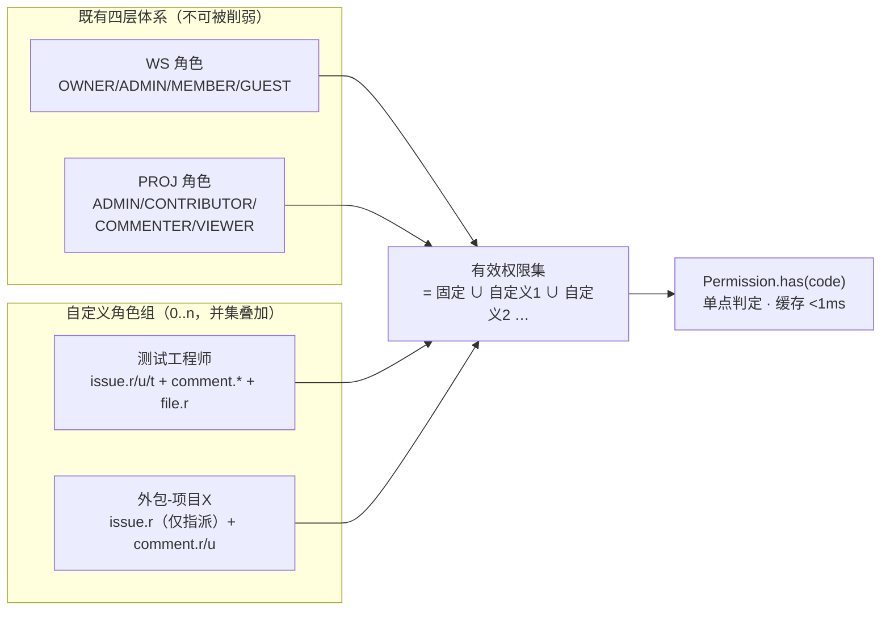
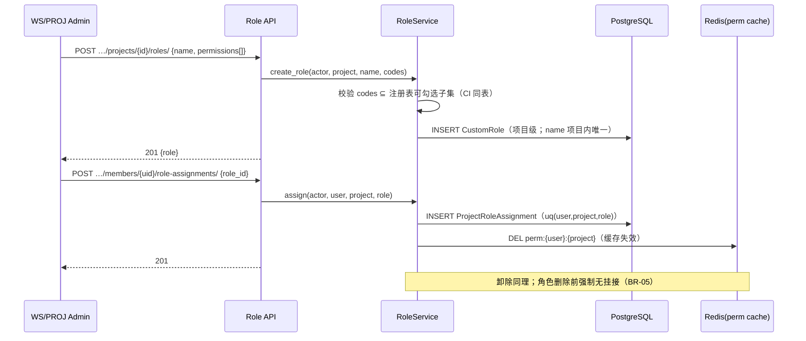
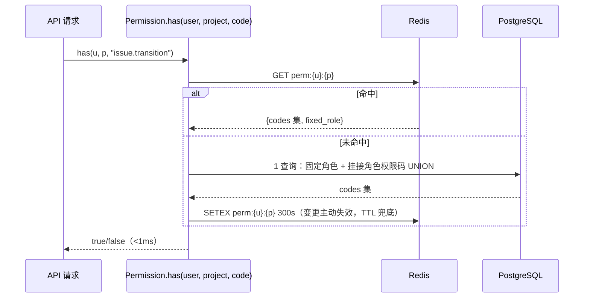

# 自定义角色组与细粒度资源权限

| 元信息项 | 内容 |
| --- | --- |
| 文档编号 | AUTH-008 |
| 所属迭代 | Sprint 8 — 企业组织权限治理（第 11 周） |
| 优先级 | P3（企业版核心级 · 组织治理三问之「谁能做什么」） |
| 所属模块 | M1-AUTH｜账号与权限 |
| 文档状态 | 待评审（Draft） |
| 最后更新日期 | 2026-09-01 |
| 上游依赖 | `rbac-permission-model.md`（四层 Permission 体系与权限码注册表）、`AUTH-007`（按部门批量挂接的落点）、Sprint 7（`workflow.manage` 等权限码全集冻结） |
| 下游消费 | **全模块权限判定**（角色解析进入四层体系）、`AUTH-010`（角色变更入审计）、`BOARD-005`（共享视图的可见面判定）、P4 实例级 ACL |
| 上游依据 | `docs/需求文档.md` §3.1 企业版专属（自定义角色组、细粒度资源权限）、§8.2 权限 P3 列 |
| 关联架构文档 | [`rbac-permission-model.md`](../architecture/rbac-permission-model.md)（四层角色 / 权限码 / 判定顺序）、[`api-conventions.md`](../architecture/api-conventions.md)（§8 错误码） |
| 对标基线 | Ones 自定义角色（权限矩阵勾选） · Jira Permission Scheme（反面对照：过于自由的代价） · Plane（仅四固定角色） |
| 工作量估算 | 后端 3.5 人日 / 前端 2.5 人日 / 联调与测试 2 人日，合计 **8 人日** |

---

## 1. 概述

### 1.1 功能定位

标准版权限是四固定项目角色（PROJ_ADMIN/CONTRIBUTOR/COMMENTER/VIEWER）× 三固定工作空间角色的笛卡尔积——覆盖 80% 团队，但企业客户的真实诉求是「测试工程师：任务读写 + 评论 + 流转，但不能删任务、不能管成员」「外包：仅能见被指派任务」。AUTH-008 交付**自定义角色组**：

1. **角色 = 权限码集合**：组织自定义角色（如「测试工程师」），勾选权限码矩阵（`issue.read/create/update/delete/transition`、`comment.*`、`file.*`、`worklog.*` …）；
2. **多角色并集**：成员可在固定角色之外挂 0..n 个自定义角色，**有效权限 = 固定角色 ∪ 各自定义角色**（只加不减——自定义角色永远不能削弱固定角色）；
3. **全链路生效**：同一套判定函数服务 API 权限、序列化器字段剔除、前端按钮显隐（`AUTH-005` 按钮权限体系消费同一权限码集）；
4. **解析高性能**：角色解析结果按 `(user, project)` 缓存，单请求判定 < 1ms。

它是治理三问中「谁能做什么」的答案层，也是 Sprint 7 工作流权限（`workflow.manage`、流转角色矩阵）的载体——**自定义角色可以像固定角色一样被流转守卫引用**。

### 1.2 关键约定：只加不减的并集语义



| 约定 | 说明 | 理由 |
| --- | --- | --- |
| 并集只加 | 自定义角色只授予、不剥夺；无权表达「禁止」 | 「允许 ∪ 禁止」语义是企业权限系统头号事故源（Jira 教训）；剥夺靠降低固定角色实现 |
| 项目级挂载 | 自定义角色挂接在 `(user, project)` 上（与 PROJ 固定角色同层）；WS 层自定义角色 P4 评估 | 权限爆炸半径可控；审计可逐项目点名 |
| 权限码全集冻结 | 可勾选的权限码 = 注册表（`rbac-permission-model.md` + Sprint 7 增补）的子集，CI 校验 | 防止角色引用已下线权限码 |
| 固定角色不可删改 | 四固定 PROJ 角色语义内置代码，自定义角色并存 | 兼容承诺：不配置自定义角色 = 标准版行为 |

### 1.3 范围边界

| 范围 | 本文档交付 | 明确不做 |
| --- | --- | --- |
| 角色 CRUD | 角色组增删改、权限码矩阵、内置模板（测试/外包/只读干系人） | 角色继承（角色基于角色，P4） |
| 挂接 | 逐人挂/卸、按部门批量挂（复用 `AUTH-007` 快照展开） | 资源实例级 ACL（单条任务专属授权，P4） |
| 判定 | 四层 Permission 体系扩展：`Permission.has()` 读并集；序列化字段剔除不变 | 字段级「禁止写」负权限（由 `TASK-012` 字段权限按角色只读/隐藏表达，非本角色体系） |
| 性能 | Redis 缓存 `(user, project) → 权限码集`，变更即失效 | 跨项目通配挂接（P4） |
| 审计 | 角色 CRUD/挂接/卸除全量入 `AUTH-010` | — |

### 1.4 前置依赖

| 依赖 | 内容 | 阻塞原因 |
| --- | --- | --- |
| `rbac-permission-model.md` | 权限码注册表 + CI 校验、四层判定顺序 | 自定义角色只是第五种「权限码来源」，判定链路复用 |
| `AUTH-005` | 前端按钮权限（`usePermission(code)`） | 自定义角色生效后前端显隐零改动——消费同一码集 |
| `AUTH-007` | 部门批量快照展开范式 | 按部门挂角色复用（落点改为 `ProjectRoleAssignment`） |
| Sprint 7 | `workflow.manage`、流转守卫角色矩阵 | 守卫引用自定义角色（按角色名/ID） |

### 1.5 竞品参考

| 竞品 | 参考点 | 处置 |
| --- | --- | --- |
| Ones | 自定义角色 + 权限点矩阵勾选 + 多角色叠加（并集） | **全面对齐**（含只加不减） |
| Jira | Permission Scheme 自由映射 + Group 嵌套 | 反面：自由度导致「谁也说不清某用户为何有这个权限」——本系统以并集 + 无负权限 + 无嵌套规避 |
| GitLab | 预置角色 + custom roles（EE，在 Guest 上叠加权限码） | 叠加语义佐证；其「仅限自上而下加权限」与本版一致 |
| Plane | 四固定角色，无自定义 | 差异化能力 |

---

## 2. 业务逻辑

### 2.1 角色定义与挂接流程



### 2.2 权限判定时序（请求热路径）



### 2.3 业务规则汇总

| 编号 | 规则 | 触发点 | 违规响应 |
| --- | --- | --- | --- |
| BR-01 | 有效权限 = 固定角色 ∪ 全部已挂自定义角色；不存在负权限 | 判定 | —（语义公理） |
| BR-02 | 角色权限码必须 ⊆ 注册表「可自定义」子集（WS 层/计费层/系统层码不可勾选） | 角色创建/更新 | `VALIDATION_ERROR` + 非法码清单 |
| BR-03 | 项目内角色名唯一（不区分大小写）；≤40 字符 | CRUD | `VALIDATION_ERROR` `duplicate_name` |
| BR-04 | 每项目自定义角色 ≤ 20；单角色权限码 ≤ 60 | CRUD | `RESOURCE_LIMIT_EXCEEDED`（409） |
| BR-05 | 有挂接的角色不可删（须先全部卸除） | 删除 | `VALIDATION_ERROR` + `{"assigned_count":n}` |
| BR-06 | 同一 `(user, project, role)` 挂接幂等（重复挂 201 无新行） | 挂接 | — |
| BR-07 | 挂接/卸除/角色变更 → 目标用户缓存立即失效（DEL，非等 TTL） | 写操作 | — |
| BR-08 | 角色管理需 `role.manage`（PROJ_ADMIN+ 或 WS_ADMIN+）；挂接还需对目标项目 `member.manage` | 写端点 | `PERM_DENIED` |
| BR-09 | 按部门批量挂角色：复用 `AUTH-007` 快照展开，落点为挂接行；批次记 `DepartmentGrantBatch` 扩展 `target_type=role` | 批量挂接 | — |
| BR-10 | 自定义角色可被流转守卫/审批节点按 ID 引用；角色删除前校验无引用 | 删除 | `VALIDATION_ERROR` + 引用清单 |
| BR-11 | 成员被移出项目 → 其挂接行级联删除 + 缓存失效 | 成员管理 | — |
| BR-12 | 角色权限码收紧（取消勾选）即时生效于全部挂接者 | 角色更新 | 缓存批量失效（按挂接清单逐 DEL） |
| BR-13 | 权限判定失败封闭（deny by default）：码集不含即拒 | 判定 | `PERM_DENIED` |
| BR-14 | 内置三模板（测试工程师/外包协作/只读干系人）预置权限码，可改可删 | 初始化 | — |
| BR-15 | 审计：角色 CRUD 记 `role.*`，挂接/卸除记 `role.assign/revoke`（含角色快照名） | 写操作 | — |

### 2.4 异常处理

| 场景 | 处理 |
| --- | --- |
| 缓存失效失败（Redis 抖动） | 写路径仍提交（DB 为真源）；判定回源 DB 保证正确性，TTL 300s 兜住脏缓存 |
| 角色权限码含已下线码（注册表版本升级） | 读路径过滤未知码 + 告警日志；编辑角色时强制重校验 |
| 并发挂接同人同角色 | uq 约束兜底，`ignore_conflicts` 幂等 |
| 批量挂接中途部分失败 | 整事务回滚（与 `AUTH-007` 一致），无半吊子批次 |

### 2.5 边界条件

- **固定角色降级**：CONTRIBUTOR → VIEWER 后，其自定义角色仍然叠加（并集公理不保证「降固定即降有效」——管理员须同步审视挂接；UI 在降级弹窗列出其自定义角色提醒）。
- **WS_GUEST**：可挂自定义角色（典型「外包」场景），但 WS 层固定语义（仅见受邀项目）不可被自定义角色突破——自定义角色只在已可见项目内加权限。
- **权限码粒度**：沿用注册表既有码（`issue.create/update/delete/transition`、`comment.create/update/delete`、`file.upload/share`、`worklog.create/approve`、`workflow.manage`…），本版**不新增业务码**，仅新增管理码 `role.manage`。

---

## 3. UI/UX 设计

### 3.1 角色管理页

```
┌──────────────────────────────────────────────────────────────────────┐
│ 项目设置 / 角色与权限                                [+ 新建角色]      │
├──────────────┬───────────────────────────────────────────────────────┤
│ 固定角色      │ 自定义角色：测试工程师                    [编辑][删除] │
│  项目管理员   │ ┌───────────────────────────────────────────────────┐ │
│  贡献者      │ │ 权限码（42/60）                                    │ │
│  评论者      │ │ ☑ issue.read   ☑ issue.create  ☑ issue.update      │ │
│  观察者      │ │ ☑ issue.transition  ☐ issue.delete  ☐ issue.archive│ │
│             │ │ ☑ comment.create/update/delete   ☑ file.read/upload │ │
│ 自定义角色    │ │ ☐ file.share     ☐ worklog.approve …              │ │
│ ▶测试工程师(6)│ ├───────────────────────────────────────────────────┤ │
│  外包协作 (2) │ │ 已挂接成员（6）                                     │ │
│  只读干系人(0)│ │ ○ 王五（研发部）        [卸除]                     │ │
│             │ │ ○ 赵六（质量部）        [卸除]  [+ 挂接成员/部门]    │ │
│             │ └───────────────────────────────────────────────────┘ │
└──────────────┴───────────────────────────────────────────────────────┘
```

- 权限码按域分组（任务/评论/文件/工时/报表）折叠展示；不可勾选码置灰并标注「固定角色语义」。
- 删除按钮在有挂接时置灰，悬浮提示「先卸除 6 条挂接」。

### 3.2 挂接弹窗与批量挂接

```
┌────────────────── 挂接角色：测试工程师 ──────────────────┐
│ 添加对象： [逐人选择 ▾]  [按部门 ▾]                       │
│ ○ 搜索成员…           选中部门：质量部（含子部门 8 人）    │
│ ┌──────────────────────────────────────────────────────┐ │
│ 预览：8 人 → 6 新挂接 · 2 已挂接（幂等跳过）              │ │
│ └──────────────────────────────────────────────────────┘ │
│ ⚠ 角色只增加权限；成员固定角色的既有权限不受影响。         │
│                              [取消]  [确认挂接]           │
└──────────────────────────────────────────────────────────┘
```

### 3.3 成员视角的「我的权限」

成员卡片显示「固定角色：贡献者 ＋ 自定义：测试工程师」，点击展开**有效权限清单**（并集结果，只读）——回应「我为什么能/不能操作」的一线答疑，减少管理员咨询。

### 3.4 空状态 / 加载 / 失败

| 状态 | 表现 |
| --- | --- |
| 无自定义角色 | 空插画 + 三内置模板卡片「一键采用」 |
| 权限码保存失败 | 非法码高亮 + 错误文案（如「`billing.manage` 不开放自定义」） |
| 挂接失败 | 弹窗保留选择；Toast 语义化错误 |
| 权限生效延迟说明 | 挂接成功 Toast 附「即时生效；对端已打开页面将在下一次操作刷新」 |

### 3.5 响应式与无障碍

- 权限矩阵 < 768px 转为按域手风琴列表；勾选框 ≥ 24px 触控热区。
- 「我的权限」清单纯文本可读（屏幕阅读器友好），颜色不作唯一语义载体。

---

## 4. 技术架构

### 4.1 数据模型

```python
# apps/core/models/custom_role.py
class CustomRole(models.Model):
    id = models.ULIDField(primary_key=True)
    project = models.ForeignKey("Project", on_delete=models.CASCADE,
                                related_name="custom_roles")
    name = models.CharField(max_length=40)
    description = models.CharField(max_length=200, blank=True, default="")
    permissions = models.JSONField(default=list)   # ["issue.read", ...] 有序去重
    is_builtin_template = models.BooleanField(default=False)
    created_by = models.ForeignKey("User", on_delete=models.PROTECT)
    created_at = models.DateTimeField(auto_now_add=True)
    updated_at = models.DateTimeField(auto_now=True)

    class Meta:
        db_table = "custom_role"
        constraints = [
            models.UniqueConstraint("project", models.functions.Lower("name"),
                                    name="uq_custom_role_name"),
            models.CheckConstraint(
                check=models.Q(permissions__0__isnull=False) | models.Q(permissions=[]),
                name="ck_custom_role_perms_shape"),
        ]

class ProjectRoleAssignment(models.Model):
    id = models.ULIDField(primary_key=True)
    project = models.ForeignKey("Project", on_delete=models.CASCADE)
    user = models.ForeignKey("User", on_delete=models.CASCADE)
    role = models.ForeignKey(CustomRole, on_delete=models.CASCADE,
                             related_name="assignments")
    grant_batch = models.ForeignKey("DepartmentGrantBatch", null=True,
                                    on_delete=models.SET_NULL)   # AUTH-007 批量溯源
    created_by = models.ForeignKey("User", on_delete=models.PROTECT,
                                   related_name="+")
    created_at = models.DateTimeField(auto_now_add=True)

    class Meta:
        db_table = "project_role_assignment"
        constraints = [models.UniqueConstraint("project", "user", "role",
                                               name="uq_role_assignment")]
        indexes = [models.Index("project", "user", name="idx_role_assign_lookup")]
```

迁移要点：`permissions` JSONB 存**权限码字符串数组**（不入库码表 FK——码的权威是注册表代码，CI 校验一致）；`grant_batch` 外键复用 `AUTH-007` 表（其增 `target_type` 判别列：`"project_membership" | "role"`）。

### 4.2 API 定义

| 方法 | 路径 | 说明 | 权限 |
| --- | --- | --- | --- |
| GET | `/api/v1/projects/{id}/roles/` | 角色列表（含挂接计数） | 项目成员 |
| POST | `/api/v1/projects/{id}/roles/` | 新建角色 | `role.manage` |
| PATCH | `/api/v1/projects/{id}/roles/{role_id}/` | 改名/描述/权限码 | `role.manage` |
| DELETE | `/api/v1/projects/{id}/roles/{role_id}/` | 删除（BR-05/BR-10） | `role.manage` |
| GET | `/api/v1/projects/{id}/roles/permissions-catalog/` | 可勾选权限码目录（按域分组） | `role.manage` |
| POST | `/api/v1/projects/{id}/members/{uid}/role-assignments/` | 挂接 `{role_id}` | `role.manage`+`member.manage` |
| DELETE | `/api/v1/projects/{id}/members/{uid}/role-assignments/{role_id}/` | 卸除 | 同上 |
| POST | `/api/v1/projects/{id}/roles/{role_id}/assignments:bulk/` | 批量挂接 `{user_ids[]}` 或 `{department_id}` | 同上 |
| GET | `/api/v1/projects/{id}/members/{uid}/effective-permissions/` | 有效权限并集（我的权限/排障） | 本人或 `role.manage` |

**POST roles/ 请求与 201**：

```json
{"name": "测试工程师", "description": "测试团队标准角色",
 "permissions": ["issue.read", "issue.create", "issue.update", "issue.transition",
                 "comment.create", "comment.update", "comment.delete",
                 "file.read", "file.upload"]}
```

```json
{
  "status": 0,
  "data": {"role": {"id": "01J9XM1A2B3C4D5E6F7G8H9J0K", "name": "测试工程师",
    "permissions": ["comment.create", "comment.delete", "comment.update",
                    "file.read", "file.upload", "issue.create", "issue.read",
                    "issue.transition", "issue.update"],
    "assigned_count": 0, "created_at": "2026-09-01T10:00:00.000000Z"}},
  "meta": {"request_id": "01J9XM1B3C4D5E6F7G8H9J0K1M"}
}
```

**非法权限码 — 400**：

```json
{
  "status": 1,
  "error": {"code": "VALIDATION_ERROR", "message": "包含不开放自定义的权限码",
    "details": [{"field": "permissions", "reason": "codes_not_customizable",
                 "invalid": ["billing.manage", "workspace.delete"]}]},
  "meta": {"request_id": "01J9XM2C4D5E6F7G8H9J0K1M2N"}
}
```

**GET effective-permissions — 200**：

```json
{
  "status": 0,
  "data": {
    "fixed_role": "PROJ_VIEWER",
    "custom_roles": [{"id": "01J9XM1A2B3C4D5E6F7G8H9J0K", "name": "测试工程师"}],
    "effective": ["comment.create", "comment.delete", "comment.read",
                  "comment.update", "file.read", "file.upload", "issue.create",
                  "issue.read", "issue.transition", "issue.update"]
  },
  "meta": {"request_id": "01J9XM3D5E6F7G8H9J0K1M2N3P"}
}
```

**删除有挂接角色 — 400**：`{"code":"VALIDATION_ERROR","details":[{"reason":"role_in_use","assigned_count":6,"referenced_by":[{"type":"transition_guard","transition_id":"01J9…"}]}]}`。

### 4.3 核心逻辑

```python
# apps/core/permissions/resolver.py
CUSTOMIZABLE_CODES = frozenset(load_registry().customizable_subset())  # CI 同表

def validate_codes(codes: list[str]) -> list[str]:
    bad = [c for c in codes if c not in CUSTOMIZABLE_CODES]
    if bad:
        raise ValidationErr("permissions", "codes_not_customizable", invalid=bad)
    return sorted(set(codes))

class Permission:                       # rbac 四层体系的判定入口（扩展点）
    @classmethod
    def has(cls, user, project, code) -> bool:
        codes = cls._codes(user, project)
        return code in codes

    @classmethod
    def _codes(cls, user, project) -> frozenset:
        key = f"perm:{user.id}:{project.id}"
        cached = redis.get(key)
        if cached is not None:
            return frozenset(orjson.loads(cached))
        fixed = FIXED_ROLE_CODES.get(
            ProjectMember.objects.filter(project=project, user=user)
                                 .values_list("role", flat=True).first(), frozenset())
        custom = set()
        for perms in (ProjectRoleAssignment.objects
                      .filter(project=project, user=user)
                      .values_list("role__permissions", flat=True)):
            custom.update(perms)
        codes = frozenset(fixed | custom)
        redis.setex(key, 300, orjson.dumps(sorted(codes)))   # TTL 兜底
        return codes

    @classmethod
    def invalidate(cls, user_id, project_id):
        redis.delete(f"perm:{user_id}:{project_id}")

# apps/core/services/role.py
@transaction.atomic
def update_role(*, actor, role, name=None, permissions=None):
    if permissions is not None:
        role.permissions = validate_codes(permissions)
    if name is not None:
        role.name = name
    role.save()
    affected = list(role.assignments.values_list("user_id", flat=True))
    on_commit(lambda: _invalidate_many(affected, role.project_id))
    on_commit(lambda: record_audit.delay("role.update", actor_id=actor.id,
              object_id=role.id, diff={"permissions": permissions}))
    return role

@transaction.atomic
def delete_role(*, actor, role):
    refs = find_guard_references(role)          # 流转守卫/审批节点引用扫描
    assigned = role.assignments.count()
    if assigned or refs:
        raise ValidationErr("role", "role_in_use",
                            assigned_count=assigned, referenced_by=refs)
    role.delete()
    on_commit(lambda: record_audit.delay("role.delete", ...))
```

**序列化层字段剔除不变**：字段级可见性由 `TASK-012` 字段权限在序列化器剔除（按角色名匹配——自定义角色名与固定角色名同空间匹配）；本体系只负责 `Permission.has()` 码判定与 `AUTH-005` 前端显隐消费。

**性能**：判定热路径 = 1 次 Redis GET（命中 >99%）；未命中 = 2 查询合并为 1（固定角色 + 挂接 JOIN）。变更面（角色更新/挂接/卸除/成员移出）全部主动 DEL；`role.update` 按挂接清单批量失效。

### 4.4 前端实现

```typescript
// stores/role.store.ts
class RoleStore {
  roles = observable<CustomRole[]>([]);
  catalog = observable<PermissionDomain[]>([]);   // 可勾选目录（按域）

  async save(role: Partial<CustomRole> & { id?: string }) {
    const { data } = role.id
      ? await api.patch(`/projects/${pid}/roles/${role.id}/`, role)
      : await api.post(`/projects/${pid}/roles/`, role);
    runInAction(() => this.upsert(data.role));
    permStore.refresh();          // 自己的有效权限可能已变
  }

  async assign(userId: string, roleId: string) {
    await api.post(`/projects/${pid}/members/${userId}/role-assignments/`,
      { role_id: roleId });
    if (userId === session.userId) permStore.refresh();
  }
}

// AUTH-005 的 usePermission 零改动——后端码集已含自定义角色并集
const canTransition = usePermission("issue.transition");
```

组件：`<RoleMatrixEditor>`（域分组勾选 + 置灰不可选码）、`<AssignDialog>`（逐人/按部门两段）、`<EffectivePermissionsPanel>`（我的权限只读清单）。

---

## 5. 测试用例

### 5.1 单元测试

| 编号 | 用例 | 断言 |
| --- | --- | --- |
| UT-01 | 并集语义：VIEWER + 测试工程师角色 | effective 含 issue.create 且含 VIEWER 原有码 |
| UT-02 | 非法码拒绝（WS 层/系统层） | BR-02 清单精确 |
| UT-03 | 权限码去重排序存储 | 输入乱序重复 → 存储有序唯一 |
| UT-04 | 项目内重名（大小写）拒绝 | `duplicate_name` |
| UT-05 | 角色配额 20 / 码配额 60 | `RESOURCE_LIMIT_EXCEEDED`（409） |
| UT-06 | 有挂接删除拒绝 | BR-05 |
| UT-07 | 被守卫引用删除拒绝 | BR-10 引用清单 |
| UT-08 | 重复挂接幂等 | 无新行，201 |
| UT-09 | 挂接/卸除/角色更新 → 缓存 DEL | Redis key 失效 |
| UT-10 | 缓存未命中回源 DB 且回填 | 二次判定走缓存 |
| UT-11 | 角色收紧码即时生效 | 旧码判定 false |
| UT-12 | 成员移出项目级联删挂接 | BR-11 |
| UT-13 | WS_GUEST 挂角色不突破项目可见面 | 未见项目仍 404 |
| UT-14 | deny by default：未知码判定 false | BR-13 |

### 5.2 集成测试

| 编号 | 用例 | 断言 |
| --- | --- | --- |
| IT-01 | 建角色→挂接→API 操作放行（如 COMMENTER 角色 + issue.update 码后可改任务） | 200 |
| IT-02 | 卸除后同操作被拒 | `PERM_DENIED` |
| IT-03 | 按部门批量挂接（复用 AUTH-007 展开） | 批次行 + 挂接行 + grant_batch 溯源 |
| IT-04 | 角色更新码 → 全部挂接者缓存失效 → 新判定生效 | 逐人断言 |
| IT-05 | 并发挂接同人同角色 | 单行，无重复 |
| IT-06 | effective-permissions 端点与逐 API 实测一致 | 抽查 10 码 |
| IT-07 | 审计事件（create/update/delete/assign/revoke） | 字段完整含角色快照名 |

### 5.3 E2E 测试

| 编号 | 场景 |
| --- | --- |
| E2E-01 | 管理员建「测试工程师」→ 按部门挂接 8 人 → 成员登录可见「编辑任务」按钮且操作成功 |
| E2E-02 | 成员打开「我的权限」面板核对并集清单 |
| E2E-03 | 取消勾选 issue.delete → 挂接成员删除按钮即时消失（刷新后）且 API 403 |
| E2E-04 | 删除有挂接角色被阻 → 全部卸除 → 删除成功 |

---

## 6. 竞品深度对标

### 6.1 Ones 实现分析

Ones「项目设置-角色管理」：自定义角色 = 权限点集合，成员多角色叠加（并集），无负权限；权限点分域展示；角色被引用（工作流配置）时禁删。本版 BR-01/BR-10 与之对齐。其差异：Ones 角色同时有「管理类权限」（管成员/管配置）——本版管理码（`member.manage` 等）仍属固定角色语义，不开放自定义，缩小爆炸半径。

### 6.2 GitLab custom roles（EE）

GitLab 16+ 自定义角色在 **Guest 基座上叠加**能力码——「只加」语义的行业佐证；其教训是叠加基座固定导致表达力受限，本版允许叠加在任意固定角色之上（基座可选），表达力更完整。

### 6.3 Jira Permission Scheme（反例）

Jira 允许 Scheme 把每个权限自由映射到用户/组/项目角色，且组可嵌套——「某用户为何能删任务」需要人工遍历多层映射。本系统刻意：无负权限、无角色嵌套、有效权限一个端点可点名（effective-permissions），把「为什么能」变成一次 API 调用。

### 6.4 本系统设计决策

| 决策 | 取舍 |
| --- | --- |
| 并集只加，无负权限 | 牺牲「精确剔除」表达力（用降固定角色 + 字段权限替代），换判定可解释性 |
| 项目级挂载（非 WS 级） | 权限爆炸半径按项目隔离；WS 级自定义留 P4 |
| 权限码存 JSONB 字符串（非码表 FK） | 码权威在注册表代码；避免码表迁移级联，CI 保证一致 |
| Redis 缓存 + 主动失效 + TTL 兜底 | <1ms 判定；Redis 抖动回源 DB 保正确性 |

---

## 7. 里程碑与验收

### 7.1 交付物清单

| 类别 | 内容 |
| --- | --- |
| Model / Migration | `custom_role`、`project_role_assignment` 表；`department_grant_batch` 增 `target_type` 列 |
| 后端 | 角色 CRUD/挂接服务、Permission 解析器扩展（缓存+失效）、可勾选目录端点、effective-permissions 端点、`role.manage` 权限码注册 |
| 前端 | 角色管理页、权限矩阵编辑器、挂接弹窗（逐人/按部门）、我的权限面板 |
| 测试 | UT-01~14、IT-01~07、E2E-01~04 |

### 7.2 可操作演示的验收标准

1. 建「测试工程师」角色（任务读写+流转+评论，不含删除/归档）：按部门挂接 8 人后，成员固定 VIEWER 者可创建/编辑/流转任务但删除按钮隐藏且 API 403。
2. 「我的权限」面板并集清单与逐 API 实测抽查 10 码完全一致；未配置自定义角色的项目行为与标准版零差异（回归套件全绿）。
3. 角色更新取消某码：全部挂接者下一次操作即时生效（缓存失效可观测）；Redis 停用时判定仍正确（回源 DB）。
4. 有挂接/被流转守卫引用的角色删除被结构化拒绝（清单可点名）；卸除后可删，审计流含全事件。
5. 挂接/卸除/角色变更全部入 `AUTH-010` 审计，可按角色名检索。
6. 判定性能：缓存命中单请求权限判定 < 1ms（压测 1 万请求 P99 验证）。


