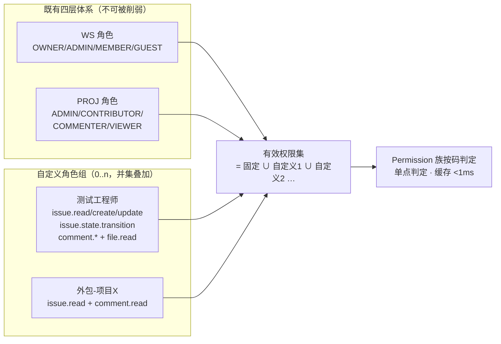
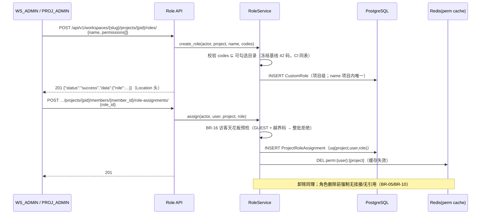
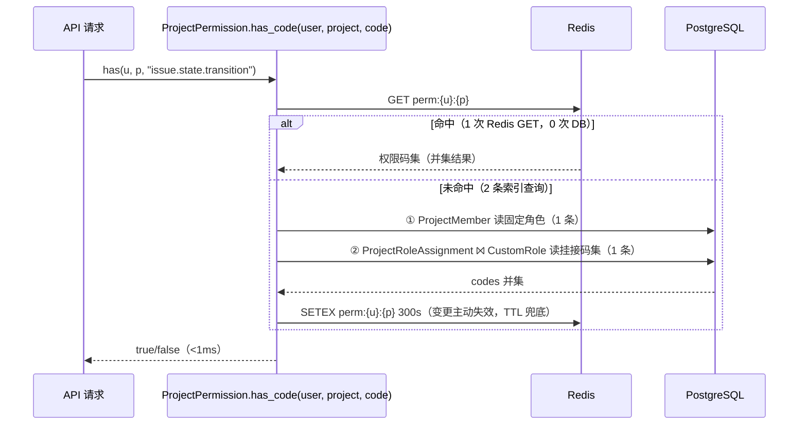

# 自定义角色组与细粒度资源权限

| 元信息项 | 内容 |
| --- | --- |
| 文档编号 | AUTH-008 |
| 所属迭代 | Sprint 8 — 企业组织权限治理（第 11 周） |
| 优先级 | P3（企业版核心级 · 组织治理三问之「谁能做什么」） |
| 所属模块 | M1-AUTH｜账号与权限 |
| 文档状态 | 评审修订（R1 修复版） |
| 最后更新日期 | 2026-09-05 |
| 上游依赖 | `rbac-permission-model.md`（四层 Permission 体系与权限码注册表 §4/§8；偏离登记见 §1 开头块）、`AUTH-007`（部门批量挂接的落点，§2.2/§4.1，**契约以 AUTH-007 为准**）、Sprint 7（`workflow.manage` 等权限码全集冻结） |
| 下游消费 | **全模块权限判定**（角色解析进入四层体系）、`AUTH-010`（角色变更入审计）、`BOARD-005`（共享视图的可见面判定）、P4 实例级 ACL |
| 上游依据 | `docs/需求文档.md` §3.1 企业版专属（自定义角色组、细粒度资源权限）、§8.2 权限 P3 列 |
| 关联架构文档 | [`rbac-permission-model.md`](../architecture/rbac-permission-model.md)（四层角色 / 权限码注册表 §4/§8 / 判定顺序）、[`api-conventions.md`](../architecture/api-conventions.md)（§4 信封 / §6.3 分页 / §8 错误码） |
| 对标基线 | Ones 自定义角色（权限矩阵勾选） · Jira Permission Scheme（反面对照：过于自由的代价） · Plane（仅四固定角色） |
| 工作量估算 | 后端 3.5 人日 / 前端 2.5 人日 / 联调与测试 2 人日，合计 **8 人日** |

---

## 1. 概述

> ### 架构偏离登记（本迭代裁定，依据 `sprint-overview.md` §1/§5 锁定设计）
>
> 本迭代交付的「自定义角色」与 `rbac-permission-model.md` §3.4 / §3.5 / §11.1 / §11.6 的现行口径**存在显式偏离**，登记如下（本文为准）：
>
> | 项 | rbac 现行口径 | 本迭代口径（本文为准） |
> | --- | --- | --- |
> | 角色语义 | §3.4/§11.1：`CustomRole(workspace, base_role, permissions={"code": bool})`，「基线角色 + 差异覆盖」；§11.6 明确「不吸收完全自由的权限项勾选」 | **角色 = 权限码集合**：从零勾选，JSONB 字符串数组；无 `base_role`、无覆盖布尔 |
> | 挂接层级 | §3.4/§3.5：`CustomRole` 挂 Workspace，`WorkspaceMember }o--o| CustomRole : 绑定` | 角色组项目级（`CustomRole.project`），成员挂接行 `ProjectRoleAssignment(project, user, role)`，成员可挂 0..n 个角色取**并集** |
> | 判定语义 | §11.1：先取 `base_role` 矩阵结果，再用 `permissions` 覆盖（存在 `False` 的 deny 覆盖） | 有效权限 = 固定角色码集 ∪ Σ自定义角色码集（**只加不减、无 deny 覆盖**；码不在并集即拒，BR-13） |
>
> - **偏离理由**：①多角色并集让「VIEWER + 补几个写码」类组合无需枚举基线×覆盖矩阵；②纯码集角色组可被流转守卫（`WF-004` `custom:<role_id>`）、审批节点、部门批量挂接（`AUTH-007`）按同一 ID 复用；③固定四角色判定链零改动，不配置自定义角色即标准版行为（`sprint-overview.md` §5 兼容约束）。
> - **与固定角色的并存与判定规则**：固定角色判定（等级比较、§7.1 层级保护、§7.4 隐式 PROJ_ADMIN 绕过）逐字不变；自定义角色仅作为**第五种权限码来源**并入 `effective_codes()`（§4.3）；层级保护只作用于固定角色等级值——自定义角色无等级、**不参与** `role >= X` 比较；deny 语义不存在（无负权限），「禁止」靠不勾选该码或降低固定角色表达。
> - **待回改**：`rbac-permission-model.md` §3.4（模型）、§3.5（ER 图）、§11.1 / §11.6（吸收口径）按本表修订——**架构文档待回改**，本轮不动。

### 1.1 功能定位

标准版权限是四固定项目角色（PROJ_ADMIN/PROJ_CONTRIBUTOR/PROJ_COMMENTER/PROJ_VIEWER）× 四固定工作空间角色（WS_OWNER/WS_ADMIN/WS_MEMBER/WS_GUEST，`rbac` §2.2/§2.3）的笛卡尔积——覆盖 80% 团队，但企业客户的真实诉求是「测试工程师：任务读写 + 评论 + 流转，但不能删任务、不能管成员」「外包：仅能见被指派任务」。AUTH-008 交付**自定义角色组**：

1. **角色 = 权限码集合**：组织自定义角色（如「测试工程师」），勾选权限码矩阵（`issue.read/create/update/delete`、`issue.state.transition`、`comment.*`、`file.*`、`worklog.create` …，码面以注册表 §4/§8 为准）；
2. **多角色并集**：成员可在固定角色之外挂 0..n 个自定义角色，**有效权限 = 固定角色码集 ∪ 各自定义角色码集**（只加不减——自定义角色永远不能削弱固定角色，无 deny 语义）；
3. **全链路生效**：后端 API 鉴权消费 `effective_codes()` 并集；前端按钮显隐由权限快照携带自定义角色码集、`usePermission` 消费码集实现（**需要扩展 AUTH-005 的快照契约与判定分支，非零改动**，见 §4.4 改动清单）；
4. **解析高性能**：角色解析结果按 `(user, project)` 缓存，单请求判定 < 1ms。

它是治理三问中「谁能做什么」的答案层，也是 Sprint 7 工作流权限（`workflow.manage`、流转角色矩阵）的载体——**自定义角色可以像固定角色一样被流转守卫引用**（引用契约见 BR-10/BR-17）。

### 1.2 关键约定：只加不减的并集语义



| 约定 | 说明 | 理由 |
| --- | --- | --- |
| 并集只加 | 自定义角色只授予、不剥夺；无权表达「禁止」 | 「允许 ∪ 禁止」语义是企业权限系统头号事故源（Jira 教训）；剥夺靠降低固定角色实现 |
| 项目级挂载 | 自定义角色挂接在 `(user, project)` 上（与 PROJ 固定角色同层）；WS 层自定义角色 P4 评估 | 权限爆炸半径可控；审计可逐项目点名 |
| 权限码全集冻结 | 可勾选的权限码 = 注册表（`rbac-permission-model.md` §4/§8 + Sprint 7 增补）的「可自定义」子集，冻结基线 **42 码**，CI 校验 | 防止角色引用已下线权限码 |
| 固定角色不可删改 | 四固定 PROJ 角色语义内置代码，自定义角色并存 | 兼容承诺：不配置自定义角色 = 标准版行为 |
| 访客天花板（BR-16） | WS_GUEST 成员只能挂接「访客天花板集」内的角色（挂写码角色直接拒绝，方案 B） | 防 GUEST 借自定义角色绕过 `rbac` §7.3 天花板（详见 §2.5） |

### 1.3 范围边界

| 范围 | 本文档交付 | 明确不做 |
| --- | --- | --- |
| 角色 CRUD | 角色组增删改、权限码矩阵、内置模板（测试/外包/只读干系人，按稳定 `template_key` 采用，见 BR-14/BR-17） | 角色继承（角色基于角色，P4） |
| 挂接 | 逐人挂/卸、按部门批量挂（复用 `AUTH-007` §2.2 快照展开范式，契约以 AUTH-007 为准） | 资源实例级 ACL（单条任务专属授权，P4） |
| 判定 | `effective_codes()` 并集解析器：rbac §5 Permission 族改读并集；序列化字段剔除机制不变 | 字段级「禁止写」负权限（由 `TASK-012` 字段权限按角色只读/隐藏表达，非本角色体系） |
| 性能 | Redis 缓存 `(user, project) → 权限码集`，变更即失效 | 跨项目通配挂接（P4） |
| 审计 | 角色 CRUD/挂接/卸除全量入 `AUTH-010` | — |

### 1.4 前置依赖

| 依赖 | 内容 | 阻塞原因 |
| --- | --- | --- |
| `rbac-permission-model.md` | 权限码注册表（§4/§8）+ CI 校验、四层判定顺序 | 自定义角色是第五种「权限码来源」，判定链路复用；模型偏离见 §1 开头登记块 |
| `AUTH-005` | 前端按钮权限（`usePermission`）与权限快照 | 快照当前仅含角色等级、无权限码集——本迭代需扩展快照契约并给 `usePermission` 增加码集并集分支（§4.4 改动清单；**AUTH-005 §2.2/§4.2/§4.5.2 待回改**） |
| `AUTH-007` | 部门批量快照展开范式（§2.2/§4.1） | 按部门挂角色复用（落点改为 `ProjectRoleAssignment`；批次表扩展以 AUTH-007 为准） |
| Sprint 7 | `workflow.manage`、流转守卫角色矩阵（`WF-004` `custom:<role_id>` 格式） | 守卫按角色 **ID** 引用自定义角色（BR-10/BR-17） |

### 1.5 竞品参考

| 竞品 | 参考点 | 处置 |
| --- | --- | --- |
| Ones | 自定义角色 + 权限点矩阵勾选 + 多角色叠加（并集） | **全面对齐**（含只加不减）；语义偏离 rbac「基线+覆盖」已登记（§1 开头块） |
| Jira | Permission Scheme 自由映射 + Group 嵌套 | 反面：自由度导致「谁也说不清某用户为何有这个权限」——本系统以并集 + 无负权限 + 无嵌套规避 |
| GitLab | 预置角色 + custom roles（EE，在 Guest 上叠加权限码） | 叠加语义佐证；但其 Guest 叠加无天花板校验——本版以 BR-16 拒绝挂接越界角色（比 GitLab 更严） |
| Plane | 四固定角色，无自定义 | 差异化能力 |

---

## 2. 业务逻辑

### 2.1 角色定义与挂接流程



### 2.2 权限判定时序（请求热路径）



### 2.3 业务规则汇总

| 编号 | 规则 | 触发点 | 违规响应 |
| --- | --- | --- | --- |
| BR-01 | 有效权限 = 固定角色码集 ∪ 全部已挂自定义角色码集；不存在负权限（无 deny 覆盖） | 判定 | —（语义公理） |
| BR-02 | 角色权限码必须 ⊆ 可勾选目录（冻结基线 42 码；WS 层/系统层/`*.manage` 管理码不可勾选） | 角色创建/更新 | 400 `VALIDATION_ERROR` + `details[]` 逐码 `NOT_A_CHOICE` |
| BR-03 | 项目内角色名唯一（不区分大小写）；≤40 字符 | CRUD | 409 `RESOURCE_ALREADY_EXISTS` + `details[{field:"name",code:"UNIQUE"}]` |
| BR-04 | 每项目自定义角色 ≤ 20；单角色权限码 ≤ 60（目录当前 42，60 为扩容预留上限，当前不构成约束） | CRUD | 409 `RESOURCE_LIMIT_EXCEEDED` + `details[{code:"TOO_LARGE"}]` |
| BR-05 | 有挂接的角色不可删（须先全部卸除） | 删除 | 409 `RESOURCE_IN_USE` + `details[]` 含 `assigned_count` 与引用清单 |
| BR-06 | 同一 `(user, project, role)` 挂接幂等（重复挂 201 无新行） | 挂接 | — |
| BR-07 | 挂接/卸除/角色变更 → 目标用户缓存立即失效（DEL，非等 TTL） | 写操作 | — |
| BR-08 | 角色组 CRUD 与可勾选目录需 **WS 级 `role.manage`**（WS_OWNER/WS_ADMIN，rbac §8.1 注册层级）；挂接/卸除/批量挂接/查看他人有效权限需对目标项目 **`project.member.manage`**（PROJ_ADMIN+，rbac §8.2） | 写端点 | 403 `PERM_WORKSPACE_ADMIN_REQUIRED` / `PERM_PROJECT_ADMIN_REQUIRED` |
| BR-09 | 按部门批量挂角色：复用 `AUTH-007` §2.2 快照展开与整事务语义（**以 AUTH-007 为准**），落点为挂接行；批次表扩展见 §4.1 迁移要点 | 批量挂接 | — |
| BR-10 | 自定义角色可被流转守卫/审批节点按 **ID** 引用（格式 `custom:<role_id>`，UUID v4，与 `WF-004`/`WF-001` §4.7 冻结格式一致）；角色删除前校验无引用 | 删除 | 409 `RESOURCE_IN_USE` + 引用清单 |
| BR-11 | 成员被移出项目 → 其挂接行级联删除 + 缓存失效 | 成员管理 | — |
| BR-12 | 角色权限码收紧（取消勾选）即时生效于全部挂接者 | 角色更新 | 缓存批量失效（按挂接清单逐 DEL） |
| BR-13 | 权限判定失败封闭（deny by default）：码集不含即拒 | 判定 | 403 `PERM_DENIED` |
| BR-14 | 内置三模板（测试工程师/外包协作/只读干系人）以稳定 `template_key`（`qa_engineer`/`external_collab`/`stakeholder_readonly`）预置权限码，可改可删；展示名仅本地化显示 | 初始化 | — |
| BR-15 | 审计：角色 CRUD 记 `role.*`，挂接/卸除记 `role.assign/revoke`（含角色快照名，仅展示用） | 写操作 | — |
| BR-16 | **访客天花板（方案 B：拒绝挂接）**：挂接/批量挂接目标含 WS_GUEST 成员时，角色码集必须 ⊆ 访客天花板集（`PROJECT_PERMISSION_MATRIX[c] ≤ PROJ_COMMENTER(10)` 且已注册）；WS 成员降级为 WS_GUEST 时，含越界码的挂接在同一事务内级联卸除并通知（`rbac` §7.3 降级保护同款） | 挂接/批量挂接/WS 降级 | 409 `RESOURCE_STATE_INVALID` + `details[]` 列出越界码 |
| BR-17 | **引用与解析契约**：守卫/审批节点/批次表对自定义角色的**持久引用一律存 `role_id`**（名称仅展示）；API 入口提供按名称解析的可选查询参数（规则见 §4.2），解析失败/歧义按 §4.2 错误契约返回 | 引用/查询 | 404 `RESOURCE_NOT_FOUND`（未命中）/ 409 `RESOURCE_ALREADY_EXISTS`（歧义防御） |

### 2.4 异常处理

| 场景 | 处理 |
| --- | --- |
| 缓存失效失败（Redis 抖动） | 写路径仍提交（DB 为真源）；判定回源 DB 保证正确性，TTL 300s 兜住脏缓存 |
| 角色权限码含已下线码（注册表版本升级） | 读路径过滤未知码 + 告警日志；编辑角色时强制重校验 |
| 并发挂接同人同角色 | uq 约束兜底，`ignore_conflicts` 幂等 |
| 批量挂接中途部分失败 | 整事务回滚（与 `AUTH-007` §2.2 一致），无半吊子批次 |
| 批量挂接含 GUEST 目标且角色含越界码 | 执行前预检：任一目标违反 BR-16 → 整批 409 `RESOURCE_STATE_INVALID`，不产生部分挂接（与整事务语义一致） |
| 按名称解析重名（历史脏数据，理论被 BR-03 排除） | 防御分支返回 409 `RESOURCE_ALREADY_EXISTS` 并提示改用 `role_id`（BR-17） |

### 2.5 边界条件

- **固定角色降级**：CONTRIBUTOR → VIEWER 后，其自定义角色仍然叠加（并集公理不保证「降固定即降有效」——管理员须同步审视挂接；UI 在降级弹窗列出其自定义角色提醒）。
- **WS_GUEST**：可挂接**访客天花板集内**的自定义角色（`PROJECT_PERMISSION_MATRIX[c] ≤ PROJ_COMMENTER(10)` 的业务码，如只读/评论类——典型「外包只读」场景）；含越天花板码（≥ CONTRIBUTOR(15) 或未注册）的角色对 GUEST 挂接被 409 拒绝（BR-16，方案 B，全文一致）；WS 层固定语义（仅见受邀项目）不可被自定义角色突破——自定义角色只在已可见项目内加权限。
- **权限码粒度**：全部沿用注册表既有码（`issue.create/update/delete`、`issue.state.transition`、`comment.create/update.own/delete/delete.own`、`file.upload/share`、`worklog.create`、`workflow.manage` …），本版**不新增业务码、不新增管理码**——`role.manage` 已注册于 rbac §8.1（**WS 级**，WS_OWNER/WS_ADMIN），本版仅按附录 B 七步补齐 CI 一致性与越权测试。

---

## 3. UI/UX 设计

### 3.1 角色管理页

```
┌──────────────────────────────────────────────────────────────────────┐
│ 项目设置 / 角色与权限                                [+ 新建角色]      │
├──────────────┬───────────────────────────────────────────────────────┤
│ 固定角色      │ 自定义角色：测试工程师                    [编辑][删除] │
│  项目管理员   │ ┌───────────────────────────────────────────────────┐ │
│  协作者      │ │ 权限码（已勾选 9 / 目录 42）                        │ │
│  评论者      │ │ ☑ issue.read   ☑ issue.create  ☑ issue.update      │ │
│  查看者      │ │ ☑ issue.state.transition  ☐ issue.delete           │ │
│             │ │ ☐ issue.archive  ☑ comment.create/update.own/delete│ │
│ 自定义角色    │ │ ☑ file.read/upload  ☐ file.share  ☐ worklog.create│ │
│ ▶测试工程师(6)│ ├───────────────────────────────────────────────────┤ │
│  外包协作 (2) │ │ 已挂接成员（6）                                     │ │
│  只读干系人(0)│ │ ○ 王五（研发部）        [卸除]                     │ │
│             │ │ ○ 赵六（质量部）        [卸除]  [+ 挂接成员/部门]    │ │
│             │ └───────────────────────────────────────────────────┘ │
└──────────────┴───────────────────────────────────────────────────────┘
```

- 权限码按域分组（任务/评论/文件/工时/报表）折叠展示；不可勾选码（WS 层/系统层/`*.manage` 管理码）置灰并标注「固定角色语义」。
- **入口可见性与操作面（BR-08）**：角色组 CRUD（新建/编辑/删除/目录）仅 WS_OWNER/WS_ADMIN 可用；PROJ_ADMIN（非 WS_ADMIN）进入时权限矩阵只读、仅可执行挂接/卸除（`project.member.manage`），矩阵右上加「角色组由工作空间管理员维护」提示。
- 内置模板卡片「一键采用」按稳定 `template_key` 提交（BR-14），展示名不作为引用标识。
- 删除按钮在有挂接时置灰，悬浮提示「先卸除 6 条挂接」。

### 3.2 挂接弹窗与批量挂接

```
┌────────────────── 挂接角色：测试工程师 ──────────────────┐
│ 添加对象： [逐人选择 ▾]  [按部门 ▾]                       │
│ ○ 搜索成员…           选中部门：质量部（含子部门 8 人）    │
│ ┌──────────────────────────────────────────────────────┐ │
│ 预览：8 人 → 6 新挂接 · 2 已挂接（幂等跳过）              │ │
│ │ ⚠ 2 名工作空间访客越出访客天花板，确认后整批拒绝（预检） │ │
│ └──────────────────────────────────────────────────────┘ │
│ ⚠ 角色只增加权限；成员固定角色的既有权限不受影响。         │
│                              [取消]  [确认挂接]           │
└──────────────────────────────────────────────────────────┘
```

- 批量挂接预检 BR-16：目标含 WS_GUEST 且角色越界时，预览阶段即标红；确认提交返回 409 `RESOURCE_STATE_INVALID`（整批拒绝，无部分挂接）。

### 3.3 成员视角的「我的权限」

成员卡片显示「固定角色：查看者 ＋ 自定义：测试工程师」，点击展开**有效权限清单**（并集结果，只读）——回应「我为什么能/不能操作」的一线答疑，减少管理员咨询。

### 3.4 空状态 / 加载 / 失败

| 状态 | 表现 |
| --- | --- |
| 无自定义角色 | 空插画 + 三内置模板卡片「一键采用」 |
| 权限码保存失败 | 非法码高亮 + 错误文案（如「`billing.manage` 为工作空间级管理码，不开放自定义」） |
| 挂接失败（GUEST 越界） | 弹窗保留选择；Toast 引用 `RESOURCE_STATE_INVALID` 文案「2 名访客越出访客天花板，已整批拒绝」 |
| 挂接失败（其他） | 弹窗保留选择；Toast 语义化错误 |
| 权限生效延迟说明 | 挂接成功 Toast 附「即时生效；对端已打开页面将在下一次操作刷新」 |

### 3.5 响应式与无障碍

- 权限矩阵 < 768px 转为按域手风琴列表；勾选框 ≥ 24px 触控热区。
- 「我的权限」清单纯文本可读（屏幕阅读器友好），颜色不作唯一语义载体。

---

## 4. 技术架构

### 4.1 数据模型

```python
# apps/api/plane/db/models/custom_role.py
class CustomRole(BaseModel):
    """自定义角色组（P3）。继承 BaseModel：UUID v4 主键 + 审计字段 + 软删位。"""
    project = models.ForeignKey("db.Project", on_delete=models.CASCADE,
                                related_name="custom_roles")
    name = models.CharField(max_length=40)
    description = models.CharField(max_length=200, blank=True, default="")
    permissions = models.JSONField(default=list)   # ["issue.read", ...] 有序去重
    is_builtin_template = models.BooleanField(default=False)
    template_key = models.CharField(max_length=40, null=True, blank=True)  # BR-14 稳定键

    class Meta:
        db_table = "custom_role"
        constraints = [
            models.UniqueConstraint("project", models.functions.Lower("name"),
                                    name="uq_custom_role_name"),
            models.CheckConstraint(
                check=models.Q(permissions__0__isnull=False) | models.Q(permissions=[]),
                name="ck_custom_role_perms_shape"),
        ]


class ProjectRoleAssignment(BaseModel):
    """成员-自定义角色挂接行：(project, user, role) 唯一。
    created_by / created_at / updated_at 由 BaseModel 提供，不重复声明。"""
    project = models.ForeignKey("db.Project", on_delete=models.CASCADE)
    user = models.ForeignKey("db.User", on_delete=models.CASCADE)
    role = models.ForeignKey(CustomRole, on_delete=models.CASCADE,
                             related_name="assignments")
    grant_batch = models.ForeignKey("db.DepartmentGrantBatch", null=True,
                                    on_delete=models.SET_NULL)   # AUTH-007 批量溯源

    class Meta:
        db_table = "project_role_assignment"
        constraints = [models.UniqueConstraint("project", "user", "role",
                                               name="uq_role_assignment")]
        indexes = [models.Index(fields=["project", "user"],
                                name="idx_role_assign_lookup")]
```

迁移要点：

- `permissions` JSONB 存**权限码字符串数组**（不入库码表 FK——码的权威是注册表代码 §4/§8，CI 校验一致）。
- 主键一律 UUID v4（`BaseModel`，api-conventions §4.5），不引入 ULID。
- `grant_batch` 外键复用 `AUTH-007` §4.1 的 `department_grant_batch` 表：扩展方式为增 `target_type` 判别列（`"project_membership" | "role"`），且目标引用列须容纳 **UUID v4**（AUTH-007 现行 `role` 列 `CharField(20)` 容不下 UUID——**AUTH-007 §4.1 待回改，契约以 AUTH-007 为准**）。

### 4.2 API 定义

> 端点前缀统一 `/api/v1/workspaces/{slug}/…`（api-conventions §2.4/§2.5）；集合复数、动作建模为子资源（§2.6），不使用冒号动作。列表端点分页 `per_page` 默认 100 / 上限 100、`ordering` 白名单 `name,-name,created_at,-created_at`、`?search=` 走角色名（api-conventions §5.4/§6.3）。

| 方法 | 路径 | 说明 | 权限 |
| --- | --- | --- | --- |
| GET | `/api/v1/workspaces/{slug}/projects/{project_id}/roles/` | 角色列表（含挂接计数，分页 meta 必填）；支持 `?name=<角色名>` 按名称解析（见下） | 项目成员（`project.read`） |
| POST | `/api/v1/workspaces/{slug}/projects/{project_id}/roles/` | 新建角色（`template_key` 可选，采用内置模板） | WS 级 `role.manage` |
| PATCH | `/api/v1/workspaces/{slug}/projects/{project_id}/roles/{role_id}/` | 改名/描述/权限码 | WS 级 `role.manage` |
| DELETE | `/api/v1/workspaces/{slug}/projects/{project_id}/roles/{role_id}/` | 删除（BR-05/BR-10） | WS 级 `role.manage` |
| GET | `/api/v1/workspaces/{slug}/projects/{project_id}/roles/permissions-catalog/` | 可勾选权限码目录（按域分组，冻结基线 42 码） | WS 级 `role.manage` |
| POST | `/api/v1/workspaces/{slug}/projects/{project_id}/members/{member_id}/role-assignments/` | 挂接 `{role_id}` | `project.member.manage` |
| DELETE | `/api/v1/workspaces/{slug}/projects/{project_id}/members/{member_id}/role-assignments/{role_id}/` | 卸除 | 同上 |
| POST | `/api/v1/workspaces/{slug}/projects/{project_id}/roles/{role_id}/assignments/bulk/` | 批量挂接 `{user_ids[]}` 或 `{department_id}`（动作子资源，§2.6 批量模式） | `project.member.manage` |
| GET | `/api/v1/workspaces/{slug}/projects/{project_id}/members/{member_id}/effective-permissions/` | 有效权限并集（我的权限/排障） | 本人或 `project.member.manage` |

**按名称解析契约（BR-17）**：`GET …/roles/?name=<角色名>` 为可选查询参数，与 `search`（模糊）互斥——解析规则：项目内**大小写不敏感精确匹配**；命中 1 条 → 200 单对象（`data` 为对象而非数组）；命中 0 条 → 404 `RESOURCE_NOT_FOUND`（`details[{field:"name",code:"DOES_NOT_EXIST"}]`）；命中 >1 条（理论被 BR-03 排除，防御分支，如跨软删脏数据）→ 409 `RESOURCE_ALREADY_EXISTS`，提示改用 `role_id`。**所有持久引用（守卫/审批节点/批次表/字段权限）只存 `role_id`，名称解析仅供 API 入口便捷查询与人工排障。**

**POST roles/ 请求体**：

```json
{"name": "测试工程师", "description": "测试团队标准角色",
 "permissions": ["issue.read", "issue.create", "issue.update", "issue.state.transition",
                 "comment.create", "comment.update.own", "comment.delete",
                 "file.read", "file.upload"]}
```

**201 Created**（`Location: /api/v1/workspaces/acme/projects/{project_id}/roles/{role_id}/`；创建/详情端点可省略旁路信息对象；成功响应体不含追踪 ID——追踪 ID 经 `X-Request-Id` 响应头回传，实体主键一律 UUID v4，api-conventions §4.1/§4.5）：

```json
{
  "status": "success",
  "data": {
    "role": {
      "id": "3f7a2c8e-1d4b-4e6f-9a2b-7c5d8e0f1a2b",
      "name": "测试工程师",
      "description": "测试团队标准角色",
      "permissions": ["comment.create", "comment.delete", "comment.update.own",
                      "file.read", "file.upload", "issue.create", "issue.read",
                      "issue.state.transition", "issue.update"],
      "is_builtin_template": false,
      "assigned_count": 0,
      "created_at": "2026-09-02T10:00:00.000Z"
    }
  }
}
```

**GET roles/ 列表 200**（列表端点 `meta` 必填，九字段见 api-conventions §6.3）：

```json
{
  "status": "success",
  "data": [
    {"id": "3f7a2c8e-1d4b-4e6f-9a2b-7c5d8e0f1a2b", "name": "测试工程师",
     "permissions_count": 9, "assigned_count": 6},
    {"id": "8b4e6f0a-2c5d-4f8e-b1a3-9d6c7e2f5a8b", "name": "外包协作",
     "permissions_count": 4, "assigned_count": 2}
  ],
  "meta": {"next_cursor": "100:1:0", "prev_cursor": "100:0:1",
           "next_page_results": false, "prev_page_results": false,
           "count": 2, "total_count": 3, "total_pages": 1, "page": 1,
           "per_page": 100}
}
```

**非法权限码 — 400**（`details` 为数组，每项 `field`/`code`/`message`，子码取自 api-conventions §8.8；`request_id` 只在 `error` 对象内，ULID）：

```json
{
  "status": "error",
  "error": {
    "code": "VALIDATION_ERROR",
    "message": "包含不开放自定义的权限码",
    "details": [
      {"field": "permissions.0", "code": "NOT_A_CHOICE",
       "message": "billing.manage 为工作空间级管理码，不开放自定义"},
      {"field": "permissions.1", "code": "NOT_A_CHOICE",
       "message": "workspace.delete 不在可勾选目录（冻结基线 42 码）"}
    ],
    "request_id": "01J9XM2C4D5E6F7G8H9J0K1M2N",
    "doc_url": "https://docs.example.com/api/errors#validation-error"
  }
}
```

**角色重名 — 409**：

```json
{
  "status": "error",
  "error": {
    "code": "RESOURCE_ALREADY_EXISTS",
    "message": "项目内已存在同名角色（不区分大小写）",
    "details": [{"field": "name", "code": "UNIQUE",
                 "message": "测试工程师 与既有角色重名"}],
    "request_id": "01J9XM5F8H2K4N6Q9S1V3X5Z7B"
  }
}
```

**删除有挂接/被引用角色 — 409**：

```json
{
  "status": "error",
  "error": {
    "code": "RESOURCE_IN_USE",
    "message": "角色仍有挂接成员或被流转守卫引用，须先解除",
    "details": [
      {"field": "role", "code": "INVALID", "message": "仍有 6 条成员挂接"},
      {"field": "role", "code": "INVALID",
       "message": "被 1 条流转守卫引用（transition_id=9d2c1b7e-4a6f-4c8d-a3e1-5b7f9c0d2e4a，custom:<role_id> 格式，WF-004）"}
    ],
    "request_id": "01J9XM6G9J3L5P7R9T2W4Y6Z8C"
  }
}
```

**GUEST 越界挂接 — 409**（BR-16，批量场景整批拒绝）：

```json
{
  "status": "error",
  "error": {
    "code": "RESOURCE_STATE_INVALID",
    "message": "目标成员为工作空间访客（WS_GUEST），角色含超出访客天花板的权限码",
    "details": [{"field": "user_ids", "code": "INVALID",
                 "message": "成员 6c8d1e3f-9a2b-4c5d-8e7f-1a3b5c7d9e0f 越界码：issue.create、file.upload"}],
    "request_id": "01J9XM7H2K4M6P8R0T3W5Y7Z9D"
  }
}
```

**GET effective-permissions — 200**（`fixed_role` 为固定角色码标识；`effective_codes` 为并集排序去重结果）：

```json
{
  "status": "success",
  "data": {
    "fixed_role": "PROJ_VIEWER",
    "custom_roles": [{"id": "3f7a2c8e-1d4b-4e6f-9a2b-7c5d8e0f1a2b", "name": "测试工程师"}],
    "effective_codes": ["board.read", "comment.create", "comment.read",
                        "comment.update.own", "file.read", "file.upload",
                        "gantt.read", "issue.create", "issue.read",
                        "issue.state.transition", "issue.update", "project.read",
                        "project.favorite", "view.create.own"]
  }
}
```

### 4.3 核心逻辑

```python
# apps/api/plane/app/permissions/custom_role_catalog.py
def customizable_catalog() -> frozenset[str]:
    """可勾选目录 = 注册表（rbac §8.2）项目级业务码中「可自定义」子集
    （排除 §8.1 WS 级、§8.3 系统级与各 *.manage 管理码），冻结基线 42 码。
    与 packages/constants 同表生成，CI 一致性校验。"""
    return load_registry().customizable_subset()

def validate_codes(codes: list[str]) -> list[str]:
    bad = sorted({c for c in codes if c not in customizable_catalog()})
    if bad:
        raise ValidationErr(field="permissions", code="NOT_A_CHOICE", invalid=bad)
    return sorted(set(codes))

GUEST_CEILING = ProjectRole.COMMENTER  # 10，rbac §7.3 同阈值

def assert_attachable(role: CustomRole, target_ws_role: int | None) -> None:
    """BR-16（方案 B）：WS_GUEST 只能挂接天花板内角色——拒绝而非静默交集。"""
    if target_ws_role != WorkspaceRole.GUEST:
        return
    over = [c for c in role.permissions
            if (m := PROJECT_PERMISSION_MATRIX.get(c)) is None or m > GUEST_CEILING]
    if over:
        raise ResourceStateInvalid(field="user_ids", offending_codes=over)
```

```python
# apps/api/plane/app/permissions/effective.py（rbac §5 Permission 族消费的并集来源）
def effective_codes(user_id: str, project_id: str) -> frozenset[str]:
    key = f"perm:{user_id}:{project_id}"
    cached = redis.get(key)
    if cached is not None:                                   # 命中：1 次 Redis GET
        return frozenset(orjson.loads(cached))
    fixed_role = (ProjectMember.objects
                  .filter(project_id=project_id, member_id=user_id, is_active=True)
                  .values_list("role", flat=True).first())            # 查询①
    custom: set[str] = set()
    for perms in (ProjectRoleAssignment.objects
                  .filter(project_id=project_id, user_id=user_id)
                  .values_list("role__permissions", flat=True)):      # 查询②
        custom.update(perms)
    codes = frozenset(FIXED_ROLE_CODES.get(fixed_role, frozenset()) | custom)
    redis.setex(key, 300, orjson.dumps(sorted(codes)))                # TTL 兜底
    return codes

class ProjectPermission(BasePermission):        # rbac §5.2 基类，判定来源改读并集
    def has_code(self, request, project_id: str, code: str) -> bool:
        if is_system_admin(request.user):
            return True
        ws_role = self.get_workspace_role(request)   # §7.4 隐式 PROJ_ADMIN 分支逐字不变
        if ws_role is not None and ws_role >= WorkspaceRole.ADMIN:
            return True
        return code in effective_codes(request.user.id, project_id)

    @classmethod
    def invalidate(cls, user_id, project_id):
        redis.delete(f"perm:{user_id}:{project_id}")
```

```python
# apps/api/plane/app/services/role.py
@transaction.atomic
def update_role(*, actor, role, name=None, permissions=None):
    if permissions is not None:
        role.permissions = validate_codes(permissions)
    if name is not None:
        role.name = name
    role.save()
    affected = list(role.assignments.values_list("user_id", flat=True))
    on_commit(lambda: _invalidate_many(affected, role.project_id))
    on_commit(lambda: record_audit.delay("role.update", actor_id=actor.id,
              object_id=str(role.id), diff={"permissions": permissions}))   # AUTH-010
    return role

@transaction.atomic
def delete_role(*, actor, role):
    refs = find_guard_references(role)   # 扫描 guard/审批配置中的 custom:<role_id>（WF-001 §4.7 格式）
    assigned = role.assignments.count()
    if assigned or refs:
        raise ResourceInUse(role, assigned_count=assigned, referenced_by=refs)
    role.delete()
    on_commit(lambda: record_audit.delay("role.delete", ...))
```

**序列化层字段剔除机制不变**：字段级可见性仍由 `TASK-012` 字段权限在序列化器剔除；其对自定义角色的匹配标识由「角色名」改为**角色 ID**（`TASK-012` 待回改；本体系只负责 `effective_codes()` 码判定与 `AUTH-005` 前端显隐消费，见 §4.4）。

**性能**：判定热路径 = 1 次 Redis GET（0 次 DB，命中 >99%）；未命中 = **2 条索引查询**（①固定角色 + ②挂接码集，均走 `idx` 主索引）。变更面（角色更新/挂接/卸除/成员移出/降级级联卸除）全部主动 DEL；`role.update` 按挂接清单批量失效。

### 4.4 前端实现

> **如实的改动清单（本节取代旧稿「usePermission 零改动」的说法）**：权限快照（`AUTH-005` §2.2/§4.2）当前只含 `workspaceRoleMap`/`projectRoleMap` 角色等级、**无权限码集**——VIEWER 挂上含 `issue.create` 的自定义角色后，等级比较 `actual >= required` 仍不满足、按钮依旧隐藏。因此本迭代需要三处改动（**AUTH-005 §2.2/§4.2/§4.5.2 待回改**，本节为落地契约）：
>
> 1. **快照契约扩展**：`projects.{project_id}` 增 `"custom_roles": [{"id","name"}]` 与 `"custom_codes": string[]`（服务端已并集去重的自定义角色码集，未配置时为 `[]`）；
> 2. **`usePermission` 并集分支**（Hook 本体定义于 `AUTH-005` §4.5.2，`apps/web/core/hooks/use-permission.ts`）：`return (actual ?? 0) >= required || projectCodes.has(permission)`——函数签名与 `PermissionKey` 联合类型不变（自定义码 ⊆ 注册表，ESLint `no-unknown-permission` 不受影响）；
> 3. **失效联动**（`AUTH-005` §2.6 表增行）：挂接/卸除/角色更新/批量挂接成功后主动 `permissionsMutate()` 重拉快照；降级级联卸除（BR-16）经 `permission.changed`（`COLLAB-004`）推送触发重拉。

```typescript
// apps/web/core/store/role/role.store.ts
class RoleStore {
  roles = observable<CustomRole[]>([]);
  catalog = observable<PermissionDomain[]>([]);   // 可勾选目录（按域，42 码）

  async save(role: Partial<CustomRole> & { id?: string }) {
    const { data } = role.id
      ? await api.patch(`/api/v1/workspaces/${ws}/projects/${pid}/roles/${role.id}/`, role)
      : await api.post(`/api/v1/workspaces/${ws}/projects/${pid}/roles/`, role);
    runInAction(() => this.upsert(data.role));
    permissionStore.mutate();     // 自己的有效权限可能已变 → 重拉快照（AUTH-005 §2.6 同款）
  }

  async assign(userId: string, roleId: string) {
    await api.post(
      `/api/v1/workspaces/${ws}/projects/${pid}/members/${userId}/role-assignments/`,
      { role_id: roleId });
    if (userId === session.userId) permissionStore.mutate();
  }
}

// usePermission 并集分支生效后（改动 1+2 落地），既有调用点零改动：
const canTransition = usePermission("issue.state.transition");
```

组件：`<RoleMatrixEditor>`（域分组勾选 + 置灰不可选码）、`<AssignDialog>`（逐人/按部门两段 + GUEST 越界预检提示）、`<EffectivePermissionsPanel>`（我的权限只读清单）。`<PermissionGate>` 本体不动（消费 `usePermission` 返回值）。

---

## 5. 测试用例

### 5.1 单元测试

| 编号 | 用例 | 断言 |
| --- | --- | --- |
| UT-01 | 并集语义：VIEWER + 测试工程师角色 | effective 含 issue.create 且含 VIEWER 原有码 |
| UT-02 | 非法码拒绝（WS 层/系统层/`*.manage`） | BR-02 `details[]` 清单精确、子码 `NOT_A_CHOICE` |
| UT-03 | 权限码去重排序存储 | 输入乱序重复 → 存储有序唯一 |
| UT-04 | 项目内重名（大小写）拒绝 | 409 `RESOURCE_ALREADY_EXISTS` + 子码 `UNIQUE` |
| UT-05 | 角色配额 20 / 码配额 60（以 61 码扩展目录 fixture 验证——目录现值 42 不触发） | 409 `RESOURCE_LIMIT_EXCEEDED` |
| UT-06 | 有挂接删除拒绝 | 409 `RESOURCE_IN_USE` + `assigned_count` |
| UT-07 | 被守卫引用删除拒绝 | 409 `RESOURCE_IN_USE` + `custom:<role_id>` 引用清单 |
| UT-08 | 重复挂接幂等 | 无新行，201 |
| UT-09 | 挂接/卸除/角色更新 → 缓存 DEL | Redis key 失效 |
| UT-10 | 缓存未命中回源 DB 且回填 | 断言恰 2 条查询；二次判定走缓存（0 条查询） |
| UT-11 | 角色收紧码即时生效 | 旧码判定 false |
| UT-12 | 成员移出项目级联删挂接 | BR-11 |
| UT-13 | WS_GUEST 挂角色不突破项目可见面 | 未见项目仍 404 |
| UT-14 | deny by default：未知码判定 false | BR-13 |
| UT-15 | GUEST 挂接含写码（≥ CONTRIBUTOR(15)）角色 | 409 `RESOURCE_STATE_INVALID` + 越界码清单（BR-16） |
| UT-16 | GUEST 挂接天花板内角色（如只读/评论类） | 201 挂接成功，effective = 并集且无越界码 |
| UT-17 | WS 成员降级 GUEST：越界挂接级联卸除 | 同事务卸除 + 缓存失效 + 通知（BR-16） |
| UT-18 | 按名称解析：唯一命中 200 / 未命中 404 / 重名防御 409 | BR-17 三分支 |

### 5.2 集成测试

| 编号 | 用例 | 断言 |
| --- | --- | --- |
| IT-01 | 建角色→挂接→API 操作放行（如 COMMENTER 角色 + `issue.update` 码后可改任务） | 200 |
| IT-02 | 卸除后同操作被拒 | 403 `PERM_DENIED` |
| IT-03 | 按部门批量挂接（复用 AUTH-007 §2.2 展开，契约以 AUTH-007 为准） | 批次行 + 挂接行 + grant_batch 溯源 |
| IT-04 | 角色更新码 → 全部挂接者缓存失效 → 新判定生效 | 逐人断言 |
| IT-05 | 并发挂接同人同角色 | 单行，无重复 |
| IT-06 | effective-permissions 端点与逐 API 实测一致 | 抽查 10 码 |
| IT-07 | 审计事件（create/update/delete/assign/revoke） | 字段完整含角色快照名 |
| IT-08 | 权限层级（BR-08）：PROJ_ADMIN（非 WS_ADMIN）建角色被拒、挂接放行 | 403 `PERM_WORKSPACE_ADMIN_REQUIRED` / 201 |
| IT-09 | 权限快照联动（AUTH-005 扩展）：挂接后快照含 `custom_codes`，`usePermission` 按钮显隐正确 | 快照字段 + 前端渲染断言 |
| IT-10 | 批量挂接含 GUEST 越界目标 | 整批 409，无部分挂接行（BR-16 与 AUTH-007 整事务一致） |

### 5.3 E2E 测试

| 编号 | 场景 |
| --- | --- |
| E2E-01 | WS_ADMIN 建「测试工程师」→ 按部门挂接 8 人 → 成员登录可见「编辑任务」按钮且操作成功 |
| E2E-02 | 成员打开「我的权限」面板核对并集清单 |
| E2E-03 | 取消勾选 issue.delete → 挂接成员删除按钮即时消失（快照重拉后）且 API 403 |
| E2E-04 | 删除有挂接角色被阻 → 全部卸除 → 删除成功 |
| E2E-05 | 给 WS_GUEST 外包成员挂「只读干系人」成功；尝试挂「测试工程师」被 409 拒绝（BR-16 用户可感知文案） |

---

## 6. 竞品深度对标

### 6.1 Ones 实现分析

Ones「项目设置-角色管理」：自定义角色 = 权限点集合，成员多角色叠加（并集），无负权限；权限点分域展示；角色被引用（工作流配置）时禁删。本版 BR-01/BR-10 与之对齐。其差异：Ones 角色同时有「管理类权限」（管成员/管配置）——本版管理码（`project.member.manage` 等 `*.manage` 族）仍属固定角色语义，不开放自定义，缩小爆炸半径。

### 6.2 GitLab custom roles（EE）

GitLab 16+ 自定义角色在 **Guest 基座上叠加**能力码——「只加」语义的行业佐证；其教训有二：叠加基座固定导致表达力受限（本版允许叠加在任意固定角色之上），以及**叠加无天花板校验**（Guest 可被叠出写权限）——本版以 BR-16 拒绝挂接越界角色（对 WS_GUEST 比GitLab 更严，与 `rbac` §7.3 天花板自洽）。

### 6.3 Jira Permission Scheme（反例）

Jira 允许 Scheme 把每个权限自由映射到用户/组/项目角色，且组可嵌套——「某用户为何能删任务」需要人工遍历多层映射。本系统刻意：无负权限、无角色嵌套、有效权限一个端点可点名（effective-permissions），把「为什么能」变成一次 API 调用。

### 6.4 本系统设计决策

| 决策 | 取舍 |
| --- | --- |
| 并集只加，无负权限 | 牺牲「精确剔除」表达力（用降固定角色 + 字段权限替代），换判定可解释性；与 rbac「基线+覆盖」的偏离已在 §1 开头登记（架构文档待回改） |
| 项目级挂载（非 WS 级） | 权限爆炸半径按项目隔离；WS 级自定义留 P4；`role.manage` 本身仍为 WS 级注册码（rbac §8.1），「谁维护角色组」与「角色组作用域」解耦 |
| 权限码存 JSONB 字符串（非码表 FK） | 码权威在注册表代码 §4/§8；避免码表迁移级联，CI 保证一致 |
| Redis 缓存 + 主动失效 + TTL 兜底 | <1ms 判定；Redis 抖动回源 DB 保正确性 |
| GUEST 天花板取「拒绝挂接」（方案 B） | 拒绝可解释（409 + 越界码清单）；静默交集会让角色配置面与生效面不一致，破坏「我的权限」可点名原则 |

---

## 7. 里程碑与验收

### 7.1 交付物清单

| 类别 | 内容 |
| --- | --- |
| Model / Migration | `custom_role`、`project_role_assignment` 表（UUID v4 主键）；`department_grant_batch` 增 `target_type` 列（目标引用列容纳 UUID v4，**以 AUTH-007 为准**） |
| 后端 | 角色 CRUD/挂接服务（含 BR-16 预检与降级级联卸除）、`effective_codes()` 解析器（缓存+失效）、可勾选目录端点（42 码）、effective-permissions 端点、`role.manage`（已注册 WS 级）按附录 B 七步补 CI 一致性与越权测试 |
| 前端 | 角色管理页、权限矩阵编辑器、挂接弹窗（逐人/按部门 + GUEST 预检）、我的权限面板；**权限快照契约扩展 + `usePermission` 并集分支 + 失效联动**（§4.4 改动清单，AUTH-005 待回改登记） |
| 测试 | UT-01~18、IT-01~10、E2E-01~05 |

### 7.2 可操作演示的验收标准

1. WS_ADMIN 建「测试工程师」角色（任务读写+流转+评论，不含删除/归档）：按部门挂接 8 人后，成员固定 VIEWER 者可创建/编辑/流转任务但删除按钮隐藏且 API 403。
2. 「我的权限」面板并集清单与逐 API 实测抽查 10 码完全一致；未配置自定义角色的项目（`custom_codes=[]`）行为与标准版零差异（回归套件全绿）。
3. 角色更新取消某码：全部挂接者下一次操作即时生效（缓存失效可观测）；Redis 停用时判定仍正确（回源 DB）。
4. 有挂接/被流转守卫引用的角色删除被结构化拒绝（409 `RESOURCE_IN_USE`，清单可点名）；卸除后可删，审计流含全事件。
5. 挂接/卸除/角色变更全部入 `AUTH-010` 审计，可按角色名检索。
6. 判定性能：缓存命中单请求权限判定 < 1ms（压测 1 万请求 P99 验证）。
7. 给 WS_GUEST 挂「只读干系人」成功、挂「测试工程师」被 409 `RESOURCE_STATE_INVALID` 拒绝且文案列出越界码（BR-16）。
