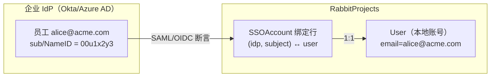
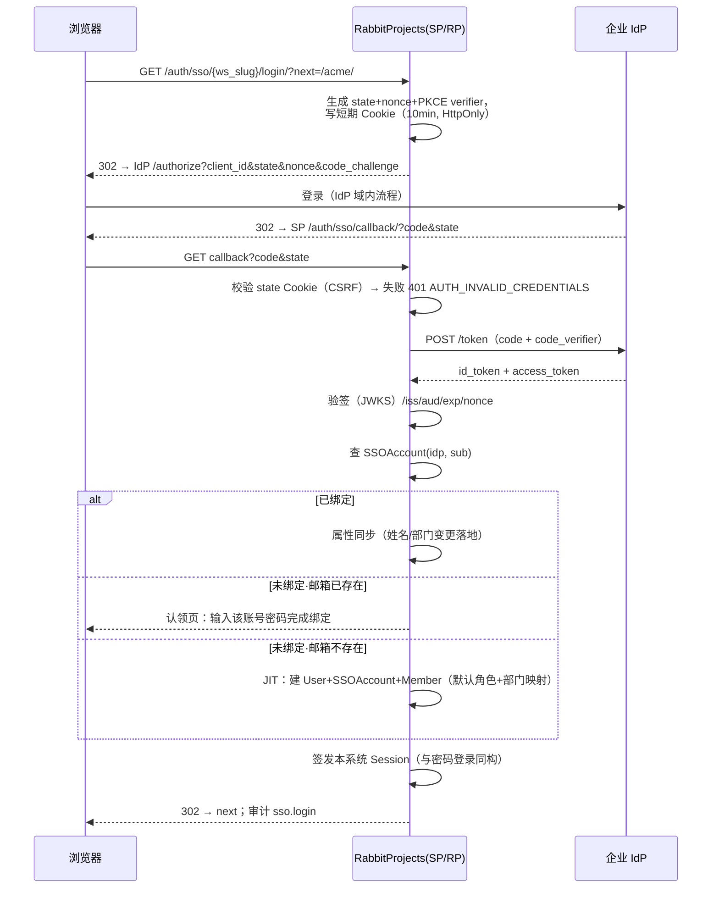
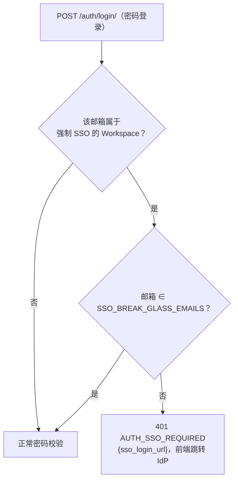

# SSO 单点登录（SAML 2.0 / OIDC）

| 元信息项 | 内容 |
| --- | --- |
| 文档编号 | AUTH-009 |
| 所属迭代 | Sprint 8 — 企业组织权限治理（第 11 周） |
| 优先级 | P3（企业版核心级 · 身份面） |
| 所属模块 | M1-AUTH｜账号与权限 |
| 文档状态 | 待评审（Draft） |
| 最后更新日期 | 2026-09-01 |
| 上游依赖 | `AUTH-001/004`（账号体系与密码登录）、`AUTH-007`（部门树——JIT 部门映射落点）、`AUTH-008`（JIT 角色映射落点） |
| 下游消费 | `AUTH-010`（SSO 登录/配置变更入审计）、`AUTH-011`（P4 LDAP/SCIM 同源身份面）、`AUTH-012`（P4 多租户按 IdP 隔离） |
| 上游依据 | `docs/需求文档.md` §3.1 企业版专属（SSO 单点登录）、§8.2 账号 P3 列 |
| 关联架构文档 | [`api-conventions.md`](../architecture/api-conventions.md)（§8 错误码）、[`rbac-permission-model.md`](../architecture/rbac-permission-model.md)（WS 层角色默认值） |
| 对标基线 | GitLab SAML/OIDC（JIT provision 范式） · Ones SSO · Plane（**无 SSO，社区最高票需求**——差异化能力） |
| 工作量估算 | 后端 4 人日 / 前端 1.5 人日 / 联调与测试 2.5 人日（双协议 IdP 环境），合计 **8 人日** |

---

## 1. 概述

### 1.1 功能定位

企业客户的身份事实源在 IdP（Okta/Azure AD/Keycloak/飞连），要求员工「一处登录、处处通行」，离职在 IdP 禁用即全系统失效。AUTH-009 交付 Workspace 级 SSO：

1. **双协议**：SAML 2.0（企业存量主流）与 OIDC（新晋默认），每 Workspace 可配 1 个 IdP（多 IdP 归 P4 多租户）；
2. **JIT 开通**：首次 SSO 登录自动建账号，按**属性映射**落到部门（`AUTH-007`）与初始角色；后续登录同步姓名/邮箱/部门变更；
3. **强制 SSO**：Workspace 可开启「仅 SSO 登录」——本地密码登录对该组织成员关闭（实例级逃生通道除外）；
4. **解绑与恢复**：SSO 故障或切换 IdP 时可安全降级回密码登录，不锁死组织。

边界：**认证**归 SSO，**授权**（角色/部门）首次登录按映射落地后即由本系统自有体系接管（`AUTH-008`）；SCIM 式「IdP 主动推送增删改」归 `AUTH-011`（P4）。

### 1.2 关键约定：账号链接模型



| 约定 | 说明 | 理由 |
| --- | --- | --- |
| 绑定键 | `(identity_provider_id, subject)` 全局唯一；subject = SAML NameID / OIDC `sub` | IdP 侧邮箱可改、subject 不可变——绑定锚必须是不可变标识 |
| 邮箱链接 | 首次登录若本地已存在同邮箱账号 → **需密码验证一次**完成认领绑定（防 IdP 冒名抢号） | 邮箱非信任锚的经典攻击面 |
| JIT 创建 | 无本地账号 → 创建 User（`password=None` 不可本地登录）+ SSOAccount + WorkspaceMember（默认 MEMBER） | 零管理员介入开通 |
| 单 IdP | 每 Workspace 一个启用中 IdP；停用可切换 | 多 IdP 路由（按邮箱域）归 P4 |
| 逃生通道 | 实例环境变量 `SSO_BREAK_GLASS_EMAILS` 名单内账号即使强制 SSO 也可密码登录 | IdP 故障/配置错误时防组织锁死 |

### 1.3 范围边界

| 范围 | 本文档交付 | 明确不做 |
| --- | --- | --- |
| 协议 | SAML 2.0（SP-initiated + IdP-initiated）/ OIDC（Authorization Code + PKCE） | OAuth2 纯授权（非认证）场景、CAS |
| JIT | 建号、姓名/邮箱/部门/初始角色映射、每次登录属性同步 | SCIM 推送式开通/禁用（`AUTH-011` P4） |
| 强制 SSO | 开关 + 密码登录拒绝 + 逃生通道 | 按成员分级强制（P4） |
| 会话 | SSO 登录后签发本系统自有 Session/JWT（与密码登录同生命周期）；SLO（单点登出）尽力而为 | IdP 会话实时联动吊销（P4 风控） |
| 安全 | 断言签名校验、Response/Assertion 时效、RelayState/state CSRF、PKCE | 证书自动轮转提醒（P4 运维） |

### 1.4 前置依赖

| 依赖 | 内容 | 阻塞原因 |
| --- | --- | --- |
| `AUTH-001/004` | User/Session 模型、密码登录与签发链路 | SSO 是并列认证入口，复用签发 |
| `AUTH-007` | Department 树 | JIT 部门映射落点 |
| `AUTH-008` | CustomRole | JIT 角色映射落点（可选映射到自定义角色） |
| 基础设施 | `python3-saml`、`authlib` 依赖；SP 元数据 HTTPS 端点 | 协议实现 |

### 1.5 竞品参考

| 竞品 | 参考点 | 处置 |
| --- | --- | --- |
| GitLab | Group SAML：绑定锚 `extern_uid`（=NameID）、JIT provision、邮箱认领需验证 | **绑定模型对齐**（subject 锚 + 认领验证） |
| Ones | 企业 SSO：SAML/OIDC 双协议、强制 SSO 开关、属性映射 | 功能面对齐 |
| Keycloak（作为 IdP 生态） | 标准 OIDC claims（`groups`/`department` 自定义映射） | 属性映射采用「IdP claim 名可配置」而非硬编码 |
| Plane | 无 SSO（EE 亦无，issue 长期高票） | 差异化能力 |

---

## 2. 业务逻辑

### 2.1 OIDC 登录时序（SP-initiated）



### 2.2 SAML 登录差异点

SAML 流程骨架同 OIDC，差异：发起端 `GET /auth/sso/{slug}/saml/login/` 生成 AuthnRequest（含 RelayState）；回调 `POST /auth/sso/saml/acs/` 接收 Base64 Response——**必须**校验：Response 与 Assertion 双签名（SP 配置 IdP 证书）、`NotOnOrAfter`（±5min 时钟偏移）、`InResponseTo`（SP-initiated 时）、Audience = SP EntityID。IdP-initiated（无 InResponseTo）允许但要求 Assertion 加密或签名 + 时效 ≤ 5min，且审计标记 `initiated_by=idp`。

### 2.3 属性映射与 JIT 规则

| IdP 属性（claim/attribute 名可配置） | 本系统字段 | 同步时机 | 冲突策略 |
| --- | --- | --- | --- |
| `sub` / NameID | `SSOAccount.subject` | 首次绑定 | 不可变（变更=新身份） |
| `email` | `User.email` | 每次登录 | IdP 为准（唯一性冲突→拒绝登录并告警） |
| `name` | `User.display_name` | 每次登录 | IdP 为准（用户本地改名被覆盖——UI 明示） |
| `department`（可配置 claim 名） | `WorkspaceMember.department` | 每次登录 | 按名称匹配部门树；无匹配→**保持现值**+记 `unmapped` 警告（不自动建部门） |
| `role`（可配置 claim 名） | 初始 WS 角色映射表（如 `qa-lead→WS_MEMBER+自定义角色`） | **仅首次 JIT** | 后续登录不同步角色（授权归本系统，防 IdP 误配大面积提权） |

### 2.4 强制 SSO 与逃生



### 2.5 业务规则汇总

| 编号 | 规则 | 触发点 | 违规响应 |
| --- | --- | --- | --- |
| BR-01 | 绑定锚 `(idp_id, subject)` 唯一且不可改 | 绑定 | uq 冲突 `VALIDATION_ERROR` |
| BR-02 | 同邮箱本地账号认领须密码验证一次 | JIT 链接 | `AUTH_INVALID_CREDENTIALS` |
| BR-03 | IdP 配置（元数据/证书/client_secret）变更需 WS_OWNER | 配置写 | `PERM_DENIED` |
| BR-04 | 启用 SSO 前必须通过「测试连接」干跑（验签+取 claims，不建会话） | 启用 | 未通过 `VALIDATION_ERROR` |
| BR-05 | 强制 SSO 开启前要求：≥1 名 WS_OWNER 已完成 SSO 登录绑定 | 开关 | `VALIDATION_ERROR`（防自锁） |
| BR-06 | 逃生通道名单走环境变量（不入库、不可 API 改） | 登录 | — |
| BR-07 | 断言/令牌验签、时效、audience、nonce/state 任一失败即拒 | 回调 | `AUTH_INVALID_CREDENTIALS`（不区分细节防探测，细节进服务端日志） |
| BR-08 | JIT 默认角色 = IdP 配置项（默认 WS_MEMBER；可选 GUEST） | JIT | — |
| BR-09 | 部门映射仅按名称精确匹配（不区分大小写），不匹配不建部门 | 属性同步 | 记警告日志 + 登录继续 |
| BR-10 | 角色映射仅首次 JIT 生效；后续登录不触碰角色 | 属性同步 | — |
| BR-11 | 解绑 SSOAccount：用户设过密码即可解绑；未设密码须先设密 | 解绑 | `VALIDATION_ERROR` `password_required` |
| BR-12 | 停用 IdP：存量绑定保留可重绑；登录入口关闭 | 配置 | — |
| BR-13 | SSO 登录、JIT 创建、认领、解绑、配置变更全量入审计 | 全链路 | — |
| BR-14 | IdP 配置的 client_secret/私钥字段加密存储（KMS/Fernet），API 永不回显 | 配置读写 | 响应中 `secret_set: true` 代替 |
| BR-15 | 回调地址/元数据端点仅 HTTPS（生产）；HTTP 仅开发环境变量显式允许 | 配置校验 | `VALIDATION_ERROR` |

### 2.6 异常处理

| 场景 | 处理 |
| --- | --- |
| IdP 不可达（回调 token 交换超时） | 5s 超时 ×2 重试 → 登录页错误「身份提供方暂时不可用」+ `SERVER_EXTERNAL_SERVICE_ERROR`（502） |
| 邮箱唯一性冲突（IdP 改邮箱撞上他人） | 拒绝登录 + 安全告警通知 WS_OWNER + 审计 `sso.email_conflict` |
| 证书临近过期（<14 天） | 每次配置页读取返回 `cert_expires_in_days`，UI 横幅提醒 |
| state/nonce Cookie 丢失（跨域场景） | 400 + 引导重新发起登录（SameSite=Lax 保证顶级导航可带） |

### 2.7 边界条件

- **多 Workspace 成员**：SSO 属 Workspace 级配置；用户登录后进入有 SSO 绑定的组织时沿用统一 Session（SSO 是「进系统的门」，不是「每组织一道门」）；强制 SSO 仅约束**该组织成员的登录方式**。
- **IdP 侧禁用用户**：本系统会话不实时吊销（最长 12h）；`AUTH-011` SCIM 落地后支持即时禁用——文档明示该窗口。
- **NameID 格式**：接受 `persistent`/`transient`；`emailAddress` 格式仅当 IdP 承诺不可变时可选（配置项警告）。

---

## 3. UI/UX 设计

### 3.1 SSO 配置页（WS_OWNER）

```
┌──────────────────────────────────────────────────────────────────────┐
│ 工作空间设置 / 单点登录（SSO）                          状态：● 已启用 │
├──────────────────────────────────────────────────────────────────────┤
│ 协议： (●) OIDC   ( ) SAML 2.0                                        │
│ ┌──────────────────────────────────────────────────────────────────┐ │
│ │ IdP Issuer URL    [https://login.acme.com/__]   [发现元数据]      │ │
│ │ Client ID         [rabbit-projects______]                          │ │
│ │ Client Secret     [••••••••]（已设置 secret_set=true）             │ │
│ │ 回调地址（配置到 IdP）https://rp.example.com/auth/sso/callback/ 📋 │ │
│ ├──────────────────────────────────────────────────────────────────┤ │
│ │ 属性映射：部门 claim [department__]  角色 claim [groups______]     │ │
│ │ JIT 默认角色：[工作空间成员 ▾]   ☑ 每次登录同步姓名/邮箱/部门      │ │
│ ├──────────────────────────────────────────────────────────────────┤ │
│ │ [测试连接]（干跑验签，不建会话）  上次测试：✅ 通过（2 小时前）     │ │
│ │ ☐ 强制 SSO 登录（本组织成员禁用密码登录）                          │ │
│ │   ⚠ 需至少 1 名所有者已绑定 SSO；逃生名单见部署文档                │ │
│ │ 证书有效期：剩余 231 天                                            │ │
│ └──────────────────────────────────────────────────────────────────┘ │
│ 绑定成员：186/210 已绑定  [查看未绑定清单]              [保存] [停用]  │
└──────────────────────────────────────────────────────────────────────┘
```

### 3.2 登录页与认领页

- 登录页：输入邮箱 → 若属强制 SSO 组织 → 直接跳转 IdP（密码框不渲染）；否则显示密码框 + 「使用企业 SSO 登录」次级按钮（通用入口，按邮箱域/工作空间路由到 IdP）。
- 认领页：「检测到 alice@acme.com 已有账号。输入该账号密码完成与贵司身份系统的绑定，此后可直接 SSO 登录。」——一次性，绑定后不再出现。

### 3.3 空状态 / 加载 / 失败

| 状态 | 表现 |
| --- | --- |
| 未配置 | 配置向导三步（选协议 → 填元数据 → 测试连接），附各 IdP（Okta/Azure AD/Keycloak）配置指引链接 |
| 测试连接中 | 按钮 loading + 步骤进度（重定向 → 回调 → 验签） |
| 登录失败 | 统一文案「企业身份验证未通过，请联系管理员」+ 错误参考号（request_id）——**不回显**验签细节 |
| 证书临期 | 配置页顶部黄色横幅 + 给 WS_OWNER 的站内通知 |

### 3.4 响应式与无障碍

- 配置表单全部 label 关联；密钥字段 `autocomplete="off"` + 明文切换按钮。
- 登录跳转链路纯 302 表单/链接实现，无 JS 依赖（IdP 侧兼容底线）。

---

## 4. 技术架构

### 4.1 数据模型

```python
# apps/core/models/sso.py
class IdentityProvider(models.Model):
    PROTOCOL_OIDC, PROTOCOL_SAML = "oidc", "saml"
    id = models.ULIDField(primary_key=True)
    workspace = models.OneToOneField("Workspace", on_delete=models.CASCADE,
                                     related_name="identity_provider")
    protocol = models.CharField(max_length=8,
                                choices=[(PROTOCOL_OIDC, "OIDC"), (PROTOCOL_SAML, "SAML")])
    is_enabled = models.BooleanField(default=False)
    # OIDC
    issuer = models.URLField(blank=True)
    client_id = models.CharField(max_length=200, blank=True)
    client_secret_enc = models.BinaryField(null=True)      # Fernet 加密，永不回显
    jwks_url = models.URLField(blank=True)                 # 发现元数据解析缓存
    # SAML
    idp_entity_id = models.CharField(max_length=300, blank=True)
    idp_sso_url = models.URLField(blank=True)
    idp_slo_url = models.URLField(blank=True)
    idp_x509_cert = models.TextField(blank=True)
    sp_entity_id = models.CharField(max_length=300, blank=True)
    sp_private_key_enc = models.BinaryField(null=True)
    sp_x509_cert = models.TextField(blank=True)
    # 映射与策略
    claim_department = models.CharField(max_length=64, blank=True, default="department")
    claim_role = models.CharField(max_length=64, blank=True, default="groups")
    jit_default_role = models.CharField(max_length=20, default="WS_MEMBER")
    sync_profile_on_login = models.BooleanField(default=True)
    enforce_sso = models.BooleanField(default=False)
    last_test_passed_at = models.DateTimeField(null=True)
    created_by = models.ForeignKey("User", on_delete=models.PROTECT)
    created_at = models.DateTimeField(auto_now_add=True)
    updated_at = models.DateTimeField(auto_now=True)

    class Meta:
        db_table = "identity_provider"

class SSOAccount(models.Model):
    id = models.ULIDField(primary_key=True)
    idp = models.ForeignKey(IdentityProvider, on_delete=models.CASCADE,
                            related_name="accounts")
    user = models.ForeignKey("User", on_delete=models.CASCADE,
                             related_name="sso_accounts")
    subject = models.CharField(max_length=255)             # sub / NameID
    email_at_binding = models.EmailField()
    created_at = models.DateTimeField(auto_now_add=True)

    class Meta:
        db_table = "sso_account"
        constraints = [models.UniqueConstraint("idp", "subject",
                                               name="uq_sso_subject")]
        indexes = [models.Index("user", name="idx_sso_account_user")]
```

迁移要点：两表全新（零回填）；`enforce_sso` 默认 false——升级后行为与标准版完全一致。密钥列加密用 `django-fernet-fields` 等价封装（KMS 密钥走环境变量，`INFRA-005` 生产配置统一）。

### 4.2 API 定义

| 方法 | 路径 | 说明 | 权限 |
| --- | --- | --- | --- |
| GET | `/api/v1/workspaces/{slug}/sso/` | 配置读取（密钥不回显，`secret_set` 代替） | WS_OWNER |
| PUT | `/api/v1/workspaces/{slug}/sso/` | 整体配置写入/替换（集合型配置，PUT 语义合规） | WS_OWNER |
| POST | `/api/v1/workspaces/{slug}/sso/test/` | 测试连接干跑（验签+claims 取样，不建会话） | WS_OWNER |
| POST | `/api/v1/workspaces/{slug}/sso/enforce/` | 开/关强制 SSO（BR-05 前置校验） | WS_OWNER |
| GET | `/api/v1/workspaces/{slug}/sso/bindings/` | 绑定成员清单 | WS_OWNER |
| GET | `/auth/sso/{slug}/login/` | OIDC 发起（302 IdP） | 公开 |
| GET | `/auth/sso/callback/` | OIDC 回调 | 公开 |
| GET | `/auth/sso/{slug}/saml/login/` · POST `/auth/sso/saml/acs/` | SAML 发起/断言消费 | 公开 |
| GET | `/auth/sso/{slug}/metadata/` | SP 元数据（SAML XML / OIDC 配置摘要） | 公开 |
| POST | `/api/v1/me/sso/unbind/` | 解绑本人 SSO（BR-11） | 登录用户 |

**GET sso/ — 200**：

```json
{
  "status": 0,
  "data": {
    "protocol": "oidc", "is_enabled": true, "enforce_sso": true,
    "issuer": "https://login.acme.com", "client_id": "rabbit-projects",
    "secret_set": true,
    "claim_department": "department", "claim_role": "groups",
    "jit_default_role": "WS_MEMBER", "sync_profile_on_login": true,
    "last_test_passed_at": "2026-09-01T08:00:00.000000Z",
    "cert_expires_in_days": 231,
    "bound_count": 186, "member_count": 210
  },
  "meta": {"request_id": "01J9XN1P2Q3R4S5T6U7V8W9X0Y"}
}
```

**密码登录被强制 SSO 拦截 — 401**：

```json
{
  "status": 1,
  "error": {"code": "AUTH_SSO_REQUIRED",
            "message": "该组织已启用强制单点登录，请使用企业身份登录",
            "details": [{"sso_login_url": "/auth/sso/acme/login/"}]},
  "meta": {"request_id": "01J9XN2Q3R4S5T6U7V8W9X0Y1Z"}
}
```

**启用前未测试 — 400**：`{"code":"VALIDATION_ERROR","details":[{"field":"is_enabled","reason":"test_required","hint":"请先通过测试连接"}]}`。

**强制 SSO 前置不满足 — 400**：`{"code":"VALIDATION_ERROR","details":[{"field":"enforce_sso","reason":"owner_binding_required"}]}`。

> 错误码 `AUTH_SSO_REQUIRED`(401)/`AUTH_INVALID_CREDENTIALS`(401)/`SERVER_EXTERNAL_SERVICE_ERROR`(502) 均取自 `api-conventions.md` §8 注册表。

### 4.3 核心逻辑

```python
# apps/core/services/sso.py
class OIDCFlow:
    """authlib 封装；state/nonce/PKCE 三件套，HttpOnly 短期 Cookie"""

    def begin(self, request, idp, next_url):
        state, nonce = secrets.token_urlsafe(24), secrets.token_urlsafe(24)
        verifier = pkce_verifier()
        resp = redirect(self._authorize_url(idp, state, nonce, verifier))
        resp.set_signed_cookie("sso_txn", {"state": state, "nonce": nonce,
                               "verifier": verifier, "next": next_url,
                               "idp": str(idp.id)},
                               max_age=600, httponly=True, samesite="Lax",
                               secure=settings.IS_PROD)
        return resp

    @transaction.atomic
    def complete(self, request):
        txn = request.get_signed_cookie("sso_txn", max_age=600)
        if not txn or txn["state"] != request.GET.get("state"):
            raise AuthInvalid("state_mismatch")          # → AUTH_INVALID_CREDENTIALS(401)
        idp = IdentityProvider.objects.get(pk=txn["idp"])
        token = self._exchange(idp, request.GET["code"], txn["verifier"])
        claims = self._verify_id_token(idp, token, txn["nonce"])  # 验签/exp/nonce
        return self._resolve_user(idp, claims)

    def _resolve_user(self, idp, claims):
        sub, email = claims["sub"], claims["email"].lower()
        binding = SSOAccount.objects.filter(idp=idp, subject=sub).first()
        if binding:
            user = binding.user
        else:
            local = User.objects.filter(email__iexact=email).first()
            if local and local.has_usable_password():
                raise ClaimRequired(local)      # → 认领页：验密后建 SSOAccount
            user = jit_provision(idp, claims)   # 建 User+SSOAccount+Member
            binding = user.sso_accounts.get(idp=idp)
        if idp.sync_profile_on_login:
            sync_profile(binding.user, idp, claims)   # 姓名/邮箱/部门（BR-09）
        return binding.user

def sync_profile(user, idp, claims):
    user.display_name = claims.get("name", user.display_name)
    dept_name = claims.get(idp.claim_department)
    if dept_name:
        dept = Department.objects.filter(
            workspace=idp.workspace, name__iexact=dept_name).first()
        if dept:
            WorkspaceMember.objects.filter(
                workspace=idp.workspace, user=user).update(department=dept)
        else:
            logger.warning("sso dept unmapped", extra={"dept": dept_name})
    user.save(update_fields=["display_name", "email"])
```

**SAML 校验要点**（`python3-saml` `strict=True`）：`wantAssertionsSigned + wantMessagesSigned`、`rejectDeprecatedAlgorithm`、`destination` 严格匹配、时钟偏移 300s。

**密码登录拦截**（`AUTH-001` 登录视图前置钩子）：

```python
def enforce_sso_gate(email: str) -> None:
    qs = IdentityProvider.objects.filter(enforce_sso=True, is_enabled=True,
                                         workspace__members__user__email__iexact=email)
    if qs.exists() and email.lower() not in settings.SSO_BREAK_GLASS_EMAILS:
        raise ApiError(401, "AUTH_SSO_REQUIRED",
                       sso_login_url=f"/auth/sso/{qs.first().workspace.slug}/login/")
```

**安全头与 Cookie**：回调端点 `Cache-Control: no-store`；`sso_txn` Cookie `SameSite=Lax`（IdP 顶级导航回跳可携带）；JWKS 缓存 1h + kid 未命中即刷新。

### 4.4 前端实现

```typescript
// pages/login.tsx：邮箱路由
async function onEmailSubmit(email: string) {
  const { data } = await api.post(`/auth/login-route/`, { email });
  if (data.route === "sso") { location.href = data.sso_login_url; return; }
  setStage("password");
}

// stores/sso-config.store.ts
class SsoConfigStore {
  config = observable<IdentityProviderConfig | null>(null);
  async save(cfg: IdentityProviderConfig) {           // PUT 集合型替换
    const { data } = await api.put(`/workspaces/${slug}/sso/`, cfg);
    runInAction(() => (this.config = data));
  }
  async test() {                                       // 干跑，新窗走一遍登录
    const w = window.open(`/workspaces/${slug}/sso/test/`, "_blank");
    const r = await pollUntil(() => api.get(`/workspaces/${slug}/sso/`),
      d => d.last_test_passed_at !== this.config?.last_test_passed_at);
    w?.close(); return r;
  }
}
```

组件：`<SsoWizard>`（三步配置）、`<ClaimAccountPage>`（认领验密）、`<BindingListPanel>`（绑定清单）。登录页对 `AUTH_SSO_REQUIRED` 响应自动 `location.href = sso_login_url`。

---

## 5. 测试用例

### 5.1 单元测试

| 编号 | 用例 | 断言 |
| --- | --- | --- |
| UT-01 | OIDC state 不匹配拒绝 | `AUTH_INVALID_CREDENTIALS`，无会话 |
| UT-02 | nonce 重放拒绝 | `AUTH_INVALID_CREDENTIALS` |
| UT-03 | id_token 签名错误/过期/aud 错误 | 三类均拒且对外同文案 |
| UT-04 | SAML Response 未签名/断言未签名 | 拒绝（strict 模式） |
| UT-05 | SAML InResponseTo 伪造 | 拒绝 |
| UT-06 | JIT：无本地账号建号 | User(password=None)+SSOAccount+Member 默认角色 |
| UT-07 | JIT：本地有密码账号 → 认领 | 未验密不建绑定 |
| UT-08 | 认领验密成功 → 绑定 | SSOAccount 落库，uq(idp,subject) |
| UT-09 | 部门映射：名称匹配成功/无匹配保持现值 | 两分支 |
| UT-10 | 角色映射仅首次 JIT 生效 | 二次登录角色不变 |
| UT-11 | 强制 SSO 拦截密码登录 | 403 + sso_login_url |
| UT-12 | 逃生名单放行密码登录 | 200 |
| UT-13 | enforce 前置校验（无 owner 绑定） | BR-05 拒绝 |
| UT-14 | 解绑：未设密码拒绝 | BR-11 |
| UT-15 | client_secret 加密存储且 API 不回显 | 响应仅 secret_set |

### 5.2 集成测试

| 编号 | 用例 | 断言 |
| --- | --- | --- |
| IT-01 | Keycloak OIDC 全链路（容器化 IdP） | 登录→JIT→Session→审计 |
| IT-02 | SAML（ssocircle/Keycloak SAML）全链路 | 双签名校验通过→登录 |
| IT-03 | IdP 侧改邮箱/姓名/部门 → 二次登录同步 | 三字段落地 |
| IT-04 | IdP 侧改邮箱撞上他人 → 拒绝+告警 | 审计 sso.email_conflict |
| IT-05 | 强制 SSO 后成员密码登录被拒、SSO 登录正常 | 403/200 |
| IT-06 | 停用 IdP → 登录入口关闭、绑定保留 | 重启用后可登录 |
| IT-07 | 测试连接干跑不建会话不留 Cookie 会话 | Session 表无新行 |

### 5.3 E2E 测试

| 编号 | 场景 |
| --- | --- |
| E2E-01 | 管理员向导配置 OIDC（演示 IdP）→ 测试连接通过 → 启用 |
| E2E-02 | 新员工 SSO 首登 JIT：自动建号、落到映射部门、默认角色正确 |
| E2E-03 | 老员工同邮箱账号：认领页验密绑定 → 后续 SSO 直登 |
| E2E-04 | 开启强制 SSO → 密码登录被拒并自动跳 IdP → SSO 登录成功 |

---

## 6. 竞品深度对标

### 6.1 GitLab Group SAML 实现分析

GitLab `GroupSamlIdentity`：绑定锚 `(saml_provider_id, extern_uid)`，extern_uid=NameID 不可变；JIT 由 `Gitlab::Auth::GroupSaml::User` 在首次登录建 `Identity`+成员；同邮箱认领需 `unconfirmed` 流程验证。本版 SSOAccount 模型与其同构（BR-01/BR-02 直接对齐）。GitLab 教训：SLO 实现不完整导致登出语义混乱——本版将 SLO 标注「尽力而为」并把会话生命周期收敛到本系统。

### 6.2 Ones / 飞书

Ones 企业 SSO 支持 SAML+OIDC、强制 SSO、属性映射到部门——功能面对齐；其角色映射持续同步（每次登录覆盖）曾引发「管理员手动调角色被 IdP 覆盖」投诉，本版 BR-10 角色仅首次 JIT 生效即为规避该模式。

### 6.3 Plane

无 SSO 能力（自托管靠反向代理 Basic Auth 变通），社区 issue #3821 长期高票——本功能是企业版直接卖点。

### 6.4 本系统设计决策

| 决策 | 取舍 |
| --- | --- |
| subject 为绑定锚、邮箱仅认领线索 | 防 IdP 改邮箱盗号；代价是邮箱变更须经绑定关系更新（自动） |
| 角色映射仅 JIT 一次 | 防 IdP 误配大面积提权/降权；代价是 IdP 调角色不自动生效（明示由 AUTH-011 SCIM 解决） |
| 每 Workspace 单 IdP | 覆盖 95% 客户；多 IdP 域名路由归 P4 多租户 |
| 逃生通道走环境变量 | 不可被 API/数据库篡改；代价是运维变更需发版/改配置 |

---

## 7. 里程碑与验收

### 7.1 交付物清单

| 类别 | 内容 |
| --- | --- |
| Model / Migration | `identity_provider`、`sso_account` 表 |
| 后端 | OIDC/SAML 双协议流（发起/回调/元数据）、JIT 开通与属性同步、认领、强制 SSO 门、解绑、配置 CRUD 与测试连接、密钥加密 |
| 前端 | SSO 配置向导、登录页邮箱路由、认领页、绑定清单 |
| 测试 | UT-01~15、IT-01~07、E2E-01~04；容器化 Keycloak 双协议夹具 |

### 7.2 可操作演示的验收标准

1. 对接演示 IdP（OIDC 与 SAML 各一遍）：向导配置 → 测试连接干跑通过 → 启用；未测试不可启用。
2. 新员工 SSO 首登 JIT：自动建号、部门映射命中、默认角色正确；二次登录同步 IdP 侧改名/调部门。
3. 同邮箱存量账号：认领页验密一次完成绑定；此后 SSO 直登，密码登录仍可用（未强制时）。
4. 开启强制 SSO（前置校验通过）：成员密码登录 403 并自动跳 IdP；逃生名单账号可密码登录。
5. 验签/时效/nonce/state 任一篡改的断言与令牌被拒，对外统一文案、细节仅服务端日志。
6. 配置中 client_secret 全程不回显（API 仅 `secret_set`）；证书临期 14 天内配置页横幅 + WS_OWNER 通知。
7. SSO 登录/JIT/认领/解绑/配置变更全部入 `AUTH-010` 审计可检索。


