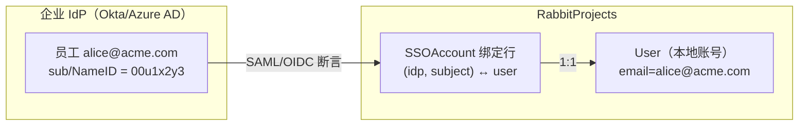
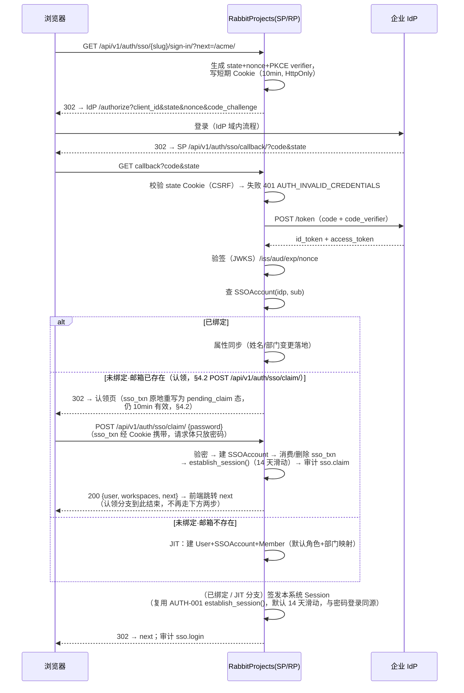
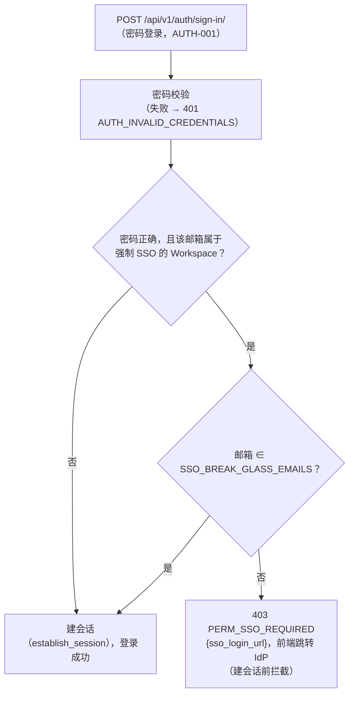

# SSO 单点登录（SAML 2.0 / OIDC）

| 元信息项 | 内容 |
| --- | --- |
| 文档编号 | AUTH-009 |
| 所属迭代 | Sprint 8 — 企业组织权限治理（第 11 周） |
| 优先级 | P3（企业版核心级 · 身份面） |
| 所属模块 | M1-AUTH｜账号与权限 |
| 文档状态 | 已实现（Sprint-8 R1~R6 后端全量 + 前端六表面，2026-09-09） |
| 最后更新日期 | 2026-09-05（R1 修复 10 项：信封重写、单例配置改 PATCH、14 天滑动会话对齐 AUTH-001、/api/v1 前缀 + sign-in 命名、新增 route/ 端点契约、强制 SSO 统一 403 PERM_SSO_REQUIRED、Cookie 丢失改 401、python3-saml/authlib/Fernet 登记、member 外键 + plane 路径、enforce_sso 职责分工；R2 修复：claim/ 端点完整契约 + sso_txn pending_claim 机制、connection-check 统一 POST、SSO 门时序唯一定义、route/ 增 prefer_sso、bindings 列表端点；R3 复评 PASS 9.5×5） |
| 上游依赖 | `AUTH-001/004`（账号体系与密码登录）、`AUTH-007`（部门树——JIT 部门映射落点）、`AUTH-008`（JIT 角色映射落点） |
| 下游消费 | `AUTH-010`（SSO 登录/配置变更入审计）、`AUTH-011`（P4 LDAP/SCIM 同源身份面）、`AUTH-012`（P4 多租户按 IdP 隔离） |
| 上游依据 | `docs/需求文档.md` §3.1 企业版专属（SSO 单点登录）、§8.2 账号 P3 列 |
| 关联架构文档 | [`api-conventions.md`](../architecture/api-conventions.md)（§8 错误码）、[`rbac-permission-model.md`](../architecture/rbac-permission-model.md)（WS 层角色默认值）、[`tech-stack.md`](../architecture/tech-stack.md)（§3 依赖基线 / §9 新增依赖准入——本文三项待补登依赖见 §1.4） |
| 对标基线 | GitLab SAML/OIDC（JIT provision 范式） · Ones SSO · Plane（**无 SSO，社区最高票需求**——差异化能力） |
| 工作量估算 | 后端 4 人日 / 前端 1.5 人日 / 联调与测试 2.5 人日（双协议 IdP 环境），合计 **8 人日** |

> **编号口径声明**：本文件编号 AUTH-009 = SSO 单点登录（SAML 2.0 / OIDC），以 [`docs/README.md`](../README.md) §4 索引为准。`dependency-graph.md` §1.3 与 §2.1 将 AUTH-009/010 的标题互换（把「全量操作审计日志」记在 AUTH-009 名下）——以 README 为准，**dependency-graph 待回改**；其对 AUTH-009 的依赖边（审计/多租户/高可用消费 SSO 事件）语义不变。
> **会话时长口径声明**：本文全部会话生命周期描述（SSO 登录签发的会话与密码登录完全同源）以 `AUTH-001` §2.4 / §4.3.3 的唯一定义为准——**默认 14 天滑动过期（`SESSION_SAVE_EVERY_REQUEST=True`），「记住我」30 天滑动窗口**；本文不维护第二套时长。

---

## 1. 概述

### 1.1 功能定位

企业客户的身份事实源在 IdP（Okta/Azure AD/Keycloak/飞连），要求员工「一处登录、处处通行」，离职在 IdP 禁用即全系统失效。AUTH-009 交付 Workspace 级 SSO：

1. **双协议**：SAML 2.0（企业存量主流）与 OIDC（新晋默认），每 Workspace 可配 1 个 IdP（多 IdP 归 P4 多租户）；
2. **JIT 开通**：首次 SSO 登录自动建账号，按**属性映射**落到部门（`AUTH-007`）与初始角色；后续登录同步姓名/邮箱/部门变更；
3. **强制 SSO**：Workspace 可开启「仅 SSO 登录」——本地密码登录对该组织成员关闭（实例级逃生通道除外）；
4. **解绑与恢复**：SSO 故障或切换 IdP 时可安全降级回密码登录，不锁死组织。

边界：**认证**归 SSO，**授权**（角色/部门）首次登录按映射落地后即由本系统自有体系接管（`AUTH-008`）；SCIM 式「IdP 主动推送增删改」归 `AUTH-011`（P4）。

### 1.2 关键约定：账号链接模型



| 约定 | 说明 | 理由 |
| --- | --- | --- |
| 绑定键 | `(identity_provider_id, subject)` 全局唯一；subject = SAML NameID / OIDC `sub` | IdP 侧邮箱可改、subject 不可变——绑定锚必须是不可变标识 |
| 邮箱链接 | 首次登录若本地已存在同邮箱账号 → **需密码验证一次**完成认领绑定（防 IdP 冒名抢号） | 邮箱非信任锚的经典攻击面 |
| JIT 创建 | 无本地账号 → 创建 User（`password=None` 不可本地登录）+ SSOAccount + WorkspaceMember（默认 MEMBER） | 零管理员介入开通 |
| 单 IdP | 每 Workspace 一个启用中 IdP；停用可切换 | 多 IdP 路由（按邮箱域）归 P4 |
| 逃生通道 | 实例环境变量 `SSO_BREAK_GLASS_EMAILS` 名单内账号即使强制 SSO 也可密码登录 | IdP 故障/配置错误时防组织锁死 |

### 1.3 范围边界

| 范围 | 本文档交付 | 明确不做 |
| --- | --- | --- |
| 协议 | SAML 2.0（SP-initiated + IdP-initiated）/ OIDC（Authorization Code + PKCE） | OAuth2 纯授权（非认证）场景、CAS |
| JIT | 建号、姓名/邮箱/部门/初始角色映射、每次登录属性同步 | SCIM 推送式开通/禁用（`AUTH-011` P4） |
| 强制 SSO | 开关 + 密码登录拒绝 + 逃生通道 | 按成员分级强制（P4） |
| 会话 | SSO 登录成功后经 `AUTH-001` `establish_session()` 签发本系统 Session（与密码登录**同源同生命周期**：默认 14 天滑动、「记住我」30 天，唯一定义见 `AUTH-001` §2.4/§4.3.3）；SLO（单点登出）尽力而为 | IdP 会话实时联动吊销（P4 风控） |
| 安全 | 断言签名校验、Response/Assertion 时效、RelayState/state CSRF、PKCE | 证书自动轮转提醒（P4 运维） |

### 1.4 前置依赖

| 依赖 | 内容 | 阻塞原因 |
| --- | --- | --- |
| `AUTH-001/004` | User/Session 模型、密码登录与签发链路、`establish_session()`（会话时长唯一定义） | SSO 是并列认证入口，复用签发；会话时长不得另立口径 |
| `AUTH-007` | Department 树 + `WorkspaceMember.department` 外键列（rbac §3.2 P3 扩展位，随 `AUTH-007` 迁移添加） | JIT 部门映射落点 |
| `AUTH-008` | CustomRole | JIT 角色映射落点（可选映射到自定义角色） |
| 基础设施 | SP 元数据 HTTPS 端点；本节下表新增 Python 依赖 | 协议实现 |

**新增 Python 依赖登记**（`tech-stack.md` §3 为全仓依赖唯一权威来源，本表三项为其**待补登**项：随 Sprint 8 首个 PR 按 `tech-stack.md` §9 准入清单流程补登入 §3 后端依赖表——**tech-stack §3 待补登**，本文先行登记基线与用途，实现不得偏离此基线）：

| 依赖 | 基线版本 | 用途 | 选型说明 |
| --- | --- | --- | --- |
| `python3-saml` | `1.16.x` | SAML 2.0 SP 全流程（AuthnRequest 生成 / ACS 断言消费 / SP 元数据 / XMLsec 验签） | OneLogin 开源 SDK 事实标准；配合 `xmlsec1` 系统库；本文 §4.3 的 `strict=True` 全量校验即其内置模式 |
| `authlib` | `1.3.x` | OIDC RP 全流程（authorizeURL / token 交换 / JWKS 拉取与 id_token 验签 / PKCE） | 声明式客户端，避免手写协议层；`OAuth2Client` + JWS 验签开箱即用 |
| `cryptography`（Fernet） | `42.x`（亦为 `python3-saml`→`xmlsec` 链的传递依赖，直接声明统一版本） | `client_secret` / SP 私钥的 Fernet 对称加密落库（BR-14；KMS 主密钥走环境变量，`INFRA-005` 生产配置统一） | 直接使用 `cryptography.fernet`，**不引入** `django-fernet-fields` 等第三方封装（该包维护停滞）；§4.1 加密列按此实现 |

### 1.5 竞品参考

| 竞品 | 参考点 | 处置 |
| --- | --- | --- |
| GitLab | Group SAML：绑定锚 `extern_uid`（=NameID）、JIT provision、邮箱认领需验证 | **绑定模型对齐**（subject 锚 + 认领验证） |
| Ones | 企业 SSO：SAML/OIDC 双协议、强制 SSO 开关、属性映射 | 功能面对齐 |
| Keycloak（作为 IdP 生态） | 标准 OIDC claims（`groups`/`department` 自定义映射） | 属性映射采用「IdP claim 名可配置」而非硬编码 |
| Plane | 无 SSO（EE 亦无，issue 长期高票） | 差异化能力 |

---

## 2. 业务逻辑

### 2.1 OIDC 登录时序（SP-initiated）



### 2.2 SAML 登录差异点

SAML 流程骨架同 OIDC，差异：发起端 `GET /api/v1/auth/sso/{slug}/saml/sign-in/` 生成 AuthnRequest（含 RelayState）；回调 `POST /api/v1/auth/sso/saml/acs/` 接收 Base64 Response（acs = Assertion Consumer Service，SAML 协议标准名词；全局端点，按断言 Issuer 解析对应 IdP）——**必须**校验：Response 与 Assertion 双签名（SP 配置 IdP 证书）、`NotOnOrAfter`（±5min 时钟偏移）、`InResponseTo`（SP-initiated 时）、Audience = SP EntityID。IdP-initiated（无 InResponseTo）允许但要求 Assertion 加密或签名 + 时效 ≤ 5min，且审计标记 `initiated_by=idp`。

### 2.3 属性映射与 JIT 规则

| IdP 属性（claim/attribute 名可配置） | 本系统字段 | 同步时机 | 冲突策略 |
| --- | --- | --- | --- |
| `sub` / NameID | `SSOAccount.subject` | 首次绑定 | 不可变（变更=新身份） |
| `email` | `User.email` | 每次登录 | IdP 为准（唯一性冲突→拒绝登录并告警） |
| `name` | `User.display_name` | 每次登录 | IdP 为准（用户本地改名被覆盖——UI 明示） |
| `department`（可配置 claim 名） | `WorkspaceMember.department` | 每次登录 | 按名称匹配部门树；无匹配→**保持现值**+记 `unmapped` 警告（不自动建部门） |
| `role`（可配置 claim 名） | 初始 WS 角色映射表（如 `qa-lead→WS_MEMBER+自定义角色`） | **仅首次 JIT** | 后续登录不同步角色（授权归本系统，防 IdP 误配大面积提权） |

### 2.4 强制 SSO 与逃生



> **状态码裁定（全文唯口径）**：**执行顺序唯一定义——强制 SSO 门（Q1/Q2）在密码校验通过之后、建会话之前执行；密码错误者一律 401 `AUTH_INVALID_CREDENTIALS`，不经本分支**（歧义消解用例 UT-20；§4.3 `enforce_sso_gate` 即由 `AUTH-001` 登录视图于密码校验通过后、建会话前调用，403 的「已认证」定性以此顺序为前提）。走到此分支时**密码校验已通过**（认证成功）但被 Workspace 级策略拒绝——按 `api-conventions.md` §4.3/§8.3，「已认证但策略拒绝」为 **403 + `PERM_*` 码**，与「未认证」的 401 不可混用。故本文使用新码 **`PERM_SSO_REQUIRED`(403)**，「按附录 B 登记」（rbac `PERM_*` 码族）；`api-conventions.md` §8.2 现行登记的 `AUTH_SSO_REQUIRED`(401) 描述的是「实例级强制 SSO」未认证语义，与本场景不同——**api-conventions §8.2 该行待回改**（补注 Workspace 级场景分流至 `PERM_SSO_REQUIRED`）。未认证用户直接访问受 SSO 保护资源（无 Session）仍按 `AUTH-002` 通用口径返回 **401 `AUTH_REQUIRED`**，不经本分支。
> **未绑定 vs 已绑定**：`PERM_SSO_REQUIRED` 不区分该成员是否已有 SSO 绑定——强制 SSO 开启后密码登录一律拒绝（无绑定者走 IdP 登录即完成 JIT/认领绑定）；`sso_login_url` 恒由 Workspace 的启用中 IdP 给出。

### 2.5 业务规则汇总

| 编号 | 规则 | 触发点 | 违规响应 |
| --- | --- | --- | --- |
| BR-01 | 绑定锚 `(idp_id, subject)` 唯一且不可改 | 绑定 | uq 冲突 409 `RESOURCE_ALREADY_EXISTS`（`details.field=subject`/`code=UNIQUE`） |
| BR-02 | 同邮箱本地账号认领须密码验证一次 | JIT 链接 | 401 `AUTH_INVALID_CREDENTIALS`（§4.2 `claim/` 验密失败/事务无效） |
| BR-03 | IdP 配置（元数据/证书/client_secret）变更需 WS_OWNER | 配置写 | 403 `PERM_WORKSPACE_OWNER_REQUIRED`（api-conventions §8.3 已注册） |
| BR-04 | 启用 SSO 前必须通过「测试连接」干跑（验签+取 claims，不建会话） | 启用 | 409 `RESOURCE_STATE_INVALID`（`details` 子码 `TEST_REQUIRED`，§8.8 待补登） |
| BR-05 | 强制 SSO 开启前要求：≥1 名 WS_OWNER 已完成 SSO 登录绑定 | 开关 | 409 `RESOURCE_STATE_INVALID`（`details` 子码 `OWNER_BINDING_REQUIRED`，§8.8 待补登；防自锁） |
| BR-06 | 逃生通道名单走环境变量（不入库、不可 API 改） | 登录 | — |
| BR-07 | 断言/令牌验签、时效、audience、nonce/state 任一失败即拒 | 回调 | 401 `AUTH_INVALID_CREDENTIALS`（不区分细节防探测，细节进服务端日志） |
| BR-08 | JIT 默认角色 = IdP 配置项（默认 WS_MEMBER；可选 GUEST） | JIT | — |
| BR-09 | 部门映射仅按名称精确匹配（不区分大小写），不匹配不建部门 | 属性同步 | 记警告日志 + 登录继续 |
| BR-10 | 角色映射仅首次 JIT 生效；后续登录不触碰角色 | 属性同步 | — |
| BR-11 | 解绑 SSOAccount：用户设过密码即可解绑；未设密码须先设密 | 解绑 | 400 `VALIDATION_ERROR`（`details.field=password`/`code=REQUIRED`，§8.8 已注册） |
| BR-12 | 停用 IdP：存量绑定保留可重绑；登录入口关闭 | 配置 | — |
| BR-13 | SSO 登录、JIT 创建、认领、解绑、配置变更全量入审计 | 全链路 | — |
| BR-14 | IdP 配置的 client_secret/私钥字段加密存储（`cryptography` Fernet，KMS 主密钥走环境变量），API 永不回显 | 配置读写 | 响应中 `secret_set: true` 代替 |
| BR-15 | 回调地址/元数据端点仅 HTTPS（生产）；HTTP 仅开发环境变量显式允许 | 配置校验 | 400 `VALIDATION_ERROR`（`details.field=issuer/idp_sso_url`/`code=INVALID_URL`，§8.8 已注册） |

### 2.6 异常处理

| 场景 | 处理 |
| --- | --- |
| IdP 不可达（回调 token 交换超时） | 5s 超时 ×2 重试 → 登录页错误「身份提供方暂时不可用」+ `SERVER_EXTERNAL_SERVICE_ERROR`（502） |
| 邮箱唯一性冲突（IdP 改邮箱撞上他人） | 拒绝登录 + 安全告警通知 WS_OWNER + 审计 `sso.email_conflict` |
| 证书临近过期（<14 天） | 每次配置页读取返回 `cert_expires_in_days`，UI 横幅提醒 |
| state/nonce Cookie 丢失或过期（跨域场景） | 401 `AUTH_INVALID_CREDENTIALS`（BR-07 同口径：认证态缺失属 401 而非 400 校验错，且不区分细节防探测）+ 前端引导重新发起登录（SameSite=Lax 保证顶级导航可带） |

### 2.7 边界条件

- **多 Workspace 成员**：SSO 属 Workspace 级配置；用户登录后进入有 SSO 绑定的组织时沿用统一 Session（SSO 是「进系统的门」，不是「每组织一道门」）；强制 SSO 仅约束**该组织成员的登录方式**。
- **IdP 侧禁用用户**：本系统会话不实时吊销（与密码登录会话同源：默认最长 14 天滑动、「记住我」30 天——`AUTH-001` §2.4/§4.3.3 唯一定义，本文不另设时长）；`AUTH-011` SCIM 落地后支持即时禁用——文档明示该窗口。
- **NameID 格式**：接受 `persistent`/`transient`；`emailAddress` 格式仅当 IdP 承诺不可变时可选（配置项警告）。

---

## 3. UI/UX 设计

### 3.1 SSO 配置页（WS_OWNER）

```
┌──────────────────────────────────────────────────────────────────────┐
│ 工作空间设置 / 单点登录（SSO）                          状态：● 已启用 │
├──────────────────────────────────────────────────────────────────────┤
│ 协议： (●) OIDC   ( ) SAML 2.0                                        │
│ ┌──────────────────────────────────────────────────────────────────┐ │
│ │ IdP Issuer URL    [https://login.acme.com/__]   [发现元数据]      │ │
│ │ Client ID         [rabbit-projects______]                          │ │
│ │ Client Secret     [••••••••]（已设置 secret_set=true）             │ │
│ │ 回调地址（配置到 IdP）https://rp.example.com/api/v1/auth/sso/callback/ 📋 │ │
│ ├──────────────────────────────────────────────────────────────────┤ │
│ │ 属性映射：部门 claim [department__]  角色 claim [groups______]     │ │
│ │ JIT 默认角色：[工作空间成员 ▾]   ☑ 每次登录同步姓名/邮箱/部门      │ │
│ ├──────────────────────────────────────────────────────────────────┤ │
│ │ [测试连接]（干跑验签，不建会话）  上次测试：✅ 通过（2 小时前）     │ │
│ │ ☐ 强制 SSO 登录（本组织成员禁用密码登录）                          │ │
│ │   ⚠ 需至少 1 名所有者已绑定 SSO；逃生名单见部署文档                │ │
│ │ 证书有效期：剩余 231 天                                            │ │
│ └──────────────────────────────────────────────────────────────────┘ │
│ 绑定成员：186/210 已绑定  [查看未绑定清单]              [保存] [停用]  │
└──────────────────────────────────────────────────────────────────────┘
```

### 3.2 登录页与认领页

- 登录页：输入邮箱 → 经 §4.2 `POST /api/v1/auth/sso/route/` 判定 → 若属强制 SSO 组织（`route=sso`）→ 直接跳转 IdP（密码框不渲染）；否则（`route=password`）显示密码框 + 「使用企业 SSO 登录」次级按钮——**取数方式**：点击后复用 §4.2 `POST route/`、请求体附加 `prefer_sso: true`（邮箱沿用已输入值，无需重复输入）获取 `sso_login_url` 后跳转 IdP；返回仍为 `password`（未知邮箱/非成员）则提示「该邮箱未关联企业 SSO，请使用密码登录」。按邮箱域自动路由归 P4。
- 认领页：「检测到 alice@acme.com 已有账号。输入该账号密码完成与贵司身份系统的绑定，此后可直接 SSO 登录。」——一次性，绑定后不再出现；密码提交至 §4.2 `POST /api/v1/auth/sso/claim/`（`sso_txn` 经 Cookie 自动携带，前端无需透传）。

### 3.3 空状态 / 加载 / 失败

| 状态 | 表现 |
| --- | --- |
| 未配置 | 配置向导三步（选协议 → 填元数据 → 测试连接），附各 IdP（Okta/Azure AD/Keycloak）配置指引链接 |
| 测试连接中 | 按钮 loading + 步骤进度（提交 → IdP 探测/验签 → 同步返回结果）：前端以 `POST connection-check/` 提交并按 `last_test_passed_at` 轮询刷新展示，**无浏览器跳转/新窗**（§4.4） |
| 登录失败 | 统一文案「企业身份验证未通过，请联系管理员」+ 错误参考号（request_id）——**不回显**验签细节 |
| 证书临期 | 配置页顶部黄色横幅 + 给 WS_OWNER 的站内通知 |

### 3.4 响应式与无障碍

- 配置表单全部 label 关联；密钥字段 `autocomplete="off"` + 明文切换按钮。
- 登录跳转链路纯 302 表单/链接实现，无 JS 依赖（IdP 侧兼容底线）。

---

## 4. 技术架构

### 4.1 数据模型

```python
# apps/api/plane/db/models/sso.py
import uuid

from django.db import models


class IdentityProvider(models.Model):
    PROTOCOL_OIDC, PROTOCOL_SAML = "oidc", "saml"
    id = models.UUIDField(primary_key=True, default=uuid.uuid4,
                          editable=False)                       # UUID v4（api-conventions §4.5）
    workspace = models.OneToOneField("Workspace", on_delete=models.CASCADE,
                                     related_name="identity_provider")
    protocol = models.CharField(max_length=8,
                                choices=[(PROTOCOL_OIDC, "OIDC"), (PROTOCOL_SAML, "SAML")])
    is_enabled = models.BooleanField(default=False)
    # OIDC
    issuer = models.URLField(blank=True)
    client_id = models.CharField(max_length=200, blank=True)
    client_secret_enc = models.BinaryField(null=True)      # Fernet 加密，永不回显
    jwks_url = models.URLField(blank=True)                 # 发现元数据解析缓存
    # SAML
    idp_entity_id = models.CharField(max_length=300, blank=True)
    idp_sso_url = models.URLField(blank=True)
    idp_slo_url = models.URLField(blank=True)
    idp_x509_cert = models.TextField(blank=True)
    sp_entity_id = models.CharField(max_length=300, blank=True)
    sp_private_key_enc = models.BinaryField(null=True)
    sp_x509_cert = models.TextField(blank=True)
    # 映射与策略
    claim_department = models.CharField(max_length=64, blank=True, default="department")
    claim_role = models.CharField(max_length=64, blank=True, default="groups")
    jit_default_role = models.CharField(max_length=20, default="WS_MEMBER")
    sync_profile_on_login = models.BooleanField(default=True)
    enforce_sso = models.BooleanField(default=False)
    last_test_passed_at = models.DateTimeField(null=True)
    created_by = models.ForeignKey("User", on_delete=models.PROTECT)
    created_at = models.DateTimeField(auto_now_add=True)
    updated_at = models.DateTimeField(auto_now=True)

    class Meta:
        db_table = "identity_provider"

class SSOAccount(models.Model):
    id = models.UUIDField(primary_key=True, default=uuid.uuid4,
                          editable=False)                       # UUID v4（api-conventions §4.5）
    idp = models.ForeignKey(IdentityProvider, on_delete=models.CASCADE,
                            related_name="accounts")
    user = models.ForeignKey("User", on_delete=models.CASCADE,
                             related_name="sso_accounts")
    subject = models.CharField(max_length=255)             # sub / NameID
    email_at_binding = models.EmailField()
    created_at = models.DateTimeField(auto_now_add=True)

    class Meta:
        db_table = "sso_account"
        constraints = [models.UniqueConstraint("idp", "subject",
                                               name="uq_sso_subject")]
        indexes = [models.Index("user", name="idx_sso_account_user")]
```

迁移要点：两表全新（零回填）；`enforce_sso` 默认 false——升级后行为与标准版完全一致。主键为 UUID v4（全站统一，api-conventions §4.5）。密钥列加密直接使用 `cryptography` 的 Fernet（等价 `django-fernet-fields` 能力，不引入第三方封装；KMS 密钥走环境变量，`INFRA-005` 生产配置统一），依赖登记见 §1.4。

### 4.2 API 定义

| 方法 | 路径 | 说明 | 权限 |
| --- | --- | --- | --- |
| GET | `/api/v1/workspaces/{slug}/sso/` | 配置读取（密钥不回显，`secret_set` 代替；`enforce_sso` 为只读状态位） | `workspace.sso.manage`（WS_OWNER）* |
| PATCH | `/api/v1/workspaces/{slug}/sso/` | 部分更新配置（协议/元数据/属性映射/JIT 默认角色等；**`enforce_sso` 不在接受写入的字段集内**——见下方 enforce 动作端点） | 同上 |
| POST | `/api/v1/workspaces/{slug}/sso/connection-check/` | 测试连接干跑（验签+claims 取样，不建会话；**同步返回结果**——前端 XHR `POST` 提交，非浏览器跳转，§3.3/§4.4；命名对标 §2.5 `slug-check/` 范式） | 同上 |
| POST | `/api/v1/workspaces/{slug}/sso/enforce/` | **开启**强制 SSO（BR-05 前置校验；幂等，重复 POST 返回 200） | 同上 |
| DELETE | `/api/v1/workspaces/{slug}/sso/enforce/` | **关闭**强制 SSO（api-conventions §2.6 归档类动作子资源范式：POST 开 / DELETE 关，方法表达方向） | 同上 |
| GET | `/api/v1/workspaces/{slug}/sso/bindings/` | 绑定成员清单 | 同上 |
| POST | `/api/v1/auth/sso/route/` | 登录路由发现：邮箱 → `sso` / `password`（完整契约见下方） | 公开（登录前置，10/min 限流 + CSRF） |
| GET | `/api/v1/auth/sso/{slug}/sign-in/` | OIDC 发起（302 IdP；`sign-in` 命名对齐 `AUTH-001` §4.2 已注册端点，不用 `login` 动词） | 公开 |
| GET | `/api/v1/auth/sso/callback/` | OIDC 回调 | 公开 |
| POST | `/api/v1/auth/sso/claim/` | 认领绑定提交：验本地账号密码一次 → 建 `SSOAccount` + 建会话（完整契约见下方；`sso_txn` 经 Cookie 携带，请求体只放密码） | 公开（登录档 10/min 限流 + CSRF） |
| GET | `/api/v1/auth/sso/{slug}/saml/sign-in/` · POST `/api/v1/auth/sso/saml/acs/` | SAML 发起/断言消费 | 公开 |
| GET | `/api/v1/auth/sso/{slug}/metadata/` | SP 元数据（SAML XML / OIDC 配置摘要） | 公开 |
| GET | `/api/v1/users/me/sso/bindings/` | 本人 SSO 绑定列表（`id`/`provider`/`created_at`；解绑前发现 `binding_id` 用；信封列表形态，`data` 为数组） | 登录用户（仅本人绑定行） |
| DELETE | `/api/v1/users/me/sso/bindings/{binding_id}/` | 解绑本人 SSO 绑定（BR-11；绑定为资源、解绑即删除该资源行，不用动词路径；`binding_id` 经上行列表端点发现） | 登录用户（对象级：仅本人绑定行） |

\* 权限 Key `workspace.sso.manage`（矩阵取值：仅 WS_OWNER ✅，WS_ADMIN/WS_MEMBER/WS_GUEST ❌）不在 `rbac-permission-model.md` §8.1 现行矩阵中——IdentityProvider 为新增受管控资源，**按附录 B 登记**（7 步清单：permission.ts 定义 + §8.1 补行 + 前端 `<PermissionGate>` 包裹 + 三处一致性 CI + 越权测试）。配置读取与全部写操作同码：IdP 配置含全体成员的认证入口，WS_ADMIN 亦不可见/不可改（配置页仅 WS_OWNER 渲染，§3.1）。

**enforce_sso 职责分工（唯一定义）**：开关**状态**只经 `GET /sso/` 的 `enforce_sso` 字段读取；开关**变更**只经 `POST`/`DELETE …/sso/enforce/` 动作端点执行（POST 开启时携带 BR-05 前置校验；两次动作均写专用审计事件 `sso.config`，载荷含 `action: enable/disable`）。`PATCH /sso/` 的写入字段白名单**不含** `enforce_sso`（serializer 层 `read_only`），杜绝「改配置顺带改开关」绕过前置校验的双路径。

**GET sso/ — 200**：

```json
{
  "status": "success",
  "data": {
    "protocol": "oidc", "is_enabled": true, "enforce_sso": true,
    "issuer": "https://login.acme.com", "client_id": "rabbit-projects",
    "secret_set": true,
    "claim_department": "department", "claim_role": "groups",
    "jit_default_role": "WS_MEMBER", "sync_profile_on_login": true,
    "last_test_passed_at": "2026-09-01T08:00:00.000000Z",
    "cert_expires_in_days": 231,
    "bound_count": 186, "member_count": 210
  }
}
```

> 详情端点 `meta` 可省略（api-conventions §4.1）；`request_id` **只出现在 error 对象内**，成功响应经 `X-Request-Id` 响应头回传（api-conventions §4.2/§4.4）。

**密码登录被强制 SSO 拦截 — 403**（`POST /api/v1/auth/sign-in/`，密码校验已通过、Workspace 级策略拒绝）：

```json
{
  "status": "error",
  "error": {
    "code": "PERM_SSO_REQUIRED",
    "message": "该组织已启用强制单点登录，请使用企业身份登录",
    "details": [
      { "field": "sso_login_url", "code": "SSO_LOGIN_URL", "message": "/api/v1/auth/sso/acme/sign-in/?next=/acme/projects" }
    ],
    "request_id": "01J9XN2Q3R4S5T6U7V8W9X0Y1Z"
  }
}
```

> `PERM_SSO_REQUIRED`(403) 为新码**按附录 B 登记**（§2.4 状态码裁定）；`details` 子码 `SSO_LOGIN_URL` 为载值子码（对标 §8.8 `RETRY_AFTER` 范式），**按 §8.8 待补登**。

**启用前未测试 — 409**（BR-04）：

```json
{
  "status": "error",
  "error": {
    "code": "RESOURCE_STATE_INVALID",
    "message": "请先通过测试连接再启用单点登录",
    "details": [
      { "field": "is_enabled", "code": "TEST_REQUIRED", "message": "尚无通过的测试连接记录" }
    ],
    "request_id": "01J9XN2Q3R4S5T6U7V8W9X0Y2A"
  }
}
```

**强制 SSO 前置不满足 — 409**（BR-05）：

```json
{
  "status": "error",
  "error": {
    "code": "RESOURCE_STATE_INVALID",
    "message": "启用强制单点登录前，需至少一名所有者完成 SSO 登录绑定",
    "details": [
      { "field": "enforce_sso", "code": "OWNER_BINDING_REQUIRED", "message": "当前 WS_OWNER 的 SSO 绑定数为 0" }
    ],
    "request_id": "01J9XN2Q3R4S5T6U7V8W9X0Y2B"
  }
}
```

> `RESOURCE_STATE_INVALID`(409) 取自 `api-conventions.md` §8.5（资源当前状态不允许该操作）；`details` 子码 `TEST_REQUIRED` / `OWNER_BINDING_REQUIRED` **按 §8.8 待补登**。

**POST /api/v1/auth/sso/route/ — 登录路由发现（完整契约）**：

登录页邮箱提交后的唯一定向端点（§3.2/§4.4）：服务端判定该邮箱是否属于已开启**强制 SSO** 的 Workspace，返回应走的登录方式。`AllowAny` + CSRF 校验（`AUTH-001` BR-12：登录端点同检）；限流取登录档 **10 请求/分钟（IP + 邮箱双维度，api-conventions §7.2）**。

请求（`Content-Type: application/json`，另带 `X-CSRFToken` 头）：

```json
{ "email": "alice@acme.com", "prefer_sso": false }
```

> `prefer_sso` 为**可选布尔**（缺省/false 即默认路径）：显式 SSO 意图标记，供 §3.2 密码阶段「使用企业 SSO 登录」次级入口复用本端点获取 `sso_login_url`。

成功响应 — 200（默认路径：强制 SSO 组织成员；或 `prefer_sso=true` 且邮箱命中「**已启用** SSO（含未强制）」Workspace 的在册成员）：

```json
{
  "status": "success",
  "data": { "route": "sso", "sso_login_url": "/api/v1/auth/sso/acme/sign-in/?next=/acme/projects" }
}
```

成功响应 — 200（其余一切情况，含邮箱不存在/未启用 SSO/未强制且未显式 opt-in）：

```json
{ "status": "success", "data": { "route": "password" } }
```

错误响应：400 `VALIDATION_ERROR`（`details.field=email`/`code=INVALID_EMAIL`）、403 `AUTH_CSRF_FAILED`、429 `RATE_LIMIT_EXCEEDED`（含 `Retry-After`）——均为 §8 已注册码。

> **防枚举口径**：默认路径（不带 `prefer_sso`）仅当邮箱命中「强制 SSO 的 Workspace 成员」才返回 `sso`；邮箱不存在、非成员、未启用、未强制一律返回 `password`，随后由正常密码流程给出 401 `AUTH_INVALID_CREDENTIALS`——本端点不产生「该邮箱已注册」信号，不执行密码哈希（恒定时间无必要）。`prefer_sso=true` 的**显式 opt-in 分支**放宽为「已启用（无论强制与否）的在册成员返回 `sso`」：调用方已明示 SSO 意图，返回 `sso_login_url` 泄露的仅是「该邮箱为已启用 SSO 的 Workspace 在册成员」这一弱信号，且仅对显式携带该字段的请求生效；未知邮箱/非成员在 opt-in 下仍恒返回 `password`——**默认路径口径不变**。默认判定与 §4.3 `enforce_sso_gate` 同源（同一 `IdentityProvider` 查询函数）；`prefer_sso` 分支为其同构查询（仅去掉 `enforce_sso=True` 条件），同模块实现，避免两套口径。

> 错误码 `PERM_SSO_REQUIRED`(403，按附录 B 登记)/`AUTH_INVALID_CREDENTIALS`(401)/`RESOURCE_STATE_INVALID`(409)/`SERVER_EXTERNAL_SERVICE_ERROR`(502) 均出自 `api-conventions.md` §8 注册表（`PERM_SSO_REQUIRED` 为本登记新增，见 §2.4 裁定注）。

**POST /api/v1/auth/sso/claim/ — 认领绑定（完整契约）**：

承接 §2.1 认领往返与 §4.3 `ClaimRequired` 的提交端点（§3.2 认领页 / §4.4 `<ClaimAccountPage>`）：回调判定「未绑定·邮箱已存在」后，对该本地账号**验密一次**并完成绑定。`sso_txn` **经 Cookie 携带**（与 callback 同源：`request.get_signed_cookie("sso_txn")`，HttpOnly 前端不可读、api 实例自动携带），请求体只放密码。`AllowAny` + CSRF 校验（`AUTH-001` BR-12：登录端点同检）；限流取登录档 **10 请求/分钟（IP + 事务绑定账号双维度，api-conventions §7.2）**，验密失败并计入 `AUTH-001` BR-11 登录失败锁定（同邮箱 15 分钟内失败 5 次 → 429 `AUTH_TOO_MANY_ATTEMPTS`），杜绝借本端点绕过 sign-in 锁定撞库。

请求（`Content-Type: application/json`，另带 `X-CSRFToken` 头）：

```json
{ "password": "Rabbit2026Pm" }
```

成功响应 — 200（响应头 `Set-Cookie: rp_sessionid=…`——会话经 `AUTH-001` `establish_session()` 签发，默认 14 天滑动，与密码登录同源）：

```json
{
  "status": "success",
  "data": {
    "user": {
      "id": "7d2a9c11-88a4-4f30-9b6c-1a2b3c4d5e6f",
      "email": "alice@acme.com",
      "display_name": "Alice",
      "avatar_url": "",
      "is_active": true,
      "last_login_at": "2026-09-01T08:00:22.005Z",
      "last_workspace_id": "2c7d9e11-88a4-4f30-9b6c-77e1d2f3a4b5"
    },
    "workspaces": [
      { "id": "2c7d9e11-88a4-4f30-9b6c-77e1d2f3a4b5", "name": "Acme", "slug": "acme", "role": 20 }
    ],
    "next": "/acme/projects"
  }
}
```

> 响应形态对齐 `AUTH-001` §4.2.2 sign-in 成功响应（`user` + `workspaces` 内联，`role` 为整数等级值同其登记例外口径），前端登录后直接水合 AuthStore；另附 `next`（取自 `sso_txn`）供前端跳转。落库动作：建 `SSOAccount(idp, subject, user, email_at_binding)`（BR-01 唯一锚）+ 审计 `sso.claim`（BR-13）。

错误响应：

| HTTP | 错误码 | 触发 | 客户端动作 |
| --- | --- | --- | --- |
| 401 | `AUTH_INVALID_CREDENTIALS` | 密码错误（与 `AUTH-001` 同码同文案，防探测） | 原密码重试 |
| 401 | `AUTH_INVALID_CREDENTIALS` + `details` 子码 `SSO_TXN_INVALID` | `sso_txn` Cookie 缺失/过期/签名无效（txn 由服务端签名且 HttpOnly，不构成探测面，故与密码错误区分以指引不同恢复动作；子码**按 §8.8 待补登**） | **重新发起 SSO 登录**（重走 sign-in → IdP），非重试密码 |
| 400 | `VALIDATION_ERROR`（`details.field=password`/`code=REQUIRED`，§8.8 已注册） | 缺密码字段 | 补齐表单 |
| 409 | `RESOURCE_ALREADY_EXISTS`（`details.field=subject`/`code=UNIQUE`，BR-01） | 并发下 `(idp, subject)` 已被绑定 | 提示直接用 SSO 登录 |
| 403 / 429 | `AUTH_CSRF_FAILED` / `RATE_LIMIT_EXCEEDED`（含 `Retry-After`） | CSRF 缺失 / 触达登录档限流 | §8 通用处理 |

**认领期间 `sso_txn` 的保持与消费（唯一定义）**：callback 判定 `ClaimRequired` 时将 `sso_txn` Cookie **原地重写为 pending_claim 态**（载荷 `{pending_claim: true, idp, sub, email, claim_user_id, next}`，仍为签名 HttpOnly Cookie，`max_age` 仍 600s——认领须在 IdP 回调后 10 分钟内完成）；`claim/` 验密成功即**消费**——建 `SSOAccount`、响应删除该 Cookie，事务一次性使用、不可重放（重放因 Cookie 已删除而无 txn 可验）；超时即自然失效（`SignatureExpired` → 401 + `SSO_TXN_INVALID`）。事务态纯 Cookie 承载，无服务端 pending 表，**无需后台清理任务**。

### 4.3 核心逻辑

```python
# apps/api/plane/sso/services.py
class OIDCFlow:
    """authlib 封装；state/nonce/PKCE 三件套，HttpOnly 短期 Cookie"""

    def begin(self, request, idp, next_url):
        state, nonce = secrets.token_urlsafe(24), secrets.token_urlsafe(24)
        verifier = pkce_verifier()
        resp = redirect(self._authorize_url(idp, state, nonce, verifier))
        resp.set_signed_cookie("sso_txn", {"state": state, "nonce": nonce,
                               "verifier": verifier, "next": next_url,
                               "idp": str(idp.id)},
                               max_age=600, httponly=True, samesite="Lax",
                               secure=settings.IS_PROD)
        return resp

    @transaction.atomic
    def complete(self, request):
        try:
            txn = request.get_signed_cookie("sso_txn", max_age=600)
        except (KeyError, BadSignature, SignatureExpired):
            txn = None                                   # Cookie 丢失/过期/被篡改
        if not txn or txn["state"] != request.GET.get("state"):
            # Cookie 缺失与 state 不匹配同码同文案：401 AUTH_INVALID_CREDENTIALS
            # （BR-07 防探测口径；认证态缺失属 401，不得降级为 400 校验错）
            raise AuthInvalid("state_mismatch")          # → AUTH_INVALID_CREDENTIALS(401)
        idp = IdentityProvider.objects.get(pk=txn["idp"])
        token = self._exchange(idp, request.GET["code"], txn["verifier"])
        claims = self._verify_id_token(idp, token, txn["nonce"])  # 验签/exp/nonce
        return self._resolve_user(idp, claims)

    def _resolve_user(self, idp, claims):
        sub, email = claims["sub"], claims["email"].lower()
        binding = SSOAccount.objects.filter(idp=idp, subject=sub).first()
        if binding:
            user = binding.user
        else:
            local = User.objects.filter(email__iexact=email).first()
            if local and local.has_usable_password():
                raise ClaimRequired(local)      # → 视图捕获后把 sso_txn 原地重写为 pending_claim 态
                                                #   （§4.2 claim/ 契约），认领页验密后建 SSOAccount
            user = jit_provision(idp, claims)   # 建 User+SSOAccount+WorkspaceMember
            binding = user.sso_accounts.get(idp=idp)
        if idp.sync_profile_on_login:
            sync_profile(binding.user, idp, claims)   # 姓名/邮箱/部门（BR-09）
        return binding.user

def sync_profile(user, idp, claims):
    user.display_name = claims.get("name", user.display_name)
    dept_name = claims.get(idp.claim_department)
    if dept_name:
        dept = Department.objects.filter(
            workspace=idp.workspace, name__iexact=dept_name).first()
        if dept:
            # WorkspaceMember 的用户外键名为 member（rbac §3.2，非 user）；
            # department 列由 AUTH-007 迁移添加（rbac §3.2 P3 扩展位）
            WorkspaceMember.objects.filter(
                workspace=idp.workspace, member=user,
                is_active=True).update(department=dept)
        else:
            logger.warning("sso dept unmapped", extra={"dept": dept_name})
    user.save(update_fields=["display_name", "email"])
```

**SAML 校验要点**（`python3-saml` `strict=True`）：`wantAssertionsSigned + wantMessagesSigned`、`rejectDeprecatedAlgorithm`、`destination` 严格匹配、时钟偏移 300s。

**密码登录拦截**（`AUTH-001` 登录视图前置钩子；与 §4.2 `route/` 判定共用本查询）：

```python
# apps/api/plane/sso/gate.py
def find_enforced_idp_for_email(email: str) -> IdentityProvider | None:
    """命中「强制 SSO 的 Workspace 成员」判定（route/ 与 sign-in 拦截共用，防两套口径）。
    WorkspaceMember 的用户外键为 member、Workspace 反向关系名为 workspace_member（rbac §3.2），
    仅统计 is_active=True 的在册成员。"""
    return IdentityProvider.objects.filter(
        enforce_sso=True, is_enabled=True,
        workspace__workspace_member__is_active=True,
        workspace__workspace_member__member__email__iexact=email,
    ).first()


def enforce_sso_gate(email: str) -> None:
    # 调用时序（§2.4 执行顺序唯一定义）：AUTH-001 密码校验通过后、建会话前；
    # 密码错误者在更早的校验步即收 401，不经本门
    idp = find_enforced_idp_for_email(email)
    if idp and email.lower() not in settings.SSO_BREAK_GLASS_EMAILS:
        # 密码校验已通过（认证成功）但策略拒绝 → 403 PERM_SSO_REQUIRED（§2.4 裁定，
        # 新码按附录 B 登记；未认证场景走 AUTH-002 的 401 AUTH_REQUIRED，不经此处）
        raise ApiError(403, "PERM_SSO_REQUIRED",
                       sso_login_url=f"/api/v1/auth/sso/{idp.workspace.slug}/sign-in/")
```

**安全头与 Cookie**：回调端点 `Cache-Control: no-store`；`sso_txn` Cookie `SameSite=Lax`（IdP 顶级导航回跳可携带）；JWKS 缓存 1h + kid 未命中即刷新。

### 4.4 前端实现

```typescript
// pages/login.tsx：邮箱路由（api 实例响应拦截器已解包信封——api-conventions §11.2，data 即 envelope.data）
async function onEmailSubmit(email: string) {
  // 登录路由发现端点，完整契约见 §4.2 POST /api/v1/auth/sso/route/
  const data = await api.post(`/api/v1/auth/sso/route/`, { email });
  if (data.route === "sso") { location.href = data.sso_login_url; return; }
  setStage("password");
}

// 登录页密码阶段「使用企业 SSO 登录」次级入口（§3.2）：复用 route/ 显式 opt-in 分支取 sso_login_url
async function onVoluntarySso(email: string) {
  const data = await api.post(`/api/v1/auth/sso/route/`, { email, prefer_sso: true });
  if (data.route === "sso") { location.href = data.sso_login_url; return; }
  showToast("该邮箱未关联企业 SSO，请使用密码登录");
}

// pages/claim.tsx：<ClaimAccountPage> 认领验密（sso_txn 为 HttpOnly Cookie，api 实例自动携带）
async function onClaimSubmit(password: string) {
  try {                                    // 完整契约见 §4.2 POST /api/v1/auth/sso/claim/
    const data = await api.post(`/api/v1/auth/sso/claim/`, { password });
    location.href = data.next;             // 绑定完成且已建会话，跳转 next
  } catch (e) {
    if (e.details?.some(d => d.code === "SSO_TXN_INVALID"))
      location.href = "/login";            // 事务过期/无效 → 重新发起 SSO 登录（非重试密码）
    else
      setError("密码不正确，请重试");       // 401 AUTH_INVALID_CREDENTIALS
  }
}

// stores/sso-config.store.ts
class SsoConfigStore {
  config = observable<IdentityProviderConfig | null>(null);
  async save(cfg: IdentityProviderConfig) {           // PATCH 局部更新（api-conventions §3.2：
                                                      // 单例配置禁用 PUT；enforce_sso 只读，
                                                      // 变更走 §4.2 enforce/ 动作端点）
    const data = await api.patch(`/api/v1/workspaces/${slug}/sso/`, cfg);
    runInAction(() => (this.config = data));
  }
  async test() {                                      // 干跑：POST 同步返回（§4.2），无新窗/浏览器跳转；
                                                      // §3.3 进度三步即「提交 → 验签 → 同步返回结果」
    await api.post(`/api/v1/workspaces/${slug}/sso/connection-check/`);
    return pollUntil(() => api.get(`/api/v1/workspaces/${slug}/sso/`),
      d => d.last_test_passed_at !== this.config?.last_test_passed_at);
  }
}
```

组件：`<SsoWizard>`（三步配置）、`<ClaimAccountPage>`（认领验密，提交至 §4.2 `claim/`）、`<BindingListPanel>`（绑定清单，解绑前经 §4.2 `GET /users/me/sso/bindings/` 发现 `binding_id`）。登录页（密码阶段）对 `PERM_SSO_REQUIRED` 响应自动 `location.href = details` 中的 `sso_login_url`；邮箱阶段则已在 `route/` 端点完成定向，通常不触达密码校验。

---

## 5. 测试用例

### 5.1 单元测试

| 编号 | 用例 | 断言 |
| --- | --- | --- |
| UT-01 | OIDC state 不匹配拒绝 | `AUTH_INVALID_CREDENTIALS`，无会话 |
| UT-02 | nonce 重放拒绝 | `AUTH_INVALID_CREDENTIALS` |
| UT-03 | id_token 签名错误/过期/aud 错误 | 三类均拒且对外同文案 |
| UT-04 | SAML Response 未签名/断言未签名 | 拒绝（strict 模式） |
| UT-05 | SAML InResponseTo 伪造 | 拒绝 |
| UT-06 | JIT：无本地账号建号 | User(password=None)+SSOAccount+Member 默认角色 |
| UT-07 | JIT：本地有密码账号 → 认领 | callback 返回认领页且 `sso_txn` 重写为 pending_claim 态；未验密不建 `SSOAccount`（§4.2 `claim/`） |
| UT-08 | `POST /claim/` 认领验密成功 → 绑定 | `SSOAccount` 落库 uq(idp,subject)；`sso_txn` Cookie 删除（消费）、建会话、审计 `sso.claim`（§4.2） |
| UT-09 | 部门映射：名称匹配成功/无匹配保持现值 | 两分支 |
| UT-10 | 角色映射仅首次 JIT 生效 | 二次登录角色不变 |
| UT-11 | 强制 SSO 拦截密码登录（密码正确） | 403 `PERM_SSO_REQUIRED` + `sso_login_url`（密码错误的情形见 UT-20） |
| UT-12 | 逃生名单放行密码登录 | 200 |
| UT-13 | enforce 前置校验（无 owner 绑定） | 409 `RESOURCE_STATE_INVALID` + `OWNER_BINDING_REQUIRED`（BR-05） |
| UT-14 | 解绑：未设密码拒绝 | 400 `VALIDATION_ERROR`/`REQUIRED`（BR-11） |
| UT-15 | client_secret 加密存储且 API 不回显 | 响应仅 secret_set |
| UT-16 | 登录路由发现（默认路径，不带 `prefer_sso`）：强制 SSO 成员邮箱 → `{route:"sso", sso_login_url}`；未知邮箱/非成员/未强制 → 恒 `{route:"password"}`（防枚举） | 200，两分支（§4.2） |
| UT-17 | 回调 `sso_txn` Cookie 丢失 / 过期 / 签名无效 | 均 401 `AUTH_INVALID_CREDENTIALS`，对外同文案（BR-07/§2.6） |
| UT-18 | PATCH /sso/ 请求体携带 `enforce_sso` 字段 | 字段被忽略（serializer 只读），开关值不变（§4.2 职责分工） |
| UT-19 | `POST /claim/`：密码错误；`sso_txn` 缺失/过期/签名无效 | 密码错 401 `AUTH_INVALID_CREDENTIALS`（可重试）；txn 异常 401 + `SSO_TXN_INVALID` 子码，引导重发登录（§4.2 错误表） |
| UT-20 | 密码错误 + 强制 SSO 开启 | 401 `AUTH_INVALID_CREDENTIALS`——SSO 门在密码校验之后执行，不返回 403（§2.4 执行顺序唯一定义） |
| UT-21 | `route/` 带 `prefer_sso=true`：已启用未强制成员 vs 未知/非成员邮箱 | 前者 200 `{route:"sso", sso_login_url}`；后者恒 `{route:"password"}`（§4.2 opt-in 分支；默认路径口径见 UT-16） |

### 5.2 集成测试

| 编号 | 用例 | 断言 |
| --- | --- | --- |
| IT-01 | Keycloak OIDC 全链路（容器化 IdP） | 登录→JIT→Session→审计 |
| IT-02 | SAML（ssocircle/Keycloak SAML）全链路 | 双签名校验通过→登录 |
| IT-03 | IdP 侧改邮箱/姓名/部门 → 二次登录同步 | 三字段落地 |
| IT-04 | IdP 侧改邮箱撞上他人 → 拒绝+告警 | 审计 sso.email_conflict |
| IT-05 | 强制 SSO 后成员密码登录被拒、SSO 登录正常 | 403 `PERM_SSO_REQUIRED`（含 `sso_login_url`）/ 200 |
| IT-06 | 停用 IdP → 登录入口关闭、绑定保留 | 重启用后可登录 |
| IT-07 | 测试连接干跑不建会话不留 Cookie 会话 | Session 表无新行 |
| IT-08 | 登录路由发现端点：CSRF 缺失 403；同邮箱 11 次/分钟触达 10/min 限流 | 403 `AUTH_CSRF_FAILED` / 429 `RATE_LIMIT_EXCEEDED`+`Retry-After`（§4.2） |
| IT-09 | `POST /claim/`：CSRF 缺失；同账号 11 次/分钟触达登录档限流；借该端点连续验密失败 5 次 | 403 `AUTH_CSRF_FAILED` / 429 `RATE_LIMIT_EXCEEDED` / 429 `AUTH_TOO_MANY_ATTEMPTS`（失败计入 `AUTH-001` BR-11 锁定，§4.2） |

### 5.3 E2E 测试

| 编号 | 场景 |
| --- | --- |
| E2E-01 | 管理员向导配置 OIDC（演示 IdP）→ 测试连接通过 → 启用 |
| E2E-02 | 新员工 SSO 首登 JIT：自动建号、落到映射部门、默认角色正确 |
| E2E-03 | 老员工同邮箱账号：认领页验密绑定 → 后续 SSO 直登 |
| E2E-04 | 开启强制 SSO → 密码登录被拒并自动跳 IdP → SSO 登录成功 |

---

## 6. 竞品深度对标

### 6.1 GitLab Group SAML 实现分析

GitLab `GroupSamlIdentity`：绑定锚 `(saml_provider_id, extern_uid)`，extern_uid=NameID 不可变；JIT 由 `Gitlab::Auth::GroupSaml::User` 在首次登录建 `Identity`+成员；同邮箱认领需 `unconfirmed` 流程验证。本版 SSOAccount 模型与其同构（BR-01/BR-02 直接对齐）。GitLab 教训：SLO 实现不完整导致登出语义混乱——本版将 SLO 标注「尽力而为」并把会话生命周期收敛到本系统。

### 6.2 Ones / 飞书

Ones 企业 SSO 支持 SAML+OIDC、强制 SSO、属性映射到部门——功能面对齐；其角色映射持续同步（每次登录覆盖）曾引发「管理员手动调角色被 IdP 覆盖」投诉，本版 BR-10 角色仅首次 JIT 生效即为规避该模式。

### 6.3 Plane

无 SSO 能力（自托管靠反向代理 Basic Auth 变通），社区 issue #3821 长期高票——本功能是企业版直接卖点。

### 6.4 本系统设计决策

| 决策 | 取舍 |
| --- | --- |
| subject 为绑定锚、邮箱仅认领线索 | 防 IdP 改邮箱盗号；代价是邮箱变更须经绑定关系更新（自动） |
| 角色映射仅 JIT 一次 | 防 IdP 误配大面积提权/降权；代价是 IdP 调角色不自动生效（明示由 AUTH-011 SCIM 解决） |
| 每 Workspace 单 IdP | 覆盖 95% 客户；多 IdP 域名路由归 P4 多租户 |
| 逃生通道走环境变量 | 不可被 API/数据库篡改；代价是运维变更需发版/改配置 |

---

## 7. 里程碑与验收

### 7.1 交付物清单

| 类别 | 内容 |
| --- | --- |
| Model / Migration | `identity_provider`、`sso_account` 表 |
| 后端 | OIDC/SAML 双协议流（发起/回调/元数据）、JIT 开通与属性同步、认领（`claim/`）、强制 SSO 门与 enforce 动作端点（POST 开/DELETE 关）、登录路由发现（`route/`）、解绑（含本人绑定列表 `GET /users/me/sso/bindings/`）、配置读写（PATCH）与测试连接（`connection-check/`）、密钥加密 |
| 前端 | SSO 配置向导、登录页邮箱路由、认领页、绑定清单 |
| 测试 | UT-01~21、IT-01~09、E2E-01~04；容器化 Keycloak 双协议夹具 |

### 7.2 可操作演示的验收标准

1. 对接演示 IdP（OIDC 与 SAML 各一遍）：向导配置 → 测试连接干跑通过 → 启用；未测试不可启用。
2. 新员工 SSO 首登 JIT：自动建号、部门映射命中、默认角色正确；二次登录同步 IdP 侧改名/调部门。
3. 同邮箱存量账号：认领页验密一次完成绑定（§4.2 `claim/`）；此后经登录页「使用企业 SSO 登录」入口直登（§3.2，`route/` 带 `prefer_sso` 取 `sso_login_url`），密码登录仍可用（未强制时）。
4. 开启强制 SSO（前置校验通过）：成员密码登录返回 403 `PERM_SSO_REQUIRED` 并自动跳 IdP；逃生名单账号可密码登录；`PATCH /sso/` 携带 `enforce_sso` 字段不改变开关（仅 enforce/ 端点可变更）。
5. 验签/时效/nonce/state 任一篡改的断言与令牌被拒，对外统一文案、细节仅服务端日志。
6. 配置中 client_secret 全程不回显（API 仅 `secret_set`）；证书临期 14 天内配置页横幅 + WS_OWNER 通知。
7. SSO 登录/JIT/认领/解绑/配置变更全部入 `AUTH-010` 审计可检索。


