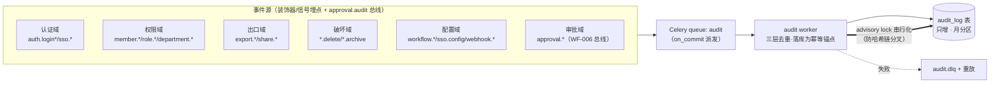
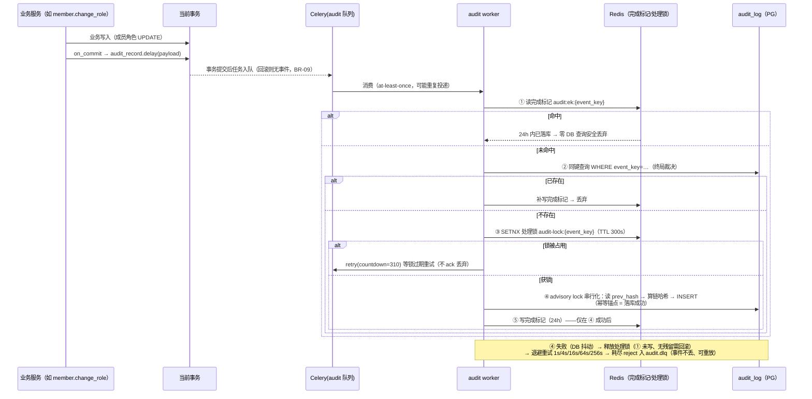

# 全站操作审计日志

| 元信息项 | 内容 |
| --- | --- |
| 文档编号 | AUTH-010 |
| 所属迭代 | Sprint 8 — 企业组织权限治理（第 11 周） |
| 优先级 | P3（企业版核心级 · 组织治理三问之「做过什么」） |
| 所属模块 | M1-AUTH｜账号与权限 |
| 文档状态 | 待评审（Draft） |
| 最后更新日期 | 2026-09-05（R1 修复 10 项：幂等三层去重时序重排（落库为锚）、分区表复合主键 + 分区键唯一约束、哈希链 advisory lock 串行化、导出改 MinIO 预签名、信封重写、分页契约对齐 §6.3、分号修饰符筛选 + 索引补齐、dg §1.3 / rbac §9 待回改登记、六键敏感黑名单（补 webhook_url）、实例级端点 §4.2.1 完整契约；R2 复评 PASS 10/9.5×4 一次过） |
| 上游依赖 | `TASK-010`（Activity 幂等管道范式——本审计写入对齐其「落库成功为幂等锚点 + 三层去重 + 显式 DLX 死信」时序，worker/死信/重放机制同款复刻）、`AUTH-007/008/009`（组织/角色/SSO 事件源，编号以 README §4 为准——AUTH-009 = SSO）、`WF-006`（审批留痕经 `approval.audit` 总线消息汇入，载荷自包含零回查） |
| 下游消费 | P4 合规（告警规则、留存策略扩展）、`AUTH-012`（多租户风控溯源）、安全评审材料 |
| 上游依据 | `docs/需求文档.md` §3.1 企业版专属（全站操作审计日志）、§8.2 权限 P3 列 |
| 关联架构文档 | [`api-conventions.md`](../architecture/api-conventions.md)（§4 信封 / §5.3 筛选 / §5.5 搜索 / §6.2~6.3 分页 / §8 错误码 / §13.1 异步导出）、[`rbac-permission-model.md`](../architecture/rbac-permission-model.md)（§8.1 `audit.read`、§8.3 `system.audit.read`）、[`dependency-graph.md`](../architecture/dependency-graph.md)（模块依赖与 Celery 队列拓扑——**§1.3 将 AUTH-009/AUTH-010 标题互换，以 README §4 为准，dependency-graph §1.3 待回改**，见 §1.5 注记） |
| 对标基线 | GitLab Audit Events（事件分类法） · Ones 操作日志 · Plane（无全站审计——差异化能力） |
| 工作量估算 | 后端 3.5 人日 / 前端 2 人日 / 联调与测试 2 人日，合计 **7.5 人日** |

---

## 1. 概述

### 1.1 功能定位

`TASK-010` 的 Activity 回答「这条任务发生过什么」（协作视角，项目内可见）；AUTH-010 的 AuditLog 回答「**这个系统里谁在何时对什么做了什么敏感操作**」（治理视角，仅管理员可见）。两者管道同源、消费者与留存不同。

交付内容：

1. **全站敏感事件留痕**：登录（成功/失败/SSO）、权限变更（角色/成员/部门）、数据出口（导出/分享外链创建）、破坏性操作（删除/归档）、配置变更（工作流/SSO/Webhook）、审批动作（`WF-006` 经 `approval.audit` 总线汇入）；
2. **检索与导出**：多条件组合检索（人/事件/对象/时间/IP），CSV 导出——**导出动作本身被审计**；
3. **不可变存储**：只增不改不删（应用层无 UPDATE/DELETE 路径），留存 180 天自动清理；
4. **异步写入**：对齐 `TASK-010` 幂等管道范式（**DB 落库成功为幂等锚点**，Redis 完成标记仅作前置快检 + DB 同键查询终局裁决 + 处理锁互斥；显式 DLX 死信 + 重放），业务请求零阻塞。

### 1.2 关键约定：审计与协作动态的边界

| 维度 | IssueActivity（`TASK-010`） | AuditLog（本文档） |
| --- | --- | --- |
| 视角 | 协作：任务字段怎么变的 | 治理：谁动了权限/出口/配置 |
| 可见性 | 项目成员 | WS_ADMIN+（`audit.read`） |
| 典型事件 | `issue.state_changed`、`comment.created` | `member.role_changed`、`export.csv`、`sso.login_failed` |
| 留存 | 随项目生命周期 | 180 天（合规下限），与项目删除解耦 |
| 出口 | 任务动态流 | 检索 API + CSV 导出 |

**双写原则**：同一动作可能同时产生两类记录（如成员角色变更 → 项目 Activity + AuditLog），各自独立管道、互不为源。

### 1.3 关键约定：事件模型



| 字段 | 说明 |
| --- | --- |
| `event_key` | 确定性幂等键（源侧生成）：`sha256(domain\|object_id\|op\|actor_id\|occurred_at_ms)`——同动作重投/重投/重放同键；生成范式与 `TASK-010` `event_key` 一致（事件四元组哈希） |
| `category / action` | 二级分类（`auth` / `login_success`），注册表枚举 |
| `actor` + `actor_snapshot` | 操作者 ID + 当时显示名/邮箱快照（防改名后不可考） |
| `object_type / object_id / object_snapshot` | 操作对象 + 名称快照 |
| `detail` | JSONB 差量（如 `{"role": {"from": "VIEWER", "to": "ADMIN"}}`），**键名黑名单过滤**：`password/secret/token/assertion/private_key/webhook_url` 命中即整键剔除（BR-11） |
| `ip / user_agent` | 来源指纹 |
| `workspace_id` | 租户边界（检索与导出的强制过滤）；`NULL` = 系统级事件（仅实例级端点可见，§4.2.1） |

### 1.4 范围边界

| 范围 | 本文档交付 | 明确不做 |
| --- | --- | --- |
| 留痕 | §1.3 六域事件全集（注册表枚举） | 全量数据变更史（= Activity + 版本系统各自承担） |
| 检索（工作空间级） | 组合条件 + cursor 分页 + CSV 导出 | 实时告警规则（P4 合规） |
| 检索（实例级） | `GET /api/v1/instances/audit-logs/` 系统级端点（完整契约 §4.2.1） | 实例级 CSV 导出（P4 合规包） |
| 留存 | 180 天 + 每日清理任务（仅本表分区；`approval` 域表留存独立，见 BR-07） | 留存周期可配/WORM 存储（P4） |
| 完整性 | 应用层只增 + 链式哈希（`prev_hash`）+ per-workspace advisory lock 串行化 | 区块链式公证（P4） |

### 1.5 前置依赖

| 依赖 | 内容 | 阻塞原因 |
| --- | --- | --- |
| `TASK-010` | 幂等三层去重/处理锁/显式 DLX 死信/重放范式、队列运维模式 | 审计管道同源复刻（`audit` 队列与 `audit.dlq` 死信路由为**本文交付物**，TASK-010 §4.3.2 同款配置） |
| `AUTH-007/008/009` | 部门/角色/SSO 事件埋点 | 本迭代主要事件源 |
| `WF-006` | `approval.audit` 总线消息（载荷自包含：`event/event_id/occurred_at/workspace_id/project_id/actor_id/instance_id/request_id/data`——零回查消费，字段长度按其 §4.8 末注登记与本表 `CharField(64)` 对齐） | 审批域事件订阅汇入 |

> **编号与登记注记**：本文档全部编号引用以 `docs/README.md` §4 权威索引为准——**AUTH-009 = SSO 单点登录、AUTH-010 = 全站操作审计日志（均 Sprint 8 / P3）**。`dependency-graph.md` §1.3 将两者标题互换（其记 AUTH-009 = 全量操作审计日志、AUTH-010 = SSO 单点登录）——**dependency-graph §1.3 待回改**；`rbac-permission-model.md` §9 迭代分层将「全量操作审计日志」归入 P4 行，与其自身 §8.1「AuditLog（P3）· `audit.read`（WS_ADMIN+）」矛盾——以 README §4（Sprint 8 / P3）为准，**rbac §9 待回改**。本文所用权限码 `audit.read`（rbac §8.1）与 `system.audit.read`（rbac §8.3）均为注册表既有码，无需新增。

### 1.6 竞品参考

| 竞品 | 参考点 | 处置 |
| --- | --- | --- |
| GitLab | Audit Events：category/action 二级、actor 快照、CSV 导出需授权 | **事件模型对齐** |
| Ones | 操作日志：工作空间级检索 + 导出 | 检索面对齐 |
| Splunk/ELK 范式 | 只增日志 + 索引生命周期（rollover/delete） | 留存清理采用「月分区 + drop partition」而非 DELETE |
| Plane | 无全站审计 | 差异化能力 |

---

## 2. 业务逻辑

### 2.1 事件写入时序

幂等时序的铁律：**DB 落库成功才是幂等锚点**。Redis 完成标记只是前置快检（且只在落库成功后写入），DB 同键查询是终局裁决——DB 失败的重试绝不因 Redis 残留被判重复，事件至多延迟、绝不静默丢失（对齐 `TASK-010` §1.3 可靠投递三原则）。



### 2.2 检索与导出流程

- **检索（工作空间级）**：`GET …/audit-logs/?actor=&category=&action=&object_type=&ip=&search=&created_at=2026-08-05,2026-09-01;between`——时间筛选用 api-conventions §5.3 分号修饰符（`;after` / `;before` / `;between`，全文统一该形态）；关键词 `search`（§5.5）走 `object_snapshot.name` trgm；`ip` / `object_type` 开放筛选均有对应索引（§4.1 `idx_audit_ip` / `idx_audit_object_type`，§5.3「可筛选字段必须有索引」CI 比对）；排序 `?ordering=`（白名单：`created_at` / `ip` / `category`，默认 `-created_at, -id`；非白名单字段 `400 VALIDATION_INVALID_PARAM`，§5.4）；强制 `workspace_id` 过滤（行级隔离 `AUTH-006` 双保险）；cursor 分页契约见 §4.2。
- **导出**：`POST …/audit-logs/exports/` 同条件 → 202 受理（`task_id` + `status_url`，api-conventions §13.1）→ Celery 生成 CSV（流式，≤50 万行/次，预估超限 409 拒绝并要求收窄条件）→ 完成站内通知 + **1h 预签名下载 URL**（MinIO `presigned_get_object` 签发，FILE-001 下载范式：鉴权端点换发、桶私有、过期重调换发；api-conventions §13.1「导出产物预签名下载 URL 有效期 1 小时」）；**导出动作自身落一条 `audit.exported` 事件**（BR-08）。
- **审批域检索路由（留存边界登记，对齐 WF-006 §2.3 登记注）**：本端点仅覆盖 `audit_log`（审批事件 180 天双写副本）；更早审批留痕以 `WF-006` 审批审计检索面（在线 3 年 + 冷存 4 年）为准——本端点不回查审批域表，180 天清理（BR-07）不截断审批域事件在其自有留存内的可见性。

### 2.3 业务规则汇总

| 编号 | 规则 | 触发点 | 违规响应 |
| --- | --- | --- | --- |
| BR-01 | audit_log 应用层只增：无 UPDATE/DELETE 代码路径；DB 角色禁授 UPDATE/DELETE 权限 | 全链路 | —（结构性约束） |
| BR-02 | 每事件含 actor/object 名称快照（当时值） | 写入 | — |
| BR-03 | `workspace_id` 强制过滤：工作空间作用域端点（§4.2 前四行）恒带 `WHERE workspace_id=<当前空间>`，跨空间检索不存在；`workspace_id IS NULL` 的系统级事件（BR-15/16）仅实例级端点可见（§4.2.1） | 检索/导出 | — |
| BR-04 | 检索需 `audit.read`（WS_ADMIN+）；导出为**双授权**：`audit.read` 权限码 + 二次确认（密码），并记录导出条件快照 | 端点 | `PERM_DENIED` |
| BR-05 | 事件 category/action 必须 ∈ 注册表枚举（CI 校验）；新事件须注册 | 写入 | 未注册事件 worker 拒写 + 告警（该消息直接入 DLQ，重试无意义） |
| BR-06 | event_key 幂等：同 key 只落一行——由**应用层三层去重**保证（① Redis 完成标记前置快检（仅落库成功后写入）→ ② DB 同键查询终局裁决 → ③ 处理锁互斥；对齐 `TASK-010` BR-07 范式）。**分区表 DDL 无法承载跨分区全局唯一**（PG 分区表唯一约束必须包含分区键），`uq_audit_event_key (event_key, created_at)` 仅承担「查询索引 + 同分区同微秒兜底」职责——全局幂等不依赖 DDL 约束 | 写入 | — |
| BR-07 | 留存 180 天：每日清理任务 drop 本表过期月分区（非 DELETE）；**仅作用于 `audit_log` 双写副本**——`approval_records` / `approval_audit_events` 的在线 3 年 + 冷存 4 年留存独立（WF-006 §2.3 登记注），审批域事件可见性不受本清理影响 | 清理 | — |
| BR-08 | 导出动作自身被审计（`audit.exported`，含条件快照与行数） | 导出 | — |
| BR-09 | 埋点在业务事务 `on_commit`——事务回滚不产生审计事件 | 写入 | — |
| BR-10 | 审计写入失败不阻塞业务（异步）；失败释放处理锁后退避重试，耗尽入 DLQ + `SERVER_QUEUE_ERROR` 运维告警（已注册码，`TASK-010` BR-08 同款）——**DB 失败的重试不因 Redis 快检残留被判重复** | 写入 | — |
| BR-11 | detail 禁含敏感值：埋点与 worker 双侧按**敏感键黑名单**过滤——键名命中 `password / secret / token / assertion / private_key / webhook_url`（不区分大小写）即整键剔除并计数告警（`webhook_url` 的值本身即出站凭证 URL，故入列）；不做字段白名单，黑名单为唯一过滤口径 | 写入 | worker 黑名单过滤 + 违规告警 |
| BR-12 | 链式完整性：`hash = sha256(prev_hash ‖ canonical(row))`；**「读 prev → 计算 → 落库」临界区由 per-workspace `pg_advisory_xact_lock` 串行化**（事务级锁，提交/回滚自动释放），同空间并发写入链恒为单线不分叉；每日校验任务抽查 | 写入/校验 | 断链 → CRITICAL 告警 |
| BR-13 | 登录失败事件记录邮箱而非用户 ID（账号可能不存在） | 认证埋点 | — |
| BR-14 | 检索响应不含其他空间任何信息（存在性隐藏） | 检索 | 404 语义 |
| BR-15 | 系统任务（清理/分区维护）产生的事件 actor=`system`、`workspace_id=NULL`（系统级事件） | 写入 | — |
| BR-16 | 实例级检索自身被审计：每次 `GET /api/v1/instances/audit-logs/` 成功调用落一条系统级事件（`category=audit` / `action=instance_query` / `workspace_id=NULL` / actor=调用管理员 / detail 含筛选条件与命中行数） | 实例端点 | — |

### 2.4 异常处理

| 场景 | 处理 |
| --- | --- |
| worker 落库失败（DB 抖动） | 释放处理锁 → 指数退避重试 5 次（1s/4s/16s/64s/256s）→ `audit.dlq`；重放工具 `audit.replay`（同 event_key 幂等——先过 ①② 两层判定，已落库则跳过）。完成标记只在落库成功后写入，失败重试窗口无「被快检误判重复」可能 |
| Redis 不可用 | ① 快检跳过、③ 处理锁降级为 no-op，管道不停（BR-10）；幂等退化为 ② DB 同键查询单保险（同微秒并发窗口存在理论重复概率，advisory lock 仍保证链不分叉）；Redis 恢复后完成标记重新收敛，残留重复行由每日维护任务的 `flag_duplicate_event_keys()` 发现并告警 |
| 哈希校验断链 | 冻结导出（防篡改证据流出被误当完整），CRITICAL 告警，人工介入 |
| 分区创建失败（月初） | 清理任务前置 `CREATE TABLE … PARTITION OF … FOR …`（含 DEFAULT 分区巡检——DEFAULT 分区承接建分区失败窗口的写入，缺失时写入直接报错）；失败告警，写入落 DEFAULT 分区兜底 |

### 2.5 边界条件

- **高基数事件源**：登录失败爆破场景单 IP 短时万级事件——埋点侧滑动窗口聚合（同 `(email,ip)` 1 分钟内折叠为一条 `login_failure_burst` 计数值），防审计表被攻击者灌水。
- **对象删除后**：快照字段保证「对象已删仍可考」；object_id 保留原值不做 FK（审计表零外键——见 §4.1）。
- **时区**：一律 UTC 存储，检索入参 UTC，前端本地渲染。
- **DLQ 重放的链序语义**：重放行经 advisory lock 临界区接当前链尾——链恒单线，但链序与业务发生序可能交错；完整性校验只验证衔接性（prev 可回溯）不验证业务时序，属已知且接受的语义。

---

## 3. UI/UX 设计

### 3.1 审计日志页

```
┌──────────────────────────────────────────────────────────────────────┐
│ 工作空间设置 / 审计日志                          [导出 CSV]          │
├──────────────────────────────────────────────────────────────────────┤
│ 操作者 [搜索成员▾] 事件域 [全部▾] 事件 [全部▾] 对象类型 [全部▾]      │
│ 时间 [2026-08-05] 至 [2026-09-01]  IP [____]  搜索 [对象名______]   │
├──────────────────────────────────────────────────────────────────────┤
│ 时间                 操作者      事件                    对象         │
│ 09-01 10:22:05 UTC  张三        成员角色变更              项目「官网」 │
│                      10.0.1.23  VIEWER → CONTRIBUTOR    成员：李四  ›│
│ 09-01 10:05:41 UTC  admin(系统) 审计日志导出              2,341 行   ›│
│ 09-01 09:58:02 UTC  王五        SSO 登录成功              —           ›│
│ 09-01 09:51:17 UTC  未知        登录失败（邮箱 a@b.co）   ×3 折叠     ›│
│ …（cursor 加载更多）                                                  │
└──────────────────────────────────────────────────────────────────────┘
```

行点击展开详情抽屉：全字段 + `detail` 差量美化（`role: VIEWER → CONTRIBUTOR`）+ 原始 JSON 折叠。

### 3.2 导出对话框

```
┌──────────────────── 导出审计日志 ────────────────────┐
│ 导出条件 = 当前检索条件（预览：约 12,450 行）           │
│ ┌──────────────────────────────────────────────────┐ │
│ │ category ∈ {member.*, role.*}                     │ │
│ │ 时间 2026-08-05 ~ 2026-09-01                      │ │
│ └──────────────────────────────────────────────────┘ │
│ ⚠ 导出动作将记入审计日志。单次上限 500,000 行。        │
│ 确认密码 [________________]（二次确认）                 │
│                                  [取消]  [开始导出]     │
└──────────────────────────────────────────────────────┘
```

完成后站内通知 + 1h 预签名下载链接（过期后在导出详情重新获取，§4.2）。

### 3.3 空状态 / 加载 / 失败

| 状态 | 表现 |
| --- | --- |
| 无结果 | 「该条件下无审计记录」+ 条件摘要 + 清除筛选 |
| 首次进入 | 默认「最近 7 天 · 全部事件」 |
| 导出排队 | 对话框转进度态（队列位置），可关闭后台继续 |
| 下载链接过期 | 下载按钮点击后自动重调导出详情端点换发新 1h 预签名链接（对用户无感） |
| 哈希校验告警 | 页顶红色横幅「审计完整性校验异常，导出已冻结，请联系运维」（仅 WS_OWNER 可见） |

### 3.4 响应式与无障碍

- 表格 ≥7 列在 <1280px 时 IP/UA 列折叠进行详情；筛选器转抽屉。
- 时间列双格式（UTC 主显 + 本地悬浮）；表格支持键盘行导航与详情展开。

---

## 4. 技术架构

### 4.1 数据模型

```python
# apps/api/plane/db/models/audit.py
class AuditLog(models.Model):
    id = models.UUIDField(primary_key=True, default=uuid.uuid4, editable=False)
    event_key = models.CharField(max_length=80)                   # 幂等锚（sha256 hex，全局唯一性见 BR-06）
    workspace = models.ForeignKey("Workspace", on_delete=models.CASCADE,
                                  null=True, related_name="+")    # 仅租户边界；NULL=系统级事件
    category = models.CharField(max_length=24)    # auth/member/role/export/…
    action = models.CharField(max_length=48)      # login_success/role_changed/…
    actor_id = models.CharField(max_length=64, null=True)         # UUID v4 字符串 / "system" / None
                                                                  # （长度 64 兑现 WF-006 §4.8 末注登记：26 → 36+）
    actor_snapshot = models.JSONField(default=dict)               # {name, email}
    object_type = models.CharField(max_length=32, null=True)
    object_id = models.CharField(max_length=64, null=True)        # 零外键（对象可删）；UUID v4 字符串
    object_snapshot = models.JSONField(default=dict)              # {name, ...}
    detail = models.JSONField(default=dict)                       # 黑名单过滤后差量（BR-11）
    ip = models.GenericIPAddressField(null=True)
    user_agent = models.CharField(max_length=255, blank=True, default="")
    prev_hash = models.CharField(max_length=64)
    hash = models.CharField(max_length=64)
    created_at = models.DateTimeField(default=timezone.now)       # 分区键

    class Meta:
        db_table = "audit_log"
        indexes = [
            models.Index("workspace", "-created_at", "-id", name="idx_audit_scan"),
            models.Index("workspace", "category", "action", "-created_at",
                         name="idx_audit_event"),
            models.Index("workspace", "actor_id", "-created_at", name="idx_audit_actor"),
            models.Index("workspace", "object_type", "-created_at",
                         name="idx_audit_object_type"),           # 开放筛选必须带索引（api-conventions §5.3）
            models.Index("workspace", "ip", "-created_at", name="idx_audit_ip"),
        ]
```

迁移要点（分区表 DDL Django 原生不支持，经 `RunSQL` 管理；ORM 以 `id` 为逻辑单列主键）：

```sql
CREATE TABLE audit_log (
    id              uuid        NOT NULL DEFAULT gen_random_uuid(),
    event_key       varchar(80) NOT NULL,
    -- …（其余列同上）
    created_at      timestamptz NOT NULL,
    PRIMARY KEY (id, created_at),                -- ★ PG 分区表主键必须包含分区键：
                                                 --   单列 (id) 主键在 PARTITION BY RANGE 表上不可能成立
    UNIQUE (event_key, created_at)               -- ★ 同理：唯一约束必须含分区键——仅覆盖「同分区同微秒」
                                                 --   兜底 + 兼作 event_key 前缀查询索引；跨分区全局幂等由
                                                 --   应用层三层去重保证（§4.3，BR-06），DDL 不承载该职责
) PARTITION BY RANGE (created_at);
CREATE TABLE audit_log_default PARTITION OF audit_log DEFAULT;   -- 建分区失败窗口的写入兜底（§2.4）
```

- **零外键对象引用**（`object_id` 存字符串）——对象删除不级联、不阻塞；
- **月分区**：`PARTITION BY RANGE (created_at)`，清理 = `DROP TABLE audit_log_p2026_03`（BR-07）；`idx_audit_scan` 等索引建于各分区（分区本地索引）；
- `object_snapshot.name` 建 trgm GIN（关键词 `search` 检索，与 `TASK-011` 同款 `pg_trgm` 扩展）；`ip` / `object_type` 开放筛选由 `idx_audit_ip` / `idx_audit_object_type` 支撑——`filterset_fields` 与索引清单由 CI 脚本比对（api-conventions §5.3），无索引字段不得进入筛选白名单；
- DB 层收紧：应用账号 `REVOKE UPDATE, DELETE ON audit_log`（BR-01 结构性保障）。

### 4.2 API 定义

| 方法 | 路径 | 说明 | 权限 |
| --- | --- | --- | --- |
| GET | `/api/v1/workspaces/{slug}/audit-logs/` | 组合检索（§2.2 参数集）+ cursor 分页 | `audit.read` |
| GET | `/api/v1/workspaces/{slug}/audit-logs/catalog/` | category/action 注册表（前端筛选器数据源；信封同列表范式，meta 必填） | `audit.read` |
| POST | `/api/v1/workspaces/{slug}/audit-logs/exports/` | 创建导出（202 异步，条件快照 + 二次确认） | `audit.read` + 确认 |
| GET | `/api/v1/workspaces/{slug}/audit-logs/exports/{id}/` | 导出状态/预签名下载 URL | `audit.read` |
| GET | `/api/v1/instances/audit-logs/` | 实例级全站检索（系统级，契约 §4.2.1） | `system.audit.read`（双授权） |

**分页契约（工作空间级与实例级列表端点统一，api-conventions §6.2/§6.3，无豁免）**：参数 `per_page`（默认 100、上限 100，超限静默截断并在 `meta.degraded` 告知）+ `cursor`（服务端上次响应给出、客户端原样回传）；游标为三段式 `"{per_page}:{offset}:{is_prev}"`（首页 `next_cursor="50:1:0"`、`prev_cursor="50:0:1"`；`is_prev` 0=向后 1=向前）；`meta` 必含 `next_cursor / prev_cursor / next_page_results / prev_page_results / count / total_count / total_pages / page / per_page` 九字段；游标解码失败返回 `400 VALIDATION_INVALID_CURSOR`（§6.2）；筛选后估算行数 > 50,000 时 `total_count` 走执行计划估算并置 `meta.total_count_estimated=true`，客户端可传 `?count=false` 跳过计数（§6.4，审计大数据集友好）。

**GET audit-logs/ — 200**：

```json
{
  "status": "success",
  "data": [
    {
      "id": "7c2e9f4a-1b3d-4e5f-8a6b-9c0d1e2f3a4b",
      "event_key": "b3f1c8d2e5a7…",
      "category": "member", "action": "role_changed",
      "actor": {"id": "6c7d1a2b-3e4f-4a5b-9c8d-7e6f5a4b3c2d",
                "name": "张三", "email": "zhang@acme.com"},
      "object": {"type": "project_member", "id": "9f8e7d6c-5b4a-4938-8271-6a5b4c3d2e1f",
                 "name": "李四 @ 官网重构"},
      "detail": {"role": {"from": "PROJ_VIEWER", "to": "PROJ_CONTRIBUTOR"}},
      "ip": "10.0.1.23", "created_at": "2026-09-01T10:22:05.000Z"
    }
  ],
  "meta": {
    "next_cursor": "50:1:0", "prev_cursor": "50:0:1",
    "next_page_results": true, "prev_page_results": false,
    "count": 50, "total_count": 2341, "total_pages": 47,
    "page": 1, "per_page": 50
  }
}
```

**POST exports/ — 202**（api-conventions §13.1 异步范式：`task_id` + `status_url`）：

```json
{
  "status": "success",
  "data": {
    "export_id": "2b7d8e9f-0a1b-4c3d-8e9f-0a1b2c3d4e5f",
    "task_id": "01J9XP3M4P5Q6R7S8T9V0W1X2Y",
    "state": "queued",
    "status_url": "/api/v1/tasks/01J9XP3M4P5Q6R7S8T9V0W1X2Y/",
    "estimated_rows": 12450
  }
}
```

`state` 枚举同 §13.1：`queued / processing / succeeded / failed / cancelled`。**GET exports/{id}/ — 200**（`state=succeeded` 时携带 1h 预签名下载 URL）：

```json
{
  "status": "success",
  "data": {
    "export_id": "2b7d8e9f-0a1b-4c3d-8e9f-0a1b2c3d4e5f",
    "state": "succeeded",
    "conditions": {"category": "member.*,role.*",
                   "created_at": "2026-08-05,2026-09-01;between"},
    "row_count": 12450,
    "download_url": "https://minio.internal/rp-audit/audit-exports/acme/2b7d….csv?X-Amz-Signature=…",
    "download_expires_at": "2026-09-01T11:40:00.000Z",
    "self_audit_event_id": "3a1b2c3d-4e5f-4a7b-8c9d-0e1f2a3b4c5d"
  }
}
```

链接过期（1h）后重新 GET 本端点换发新链接（幂等，FILE-001 换发范式）。

**无权限 — 403**（信封完整结构，api-conventions §4.2）：

```json
{
  "status": "error",
  "error": {
    "code": "PERM_DENIED",
    "message": "需要审计查看权限",
    "details": [],
    "request_id": "01J9XP2L3N4P5Q6R7S8T9V0W1X"
  }
}
```

**导出超限 — 409**（上限类冲突用 409 + 已注册码 `RESOURCE_LIMIT_EXCEEDED`；`details` 为数组、逐项 `field/code/message`）：

```json
{
  "status": "error",
  "error": {
    "code": "RESOURCE_LIMIT_EXCEEDED",
    "message": "单次导出上限 500,000 行",
    "details": [
      {
        "field": "conditions",
        "code": "TOO_LARGE",
        "message": "预计导出 820,000 行，超过单次上限 500,000 行，请收窄时间范围或事件域"
      }
    ],
    "request_id": "01J9XP4N5Q6R7S8T9V0W1X2Y3Z"
  }
}
```

#### 4.2.1 实例级端点契约（`GET /api/v1/instances/audit-logs/`）

api-conventions §2.5 端点清单已登记该端点（P3）；审计日志为系统级资源，按 §2.4「可脱离父资源独立存在的资源不嵌套」挂 `/api/v1/instances/` 顶层，由 `apps/admin` 消费。

| 项 | 契约 |
| --- | --- |
| 路径 | `GET /api/v1/instances/audit-logs/`（仅 GET，无写路径——审计只增，BR-01） |
| 权限（双授权） | ① 权限码 `system.audit.read`（rbac §8.3「AuditLog（全站）read/export」，仅 `SYSTEM_ADMIN`）；② `SystemAdmin.is_active=True` 活跃校验（rbac §3.3 独立授予表）——角色码与授予记录**双重校验**，任一不满足即 `403 PERM_DENIED`（信封同 §4.2 403 示例） |
| 行级范围 | `SystemAdmin` 经 `accessible_by()` 全量可见（rbac §6.2）；可选 `?workspace=<slug>` 收敛到单空间；缺省 = 全站所有工作空间 + 系统级事件（`workspace_id IS NULL`，BR-15/16） |
| 筛选 | `category / action / actor / object_type / ip / search` 与 `created_at=…;after/;before/;between` 同工作空间级白名单与索引（§2.2）；`ordering`、`per_page` / `cursor` 分页契约同 §4.2（默认/上限 100，无豁免） |
| 自审计 | 每次成功调用自身落一条系统级审计事件：`record(category="audit", action="instance_query", workspace_id=None, actor=调用管理员, detail={"filters":…, "row_count":n})`（BR-16）——该事件 `workspace_id=NULL`，不出现在任何工作空间审计页（BR-03） |
| meta | 分页九字段同 §4.2，另含 `scope: "instance"` |

**示例 — 200**：

```json
{
  "status": "success",
  "data": [
    {
      "id": "8d3e7f2a-9b1c-4d5e-8f6a-7b8c9d0e1f2a",
      "category": "audit", "action": "instance_query",
      "actor": {"id": "6c7d1a2b-3e4f-4a5b-9c8d-7e6f5a4b3c2d",
                "name": "admin", "email": "admin@acme.com"},
      "workspace": null,
      "detail": {"filters": {"category": "member.*"}, "row_count": 12},
      "created_at": "2026-09-01T09:00:00.000Z"
    }
  ],
  "meta": {"scope": "instance",
           "next_cursor": "100:1:0", "prev_cursor": "100:0:1",
           "next_page_results": false, "prev_page_results": false,
           "count": 1, "total_count": 1, "total_pages": 1,
           "page": 1, "per_page": 100}
}
```

### 4.3 核心逻辑

```python
# apps/api/plane/audit/recorder.py
import re

SENSITIVE_KEYS = re.compile(r"password|secret|token|assertion|private_key|webhook_url", re.I)
# BR-11 黑名单（唯一过滤口径）：键名不区分大小写命中即整键剔除；
# webhook_url 因其值即出站凭证 URL 入列（对齐 TASK-010 BR-11 敏感模式族）。

def blacklist_filter(detail: dict, deny: re.Pattern) -> dict:
    cleaned = {}
    for k, v in detail.items():
        if deny.search(k):
            metrics.incr("audit_br11_violation")              # 违规告警（BR-11）
            continue
        cleaned[k] = v
    return cleaned


def record(event_key: str, *, category: str, action: str,
           workspace_id: str | None, actor=None, obj=None,
           detail: dict | None = None, request=None) -> None:
    """业务侧唯一入口；必须在事务 on_commit 中调用（由装饰器保证）。
    workspace_id=None 仅限系统级事件（实例端点自审计 BR-16、维护任务 BR-15）。"""
    validate_registered(category, action)                     # BR-05
    payload = {
        "event_key": event_key, "category": category, "action": action,
        "workspace_id": str(workspace_id) if workspace_id else None,
        "actor": snapshot_actor(actor),
        "object": snapshot_object(obj),
        "detail": blacklist_filter(detail or {}, deny=SENSITIVE_KEYS),   # BR-11
        "ip": client_ip(request), "user_agent": ua(request),
    }
    transaction.on_commit(lambda: audit_record.delay(payload))           # BR-09
```

```python
# apps/api/plane/bgtasks/audit_record.py
@shared_task(bind=True, queue="audit", max_retries=5, acks_late=True,
             acks_on_failure_or_timeout=False)
def audit_record(self, payload: dict) -> None:
    """审计落库 Worker——幂等时序：DB 落库成功才是幂等锚点（TASK-010 BR-07 同范式）。

    三层去重（判定序）：
      ① 完成标记 audit:ek:{event_key}（24h）——前置快检：命中即已落库，零 DB 查询丢弃；
         该标记只在落库成功后写入（⑤），DB 失败的重试绝不因 Redis 残留被判重复；
      ② DB 同键查询 WHERE event_key=…——终局裁决（Redis 过期/清空后仍准确）；
      ③ 处理锁 audit-lock:{event_key}（SETNX，TTL 300s）——同键并发互斥；
         占用失败 retry(countdown=310) 等锁过期重试，不 return 被 ack 丢弃
         （worker 硬崩溃窗口消息不静默丢失，TASK-010 §4.3.2 同款）。
    失败路径：删 ③ → 退避重试 1s/4s/16s/64s/256s → 耗尽 reject 入 audit.dlq
    （事件不丢、可重放；死信元数据落 Redis hash，TASK-010 §4.3.4 同款）。
    """
    event_key = payload["event_key"]
    done_key, lock_key = f"audit:ek:{event_key}", f"audit-lock:{event_key}"
    if cache.get(done_key):                                      # ① 前置快检（读）
        return
    if AuditLog.objects.filter(event_key=event_key).exists():    # ② DB 终局裁决
        cache.set(done_key, 1, timeout=86400)
        return
    if not cache.add(lock_key, 1, timeout=300):                  # ③ 处理锁（SETNX）
        raise self.retry(countdown=310)                          # 占用失败不丢弃：等锁过期重试
    try:
        write_chained_row(payload)                               # ④ 幂等锚点：落库成功（链串行化见下）
        cache.set(done_key, 1, timeout=86400)                    # ⑤ 完成标记：仅在 ④ 成功后写入
    except IntegrityError:                                       # 同分区 (event_key, created_at) 微秒级冲突兜底
        cache.set(done_key, 1, timeout=86400)                    # 已落库：幂等收敛
    except OperationalError as exc:
        cache.delete(lock_key)                                   # 失败释放锁（① 未写、无残留需回滚）
        raise self.retry(countdown=4 ** self.request.retries, exc=exc)
    except Exception:
        cache.delete(lock_key)
        raise                                                    # 不可恢复 → reject → audit.dlq


def write_chained_row(payload: dict) -> AuditLog:
    """链式哈希写入——per-workspace advisory lock 串行化「读 prev → 计算 → 落库」临界区。
    同空间并发写入被串行化，杜绝哈希链分叉（BR-12）；跨空间完全并行。
    pg_advisory_xact_lock 为事务级锁：事务提交/回滚自动释放，无手工解锁路径。
    与 ③ Redis 处理锁职责不同：Redis 锁防同键重复消费，本锁防同空间链分叉。"""
    with transaction.atomic():
        with connection.cursor() as cursor:
            cursor.execute("SELECT pg_advisory_xact_lock(hashtext(%s))",
                           (f"audit-chain:{payload['workspace_id']}",))
        prev = (AuditLog.objects.filter(workspace_id=payload["workspace_id"])
                .order_by("-created_at", "-id")                  # idx_audit_scan 覆盖
                .values_list("hash", flat=True).first() or "0" * 64)
        row_hash = sha256(f"{prev}|{canonical(payload)}").hexdigest()
        return AuditLog.objects.create(prev_hash=prev, hash=row_hash,
                                       **to_row(payload))
    # DLQ 重放经同一临界区接当前链尾——链恒单线（§2.5 链序语义）


# 队列与死信路由（本文交付——与 TASK-010 §4.3.2 activity 队列同款显式配置：
# Celery 默认失败即 ack，必须 task_acks_on_failure_or_timeout=False 才会 reject 入 DLX）
task_acks_on_failure_or_timeout = False
task_routes = {"plane.bgtasks.audit_record": {"queue": "audit"}}
task_queues = (
    Queue("audit", Exchange("audit", type="direct"), routing_key="audit",
          queue_arguments={"x-dead-letter-exchange": "audit.dlx",
                           "x-dead-letter-routing-key": "audit.dlq"}),
    Queue("audit.dlq", Exchange("audit.dlx", type="direct"),
          routing_key="audit.dlq"),
)


# 每日任务：分区运维 + 留存清理 + 完整性抽查 + 重复发现
@shared_task(queue="audit")
def audit_daily_maintenance():
    create_next_month_partition()                 # 前置建分区 + DEFAULT 分区巡检（§2.4）
    drop_partitions_older_than(days=180)          # BR-07：仅 drop 本表分区；
                                                  #   approval 域表留存独立（WF-006 §2.3 登记注）
    verify_hash_chain(sample_days=3)              # BR-12 断链 → CRITICAL + 导出冻结
    flag_duplicate_event_keys()                   # Redis 不可用窗口的重复行发现并告警（§2.4）
```

**埋点装饰器**（事件源接入零样板）：

```python
@audited("member", "role_changed",
         object=lambda p: p["member"], detail=lambda p: {"role": p["diff"]})
def change_role(*, actor, member, diff): ...
```

**CSV 导出**：`audit.export` 任务流式 `yield`（`iterator(chunk_size=2000)`）写入 MinIO 桶私有前缀 `audit-exports/{workspace_id}/{export_id}.csv`；完成后 `presigned_get_object(key, expires=3600, response_headers={"Content-Disposition": …})` 签发 **1h 预签名下载 URL**——FILE-001 下载范式（鉴权端点换发预签名 GET、桶默认私有、产物永不离私有前缀）与 api-conventions §13.1（「导出产物的预签名下载 URL，有效期 1 小时」）双对齐；完成时 `record("audit", "exported", detail={"conditions":…, "rows":n})`（BR-08）。

**性能**：检索 P95 < 300ms（`idx_audit_scan` 分区扫描 + cursor）；写入单事件 < 5ms worker 内（不含队列等待）；链串行化仅 per-workspace 临界区（毫秒级，advisory lock 等待不计入业务请求——写入本就异步），吞吐按空间数横向扩展；导出 50 万行 < 90s。

### 4.4 前端实现

```typescript
// stores/audit.store.ts
class AuditStore {
  entries = observable<AuditEntry[]>([]);
  filters = observable<AuditFilters>({
    // 时间条件用 §5.3 分号修饰符形态（;after / ;before / ;between，与 API 全文统一）
    created_at: `${iso(daysAgo(7))},${iso(today())};between`
  });
  cursor: string | null = null;

  async search(reset = true) {
    if (reset) { this.entries.clear(); this.cursor = null; }
    const { data, meta } = await api.get(`/workspaces/${slug}/audit-logs/`, {
      params: { ...this.filters, cursor: this.cursor, per_page: 50 } });
    runInAction(() => {
      this.entries.push(...data);          // 列表端点 data 为数组（api-conventions §4.1）
      this.cursor = meta.next_cursor;      // 游标在 meta（§6.3），非 data 内
    });
  }

  async export(confirmPassword: string) {
    const { data } = await api.post(`/workspaces/${slug}/audit-logs/exports/`,
      { conditions: this.filters, confirm_password: confirmPassword });
    return pollExport(data.task_id, data.status_url);   // §13.1 轮询 → 通知 + 1h 预签名链接
  }
}
```

组件：`<AuditTable>`（虚拟滚动 + 详情抽屉）、`<AuditFilterBar>`（注册表驱动的事件域级联选择）、`<ExportDialog>`（条件摘要 + 二次确认）。`detail` 渲染注册「域 → 美化组件」映射（`role_changed` 渲染 `A → B` 箭头）。

---

## 5. 测试用例

### 5.1 单元测试

| 编号 | 用例 | 断言 |
| --- | --- | --- |
| UT-01 | 事件写入全字段（快照/IP/UA/hash 链） | 落库完整 |
| UT-02 | event_key 重复投递 → 单行 | 三层去重幂等 |
| UT-03 | Redis 不可用退化 ② DB 同键查询幂等 | 无异常、单行、管道不停 |
| UT-04 | 未注册 category/action 拒写 + 告警 | BR-05 |
| UT-05 | detail 敏感键黑名单过滤（password/token/webhook_url…） | 命中键整键剔除 + 告警计数 |
| UT-06 | on_commit 语义：事务回滚无事件 | BR-09 |
| UT-07 | 快照为当时值（改名后旧记录不变） | BR-02 |
| UT-08 | 登录失败折叠（1min 同 email+ip） | burst 计数事件 |
| UT-09 | hash 链正确性（prev 衔接） | 校验通过 |
| UT-10 | 断链检测 → 告警 + 导出冻结 | BR-12 |
| UT-11 | 分区清理仅 drop >180 天分区 | BR-07；approval 域表不受影响 |
| UT-12 | workspace 强制过滤 | 跨空间零结果；`workspace_id IS NULL` 事件在工作空间端点不可见（BR-03） |
| UT-13 | 导出条件快照 + 自审计事件 | BR-08 |
| UT-14 | 系统事件 actor=system | BR-15 |
| UT-15 | 落库失败重试时序：DB 瞬断后重试成功 | 处理锁已释放、完成标记未写、重试落库一条——SETNX 快检残留不误判重复（§2.1 时序回归） |
| UT-16 | 实例级端点双授权 | 非 SYSTEM_ADMIN（角色码缺失或 SystemAdmin 停用任一）403；成功调用自身落 `audit.instance_query` 事件（BR-16） |
| UT-17 | 链串行化：同空间 50 并发写入 | 哈希链单线无分叉（逐行 prev 衔接校验通过） |
| UT-18 | 处理锁占用不丢弃 | 持锁者僵持时重投消费者 `retry(310)` 等锁过期后落库，消息不被 ack 丢弃 |

### 5.2 集成测试

| 编号 | 用例 | 断言 |
| --- | --- | --- |
| IT-01 | 六域代表事件各一（改角色/导出/SSO 登录/删任务/改工作流/审批总线汇入）→ 检索命中 | 字段完整；审批事件零回查落表 |
| IT-02 | worker 连续失败 5 次 → DLQ → 重放落库 | 幂等无重复；失败期间无事件被快检误判丢弃 |
| IT-03 | 组合检索（人+域+时间 `;between`+`search` trgm+ip） | 结果精确；未知筛选参数在 `meta.ignored_params` 回显 |
| IT-04 | 导出全链路：202 受力（task_id/status_url）→ CSV → 1h 预签名链接 → 自审计 | 行数一致；链接过期后重调换发成功 |
| IT-05 | 并发 100 事件写入（含同空间并发） | 无丢失无重复（event_key 抽查）；同空间哈希链单线无分叉（advisory lock 串行化） |
| IT-06 | 权限：MEMBER 检索 403；非成员 404 | BR-04/14 |
| IT-07 | 留存：造 181 天前分区数据 → 清理后不可检索 | — |
| IT-08 | 实例级端点：SYSTEM_ADMIN 跨空间检索 + `?workspace=` 收敛 | 跨空间事件命中；`instance_query` 自审计落库且仅实例端点可见；分页 meta 含 `scope=instance` |

### 5.3 E2E 测试

| 编号 | 场景 |
| --- | --- |
| E2E-01 | 管理员检索「最近 7 天权限变更」→ 列表秒级返回 → 行详情差量美化 |
| E2E-02 | 导出 CSV：二次确认 → 202 受理 → 通知 → 下载（预签名链接）→ 审计列表出现该导出记录 |
| E2E-03 | 制造登录失败 ×3 → 列表显示折叠 burst 事件 |
| E2E-04 | `search=` 对象名（trgm 前缀/子串）命中正确记录 |

---

## 6. 竞品深度对标

### 6.1 GitLab Audit Events 实现分析

GitLab `AuditEvent`：`(author_id, entity_id, details)` + 按 entity（Group/Project/User）分作用域；企业版增「流式外发」。其模型零外键化（`entity_id` 整型非 FK）与本版一致——对象可删、审计永存。教训：GitLab 早期 details 自由哈希曾泄露 token 值（CVE-2020-10086 同类模式）——本版 BR-11 黑名单过滤即针对该模式。

### 6.2 Ones 操作日志

工作空间级检索 + 导出；事件覆盖成员/权限/配置域。本版事件域对齐并补「出口域」（导出/分享）——国内企业合规评审中数据出口是必查项。

### 6.3 日志基础设施范式（ELK/Splunk）

只增存储 + 生命周期 rollover/drop + 完整性校验是企业审计三件套；本版以 PG 月分区 + hash 链在单库内达成同语义，避免为审计单引一套日志栈（自托管部署成本敏感）。P4 再评估外发 SIEM。

### 6.4 本系统设计决策

| 决策 | 取舍 |
| --- | --- |
| 月分区 + DROP（非 DELETE） | 清理零 vacuum 压力；代价是分区运维（自动任务兜底）。分区表唯一约束必须含分区键（PG 硬约束），event_key 全局幂等因此落在应用层三层去重而非 DDL（BR-06） |
| 应用层幂等（DB 落库为锚） | Redis 完成标记仅快检、DB 同键查询终局裁决——失败重试不被 Redis 残留误杀，事件至多延迟不丢失（对齐 TASK-010 可靠投递三原则） |
| per-workspace advisory lock 链串行化 | 同空间链恒单线、跨空间完全并行；代价是同空间写入吞吐受临界区上限（毫秒级，审计量级下不构成瓶颈） |
| hash 链抽样校验（非全量 WORM） | 单库内抗篡改「可发现」；真 WORM（对象锁存储）归 P4 合规 |
| 零外键 + 快照 | 审计与业务数据解耦；代价是检索不能 JOIN 现值（快照即语义） |
| 与 Activity 双管道 | 视角/留存/权限不同；共享 worker 机制降实现成本 |

---

## 7. 里程碑与验收

### 7.1 交付物清单

| 类别 | 内容 |
| --- | --- |
| Model / Migration | `audit_log` 月分区表（`PRIMARY KEY (id, created_at)` + `UNIQUE (event_key, created_at)` + DEFAULT 分区）、五索引 + trgm GIN；DB 层 REVOKE UPDATE/DELETE |
| 后端 | 事件注册表与 CI 校验、`record()` 埋点装饰器、audit worker（三层去重/落库为锚/链串行化/DLQ/重放）、`audit` 队列与 `audit.dlq` 显式 DLX 路由配置（`task_acks_on_failure_or_timeout=False`）、工作空间级检索/目录/导出端点（§4.2 信封与分页契约）、实例级端点（§4.2.1 双授权 + 自审计）、每日维护任务（分区+清理+校验+重复发现） |
| 前端 | 审计日志页（筛选/虚拟表/详情抽屉）、导出对话框（202 轮询 + 预签名下载） |
| 测试 | UT-01~18、IT-01~08、E2E-01~04 |

### 7.2 可操作演示的验收标准

1. 执行六域代表操作各一次：审计页全部命中且 actor/object 快照为操作当时值（操作后改名不影响记录）。
2. 「最近 7 天权限变更」组合检索 P95 < 300ms；对象名 `search` trgm 命中；cursor 翻页无重复无遗漏（`per_page` / 三段式游标 / `meta` 九字段符合 §4.2 分页契约）。
3. CSV 导出：二次确认 → 202 受理（`task_id` + `status_url`）→ 异步完成 → 通知 + 1h 预签名下载链接（过期重调换发）→ 审计列表出现该导出事件（含条件快照与行数）。
4. 幂等压测：同一事件重放 100 次仅一行；DB 故障注入下的重试全部落库（不被快检残留丢弃）；worker 故障注入 → DLQ → 重放恢复无重复。
5. 留存：181 天前分区被清理不可检索（`approval` 域表留存不受影响）；hash 链每日校验通过，人为篡改一行 → 断链 CRITICAL + 导出冻结；同空间并发写入链无分叉。
6. 权限：普通成员检索 403、非成员 404；`detail` 中无密码/密钥/令牌/Webhook URL 类字段（渗透用例验证黑名单六键）。
7. 实例级端点：SYSTEM_ADMIN 于 admin 后台跨空间检索命中多空间事件、`?workspace=` 收敛生效，且审计中出现其 `instance_query` 自审计事件（任何工作空间审计页均不可见该事件）；非 SYSTEM_ADMIN 访问 403。
