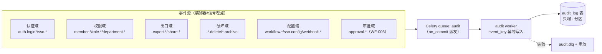
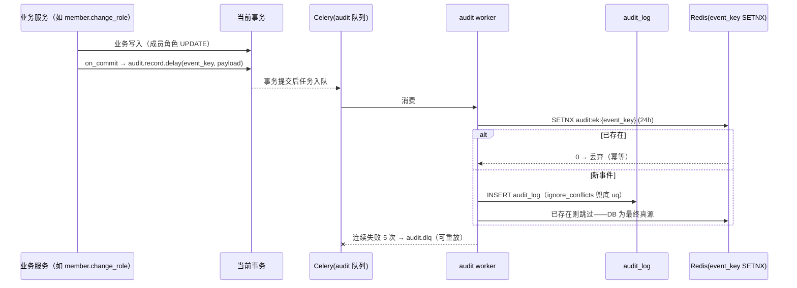

# 全站操作审计日志

| 元信息项 | 内容 |
| --- | --- |
| 文档编号 | AUTH-010 |
| 所属迭代 | Sprint 8 — 企业组织权限治理（第 11 周） |
| 优先级 | P3（企业版核心级 · 组织治理三问之「做过什么」） |
| 所属模块 | M1-AUTH｜账号与权限 |
| 文档状态 | 待评审（Draft） |
| 最后更新日期 | 2026-09-01 |
| 上游依赖 | `TASK-010`（Activity 幂等管道范式——本审计写入直接复用其 worker/死信/重放机制）、`AUTH-007/008/009`（组织/角色/SSO 事件源）、`WF-006`（审批留痕汇入） |
| 下游消费 | P4 合规（告警规则、留存策略扩展）、`AUTH-012`（多租户风控溯源）、安全评审材料 |
| 上游依据 | `docs/需求文档.md` §3.1 企业版专属（全站操作审计日志）、§8.2 权限 P3 列 |
| 关联架构文档 | [`api-conventions.md`](../architecture/api-conventions.md)（§5 查询 / §8 错误码）、[`dependency-graph.md`](../architecture/dependency-graph.md)（模块依赖与 Celery 队列拓扑） |
| 对标基线 | GitLab Audit Events（事件分类法） · Ones 操作日志 · Plane（无全站审计——差异化能力） |
| 工作量估算 | 后端 3 人日 / 前端 2 人日 / 联调与测试 1.5 人日，合计 **6.5 人日** |

---

## 1. 概述

### 1.1 功能定位

`TASK-010` 的 Activity 回答「这条任务发生过什么」（协作视角，项目内可见）；AUTH-010 的 AuditLog 回答「**这个系统里谁在何时对什么做了什么敏感操作**」（治理视角，仅管理员可见）。两者管道同源、消费者与留存不同。

交付内容：

1. **全站敏感事件留痕**：登录（成功/失败/SSO）、权限变更（角色/成员/部门）、数据出口（导出/分享外链创建）、破坏性操作（删除/归档）、配置变更（工作流/SSO/Webhook）、审批动作（`WF-006` 汇入）；
2. **检索与导出**：多条件组合检索（人/事件/对象/时间/IP），CSV 导出——**导出动作本身被审计**；
3. **不可变存储**：只增不改不删（应用层无 UPDATE/DELETE 路径），留存 180 天自动清理；
4. **异步写入**：复用 `TASK-010` 幂等管道（event_key 去重 + 死信 + 重放），业务请求零阻塞。

### 1.2 关键约定：审计与协作动态的边界

| 维度 | IssueActivity（`TASK-010`） | AuditLog（本文档） |
| --- | --- | --- |
| 视角 | 协作：任务字段怎么变的 | 治理：谁动了权限/出口/配置 |
| 可见性 | 项目成员 | WS_ADMIN+（`audit.read`） |
| 典型事件 | `issue.state_changed`、`comment.created` | `member.role_changed`、`export.csv`、`sso.login_failed` |
| 留存 | 随项目生命周期 | 180 天（合规下限），与项目删除解耦 |
| 出口 | 任务动态流 | 检索 API + CSV 导出 |

**双写原则**：同一动作可能同时产生两类记录（如成员角色变更 → 项目 Activity + AuditLog），各自独立管道、互不为源。

### 1.3 关键约定：事件模型



| 字段 | 说明 |
| --- | --- |
| `event_key` | 幂等键（源侧生成，ULID 或 `{domain}:{object}:{op}:{ts}` 哈希） |
| `category / action` | 二级分类（`auth` / `login_success`），注册表枚举 |
| `actor` + `actor_snapshot` | 操作者 ID + 当时显示名/邮箱快照（防改名后不可考） |
| `object_type / object_id / object_snapshot` | 操作对象 + 名称快照 |
| `detail` | JSONB 差量（如 `{"role": {"from": "VIEWER", "to": "ADMIN"}}`），**禁含敏感值**（密码/密钥/令牌——BR-11） |
| `ip / user_agent` | 来源指纹 |
| `workspace_id` | 租户边界（检索与导出的强制过滤） |

### 1.4 范围边界

| 范围 | 本文档交付 | 明确不做 |
| --- | --- | --- |
| 留痕 | §1.3 六域事件全集（注册表枚举） | 全量数据变更史（= Activity + 版本系统各自承担） |
| 检索 | 组合条件 + cursor 分页 + CSV 导出 | 实时告警规则（P4 合规） |
| 留存 | 180 天 + 每日清理任务 | 留存周期可配/WORM 存储（P4） |
| 完整性 | 应用层只增 + 每日链式哈希校验字段（`prev_hash`） | 区块链式公证（P4） |

### 1.5 前置依赖

| 依赖 | 内容 | 阻塞原因 |
| --- | --- | --- |
| `TASK-010` | 幂等 worker/死信/重放范式、`activity` 队列运维 | 审计管道同源复刻 |
| `AUTH-007/008/009` | 部门/角色/SSO 事件埋点 | 本迭代主要事件源 |
| `WF-006` | ApprovalRecord 只增模型 | 审批域事件由其在审批动作时埋点汇入 |

### 1.6 竞品参考

| 竞品 | 参考点 | 处置 |
| --- | --- | --- |
| GitLab | Audit Events：category/action 二级、actor 快照、CSV 导出需授权 | **事件模型对齐** |
| Ones | 操作日志：工作空间级检索 + 导出 | 检索面对齐 |
| Splunk/ELK 范式 | 只增日志 + 索引生命周期（rollover/delete） | 留存清理采用「月分区 + drop partition」而非 DELETE |
| Plane | 无全站审计 | 差异化能力 |

---

## 2. 业务逻辑

### 2.1 事件写入时序



### 2.2 检索与导出流程

- **检索**：`GET …/audit-logs/?actor=&category=&action=&object_type=&date_from=&date_to=&ip=&q=`（q 走对象快照名 trgm）；强制 `workspace_id` 过滤（行级隔离 `AUTH-006` 双保险）；结果按 `created_at desc, id desc` cursor 分页。
- **导出**：`POST …/audit-logs/exports/` 同条件 → Celery 生成 CSV（流式，≤50 万行/次，超限要求收窄条件）→ 完成站内通知 + 临时下载链接（1h 有效，走 `FILE-004` 临时分享机制）；**导出动作自身落一条 `audit.exported` 事件**（BR-08）。

### 2.3 业务规则汇总

| 编号 | 规则 | 触发点 | 违规响应 |
| --- | --- | --- | --- |
| BR-01 | audit_log 应用层只增：无 UPDATE/DELETE 代码路径；DB 角色禁授 UPDATE/DELETE 权限 | 全链路 | —（结构性约束） |
| BR-02 | 每事件含 actor/object 名称快照（当时值） | 写入 | — |
| BR-03 | `workspace_id` 强制过滤；跨空间检索不存在 | 检索/导出 | — |
| BR-04 | 检索/导出需 `audit.read`（WS_ADMIN+）；导出另需二次确认且记录导出条件快照 | 端点 | `PERM_DENIED` |
| BR-05 | 事件 category/action 必须 ∈ 注册表枚举（CI 校验）；新事件须注册 | 写入 | 未注册事件 worker 拒写 + 告警 |
| BR-06 | event_key 幂等：同 key 只落一行（Redis SETNX + DB uq 双保险） | 写入 | — |
| BR-07 | 留存 180 天：每日清理任务 drop 过期月分区（非 DELETE） | 清理 | — |
| BR-08 | 导出动作自身被审计（`audit.exported`，含条件快照与行数） | 导出 | — |
| BR-09 | 埋点在业务事务 `on_commit`——事务回滚不产生审计事件 | 写入 | — |
| BR-10 | 审计写入失败不阻塞业务（异步）；连续失败入 DLQ + 运维告警 | 写入 | — |
| BR-11 | detail 禁含敏感值：密码/密钥/令牌/断言原文一律不落（埋点侧白名单字段） | 写入 | worker 白名单过滤 + 违规告警 |
| BR-12 | 链式完整性：`hash = sha256(prev_hash ‖ canonical(row))`，每日校验任务抽查 | 写入/校验 | 断链 → CRITICAL 告警 |
| BR-13 | 登录失败事件记录邮箱而非用户 ID（账号可能不存在） | 认证埋点 | — |
| BR-14 | 检索响应不含其他空间任何信息（存在性隐藏） | 检索 | 404 语义 |
| BR-15 | 系统账户（清理任务/迁移）产生的事件 actor=`system` | 写入 | — |

### 2.4 异常处理

| 场景 | 处理 |
| --- | --- |
| worker 落库失败（DB 抖动） | 指数退避重试 5 次 → DLQ；重放工具 `audit.replay`（同 event_key 幂等，安全重入） |
| Redis 不可用 | 退化为 DB uq 单保险（`ignore_conflicts`），管道不停 |
| 哈希校验断链 | 冻结导出（防篡改证据流出被误当完整），CRITICAL 告警，人工介入 |
| 分区创建失败（月初） | 清理任务前置 `CREATE PARTITION IF NOT EXISTS`；失败告警，写入落默认分区兜底 |

### 2.5 边界条件

- **高基数事件源**：登录失败爆破场景单 IP 短时万级事件——埋点侧滑动窗口聚合（同 `(email,ip)` 1 分钟内折叠为一条 `login_failure_burst` 计数值），防审计表被攻击者灌水。
- **对象删除后**：快照字段保证「对象已删仍可考」；object_id 保留原值不做 FK（审计表零外键——见 §4.1）。
- **时区**：一律 UTC 存储，检索入参 UTC，前端本地渲染。

---

## 3. UI/UX 设计

### 3.1 审计日志页

```
┌──────────────────────────────────────────────────────────────────────┐
│ 工作空间设置 / 审计日志                          [导出 CSV]          │
├──────────────────────────────────────────────────────────────────────┤
│ 操作者 [搜索成员▾] 事件域 [全部▾] 事件 [全部▾] 对象类型 [全部▾]      │
│ 时间 [2026-08-05] 至 [2026-09-01]  IP [____]  关键词 [搜索对象名__] │
├──────────────────────────────────────────────────────────────────────┤
│ 时间                 操作者      事件                    对象         │
│ 09-01 10:22:05 UTC  张三        成员角色变更              项目「官网」 │
│                      10.0.1.23  VIEWER → CONTRIBUTOR    成员：李四  ›│
│ 09-01 10:05:41 UTC  admin(系统) 审计日志导出              2,341 行   ›│
│ 09-01 09:58:02 UTC  王五        SSO 登录成功              —           ›│
│ 09-01 09:51:17 UTC  未知        登录失败（邮箱 a@b.co）   ×3 折叠     ›│
│ …（cursor 加载更多）                                                  │
└──────────────────────────────────────────────────────────────────────┘
```

行点击展开详情抽屉：全字段 + `detail` 差量美化（`role: VIEWER → CONTRIBUTOR`）+ 原始 JSON 折叠。

### 3.2 导出对话框

```
┌──────────────────── 导出审计日志 ────────────────────┐
│ 导出条件 = 当前检索条件（预览：约 12,450 行）           │
│ ┌──────────────────────────────────────────────────┐ │
│ │ category ∈ {member.*, role.*}                     │ │
│ │ 时间 2026-08-05 ~ 2026-09-01                      │ │
│ └──────────────────────────────────────────────────┘ │
│ ⚠ 导出动作将记入审计日志。单次上限 500,000 行。        │
│ 确认密码 [________________]（二次确认）                 │
│                                  [取消]  [开始导出]     │
└──────────────────────────────────────────────────────┘
```

完成后站内通知 + 1h 临时下载链接。

### 3.3 空状态 / 加载 / 失败

| 状态 | 表现 |
| --- | --- |
| 无结果 | 「该条件下无审计记录」+ 条件摘要 + 清除筛选 |
| 首次进入 | 默认「最近 7 天 · 全部事件」 |
| 导出排队 | 对话框转进度态（队列位置），可关闭后台继续 |
| 哈希校验告警 | 页顶红色横幅「审计完整性校验异常，导出已冻结，请联系运维」（仅 WS_OWNER 可见） |

### 3.4 响应式与无障碍

- 表格 ≥7 列在 <1280px 时 IP/UA 列折叠进行详情；筛选器转抽屉。
- 时间列双格式（UTC 主显 + 本地悬浮）；表格支持键盘行导航与详情展开。

---

## 4. 技术架构

### 4.1 数据模型

```python
# apps/core/models/audit.py
class AuditLog(models.Model):
    id = models.ULIDField(primary_key=True)
    event_key = models.CharField(max_length=80, unique=True)      # 幂等锚
    workspace = models.ForeignKey("Workspace", on_delete=models.CASCADE,
                                  related_name="+")               # 仅租户边界，非对象 FK
    category = models.CharField(max_length=24)    # auth/member/role/export/…
    action = models.CharField(max_length=48)      # login_success/role_changed/…
    actor_id = models.CharField(max_length=26, null=True)         # ULID 或 "system" 或 None
    actor_snapshot = models.JSONField(default=dict)               # {name, email}
    object_type = models.CharField(max_length=32, null=True)
    object_id = models.CharField(max_length=26, null=True)        # 零外键（对象可删）
    object_snapshot = models.JSONField(default=dict)              # {name, ...}
    detail = models.JSONField(default=dict)                       # 白名单差量
    ip = models.GenericIPAddressField(null=True)
    user_agent = models.CharField(max_length=255, blank=True, default="")
    prev_hash = models.CharField(max_length=64)
    hash = models.CharField(max_length=64)
    created_at = models.DateTimeField(default=timezone.now)

    class Meta:
        db_table = "audit_log"
        indexes = [
            models.Index("workspace", "-created_at", "-id", name="idx_audit_scan"),
            models.Index("workspace", "category", "action", "-created_at",
                         name="idx_audit_event"),
            models.Index("workspace", "actor_id", "-created_at", name="idx_audit_actor"),
        ]
```

迁移要点：

- **零外键对象引用**（`object_id` 存字符串）——对象删除不级联、不阻塞；
- **月分区**：`PARTITION BY RANGE (created_at)`，清理 = `DROP TABLE audit_log_p2026_03`（BR-07）；`idx_audit_scan` 建于各分区；
- `object_snapshot.name` 建 trgm GIN（关键词检索，与 `TASK-011` 同款 `pg_trgm` 扩展）；
- DB 层收紧：应用账号 `REVOKE UPDATE, DELETE ON audit_log`（BR-01 结构性保障）。

### 4.2 API 定义

| 方法 | 路径 | 说明 | 权限 |
| --- | --- | --- | --- |
| GET | `/api/v1/workspaces/{slug}/audit-logs/` | 组合检索（§2.2 参数集）+ cursor | `audit.read` |
| GET | `/api/v1/workspaces/{slug}/audit-logs/catalog/` | category/action 注册表（前端筛选器数据源） | `audit.read` |
| POST | `/api/v1/workspaces/{slug}/audit-logs/exports/` | 创建导出（条件快照 + 二次确认） | `audit.read` + 确认 |
| GET | `/api/v1/workspaces/{slug}/audit-logs/exports/{id}/` | 导出状态/下载链接 | `audit.read` |

**GET audit-logs/ — 200**：

```json
{
  "status": 0,
  "data": {
    "results": [{
      "id": "01J9XP1K2M3N4P5Q6R7S8T9V0W",
      "category": "member", "action": "role_changed",
      "actor": {"id": "01J9XA…", "name": "张三", "email": "zhang@acme.com"},
      "object": {"type": "project_member", "id": "01J9XB…",
                 "name": "李四 @ 官网重构"},
      "detail": {"role": {"from": "PROJ_VIEWER", "to": "PROJ_CONTRIBUTOR"}},
      "ip": "10.0.1.23", "created_at": "2026-09-01T10:22:05.000000Z"
    }],
    "next_cursor": "100:1:MTYyNQ"
  },
  "meta": {"request_id": "01J9XP2L3N4P5Q6R7S8T9V0W1X"}
}
```

**POST exports/ — 202**：

```json
{
  "status": 0,
  "data": {"export_id": "01J9XP3M4P5Q6R7S8T9V0W1X2Y", "state": "queued",
           "estimated_rows": 12450},
  "meta": {"request_id": "01J9XP4N5Q6R7S8T9V0W1X2Y3Z"}
}
```

**无权限 — 403**：`{"code":"PERM_DENIED","message":"需要审计查看权限"}`；**导出超限 — 400**：`{"code":"VALIDATION_ERROR","details":[{"reason":"export_too_large","max":500000,"estimated":820000,"hint":"请收窄时间范围或事件域"}]}`。

### 4.3 核心逻辑

```python
# apps/core/audit/recorder.py
SENSITIVE_KEYS = {"password", "secret", "token", "assertion", "private_key"}

def record(event_key: str, *, category: str, action: str, workspace_id: str,
           actor=None, object=None, detail: dict | None = None,
           request=None) -> None:
    """业务侧唯一入口；必须在事务 on_commit 中调用（由装饰器保证）。"""
    validate_registered(category, action)                 # BR-05
    payload = {
        "event_key": event_key, "category": category, "action": action,
        "workspace_id": str(workspace_id),
        "actor": snapshot_actor(actor),
        "object": snapshot_object(object),
        "detail": whitelist_filter(detail or {}, deny=SENSITIVE_KEYS),  # BR-11
        "ip": client_ip(request), "user_agent": ua(request),
    }
    transaction.on_commit(lambda: audit_record.delay(payload))          # BR-09

# apps/core/audit/worker.py
@shared_task(queue="audit", bind=True, max_retries=5,
             autoretry_for=(OperationalError,), retry_backoff=True)
def audit_record(self, payload):
    if not redis.set(f"audit:ek:{payload['event_key']}", 1, nx=True, ex=86400):
        return                                            # 幂等丢弃（BR-06）
    prev = AuditLog.objects.filter(workspace_id=payload["workspace_id"]) \
                           .order_by("-created_at", "-id") \
                           .values_list("hash", flat=True).first() or "0" * 64
    row_hash = sha256(f"{prev}|{canonical(payload)}".encode()).hexdigest()
    try:
        AuditLog.objects.create(prev_hash=prev, hash=row_hash, **to_row(payload))
    except IntegrityError:                                # uq event_key 兜底
        pass

# 每日任务：留存清理 + 完整性抽查
@shared_task(queue="audit")
def audit_daily_maintenance():
    create_next_month_partition()
    drop_partitions_older_than(days=180)                  # BR-07
    verify_hash_chain(sample_days=3)                      # BR-12 断链 → CRITICAL
```

**埋点装饰器**（事件源接入零样板）：

```python
@audited("member", "role_changed",
         object=lambda p: p["member"], detail=lambda p: {"role": p["diff"]})
def change_role(*, actor, member, diff): ...
```

**CSV 导出**：`audit.export` 任务流式 `yield`（`iterator(chunk_size=2000)`），写入 MinIO 临时桶 + `FILE-004` 机制发 1h 链接；完成时 `record("audit", "exported", detail={"conditions":…, "rows":n})`（BR-08）。

**性能**：检索 P95 < 300ms（`idx_audit_scan` 分区扫描 + cursor）；写入单事件 < 5ms worker 内（不含队列等待）；导出 50 万行 < 90s。

### 4.4 前端实现

```typescript
// stores/audit.store.ts
class AuditStore {
  entries = observable<AuditEntry[]>([]);
  filters = observable<AuditFilters>({ date_from: daysAgo(7) });
  cursor: string | null = null;

  async search(reset = true) {
    if (reset) { this.entries.clear(); this.cursor = null; }
    const { data } = await api.get(`/workspaces/${slug}/audit-logs/`, {
      params: { ...this.filters, cursor: this.cursor, limit: 50 } });
    runInAction(() => {
      this.entries.push(...data.results);
      this.cursor = data.next_cursor;
    });
  }

  async export(confirmPassword: string) {
    const { data } = await api.post(`/workspaces/${slug}/audit-logs/exports/`,
      { conditions: this.filters, confirm_password: confirmPassword });
    return pollExport(data.export_id);        // 轮询 → 通知 + 临时链接
  }
}
```

组件：`<AuditTable>`（虚拟滚动 + 详情抽屉）、`<AuditFilterBar>`（注册表驱动的事件域级联选择）、`<ExportDialog>`（条件摘要 + 二次确认）。`detail` 渲染注册「域 → 美化组件」映射（`role_changed` 渲染 `A → B` 箭头）。

---

## 5. 测试用例

### 5.1 单元测试

| 编号 | 用例 | 断言 |
| --- | --- | --- |
| UT-01 | 事件写入全字段（快照/IP/UA/hash 链） | 落库完整 |
| UT-02 | event_key 重复 → 单行 | 幂等 |
| UT-03 | Redis 不可用退化 DB uq 幂等 | 无异常、单行 |
| UT-04 | 未注册 category/action 拒写 + 告警 | BR-05 |
| UT-05 | detail 敏感键被过滤（password/token…） | BR-11 |
| UT-06 | on_commit 语义：事务回滚无事件 | BR-09 |
| UT-07 | 快照为当时值（改名后旧记录不变） | BR-02 |
| UT-08 | 登录失败折叠（1min 同 email+ip） | burst 计数事件 |
| UT-09 | hash 链正确性（prev 衔接） | 校验通过 |
| UT-10 | 断链检测 → 告警 + 导出冻结 | BR-12 |
| UT-11 | 分区清理仅 drop >180 天分区 | BR-07 |
| UT-12 | workspace 强制过滤 | 跨空间零结果 |
| UT-13 | 导出条件快照 + 自审计事件 | BR-08 |
| UT-14 | 系统事件 actor=system | BR-15 |

### 5.2 集成测试

| 编号 | 用例 | 断言 |
| --- | --- | --- |
| IT-01 | 六域代表事件各一（改角色/导出/SSO 登录/删任务/改工作流/审批）→ 检索命中 | 字段完整 |
| IT-02 | worker 连续失败 5 次 → DLQ → 重放落库 | 幂等无重复 |
| IT-03 | 组合检索（人+域+时间+关键词 trgm） | 结果精确 |
| IT-04 | 导出全链路：创建→CSV→临时链接→自审计 | 行数一致、链接 1h 失效 |
| IT-05 | 并发 100 事件写入 | 无丢失无重复（event_key 抽查） |
| IT-06 | 权限：MEMBER 检索 403；非成员 404 | BR-04/14 |
| IT-07 | 留存：造 181 天前分区数据 → 清理后不可检索 | — |

### 5.3 E2E 测试

| 编号 | 场景 |
| --- | --- |
| E2E-01 | 管理员检索「最近 7 天权限变更」→ 列表秒级返回 → 行详情差量美化 |
| E2E-02 | 导出 CSV：二次确认 → 通知 → 下载 → 审计列表出现该导出记录 |
| E2E-03 | 制造登录失败 ×3 → 列表显示折叠 burst 事件 |
| E2E-04 | 关键词搜索对象名（trgm 前缀/子串）命中正确记录 |

---

## 6. 竞品深度对标

### 6.1 GitLab Audit Events 实现分析

GitLab `AuditEvent`：`(author_id, entity_id, details)` + 按 entity（Group/Project/User）分作用域；企业版增「流式外发」。其模型零外键化（`entity_id` 整型非 FK）与本版一致——对象可删、审计永存。教训：GitLab 早期 details 自由哈希曾泄露 token 值（CVE-2020-10086 同类模式）——本版 BR-11 白名单过滤即针对该模式。

### 6.2 Ones 操作日志

工作空间级检索 + 导出；事件覆盖成员/权限/配置域。本版事件域对齐并补「出口域」（导出/分享）——国内企业合规评审中数据出口是必查项。

### 6.3 日志基础设施范式（ELK/Splunk）

只增存储 + 生命周期 rollover/drop + 完整性校验是企业审计三件套；本版以 PG 月分区 + hash 链在单库内达成同语义，避免为审计单引一套日志栈（自托管部署成本敏感）。P4 再评估外发 SIEM。

### 6.4 本系统设计决策

| 决策 | 取舍 |
| --- | --- |
| 月分区 + DROP（非 DELETE） | 清理零 vacuum 压力；代价是分区运维（自动任务兜底） |
| hash 链抽样校验（非全量 WORM） | 单库内抗篡改「可发现」；真 WORM（对象锁存储）归 P4 合规 |
| 零外键 + 快照 | 审计与业务数据解耦；代价是检索不能 JOIN 现值（快照即语义） |
| 与 Activity 双管道 | 视角/留存/权限不同；共享 worker 机制降实现成本 |

---

## 7. 里程碑与验收

### 7.1 交付物清单

| 类别 | 内容 |
| --- | --- |
| Model / Migration | `audit_log` 月分区表 + 三索引 + trgm GIN；DB 层 REVOKE UPDATE/DELETE |
| 后端 | 事件注册表与 CI 校验、`record()` 埋点装饰器、audit worker（幂等/DLQ/重放）、检索/目录/导出端点、每日维护任务（分区+清理+校验） |
| 前端 | 审计日志页（筛选/虚拟表/详情抽屉）、导出对话框 |
| 测试 | UT-01~14、IT-01~07、E2E-01~04 |

### 7.2 可操作演示的验收标准

1. 执行六域代表操作各一次：审计页全部命中且 actor/object 快照为操作当时值（操作后改名不影响记录）。
2. 「最近 7 天权限变更」组合检索 P95 < 300ms；对象名关键词 trgm 命中；cursor 翻页无重复无遗漏。
3. CSV 导出：二次确认 → 异步完成 → 通知 + 1h 临时链接 → 审计列表出现该导出事件（含条件快照与行数）。
4. 幂等压测：同一事件重放 100 次仅一行；worker 故障注入 → DLQ → 重放恢复无重复。
5. 留存：181 天前分区被清理不可检索；hash 链每日校验通过，人为篡改一行 → 断链 CRITICAL + 导出冻结。
6. 权限：普通成员检索 403、非成员 404；`detail` 中无密码/密钥/令牌类字段（渗透用例验证）。


