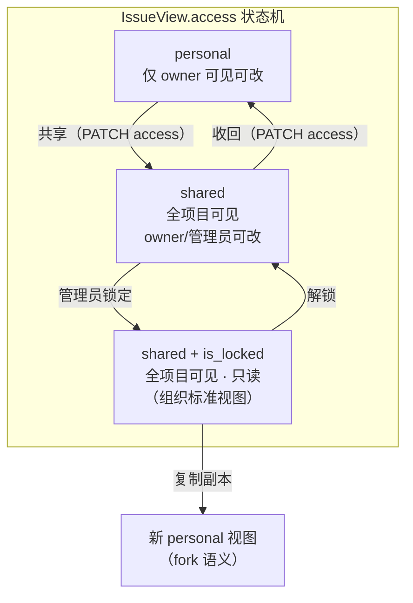
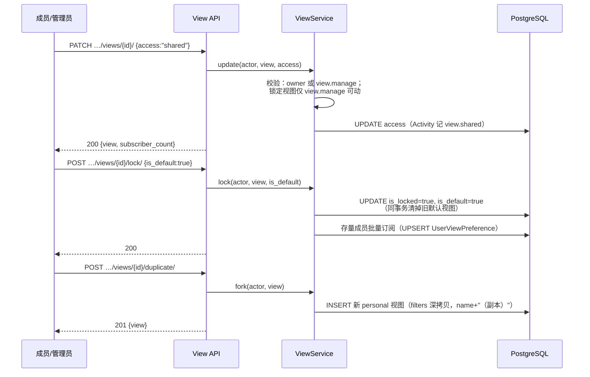
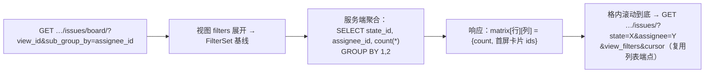

# 视图团队共享 / 管理员锁定 / 多维分组

| 元信息项 | 内容 |
| --- | --- |
| 文档编号 | BOARD-005 |
| 所属迭代 | Sprint 8 — 企业组织权限治理（第 11 周） |
| 优先级 | P3（企业版核心级） |
| 所属模块 | M3-BOARD｜看板视图 |
| 文档状态 | 待评审（Draft） |
| 最后更新日期 | 2026-09-01 |
| 上游依赖 | `BOARD-003`（`IssueView` 模型——`access`/`is_locked`/`sub_group_by` 三列 P2 已建好未开放）、`TASK-011`（filters DSL 全集）、`AUTH-008`（共享可见面与锁定权限判定） |
| 下游消费 | P4 跨项目全局视图；`RPT-002`（标准视图作为统计切片口径） |
| 上游依据 | `docs/需求文档.md` §3.1 企业版专属（看板视图团队共享与锁定）、§8.2 看板 P3 列 |
| 关联架构文档 | [`unified-issue-model.md`](../architecture/unified-issue-model.md)（§2.6 State.group）、[`api-conventions.md`](../architecture/api-conventions.md)（§8 错误码） |
| 对标基线 | Plane Views（`is_locked` 字段同源） · Jira Board 共享过滤器 · Asana 默认视图强制 |
| 工作量估算 | 后端 2 人日 / 前端 2.5 人日 / 联调与测试 1.5 人日，合计 **6 人日** |

---

## 1. 概述

### 1.1 功能定位

`BOARD-003` 交付的视图是**个人**的：我调的筛选/分组/排序只存在我的 `IssueView` 里。团队场景的两个高频痛点：

1. 「把你们切到我这个视角」要靠截图或口述参数——需要**共享视图**：一人配置、全团队可订阅；
2. 管理员定义了「迭代评审」「缺陷分诊」标准视角，却被成员各自改乱——需要**管理员锁定**：组织标准视图只读，成员可复制副本再个性化。

本文档放开 `BOARD-003` 建好的三列：`access`（`personal` → 放开 `shared`）、`is_locked`（管理员锁定）、`sub_group_by`（泳道式二维分组），并定义「新成员默认可见」的组织标准视图机制。

### 1.2 关键约定：三种视图形态



| 约定 | 说明 |
| --- | --- |
| 共享范围 | 项目级：shared 视图对**项目全部成员**可见（无按角色/部门的可见性矩阵——P4 全局视图再评估） |
| 锁定语义 | `is_locked=true`：filters/display_props/layout 全员只读（含 owner）；仅 `view.manage`（PROJ_ADMIN+）可解锁或修改 |
| 副本机制 | 任何成员可对 shared/锁定视图「另存为」生成 personal 副本（filters 全量拷贝，名 +「副本」） |
| 默认视图 | 管理员可把锁定视图设为 `is_default`——新成员加入项目时自动订阅（写入其 `UserViewPreference.pinned`）；每项目至多 1 个 |
| 删除保护 | 锁定视图不可删（先解锁）；shared 视图删除仅 owner/管理员，删除前展示订阅人数 |

### 1.3 关键约定：多维分组（二维泳道）

`group_by`（列）× `sub_group_by`（行泳道）构成二维看板：列=状态、行=负责人，即「谁 · 在什么阶段」。数据语义：

- 取数 = 同一基线查询 + 双键分桶：`(group_key, sub_group_key)` 二元组聚合，卡片落入交叉格；
- 「未设置」桶两个维度各自独立（无负责人行、无标签列）；
- 拖拽 = 双字段变更（列字段 + 行字段），校验规则与一维一致（`BOARD-003` 拖拽语义复用：状态列走流转校验，非状态列直接改字段）；
- 性能：交叉格计数由服务端聚合返回（不拉全量卡片），格内卡片懒加载（滚动到该格才取）。

### 1.4 范围边界

| 范围 | 本文档交付 | 明确不做 |
| --- | --- | --- |
| 共享 | personal ⇄ shared、订阅（pin）列表、删除保护 | 按角色/部门的可见性矩阵（P4） |
| 锁定 | is_locked 锁定/解锁、is_default 新成员默认、副本另存 | 锁定视图的分级管理（部门级标准视图，P4） |
| 多维分组 | 二维泳道看板（group × sub_group）、交叉格聚合与懒加载 | 三维及以上（无真实诉求） |
| 兼容 | 未共享/未锁定时行为与 P2 完全一致 | 跨项目共享视图（P4 `BOARD-005` 扩展位） |

### 1.5 前置依赖

| 依赖 | 内容 | 阻塞原因 |
| --- | --- | --- |
| `BOARD-003` | IssueView 全模型（三列已建）、视图 CRUD/拖拽语义、`UserViewPreference` | 本文档全部是其字段语义放开 |
| `TASK-011` | filters DSL 全集（嵌套/占位符） | 共享视图的筛选表达力上限 |
| `AUTH-008` | `view.manage` 权限码（PROJ_ADMIN+，可被自定义角色授予） | 锁定/默认视图管理判定 |

### 1.6 竞品参考

| 竞品 | 参考点 | 处置 |
| --- | --- | --- |
| Plane | `IssueView.is_locked` 字段即存在（本系统列同源）；其 shared 视图无订阅数展示 | 字段语义对齐；补订阅数与默认视图 |
| Jira | Board 共享过滤器 + 管理员所有 | 「owner/管理员可改、他人只读」语义对齐 |
| Asana | 「默认视图」组织强制 + 个人可切 | `is_default` 采纳但弱化为「新成员默认订阅」而非强制锁定当前视角 |
| Notion | 视图即区块，无共享粒度概念 | 反例：粒度缺失导致团队视角无法收敛 |

---

## 2. 业务逻辑

### 2.1 共享 / 锁定 / 副本流程



### 2.2 新成员默认订阅

`PROJ-002` 加成员成功路径追加钩子（`on_commit`）：查项目 `is_default=true` 的锁定视图 → `UserViewPreference.objects.get_or_create(user, project, view, pinned=True)`。加成员幂等 → 订阅幂等；成员被移出项目时级联删订阅。

### 2.3 二维泳道取数



格内懒加载**不带** group_by 参数（即 `BOARD-003` 既有列表取数），双维度作为普通过滤条件注入——服务端零新查询形态。

### 2.4 业务规则汇总

| 编号 | 规则 | 触发点 | 违规响应 |
| --- | --- | --- | --- |
| BR-01 | `access` ∈ {personal, shared}；shared 对项目全员可见 | 读取 | 非成员 404（存在性隐藏） |
| BR-02 | shared 视图修改：owner 或 `view.manage`；锁定视图修改（含 filters/layout/名称）：仅 `view.manage` | 写 | `PERM_DENIED` / `RESOURCE_LOCKED`（409） |
| BR-03 | 锁定视图不可删（先解锁）；shared 删除仅 owner/`view.manage`，响应含 `subscriber_count` 二次确认 | 删除 | `RESOURCE_LOCKED` / `PERM_DENIED` |
| BR-04 | 每项目至多 1 个 `is_default`；设新默认原子替换旧值 | 锁定 | —（事务内） |
| BR-05 | is_default 仅允许设置在锁定视图上（默认=组织标准，必先锁定） | 设默认 | `VALIDATION_ERROR` `default_requires_lock` |
| BR-06 | 副本另存：任意项目成员可对可见视图执行；副本恒 personal、owner=操作者 | duplicate | — |
| BR-07 | `sub_group_by` 白名单 = `group_by` 同集（state/assignee/priority/label/groupable cf_select），且不得与 `group_by` 相同 | 保存/读取 | `VALIDATION_ERROR` `same_dimension`；读取时维度字段停用 → 该维度回退 null（一维）+ `meta.degraded` |
| BR-08 | 二维拖拽：列=state 时走流转校验（`TASK-005/WF-004` 守卫链）；行维度字段直接更新；失败卡片回弹 | 拖拽 | 沿用 `BOARD-003` 错误语义 |
| BR-09 | 视图名项目内不强制唯一（副本自动加「（副本）」，重名再加序号） | 创建/副本 | — |
| BR-10 | 共享/锁定/解锁/设默认/删除入 Activity 与审计（`AUTH-010`） | 写操作 | — |
| BR-11 | 订阅列表（我的 pin）跨 personal/shared 混合排序（sort_order 个人级） | 读取 | — |
| BR-12 | 项目归档：视图只读（既有归档写保护层拦截 PATCH/duplicate 外的写；duplicate 允许——复制到副本不改动归档数据） | 写 | `PERM_PROJECT_ARCHIVED`（duplicate 豁免） |
| BR-13 | 交叉格计数上限：单格计数精确到 99+（聚合 SQL 精确值，展示截断） | 读取 | — |
| BR-14 | 内置系统视图（`is_system`）不可共享/锁定（口径锁定规则继承 `BOARD-003` BR-03） | 写 | `VALIDATION_ERROR` |
| BR-15 | 解锁视图不自动取消 is_default——显式两字段独立修改，防止一次 PATCH 误毁组织配置 | 写 | — |

### 2.5 异常处理

| 场景 | 处理 |
| --- | --- |
| 锁定视图被 PATCH filters | `RESOURCE_LOCKED` + `details.locked_by`（锁定人快照），前端弹「另存为副本」引导 |
| sub_group_by 字段被停用 | 读取降级一维 + `meta.degraded.sub_group_by`，保存时 400 |
| 默认视图被删（先解锁后删路径） | 删除事务内清 `is_default`；存量成员订阅保留（视图删则订阅级联删） |
| 二维聚合超时（百万级任务项目） | 聚合查询 5s 超时 → 降级返回一维 + `meta.degraded.matrix_timeout` |

### 2.6 边界条件

- **owner 离职/移出项目**：shared 视图不失效；owner 字段置空，管理权移交 `view.manage` 持有者（`AUTH-008` 自定义角色可被授予 view.manage）。
- **副本的副本**：允许，谱系不追踪（视图非内容资产，无版本诉求）。
- **订阅 ≠ 可见性**：未订阅的 shared 视图仍可在「全部视图」列表看到并打开；订阅只影响侧栏 pin。

---

## 3. UI/UX 设计

### 3.1 视图切换栏与共享标识

```
┌──────────────────────────────────────────────────────────────────────┐
│ 视图： [全部任务] [缺陷分诊 🔒] [迭代评审 🔒★] [我的高优]  [+ 新建]   │
│        ──────────  ───────────   ─────────────  ─────────           │
│        内置         共享·锁定     共享·锁定·默认   personal           │
├──────────────────────────────────────────────────────────────────────┤
│ 缺陷分诊 🔒（组织标准视图，只读）  [另存为副本]  [订阅 📌]  ⋯           │
│ ┌─────────┬──────────┬──────────┬──────────┬──────────┐             │
│ │ 状态＼负责人│ 张三(4) │ 李四(7)  │ 王五(2)  │ 未分配(3)│             │
│ ├─────────┼──────────┼──────────┼──────────┼──────────┤             │
│ │ 待办     │ [卡][卡] │ [卡]     │          │ [卡]     │             │
│ │ 进行中   │ [卡]     │ [卡][卡] │ [卡]     │          │             │
│ │ 待评审   │          │ [卡]     │          │ [卡][卡] │             │
│ │ 已完成   │ [卡]     │ [卡…]    │ [卡]     │          │             │
│ └─────────┴──────────┴──────────┴──────────┴──────────┘             │
│ 格内计数 99+ 截断；滚动到格底部自动加载该格下一页                       │
└──────────────────────────────────────────────────────────────────────┘
```

- 标识体系：🔒=锁定、★=默认、人形图标=shared、无标识=personal；锁定视图顶栏横幅「组织标准视图，只读」+「另存为副本」主操作。
- 视图菜单（⋯）：共享/收回共享、锁定/解锁、设为默认、另存副本、删除——按权限渲染可用项。

### 3.2 共享与锁定对话框

```
┌────────────────── 共享视图「缺陷分诊」 ──────────────────┐
│ 共享后项目全部成员可见此视图。当前订阅：14 人。            │
│ ☐ 同时锁定为组织标准视图（仅管理员可修改）                 │
│   ☐ 设为新成员默认视图（加入项目自动订阅）                 │
│                                   [取消]  [确认]          │
└──────────────────────────────────────────────────────────┘
```

删除共享视图二次确认：「该视图被 14 人订阅，删除后不可恢复」。

### 3.3 二维分组的配置面板

视图配置面板在「分组维度」下新增「行分组（泳道）」下拉（选项与列分组同集，选中与列相同值时即时校验提示）；清空行分组回到一维看板。看板头部显示 `状态 × 负责人` 维度说明。

### 3.4 空状态 / 加载 / 失败

| 状态 | 表现 |
| --- | --- |
| 空交叉格 | 虚线框「拖拽任务到此」 |
| 整格加载 | 格内骨架卡片 ×3 |
| 聚合降级 | 页顶黄条「二维统计暂不可用，已切换单列分组」 |
| 锁定视图编辑尝试 | 表单控件禁用态 + 悬浮「此视图已被管理员锁定」 |
| 无权限项 | 菜单项隐藏（非禁用——`AUTH-005` 按钮权限语义） |

### 3.5 响应式与无障碍

- < 1024px 二维看板降级为一维（行维度切换为筛选器 chip），并提示「泳道视图需在更大屏幕使用」。
- 格间拖拽提供等价操作：卡片菜单「移动到…」级联选择列/行值；泳道行列头 `scope="col/row"` 语义化。

---

## 4. 技术架构

### 4.1 数据模型

`IssueView` 增量（P2 已建列的语义放开 + 2 个新列）：

```python
class IssueView(models.Model):
    # …BOARD-003 既有：project/owner/filters/display_props/layout/
    #   access(放开 shared)/is_locked(放开)/sub_group_by(放开)/is_system/sort_order…
    is_default = models.BooleanField(default=False)      # 新增：新成员默认订阅
    locked_by = models.ForeignKey("User", null=True, blank=True,
                                  on_delete=models.SET_NULL, related_name="+")
    locked_at = models.DateTimeField(null=True, blank=True)

    class Meta:
        constraints = [
            # 每项目至多 1 个默认视图（部分唯一索引）
            # CREATE UNIQUE INDEX uq_view_default ON issue_view (project_id)
            #   WHERE is_default;
            # is_default 必须先锁定（DB 层护栏）
            models.CheckConstraint(
                check=models.Q(is_default=False) | models.Q(is_locked=True),
                name="ck_view_default_locked"),
        ]
```

`UserViewPreference`（`BOARD-003` 已建：`user/project/view/pinned/sort_order`）零结构变更——默认订阅即批量写入该表。

迁移要点：`is_default` 部分唯一索引 CONCURRENTLY；存量视图 `is_default=false` 零回填；`sub_group_by` 从「恒 null」放开为白名单值（应用层校验，无 DB 变更）。

### 4.2 API 定义

| 方法 | 路径 | 说明 | 权限 |
| --- | --- | --- | --- |
| GET | `/api/v1/projects/{id}/views/` | 视图列表 = 我的 personal + 项目 shared（含 `subscriber_count`、`is_locked`、`is_default`、`my_preference.pinned`） | 项目成员 |
| POST | `/api/v1/projects/{id}/views/{vid}/share/` | `{access: "shared"\|"personal"}` 共享/收回 | owner 或 `view.manage` |
| POST | `/api/v1/projects/{id}/views/{vid}/lock/` | `{is_locked, is_default?}` | `view.manage` |
| POST | `/api/v1/projects/{id}/views/{vid}/duplicate/` | 另存副本 | 项目成员 |
| DELETE | `/api/v1/projects/{id}/views/{vid}/` | 删除（BR-03） | owner 或 `view.manage` |
| POST | `/api/v1/projects/{id}/views/{vid}/pin/` | 订阅/取消（写 UserViewPreference） | 项目成员 |
| GET | `/api/v1/projects/{id}/issues/board/` | 二维泳道聚合（`view_id` + `sub_group_by`） | 项目成员 |

**GET views/ — 200**：

```json
{
  "status": 0,
  "data": {
    "views": [
      {"id": "01J9XV1A2B3C4D5E6F7G8H9J0K", "name": "缺陷分诊", "layout": "kanban",
       "access": "shared", "is_locked": true, "is_default": true,
       "owner": {"id": "01J9XA…", "name": "张三"},
       "subscriber_count": 14, "my_preference": {"pinned": true},
       "display_props": {"group_by": "state_id", "sub_group_by": "assignee_id",
                         "order_by": "priority"}}
    ]
  },
  "meta": {"request_id": "01J9XV2B3C4D5E6F7G8H9J0K1M"}
}
```

**POST lock/ — 200**（设默认）：

```json
{"status": 0, "data": {"view": {"id": "01J9XV1A2B3C4D5E6F7G8H9J0K",
  "is_locked": true, "is_default": true, "locked_by": {"id": "01J9XA…", "name": "张三"},
  "locked_at": "2026-09-01T11:00:00.000000Z", "subscribed_existing_members": 42}},
 "meta": {"request_id": "01J9XV3C4D5E6F7G8H9J0K1M2N"}}
```

**锁定视图 PATCH filters — 409**：

```json
{
  "status": 1,
  "error": {"code": "RESOURCE_LOCKED",
            "message": "该视图已被管理员锁定，可另存为副本后修改",
            "details": [{"locked_by": "张三", "locked_at": "2026-09-01T11:00:00.000000Z"}]},
  "meta": {"request_id": "01J9XV4D5E6F7G8H9J0K1M2N3P"}
}
```

**GET issues/board/（二维）— 200**：

```json
{
  "status": 0,
  "data": {
    "columns": [{"key": "state:01S1", "name": "待办"}, {"key": "state:01S2", "name": "进行中"}],
    "rows": [{"key": "assignee:01U1", "name": "李四"}, {"key": "assignee:none", "name": "未分配"}],
    "matrix": [
      {"column": "state:01S1", "row": "assignee:01U1", "count": 7,
       "issue_ids": ["01J9XI…", "01J9XJ…"]},
      {"column": "state:01S2", "row": "assignee:none", "count": 2, "issue_ids": ["01J9XK…"]}
    ]
  },
  "meta": {"request_id": "01J9XV5E6F7G8H9J0K1M2N3P4Q",
           "degraded": null}
}
```

**维度相同 — 400**：`{"code":"VALIDATION_ERROR","details":[{"field":"sub_group_by","code":"SAME_DIMENSION","reason":"same_dimension"}]}`。

### 4.3 核心逻辑

```python
# apps/core/services/view_governance.py
@transaction.atomic
def lock_view(*, actor, view, is_locked: bool, is_default: bool | None):
    if is_default and not is_locked:
        raise ValidationErr("is_default", "default_requires_lock")     # BR-05
    view.is_locked = is_locked
    if is_locked:
        view.locked_by, view.locked_at = actor, timezone.now()
    if is_default is True:
        (IssueView.objects.select_for_update()
         .filter(project=view.project, is_default=True)
         .exclude(pk=view.pk).update(is_default=False))                # BR-04 原子替换
        view.is_default = True
    elif is_default is False:
        view.is_default = False
    view.save()
    if view.is_default:
        _subscribe_all_members(view)                                   # 存量成员
    on_commit(lambda: record_audit.delay("view.locked" if is_locked
              else "view.unlocked", ...))
    return view

def _subscribe_all_members(view) -> int:
    member_ids = ProjectMember.objects.filter(project=view.project) \
                                      .values_list("user_id", flat=True)
    rows = [UserViewPreference(user_id=uid, project=view.project,
                               view=view, pinned=True) for uid in member_ids]
    UserViewPreference.objects.bulk_create(rows, ignore_conflicts=True)  # 幂等
    return len(rows)

@transaction.atomic
def duplicate_view(*, actor, view):                                    # BR-06
    name = _dedup_name(view.project, f"{view.name}（副本）")
    fork = IssueView.objects.create(
        project=view.project, owner=actor, name=name, access="personal",
        layout=view.layout, filters=deepcopy(view.filters),
        display_props=deepcopy(view.display_props))
    return fork

# 二维聚合（BOARD-003 视图服务扩展）
def board_matrix(*, project, base_qs, group_by: str, sub_group_by: str):
    col_expr, row_expr = GROUP_EXPR[group_by], GROUP_EXPR[sub_group_by]
    rows = (base_qs.annotate(col=col_expr, row=row_expr)
            .values("col", "row")
            .annotate(count=Count("id"),
                      sample_ids=ArrayAgg("id")[:8])                   # 首屏样例
            .order_by("col", "row"))
    return {"columns": columns_of(group_by), "rows": columns_of(sub_group_by),
            "matrix": list(rows)}
```

**查询面**：视图列表 1 查询（`personal OR shared` + `my_preference` LEFT JOIN + 订阅数子查询）；二维聚合 1 查询（`ArrayAgg` 限 8 条样例卡防大响应）；格内翻页复用列表端点零新查询。

**加成员钩子**（`PROJ-002` `add_member` 事务 on_commit）：`default = IssueView.objects.filter(project, is_default=True).first()` → `get_or_create` 订阅。

**降级**：维度字段停用检测 = Schema API 缓存（`TASK-008`）读取时校验；聚合 `statement_timeout=5s`，超时捕获 → 一维降级 + `meta.degraded`（BR-07/异常表）。

### 4.4 前端实现

```typescript
// stores/view.store.ts（BOARD-003 扩展）
class ViewStore {
  async share(viewId: string, access: "shared" | "personal") {
    const { data } = await api.post(`/projects/${pid}/views/${viewId}/share/`,
      { access });
    runInAction(() => Object.assign(this.get(viewId), data.view));
  }
  async lock(viewId: string, isLocked: boolean, isDefault?: boolean) {
    await api.post(`/projects/${pid}/views/${viewId}/lock/`,
      { is_locked: isLocked, is_default: isDefault });
    await this.loadAll();                    // 默认视图原子替换，全量重拉
  }
  async duplicate(viewId: string) {
    const { data } = await api.post(`/projects/${pid}/views/${viewId}/duplicate/`);
    runInAction(() => this.upsert(data.view));
    return data.view.id;                     // 路由跳转新副本
  }
}

// 二维看板
const SwimlaneBoard = observer(({ view }: { view: IssueView }) => {
  const matrix = useSWR(["board-matrix", view.id], fetchMatrix(view.id));
  if (matrix.meta?.degraded) return <KanbanBoard view={view} degradedBanner />;
  return (
    <table className="swimlane">
      {matrix.rows.map(r => (
        <tr key={r.key}>{matrix.columns.map(c => (
          <Cell key={c.key} column={c} row={r}
                bucket={matrix.find(c.key, r.key)}   // 计数 + 样例卡
                lazyLoad={() => fetchCellIssues(view, c.key, r.key)} />
        ))}</tr>
      ))}
    </table>);
});
```

组件：`<ViewTabBar>`（锁/默认/共享标识）、`<ShareLockDialog>`、`<SwimlaneBoard>`、`<LockedBanner>`（另存副本引导）。锁定视图所有编辑控件经 `usePermission("view.manage")` 统一禁用。

---

## 5. 测试用例

### 5.1 单元测试

| 编号 | 用例 | 断言 |
| --- | --- | --- |
| UT-01 | personal → shared → personal 状态迁移 | access 与可见面正确 |
| UT-02 | 非 owner 非管理员改 shared 视图 | `PERM_DENIED` |
| UT-03 | 锁定视图 PATCH filters | `RESOURCE_LOCKED` + 锁定人快照 |
| UT-04 | view.manage 持有者可改锁定视图 | 200 |
| UT-05 | is_default 未锁定拒绝 | BR-05 |
| UT-06 | 设新默认原子替换旧默认 | 全项目恰 1 个 |
| UT-07 | 锁定视图删除拒绝；shared 删除含订阅数 | BR-03 |
| UT-08 | 副本：filters 深拷贝、personal、owner=操作者、名+（副本） | 字段断言 |
| UT-09 | sub_group_by 与 group_by 相同拒绝 | BR-07 |
| UT-10 | 维度字段停用 → 读取降级一维 + meta.degraded | — |
| UT-11 | 新成员加入自动订阅默认视图 | get_or_create 幂等 |
| UT-12 | 移出项目级联删订阅 | — |
| UT-13 | 内置系统视图共享/锁定拒绝 | BR-14 |
| UT-14 | 聚合超时降级一维 | meta.degraded.matrix_timeout |

### 5.2 集成测试

| 编号 | 用例 | 断言 |
| --- | --- | --- |
| IT-01 | 共享后其他成员 GET views/ 可见并可打开取数 | 200 与数据一致 |
| IT-02 | 锁定+设默认：42 存量成员订阅批量写入（幂等重跑无重复） | 计数精确 |
| IT-03 | 新成员 JIT/手动加入 → 自动订阅 | UserViewPreference 存在 |
| IT-04 | 二维矩阵聚合与逐格列表端点计数对账（随机 10 格） | 完全一致 |
| IT-05 | 二维拖拽：state 列走流转守卫、行字段直接更新、失败回弹 | 三路径 |
| IT-06 | owner 离职后 shared 视图管理权移交 view.manage 持有者 | 可改可解锁 |
| IT-07 | 项目归档：锁定视图只读、duplicate 豁免可用 | BR-12 |

### 5.3 E2E 测试

| 编号 | 场景 |
| --- | --- |
| E2E-01 | 管理员共享并锁定「缺陷分诊」设为默认 → 成员侧栏自动出现且只读横幅 |
| E2E-02 | 成员对锁定视图另存副本 → 修改副本 filters 互不影响 |
| E2E-03 | 配置「状态 × 负责人」泳道 → 拖拽卡片跨格 → 双字段更新且计数即时刷新 |
| E2E-04 | 删除被 14 人订阅的共享视图：二次确认展示订阅数 → 删除后订阅者侧栏消失 |

---

## 6. 竞品深度对标

### 6.1 Plane 实现分析

Plane `IssueView` 模型即含 `is_locked`（本系统字段同源，`plane/db/models/view.py`）；其视图端点族（`workspace/projects/<id>/views/`）支持 shared 语义但**无订阅数、无默认视图、无副本一键化**（需手动重建）。本系统在字段兼容基础上补齐治理三件套（订阅数/默认/副本），保持「社区方案可平移」的表结构对齐策略。

### 6.2 Jira Board + 共享过滤器

Jira 的看板由 Filter 驱动，Filter 可共享（User/Group/Project 级）且仅 owner/管理员可改——「共享=只读副本语义」的行业验证。其缺陷是 Filter 与 Board 两层概念割裂（用户常改 Filter 影响他人看板不自知）；本系统视图单层承载并显示订阅数，改动前的可见性代价透明。

### 6.3 Asana 默认视图

Asana 允许组织设默认布局但**强制所有人生效**，引发「个人视角被组织覆盖」投诉；本系统 `is_default` 弱化为「加入时订阅一次」，此后成员可自由取消 pin 或另存副本——组织引导与个人自由各得其所。

### 6.4 本系统设计决策

| 决策 | 取舍 |
| --- | --- |
| 共享粒度=项目全员（无角色矩阵） | 够用且语义可一句话说清；细粒度可见性留 P4 全局视图一并设计 |
| 锁定只读 + 副本 fork（非「申请编辑」流） | 视角资产轻量，fork 成本≈0，不需要审批流 |
| 默认=订阅一次（非强制当前视角） | 组织引导与个人自由平衡（Asana 教训） |
| 二维聚合服务端化 | 格计数不拉全量卡；超时降级保可用性 |

---

## 7. 里程碑与验收

### 7.1 交付物清单

| 类别 | 内容 |
| --- | --- |
| Model / Migration | `issue_view` 增 `is_default`（部分唯一索引）+ `locked_by/locked_at` 两列 + CHECK 约束 |
| 后端 | share/lock/duplicate/pin 四端点、二维聚合端点、加成员默认订阅钩子、降级路径、`view.manage` 权限码注册 |
| 前端 | 视图切换栏标识体系、共享/锁定对话框、锁定横幅与副本引导、泳道看板 |
| 测试 | UT-01~14、IT-01~07、E2E-01~04 |

### 7.2 可操作演示的验收标准

1. 管理员将「缺陷分诊」共享 + 锁定 + 设为默认：存量 42 名成员与随后新加入成员侧栏自动出现该视图且只读横幅可见；全项目任意时刻恰 1 个默认视图。
2. 成员对锁定视图改筛选被结构化拒绝（409 + 锁定人）；「另存为副本」一键生成 personal 副本并可自由修改；`view.manage` 持有者可改可解锁。
3. 配置「状态 × 负责人」泳道：交叉格计数与格内列表逐格对账一致；拖拽跨格双字段更新；state 列拖入受限状态时守卫拦截卡片回弹。
4. 维度字段（如某 cf_select）停用后视图自动降级一维并黄条提示，不报错；聚合超时注入下降级一维可用。
5. 删除被订阅的共享视图：二次确认展示订阅数，删除后订阅者侧栏即时移除；审计流含共享/锁定/默认/删除全事件。
6. 未启用共享/锁定的项目行为与 P2 完全一致（回归套件全绿）。


