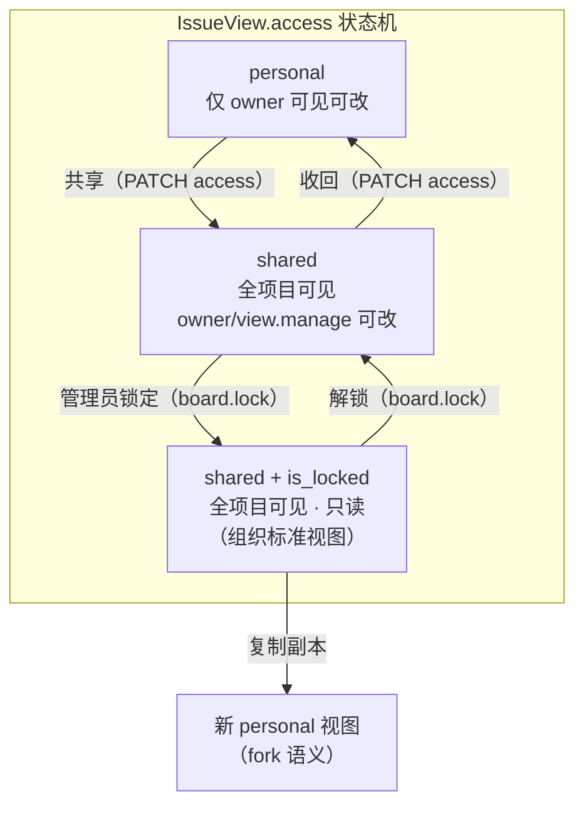
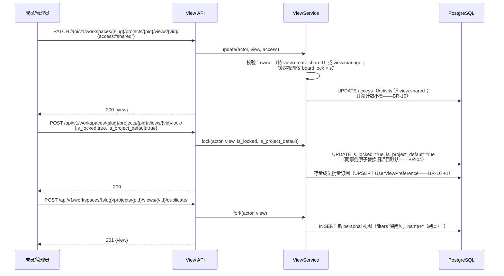
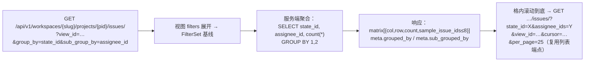

# 视图团队共享 / 管理员锁定 / 多维分组

| 元信息项 | 内容 |
| --- | --- |
| 文档编号 | BOARD-005 |
| 所属迭代 | Sprint 8 — 企业组织权限治理（第 11 周） |
| 优先级 | P3（企业版核心级） |
| 所属模块 | M5-BOARD｜看板视图（模块码以 dependency-graph §2 为准） |
| 文档状态 | 已实现（Sprint-8 R1~R6 后端全量 + 前端六表面，2026-09-09） |
| 最后更新日期 | 2026-09-05（R1 修复 10 项：信封重写、UserViewPreference 本迭代建表（§4.1.2）、board.lock / view.create.shared 对齐 rbac §8.2、端点补 workspaces 层、is_project_default 改名 + 三概念调和表、M5-BOARD + 引用更正、P3/P4 边界声明、pin/ 契约 + subscriber_count 口径（BR-16）、ArraySubquery 替代 ArrayAgg 切片 + 方法语义统一、§5.4 四主体矩阵 + BR-15 用例 + P95 断言；R2 复评 PASS 9.5/9.5/10/9.5/9.5 一次过） |
| 上游依赖 | `BOARD-004`（直接前置——dependency-graph §4.7：视图保存 / 批量操作管线）、`BOARD-003`（传递前置：`IssueView` 模型——`access`/`is_locked`/`sub_group_by` 三列 P2 已建未开放、视图 CRUD / 拖拽 / 分组端点）、`TASK-011`（filters DSL 全集）、`AUTH-008`（自定义角色挂接权限码——dependency-graph §4.7）；权限码均取自 [`rbac-permission-model.md`](../architecture/rbac-permission-model.md) §8.2 既有注册表，本文零新增码 |
| 下游消费 | P4 跨项目全局视图（需求文档 §8.2 看板视图 P4 列「跨项目全局看板」，另立文档）；`RPT-002`（标准视图作为统计切片口径） |
| 上游依据 | `docs/需求文档.md` §3.5 看板视图模块（企业版专属-高级看板）、§8.2 看板视图 P3 列（视图团队共享、管理员视图锁定、多维度分组看板） |
| 关联架构文档 | [`api-conventions.md`](../architecture/api-conventions.md)（§3.1-3.2 方法语义、§4 统一信封、§6.3 分页、§8 错误码）、[`rbac-permission-model.md`](../architecture/rbac-permission-model.md)（§8.2 权限码注册表、§8.4 R10）、[`dependency-graph.md`](../architecture/dependency-graph.md)（§2 模块码、§4.7 依赖边） |
| 对标基线 | Plane Views（`is_locked` 字段同源） · Jira Board 共享过滤器 · Asana 默认视图强制 |
| 工作量估算 | 后端 2 人日 / 前端 2.5 人日 / 联调与测试 1.5 人日，合计 **6 人日** |

> **待回改登记**（评审裁决 A：本轮不修改架构文档与上游文档，冲突在本文登记化解）
>
> 1. **BOARD-003 §4.1.1 `project` 字段 help_text「为空表示跨项目全局视图（P3）」表述待回改**——跨项目全局视图为 P4（需求文档 §8.2 看板视图 P4 列「跨项目全局看板」），非 P3；本文 §1.4 按 P4 不做处理。
> 2. **TASK-011 §范围声明 / §3「全局跨项目筛选（P3 `BOARD-005` 视图治理）」表述待回改**——同上按 P4 处理，非本迭代范围。
> 3. **BOARD-003 §4.1 未落「每用户视图偏好」数据载体待回改**——其 §1.1 / §6.1 仅对标 Plane「每用户视图偏好」止于规划，全 docs 无任何偏好表（grep 证实）；本文 §4.1.2 `UserViewPreference` 为该载体唯一事实来源，BOARD-003 §4.1 待回改补一行指向本表。
> 4. **BOARD-003 §2.5 BR-10「默认视图」表述待回改**——其用户级默认（profile 键 `board.default_view_id`）与本文项目级 `is_project_default` 同名不同义，调和见 §4.1.2；建议 BOARD-003 回改时加「用户级」限定语。

---

## 1. 概述

### 1.1 功能定位

`BOARD-003` 交付的视图是**个人**的：我调的筛选/分组/排序只存在我的 `IssueView` 里。团队场景的两个高频痛点：

1. 「把你们切到我这个视角」要靠截图或口述参数——需要**共享视图**：一人配置、全团队可订阅；
2. 管理员定义了「迭代评审」「缺陷分诊」标准视角，却被成员各自改乱——需要**管理员锁定**：组织标准视图只读，成员可复制副本再个性化。

本文档放开 `BOARD-003` 建好的三列：`access`（`personal` → 放开 `shared`）、`is_locked`（管理员锁定）、`sub_group_by`（泳道式二维分组），并新增项目级默认订阅列 `is_project_default` 与订阅偏好表 `UserViewPreference`（§4.1），定义「新成员默认可见」的组织标准视图机制。

### 1.2 关键约定：三种视图形态



| 约定 | 说明 |
| --- | --- |
| 共享范围 | 项目级：shared 视图对**项目全部成员**可见（无按角色/部门的可见性矩阵——P4 全局视图再评估） |
| 锁定语义 | `is_locked=true`：filters/display_props/layout/名称/access 全员只读（含 owner）；仅 `board.lock`（rbac §8.2，仅 PROJ_ADMIN；WS_OWNER/WS_ADMIN 隐式等效，§7.4）可锁定/解锁/修改 |
| 副本机制 | 任何成员可对 shared/锁定视图「另存为」生成 personal 副本（filters 全量拷贝，名 +「副本」） |
| 项目默认视图 | 管理员可把锁定视图设为 `is_project_default`——新成员加入项目时自动订阅（写入其 `UserViewPreference.pinned`）；每项目至多 1 个。与 `BOARD-003` BR-10 的**用户级**默认视图（profile 键 `board.default_view_id`）正交，调和见 §4.1.2 |
| 删除保护 | 锁定视图不可删（先解锁）；shared 视图删除仅 owner/`view.manage`，删除确认展示订阅人数（口径 BR-16） |

### 1.3 关键约定：多维分组（二维泳道）

`group_by`（列）× `sub_group_by`（行泳道）构成二维看板：列=状态、行=负责人，即「谁 · 在什么阶段」。数据语义：

- 取数 = 同一基线查询 + 双键分桶：`(group_key, sub_group_key)` 二元组聚合，卡片落入交叉格；
- 「未设置」桶两个维度各自独立（无负责人行、无标签列）；
- 拖拽 = 双字段变更（列字段 + 行字段），校验规则与一维一致（`BOARD-003` 拖拽语义复用：状态列走流转校验，非状态列直接改字段）；
- 性能：交叉格计数由服务端聚合返回（不拉全量卡片），格内卡片懒加载（滚动到该格才取）。

### 1.4 范围边界

| 范围 | 本文档交付 | 明确不做 |
| --- | --- | --- |
| 共享 | personal ⇄ shared、订阅（pin）列表、删除保护 | 按角色/部门的可见性矩阵（P4） |
| 锁定 | is_locked 锁定/解锁、is_project_default 新成员默认、副本另存 | 锁定视图的分级管理（部门级标准视图，P4） |
| 多维分组 | 二维泳道看板（group × sub_group）、交叉格聚合与懒加载 | 三维及以上（无真实诉求） |
| 兼容 | 未共享/未锁定时行为与 P2 完全一致 | **跨项目全局视图（P4）**——本迭代全部视图均为项目内资源，与 `BOARD-003`/`TASK-011` 同域；需求文档 §8.2 P4 列「跨项目全局看板」另立文档承载。`BOARD-003` §4.1.1 help_text 与 `TASK-011` §范围声明的「（P3）」表述均为误标，见文首待回改登记 |

### 1.5 前置依赖

| 依赖 | 内容 | 阻塞原因 |
| --- | --- | --- |
| `BOARD-004` | 视图保存 / 任务批量操作管线（dependency-graph §4.7 直接前置） | 锁定视图的只读面须覆盖其批量入口语义 |
| `BOARD-003` | `IssueView` 全模型（三列已建未开放）、视图 CRUD/拖拽/分组端点（§4.3.2） | 本文档是其字段语义的放开与端点扩展 |
| `TASK-011` | filters DSL 全集（嵌套/占位符） | 共享视图的筛选表达力上限 |
| `AUTH-008` | 自定义角色可挂接权限码（码的**注册方**是 rbac §8.2 注册表，AUTH-008 只是权限码来源扩展） | 自定义角色持有 `board.lock`/`view.manage` 等码时的等效判定 |
| `rbac-permission-model.md` §8.2 | `board.read` / `view.create.own` / `view.create.shared` / `view.manage` / `board.lock` 均为既有注册码 | 本文零新增权限码（无需按附录 B 登记） |

### 1.6 竞品参考

| 竞品 | 参考点 | 处置 |
| --- | --- | --- |
| Plane | `IssueView.is_locked` 字段即存在（本系统列同源）；其 shared 视图无订阅数展示 | 字段语义对齐；补订阅数与项目默认视图 |
| Jira | Board 共享过滤器 + 管理员所有 | 「owner/管理员可改、他人只读」语义对齐 |
| Asana | 「默认视图」组织强制 + 个人可切 | `is_project_default` 采纳但弱化为「新成员默认订阅」而非强制锁定当前视角 |
| Notion | 视图即区块，无共享粒度概念 | 反例：粒度缺失导致团队视角无法收敛 |

---

## 2. 业务逻辑

### 2.1 共享 / 锁定 / 副本流程



> **方法语义（全文唯一口径）**：共享/收回 = `PATCH` 视图资源的 `access` 字段（api-conventions §3.1「局部更新只用 PATCH」）；锁定/解锁/设项目默认 = `POST .../lock/` 动作子资源（api-conventions §2.6——复合事务：原子替换旧默认 + 批量订阅，非单字段更新可表达）。本文时序图、API 表、前端代码、测试用例均按此口径，不出现第二种写法。

### 2.2 新成员默认订阅

`PROJ-002` 加成员成功路径追加钩子（`on_commit`）：查项目 `is_project_default=true` 的锁定视图 → `UserViewPreference.objects.get_or_create(user, project, view, pinned=True)`（唯一约束兜底 + `ignore_conflicts`，订阅幂等）。加成员幂等 → 订阅幂等；成员被移出项目时级联软删其订阅（BR-16）。

### 2.3 二维泳道取数



端点即 `BOARD-003` §4.3.2 `DimensionGroupView` 的 P3 扩展：新增 `sub_group_by` 查询参数；携带该参数时响应从「分组字典」切换为「矩阵形态」（本文 §4.2 定义），`meta.grouped_by` / `meta.sub_grouped_by` 键沿用 api-conventions §4.1 分组信封的预留键位。格内懒加载**不带** `group_by`/`sub_group_by` 参数（即 `BOARD-003` 既有列表取数），双维度作为普通过滤条件注入——服务端零新查询形态。

### 2.4 业务规则汇总

| 编号 | 规则 | 触发点 | 违规响应 |
| --- | --- | --- | --- |
| BR-01 | `access` ∈ {personal, shared}；shared 对项目全员可见 | 读取 | 非成员 404（存在性隐藏） |
| BR-02 | shared 视图修改：owner（本人视图）或 `view.manage`（他人共享视图，rbac §8.2 仅 PROJ_ADMIN）；锁定视图修改（含 filters/layout/名称/access）：仅 `board.lock`（rbac §8.2，仅 PROJ_ADMIN）。锁定态拦截**优先于**权限码判定（UI 引导副本路径） | 写 | `PERM_ROLE_INSUFFICIENT`（403）/ `RESOURCE_LOCKED`（409） |
| BR-03 | 锁定视图不可删（先解锁，409）；shared 删除仅 owner/`view.manage`；删除确认所需的订阅人数由列表/详情响应的 `subscriber_count`（BR-16 口径）提供，`DELETE` 成功返回 204 并级联软删订阅 | 删除 | `RESOURCE_LOCKED` / `PERM_ROLE_INSUFFICIENT` |
| BR-04 | 每项目至多 1 个 `is_project_default`（部分唯一索引）；设新默认原子替换旧值 | 锁定 | —（事务内） |
| BR-05 | `is_project_default` 仅允许设置在锁定视图上（默认=组织标准，必先锁定；应用层先行校验 + DB CHECK 双护栏） | 设默认 | `VALIDATION_ERROR` + `details:[{field:"is_project_default", code:"INVALID", message:"项目默认视图须先锁定"}]` |
| BR-06 | 副本另存：任意项目成员可对可见视图执行；副本恒 personal、owner=操作者 | duplicate | — |
| BR-07 | `sub_group_by` 白名单 = `group_by` 同集（state/assignee/priority/label/groupable cf_select），且不得与 `group_by` 相同 | 保存/读取 | 保存：`VALIDATION_ERROR` + `details:[{field:"sub_group_by", code:"INVALID", message:"行分组维度不得与列分组维度相同"}]`；查询参数非法：`VALIDATION_INVALID_PARAM`（400）；读取时维度字段停用 → 该维度回退 null（一维）+ `meta.degraded` |
| BR-08 | 二维拖拽：列=state 时走流转校验（`TASK-005/WF-004` 守卫链）；行维度字段直接更新；失败卡片回弹 | 拖拽 | 沿用 `BOARD-003` 错误语义 |
| BR-09 | 视图名项目内不强制唯一（副本自动加「（副本）」，重名再加序号） | 创建/副本 | — |
| BR-10 | 共享/锁定/解锁/设默认/删除入 Activity 与审计（`AUTH-010`） | 写操作 | — |
| BR-11 | 订阅列表（我的 pin）跨 personal/shared 混合排序（`UserViewPreference.sort_order` 个人级） | 读取 | — |
| BR-12 | 项目归档：视图只读（既有归档写保护层拦截 PATCH/duplicate 外的写；duplicate 允许——复制到副本不改动归档数据） | 写 | `PERM_PROJECT_ARCHIVED`（duplicate 豁免） |
| BR-13 | 交叉格计数上限：单格计数精确到 99+（聚合 SQL 精确值，展示截断） | 读取 | — |
| BR-14 | 内置系统视图（`is_system`）不可共享/锁定（口径锁定规则继承 `BOARD-003` BR-03） | 写 | `VALIDATION_ERROR` |
| BR-15 | 解锁**不级联取消** `is_project_default`：解锁请求遇 `is_project_default=true` 且未显式同请求取消默认时，返回 409 拒绝，须两步显式操作（先取消默认、再解锁）——防止一次请求误毁组织配置，同时不破坏 BR-05 的 CHECK 约束 | 写（lock/） | `RESOURCE_STATE_INVALID`（409） + `details:[{field:"is_locked", code:"INVALID", message:"请先显式取消项目默认，再解锁"}]` |
| BR-16 | **订阅与计数口径（唯一口径）**：`subscriber_count` = 该视图 `UserViewPreference(pinned=True)` 存活行数（软删除外；owner 不隐含计入）。+1 触发点 = ①成员手动订阅（`POST pin/`）②设项目默认时存量成员批量订阅 ③新成员加入自动订阅；−1 触发点 = ①取消订阅 ②收回共享（`access`→personal）级联软删全部订阅行 ③视图删除级联软删。**共享动作本身不改变计数**（可见 ≠ 订阅，§2.6） | 读/写 | — |

### 2.5 异常处理

| 场景 | 处理 |
| --- | --- |
| 锁定视图被 PATCH filters | `RESOURCE_LOCKED`（409）+ `details` 内 message 携带锁定人快照（锁定人 + locked_at），前端弹「另存为副本」引导（示例见 §4.2） |
| sub_group_by 字段被停用 | 读取降级一维 + `meta.degraded.sub_group_by`，保存时 400 |
| 项目默认视图被删（先解锁后删路径） | 删除事务内清 `is_project_default`；存量成员订阅保留（视图删则订阅级联软删） |
| 解锁仍持项目默认的视图 | `RESOURCE_STATE_INVALID`（409）——BR-15 两步流 |
| 二维聚合超时（百万级任务项目） | 聚合查询 5s 超时 → 降级返回一维 + `meta.degraded.matrix_timeout` |
| 对 personal 视图调用 pin/ | `VALIDATION_ERROR` + `details:[{field:"view", code:"INVALID", message:"仅共享视图支持订阅"}]` |

### 2.6 边界条件

- **owner 离职/移出项目**：shared 视图不失效；owner 字段置空，管理权移交 `view.manage` 持有者（rbac §8.2 即 PROJ_ADMIN；`AUTH-008` 自定义角色可被授予该码）。
- **副本的副本**：允许，谱系不追踪（视图非内容资产，无版本诉求）。
- **订阅 ≠ 可见性**：未订阅的 shared 视图仍可在「全部视图」列表看到并打开；订阅只影响侧栏 pin。首个 shared 视图刚共享时 `subscriber_count=0` 属预期（BR-16：共享不加订阅）。

---

## 3. UI/UX 设计

### 3.1 视图切换栏与共享标识

```
┌──────────────────────────────────────────────────────────────────────┐
│ 视图： [全部任务] [缺陷分诊 🔒] [迭代评审 🔒★] [我的高优]  [+ 新建]   │
│        ──────────  ───────────   ─────────────  ─────────           │
│        内置         共享·锁定     共享·锁定·默认   personal           │
├──────────────────────────────────────────────────────────────────────┤
│ 缺陷分诊 🔒（组织标准视图，只读）  [另存为副本]  [订阅 📌]  ⋯           │
│ ┌─────────┬──────────┬──────────┬──────────┬──────────┐             │
│ │ 状态＼负责人│ 张三(4) │ 李四(7)  │ 王五(2)  │ 未分配(3)│             │
│ ├─────────┼──────────┼──────────┼──────────┼──────────┤             │
│ │ 待办     │ [卡][卡] │ [卡]     │          │ [卡]     │             │
│ │ 进行中   │ [卡]     │ [卡][卡] │ [卡]     │          │             │
│ │ 待评审   │          │ [卡]     │          │ [卡][卡] │             │
│ │ 已完成   │ [卡]     │ [卡…]    │ [卡]     │          │             │
│ └─────────┴──────────┴──────────┴──────────┴──────────┘             │
│ 格内计数 99+ 截断；滚动到格底部自动加载该格下一页                       │
└──────────────────────────────────────────────────────────────────────┘
```

- 标识体系：🔒=锁定、★=项目默认、人形图标=shared、无标识=personal；锁定视图顶栏横幅「组织标准视图，只读」+「另存为副本」主操作。
- 视图菜单（⋯）：共享/收回共享、锁定/解锁、设为项目默认、另存副本、删除——按权限渲染可用项（`board.lock` / `view.manage` / `view.create.shared` 三个权限码，AUTH-005 按钮权限语义）。

### 3.2 共享与锁定对话框

```
┌────────────────── 共享视图「缺陷分诊」 ──────────────────┐
│ 共享后项目全部成员可见此视图（可见 ≠ 订阅，当前订阅：14 人）。│
│ ☐ 同时锁定为组织标准视图（仅管理员可修改）                 │
│   ☐ 设为新成员项目默认视图（加入项目自动订阅）             │
│                                   [取消]  [确认]          │
└──────────────────────────────────────────────────────────┘
```

删除共享视图二次确认：「该视图被 14 人订阅，删除后不可恢复」（14 = `subscriber_count`，BR-16 口径）。

### 3.3 二维分组的配置面板

视图配置面板在「分组维度」下新增「行分组（泳道）」下拉（选项与列分组同集，选中与列相同值时即时校验提示）；清空行分组回到一维看板。看板头部显示 `状态 × 负责人` 维度说明。

### 3.4 空状态 / 加载 / 失败

| 状态 | 表现 |
| --- | --- |
| 空交叉格 | 虚线框「拖拽任务到此」 |
| 整格加载 | 格内骨架卡片 ×3 |
| 聚合降级 | 页顶黄条「二维统计暂不可用，已切换单列分组」 |
| 锁定视图编辑尝试 | 表单控件禁用态 + 悬浮「此视图已被管理员锁定」 |
| 无权限项 | 菜单项隐藏（非禁用——`AUTH-005` 按钮权限语义） |

### 3.5 响应式与无障碍

- < 1024px 二维看板降级为一维（行维度切换为筛选器 chip），并提示「泳道视图需在更大屏幕使用」。
- 格间拖拽提供等价操作：卡片菜单「移动到…」级联选择列/行值；泳道行列头 `scope="col/row"` 语义化。

---

## 4. 技术架构

### 4.1 数据模型

#### 4.1.1 `IssueView` 增量（新列 3 个 + 既有列语义放开）

```python
# apps/api/plane/db/models/view.py —— BOARD-003 §4.1.1 模型增量
class IssueView(BaseModel):
    # …BOARD-003 既有字段不变：workspace/project/owner/name/description/
    #   access/layout/filters/display_props/is_system/is_locked/sort_order…
    # 本迭代放开的既有列（无 DDL 变更，仅语义与校验放开）：
    #   access                     personal → shared（BR-01/BR-02）
    #   is_locked                  恒 false → 管理员锁定（board.lock）
    #   display_props.sub_group_by 恒 null → 泳道行维度白名单（BR-07）
    is_project_default = models.BooleanField(
        default=False, verbose_name="项目默认视图（新成员自动订阅）",
        help_text="每项目至多 1 个（BR-04）；仅锁定视图可设（BR-05）。"
                  "与 BOARD-003 BR-10 的用户级默认（profile 键 board.default_view_id）"
                  "是两个正交概念，调和见 §4.1.2")
    locked_by = models.ForeignKey("db.User", null=True, blank=True,
                                  on_delete=models.SET_NULL, related_name="locked_views")
    locked_at = models.DateTimeField(null=True, blank=True)

    class Meta(BaseModel.Meta):
        constraints = [
            # BR-04：每项目至多 1 个项目默认视图（部分唯一索引）
            models.UniqueConstraint(fields=["project"],
                                    condition=models.Q(is_project_default=True),
                                    name="uq_view_project_default"),
            # BR-05 DB 护栏：项目默认必须先锁定
            models.CheckConstraint(
                check=models.Q(is_project_default=False) | models.Q(is_locked=True),
                name="ck_view_project_default_locked"),
        ]
```

#### 4.1.2 `UserViewPreference`（本迭代新表——订阅 / 默认订阅 / 订阅排序三功能的唯一数据载体）

> `BOARD-003` §1.1 / §6.1 对标 Plane「每用户视图偏好」止于**规划**，其 §4.1 未落任何偏好载体（grep 全 docs 证实无此表）——引用措辞即「**BOARD-003 §1.1/§6.1 规划、本迭代落地**」，待回改登记见文首第 3 条。

```python
# apps/api/plane/db/models/view_preference.py —— 新表
class UserViewPreference(BaseModel):
    """用户 × 视图偏好：侧栏订阅（pin）与订阅列表个人排序。

    承载三功能：①手动订阅（pin）②项目默认自动订阅（批量写入）
    ③订阅列表个人级排序（BR-11）。
    """

    user = models.ForeignKey("db.User", on_delete=models.CASCADE,
                             related_name="view_preferences", verbose_name="用户")
    project = models.ForeignKey("db.Project", on_delete=models.CASCADE,
                                related_name="view_preferences", verbose_name="项目")
    view = models.ForeignKey("db.IssueView", on_delete=models.CASCADE,
                             related_name="preferences", verbose_name="视图")
    pinned = models.BooleanField(default=True, verbose_name="订阅（侧栏展示）")
    sort_order = models.FloatField(default=65535.0, verbose_name="个人订阅排序（BR-11）")

    class Meta(BaseModel.Meta):
        db_table = "user_view_preferences"
        constraints = [
            # 存活行内「一人一视图至多一条」——重订阅 = 复活或重建，UPSERT 幂等基础
            models.UniqueConstraint(fields=["user", "view"],
                                    condition=models.Q(deleted_at__isnull=True),
                                    name="uq_view_pref_user_view_alive"),
        ]
        indexes = [
            models.Index(fields=["user", "project", "pinned"],
                         name="idx_view_pref_user_proj"),
            models.Index(fields=["view", "pinned"], name="idx_view_pref_view"),
        ]
```

- **软删**：继承 `BaseModel.deleted_at`（与全站软删位一致）；唯一约束仅约束存活行。级联软删：视图删除 / 收回共享 → 软删该视图全部偏好行；成员移出项目 → 软删其该项目偏好行（BR-16）。
- **is_default 同名不同义调和（裁决⑤）**：本文将项目级字段命名为 `is_project_default`（弃用原稿 `is_default`），与 `BOARD-003` 用户级默认彻底区分。三个概念正交并存：

| 概念 | 载体 | 语义 | 设置者 | 数量口径 |
| --- | --- | --- | --- | --- |
| 用户级默认视图 | profile 键 `board.default_view_id`（`BOARD-003` §2.5 BR-10，经 `PATCH /users/me/settings/` 持久化） | 本人进项目的落点视图 | 本人 | 每用户每项目 ≤ 1 |
| 项目默认视图 | `IssueView.is_project_default`（本文 §4.1.1 新增） | 新成员加入时自动订阅一次的组织标准视图 | 管理员（`board.lock`） | 每项目 ≤ 1 |
| 订阅（pin） | `UserViewPreference.pinned`（本文 §4.1.2 新增） | 侧栏展示集合，多选 | 本人 | 不限 |

  进项目落点优先级：用户级默认 > 项目默认首个订阅 > 「全部」裸态（`BOARD-003` §3.6 兜底不变）。—— `BOARD-003` BR-10「默认视图」待回改加「用户级」限定语（文首登记第 4 条）。

#### 4.1.3 迁移要点

`is_project_default` 部分唯一索引 `CONCURRENTLY` 建立；存量视图 `is_project_default=false` 零回填；`sub_group_by` 从「恒 null」放开为白名单值（应用层校验，无 DDL 变更）；`user_view_preferences` 新表建表 + 两索引（量级 = 成员数 × 订阅数，常规索引即可）。

### 4.2 API 定义

**基础前缀**：`/api/v1/workspaces/{slug}/projects/{project_id}`（下表完整书写；视图为项目资源——api-conventions §2.1/§2.4 层级归属）。

| 方法 | 路径 | 说明 | 权限（rbac §8.2） |
| --- | --- | --- | --- |
| GET | `/api/v1/workspaces/{slug}/projects/{project_id}/views/` | 视图列表 = 内置 + 我的 personal + 项目 shared（游标分页；含 `subscriber_count`、`is_locked`、`is_project_default`、`my_preference.pinned`） | 项目成员（`board.read`） |
| POST | `/api/v1/workspaces/{slug}/projects/{project_id}/views/` | 创建视图（`access=shared` 需 `view.create.shared`——`BOARD-003` §4.2 既有端点，契约不变，本文放开 P2 拒绝的 shared 值） | `view.create.own` / `view.create.shared` |
| PATCH | `/api/v1/workspaces/{slug}/projects/{project_id}/views/{view_id}/` | 局部更新；`{"access": "shared"\|"personal"}` 即共享/收回（BR-02） | owner 或 `view.manage`；锁定视图仅 `board.lock` |
| POST | `/api/v1/workspaces/{slug}/projects/{project_id}/views/{view_id}/lock/` | 锁定/解锁/设项目默认（复合事务动作，§2.1 方法口径）请求体 `{"is_locked": bool, "is_project_default": bool?}` | `board.lock`（PROJ_ADMIN） |
| POST | `/api/v1/workspaces/{slug}/projects/{project_id}/views/{view_id}/duplicate/` | 另存副本（BR-06） | 项目成员（对可见视图） |
| POST | `/api/v1/workspaces/{slug}/projects/{project_id}/views/{view_id}/pin/` | 订阅/取消订阅（写 `UserViewPreference`，契约见下方 BR-16 块） | 项目成员（个人偏好） |
| DELETE | `/api/v1/workspaces/{slug}/projects/{project_id}/views/{view_id}/` | 删除（BR-03；成功 204 无响应体，订阅级联软删） | owner；他人 shared 仅 `view.manage` |
| GET | `/api/v1/workspaces/{slug}/projects/{project_id}/issues/?view_id=…&group_by=…&sub_group_by=…` | 二维泳道聚合（`DimensionGroupView` P3 扩展，§2.3） | 项目成员（`board.read`） |

**GET views/ — 200**（列表端点：`data` 为数组 + `meta` 必填九字段，api-conventions §4.1/§6.3）：

```json
{
  "status": "success",
  "data": [
    {
      "id": "3c4d5e6f-7a8b-4c9d-9e0f-1a2b3c4d5e6f",
      "name": "缺陷分诊",
      "layout": "kanban",
      "access": "shared",
      "is_locked": true,
      "is_project_default": true,
      "owner": {"id": "6c7d1a2b-8e4f-4c3a-9b2d-5e6f7a8b9c0d", "name": "张三"},
      "subscriber_count": 14,
      "my_preference": {"pinned": true},
      "display_props": {"group_by": "state_id", "sub_group_by": "assignee_id",
                        "order_by": "priority"}
    }
  ],
  "meta": {
    "next_cursor": "100:1:0",
    "prev_cursor": "100:0:1",
    "next_page_results": false,
    "prev_page_results": false,
    "count": 1,
    "total_count": 6,
    "total_pages": 1,
    "page": 1,
    "per_page": 100
  }
}
```

**PATCH views/{view_id}/ `{access:"shared"}` — 200**（共享动作本身不改订阅计数——BR-16）：

```json
{
  "status": "success",
  "data": {
    "id": "3c4d5e6f-7a8b-4c9d-9e0f-1a2b3c4d5e6f",
    "access": "shared",
    "subscriber_count": 0,
    "updated_at": "2026-09-05T10:12:00.000Z"
  }
}
```

**POST lock/ — 200**（锁定 + 设项目默认）：

```json
{
  "status": "success",
  "data": {
    "view": {
      "id": "3c4d5e6f-7a8b-4c9d-9e0f-1a2b3c4d5e6f",
      "is_locked": true,
      "is_project_default": true,
      "locked_by": {"id": "6c7d1a2b-8e4f-4c3a-9b2d-5e6f7a8b9c0d", "name": "张三"},
      "locked_at": "2026-09-05T11:00:00.000Z"
    },
    "replaced_default_view_id": "9a8b7c6d-1e2f-4a3b-8c5d-6e7f8a9b0c1d",
    "subscribed_existing_members": 42
  }
}
```

**锁定视图 PATCH filters — 409**（信封按 api-conventions §4.2：`details` 为数组、每项 `{field, code, message}`、`request_id` 在 error 对象内）：

```json
{
  "status": "error",
  "error": {
    "code": "RESOURCE_LOCKED",
    "message": "该视图已被管理员锁定，可另存为副本后修改",
    "details": [
      {
        "field": "is_locked",
        "code": "INVALID",
        "message": "锁定人：张三（2026-09-05T11:00:00.000Z）；可另存为副本后修改"
      }
    ],
    "request_id": "01JCBCC5B9EF4G7H3J5K6M7N8R"
  }
}
```

**POST pin/ 请求体契约（BR-16）**：`{"pinned": bool}`（必填、布尔、无其他字段）。

| 场景 | 响应 |
| --- | --- |
| 订阅成功 / 取消成功（幂等：同值重复提交返回 200 不变） | `200 {"status":"success","data":{"view_id":"3c4d5e6f-…","pinned":true,"subscriber_count":15}}` |
| 目标为 personal 视图（非本人不可见 → 404；本人个人视图无需订阅） | `400 VALIDATION_ERROR` + `details:[{field:"view", code:"INVALID", message:"仅共享视图支持订阅"}]` |
| `pinned` 缺失 / 非布尔 | `400 VALIDATION_ERROR` + `details:[{field:"pinned", code:"REQUIRED"\|"INVALID", message:"…"}]` |
| 非项目成员（存在性隐藏） | `404 RESOURCE_NOT_FOUND` |

**GET issues/?group_by&sub_group_by — 200**（矩阵形态；列/行键 = 裸列值 + `__none__` 哨兵，与 `BOARD-003` §4.3.2 键规则一致——列头名称/颜色由前端配置源渲染，响应不内嵌组元数据）：

```json
{
  "status": "success",
  "data": {
    "columns": ["a1b2c3d4-1111-4a5b-8c6d-7e8f9a0b1c2d", "a1b2c3d4-2222-4a5b-8c6d-7e8f9a0b1c2d"],
    "rows": ["6c7d1a2b-3333-4c3a-9b2d-5e6f7a8b9c0d", "__none__"],
    "matrix": [
      {"col": "a1b2c3d4-1111-4a5b-8c6d-7e8f9a0b1c2d", "row": "6c7d1a2b-3333-4c3a-9b2d-5e6f7a8b9c0d",
       "count": 7, "sample_issue_ids": ["8a1f9c2e-6b3d-4a7e-9f11-2c4d5e6f7a8b", "2b3a4c5d-1e2f-4a3b-8c6d-5e4f3a2b1c0d"]},
      {"col": "a1b2c3d4-2222-4a5b-8c6d-7e8f9a0b1c2d", "row": "__none__",
       "count": 2, "sample_issue_ids": ["9f8e7d6c-5b4a-4c3b-8d2e-1f0a9b8c7d6e"]}
    ]
  },
  "meta": {
    "grouped_by": "state_id",
    "sub_grouped_by": "assignee_id",
    "degraded": null
  }
}
```

`sample_issue_ids` 恒 ≤ 8 条（首屏样例卡，§4.3 实现约束）；`count` 为精确全量计数（展示层 99+ 截断，BR-13）。

**sub_group_by 与 group_by 相同 — 400**（查询参数非法，裁决 F）：

```json
{
  "status": "error",
  "error": {
    "code": "VALIDATION_INVALID_PARAM",
    "message": "查询参数非法",
    "details": [
      {"field": "sub_group_by", "code": "INVALID", "message": "行分组维度不得与列分组维度相同"}
    ],
    "request_id": "01JD5F7H9K1M3P5R7T9V2W4X6Y8"
  }
}
```

保存视图（PATCH display_props）场景同一校验走 `VALIDATION_ERROR` + `details:[{field:"sub_group_by", code:"INVALID", …}]`（BR-07）。不新造本文档私有的字段级子码——语义入 `message`；若后续确需专用子码，按 api-conventions §8.8 登记流程补充。

### 4.3 核心逻辑

```python
# apps/api/plane/services/view_governance.py（路径遵循 apps/api/plane/ 布局）
@transaction.atomic
def lock_view(*, actor, view, is_locked: bool, is_project_default: bool | None):
    # BR-15：解锁不级联取消项目默认——两步显式流
    if (is_locked is False and view.is_project_default
            and is_project_default is not False):
        raise ConflictErr("RESOURCE_STATE_INVALID", details=[{
            "field": "is_locked", "code": "INVALID",
            "message": "请先显式取消项目默认，再解锁"}])
    if is_project_default and not is_locked:                      # BR-05
        raise ValidationErr("is_project_default", "项目默认视图须先锁定")
    view.is_locked = is_locked
    if is_locked:
        view.locked_by, view.locked_at = actor, timezone.now()
    else:
        view.locked_by, view.locked_at = None, None
    if is_project_default is True:
        (IssueView.objects.select_for_update()
         .filter(project=view.project, is_project_default=True)
         .exclude(pk=view.pk).update(is_project_default=False))   # BR-04 原子替换
        view.is_project_default = True
    elif is_project_default is False:
        view.is_project_default = False
    view.save()
    if view.is_project_default:
        _subscribe_all_members(view)                              # 存量成员（BR-16 +1）
    on_commit(lambda: record_audit.delay("view.locked" if is_locked
              else "view.unlocked", ...))                         # BR-10
    return view

def _subscribe_all_members(view) -> int:
    member_ids = ProjectMember.objects.filter(project=view.project) \
                                      .values_list("user_id", flat=True)
    rows = [UserViewPreference(user_id=uid, project=view.project,
                               view=view, pinned=True) for uid in member_ids]
    UserViewPreference.objects.bulk_create(rows, ignore_conflicts=True)  # 幂等（§4.1.2 唯一约束）
    return len(rows)

@transaction.atomic
def duplicate_view(*, actor, view):                               # BR-06
    name = _dedup_name(view.project, f"{view.name}（副本）")
    fork = IssueView.objects.create(
        project=view.project, owner=actor, name=name, access="personal",
        layout=view.layout, filters=deepcopy(view.filters),
        display_props=deepcopy(view.display_props))
    return fork
```

```python
# 二维聚合（BOARD-003 §4.3.2 DimensionGroupView 扩展）
# ★ 实现约束：Django annotate 内 ArrayAgg 不支持切片（原稿 ArrayAgg("id")[:8] 非法）。
#   采用 ArraySubquery 相关子查询内层切片（子查询 LIMIT 合法，Django 4.2+ /
#   django.contrib.postgres.aggregates），单查询完成计数 + 限量样例。
from django.db.models import Count, OuterRef
from django.contrib.postgres.aggregates import ArraySubquery

def board_matrix(*, project, base_qs, group_by: str, sub_group_by: str):
    col_expr, row_expr = GROUP_EXPR[group_by], GROUP_EXPR[sub_group_by]
    cell_ids = (base_qs.annotate(col=col_expr, row=row_expr)
                .filter(col=OuterRef("col"), row=OuterRef("row"))
                .order_by("sort_order", "id")
                .values("id")[:8])                 # 子查询内切片 → LIMIT 8（合法）
    rows = (base_qs.annotate(col=col_expr, row=row_expr)
            .values("col", "row")
            .annotate(count=Count("id"),
                      sample_ids=ArraySubquery(cell_ids))          # ≤ 8 条样例
            .order_by("col", "row"))
    return {"columns": columns_of(group_by), "rows": columns_of(sub_group_by),
            "matrix": list(rows)}
# 兜底：Django < 4.2 无 ArraySubquery 时退化为两查询——①values(col,row).annotate(count)
# 计数 ②RowNumber() OVER (PARTITION BY col,row) 窗口 rn≤8 取样；响应契约不变。
```

**查询面**：视图列表 1 查询（`personal OR shared` + `my_preference` LEFT JOIN + `subscriber_count` 子查询 `annotate`——计数字段在 QuerySet 层 annotate，禁 `SerializerMethodField`，api-conventions §10.2）；二维聚合 1 查询（`ArraySubquery` 限 8 条样例防大响应）；格内翻页复用列表端点零新查询形态。基线 queryset 统一软删过滤（`deleted_at__isnull=True`，BaseModel 约定）。

**加成员钩子**（`PROJ-002` `add_member` 事务 `on_commit`）：`default = IssueView.objects.filter(project, is_project_default=True).first()` → `get_or_create` 订阅（§2.2）。

**降级**：维度字段停用检测 = Schema API 缓存（`TASK-008`）读取时校验；聚合 `statement_timeout=5s`，超时捕获 → 一维降级 + `meta.degraded`（BR-07/异常表）。

### 4.4 前端实现

```typescript
// stores/view.store.ts（BOARD-003 扩展）
const BASE = `/api/v1/workspaces/${wsSlug}/projects/${projectId}/views`;

class ViewStore {
  async share(viewId: string, access: "shared" | "personal") {
    // 共享/收回 = PATCH access 字段（api-conventions §3.1；§2.1 方法口径）
    const { data } = await api.patch(`${BASE}/${viewId}/`, { access });
    runInAction(() => Object.assign(this.get(viewId), data));
  }
  async lock(viewId: string, isLocked: boolean, isProjectDefault?: boolean) {
    await api.post(`${BASE}/${viewId}/lock/`,
      { is_locked: isLocked, is_project_default: isProjectDefault });
    await this.loadAll();                    // 项目默认原子替换 + 批量订阅，全量重拉
  }
  async pin(viewId: string, pinned: boolean) {
    const { data } = await api.post(`${BASE}/${viewId}/pin/`, { pinned });
    runInAction(() => {
      this.get(viewId).my_preference.pinned = pinned;
      this.get(viewId).subscriber_count = data.subscriber_count;   // BR-16 口径回写
    });
  }
  async duplicate(viewId: string) {
    const { data } = await api.post(`${BASE}/${viewId}/duplicate/`);
    runInAction(() => this.upsert(data));
    return data.id;                          // 路由跳转新副本
  }
}

// 二维看板
const fetchMatrix = (viewId: string) =>
  api.get(`/api/v1/workspaces/${wsSlug}/projects/${projectId}/issues/`,
          { params: { view_id: viewId, group_by: "state_id", sub_group_by: "assignee_id" } });

const SwimlaneBoard = observer(({ view }: { view: IssueView }) => {
  const matrix = useSWR(["board-matrix", view.id], fetchMatrix(view.id));
  if (matrix.meta?.degraded) return <KanbanBoard view={view} degradedBanner />;
  return (
    <table className="swimlane">
      {matrix.data.rows.map(r => (
        <tr key={r}>{matrix.data.columns.map(c => (
          <Cell key={c} column={c} row={r}
                bucket={matrix.find(c, r)}            // 计数 + ≤8 样例卡
                lazyLoad={() => fetchCellIssues(view, c, r)} />
        ))}</tr>
      ))}
    </table>);
});
```

组件：`<ViewTabBar>`（锁/默认/共享标识）、`<ShareLockDialog>`、`<SwimlaneBoard>`、`<LockedBanner>`（另存副本引导）。控件级权限：锁定视图所有编辑控件经 `usePermission("board.lock")` 统一禁用；他人共享视图编辑控件经 `usePermission("view.manage")`；共享入口经 `usePermission("view.create.shared")`（`AUTH-005` 按钮权限语义）。

---

## 5. 测试用例

### 5.1 单元测试

| 编号 | 用例 | 断言 |
| --- | --- | --- |
| UT-01 | personal → shared → personal 状态迁移 | access 与可见面正确 |
| UT-02 | 非 owner 非管理员改 shared 视图 | `PERM_ROLE_INSUFFICIENT`（403） |
| UT-03 | 锁定视图 PATCH filters | `RESOURCE_LOCKED`（409）+ details.message 含锁定人快照 |
| UT-04 | board.lock 持有者可改锁定视图 | 200 |
| UT-05 | is_project_default 未锁定拒绝 | BR-05（应用层 + DB CHECK 双护栏） |
| UT-06 | 设新默认原子替换旧默认 | 全项目恰 1 个 |
| UT-07 | 锁定视图删除拒绝；shared 删除含订阅数（列表响应） | BR-03；DELETE → 204 + 订阅级联软删 |
| UT-08 | 副本：filters 深拷贝、personal、owner=操作者、名+（副本） | 字段断言 |
| UT-09 | sub_group_by 与 group_by 相同拒绝 | BR-07（保存 400 / 查询参数 VALIDATION_INVALID_PARAM） |
| UT-10 | 维度字段停用 → 读取降级一维 + meta.degraded | — |
| UT-11 | 新成员加入自动订阅默认视图 | get_or_create 幂等 |
| UT-12 | 移出项目级联软删订阅 | — |
| UT-13 | 内置系统视图共享/锁定拒绝 | BR-14 |
| UT-14 | 聚合超时降级一维 | meta.degraded.matrix_timeout |
| UT-15 | 解锁仍持项目默认的视图（未显式取消默认） | `RESOURCE_STATE_INVALID`（409）——BR-15 |
| UT-16 | 同请求显式 `{is_locked:false, is_project_default:false}` | 200：两步合一步的显式路径放行（不违反 BR-15「显式」语义） |
| UT-17 | pin/ 契约：personal 视图 400；pinned 缺失/非布尔 400；同值幂等 200 | BR-16 请求体契约 |
| UT-18 | 收回共享（access→personal）级联软删订阅行 | subscriber_count → 0；重共享后可重订阅（唯一约束仅约束存活行） |
| UT-19 | 矩阵样例限量：单格 100 卡时 sample_issue_ids 恰 8 条且 count=100 | ArraySubquery 切片正确 |

### 5.2 集成测试

| 编号 | 用例 | 断言 |
| --- | --- | --- |
| IT-01 | 共享后其他成员 GET views/ 可见并可打开取数 | 200 与数据一致 |
| IT-02 | 锁定+设默认：42 存量成员订阅批量写入（幂等重跑无重复） | 计数精确 |
| IT-03 | 新成员 JIT/手动加入 → 自动订阅 | UserViewPreference 存在 |
| IT-04 | 二维矩阵聚合与逐格列表端点计数对账（随机 10 格） | 完全一致 |
| IT-05 | 二维拖拽：state 列走流转守卫、行字段直接更新、失败回弹 | 三路径 |
| IT-06 | owner 离职后 shared 视图管理权移交 view.manage 持有者 | 可改可解锁 |
| IT-07 | 项目归档：锁定视图只读、duplicate 豁免可用 | BR-12 |
| IT-08 | BR-15 两步流：拒绝一步解锁 → 取消默认 → 解锁成功；全程订阅行保留 | 状态与订阅计数不变 |
| IT-09 | §5.4 四主体权限矩阵参数化执行入口（PM-01~08） | 逐格断言（范式 AUTH-006） |
| IT-10 | 性能门槛：二维矩阵端点压测 | P95 < 200ms（perf-heavy：单项目 1 万任务 × 20 视图——对齐 QA-001 §2.3 基准矩阵「分组看板」行 `GET …/issues/?group_by=…` < 200ms 门禁，出处 BOARD-003 §5.2 IT-10；本端点为其 `sub_group_by` 扩展，同门槛同数据集；经 QA-001 UT-07 一致性守卫收录）。格内翻页复用列表端点，继承单维筛选 < 120ms 口径（TASK-003 §7.2） |

### 5.3 E2E 测试

| 编号 | 场景 |
| --- | --- |
| E2E-01 | 管理员共享并锁定「缺陷分诊」设为默认 → 成员侧栏自动出现且只读横幅可见 |
| E2E-02 | 成员对锁定视图另存副本 → 修改副本 filters 互不影响 |
| E2E-03 | 配置「状态 × 负责人」泳道 → 拖拽卡片跨格 → 双字段更新且计数即时刷新 |
| E2E-04 | 删除被 14 人订阅的共享视图：二次确认展示订阅数 → 删除后订阅者侧栏消失 |

### 5.4 权限矩阵测试（四主体，范式 AUTH-006 §1.1 越权测试矩阵 + §5.2 参数化套件）

主体口径（rbac §7.4 / §8.2 注）：**OWNER** = `WS_OWNER`；**WS_ADMIN** 隐式等效 PROJ_ADMIN（私密项目除外，R9）；**WS_MEMBER** 取默认项目角色 PROJ_CONTRIBUTOR；**GUEST** = `WS_GUEST`（项目角色 ≤ PROJ_COMMENTER，R4）。**非项目成员**（WS_ONLY / 跨空间用户）不进矩阵列，单独一行：一律 404 存在性隐藏（BR-01，对齐 AUTH-006 越权矩阵的「同空间非成员 / 跨空间用户」主体）。

| 操作 \ 主体 | OWNER | WS_ADMIN | WS_MEMBER（CONTRIBUTOR） | GUEST（≤COMMENTER） | 非项目成员 |
| --- | --- | --- | --- | --- | --- |
| 查看共享视图（GET views/ / 矩阵端点） | 200 | 200 | 200 | 200 | 404 |
| 编辑本人视图（PATCH） | 200 | 200 | 200 | 200（`view.create.own` 全员） | 404 |
| 共享本人视图（PATCH access=shared） | 200 | 200 | 200（`view.create.shared`） | 403 `PERM_ROLE_INSUFFICIENT` | 404 |
| 编辑他人共享视图（PATCH） | 200（`view.manage`） | 200 ⚠️ 私密项目除外 | 403 `PERM_ROLE_INSUFFICIENT` | 403 `PERM_ROLE_INSUFFICIENT` | 404 |
| 删除他人共享视图（DELETE） | 204 | 204 ⚠️ 私密项目除外 | 403 `PERM_ROLE_INSUFFICIENT` | 403 `PERM_ROLE_INSUFFICIENT` | 404 |
| 锁定 / 解锁 / 设项目默认（POST lock/） | 200（`board.lock`） | 200 ⚠️ 私密项目除外 | 403 `PERM_ROLE_INSUFFICIENT` | 403 `PERM_ROLE_INSUFFICIENT` | 404 |
| 修改锁定视图（PATCH，非 board.lock 持有者） | —（持有，200） | —（持有，200） | 409 `RESOURCE_LOCKED`（锁定态拦截优先，BR-02） | 409 `RESOURCE_LOCKED` | 404 |
| 置顶 / 取消订阅（POST pin/，对 shared 视图） | 200 | 200 | 200 | 200（个人偏好，全员） | 404 |

参数化落地：PM-01~08（上表 8 行）× 四主体 = 32 断言 + 非项目成员 8 断言；fixture 与参数化形态复用 `AUTH-006` §5.2 越权套件（四主体身份构造 / 私密项目分支 / 错误码精确匹配——`PERM_ROLE_INSUFFICIENT` 与 `RESOURCE_LOCKED` 不允许互换）。

---

## 6. 竞品深度对标

### 6.1 Plane 实现分析

Plane `IssueView` 模型即含 `is_locked`（本系统字段同源，`plane/db/models/view.py`）；其视图端点族（`workspace/projects/<id>/views/`）支持 shared 语义但**无订阅数、无默认视图、无副本一键化**（需手动重建）。本系统在字段兼容基础上补齐治理三件套（订阅数/项目默认/副本），保持「社区方案可平移」的表结构对齐策略。

### 6.2 Jira Board + 共享过滤器

Jira 的看板由 Filter 驱动，Filter 可共享（User/Group/Project 级）且仅 owner/管理员可改——「共享=只读副本语义」的行业验证。其缺陷是 Filter 与 Board 两层概念割裂（用户常改 Filter 影响他人看板不自知）；本系统视图单层承载并显示订阅数，改动前的可见性代价透明。

### 6.3 Asana 默认视图

Asana 允许组织设默认布局但**强制所有人生效**，引发「个人视角被组织覆盖」投诉；本系统 `is_project_default` 弱化为「加入时订阅一次」，此后成员可自由取消 pin 或另存副本——组织引导与个人自由各得其所。

### 6.4 本系统设计决策

| 决策 | 取舍 |
| --- | --- |
| 共享粒度=项目全员（无角色矩阵） | 够用且语义可一句话说清；细粒度可见性留 P4 全局视图一并设计 |
| 锁定只读 + 副本 fork（非「申请编辑」流） | 视角资产轻量，fork 成本≈0，不需要审批流 |
| 项目默认=订阅一次（非强制当前视角） | 组织引导与个人自由平衡（Asana 教训）；与用户级默认正交（§4.1.2） |
| 二维聚合服务端化 | 格计数不拉全量卡；超时降级保可用性 |

---

## 7. 里程碑与验收

### 7.1 交付物清单

| 类别 | 内容 |
| --- | --- |
| Model / Migration | `issue_view` 增 `is_project_default`（部分唯一索引）+ `locked_by/locked_at` 两列 + CHECK 约束；新表 `user_view_preferences`（§4.1.2） |
| 后端 | PATCH access（共享/收回）/lock/duplicate/pin 端点、矩阵聚合端点（`sub_group_by` 扩展）、加成员默认订阅钩子、降级路径；权限码全部消费 rbac §8.2 既有码（`board.read`/`view.create.own`/`view.create.shared`/`view.manage`/`board.lock`），零新增、无需附录 B 登记 |
| 前端 | 视图切换栏标识体系、共享/锁定对话框、锁定横幅与副本引导、泳道看板 |
| 测试 | UT-01~19、IT-01~10、E2E-01~04、PM-01~08 四主体矩阵（§5.4） |

### 7.2 可操作演示的验收标准

1. 管理员将「缺陷分诊」共享 + 锁定 + 设为项目默认：存量 42 名成员与随后新加入成员侧栏自动出现该视图且只读横幅可见；全项目任意时刻恰 1 个项目默认视图。
2. 成员对锁定视图改筛选被结构化拒绝（409 + 锁定人快照）；「另存为副本」一键生成 personal 副本并可自由修改；`board.lock` 持有者可改可解锁；解锁默认视图走 BR-15 两步流（409 → 显式取消默认 → 解锁）。
3. 配置「状态 × 负责人」泳道：交叉格计数与格内列表逐格对账一致；拖拽跨格双字段更新；state 列拖入受限状态时守卫拦截卡片回弹。
4. 维度字段（如某 cf_select）停用后视图自动降级一维并黄条提示，不报错；聚合超时注入下降级一维可用。
5. 删除被订阅的共享视图：二次确认展示订阅数（BR-16 口径），删除后订阅者侧栏即时移除；审计流含共享/锁定/默认/删除全事件。
6. 未启用共享/锁定的项目行为与 P2 完全一致（回归套件全绿）。
7. 性能：二维矩阵端点在 perf-heavy 数据集（单项目 1 万任务 × 20 视图）压测 P95 < 200ms（QA-001 §2.3 基准矩阵「分组看板」行同门槛）；格内翻页继承列表端点 < 120ms（TASK-003 §7.2）。
