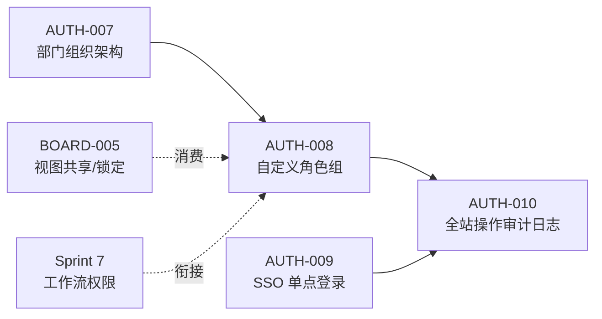
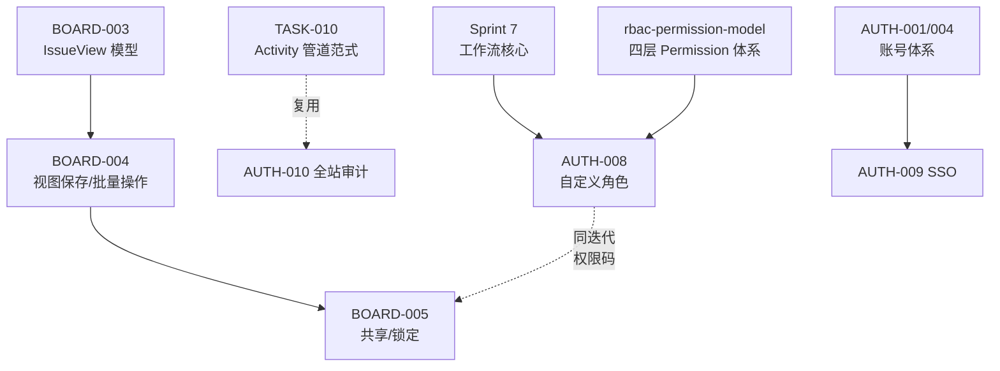

# Sprint 8 — 企业组织权限治理 迭代概览

| 元信息项 | 内容 |
| --- | --- |
| 所属迭代 | Sprint 8 — 企业组织权限治理（第 11 周） |
| 优先级 | P3（企业版核心级） |
| 覆盖模块 | M1-AUTH 账号与权限（组织/角色/SSO/审计）｜M5-BOARD 看板视图（共享/锁定/多维分组）（模块码以 `dependency-graph.md` §2 为准） |
| 文档状态 | R1 修复完成（FAIL → 待复评） |
| 最后更新日期 | 2026-09-05 |
| 上游依赖 | Sprint 7（工作流权限语义与 `workflow.manage` 体系）、标准版全量 |
| 下游消费 | Sprint 9（企业版 V1.0 交付）、AUTH-011/012（P4 身份联动与多租户） |
| 迭代周期 | 5 个工作日，固定预留 20% 缓冲 |

---

## 1. 迭代目标

把「一套系统的权限」升级为「一个组织的治理」：部门层级组织架构、自定义角色组与细粒度资源权限、SSO 单点登录、全站操作审计日志、看板视图团队共享与锁定。五项能力共同回答企业的三个治理问题——**谁在组织里（架构）、谁能做什么（角色）、做过什么（审计）**。

核心结果：

1. **组织架构**：Workspace 内部门树（深度 ≤6）+ 岗位；成员归属部门；按部门批量授权与统计入口。
2. **自定义角色**：在四固定项目角色之上，组织可自定义角色组（权限码集合），成员可挂多角色（权限并集）。
3. **SSO**：SAML 2.0 / OIDC 两种协议的 IdP 对接，JIT 账号开通（按部门/角色映射），密码登录可禁用。
4. **全站审计**：登录/权限变更/导出/删除/审批等敏感操作全留痕，检索与导出（CSV）；审批域事件经 `WF-006`（审批留痕与合规溯源）`approval.audit` 总线汇入。
5. **共享视图**：看板/列表视图团队共享，管理员可锁定组织标准视图；多维分组看板消费。

## 2. 范围与边界

| 范围 | 本迭代交付 | 明确不做 |
| --- | --- | --- |
| 组织架构 | 部门树/岗位/成员归属/按部门授权与统计 | 集团-子公司多工作空间治理（P4） |
| 自定义角色 | 角色组 CRUD、权限码矩阵分配、多角色并集 | 资源实例级 ACL（单条任务专属授权，P4） |
| SSO | SAML 2.0 + OIDC、JIT 开通、属性映射、强制 SSO 开关 | LDAP/SCIM 同步（P4 `AUTH-011`） |
| 审计 | 全站敏感操作留痕、检索、CSV 导出 | 告警规则与合规留存（P4） |
| 共享视图 | shared 视图、管理员锁定、多维分组看板 | 跨项目全局视图（P4） |

## 3. 前置依赖

> 注一（模块码与编号映射）：模块码以 [`docs/architecture/dependency-graph.md`](../architecture/dependency-graph.md) §2 为唯一事实——本迭代覆盖 **M1-AUTH（账号与权限）** 与 **M5-BOARD（看板视图）**。编号-标题映射以 [`docs/README.md`](../README.md) §4 为准：`AUTH-009` = SSO 单点登录（SAML 2.0 / OIDC）、`AUTH-010` = 全站操作审计日志；`WF-002` 审批流、`WF-003` 自动化规则引擎、`WF-004` 流转守卫与字段锁定、`WF-005` 工作流模板库与全局下发、`WF-006` 审批留痕与合规溯源。`dependency-graph.md` §1.3 的 AUTH-009/010 两行互换（dg：`AUTH-009`=全量操作审计日志、`AUTH-010`=SSO 单点登录），且其 M11-WF 台账 `WF-002~006` 编号-标题相对 README §4 整体错位一档（dg：`WF-002`=可视化工作流画布编辑器、`WF-003`=流转条件校验与字段锁定、`WF-004`=审批流、`WF-005`=自动化规则引擎、`WF-006`=工作流模板库与全局下发）——本文引用 dg 依赖边时一律按 README §4 编号换算，**架构文档待回改**。

> 注二（BOARD-005 依赖边）：`BOARD-005` 的直接前置 = `BOARD-004`（视图保存/批量操作管线）+ `AUTH-008`（`board.lock`/`view.manage` 等权限码来源扩展，dependency-graph §4.7）；`BOARD-003` 为经 `BOARD-004` 的传递前置（`IssueView` 模型与 `access`/`is_locked`/`sub_group_by` 三列 P2 建列）——上图按 `BOARD-003 → BOARD-004 → BOARD-005` 链绘制，不画 `BOARD-003 → BOARD-005` 直连边。另，`AUTH-007/008 → AUTH-009` 亦存在依赖边（AUTH-009 元信息表上游依赖与 dg §4.2 按注一编号换算后有此二边），上图为简化未画。

进入前必须满足：工作流权限码全集冻结（Sprint 7）；`rbac-permission-model.md` 权限码注册表 CI 校验就绪；`IssueView` 的 `access`（personal/shared 枚举）、`is_locked`、`sub_group_by` 三列 P2 已建（`BOARD-003`，建好未开放）——**`is_locked` 列 P2 已建、本迭代开放使用**，零迁移放开。

## 4. P3 模块覆盖

| 文档 | 交付重点 | 关键数据结构 | 直接下游 |
| --- | --- | --- | --- |
| `AUTH-007` | 部门树/岗位/归属/按部门授权 | `Department`（path 物化路径）/成员归属 | AUTH-008 批量授权 |
| `AUTH-008` | 自定义角色组与细粒度权限 | `CustomRole`+`project_role_assignment`（42 码并集解析） | 全模块权限判定 |
| `AUTH-009` | SSO（SAML/OIDC）+ JIT | `IdentityProvider`/`SSOAccount` | AUTH-011（P4） |
| `AUTH-010` | 全站审计日志与检索导出 | `AuditLog`（月分区+hash 链） | P4 合规 |
| `BOARD-005` | 视图共享/锁定/多维分组 | `IssueView` 增量（`is_locked` P2 建列放开、新增 `is_project_default`/`locked_by`/`locked_at`）+`UserViewPreference` 订阅表 | P4 全局视图 |

## 5. 统一工程约束

| 类别 | 约束 |
| --- | --- |
| 兼容 | 不配置部门/角色/SSO 时行为与既有完全一致；固定角色不可删（自定义并存） |
| 判定 | 自定义角色进入四层 Permission 体系：角色解析 = 固定角色 ∪ 自定义角色并集 |
| SSO | 密码禁用后本地密码失效、可解绑恢复；SSO 故障有实例级逃生通道 |
| 审计 | AuditLog 只增不可改；导出需 `audit.read` 且本身被审计；留存默认 180 天 |
| 性能 | 角色解析缓存后单请求判定 < 1ms；审计写入异步（复用幂等管道范式） |
| 权限 | 组织治理操作 WS_ADMIN+；审计导出双授权 |

## 6. 验收标准

- [ ] 5 份规格均含七章结构与全部详尽要素。
- [ ] 部门树建至 4 层挂 20 成员：按部门批量授权一次生效；统计按部门聚合正确。
- [ ] 自定义「测试工程师」角色（任务读写+流转+评论，不含删除/归档，同 `AUTH-008` §7.2 验收第 1 条）：挂接成员的可见与可操作面精确符合；与固定角色并存判定正确。
- [ ] OIDC 对接演示 IdP：JIT 开通→登录→部门/角色映射；强制 SSO 后密码登录被拒。
- [ ] SAML 2.0 对接演示 IdP（与 OIDC 同一口径）：向导配置→测试连接干跑→启用；JIT 开通与部门/角色映射生效；强制 SSO 后密码登录被拒、逃生名单账号可登录。
- [ ] 审计检索「最近 7 天的权限变更」P95 < 300ms；CSV 导出本身入审计。
- [ ] 管理员锁定共享视图：成员不可修改删除（另存副本可改）；设为项目默认后新成员加入自动订阅可见。
- [ ] 配置「状态 × 负责人」二维分组看板：交叉格渲染正确、组内计数与逐格列表对账一致；维度停用自动降级一维不报错。
- [ ] 全部新端点通过 `api-conventions.md` §14 检查清单。

## 7. 文档清单

| 序号 | 文件 | 一级标题 |
| --- | --- | --- |
| 1 | `AUTH-007-org-structure.md` | 部门层级组织架构 |
| 2 | `AUTH-008-custom-roles.md` | 自定义角色组与细粒度资源权限 |
| 3 | `AUTH-009-sso.md` | SSO 单点登录（SAML 2.0 / OIDC） |
| 4 | `AUTH-010-audit-log-full.md` | 全站操作审计日志 |
| 5 | `BOARD-005-shared-views.md` | 视图团队共享 / 管理员锁定 / 多维分组 |

## 8. 排期

| 工作日 | 主线 A（组织与角色） | 主线 B（身份与审计） | 当日验收 |
| --- | --- | --- | --- |
| Day 1 | `AUTH-007` 部门树与归属 | `AUTH-009` IdP 模型与 OIDC/SAML 协议流 | 部门 CRUD；OIDC 登录通 |
| Day 2 | `AUTH-007` 按部门授权 | `AUTH-009` JIT 映射与强制开关 | 批量授权生效 |
| Day 3 | `AUTH-008` 角色组与权限矩阵 | `AUTH-010` 审计管道与检索 | 角色判定正确 |
| Day 4 | `BOARD-005` 共享锁定 + 多维分组 | `AUTH-010` 导出与留存 | 锁定生效；泳道分组计数对账；导出被审计 |
| Day 5 | 回归（固定角色不受影响） | 压测、缓冲 | 迭代验收清单全过 |

## 9. 技术风险与应对

| # | 风险 | 影响 | 概率 | 应对措施 | 责任文档 |
| --- | --- | --- | --- | --- | --- |
| 1 | **SSO 协议兼容性**：SAML 2.0 / OIDC 双协议在真实企业 IdP（ADFS/Okta/Auth0 等）间的元数据格式、证书算法、时钟偏移、属性命名差异大——容器化演示 IdP 通过不等于企业环境可用；强制 SSO 误开启还可能把全员锁在门外 | 高：企业登录主入口不可用属 P0 级事故 | 中 | ① 容器化 Keycloak 双协议夹具覆盖 UT/IT/E2E（`AUTH-009` §7.1）；② 「测试连接干跑通过才可启用」硬门槛（`AUTH-009` §7.2.1）；③ 验签/时效/nonce/state 篡改用例 + 对外统一文案、细节仅服务端日志（§7.2.5）；④ 证书临期 14 天配置页横幅 + WS_OWNER 通知（§7.2.6）；⑤ 强制 SSO 前置校验 + 逃生名单账号 + 实例级逃生通道（本文档 §5、`AUTH-009` §2） | `AUTH-009` §2 / §5 / §7、本文档 §5 |
| 2 | **权限并集判定回归**：自定义角色并入四层 Permission 体系（固定角色 ∪ 自定义角色）改变了既有判定路径——未配置自定义角色的标准版项目若行为漂移即失守「零差异」承诺；缓存失效不及时则权限变更不同步甚至越权 | 极高：误放行即越权、误拦截即阻断日常操作 | 中 | ① `custom_codes=[]` 时行为与标准版完全一致（`AUTH-008` §7.2.2）设为回归门禁；② `effective_codes()` 单一判定入口 + 缓存失效可观测（角色更新下一次操作即时生效）；③ Redis 停用回源 DB 判定仍正确（`AUTH-008` §7.2.3）；④ GUEST 越界挂接预检（`AUTH-008` BR-16）；⑤ 判定 < 1ms 性能门禁（本文档 §5） | `AUTH-008` §2 / §4 / §7、`rbac-permission-model.md` §8 |
| 3 | **审计写入性能与管道可靠性**：全站敏感操作埋点若同步落库会拖慢主链路；audit worker 故障、DLQ 堆积或去重失效会造成审计缺条/重复——审计缺条即合规事故 | 高：缺条不可补、重复不可信，且可能拖垮全站写路径 | 中 | ① 写入全异步：复用 `TASK-010` 幂等管道范式（落库为幂等锚 + 三层去重 + 显式 DLX 死信与重放，`AUTH-010` §7.1）；② 幂等压测（同事件重放 100 次仅一行）+ DB/worker 故障注入重放恢复用例（`AUTH-010` §7.2.4）；③ 月分区表 + 每日维护任务（分区/清理/校验）；④ hash 链每日校验，篡改断链即 CRITICAL + 导出冻结（`AUTH-010` §7.2.5） | `AUTH-010` §2 / §4 / §7 |
| 4 | **视图共享/锁定与二维聚合回归**：`BOARD-005` 放开 `BOARD-003` P2 建好的三列（`access`/`is_locked`/`sub_group_by`），存量视图行为若有漂移即破坏标准版体验；二维泳道聚合在百万级任务项目存在超时风险 | 中：看板核心体验倒退、大项目泳道不可用 | 中 | ① 未启用共享/锁定的项目行为与 P2 完全一致（`BOARD-005` §7.2.6）设为回归门禁；② 聚合服务端化（格计数不拉全量卡片）+ 5s 超时降级一维（`meta.degraded`，`BOARD-005` BR-07/异常表）；③ 矩阵端点 P95 < 200ms 压测门禁（QA-001 基准矩阵「分组看板」行同门槛，`BOARD-005` §5.2 IT-10）；④ 锁定态拦截优先于权限码判定 + 四主体越权矩阵参数化（`BOARD-005` BR-02/§5.4） | `BOARD-005` §2 / §4 / §5 / §7 |
| 5 | **跨文档待回改项失收口**：`dependency-graph.md` §1.3 的 AUTH-009/010 互换与 WF-002~006 编号错位、`BOARD-005` 文首登记的 4 条上游误标（`BOARD-003` help_text、`TASK-011` P3 误标等）——本轮按裁决只登记不回改，若登记不全或回改无排期，架构漂移面持续扩大 | 中：后续迭代按错编号引用返工、评审反复扣分 | 高 | ① 按评审裁决 A：冲突一律先在本迭代文档内登记「架构文档待回改」再继续（本文档 §3 注一/注二、`BOARD-005` 文首待回改登记 4 条）；② §10.3 将「登记完整 + 回改排期明确」设为迭代退出可判定项；③ 新增权限码收敛于 AUTH-009 单点（`workspace.sso.manage` 与 `PERM_SSO_REQUIRED` 均按附录 B 登记、§8.8 `SSO_LOGIN_URL` 等子码待补登，AUTH-009 附录 B 登记完成即视为收口），其余 4 份文档零新增、均消费 rbac §8.1/§8.2 既有注册码，联动回改面仍收窄 | 本文档 §3 / §10、`BOARD-005` 文首、`docs/adr/` |

---

## 10. 迭代退出条件

同时满足以下四项，Sprint 8 方可关闭并进入 Sprint 9 企业项目 / 报表 / Wiki：

1. **功能验收**：§6 验收清单九条逐项绿——5 份规格均含七章结构与全部详尽要素；部门树 4 层 20 成员按部门批量授权与统计；自定义角色并集判定与固定角色并存精确；OIDC 与 SAML 2.0 双协议各对接演示 IdP 一遍（JIT 映射 + 强制 SSO 开关 + 逃生名单）；审计检索/CSV 导出/留存/防篡改闭环；共享锁定与项目默认订阅；二维分组看板渲染与计数对账；全部新端点通过 `api-conventions.md` §14 检查清单。
2. **工程质量**：CI 全绿——标准版行为回归（未配置部门/角色/SSO/共享锁定时行为与既有完全一致：`AUTH-008` §7.2.2 与 `BOARD-005` §7.2.6 双门禁）、性能门禁（角色判定 < 1ms、审计检索 P95 < 300ms、审计写入异步不阻塞主链路、二维矩阵端点 P95 < 200ms，本文档 §5）、四主体越权矩阵参数化全过（范式 `AUTH-006` §5.2）、P0/P1 缺陷 0 开放。
3. **文档同步（含架构偏离登记回改）**：本迭代 5 份功能文档状态全部标为「已实现」；`dependency-graph.md` §1.3 编号错位（AUTH-009/010 互换、WF-002~006 错一档）与 `BOARD-005` 文首登记的 4 条上游误标均已完成「架构文档待回改」登记并排入回改计划，未登记视为未收口；除 AUTH-009 按附录 B 登记的 `workspace.sso.manage` 与 `PERM_SSO_REQUIRED`（另附 §8.8 `SSO_LOGIN_URL`/`SSO_TXN_INVALID`/`TEST_REQUIRED`/`OWNER_BINDING_REQUIRED` 子码补登）外，其余 4 份文档零新增权限码、均消费 `rbac-permission-model.md` §8.1/§8.2 既有注册码；AUTH-009 附录 B 登记完成即视为收口，经复核确认。
4. **UI parity（ADR-0010，第四门禁）**：本迭代新增 UI 表面——组织管理页（树 + 批量授权弹窗 + 成员部门/岗位列）、角色管理页与权限矩阵编辑器与我的权限面板、SSO 配置向导与登录页邮箱路由与认领页、审计日志页（筛选/虚拟表/详情抽屉/导出对话框）、共享/锁定对话框与锁定横幅与副本引导、泳道二维分组看板——全部入 `docs/sprint-0-poc/test-cases.md` 附录 C 清单并逐行标注来源（文档 §3.x），`tests/e2e/parity.spec.ts` 补对应字段级断言全绿；条件态/禁用态/空态/加载态/降级态逐类过。附录 C 清单行由 5 份功能文档各自修复轮补齐，本概览登记占位。

---

## 11. 相关文档

- 前置迭代：[`docs/sprint-7-enterprise-workflow/sprint-overview.md`](../sprint-7-enterprise-workflow/sprint-overview.md)
- 原始需求：[`docs/需求文档.md`](../需求文档.md) §3.1 企业版专属节 / §8.2 P3 列
- 下一迭代：`docs/sprint-9-enterprise-portfolio/sprint-overview.md`（Sprint 9 — 企业项目/报表/Wiki）
