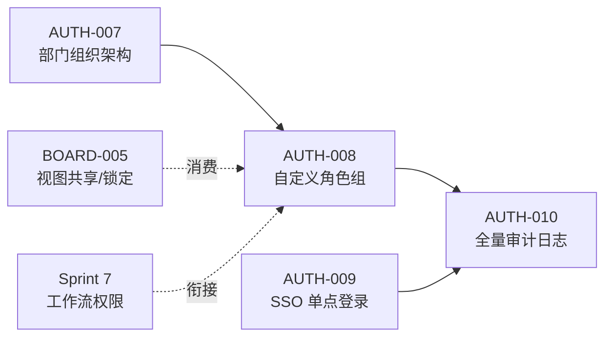
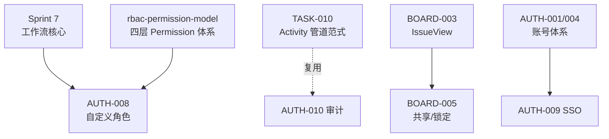

# Sprint 8 — 企业组织权限治理 迭代概览

| 元信息项 | 内容 |
| --- | --- |
| 所属迭代 | Sprint 8 — 企业组织权限治理（第 11 周） |
| 优先级 | P3（企业版核心级） |
| 覆盖模块 | M1-AUTH 账号与权限（组织/角色/SSO/审计）｜M3-BOARD 看板（共享视图） |
| 文档状态 | 待评审（Draft） |
| 最后更新日期 | 2026-09-01 |
| 上游依赖 | Sprint 7（工作流权限语义与 `workflow.manage` 体系）、标准版全量 |
| 下游消费 | Sprint 9（企业版 V1.0 交付）、AUTH-011/012（P4 身份联动与多租户） |
| 迭代周期 | 5 个工作日，固定预留 20% 缓冲 |

---

## 1. 迭代目标

把「一套系统的权限」升级为「一个组织的治理」：部门层级组织架构、自定义角色组与细粒度资源权限、SSO 单点登录、全站操作审计日志、看板视图团队共享与锁定。五项能力共同回答企业的三个治理问题——**谁在组织里（架构）、谁能做什么（角色）、做过什么（审计）**。

核心结果：

1. **组织架构**：Workspace 内部门树（深度 ≤6）+ 岗位；成员归属部门；按部门批量授权与统计入口。
2. **自定义角色**：在四固定项目角色之上，组织可自定义角色组（权限码集合），成员可挂多角色（权限并集）。
3. **SSO**：SAML 2.0 / OIDC 两种协议的 IdP 对接，JIT 账号开通（按部门/角色映射），密码登录可禁用。
4. **全站审计**：登录/权限变更/导出/删除/审批等敏感操作全留痕，检索与导出（CSV），对接 `WF-006` 审批记录。
5. **共享视图**：看板/列表视图团队共享，管理员可锁定组织标准视图；多维分组看板消费。

## 2. 范围与边界

| 范围 | 本迭代交付 | 明确不做 |
| --- | --- | --- |
| 组织架构 | 部门树/岗位/成员归属/按部门授权与统计 | 集团-子公司多工作空间治理（P4） |
| 自定义角色 | 角色组 CRUD、权限码矩阵分配、多角色并集 | 资源实例级 ACL（单条任务专属授权，P4） |
| SSO | SAML 2.0 + OIDC、JIT 开通、属性映射、强制 SSO 开关 | LDAP/SCIM 同步（P4 `AUTH-011`） |
| 审计 | 全站敏感操作留痕、检索、CSV 导出 | 告警规则与合规留存（P4） |
| 共享视图 | shared 视图、管理员锁定、多维分组看板 | 跨项目全局视图（P4） |

## 3. 前置依赖

进入前必须满足：工作流权限码全集冻结（Sprint 7）；`rbac-permission-model.md` 权限码注册表 CI 校验就绪；`IssueView.access`（personal/shared 枚举 P2 已有）可扩展 `is_locked`。

## 4. P3 模块覆盖

| 文档 | 交付重点 | 关键数据结构 | 直接下游 |
| --- | --- | --- | --- |
| `AUTH-007` | 部门树/岗位/归属/按部门授权 | `Department`（self 树）/成员归属 | AUTH-008 批量授权 |
| `AUTH-008` | 自定义角色组与细粒度权限 | `CustomRole`（权限码集合） | 全模块权限判定 |
| `AUTH-009` | SSO（SAML/OIDC）+ JIT | `IdentityProvider`/`SSOAccount` | AUTH-011（P4） |
| `AUTH-010` | 全站审计日志与检索导出 | `AuditLog` | P4 合规 |
| `BOARD-005` | 视图共享/锁定/多维分组 | `IssueView.is_locked` + 分组维度 | P4 全局视图 |

## 5. 统一工程约束

| 类别 | 约束 |
| --- | --- |
| 兼容 | 不配置部门/角色/SSO 时行为与既有完全一致；固定角色不可删（自定义并存） |
| 判定 | 自定义角色进入四层 Permission 体系：角色解析 = 固定角色 ∪ 自定义角色并集 |
| SSO | 密码禁用后本地密码失效、可解绑恢复；SSO 故障有实例级逃生通道 |
| 审计 | AuditLog 只增不可改；导出需 `audit.read` 且本身被审计；留存默认 180 天 |
| 性能 | 角色解析缓存后单请求判定 < 1ms；审计写入异步（复用幂等管道范式） |
| 权限 | 组织治理操作 WS_ADMIN+；审计导出双授权 |

## 6. 验收标准

- [ ] 5 份规格均含七章结构与全部详尽要素。
- [ ] 部门树建至 4 层挂 20 成员：按部门批量授权一次生效；统计按部门聚合正确。
- [ ] 自定义「测试工程师」角色（任务读+评论+流转）：挂接成员的可见与可操作面精确符合；与固定角色并存判定正确。
- [ ] OIDC 对接演示 IdP：JIT 开通→登录→部门/角色映射；强制 SSO 后密码登录被拒。
- [ ] 审计检索「最近 7 天的权限变更」秒级返回；CSV 导出本身入审计。
- [ ] 管理员锁定共享视图：成员不可修改删除；组织标准视图新成员默认可见。
- [ ] 全部新端点通过 `api-conventions.md` §14 检查清单。

## 7. 文档清单

| 序号 | 文件 | 一级标题 |
| --- | --- | --- |
| 1 | `AUTH-007-org-structure.md` | 部门层级组织架构 |
| 2 | `AUTH-008-custom-roles.md` | 自定义角色组与细粒度资源权限 |
| 3 | `AUTH-009-sso.md` | SSO 单点登录（SAML 2.0 / OIDC） |
| 4 | `AUTH-010-audit-log-full.md` | 全站操作审计日志 |
| 5 | `BOARD-005-shared-views.md` | 视图团队共享 / 管理员锁定 / 多维分组 |

## 8. 排期

| 工作日 | 主线 A（组织与角色） | 主线 B（身份与审计） | 当日验收 |
| --- | --- | --- | --- |
| Day 1 | `AUTH-007` 部门树与归属 | `AUTH-009` IdP 模型与 OIDC 流 | 部门 CRUD；OIDC 登录通 |
| Day 2 | `AUTH-007` 按部门授权 | `AUTH-009` JIT 映射与强制开关 | 批量授权生效 |
| Day 3 | `AUTH-008` 角色组与权限矩阵 | `AUTH-010` 审计管道与检索 | 角色判定正确 |
| Day 4 | `BOARD-005` 共享锁定 | `AUTH-010` 导出与留存 | 锁定生效；导出被审计 |
| Day 5 | 回归（固定角色不受影响） | 压测、缓冲 | 迭代验收清单全过 |

## 9. 相关文档

- 前置迭代：[`docs/sprint-7-enterprise-workflow/sprint-overview.md`](../sprint-7-enterprise-workflow/sprint-overview.md)
- 原始需求：[`docs/需求文档.md`](../需求文档.md) §3.1 企业版专属节 / §8.2 P3 列
- 下一迭代：`docs/sprint-9-enterprise-portfolio/sprint-overview.md`（Sprint 9 — 企业项目/报表/Wiki）
