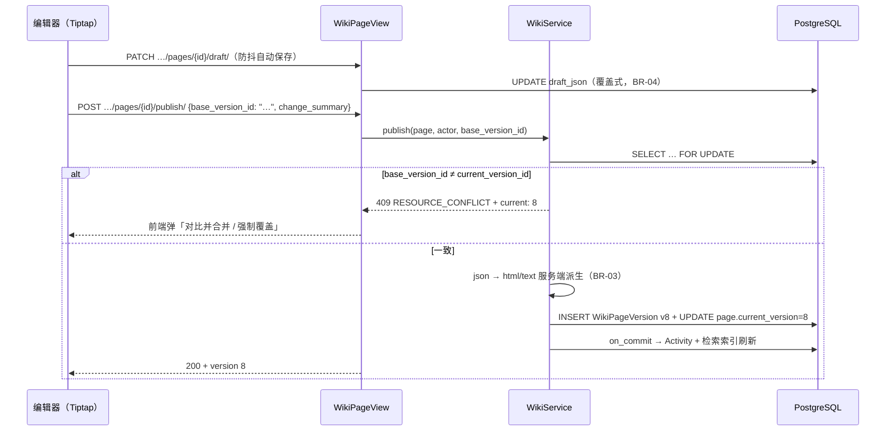
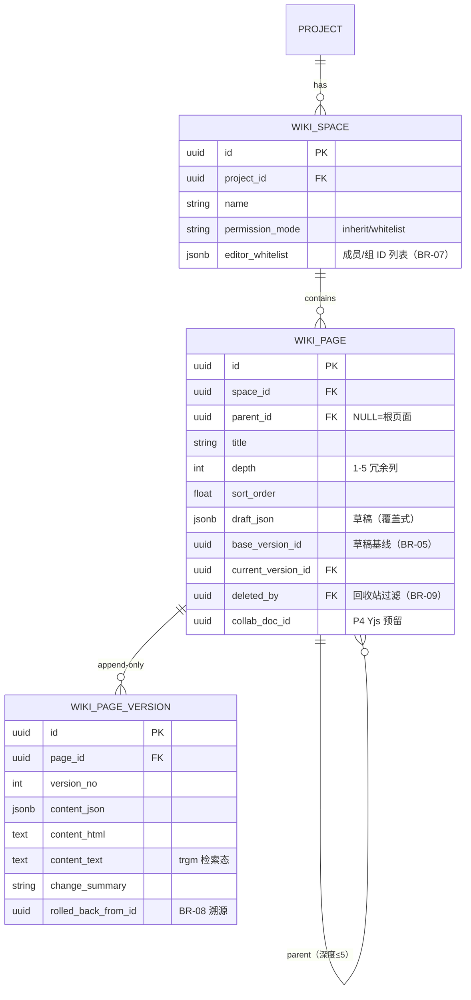

# 项目 Wiki 与全局知识检索

| 元信息项 | 内容 |
| --- | --- |
| 文档编号 | FILE-005 |
| 所属迭代 | Sprint 9 — 企业项目/报表/Wiki（第 12 周） |
| 模块 | M7-FILE 文件与知识 |
| 优先级 | P3（企业版核心 · 企业版 V1.0 组成部分） |
| 工作量估算 | 后端 3.5 人日（页面树 1 + 版本 1 + 检索 1 + 权限 0.5）｜前端 4.0 人日（编辑器集成 1.5 + 树导航 1 + 版本对比 1 + 检索 0.5）｜测试 2.0 人日（合计 9.5 人日，为后端/前端/测试三角色投入总量；sprint-overview §8 主线 B 的 Day 1-2 为并行窗口折算口径——若按单人串行人日排期需扩窗口，**sprint-overview §8 排期待回改**） |
| 关联架构文档 | [`unified-issue-model.md`](../architecture/unified-issue-model.md)（Issue 描述三格式范式：`description`/`description_html`/`description_stripped`——Wiki 页面内容直接复用）、[`api-conventions.md`](../architecture/api-conventions.md)、[`tech-stack.md`](../architecture/tech-stack.md)（TipTap 自研编辑器包）、[`dependency-graph.md`](../architecture/dependency-graph.md) §4.9、[`rbac-permission-model.md`](../architecture/rbac-permission-model.md) §8.1/§11.4（rbac 待回改：其 §11.4 Wiki 文档编号「FILE-007」应为 FILE-005） |
| 上游依赖 | `FILE-004`（文件分享链接与权限管控——Wiki 权限委托项目权限）；`AUTH-008`（自定义角色组与细粒度资源权限）；`COLLAB-004`（WebSocket 实时推送——协同编辑依赖实时服务）——三者以 [`dependency-graph.md`](../architecture/dependency-graph.md) §4.9 为准；范式引用：`FILE-002`（回收站与三态单入口）、`FILE-003`（版本台账）、`TASK-010`（Activity 管道） |
| 下游消费 | P4 全局知识库（跨项目 Wiki——p4 概览待回改登记）、P4 实时协同（Yjs 评估——本文档预留 `collab_doc_id` 列；p4 概览待回改登记）、`AI-001`（知识摘要数据源） |
| 文档状态 | 待评审（Draft） |
| 最后更新日期 | 2026-09-05（R2 修复：MAJOR-1 BR-06 inherit 映射改 VIEWER/COMMENTER→viewer、CONTRIBUTOR→editor、ADMIN→manager——对齐 rbac §11.4「wiki.update ← issue.update」与 rbac §8.2 写入门槛，UT-09/IT-03/BR-07/错误矩阵同步；MAJOR-2 §4.4 检索 SQL 权限过滤补 WS 管理员隐式 PROJ_ADMIN EXISTS 分支（rbac §7.4，对齐 FILE-002 §4.3.1），新增 UT-14/IT-09 主体覆盖用例并同步 §7.1；MINOR-3 COLLAB-002 引用锚点 §1.2→§1.5 两处；MINOR-4 IT-04 删未声明的 `ordering` 断言；MINOR-5 深度超限子码改 `DEPTH`（api-conventions §8.8）；INFO：§1.3 显式排除模板市场/文档模板、BR-09 登记「无手动彻底删除」并消歧措辞、Wiki 插件集清单三处统一、BR-14 强制层补 Service 级联联动、§2.1 检索节点 P4→PAGE_4 消歧、无编辑权限发布改 `PERM_ROLE_INSUFFICIENT`、恢复示例②对齐①锚点、下游 p4 概览与 rbac §11.4 编号漂移登记待回改。R3 复评 PASS（10×5）后随手收口：UT-14/IT-09 非工作空间成员断言明确 403 `PERM_NOT_WORKSPACE_MEMBER`、移动成环子码 `INVALID`→`CYCLE`、三格式字段名对齐 unified-issue-model（description/description_html/description_stripped）、BR-10 补 §11.4 委托口径消歧） |

---

## 1. 概述

### 1.1 背景

任务与文件库承载「执行过程」，Wiki 承载「沉淀知识」：架构决策记录（ADR）、上线手册、新人指南、复盘文档。企业版客户把「项目知识不随人员流动而流失」列为采购关键理由——Wiki 是企业版 V1.0 的最后一块内容拼图。

技术基座全部就绪，本文档是**组合式交付**而非全新发明：编辑器 = Tiptap 自研编辑器包（tech-stack 既有基座，任务描述 `description_json` 同源，**COLLAB-002 未交付编辑器内核**——其交付为楼中楼回复/表情 Reaction/图片评论，评论级表格与代码高亮在其 §1.5 范围边界明确列为 P3 编辑器增强）、内容三格式 = Issue 描述范式、版本 = FILE-003 追加式台账思想、权限 = FILE-002 三态单入口范式、检索 = trgm 既有索引方案。

### 1.2 目标

1. **Wiki 空间与页面树**：项目可开多个 Wiki 空间（如「研发规范」「运维手册」），空间内页面树深度 ≤5；页面拖拽移动、排序。
2. **富文本编辑**：Tiptap 自研编辑器包（与任务描述同一内核基座，`description_json` 同源三格式），本迭代 Wiki 插件集（heading/表格/代码块/页面内链接/任务 mention/目录大纲——本文档统一清单）在编辑器包 extension 体系上扩展交付；三格式存储（JSON 编辑态 + HTML 渲染态 + 剥离文本检索态）。
3. **版本与回溯**：每次发布产生 `WikiPageVersion`（追加式台账），版本对比（HTML diff）与一键回滚（回滚 = 复制旧版生成新版本，历史不丢）。
4. **权限分级**：空间级三态（查看/编辑/管理），默认继承项目角色，可对空间单独收窄。
5. **全局知识检索**：工作空间级搜索（标题 + 剥离文本，trgm 索引），按空间/项目过滤，权限过滤后返回。

### 1.3 范围与边界

| 范围 | 本文档交付 | 明确不做（归属） |
| --- | --- | --- |
| 页面树 | 空间/页面 CRUD、移动、排序、深度 ≤5 | 跨空间移动（P4）、页面级单独权限（P4） |
| 编辑 | Tiptap 三格式、自动保存草稿、发布 | **多人实时协同**（Yjs/Hocuspocus，P4 评估——`collab_doc_id` 列预留）；**页面评论与段落/线框锚定评论**（P4——锚点数据结构与定位协议本迭代不定义、不承诺，见 §3.1 线框标注）；**模板市场/文档模板**（sprint-overview §2 硬性范围基线显式排除，不作为验收项） |
| 版本 | 发布版台账、diff 对比、回滚 | 草稿多版本（草稿仅一份，覆盖式） |
| 检索 | 标题+正文 trgm、空间/项目过滤、权限过滤 | 附件内容全文检索（P4）、语义检索（P4 `AI-001`） |
| 权限 | 空间三态 + 项目角色继承 | 页面级 ACL（P4） |

### 1.4 术语表

| 术语 | 定义 |
| --- | --- |
| Wiki 空间 | 项目内的知识分区（`WikiSpace`），权限载体 |
| 页面树 | 空间内 `WikiPage` 自引用树，深度 ≤5 |
| 三格式 | `content_json`（Tiptap JSON，编辑源）/ `content_html`（渲染）/ `content_text`（剥离纯文本，检索） |
| 发布 | 草稿 → 新 `WikiPageVersion` 落台账并更新页面当前指针 |
| 回滚 | 以历史版本内容生成**新版本**（台账只增，BR-08） |

### 1.5 前置依赖

> 迭代依赖边以 [`dependency-graph.md`](../architecture/dependency-graph.md) §4.9 为准：`FILE-004` / `AUTH-008` / `COLLAB-004`（见元信息表上游依赖）；下表为本文落地的范式级前置。

| 依赖 | 内容 | 阻塞原因 |
| --- | --- | --- |
| 自研 Tiptap 编辑器包（tech-stack §2「前端技术栈」TipTap 2.14.x 行） | 富文本内核与 ProseMirror schema（extension 体系含 heading/表格/代码块能力） | 编辑器基座零新内核；Wiki 插件集（heading/表格/代码块/页面内链接/任务 mention/目录大纲——§1.2 统一清单）为本迭代在包上新增扩展——**COLLAB-002 不含这些扩展**（其 §1.5 范围边界将评论级 Markdown 表格/代码高亮列为 P3 编辑器增强，交付为楼中楼回复/表情/图片评论） |
| `FILE-003` | 追加式版本台账 + 零拷贝回滚范式 | `WikiPageVersion` 直接对齐 |
| `FILE-002` | 权限三态与 `can_view_file` 单入口；回收站 30 天 + 期满清理 beat 范式 | `can_view_wiki` 同构实现；回收站/恢复端点与 `purge_deleted_wiki_pages` 对齐其范式 |
| `TASK-010` | Activity 管道 | 页面操作留痕 |
| 架构 trgm 索引方案 | `pg_trgm` 标题/文本检索 | 检索零新组件 |

### 1.6 竞品参考

| 竞品 | 参考点 | 处置 |
| --- | --- | --- |
| Confluence | 空间 → 页面树、版本历史与对比、空间权限 | 三件套语义全对齐；**页面级权限不学**（管理复杂度高，P4 再评估） |
| Notion | 块编辑器、层级页面 | 编辑器交互参考（斜杠菜单）；块模型不迁（Tiptap schema 已冻结） |
| Plane | Pages（单层级页面 + 简单富文本） | 我方页面树 + 版本台账为其超集 |

---

## 2. 业务逻辑

### 2.1 总体结构


### 2.2 业务规则（BR）

| 编号 | 规则 | 强制层 | 违约响应 |
| --- | --- | --- | --- |
| BR-01 | 页面树深度 ≤5；移动前环检测（同 TASK-004 `_is_descendant` CTE 范式） | Service + CTE | `409 RESOURCE_LIMIT_EXCEEDED`（深度超限）/ `409 RESOURCE_CIRCULAR_DEPENDENCY`（成环） |
| BR-02 | 同级页面标题唯一（同空间同父） | DB 部分唯一约束 | `409 RESOURCE_ALREADY_EXISTS` |
| BR-03 | 三格式一致性：发布时由服务端从 `content_json` 派生 `content_html`/`content_text`（不接受客户端传 HTML——防 XSS 与格式分裂，与 Issue 描述同一管线） | Service | `400 VALIDATION_ERROR` |
| BR-04 | 草稿单份覆盖式：自动保存（防抖 5s）写 `draft_json`；发布才落版本台账 | Service | — |
| BR-05 | 编辑冲突：草稿携带 `base_version`；若他人已发布更新版本，发布时返回 `409 RESOURCE_CONFLICT` + 服务端当前版本号，前端提供「对比并合并/覆盖」 | Service（乐观锁） | 409 |
| BR-06 | 空间权限三态：`viewer`（只读）/ `editor`（可编辑发布）/ `manager`（空间设置+删除）；默认 `inherit` = 按项目角色映射（VIEWER/COMMENTER→viewer，CONTRIBUTOR→editor，ADMIN→manager）。三态对齐 rbac §8.1 注册码：viewer=`wiki.read`、editor=`wiki.update`、manager=`wiki.manage`（映射规则见 rbac §11.4「`wiki.update ← issue.update` 同等写入门槛」——rbac §8.2 中 `issue.update` 仅 PROJ_ADMIN/PROJ_CONTRIBUTOR，COMMENTER 映射 editor 会把 Wiki 写入门槛降到任务写入门槛之下，故 COMMENTER 只读；**不新增权限码**。rbac 待回改：该节「FILE-007」应为 FILE-005） | Permission 单入口 `can_view_wiki` | `403 PERM_ROLE_INSUFFICIENT`（api-conventions §8.3） |
| BR-07 | 空间收窄：可对空间指定「仅指定成员/组可编辑」（白名单），不可超过项目角色上限（VIEWER/COMMENTER 不可被提为 editor） | Permission | `400 VALIDATION_ERROR` |
| BR-08 | 版本台账只增：回滚 = 以目标历史版本内容创建新版本（`rolled_back_from` 记录溯源）；任何版本不可改不可删 | Service + DB | — |
| BR-09 | 页面删除 = 软删除进回收站 30 天（承 FILE-002 回收站范式），软删记录 `deleted_by`；含子页面时整树一并进入/恢复（回收站列表仅列删除根）；期满由 beat 任务 `purge_deleted_wiki_pages` 每日 02:30 对到期回收站项执行整树物理删除（与 FILE-002 `purge_deleted_assets` 同范式调度；Wiki 无对象存储引用，行级硬删即可）。本迭代**不提供手动「彻底删除」端点**——回收站唯一出口为 purge beat（FILE-002 #13 手动 purge 范式仅 ADMIN 开放，本迭代不引入，减少误删面） | Service + Celery | — |
| BR-10 | 检索权限过滤：结果仅含请求者 `can_view_wiki` 的空间页面（SQL 前置过滤，不做事后过滤防计数泄露）；WS_OWNER/WS_ADMIN 非项目成员隐式视为 PROJ_ADMIN 可检索（rbac §7.4 绕过分支，对齐 FILE-002 §4.3.1 `can_view_file` 的 `has_ws_role(…, min_role=15)`）；rbac §8.1 的 WS_MEMBER `wiki.read` 行以 §11.4「wiki.read ← project.read 委托」口径为准（显式项目成员 ∨ WS≥15），本 BR 即该口径的落地 | 检索服务 | — |
| BR-11 | 检索范围：标题（权重 3x）+ `content_text`；`pg_trgm` GIN 索引；结果高亮片段 ≤160 字（`ts_headline` `MaxWords=80 × MaxFragments=2`，参数对应见 §4.4） | 检索服务 | — |
| BR-12 | 页面提及任务（`#RBT-123`）渲染为任务卡片链接（Tiptap mention 节点，与评论同一组件） | 渲染层 | — |
| BR-13 | 空间/页面操作（建/发布/回滚/删除/移动）全部入 Activity（TASK-010 管道） | Service | — |
| BR-14 | 归档项目 Wiki 只读；项目删除时 Wiki 随项目级联软删（级联软删为写路径行为：挂项目软删信号联动——项目 Service 层软删事务内同步置本模块空间/页面整树软删） | Permission（归档只读）→ Service（级联软删） | `403 PERM_PROJECT_ARCHIVED` |

### 2.3 发布与冲突时序



---

## 3. UI/UX 设计

### 3.1 Wiki 主界面

```
┌──────────────────────────────────────────────────────────────────────────┐
│ Wiki · 电商重构项目                    [研发规范 ▾]  [+ 新建空间]  ⚙ 权限  │
│ ┌──────────────────────┬───────────────────────────────────────────────┐ │
│ │ 页面树                │  API 设计规范                    v8 · 张妍 编辑 │ │
│ │ ───────────────────  │  ────────────────────────────────────────────│ │
│ │ ▾ 编码规范            │  最近发布: 2026-08-30 14:22                   │ │
│ │ ▾ 后端规范            │                                                │ │
│ │   ▸ API 设计   ◀当前  │  ## 3. 错误码约定                             │ │
│ │   ▸ 数据库约定        │                                                │ │
│ │ ▸ 前端规范            │  所有接口错误码必须从注册表选取，               │ │
│ │ ────────────────     │  禁止自创。完整注册表见 #RBT-152 …             │ │
│ │ [+ 新建页面]          │                                                │ │
│ │                      │  ┌────────────────────────────────────────┐   │ │
│ │                      │  │ 💬 页面评论：P4（锚定协议未定义，本迭代 │   │ │
│ │                      │  │    不交付，见 §1.3）                    │   │ │
│ │                      │  └────────────────────────────────────────┘   │ │
│ │                      │                                                │ │
│ │                      │  [编辑]  [历史 v8 ▾]  [··· 移动/删除]          │ │
│ └──────────────────────┴───────────────────────────────────────────────┘ │
└──────────────────────────────────────────────────────────────────────────┘
```

### 3.2 版本历史与对比

```
┌────────────────────────────────────────────────────────────────────────┐
│ 版本历史 · API 设计规范                              [对比模式] [返回]   │
│ ────────────────────────────────────────────────────────────────────── │
│ v8   张妍    08-30 14:22   「补充错误码注册表链接」          [回滚到此版] │
│ v7   李骁    08-22 09:15   「重写限流章节」                   [回滚到此版] │
│ v6   李骁    08-15 18:40   （回滚自 v4）                     [回滚到此版] │
│ ────────────────────────────────────────────────────────────────────── │
│ ▼ 对比 v7 → v8（HTML diff：新增绿底 / 删除红划线）                        │
│   所有接口错误码必须从注册表选取，禁止自创。                              │
│   [+] 完整注册表见 #RBT-152。                                            │
│   [-] 错误码由后端定义。                                                 │
└────────────────────────────────────────────────────────────────────────┘
```

### 3.3 全局知识检索

```
┌────────────────────────────────────────────────────────────────────────┐
│ 🔍 搜索: "错误码"          范围: 全部空间 ▾   项目: 全部 ▾   12 条结果    │
│ ────────────────────────────────────────────────────────────────────── │
│ 📄 API 设计规范 · 研发规范 / 电商重构                                     │
│    …所有接口<em>错误码</em>必须从注册表选取，禁止自创。完整注册表见…        │
│ 📄 上线 checklist · 运维手册 / 电商重构                                   │
│    …确认<em>错误码</em>监控面板无异常峰值后方可放量…                        │
└────────────────────────────────────────────────────────────────────────┘
```

> **口径说明（独立入口）**：本页为 Wiki 专属知识检索页，**仅返回 Wiki 页面命中**，不与任务/项目等其他类型结果混排。⌘K 全局搜索（api-conventions §5.5 `GET /api/v1/workspaces/{slug}/search/?q=&types=issue,project,page,cycle`）的 `types` 枚举不含 wiki 类型，本迭代**不扩枚举**——因知识检索需要 `ts_headline` 高亮片段、标题 3x 权重排序、空间/项目过滤与完整分页，超出 ⌘K「按类型分组、每类限 10 条」的轻量定位能力。（架构文档待回改：如需将 `wiki_page` 纳入 ⌘K 全局搜索 `types` 枚举，另行架构评审登记。）

### 3.4 交互规则

| 交互 | 行为 |
| --- | --- |
| 自动保存 | 编辑停止 5s 落草稿；状态栏「草稿已保存 14:22:31」 |
| 发布冲突 | 409 → 对话框「他人已发布 v8：对比并合并（开 diff 视图）/ 强制覆盖（生成 v9）」 |
| 回滚 | 确认对话框显示目标版本摘要 → 生成新版本（BR-08），Activity 记「回滚自 vX」 |
| 页面移动 | 树内拖拽（同级排序）或「移动到…」对话框（跨父）；深度/环前端预检 + 服务端终裁 |
| 回收站 | 空间设置页内 tab；30 天倒计时；整树恢复（BR-09）；期满由每日 beat 任务硬删（BR-09，§7.1） |

---

## 4. 技术架构

### 4.1 实体关系



### 4.2 模型定义

```python
class WikiSpace(BaseModel):
    """Wiki 空间 —— 权限载体（BR-06/07）"""

    class PermissionMode(models.TextChoices):
        INHERIT = "inherit", "继承项目角色"
        WHITELIST = "whitelist", "编辑白名单"

    project = models.ForeignKey(Project, on_delete=models.CASCADE,
                                related_name="wiki_spaces", verbose_name="所属项目")
    name = models.CharField(max_length=128, verbose_name="空间名称")
    description = models.TextField(blank=True, verbose_name="说明")
    permission_mode = models.CharField(max_length=16, choices=PermissionMode.choices,
                                       default=PermissionMode.INHERIT, verbose_name="权限模式")
    editor_whitelist = models.JSONField(default=list, blank=True, verbose_name="编辑白名单",
        help_text='[{"type": "member", "id": "01J9X…"}, {"type": "department", "id": "01J9Y…"}]')

    class Meta(BaseModel.Meta):
        db_table = "wiki_spaces"
        constraints = [models.UniqueConstraint(fields=["project", "name"],
                                               condition=models.Q(deleted_at__isnull=True),
                                               name="uniq_wiki_space_name")]


class WikiPage(BaseModel):
    MAX_DEPTH = 5

    space = models.ForeignKey(WikiSpace, on_delete=models.CASCADE,
                              related_name="pages", verbose_name="所属空间")
    parent = models.ForeignKey("self", on_delete=models.CASCADE, null=True, blank=True,
                               related_name="children", verbose_name="父页面")
    title = models.CharField(max_length=200, verbose_name="标题")
    depth = models.PositiveSmallIntegerField(default=1, verbose_name="层级（冗余）")
    sort_order = models.FloatField(default=65535.0, verbose_name="排序值")
    draft_json = models.JSONField(null=True, blank=True, verbose_name="草稿（覆盖式，BR-04）")
    base_version = models.ForeignKey("WikiPageVersion", on_delete=models.SET_NULL,
                                     null=True, blank=True, related_name="+",
                                     verbose_name="草稿基线版本")
    current_version = models.ForeignKey("WikiPageVersion", on_delete=models.SET_NULL,
                                        null=True, blank=True, related_name="+",
                                        verbose_name="当前发布版本")
    deleted_by = models.ForeignKey(settings.AUTH_USER_MODEL, on_delete=models.SET_NULL,
                                   null=True, blank=True, related_name="+",
                                   verbose_name="删除人（回收站过滤，BR-09：非 manager 仅见本人删除项）")
    collab_doc_id = models.UUIDField(null=True, blank=True, verbose_name="P4 协同文档 ID 预留")

    class Meta(BaseModel.Meta):
        db_table = "wiki_pages"
        constraints = [
            models.UniqueConstraint(fields=["space", "parent", "title"],
                                    condition=models.Q(deleted_at__isnull=True),
                                    name="uniq_wiki_page_title_per_parent"),   # BR-02
            models.CheckConstraint(check=models.Q(depth__gte=1, depth__lte=5),
                                   name="chk_wiki_page_depth"),
        ]
        indexes = [models.Index(fields=["space", "parent"], name="idx_wiki_page_tree")]


class WikiPageVersion(BaseModel):
    """追加式版本台账（BR-08 只增）——FILE-003 版本范式在文档域的同构"""

    page = models.ForeignKey(WikiPage, on_delete=models.CASCADE,
                             related_name="versions", verbose_name="页面")
    version_no = models.PositiveIntegerField(verbose_name="版本号（页内递增）")
    content_json = models.JSONField(verbose_name="Tiptap JSON（编辑源）")
    content_html = models.TextField(verbose_name="渲染态（服务端派生，BR-03）")
    content_text = models.TextField(verbose_name="剥离文本（检索态）")
    change_summary = models.CharField(max_length=200, blank=True, verbose_name="变更摘要")
    rolled_back_from = models.ForeignKey("self", on_delete=models.SET_NULL,
                                         null=True, blank=True, related_name="+",
                                         verbose_name="回滚溯源")

    class Meta(BaseModel.Meta):
        db_table = "wiki_page_versions"
        constraints = [models.UniqueConstraint(fields=["page", "version_no"],
                                               name="uniq_wiki_page_version_no")]
        indexes = [
            models.Index(fields=["page", "-version_no"], name="idx_wpv_page_version"),
            GinIndex(fields=["content_text"], name="idx_wpv_text_trgm",
                     opclasses=["gin_trgm_ops"]),      # BR-11 正文 trgm
        ]
```

> 标题检索索引：`WikiPage.title` 建 `GIN (title gin_trgm_ops)`（迁移内 `CREATE INDEX CONCURRENTLY`）。

### 4.3 WikiService（发布/回滚/权限）

```python
class WikiService:
    @transaction.atomic
    def publish(self, *, page_id, actor, base_version_id, change_summary="") -> WikiPageVersion:
        page = WikiPage.objects.select_for_update().select_related("current_version").get(pk=page_id)
        self._assert_editable(actor, page.space)                        # BR-06/07
        if str(page.current_version_id) != str(base_version_id):        # BR-05 乐观锁
            raise ApiError("RESOURCE_CONFLICT", 409, details=[{         # 信封：details 为数组
                "field": "base_version_id", "code": "INVALID",
                "message": f"他人已发布 v{page.current_version.version_no}，你的草稿基于更早版本"}])
        html, text = render_tiptap(page.draft_json)                     # BR-03 服务端派生（Issue 描述同管线）
        version = WikiPageVersion.objects.create(
            page=page, version_no=(page.current_version.version_no + 1) if page.current_version else 1,
            content_json=page.draft_json, content_html=html, content_text=text,
            change_summary=change_summary)
        page.current_version, page.base_version = version, version
        page.draft_json = None
        page.save(update_fields=["current_version", "base_version", "draft_json", "updated_at"])
        transaction.on_commit(lambda: build_activities.delay(...))      # BR-13
        return version

    @transaction.atomic
    def rollback(self, *, page_id, actor, target_version_id) -> WikiPageVersion:
        """BR-08：回滚 = 以历史版本内容生成新版本（台账只增）。
        先将目标版本内容落回滚草稿并 save，再走 publish——publish 会在事务内重查页面，
        未 save 直接调用会读到库中旧草稿、把旧稿发布出去（禁止）。"""
        page = WikiPage.objects.select_for_update().get(pk=page_id)
        self._assert_editable(actor, page.space)
        target = get_object_or_404(WikiPageVersion, pk=target_version_id, page=page)
        if target.id == page.current_version_id:                        # 目标即当前版本，无需回滚
            raise ApiError("VALIDATION_ERROR", 400, details=[{
                "field": "version_id", "code": "INVALID",
                "message": "目标版本即当前发布版本"}])
        page.draft_json = target.content_json                           # 覆盖式写入回滚草稿（BR-04）
        page.base_version = page.current_version
        page.save(update_fields=["draft_json", "base_version", "updated_at"])   # 先落库，publish 才能读到
        version = self.publish(page_id=page.id, actor=actor,
                               base_version_id=page.current_version_id,
                               change_summary=f"回滚自 v{target.version_no}")
        version.rolled_back_from = target                               # 溯源（等价 Python，不用 Ruby 链式 .tap()）
        version.save(update_fields=["rolled_back_from"])
        return version

    def can_view_wiki(self, actor, space) -> bool:
        """BR-06 单入口（FILE-002 can_view_file 同构）：viewer/editor/manager 映射"""
        role = PermissionResolver.project_role(actor, space.project)
        if space.permission_mode == WikiSpace.PermissionMode.INHERIT:
            return role.level >= ProjectRole.VIEWER
        return role.level >= ProjectRole.VIEWER  # 白名单仅收窄编辑，不收窄查看（BR-07）
```

### 4.4 检索服务

```sql
-- BR-10/11：权限过滤 EXISTS 前置（不做事后过滤），标题权重 3x
-- ts_headline 片段上限 = MaxWords 80 × MaxFragments 2 = 160，对应 BR-11「片段 ≤160 字」
SELECT p.id, p.title, s.name AS space_name, pr.identifier,
       ts_headline('simple', v.content_text, q,
                   'MaxWords=80, MinWords=20, MaxFragments=2') AS snippet,
       (similarity(p.title, %(q)s) * 3 + similarity(v.content_text, %(q)s)) AS rank
FROM wiki_pages p
JOIN wiki_spaces s   ON s.id = p.space_id AND s.deleted_at IS NULL
JOIN projects pr     ON pr.id = s.project_id
JOIN wiki_page_versions v ON v.id = p.current_version_id
, plainto_tsquery('simple', %(q)s) q
WHERE p.deleted_at IS NULL
  AND (   EXISTS (SELECT 1 FROM project_members pm          -- 分支①：显式项目成员
                  WHERE pm.project_id = pr.id
                    AND pm.member_id = %(actor)s AND pm.deleted_at IS NULL)
       OR EXISTS (SELECT 1 FROM workspace_members wm        -- 分支②：WS 管理员隐式 PROJ_ADMIN（rbac §7.4，
                  WHERE wm.workspace_id = pr.workspace_id   -- 非项目成员亦可检索；WS_ADMIN=15/WS_OWNER=20）
                    AND wm.member_id = %(actor)s AND wm.role >= 15
                    AND wm.deleted_at IS NULL))
  AND (p.title %% %(q)s OR v.content_text %% %(q)s)
ORDER BY rank DESC, v.created_at DESC, v.id DESC      -- 排序键追加唯一 tiebreak（api-conventions §5.4；检索为相关性确定性排序，无 `ordering` 参数）
LIMIT %(per_page)s;                                    -- 游标分页：per_page 默认 100 / 上限 100（api-conventions §6.3）
```

### 4.5 API 端点

> **路径拍平（api-conventions §2.4）**：wiki 页面/版本最深为 `workspaces/{slug}/wiki/pages/{page_id}/versions/{version_id}/`（3 层资源），合规上限 3 层。Wiki 资源族直接挂 workspaces 层下，项目/空间从属关系以 `project_id`/`space_id` 查询参数与模型字段表达，页面树父子以 `parent_id` 字段表达（不再嵌套 `projects/{id}/wiki/spaces/{space_id}/pages/{page_id}/versions/{version_id}/` 的 5 层路径）。空间列表按 `?project_id=` 过滤。

| 方法 | 路径 | 说明 | 权限 |
| --- | --- | --- | --- |
| GET/POST | `/api/v1/workspaces/{slug}/wiki/spaces/?project_id={project_id}` | 空间列表（含页面树浅层）/ 新建 | `wiki.read` / `wiki.manage`（三态映射见 BR-06；inherit 模式下 ADMIN→manager 即 `wiki.manage`） |
| GET/PATCH/DELETE | `/api/v1/workspaces/{slug}/wiki/spaces/{space_id}/` | 详情（含完整页面树）/ 设置 / 删除 | `wiki.read` / `wiki.manage` / `wiki.manage` |
| GET/POST | `/api/v1/workspaces/{slug}/wiki/pages/?space_id={space_id}` | 页面列表（树）/ 新建页面 | `wiki.read` / `wiki.update` |
| GET/PATCH/DELETE | `/api/v1/workspaces/{slug}/wiki/pages/{page_id}/` | 详情（当前版本三格式）/ 改名排序 / 软删进回收站（BR-09） | `wiki.read` / `wiki.update` / `wiki.update` |
| PATCH | `/api/v1/workspaces/{slug}/wiki/pages/{page_id}/draft/` | 草稿保存（防抖，BR-04） | `wiki.update` |
| POST | `/api/v1/workspaces/{slug}/wiki/pages/{page_id}/publish/` | 发布 `{base_version_id, change_summary}`（BR-05） | `wiki.update` |
| POST | `/api/v1/workspaces/{slug}/wiki/pages/{page_id}/move/` | 移动 `{parent_id, sort_order}`（BR-01） | `wiki.update` |
| GET | `/api/v1/workspaces/{slug}/wiki/pages/{page_id}/versions/` | 版本台账（游标分页） | `wiki.read` |
| GET | `/api/v1/workspaces/{slug}/wiki/pages/{page_id}/versions/{version_id}/` | 单版本三格式（含 diff 基准） | `wiki.read` |
| POST | `/api/v1/workspaces/{slug}/wiki/pages/{page_id}/rollback/` | 回滚 `{version_id}`（BR-08） | `wiki.update` |
| GET | `/api/v1/workspaces/{slug}/wiki/pages/trash/?space_id=&project_id=&ordering=-deleted_at` | 回收站列表（软删整树的删除根；manager 全量，editor 仅见本人删除项 `deleted_by=request.user`——FILE-002 回收站范式 BR-09） | `wiki.update` |
| POST | `/api/v1/workspaces/{slug}/wiki/pages/{page_id}/restore/` | 回收站恢复（整树，BR-09；父页面已被硬删时恢复到空间根） | `wiki.update`（同回收站列表过滤口径） |
| GET | `/api/v1/workspaces/{slug}/wiki/search/?q=&project_id=&space_id=` | 知识检索（BR-10/11；**独立入口**，口径见 §3.3 说明——不并入 ⌘K 全局搜索 `types` 枚举） | WS 成员（含非项目成员的 WS 管理员，rbac §7.4）；结果经 BR-10 `wiki.read` SQL 前置过滤（含 WS 管理员 EXISTS 分支） |

**① `GET /api/v1/workspaces/{slug}/wiki/pages/{page_id}/` 响应（200）**：

```json
{
  "status": "success",
  "data": {
    "id": "8a1f9c2e-6b3d-4a7e-9f11-2c4d5e6f7a8b",
    "title": "API 设计规范",
    "space": { "id": "9b2c8d7e-6f5a-4b3c-8d2e-1f0a9b8c7d6e", "name": "研发规范" },
    "parent_id": "7c3d9e8f-5a4b-4c2d-9e1f-0a8b7c6d5e4f",
    "depth": 3,
    "current_version": {
      "id": "6d4e0f9a-8b7c-4d3e-af2a-1b9c8d7e6f5a",
      "version_no": 8,
      "content_html": "<h2>3. 错误码约定</h2><p>所有接口错误码必须从注册表选取…</p>",
      "change_summary": "补充错误码注册表链接",
      "published_by": { "id": "5e5f1a0b-9c8d-4e4f-ba3b-2c8d9e0f1a2b", "display_name": "张妍" },
      "created_at": "2026-08-30T06:22:11.482Z"
    },
    "draft": { "has_draft": true, "base_version_no": 8, "updated_at": "2026-09-01T02:10:05.113Z" },
    "my_access": "editor"
  }
}
```

（详情端点省略 `meta`；`request_id` 仅出现在错误响应的 `error.request_id`，成功响应经 `X-Request-Id` 响应头返回——api-conventions §4。）

**② 回收站恢复 `POST …/wiki/pages/{page_id}/restore/` 响应（200）**：

```json
{
  "status": "success",
  "data": {
    "id": "8a1f9c2e-6b3d-4a7e-9f11-2c4d5e6f7a8b",
    "title": "API 设计规范",
    "restored_count": 4,
    "restored_to_parent_id": "7c3d9e8f-5a4b-4c2d-9e1f-0a8b7c6d5e4f"
  }
}
```

（`restored_to_parent_id` 为 null 时表示父页面已被硬删、恢复到空间根；示例复用①的页面 id，`restored_count` 为示意值——实际为恢复整树的页面行数；回收站列表 `GET …/wiki/pages/trash/` 为同结构页面数组 + `meta` 游标分页字段；过期项不在列表中，由 beat 任务硬删，BR-09。）

**③ 错误响应矩阵**：

| 场景 | HTTP | code | details |
| --- | --- | --- | --- |
| 发布版本冲突 | 409 | `RESOURCE_CONFLICT` | `[{field: "base_version_id", code: "INVALID", message: 含服务端当前版本号}]`（BR-05） |
| 同级标题重复 | 409 | `RESOURCE_ALREADY_EXISTS` | — |
| 深度 >5 | 409 | `RESOURCE_LIMIT_EXCEEDED` | `[{field: "parent_id", code: "DEPTH", message: 含上限值 5}]`（api-conventions §8.8，与 TASK-004 层级深度同码） |
| 移动成环 | 409 | `RESOURCE_CIRCULAR_DEPENDENCY` | `[{field: "parent_id", code: "CYCLE", message: 给出环路径}]`（子码 `CYCLE` 已登记——api-conventions §8.8，TASK-005/TASK-004 同码） |
| 客户端直传 HTML | 400 | `VALIDATION_ERROR` | `[{field: "content_html", code: "READ_ONLY", message: "内容由服务端派生"}]`（BR-03；子码见 api-conventions §8.8） |
| 白名单越权提升（VIEWER/COMMENTER→editor） | 400 | `VALIDATION_ERROR` | `[{field: "editor_whitelist", code: "INVALID", message: "VIEWER/COMMENTER 不可提升为 editor"}]`（BR-07；子码见 api-conventions §8.8） |
| 无编辑权限发布 | 403 | `PERM_ROLE_INSUFFICIENT` | `[{field: "space", code: "INVALID", message: "所需 editor（wiki.update）"}]`（api-conventions §8.3：角色等级不足） |
| 归档项目写操作 | 403 | `PERM_PROJECT_ARCHIVED` | — |
| 检索注入（非法 tsquery 字符） | 400 | `VALIDATION_INVALID_PARAM` | `[{field: "q", code: "INVALID", message: "含非法检索语法字符"}]` |
| 回滚目标即当前版本 | 400 | `VALIDATION_ERROR` | `[{field: "version_id", code: "INVALID", message: "目标版本即当前发布版本"}]` |

```json
// 409 RESOURCE_CONFLICT 示例
{
  "status": "error",
  "error": {
    "code": "RESOURCE_CONFLICT",
    "message": "张妍已发布 v8，你的草稿基于 v7",
    "details": [
      { "field": "base_version_id", "code": "INVALID",
        "message": "服务端当前已发布 v8，你的草稿基于 v7" }
    ],
    "request_id": "01J9XQK7M3N4P5R6S7T8V9W4N6"
  }
}
```

### 4.6 前端实现

```typescript
class WikiPageStore {
  @observable page: WikiPageDetail | null = null;
  @observable tree: WikiPageNode[] = [];
  @observable versions: WikiPageVersion[] = [];
  private draftTimer: number | null = null;

  onEditorChange(json: TiptapJSON) {                        // BR-04 防抖自动保存
    if (this.draftTimer) clearTimeout(this.draftTimer);
    this.draftTimer = window.setTimeout(() => this.saveDraft(json), 5000);
  }

  async publish(summary: string) {
    try {
      await api.post(`…/wiki/pages/${this.page!.id}/publish/`, {
        base_version_id: this.page!.current_version.id, change_summary: summary });
    } catch (e) {
      if (e.code === "RESOURCE_CONFLICT") this.openConflictDialog(e.details);  // §3.4
    }
  }

  async rollback(versionId: string) {
    await api.post(`…/wiki/pages/${this.page!.id}/rollback/`, { version_id: versionId });
    await this.fetchPage(this.page!.id);                    // 回滚生成新版本后刷新
  }
}
```

| 前端要点 | 方案 |
| --- | --- |
| 编辑器 | Tiptap 自研编辑器包（tech-stack 既有基座）+ 本迭代 Wiki 插件集（heading/表格/代码块/页面内链接/任务 mention/目录大纲——§1.2 统一清单）——**非 COLLAB-002 交付**（其交付为楼中楼回复/表情/图片评论，插件集为本文自带扩展并随包登记） |
| 版本对比 | 双版本 HTML 拉取 → `htmldiff-js` 渲染（新增绿底/删除红划线）（**tech-stack 待回改**：`htmldiff-js` 前端依赖未登记，需补入其前端依赖清单） |
| 页面树 | 虚拟化树（>500 页面）；拖拽移动 optimistic + 409 回滚 |
| 检索 | 知识检索页为独立页面（§3.3：仅 Wiki 命中，不与任务/项目结果混排）；复用全局搜索的防抖与 `<em>` 高亮组件（服务端 ts_headline 已转义） |

---

## 5. 测试用例

### 5.1 单元测试（UT）

| 编号 | 用例 | 断言 |
| --- | --- | --- |
| UT-01 | 页面树深度：L5 下再建子页 / 移动使子树超深 | 409 `RESOURCE_LIMIT_EXCEEDED` + 上限值 5 |
| UT-02 | 移动成环（A→B→A） | 409 `RESOURCE_CIRCULAR_DEPENDENCY` + 子码 `CYCLE` + 环路径 |
| UT-03 | 同级标题唯一（含软删后可重用） | 409/放行 |
| UT-04 | 三格式派生：json→html/text 服务端生成；客户端传 html 拒绝 | BR-03 |
| UT-05 | 草稿覆盖式：连续保存仅一份 | draft 单份 |
| UT-06 | 发布乐观锁：base 过期 → 409 + 服务端当前版本号（details 数组） | BR-05 |
| UT-07 | 版本号页内递增（并发发布行锁串行） | 无跳号无重复 |
| UT-08 | 回滚生成新版本 + `rolled_back_from` 溯源 + 台账只增；回滚前存在未发布旧草稿时不发旧稿（先落回滚草稿再 publish） | BR-08/BR-04 |
| UT-09 | 权限映射：inherit 四角色映射（VIEWER/COMMENTER 只读、CONTRIBUTOR 可编辑发布、ADMIN 空间管理）；whitelist 收窄编辑不收窄查看；VIEWER/COMMENTER 不可提升 | BR-06/07 |
| UT-10 | 软删整树进入回收站（记 `deleted_by`）/ 恢复整树；回收站列表过滤：manager 全量、editor 仅本人删除项 | BR-09 |
| UT-11 | 检索权限过滤：非成员空间零结果（计数不泄露） | BR-10 |
| UT-12 | 检索排序：标题命中权重 3x 于正文 | rank 正确 |
| UT-13 | ts_headline 片段上限 = MaxWords 80 × MaxFragments 2 = 160 且 `<em>` 转义 | XSS 安全 |
| UT-14 | 检索权限过滤主体覆盖（api-conventions §10.3）：WS_ADMIN（非项目成员，命中结果——rbac §7.4 绕过分支）/ WS_GUEST（仅命中其显式加入项目）/ 非工作空间成员（被 WS 成员门拦截 → 403 `PERM_NOT_WORKSPACE_MEMBER`，api-conventions §10.3 L1/§8.3——非 SQL 零结果语义） | BR-10 |

### 5.2 集成测试（IT）

| 编号 | 用例 | 断言 |
| --- | --- | --- |
| IT-01 | 全链路：建空间→建三级页面树→编辑发布→版本台账→回滚 | 迭代概览验收第 5 条 |
| IT-02 | 并发发布：两人基于 v7 发布 → 一胜一 409 | 行锁语义 |
| IT-03 | 权限三态端到端：VIEWER/COMMENTER 读可写拒、CONTRIBUTOR 编辑发布、ADMIN 空间设置；whitelist 成员编辑 | 200/403 矩阵 |
| IT-04 | 知识检索：跨项目权限过滤 + 高亮片段 + 项目/空间过滤参数 + 游标分页（结果按相关性确定性排序，无 `ordering` 参数——api-conventions §5.4） | BR-10/11 |
| IT-05 | 归档项目 Wiki 只读；项目删除级联软删 | 403/级联 |
| IT-06 | Activity 留痕：建/发布/回滚/删除/移动五类事件 | BR-13 |
| IT-07 | 回收站期满清理：软删整树 → 加速时钟过 30 天 → 触发 `purge_deleted_wiki_pages` beat | 整树行硬删；期内不删；恢复端点对已硬删项 404 `RESOURCE_NOT_FOUND`（BR-09） |
| IT-08 | 检索性能基线：造 500 页面（每页 ≥3 版本）× 100 次检索取 P95 | P95 < 300ms（trgm GIN，§7.2 第 6 条）；权限过滤 EXISTS 前置不回退 |
| IT-09 | 知识检索四主体端到端：WS_GUEST / WS_MEMBER / WS_ADMIN（非项目成员）/ 非工作空间成员 分别检索同一项目 | 命中/零结果符合 BR-10 口径；非工作空间成员断言 403 `PERM_NOT_WORKSPACE_MEMBER`（api-conventions §10.3 主体覆盖要求） |

### 5.3 E2E

| 编号 | 场景 |
| --- | --- |
| E2E-01 | 三级页面树搭建 → Tiptap 编辑（标题/任务 mention/代码块）→ 自动保存 → 发布 |
| E2E-02 | 版本历史列表 → 双版本对比 diff → 回滚 → 新版本生成且历史完整 |
| E2E-03 | 发布冲突：A 编辑中 B 发布 → A 发布弹冲突对话框 → 对比合并 → 发布成功 |
| E2E-04 | 知识检索「错误码」：跨空间命中 + 高亮 + 无权限空间零结果 |
| E2E-05 | 500 页面空间树虚拟化渲染流畅（§7.2 第 6 条）+ 树内拖拽移动 + 回收站整树恢复 |

---

## 6. 竞品深度对标

| 维度 | Confluence | Notion | Plane Pages | **本方案** |
| --- | --- | --- | --- | --- |
| 结构 | 空间 → 无限页面树 | 无限层级块 | 单层级页面 | 空间 → 页面树（深度 ≤5，防失控） |
| 版本 | 全量版本 + 对比 + 回滚 | 版本快照（30 天） | 无版本 | 追加式台账 + HTML diff + 回滚生成新版本（BR-08 历史不丢） |
| 冲突处理 | 乐观锁 + 合并向导 | 实时协同天然无冲突 | 无 | 乐观锁 + 对比合并/覆盖（BR-05）；实时协同留 P4（`collab_doc_id` 预留） |
| 权限 | 空间权限 + 页面级限制（复杂度高居投诉榜首） | 页面级共享 | 项目继承 | **空间三态 + 项目继承**（页面级 ACL 刻意 P4，Confluence 教训） |
| 检索 | 全文 + 空间过滤 | 全文 | 标题 | 标题 3x 权重 + 正文 trgm + 权限 SQL 前置过滤（BR-10/11） |
| 内容安全 | 服务端清洗 | 服务端渲染 | 客户端渲染 | 服务端派生 HTML（BR-03，XSS 防线与 Issue 描述同一管线） |

---

## 7. 里程碑与验收

### 7.1 交付清单

| 类别 | 交付物 |
| --- | --- |
| Model / Migration | `wiki_spaces` / `wiki_pages` / `wiki_page_versions` 三表 + 4 约束（空间名唯一、同级标题唯一、页深 1-5、页内版本号唯一）+ 4 索引（含 2 个 trgm GIN，CONCURRENTLY） |
| 后端 | `WikiService`（发布/回滚/移动/权限单入口）、三格式派生管线（复用 Issue 描述渲染）、检索服务（权限前置 SQL）、13 组端点（含回收站列表/恢复）、beat 任务 `purge_deleted_wiki_pages`（每日 02:30，BR-09，与 FILE-002 `purge_deleted_assets` 同范式调度） |
| 前端 | Wiki 主界面（树+编辑器+大纲）、版本历史与 diff、回收站、知识检索页、发布冲突对话框 |
| 测试 | UT-01~14、IT-01~09、E2E-01~05 |

### 7.2 可操作演示的验收标准

1. 三级页面树、协作编辑（自动保存+发布）、版本回滚、权限分级、知识检索命中标题与正文（迭代概览所称「全局检索」，本端口径见 §3.3）——迭代概览验收第 5 条全项。
2. 版本对比 diff 渲染正确（新增绿底/删除红划线）；回滚生成新版本且台账只增（BR-08）。
3. 发布冲突演示：两人编辑同页，后到者 409 + 对比合并闭环。
4. 权限演示：三态矩阵 + 白名单收窄 + 检索权限过滤（无权限空间零结果，计数不泄露）。
5. 安全演示：客户端直传 HTML 拒绝；检索片段 XSS 注入被转义。
6. 性能：500 页面空间树渲染流畅；检索 P95 < 300ms（trgm GIN）。
7. 全部端点通过 `api-conventions.md` §14 检查清单。

---

## 8. 相关文档

- 迭代概览：[`docs/sprint-9-enterprise-portfolio/sprint-overview.md`](sprint-overview.md)
- 编辑器基座：[`docs/architecture/tech-stack.md`](../architecture/tech-stack.md)（TipTap 自研编辑器包——heading/表格/代码块为本迭代 Wiki 插件集扩展，**COLLAB-002 非编辑器内核归属**，其交付为楼中楼回复/表情/图片评论）
- 版本范式：[`docs/sprint-4-gantt-file/FILE-003-preview-version.md`](../sprint-4-gantt-file/FILE-003-preview-version.md)
- 权限与回收站范式：[`docs/sprint-4-gantt-file/FILE-002-project-filelib.md`](../sprint-4-gantt-file/FILE-002-project-filelib.md)
- P4 协同预留：[`docs/sprint-future-p4/sprint-overview.md`](../sprint-future-p4/sprint-overview.md)（Yjs 评估——p4 概览待回改登记）


