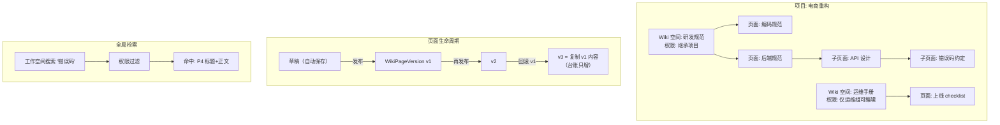
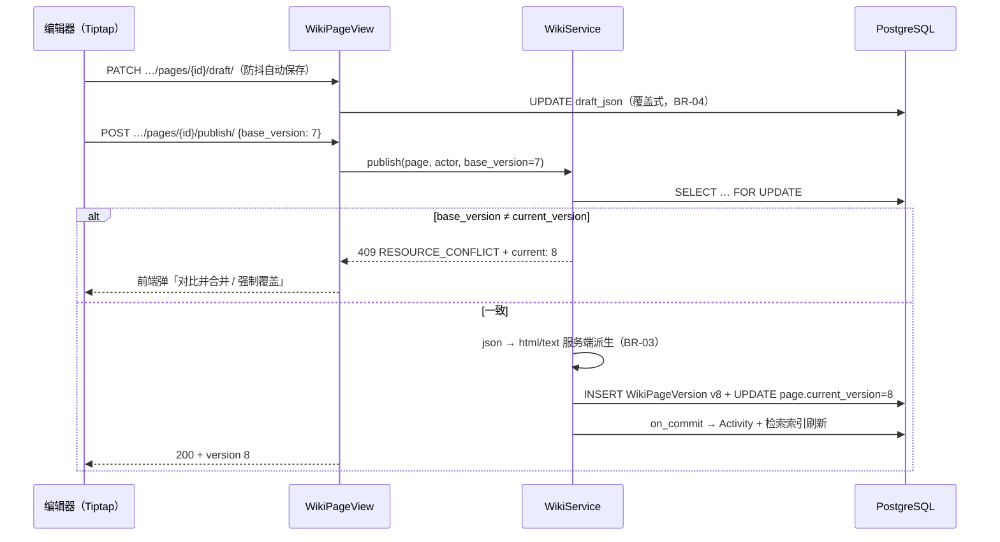
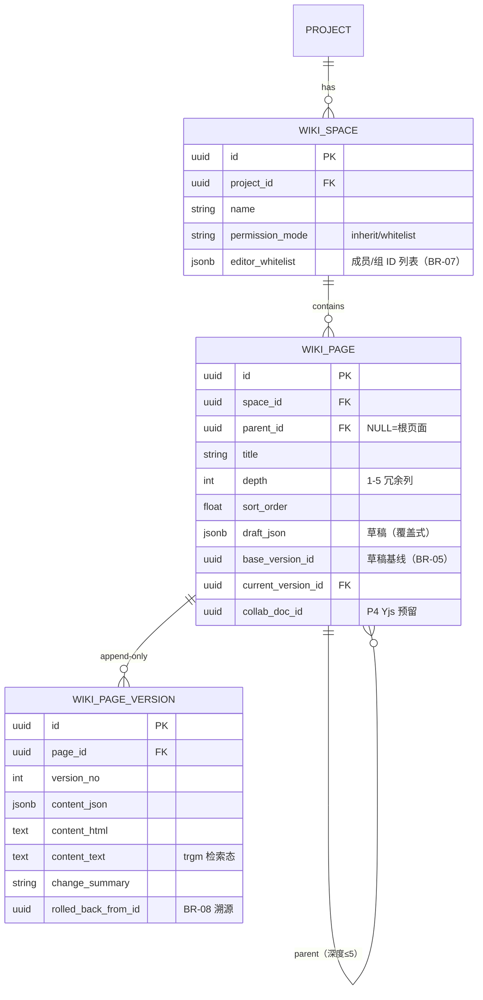

# FILE-005 项目 Wiki 与全局知识检索

| 元信息项 | 内容 |
| --- | --- |
| 文档编号 | FILE-005 |
| 所属迭代 | Sprint 9 — 企业项目/报表/Wiki（第 12 周） |
| 模块 | M7-FILE 文件与知识 |
| 优先级 | P3（企业版核心 · 企业版 V1.0 组成部分） |
| 工作量估算 | 后端 3.5 人日（页面树 1 + 版本 1 + 检索 1 + 权限 0.5）｜前端 4.0 人日（编辑器集成 1.5 + 树导航 1 + 版本对比 1 + 检索 0.5）｜测试 2.0 人日 |
| 关联架构文档 | [`unified-issue-model.md`](../architecture/unified-issue-model.md)（Issue 描述三格式范式：`description_json/html/text`——Wiki 页面内容直接复用）、[`api-conventions.md`](../architecture/api-conventions.md) |
| 上游依赖 | `FILE-002`（文件库权限三态 `can_view_file` 单一入口范式）；`FILE-003`（版本台账与回滚范式）；`COLLAB-002`（Tiptap 富文本基座）；`TASK-010`（Activity 管道） |
| 下游消费 | P4 全局知识库（跨项目 Wiki）、P4 实时协同（Yjs 评估——本文档预留 `collab_doc_id` 列）、`AI-001`（知识摘要数据源） |
| 文档状态 | 待评审（Draft） |
| 最后更新日期 | 2026-09-01 |

---

## 1. 概述

### 1.1 背景

任务与文件库承载「执行过程」，Wiki 承载「沉淀知识」：架构决策记录（ADR）、上线手册、新人指南、复盘文档。企业版客户把「项目知识不随人员流动而流失」列为采购关键理由——Wiki 是企业版 V1.0 的最后一块内容拼图。

技术基座全部就绪，本文档是**组合式交付**而非全新发明：编辑器 = Tiptap（COLLAB 系既有）、内容三格式 = Issue 描述范式、版本 = FILE-003 追加式台账思想、权限 = FILE-002 三态单入口范式、检索 = trgm 既有索引方案。

### 1.2 目标

1. **Wiki 空间与页面树**：项目可开多个 Wiki 空间（如「研发规范」「运维手册」），空间内页面树深度 ≤5；页面拖拽移动、排序。
2. **富文本编辑**：Tiptap 编辑器（与评论/描述同一内核），三格式存储（JSON 编辑态 + HTML 渲染态 + 剥离文本检索态）。
3. **版本与回溯**：每次发布产生 `WikiPageVersion`（追加式台账），版本对比（HTML diff）与一键回滚（回滚 = 复制旧版生成新版本，历史不丢）。
4. **权限分级**：空间级三态（查看/编辑/管理），默认继承项目角色，可对空间单独收窄。
5. **全局知识检索**：工作空间级搜索（标题 + 剥离文本，trgm 索引），按空间/项目过滤，权限过滤后返回。

### 1.3 范围与边界

| 范围 | 本文档交付 | 明确不做（归属） |
| --- | --- | --- |
| 页面树 | 空间/页面 CRUD、移动、排序、深度 ≤5 | 跨空间移动（P4）、页面级单独权限（P4） |
| 编辑 | Tiptap 三格式、自动保存草稿、发布 | **多人实时协同**（Yjs/Hocuspocus，P4 评估——`collab_doc_id` 列预留） |
| 版本 | 发布版台账、diff 对比、回滚 | 草稿多版本（草稿仅一份，覆盖式） |
| 检索 | 标题+正文 trgm、空间/项目过滤、权限过滤 | 附件内容全文检索（P4）、语义检索（P4 `AI-001`） |
| 权限 | 空间三态 + 项目角色继承 | 页面级 ACL（P4） |

### 1.4 术语表

| 术语 | 定义 |
| --- | --- |
| Wiki 空间 | 项目内的知识分区（`WikiSpace`），权限载体 |
| 页面树 | 空间内 `WikiPage` 自引用树，深度 ≤5 |
| 三格式 | `content_json`（Tiptap JSON，编辑源）/ `content_html`（渲染）/ `content_text`（剥离纯文本，检索） |
| 发布 | 草稿 → 新 `WikiPageVersion` 落台账并更新页面当前指针 |
| 回滚 | 以历史版本内容生成**新版本**（台账只增，BR-08） |

### 1.5 前置依赖

| 依赖 | 内容 | 阻塞原因 |
| --- | --- | --- |
| `COLLAB-002` | Tiptap 编辑器内核与 schema（提及/表格/代码块） | 编辑器零新内核 |
| `FILE-003` | 追加式版本台账 + 零拷贝回滚范式 | `WikiPageVersion` 直接对齐 |
| `FILE-002` | 权限三态与 `can_view_file` 单入口 | `can_view_wiki` 同构实现 |
| `TASK-010` | Activity 管道 | 页面操作留痕 |
| 架构 trgm 索引方案 | `pg_trgm` 标题/文本检索 | 检索零新组件 |

### 1.6 竞品参考

| 竞品 | 参考点 | 处置 |
| --- | --- | --- |
| Confluence | 空间 → 页面树、版本历史与对比、空间权限 | 三件套语义全对齐；**页面级权限不学**（管理复杂度高，P4 再评估） |
| Notion | 块编辑器、层级页面 | 编辑器交互参考（斜杠菜单）；块模型不迁（Tiptap schema 已冻结） |
| Plane | Pages（单层级页面 + 简单富文本） | 我方页面树 + 版本台账为其超集 |

---

## 2. 业务逻辑

### 2.1 总体结构



### 2.2 业务规则（BR）

| 编号 | 规则 | 强制层 | 违约响应 |
| --- | --- | --- | --- |
| BR-01 | 页面树深度 ≤5；移动前环检测（同 TASK-004 `_is_descendant` CTE 范式） | Service + CTE | `400 VALIDATION_ERROR` / `409 RESOURCE_CIRCULAR_DEPENDENCY` |
| BR-02 | 同级页面标题唯一（同空间同父） | DB 部分唯一约束 | `409 RESOURCE_ALREADY_EXISTS` |
| BR-03 | 三格式一致性：发布时由服务端从 `content_json` 派生 `content_html`/`content_text`（不接受客户端传 HTML——防 XSS 与格式分裂，与 Issue 描述同一管线） | Service | `400 VALIDATION_ERROR` |
| BR-04 | 草稿单份覆盖式：自动保存（防抖 5s）写 `draft_json`；发布才落版本台账 | Service | — |
| BR-05 | 编辑冲突：草稿携带 `base_version`；若他人已发布更新版本，发布时返回 `409 RESOURCE_CONFLICT` + 服务端当前版本号，前端提供「对比并合并/覆盖」 | Service（乐观锁） | 409 |
| BR-06 | 空间权限三态：`viewer`（只读）/ `editor`（可编辑发布）/ `manager`（空间设置+删除）；默认 `inherit` = 按项目角色映射（VIEWER→viewer，COMMENTER/CONTRIBUTOR→editor，ADMIN→manager） | Permission 单入口 `can_view_wiki` | `403 PERM_DENIED` |
| BR-07 | 空间收窄：可对空间指定「仅指定成员/组可编辑」（白名单），不可超过项目角色上限（VIEWER 不可被提为 editor） | Permission | `400 VALIDATION_ERROR` |
| BR-08 | 版本台账只增：回滚 = 以目标历史版本内容创建新版本（`rolled_back_from` 记录溯源）；任何版本不可改不可删 | Service + DB | — |
| BR-09 | 页面删除 = 软删除进回收站 30 天（承 FILE-002 回收站范式）；含子页面时整树一并进入/恢复 | Service | — |
| BR-10 | 检索权限过滤：结果仅含请求者 `can_view_wiki` 的空间页面（SQL JOIN 过滤，不做事后过滤防计数泄露） | 检索服务 | — |
| BR-11 | 检索范围：标题（权重 3x）+ `content_text`；`pg_trgm` GIN 索引；结果高亮片段 ≤160 字 | 检索服务 | — |
| BR-12 | 页面提及任务（`#RBT-123`）渲染为任务卡片链接（Tiptap mention 节点，与评论同一组件） | 渲染层 | — |
| BR-13 | 空间/页面操作（建/发布/回滚/删除/移动）全部入 Activity（TASK-010 管道） | Service | — |
| BR-14 | 归档项目 Wiki 只读；项目删除时 Wiki 随项目级联软删 | Permission | `403 PERM_PROJECT_ARCHIVED` |

### 2.3 发布与冲突时序



---

## 3. UI/UX 设计

### 3.1 Wiki 主界面

```
┌──────────────────────────────────────────────────────────────────────────┐
│ Wiki · 电商重构项目                    [研发规范 ▾]  [+ 新建空间]  ⚙ 权限  │
│ ┌──────────────────────┬───────────────────────────────────────────────┐ │
│ │ 页面树                │  API 设计规范                    v8 · 张妍 编辑 │ │
│ │ ───────────────────  │  ────────────────────────────────────────────│ │
│ │ ▾ 编码规范            │  最近发布: 2026-08-30 14:22                   │ │
│ │ ▾ 后端规范            │                                                │ │
│ │   ▸ API 设计   ◀当前  │  ## 3. 错误码约定                             │ │
│ │   ▸ 数据库约定        │                                                │ │
│ │ ▸ 前端规范            │  所有接口错误码必须从注册表选取，               │ │
│ │ ────────────────     │  禁止自创。完整注册表见 #RBT-152 …             │ │
│ │ [+ 新建页面]          │                                                │ │
│ │                      │  ┌────────────────────────────────────────┐   │ │
│ │ 🔍 空间内搜索         │  │ 💬 3 条评论（锚定本段）                 │   │ │
│ │                      │  └────────────────────────────────────────┘   │ │
│ │                      │                                                │ │
│ │                      │  [编辑]  [历史 v8 ▾]  [··· 移动/删除]          │ │
│ └──────────────────────┴───────────────────────────────────────────────┘ │
└──────────────────────────────────────────────────────────────────────────┘
```

### 3.2 版本历史与对比

```
┌────────────────────────────────────────────────────────────────────────┐
│ 版本历史 · API 设计规范                              [对比模式] [返回]   │
│ ────────────────────────────────────────────────────────────────────── │
│ v8   张妍    08-30 14:22   「补充错误码注册表链接」          [回滚到此版] │
│ v7   李骁    08-22 09:15   「重写限流章节」                   [回滚到此版] │
│ v6   李骁    08-15 18:40   （回滚自 v4）                     [回滚到此版] │
│ ────────────────────────────────────────────────────────────────────── │
│ ▼ 对比 v7 → v8（HTML diff：新增绿底 / 删除红划线）                        │
│   所有接口错误码必须从注册表选取，禁止自创。                              │
│   [+] 完整注册表见 #RBT-152。                                            │
│   [-] 错误码由后端定义。                                                 │
└────────────────────────────────────────────────────────────────────────┘
```

### 3.3 全局知识检索

```
┌────────────────────────────────────────────────────────────────────────┐
│ 🔍 搜索: "错误码"          范围: 全部空间 ▾   项目: 全部 ▾   12 条结果    │
│ ────────────────────────────────────────────────────────────────────── │
│ 📄 API 设计规范 · 研发规范 / 电商重构                                     │
│    …所有接口<em>错误码</em>必须从注册表选取，禁止自创。完整注册表见…        │
│ 📄 上线 checklist · 运维手册 / 电商重构                                   │
│    …确认<em>错误码</em>监控面板无异常峰值后方可放量…                        │
│ 📋 RBT-152 限流配置文档 · 任务（任务结果排在 Wiki 结果之后）               │
└────────────────────────────────────────────────────────────────────────┘
```

### 3.4 交互规则

| 交互 | 行为 |
| --- | --- |
| 自动保存 | 编辑停止 5s 落草稿；状态栏「草稿已保存 14:22:31」 |
| 发布冲突 | 409 → 对话框「他人已发布 v8：对比并合并（开 diff 视图）/ 强制覆盖（生成 v9）」 |
| 回滚 | 确认对话框显示目标版本摘要 → 生成新版本（BR-08），Activity 记「回滚自 vX」 |
| 页面移动 | 树内拖拽（同级排序）或「移动到…」对话框（跨父）；深度/环前端预检 + 服务端终裁 |
| 回收站 | 空间设置页内 tab；30 天倒计时；整树恢复（BR-09） |

---

## 4. 技术架构

### 4.1 实体关系



### 4.2 模型定义

```python
class WikiSpace(BaseModel):
    """Wiki 空间 —— 权限载体（BR-06/07）"""

    class PermissionMode(models.TextChoices):
        INHERIT = "inherit", "继承项目角色"
        WHITELIST = "whitelist", "编辑白名单"

    project = models.ForeignKey(Project, on_delete=models.CASCADE,
                                related_name="wiki_spaces", verbose_name="所属项目")
    name = models.CharField(max_length=128, verbose_name="空间名称")
    description = models.TextField(blank=True, verbose_name="说明")
    permission_mode = models.CharField(max_length=16, choices=PermissionMode.choices,
                                       default=PermissionMode.INHERIT, verbose_name="权限模式")
    editor_whitelist = models.JSONField(default=list, blank=True, verbose_name="编辑白名单",
        help_text='[{"type": "member", "id": "01J9X…"}, {"type": "department", "id": "01J9Y…"}]')

    class Meta(BaseModel.Meta):
        db_table = "wiki_spaces"
        constraints = [models.UniqueConstraint(fields=["project", "name"],
                                               condition=models.Q(deleted_at__isnull=True),
                                               name="uniq_wiki_space_name")]


class WikiPage(BaseModel):
    MAX_DEPTH = 5

    space = models.ForeignKey(WikiSpace, on_delete=models.CASCADE,
                              related_name="pages", verbose_name="所属空间")
    parent = models.ForeignKey("self", on_delete=models.CASCADE, null=True, blank=True,
                               related_name="children", verbose_name="父页面")
    title = models.CharField(max_length=200, verbose_name="标题")
    depth = models.PositiveSmallIntegerField(default=1, verbose_name="层级（冗余）")
    sort_order = models.FloatField(default=65535.0, verbose_name="排序值")
    draft_json = models.JSONField(null=True, blank=True, verbose_name="草稿（覆盖式，BR-04）")
    base_version = models.ForeignKey("WikiPageVersion", on_delete=models.SET_NULL,
                                     null=True, blank=True, related_name="+",
                                     verbose_name="草稿基线版本")
    current_version = models.ForeignKey("WikiPageVersion", on_delete=models.SET_NULL,
                                        null=True, blank=True, related_name="+",
                                        verbose_name="当前发布版本")
    collab_doc_id = models.UUIDField(null=True, blank=True, verbose_name="P4 协同文档 ID 预留")

    class Meta(BaseModel.Meta):
        db_table = "wiki_pages"
        constraints = [
            models.UniqueConstraint(fields=["space", "parent", "title"],
                                    condition=models.Q(deleted_at__isnull=True),
                                    name="uniq_wiki_page_title_per_parent"),   # BR-02
            models.CheckConstraint(check=models.Q(depth__gte=1, depth__lte=5),
                                   name="chk_wiki_page_depth"),
        ]
        indexes = [models.Index(fields=["space", "parent"], name="idx_wiki_page_tree")]


class WikiPageVersion(BaseModel):
    """追加式版本台账（BR-08 只增）——FILE-003 版本范式在文档域的同构"""

    page = models.ForeignKey(WikiPage, on_delete=models.CASCADE,
                             related_name="versions", verbose_name="页面")
    version_no = models.PositiveIntegerField(verbose_name="版本号（页内递增）")
    content_json = models.JSONField(verbose_name="Tiptap JSON（编辑源）")
    content_html = models.TextField(verbose_name="渲染态（服务端派生，BR-03）")
    content_text = models.TextField(verbose_name="剥离文本（检索态）")
    change_summary = models.CharField(max_length=200, blank=True, verbose_name="变更摘要")
    rolled_back_from = models.ForeignKey("self", on_delete=models.SET_NULL,
                                         null=True, blank=True, related_name="+",
                                         verbose_name="回滚溯源")

    class Meta(BaseModel.Meta):
        db_table = "wiki_page_versions"
        constraints = [models.UniqueConstraint(fields=["page", "version_no"],
                                               name="uniq_wiki_page_version_no")]
        indexes = [
            models.Index(fields=["page", "-version_no"], name="idx_wpv_page_version"),
            GinIndex(fields=["content_text"], name="idx_wpv_text_trgm",
                     opclasses=["gin_trgm_ops"]),      # BR-11 正文 trgm
        ]
```

> 标题检索索引：`WikiPage.title` 建 `GIN (title gin_trgm_ops)`（迁移内 `CREATE INDEX CONCURRENTLY`）。

### 4.3 WikiService（发布/回滚/权限）

```python
class WikiService:
    @transaction.atomic
    def publish(self, *, page_id, actor, base_version_id, change_summary="") -> WikiPageVersion:
        page = WikiPage.objects.select_for_update().select_related("current_version").get(pk=page_id)
        self._assert_editable(actor, page.space)                        # BR-06/07
        if str(page.current_version_id) != str(base_version_id):        # BR-05 乐观锁
            raise ApiError("RESOURCE_CONFLICT", 409, details={
                "current_version": page.current_version.version_no if page.current_version else 0})
        html, text = render_tiptap(page.draft_json)                     # BR-03 服务端派生（Issue 描述同管线）
        version = WikiPageVersion.objects.create(
            page=page, version_no=(page.current_version.version_no + 1) if page.current_version else 1,
            content_json=page.draft_json, content_html=html, content_text=text,
            change_summary=change_summary)
        page.current_version, page.base_version = version, version
        page.draft_json = None
        page.save(update_fields=["current_version", "base_version", "draft_json", "updated_at"])
        transaction.on_commit(lambda: build_activities.delay(...))      # BR-13
        return version

    @transaction.atomic
    def rollback(self, *, page_id, actor, target_version_id) -> WikiPageVersion:
        """BR-08：回滚 = 以历史版本内容生成新版本（台账只增）"""
        page = WikiPage.objects.select_for_update().get(pk=page_id)
        self._assert_editable(actor, page.space)
        target = get_object_or_404(WikiPageVersion, pk=target_version_id, page=page)
        page.draft_json, page.base_version = target.content_json, page.current_version
        return self.publish(page_id=page.id, actor=actor,
                            base_version_id=page.current_version_id,
                            change_summary=f"回滚自 v{target.version_no}") \
            .tap(lambda v: setattr(v, "rolled_back_from", target) or v.save(
                update_fields=["rolled_back_from"]))

    def can_view_wiki(self, actor, space) -> bool:
        """BR-06 单入口（FILE-002 can_view_file 同构）：viewer/editor/manager 映射"""
        role = PermissionResolver.project_role(actor, space.project)
        if space.permission_mode == WikiSpace.PermissionMode.INHERIT:
            return role.level >= ProjectRole.VIEWER
        return role.level >= ProjectRole.VIEWER  # 白名单仅收窄编辑，不收窄查看（BR-07）
```

### 4.4 检索服务

```sql
-- BR-10/11：权限过滤 JOIN 前置（不做事后过滤），标题权重 3x
SELECT p.id, p.title, s.name AS space_name, pr.identifier,
       ts_headline('simple', v.content_text, q, 'MaxWords=20, MaxFragments=2') AS snippet,
       (similarity(p.title, %(q)s) * 3 + similarity(v.content_text, %(q)s)) AS rank
FROM wiki_pages p
JOIN wiki_spaces s   ON s.id = p.space_id AND s.deleted_at IS NULL
JOIN projects pr     ON pr.id = s.project_id
JOIN wiki_page_versions v ON v.id = p.current_version_id
JOIN project_members pm ON pm.project_id = pr.id AND pm.member_id = %(actor)s AND pm.deleted_at IS NULL
, plainto_tsquery('simple', %(q)s) q
WHERE p.deleted_at IS NULL
  AND (p.title %% %(q)s OR v.content_text %% %(q)s)
ORDER BY rank DESC
LIMIT 20;
```

### 4.5 API 端点

| 方法 | 路径 | 说明 | 权限 |
| --- | --- | --- | --- |
| GET/POST | `…/projects/{id}/wiki/spaces/` | 空间列表（含页面树浅层）/ 新建 | viewer / manager（继承时=PROJ_ADMIN） |
| GET/PATCH/DELETE | `…/wiki/spaces/{space_id}/` | 详情（含完整页面树）/ 设置 / 删除 | viewer / manager |
| GET/POST | `…/wiki/spaces/{space_id}/pages/` | 页面列表（树）/ 新建页面 | viewer / editor |
| GET/PATCH/DELETE | `…/wiki/pages/{page_id}/` | 详情（当前版本三格式）/ 改名排序 / 软删（BR-09） | viewer / editor / editor |
| PATCH | `…/wiki/pages/{page_id}/draft/` | 草稿保存（防抖，BR-04） | editor |
| POST | `…/wiki/pages/{page_id}/publish/` | 发布 `{base_version_id, change_summary}`（BR-05） | editor |
| POST | `…/wiki/pages/{page_id}/move/` | 移动 `{parent_id, sort_order}`（BR-01） | editor |
| GET | `…/wiki/pages/{page_id}/versions/` | 版本台账（游标分页） | viewer |
| GET | `…/wiki/pages/{page_id}/versions/{version_id}/` | 单版本三格式（含 diff 基准） | viewer |
| POST | `…/wiki/pages/{page_id}/rollback/` | 回滚 `{version_id}`（BR-08） | editor |
| GET | `/api/v1/workspaces/{slug}/search/wiki/?q=&project_id=&space_id=` | 全局知识检索（BR-10/11） | WS 成员 |

**① `GET …/pages/{page_id}/` 响应（200）**：

```json
{
  "status": 0,
  "data": {
    "id": "01J9XQK7M3N4P5R6S7T8V9W4H1",
    "title": "API 设计规范",
    "space": { "id": "01J9XQK7M3N4P5R6S7T8V9W4J2", "name": "研发规范" },
    "parent_id": "01J9XQK7M3N4P5R6S7T8V9W4K3",
    "depth": 3,
    "current_version": {
      "version_no": 8,
      "content_html": "<h2>3. 错误码约定</h2><p>所有接口错误码必须从注册表选取…</p>",
      "change_summary": "补充错误码注册表链接",
      "published_by": { "id": "01J9XQK7M3N4P5R6S7T8V9W4L4", "display_name": "张妍" },
      "created_at": "2026-08-30T06:22:11.482Z"
    },
    "draft": { "has_draft": true, "base_version_no": 8, "updated_at": "2026-09-01T02:10:05.113Z" },
    "my_access": "editor"
  },
  "meta": { "request_id": "01J9XQK7M3N4P5R6S7T8V9W4M5" }
}
```

**② 错误响应矩阵**：

| 场景 | HTTP | code | details |
| --- | --- | --- | --- |
| 发布版本冲突 | 409 | `RESOURCE_CONFLICT` | `current_version`（BR-05） |
| 同级标题重复 | 409 | `RESOURCE_ALREADY_EXISTS` | — |
| 深度 >5 / 移动成环 | 400 / 409 | `VALIDATION_ERROR` / `RESOURCE_CIRCULAR_DEPENDENCY` | 环路径 |
| 客户端直传 HTML | 400 | `VALIDATION_ERROR` | 子码 `READ_ONLY`（BR-03） |
| 白名单越权提升（VIEWER→editor） | 400 | `VALIDATION_ERROR` | 子码 `INVALID`（BR-07） |
| 无编辑权限发布 | 403 | `PERM_DENIED` | 所需 `editor` |
| 归档项目写操作 | 403 | `PERM_PROJECT_ARCHIVED` | — |
| 检索注入（非法 tsquery 字符） | 400 | `VALIDATION_INVALID_PARAM` | — |

```json
// 409 RESOURCE_CONFLICT 示例
{
  "status": 1,
  "error": {
    "code": "RESOURCE_CONFLICT",
    "message": "张妍已发布 v8，你的草稿基于 v7",
    "details": { "current_version": 8, "base_version": 7 }
  },
  "meta": { "request_id": "01J9XQK7M3N4P5R6S7T8V9W4N6" }
}
```

### 4.6 前端实现

```typescript
class WikiPageStore {
  @observable page: WikiPageDetail | null = null;
  @observable tree: WikiPageNode[] = [];
  @observable versions: WikiPageVersion[] = [];
  private draftTimer: number | null = null;

  onEditorChange(json: TiptapJSON) {                        // BR-04 防抖自动保存
    if (this.draftTimer) clearTimeout(this.draftTimer);
    this.draftTimer = window.setTimeout(() => this.saveDraft(json), 5000);
  }

  async publish(summary: string) {
    try {
      await api.post(`…/wiki/pages/${this.page!.id}/publish/`, {
        base_version_id: this.page!.current_version.id, change_summary: summary });
    } catch (e) {
      if (e.code === "RESOURCE_CONFLICT") this.openConflictDialog(e.details);  // §3.4
    }
  }

  async rollback(versionId: string) {
    await api.post(`…/wiki/pages/${this.page!.id}/rollback/`, { version_id: versionId });
    await this.fetchPage(this.page!.id);                    // 回滚生成新版本后刷新
  }
}
```

| 前端要点 | 方案 |
| --- | --- |
| 编辑器 | COLLAB-002 Tiptap 内核 + Wiki 插件集（页面内链接、任务 mention、目录大纲） |
| 版本对比 | 双版本 HTML 拉取 → `htmldiff-js` 渲染（新增绿底/删除红划线） |
| 页面树 | 虚拟化树（>500 页面）；拖拽移动 optimistic + 409 回滚 |
| 检索 | 搜索页复用全局搜索框架；`snippet` 内 `<em>` 高亮直渲染（服务端 ts_headline 已转义） |

---

## 5. 测试用例

### 5.1 单元测试（UT）

| 编号 | 用例 | 断言 |
| --- | --- | --- |
| UT-01 | 页面树深度：L5 下再建子页 / 移动使子树超深 | 400 |
| UT-02 | 移动成环（A→B→A） | 409 `CIRCULAR` + 环路径 |
| UT-03 | 同级标题唯一（含软删后可重用） | 409/放行 |
| UT-04 | 三格式派生：json→html/text 服务端生成；客户端传 html 拒绝 | BR-03 |
| UT-05 | 草稿覆盖式：连续保存仅一份 | draft 单份 |
| UT-06 | 发布乐观锁：base 过期 → 409 + current_version | BR-05 |
| UT-07 | 版本号页内递增（并发发布行锁串行） | 无跳号无重复 |
| UT-08 | 回滚生成新版本 + `rolled_back_from` 溯源 + 台账只增 | BR-08 |
| UT-09 | 权限映射：inherit 四角色映射；whitelist 收窄编辑不收窄查看；VIEWER 不可提升 | BR-06/07 |
| UT-10 | 软删整树进入回收站 / 恢复整树 | BR-09 |
| UT-11 | 检索权限过滤：非成员空间零结果（计数不泄露） | BR-10 |
| UT-12 | 检索排序：标题命中权重 3x 于正文 | rank 正确 |
| UT-13 | ts_headline 片段 ≤160 字且转义 | XSS 安全 |

### 5.2 集成测试（IT）

| 编号 | 用例 | 断言 |
| --- | --- | --- |
| IT-01 | 全链路：建空间→建三级页面树→编辑发布→版本台账→回滚 | 迭代概览验收第 5 条 |
| IT-02 | 并发发布：两人基于 v7 发布 → 一胜一 409 | 行锁语义 |
| IT-03 | 权限三态端到端：VIEWER 读/写拒绝；whitelist 成员编辑；manager 空间设置 | 200/403 矩阵 |
| IT-04 | 全局检索：跨项目权限过滤 + 高亮片段 + 项目/空间过滤参数 | BR-10/11 |
| IT-05 | 归档项目 Wiki 只读；项目删除级联软删 | 403/级联 |
| IT-06 | Activity 留痕：建/发布/回滚/删除/移动五类事件 | BR-13 |

### 5.3 E2E

| 编号 | 场景 |
| --- | --- |
| E2E-01 | 三级页面树搭建 → Tiptap 编辑（标题/任务 mention/代码块）→ 自动保存 → 发布 |
| E2E-02 | 版本历史列表 → 双版本对比 diff → 回滚 → 新版本生成且历史完整 |
| E2E-03 | 发布冲突：A 编辑中 B 发布 → A 发布弹冲突对话框 → 对比合并 → 发布成功 |
| E2E-04 | 全局搜索「错误码」：跨空间命中 + 高亮 + 无权限空间零结果 |
| E2E-05 | 页面树拖拽移动 + 回收站整树恢复 |

---

## 6. 竞品深度对标

| 维度 | Confluence | Notion | Plane Pages | **本方案** |
| --- | --- | --- | --- | --- |
| 结构 | 空间 → 无限页面树 | 无限层级块 | 单层级页面 | 空间 → 页面树（深度 ≤5，防失控） |
| 版本 | 全量版本 + 对比 + 回滚 | 版本快照（30 天） | 无版本 | 追加式台账 + HTML diff + 回滚生成新版本（BR-08 历史不丢） |
| 冲突处理 | 乐观锁 + 合并向导 | 实时协同天然无冲突 | 无 | 乐观锁 + 对比合并/覆盖（BR-05）；实时协同留 P4（`collab_doc_id` 预留） |
| 权限 | 空间权限 + 页面级限制（复杂度高居投诉榜首） | 页面级共享 | 项目继承 | **空间三态 + 项目继承**（页面级 ACL 刻意 P4，Confluence 教训） |
| 检索 | 全文 + 空间过滤 | 全文 | 标题 | 标题 3x 权重 + 正文 trgm + 权限 SQL 前置过滤（BR-10/11） |
| 内容安全 | 服务端清洗 | 服务端渲染 | 客户端渲染 | 服务端派生 HTML（BR-03，XSS 防线与 Issue 描述同一管线） |

---

## 7. 里程碑与验收

### 7.1 交付清单

| 类别 | 交付物 |
| --- | --- |
| Model / Migration | `wiki_spaces` / `wiki_pages` / `wiki_page_versions` 三表 + 5 约束 + 4 索引（含 2 个 trgm GIN，CONCURRENTLY） |
| 后端 | `WikiService`（发布/回滚/移动/权限单入口）、三格式派生管线（复用 Issue 描述渲染）、检索服务（权限前置 SQL）、11 组端点 |
| 前端 | Wiki 主界面（树+编辑器+大纲）、版本历史与 diff、回收站、全局检索页、发布冲突对话框 |
| 测试 | UT-01~13、IT-01~06、E2E-01~05 |

### 7.2 可操作演示的验收标准

1. 三级页面树、协作编辑（自动保存+发布）、版本回滚、权限分级、全局检索命中标题与正文——迭代概览验收第 5 条全项。
2. 版本对比 diff 渲染正确（新增绿底/删除红划线）；回滚生成新版本且台账只增（BR-08）。
3. 发布冲突演示：两人编辑同页，后到者 409 + 对比合并闭环。
4. 权限演示：三态矩阵 + 白名单收窄 + 检索权限过滤（无权限空间零结果，计数不泄露）。
5. 安全演示：客户端直传 HTML 拒绝；检索片段 XSS 注入被转义。
6. 性能：500 页面空间树渲染流畅；检索 P95 < 300ms（trgm GIN）。
7. 全部端点通过 `api-conventions.md` §14 检查清单。

---

## 8. 相关文档

- 迭代概览：[`docs/sprint-9-enterprise-portfolio/sprint-overview.md`](sprint-overview.md)
- 编辑器内核：[`docs/sprint-3-views-collab/COLLAB-002-thread-reply.md`](../sprint-3-views-collab/COLLAB-002-thread-reply.md)
- 版本范式：[`docs/sprint-4-gantt-file/FILE-003-preview-version.md`](../sprint-4-gantt-file/FILE-003-preview-version.md)
- 权限范式：[`docs/sprint-4-gantt-file/FILE-002-project-filelib.md`](../sprint-4-gantt-file/FILE-002-project-filelib.md)
- P4 协同预留：[`docs/sprint-future-p4/sprint-overview.md`](../sprint-future-p4/sprint-overview.md)（Yjs 评估）


