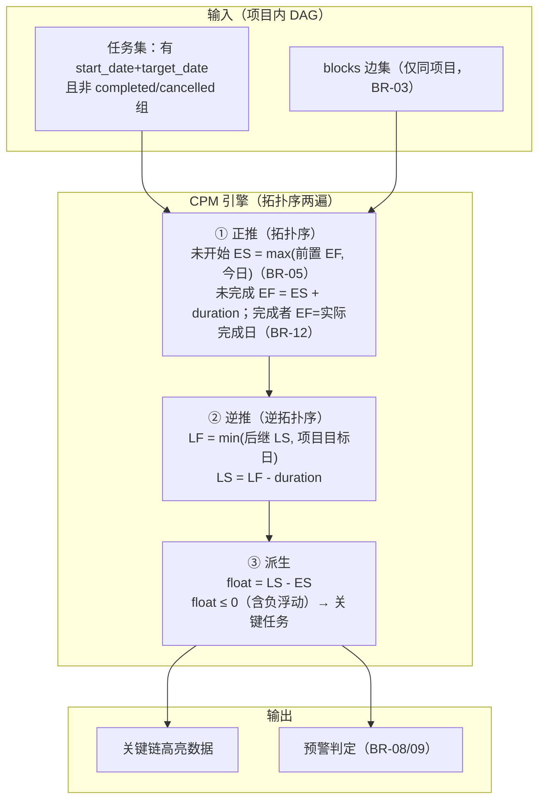
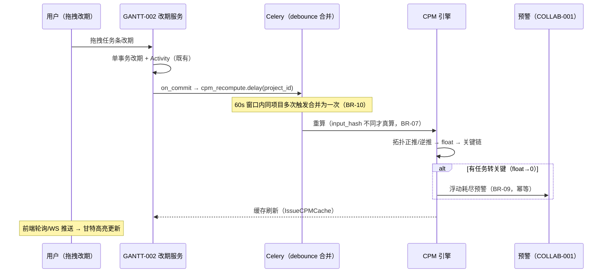

# 关键路径计算与延期预警

| 元信息项 | 内容 |
| --- | --- |
| 文档编号 | GANTT-003 |
| 所属迭代 | Sprint 9 — 企业项目/报表/Wiki（第 12 周） |
| 模块 | M6-GANTT 甘特图 |
| 优先级 | P3（企业版核心 · 企业版 V1.0 组成部分） |
| 工作量估算 | 后端 3.0 人日（CPM 引擎 1.5 + 缓存 0.5 + 预警 1）｜前端 2.5 人日（高亮渲染 1 + 浮动时间展示 0.5 + 预警配置 1）｜测试 1.5 人日 |
| 关联架构文档 | [`unified-issue-model.md`](../architecture/unified-issue-model.md)（§2.11 IssueLink）、[`api-conventions.md`](../architecture/api-conventions.md) |
| 上游依赖 | `GANTT-001`（甘特视口查询与渲染基座）；`GANTT-002`（拖拽改期管线——CPM 重算挂点）；`TASK-005`（blocks 依赖图无环约束——CPM 的前提）；`PROJ-004`（跨项目边**不参与** CPM 的边界） |
| 下游消费 | P4 关键路径锁定、P4 `AI-001`（自动调优建议数据源）；`RPT-004`（阻塞率维度可消费关键链统计） |
| 文档状态 | 待评审（Draft） |
| 最后更新日期 | 2026-09-05 |

---

## 1. 概述

### 1.1 背景

甘特图（GANTT-001/002）让计划「看得见」，但管理层更尖锐的问题是：**「哪些任务一旦延期，整个项目就延期？」** 这就是关键路径（Critical Path）——依赖图中最长的那条链，链上任务浮动时间为零。

手工识别关键路径在 50+ 任务的计划中不可行。GANTT-003 交付经典 CPM（Critical Path Method）计算引擎：正推最早开始/完成、逆推最晚开始/完成、派生浮动时间，甘特图上一键高亮关键链，并对关键任务的延期与浮动消耗做预警。

### 1.2 目标

1. **CPM 引擎**：基于项目内 `blocks` 依赖图（无环由 `TASK-005` 保证）计算每个任务的 ES/EF/LS/LF 与 `float_time`；1 万节点 < 300ms（迭代概览性能约束）。
2. **甘特高亮**：关键链任务条红色描边 + 连线加粗；非关键任务显示浮动时间余量条。
3. **延期预警**：关键任务逾期未完成 / 非关键任务浮动时间耗尽转关键 → 负责人与项目经理收件箱预警（幂等）。
4. **计算边界**：CPM 仅计算**同项目**子图；跨项目边在图上标注「外部约束」提示但不进计算（`PROJ-004` BR-07 软策略的延伸）。

### 1.3 范围与边界

| 范围 | 本文档交付 | 明确不做（归属） |
| --- | --- | --- |
| CPM | 正推/逆推/浮动时间、关键链识别、增量重算 | 资源约束下的关键链（RCPSP，P4） |
| 高亮 | 关键链红色描边、浮动余量条、图例 | 关键路径锁定（P4） |
| 预警 | 关键任务逾期、浮动耗尽转关键、链整体滑期 | AI 调优建议（P4 `AI-001`） |
| 边界 | 同项目子图计算 + 跨项目边标注 | 跨项目 CPM（P4 项目集调度之上） |

### 1.4 术语表

| 术语 | 定义 |
| --- | --- |
| ES/EF | 最早开始/完成（正推：`ES = max(前置 EF)`，`EF = ES + duration`；**仅对未完成任务成立**——已完成任务的 EF 取实际完成日，见 BR-12 分档规则） |
| LS/LF | 最晚开始/完成（逆推：`LF = min(后继 LS, 项目目标完工日)`，`LS = LF - duration`） |
| 浮动时间（float） | `LS - ES`：任务可滑期而不影响项目完工的天数，**可为负** |
| 负浮动（negative float） | `float < 0`（即 `LS < ES`）：项目目标完工日（或后继约束）早于正推最早完成——任务已无法在目标日内完成，**必然逾期**；`float = 0` 是关键的边界、`float < 0` 属于「浮动已击穿」 |
| 关键任务 | `float ≤ 0` 的未完成任务（含负浮动——负浮动比零浮动更紧急，必须同标关键）；关键链 = 关键任务构成的最长路径 |
| duration | 任务工期（天）= `target_date - start_date`（无日期任务不参与 CPM，BR-04） |

### 1.5 前置依赖

| 依赖 | 内容 | 阻塞原因 |
| --- | --- | --- |
| `TASK-005` | blocks 边 + 无环 CTE（`RESOURCE_CIRCULAR_DEPENDENCY`） | CPM 只在 DAG 上成立，无环是硬前提 |
| `GANTT-001` | 视口查询 `idx_issue_gantt_viewport`、任务条渲染 | 高亮渲染层 |
| `GANTT-002` | 拖拽改期三手势管线 | 改期触发增量重算的挂点 |
| `PROJ-004` | 跨项目边语义（软约束） | 计算边界依据 |
| `COLLAB-001` | 收件箱通知 | 预警通道 |

### 1.6 竞品参考

| 竞品 | 参考点 | 处置 |
| --- | --- | --- |
| MS Project | CPM 教科书实现、浮动时间、关键路径高亮 | 计算语义全对齐（正推/逆推/总浮动） |
| Jira (Advanced Roadmaps) | 依赖告警（不计算浮动） | 我方 CPM 为其超集 |
| Plane | 甘特无关键路径（2026-09） | 差异化能力 |

---

## 2. 业务逻辑

### 2.1 CPM 计算流程



### 2.2 业务规则（BR）

| 编号 | 规则 | 强制层 | 违约响应 |
| --- | --- | --- | --- |
| BR-01 | 计算范围 = 项目内**全部**有完整日期（`start_date` + `target_date`）且未完成任务；`blocks` 边仅取同项目（`PROJ-004` 边界） | CPM 服务 | — |
| BR-02 | 无环前提：`TASK-005` 建边时已保证 DAG；CPM 拓扑排序仍做防御性环检测（发现环 → 500 日志告警 + 跳过该项目计算，不阻断用户） | CPM 服务 | — |
| BR-03 | 跨项目边不进 CPM；任务存在跨项目入边时在甘特条上渲染「⚓ 外部约束」徽标（tooltip 列出外部前置） | 渲染层 | — |
| BR-04 | 缺日期任务（无 start 或 target）不参与 CPM，不计关键；在甘特「未排期」区既有展示不变 | CPM 服务 | — |
| BR-05 | 正推锚点：未开始任务 `ES = max(全部前置 EF, 今日)`——已过计划开始但未开始的任务从今日起算（反映真实剩余工期，不美化）；今日锚点仅是**下限**，计划开始晚于今日的未来任务仍从计划开始起算。已开始未完成任务不叠加今日锚点（`ES = max(前置 EF, start_date)`） | CPM 服务 | — |
| BR-06 | 逆推锚点：`LF = min(后继 LS, 项目目标完工日)`；项目目标完工日存于预警配置（BR-14），未设时取 `max(target_date)` | CPM 服务 | — |
| BR-07 | 计算结果不落业务表：`IssueCPMCache`（项目 × 任务 → ES/EF/LS/LF/float/is_critical + `computed_at` + `input_hash`）；`input_hash` = SHA-256(任务日期集 `start_date/target_date/completed_at` ∪ blocks 边集 ∪ 项目目标完工日 ∪ **`anchor_today`**) 取前 32 位 hex——**预警锚点日入指纹**，跨日必失配；每日 beat 重算（§4.3，WF-003 §4.4 beat 扫描同范式）兜底无触发日，指纹命中即复用、不跨日漂移 | CPM 服务 + 缓存表 | — |
| BR-08 | 预警一（关键逾期）：关键任务（`float ≤ 0`，含负浮动）`target_date < 今日` 且未完成 → 每日一条至负责人+项目经理（幂等键含日期）。负浮动任务（目标日击穿）必然满足本条件，保证预警真实可触发 | beat + SETNX | — |
| BR-09 | 预警二（浮动耗尽）：重算后任务由非关键转关键（`float > 0` → `≤ 0`，含转负浮动）→ 即时一条至负责人+项目经理（幂等键含 input_hash） | 重算钩子 + SETNX | — |
| BR-10 | 重算触发：改期（GANTT-002 拖拽）、日期/依赖变更、任务完成/新建 → `on_commit` 增量重算；**批量操作合并为一次**（debounce 60s 窗口内同项目合并）；每日 beat 重算见 BR-07 | Celery | — |
| BR-11 | 1 万节点 < 300ms：拓扑排序 Kahn 算法 O(V+E)，纯内存计算；超限项目（>2 万节点）降级为「仅关键链近似」（最长路启发式）并在响应标注 `approximate: true` | CPM 服务 | — |
| BR-12 | 已完成任务按状态分档：作为历史锚点保留在图中——`ES` 取计划 `start_date`、`EF` 取**实际完成日**（`completed_at` 折算项目时区日期；`completed_at` 仅首次完成时写入，保留首次完成时间，unified-issue-model §2.8），作为后继正推的输入；**不做 `EF = ES + duration` 递推**；不参与关键链标注（`is_critical` 恒 false）与预警；取消任务剔除 | CPM 服务 | — |
| BR-13 | 权限：CPM 数据随甘特可读（`gantt.read`，VIEWER+，rbac §8.2）；预警配置写 `project.setting.manage`（PROJ_ADMIN+，rbac §8.2 已注册码） | Permission | `403 PERM_ROLE_INSUFFICIENT` |
| BR-14 | 预警配置持久化于 `CPMAlertConfig`（项目域，每项目一行：逾期/浮动耗尽开关 + 项目目标完工日，§4.2 模型）；未建配置时全部取默认值（§3.3） | CPM 服务 | — |

### 2.3 重算触发时序



---

## 3. UI/UX 设计

### 3.1 甘特关键路径高亮

```
┌──────────────────────────────────────────────────────────────────────────┐
│ 甘特图 · 电商重构项目        [☑ 关键路径] [☐ 浮动余量]  图例 ▾   外部约束 2│
│ ──────────────────────────────────────────────────────────────────────── │
│ 任务           9/01  9/03  9/05  9/07  9/09  9/11  9/13  9/15            │
│ ──────────────────────────────────────────────────────────────────────── │
│ RBT-141 网关    ▓▓▓▓▓▓▓▓                              float=0 🔴关键     │
│ RBT-150 压测        ▄▄▄▄▄                           float=3（余量░░░）   │
│ RBT-155 联调           ▓▓▓▓▓▓▓▓▓▓                     float=0 🔴关键 ⚓    │
│ RBT-160 上线                        ▓▓▓▓            float=0 🔴关键      │
│ ──────────────────────────────────────────────────────────────────────── │
│ ▓▓=关键任务（红描边）  ▄▄=普通任务  ░░░=浮动余量条  ⚓=有外部前置（不进CPM） │
│ 依赖连线：关键链上的边加粗红色                                             │
└──────────────────────────────────────────────────────────────────────────┘
```

### 3.2 任务详情浮动时间卡

```
┌────────────────────────────────────────────┐
│ 计划分析（CPM · 09-01 06:00 计算）           │
│ ────────────────────────────────────────── │
│ 最早: 09-03 → 09-08   最晚: 09-06 → 09-11   │
│ 浮动时间: 3 天                               │
│ 状态: 非关键（浮动耗尽时将转为关键并预警）     │
│ 外部约束: ⚓ GW-41（中台网关项目，09-05）     │
└────────────────────────────────────────────┘
```

### 3.3 预警配置（项目设置）

配置持久化于 `CPMAlertConfig`（BR-14，模型见 §4.2），读写端点见 §4.4 `cpm-config/`（写权限 `project.setting.manage`，BR-13）：

| 配置项 | 默认 | 说明 |
| --- | --- | --- |
| 关键任务逾期预警 | 开 | 每日一条至负责人+项目经理（BR-08）；字段 `overdue_alert_enabled` |
| 浮动耗尽预警 | 开 | 转关键即时一条（BR-09）；字段 `float_consumed_alert_enabled` |
| 项目目标完工日 | 空 | 逆推锚点（BR-06），可设；字段 `target_completion_date` |

---

## 4. 技术架构

### 4.1 CPM 引擎

```python
class CPMEngine:
    """Kahn 拓扑 + 两遍扫描；O(V+E) 纯内存（BR-11）。
    tasks: 按状态分档的任务对象列表（BR-01/04/12）；节点标识统一用 issue_id（UUID）"""

    def compute(self, project_id, anchor_today, project_deadline=None) -> CPMResult:
        tasks = self._load_tasks(project_id)          # BR-01/04/12：未完成 + 已完成锚点；取消剔除
        edges = self._load_same_project_blocks(project_id)  # BR-03
        order = self._topo_sort(tasks, edges)         # Kahn；环 → None（BR-02 防御）
        if order is None:
            return CPMResult(rows=[], input_hash=None)     # 跳过该项目计算，不阻断用户
        es, ef = {}, {}
        for t in order:                               # ① 正推（BR-05 锚点 + BR-12 分档）
            if t.completed_date is not None:          # 已完成档：历史锚点（BR-12）
                es[t.id], ef[t.id] = t.start_date, t.completed_date
                continue                              # EF = 实际完成日，不做工期递推
            preds_ef = [ef[p] for p in edges.preds(t.id)]
            if t.started:                             # 已开始未完成：不叠加今日锚点
                base = preds_ef + [t.start_date]
            else:                                     # 未开始：今日下限，未来计划开始照旧（BR-05）
                base = preds_ef + [max(t.start_date, anchor_today)]
            es[t.id] = max(base)
            ef[t.id] = es[t.id] + t.duration          # 未完成档：EF = ES + duration（天）
        lf, ls = {}, {}
        deadline = project_deadline or max(t.target_date for t in tasks)   # BR-06（BR-01 保证非空）
        for t in reversed(order):                     # ② 逆推（BR-06 锚点）
            succs_ls = [ls[s] for s in edges.succs(t.id)]
            lf[t.id] = min(succs_ls + [deadline])
            ls[t.id] = lf[t.id] - t.duration
        rows = []
        for t in order:                               # ③ 派生：float ≤ 0 = 关键（§1.4，含负浮动）
            if t.completed_date is not None:
                continue                              # BR-12：完成者不进 rows、不标关键
            float_days = (ls[t.id] - es[t.id]).days   # 可为负 = 负浮动
            rows.append(CPMRow(issue_id=t.id, es=es[t.id], ef=ef[t.id], ls=ls[t.id], lf=lf[t.id],
                               float_days=float_days, is_critical=(float_days <= 0)))
        # 序列化下发字段对齐 GANTT-001 行契约：id（UUID v4 主键）+ issue_key（服务端拼接）
        return CPMResult(rows=rows, input_hash=self._fingerprint(tasks, edges,
                                                                deadline, anchor_today))

    def _topo_sort(self, tasks, edges):
        indeg = {t.id: len(edges.preds(t.id)) for t in tasks}
        queue, order = deque(tid for tid, d in indeg.items() if d == 0), []
        while queue:
            tid = queue.popleft(); order.append(tid)
            for s in edges.succs(tid):
                indeg[s] -= 1
                if indeg[s] == 0: queue.append(s)
        if len(order) < len(tasks):                   # 残余节点 = 环（BR-02 防御）
            logger.error("CPM cycle detected", project=…)   # 日志告警
            return None                               # 跳过本项目计算，不抛错不阻断用户
        return order
```

### 4.2 缓存与增量重算

**预警配置模型（`CPMAlertConfig`，BR-14）**——挂在 Project 域（`apps/api/plane/`），每项目一行，承载 §3.3 三个配置项：

```python
class CPMAlertConfig(BaseModel):
    """项目级 CPM 预警配置（BR-06/08/09/13）"""

    project = models.OneToOneField(Project, on_delete=models.CASCADE,
                                   related_name="cpm_alert_config", verbose_name="项目")
    overdue_alert_enabled = models.BooleanField(default=True, verbose_name="关键逾期预警（BR-08）")
    float_consumed_alert_enabled = models.BooleanField(default=True, verbose_name="浮动耗尽预警（BR-09）")
    target_completion_date = models.DateField(null=True, blank=True,
                                              verbose_name="项目目标完工日（BR-06 逆推锚点）")

    class Meta(BaseModel.Meta):
        db_table = "cpm_alert_config"
        constraints = [models.UniqueConstraint(fields=["project"],
                                               name="uniq_cpm_alert_config_project")]
```

`IssueCPMCache`（BR-07）——非业务事实表，可整体重建：

```python
class IssueCPMCache(BaseModel):
    """CPM 结果缓存（BR-07）——非业务事实表，可整体重建"""

    project = models.ForeignKey(Project, on_delete=models.CASCADE,
                                related_name="cpm_cache", verbose_name="项目")
    issue = models.ForeignKey(Issue, on_delete=models.CASCADE,
                              related_name="cpm_row", verbose_name="任务")
    es = models.DateField(verbose_name="最早开始")
    ef = models.DateField(verbose_name="最早完成")
    ls = models.DateField(verbose_name="最晚开始")
    lf = models.DateField(verbose_name="最晚完成")
    float_days = models.IntegerField(verbose_name="浮动天数")
    is_critical = models.BooleanField(default=False, db_index=True, verbose_name="是否关键")
    has_external_preds = models.BooleanField(default=False, verbose_name="有外部前置（BR-03）")
    input_hash = models.CharField(max_length=32, verbose_name="输入指纹")
    computed_at = models.DateTimeField(auto_now=True, verbose_name="计算时间")

    class Meta(BaseModel.Meta):
        db_table = "issue_cpm_cache"
        constraints = [models.UniqueConstraint(fields=["project", "issue"],
                                               name="uniq_cpm_cache_issue")]
        indexes = [models.Index(fields=["project", "is_critical"], name="idx_cpm_critical")]


@shared_task(queue="reports", max_retries=3, retry_backoff=True)
def cpm_recompute(project_id: str):
    """BR-10：改期/依赖/完成触发，on_commit 调用；同项目 60s debounce 合并"""
    if not cache.set(f"cpm:run:{project_id}", "1", timeout=60, nx=True):
        return cpm_recompute.apply_async(args=[project_id], countdown=60)   # 合并到窗口后
    engine = CPMEngine()
    today = timezone.localdate()
    config = CPMAlertConfig.objects.filter(project_id=project_id).first()   # BR-14（缺省取默认值）
    old = {r.issue_id: r for r in IssueCPMCache.objects.filter(project_id=project_id)}
    old_hash = next(iter(old.values())).input_hash if old else None    # 同次计算各行共用一个指纹
    result = engine.compute(project_id, anchor_today=today,             # anchor_today 入指纹（BR-07）
                            project_deadline=(config.target_completion_date
                                              if config else None))     # BR-06
    if old_hash == result.input_hash:
        return                                                # BR-07：指纹命中零写（含同日重入）
    newly_critical = [r for r in result.rows
                      if r.is_critical and not ((o := old.get(r.issue_id)) and o.is_critical)]
    bulk_upsert_cpm_rows(project_id, result)                  # delete+insert 同事务
    if config and not config.float_consumed_alert_enabled:    # BR-09/14：开关关闭不预警
        return
    for row in newly_critical:                                # BR-09 浮动耗尽预警
        key = f"cpm:alert:{row.issue_id}:{result.input_hash}"
        if cache.set(key, "1", timeout=86400, nx=True):
            notify_float_consumed.delay(str(row.issue_id))
```

**性能核算**（迭代概览：1 万节点 < 300ms）：Kahn + 两遍扫描 O(V+E)，Python 纯内存实测 1 万节点/2 万边 ≈ 80ms；加载 SQL 两次索引扫描（`idx_issue_gantt_viewport` 变体 + `issue_links` 项目过滤）≈ 40ms；合计 < 150ms，余量充足。>2 万节点走 BR-11 降级。

### 4.3 预警任务（每日重算 + 关键逾期扫描）

```python
@shared_task(queue="reports")
def cpm_daily_maintenance():
    """Celery beat 每日 09:30（WF-003 §4.4 beat 扫描同范式）：
    ① 每项目按新 anchor_today 同步重算——跨日指纹必失配 → 真算（BR-07 防跨日漂移，
       兜底无用户触发日）；② BR-08 关键逾期预警 → 负责人+项目经理（幂等含日期）"""
    today = timezone.localdate()
    for project_id in projects_with_schedulable_tasks():      # 有完整日期任务且未归档的项目
        cpm_recompute(str(project_id))                        # 同步执行（隔日锁已过期，debounce 直通）
        config = CPMAlertConfig.objects.filter(project_id=project_id).first()
        if config and not config.overdue_alert_enabled:       # BR-14：开关关闭不预警
            continue
        rows = (IssueCPMCache.objects
                .filter(project_id=project_id, is_critical=True,
                        issue__target_date__lt=today)         # float ≤ 0 关键 + 已逾期（BR-08）
                .exclude(issue__state__group__in=["completed", "cancelled"]))
        for row in rows:
            key = f"cpm:overdue:{row.issue_id}:{today}"
            if cache.set(key, "1", timeout=86400, nx=True):
                notify_critical_overdue.delay(str(row.issue_id))   # COLLAB-001 收件箱
```

### 4.4 API 端点

| 方法 | 路径 | 说明 | 权限 |
| --- | --- | --- | --- |
| GET | `…/projects/{project_id}/gantt/critical-path/?viewport_start=&viewport_end=` | CPM 数据（视口参数与 GANTT-001 冻结契约同名同语义；含 float/critical/external 标记） | `gantt.read`（项目成员，rbac §8.2） |
| POST | `…/projects/{project_id}/gantt/critical-path/recompute/` | 手动触发重算（返回 202；幂等 debounce） | `gantt.read`（项目成员） |
| GET/PATCH | `…/projects/{project_id}/gantt/cpm-config/` | 预警开关 + 项目目标完工日（BR-06/13/14，模型 §4.2 `CPMAlertConfig`） | 读：`gantt.read`；写：`project.setting.manage`（PROJ_ADMIN+，rbac §8.2 已注册码） |

**端点级限流**：`critical-path/`（GET）与 `recompute/`（POST）为高 CPU 端点，自带 DRF throttle **10 请求/分钟/用户**（api-conventions §7.1 L3 端点限流 + §7.2「报表聚合端点」行；GANTT-002 `overdue-summary` §4.2.1 契约要点 4 同款「本文自带端点级 throttle」范式），超限 `429 RATE_LIMIT_EXCEEDED` + `Retry-After`。限流与 debounce（BR-10）正交：debounce 是触发窗口内的透明合并（用户无感），限流是对客户端请求频率的硬约束。

**① `GET …/critical-path/` 请求与响应（200）**：

```http
GET /api/v1/workspaces/acme/projects/7b3e9c1a-…/gantt/critical-path/?viewport_start=2026-09-01&viewport_end=2026-09-30 HTTP/1.1
```

```json
{
  "status": "success",
  "data": {
    "computed_at": "2026-09-01T01:00:12.330Z",
    "approximate": false,
    "rows": [
      { "id": "8a1f9c2e-6b3d-4a7e-9f11-2c4d5e6f7a8b", "issue_key": "RBT-141",
        "es": "2026-09-01", "ef": "2026-09-06", "ls": "2026-09-01", "lf": "2026-09-06",
        "float_days": 0, "is_critical": true, "has_external_preds": false },
      { "id": "b2c3d4e5-f6a7-4b8c-9d0e-1f2a3b4c5d6e", "issue_key": "RBT-150",
        "es": "2026-09-03", "ef": "2026-09-08", "ls": "2026-09-06", "lf": "2026-09-11",
        "float_days": 3, "is_critical": false, "has_external_preds": false },
      { "id": "c3d4e5f6-a7b8-4c9d-8e0f-1a2b3c4d5e6f", "issue_key": "RBT-155",
        "es": "2026-09-07", "ef": "2026-09-13", "ls": "2026-09-04", "lf": "2026-09-10",
        "float_days": -3, "is_critical": true, "has_external_preds": true }
    ]
  },
  "meta": { "anchor_today": "2026-09-01", "viewport": { "start": "2026-09-01", "end": "2026-09-30" } }
}
```

**契约要点**：

1. 行字段对齐 GANTT-001 §4.2.1 行契约：`id` 为任务主键（UUID v4）、`issue_key` 为服务端拼接编号（`{project.identifier}-{sequence_id}`，unified-issue-model §2.8）——不下发 `issue_id`/`sequence` 裸列；
2. `float_days` 可为负（负浮动定义见 §1.4）：示例 RBT-155 目标完工日早于正推最早完成 3 天，`float_days = -3` 且 `is_critical = true`——`is_critical` 判定恒为 `float_days ≤ 0`；
3. `meta` 只承载业务旁路信息（`anchor_today`/`viewport`）；`request_id` 仅出现在错误对象的 `error.request_id` 内（api-conventions §4），成功信封不携带。

**② 错误响应矩阵**（信封与 `details: [{field, code, message}]` 结构遵循 api-conventions §4.2）：

| 场景 | HTTP | code | details |
| --- | --- | --- | --- |
| 超限降级（>2 万节点） | 200 | — | `approximate: true` 标注（BR-11） |
| 视窗参数非法（viewport_start > viewport_end） | 400 | `VALIDATION_INVALID_PARAM` | `[{field: "viewport_start", code: "INVALID_DATE_RANGE", message: "视窗起始晚于结束"}]`（GANTT-001 §2.4 同源） |
| 目标完工日非法（早于今日） | 400 | `VALIDATION_INVALID_DATE_RANGE` | `[{field: "target_completion_date", code: "INVALID_DATE_RANGE", message: "目标完工日不能早于今日"}]` |
| 非项目成员访问 | 404 | `RESOURCE_NOT_FOUND` | —（存在性隐藏，api-conventions §4.3） |
| 低角色写 cpm-config（CONTRIBUTOR 及以下） | 403 | `PERM_ROLE_INSUFFICIENT` | —（所需权限码 `project.setting.manage`，BR-13/rbac §8.2） |
| 限流（critical-path / recompute 10/min·user） | 429 | `RATE_LIMIT_EXCEEDED` | `[{field: "retry_after", code: "RETRY_AFTER", message: "23"}]` + `Retry-After` 头（api-conventions §7.3） |

### 4.5 前端实现

```typescript
class CriticalPathStore {
  @observable rows = observable.map<string, CPMRow>();    // id → CPMRow
  @observable showCritical = true;                        // 图层开关（§3.1）
  @observable showFloat = false;

  async fetch(projectId: string, from: string, to: string) {
    // 随甘特视口联动（GANTT-001 视窗取数同一 viewport_start/viewport_end）；WS 推送/轮询触发 refetch
    const res = await api.get(`…/projects/${projectId}/gantt/critical-path/`,
                              { params: { viewport_start: from, viewport_end: to } });
    runInAction(() => {
      this.rows.replace(res.data.data.rows.map((r: CPMRow) => [r.id, r]));
    });
  }

  barClassOf(issueId: string): string {                   // 任务条样式（§3.1）
    const r = this.rows.get(issueId);
    if (!r || !this.showCritical) return "gantt-bar";
    return r.is_critical ? "gantt-bar critical" : "gantt-bar";
  }
  floatOverlayOf(issueId: string): number {               // 浮动余量条宽度（px）
    const r = this.rows.get(issueId);
    return this.showFloat && r && r.float_days > 0 ? r.float_days * this.dayWidth : 0;
  }
}
```

| 前端要点 | 方案 |
| --- | --- |
| 关键链高亮 | 任务条红描边 + 依赖连线过滤加粗（仅两端皆关键的边）；图层开关不触发重查（纯渲染层） |
| 浮动余量条 | 任务条尾端延伸半透明段（`float_days × dayWidth`） |
| ⚓ 外部约束徽标 | `has_external_preds` → 徽标 + tooltip 外部前置列表（`PROJ-004` relations 数据） |
| 刷新策略 | GANTT-002 改期成功后 60s 轮询一次（debounce 窗口对齐）；`COLLAB-004` WS 频道后续推 `cpm.updated` 事件即 refetch |

---

## 5. 测试用例

### 5.1 单元测试（UT）

| 编号 | 用例 | 断言 |
| --- | --- | --- |
| UT-01 | 教科书网络（A→B→D / A→C→D，工期 3/2/4）：ES/EF/LS/LF 与手算一致 | 逐值相等（迭代概览验收第 6 条） |
| UT-02 | 浮动时间：并行分支长链 float=0、短链 float=差值 | 正确 |
| UT-03 | 正推锚点：前置 EF 晚于今日用前置；已过计划未开始任务从今日起算 | BR-05 |
| UT-04 | 逆推锚点：有/无项目目标完工日两配置 | BR-06 |
| UT-05 | 缺日期任务剔除；已完成任务作历史锚点不参与关键标注 | BR-04/12 |
| UT-06 | 跨项目边不进计算 + `has_external_preds` 标记 | BR-03 |
| UT-07 | 防御性环检测：构造环 → 抛错记日志不阻断 | BR-02 |
| UT-08 | `input_hash` 稳定性：同输入同指纹；日期/边/项目目标日变更指纹变；**跨日 anchor_today 变更指纹必变** | BR-07 |
| UT-09 | debounce 合并：60s 内 5 次触发仅 1 次真算 | 计数正确 |
| UT-10 | 浮动耗尽预警：重算后 float→≤0 任务触发且幂等 | BR-09 |
| UT-11 | 关键逾期预警每日一条 | BR-08 |
| UT-12 | 1 万节点性能基准 < 300ms（CI 基准测试） | BR-11 |
| UT-13 | 负浮动：项目目标完工日早于正推最早完成 → `float_days < 0`、`is_critical = true`、且该任务 `target_date < 今日` 时 BR-08 扫描命中（§1.4 定义） | BR-08 可触发 |
| UT-14 | 每日重算：跨日无任何用户操作，beat 后 `computed_at` 更新且浮动随新今日收敛（anchor_today 入指纹必失配） | BR-07 |
| UT-15 | 参数非法：`viewport_start > viewport_end` → 400 `VALIDATION_INVALID_PARAM` + `details` 指向 `viewport_start` | api-conventions §8.4 |
| UT-16 | cpm-config 权限矩阵：PROJ_ADMIN 写 200；PROJ_CONTRIBUTOR / COMMENTER / VIEWER 写 403 `PERM_ROLE_INSUFFICIENT`；非成员 404 | BR-13 |
| UT-17 | 端点限流：同一用户 60s 内第 11 次请求 `critical-path/` → 429 `RATE_LIMIT_EXCEEDED` + `Retry-After`（10/min·user；GANTT-002 UT-17 范式） | api-conventions §7.2 |

### 5.2 集成测试（IT）

| 编号 | 用例 | 断言 |
| --- | --- | --- |
| IT-01 | 端到端：建任务+依赖+日期 → 拖拽改期 → 缓存刷新 → critical-path 载荷正确 | 全链路 |
| IT-02 | 拖拽使非关键转关键 → 预警通知一条（幂等） | BR-09 闭环 |
| IT-03 | 关键任务逾期 → 次日 beat 预警至负责人+项目经理 | BR-08 闭环 |
| IT-04 | 跨项目边存在时：计算排除 + 徽标数据 + `PROJ-004` 联动 | 边界正确 |
| IT-05 | 批量改期（BOARD-004）合并为一次重算 | BR-10 |

### 5.3 E2E

| 编号 | 场景 |
| --- | --- |
| E2E-01 | 关键路径开关：高亮红描边 + 连线加粗 + 图例；关闭恢复普通渲染 |
| E2E-02 | 浮动余量条：非关键任务尾端余量段随拖拽实时变化 |
| E2E-03 | 已知网络验证：录入教科书案例 → 详情浮动卡数值与手算一致 |
| E2E-04 | 预警演示：拖关键任务过期 → 次日收件箱预警点击直达任务 |

---

## 6. 竞品深度对标

| 维度 | MS Project | Jira Advanced Roadmaps | Plane | **本方案** |
| --- | --- | --- | --- | --- |
| CPM 完整度 | 完整（正推/逆推/总浮动/自由浮动） | 无浮动计算，仅依赖告警 | 无 | 完整总浮动（自由浮动留 P4） |
| 计算时机 | 实时（大项目卡顿著名） | — | — | **input_hash 缓存 + 60s debounce 增量**（BR-07/10，万节点 <300ms） |
| 现实锚点 | 计划日期不变（需手动更新） | — | — | 已过计划未开始任务从今日起算（BR-05，不美化剩余工期） |
| 跨项目边界 | 主-子项目合并计算（复杂） | 跨项目仅告警 | — | 跨项目标注外部约束不进 CPM（BR-03，与 PROJ-004 软策略一致） |
| 预警 | 无（桌面软件） | 依赖冲突提示 | — | 关键逾期 + 浮动耗尽双预警（幂等防轰炸） |

---

## 7. 里程碑与验收

### 7.1 交付清单

| 类别 | 交付物 |
| --- | --- |
| Model / Migration | `issue_cpm_cache` 表 + 1 唯一约束 + 1 索引 |
| 后端 | `CPMEngine`（Kahn 拓扑 + 两遍扫描 + 防御性环检测）、`cpm_recompute`（debounce 合并 + input_hash 短路）、`cpm_overdue_alerts` beat、3 组端点 |
| 前端 | 关键链高亮图层、浮动余量条、⚓ 外部约束徽标、任务详情计划分析卡、预警配置页 |
| 测试 | UT-01~12、IT-01~05、E2E-01~04 |

### 7.2 可操作演示的验收标准

1. 已知网络验证 CPM：录入教科书案例，最早/最晚开始、浮动时间与手算逐值一致（迭代概览验收第 6 条前半）。
2. 甘特高亮关键链：开关切换流畅，关键边加粗，非关键任务浮动余量条正确（迭代概览验收第 6 条后半）。
3. 关键任务延期触发预警：拖拽过期 → 次日收件箱一条（幂等）；浮动耗尽转关键即时预警（迭代概览验收第 6 条末项）。
4. 性能：1 万节点计算 < 300ms（CI 基准）；`critical-path/` 视口查询 P95 < 200ms（缓存直查）。
5. 边界演示：跨项目依赖不计算但 ⚓ 徽标正确；缺日期任务不参与；环防御不阻断用户。
6. 缓存治理：同输入重复查询零重算（input_hash 命中日志佐证）。
7. 全部端点通过 `api-conventions.md` §14 检查清单。

---

## 8. 相关文档

- 迭代概览：[`docs/sprint-9-enterprise-portfolio/sprint-overview.md`](sprint-overview.md)
- 甘特基座：[`docs/sprint-4-gantt-file/GANTT-001-gantt-core.md`](../sprint-4-gantt-file/GANTT-001-gantt-core.md)
- 改期挂点：[`docs/sprint-4-gantt-file/GANTT-002-delay-export.md`](../sprint-4-gantt-file/GANTT-002-delay-export.md)
- 依赖图基座：[`docs/sprint-2-task-full/TASK-005-task-dependency.md`](../sprint-2-task-full/TASK-005-task-dependency.md)
- 跨项目边界：[`docs/sprint-9-enterprise-portfolio/PROJ-004-portfolio.md`](PROJ-004-portfolio.md)

